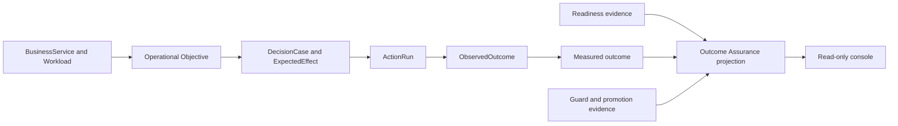

# 결과 Assurance

결과 Assurance는 FDAI를 자율 클라우드 운영 범위 밖으로 넓히지 않으면서 준비도,
성과 정렬, 통제된 확장이라는 전환 프레임을 적용합니다. 복원력, 변경 안전성,
비용 거버넌스의 기존 운영 목표, 액션, 결과, 준비도 보고서, 가드 근거를 하나의
읽기 전용 변환 결과로 구성합니다.

> **범위:** 이 설계는 FDAI 컨트롤 플레인 준비도와 측정된 클라우드 운영 성과를
> 다룹니다. 인력 관리, 교육, CRM, 전사 포트폴리오 관리, 공급업체 평가 또는 범용
> transformation platform은 추가하지 않습니다.

> **계약 위치:** `OutcomeAssuranceProjection`은 읽기 모델이며 새로운 온톨로지 객체나
> 결정 권한이 아닙니다. 기존 출처가 계속 권한이며, 누락된 근거는 사용 불가로
> 유지됩니다.

## 한눈에 보는 설계

FDAI는 서비스가 보호해야 할 목표, 검토한 액션, 실제 실행, 관측된 결과를 이미
기록합니다. 결과 Assurance는 이 사실을 세 가지 운영자 질문으로 연결합니다.

1. **운영 준비도:** FDAI가 이 범위를 관찰, 결정, 복구, 감사, 측정할 준비가 되었습니까?
2. **목표 정렬:** 각 FDAI 작업 흐름과 액션은 어떤 운영 목표를 보호했고, 측정된 효과는
 그 목표를 개선했습니까?
3. **통제 보증:** 결과가 정책, 승인, 롤백, 승격 guardrail 안에 머물렀습니까?



## 범위 경계

이 프레임은 FDAI의 도메인 경계를 유지하면서 고객이 이해할 수 있는 언어를 사용합니다.

| 외부 프레임 | FDAI에서의 의미 | 근거 예시 |
|-------------|------------------|---------------|
| AI 준비 상태 | 통제된 자율 클라우드 운영을 위한 준비도 | onboarding, 텔레메트리, detection, 롤백, 감사, 소유권, 승격 게이트 |
| High-impact outcomes | FDAI 작업 흐름이 보호하는 운영 목표 | SLO, RTO/RPO, 변경 안전성, 단위 비용, human touchpoint |
| 통제된, secure, scalable | 기존 컨트롤 플레인 안전 및 확장 계약 | 정책 escape, 승인 분리, 영향 범위, cell 상태, 재생 |

네 가지 성과 관점은 외부 시스템에 대한 권한을 주장하지 않으면서 프레임을 구체화합니다.

| 관점 | FDAI 소유 해석 | 주요 측정값 |
|------|----------------|-------------|
| Operators | 운영 toil과 대기 감소 | 이벤트 100개당 human touchpoint, 승인 대기, 수동 롤백 수 |
| 서비스 users | 서비스 영향 감소 | MTTR, SLO burn, 설정된 출처가 있을 때 customer-impact 소요 시간 |
| Operating 프로세스 | 더 빠르고 안전한 운영 흐름 | 변경 lead 시간, auto-resolution, 변경 실패 비율 |
| 통제된 learning | 검증된 운영 지식 재사용 | candidate-to-promotion conversion, recurrence, pattern reuse |

콘솔은 이 라벨을 설명에만 사용합니다. FDAI는 클라우드 텔레메트리에서 직원 생산성,
고객 만족도, 매출 또는 혁신 가치를 추론하지 않습니다.

## 재사용하는 도메인 모델

`TransformationInitiative`, employee, customer 또는 enterprise portfolio 객체를 추가하지
않습니다. 변환 결과는 기존 operating 온톨로지를 따릅니다.

```text
BusinessCapability
 -> BusinessService / Workload
 -> ServiceObjective / RecoveryObjective / CostObjective / ArchitectureConstraint
 -> DecisionCase -> ActionOption -> ExpectedEffect
 -> ActionRun -> ObservedOutcome
```

작업 흐름과 ActionType 식별자가 자동화 귀속을 제공합니다. 감사와 측정
기록이 실행 및 효과 근거를 제공합니다. 배포별 서비스, 워크로드, 목표, 소유권
대응은 다운스트림 구성에 남습니다.

## 변환 결과 계약

`OutcomeAssuranceProjection`은 하나의 범위, 측정 구간, 선택적 버티컬에 대해
생성됩니다. 권한을 복사하지 않고 참조와 집계만 포함합니다.

| 필드 그룹 | 필수 내용 | 정본 |
|-------------|-----------|-----------------|
| `scope` | 범위 참조, 서비스/워크로드 참조, 버티컬 | operating 온톨로지 변환 결과 |
| `window` | 시작, 종료, scenario-set 버전 | 측정 실행 |
| `readiness` | 분류 기준 상태, 근거 참조, 최신성 | onboarding, 시작, operational, detection, 승격 준비 상태 |
| `alignment` | 목표 참조, 작업 흐름과 ActionType 귀속, 커버리지 | DecisionCase, 감사, 온톨로지 링크 |
| `outcomes` | 현재, 기준선, 대상, 단위, 샘플 크기, 확신도 간격 | 측정 파이프라인 |
| `guards` | 임계값, 관찰된 값, 통과 상태, 근거 참조 | 가드 및 승격 evaluation |
| `provenance` | 출처 이름, as-of 시간, synthetic 플래그 | contributing 변환 결과 |

### 근거 상태

변환 결과는 하나의 maturity 점수 대신 제한된 상태 집합을 사용합니다.

| 축 | 상태 | 규칙 |
|------|------|------|
| 준비 상태 분류 기준 | `unknown`, `blocked`, `observed`, `ready` | `ready`는 최신 근거와 모든 필수 게이트 통과가 필요합니다 |
| 목표 귀속 | `unattributed`, `partial`, `attributed` | finalized-event 귀속 커버리지를 기준으로 합니다 |
| 결과 근거 | `not_connected`, `insufficient_sample`, `measured`, `regressed` | measurement-first evaluation을 따릅니다 |
| 컨트롤 assurance | `unknown`, `blocked`, `attention`, `healthy` | 정책 escape가 하나라도 있으면 `blocked`입니다 |

전체 응답은 네 축을 별도로 보고합니다. 차단 요인을 숨길 수 있는 평균 점수를 만들지
않습니다. Stale 근거는 해당 분류 기준을 `unknown`으로 바꾸며, 이전 `ready` 상태를 이어받지
않습니다.

### 목표 귀속

성과 주장에 포함되는 모든 finalized 액션은 다음 체인을 해석하는 것이 좋습니다.

```text
event_id -> decision_case_id -> protected_objective_ref
   -> action_type_id -> action_run_id -> observed_outcome_ref
   -> measurement observation
```

해결되지 않은 링크는 unattributed 이벤트로 denominator에 남습니다. 변환 결과는
`attributed_events`, `unattributed_events`, `coverage`를 보고하며 ActionType 이름이나 UI
category로 목표를 추정하지 않습니다.

## 준비도 분류 기준

결과 Assurance는 또 하나의 게이트를 만들지 않고 기존 준비 상태 소유자를 조합합니다.

| 분류 기준 | 통과 근거 | 차단 예시 |
|-------|---------------|---------------|
| Platform | 필수 리소스와 역할 연결 관측 | 상태 저장소, 이벤트 버스, 실행기 신원 누락 |
| 근거 | 텔레메트리와 인벤토리 출처 연결 및 최신성 충족 | stale 목표, 사용 불가 텔레메트리, 불완전한 인벤토리 |
| Detection | 필수 detection dimension 준비된 | SLO 또는 detector 근거 누락, stale 스냅샷 |
| 액션 안전성 | stop, 롤백, 영향 범위, dry 실행, 잠금, 멱등성, 감사 수명 주기 | safeguard 또는 필수 의존성 누락 |
| Operational 인계 | 적용 가능한 준비 상태 보고가 clear | 차단 정책, reliability, 소유권, RBAC 발견 사항 |
| 측정 | 기준선과 treatment가 동일한 시나리오 집합 사용 | synthetic 출처, 누락된 기준선, insufficient 샘플 |
| 승격 | ActionType별 게이트 통과 | 정책 escape, 가드 회귀, 관측 근거 공백 |

준비 상태는 범위별이며 시간 제한이 있습니다. 워크로드가 변경 안전성에는 준비된여도 비용
거버넌스는 사용 불가일 수 있습니다. 새 ActionType이 관찰 모드에 남아 있어도 전체
platform을 차단된으로 표시하지 않습니다.

## 에이전트 소유권

고정된 15-agent pantheon은 현재 권한을 유지합니다. 변환 결과 서비스는 기계적인 읽기 담당이며
agent-owned 객체 토픽을 publish하지 않습니다.

| 에이전트 | 결과 Assurance 책임 |
|-------|--------------------------|
| Huginn | 기존 토픽을 통해 정규화된 이벤트와 토폴로지 관측을 공급합니다 |
| Heimdall | 독립적인 operational 효과와 detection 준비 상태를 close합니다 |
| Njord | 비용 관측과 비용 목표 상태를 공급합니다 |
| Forseti | 결정 맥락에 protected 목표와 예상 효과를 기록합니다 |
| Odin | 복원력, 변경 안전성, 비용 거버넌스 목표 사이 충돌을 중재합니다 |
| Thor와 Vidar | 액션과 롤백 증적을 공급합니다 |
| Var | 독립적인 human 승인 근거를 공급합니다 |
| Saga | 변경할 수 없는 감사와 재생 참조를 공급합니다 |
| Muninn | time-consistent 맥락과 사례 개정 번호를 공급합니다 |
| Norns와 Mimir | 후보, pattern, 승격 수명 주기 근거를 공급합니다 |
| Bragi | 운영자 로케일로 인용된 변환 결과 필드를 설명하며 상태를 변경하지 않습니다 |

## Operator API와 콘솔

Operator API는 선택적이고 인증된 읽기 패널로 `GET /kpi/outcome-assurance`를 추가합니다. 주입된
변환 결과 출처를 직접 조회하며, 다른 HTTP 패널 경로를 호출하거나 전달 계층에서
누락된 사실을 만들지 않습니다.

권장 조회 매개변수는 `scope_ref`, `vertical`, `window`입니다. 응답은 위 변환 결과
그룹과 좁은 근거 링크를 제공합니다. Interactive 로컬과 deployed 환경은 동일한
truth 계약을 따릅니다. 연결되지 않은 측정 출처는 demo 값 대신
`not_connected`를 반환합니다.

콘솔은 현재 information 아키텍처를 재사용합니다.

- **개요:** Operational 준비 상태, 목표 alignment, 컨트롤 assurance의 세 linked 요약을 제공합니다.
- **Operating outcomes:** 목표별 기준선, treatment, 귀속 커버리지, 근거 기록을 제공합니다.
- **컨트롤 assurance:** 준비 상태 분류 기준, 실패한 가드, 승격 상태, 승인 근거를 제공합니다.
- **Verticals:** 동일한 변환 결과를 복원력, 변경 안전성, 비용 거버넌스로 필터링합니다.

새 top-level transformation workspace는 추가하지 않습니다. 모든 값은 가장 좁은
준비 상태, 목표, 감사, 인시던트, 액션, 승격 경로로 연결합니다. 누락된 값도
clickable 상태를 유지하고 어떤 출처가 없는지 설명합니다.

## 측정 및 결정 규칙

성과 주장은 기존 measurement-first 계약을 따릅니다.

- 기준선과 treatment는 동일한 고정된 시나리오 집합과 구간을 사용합니다.
- 각 메트릭은 단위, 샘플 크기, 확신도 간격, 출처 시간을 보고합니다.
- 재시도와 corrected 행은 이벤트별 최신 권위 있는 관측을 사용합니다.
- 성공 메트릭은 실패한 가드를 상쇄할 수 없습니다.
- Policy-violation escape는 정확히 0을 유지합니다.
- Synthetic 예시는 테스트와 mock에서만 허용되며 measured 상태를 만들 수 없습니다.

Odin은 중재를 위해 목표 점수 입력을 비교할 수 있지만 읽기 변환 결과는
business 값을 순위하거나 결정을 변경하지 않습니다. 목표 priority와 대상 값은
구성이 설정합니다.

## 제공 순서

### OA0 - 변환 결과 계약

- 타입이 지정된 읽기 모델, 제한된 근거 상태, decoder 테스트를 정의합니다.
- 권한 객체를 추가하지 않고 온톨로지 참조와 측정 기록을 재사용합니다.
- Unattributed 이벤트를 denominator에 고정합니다.

### OA1 - 권위 있는 출처

- 실제 측정, 준비 상태, 가드, 귀속 프로바이더를 연결합니다.
- 해당 결과 경로에서 synthetic interactive 기본값을 제거합니다.
- 변환 결과 테스트로 최신성과 correction 동작을 검증합니다.

### OA2 - 읽기 전용 경험

- 인증된 읽기 패널과 콘솔 요약을 추가합니다.
- 사용 불가 상태를 포함한 목표 및 근거 drill-down을 추가합니다.
- 영문/한글 라벨과 로컬/deployed 동등성을 검증합니다.

### OA3 - 변경 안전성 pilot

- 대응된 서비스 또는 워크로드 하나와 고정된 시나리오 집합을 선택합니다.
- 변경 lead 시간과 human touchpoint를 기준선 대비 측정합니다.
- 변경 실패 비율과 롤백 비율이 기준선 이하이고 정책 escape가 0이어야 합니다.

### OA4 - 버티컬 확장

- MTTR과 복구 근거가 독립적으로 close된 후 복원력을 추가합니다.
- Realized 절감과 unit-cost 귀속이 권위 있는한 후 비용 거버넌스를 추가합니다.
- 목표 근거가 불완전하면 cross-vertical 중재를 human 승인에 둡니다.

## 수락 기준

첫 운영 구획은 다음 조건을 만족하면 완료됩니다.

- 표시되는 모든 점유가 non-synthetic이며 권위 있는 근거로 연결됩니다.
- Finalized pilot 이벤트의 95% 이상이 목표로 해석되고 나머지도 표시됩니다.
- 준비 상태 분류 기준은 stale, 누락된, conflicting 근거에서 실패 시 차단합니다.
- 기준선과 treatment가 scenario-set 버전을 공유하고 확신도 간격을 보고합니다.
- 변경 실패 비율과 롤백 비율이 기준선을 초과하지 않습니다.
- Policy-violation escape가 0입니다.
- Console에 변경 경로가 추가되지 않고 Bragi가 projected 상태를 변경할 수 없습니다.
- 재생이 동일 기준 시점과 카탈로그 버전에 대해 동일 변환 결과를 재구성합니다.

## 비목표

- 직원 스킬, training 또는 workforce maturity 관리.
- CRM, NPS, revenue, product 도입 또는 customer-success analytics.
- 전사 AI initiative funding 또는 portfolio 관리.
- FDAI 컨트롤 밖의 범용 compliance-framework 또는 vendor-risk 관리.
- 새 pantheon 에이전트, 역할 transfer 또는 두 번째 결정 파이프라인.
- Composite 준비 상태 또는 transformation 점수.

## 관련 문서

| 알아볼 내용 | 읽을 문서 |
|-------------|-----------|
| KPI 권한과 기준선 규칙 | [goals-and-metrics-ko.md](goals-and-metrics-ko.md) |
| 기존 목표와 결과 모델 | [operating-ontology-ko.md](operating-ontology-ko.md) |
| 액션 안전성과 승격 계약 | [action-ontology-ko.md](../decisioning/action-ontology-ko.md) |
| Dev-to-ops 준비 상태 근거 | [operational-readiness-ko.md](../operations/operational-readiness-ko.md) |
| 읽기 전용 콘솔 경계 | [operator-console-ko.md](../interfaces/operator-console-ko.md) |
