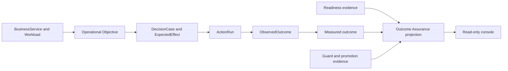

# Outcome Assurance

Outcome Assurance applies the transformation framing of readiness, outcome alignment, and
governed scale to FDAI without widening FDAI beyond autonomous cloud operations. It defines one
read-only projection over existing operational objectives, actions, outcomes, readiness reports,
and guard evidence for Resilience, Change Safety, and Cost Governance.

> **Scope:** This design covers FDAI control-plane readiness and measured cloud-operations
> outcomes. It does not add workforce management, training, CRM, enterprise portfolio management,
> vendor assessment, or a general-purpose transformation platform.

> **Contract position:** `OutcomeAssuranceProjection` is a read model, not a new ontology object or
> decision authority. Existing sources remain authoritative, and missing evidence remains
> unavailable.

## Design at a glance

FDAI already records what a service is expected to protect, what action was considered, what ran,
and what outcome was observed. Outcome Assurance joins those facts into three operator questions:

1. **Operational readiness:** Is FDAI ready to observe, decide, recover, audit, and measure this scope?
2. **Objective alignment:** Which operational objective did each FDAI workflow and action protect,
   and did the measured effect move that objective?
3. **Control assurance:** Did the result stay inside policy, approval, rollback, and promotion guardrails?



## Implementation status

### Implementation scope

| Area | State | Evidence | Notes |
|------|-------|----------|-------|
| Reused ontology, readiness, audit, and measurement sources | in-progress | `core/decision_case/`; `core/readiness/`; `core/measurement/`; `core/audit/`; current implementation ledgers in their owner documents | Source capabilities exist at different evidence levels, but they are not joined into one Outcome Assurance projection. |
| `OutcomeAssuranceProjection` typed read model | not-started | [Projection contract](#projection-contract); no matching implementation under `services/` | The design defines bounded groups and evidence states. No canonical contract, decoder, or replay implementation is present. |
| Objective attribution and aggregate evaluation | not-started | [Objective attribution](#objective-attribution) | No aggregator currently closes the complete event-to-objective-to-outcome chain or retains unattributed events in this projection's denominator. |
| Authenticated Operator API and Console experience | not-started | [Operator API and console](#operator-api-and-console); no matching route or Console module under `services/operator-service/` or `console/` | The proposed read-only endpoint, summaries, evidence drill-downs, and unavailable states are not implemented. |
| Change Safety pilot and vertical expansion | not-started | [Delivery sequence](#delivery-sequence) | OA0-OA2 must land before a non-synthetic OA3 pilot or OA4 expansion can produce evidence. |

### Implementation history

| Date | State | Change | Evidence | Remaining |
|------|-------|--------|----------|-----------|
| 2026-08-14 | not-started | Adopted the implementation ledger without reconstructing earlier provenance and recorded the projection as design-only over partially implemented source systems. | `current change`; repository search for the contract, API route, and Console surface plus the source owner documents cited above. | Deliver OA0 through OA2 before starting the pilot and vertical expansion. |

### Remaining work

- [ ] Define and test the typed `OutcomeAssuranceProjection`, bounded evidence states, correction rules, and deterministic replay without adding an authority object.
- [ ] Implement the complete objective-attribution join and keep unresolved finalized events in the denominator with explicit coverage.
- [ ] Bind authenticated authoritative sources, add the read-only Operator API and Console drill-downs, and prove missing or stale data renders unavailable rather than synthetic.
- [ ] Run the Change Safety pilot on one pinned service and scenario set, then expand only after the acceptance criteria have authoritative non-synthetic evidence.

## Scope boundary

The framing uses customer language while preserving FDAI's domain boundary.

| External framing | FDAI meaning | Evidence examples |
|------------------|--------------|-------------------|
| AI readiness | Readiness for governed autonomous cloud operations | onboarding, telemetry, detection, rollback, audit, ownership, promotion gates |
| High-impact outcomes | Operational objectives protected by FDAI workflows | SLO, RTO/RPO, change safety, unit cost, human touchpoints |
| Governed, secure, scalable | Existing control-plane safety and scale contracts | policy escapes, approval separation, impact scope, cell health, replay |

Four outcome lenses keep the framing concrete without claiming authority over external systems:

| Lens | FDAI-owned interpretation | Primary measures |
|------|---------------------------|------------------|
| Operators | Reduced operational toil and waiting | human touchpoints per 100 events, approval wait, manual rollback count |
| Service users | Reduced service impact | MTTR, SLO burn, customer-impact duration when a configured source exists |
| Operating process | Faster and safer operating flow | change lead time, auto-resolution, change failure rate |
| Governed learning | Reuse of verified operating knowledge | candidate-to-promotion conversion, recurrence, pattern reuse |

The console uses these labels as explanations only. FDAI does not infer employee productivity,
customer satisfaction, revenue, or innovation value from cloud telemetry.

## Reused domain model

No `TransformationInitiative`, employee, customer, or enterprise portfolio object is added. The
projection follows the existing operating ontology:

```text
BusinessCapability
  -> BusinessService / Workload
  -> ServiceObjective / RecoveryObjective / CostObjective / ArchitectureConstraint
  -> DecisionCase -> ActionOption -> ExpectedEffect
  -> ActionRun -> ObservedOutcome
```

Workflow and ActionType identifiers provide the automation attribution. Audit and measurement
records provide execution and effect evidence. Deployment-specific service, workload, objective,
and ownership mappings remain downstream configuration.

## Projection contract

`OutcomeAssuranceProjection` is produced for one scope, measurement window, and optional vertical.
It contains references and aggregates, never copied authority.

| Field group | Required content | Source of truth |
|-------------|------------------|-----------------|
| `scope` | scope ref, service/workload refs, vertical | operating ontology projection |
| `window` | start, end, scenario-set version | measurement run |
| `readiness` | facet states, evidence refs, freshness | onboarding, startup, operational, detection, promotion readiness |
| `alignment` | objective refs, workflow and ActionType attribution, coverage | DecisionCase, audit, ontology links |
| `outcomes` | current, baseline, target, unit, sample size, confidence interval | measurement pipeline |
| `guards` | threshold, observed value, pass state, evidence ref | guard and promotion evaluation |
| `provenance` | source names, as-of time, synthetic flag | contributing projections |

### Evidence states

The projection uses bounded states rather than one maturity score.

| Axis | States | Rule |
|------|--------|------|
| Readiness facet | `unknown`, `blocked`, `observed`, `ready` | `ready` requires current evidence and every required gate to pass |
| Objective attribution | `unattributed`, `partial`, `attributed` | based on finalized-event attribution coverage |
| Outcome evidence | `not_connected`, `insufficient_sample`, `measured`, `regressed` | measurement-first evaluation |
| Control assurance | `unknown`, `blocked`, `attention`, `healthy` | any policy escape is `blocked` |

An overall response reports the four axes separately. It does not average them into a score that
could hide a blocker. Stale evidence changes the affected facet to `unknown`; it never carries a
prior `ready` state forward.

### Objective attribution

Every finalized action included in an outcome claim should resolve this chain:

```text
event_id -> decision_case_id -> protected_objective_ref
         -> action_type_id -> action_run_id -> observed_outcome_ref
         -> measurement observation
```

Unresolved links remain in the denominator as unattributed events. The projection reports
`attributed_events`, `unattributed_events`, and `coverage`; it does not assign an objective from an
ActionType name or UI category.

## Readiness facets

Outcome Assurance composes existing readiness owners instead of creating another gate.

| Facet | Passing evidence | Blocking examples |
|-------|------------------|-------------------|
| Platform | required resources and role bindings observed | missing state store, event bus, executor identity |
| Evidence | telemetry and inventory sources connected and fresh | stale objective, unavailable telemetry, incomplete inventory |
| Detection | required detection dimensions ready | missing SLO or detector evidence, stale snapshot |
| Action safety | stop, rollback, impact scope, dry run, lock, idempotency, audit lifecycle | missing safeguard or hard dependency |
| Operational handoff | applicable readiness report is clear | blocking policy, reliability, ownership, or RBAC finding |
| Measurement | baseline and treatment use the same scenario set | synthetic source, missing baseline, insufficient sample |
| Promotion | per-ActionType gate passes | policy escape, guard regression, observation evidence gap |

Readiness is scope-specific and time-bounded. A workload can be ready for Change Safety while Cost
Governance remains unavailable, and a new ActionType can remain in observation mode without
marking the whole platform blocked.

## Agent ownership

The fixed 15-agent pantheon keeps its current authority. The projection service is a mechanical
reader and does not publish agent-owned object topics.

| Agent | Outcome Assurance responsibility |
|-------|----------------------------------|
| Huginn | supplies normalized event and topology observations through existing topics |
| Heimdall | closes independent operational effects and detection readiness |
| Njord | supplies cost observations and cost objective status |
| Forseti | records protected objectives and expected effects in the decision context |
| Odin | arbitrates conflicts among Resilience, Change Safety, and Cost Governance objectives |
| Thor and Vidar | supply action and rollback receipts |
| Var | supplies independent human approval evidence |
| Saga | supplies immutable audit and replay references |
| Muninn | supplies time-consistent context and case revisions |
| Norns and Mimir | supply candidate, pattern, and promotion lifecycle evidence |
| Bragi | explains cited projection fields in the operator locale and never changes status |

## Operator API and console

The Operator API adds `GET /kpi/outcome-assurance` as an optional, authenticated read panel. It queries
injected projection sources directly; it does not call other HTTP panel routes or construct missing
facts in the delivery layer.

Recommended query parameters are `scope_ref`, `vertical`, and `window`. The response carries the
projection groups above plus narrow evidence links. Interactive local and deployed environments
follow the same truth contract: an unbound measurement source returns `not_connected`, never demo
values.

Semantic request and result projections may share one physical Event Hub through typed logical
topics. The transport marker is removed before result decoding, so evidence references, freshness,
verification state, and authority remain properties of the versioned projection rather than the
broker envelope. POST streams wait for that durable projection through the request deadline and
close a missing result as a typed hold without changing outcome authority. Explicit JSONB text
parameter types preserve the same projection meaning in real PostgreSQL execution.

The console reuses its current information architecture:

- **Overview:** three linked summaries for Operational readiness, Objective alignment, and Control assurance.
- **Operating outcomes:** objective-level baseline, treatment, attribution coverage, and evidence records.
- **Control assurance:** readiness facets, failed guards, promotion status, and approval evidence.
- **Verticals:** the same projection filtered to Resilience, Change Safety, or Cost Governance.

No new top-level transformation workspace is added. Every value links to the narrowest owning
readiness, objective, audit, incident, action, or promotion route. Missing values remain clickable
and explain which source is absent.

## Measurement and decision rules

Outcome claims follow the existing measurement-first contract:

- Baseline and treatment use the same frozen scenario set and window.
- Each metric reports unit, sample size, confidence interval, and source time.
- Retries and corrected rows use the latest authoritative observation per event.
- A success metric cannot offset a failed guard.
- Policy-violation escapes remain exactly zero.
- Synthetic examples are allowed in tests and mocks only and cannot produce a measured status.

Odin may compare objective score inputs for arbitration, but the read projection never ranks
business value or changes a decision. Configuration sets objective priority and target values.

## Delivery sequence

### OA0 - Projection contract

- Define the typed read model, bounded evidence states, and decoder tests.
- Reuse ontology refs and measurement records without adding authority objects.
- Pin unattributed events in the denominator.

### OA1 - Authoritative sources

- Bind real measurement, readiness, guard, and attribution providers.
- Remove the synthetic interactive default from the affected outcome path.
- Prove freshness and correction behavior with projection tests.

### OA2 - Read-only experience

- Add the authenticated read panel and console summaries.
- Add objective and evidence drill-downs with unavailable states.
- Verify English and Korean labels and local/deployed parity.

### OA3 - Change Safety pilot

- Select one mapped service or workload and a frozen scenario set.
- Measure change lead time and human touchpoints against baseline.
- Require change failure rate and rollback rate at or below baseline and zero policy escapes.

### OA4 - Vertical expansion

- Add Resilience only after MTTR and recovery evidence close independently.
- Add Cost Governance only after realized savings and unit-cost attribution are authoritative.
- Keep cross-vertical arbitration in human approval when objective evidence is incomplete.

## Acceptance criteria

The first production slice is complete when:

- every displayed claim is non-synthetic and links to authoritative evidence;
- at least 95% of finalized pilot events resolve to an objective, with the remainder visible;
- readiness facets fail closed on stale, missing, or conflicting evidence;
- baseline and treatment share a scenario-set version and report confidence intervals;
- change failure and rollback rates do not exceed baseline;
- policy-violation escapes equal zero;
- the console adds no mutation path and Bragi cannot alter a projected state;
- replay reconstructs the same projection for the same cutoff and catalog versions.

## Non-goals

- Employee skill, training, or workforce maturity management.
- CRM, NPS, revenue, product adoption, or customer-success analytics.
- Enterprise AI initiative funding or portfolio management.
- Generic compliance-framework or vendor-risk management outside FDAI controls.
- New pantheon agents, role transfers, or a second decision pipeline.
- A composite readiness or transformation score.

## Related docs

| To learn about | Read |
|----------------|------|
| KPI authority and baseline rules | [goals-and-metrics.md](goals-and-metrics.md) |
| Existing objective and outcome model | [operating-ontology.md](operating-ontology.md) |
| Action safety and promotion contract | [action-ontology.md](../decisioning/action-ontology.md) |
| Dev-to-ops readiness evidence | [operational-readiness.md](../operations/operational-readiness.md) |
| Read-only console boundaries | [operator-console.md](../interfaces/operator-console.md) |
