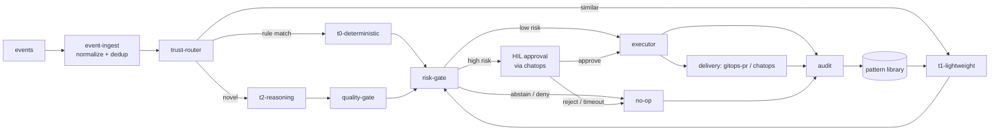

# 프로젝트 구조

이 시스템은 하나의 웹 앱이 아니라 **headless 컨트롤 플레인 + 얇은 콘솔 + ChatOps** 입니다
([app-shape.instructions.md](../../../.github/instructions/app-shape.instructions.md) 참조).
저장소 레이아웃은 그 형상을 미러링하며 코어 엔진을 UI-agnostic하고 이식 가능하게 유지합니다.
모듈 이름과 컨트롤 루프는
[architecture.instructions.md](../../../.github/instructions/architecture.instructions.md) 를
따릅니다.

## 모노레포 레이아웃

```text
fdai/
├── src/fdai/            # Python (3.12+, src-layout); 모노레포 전체가 하나의 언어
│   ├── core/                  # headless 컨트롤 플레인 (UI 없음, 클라우드 SDK 직접 import 없음). G-1 phase 1 (트래커 #14) 이 core 서브시스템 위에 도메인 그룹 파사드를 도입했다: `pipeline/` (event_ingest, trust_router, tiers, quality_gate, risk_gate, hil_resume, executor, audit, control_loop), `incident/` (rca, slo, runbook, postmortem, oncall, irp, investigation, chaos, capacity), `operator/` (conversation, operator_memory, working_context, rbac, notifications, report_feed), `knowledge/` (prompts, tools, web_search, capability_catalog, rule_catalog_profiles, ontology_explorer), `platform/` (scheduler, metering, measurement, security, reporting, onboarding, workflow, detection, deploy_preflight, assurance_twin), 그리고 `verticals/` (G-6). Phase 1 은 additive - `from fdai.core.<subsystem> import X` 와 `from fdai.core.<domain> import <subsystem>` 둘 다 resolve. Phase 2 (연기) 는 물리적 `git mv` 대량 이동.
│   │   ├── event_ingest/       # 버스 컨슈머; 이벤트 스키마로 정규화; idempotency key로 dedup; 관련 이벤트를 인시던트로 상관 연결
│   │   ├── trust_router/       # 계산된 신뢰도로 각 이벤트를 T0 | T1 | T2 로 라우팅
│   │   ├── tiers/
│   │   │   ├── t0_deterministic/    # deterministic-engine: policy, checklist, what-if, drift eval
│   │   │   ├── t1_lightweight/      # 임베딩 유사도, 학습된 액션 재사용, 소형 모델 분류; non-finite reuse evidence는 abstain
│   │   │   └── t2_reasoning/        # 신규/모호 케이스에만 사용하는 프론티어 모델 추론
│   │   ├── prompts/            # catalog-as-code 프롬프트 컴포저 (`rule-catalog/prompts/` 로드, T2에 공급)
│   │   ├── tools/              # T2 툴 카탈로그 레지스트리 + `ToolExecutor` (shadow-mode 게이팅)
│   │   ├── web_search/         # 최후 수단 웹 검색 seam (`NoOpWebSearchProvider` 기본; 도메인 allowlist + sanitizer)
│   │   ├── browser_evidence/   # 읽기 전용 origin/DNS policy, redaction, immutable artifact, custody, shadow comparison
│   │   ├── operator_memory/    # HIL 승인된 오퍼레이터 메모리를 untrusted `<operator_note>` 데이터로 주입
│   │   ├── learning/           # 동의 기반 off-path turn eligibility, consensus, dedup ledger, 비활성 proposal routing
│   │   ├── trajectory/         # authorization-first observable trajectory projection, version policy, reviewed aggregate, offline validation
│   │   ├── task_worker/        # 격리된 depth-one 읽기 전용 worker: capability 축소, lifecycle, 영구 state, parent synthesis
│   │   ├── background_task/    # 영구 detached 읽기 전용 session: lease/CAS, progress, cancellation, process-loss, completion handoff
│   │   ├── read_investigation/ # Exact-resource VM/network planning, evidence correlation, latency policy, semantic progress. Cloud SDK와 execution authority 없음
│   │   ├── briefing/           # report-feed evidence 기반 결정적 opening/scheduled briefing
│   │   ├── scheduler/          # create/pause/resume/edit/run-now/cancel lifecycle, cron dispatch, run history, blueprint, 범위 제한 continuation
│   │   ├── document_ingestion/ # upload-session lifecycle + fail-closed scan/protection/extract/index worker
│   │   ├── working_context/    # 턴당 경계 프롬프트 조립: 불변 selection policy + 필수 validator + shadow evidence/replay + planner/orchestrator fold + summarizer/retriever seam
│   │   ├── quality_gate/       # mixed-model 교차 검사, verifier, grounding; 실패한 fan-out은 sibling을 cancel+drain (T2 방어)
│   │   ├── rca/                # 루트 원인 분석 (T0 deterministic + seam 뒤의 T2 reasoner; grounding-gated)
│   │   ├── risk_gate/          # 통합 authority: 리스크 스코어 + auto vs HIL vs deny; malformed promotion metric 거부 + 4개 안전 불변식 강제
│   │   ├── rbac/               # 리드 API 를 위한 사람 RBAC (5개 롤 매트릭스, resolver, enforcer)
│   │   ├── hil_resume/         # HIL 승인 라운드트립: park, 채널로 push, 결정 시 resume
│   │   ├── executor/           # 리소스별 락, 딜리버리 어댑터로 멱등 적용
│   │   ├── execution_backend/  # profile intersection, durable lifecycle coordination, shadow probe; 판단 authority 없음
│   │   ├── audit/              # append-only 해시 체인 감사 로그 + KPI/메트릭 발행
│   │   ├── notifications/      # notifications matrix 위에 얹은 채널 라우팅 레이어
│   │   ├── detection/          # 아웃-오브-밴드 anomaly / forecast 파인딩 프로듀서 (event-ingest 로 재진입)
│   │   ├── incident/           # 인시던트 라이프사이클 레지스트리 + 상태 머신 (open → triaging → mitigated → resolved → closed)
│   │   ├── slo/                # 워크로드 SLO / burn-rate 평가기 (컨트롤 플레인 SLO 와는 구분)
│   │   ├── runbook/            # 런북 오케스트레이터 (선형 시퀀스 + on-failure 브랜치)
│   │   ├── workflow/           # version-pinned WorkflowDefinition + principal WorkflowBinding 컴파일; 승인 플래너 + shadow 오케스트레이터 + 트리거 인덱스 + 이벤트 코디네이터
│   │   ├── python_task/         # generated multi-file PythonTask artifact 및 reviewed programmatic pipeline static validation; task code 를 import 또는 실행하지 않음
│   │   ├── programmatic_pipeline/ # capability-scoped read-only tool loop: immutable contract, broker, receipt, compact result, deterministic benchmark
│   │   ├── postmortem/         # LLM 옵션 postmortem / PIR 드래프트 생성기
│   │   ├── rule_catalog_profiles/  # 프로파일 / 팩 레이어 - 이름 붙은 룰 번들 (`extends` 체인 + overrides)
│   │   ├── measurement/        # Phase-4 지속 측정 (regression, pattern growth, model tracking, latency budget, prompt probe, runners)
│   │   ├── mscp_profile/       # 실행 authority 없는 순수 mscp-operational-v1 provenance, effect verification, cycle guard 및 runtime-integrity policy
│   │   ├── deploy_preflight/   # 배포 전 feasibility 프로브 → grounded readiness 리포트
│   │   ├── assurance_twin/     # 읽기 전용 온톨로지 트윈: text-to-query 리뷰 / Q&A / assessment (제안만, 실행 안 함)
│   │   ├── conversation/       # Operator console 조정, verified principal binding, durable outbound delivery, adapter health 및 busy-input arbitration
│   │   ├── user_context_projection.py  # principal context / workflow binding metadata만 runtime ontology에 projection
│   │   ├── console_request/    # 오퍼레이터 콘솔 write-direction 재요청 정책 (Scenario B deny-override), 순수 함수 `evaluate_operator_rerequest` 하나
│   │   ├── verticals/          # Resilience / Change Safety / Cost Governance (P3 통합 지점); 각 vertical 은 sub-package (G-6) 로 자체 orchestrator + 서브모듈 을 갖고, 공유 `Vertical` Protocol 은 `base.py`, `VerticalRegistry` seam 도 함께
│   │   ├── control_loop/       # P1 파이프라인: `orchestrator.py` (ControlLoop 조립), `_process.py` (순서가 보존된 이벤트 단계), `_fallback.py` (T1/T2), `_execution.py` (거버넌스/리스크/디스패치), `_rca.py` (shadow RCA), `_boundary.py` (감사/알림/stage 어댑터), `models.py` (typed result), `operator_request.py` (authoritative proposal lifecycle), `_helpers.py` (순수 유틸), `stages/` (Stage Protocol 스캐폴드)
│   │   └── ontology_explorer.py    # 로드된 ObjectType / LinkType 카탈로그를 결정론적 Mermaid 로 렌더
│   ├── shared/                # 크로스컷팅; core/ 로부터 import 금지
│   │   ├── contracts/          # models.py + registry.py + validation.py + JSON 스키마들
│   │   │   ├── event/          # event/schema.json
│   │   │   ├── action/         # action/schema.json
│   │   │   ├── rule/           # rule/schema.json
│   │   │   ├── ontology/       # object/link/action 스키마; ObjectType은 lifecycle 기준 + provenance 선언 가능
│   │   │   └── workflow/       # workflow/schema.json (프로세스 자동화 카탈로그)
│   │   ├── ontology/           # 런타임 온톨로지 헬퍼 (ACL, 감사 purposes, purpose taxonomy)
│   │   ├── providers/          # CSP-중립 클라우드 프로바이더 인터페이스 (어댑터가 구현)
│   │   │                       #   event_bus.py, secret_provider.py, state_store.py, execution_backend.py,
│   │   │                       #   workload_identity.py, inventory.py, log_query.py, trace_query.py, incident_platform.py, behavior_knowledge.py, programmatic_pipeline.py + LLM / 채널 / RBAC seam
│   │   │                       # `providers/local/` = process-local transport adapter (`LocalEventBus`, bounded `LocalSseSink`)와 명시적 offline helper (`EnvSecretProvider`, `LocalWorkloadIdentity`, `FileFixtureInventory`);
│   │   │                       # `providers/testing/` = 테스트 스위트 전반에서 쓰이는 인-메모리 페이크 (prod 에서는 바인딩 안 됨)
│   │   ├── streaming/          # `SseBroadcaster` + `StagePublisher`: EventBus 토픽을 SSE 채널로 릴레이
│   │   ├── telemetry/          # 구조화 로깅, 트레이싱, 메트릭 헬퍼
│   │   └── config/             # config 스키마 + 시작 시 검증 (fail-fast)
│   ├── delivery/              # 액션 딜리버리 어댑터 (공유 인터페이스 뒤)
│   │   ├── gitops_pr/          # remediation-pr 어댑터: GitHub App / Azure DevOps, Checks API
│   │   ├── chatops/            # 채널 어댑터 (Teams / Slack / email / webhook / pager / SMS)
│   │   ├── notifications/      # 채널별 sender; sibling `incident_platform/`은 PagerDuty/ServiceNow lifecycle 및 PagerDuty roster adapter 제공
│   │   ├── persistence/        # Conversation binding 및 outbound delivery CAS ledger를 포함한 Postgres / pgvector store
│   │   ├── behavior_knowledge/ # in-memory hybrid behavior index, tracked-source freshness, built-in behavior seed
│   │   ├── pgvector/           # persistent document 및 behavior vector index
│   │   ├── azure/              # bounded log/metric/App Insights trace evidence를 포함한 Azure 전용 adapter (`azure-*` import 허용 트리)
│   │   │                       #   `vm_task.py` 는 Managed Run Command 사용; `container_apps_job_backend.py` 는 pinned Job template만 시작; `llm/python_task_author.py` 는 inert draft 생성
│   │   ├── vm_task/            # planning-only read adapter + ontology ToolExecutor bridge; cloud SDK import 없음
│   │   ├── execution_backend/  # 기존 sandbox authority 위의 bubblewrap 및 VM-task lifecycle adapter
│   │   ├── programmatic_pipeline/ # local isolated child runner; Azure strict submission adapter는 delivery/azure 아래 유지
│   │   ├── browser/             # 선택적 isolated async Playwright evidence capture; GET/HEAD 전용, page handle 없음
│   │   ├── trajectory/         # deterministic JSONL streaming export, quarantine, atomic partial-file cleanup
│   │   ├── chaos/              # `Chaos` runbook 단계가 enforce로 갈 때 쓰는 라이브 카오스 주입 어댑터: `live_injectors.py` (CSP-중립 프리미티브 fan-out) + `chaos_mesh.py` (Chaos Mesh CRD) + `mysql_load.py` (MySQL 벤치마크 부하)
│   │   ├── remediation/        # 직접 API 리메디에이션용 구체 `DirectApiExecutor` (`live_direct_api.py`); Protocol 은 `shared/providers/`에 있음
│   │   ├── read_api/           # 얇은 ASGI - `main.py`가 `routes/`의 HTTP surface module, `streaming/`의 SSE fan-out, 분리된 `dev/` / `production/` wiring을 조립. GET route는 bounded state를 projection하고 POST command route는 governed record 또는 typed proposal을 제출하며 privileged executor를 직접 호출하지 않음
│   │   ├── ingestion_gateway/  # 전용 content-write ASGI: scoped upload 및 governed deletion; optional handover governance는 idempotent draft PR delivery와 signed GitHub merge webhook을 bind
│   │   ├── provisioning/       # surface-A Genesis 부트스트랩: 순수 `terraform_bridge.py` (terraform `-json` → `provision.*`) + `serve.py` harness (`aiter_json_lines` + `pump_provision_events`, I/O 주입, subprocess 없음)
│   │   └── scheduler_tick_cli.py  # cron / Container Apps Job에서 스케줄러 tick을 구동하는 독립 엔트리 포인트
│   ├── rule_catalog/          # rule-catalog 파이프라인 코드
│   │   ├── schema/             # 룰 + 온톨로지 (ObjectType / LinkType / ActionType) 스키마 + 검증
│   │   ├── sources/            # 소스별 컬렉터 (WAF, CIS, OPA, IaC scanners, ...)
│   │   ├── pipeline/           # watch → collect → shadow eval → regression → promote/rollback
│   │   └── codegen/            # 저작 헬퍼 (`new_action_type`, `new_object_type`) - 스캐폴드 생성만, 라이브 카탈로그 변경 안 함
│   ├── agents/                # 판테온 런타임 - 15개 이름있는 에이전트 모듈 (odin / thor / forseti / huginn / heimdall / ...), 타입드 토픽 + 버스, 어댑터 + 레지스트리; [agent-pantheon-ko.md](../agents/agent-pantheon-ko.md) 참조
│   ├── composition/           # composition root 패키지 (G-3, 트래커 #14): `__init__.py` (파사드 + `default_container` + `default_container_from_env`) + `_helpers.py` (Container / LlmBindings / LlmBindingsUnavailableError) + `wire_capabilities.py` (검증된 fork CapabilityBundle installer) + `wire_llm.py` (Azure OpenAI LLM 바인더) + `wire_azure.py` (fork-wire 컨테이너 + `AzureWireOverrides`) + `wire_change_feed.py` (Azure DevOps / GitHub change-feed 팩토리) + `wire_metric_provider.py` (MetricProvider 바인더; `FDAI_MONITOR_WORKSPACE_ID` 세팅 시 Azure Monitor Logs 자동 바인드 - LOC 상한 유지를 위해 `wire_azure`에서 분리, G-4)
│   ├── runtime/               # Norns에 연결되는 durable post-turn review를 포함한 headless lifecycle 및 composition
│   └── __main__.py            # 진입점 (P1 컨트롤 루프 기동)
├── rule-catalog/              # catalog-as-code 데이터 (YAML) - Python 아님; 파이프라인은 src/fdai/rule_catalog/ 에
│   ├── schema/                 # JSON Schema 정의 (데이터)
│   ├── vocabulary/             # canonical CSP-중립 어휘: resource-types.yaml, object-types/, link-types/
│   ├── action-types/           # 업스트림 온톨로지 ActionType 인스턴스 (shadow-default, promotion_gate 필수)
│   ├── action-types-custom/    # 포크 전용 ActionType 추가 (업스트림 CI 에서 deny-list)
│   ├── action-types-overrides/ # 업스트림 ActionType 의 스코프 오버라이드 (≤ resource-group 스코프)
│   ├── profiles/               # 이름 붙은 룰 팩 (업스트림)
│   ├── profiles-overrides/     # profiles 의 포크 오버레이
│   ├── prompts/                # catalog-as-code 프롬프트 조각 (태스크 팩, 툴, 페르소나)
│   ├── remediation/            # remediation-plan 아티팩트
│   ├── operator-console/       # `SystemConsoleTool` descriptor 번들
│   ├── probes/                 # deploy-preflight feasibility 프로브 descriptor
│   ├── catalog/                # 정규화된 룰 (promotion 후, catalog-of-record)
│   ├── collected/              # 정규화 전 원본 업스트림 소스 스냅샷
│   ├── exemptions/             # 시간-바운드 감사된 예외 아티팩트
│   ├── sources/                # 소스별 룰 스냅샷 + provenance
│   ├── llm-registry.yaml       # capability 별 LLM 바인딩 레지스트리 (데이터, composition 시점에 해석)
│   └── risk-classification.yaml # authoritative first-match 리스크 분류 테이블 (risk-classification-ko.md 참조)
├── policies/                  # T0와 verifier가 소비하는 OPA/Rego policy-as-code
├── infra/                     # IaC: Terraform (HCL); 엔트리 커맨드 `terraform apply`
│   ├── modules/
│   │   ├── resource-group/          # rg-fdai; deploy-and-onboard-ko.md 에 따라 CAF 명명
│   │   ├── identity/                # executor 를 위한 user-assigned Managed Identity
│   │   ├── compute/                 # runtime seam - 대안은 형제 폴더에
│   │   │   └── container-apps/      # 기본 (Consumption + KEDA)
│   │   ├── container-registry/      # compute 이미지용 ACR
│   │   ├── state-store/             # audit + KPI + pgvector
│   │   │   └── postgres-flex/       # 기본
│   │   ├── event-bus/               # Kafka 와이어
│   │   │   └── event-hubs-kafka/    # 기본 (Event Hubs, :9093)
│   │   ├── secret-store/            # env + Key Vault reference 브릿지
│   │   │   └── key-vault/           # 기본
│   │   ├── observability/           # Log Analytics + 여기 바인딩된 App Insights
│   │   │   └── log-analytics/       # 기본
│   │   ├── llm/                     # 배포자 스코프 LLM 프로비저닝 (dev-and-deploy parity 계약)
│   │   │   └── azure-openai/        # 기본 Azure OpenAI 디플로이먼트 세트
│   │   ├── measurement-runners/     # 자동 regression + pattern-growth 러너용 Container Apps Jobs
│   │   ├── vm-task-host/             # custom Linux/GPU VM용 cloud-init profile
│   │   ├── vm-task-rbac/             # target-VM-scoped Managed Run Command RBAC
│   │   ├── preflight-toggles/       # preflight blocker 를 Terraform 토글로 매핑하는 피처 플래그 표면
│   │   └── console/                 # 읽기 전용 SPA 를 호스팅하는 Static Web App
│   │       └── static-web-app/      # 기본
│   ├── local/                       # 로컬 개발용 IaC (docker-compose, testcontainers 배선; Azure 에 apply 안 함)
│   └── envs/                        # 환경별 tfvars (git-ignored; 커밋 금지)
│       ├── dev/
│       ├── staging/
│       └── prod/
├── console/                   # 읽기 전용 얇은 SPA (Vite + Preact) - 운영자 보기 + 로컬 표시 설정
│   ├── src/                    # 셸, 패널 레지스트리, GET 전용 클라이언트, 라우트, 브라우저 로컬 환경 설정
│   ├── index.html              # Vite 진입점
│   ├── package.json            # 의존: preact, @azure/msal-browser
│   └── vite.config.ts          # 빌드 → console/dist/ (git-ignored)
├── cli/                       # operator-console CLI (Ink) - 뷰모델 하나, 렌더러 여럿
│   ├── src/view-model/         # 표현 중립 브리핑 계약 + 블록 IR + 빌더
│   ├── src/renderers/          # ink (터미널) / text / slack (Block Kit) / teams (Adaptive Card)
│   ├── src/cli.tsx             # 진입점: 브리핑을 한 번 빌드하고 --surface 별로 렌더
│   └── package.json            # 의존: ink, react (tsx로 실행, 빌드 단계 없음)
├── site/                      # Astro / Starlight 문서 사이트 (docs/**/*.md 를 i18n + 검색으로 렌더)
├── ui/                        # (미래) 정적 UI 킷 (Calm Slate 테마) - placeholder
├── tests/                     # 서브시스템 중심 단위 테스트 + 크로스-서브시스템 회귀 스위트 + 공유 fixture
├── docs/roadmap/              # 이 로드맵과 설계 문서
├── pyproject.toml             # Python 모노레포의 단일 매니페스트
└── .github/                   # instructions/ 와 workflows/ (CI: lint, secret-scan, coverage)
```

> 디렉토리 이름은 정본 어휘(canonical vocabulary)입니다. 모듈 이름은
> [language.instructions.md](../../../.github/instructions/language.instructions.md) 의 도메인
> 용어 (`trust-router`, `deterministic-engine`, `rule-catalog`, `risk-gate`,
> `remediation-pr`, `shadow-mode`, `HIL`) 와 정렬해서 유지하세요. 단위 테스트는 각 서브시스템과
> 테스트는 `tests/core/`, `tests/delivery/`, `tests/agents/`와 관련 root 아래에서 source
> layout을 미러링합니다. 크로스-서브시스템 회귀와 property suite도 같은 최상위 `tests/`
> 트리에 둡니다.

## 모듈 경계(Module Boundaries)

의존 방향은 엄격하게 단방향이며, 위반은 리뷰 블로커입니다.

- **core는 이식 가능**: 어떤 클라우드 SDK도 직접 import 하지 **않습니다**. 클라우드 특이성은
  `shared/providers/` 의 CSP-중립 인터페이스로만 진입하며, 구현은 `delivery/` 와 `infra/`
  에 있고 조립 시점에 주입됩니다. 이렇게 두 번째 클라우드는 어댑터 추가일 뿐이며 `core/` 편집이
  아닙니다.
- **허용된 import**: `shared/`는 `core/`를 import하지 않습니다. `core/`는 `shared/`의
  contract, provider, telemetry, config만 import합니다. `delivery/`는 adapter 경계 뒤에서
  `core/`와 `shared/`를 조립할 수 있고 `composition/`이 모든 layer를 bind합니다. `core/`는
  `delivery/`를 import하지 않으며 browser code는 Python implementation module을 import하지 않습니다.
- **정책과 규칙은 코드 경로가 아닌 데이터**: T0가 런타임에 `rule-catalog/` 엔트리와 `policies/`
  를 로드하므로 규칙/정책 추가에 엔진 변경이 필요 없습니다. 규칙은 의도와 remediation을
  기술하고, 정책은 verifier가 재검사하는 실행 가능한 OPA/Rego입니다. 소스가 이 YAML로 수집·
  정규화되는 방법은
  [rule-catalog-collection-ko.md](../rules-and-detection/rule-catalog-collection-ko.md) 에 있습니다.
- **delivery는 교체 가능**: `gitops-pr` 와 `chatops` 는 하나의 인터페이스 뒤의 어댑터라,
  executor는 추상 액션을 발행하고 어댑터가 그것을 렌더링합니다(remediation-pr, Adaptive Card).
  executor가 유일한 privileged identity를 보유하며 어댑터는 이를 공유하지 않습니다.
- **console에는 privileged identity가 없음**: 상태, 감사, shadow 결과, HIL 큐를 시각화합니다.
  Command surface는 인증된 record 또는 typed proposal을 read API에 제출할 수 있지만 resource
  executor를 직접 호출하지 않습니다. Risk, approval, audit, executor 경계는 server-side에 유지됩니다
  ([security-and-identity-ko.md](security-and-identity-ko.md) 참조).
  탐색 셸은 아이콘 전용 Activity Bar와 다섯 개의 안정적인 영역인 `전체 현황`, `운영`,
  `에이전트`, `거버넌스`, `감사·증적`을 사용합니다. 인접한 Explorer는 선택한 영역에 등록된
  패널을 렌더링합니다. 영어가 기본 표시 언어이며, 한국어 카탈로그는 group id, panel id,
  route를 바꾸지 않고 한국어 레이블을 제공합니다. 운영자는 브라우저 로컬의 계정별 설정에서
  패널 순서를 바꾸거나 숨길 수 있습니다. 아이콘 전용 shell control은 키보드 focus에서 즉시
  열리고 pointer hover에서는 잠시 지연되는 공통 tooltip으로 현지화된 레이블을 표시합니다.
  이 tooltip은 document body portal에 렌더링되고 viewport 안에 머물도록 방향이나 위치를
  조정하며 reduced-motion 설정을 따르므로 브라우저 기본 `title` 표시에 의존하지 않습니다.
  숨김은 탐색 표시에만 적용되므로 직접 route와 검색은
  계속 사용할 수 있고, 현재 활성 패널은 숨길 수 없습니다. 세부 route는 공통 페이지 제목 안에
  간결한 영역 / 패널 계층을 렌더링하여 Explorer를 접어도 맥락을 유지합니다. 영역 루트와 독립
  유틸리티는 계층이 제목을 반복할 뿐인 경우 단일 제목을 유지합니다. 에이전트 영역은 Roster,
  Organization, Activity, Handover 패널 전체에 표시되는 작업 공간 탭 행도 유지합니다. Roster는
  기본 에이전트 보기이며 read API가 반환하지 않은 지표를 만들지 않고 현재 스트림 상태, 현재 작업,
  인시던트 연결, 보고선, 증적 링크를 투영합니다. 필터와 검색은 브라우저 로컬 표시 제어이며,
  또한 runtime binding을 별도로 표시합니다. 11개의 typed EventBus subscriber와 Huginn의 raw-ingress
  subscriber는 대기 상태를 유지하고, Njord와 Freyr는 외부 adapter를 기다리며 Loki는 scheduled
  trigger를 기다립니다. Huginn은 실시간 resource discovery ingress를 소유합니다. Azure create,
  update, delete signal은 canonical event topic으로 들어오고, 주입된 delivery projector가 Azure
  I/O를 agent 내부에 넣지 않은 채 enrichment와 ordered inventory delta 적용을 담당합니다. 전용
  Inventory sync job은 기본 6시간마다 Azure Resource Graph를 조회하고 ARM fallback을 사용해 완전한
  reconciliation snapshot을 원자적으로 promote합니다. Heimdall은 discovery freshness, lag,
  coverage를 관찰하며 로컬 harness는 Azure discovery를 실행하지 않습니다.
  Organization은 Directory와 Org chart 보기를 제공하며, `?view=org`는 실시간 보고 계층의 직접
  링크를 유지하고 각 노드는 해당 에이전트의 런타임 상세 포커스를 엽니다.
  Activity 링크는 선택한 에이전트를 route query에 유지합니다. Activity는 영구 audit timeline보다
  먼저 해당 에이전트의 현재 스트림 상태와 최근 live incident를 표시하므로 audit attribution이
  지연되거나 없어도 활성 에이전트가 빈 화면으로 보이지 않습니다. 로컬 dev mode는 Settings
  바로 위에 `Labs` 영역도 표시하며, production 탐색에서는 이 개발 전용 영역을 생략합니다.

## 리포지토리 스크립트 레이아웃

리포지토리 자동화는 책임에 따라 `scripts/` 아래에 그룹화합니다. 루트 파일로는 레이아웃
README, `verify.sh`, Python 패키지 마커만 유지합니다. 품질 게이트, 무결성 도구, 거버넌스 검사,
카탈로그 유틸리티, 배포 도우미, 일반 자동화는 각각 전용 디렉터리를 사용합니다.
소유권 맵과 배치 규칙은 [scripts/README.md](../../../scripts/README.md)를 참조하세요.

## 구조 CI 게이트

위 경계 규칙을 CI에서 강제하는 네 개의 스크립트가 있으며, 리팩터가 랜딩된 뒤에 드리프트가
슬금슬금 돌아오는 것을 막습니다. 전부 `scripts/quality/architecture/` 아래에 있고 CI 파이프라인과 로컬 pre-push
훅에서 모두 실행됩니다. 상응 문서는
[coding-conventions.instructions.md](../../../.github/instructions/coding-conventions.instructions.md)
에 있습니다.

| 게이트 | 규칙 | 현재 모드 |
|--------|------|-----------|
| [check-core-imports.sh](../../../scripts/quality/architecture/check-core-imports.sh) | `core/` 는 클라우드 SDK, HTTP 클라이언트, `fdai.delivery.*` 를 import 금지 | enforce |
| [check-agents-imports.sh](../../../scripts/quality/architecture/check-agents-imports.sh) | `agents/` 도 같은 집합 금지 | enforce |
| [check-file-loc.sh](../../../scripts/quality/architecture/check-file-loc.sh) | 400 LOC 초과 시 warn, enforce 모드에서 800 초과 시 fail | warn-only |
| [check-subsystem-fanout.sh](../../../scripts/quality/architecture/check-subsystem-fanout.sh) | 한 파일이 `core.*` sibling subsystem 을 8개 이상 import 하면 warn, 15개 이상이면 enforce 모드에서 fail | warn-only |

### 새 게이트 추가

1. 기존 스크립트 패턴을 따라 `scripts/quality/architecture/check-<name>.sh` 를 작성합니다 (환경변수로 warn/fail
   threshold, 앞선 `#` 정당성 코멘트를 요구하는 allowlist, stale 엔트리 거부,
   GitHub Actions 어노테이션, `CHECK_QUIET=1` 요약 모드).
2. 현재 트리를 깨지 않도록 **warn-only** 로 배포합니다.
3. `.github/workflows/ci.yml` 에 잡을 추가하고 `.githooks/pre-push` 에 호출을 추가합니다.
4. `tests/test_check_structural_gates.py` 에 warn / enforce / threshold override /
   allowlist / stale entry / boundary condition 을 커버하는 회귀 테스트를 추가합니다.
5. `tests/test_structural_gates_drift.py` 에 CI 잡과 pre-push wiring 이 드리프트로 사라지지
   않도록 가드를 추가합니다.

### 게이트 warn -> enforce 승격

1. 현재 warn 베이스라인을 정리하는 리팩터를 랜딩합니다 (트래커 #14).
2. CI 잡에서 게이트의 mode 환경변수를 뒤집습니다 (`FILE_LOC_MODE=enforce` 등).
3. 정당한 예외가 있으면 게이트 allowlist 파일에 H3 규칙 (앞선 `#` 코멘트) 을 지켜 넣습니다.
4. 트리를 통과시키기 위해 threshold를 약화하지 **않습니다**. 파일을 쪼개거나 allowlist에
   기록하세요. 붉은 파이프라인을 풀려고 threshold를 낮추는 것은 거버넌스 회귀입니다.

## 의존성 주입을 통한 커스터마이제이션

이 저장소는 **메인 프로젝트** 입니다. 고객별 커스터마이제이션은 **의존성 주입(DI)** 으로
공급되며, `core/` 편집이나 분기 사본 유지가 아닙니다. 상류 저장소는 인터페이스를 정의하고
범용 기본 구현을 제공하며, 포크는 조립 루트(composition root)에서 **자신의 구현을 등록**
합니다. 커스터마이제이션은 추가적(additive)이며 상류 동기화는 깨끗하게 유지됩니다
([generic-scope.instructions.md](../../../.github/instructions/generic-scope.instructions.md) 의
포크 모델 참조).

> **Fork 유지관리자**: 절차적 walkthrough는
> [downstream-fork-guide-ko.md](../fork-and-sequencing/downstream-fork-guide-ko.md)에서 시작. 이 섹션은
> 그 가이드가 operational 화하는 seam 카탈로그입니다.

- **Composition root**: `core/` 는 `shared/` 의 CSP-중립 인터페이스에만 의존합니다.
  얇은 조립 루트(`core/` 밖)가 시작 시 구체 구현을 바인딩합니다. `core/` 는 절대 구체
  어댑터를 new-up 하지 않고 의존성을 주입받습니다. 상류 기본 바인더는
  [`fdai.composition.default_container`](../../../src/fdai/composition/__init__.py) 이며,
  포크의 엔트리 포인트는 해당 바인딩을 감싸거나 교체하는 자체 팩토리를 호출합니다.
  구체 어댑터 클래스(예: `PackageResourceSchemaRegistry`, `JsonSchemaContractValidator`)
  는 public 서브-패키지에서 re-export **되지 않습니다**; 해당 서브모듈에서 직접, 그리고
  조립 루트에서만 import 되어야 하므로 `core/` 가 실수로 구체에 의존할 수 없습니다.
- **Config-기반 바인딩**: 어떤 구현이 어떤 인터페이스에 바인딩되는지는 설정으로 선택됩니다.
  포크는 core를 패치하지 않고 자신의 패키지 + 설정을 공급함으로써 바인딩을 오버라이드합니다.
  잘못되거나 누락된 바인딩은 시작 시 **fail fast** 합니다(Configuration Model).
- **상류의 기본 구현**: 메인 저장소는 모든 seam에 대해 동작하는 범용 기본 구현을 제공하여
  독립 실행 가능합니다. 포크는 필요한 seam만 교체합니다.

### Capability Bundle

포크가 인프라 seam을 교체하는 대신 탐색 가능한 capability를 추가할 때는
`CapabilityBundle`을 사용합니다. Bundle은 운영자에게 표시할 `Capability` 메타데이터,
하나의 typed `CapabilityBinding`, reasoning-tool `ToolProvider` 구현을 함께 묶습니다.
Binding은 이미 로드된 reasoning tool, `ActionType`, `Workflow`를 가리키며 별도의 실행
경로를 정의하지 않습니다.

`fdai.composition.install_capability_bundle(...)`로 bundle을 설치합니다. Installer는 로드된
카탈로그에서 cross-reference를 만들고 검증된 등록을 `capability_runtime`에 포함하는 새
`Container`를 반환합니다. 대상이 없거나, provider가 누락 또는 중복되거나, tool에 선언된
provider와 bundle이 일치하지 않거나, provider가 참조되지 않으면 시작이 차단됩니다. 검증이
실패해도 입력 container는 변경되지 않습니다.

`wire_azure_container(...)`는 설치된 runtime의 reasoning-tool provider를 읽고 명시적인
`AzureWireOverrides.tool_providers`와 결합합니다. 중복 provider id는 암시적으로 덮어쓰지 않고
설정 오류로 처리합니다. `ActionType`과 `Workflow` binding은 참조일 뿐입니다. 변경 요청은 계속
trust router, risk gate, executor, audit 경로로 다시 들어갑니다. 복사해서 사용할 수 있는
read-only provider와 bundle은
[`fdai.fork_examples.capability_bundle`](../../../src/fdai/fork_examples/capability_bundle.py)를
참조하세요.

Deployment에서 해당 bundle에 install, enable, disable, uninstall lifecycle이 필요하면
`core/capability_catalog/extensions.py`의 `ExtensionManager`를 사용합니다. Install은 archive
SHA-256 digest, injected publisher trust decision, host-version compatibility,
manifest-to-bundle capability parity를 검증합니다. 검증된 extension은 disabled 상태로
설치됩니다. Enable은 immutable base와 enabled bundle 전체에서 candidate `CapabilityRuntime`을
다시 만들므로 unknown ActionType, Workflow, reasoning tool 또는 provider가 있으면 현재 manager를
변경하지 않고 activation을 차단합니다. Uninstall 전에 extension을 disable합니다.

이 lifecycle은 dynamic code loader나 public package downloader가 아닙니다. Fork composition
root가 이미 review한 provider 구현과 trust verifier를 제공합니다. Extension activation은 typed
reference만 등록합니다. 모든 mutation은 정상 pipeline을 계속 사용하고 ActionType 또는 Workflow
contract에 따라 shadow mode에서 시작합니다.

`core/supply_chain/`은 extension과 skill이 공유하는 durable trusted-artifact contract 및 install
orchestration을 소유합니다. Install은 먼저 기존 extension 또는 skill lifecycle을 통과한 다음 exact
raw artifact, detached signature, publisher source, digest, disabled state를 저장합니다. Durable
write가 실패하면 candidate catalog를 caller에게 반환하지 않습니다. `delivery/trust/`는 서로 다른
extension 및 skill signature domain을 사용하는 source-keyed Ed25519 verifier를 제공하므로
signature는 artifact kind, source, id, version, content digest 사이에서 replay될 수 없습니다.

Production은 `PostgresTrustedArtifactStore`와 `trusted_artifact` table을 사용합니다. Extension 및
skill id는 하나의 schema를 공유하지만 `artifact_kind`로 분리됩니다. Insert는 expected revision
0을 요구하고 update는 exact revision 및 1 증가를 요구합니다. Table은 content size, SHA-256,
64-byte signature, state, timestamp, revision constraint를 반복합니다. Private key 또는 provider
credential은 저장하지 않습니다. Production read-API startup은 skill record를 load하고
`FDAI_SKILL_TRUSTED_PUBLISHERS_PATH`에서 publisher public key를 resolve한 뒤 재검증된
`RuntimeSkillDisclosure`를 atomic하게 publish합니다. Bragi, optional typed RPC, GET-only Skills
panel이 이를 공유하며 local composition은 durable store가 없으면 empty fail-closed snapshot을 냅니다.
Governed multi-skill manifest는 별도 `skill_bundle` artifact kind와
`fdai.skill-bundle-signature.v1` domain을 사용합니다. Startup은 skill을 bundle보다 먼저 재구성해
shared runtime snapshot publish 전에 exact member version과 enabled state를 검증합니다.

승인된 외부 skill repository는
[skill-source-management.md](../interfaces/skill-source-management-ko.md)의 별도 durable source
pipeline을 사용합니다. `core/skills/source_registry.py`는 immutable source identity를 소유하고,
`core/supply_chain/skill_source_*.py`는 quarantine, disabled candidate approval, scheduled ETag
refresh, revocation policy를 소유합니다. PostgreSQL adapter는 Alembic `0045`의 다섯 table을
저장합니다. Reader GET route는 source evidence를 제공하고 별도 Approver/Owner POST route는
disabled candidate를 설치하거나 provenance를 삭제하지 않고 revoke합니다. Production은 두
command 뒤 runtime disclosure를 reload하여 durable disablement를 즉시 반영합니다.

### 주입 가능한 Seams

아래 **CSP-중립성 계약** 으로 표시된 여덟 seam은 [csp-neutrality-ko.md](csp-neutrality-ko.md)
의 와이어 수준 계약을 구현합니다. `core/` 는 인터페이스만 봅니다; fork 또는 미래의 비-Azure
phase 는 `core/` 를 편집하지 않고 composition root 에서 새 구현을 등록합니다.

| Seam | 인터페이스 (`shared/`) | 계약 | 기본 (상류) | 포크 오버라이드 예시 |
|------|-----------------------|-----|-------------|---------------------|
| Event bus | `EventBus` (Kafka 프로듀서/컨슈머) | **CSP-중립성 계약** - [이벤트버스](csp-neutrality-ko.md#1-이벤트버스-계약--kafka-와이어-프로토콜) | SASL/OAUTHBEARER (Entra 토큰 소스) 를 사용하는 librdkafka 기반 클라이언트 | AWS IAM SigV4 인증, GCP IAM 인증, Confluent SASL/PLAIN, self-hosted Kafka mTLS |
| Runtime | `RuntimeAdapter` (OCI + Knative 호환 매니페스트 렌더링) | **CSP-중립성 계약** - [런타임](csp-neutrality-ko.md#2-런타임-계약--oci-이미지--knative-호환-매니페스트) | Container Apps IaC 렌더러 (Bicep/Terraform) | Cloud Run YAML, App Runner service, 어떤 K8s 위의 Knative Service |
| Secret & config | `SecretProvider` / `ConfigProvider` | **CSP-중립성 계약** - [시크릿](csp-neutrality-ko.md#3-시크릿-계약--환경변수--k8s-secret) | env + Container Apps KV-reference 브릿지 | ESO + Key Vault / AWS Secrets Manager / GCP Secret Manager / HashiCorp Vault |
| Workload identity | `WorkloadIdentity` (audience-scoped OIDC 토큰) | **CSP-중립성 계약** - [워크로드 아이덴티티](csp-neutrality-ko.md#4-워크로드-아이덴티티-계약--oidc-토큰) | user-assigned Managed Identity (IMDS → Entra 토큰) | IRSA, GCP Workload Identity Federation, SPIFFE/SPIRE SVID |
| Inventory | `Inventory` 및 `InventorySnapshotStore` (CSP-중립 배치, immutable candidate staging, atomic active pointer) | **CSP-중립성 계약** - [인벤토리](csp-neutrality-ko.md#5-인벤토리-계약--리소스-그래프) | 전용 read-only MI의 scheduled Azure collector: ARG full-scan, direct ARM-list fallback, 서명된 declarative recovery, PostgreSQL last-known-good projection | Fork가 coverage, authority, atomic-promotion semantics를 유지하면서 다른 ordered source를 주입 |
| Metric ingestion | `MetricProvider` | **CSP-중립성 계약** - [metric](csp-neutrality-ko.md#6-metric-query-계약---csp-neutral-sample-iterator) | `NoopMetricProvider` 또는 Azure Monitor Logs binding | CloudWatch, Prometheus, Datadog 또는 다른 normalized metric adapter |
| Log ingestion | `LogQueryProvider` | **CSP-중립성 계약** - [log](csp-neutrality-ko.md#7-log-query-계약---structured-log-records) | `NoopLogQueryProvider`; 설정 시 Azure adapter가 KQL bind | Loki, Elasticsearch, CloudWatch Logs 또는 다른 structured log adapter |
| Trace ingestion | `TraceQueryProvider` | **CSP-중립성 계약** - [trace](csp-neutrality-ko.md#8-trace-query-계약---distributed-trace-spans) | `NoopTraceQueryProvider`; 설정 시 Azure adapter가 Application Insights bind | Tempo, Jaeger, Honeycomb 또는 다른 span adapter |
| Cloud provider | provider client | (위 여덟 seam을 사용) | reference/generic Azure 어댑터 | 특정 CSP 어댑터 |
| **Schema source** | `SchemaRegistry` (원시 JSON Schema 로더) | - | `PackageResourceSchemaRegistry` (패키지 내장 스키마) | 원격 schema-registry 어댑터; content hash 로 핀된 스냅샷 |
| **Boundary validation** | `ContractValidator` / `EventValidator` (fail-closed 입력 검사) | - | `JsonSchemaContractValidator` + `JsonSchemaEventValidator` (draft-2020-12) | 포크가 `core/` 편집 없이 도메인 특이 체크(예: 소스 allowlist) 추가 가능 |
| **관리형 trajectory dataset** | `shared/providers/trajectory.py`의 immutable audit / conversation / tool / approval / outcome snapshot Protocol, `TrajectoryAccessAuthorizer`, `TrajectoryDatasetStore`; `core/trajectory/`의 `TrajectoryJoinService`, `TrajectoryDatasetAdminService` | - | Deny-by-default allowlist authorizer, in-memory metadata store, deterministic JSONL exporter, PostgreSQL metadata/quarantine adapter, Owner-only GET projection, offline validator | authorization-before-materialization, bounded excerpt, checksum, retention/legal hold, reviewed-only Norns intake를 유지하며 policy-backed scope authorization과 immutable source reader를 주입 ([설계](../interfaces/governed-trajectory-datasets-ko.md)) |
| Rule / policy source | rule-catalog + `policies/` 로더 | - | 번들된 범용 규칙 | 고객 규칙 세트 / 임계값 |
| **Capability bundle runtime** | `core/capability_catalog/`의 `CapabilityRuntime` + `CapabilityBundle` 및 trust-verified `ExtensionManager`; `composition/`의 `install_capability_bundle(...)` | - | fork binding이 없는 기본 discovery catalog, extension은 disabled 상태로 설치 | review된 reasoning tool provider 추가 또는 capability를 기존 `ActionType` / `Workflow`에 binding; digest, trust, compatibility, manifest parity, 모든 reference를 activation 전에 검증 |
| **Context selection policy** | `core/working_context/`의 `ContextSelectionPolicy`, 필수 invariant wrapper, revision-safe authority, shadow runner, replay, evidence store; `CapabilityRuntime`의 `context_selection_policy` reference | - | 불변 `deterministic-tiered-v1@1.0.0`, candidate 설치는 disabled, durable evidence는 `StateStore` 재사용 | composition에서 review된 policy implementation을 등록하고 exact id/version을 `CapabilityRuntime`으로 binding하며, bounded shadow 측정 후 evidence window와 rollback target으로만 promote ([설계](../decisioning/context-selection-policy-ko.md)) |
| **Browser evidence** | `shared/providers/browser_evidence.py`의 `BrowserEvidenceProvider`, origin policy, capture request, artifact store, custody sink와 `core/browser_evidence/`의 policy 및 service | - | 기본 unbound, 선택적 isolated Playwright delivery adapter, PostgreSQL artifact, append-only custody, evidence workflow step, GET-only inspection | Exact server-owned policy와 executor identity가 없는 restricted-egress runtime을 bind하며 content는 untrusted 및 shadow-only로 유지합니다. ([설계](../interfaces/browser-evidence-ko.md)) |
| **MSCP effect observation** | `core/mscp_profile/`의 `ExpectedEffectProvider`, `IndependentEffectObserver`; immutable `Container`의 optional pair | - | 기본 unbound, headless runtime이 완전한 pair를 ControlLoop로 전달해 predict -> dispatch -> observe -> shadow-audit 순서 유지 | `dataclasses.replace`로 두 collaborator를 함께 bind, 일부 binding은 fail fast, shadow result는 autonomy를 높이지 않음 ([설계](mscp-operational-profile-ko.md)) |
| **Typed external RPC** | `core/rpc/`의 `RpcRegistry`, `RpcMethod`, scope, idempotency contract, `delivery/rpc/`의 bounded HTTP client/route, deterministic Python stub codegen, `build_production_rpc_app(...)` | - | Control plane은 RPC route를 mount하지 않으며 opt-in standalone app이 built-in tool discovery와 PostgreSQL hashed claim을 binding | Fork가 identity-aware authorizer와 explicit additional method를 제공합니다. Side-effect method는 durable idempotency claim이 필요하고 executor를 직접 호출하지 않고 typed proposal을 제출합니다. |
| **Ontology ObjectType / LinkType** | `src/fdai/rule_catalog/schema/`의 `load_object_type_catalog(root, *, schema_registry)` 및 `load_link_type_catalog(root, *, schema_registry, object_types=...)` | - | upstream ObjectType 4개(`Resource`, `Rule`, `Signal`, `Finding`)와 `rule-catalog/vocabulary/{object-types,link-types}/` 아래의 LinkType들. 엔트리포인트가 `Container.ontology_object_types` / `Container.ontology_link_types`로 주입 | fork는 자체 YAML 디렉토리(예: `fork/vocabulary/object-types/ArchitectureProposal.yaml`)를 추가로 로드해 두 루트를 concatenate 후 `dataclasses.replace(container, ontology_object_types=..., ontology_link_types=...)`로 주입. 두 루트 간 `name` 중복은 fail-close. 자세한 절차는 [downstream-fork-seam-recipes-ko.md § 5.8a](../fork-and-sequencing/downstream-fork-seam-recipes-ko.md#58a-ontology-object-type--link-type-additions). |
| **Workflow 카탈로그 (프로세스 자동화)** | `src/fdai/rule_catalog/schema/workflow.py`의 `load_workflow_catalog(root, *, schema_registry, action_type_names, rule_ids=...)`; `src/fdai/core/workflow/`의 `compile_workflow(...)` | - | `rule-catalog/workflows/` 아래 shadow-first Workflow입니다. 각 action step은 `ActionType`을 cross-reference하고 evidence/control step은 전용 typed contract를 사용합니다. | fork는 자체 `fork/workflows/` 디렉토리에 Workflow YAML을 추가로 로드해 concatenate한 ActionType / rule 집합과 함께 `dataclasses.replace(container, workflows=...)`로 주입합니다. 두 루트 간 `name` 중복은 fail-closed됩니다. 자세한 내용은 [(4[56])](../decisioning/process-automation-ko.md)을 참고하세요. |
| **Governed Python task** | `shared/providers/`의 `PythonTaskAuthor`, `PythonTaskArtifactStore`, `VmTaskTargetResolver`, `VmTaskRunner` | - | local template author + in-memory artifact/target + planning runner; production은 immutable artifact를 Postgres에 저장하고 active inventory에서 target을 resolve하며 headless executor가 Azure Managed Run Command를 bind | fork는 content hash, declared capability, idempotency, non-executing read-API plan, typed proposal dispatch를 유지하면서 다른 author, artifact repository, target resolver, compute runner를 제공. [(4[56]) § 4.5](../decisioning/workflow-control-loop-integration-ko.md#45-governed-python-task-및-cron-schedule) 참조. |
| **Governed sandbox profile** | `core/sandbox/`의 `SandboxProfileCatalog`, `VmTaskSandboxCatalog`, `ToolSandboxCatalog`, `DocumentConverterSandboxCatalog`; `shared/providers/`의 `DocumentConverter` | - | Profile이 없는 command, VM-task, tool, converter request는 fail closed합니다. Profiled wrapper는 concrete adapter 직전에 capability, mode, suffix, timeout, argument/input/output byte, workspace/network ceiling을 적용합니다. | Fork는 각 adapter binding과 함께 explicit server-owned profile을 제공합니다. Provider contract 뒤에서 converter 또는 alternate runner를 구현할 수 있지만 host path, executable, credential 또는 더 넓은 request authority를 노출하지 않습니다. [(4[56]) § 4.6](../decisioning/workflow-control-loop-integration-ko.md#46-governed-command-및-shell-artifact) 참조. |
| **Governed execution backend** | `shared/providers/execution_backend.py`의 `ExecutionBackend`와 `ExecutionSubmissionLedger`; `core/execution_backend/`의 profile intersection 및 coordinator; `composition/`의 `bind_execution_backends(...)` | - | Profile은 disabled 상태로 로드되고 기존 sandbox validation이 먼저 실행됩니다. PostgreSQL은 idempotent lifecycle attempt를 저장하고 bubblewrap 및 VM adapter는 기존 동작을 보존하며 Azure Container Apps Job은 pre-provisioned pinned template만 시작합니다. | Composition에서 server-owned profile과 concrete adapter를 제공합니다. Binding은 workload, credential, network, workspace access, limit, region, scope를 추가하지 않고 낮출 수만 있습니다. Eligibility, approval, rollback, audit decision을 소유하지 않습니다. [execution-backends-ko.md](../interfaces/execution-backends-ko.md)를 참조하세요. |
| **Governed command, shell task 및 code workspace** | `shared/providers/`의 `CommandRunner`, `CommandPlan`, `ShellTaskChecker`, `ShellTaskSpec`, `CodeWorkspaceProvider`, `CodePatchSet`; `core/tools/` 및 `core/python_task/`의 `CommandCatalog`, default command spec, shell structural validation, workspace patch validation | - | `RecordingCommandRunner`, `BashSyntaxChecker`, opt-in `BubblewrapCommandRunner`, copy-on-write `GitCodeWorkspaceProvider`, typed `azure.resource.list`, `azure.group.list`, `azure.vm.list`, `azure.vm.status` read용 opt-in `AzureCliCommandRunner`; local VM inventory는 `az vm list --show-details`를 사용합니다. Generated Python은 `process`를 거부하고 shell artifact는 validate하지만 실행하지 않으며 upstream app은 기본적으로 live runner를 bind하지 않습니다. | fork는 credential-free local runner와 private workspace provider 또는 credentialed Azure read broker를 bind할 수 있습니다. Server-owned scope 및 identity, deterministic argv rendering, raw command string 금지, stale-file hash check, idempotency, output bound, `tool_call` / `direct_api` / `run_runbook` path 분리를 유지해야 합니다. [(4[56]) § 4.6](../decisioning/workflow-control-loop-integration-ko.md#46-governed-command-및-shell-artifact) 참조. |
| **Incident confirmation** | `core/incident/proposal_store.py`의 `IncidentProposalStore` | - | local development용 bounded `InMemoryIncidentProposalStore`; production의 `PostgresIncidentProposalStore`는 replica 간 atomic consume 사용 | 같은 principal/session binding, expiry, atomic single-consumer semantics를 보존하는 durable store만 주입 |
| **Incident notification delivery** | `DurableIncidentLifecycleNotifier`로 감싼 `IncidentLifecycleNotifier`; atomic claim/complete/release용 `IncidentNotificationDeliveryStore` | - | local은 in-memory claim, production은 lease가 있는 PostgreSQL row-lock claim; notification matrix + HIL escalation fallback | `ChannelRegistry`에 Teams, Slack, email, webhook, pager adapter를 bind하고 stable `audit_id`, single-claimer semantics, lease recovery, startup replay 유지 |
| Delivery adapter | delivery 인터페이스 | - | `gitops-pr` / `chatops` | 다른 PR 호스트 / 채팅 채널 |
| Risk scoring & thresholds | risk-gate config | - | 범용 임계값 | 고객 리스크 정책 |
| Model provider | model client (capability별) | - | 설정된 기본 엔드포인트 | 고객 승인 모델 |
| **실시간 아웃바운드 스트림** | `SseSink` (async publish + async-iterator subscribe, SSE 페이로드) | - | `InMemorySseSink` (테스트/데브); HTTP `text/event-stream` 어댑터는 콘솔 read-only 표면과 함께 랜딩 | 양방향 표면이 필요하면 WebSocket 어댑터로 교체; 헤드리스 observer는 webhook 전용. `shared/streaming/SseBroadcaster` 가 `EventBus` 토픽을 채널로 릴레이. |
| **파이프라인 스테이지 발행자** | `StagePublisher` (`shared/providers/stage_publisher.py`) 의 `emit(StageEvent)` | - | `NullStagePublisher` (기본 - 스테이지 코드가 관찰 사이드이펙트 없이 실행되도록 유지) | 인프로세스 데브 / 단일 레플리카: `SseSinkStagePublisher` 가 `SseSink` 로 바로 fan-out. 멀티 레플리카 프로덕션: `EventBusStagePublisher` 가 Kafka 토픽(기본 `aw.pipeline.stages`) 에 발행하고 기존 `SseBroadcaster` 가 모든 레플리카가 소비하는 SSE 채널로 릴레이. 파이프라인 스테이지 (`event_ingest`, `trust_router`, T0/T1/T2, `risk_gate`, `executor`, `audit`) 가 프로토콜을 받도록 backward-compat - 업스트림 기본은 아무 것도 emit 하지 않음. |
| **콘솔 read 패널** | `ReadPanel` (`delivery/read_api/panels.py`) | - | 코어 라우트만 (`/audit`, `/kpi`, `/hil-queue`); `ExampleFinOpsPanel` 은 참조용으로 제공되지만 UI 최소화를 위해 **미등록** | 포크가 `ReadApiConfig.extra_panels` (각각 GET 전용 라우트로 래핑, 빌드 시 path 검증) + 콘솔 `panels.tsx` 레지스트리 항목으로 버티컬 대시보드(FinOps 비용, 드리프트 보드, DR 드릴 이력) 추가 |
| **LLM 계량(metering)** | `MeteringSink` / `MeteringReader` (`core/metering/sink.py`); `MeteringEmitter`가 명시적인 `control_plane` 또는 `operator_chat` scope와 함께 provider가 측정한 `usage`를 기록 | - | 단일 프로세스 dev harness는 하나의 `InMemoryMeteringSink`를 공유합니다. T1, T2, narrator adapter가 측정된 토큰을 emit하며 `LlmCostPanel`은 `GET /kpi/llm-cost`를 유지하고 scope / model / call / conversation / 일 / 월별 token-only projection을 노출합니다. | production은 headless core와 read API가 durable Postgres `llm_invocation` store를 함께 사용합니다. 설정된 가격은 내부 budget control에 남고 provider 지출로 projection되지 않습니다. |
| **Infra module** | `infra/modules/<seam>/` (Terraform 서브-모듈, `var.<seam>_kind` 로 선택) | - | Container Apps + PostgreSQL Flex + Event Hubs Kafka + Key Vault + Log Analytics | [csp-neutrality-ko.md § 승인된 대안 Azure 구현](csp-neutrality-ko.md#승인된-대안-azure-구현approved-alternative-azure-implementations) 에 따라 다른 서브-모듈 선택; 모듈의 output 계약은 고정 유지 |

모든 seam이 주입되는 인터페이스이므로 고객 추가나 두 번째 클라우드는 구현 등록 문제입니다 -
위의 엄격한 단방향 의존 방향이 보존됩니다.

**동시성 자세**: `EventBus`, `StateStore`, `SecretProvider`, `WorkloadIdentity`, `Inventory`,
`MetricProvider`, `LogQueryProvider`, `TraceQueryProvider` 같은 I/O-bearing provider Protocol은
**기본 async**입니다. 구체 구현을 sync로 강제하면 event loop를 블록합니다.
**CPU / startup seam** - `SchemaRegistry`, `ContractValidator` / `EventValidator`,
`ConfigProvider` - 은 **sync 유지**: 시작 시 한 번 실행되거나, I/O 없는 순수 CPU 경계
검증이므로 async 래퍼는 노이즈만 추가합니다. 테스트는 `pytest-asyncio` + `asyncio_mode =
"auto"` 로 실행되어 평범한 `async def test_...` 가 per-test 마커 없이 동작합니다.

## 컨트롤 루프 배선

모든 종단 경로(reject, HIL timeout, abstain, deny 포함)는 감사 엔트리를 기록합니다. T2
출력은 quality-gate를 통과한 후에만 risk-gate에 도달합니다.
경계 강화는 이 순서를 fail-closed로 유지합니다. Ingest와 routing은 비교 전에 빈 resource
reference를 정규화하고, T1은 잘못된 reuse evidence를 거부하며, provider가 실패하면 T2 proposal이
grounding authority를 우회할 수 없습니다. HIL approval id와 executor idempotency key는 원자적으로
claim되고, 리소스별 lock은 delivery adapter가 상태를 변경하기 전에 경합하는 apply를 직렬화합니다.



## Configuration Model

- 환경 특이 정보는 모두 **설정** 이며 런타임에 주입됩니다(환경 변수, secret store 참조,
  설정 파일). 소스에는 어떤 고객·테넌트·환경 값도 없습니다.
- 설정은 시작 시 `shared/config/` 스키마로 검증되며, 잘못되거나 누락된 필수 설정에 대해 **fail
  fast** - degraded 상태로 시작하지 않습니다.
- 시크릿은 주입된 provider를 통해 읽으며, import 시점 전역 읽기 절대 금지, 로그·감사·에러
  메시지에 절대 쓰지 않습니다.
- 포크는 `core/` 편집 없이 자체 설정과 secret-store 레이어를 공급합니다.
- 기능 플래그는 신규 능력이 **shadow-mode** (judge-and-log only)로 출시되도록 게이팅하고,
  액션별 enforce 승격은 별도의 리뷰된 변경으로 진행합니다.

## 저장소 관례(Repository Conventions)

- **Python (3.12+)이 모노레포 전체의 단일 코어 런타임 언어입니다**; 모든 실행 코드는
  `src/fdai/` 아래에 있습니다 (Python "src layout"). 근거와 선택 필기는
  [tech-stack-ko.md § OD-1](tech-stack-ko.md#od-1-core-런타임-언어) 에 있습니다. Python이
  아닌 트리: [rule-catalog/](../../../rule-catalog) (YAML 데이터), [policies/](../../../policies)
  (Rego), [infra/](../../../infra) (Terraform HCL).
- 리포 루트에 **하나의 lockfile** (`uv.lock` 또는 동등물); CI는 lockfile에서만 설치합니다.
  서브시스템별 lockfile 지침은 다언어 레이아웃 초안에 해당했던 것으로 Python 모노레포 에서는
  폐지되었습니다. 서브시스템 간 경계는 별도 패키지 설치가 아닌 CI 의 import-lint 게이트로
  강제됩니다.
- 계약(event, action, rule 스키마와 온톨로지 `ObjectType` / `LinkType` / `ActionType`
  정의)은 `src/fdai/shared/contracts/` (타입)와 `rule-catalog/schema/` (kind별
  JSON Schema)에 있으며 **semver** 버전을 갖고, 메이저 안에서는 backward-compatible
  하게만 변경됩니다; breaking change는 메이저를 올리고 마이그레이션 노트를 제공합니다. 이들
  타입의 런타임 인스턴스 저장은
  [llm-strategy-ko.md § Ontology Storage Layout](llm-strategy-ko.md#ontology-storage-layout)
  에서 다룹니다.
- `src/fdai/core/tiers/t0_deterministic` (deterministic-engine)과
  `src/fdai/core/risk_gate` 의 테스트는 안전 코어입니다: ≥ 90% 커버리지 게이트를
  유지하고 "high-risk는 절대 auto-execute 하지 않는다", "shadow-mode는 절대 변형하지 않는다",
  "액션 재적용은 no-op이다"를 단언하는 property-based 테스트를 포함합니다. 모든 액션
  경로는 shadow-mode 테스트와 rollback 테스트를 갖습니다.
- 규칙과 정책 변경은 회귀 테스트와 함께 나갑니다. `src/fdai/rule_catalog/pipeline/`
  승격 게이트는 실패한 회귀 스위트나 정책 위반 escape가 있으면 블록됩니다.
- CI는 위에서 참조된 게이트(포매터/린터, secret scan, dependency audit, coverage, regression)
  를 리뷰 전에 강제합니다;
  [coding-conventions.instructions.md](../../../.github/instructions/coding-conventions.instructions.md)
  참조.
