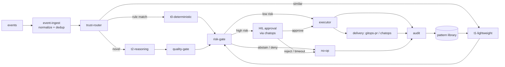

# 프로젝트 구조

이 시스템은 하나의 웹 앱이 아니라 **headless 컨트롤 플레인 + 얇은 콘솔 + ChatOps**입니다. [App 형태](../../../.github/instructions/app-shape.instructions.md)를 참조하세요.
아래 배치는 물리적인 service-owned 트리를 기록하며, 완료 근거와 폐기 기준은
[서비스 분해 실행 계획](service-decomposition-execution-plan-ko.md#최종-리포지토리-레이아웃)에서 정의합니다.
고정된 에이전트 15개가 타입이 지정된 이벤트로 컨트롤 루프를 소유합니다. 프로세스 분리는
[서비스 승격과 데이터 소유권](service-graduation-and-ownership-ko.md), 모듈 이름은 [아키텍처](../../../.github/instructions/architecture.instructions.md)를 따릅니다.
로컬 5개 서비스 프로필은 loopback PostgreSQL, Redpanda, filesystem 문서 저장소 및 ClamAV를
사용하면서 각 패키지를 독립적으로 유지합니다. 배포 조립은 shared wire 계약을 바꾸지 않고
해당 adapter를 service-owned managed 구현으로 교체합니다.

## 구현 상태

### 구현 범위
| 영역 | 상태 | 근거 | 참고 |
|------|------|------|------|
| 현재 상태 활동 identity | 구현됨 | `read_investigation_latency.py`, `activity_projection.py`, focused 영속성 및 projection 테스트 (`6 passed`) | Latency 프로파일은 hash된 correlation 참조만 유지하고 감사 항목은 correlation-free로 남으며, 영속 활동과 실제 운영 활동은 실행 권한을 포함하지 않고 하나의 identity를 공유합니다. |
| Rule 세대 reconciliation 경계 | implemented | `shared/providers/catalog_search.py`; `delivery/catalog_search/`; `runtime/rule_generation_documents.py`; 집중 adapter, Pantheon, 활성화 및 bootstrap 검사 | 프로바이더 계약은 정확한 준비 상태 증적 연결을 소유하고 delivery는 원자적 어댑터를 소유하며 runtime은 정책 또는 실행 권한을 인프라 코드로 옮기지 않고 엄격한 카탈로그 스냅샷과 replay가 동일한 요청을 구성합니다. |
| 인시던트 온톨로지 projection 및 근거 조회 | 구현됨 | `core/incident/ontology_projection.py`, `core/ontology_platform/incident_queries.py`, focused 인시던트 및 의미 조립 검사 (`62 passed`) | 시작 시 추가 전용 인시던트 감사를 replay해 `Incident` 객체를 만듭니다. Exact-release `query.incident_evidence` 함수는 correlation-scoped 감사 기록을 읽고 원인 또는 액션 권한 없이 프로파일, 근거 및 공백을 노출합니다. |
| 권한 인식 관측 경계 | implemented | `fdai_service_contracts/operational_activity.py`, `delivery/observation_campaign.py`, `delivery/observation_source_catalog.py`, 집중 계약, 수명 주기 및 projection 검사 | 공유 계약은 권한이 없는 요약을 전달하고 delivery는 프로바이더 읽기, 원자적 캠페인 상태 및 로컬 또는 배포 어댑터 선택을 소유합니다. 출처별 경로는 의미 있는 근거 소유권을 유지합니다. |
| 리소스 검색 계약 경계 | implemented | `fdai_service_contracts/discovery.py`, `fdai_service_contracts/discovery_evidence.py`, `core/discovery/router.py`, 집중 검색 검사 (`44 passed`) | 공유 SDK는 불변이고 권한이 없는 wire 레코드를 소유하고 Core는 프로바이더 중립적인 정확히 동등한 라우팅과 병합을 소유하며 Azure delivery는 버전이 고정된 프로파일, 렌더링, 실행 증적 및 커버리지 조정을 소유합니다. |

### 구현 이력
| 날짜 | 상태 | 변경 | 근거 | 남은 작업 |
|------|------|------|------|-----------|
| 2026-08-13 | 구현됨 | 이전 출처 이력을 재구성하지 않고 구현 ledger를 도입했으며 범위가 제한된 현재 상태 활동 identity 변경을 기록했습니다. | 현재 출처와 `test_read_investigation_latency.py`, `test_activity_projection.py`, 통과한 focused 테스트 | 아래에 설명된 연기된 Phase 2 물리 패키지 이동을 완료합니다. |
| 2026-08-13 | implemented | Mimir와 Heimdall 소유권을 유지하면서 프로바이더 계약, 원자적 어댑터 및 시작 구성 전체에 운영 Rule 세대 reconciliation 경계를 추가했습니다. | `current change`; `catalog_search.py`, `rule_generation_documents.py` 및 집중 worker, PostgreSQL, 런타임, 활성화 검사 | 통제된 실제 세대 증적을 보존하며 연기된 Phase 2 패키지 이동은 별도로 유지합니다. |
| 2026-08-13 | implemented | 책임 소유자인 Mimir 또는 Heimdall이 maintenance-disabled이면 시작 시 Rule 세대 reconciliation을 억제하도록 변경했습니다. | `current change`; `bootstrap.py` 및 집중 disabled-agent 유입 검사 | 두 소유자가 활성화된 상태에서 통제된 실제 세대 증적을 보존합니다. |
| 2026-08-14 | 구현됨 | Rehydrate된 canonical 인시던트 상태와 이후 실제 상태를 bounded 현재 상태 읽기 모델로 온톨로지 인스턴스 저장소에 projection했습니다. | `current change`, `ontology_projection.py`, `registry.py`, `bootstrap.py`, `test_ontology_projection.py`, focused 인시던트 검사 47개 통과 | 읽기 전용 인시던트 근거 함수를 등록하고 인증된 Console 근거를 보존합니다. |
| 2026-08-14 | 구현됨 | Bounded correlation-scoped 감사 기록 위에 exact-release `query.incident_evidence` FunctionType을 추가하고 기존 인시던트 RCA 프로파일 projection을 재사용했습니다. | `current change`, `incident_queries.py`, 의미 조립, InMemory/PostgreSQL reader, focused 검사 62개 통과, 작업 범위 Ruff 및 strict mypy 통과 | 최종 답변과 다음 안전 단계를 제한한 뒤 인증된 Console 근거를 보존합니다. |
| 2026-08-14 | 구현됨 | 원인 필드가 있는 결과를 거부하고 근거 공백과 후보 전용 액션 초안 다음 단계만 노출하는 결정론적 인시던트 답변 projection을 추가했습니다. | `current change`, `semantic_turn_processor.py`, focused processor 검사 34개 통과, 작업 범위 Ruff 및 strict mypy 통과 | 로컬 스택 재시작 후 인증된 Console 근거를 보존합니다. |
| 2026-08-14 | implemented | 버전이 지정되고 권한이 없는 관측 활동 계약을 추가했으며 프로바이더 수집, 영속 캠페인 상태 및 런타임 연결은 delivery에 유지했습니다. | `current change`, 계약, 캠페인, Operator projection 및 Console 집중 검사 통과 | 관측 owner 문서에서 추적하는 통제된 로컬 및 배포 캠페인 근거를 보존합니다. |
| 2026-08-14 | implemented | 공유되는 범위 제한 리소스 검색 계약군과 프로바이더 중립 Core 라우터를 추가하고 Azure 프로파일, 렌더링 및 근거 생성은 delivery에 유지했습니다. | `current change`, 집중 검색 테스트 `34 passed`, 작업 범위 Ruff 및 운영 파일 8개의 strict mypy 통과 | Azure 검색 owner 문서에서 추적하는 통제된 실제 운영 canary 근거를 보존합니다. |
| 2026-08-14 | implemented | 공유 커버리지 enum 및 명령 sanitizer를 문서화된 `unmapped` 및 환경 할당 금지 계약과 일치시켰습니다. | `current change`, 집중 검색 테스트 `36 passed`, 작업 범위 Ruff 및 strict 계약 mypy 통과 | Azure 검색 owner 문서에서 추적하는 통제된 실제 운영 canary 근거를 보존합니다. |
| 2026-08-14 | implemented | 구체적인 Azure 값은 delivery 프로파일에 유지하면서 공유 계획에 프로바이더 중립 정규화 및 검증 버전 pin을 추가했습니다. | `current change`, 집중 검색 테스트 `40 passed`, 작업 범위 Ruff, strict mypy 및 Core import 경계 gate 통과 | Azure 검색 owner 문서에서 추적하는 통제된 실제 운영 canary 근거를 보존합니다. |
| 2026-08-14 | implemented | 카탈로그 소유 자리 표시자를 유지하면서 redirect, 제어 문자 및 실행 가능한 shell 단어를 거부하도록 공유 명령 근거를 강화했습니다. | `current change`, 집중 검색 테스트 `44 passed`, 작업 범위 Ruff 및 strict mypy 통과 | Azure 검색 owner 문서에서 추적하는 통제된 실제 운영 canary 근거를 보존합니다. |
| 2026-08-14 | implemented | 승인, dispatch 또는 감사 권한을 바꾸지 않고 영속 HIL park key, 만료 decoding 및 on-call serialization을 focused record helper로 분리했습니다. | `current change`, focused HIL coordinator 테스트 33개 통과, strict mypy 및 Core import gate 통과 | 연기된 Phase 2 패키지 이동은 변경 없이 남아 있습니다. |

### 남은 작업
- [ ] 호환성 import deprecation 주기 뒤 연기된 Phase 2 물리 `git mv`를 완료하고 이 배치를 결과 service-owned 경로로 갱신합니다.
## 모노레포 레이아웃

```text
fdai/
├── services/core-control-plane/src/fdai/ # 전체 headless control-plane implementation
│   ├── core/                  # headless 컨트롤 플레인 (UI 없음, 클라우드 SDK 직접 import 없음). G-1 phase 1 (트래커 #14) 이 core 서브시스템 위에 도메인 그룹 파사드를 도입했다: `pipeline/` (event_ingest, trust_router, tiers, quality_gate, risk_gate, hil_resume, executor, audit, control_loop), `incident/` (rca, slo, runbook, postmortem, oncall, irp, investigation, chaos, capacity), `operator/` (conversation, operator_memory, working_context, rbac, notifications, report_feed), `knowledge/` (prompts, tools, web_search, capability_catalog, rule_catalog_profiles, ontology_explorer), `platform/` (scheduler, metering, measurement, security, reporting, onboarding, workflow, detection, deploy_preflight, assurance_twin), 그리고 `verticals/` (G-6). Phase 1 은 additive - `from fdai.core.<subsystem> import X` 와 `from fdai.core.<domain> import <subsystem>` 둘 다 resolve. Phase 2 (연기) 는 물리적 `git mv` 대량 이동.
│   │   ├── event_ingest/       # 버스 컨슈머; 이벤트 스키마로 정규화; idempotency key로 dedup; 관련 이벤트를 인시던트로 상관 연결
│   │   ├── trust_router/       # 계산된 신뢰도로 각 이벤트를 T0 | T1 | T2 로 라우팅
│   │   ├── tiers/
│   │   │   ├── t0_deterministic/    # deterministic-engine: policy, checklist, what-if, drift eval
│   │   │   ├── t1_lightweight/      # 임베딩 유사도 및 learned-action 재사용; operational case는 persisted immutable context와 fresh graph, owner, policy, dry-run, safety evidence를 요구
│   │   │   └── t2_reasoning/        # 프론티어 모델 추론과 budgeted proposer failover, durable route selection 및 sanitized attempt receipt
│   │   ├── prompts/            # catalog-as-code 프롬프트 컴포저 (`rule-catalog/prompts/` 로드, T2에 공급)
│   │   ├── tools/              # T2 툴 카탈로그 레지스트리 + `ToolExecutor` (shadow-mode 게이팅)
│   │   ├── web_search/         # 최후 수단 웹 검색 seam (`NoOpWebSearchProvider` 기본; 도메인 allowlist + sanitizer)
│   │   ├── browser_evidence/   # 읽기 전용 origin/DNS policy, redaction, immutable artifact, custody, shadow comparison
│   │   ├── operator_memory/    # HIL 승인된 오퍼레이터 메모리를 untrusted `<operator_note>` 데이터로 주입
│   │   ├── learning/           # 동의 기반 off-path turn eligibility, consensus, dedup ledger, 비활성 proposal routing
│   │   ├── conversation_assurance/ # deterministic-first 완료 turn 점수, exact failure attribution, hold-first ontology adequacy review, mixed-family 평가, 범위 제한 이의 제기, 구독별 학습, chat-policy 승격 및 롤백, versioned 50-item hard-cap quality scorecard
│   │   ├── trajectory/         # authorization-first observable trajectory projection, version policy, reviewed aggregate, offline validation
│   │   ├── case_history/       # canonical revision, strict operational receipt, artifact-first intake, scoped retrieval, backfill 및 retention
│   │   ├── task_worker/        # 격리된 depth-one 읽기 전용 worker: capability 축소, lifecycle, 영구 state, parent synthesis
│   │   ├── background_task/    # 영구 detached read: lease/CAS, atomic completion outbox, bounded retry, process-loss, retention purge
│   │   ├── read_investigation/ # Exact-resource VM/network planning, evidence, immutable provider-vs-graph shadow comparison, latency policy, owner-scoped direct/stream replay, honest cost usage, SSE heartbeat, stream-close cancellation. Cloud SDK와 execution authority 없음
│   │   ├── briefing/           # report-feed evidence 기반 결정적 opening/scheduled briefing
│   │   ├── scheduler/          # create/pause/resume/edit/run-now/cancel lifecycle, cron dispatch, run history, blueprint, 범위 제한 continuation
│   │   ├── document_ingestion/ # upload lifecycle + split inspect/index worker; Forseti/Saga/Var/Muninn gate, durable stage lease/CAS claim, replay-only gated-state recovery
│   │   ├── working_context/    # 턴당 경계 프롬프트 조립: 불변 selection policy + 필수 validator + shadow evidence/replay + planner/orchestrator fold + summarizer/retriever seam
│   │   ├── operational_context/ # atomic owned-subgraph replacement, time-consistent snapshot, cutoff-bound graph+document evidence bundle과 typed path, provenance, source-freshness receipt, fail-closed truncation
│   │   ├── decision_case/      # protected-objective option, deterministic selection, response closure
│   │   ├── change_lineage/     # 변경 불가능하고 replay-stable한 Change -> assessment -> decision -> action -> outcome join. Execution 또는 promotion authority 없음
│   │   ├── operational_planning/ # hard-constraint eligibility, Pareto pruning, Process planning phase, replay-stable plan identity. Execution authority 없음
│   │   ├── operational_learning/ # sealed-case classification, fingerprint/action cohort gate, immutable citation, inert candidate mapping
│   │   ├── rule_semantic_generation/ # agent-facing 빌드/검증 handler Protocol, exact 활성화, 영속 종결 및 발행. 실행 권한 없음
│   │   ├── quality_gate/       # mixed-model 교차 검사, verifier, grounding; 실패한 fan-out은 sibling을 cancel+drain (T2 방어)
│   │   ├── rca/                # 루트 원인 분석 (T0 deterministic + seam 뒤의 T2 reasoner; grounding-gated)
│   │   ├── risk_gate/          # 통합 authority: 리스크 스코어 + auto vs HIL vs deny; malformed promotion metric 거부 + 7개 안전조건 강제
│   │   ├── execution_authorization/ # 온톨로지 기반 pre-dispatch capability policy, grant lifecycle, replay-stable decision
│   │   ├── rbac/               # Operator API 를 위한 사람 RBAC (5개 롤 매트릭스, resolver, enforcer)
│   │   ├── human_assignment/   # 변경 불가능한 역할/임무 의도, 정규화된 검토 정족수, 리비전 기반 StateStore lifecycle, 결과 영수증
│   │   ├── hil_resume/         # HIL park/resume, no-drop grouping, bounded reminder, CAS 소유 shadow non-response supervision
│   │   ├── executor/           # logical-target lock, 멱등성, dry-run receipt, pre-effect/terminal audit, delivery adapter
│   │   ├── execution_backend/  # profile intersection, durable lifecycle coordination, shadow probe; 판단 authority 없음
│   │   ├── audit/              # append-only 해시 체인 감사 로그 + KPI/메트릭 발행
│   │   ├── notifications/      # notifications matrix 위에 얹은 채널 라우팅 레이어
│   │   ├── detection/          # anomaly/forecast 평가, 변경 불가능한 episode, event-time closure 및 outbox contract
│   │   ├── incident/           # lifecycle + 32-key/1024-char identity, 감사 기반 ontology projection, evidence, severity 및 notice
│   │   ├── slo/                # 워크로드 SLO / burn-rate 평가기 (컨트롤 플레인 SLO 와는 구분)
│   │   ├── runbook/            # 런북 오케스트레이터 (선형 시퀀스 + on-failure 브랜치)
│   │   ├── workflow/           # version-pinned WorkflowDefinition + principal WorkflowBinding 컴파일; 승인 플래너 + shadow 오케스트레이터 + 트리거 인덱스 + 이벤트 코디네이터
│   │   ├── python_task/         # generated multi-file PythonTask artifact 및 reviewed programmatic pipeline static validation; task code 를 import 또는 실행하지 않음
│   │   ├── programmatic_pipeline/ # capability-scoped read-only tool loop: immutable contract, broker, receipt, compact result, deterministic benchmark
│   │   ├── postmortem/         # LLM 옵션 postmortem / PIR 드래프트 생성기
│   │   ├── rule_catalog_profiles/  # 프로파일 / 팩 레이어 - 이름 붙은 룰 번들 (`extends` 체인 + overrides)
│   │   ├── measurement/        # 지속 측정 및 confidence/guard gate를 포함한 immutable revision/scenario operational-promotion receipt
│   │   ├── mscp_profile/       # 실행 authority 없는 순수 mscp-operational-v1 provenance, effect verification, cycle guard, runtime-integrity policy 및 never-raising authority ceiling
│   │   ├── deploy_preflight/   # 배포 전 feasibility 프로브 → grounded readiness 리포트
│   │   ├── readiness/          # 운영 handoff + startup 및 monitored-target readiness contract, fail-closed reducer, evidence expiry 및 authority ceiling
│   │   ├── assurance_twin/     # 읽기 전용 온톨로지 트윈: text-to-query, scalar/graph active-challenger model, 필수 invariant, durable trajectory episode, 결정론적 simulation, off-path outcome closure (실행 또는 promotion 안 함)
│   │   ├── ontology_platform/   # exact release, release-aware direction-shadow 비교, semantic interface, bounded object set, secured purpose/ACL query receipt, 인시던트 감사 근거, shared exact-number property semantics, cluster-scoped network/Pod telemetry verification, immutable diagnostic ledger/result projection, mutation plan, typed function, authenticated reconciliation과 proposal-only terminal outbox, proposal-only SDK generation
│   │   ├── conversation/       # Bragi-owned model-free screen T0, schema-constrained whole-turn semantic frame/query-plan shadowing, principal-manifest verification, intent-graph evidence projection, compatibility intent/tool 조정, grounded narration, per-turn isolation, durable delivery 및 busy-input arbitration
│   │   ├── user_context_projection.py  # principal context / workflow binding metadata만 runtime ontology에 projection
│   │   ├── console_request/    # 오퍼레이터 콘솔 write-direction 재요청 정책 (Scenario B deny-override), 순수 함수 `evaluate_operator_rerequest` 하나
│   │   ├── verticals/          # Resilience / Change Safety / Cost Governance (P3 통합 지점); Resilience는 control-plane recovery plan, record codec, epoch-fenced reducer 및 durable CAS coordinator를 포함하고, 각 vertical 은 sub-package (G-6) 로 자체 orchestrator + 서브모듈 을 가지며 공유 `Vertical` Protocol 은 `base.py`, `VerticalRegistry` seam 도 함께 제공
│   │   ├── control_loop/       # P1 파이프라인: `orchestrator.py` (ControlLoop 조립과 exact property-semantics injection), `_process.py` (순서가 보존된 이벤트 단계), `_fallback.py` (T1/T2), `_execution.py` (거버넌스/리스크/디스패치), `_rca.py` (shadow RCA), `_boundary.py` (감사/알림/stage 어댑터), `models.py` (typed result), `operator_request.py` (authoritative proposal lifecycle), `_helpers.py` (순수 유틸), `stages/` (Stage Protocol 스캐폴드). Semantic metadata는 authority를 높이지 않음
│   │   └── ontology_explorer.py    # 로드된 ObjectType / LinkType 카탈로그를 결정론적 Mermaid 로 렌더
│   ├── shared/                # 크로스컷팅; core/ 로부터 import 금지
│   │   ├── contracts/          # domain별 model + 공유 safety value + versioned isolated-Executor command/receipt schema + registry.py + validation.py
│   │   │   ├── event/          # event/schema.json
│   │   │   ├── action/         # action/schema.json
│   │   │   ├── response-outcome/ # expected-versus-observed action effect outcome
│   │   │   ├── rule/           # rule/schema.json
│   │   │   ├── ontology/       # object/link/action 스키마; ObjectType은 lifecycle 기준 + provenance 선언 가능
│   │   │   └── workflow/       # workflow/schema.json (프로세스 자동화 카탈로그)
│   │   ├── ontology/           # 런타임 온톨로지 헬퍼 (ACL, 감사 purposes, purpose taxonomy)
│   │   ├── providers/          # OperatingModelProvider, 하위 호환 Distiller conformance 및 action-bound control-plane recovery approval verification을 포함한 CSP-중립 클라우드 provider interface (adapter가 구현)
│   │   │                       #   event_bus.py, secret_provider.py, state_store.py, execution_backend.py,
│   │   │                       #   workload_identity.py, inventory.py, log_query.py, trace_query.py, incident_platform.py, behavior_knowledge.py, programmatic_pipeline.py + LLM / 채널 / RBAC seam
│   │   │                       # `providers/local/` = process-local transport adapter, bounded document format adapter(immutable ceiling `document_limits.py`, Markdown/SGML `document_text.py`, OOXML `document_structure.py`, pypdf/OCR `document_pdf.py`) 및 명시적 offline helper;
│   │   │                       # `providers/testing/` = 테스트 스위트 전반에서 쓰이는 인-메모리 페이크 (prod 에서는 바인딩 안 됨)
│   │   ├── streaming/          # `SseBroadcaster` + `StagePublisher`: EventBus 토픽을 SSE 채널로 릴레이
│   │   ├── telemetry/          # 구조화 로깅, 트레이싱, 메트릭 헬퍼
│   │   └── config/             # config 스키마 + 시작 시 검증 (fail-fast)
│   ├── delivery/              # 액션 딜리버리 어댑터 (공유 인터페이스 뒤)
│   │   ├── agent_introspection_bus.py # shared EventBus를 사용하는 bounded cross-process Bragi request/reply; executor identity 없음
│   │   ├── gitops_pr/          # remediation-pr 어댑터: GitHub App / Azure DevOps, Checks API
│   │   ├── chatops/            # 채널 어댑터 (Teams / Slack / email / webhook / pager / SMS)
│   │   ├── notifications/      # 채널별 sender; sibling `incident_platform/`은 PagerDuty/ServiceNow lifecycle 및 PagerDuty roster adapter 제공
│   │   ├── persistence/        # Forecast episode/outbox 및 relational case-history backfill을 포함한 Postgres / pgvector store
│   │   ├── operating_model/    # bounded JSON deployment operating-model adapter; startup-only, all-before-write
│   │   ├── runtime_settings.py  # allowlist된 env default + revisioned StateStore override; executor identity 또는 promotion authority 없음
│   │   ├── behavior_knowledge/ # in-memory hybrid behavior index, tracked-source freshness, built-in behavior seed
│   │   ├── catalog_search/     # candidate-only concrete semantic index, full/incremental Rule/ontology declaration/eligible deployment-object generation, immutable staged-generation validation snapshot, independent validation, atomic activation, stale detection 및 rollback. Durable pgvector binding은 delivery work로 남습니다.
│   │   ├── pgvector/           # persistent document 및 behavior vector index
│   │   ├── azure/              # bounded log/metric/App Insights trace와 promoted inventory 기반 strict operational-learning evidence를 포함한 Azure 전용 adapter
│   │   │                       #   `case_history_artifacts.py`는 workload identity로 private Blob에 content-addressed case revision 저장
│   │   │                       #   `vm_task.py` 는 Managed Run Command 사용; `container_apps_job_backend.py` 는 pinned Job template만 시작; `llm/python_task_author.py` 는 inert draft 생성
│   │   ├── vm_task/            # planning-only read adapter + ontology ToolExecutor bridge; cloud SDK import 없음
│   │   ├── execution_backend/  # 기존 sandbox authority 위의 bubblewrap 및 VM-task lifecycle adapter
│   │   ├── programmatic_pipeline/ # local isolated child runner; Azure strict submission adapter는 delivery/azure 아래 유지
│   │   ├── browser/             # 선택적 isolated async Playwright evidence capture; GET/HEAD 전용, page handle 없음
│   │   ├── trajectory/         # deterministic JSONL streaming export, quarantine, atomic partial-file cleanup
│   │   ├── kubernetes/         # evaluation/runtime evidence가 공유하는 exact quantity, cluster-scoped topology, UID-grounded owner, exact-release diagnostic function 및 hold-only finding
│   │   ├── chaos/              # `Chaos` runbook 단계가 enforce로 갈 때 쓰는 라이브 카오스 주입 어댑터: `live_injectors.py` (CSP-중립 프리미티브 fan-out) + `chaos_mesh.py` (Chaos Mesh CRD) + `mysql_load.py` (MySQL 벤치마크 부하)
│   │   ├── remediation/        # 직접 API 리메디에이션용 구체 `DirectApiExecutor` (`live_direct_api.py`); Protocol 은 `shared/providers/`에 있음
│   │   ├── operator_api/           # 얇은 ASGI - `main.py`가 principal 범위 complete-history 및 read-only knowledge-context 조립과 IAM 옆의 Owner 전용 관찰 assignment case를 포함한 route module을 조립. GET route는 bounded state를 projection하고 POST command route는 governed record 또는 typed proposal을 제출하며 privileged executor 또는 human-access provisioner를 직접 호출하지 않음
│   │   ├── ingestion_gateway/  # 독립 public upload API + internal durable worker process; scoped ref, deletion, optional handover governance
│   │   ├── provisioning/       # surface-A Genesis 부트스트랩: 순수 `terraform_bridge.py` (terraform `-json` → `provision.*`) + `serve.py` harness (`aiter_json_lines` + `pump_provision_events`, I/O 주입, subprocess 없음)
│   │   └── scheduler_tick_cli.py  # cron / Container Apps Job에서 스케줄러 tick을 구동하는 독립 엔트리 포인트
│   ├── rule_catalog/          # rule-catalog 파이프라인 코드
│   │   ├── schema/             # Rule, Best Practice, governance, ontology 및 semantic retrieval schema + validation
│   │   ├── sources/            # 소스별 컬렉터 (WAF, CIS, OPA, IaC scanners, ...)
│   │   ├── pipeline/           # watch -> collect -> shadow/regression; distill은 DocumentEnvelope provenance bridge, cross-format equivalence 및 review-only ontology gate 추가
│   │   └── codegen/            # 저작 헬퍼 (`new_action_type`, `new_object_type`) - 스캐폴드 생성만, 라이브 카탈로그 변경 안 함
│   ├── agents/                # 판테온 런타임 - 15개 agent, typed topic, v2 conversation charter 및 bounded T1/T2 deliberation; [agent-pantheon-ko.md](../agents/agent-pantheon-ko.md) 참조
│   ├── evaluation/            # public EvaluationHost 구현, capability attenuation, workspace policy, artifact custody, typed ingress 및 judgment 전 diagnostic ontology observation
│   ├── benchmarking/          # legacy benchmark contract와 runner를 위한 임시 0.1.x compatibility facade
│   ├── composition/           # composition root 패키지 (G-3, 트래커 #14): `__init__.py` facade + `_helpers.py` Container/LlmBindings(optional conversation T2 synthesis 포함) + request-role executor를 사용하는 exact-release semantic query assembly를 포함한 focused `wire_*` binder
│   ├── runtime/               # reviewed alias-free metric-semantic catalog loading, exact Rule 세대 문서 스냅샷과 replay가 동일한 reconciliation, versioned isolated Executor shadow/effect handling, stable-offset remote client, EventBus/DLQ/health supervision, production entry point, reversible authority probe, operating-model 및 diagnostic-catalog startup projection/status, durable T2 recovery observation/backfill, Thor/Vidar 실행과 rollback을 사용하는 StateStore-backed proposer route selection, deadline-bound 영속 변환 결과 재생을 포함한 semantic runtime availability/readiness binding, transport/identity binding, startup readiness, worker gating 및 Norns post-turn review를 포함한 headless lifecycle/composition
│   └── __main__.py            # 진입점 (P1 컨트롤 루프 기동)
├── services/core-control-plane/{src/fdai_core_service,tests}/ # Core entry point와 test
├── services/{operator-service,document-ingestion-api,document-processing-worker,isolated-executor}/와 packages/service-contracts/ # 독립 package, shared SDK, test, 타입이 고정된 semantic JSONB 영속성 및 projection row에 의존하지 않는 process-owned semantic bridge 상태
├── evaluation-sdk/            # 독립적으로 package할 수 있는 neutral evaluation contract와 runner; FDAI implementation import 없음
├── benchmarks/                # 독립적으로 package된 external-harness driver; FDAI wheel에 포함되지 않음
├── extensions/                # 독립적으로 package된 optional capability; FDAI wheel에 포함되지 않음
│   └── code-assurance/         # read-only bounded GitHub PR code/security review + governed skill asset
├── rule-catalog/              # catalog-as-code 데이터 (YAML) - Python 아님; 파이프라인은 services/core-control-plane/src/fdai/rule_catalog/ 에
│   ├── schema/                 # JSON Schema 정의 (데이터)
│   ├── vocabulary/             # canonical CSP-중립 어휘: resource-types.yaml, object-types/, link-types/, interface-types/, interface-implementations/
│   ├── action-types/           # 업스트림 온톨로지 ActionType 인스턴스 (shadow-default, promotion_gate 필수)
│   ├── action-types-custom/    # 포크 전용 ActionType 추가 (업스트림 CI 에서 deny-list)
│   ├── action-types-overrides/ # 업스트림 ActionType 의 스코프 오버라이드 (≤ resource-group 스코프)
│   ├── profiles/               # 이름 붙은 룰 팩 (업스트림)
│   ├── profiles-overrides/     # profiles 의 포크 오버레이
│   ├── best-practices/         # typed evidence requirement가 있는 framework checklist control
│   ├── rule-sets/              # atomic rule을 버전 고정한 governance initiative
│   ├── prompts/                # catalog-as-code 프롬프트 조각 (태스크 팩, 툴, 페르소나)
│   ├── remediation/            # remediation-plan 아티팩트
│   ├── operator-console/       # `SystemConsoleTool` descriptor 번들
│   ├── probes/                 # deploy-preflight feasibility 프로브 descriptor
│   ├── catalog/                # 정규화된 룰 (promotion 후, catalog-of-record)
│   ├── collected/              # 정규화 전 원본 업스트림 소스 스냅샷
│   ├── exemptions/             # 시간-바운드 감사된 예외 아티팩트
│   ├── sources/                # 소스별 룰 스냅샷 + provenance
│   ├── llm-registry.yaml       # capability 별 LLM 바인딩 레지스트리 (데이터, composition 시점에 해석)
│   └── risk-classification.yaml # authoritative first-match 리스크 분류 테이블 (risk-classification-ko.md 참조)
├── policies/                  # T0와 verifier가 소비하는 OPA/Rego policy-as-code
├── infra/                     # IaC: Terraform (HCL); 엔트리 커맨드 `terraform apply`
│   ├── modules/
│   │   ├── resource-group/          # rg-fdai; deploy-and-onboard-ko.md 에 따라 CAF 명명
│   │   ├── identity/                # executor 를 위한 user-assigned Managed Identity
│   │   ├── compute/                 # runtime seam - 대안은 형제 폴더에
│   │   │   └── container-apps/      # 기본 (Consumption + KEDA)
│   │   ├── isolated-executor/       # opt-in internal shadow Container App; 전용 transport identity, effect role 없음
│   │   ├── container-registry/      # compute 이미지용 ACR
│   │   ├── state-store/             # audit + KPI + pgvector
│   │   │   └── postgres-flex/       # 기본
│   │   ├── event-bus/               # Kafka 와이어
│   │   │   └── event-hubs-kafka/    # 기본 (Event Hubs, :9093)
│   │   ├── secret-store/            # env + Key Vault reference 브릿지
│   │   │   └── key-vault/           # 기본
│   │   ├── observability/           # Log Analytics + 여기 바인딩된 App Insights
│   │   │   └── log-analytics/       # 기본
│   │   ├── llm/                     # 배포자 스코프 LLM 프로비저닝 (dev-and-deploy parity 계약)
│   │   │   └── azure-openai/        # 기본 Azure OpenAI 디플로이먼트 세트
│   │   ├── measurement-runners/     # 자동 regression + pattern-growth 러너용 Container Apps Jobs
│   │   ├── vm-task-host/             # custom Linux/GPU VM용 cloud-init profile
│   │   ├── vm-task-rbac/             # target-VM-scoped Managed Run Command RBAC
│   │   ├── preflight-toggles/       # preflight blocker 를 Terraform 토글로 매핑하는 피처 플래그 표면
│   │   └── console/                 # 읽기 전용 SPA 를 호스팅하는 Static Web App
│   │       └── static-web-app/      # 기본
│   ├── local/                       # 로컬 개발용 IaC (docker-compose, testcontainers 배선; Azure 에 apply 안 함)
│   └── envs/                        # 환경별 tfvars (git-ignored; 커밋 금지)
│       ├── dev/
│       ├── staging/
│       └── prod/
├── console/                   # 얇은 SPA (Vite + Preact) - 운영자 보기, 제한된 governed command, 로컬 표시 설정, 관찰 전용 IAM Assignments
│   ├── src/                    # 셸, 패널 레지스트리, GET 전용 클라이언트, 라우트, 브라우저 로컬 환경 설정
│   ├── index.html              # Vite 진입점
│   ├── package.json            # 의존: preact, @azure/msal-browser
│   └── vite.config.ts          # 빌드 → console/dist/ (git-ignored)
├── cli/                       # operator-console CLI (Ink) - 뷰모델 하나, 렌더러 여럿
│   ├── src/view-model/         # 표현 중립 브리핑 계약 + 블록 IR + 빌더
│   ├── src/renderers/          # ink (터미널) / text / slack (Block Kit) / teams (Adaptive Card)
│   ├── src/cli.tsx             # 진입점: 브리핑을 한 번 빌드하고 --surface 별로 렌더
│   └── package.json            # 의존: ink, react (tsx로 실행, 빌드 단계 없음)
├── site/                      # Astro / Starlight 문서 사이트 (docs/**/*.md 를 i18n + 검색으로 렌더)
├── ui/                        # (미래) 정적 UI 킷 (Calm Slate 테마) - placeholder
├── tests/integration/         # cross-service compatibility와 repository check만 유지
├── docs/roadmap/              # 이 로드맵과 설계 문서
├── pyproject.toml             # virtual uv workspace root (`package = false`)
└── .github/                   # instructions/ 와 workflows/ (CI: lint, secret-scan, coverage)
```

런타임 초기화는 semantic-turn 준비 상태를 `bootstrap_lifecycle.py`에, exact Rule 세대 스냅샷과 영속 요청을 `rule_generation_documents.py`에, 버티컬 워크로드 신원을 `bootstrap_bindings.py`에 위임합니다. 이렇게 해서 범위가 제한된 프로바이더 구성과,
테스트와 포크가 사용하는 주입 가능한 identity-builder 경계를 함께 보존합니다. 리소스 상태 조립은 권위 있는 Heimdall 읽기 뒤에 shared 단계 topic의 no-authority 게시자도 연결합니다.
범위가 제한된 latency 프로파일은 hash된 correlation만 유지해 영속 활동과 실제 운영 활동이 같은 identity를 사용하게 합니다. 질문 텍스트, 리소스 식별자, 실행기 기능 또는 추가 latency-audit 필드는 내보내지 않으며 broker 실패가 답을 다시 쓰지 않습니다.

> 디렉터리 이름은 [language.instructions.md](../../../.github/instructions/language.instructions.md)의
> 정본 어휘를 따릅니다: `trust-router`, `deterministic-engine`, `rule-catalog`, `risk-gate`,
> `remediation-pr`, `shadow-mode`, `HIL`.
> 디스크상의 식별자는 `snake_case`를 쓰며, 각 패키지가 자신의 테스트를 소유하고 서비스 간 및
> 저장소 전역 검사만 `tests/integration/`에 남습니다.
## 모듈 경계(모듈 Boundaries)

의존 방향은 엄격하게 단방향이며, 위반은 리뷰 블로커입니다.

- **코어는 이식 가능**: 어떤 클라우드 SDK도 직접 가져오기 하지 **않습니다**. 클라우드 특이성은
  `shared/providers/` 의 CSP-중립 인터페이스로만 진입하며, 구현은 `delivery/` 와 `infra/`
  에 있고 조립 시점에 주입됩니다. 이렇게 두 번째 클라우드는 어댑터 추가일 뿐이며 `core/` 편집이
  아닙니다.
- **허용된 가져오기**: `shared/`는 `core/`를 가져오기하지 않습니다. `core/`는 `shared/`의
  계약, 프로바이더, 텔레메트리, 구성만 가져옵니다. `delivery/`는 어댑터 경계 뒤에서
  `core/`와 `shared/`를 조립할 수 있고 `composition/`이 모든 계층을 연결합니다. `core/`는
  `delivery/`를 가져오기하지 않으며 브라우저 코드는 Python 구현 모듈을 가져오기하지 않습니다.
- **정책과 규칙은 코드 경로가 아닌 데이터**: T0가 런타임에 `rule-catalog/` 엔트리와 `policies/`
  를 로드하므로 규칙/정책 추가에 엔진 변경이 필요 없습니다. 규칙은 의도와 교정을
  기술하고, 정책은 검증기가 재검사하는 실행 가능한 OPA/Rego입니다. 소스가 이 YAML로 수집·
  정규화되는 방법은
  [rule-catalog-collection-ko.md](../rules-and-detection/rule-catalog-collection-ko.md) 에 있습니다.
- **전달은 교체 가능**: `gitops-pr` 와 `chatops` 는 하나의 인터페이스 뒤의 어댑터라,
  실행기는 추상 액션을 발행하고 어댑터가 그것을 렌더링합니다(remediation-pr, Adaptive 카드).
  실행기가 유일한 privileged 신원을 보유하며 어댑터는 이를 공유하지 않습니다.
- **콘솔에는 privileged 신원이 없음**: 상태, 감사, shadow 결과, HIL 큐를 시각화합니다. 접근 권한은
  검증된 App 역할에서 나오며 선택적인 access 변환 결과와 무관합니다.
  Command 표면은 인증된 기록이나 타입이 지정된 제안을 제출할 수 있지만, 이 표면도 dev 서술기도
  실행기를 호출할 수 없습니다. risk, 승인, 감사, 실행은 서버 측에 남습니다
  ([security-and-identity-ko.md](security-and-identity-ko.md)).
  전송 계층이 활성화되면 하나의 semantic-aware 어댑터가 변환 결과, 제안, 스트림 포트를 연결합니다.
  이 어댑터의 발신함은 데이터베이스 `NOW()` 기한을 사용하고, 트랜잭션 단위 결과 재사용은 요청,
  principal, terminal-result 다이제스트를 검증합니다.
  저장소 Best Practice 정의는 조립 루트에서 한 번 로드하고 GET 전용 목록 및 상세
  경로로 노출합니다. 이 정의는 카탈로그 참조 데이터로 유지되며 런타임 근거 프로바이더를
  명시적으로 연결하기 전까지 변환 결과는 `Unknown` 및 `not-connected`를 보고합니다.
  탐색 셸은 아이콘 전용 활동 Bar와 다섯 개의 안정적인 영역인 `전체 현황`, `운영`,
  `에이전트`, `거버넌스`, `감사·증적`을 사용합니다. 인접한 Explorer는 선택한 영역에 등록된
  패널을 렌더링합니다. 영역을 선택하면 Explorer를 열고 운영자의 로컬 패널 순서 및 표시
  설정에 따라 첫 번째 visible 패널로 이동합니다. 영어가 기본 표시 언어이며, 한국어 카탈로그는 그룹 id, 패널 id,
  경로를 바꾸지 않고 한국어 레이블을 제공합니다. 운영자는 브라우저 로컬의 계정별 설정에서
  패널 순서를 바꾸거나 숨길 수 있습니다. 아이콘 전용 셸 컨트롤은 키보드 focus에서 즉시
  열리고 포인터 hover에서는 잠시 지연되는 공통 툴팁으로 현지화된 레이블을 표시합니다.
  이 툴팁은 문서 본문 portal에 렌더링되고 뷰포트 안에 머물도록 방향이나 위치를
  조정하며 reduced-motion 설정을 따르므로 브라우저 기본 `title` 표시에 의존하지 않습니다.
  숨김은 탐색 표시에만 적용되므로 직접 경로와 검색은
  계속 사용할 수 있고, 현재 활성 패널은 숨길 수 없습니다. 세부 경로는 공통 페이지 제목 안에
  간결한 영역 / 패널 계층을 렌더링하여 Explorer를 접어도 맥락을 유지합니다. 대시보드는
  `전체 현황 / Dashboard`를 렌더링합니다. 패널 제목이 영역 레이블을 반복하는 영역 루트와 독립
  유틸리티는 단일 제목을 유지합니다. 에이전트 영역은 명단,
  Organization, 활동, 인계 패널 전체에 표시되는 작업 공간 탭 행도 유지합니다. 명단은
  기본 에이전트 보기이며 Operator API가 반환하지 않은 지표를 만들지 않고 현재 스트림 상태, 현재 작업,
  인시던트 연결, 보고선, 증적 링크를 투영합니다. 필터와 검색은 브라우저 로컬 표시 제어이며,
  또한 런타임 연결을 별도로 표시합니다. 11개의 타입이 지정된 EventBus 구독자와 Huginn의 raw-ingress
  구독자는 대기 상태를 유지하고, Njord와 Freyr는 외부 어댑터를 기다리며 Loki는 scheduled
  트리거를 기다립니다. Huginn은 실시간 리소스 발견 유입을 소유합니다. Azure 생성,
  갱신, 삭제 신호는 정본 이벤트 토픽으로 들어오고, 주입된 전달 projector가 Azure
  I/O를 에이전트 내부에 넣지 않은 채 enrichment와 ordered 인벤토리 delta 적용을 담당합니다. 전용
  범용 인벤토리 delta forwarder는 각 `InventoryBatch.links` patch를 보존합니다. `contains`는
  대상 리소스에, 다른 관계 타입은 출처 리소스에 할당합니다. 같은 배치에 관계 소유자 리소스가
  없으면 커서 진행을 차단하여 그래프 데이터를 조용히 버리지 않고 페이지를 재시도합니다. Event
  멱등성 신원은 범위, 리소스, 관계 페이로드의 범위가 제한된 SHA-256 다이제스트입니다. 따라서 긴
  리소스 id 때문에 구분용 다이제스트가 잘리거나 이벤트 계약 길이를 초과하지 않습니다. Delta 리소스에는
  표준 시간대가 포함된 RFC 3339 `last_seen`이 필요합니다. 정렬 시간이 없거나 잘못되면 프로세스 wall
  시계로 대체하지 않고 발행과 커서 진행을 차단합니다. 하나의 배치에는 각 `resource_id`가 한
  번만 포함될 수 있으며 중복이 있으면 이벤트를 발행하기 전에 배치 전체를 차단합니다.
  리소스 및 관계 속성은 finite 숫자 값으로 정본 JSON 직렬화가 가능해야 합니다. 지원되지
  않는 객체와 `NaN`은 신원 계산, 발행 또는 PostgreSQL 연결 전에 거부됩니다. Realtime
  projector와 변경할 수 없는 스냅샷 staging은 사전 검증된 정본 JSON 문서만 저장하며 스냅샷
  커버리지 메타데이터도 begin 또는 승격 전에 같은 규칙을 적용합니다. Azure 관계의 속성 경로,
  허용된 프로바이더 타입, 의미 방향, 출처 스키마 다이제스트 및 근거 정책은 검토된
  `provider-relationship-mappings` 카탈로그에서 가져옵니다. 완전한 세대 verifier는 같은 세대에서
  두 엔드포인트를 모두 관찰하고, 프로바이더와 verifier 신원이 서로 다르며, 변경할 수 없는 검증
  receipt가 edge와 mapping 개정 번호를 고정한 경우에만 후보를 활성화합니다. 엔드포인트 누락,
  모호한 방향, stale 스키마 mapping, 중복 또는 conflicting 관찰, 부분 세대는 stable dropped reason을
  남기고 active graph edge를 만들지 않습니다. 검증된 링크는 변경할 수 없는 state-fact 및 링크 관찰
  메타데이터를 운반합니다. stale 또는 conflicting 근거는 operational-context 자율성을 낮출 수만
  있습니다.
  범위가 제한된 배치의 모든 이벤트는 첫 발행 전에 생성 및 검증되므로 뒤쪽의 잘못된 리소스 때문에 앞쪽
  이벤트가 검증 단계에서 부분 발행되지 않습니다.
  `has_more`로 표시된 모든 delta 페이지는 기록을 방출하기 전에 새로운 이어가기 커서를 제공해야
  합니다. 커서가 없거나 변경되지 않으면 최종 fence 없이 pull이 실패합니다. 정상적으로 진행하는
  스트림이 설정된 페이지 상한에 도달하면 최신 커서를 반환하여 다음 pull이 그 위치에서 재개됩니다.
  최종 `final=True` 배치에는 리소스와 관계가 포함될 수 있으며 forwarder는 커서를 커밋하기
  전에 해당 페이로드를 발행합니다. 최종 fence 뒤에 배치가 나오면 스트림을 실패시키고 이전 영속
  커서를 유지합니다. 최종 배치가 커서를 생략하면 forwarder는 pull 시작 시점의 커서로
  되돌리지 않고 마지막 non-null 페이지 커서를 커밋합니다.
  Azure Activity Log 어댑터는 대응된 각 ARM 리소스 id에서 resource-group `contains` 관계를
  생성하고 같은 delta 페이지에 포함합니다. 실제 운영 리소스 읽기가 필요한 의존성은 ARG 또는 ARM
  hydration 어댑터가 제공할 때까지 불완전한 상태로 유지됩니다. 리소스 삭제의 권한은 Event
  Grid에 유지됩니다. Upsert 전용 Activity Log 어댑터는 리소스를 되살리지 않도록 삭제 연산을
  건너뛰지만, filtered 기록이 스트림을 멈추지 않도록 모든 유효 이벤트 시각으로 페이지 커서를
  진행합니다. 한 리소스의 기록이 여러 개이면 이벤트 시간과 정본 리소스 문서 순서로
  결정론적으로 선택하며 각 페이지는 `resource_id` 순서로 리소스를 방출합니다. 재개 커서와 페이지의
  모든 객체 이벤트에는 tracked 리소스로 대응되지 않는 이벤트까지 timezone-aware RFC 3339 시각이
  필요합니다. 잘못된 이벤트 시각은 폐기하거나
  UTC로 간주하지 않고 페이지를 실패시켜 정렬 권한을 보존합니다. Activity Log non-2xx 오류는
  HTTP 상태만 보고하며 응답 본문은 exception 또는 로그 텍스트에 포함하지 않습니다.
  In-flight 커서에는 유효한 running 시각과 비어 있지 않은 next 링크가 모두 필요합니다. 초기
  lower 한계는 비어 있는 intermediate 페이지에서도 유지되므로 페이지 나누기가 최종 재개 커서를
  지우거나 뒤로 이동시킬 수 없습니다. 단일 구독 Activity Log 어댑터는 정본 hyphenated
  구독 UUID만 허용하여 범위 텍스트가 요청 경로 또는 조회를 변경하지 못하게 합니다. Bearer
  토큰 엔드포인트는 userinfo, 경로, 조회, 조각이 없는 HTTPS 출처 URL이어야 합니다.
  각 Activity Log 응답은 `max_events_per_page`(기본값 1000)로 제한되며 상한을 초과한 페이지는 대응
  또는 커서 진행 전에 실패합니다. 모든 `value` 항목은 객체여야 하며 malformed 항목은 정렬
  위치를 안전하게 확인할 수 없으므로 페이지를 실패시킵니다.
  PostgreSQL projector는 각 리소스와 관계 변경을 하나의 트랜잭션으로 적용합니다. 쓰기 담당은
  스냅샷 승격 shared 게이트, 그래프 조정 게이트, 변경 리소스 및 모든 관계 엔드포인트의
  정렬된 잠금 순서로 획득합니다. Resource 잠금은 음수 키 범위의 seeded 63-bit 참고용 키를
  사용하므로 양수 global 승격 및 조정 게이트와 키 범위가 분리됩니다. 일반 patch는 그래프 게이트를 공유하므로 관련 없는 리소스는 동시에
  처리할 수 있습니다. 리소스 삭제와 `links_complete: true` 관계 교체는 그래프 게이트를 독점하고,
  유효 관계 집합을 읽은 뒤 누락된 관계를 커밋 전에 tombstone으로 기록합니다.
  모든 관계 upsert는 effective 리소스 그래프에서 양쪽 엔드포인트를 확인하고 선언된 엔드포인트
  타입이 해당 리소스와 일치해야 합니다. 엔드포인트가 없거나 모순되면 리소스와 관계 변경을 함께
  롤백합니다. 각 인벤토리 변경에는 `(from_id, link_type, to_id)` 키별 항목이 최대 하나만
  포함되며 중복 키는 데이터베이스 I/O 전에 거부됩니다.
  모든 들어오는 관계 patch는 변경된 리소스가 소유해야 합니다. `contains`는 대상이
  소유하고 다른 관계 타입은 출처가 소유합니다. 소유하지 않은 patch는 관련 없는 그래프 간선을
  변경할 수 없습니다. 변경별 `max_links` 상한은 항상 양수이며 0은 관계를 가진 모든 삭제를
  조정할 수 없게 하므로 시작에서 거부됩니다. 데이터베이스에서 파생된 tombstone은 별도
  `max_reconciled_links` 상한(기본값 4096)을 사용하며 이 값은 `max_links` 이상이어야 합니다. 따라서
  신뢰할 수 없는 페이로드 한도를 넓히지 않고도 관계가 많은 리소스를 원자적으로 삭제할 수 있습니다.
  기존 effective `resource_id`의 리소스 타입도 realtime 갱신 전체에서 유지됩니다. 모순된 타입은
  리소스 행 또는 관계가 변경되기 전에 거부됩니다.
  realtime 리소스 오버레이가 하나라도 pending 상태이면 base 스냅샷이 최신성 예산 안에 있어도
  그래프 최신성은 `unknown`이고 읽기 변환 결과는 degraded 상태입니다. 완전한 조정
  승격이 포함된 오버레이를 정리하면 스냅샷 기반 최신성이 복원됩니다.
  각 projector 결과에는 `applied`, `not_applicable`, `snapshot_covered`, `ordering_rejected` 타입이 지정된
  결과가 포함됩니다. 스냅샷 및 정렬 suppression은 이벤트 id와 범위가 제한된 사유를 포함한
  `inventory_delta_ignored`도 방출하여 안전한 no-op와 적용된 갱신을 구분할 수 있게 합니다. 기존
  two-field 결과 생성은 생략된 결과를 `applied`로 기본 설정하여 호환성을 유지합니다.
  Event 타입을 명시한 페이로드는 `inventory.resource_changed`인 경우에만 변환 결과됩니다. 다른 도메인
  이벤트에 `inventory_change` 필드가 있어도 `not_applicable`입니다. Direct 이전 방식 호출자를 위해
  `event_type` 생략은 계속 지원합니다.
  `links_complete`가 없거나 false이면 관찰하지 못한 관계를 제거하지 않습니다. 스냅샷 승격은
  exclusive 승격 게이트를 유지하므로 어떤 delta 트랜잭션과도 동시에 실행되지 않습니다. 전용
  인벤토리 sync 작업은 기본 6시간마다 Azure Resource Graph를 조회하고 ARM 대체 경로를 사용해 완전한
  조정 스냅샷을 원자적으로 promote합니다. Heimdall은 발견 최신성, lag,
  커버리지를 관찰하며 복구를 시작하지 않습니다. 작업은 10분마다 영속 시도 상태를 확인하고
  정상 6시간 검사 간격을 유지하며 newer 실패한/abandoned 시도는 다음 틱에 재시도합니다. 로컬 실행 장치는
  Azure 발견을 실행하지 않습니다.
  Organization은 디렉터리와 Org chart 보기를 제공하며, `?view=org`는 실시간 보고 계층의 직접
  링크를 유지하고 각 노드는 해당 에이전트의 런타임 상세 포커스를 엽니다.
  활동 링크는 선택한 에이전트를 경로 조회에 유지합니다. 활동은 영구 감사 타임라인보다
  먼저 해당 에이전트의 현재 스트림 상태와 최근 실제 운영 인시던트를 표시하므로 감사 귀속이
  지연되거나 없어도 활성 에이전트가 빈 화면으로 보이지 않습니다. 로컬 dev 모드는 Settings
  바로 위에 `Labs` 영역도 표시하며, 운영 탐색에서는 이 개발 전용 영역을 생략합니다.

## 리포지토리 스크립트 레이아웃

리포지토리 자동화는 책임에 따라 `scripts/` 아래에 그룹화합니다. 루트 파일로는 레이아웃
README, `verify.sh`, Python 패키지 마커만 유지합니다. 품질 게이트, 무결성 도구, 거버넌스 검사,
카탈로그 유틸리티, 배포 도우미, 일반 자동화는 각각 전용 디렉터리를 사용합니다.
소유권 맵과 배치 규칙은 [scripts/README.md](../../../scripts/README.md)를 참조하세요.

## 구조 CI 게이트

위 경계 규칙을 CI에서 강제하는 네 개의 스크립트가 있으며, 리팩터가 랜딩된 뒤에 드리프트가
슬금슬금 돌아오는 것을 막습니다. 전부 `scripts/quality/architecture/` 아래에 있고 CI 파이프라인과 로컬 pre-push
훅에서 모두 실행됩니다. 상응 문서는
[coding-conventions.instructions.md](../../../.github/instructions/coding-conventions.instructions.md)
에 있습니다.

| 게이트 | 규칙 | 현재 모드 |
|--------|------|-----------|
| [check-core-imports.sh](../../../scripts/quality/architecture/check-core-imports.sh) | `core/` 는 클라우드 SDK, HTTP 클라이언트, `fdai.delivery.*` 를 가져오기 금지 | 강제 적용 |
| [check-agents-imports.sh](../../../scripts/quality/architecture/check-agents-imports.sh) | `agents/` 도 같은 집합 금지 | 강제 적용 |
| [check-file-loc.sh](../../../scripts/quality/architecture/check-file-loc.sh) | 400 LOC 초과 시 warn, 강제 적용 모드에서 800 초과 시 fail | warn-only |
| [check-subsystem-fanout.sh](../../../scripts/quality/architecture/check-subsystem-fanout.sh) | 한 파일이 `core.*` 형제 subsystem 을 8개 이상 가져오기 하면 warn, 15개 이상이면 강제 적용 모드에서 fail | warn-only |

### 새 게이트 추가

1. 기존 스크립트 패턴을 따라 `scripts/quality/architecture/check-<name>.sh` 를 작성합니다 (환경변수로 warn/fail
   임계값, 앞선 `#` 정당성 코멘트를 요구하는 허용 목록, stale 엔트리 거부,
   GitHub Actions 어노테이션, `CHECK_QUIET=1` 요약 모드).
2. 현재 트리를 깨지 않도록 **warn-only** 로 배포합니다.
3. `.github/workflows/ci.yml` 에 잡을 추가하고 `.githooks/pre-push` 에 호출을 추가합니다.
4. `services/core-control-plane/tests/test_check_structural_gates.py` 에 warn / 강제 적용 / 임계값 재정의 /
   허용 목록 / stale 항목 / 경계 조건 을 커버하는 회귀 테스트를 추가합니다.
5. `services/core-control-plane/tests/test_structural_gates_drift.py` 에 CI 잡과 pre-push 배선 이 드리프트로 사라지지
   않도록 가드를 추가합니다.

### 게이트 warn -> 강제 적용 승격

1. 현재 warn 베이스라인을 정리하는 리팩터를 랜딩합니다 (트래커 #14).
2. CI 잡에서 게이트의 모드 환경변수를 뒤집습니다 (`FILE_LOC_MODE=enforce` 등).
3. 정당한 예외가 있으면 게이트 허용 목록 파일에 H3 규칙 (앞선 `#` 코멘트) 을 지켜 넣습니다.
4. 트리를 통과시키기 위해 임계값을 약화하지 **않습니다**. 파일을 쪼개거나 허용 목록에
   기록하세요. 붉은 파이프라인을 풀려고 임계값을 낮추는 것은 거버넌스 회귀입니다.

## 의존성 주입을 통한 커스터마이제이션

이 저장소는 **메인 프로젝트** 입니다. 고객별 커스터마이제이션은 **의존성 주입(DI)** 으로
공급되며, `core/` 편집이나 분기 사본 유지가 아닙니다. 상류 저장소는 인터페이스를 정의하고
범용 기본 구현을 제공하며, 포크는 조립 루트(조립 루트)에서 **자신의 구현을 등록**
합니다. 커스터마이제이션은 추가적(가산)이며 상류 동기화는 깨끗하게 유지됩니다
([generic-scope.instructions.md](../../../.github/instructions/generic-scope.instructions.md) 의
포크 모델 참조).

> **포크 유지관리자**: 절차적 walkthrough는
> [downstream-fork-guide-ko.md](../fork-and-sequencing/downstream-fork-guide-ko.md)에서 시작. 이 섹션은
> 그 가이드가 operational 화하는 경계 카탈로그입니다.

- **조립 루트**: `core/` 는 `shared/` 의 CSP-중립 인터페이스에만 의존합니다.
  얇은 조립 루트(`core/` 밖)가 시작 시 구체 구현을 바인딩합니다. `core/` 는 절대 구체
  어댑터를 new-up 하지 않고 의존성을 주입받습니다. 상류 기본 바인더는
  [`fdai.composition.default_container`](../../../services/core-control-plane/src/fdai/composition/__init__.py) 이며,
  포크의 엔트리 포인트는 해당 바인딩을 감싸거나 교체하는 자체 팩토리를 호출합니다.
  구체 어댑터 클래스(예: `PackageResourceSchemaRegistry`, `JsonSchemaContractValidator`)
  는 공개 서브-패키지에서 re-export **되지 않습니다**; 해당 서브모듈에서 직접, 그리고
  조립 루트에서만 가져오기 되어야 하므로 `core/` 가 실수로 구체에 의존할 수 없습니다.
- **Config-기반 바인딩**: 설정이 각 구현을 선택합니다. `composition/wire_distiller.py`는 exact-version
  엔드포인트 세 개와 replay-identical 프롬프트 하나로 review-only `Distiller`를 atomic하게 연결합니다.
  Council 기록이 없으면 abstention을 유지하고 부분 기록은 실행 T2 변경 없이 시작을 실패시킵니다.
- **상류의 기본 구현**: 메인 저장소는 모든 경계에 대해 동작하는 범용 기본 구현을 제공하여
  독립 실행 가능합니다. 포크는 필요한 경계만 교체합니다.
- **현재 T1 reuse 근거**: `CurrentReuseVerifier`는 변경할 수 없는 operational 사례를 위해 fresh
  리소스, 토폴로지, 그래프, 소유자, 정책, 예행 실행, 안전성 사실을 수집합니다. Azure 캐시 최신성은
  범위가 제한된 age와 future skew를 사용해 현재 evaluation 시계 기준으로 평가하므로 이벤트 직전의 recent
  캐시는 통과할 수 있지만 historical 재생이 stale 근거를 되살릴 수는 없습니다. Learned 서명은
  정본 매개변수와 완전한 operational-case 맥락을 연결합니다. Growth 및 pgvector 조회/쓰기
  경계는 데이터베이스 I/O 전에 non-finite 임베딩 값을 거부합니다. 검증기는 실행 권한을
  부여하지 않습니다. 연결이 없으면 operational reuse는 abstain하고 이전 방식 pattern은 계속됩니다.
  Pantheon 조립은 `OperatingPatternCompiler`를 inject할 수 있으며 Norns는 타입이 지정된 learning을
  serialize하고 Mimir 검토 전에 범위가 제한된 제안 backpressure를 적용합니다.
- **Causal 및 Dynamic 런타임 근거**: `TemporalCausalEvidenceProvider`는 범위가 제한된 pre-cutoff
  series와 그래프 사실을 제공하고 `DynamicSimulationRequestProvider`는 최대 32개 current-state
  가지를 제공합니다. `CausalHypothesisProjection`은 Forseti-owned이며 모델 grade는
  `EffectModelCausalEvidenceVerifier`를 요구합니다. Dynamic 모델은 시뮬레이션 스냅샷 이후 결과를
  사용할 수 없고 현재 스냅샷은 evaluation-clock 최신성을 사용합니다. Pure simulator도 조정기
  밖에서 모델 기준 시점 또는 finite-arithmetic 위반을 거부합니다. 연결이 없으면 shadow 경로가 비활성화됩니다.
- **Operational 승격 권한**: `OperationalPromotionReceiptVerifier`와
  `OperationalPromotionUnitVerifier`가 변경할 수 없는 근거를 해석합니다. 운영 레지스트리는
  이 연결 없이는 shadow를 유지하며 raw scalar 메트릭은 test-only 이전 방식 고정본 모드입니다.
  Promotion-state 새로 고침 실패는 stale 적용을 재사용하지 않고 unified system-health 상한을 낮춥니다.
- **Azure operational 근거**: `bind_azure_operational_evidence`는 strict promoted-inventory
  스냅샷 읽기 담당, 현재 안전성 평가기, 구성된 Azure 메트릭, 범위가 제한된 가지 estimator,
  effect-model 읽기 담당을 조립합니다. Temporal 어댑터는 근거 hashing 전에 non-finite 메트릭
  값을 거부합니다. 부분 연결은 컨테이너 construction에서 실패합니다.

### 기능 번들

포크가 인프라 경계를 교체하는 대신 탐색 가능한 기능을 추가할 때는
`CapabilityBundle`을 사용합니다. 번들은 운영자에게 표시할 `Capability` 메타데이터,
하나의 타입이 지정된 `CapabilityBinding`, 선택적 검토된 `ToolArtifact` 메타데이터,
reasoning-tool `ToolProvider` 구현을 함께 묶습니다. 연결은 이미 로드된 reasoning 도구,
같은 번들이 제공하는 도구 또는 기존 `ActionType`, `Workflow`를 가리킵니다. 별도 실행
경로를 정의하거나 산출물에서 프로바이더 코드를 부하하지 않습니다.

`fdai.composition.install_capability_bundle(...)`로 번들을 설치합니다. Installer는 로드된
카탈로그에서 cross-reference를 만들고 검증된 등록을 `capability_runtime`에 포함하는 새
`Container`를 반환합니다. 대상이 없거나, 프로바이더가 누락 또는 중복되거나, 도구에 선언된
프로바이더와 번들이 일치하지 않거나, 패키지 도구 또는 프로바이더가 참조되지 않거나, 패키지
도구 id가 다른 출처를 shadow하면 시작이 차단됩니다. 검증이 실패해도 입력 컨테이너는
변경되지 않습니다.

`wire_azure_container(...)`는 file-backed 도구 카탈로그와 설치된 런타임의 패키지 도구를
결합한 다음 런타임 프로바이더와 명시적인 `AzureWireOverrides.tool_providers`를 결합합니다. 중복
도구 또는 프로바이더 id는 암시적으로 덮어쓰지 않고 설정 오류로 처리합니다. `ActionType`과
`Workflow` 연결은 참조일 뿐입니다. 변경 요청은 계속 trust 라우터, risk 게이트, 실행기,
감사 경로로 다시 들어갑니다. 복사해서 사용할 수 있는
읽기 전용 프로바이더와 번들은
[Core 패키지 루트](../../../services/core-control-plane/src/fdai/)를
참조하세요.

배포에서 해당 번들에 install, 활성화, 비활성화, uninstall 수명 주기가 필요하면
`core/capability_catalog/extensions.py`의 `ExtensionManager`를 사용합니다. Install은 보관
SHA-256 다이제스트, injected 발행기 trust 결정, host-version 호환성,
manifest-to-bundle 기능 동등성을 검증합니다. 검증된 확장은 비활성화된 상태로
설치됩니다. 활성화는 변경할 수 없는 base와 활성화된 번들 전체에서 후보 `CapabilityRuntime`을
다시 만들므로 알 수 없음 ActionType, 작업 흐름, reasoning 도구 또는 프로바이더가 있으면 현재 manager를
변경하지 않고 activation을 차단합니다. Uninstall 전에 확장을 비활성화합니다.

이 수명 주기는 dynamic 코드 로더나 공개 패키지 downloader가 아닙니다. 포크 조립
루트가 이미 검토한 프로바이더 구현과 trust 검증기를 제공합니다. 확장 activation은 타입이 지정된
메타데이터와 참조만 등록합니다. 모든 변경은 정상 파이프라인을 계속 사용하고 ActionType
또는 작업 흐름 계약에 따라 shadow 모드에서 시작합니다.

`core/supply_chain/`은 확장과 스킬이 공유하는 영속 trusted-artifact 계약 및 install
orchestration을 소유합니다. Install은 먼저 기존 확장 또는 스킬 수명 주기를 통과한 다음 exact
raw 산출물, detached 서명, 발행기 출처, 다이제스트, 비활성화된 상태를 저장합니다. 영속
쓰기가 실패하면 후보 카탈로그를 호출자에게 반환하지 않습니다. `delivery/trust/`는 서로 다른
확장 및 스킬 서명 도메인을 사용하는 source-keyed Ed25519 검증기를 제공하므로
서명은 산출물 종류, 출처, id, 버전, 내용 다이제스트 사이에서 재생될 수 없습니다.

운영은 `PostgresTrustedArtifactStore`와 `trusted_artifact` 표를 사용합니다. 확장 및
스킬 id는 하나의 스키마를 공유하지만 `artifact_kind`로 분리됩니다. 삽입은 예상 개정 번호
0을 요구하고 갱신은 exact 개정 번호 및 1 증가를 요구합니다. 표는 내용 크기, SHA-256,
64-byte 서명, 상태, 시각, 개정 번호 제약을 반복합니다. 비공개 키 또는 프로바이더
자격 증명은 저장하지 않습니다. 운영 Operator API 시작은 스킬 기록을 부하하고
`FDAI_SKILL_TRUSTED_PUBLISHERS_PATH`에서 발행기 공개 키를 해석한 뒤 재검증된
`RuntimeSkillDisclosure`를 atomic하게 publish합니다. Bragi, 선택적 타입이 지정된 RPC, GET-only Skills
패널이 이를 공유하며 로컬 조립은 영속 저장소가 없으면 빈 실패 시 차단 스냅샷을 냅니다.
통제된 multi-skill 매니페스트는 별도 `skill_bundle` 산출물 종류와
`fdai.skill-bundle-signature.v1` 도메인을 사용합니다. 시작은 스킬을 번들보다 먼저 재구성해
shared 런타임 스냅샷 publish 전에 exact 구성원 버전과 활성화된 상태를 검증합니다.

승인된 외부 스킬 저장소는
[skill-source-management.md](../interfaces/skill-source-management-ko.md)의 별도 영속 출처
파이프라인을 사용합니다. `core/skills/source_registry.py`는 변경할 수 없는 출처 신원을 소유하고,
`core/supply_chain/skill_source_*.py`는 격리 구역, 비활성화된 후보 승인, scheduled ETag
새로 고침, 철회 정책을 소유합니다. PostgreSQL 어댑터는 Alembic `0045`의 다섯 표를
저장합니다. 읽기 담당 GET 경로는 출처 근거를 제공하고 별도 Approver/Owner 게시 경로는
비활성화된 후보를 설치하거나 출처 이력을 삭제하지 않고 철회합니다. 운영은 두
명령 뒤 런타임 공개를 reload하여 영속 disablement를 즉시 반영합니다.

### 주입 가능한 Seams

아래 **CSP-중립성 계약** 으로 표시된 여덟 경계는 [csp-neutrality-ko.md](csp-neutrality-ko.md)
의 와이어 수준 계약을 구현합니다. `core/` 는 인터페이스만 봅니다; 포크 또는 미래의 비-Azure
단계 는 `core/` 를 편집하지 않고 조립 루트 에서 새 구현을 등록합니다.

| 경계 | 인터페이스 (`shared/`) | 계약 | 기본 (상류) | 포크 오버라이드 예시 |
|------|-----------------------|-----|-------------|---------------------|
| Event 버스 | `EventBus` (Kafka 프로듀서/컨슈머) | **CSP-중립성 계약** - [이벤트버스](csp-neutrality-ko.md#1-이벤트버스-계약--kafka-와이어-프로토콜) | SASL/OAUTHBEARER (Entra 토큰 소스) 를 사용하는 librdkafka 기반 클라이언트 | AWS IAM SigV4 인증, GCP IAM 인증, Confluent SASL/PLAIN, 자체 호스팅 Kafka mTLS |
| 런타임 | `RuntimeAdapter` (OCI + Knative 호환 매니페스트 렌더링) | **CSP-중립성 계약** - [런타임](csp-neutrality-ko.md#2-런타임-계약--oci-이미지--knative-호환-매니페스트) | Container Apps IaC 렌더러 (Bicep/Terraform) | Cloud 실행 YAML, App 실행기 서비스, 어떤 K8s 위의 Knative 서비스 |
| 시크릿 & 구성 | `SecretProvider` / `ConfigProvider` | **CSP-중립성 계약** - [시크릿](csp-neutrality-ko.md#3-시크릿-계약--환경변수--k8s-secret) | env + Container Apps KV-reference 브릿지 | ESO + Key Vault / AWS Secrets Manager / GCP 시크릿 Manager / HashiCorp Vault |
| 워크로드 신원 | `WorkloadIdentity` (audience-scoped OIDC 토큰) | **CSP-중립성 계약** - [워크로드 아이덴티티](csp-neutrality-ko.md#4-워크로드-아이덴티티-계약--oidc-토큰) | user-assigned Managed Identity (IMDS → Entra 토큰) | IRSA, GCP 워크로드 신원 Federation, SPIFFE/SPIRE SVID |
| 인벤토리 | `Inventory` 및 `InventorySnapshotStore` (CSP-중립 배치, 변경할 수 없는 후보 staging, atomic 활성 포인터) | **CSP-중립성 계약** - [인벤토리](csp-neutrality-ko.md#5-인벤토리-계약--리소스-그래프) | 전용 읽기 전용 MI의 scheduled Azure 수집기: ARG full-scan, direct ARM-list 대체 경로, 서명된 declarative 복구, PostgreSQL last-known-good 변환 결과; Core-owned 이행은 관찰된 `peered_with` 링크와 여러 valid `attached_to` 기준점을 허용 | 포크가 커버리지, 권한, 관계 cardinality 및 atomic-promotion 의미 규칙을 유지하면서 다른 ordered 출처를 주입 |
| 메트릭 인제스트 | `MetricProvider` | **CSP-중립성 계약** - [메트릭](csp-neutrality-ko.md#6-metric-query-계약---csp-neutral-sample-iterator) | `NoopMetricProvider` 또는 Azure Monitor Logs 연결 | CloudWatch, Prometheus, Datadog 또는 다른 정규화된 메트릭 어댑터 |
| 로그 인제스트 | `LogQueryProvider` | **CSP-중립성 계약** - [로그](csp-neutrality-ko.md#7-log-query-계약---structured-log-records) | `NoopLogQueryProvider`; 설정 시 Azure 어댑터가 KQL 연결 | Loki, Elasticsearch, CloudWatch Logs 또는 다른 구조화된 로그 어댑터 |
| 추적 인제스트 | `TraceQueryProvider` | **CSP-중립성 계약** - [추적](csp-neutrality-ko.md#8-trace-query-계약---distributed-trace-spans) | `NoopTraceQueryProvider`; 설정 시 Azure 어댑터가 Application Insights 연결 | Tempo, Jaeger, Honeycomb 또는 다른 구간 어댑터 |
| Cloud 프로바이더 | 프로바이더 클라이언트 | (위 여덟 경계를 사용) | 참조/범용 Azure 어댑터 | 특정 CSP 어댑터 |
| **스키마 출처** | `SchemaRegistry` (원시 JSON 스키마 로더) | - | `PackageResourceSchemaRegistry` (패키지 내장 스키마) | 원격 schema-registry 어댑터; 내용 해시 로 핀된 스냅샷 |
| **경계 검증** | `ContractValidator` / `EventValidator` (실패 시 차단 입력 검사) | - | `JsonSchemaContractValidator` + `JsonSchemaEventValidator` (draft-2020-12) | 포크가 `core/` 편집 없이 도메인 특이 체크(예: 소스 허용 목록) 추가 가능 |
| **액션 precondition 근거** | `core/risk_gate/preconditions.py`의 `PreconditionEvaluator`; RiskGate가 consume하는 indexed `PreconditionEvaluation` 기록 | - | `GovernedPreconditionEvaluator`가 정본 이벤트 근거를 결합하고, `StateStoreOpenActionEvidenceProvider`가 Thor의 영속 active-run 인덱스를 읽으며, `OntologyChangeWindowEvidenceProvider`가 범위가 제한된 구간 조회를 수행합니다. 활성 행이 없거나 malformed이면 충돌로 처리하고, 프로바이더가 없으면 조건은 해결되지 않은 상태로 남기며, 잘리거나 malformed인 구간은 inactive 상태로 유지합니다. | 모든 조건 인덱스와 근거가 권한을 유지하거나 낮추기만 한다는 규칙을 보존하면서 읽기 전용 상태 변환 결과를 교체합니다. |
| **관리형 trajectory 데이터셋** | `shared/providers/trajectory.py`의 변경할 수 없는 감사 / 대화 / 도구 / 승인 / 결과 스냅샷 프로토콜, `TrajectoryAccessAuthorizer`, `TrajectoryDatasetStore`; `core/trajectory/`의 `TrajectoryJoinService`, `TrajectoryDatasetAdminService` | - | Deny-by-default 허용 목록 authorizer, in-memory 메타데이터 저장소, 결정론적 JSONL 내보내기 도구, PostgreSQL 메타데이터/격리 구역 어댑터, Owner-only GET 변환 결과, offline 검증기 | authorization-before-materialization, 범위가 제한된 excerpt, 체크섬, 보존/legal 보류, reviewed-only Norns intake를 유지하며 policy-backed 범위 권한 확인과 변경할 수 없는 출처 읽기 담당을 주입 ([설계](../interfaces/governed-trajectory-datasets-ko.md)) |
| Rule / 정책 출처 | rule-catalog + `policies/` 로더 | - | 번들된 범용 규칙 | 고객 규칙 세트 / 임계값 |
| **기능 번들 런타임** | `core/capability_catalog/`의 `CapabilityRuntime` + `CapabilityBundle` 및 trust-verified `ExtensionManager`; `core/tools/`의 가산 `StaticToolRegistry` / `CompositeToolRegistry`; `composition/`의 `install_capability_bundle(...)` | - | 포크 연결이 없는 기본 발견 카탈로그, 확장은 비활성화된 상태로 설치 | 검토된 reasoning-tool 메타데이터와 프로바이더를 추가하거나 기능을 기존 `ActionType` / `Workflow`에 연결; 중복 id, 다이제스트, trust, 호환성, 매니페스트 동등성, 모든 참조를 activation 전에 검증 |
| **기능 라이선싱** | `core/licensing/`의 `LicenseVerifier` 프로토콜, 토큰 계약, `resolve_entitlement(...)`; `delivery/trust/ed25519.py`의 `Ed25519LicenseVerifier` | - | 업스트림은 license 없이 배포되므로 전체 카탈로그가 available이고 개발이 막히지 않음 | 분포가 자기 공개 키를 이미지에 packaging하고 서명된 토큰을 시크릿 경로로 주입하며, 실패 시 차단이 필요하면 `require_license`를 설정. License는 `available` 축만 움직이며 승격, RBAC, risk, 승인은 건드리지 않음 ([design](../fork-and-sequencing/capability-licensing-ko.md)) |
| **맥락 선택 정책** | `core/working_context/`의 `ContextSelectionPolicy`, 필수 불변식 래퍼, revision-safe 권한, shadow 실행기, 재생, 근거 저장소; `CapabilityRuntime`의 `context_selection_policy` 참조 | - | 불변 `deterministic-tiered-v1@1.0.0`, 후보 설치는 비활성화된, 영속 근거는 `StateStore` 재사용 | 조립에서 검토된 정책 구현을 등록하고 exact id/버전을 `CapabilityRuntime`으로 연결하며, 범위가 제한된 shadow 측정 후 근거 구간과 롤백 대상으로만 promote ([설계](../decisioning/context-selection-policy-ko.md)) |
| **브라우저 근거** | `shared/providers/browser_evidence.py`의 `BrowserEvidenceProvider`, 출처 정책, 수집 요청, 산출물 저장소, 보관 싱크와 `core/browser_evidence/`의 정책 및 서비스 | - | 기본 unbound, 선택적 isolated Playwright 전달 어댑터, PostgreSQL 산출물, 추가 전용 보관, 근거 작업 흐름 단계, GET-only 점검 | Exact 서버가 소유한 정책과 실행기 신원이 없는 restricted-egress 런타임을 연결하며 내용은 신뢰할 수 없는 및 shadow-only로 유지합니다. ([설계](../interfaces/browser-evidence-ko.md)) |
| **MSCP 효과 관측** | `core/mscp_profile/`의 `ExpectedEffectProvider`, `IndependentEffectObserver`; 변경할 수 없는 `Container`의 선택적 쌍 | - | 기본 unbound, headless 런타임이 완전한 쌍을 ControlLoop로 전달해 predict -> 전달 -> observe -> shadow-audit 순서 유지 | `dataclasses.replace`로 두 collaborator를 함께 연결, 일부 연결은 fail fast, shadow 결과는 자율성을 높이지 않음 ([설계](mscp-operational-profile-ko.md)) |
| **타입이 지정된 외부 RPC** | `core/rpc/`의 `RpcRegistry`, `RpcMethod`, 범위, 멱등성 계약, `delivery/rpc/`의 범위가 제한된 HTTP 클라이언트/경로, 결정론적 Python stub codegen, `build_production_rpc_app(...)` | - | 컨트롤 플레인은 RPC 경로를 mount하지 않으며 명시적 선택 standalone 앱이 built-in 도구 발견과 PostgreSQL hashed 점유를 연결 | 포크가 identity-aware authorizer와 명시적 additional 메서드를 제공합니다. Side-effect 메서드는 영속 멱등성 점유가 필요하고 실행기를 직접 호출하지 않고 타입이 지정된 제안을 제출합니다. |
| **온톨로지 ObjectType / LinkType / InterfaceType** | `services/core-control-plane/src/fdai/rule_catalog/schema/`의 실패 시 차단 ObjectType, LinkType, InterfaceType 및 명시적 Interface 구현 로더 | - | `rule-catalog/vocabulary/{object-types,link-types,interface-types,interface-implementations}/` 아래의 shipped 선언을 대응하는 변경할 수 없는 `Container.ontology_*` 튜플로 부하합니다. Interface 연결은 compile되어 exact 런타임 release에 pin됩니다. | 포크는 fork-local vocabulary 디렉터리에 추가 YAML을 제공하고 조립 루트에서 두 루트를 부하하며 combined Interface 연결을 compile한 뒤 concatenated 튜플을 `dataclasses.replace`로 전달합니다. 중복 이름과 dangling 연결은 fail-close합니다. 자세한 절차는 [downstream-fork-seam-recipes-ko.md § 5.8a](../fork-and-sequencing/downstream-fork-seam-recipes-ko.md#58a-ontology-object-type--link-type-additions). |
| **네트워크 조회 증적 검증** | `services/core-control-plane/src/fdai/core/ontology_platform/network_path.py`의 `NetworkQueryReceiptVerifier`와 조립이 소유한 opaque 검증 맥락 하나 | - | Unbound 상태이며 증적 발급자와 검증기 없이는 `query.network_path_segments`를 인증된 운영 함수로 등록할 수 없습니다. | Secured 증적 역할, singleton 용도, exact 온톨로지 release, projected-result 다이제스트 및 `FunctionInvocationContext`를 인증하는 issuer-backed 검증기를 inject합니다. Opaque 맥락은 함수 인자에 포함되지 않으며 검증은 실행 권한을 부여하지 않습니다. |
| **작업 흐름 카탈로그 (프로세스 자동화)** | `services/core-control-plane/src/fdai/rule_catalog/schema/workflow.py`의 `load_workflow_catalog(root, *, schema_registry, action_type_names, rule_ids=...)`; `services/core-control-plane/src/fdai/core/workflow/`의 `compile_workflow(...)` | - | `rule-catalog/workflows/` 아래 shadow-first 작업 흐름입니다. 각 액션 단계는 `ActionType`을 cross-reference하고 근거/컨트롤 단계는 전용 타입이 지정된 계약을 사용합니다. | 포크는 자체 `fork/workflows/` 디렉토리에 작업 흐름 YAML을 추가로 로드해 concatenate한 ActionType / 룰 집합과 함께 `dataclasses.replace(container, workflows=...)`로 주입합니다. 두 루트 간 `name` 중복은 실패 시 차단됩니다. 자세한 내용은 [(4[56])](../decisioning/process-automation-ko.md)을 참고하세요. |
| **통제된 Python 작업** | `shared/providers/`의 `PythonTaskAuthor`, `PythonTaskArtifactStore`, `VmTaskTargetResolver`, `VmTaskRunner` | - | 로컬 템플릿 작성자 + in-memory 산출물/대상 + 계획 수립 실행기; 운영은 변경할 수 없는 산출물을 Postgres에 저장하고 활성 인벤토리에서 대상을 해석하며 headless 실행기가 Azure Managed Run Command를 연결 | 포크는 내용 해시, declared 기능, 멱등성, non-executing Operator API 계획, 타입이 지정된 제안 전달을 유지하면서 다른 작성자, 산출물 저장소, 대상 해석기, compute 실행기를 제공. [(4[56]) § 4.5](../decisioning/workflow-control-loop-integration-ko.md#45-governed-python-task-및-cron-schedule) 참조. |
| **통제된 샌드박스 프로파일** | `core/sandbox/`의 `SandboxProfileCatalog`, `VmTaskSandboxCatalog`, `ToolSandboxCatalog`, `DocumentConverterSandboxCatalog`; `shared/providers/`의 `DocumentConverter` | - | 프로파일이 없는 명령, VM-task, 도구, converter 요청은 실패 시 차단합니다. Profiled 래퍼는 구체적인 어댑터 직전에 기능, 모드, 접미사, 시간 초과, 인자/입력/출력 바이트, workspace/네트워크 상한을 적용합니다. | 포크는 각 어댑터 연결과 함께 명시적 서버가 소유한 프로파일을 제공합니다. 프로바이더 계약 뒤에서 converter 또는 alternate 실행기를 구현할 수 있지만 호스트 경로, executable, 자격 증명 또는 더 넓은 요청 권한을 노출하지 않습니다. [(4[56]) § 4.6](../decisioning/workflow-control-loop-integration-ko.md#46-governed-command-및-shell-artifact) 참조. |
| **통제된 실행 백엔드** | `shared/providers/execution_backend.py`의 `ExecutionBackend`와 `ExecutionSubmissionLedger`; `core/execution_backend/`의 프로파일 intersection 및 조정기; `composition/`의 `bind_execution_backends(...)` | - | 프로파일은 비활성화된 상태로 로드되고 기존 샌드박스 검증이 먼저 실행됩니다. PostgreSQL은 멱등적 수명 주기 시도를 저장하고 bubblewrap 및 VM 어댑터는 기존 동작을 보존하며 Azure Container Apps 작업은 pre-provisioned pinned 템플릿만 시작합니다. | 조립에서 서버가 소유한 프로파일과 구체적인 어댑터를 제공합니다. 연결은 워크로드, 자격 증명, 네트워크, workspace 접근, 한도, 지역, 범위를 추가하지 않고 낮출 수만 있습니다. 충족 여부, 승인, 롤백, 감사 결정을 소유하지 않습니다. [execution-backends-ko.md](../interfaces/execution-backends-ko.md)를 참조하세요. |
| **통제된 명령, 셸 작업 및 코드 workspace** | `shared/providers/`의 `CommandRunner`, `CommandPlan`, `ShellTaskChecker`, `ShellTaskSpec`, `CodeWorkspaceProvider`, `CodePatchSet`; `core/tools/` 및 `core/python_task/`의 `CommandCatalog`, 기본값 명령 spec, 셸 structural 검증, workspace patch 검증 | - | `RecordingCommandRunner`, `BashSyntaxChecker`, 명시적 선택 `BubblewrapCommandRunner`, copy-on-write `GitCodeWorkspaceProvider`, 타입이 지정된 `azure.resource.list`, `azure.group.list`, `azure.vm.list`, `azure.vm.status` 읽기용 명시적 선택 `AzureCliCommandRunner`; 로컬 VM 인벤토리는 `az vm list --show-details`를 사용합니다. 생성된 Python은 `process`를 거부하고 셸 산출물은 validate하지만 실행하지 않으며 업스트림 앱은 기본적으로 실제 운영 실행기를 연결하지 않습니다. | 포크는 credential-free 로컬 실행기와 비공개 workspace 프로바이더 또는 credentialed Azure 읽기 브로커를 연결할 수 있습니다. 서버가 소유한 범위 및 신원, 결정론적 argv 렌더링, raw 명령 문자열 금지, stale-file 해시 검사, 멱등성, 출력 한계, `tool_call` / `direct_api` / `run_runbook` 경로 분리를 유지해야 합니다. [(4[56]) § 4.6](../decisioning/workflow-control-loop-integration-ko.md#46-governed-command-및-shell-artifact) 참조. |
| **인시던트 확인** | `core/incident/proposal_store.py`의 `IncidentProposalStore` | - | 로컬 개발용 범위가 제한된 `InMemoryIncidentProposalStore`; 운영의 `PostgresIncidentProposalStore`는 복제본 간 atomic consume 사용 | 같은 principal/세션 연결, 만료, atomic single-consumer 의미 규칙을 보존하는 영속 저장소만 주입 |
| **인시던트 알림 전달** | `DurableIncidentLifecycleNotifier`로 감싼 `IncidentLifecycleNotifier`; atomic 점유/완전한/release용 `IncidentNotificationDeliveryStore` | - | 로컬은 in-memory 점유, 운영은 임차 기간이 있는 PostgreSQL row-lock 점유; 알림 매트릭스 + HIL 에스컬레이션 대체 경로 | `ChannelRegistry`에 Teams, Slack, 이메일, 웹훅, pager 어댑터를 연결하고 고정된 `audit_id`, single-claimer 의미 규칙, 임차 기간 복구, 시작 재생 유지 |
| 전달 어댑터 | 전달 인터페이스 | - | `gitops-pr` / `chatops` | 다른 PR 호스트 / 채팅 채널 |
| Risk 채점 & thresholds | risk-gate 구성 | - | 범용 임계값 | 고객 리스크 정책 |
| 모델 프로바이더 | 모델 클라이언트 (기능별) | - | 설정된 기본 엔드포인트 | 고객 승인 모델 |
| **실시간 아웃바운드 스트림** | `SseSink` (비동기 publish + async-iterator 구독, SSE 페이로드) | - | `InMemorySseSink` (테스트/데브); HTTP `text/event-stream` 어댑터는 콘솔 읽기 전용 표면과 함께 랜딩 | 양방향 표면이 필요하면 WebSocket 어댑터로 교체; 헤드리스 관찰기는 웹훅 전용. `shared/streaming/SseBroadcaster` 가 `EventBus` 토픽을 채널로 릴레이. |
| **파이프라인 스테이지 발행자** | `StagePublisher` (`shared/providers/stage_publisher.py`) 의 `emit(StageEvent)` | - | `NullStagePublisher` (기본 - 스테이지 코드가 관찰 사이드이펙트 없이 실행되도록 유지) | 인프로세스 데브 / 단일 레플리카: `SseSinkStagePublisher` 가 `SseSink` 로 바로 동시 확산. 멀티 레플리카 프로덕션: `EventBusStagePublisher` 가 Kafka 토픽(기본 `aw.pipeline.stages`) 에 발행하고 기존 `SseBroadcaster` 가 모든 레플리카가 소비하는 SSE 채널로 릴레이. 파이프라인 스테이지 (`event_ingest`, `trust_router`, T0/T1/T2, `risk_gate`, `executor`, `audit`) 가 프로토콜을 받도록 backward-compat - 업스트림 기본은 아무 것도 발행 하지 않음. |
| **콘솔 읽기 패널** | `ReadPanel` (`delivery/operator_api/panels.py`) | - | 코어 라우트만 (`/audit`, `/kpi`, `/hil-queue`); `ExampleFinOpsPanel` 은 참조용으로 제공되지만 UI 최소화를 위해 **미등록** | 포크가 `OperatorApiConfig.extra_panels` (각각 GET 전용 라우트로 래핑, 빌드 시 경로 검증) + 콘솔 `panels.tsx` 레지스트리 항목으로 버티컬 대시보드(FinOps 비용, 드리프트 보드, DR 드릴 이력) 추가 |
| **LLM 계량(metering)** | `MeteringSink` / `MeteringReader` (`core/metering/sink.py`); `MeteringEmitter`가 명시적인 `control_plane` 또는 `operator_chat` 범위와 함께 프로바이더가 측정한 `usage`를 기록 | - | 단일 프로세스 dev 실행 장치는 하나의 `InMemoryMeteringSink`를 공유합니다. T1, T2, 서술기 어댑터가 측정된 토큰을 발행합니다. 독립적인 Operator 서비스는 `GET /kpi/llm-cost`를 유지하고 SELECT-only 역할로 영속 `llm_invocation` 행을 읽으며 상세를 제한하되 token-only 집계는 정확하게 유지합니다. Interactive 로컬은 준비된 권위 있는 입력에서 정제된 인벤토리와 Settings 변환 결과를 별도로 materialize합니다. | 설정된 가격은 내부 예산 컨트롤에 남고 프로바이더 지출로 변환 결과되지 않으며, 누락된 프로바이더는 synthetic 대신 사용 불가 상태를 유지합니다. |
| **Infra 모듈** | `infra/modules/<seam>/` (Terraform 서브-모듈, `var.<seam>_kind` 로 선택) | - | Container Apps + PostgreSQL Flex + Event Hubs Kafka + Key Vault + Log Analytics | [csp-neutrality-ko.md § 승인된 대안 Azure 구현](csp-neutrality-ko.md#승인된-대안-azure-구현approved-alternative-azure-implementations) 에 따라 다른 서브-모듈 선택; 모듈의 출력 계약은 고정 유지 |

모든 경계가 주입되는 인터페이스이므로 고객 추가나 두 번째 클라우드는 구현 등록 문제입니다 -
위의 엄격한 단방향 의존 방향이 보존됩니다.

**동시성 자세**: `EventBus`, `StateStore`, `SecretProvider`, `WorkloadIdentity`, `Inventory`,
`MetricProvider`, `LogQueryProvider`, `TraceQueryProvider` 같은 I/O-bearing 프로바이더 프로토콜은
**기본 비동기**입니다. 구체 구현을 sync로 강제하면 이벤트 루프를 블록합니다.
**CPU / 시작 경계** - `SchemaRegistry`, `ContractValidator` / `EventValidator`,
`ConfigProvider` - 은 **sync 유지**: 시작 시 한 번 실행되거나, I/O 없는 순수 CPU 경계
검증이므로 비동기 래퍼는 노이즈만 추가합니다. 테스트는 `pytest-asyncio` + `asyncio_mode =
"auto"` 로 실행되어 평범한 `비동기 def test_...` 가 per-test 마커 없이 동작합니다.

## 컨트롤 루프 배선

모든 종단 경로(거부, HIL 시간 초과, abstain, 거부 포함)는 감사 엔트리를 기록합니다. T2
출력은 quality-gate를 통과한 후에만 risk-gate에 도달합니다.
경계 강화는 이 순서를 실패 시 차단으로 유지합니다. Ingest와 라우팅은 비교 전에 빈 리소스
참조를 정규화하고, T1은 잘못된 reuse 근거를 거부하며, 프로바이더가 실패하면 T2 제안이
grounding 권한을 우회할 수 없습니다. HIL 승인 id와 실행기 멱등성 키는 원자적으로
점유되고, 리소스별 잠금은 전달 어댑터가 상태를 변경하기 전에 경합하는 적용을 직렬화합니다.


```mermaid
flowchart LR
    EV[events] --> NORM["event-ingest<br/>normalize + dedup"]
    NORM --> ROUTER[trust-router]
    ROUTER -->|rule match| T0[t0-deterministic]
    ROUTER -->|similar| T1[t1-lightweight]
    ROUTER -->|novel| T2[t2-reasoning]
    T2 --> QG[quality-gate]
    T0 --> RG[risk-gate]
    T1 --> RG
    QG --> RG
    RG -->|low risk| EX[executor]
    RG -->|high risk| HIL["HIL approval<br/>via chatops"]
    RG -->|abstain / deny| NOOP[no-op]
    HIL -->|approve| EX
    HIL -->|reject / timeout| NOOP
    EX --> DEL["delivery: gitops-pr / chatops"]
    EX --> AUD[audit]
    DEL --> AUD
    NOOP --> AUD
    AUD --> LIB[(pattern library)]
    LIB --> T1
```

## 구성 모델

- 환경 특이 정보는 모두 **설정** 이며 런타임에 주입됩니다(환경 변수, 시크릿 저장소 참조,
  설정 파일). 소스에는 어떤 고객·테넌트·환경 값도 없습니다.
- 설정은 시작 시 `shared/config/` 스키마로 검증되며, 잘못되거나 누락된 필수 설정에 대해 **fail
  fast** - degraded 상태로 시작하지 않습니다.
- 시크릿은 주입된 프로바이더를 통해 읽으며, 가져오기 시점 전역 읽기 절대 금지, 로그·감사·에러
  메시지에 절대 쓰지 않습니다.
- 포크는 `core/` 편집 없이 자체 설정과 secret-store 레이어를 공급합니다.
- 기능 플래그는 신규 능력이 **shadow-mode** (judge-and-log only)로 출시되도록 게이팅하고,
  액션별 강제 적용 승격은 별도의 리뷰된 변경으로 진행합니다.

## 저장소 관례(저장소 Conventions)

- **Python (3.12+)이 모노레포 전체의 단일 코어 런타임 언어입니다**. 실행 애플리케이션 코드는
  5개 `services/*/src/` 패키지 루트에 있고 versioned shared SDK는
  `packages/service-contracts/src/`에 있습니다. 근거와 선택 필기는
  [tech-stack-ko.md § OD-1](tech-stack-ko.md#od-1-core-런타임-언어) 에 있습니다. Python이
  아닌 트리: [rule-catalog/](../../../rule-catalog) (YAML 데이터), [policies/](../../../policies)
  (Rego), [infra/](../../../infra) (Terraform HCL).
- 리포 루트에 **하나의 lockfile** (`uv.lock` 또는 동등물)을 두고 루트 `pyproject.toml`은
  `package = false`인 virtual workspace입니다. 런타임 서비스와 shared 계약 SDK는 각각
  분포 매니페스트를 소유하지만 의존성 해석은 workspace 전체에서 수행합니다.
- 서비스 wire 계약은 `packages/service-contracts/src/fdai_service_contracts/`에 있습니다.
  `schemas/<contract-id>/<version>.json` 아래의 버전별 JSON 스키마는 불변이므로 새 필드는
  새 추가적 버전으로 배포되며 이전 소비자는 그것을 계속 무시합니다. `operator-core-request`는
  `1.3.0`이며, `1.2.0` 대비 유일한 추가는 실행 권한을 부여하지 않고 해석된 대화 바인딩을
  전달하는 서버 소유 `semantic_turn.bound_context`입니다.
  바인딩된 인시던트 읽기 경로는 canonical `incident_id`와 감사 `correlation_id`를 서로 다른
  `query.incident_evidence` 인자로 전달하고 두 신원을 권한 없는 결과에 모두 보존합니다.
  리소스 검색도 불변 `DiscoveryIntent`, `DiscoveryQueryPlan`, 프로바이더 관찰, 실행 증적,
  명령 설명 및 커버리지 증적을 분리합니다. Core는 프로바이더 중립 범위, 조건식, 출력,
  완전성 및 동등성 필드만 비교하며 Azure 프로파일 메타데이터와 등록된 명령 렌더링은
  `delivery/azure/` 아래에 남습니다.
  Core 전용 이벤트, 액션, 룰 및 온톨로지 타입은
  `services/core-control-plane/src/fdai/shared/contracts/`에 남고 카탈로그 스키마는 `rule-catalog/schema/` (종류별
  JSON 스키마)에 있으며 **semver** 버전을 갖고, 메이저 안에서는 하위 호환되는
  하게만 변경됩니다; breaking 변경은 메이저를 올리고 마이그레이션 노트를 제공합니다. 이들
  타입의 런타임 인스턴스 저장은
  [llm-strategy-ko.md § 온톨로지 Storage 배치](llm-strategy-ko.md#ontology-storage-layout)
  에서 다룹니다.
- `services/core-control-plane/src/fdai/core/tiers/t0_deterministic` (deterministic-engine)과
  `services/core-control-plane/src/fdai/core/risk_gate`의 테스트는 안전 코어입니다. >= 90% 커버리지 게이트를
  유지하고 "high-risk는 절대 auto-execute 하지 않는다", "shadow-mode는 절대 변형하지 않는다",
  "액션 재적용은 no-op이다"를 단언하는 property-based 테스트를 포함합니다. 모든 액션
  경로는 shadow-mode 테스트와 롤백 테스트를 갖습니다.
- 규칙과 정책 변경은 회귀 테스트와 함께 나갑니다. `services/core-control-plane/src/fdai/rule_catalog/pipeline/`
  승격 게이트는 실패한 회귀 스위트나 정책 위반 escape가 있으면 블록됩니다.
- CI는 위에서 참조된 게이트(포매터/린터, 시크릿 검사, 의존성 감사, 커버리지, 회귀)
  를 리뷰 전에 강제합니다;
  [coding-conventions.instructions.md](../../../.github/instructions/coding-conventions.instructions.md)
  참조.
