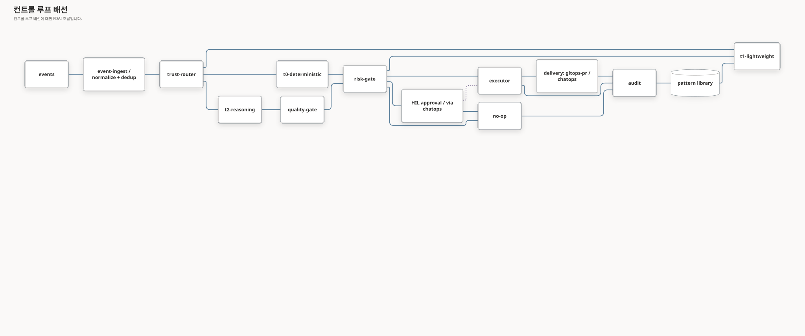

# 프로젝트 구조
이 시스템은 하나의 웹 앱이 아니라 **headless 컨트롤 플레인 + 얇은 콘솔 + ChatOps**입니다. 이 문서는 검증된 5개 서비스 기준선과 독립 패키지 시스템 지식 서비스 후보의 모듈 경계, 의존성 방향, 조립 및 저장소 규칙을 정의합니다. 공유 서비스 계약 SDK는 권한을 부여하지 않는 `RuntimeScopeReceipt`를 소유하며, 서비스가 소유하는 모든 진입점은 시작 전에 이 증적을 하나 내보내 제품 목적, 실행 위치 및 허용된 완전한 기능 행을 결속하되 프로바이더 상태나 성공을 주장하지 않습니다. 공유 온톨로지 코드는 프로덕션 라우팅 및 탐지 제어의 고정된 절대 범위 레지스트리를 소유하고, 런타임과 전달 계층은 활성 값을 버전이 지정된 구성에 유지하며 새 권한 경로를 가져오지 않습니다. Post-turn 런타임 스킬 초안은 스킬을 활성화하지 않고 정규화된 검증 근거 참조를 제안 식별자, 영속 저장소 및 감사 메타데이터에 보존합니다. Bootstrap은 후보를 평가하거나 게시하기 전에 Norns 룰 힌트를 현재 discovery-activation 결정 뒤에 결속합니다. 패키지 release 카탈로그는 도달 가능한 소스 개정 번호에만 고정하며 파생 소스 게이트는 커밋 전과 CI에서 기록된 모든 소스 blob을 비교합니다. 소유 설계 원본만 바뀌면 upstream 통합 뒤에 다시 생성하여 카탈로그 레코드는 유지하고 원본 약속값과 집계 다이제스트만 최종 병합 blob 및 도달 가능한 보호 main 개정 번호에 맞춥니다. 질문은행과 CQAS 산출물도 정확한 원본 카탈로그에서 의존성 순서에 따라 전체를 다시 생성하며 다이제스트만 수동으로 수정하지 않습니다. 확인된 인시던트 생성은 전용 논리 토픽의 버전이 지정된 권한 없는 요청으로 Operator/Core 경계를 통과합니다. Operator는 인증, 원본 초안 재검증 및 영속 수락을 소유하고 Core만 인시던트 수명 주기와 감사 레코드를 기록합니다. 물리 패키지 소유권은 [다중 서비스 저장소 레이아웃](multi-service-repository-layout-ko.md), 로컬 및 배포 topology는 [App 형태](../../../.github/instructions/app-shape.instructions.md)를 참조하세요.
## 설계 개요

물리적인 서비스 workspace는 [다중 서비스 저장소 레이아웃](multi-service-repository-layout-ko.md)이 소유합니다. 이 문서는 의존성 방향, 구조 게이트, 확장 seam, 컨트롤 루프 배선, 구성 및 저장소
규칙을 소유합니다. 비공개 composition 타입 모듈은 강제 크기 상한 아래로 유지합니다. 따라서 새 바인딩은 검토 가능한 상태를 유지하고, 공유 컨테이너가 두 번째 루트가 되기 전에 목적별 wire 모듈로 이동합니다. 사례 이력 검토는 비활성
학습 후보를 제안하기 전에 실패 근거와 일치하는 컨트롤 근거를 모두 요구합니다. Workflow 승인 단계는 no-self-approval invariant를 낮출 수 없습니다. 컨트랙트가 카탈로그 로드 시점에 비활성화된 값을 거부합니다.
에이전트 동작 강화는 다시 생성된 원본 약속값을 통해서만 System Knowledge에 유입되며, 카탈로그 변환 결과는 판단, 복구, 게시 또는 실행 권한을 얻지 않습니다.
Saga는 변경 전에 각 인계를 런타임 `StateStore`에서 점유하고 작업 인식 이슈 어댑터를 요구하므로,
배포되는 `StateStoreIssueTrackerAdapter`가 이슈 및 작업 결과를 재시작 후에도 영속화합니다.
따라서 재시도나 재시작은 외부 댓글을 중복 생성하거나 materialize한 이슈를 잃지 않고 검증된
checkpoint부터 재개합니다.
`verticals.resilience` 패키지는 실행 권한을 추가하지 않고 결정론적 복구 계획 컴파일을 노출합니다. DR 목표 근거는 nearest-rank p90을 보고합니다. 따라서 표본이 적은 cohort도 가장 느린 측정 실행을 유지하며 목표 달성으로 잘못 보고하지 않습니다. 기록된 action 다이제스트가 없는 park된 HIL 레코드는 재개하지 않고 무결성
게이트에서 실패합니다. 따라서 다이제스트를 제거해도 변조된 payload를 승인할 수 없습니다. 품질 게이트는 모든 교차 검사 모델에 범위가 제한된 정규 식별자를 요구하고 중복 식별자를 거부합니다. 따라서 서로 다른 wrapper로 감싼 하나의 모델이 자기 자신과 동의해 혼합 모델 정족수를 충족할 수 없습니다. 사용할 수 없는 경계를 가진 유효한 freeze 또는 quiet ChangeWindow는 건너뛰지 않고 유지 보수 권한을 거부합니다. 구성된 시계 오차 허용치보다 더 앞선 시각이 기록된 변경 이벤트는 settling 윈도우로 억제하지 않고 out-of-band로 보고합니다. 허용 범위 안의 음수 age도 구성된 settling 윈도우가 0이면 억제 구간을 만들지 않습니다. 사전 권한 Change Safety 근거는 작업 생성, dispatch, 감사와 동일하게 주입된 control-loop clock을 사용하므로 고정 replay가 host wall time 때문에 stale 상태가 되지 않습니다. 놓친 임계 위반은 완전한 telemetry에서만 채점합니다. 따라서 false-negative 결과는 관측이 주장하지 않은 완전성 주장을 게시하지
않습니다. 예측 종료 처리는 청구한 모든 episode를 시도한 뒤 첫 실패를 다시 발생시킵니다. 따라서 실패한 episode 하나가 due 대기열 전체를 막을 수 없습니다. T1 맥락 재사용은 trust router와 동일한 정규 형태로 이벤트
리소스 유형을 읽습니다. 따라서 이미 허용된 이벤트를 리소스 유형 변경으로 보고하지 않습니다.
통합 위험 감사 레코드는 risk-gate의 실제 `shadow` 또는 `enforce` 모드를 권한 상한과 별도로
직렬화합니다. Operator 변환 결과는 이 명시적 필드를 사용하며, 레거시 모드는 승격을 추론하지
않고 사용할 수 없음으로 유지합니다.
기록된 Resource 상태 정규화, 유형별 적용성 및 허용 목록 기반 정식 사용 불가 사유는 공유 계약, Core 및 Azure delivery에 유지하고 Operator는 읽기 전용 변환을 소유하며 Console은 그 결과 이유만 지역화합니다. 구성 표류 전달도 `delivery/azure/`와 보호된 Core 서비스 구성에 유지합니다. 검토된 스냅샷은 콘텐츠 주소 기반 private Blob을 통해서만 전달하고, 런타임은 Managed Identity로 읽으며, 적용 후에는 정확한 서버 소유 바인딩을 독립적으로 검증합니다. 독립 서비스 계획 가드는 명령과 환경 변경을 롤백 경계의 일부로 취급합니다. 격리 실행기는 이전에 없던 기본 비활성 legacy-unbound 전환 연결을 정확히 한 번만 도입할 수 있습니다. 이를 활성화하거나 반복 적용하거나 관련 없는 런타임 표류와 결합하는 작업은 허용하지 않습니다.

## Core 도메인 탐색 결정

**초기 설계.** 모든 평면 Core 하위 시스템을 `pipeline`, `incident`, `operator`, `knowledge`
또는 `platform` 아래로 실제 이동한 뒤 한 번의 코드 변경 도구로 모든 가져오기를 다시 작성합니다.

**비판.** 현재 저장소에서는 영향받는 하위 시스템 경로를 1,063개 파일이 가져옵니다. 이 이동은
안전 핵심 커버리지 소스 목록도 바꾸고 fan-out 게이트를 하위 시스템 이름에서 도메인 이름으로
축소합니다. `incident`와 `knowledge`는 이미 하위 시스템과 facade 역할을 함께 수행하며
`ontology_explorer.py`는 다른 구성원과 달리 패키지가 아닌 파일입니다. 이를 이동 전용 변경으로
취급하면 대규모 차이 안에 중요한 테스트, 커버리지 및 게이트 의미가 숨습니다.

**개정 설계.** 5개 도메인 facade를 영구 G-1 레이아웃으로 사용합니다. 그룹 탐색을 제공하면서
실제 하위 시스템과 직접 가져오기는 안정적으로 유지합니다. 집중 레이아웃 검사 98개가 도메인
구성원, 단일 소유권, 이중 역할 패키지, 직접 가져오기 호환성 및 동료 격리를 고정합니다.
`verticals`는 자체 최상위 그룹으로 유지합니다. 이후 실제 이동은 필요하지 않으며 진행하려면
커버리지와 fan-out 의미를 명시적으로 보존하는 별도의 도메인 범위 설계가 필요합니다.
## 모듈 경계(모듈 Boundaries)
[알림 과다 수신 관리](../operations/alert-noise-governance-ko.md)가 타입 지정 근거, Process와 조건부 수동 PR을 소유합니다. 전용 Operator 조립은 요청 의존성과 감독되는 브리지 하나를 연결하며 공통 루트는 수명 주기만 소유합니다. 역할별 framework mixin은 에이전트 API와 인스턴스 격리를 보존합니다. 공유 수락 목록이 결정 검증을 고정합니다. 기존 검증 절차를 갖춘 생성기는 운영 증적을 재작성하지 않고 release 기반 소스 참조를 재평가하며, 소스 테스트와 생성 지식은 권한을 부여하지 않습니다. 공유 SDK는 기존 타입 모델에서 생성한 `test-context-draft`, `test-context-command`, `test-context-application` 버전 `1.0.0` 스키마를 제공합니다. 검증기는 모델의 필드 간 조건도 검사하며, 스키마에 맞는 레코드가 인증된 근거나 현재 권한이 되는 것은 아닙니다. 이 개별 등록만으로 브로커의 N/N-1 배포 전환이 검증되지는 않습니다. 통합 후 System Knowledge를 다시 생성하면 이 경계를 release 메타데이터로만 기록하며 전송 호환성이나 운영 검증 상태를 승격하지 않습니다. 예측 평가 제외 사유는 모델 facade가 공개하는 문자열 열거형이며 JSON 값과 기존 결과 전송 형식은 바뀌지 않습니다. 컨텍스트 변환 모듈은 Core wheel에 포함되고, Operator 컨텍스트 명령 테스트는 명시적인 서비스 검사 소유자를 가지며, DB 전용 테스트는 통합 검사에서 실행됩니다. 타입 검증 뒤에 근거 허용 여부를 평가하고, 상태를 바꾸지 않는 정확한 재생과 새로 허용된 쓰기를 구분합니다. 레코드 내용이 그대로여도 소유 문서의 줄 배치가 바뀌면 카탈로그 원본 해시를 갱신합니다.
인시던트 생성 회귀 테스트는 Core 또는 Operator 서비스 테스트 묶음 하나에만 속합니다. 생성된 question-bank 및 의미 기반 의도 커버리지 산출물은 결정적인 파생 산출물이며 카탈로그 문구가 바뀌면 의존 순서대로 다시 생성하므로, 다시 생성된 출처 해시가 중복 소유 문서 갱신을 요구하지 않고 검토된 원본 변경이 설계 영향을 가집니다.
의존 방향은 엄격하게 단방향이며, 위반은 리뷰 블로커입니다. [AKS 토큰 교환](../deployment/runtime-deployment-profiles-ko.md#신원-및-secret)과 명시적으로 선언한 SDK/비동기 전송 의존성은 서비스가 소유하며 Core 도메인이나 공유 계약에 넣지 않습니다. Operator 자격 증명 테스트는 하나의 서비스 테스트 묶음에 명시적으로 속하며, 생성 함수는 기존 adapters 공개 모듈을 통해 조립 의존 경로 수를 유지합니다. `core/licensing/trial.py`의 비활성 Trial 기록은 기능을 허용하지 않습니다. 배포/영속 계층이 원자적 활성화를 소유하고 런타임은 보존 상태의 출처를 인증해야 합니다. 소스 출처는 CLI가 소유하며 사용 권한이나 release 서명이 아닙니다. Core 배포 단위는 Python Azure Monitor OpenTelemetry Distro 의존성을 소유합니다. 공유 원격 분석은 배포가 Key Vault 기반 `APPLICATIONINSIGHTS_CONNECTION_STRING`을 주입할 때만 이 내보내기를 선택하고, 명시적인 OTLP 엔드포인트를 동시에 설정하면 시작을 차단하며, 그 외에는 로컬 또는 벤더 중립 OTLP 프로바이더를 유지합니다. 이 시작 선택은 Core 도메인 모듈이나 공유 계약에 프로바이더 SDK를 추가하지 않으며, 연결 문자열은 소스, 로그 또는 일반 Terraform 출력에 들어가지 않습니다.
Cost Governance 가명 자료는 Operator 조립이 소유하는 비밀입니다. 공유 계약은 가명 참조와 공개 메타데이터만 전달하며 키를 받거나 데이터 접근 권한 또는 작업 권한을 높이지 않습니다.
클라우드 참조 수집은 수집 API, 파싱/색인 활성화는 작업자, 날짜를 명시한 근거는 Core가 담당합니다. [수명 주기 설계](../interfaces/cloud-resource-knowledge-lifecycle-ko.md)는 공유 계약과 실행 권한이 없는 경계를 정의합니다. Core는 적용 조건을 제한된 단일 값 선택자로 노출하며 근거 객체는 의존 조회 결과로만 받습니다. 정확한 문서 맥락은 순위 계산 전에 이 선택 조건과 함께 적용하며 더 넓은 컬렉션 조회로 대체할 수 없습니다. 새 수집 테스트마다 서비스 테스트 소유자가 하나이며, 이미 선언된 API의 `aiohttp` 의존성은 간접이 아닌 직접 사용으로 분류합니다. 새 패키지는 정규화 텍스트 전용 v2가 기본값입니다. 구현된 [구조화된 v3 확장](../interfaces/cloud-resource-knowledge-structured-rag-ko.md)은 정규화기 `2.0.0`을 기본으로 유지하며 명시적 `2.1.0` 준비에는 판독기 `3.1.0`이 필요합니다. 수집 서비스 소유의 검토 계약, 경로 제한 입출력, 실행 조정 및 자원이 제한된 파싱·측정은 별도 모듈입니다. 새 전송에는 원본을 넣지 않으며 기존 식별자, 출처 시각 및 승인 조건을 유지합니다.
클라우드 변경 비교는 원문과 처리 식별자를 검증하며 Core는 출처와 기존 인용문 예산을 재검증합니다. 문서 검색 스키마 업그레이드는 기능 존재만이 아니라 정확한 카탈로그 소유 프롬프트 계층도 요구합니다. 프레임 모델 스키마는 수락된 판단에서만 연결하는 검색어 상태를 제외하되 내부 검증은 이를 보존하며 복구 예산은 늘리지 않습니다. 병합 후 System Knowledge 메타데이터는 도달 가능한 보호 기준 개정에 연결하며 레코드 내용이나 클라우드 원본 확인 시각을 바꾸지 않습니다.
- **코어는 이식 가능**: 어떤 클라우드 SDK도 직접 가져오기 하지 **않습니다**. 클라우드 특이성은
  `shared/providers/` 의 CSP-중립 인터페이스로만 진입하며, 구현은 `delivery/` 와 `infra/` 에 있고
  조립 시점에 주입됩니다. 이렇게 두 번째 클라우드는 어댑터 추가일 뿐이며 `core/` 편집이 아닙니다.
- **허용된 가져오기**: `shared/`는 `core/`를 가져오기하지 않습니다. `core/`는 `shared/`의
  계약, 프로바이더, 텔레메트리, 구성만 가져옵니다. `delivery/`는 어댑터 경계 뒤에서
  `core/`와 `shared/`를 조립하고 `composition/`이 모든 계층을 연결합니다. `core/`와 `agents/`는
  `delivery/`를 가져오기하지 않으며 provider 동작은 shared Protocol과 composition으로 진입합니다.
  단일 책임을 가진 인접 모듈은 정본 신원 변환과 해시 계산을 소유할 수 있으며 기존 소유 모듈은 해당 공개 기능을 다시 내보냅니다. 분석기 발견 증적, 분석기 작업 구성과 조립, 인벤토리 스냅샷 맥락 보조 로직도 같은 분리를 따릅니다. 기존 모듈은 공개 계약을 계속 다시 내보내며 쓰기 담당, 프로바이더 또는 권한은 이동하지 않습니다. 멱등성 예약의 안정된 작업 비교도 이 분리를 따르며 직렬화 바이트, 전이 검증, 재생 의미는 바뀌지 않습니다. 버전이 있는 최종 측정 계약도 같은 서비스 경계를 따릅니다. Core는 정규화 이벤트의 분류를 감사 기록과 원자적으로 보존하고, Operator는 Core를 가져오거나 분류를 실행 및 효과 권한으로 해석하지 않고 읽습니다. 버전이 있는 운영 활동도 같은 경계를 따릅니다. Core는 스키마로 검증되고 개인정보 범위가 제한된 기록을 내보내며, Operator는 읽기 모델만 저장하고 중계하고 Console은 표현만 지역화합니다. 충돌 근거는 원본 토큰을 바꾸지 않고 기계 판독에 안전한 활동 사유 코드로 매핑합니다. 중복 확인 응답은 일치하는 보존 기록을 요구하며, 충돌 때문에 원래 분류를 조용히 대체하거나 버리지 않습니다. 측정 시각에는 시간대가 명시된 datetime 또는 ISO 8601 문자열을 사용하고 숫자를 암묵적으로 epoch 시각으로 바꾸지 않습니다. 인벤토리 진행률도 같은 소유권 분리를 따릅니다. 공유 패키지는 개수 전용 계약을 소유하고 Core만 추가 전용 원장을 기록하며, Operator는 `SELECT` 권한으로 허용 목록을 투영하고 Console은 Blob, 수집, 승격, 재시도, 승인 또는 실행 권한을 얻지 않습니다.
- **사람 승인 권한은 서비스별로 분리**: Operator는 Teams/Slack 인증, `cryptography`를 통한 로컬 JWT/JWK 암호학적 검증, 콜백 감사, 영속 결정 발신함을 소유합니다. Core 구현을 가져오거나 실행기 신원을 받지 않습니다.
  Core는 타입이 지정된 결정만 소비하며 워크플로 슬롯은 레지스트리로, 승인 대기 작업은 HIL 조정기 또는 정확한 사용자 접근 경로로 전달합니다. Core 조립 루트는 별도로 연결된 Bot Managed Identity를 Teams A1 전달에 사용하며 실행기 신원을 재사용하지 않습니다.
- **문서 OCR은 계약과 공급자 소유권으로 분리**: 공유 서비스 계약 SDK는 배포 권한이 없는 버전별 공급자 정책을 소유하며 문서 워커는 범위가 제한된 로컬 Tesseract 어댑터와 Azure 어댑터 선택을 소유합니다. 인프라는 선택한 엔드포인트, 신원, 공급자 값만 제공하므로 어느 수집 서비스도 다른 서비스 구현을 가져오지 않습니다. 마이그레이션 CI는 기준선 도입 후 스키마 변경 수명 주기 검사를 직렬화하며 후속 복구는 롤백 뒤 루트 소유 공유 인덱스를 보존합니다. 서비스 소유 마이그레이션 검증 전에 이전 Alembic 호환 헤드와 도입 매니페스트 5개를 함께 갱신합니다. 관련 서비스 지문은 기준선 도입 전에 소유한 이전 열과 제약 조건을 반영하여 계보 분리를 방지합니다.
- **담당 체계와 인수인계는 서비스별로 소유하며 초안 전달은 검토 전용으로 유지**: 런타임 조립과 보호된 Core 배포는 [에이전트 운영 담당 체계 수명 주기](../interfaces/agent-stewardship-operations-ko.md)의 GitOps, 병합 결과, 신원 상태, 카탈로그 시간 정책, 지식 수명 주기 경계를 보존합니다. Operator는 체크리스트 전환, 현재 검토자, SQL 읽기 어댑터, 개인 전체의 세션 예산, 담당 체계 전용 H10 경로 6개를 소유합니다. Console의 범위별 편집기는 IAM이나 미래 담당 권한 없이 현재 사용자/그룹/일정 임무, UTC 구간, 대체 담당자, 사례 대체를 다루며 검토된 초안 전달과 병합 관측은 분리됩니다. Operator `composition`은 기존 `iam_composition`을 공통 가져오기 경로로 사용하여 `AssignmentNoticeBridge`와 `build_assignment_notice_bridge`를 기존 `HilDecisionOutboxBridge`와 함께 가져옵니다. 클래스와 팩터리의 정의는 각각 `assignment_outbox`와 `postgres_assignment_outbox`에 남으며, `iam_composition`은 원래 객체를 그대로 다시 내보냅니다. 래퍼는 추가하지 않으며 로직, 영속성, 쓰기 담당, 역할, 토픽, 수명 주기, 준비 상태 동작은 바뀌지 않습니다.
  Core만 배정 사례를 쓰고 보류, 대체 담당 확인, 원본 검증, 소유자별 단계, 준비도 관찰을 소유합니다. `CoreHandoverServices`, `PostgresCoreHandoverReview`, `PostgresCoreHandoverSearch`가 현재 목표, 검토자, 원본 허용, 검색을 연결합니다. `CombinedGovernedHandoverReader`는 명시한 선택자를 기존 통제 문서 읽기 모듈에만 그대로 전달하고 광범위한 Core 인수인계 검색은 호출하지 않습니다. 범위가 지정된 요청에서 기존 원본이 없거나 실패하면 대체 경로 없이 예외를 발생시킵니다. `CoreHandoverDocumentReader`를 직접 호출해도 범위가 지정된 요청은 I/O 전에 보류하며 조건 없는 일반 병합은 바뀌지 않습니다. `bind_handover_semantics`는 기존 `AssignmentWorkflowBindings`로 실제 Norns/Mimir 소비자를 연결하고 내용보다 원본 ACL, 목적, 현재 검토를 먼저 확인합니다. 정확한 타입 지정 JSON Rule과 기능 서술자가 있는 `Distiller`의 온톨로지 후보는 비공개 불변 패키지에 저장되며 Mimir가 모델 없이 독립적으로 재컴파일합니다. 기존 구독에서 되돌릴 수 없는 사용 종료와 정확한 현재 법적 보존 해제 근거에 따른 내용 제거를 수행합니다. 알 수 없는 정책이나 장애에서는 삭제하지 않으며 예약, 증적, 다이제스트, 감사는 보존합니다. 문서 테이블 `SELECT`, 활성 카탈로그/그래프 쓰기, 단일 모델 산문 Rule의 원문 충실도를 보장하지 않습니다.
  Core는 `HumanAccessPlanner`만 만들며 변경 신원을 생성하지 않습니다. Core의 공유 `human_access` 파사드는 격리 Executor가 사용하는 SDK의 `parse_human_access_role_groups`와 정확히 같은 파서 객체를 다시 내보내며 래퍼나 중복 파서는 만들지 않습니다. `HumanAccessWorkflowRuntime`은 원래 HIL 검토 전에 전체 원래 Action/사례/역할 맵/승격 자료를 결속하고, 승인된 인자를 바꾸지 않는 준비 CAS `r -> r+1` 및 고정 담당 pub/sub를 Thor의 격리된 전용 Managed Identity에 연결합니다. 정확한 현재 원본/허용 목록, 비상 정지/상태, principal별 ActionType 정책, 7개 안전장치, 연산과 무관한 멤버십 잠금은 계속 필요합니다. 전달 전에 영속 의도를 하나 기록하며 확인 응답은 효과 근거가 아니고 결과를 모르는 시도는 자동 반복하지 않습니다. 독립 Heimdall 관측과 공유 잠금 해제 종결이 Core의 효과 기록보다 먼저입니다. Vidar는 원래 직접 수행한 변경, 현재 수요, 같은 대상 세대에 결속된 새 독립 승인 역방향 작업을 제안하고 마무리합니다. 사례는 이전 승인이나 역할 권한을 복사하지 않고 degraded/대체 가능 상태로 남습니다. 새 ActionType은 shadow가 기본이며 로컬 권한 전환은 허용하지 않습니다.
  완료된 인수인계 소스 작업에는 실행 경로 강화 20회와 [최종 통합 소스 검토 12회](../../internals/handover-lifecycle-hardening-20260914.md#final-integrated-critique-after-remaining-source-implementation)가 포함되며 해당 체크포인트에서 미해결로 확인된 Medium/High 소스 문제는 없었습니다. 두 번째 로컬 main 병합은 성공했고 [PR #1014](https://github.com/dotnetpower/fdai/pull/1014)에 `c8edd2769`로 게시되었지만 [CI 실행 34921323157의 1차 시도](https://github.com/dotnetpower/fdai/actions/runs/34921323157/attempts/1)는 실패했습니다. 집중 소스 수정은 로컬에서 구현되었으며 최신 게시 헤드는 여전히 `c8edd2769`입니다. [구현 원장](../../roadmap-implementation/architecture/project-structure.md)은 검토 후 번역 갱신, 정본 생성, 수정본 훅/PR 갱신, 정확한 헤드의 보호된 CI 통과/병합을 [#946](https://github.com/dotnetpower/fdai/issues/946)의 미완료 요건으로 유지하고 전체 UI/보조 기술/실제 운영/배포/승격 근거와 구분하며 운영 준비 상태는 false로 유지합니다.
- **관찰 모드 ARB 구성**: `core/architecture_review/observation_loop.py`는 공급자 중립적인 Change -> 인증된 맥락 -> 근거 묶음 -> 시나리오 -> DecisionCase 및 ImpactEnvelope 구성을 소유합니다. Forseti만 기존 타입 지정 버스에 관찰 판정을 게시하고 Saga가 감사하며 `ArchitectureReviewProjector.project_observation`이 읽기 전용 ReviewCase 및 ReviewCheck 객체를 파생합니다.
  이 경로에는 승인, 변경, 승격 또는 실행 권한이 없습니다. 주입된 상태 저장소로 중복 및 재시작에 안전한 재생을 지원하며 저장소에 변환 상태 표식 계약이 없을 때만 범위가 제한된 프로세스 로컬 선입선출 캐시가 해당 상태를 보존합니다.
  루프는 계획된 의도만 수락하고 정확한 온톨로지 및 카탈로그 릴리스를 결속하며 기존 점검을 삭제하지 않고 일시적 보류를 표시합니다. 관찰 판정은 감사 전용이므로 Odin은 작업 포트폴리오에서 제외하고 Thor는 전달하지 않습니다.
  프로세스 계보는 기존 타입 지정 Change의 `process_ref`에서 `change_instantiates_process`로만 변환합니다. 검증 충돌은 지름길 간선을 만들지 않으며 정규화된 Change 출처는 정본 `process_ref`를 보존합니다.
  적합한 묶음을 게시하기 전에 완전한 그래프 원본 세대를 검증하고 실패한 읽기 모델 변환은 영속 상태에서 재시도합니다. ASCII 안전성과 길이 제한을 지키는 시나리오 식별자로 UUID 형태의 변경도 유효한 온톨로지 분기 키로 유지합니다.
  시간 초과 기록의 영속화는 범위를 제한하거나 영속 발신함에 넘깁니다. 판테온 구성원은 `agents/` 바로 아래에 유지하고 비공개 동작 분리 믹스인은 `agents/_framework/`에 두며 AgentSpec, 토픽, 소유권, 모델 정책 또는 권한을 바꾸지 않습니다.
- **버티컬 패키지 구체화는 충돌을 허용하지 않음**: 일반 Core 구체화기는 표준 Rule 또는
  Workflow 로딩 전에 중복 자산 id와 패키지 상대 경로를 차단합니다. 설치는 비활성 패키지가
  수명 주기에 들어가기 전에 전체 Rule 및 Workflow 계약을 검증합니다. 비용 효과 관찰과
  completeness 증적은 이 경계에서 exact expected-effect 출처 digest를 전달합니다.
- **의사 결정 핵심 근거는 계약에 연결됨**: 공유 서비스 계약 SDK는
  `DecisionCriticalEvidenceReceipt`, `DecisionEvidenceVerificationBundle` 및 등록된 Draft 2020-12
  스키마를 제공합니다. 증적은 주장 입력을 연결합니다. 내용 기반 증명 5개는 인증, 근거, 완전성,
  충돌 및 최신성 정책 검증을 정확한 증적, 검증기 버전, 신뢰 기준점 및 유효 구간에 연결합니다.
  Core는 공급자 중립 레지스트리에서 현재 유효하고 폐기되지 않은 결속을 선택하며 생성기 자체 검증,
  시간 초과, 프로바이더 또는 전송 실패, 불일치, 만료, 폐기 또는 합성 근거가 있으면 검증을
  차단합니다. 등록되지 않았거나 잘못된 검증기 응답은 검증에 실패합니다. Core는 반환된 묶음을 다시 검증하며 준비 상태는 연결되지 않은 다이제스트나 거부 상세가 있는 허용 결과를 보존할 수 없습니다. `recorded_at`에 만료된 근거, 기록이나 검증기 활성화보다 앞선 묶음, 증적 또는 결속 최신성을 넘는 admission, 정의된 UTC 오프셋이 없는 타임스탬프는 유효하지 않습니다.
  취소는 제어 흐름 신호로 유지하며 검증 결과로 변환하지 않습니다. 클라우드 SDK 사용은 delivery에 남습니다. Azure 어댑터는 수명이 짧은 Managed Identity 토큰으로 권위 있는 원본을
  다시 읽고 자격 증명을 보존하지 않습니다. 성공적인 묶음은 근거 자격만 입증하며 실행, 승인 또는
  승격 권한을 선언할 수 없습니다.
- **실행된 작업의 관측 인증은 전달 계층에 유지**:
  `delivery/azure/observation_context.py`는 배포 소유 Ed25519 키로 정확한 관측 다이제스트와 네 가지
  신원 계보에 서명합니다. `runtime/observation_evidence.py`는 완전한 배포 구성 하나에만 검증기와
  ActionType별 Azure 수집기를 연결합니다. 보호된 서비스 인계는 인벤토리 읽기 Managed Identity를
  관측 출처로만 Core에 연결하고, 규모 확장은 FinOps 실행 계보에, VM 시작은 Resilience 실행
  계보에 결속하며, 관측을 비활성화하면 해당 추가 신원만 제거합니다. 출처 생성기는
  `runtime/observation_evidence.py`에 유지하여 `runtime/bootstrap_core.py`가 조립만 담당하게
  합니다. Core는 Managed Identity 기반 Key Vault 참조로 seed를 받습니다. 별도의
  `fdai-operational-instance-certification` 전달 진입점은 세대 일치가 확인된 PostgreSQL 집계를 읽고
  실행기 신원이 아닌 Managed Identity로 내용 기반의 비공개 Blob 증적 하나를 씁니다. 모든 권한
  필드는 `false`로 고정되며 일부 구성이나 겹치는 신원 계보는 실패 시 차단됩니다.
- **상시 권한 수명 주기에는 작성기가 하나만 있음**: 인증된 Operator 명령은 타입이 지정된 수신
  경로로 들어오고 하나의 Core 작성기가 공급자 중립 원자적 저장소에 위임합니다. PostgreSQL
  어댑터는 기능군 행을 기준으로 직렬화하고 변경할 수 없는 개정 번호, 해시 체인 전이, 현재 변환
  결과, 단조로운 fence 및 감사 항목을 함께 커밋합니다. 개정 번호 신원은 변경할 수 없는 조건을
  다루고 승인 및 검증된 근거 다이제스트는 순환 다이제스트를 만들지 않고 해당 신원에 결속됩니다.
  정확한 주 저장소 fence 가드는 shadow 전용이며 연결되지 않았습니다. 이후 적용 설계에는 부작용
  커밋 동안 유지되는 검토된 lease가 필요합니다.
- **의미 대상 해석은 결정론적으로 유지**: Core는 정확한 식별자 하나 또는 완전한 읽기 전용 Resource
  및 시간 상관관계가 있을 때 신원 명확화를 제거하고, 하위 유형만 있는 exact-target 작업에는 범위가
  제한된 명확화 하나를 만듭니다. shadow 스키마는 제공된 의도와 정규 신원을 요구하고 유일한 exact
  범위만 보정하며 후보 전용 `forbidden_actions`를 보존합니다. 활성 v8은 `1.0.0`, shadow v14는
  `1.1.0`으로 고정하며 둘 다 프로바이더 입출력, 의사 결정, 승인, 변경 또는 실행 권한을 추가하지
  않습니다. 축약 입력 범위, 일반 컬렉션 필터 정리 및 스키마 복구 안내는 `core/conversation/conversation_preflight_validation.py`에 두고, 타입 기반 경로 승격은 `conversation_preflight.py`에 유지합니다. 조립 루트는 정확한 프롬프트 프로필로 순서, 수명 주기, 예산 및 재실행 다이제스트를 고정하며 더 높은 아티팩트 버전은 스스로 활성화되지 않습니다. 과대 요청은 프로바이더 I/O 전에 보류됩니다.
- **모델 카탈로그 신원은 가능한 경우 발행기로 한정**: Core는 계열 전용 adapter 계약을
  보존하면서 선택적 `(publisher, family)` 카탈로그 경계를 받습니다. Azure delivery는 허용
  목록의 OpenAI 및 AIServices format만 매핑하고 partner 배포 및 endpoint 소유권은 resolver
  밖에 유지합니다. Root Terraform은 해석된 OpenAI와 partner 기능을 별도 모듈로 보내고
  필요한 경우에만 partner private endpoint/DNS를 생성합니다. Deployment는 plan hash 전에
  partner binding을 봉인합니다. Runtime은 exact account 참조의 범위 제한 map을 해석하고
  provider/hostname 불일치를 차단합니다. Platform Terraform이 이 map을 소유하며 보호된 서비스
  구체화는 같은 origin을 독립 Core root에 전달합니다. 의미 계획과 턴 후 검토는 이 map을 통해
  기능 binding을 해석합니다. Staging ChatOps 검증 모드는 결과를 계획 metadata에 봉인하고 계획과
  적용 전에 다시 검증합니다. SKU 한정 quota 조회는 다른 배포 tier가 검토된 secondary 프로필을 충족하지 못하게 합니다.
  Resolver와 composition은 primary 및 secondary 계열을 다르게 요구하고 binding 전에 primary 지연 시간 풀의 secondary 계열 재사용을 거부합니다. 의미 사전 프레임 선택은 요약, 추적, 담당 프레임의 타입을 분리하며
  호환성 facade는 안정적인 import를 유지합니다.
- **자격 검증 축약에는 권한이 없음**:
  `core/conversation_assurance/quality_qualification.py`는 미리 측정하고 정규화한 관측값만
  받아 설치된 계약에 따라 축약합니다. 원시 근거 상태에서 하드 상한을 계산하고 반올림 전 임계값 판정을 보존합니다.
  v1은 `locale_statistical_evidence_missing`을 기록하며 자격을 충족할 수 없습니다. 모델 호출, 프로바이더 읽기, 정책 승격, 요청 승인 또는 작업 실행도 할 수 없습니다.
  중복 키 차단을 포함한 JSON 구문 분석과 원자적 산출물 교체는 리포지토리가 소유하는
  `scripts/evaluation/chatops-quality-qualification.py` 경계에 남습니다. 완료된 턴 관측 adapter는
  콘텐츠가 없는 공용 계약을 사용하고 런타임 및 근거 참조를 해시하며, 지원하지 않는 모든 차원을
  점수를 만들지 않고 `unavailable`로 유지합니다. 근거 소유자는 계약에 연결된 기여를 통해
  측정값을 추가합니다. 결합기는 다른 사례의 입력, 중복 차원 및 기존 측정값 덮어쓰기를 차단합니다.
  작업 관측은 대화 품질 보증 안에서 판정을 복제하지 않고 기존 safeguard, 실행 권한 및 통합 위험
  기록을 재사용합니다. HIL, 신원 분리 및 감사 재실행 관측도 기존 결과 기록을 비교하며 승인 또는
  실행 경로가 되지 않습니다. 같은 어댑터는 기존 수정, 런북, what-if 및 타입이 지정된 `Action`
  결과를 소유하지 않고 읽습니다.
  SRE 관측도 기존의 근거 기반 RCA 결과를 읽으며 가설을 권한으로 바꾸지 않습니다. 대체 원인
  관측은 근거가 있는 RCA 후보만 받고, 영향 관측은 결정론적 `ChangeAssessment`를 재사용하며
  불완전하거나 잘린 상태를 보존합니다.
  조정 관측은 범위가 제한된 shadow 계획 및 리비전이 있는 할당 기록을 재사용하며 작업을
  라우팅하거나 소유권 또는 IAM 효과를 적용하지 않습니다.
  의도 관측은 타입이 지정된 의미 처리 결과와 검증된 다이제스트만 사용하며 어휘 기반 의도
  경로를 추가하지 않습니다.
  답변 품질 형태 관측은 결정론적 AnswerPlan을 재사용하며 답변 문장을 검사하지 않습니다.
  근거 관측은 최종 근거와 평가 참조를 재사용하며, injection 저항성에는 텍스트 검사가 아니라
  보안 소유자의 명시적 결과가 필요합니다. 두 경로 모두 권한을 부여하지 않습니다.
  인접한 `quality_latency.py` 모듈은 5단계 SLO 계약과 순수 백분위수 축약만 소유합니다. Operator,
  `channel_assurance.py`는 전송을 소유하지 않고 공통 내용, 제한, 근거 및 권한 검사와 기능 선언 기반 진행 상황, rich, thread 및 edit 검사를 적용합니다. `copilot_review.py`는 자격 검증 또는 실행 권한을 부여하지 않는 소유자 전용 digest 결속 검토 packet을 내보내고 가져옵니다. Operator, 채널, 검증 및 전달 소유자는 타임스탬프와 측정 권한을 유지합니다.
  단계 소유자는 타입이 지정된 증적을 통해 monotonic 시작 및 완료 값을 제공합니다. Core는 증적
  환경이 설치된 단계 계약과 일치한 후에만 기간을 파생합니다. 저장소 CLI는 콘텐츠가 없는
  Conversation Assurance는 composition이 PR benchmark 환경과 sink를 모두 주입한 경우에만
  결정론 검증 증적을 생성합니다. 일반 runtime composition은 변경되지 않습니다.
  명시적 Pantheon 캠페인은 Pantheon 초기화 후 별도의 일회성 런타임 연결을 사용합니다. Core는
  요청된 사례를 서버의 고정 census와 대조해 검증하고, Bragi는 단일 최종 답변을 만들며, 응답 경로
  밖의 서로 다른 모델 계열 검토자는 상관관계가 연결된 30점 진단을 추가합니다. 일반
  `operations-review` 턴은 등록된 함수 권한의 변경할 수 없는 스냅샷을 준비 상태 소비자에게 노출하는 기존 의미 런타임을 계속 사용합니다. 스키마로 검증된 판단은 활성 매니페스트와 정본 주체 및 항목이 일치하는 일반 타입 프레임만 복구할 수 있습니다. Golden 인증은 정확한 예상 최종 처리 결과에 바인딩되고, Operator 묶음은 Core 계획 전에 요청된 로케일을 보존합니다.
  Azure 평가자 어댑터는 모델 계열과 호환되는 완료 필드를 선택하고 연결, HTTP 상태 및 잘못된 응답 실패를 범위가 제한된 콘텐츠 없는 사유 코드로 축약합니다. Core는 프로바이더 응답 내용을 검사하거나 프로바이더 권한을 부여하지 않고 이 코드를 검증하여 의미 평가 축약과 평가 보류 결합까지 보존합니다. 과거 `context_locale_scorecard.py`는 호환 전용으로 다시 내보냅니다.
  표본을 구문 분석하며 추적 약속값을 완전한 추적 주장으로 변환하지 않습니다. 인접한
  `quality_trace.py` 축약기는 레코드 약속값만 받고 순서가 정확한 세션부터 감사까지의 연결에서
  완전성을 증명하며 권한을 부여하지 않습니다. `quality_timing.py`는 설치된 계약, 출처 리비전,
  추적 수와 집합 및 산출물 다이제스트 쌍을 결합한 뒤 timing 필드를 파생합니다. 이전 입력에는
  상한을 유지하며 런타임 소유자가 타임스탬프와 생산자 권한을 계속 소유합니다.
- **authorization은 instance에 binding됩니다**: Context provider는
  `ExecutionAuthorizationRequest.target_resource_ref`의 exact Resource ID를 반환해야 합니다.
  불일치는 policy, identity 또는 effective-access 평가 전에 보류되며 권한 없는 audit context에
  기록됩니다.
- Historical topology는 선택된 모든 PostgreSQL revision이 동일한 exact ontology release
  binding을 가질 때에만 replay-safe입니다. 누락되거나 혼합된 release와 dangling active link는
  absence를 입증하지 않고 completeness를 낮춥니다.
- Inventory projection contract는 다른 Resource topology link와 함께 검토된 `runtime_calls` link를
  등록합니다. 검증된 edge는 선언된 방향을 현재 및 과거 조회에서 유지합니다. 인증된 생성기만 정확한 다이제스트, 독립 원본 컨텍스트, 유한한 기한을 확인한 뒤 신뢰할 수 없는 묶음을 변환하며 증적은 엔드포인트 ID와 활성 세대 유형을 결속합니다. Operator는 브로커 수락 뒤에만 호출자 시점을 기록합니다. 독립 서비스 루트는 서로 다른 두 정식 Container App ARM ID를 요구합니다. PostgreSQL 역할 근거는 Resource 토폴로지 밖에 유지하고 실행 중 권한을 거부하며 역할 이름 대신 불투명한 인증 참조와 범위가 지정된 원본 컨텍스트에서 principal handle을 파생합니다.
- **정책과 규칙은 코드 경로가 아닌 데이터**: T0가 런타임에 `rule-catalog/` 엔트리와 `policies/`
  를 로드하므로 규칙/정책 추가에 엔진 변경이 필요 없습니다. 규칙은 의도와 교정을
  기술하고, 정책은 검증기가 재검사하는 실행 가능한 OPA/Rego입니다. 소스가 이 YAML로 수집·
  정규화되는 방법은
  [rule-catalog-collection-ko.md](../rules-and-detection/rule-catalog-collection-ko.md) 에 있습니다.
- **거버넌스 변경은 범위와 감사 가능성을 유지**: 범위가 지정된 재정의와 기한이 있는 예외는
  검증된 카탈로그 데이터로 로드합니다. Core는 정확히 포함된 규칙과 리소스 범위만 해석하고,
  요청자와 승인자 신원을 분리하며, 매개 변수 완화와 만료 근거를 기록합니다. 재정의를 실행
  승인으로 취급하지 않습니다.
- **전달은 교체 가능**: `gitops-pr` 와 `chatops` 는 하나의 인터페이스 뒤의 어댑터라,
  실행기는 추상 액션을 발행하고 어댑터가 그것을 렌더링합니다(remediation-pr, Adaptive 카드).
  실행기가 유일한 privileged 신원을 보유하며 어댑터는 이를 공유하지 않습니다.
- **콘솔에는 privileged 신원이 없음**: 상태, 감사, shadow 결과, HIL 큐를 시각화합니다. 접근 권한은
  검증된 App 역할에서 나오며 선택적인 access 변환 결과와 무관합니다.
  Command 표면은 인증된 기록이나 타입이 지정된 제안을 제출할 수 있지만, 이 표면도 dev 서술기도
  실행기를 호출할 수 없습니다. risk, 승인, 감사, 실행은 서버 측에 남습니다
  ([security-and-identity-ko.md](security-and-identity-ko.md)).
  전송 계층이 활성화되면 하나의 semantic-aware 어댑터가 변환 결과, 제안, 스트림 포트를 연결합니다.
  이 어댑터의 발신함은 데이터베이스 `NOW()` 기한을 사용하고, 트랜잭션 단위 결과 재사용은 요청,
  principal, terminal-result 다이제스트를 검증합니다.
  여기에 더해 버전이 지정된 `background-task-projection` topic은 Core 소유 detached-task
  snapshot 및 progress의 트랜잭션형 outbox를 배출해 Operator 소유 변환 결과 테이블로
  전달합니다. Operator는 이 테이블만 읽고, 결정론적인 변환 결과 신원으로 중복과 오래된
  reorder를 제거하며, Core `background_task_*` 테이블을 직접 읽지 않습니다.
  검증된 의미 조회 노드 전이는 Core에서 Operator로 향하는 별도의 범위가 제한된 best-effort
  topic을 사용합니다. Operator는 활성 SSE 스트림에서만 이 진행 상황을 일시적으로 유지합니다.
  영속 최종 변환 결과와 근거 증적은 재연결 및 완료의 권위로 유지되며, 진행 상황 발행 실패는
  조회 실행을 바꾸거나 실행 권한을 부여할 수 없습니다.
  저장소 Best Practice 정의는 조립 루트에서 한 번 로드하고 GET 전용 목록 및 상세
  경로로 노출합니다. 이 정의는 카탈로그 참조 데이터로 유지되며 런타임 근거 프로바이더를
  명시적으로 연결하기 전까지 변환 결과는 `Unknown` 및 `not-connected`를 보고합니다.
  탐색 셸은 아이콘 전용 활동 Bar와 다섯 개의 안정적인 영역인 `전체 현황`, `운영`,
  `에이전트`, `거버넌스`, `감사·증적`을 사용합니다. 인접한 Explorer는 선택한 영역에 등록된
  패널을 렌더링합니다. 영역을 선택하면 Explorer를 열고 운영자의 로컬 패널 순서 및 표시
  설정에 따라 첫 번째 visible 패널로 이동합니다. 영어가 기본 표시 언어이며, 한국어 카탈로그는 그룹 id, 패널 id,
  경로를 바꾸지 않고 한국어 레이블을 제공합니다. 운영자는 브라우저 로컬의 계정별 설정에서
  패널 순서를 바꾸거나 숨길 수 있습니다. 아이콘 전용 셸 컨트롤은 키보드 focus에서 즉시
  열리고 포인터 hover에서는 잠시 지연되는 공통 툴팁으로 현지화된 레이블을 표시합니다.
  이 툴팁은 문서 본문 portal에 렌더링되고 뷰포트 안에 머물도록 방향이나 위치를
  조정하며 reduced-motion 설정을 따르므로 브라우저 기본 `title` 표시에 의존하지 않습니다.
  숨김은 탐색 표시에만 적용되므로 직접 경로와 검색은
  계속 사용할 수 있고, 현재 활성 패널은 숨길 수 없습니다. 세부 경로는 공통 페이지 제목 안에
  간결한 영역 / 패널 계층을 렌더링하여 Explorer를 접어도 맥락을 유지합니다. 대시보드는
  `전체 현황 / Dashboard`를 렌더링합니다. 패널 제목이 영역 레이블을 반복하는 영역 루트와 독립
  유틸리티는 단일 제목을 유지합니다. 대화 품질 보증 맥락 및 로케일 측정은
  `core/conversation_assurance/quality_context_locale_observations.py`에 남아 있는 Core 소유
  기능입니다. persistence, preference, session, screen 표면은 범위가 제한된 근거 또는
  projection만 내보낼 수 있습니다. 기여는 공용 턴 묶음의 사례 및 로케일과 일치해야 하며,
  principal 간 집계를 하거나 브라우저 텍스트를 권위 있는 근거로 대체하거나 qualification
  상태를 직접 부여할 수 없습니다. hidden-scope leak와 근거 없는 screen claim은 명시적인
  critical-safety 입력으로 남습니다. 에이전트 영역은 명단,
  Organization, 활동, 인계 패널 전체에 표시되는 작업 공간 탭 행도 유지합니다. 명단은
  기본 에이전트 보기이며 Operator API가 반환하지 않은 지표를 만들지 않고 현재 스트림 상태, 현재 작업,
  인시던트 연결, 보고선, 증적 링크를 투영합니다. 필터와 검색은 브라우저 로컬 표시 제어이며,
  또한 런타임 연결을 별도로 표시합니다. 11개의 타입이 지정된 EventBus 구독자와 Huginn의 raw-ingress
  구독자는 대기 상태를 유지하고, Njord와 Freyr는 외부 어댑터를 기다리며 Loki는 scheduled
  트리거를 기다립니다. Huginn은 실시간 리소스 발견 유입을 소유합니다. Azure 생성,
  갱신, 삭제 신호는 정본 이벤트 토픽으로 들어오고, 주입된 전달 projector가 Azure
  I/O를 에이전트 내부에 넣지 않은 채 enrichment와 ordered 인벤토리 delta 적용을 담당합니다. 전용
  범용 인벤토리 delta forwarder는 각 `InventoryBatch.links` patch를 보존합니다. `contains`는
  대상 리소스에, 다른 관계 타입은 출처 리소스에 할당합니다. 같은 배치에 관계 소유자 리소스가
  없으면 커서 진행을 차단하여 그래프 데이터를 조용히 버리지 않고 페이지를 재시도합니다. Event
  멱등성 신원은 범위, 리소스, 관계 페이로드의 범위가 제한된 SHA-256 다이제스트입니다. 따라서 긴
  리소스 id 때문에 구분용 다이제스트가 잘리거나 이벤트 계약 길이를 초과하지 않습니다. Delta 리소스에는
  표준 시간대가 포함된 RFC 3339 `last_seen`이 필요합니다. 정렬 시간이 없거나 잘못되면 프로세스 wall
  시계로 대체하지 않고 발행과 커서 진행을 차단합니다. 하나의 배치에는 각 `resource_id`가 한
  번만 포함될 수 있으며 중복이 있으면 이벤트를 발행하기 전에 배치 전체를 차단합니다.
  리소스 및 관계 속성은 finite 숫자 값으로 정본 JSON 직렬화가 가능해야 합니다. 지원되지
  않는 객체와 `NaN`은 신원 계산, 발행 또는 PostgreSQL 연결 전에 거부됩니다. Realtime
  projector와 변경할 수 없는 스냅샷 staging은 사전 검증된 정본 JSON 문서만 저장하며 스냅샷
  커버리지 메타데이터도 begin 또는 승격 전에 같은 규칙을 적용합니다. Azure 관계의 속성 경로,
  허용된 프로바이더 타입, 의미 방향, 출처 스키마 다이제스트 및 근거 정책은 검토된
  `provider-relationship-mappings` 카탈로그에서 가져옵니다. 완전한 세대 verifier는 같은 세대에서
  두 엔드포인트를 모두 관찰하고, 프로바이더와 verifier 신원이 서로 다르며, 변경할 수 없는 검증
  receipt가 edge와 mapping 개정 번호를 고정한 경우에만 후보를 활성화합니다. 엔드포인트 누락,
  모호한 방향, stale 스키마 mapping, 중복 또는 conflicting 관찰, 부분 세대는 stable dropped reason을
  남기고 active graph edge를 만들지 않습니다. 검증된 링크는 변경할 수 없는 state-fact 및 링크 관찰
  메타데이터를 운반합니다. stale 또는 conflicting 근거는 operational-context 자율성을 낮출 수만
  있습니다.
  Versioned provider-schema 후보 materialization은 delivery 책임으로 유지합니다.
  `provider_schema_relationship_generation.py`은 정확한 provider-schema 및 REST evidence digest,
  mapping revision, projection manifest, direction, cardinality 및 link metadata를 결속합니다.
  변경된 provider type/version 신원은 영향받은 후보만 무효화합니다. Append-only ledger는
  rollback과 replay를 지원하며 promotion은 별도 검토된 proposal-only catalog 작업으로
  유지되고 graph 또는 migration 권한은 없습니다. Exact-release direction 비교는 strict
  release 검사를 요청했는지 기록하므로 replay는 어느 generation에 one-sided metadata가
  있는지에 따라 mode를 추론할 수 없습니다. Reviewed mapping model은 후보 metadata 검증에
  사용하는 canonical cardinality를 제공하며, cardinality가 생략된 경우에는 reviewed
  LinkType default에서만 파생합니다. Runtime constructor는 rebuild, graph, execution 또는
  migration authority literal을 true로 설정하려는 시도를 거부합니다.
  범위가 제한된 배치의 모든 이벤트는 첫 발행 전에 생성 및 검증되므로 뒤쪽의 잘못된 리소스 때문에 앞쪽
  이벤트가 검증 단계에서 부분 발행되지 않습니다.
  `has_more`로 표시된 모든 delta 페이지는 기록을 방출하기 전에 새로운 이어가기 커서를 제공해야
  합니다. 커서가 없거나 변경되지 않으면 최종 fence 없이 pull이 실패합니다. 정상적으로 진행하는
  스트림이 설정된 페이지 상한에 도달하면 최신 커서를 반환하여 다음 pull이 그 위치에서 재개됩니다.
  최종 `final=True` 배치에는 리소스와 관계가 포함될 수 있으며 forwarder는 커서를 커밋하기
  전에 해당 페이로드를 발행합니다. 최종 fence 뒤에 배치가 나오면 스트림을 실패시키고 이전 영속
  커서를 유지합니다. 최종 배치가 커서를 생략하면 forwarder는 pull 시작 시점의 커서로
  되돌리지 않고 마지막 non-null 페이지 커서를 커밋합니다.
  Azure Activity Log 어댑터는 대응된 각 ARM 리소스 id에서 resource-group `contains` 관계를
  생성하고 같은 delta 페이지에 포함합니다. 실제 운영 리소스 읽기가 필요한 의존성은 ARG 또는 ARM
  hydration 어댑터가 제공할 때까지 불완전한 상태로 유지됩니다. 리소스 삭제의 권한은 Event
  Grid에 유지됩니다. Upsert 전용 Activity Log 어댑터는 리소스를 되살리지 않도록 삭제 연산을
  건너뛰지만, filtered 기록이 스트림을 멈추지 않도록 모든 유효 이벤트 시각으로 페이지 커서를
  진행합니다. 한 리소스의 기록이 여러 개이면 이벤트 시간과 정본 리소스 문서 순서로
  결정론적으로 선택하며 각 페이지는 `resource_id` 순서로 리소스를 방출합니다. 재개 커서와 페이지의
  모든 객체 이벤트에는 tracked 리소스로 대응되지 않는 이벤트까지 timezone-aware RFC 3339 시각이
  필요합니다. 잘못된 이벤트 시각은 폐기하거나
  UTC로 간주하지 않고 페이지를 실패시켜 정렬 권한을 보존합니다. Activity Log non-2xx 오류는
  HTTP 상태만 보고하며 응답 본문은 exception 또는 로그 텍스트에 포함하지 않습니다.
  In-flight 커서에는 유효한 running 시각과 비어 있지 않은 next 링크가 모두 필요합니다. 초기
  lower 한계는 비어 있는 intermediate 페이지에서도 유지되므로 페이지 나누기가 최종 재개 커서를
  지우거나 뒤로 이동시킬 수 없습니다. 단일 구독 Activity Log 어댑터는 정본 hyphenated
  구독 UUID만 허용하여 범위 텍스트가 요청 경로 또는 조회를 변경하지 못하게 합니다. Bearer
  토큰 엔드포인트는 userinfo, 경로, 조회, 조각이 없는 HTTPS 출처 URL이어야 합니다.
  각 Activity Log 응답은 `max_events_per_page`(기본값 1000)로 제한되며 상한을 초과한 페이지는 대응
  또는 커서 진행 전에 실패합니다. 모든 `value` 항목은 객체여야 하며 malformed 항목은 정렬
  위치를 안전하게 확인할 수 없으므로 페이지를 실패시킵니다.
  PostgreSQL projector는 각 리소스와 관계 변경을 하나의 트랜잭션으로 적용합니다. 쓰기 담당은
  스냅샷 승격 shared 게이트, 그래프 조정 게이트, 변경 리소스 및 모든 관계 엔드포인트의
  정렬된 잠금 순서로 획득합니다. Resource 잠금은 음수 키 범위의 seeded 63-bit 참고용 키를
  사용하므로 양수 global 승격 및 조정 게이트와 키 범위가 분리됩니다. 일반 patch는 그래프 게이트를 공유하므로 관련 없는 리소스는 동시에
  처리할 수 있습니다. 리소스 삭제와 `links_complete: true` 관계 교체는 그래프 게이트를 독점하고,
  유효 관계 집합을 읽은 뒤 누락된 관계를 커밋 전에 tombstone으로 기록합니다.
  모든 관계 upsert는 effective 리소스 그래프에서 양쪽 엔드포인트를 확인하고 선언된 엔드포인트
  타입이 해당 리소스와 일치해야 합니다. 엔드포인트가 없거나 모순되면 리소스와 관계 변경을 함께
  롤백합니다. 각 인벤토리 변경에는 `(from_id, link_type, to_id)` 키별 항목이 최대 하나만
  포함되며 중복 키는 데이터베이스 I/O 전에 거부됩니다.
  모든 들어오는 관계 patch는 변경된 리소스가 소유해야 합니다. `contains`는 대상이
  소유하고 다른 관계 타입은 출처가 소유합니다. 소유하지 않은 patch는 관련 없는 그래프 간선을
  변경할 수 없습니다. 변경별 `max_links` 상한은 항상 양수이며 0은 관계를 가진 모든 삭제를
  조정할 수 없게 하므로 시작에서 거부됩니다. 데이터베이스에서 파생된 tombstone은 별도
  `max_reconciled_links` 상한(기본값 4096)을 사용하며 이 값은 `max_links` 이상이어야 합니다. 따라서
  신뢰할 수 없는 페이로드 한도를 넓히지 않고도 관계가 많은 리소스를 원자적으로 삭제할 수 있습니다.
  기존 effective `resource_id`의 리소스 타입도 realtime 갱신 전체에서 유지됩니다. 모순된 타입은
  리소스 행 또는 관계가 변경되기 전에 거부됩니다.
  realtime 리소스 오버레이가 하나라도 pending 상태이면 base 스냅샷이 최신성 예산 안에 있어도 그래프 최신성은 `unknown`이고 읽기 변환 결과는 degraded 상태입니다. 완전한 조정 승격이 포함된 오버레이를 정리하면 스냅샷 기반 최신성이 복원됩니다. 읽기 전용 상태 전이 조회는 사용 가능한 Resource 범위의 검증된 양성 행을 유지할 수 있지만, 결과를 불완전하게 유지하며 누락 범위로 부재를 증명할 수 없습니다.
  각 projector 결과에는 `applied`, `not_applicable`, `snapshot_covered`, `ordering_rejected` 타입이 지정된
  결과가 포함됩니다. 스냅샷 및 정렬 suppression은 이벤트 id와 범위가 제한된 사유를 포함한
  `inventory_delta_ignored`도 방출하여 안전한 no-op와 적용된 갱신을 구분할 수 있게 합니다. 기존
  two-field 결과 생성은 생략된 결과를 `applied`로 기본 설정하여 호환성을 유지합니다.
  `inventory.resource_changed`만 변환 결과에 도달하고 다른 typed 이벤트는 `not_applicable`이며 기존 호출자는 `event_type`을 생략할 수 있습니다.
  원장 레코드는 nullable 프로바이더 이벤트 시각과 필수 FDAI 수집 시각을 다른 시각과 분리하며 기존 행은 신원을 바꾸지 않고 기록 시각을 사용합니다.
  지원되지 않는 Event Grid 타입은 `unclassified-resource`를 사용하며 신원이 완전한 `full_provider_scope` 범위만 rolling snapshot에서 허용합니다.
  `links_complete`가 없거나 false이면 관찰하지 못한 관계를 제거하지 않습니다. 스냅샷 승격은
  exclusive 승격 게이트를 유지하므로 어떤 delta 트랜잭션과도 동시에 실행되지 않습니다. 전용
  inventory sync 경로는 Azure Resource Graph와 ARM 대체 경로의 완전한 reconciliation
  snapshot을 원자적으로 promote합니다. Heimdall은 최신성, lag, 범위를 관찰하며 복구를 시작하지
  않습니다. 현재 고정 정기 간격은 이전 구성입니다. 목표는
  [지속형 운영 인스턴스 그래프](continuous-operational-instance-graph-ko.md)의 원본 예산, 공급자
  rate limit, 범위가 제한된 backoff, 최대 노후 목표에 따라 이벤트 ingress, 재개 가능한 delta,
  부하 인식 reconciliation을 지속적으로 결합합니다. 로컬 실행 장치는
  Azure 발견을 실행하지 않습니다.
  OI-12 집계 인증은 순수 Core 증적으로 유지합니다. 정확히 7개 축을 요구하고, 측정하지 않은
  축은 범위가 제한된 사유와 함께 사용할 수 없는 상태로 유지하며, 관찰, 변경 및 실행 권한을
  false로 고정합니다. `complete` 필드는 측정 범위만 의미합니다. 수집은 계속 provider adapter가
  소유하며 배포 인증은 별도 근거로 남습니다.
  Organization은 디렉터리와 Org chart 보기를 제공하며, `?view=org`는 실시간 보고 계층의 직접
  링크를 유지하고 각 노드는 해당 에이전트의 런타임 상세 포커스를 엽니다.
  활동 링크는 선택한 에이전트를 경로 조회에 유지합니다. 활동은 영구 감사 타임라인보다
  먼저 해당 에이전트의 현재 스트림 상태와 최근 실제 운영 인시던트를 표시하므로 감사 귀속이
  지연되거나 없어도 활성 에이전트가 빈 화면으로 보이지 않습니다. 로컬 dev 모드는 Settings
  바로 위에 `Labs` 영역도 표시하며, 운영 탐색에서는 이 개발 전용 영역을 생략합니다.

## 리포지토리 스크립트 레이아웃

리포지토리 자동화는 책임에 따라 `scripts/` 아래에 그룹화합니다. 루트 파일로는 레이아웃 README, `verify.sh`, Python 패키지 마커만 유지합니다. 품질 게이트, 무결성 도구, 거버넌스 검사,
카탈로그 유틸리티, 배포 도우미, 일반 자동화는 각각 전용 디렉터리를 사용합니다. `tests/integration/scripts/`의 교차 배포 workflow 테스트는 이러한 도우미를 전송 계약으로 검증하며 온톨로지나 런타임 소유권을 옮기지 않습니다.
배치 규칙은 [scripts/README.md](../../../scripts/README.md)를 참조하세요.

`infra/scenario-lab/`은 선택형 배포 검증 루트이며 여섯 번째 런타임 서비스가 아닙니다. 실행기
스크립트는 `scripts/deployment/scenario-lab/` 아래에 있고, 루트 `scenario-lab` Python extra에는
범위가 제한된 검증 실행에 필요한 드라이버 의존성만 포함됩니다.

## 구조 CI 게이트

위 경계 규칙을 CI에서 강제하는 네 개의 스크립트가 있으며, 리팩터가 랜딩된 뒤에 드리프트가
슬금슬금 돌아오는 것을 막습니다. 전부 `scripts/quality/architecture/` 아래에 있고 CI 파이프라인과 로컬 pre-push
훅에서 모두 실행됩니다. 상응 문서는
[coding-conventions.instructions.md](../../../.github/instructions/coding-conventions.instructions.md)
에 있습니다.

| 게이트 | 규칙 | 현재 모드 |
|--------|------|-----------|
| [check-core-imports.sh](../../../scripts/quality/architecture/check-core-imports.sh) | `core/` 는 클라우드 SDK, HTTP 클라이언트, `fdai.delivery.*` 를 가져오기 금지 | 강제 적용 |
| [check-agents-imports.sh](../../../scripts/quality/architecture/check-agents-imports.sh) | `agents/` 도 같은 집합 금지 | 강제 적용 |
| [check-file-loc.sh](../../../scripts/quality/architecture/check-file-loc.sh) | 400 LOC 초과 시 warn, 강제 적용 모드에서 800 초과 시 fail | warn-only |
| [check-subsystem-fanout.sh](../../../scripts/quality/architecture/check-subsystem-fanout.sh) | 한 파일이 `core.*` 형제 subsystem 을 8개 이상 가져오기 하면 warn, 15개 이상이면 강제 적용 모드에서 fail | warn-only |

### 새 게이트 추가

1. 기존 스크립트 패턴을 따라 `scripts/quality/architecture/check-<name>.sh` 를 작성합니다 (환경변수로 warn/fail
   임계값, 앞선 `#` 정당성 코멘트를 요구하는 허용 목록, stale 엔트리 거부,
   GitHub Actions 어노테이션, `CHECK_QUIET=1` 요약 모드).
2. 현재 트리를 깨지 않도록 **warn-only** 로 배포합니다.
3. `.github/workflows/ci.yml` 에 잡을 추가하고 `.githooks/pre-push` 에 호출을 추가합니다.
4. `services/core-control-plane/tests/test_check_structural_gates.py` 에 warn / 강제 적용 / 임계값 재정의 /
   허용 목록 / stale 항목 / 경계 조건 을 커버하는 회귀 테스트를 추가합니다.
5. `services/core-control-plane/tests/test_structural_gates_drift.py` 에 CI 잡과 pre-push 배선 이 드리프트로 사라지지
   않도록 가드를 추가합니다.

### 게이트 warn -> 강제 적용 승격

1. 현재 warn 베이스라인을 정리하는 리팩터를 랜딩합니다 (트래커 #14).
2. CI 잡에서 게이트의 모드 환경변수를 뒤집습니다 (`FILE_LOC_MODE=enforce` 등).
3. 정당한 예외가 있으면 게이트 허용 목록 파일에 H3 규칙 (앞선 `#` 코멘트) 을 지켜 넣습니다.
4. 트리를 통과시키기 위해 임계값을 약화하지 **않습니다**. 파일을 쪼개거나 허용 목록에
   기록하세요. 붉은 파이프라인을 풀려고 임계값을 낮추는 것은 거버넌스 회귀입니다.

## 의존성 주입을 통한 커스터마이제이션

업스트림은 범용 인터페이스와 동작하는 기본 구현을 제공합니다. 포크는 `core/`를 편집하거나
복사하지 않고 자체 조립 루트에서 의존성을 주입해 구성을 변경합니다.
[포크 모델](../../../.github/instructions/generic-scope.instructions.md)을 참조하세요. [알림 과다 수신 관리](../operations/alert-noise-governance-ko.md)는 제한적 조회기, 독립 근거, 기존 Workflow/Process 조정, GitOps 전달, 원본 작성자 통제 및 효과 중계를 연결합니다. 공유 알림 코덱은 온톨로지 쿼리 한도를 늘리지 않고 비공개 근거 크기를 제한하며, 순수 평가 함수는 불완전한 라우팅을 보고서 완전성에도 반영합니다. 공유 시계열 스키마는 완전하고 균일한 관측량과 사례별 탐지 결과를 고정합니다. Core는 평가 구간/주기 중 한 축을 비교하고 전달 계층은 고정된 출처 기록을 인증하며 지원되는 Azure Terraform 기간 필드만 생성합니다. Operator 요청 이력은 자체 접수를 정확한 서명 결과와 연결하며 공유 제안 상세는 Core 테이블에 접근하거나 승인/결과 권한을 만들지 않고 기준선과 재생 지표를 결속합니다. 팩터리는 처리 구조만 제공하며 독립 권한이나 수신자/효과 증적을 만들지 않습니다. 운영 도입에는 아직 충족해야 할 조건이 있습니다.

> **포크 유지관리자**: 절차적 walkthrough는
> [downstream-fork-guide-ko.md](../fork-and-sequencing/downstream-fork-guide-ko.md)에서 시작. 이 섹션은
> 그 가이드가 operational 화하는 경계 카탈로그입니다.

- **조립 루트**: `core/` 는 `shared/` 의 CSP-중립 인터페이스에만 의존합니다.
  얇은 조립 루트(`core/` 밖)가 시작 시 구체 구현을 바인딩합니다. `core/` 는 절대 구체
  어댑터를 new-up 하지 않고 의존성을 주입받습니다. 상류 기본 바인더는
  [`fdai.composition.default_container`](../../../services/core-control-plane/src/fdai/composition/__init__.py) 이며,
  포크의 엔트리 포인트는 해당 바인딩을 감싸거나 교체하는 자체 팩토리를 호출합니다.
  구체 어댑터 클래스(예: `PackageResourceSchemaRegistry`, `JsonSchemaContractValidator`)
  는 공개 서브-패키지에서 re-export **되지 않습니다**; 해당 서브모듈에서 직접, 그리고
  조립 루트에서만 가져오기 되어야 하므로 `core/` 가 실수로 구체에 의존할 수 없습니다.
- **구성 기반 연결**: 설정이 각 구현을 선택합니다. `bind_configuration_drift`는 선택적 `ConfigurationDriftReportSink`를 받습니다. 런타임은 Core가 소유한 `StateStoreConfigurationBaselineSink`를 주입하여 완료된 근거를 반환 전에 기록하며, 프로바이더 조회나 검토 권한 또는 서비스를 추가하지 않습니다.
  `composition/wire_distiller.py`는 exact-version 엔드포인트 세 개와 replay-identical 프롬프트 하나로 review-only `Distiller`를 atomic하게 연결합니다. 협의체 기록이 없으면 사용하지 않는 엔드포인트 값을 검증하지 않고 abstention을 유지합니다. 부분 기록은 실행 T2 변경 없이 시작을 실패시킵니다.
  범용 드롭 디렉터리 `ManualSource`는 크기 상한을 넘은 경로를 메타데이터 전용 검토 대기 후보로 유지하므로 읽기 한도가 잘못된 삭제 신호를 만들 수 없습니다. 마이그레이션이 소유한 `operator_forecast_retention` 보안 장벽 뷰는 Core 사례 이력의 삭제 집계만 Operator에 제공합니다. 원시 사례와 문서 내용, 채널 권한, 런타임 DDL 권한은 바뀌지 않습니다. Operator 전달 진단은 기존 서비스 소유 테이블에서 기록된 차단기 모드를 읽으며, System Knowledge는 런타임이나 에스컬레이션 권한을 바꾸지 않고 변경된 설계 원본의 검증값을 다시 생성합니다.
- **상류의 기본 구현**: 메인 저장소는 모든 경계에 대해 동작하는 범용 기본 구현을 제공하여
  독립 실행 가능합니다. 포크는 필요한 경계만 교체합니다.
- **적응형 대화**: `build_semantic_query_runtime(adaptive_service=...)`에는 `AdaptiveModel`과 `AdaptivePolicy`를 주입한 `AdaptiveConversationService`를 전달할 수 있습니다. 고정 역할, 독립 검토, 프로바이더의 공통 사용량 제한 및 검증된 근거 조회기는 그대로 필요합니다. 검증된 의미 계획은 동기 planner thread와 비동기 Azure provider 작업 전체에 취소 전용 model-call scope를 연결합니다. 따라서 요청 취소는 일반 후보 fallback을 변경하지 않고 provider 작업을 중지하고 회수합니다. `semantic_runtime_cancellation.py`는 이 스레드 취소 브리지를 소유하고 `semantic_planning_preflight_router.py`는 하나의 `plan()` 호출에 대한 preflight 기반 direct-response 라우팅을 소유하며, 두 모듈 모두 공개 import나 읽기 전용 권한을 바꾸지 않고 강제된 LOC 제한 아래로 유지됩니다. 전체 의미 판단은 selector 순서를 유지하는 32 KiB 후보 전용 기능 변환 결과를 사용합니다. 대상 없는 선언 종류 목록을 위한 정확한 타입 지정 가시성 및 현재 범위 특성 조합은 명시적인 `visible`, `current_scope`, `list` 특성이 있는 단수 종류와 명시적인 `visible`, `current_scope` 특성이 있는 복수 종류를 포함하며 principal 매니페스트를 결정론적으로 컴파일합니다. 원시 발화 토큰으로 이 경로를 선택하지 않습니다. 검증된 preflight Resource 컬렉션 필터는 서술자 축소나 요약 계획보다 먼저 검토된 value group에 결속되므로 선택적 상태 필터가 있어도 알 수 없는 타입은 형식화된 명확화만 만들 수 있습니다. 수락되지 않은 Resource 이벤트 이력 제안은 다음 frame 모델의 context만 축소할 수 있으며 제안 수락, frame-plan 검증, 근거 허용, 읽기 전용 권한은 바뀌지 않습니다. 이 경계에서 운영 의도 map 비교는 명시적인 bool을 반환합니다. 컬렉션 Resource 상태 계획과 상태 사실 해석은 결정론적 Core 온톨로지 플랫폼이 계속 소유하며 표현 계층은 검증된 행만 사용합니다. 대상이 없는 최근 Resource 변경은 추가 전용 관측 journal을 사용하는 별도의 서버 범위 FunctionType으로 처리합니다. 조립 과정은 PostgreSQL 조회기와 정확한 이벤트 ID 수신 fence를 주입합니다. Snapshot에 포함된 이벤트는 현재 상태를 변경하지 않는 이력 전용 journal append를 사용하므로 동일한 범위 제한 journal이 최종 수신을 입증합니다. 검토된 ARG change-feed와 Event Grid Resource 변경 출처 ID만 프로바이더 변경 검증을 충족할 수 있습니다. Core는 프로바이더 변경을 운영 상태 전이와 구분합니다. 의미 조회기는 인벤토리 수집과 동일한 `FDAI_INVENTORY_SCOPES` parser로 서버 범위를 확인하며, `AZURE_SUBSCRIPTION_ID`는 기존 단일 범위 fallback으로만 유지합니다.
- **일반 후보 재검증**: 일반 지식과 비슷하지만 검증된 one-shot 경로에 적합하지 않은 preflight 후보는 완전한 타입 지정 운영 판단으로 다시 들어갑니다. preflight 레이블이 넓다는 이유만으로 판단을 보류하지 않으며 두 번째 판단도 일반 계획 및 근거 검사를 통과하기 전에는 읽기 또는 실행 권한을 부여하지 않습니다.
- **논리 서비스 조회 소유권**: `semantic_logical_service_frame.py`는 정확한 frame 또는 명확화 frame을 소유하고 `semantic_logical_service_planning.py`만 승인된 BusinessService 또는 Workload의 id, 이름, alias를 typed 워크로드 및 Resource 경로로 컴파일합니다. 모델 계획, 프로바이더 이름, 태그 또는 레이블로 이 서버 소유 읽기를 대체할 수 없으며 표현 계층은 실행 권한이 없는 검증된 행만 사용합니다. 생성된 System Knowledge 카탈로그는 이 설계 문구를 색인할 수 있지만 런타임 인스턴스 또는 조회 권한을 부여하지 않습니다.
- **현재 T1 reuse 근거**: `CurrentReuseVerifier`는 변경할 수 없는 operational 사례를 위해 fresh 리소스, 토폴로지, 그래프, 소유자, 정책, 예행 실행, 안전성 사실을 수집합니다. Azure 캐시 최신성은
  범위가 제한된 age와 future skew를 사용해 현재 evaluation 시계 기준으로 평가하므로 이벤트 직전의 recent
  캐시는 통과할 수 있지만 historical 재생이 stale 근거를 되살릴 수는 없습니다. Learned 서명은
  정본 매개변수와 완전한 operational-case 맥락을 연결합니다. Growth 및 pgvector 조회/쓰기
  경계는 데이터베이스 I/O 전에 non-finite 임베딩 값을 거부합니다. Approximate pgvector 검색이 요청한 결과 제한을 채우지 못하면 후보를 반환하기 전에 exact sequential scan으로 다시 시도합니다. 검증기는 실행 권한을
  부여하지 않습니다. 연결이 없으면 operational reuse는 abstain하고 이전 방식 pattern은 계속됩니다.
  Pantheon 조립은 `OperatingPatternCompiler`를 inject할 수 있으며 Norns는 타입이 지정된 learning을
  serialize하고 Mimir 검토 전에 범위가 제한된 제안 backpressure를 적용합니다.
- **Causal 및 Dynamic 런타임 근거**: `TemporalCausalEvidenceProvider`는 범위가 제한된 pre-cutoff series와 그래프 사실을 제공하고 `DynamicSimulationRequestProvider`는 최대 32개 current-state 가지를 제공합니다. `CausalHypothesisProjection`은 Forseti-owned이며 모델 grade는 `EffectModelCausalEvidenceVerifier`를 요구합니다. Dynamic 모델은 시뮬레이션 스냅샷 이후 결과를 사용할 수 없고 현재 스냅샷은 evaluation-clock 최신성을 사용합니다. Pure simulator도 조정기 밖에서 모델 기준 시점 또는 finite-arithmetic 위반을 거부합니다. 연결이 없으면 shadow 경로가 비활성화됩니다.
- **Operational 승격 권한**: `OperationalPromotionReceiptVerifier`와
  `OperationalPromotionUnitVerifier`가 변경할 수 없는 근거를 해석합니다. 운영 레지스트리는
  이 연결 없이는 shadow를 유지하며 raw scalar 메트릭은 test-only 이전 방식 고정본 모드입니다.
  Promotion-state 새로 고침 실패는 stale 적용을 재사용하지 않고 unified system-health 상한을 낮춥니다. 의사 결정 근거 승인은 로컬에서 StateStore를 사용하고 배포 환경에서 읽기 전용 불변 Blob 기록을 사용합니다. 보호된 정책은 권위, 목적, 출처 개정, 검증기 분리 및 만료를 고정하며, 근거가 없거나 잘못되면 실행 또는 승격 권한을 부여하지 않습니다. 개발 `remediate.tag-add@1.1.0` 연결은 공유 실행기 대상 계약으로 범위가 제한된 논리 Resource ID 하나를 확인하고 change identity, 권한 부여 및 승격 경계가 모두 있을 때만 gateway에 도달합니다. Gateway는 태그 전용 변경, snapshot rollback, reader identity 기반 실제 상태 확인을 소유하며, 런타임은 승격 registry나 Console 권한을 바꾸지 않고 이를 MSCP 독립 효과 관찰자로 제공합니다.
- **Operational catalog 검토 및 측정**: `DeterministicCatalogValidator`는 고정 시나리오 디렉터리에서
  제공된 Rule loader, shadow evaluator, regression gate를 재사용합니다.
  `GitOpsCatalogReviewPublisher`는 내용 기반 주소가 지정된 비활성 검토 package만 게시합니다.
  `operational-promotion` 작업은 상태 변경 없이 exact-digest 근거를 저장하고, `cohort_observation_import`는 산출물이 선언한 군, 리비전, 프로토콜, 승인 또는 권한을 받지 않습니다.
  보호된 workflow가 묶음당 관측값을 1,000개로 제한하고 중복 JSON 키를 차단하며 각 관측 다이제스트를 묶음과 exporter workflow에 연결한 뒤 멱등 재생을 검증합니다. 신뢰할 수 있는 제품 중립 출처 레지스트리는 군의 각 필수 측정값을 저장소 내부의 일반 exporter workflow 하나와 고정 출처 식별자에 배정합니다. 반입기는 해당 식별자를 주입하고 인벤토리는 일치하는 출처 계보만 다시 계수합니다. 제품 어댑터는 배정된 workflow 뒤에 유지되며, 연결이 없거나 불완전하거나 중복되거나 두 군이 공유하면 경로를 차단합니다.
  `CostPromotionReviewStore`는 하나의 exact Cost Governance 대상 검토를 위한 권한 중립 경계입니다. 업스트림 PostgreSQL 어댑터와 Core 서비스 migration이 append-only 저장을 소유하며, 보호된 workflow는 각 기록 전에 하나의 attested campaign과 활성 pin을 검증합니다. 이 저장소는 package activation, ActionType 또는 Workflow mode, promotion 레지스트리를 갱신할 수 없습니다.
  안정적인 요청 재생은 원래 payload와 정규화 열을 검증하고 요청 소유 내용 및 보존 기간만 비교한 뒤 원래 시각을 담은 검토를 반환합니다.
- **Governed action 및 probe 전달**: `GovernedGovernancePrPublisher`는 retire 및 exemption
  순수 writer를 기존 write-once PR adapter에 연결하고 replay 가능한 open-to-merge 또는
  종단 증적을 저장합니다. Retirement loader는 병합된 retirement artifact를 active rule
  index에서 projection하고 exemption은 canonical JSON schema를 사용합니다. 예외 수명 주기
  조정기는 기존 `EventBus` 경계를 사용해 정확한 예외 개정과 배정이 연결된
  `governance.reapply-rule-assignment` 제안을 게시합니다. 연결이 없으면 보류하며 브로커
  수락은 최종 증적이 아닙니다.
  `LiveBlastProbeAdapter`는 배포가 제공하는 `BlastSignalSource`와 `ProbeFailureStreakSource`
  구현을 연결하며, 소스가 없거나 실패하면 Axis E를 낮추고 권한을 부여하지 않습니다.
  Runtime 조립은 retired-rule projection을 모든 downstream rule map에 전달하고 HIL/direct
  경로 전에 영속 promotion-attestation store를 연결합니다.
  HIL resume은 현재 active map에서만 rule을 resolve하며 catalog retirement 또는
  reload 뒤에는 serialized parked rule body를 신뢰하지 않습니다.
- **독립 효과 관측**: 영속 kinetic artifact 저장소가 exact-plan source입니다.
  `StateStoreExecutedActionObservationStore`는 검증기가 승인한 Heimdall 관측만 받습니다.
  `effect_evidence_bridge.py`는 검증된 증적만 matched로 옮기며 실패 또는 미상 결과는 registry 접근 없이 현재 승인을 요구하는 연결되지 않은 `StateStoreShadowReversionWriter`로 ActionType 하나를 복귀해야 합니다.
- **Azure operational 근거**: `bind_azure_operational_evidence`는 strict promoted-inventory 스냅샷 읽기 담당, 현재 안전성 평가기, 구성된 Azure 메트릭, 범위가 제한된 가지 estimator, effect-model 읽기 담당을 조립합니다. Temporal 어댑터는 근거 hashing 전에 non-finite 메트릭 값을 거부합니다. 부분 연결은 컨테이너 construction에서 실패합니다.
- **대시보드 가용성 변환**: `shared/telemetry/dashboard_status.py`는 프로바이더와 도메인
  리듀서가 생성한 뒤의 정규화된 메트릭 관측을 사용합니다. 프로바이더 I/O를 수행하지 않으며
  어떤 권한도 부여하지 않습니다. Phase 0 서술자는 소스가 연결된 패널의 예상 생산자와 최신성
  구간을 지정합니다. 누락되거나 오래되었거나 충돌하거나 일치하지 않거나 미래 시점이거나 합성인
  라이브 관측은 숫자 대체값 없이 사용 불가로 표시됩니다.
- **변경 안전성 권한 전 근거**: `core/control_loop/change_safety_evidence.py`는
  `Container.change_safety_evidence_provider`를 통해 주입된 프로바이더 하나를 받고 Activity
  Log 감지기는 `Container.change_safety_detector`를 통해 별도로 주입됩니다. 대역 외
  발견 사항의 경우 컨트롤 루프는 Action 생성 후 실행 권한 및 risk-gate 전에 정확한 표류 및
  what-if 레코드를 결합합니다. 근거가 없거나 유효하지 않으면 발견 사항을 억제하지 않고
  보류합니다. 프로바이더는 관측된 영향 개수만 채울 수 있으며 권한을 부여하거나 독립 작업 후
  검증을 충족할 수 없습니다.
- **Principal 범위 operational 근거**: `OperationalEvidenceSource`와
  `OperationalEvidencePrincipalContextProvider`는 하나의 쌍으로 바인딩됩니다. Core는 기존
  semantic 변환 결과가 Operator로 전달되기 전에 범위가 제한된 번들과 증적으로 검증된 Context
  메타데이터를 승인합니다. 쌍이 없으면 기존 응답을 유지하고 일부만 바인딩되면 컨테이너 구성에
  실패합니다. 두 경계 모두 변경 또는 실행 권한을 부여하지 않습니다.

### 기능 번들

검증된 번들, 확장, trusted-artifact, 스킬 공개 및 철회 수명 주기는 [기능 번들 수명 주기](capability-bundle-lifecycle-ko.md)에서 소유합니다. 프롬프트 공개 예산은 저장된 Markdown 본문만이 아니라 trusted XML wrapper를 포함한 완전한 렌더링 스킬 또는 bundle 레이어에 적용됩니다. turn별 Operator Memory 조립은 독립적인 Resource Group 및 Resource 범위를 동시에 읽고 두 읽기가 완료된 뒤 결정론적 계층 순서를 보존합니다. 콘텐츠가 없는 조립 로그는 렌더링된 프롬프트나 memory 본문을 기록하지 않고 전체, Operator Memory, 스킬 공개 시간을 분리합니다.

### 주입 가능한 Seams

Operator의 영속 발신함 facade는 별도 래퍼 없이 테스트 맥락 브리지를 재노출합니다.
import를 모아도 작업 정체성, 문서 수집, 출처 소유권, 구성 의존성 상한은 유지합니다.

아래 **CSP-중립성 계약** 으로 표시된 여덟 경계는 [csp-neutrality-ko.md](csp-neutrality-ko.md)의 와이어 수준 계약을 구현합니다. `core/` 는 인터페이스만 봅니다; 포크 또는 미래의 비-Azure
단계 는 `core/` 를 편집하지 않고 조립 루트 에서 새 구현을 등록합니다.

| 경계 | 인터페이스 (`shared/`) | 계약 | 기본 (상류) | 포크 오버라이드 예시 |
|------|-----------------------|-----|-------------|---------------------|
| 예측 및 테스트 맥락과 파생 사례 수명 주기 | `ForecastContextProvider`; `TestContextSource` (Core); `CaseHistoryDerivedDataStore` | 정확한 범위, 대상, 시각과 독립 검증 근거. 파생 정리가 끝나야 원본 삭제를 완료하며 실행 권한은 없음 | 정규화된 이력 수집, 의미 초안, 인증된 맥락 명령, Saga가 감사한 적용 결과, Thor 실행 직전 검사, 승인된 Pattern 조회, 실제 라이브러리 DSN을 쓰는 원본 삭제 보호형 T1 벡터 정리를 연결함. 독립 증적 발급, Operator 작업 화면, 다른 후속 사본 정리는 미완료임 | 거버넌스를 따르는 출처 및 검증 증적 공급자와 삭제를 보호하는 사례 저장 어댑터 |
| 제한된 워커 계획 | `core/task_worker/`의 `TaskWorkerPlanningProvider`와 추가형 준비 호출 및 복구 가능 저장소 계약 | 한 번의 호출 전에 토큰/비용 예약을 영속화하고 측정된 사용량이나 미확인 사용량, 원자적 종료 이벤트를 보존합니다. 에이전트 또는 실행 권한은 없습니다. | 명시적으로 활성화한 Core의 `runtime/task_workers.py`가 Azure 계획, 단일 소유자 PostgreSQL 복구, 정확한 대상의 저장된 인벤토리 읽기를 연결합니다. [범위와 선행 조건](../agents/bounded-task-workers-ko.md#운영-구성) | 범위, 예산, 실패 시 사용량 기록을 유지하는 읽기 전용 준비 호출 프로바이더와 복구 가능 저장소 주입 |
| Event 버스 | `EventBus` (Kafka 프로듀서/컨슈머) | **CSP-중립성 계약** - [이벤트버스](csp-neutrality-ko.md#1-이벤트버스-계약--kafka-와이어-프로토콜) | SASL/OAUTHBEARER (Entra 토큰 소스) 를 사용하는 librdkafka 기반 클라이언트 | AWS IAM SigV4 인증, GCP IAM 인증, Confluent SASL/PLAIN, 자체 호스팅 Kafka mTLS |
| 런타임 | `RuntimeAdapter` (OCI + Knative 호환 매니페스트 렌더링) | **CSP-중립성 계약** - [런타임](csp-neutrality-ko.md#2-런타임-계약--oci-이미지--knative-호환-매니페스트) | Container Apps IaC 렌더러 (Bicep/Terraform) | Cloud 실행 YAML, App 실행기 서비스, 어떤 K8s 위의 Knative 서비스 |
| 시크릿 & 구성 | `SecretProvider` / `ConfigProvider` | **CSP-중립성 계약** - [시크릿](csp-neutrality-ko.md#3-시크릿-계약--환경변수--k8s-secret) | env + Container Apps KV-reference 브릿지 | ESO + Key Vault / AWS Secrets Manager / GCP 시크릿 Manager / HashiCorp Vault |
| 워크로드 신원 | `WorkloadIdentity` (audience-scoped OIDC 토큰) | **CSP-중립성 계약** - [워크로드 아이덴티티](csp-neutrality-ko.md#4-워크로드-아이덴티티-계약--oidc-토큰) | user-assigned Managed Identity (IMDS → Entra 토큰) | IRSA, GCP 워크로드 신원 Federation, SPIFFE/SPIRE SVID |
| 인벤토리 | `Inventory` 및 `InventorySnapshotStore` (CSP-중립 배치, 변경할 수 없는 후보 staging, atomic 활성 포인터) | **CSP-중립성 계약** - [인벤토리](csp-neutrality-ko.md#5-인벤토리-계약--리소스-그래프) | 전용 읽기 전용 MI의 scheduled Azure 수집기: ARG full-scan, direct ARM-list 대체 경로, 서명된 declarative 복구, PostgreSQL last-known-good 변환 결과; Core-owned 이행은 관찰된 `peered_with` 및 검증된 `runtime_calls` 링크와 여러 valid `attached_to` 기준점을 허용 | 포크가 커버리지, 권한, 관계 cardinality 및 atomic-promotion 의미 규칙을 유지하면서 다른 ordered 출처를 주입 |
| 메트릭 인제스트 | `MetricProvider` | **CSP-중립성 계약** - [메트릭](csp-neutrality-ko.md#6-metric-query-계약---csp-neutral-sample-iterator) | `NoopMetricProvider` 또는 Azure Monitor Logs 연결 | CloudWatch, Prometheus, Datadog 또는 다른 정규화된 메트릭 어댑터 |
| 로그 인제스트 | `LogQueryProvider`, `TelemetryEvidenceProvider` | **CSP-중립성 계약** - [로그](csp-neutrality-ko.md#7-log-query-계약---structured-log-records). 내용 기반 주소가 지정된 `TelemetryEvidenceNeed` 하나가 검토된 recipe, 정확한 대상, 기준 시점 및 예산을 지정합니다. 프로바이더는 원시 행이나 조회 텍스트 없이 범위가 제한된 완전성과 비용을 반환합니다. | `NoopLogQueryProvider`; 구성된 Azure 어댑터는 이벤트 시각 인벤토리 신원을 해석하고 최대 3개의 Diagnostic Settings 또는 작업 영역 기반 Application Insights 목적지를 발견한 후 명시적인 정적 대체 경로 하나를 추가해 정확한 범위의 KQL을 실행합니다. RCA는 이 원격 측정 경로에서 범위가 제한된 fact token과 불투명한 인용만 모델에 전달합니다. 적응형 어댑터는 고정 recipe 카탈로그만 컴파일하며 완전한 연결을 사용할 수 있으면 shadow Process를 활성화합니다. | Loki, Elasticsearch, CloudWatch Logs 또는 다른 구조화된 로그 어댑터입니다. 다른 읽기 전용 recipe 실행기는 recipe id, 출처 처리 결과, 취소 및 증적 계보를 보존해야 합니다. |
| 추적 인제스트 | `TraceQueryProvider` | **CSP-중립성 계약** - [추적](csp-neutrality-ko.md#8-trace-query-계약---distributed-trace-spans) | `NoopTraceQueryProvider`; 구성된 Azure 어댑터는 정확한 이벤트 시각 작업 영역 경로를 공유하고 Application Insights 요청 및 의존성을 변환합니다. Core는 항목과 참조가 제한되고 표준화되며 정확한 토폴로지, 시나리오, 구간, 관측 시각 및 최대 24시간의 양수 근거 유효 기간에 결속된 독립 인용 계측, 수집기 또는 헤더 전파 신호 하나가 일치할 때만 추적 연속성 원인을 구분할 수 있습니다. 잘못된 신뢰도 구성은 근거 평가 전에 실패하며 결합 인용이 100개를 넘으면 판단을 보류합니다. 홉 순서 발견은 감지기가 문제가 있는 홉을 식별할 때까지 판단을 보류하며, 소유권 근거가 없는 경계는 원인 영역을 `unknown`으로 유지하고, 근거 신뢰도는 T1 상한을 적용한 후 기본 `0.5` 하한을 통과해야 합니다. | Tempo, Jaeger, Honeycomb 또는 다른 구간 어댑터 |
| Cloud 프로바이더 | 프로바이더 클라이언트 | (위 여덟 경계를 사용) | 참조/범용 Azure 어댑터 | 특정 CSP 어댑터 |
| **Saga 이슈 인계** | `fdai.agents` facade의 `IssueTrackerAdapter`와 추가형 `IdempotentIssueTrackerAdapter`, 런타임 `StateStore` 저널 | - | `StateStoreIssueTrackerAdapter`는 이슈 상태와 정확한 작업 결과를 CAS로 영속화하고 실제 처리와 시작 복원에 하나의 결정론적 변환 결과 한도를 적용하며 종료를 발생 댓글 밖에 기록하고 consumer 시작 전에 복원합니다. `InMemoryGithubIssueAdapter`는 타입이 지정된 런타임 인계의 테스트 전용입니다. | 프로바이더 측에서 작업 ID와 내용을 원자적으로 결속하고 결과를 영속적으로 복구하는 `create_or_comment_once`를 구현합니다. 기존 어댑터는 직접 에스컬레이션에 계속 사용할 수 있지만 추가형 경계가 없으면 타입이 지정된 인계는 실패 시 차단됩니다. |
| **스키마 출처** | `SchemaRegistry` (원시 JSON 스키마 로더) | - | `PackageResourceSchemaRegistry` (패키지 내장 스키마) | 원격 schema-registry 어댑터; 내용 해시 로 핀된 스냅샷 |
| **경계 검증** | `ContractValidator` / `EventValidator` (실패 시 차단 입력 검사) | - | `JsonSchemaContractValidator` + `JsonSchemaEventValidator` (draft-2020-12) | 포크가 `core/` 편집 없이 도메인 특이 체크(예: 소스 허용 목록) 추가 가능 |
| **액션 precondition 근거** | `core/risk_gate/preconditions.py`의 `PreconditionEvaluator`; RiskGate가 consume하는 indexed `PreconditionEvaluation` 기록 | - | `GovernedPreconditionEvaluator`가 정본 이벤트 근거를 결합하고, `StateStoreOpenActionEvidenceProvider`가 Thor의 영속 active-run 인덱스를 읽으며, `OntologyChangeWindowEvidenceProvider`가 범위가 제한된 구간 조회를 수행합니다. 활성 행이 없거나 malformed이면 충돌로 처리하고, 프로바이더가 없으면 조건은 해결되지 않은 상태로 남기며, 잘리거나 malformed인 구간은 inactive 상태로 유지합니다. | 모든 조건 인덱스와 근거가 권한을 유지하거나 낮추기만 한다는 규칙을 보존하면서 읽기 전용 상태 변환 결과를 교체합니다. |
| **아키텍처 검토 근거** | `core/architecture_review/readiness.py`의 `ProductionEvidenceProvider`, 선택적 `Container.architecture_review_evidence_provider` 연결 | - | 기본 unbound이므로 메타데이터만 있는 운영 준비 상태는 계속 차단됩니다. | `dataclasses.replace`로 URI, 범위, 개정, 관측 시간 및 승인자 권한을 인증하는 통제된 bounded-body 공급자를 주입하며 결정 또는 실행 권한은 부여하지 않습니다. |
| **관리형 trajectory 데이터셋** | `shared/providers/trajectory.py`의 변경할 수 없는 감사 / 대화 / 도구 / 승인 / 결과 스냅샷 프로토콜, `TrajectoryAccessAuthorizer`, `TrajectoryDatasetStore`; `core/trajectory/`의 `TrajectoryJoinService`, `TrajectoryDatasetAdminService` | - | Deny-by-default 허용 목록 authorizer, in-memory 메타데이터 저장소, 결정론적 JSONL 내보내기 도구, PostgreSQL 메타데이터/격리 구역 어댑터, Owner-only GET 변환 결과, offline 검증기 | authorization-before-materialization, 범위가 제한된 excerpt, 체크섬, 보존/legal 보류, reviewed-only Norns intake를 유지하며 policy-backed 범위 권한 확인과 변경할 수 없는 출처 읽기 담당을 주입 ([설계](../interfaces/governed-trajectory-datasets-ko.md)) |
| Rule / 정책 출처 | rule-catalog + `policies/` 로더, `RuleIndex`, `CatalogIndexLifecycle` | - | 잠금으로 보호되는 원자적 current/N-1 전달 인덱스를 사용하는 번들 범용 규칙. 다이제스트 tombstone이 제거된 버전의 충돌을 차단합니다. | 고객 규칙 세트 / 임계값 |
| **Rule 수집 근거 전달** | `rule_catalog/pipeline/`의 `RuleCatalogSnapshotStore`와 `CollectionReviewPublisher` | - | 선택적 Azure Blob 내용 기반 주소 미러와 초안 전용 GitOps 검토 게시자. 실시간 카탈로그 경로나 병합 권한 없음 | 다이제스트 검증, 원격 멱등성, 검토 전용 게시, 카탈로그 활성화 권한 없음 규칙을 유지하면서 저장소 또는 pull request 호스트 교체 |
| **기능 번들 런타임** | `core/capability_catalog/`의 `CapabilityRuntime` + `CapabilityBundle` 및 trust-verified `ExtensionManager`; `core/tools/`의 가산 `StaticToolRegistry` / `CompositeToolRegistry`; `composition/`의 `install_capability_bundle(...)` | - | 포크 연결이 없는 기본 발견 카탈로그, 확장은 비활성화된 상태로 설치 | 검토된 reasoning-tool 메타데이터와 프로바이더를 추가하거나 기능을 기존 `ActionType` / `Workflow`에 연결; 중복 id, 다이제스트, trust, 호환성, 매니페스트 동등성, 모든 참조를 activation 전에 검증 |
| **기능 라이선싱** | `core/licensing/`의 `LicenseVerifier`, `LicenseEntitlementAuthority`, 토큰 계약 및 현재 시각 기준 해석, `delivery/trust/ed25519.py`의 패키지된 `Ed25519LicenseVerifier`, `core/executor/`의 `LicenseGatedThorExecutionPort` | - | 배포되는 런타임은 예상 신원을 `fdai-upstream`으로 고정하고 경과 UTC 시간 30일을 넘는 서명 기간을 거부하며, 토큰이 없거나 잘못되거나 만료되거나 잘못 연결된 배포를 관찰 전용으로 유지합니다. 로컬 소스 checkout은 소유자 전용 비공개 키가 패키지 공개 키와 일치할 때만 전체 카탈로그를 사용합니다. | 배포판은 조립 단계에서 예상 신원을 제공하고 Key Vault 또는 동등한 시크릿 참조로 서명 토큰을 주입합니다. 모든 Thor 경로는 승격, RBAC, 위험, 승인, 안전장치, 감사 실패 시 거부 또는 효과 검증을 대체하지 않고 가용성을 다시 검사합니다. ([설계](../fork-and-sequencing/capability-licensing-ko.md)) |
| **맥락 선택 정책** | `core/working_context/`의 `ContextSelectionPolicy`, 필수 불변식 래퍼, revision-safe 권한, shadow 실행기, 재생, 근거 저장소; `CapabilityRuntime`의 `context_selection_policy` 참조 | - | 불변 `deterministic-tiered-v1@1.0.0`, 후보 설치는 비활성화된, 영속 근거는 `StateStore` 재사용 | 조립에서 검토된 정책 구현을 등록하고 exact id/버전을 `CapabilityRuntime`으로 연결하며, 범위가 제한된 shadow 측정 후 근거 구간과 롤백 대상으로만 promote ([설계](../decisioning/context-selection-policy-ko.md)) |
| **브라우저 근거** | `shared/providers/browser_evidence.py`의 `BrowserEvidenceProvider`, 출처 정책, 수집 요청, 산출물 저장소, 보관 싱크, `core/browser_evidence/`의 정책 및 서비스, `fdai-service-contracts`의 v1 호환 및 v2 작업 공간 DTO | - | 기본 unbound, 선택적 isolated Playwright 전달 어댑터, PostgreSQL 산출물, 추가 전용 보관, 근거 작업 흐름 단계, 호환되는 GET-only 메타데이터, 변경을 고려하는 페이로드 없는 조사 작업 공간, v2 Operator 테스트 4개마다 정확히 하나인 서비스 테스트 모음 담당자 | 서버가 소유한 정확한 정책과 실행기 신원이 없는 restricted-egress 런타임을 연결하며 내용은 신뢰되지 않은 shadow-only 상태로 유지합니다. 허용된 식별정보는 식별정보가 없는 보류 집계와 분리하며 Console 필터는 수집 또는 작업 권한이 되지 않습니다. ([설계](../interfaces/browser-evidence-ko.md)) |
| **MSCP 효과 관측** | `core/mscp_profile/`의 `ExpectedEffectProvider`, `IndependentEffectObserver`; 변경할 수 없는 `Container`의 선택적 쌍 | - | 기본 unbound, headless 런타임이 완전한 쌍을 ControlLoop로 전달해 predict -> 전달 -> observe -> shadow-audit 순서 유지 | `dataclasses.replace`로 두 collaborator를 함께 연결, 일부 연결은 fail fast, shadow 결과는 자율성을 높이지 않음 ([설계](mscp-operational-profile-ko.md)) |
| **타입이 지정된 외부 RPC** | `core/rpc/`의 `RpcRegistry`, `RpcMethod`, 범위, 멱등성 계약, `delivery/rpc/`의 범위가 제한된 HTTP 클라이언트/경로, 결정론적 Python stub codegen, `build_production_rpc_app(...)` | - | 컨트롤 플레인은 RPC 경로를 mount하지 않으며 명시적 선택 standalone 앱이 built-in 도구 발견과 PostgreSQL hashed 점유를 연결 | 포크가 identity-aware authorizer와 명시적 additional 메서드를 제공합니다. Side-effect 메서드는 영속 멱등성 점유가 필요하고 실행기를 직접 호출하지 않고 타입이 지정된 제안을 제출합니다. |
| **온톨로지 ObjectType / LinkType / InterfaceType** | `services/core-control-plane/src/fdai/rule_catalog/schema/`의 실패 시 차단 ObjectType, LinkType, InterfaceType 및 명시적 Interface 구현 로더 | - | `rule-catalog/vocabulary/{object-types,link-types,interface-types,interface-implementations}/` 아래의 shipped 선언을 대응하는 변경할 수 없는 `Container.ontology_*` 튜플로 부하합니다. Interface 연결은 compile되어 exact 런타임 release에 pin됩니다. | 포크는 fork-local vocabulary 디렉터리에 추가 YAML을 제공하고 조립 루트에서 두 루트를 부하하며 combined Interface 연결을 compile한 뒤 concatenated 튜플을 `dataclasses.replace`로 전달합니다. 중복 이름과 dangling 연결은 fail-close합니다. 자세한 절차는 [downstream-fork-seam-recipes-ko.md § 5.8a](../fork-and-sequencing/downstream-fork-seam-recipes-ko.md#58a-ontology-object-type--link-type-additions). |
| **네트워크 조회 증적 검증** | `services/core-control-plane/src/fdai/core/ontology_platform/network_path.py`의 `NetworkQueryReceiptVerifier`와 조립이 소유한 opaque 검증 맥락 하나 | - | Unbound 상태이며 증적 발급자와 검증기 없이는 `query.network_path_segments`를 인증된 운영 함수로 등록할 수 없습니다. | Secured 증적 역할, singleton 용도, exact 온톨로지 release, projected-result 다이제스트 및 `FunctionInvocationContext`를 인증하는 issuer-backed 검증기를 inject합니다. Opaque 맥락은 함수 인자에 포함되지 않으며 검증은 실행 권한을 부여하지 않습니다. |
| **Runtime-call 근거 변환** | `services/core-control-plane/src/fdai/{core/ontology_platform,delivery}/`의 `RuntimeCallObservation`, `RuntimeCallTelemetryProducer`, `RuntimeCallInventoryEnricher` | - | 예약 인벤토리 작업이 기존 single-writer enrichment 경계를 연결하며, 인증된 source가 정확한 caller 및 target Resource id를 제공할 때까지 edge를 추가하지 않고 `telemetry_source_unavailable`을 기록합니다. AKS Pod 로그 근거는 별도의 내용 없는 읽기 경로를 사용하며 출처 revision, 프로바이더 기준 시점 및 구간 범위를 독립적으로 연결하기 전까지 불완전 상태로 유지됩니다. AKS 결정론적 축약기는 인과관계와 실행 권한을 거짓으로 고정한 Forseti 소유 T0 근거 증적을 생성합니다. | Exact-release, active-generation, scope, freshness, independent-verifier, no-authority 검사를 보존하면서 권위 있는 telemetry source를 주입합니다. |
| **작업 흐름 카탈로그 (프로세스 자동화)** | `services/core-control-plane/src/fdai/rule_catalog/schema/workflow.py`의 `load_workflow_catalog(root, *, schema_registry, action_type_names, rule_ids=...)`; `services/core-control-plane/src/fdai/core/workflow/`의 `compile_workflow(...)` | - | `rule-catalog/workflows/` 아래 shadow-first 작업 흐름입니다. 각 액션 단계는 `ActionType`을 cross-reference하고 근거/컨트롤 단계는 전용 타입이 지정된 계약을 사용합니다. | 포크는 자체 `fork/workflows/` 디렉토리에 작업 흐름 YAML을 추가로 로드해 concatenate한 ActionType / 룰 집합과 함께 `dataclasses.replace(container, workflows=...)`로 주입합니다. 두 루트 간 `name` 중복은 실패 시 차단됩니다. 자세한 내용은 [(4[56])](../decisioning/process-automation-ko.md)을 참고하세요. |
| **복구 시도 및 디스패치** | `core/workflow/`의 `recovery_attempt.py`, `recovery_effect_claim.py`, `recovery_terminalization.py`, `recovery_coordinator*.py` 계열(`recovery_coordinator.py`가 경로 순서를 소유하고 `_models`, `_records`, `_support`, `_binding`, `_dispatch`, `_effect`, `_release`, `_terminalization`이 각각 한 단계를 소유), `recovery_effect_ingress.py`; `core/executor/`의 `hold_dispatch_fence.py`; `shared/providers/automation_hold_state.py`의 `AutomationHoldStateReader`와 `HoldReleaseAuthorizationReader`; `delivery/persistence/`의 `workflow_recovery.py`; `delivery/`의 `workflow_recovery_observation_handler.py`; `agents/_framework/`의 `heimdall_huginn_projection.py` | - | 영속적 복구 시도 신원 결속, 배타적인 compare-and-set 사전 디스패치 청구 하나, 별도 승인/안전장치 증적, 신원 분리가 적용된 권위 있는 효과 완료 주장, 비정상 종료에 안전한 최종 Process/Saga outbox, 논리 대상 잠금 내부의 권한 부여 결속 디스패치 fence, 독립적인 사후 효과 관측을 위한 버전이 지정된 타입 안전 관측자 경로 수집 지점 하나. 이 수집 지점은 Heimdall이 소유한 `object.recovery-effect-observation` 토픽만 읽습니다. 외부 관측은 Huginn이 `object.event`로 정규화하고, Heimdall이 `heimdall_huginn_projection.py`로 선언된 필드를 자신의 토픽에 투영합니다. 이 모듈은 투영 로직을 `heimdall.py` 밖에 두며 어떤 권한도 부여하지 않습니다. 런타임은 복구 승인 저널, Workflow 결과 기록기를 감싼 확정 안전장치 번들 보존, 독립 효과 관측 저널, 관측자 그룹 관측 수집 지점을 연결합니다 | 새 모듈은 기존 자동화 보류, 승인 저널, 복구 승인 계약을 사용하며 새로운 실행 권한이나 프로바이더 연결을 도입하지 않습니다. 포크는 각 읽기 및 기록 seam을 교체할 수 있지만 영속성이 승인이나 효과 검증 권한을 부여하게 만들 수는 없습니다. [#652, #656, #658, #640](../decisioning/process-automation-ko.md) 참조. |
| **경로 교차 안전장치 증적 및 독립 효과 관측** | `core/executor/`의 `execution_provenance.py`, `safeguard_dispatch_validation.py`, `effect_observation.py`, `effect_observation_ledger.py`, `effect_observation_codec.py`, `effect_observation_source.py`; `delivery/persistence/`의 `postgres_effect_observation.py`; `delivery/azure/`의 `vm_power_state_effect_source.py`; `delivery/github/`의 `effect_state_source.py` | - | 영속 안전장치 디스패치 증적은 신원 스키마 1.1.0에서 실행 경로, 오케스트레이션 출처(`core`, `workflow`), 실행 장소(`core`, `isolated_executor`)를 결속하며 출처 필드 이전의 1.0.0 레코드도 그대로 읽고 다이제스트를 검증할 수 있습니다. 독립 효과 관측은 정확한 번들, Action, 대상, 원본 개정, 근거 레코드, 실행기 증적에 결속된 별도의 추가 전용 증적이며 근거 구간, 최신성, 확정성, 완전성, 충돌, 합성 여부, 영향 억제 범위로 판정합니다. `verified`만 효과를 종결합니다. `missing`, `stale`, `conflicting`, `censored`, `unavailable`은 새 효과를 승인하지 않는 하나의 미상 보류이며 `failed`는 7개 안전장치와 현재 사람 승인을 다시 명시하는 비활성 `GovernedRecoveryRequest`만 낼 수 있습니다. 읽을 수 없거나 도달할 수 없거나 표현할 수 없는 원본은 버리지 않고 보류로 보존하며 보존된 관측이 없는 전달은 효과 부재가 아니라 `missing`으로 읽습니다. 관측자, 실행기, 원본 신원은 서로 달라야 하며 모든 증적은 실행, 싱크 커밋, 잠금 해제, 승격 권한을 false로 고정합니다. | 포크는 관측 원본 경계나 추가 전용 저장소를 교체할 수 있지만 관측이 실행, 싱크, 해제, 승격 권한을 부여하게 하거나 약한 관측을 `verified`로 확대할 수는 없습니다. [#633](../decisioning/execution-model-ko.md)을 참조하세요. |
| **통제된 Python 작업** | `shared/providers/`의 `PythonTaskAuthor`, `PythonTaskArtifactStore`, `VmTaskTargetResolver`, `VmTaskRunner` | - | 로컬 템플릿 작성자 + in-memory 산출물/대상 + 계획 수립 실행기; 운영은 변경할 수 없는 산출물을 Postgres에 저장하고 활성 인벤토리에서 대상을 해석하며 headless 실행기가 Azure Managed Run Command를 연결 | 포크는 내용 해시, declared 기능, 멱등성, non-executing Operator API 계획, 타입이 지정된 제안 전달을 유지하면서 다른 작성자, 산출물 저장소, 대상 해석기, compute 실행기를 제공. [(4[56]) § 4.5](../decisioning/workflow-control-loop-integration-ko.md#45-governed-python-task-및-cron-schedule) 참조. |
| **통제된 샌드박스 프로파일** | `core/sandbox/`의 `SandboxProfileCatalog`, `VmTaskSandboxCatalog`, `ToolSandboxCatalog`, `DocumentConverterSandboxCatalog`; `shared/providers/`의 `DocumentConverter` | - | 프로파일이 없는 명령, VM-task, 도구, converter 요청은 실패 시 차단합니다. Profiled 래퍼는 구체적인 어댑터 직전에 기능, 모드, 접미사, 시간 초과, 인자/입력/출력 바이트, workspace/네트워크 상한을 적용합니다. | 포크는 각 어댑터 연결과 함께 명시적 서버가 소유한 프로파일을 제공합니다. 프로바이더 계약 뒤에서 converter 또는 alternate 실행기를 구현할 수 있지만 호스트 경로, executable, 자격 증명 또는 더 넓은 요청 권한을 노출하지 않습니다. [(4[56]) § 4.6](../decisioning/workflow-control-loop-integration-ko.md#46-governed-command-및-shell-artifact) 참조. |
| **통제된 실행 백엔드** | `shared/providers/execution_backend.py`의 `ExecutionBackend`와 `ExecutionSubmissionLedger`; `core/execution_backend/`의 프로파일 intersection 및 조정기; `composition/`의 `bind_execution_backends(...)` | - | 프로파일은 비활성화된 상태로 로드되고 기존 샌드박스 검증이 먼저 실행됩니다. PostgreSQL은 멱등적 수명 주기 시도를 저장하고 bubblewrap 및 VM 어댑터는 기존 동작을 보존하며 Azure Container Apps 작업은 pre-provisioned pinned 템플릿만 시작합니다. | 조립에서 서버가 소유한 프로파일과 구체적인 어댑터를 제공합니다. 연결은 워크로드, 자격 증명, 네트워크, workspace 접근, 한도, 지역, 범위를 추가하지 않고 낮출 수만 있습니다. 충족 여부, 승인, 롤백, 감사 결정을 소유하지 않습니다. [execution-backends-ko.md](../interfaces/execution-backends-ko.md)를 참조하세요. |
| **통제된 명령, 셸 작업 및 코드 workspace** | `shared/providers/`의 `CommandRunner`, `CommandPlan`, `ShellTaskChecker`, `ShellTaskSpec`, `CodeWorkspaceProvider`, `CodePatchSet`; `core/tools/` 및 `core/python_task/`의 `CommandCatalog`, 기본값 명령 spec, 셸 structural 검증, workspace patch 검증 | - | `RecordingCommandRunner`, `BashSyntaxChecker`, 명시적 선택 `BubblewrapCommandRunner`, copy-on-write `GitCodeWorkspaceProvider`, 타입이 지정된 `azure.resource.list`, `azure.group.list`, `azure.vm.list`, `azure.vm.status` 읽기용 명시적 선택 `AzureCliCommandRunner`; 로컬 VM 인벤토리는 `az vm list --show-details`를 사용합니다. 생성된 Python은 `process`를 거부하고 셸 산출물은 validate하지만 실행하지 않으며 업스트림 앱은 기본적으로 실제 운영 실행기를 연결하지 않습니다. | 포크는 credential-free 로컬 실행기와 비공개 workspace 프로바이더 또는 credentialed Azure 읽기 브로커를 연결할 수 있습니다. 서버가 소유한 범위 및 신원, 결정론적 argv 렌더링, raw 명령 문자열 금지, stale-file 해시 검사, 멱등성, 출력 한계, `tool_call` / `direct_api` / `run_runbook` 경로 분리를 유지해야 합니다. [(4[56]) § 4.6](../decisioning/workflow-control-loop-integration-ko.md#46-governed-command-및-shell-artifact) 참조. |
| **인시던트 확인** | `core/incident/proposal_store.py`의 `IncidentProposalStore` | - | 로컬 개발용 범위가 제한된 `InMemoryIncidentProposalStore`; 운영의 `PostgresIncidentProposalStore`는 복제본 간 atomic consume 사용 | 같은 principal/세션 연결, 만료, atomic single-consumer 의미 규칙을 보존하는 영속 저장소만 주입 |
| **인시던트 알림 전달** | `DurableIncidentLifecycleNotifier`로 감싼 `IncidentLifecycleNotifier`; atomic 점유/완전한/release용 `IncidentNotificationDeliveryStore` | - | 로컬은 in-memory 점유, 운영은 임차 기간이 있는 PostgreSQL row-lock 점유; 알림 매트릭스 + HIL 에스컬레이션 대체 경로 | `ChannelRegistry`에 Teams, Slack, 이메일, 웹훅, pager 어댑터를 연결하고 고정된 `audit_id`, single-claimer 의미 규칙, 임차 기간 복구, 시작 재생 유지 |
| 전달 어댑터 | 전달 인터페이스 | - | `gitops-pr` / `chatops` | 다른 PR 호스트 / 채팅 채널 |
| Risk 채점 & thresholds | risk-gate 구성 | - | 범용 임계값 | 고객 리스크 정책 |
| 모델 프로바이더 | 모델 클라이언트 (기능별) | - | 설정된 기본 엔드포인트 | 고객 승인 모델 |
| **Assurance Twin 의미 컴파일러** | `Container`를 통해 주입하는 `NlQueryCompiler` 및 `AssuranceTwinDiscoverySink` | - | 명시적인 `semantic_model_unavailable`, 발견 인계는 사용 불가를 보고 | 정확한 입력 다이제스트, 컴파일러 개정, 근거 참조, 결과 한계, 읽기 전용 검증, 원시 질문 및 변경 권한 없음 조건을 보존하는 스키마 제한 컴파일러와 비활성 발견 sink 주입 |
| **실시간 아웃바운드 스트림** | `SseSink` (비동기 publish + async-iterator 구독, SSE 페이로드) | - | `InMemorySseSink` (테스트/데브); HTTP `text/event-stream` 어댑터는 콘솔 읽기 전용 표면과 함께 랜딩 | 양방향 표면이 필요하면 WebSocket 어댑터로 교체; 헤드리스 관찰기는 웹훅 전용. `shared/streaming/SseBroadcaster` 가 `EventBus` 토픽을 채널로 릴레이. |
| **파이프라인 스테이지 발행자** | `StagePublisher` (`shared/providers/stage_publisher.py`) 의 `emit(StageEvent)` | - | `NullStagePublisher` (기본 - 스테이지 코드가 관찰 사이드이펙트 없이 실행되도록 유지) | 인프로세스 데브 / 단일 레플리카: `SseSinkStagePublisher` 가 `SseSink` 로 바로 동시 확산. 멀티 레플리카 프로덕션: `EventBusStagePublisher` 가 Kafka 토픽(기본 `fdai.pipeline.stages`) 에 발행하고 기존 `SseBroadcaster` 가 모든 레플리카가 소비하는 SSE 채널로 릴레이. 파이프라인 스테이지 (`event_ingest`, `trust_router`, T0/T1/T2, `risk_gate`, `executor`, `audit`) 가 프로토콜을 받도록 backward-compat - 업스트림 기본은 아무 것도 발행 하지 않음. |
| **콘솔 읽기 패널** | `ReadPanel` (`delivery/operator_api/panels.py`) | - | 코어 라우트만 (`/audit`, `/kpi`, `/hil-queue`); `ExampleFinOpsPanel` 은 참조용으로 제공되지만 UI 최소화를 위해 **미등록** | 포크가 `OperatorApiConfig.extra_panels` (각각 GET 전용 라우트로 래핑, 빌드 시 경로 검증) + 콘솔 `panels.tsx` 레지스트리 항목으로 버티컬 대시보드(FinOps 비용, 드리프트 보드, DR 드릴 이력) 추가 |
| **T2 결정론적 검증 근거** | `Container.t2_deterministic_evidence_verifiers`를 통해 주입하는 `DeterministicEvidenceVerifier` 구현 | - | 런타임은 명시적인 사용 불가 `what_if` 및 `security` 검증기를 연결하므로 권위 있는 생산자 두 개 없이는 T2가 적격이 될 수 없습니다. | 시뮬레이션 엔진과 보안 스캐너 구현을 버전 있고 후보에 연결된 레코드와 함께 모두 주입합니다. 부분 연결, 오래되거나 충돌하는 근거, 합성 라이브 근거, 범위가 제한되지 않았거나 중복된 근거 메타데이터는 계속 보류합니다. |
| **LLM 계량(metering)** | `MeteringSink` / `MeteringReader` (`core/metering/sink.py`); `MeteringEmitter`가 명시적인 `control_plane` 또는 `operator_chat` 범위와 함께 프로바이더가 측정한 `usage`를 기록 | - | 단일 프로세스 dev 실행 장치는 하나의 `InMemoryMeteringSink`를 공유합니다. T1, T2, 서술기 어댑터가 측정된 토큰을 발행합니다. 두 Azure 조립 분기는 같은 sink와 가격표를 Conversation Assurance에 전달합니다. 독립적인 Operator 서비스는 `GET /kpi/llm-cost`를 유지하고 SELECT-only 역할로 영속 `llm_invocation` 행을 읽으며 상세를 제한하되 token-only 집계는 정확하게 유지합니다. Interactive 로컬은 준비된 권위 있는 입력에서 정제된 인벤토리와 Settings 변환 결과를 별도로 materialize합니다. | 설정된 가격은 내부 예산 컨트롤에 남고 프로바이더 지출로 변환 결과되지 않으며, 누락된 프로바이더는 synthetic 대신 사용 불가 상태를 유지합니다. |
| **Infra 모듈** | `infra/modules/<seam>/` (Terraform 서브-모듈, `var.<seam>_kind` 로 선택) | - | Container Apps + PostgreSQL Flex + Event Hubs Kafka + Key Vault + Log Analytics | [csp-neutrality-ko.md § 승인된 대안 Azure 구현](csp-neutrality-ko.md#승인된-대안-azure-구현approved-alternative-azure-implementations) 에 따라 다른 서브-모듈 선택; 모듈의 출력 계약은 고정 유지 |

모든 경계가 주입되는 인터페이스이므로 고객 추가나 두 번째 클라우드는 구현 등록 문제입니다 -
위의 엄격한 단방향 의존 방향이 보존됩니다.

**동시성 자세**: `EventBus`, `StateStore`, `SecretProvider`, `WorkloadIdentity`, `Inventory`,
`MetricProvider`, `LogQueryProvider`, `TraceQueryProvider` 같은 I/O-bearing 프로바이더 프로토콜은
**기본 비동기**입니다. 구체 구현을 sync로 강제하면 이벤트 루프를 블록합니다.
**CPU / 시작 경계** - `SchemaRegistry`, `ContractValidator` / `EventValidator`,
`ConfigProvider` - 은 **sync 유지**: 시작 시 한 번 실행되거나, I/O 없는 순수 CPU 경계
검증이므로 비동기 래퍼는 노이즈만 추가합니다. 테스트는 `pytest-asyncio` + `asyncio_mode =
"auto"` 로 실행되어 평범한 `비동기 def test_...` 가 per-test 마커 없이 동작합니다.

공유 `MetricProviderError` 계약은 범위가 제한된 실패 메타데이터를 소유합니다. Azure 전송 계층이 실패를 분류하고 Analyzer가 식별자를 제거합니다.
[메트릭 진단 계약](aks-diagnostic-evidence-plane-ko.md#안전한-메트릭-실패-진단)은 기존 공급자와 빈 결과의 동작을 유지하며, 실패 시 안전한 쪽으로 처리를 중단합니다.

시작 준비 상태의 프로바이더 중립 실행 예산, 탐색 시간 제한 및 파생 근거 수명은 `core/readiness`가
소유합니다. 런타임은 범위가 제한된 새로 고침을 예약하고 기존 만료 시점에 처리를 닫으며, Thor가
privileged I/O 전에 확인하는 실제 상한을 제공합니다. 어느 계층도 배포 권한을 높일 수 없습니다.
조정기는 영속화와 전환 발행 전에 축약된 전체 보고서를 공유 의사 결정 근거 승인 결과에
연결합니다. 승인 결과가 없거나 일치하지 않으면 차단되지 않은 보고서를 `DEGRADED`로 바꾸고 모든
기능을 최대 `SHADOW`로 제한하므로, 검증되지 않은 배포 권한을 주장하지 않으면서 읽기 전용 처리를
계속할 수 있습니다.

[에이전트 판테온 구현 계획](../agents/agent-pantheon-implementation-ko.md#범위가-제한된-공유-상태)이 공유 `StateStore`의 범위 제한 제거 및 재생 의미 체계를 소유합니다.

## 컨트롤 루프 배선

Var는 순수 승인 대기 데이터를 비공개 결정 레코드 도우미에 두고 기존 공개 타입 이름을
다시 내보냅니다. 필드/기본값과 승인 동작은 그대로이며 파생 저장소 지식은 승인이나 실행
권한을 얻지 않고 원본 약속값만 갱신합니다.

모든 종단 경로는 감사 항목을 기록하고 T2 출력은 품질 게이트를 통과한 뒤에만 안전성 검토에 도달합니다. 각 액션은
실제 시작 T0, T1 또는 T2 권한 tier를 유지하며 라우팅, 근거 재사용, 근거 확인, 승인, 롤백 및 재시작의 모호성은 실패 시 차단됩니다.
[에이전트 판테온 구현 계획](../agents/agent-pantheon-implementation-ko.md#영속-권한과-재생)이 세부 CAS, 점유 유효 기간, 멱등성, 게시 및 시작 복구 계약을 소유하며 프로바이더 중립 결과 조건식은 `_execution_outcomes.py`에 둡니다.
대기 중인 승인과 복구 증적은 현재 ActionRun 신원이 정확히 일치해야 합니다. 프로덕션은 shadow 및 enforce 모드에서 일치하는 Thor 상태를 영속화하며, 효과가 발생했을 수 있는 실행기 결과는 컨트롤 루프가 종료를 주장하기 전에 독립 조정을 거칩니다.

## 구성 모델

- 환경 특이 정보는 모두 **설정** 이며 런타임에 주입됩니다(환경 변수, 시크릿 저장소 참조,
  설정 파일). 소스에는 어떤 고객·테넌트·환경 값도 없습니다.
- 설정은 시작 시 `shared/config/` 스키마로 검증되며, 잘못되거나 누락된 필수 설정에 대해 **fail
  fast** - degraded 상태로 시작하지 않습니다.
- 기본 환경 공급자와 선택적이고 범위가 제한된 `YamlFileConfigProvider`는 동일한 JSON Schema 및
  Pydantic 경계로 진입합니다. YAML 공급자는 UTF-8 매핑 하나를 읽고 중복 키와 1MiB를 넘는 파일을
  차단합니다. 또한 symlink, regular file이 아닌 대상 및 지원하지 않거나 지나치게 중첩된 YAML을
  구성이 반환되기 전에 차단하고 검증된 시작 스냅샷을 캐시합니다. 구문 분석 오류에는 파일 내용이나
  경로가 남지 않습니다. 환경 값을 병합하거나 파일에서 비밀을 읽지 않습니다.
- 시크릿은 주입된 프로바이더를 통해 읽으며, 가져오기 시점 전역 읽기 절대 금지, 로그·감사·에러
  메시지에 절대 쓰지 않습니다.
- A2/A4 아웃바운드 알림 조립은 `FDAI_NOTIFICATION_BINDINGS_JSON`에서 이름이 있는 바인딩을
  해석합니다. 명시적인 `mode: shadow` Teams 또는 Slack 바인딩은 enforce 모드와 동일한 순수
  공급자 렌더러를 사용하고, 변경할 수 없는 공급자 페이로드를 주입된 `StateStore`를 통해 기록하며,
  엔드포인트나 HTTP 클라이언트를 해석하지 않습니다. Enforce 바인딩은 기존 엔드포인트와 자격 증명
  환경 변수 참조를 유지하며 구성이 불완전하면 시작을 실패시킵니다. `core/notifications`에는
  공급자 중립 어댑터와 영속 전달 저장소만 전달합니다. 메모리 기반 및 StateStore shadow 기록기는
  모두 다른 콘텐츠에 안정적인 기록 ID가 재사용되면 실패합니다. Core는 64 KiB를 넘는 렌더링된
  shadow 페이로드를 영속화 전에 차단합니다. 공유 검증기는 바인딩, 기능, shadow, Teams, Slack
  채널 ID에 하나의 범위 제한 ASCII 형식을 적용합니다.
- 포크는 `core/` 편집 없이 자체 설정과 secret-store 레이어를 공급합니다.
- 기능 플래그는 신규 능력이 **shadow-mode** (judge-and-log only)로 출시되도록 게이팅하고,
  액션별 강제 적용 승격은 별도의 리뷰된 변경으로 진행합니다.

## 저장소 관례(저장소 Conventions)

- **Python (3.12+)은 다중 서비스 workspace가 공유하는 백엔드 런타임 언어입니다**. 실행 코드는
  5개 `services/*/src/` 루트에 있습니다. `packages/service-contracts/src/`는 버전별 wire SDK를,
  `packages/github-app-auth/src/`는 갱신 가능한 프로바이더 자격 증명을 소유합니다. 근거와 선택 필기는
  [tech-stack-ko.md § OD-1](tech-stack-ko.md#od-1-core-런타임-언어) 에 있습니다. Python이
  아닌 트리: [rule-catalog/](../../../rule-catalog) (YAML 데이터), [policies/](../../../policies)
  (Rego), [infra/](../../../infra) (Terraform HCL).
- 리포 루트에 **하나의 lockfile** (`uv.lock` 또는 동등물)을 두고 루트 `pyproject.toml`은
  `package = false`인 virtual workspace입니다. 런타임 서비스와 shared 계약 SDK는 각각
  분포 매니페스트를 소유하지만 의존성 해석은 workspace 전체에서 수행합니다.
- `fdai-cost-governance` 같은 선택적 버티컬 배포판은 `extensions/` 아래에 둡니다. Core는
  불변 매니페스트, 수명 주기, 프로바이더 및 권한 없는 계약을 소유하고, 검토된 이미지
  composition이 패키지 코드와 리소스를 제공합니다. Core는 선택적 패키지를 import하지 않으며
  패키지 활성화는 사용자 접근 및 액션 승격과 독립적으로 유지됩니다. 보호된 W7 워크플로는 판단, 승인, 실행 또는 승격 권한을 패키지나 Operator 조립으로 옮기지 않고 정확한 release, Process, 공개 및 보존 근거를 유지합니다.
- 서비스 wire 계약은 `packages/service-contracts/src/fdai_service_contracts/`에 있으며, `execution_safeguards.py`는 Core, 작업 흐름, Isolated 실행기의 생성기와 검증기가 공유하는 공급자 중립 무권한 7개 증명 묶음을 소유합니다. `recorded_resource_state.py`는 Core 변환 결과와 Operator 조회가 공유하는 공급자 중립 상태 경로 적용성 집합, 선택적인 정확한 대상 `serving` 경로 및 범위가 제한된 사용 불가 사유 토큰을 소유합니다. Azure delivery는 기존 `MetricProvider` 경계를 통해 수동적인 서비스 응답 근거를 제공하고 해당 메타데이터는 온톨로지 변환 허용 목록을 통과해 유지됩니다. 공급자 어댑터는 검토된 토큰만 선택할 수 있으며, 공급자 응답 원문과 프로비저닝 기반 추론은 계약 밖에 둡니다.
  `operational_activity.py`는 버전이 지정되고 권한을 부여하지 않는 Agent Activity 수명 주기 근거를 소유합니다. 버전 `1.3.0`은 안정적인 활동 신원을 전환 멱등성과 분리하고 기계 처리에 안전한 사유 코드를 요구합니다. `runtime_call.py`는 인증된 런타임 호출 변환 결과에서 사용하는 정확한 호출자 및 대상 Resource 참조와 권한을 부여하지 않는 근거 메타데이터를 소유합니다. Core 조립은 정확한 release, 세대, 범위, 최신성 및 독립 검증기 검사를 통과한 뒤에만 인벤토리를 보강할 수 있습니다. `operator.py`는 `AuditPageProjection`을 추가 기능으로, `AuditQuery.include_summary`를 명시적인 활성화 설정으로 유지합니다. 페이지 전용 읽기가 기본이며 감사 작업 영역만 보존 범위 수치와 무결성 관측을 요청하고, 어느 변환 결과도 승인, 변경 또는 실행 권한을 부여하지 않습니다.
  `schemas/<contract-id>/<version>.json` 아래의 버전별 JSON 스키마는 불변이므로 새 필드는
  새 추가적 버전으로 배포되며 이전 소비자는 그것을 계속 무시합니다. 저장소가 소유하고
  체크섬으로 고정한 생성기는 호환성 매니페스트의 모든 N/N-1 스키마를 백엔드 서비스 5개용
  Python 타입과 Console용 TypeScript 타입으로 변환합니다. 현재 생성된 보기는 안전조건 결속 명령 및 관측 스키마에서 갱신됩니다. 이 파일은 읽기 전용 개발
  변환 결과이며 런타임 검증은 기준 JSON Schema를 계속 사용합니다. `state_kv`의 Core 소유 부분 인덱스는 테이블 소유권을 이전하지 않고 Operator 의미 claim 정렬과 principal 범위 replay를 지원합니다.
  `executor-command` 1.1은 `safeguard_proof_bundle_digest`와 `source_revision` 바인딩을 추가합니다. Isolated 실행기는 프로바이더 디스패치 전에 증명 묶음을 재검증하고 터미널 증적에 digest를 `effect_verified=false`로 포함합니다. 묶음 근거가 없거나 일치하지 않으면 기한 복구 또는 프로바이더 호출 전에 `rejected_invariant`를 반환합니다. 별도의 `observation-receipt` 1.0 계약은 실행 권한을 부여하지 않고 효과를 verified/failed/censored/unavailable로 검증하거나 반박합니다.
  `operator-core-request`는 `1.5.0`입니다. Version 1.3은 서버 소유
  `semantic_turn.bound_context`를 추가했고, version 1.4는 범위가 제한된
  `semantic_turn.include_model_trace` 활성화 설정을 추가했으며, version 1.5는 실행 권한을
  부여하지 않는 서버 해석 조사 연속 작업을 추가했습니다.
  `core-operator-projection` 1.4는 닫힌 사회적 의도를 전달하는 타입 지정 `direct_response`
  최종 처리 결과를 추가합니다. 범위가 제한된 텍스트는 스키마로 검증된 의미 판단 모델에서 오며
  조회 digest, 근거 참조, 검증 주장 또는 권한을 포함하지 않습니다.
  바인딩된 인시던트 읽기 경로는 canonical `incident_id`와 감사 `correlation_id`를 서로 다른
  `query.incident_evidence` 인자로 전달하고 두 신원을 권한 없는 결과에 모두 보존합니다.
  리소스 검색도 불변 `DiscoveryIntent`, `DiscoveryQueryPlan`, 프로바이더 관찰, 실행 증적,
  명령 설명 및 커버리지 증적을 분리합니다. Core는 프로바이더 중립 범위, 조건식, 출력,
  완전성 및 동등성 필드만 비교하며 Azure 프로파일 메타데이터와 등록된 명령 렌더링은
  `delivery/azure/` 아래에 남습니다.
  Core 전용 이벤트, 액션, 룰 및 온톨로지 타입은
  `services/core-control-plane/src/fdai/shared/contracts/`에 남고 카탈로그 스키마는 `rule-catalog/schema/` (종류별
  JSON 스키마)에 있으며 **semver** 버전을 갖고, 메이저 안에서는 하위 호환되는
  하게만 변경됩니다; breaking 변경은 메이저를 올리고 마이그레이션 노트를 제공합니다. 이들
  타입의 런타임 인스턴스 저장은
  [llm-strategy-ko.md § 온톨로지 Storage 배치](llm-strategy-ko.md#ontology-storage-layout)
  에서 다룹니다.
- `services/core-control-plane/src/fdai/core/tiers/t0_deterministic` (deterministic-engine)과
  `services/core-control-plane/src/fdai/core/risk_gate`의 테스트는 안전 코어입니다. >= 90% 커버리지 게이트를
  유지하고 "high-risk는 절대 auto-execute 하지 않는다", "shadow-mode는 절대 변형하지 않는다",
  "액션 재적용은 no-op이다", "`consider_promotion`이 만든 `ActionPromotionRegistry`의 변형은
  실패한 영속 저장에서 절대 살아남지 않는다"(registry의 `restore`가 이를 롤백합니다)를
  단언하는 property-based 테스트를 포함합니다. `OperationalPromotionDirectApiExecutor`는
  record, promote, persist, restore 구간 전체에 걸쳐 ActionType 단위 `ResourceLockManager` 락
  (`fdai/core/executor/lock.py`)을 유지하므로, 같은 ActionType에 대한 두 개의 동시 실패
  promotion이 서로 끼어들어 영속화되지 않은 enforce 기록을 리더에게 노출할 수 없습니다. 모든 액션
  경로는 shadow-mode 테스트와 롤백 테스트를 갖습니다.
- 규칙과 정책 변경은 회귀 테스트와 함께 나갑니다. `services/core-control-plane/src/fdai/rule_catalog/pipeline/`
  승격 게이트는 실패한 회귀 스위트나 정책 위반 escape가 있으면 블록됩니다.
- CI는 위에서 참조된 게이트(포매터/린터, 시크릿 검사, 의존성 감사, 커버리지, 회귀)
  를 리뷰 전에 강제합니다;
  [coding-conventions.instructions.md](../../../.github/instructions/coding-conventions.instructions.md)
  참조.

## 관련 문서

| 알아볼 내용 | 읽을 문서 |
|-------------|-----------|
| 물리 서비스 및 패키지 소유권 | [다중 서비스 저장소 레이아웃](multi-service-repository-layout-ko.md) |
| 런타임 및 패키지 도구 선택 | [기술 스택](tech-stack-ko.md) |
| 구현 상태 및 남은 작업 | [구현 원장](../../roadmap-implementation/architecture/project-structure.md) |
