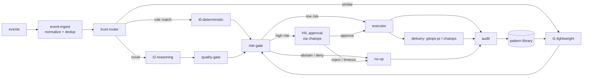

# Project Structure

The system is a **headless control plane + thin console + ChatOps**, not one web app
(see [app-shape.instructions.md](../../../.github/instructions/app-shape.instructions.md)).
The repository layout mirrors that shape and keeps the core engine UI-agnostic and portable.
Module names and the control loop follow
[architecture.instructions.md](../../../.github/instructions/architecture.instructions.md).

## Monorepo Layout

```text
fdai/
├── src/fdai/            # Python (3.12+, src-layout); one language across the monorepo
│   ├── core/                  # headless control plane (no UI, no direct cloud SDK imports). G-1 phase 1 (tracker #14) grouped the 41 subsystems (of the 47 core directories - see [code-map.md](code-map.md)) into 5 domain-group facades - `pipeline/` (event_ingest, trust_router, tiers, quality_gate, risk_gate, hil_resume, executor, audit, control_loop), `incident/` (rca, slo, runbook, postmortem, oncall, irp, investigation, chaos, capacity), `operator/` (conversation, operator_memory, working_context, rbac, notifications, report_feed), `knowledge/` (prompts, tools, web_search, capability_catalog, rule_catalog_profiles, ontology_explorer), `platform/` (scheduler, metering, measurement, security, reporting, onboarding, workflow, detection, deploy_preflight, assurance_twin), plus `verticals/` (G-6). Phase 1 is additive: both `from fdai.core.<subsystem> import X` and `from fdai.core.<domain> import <subsystem>` resolve. Phase 2 (deferred) is the physical `git mv` mass move.
│   │   ├── event_ingest/       # bus consumers; normalize to event schema; dedup by idempotency key; correlate related events into incidents
│   │   ├── trust_router/       # routes each event to T0 | T1 | T2 by computed confidence
│   │   ├── tiers/
│   │   │   ├── t0_deterministic/    # deterministic-engine: policy, checklist, what-if, drift eval
│   │   │   ├── t1_lightweight/      # embedding similarity, learned-action reuse, small-model classify
│   │   │   └── t2_reasoning/        # frontier-model reasoning for novel/ambiguous cases only
│   │   ├── prompts/            # catalog-as-code prompt composer (loads `rule-catalog/prompts/`, supplies T2)
│   │   ├── tools/              # T2 tool-catalog registry + `ToolExecutor` (shadow-mode gated)
│   │   ├── web_search/         # last-resort web-search seam (`NoOpWebSearchProvider` default; domain allowlist + sanitizer)
│   │   ├── operator_memory/    # HIL-approved operator memory injected as untrusted `<operator_note>` data
│   │   ├── briefing/           # deterministic opening/scheduled briefings over report-feed evidence
│   │   ├── document_ingestion/ # upload-session lifecycle + fail-closed scan/protection/extract/index worker
│   │   ├── working_context/    # bounded per-turn prompt assembly: composer (token budget) + planner/orchestrator (O(log L) hierarchical folds) + summarizer/retriever seams
│   │   ├── quality_gate/       # mixed-model cross-check, verifier, grounding (guards T2)
│   │   ├── rca/                # root-cause analysis (T0 deterministic + T2 reasoner behind seam; grounding-gated)
│   │   ├── risk_gate/          # unified authority: risk score + auto vs HIL vs deny; enforces the four safety invariants
│   │   ├── rbac/               # human RBAC for the read API (5-role matrix, resolver, enforcer)
│   │   ├── hil_resume/         # HIL approval round-trip: park, push to channel, resume on decision
│   │   ├── executor/           # per-resource lock, idempotent apply via delivery adapters
│   │   ├── audit/              # append-only, hash-chained audit log + KPI/metric emission
│   │   ├── notifications/      # channel-routing layer over the notifications matrix
│   │   ├── detection/          # out-of-band anomaly / forecast finding producers (re-enter event-ingest)
│   │   ├── incident/           # incident lifecycle registry + state machine (open → triaging → mitigated → resolved → closed)
│   │   ├── slo/                # workload SLO / burn-rate evaluator (distinct from control-plane SLOs)
│   │   ├── runbook/            # runbook orchestrator (linear sequence + on-failure branch)
│   │   ├── workflow/           # version-pinned WorkflowDefinition + principal WorkflowBinding compilation; approval planner + shadow orchestrator + trigger index + event coordinator
│   │   ├── python_task/         # static validation for generated multi-file PythonTask artifacts; never imports or executes task code
│   │   ├── postmortem/         # LLM-optional postmortem / PIR draft generator
│   │   ├── rule_catalog_profiles/  # profile / pack layer - named rule bundles with `extends` chains + overrides
│   │   ├── measurement/        # Phase-4 continuous measurement (regression, pattern growth, model tracking, latency budget, prompt probe, runners)
│   │   ├── deploy_preflight/   # pre-deployment feasibility probes → grounded readiness report
│   │   ├── assurance_twin/     # read-only ontology twin: text-to-query review / Q&A / assessment (proposes, never executes)
│   │   ├── conversation/       # operator-console coordinator (Layer 2): NL turn → one read-only tool call
│   │   ├── user_context_projection.py  # metadata-only principal context / workflow binding projection into runtime ontology
│   │   ├── console_request/    # operator-console write-direction re-request policy (Scenario B deny-override), a single pure `evaluate_operator_rerequest`
│   │   ├── verticals/          # Resilience / Change Safety / Cost Governance (P3 integration surface); each is a sub-package (G-6) with its own orchestrator + submodules, plus the shared `Vertical` Protocol in `base.py` and the `VerticalRegistry` seam
│   │   ├── control_loop/       # P1 pipeline: `orchestrator.py` (ControlLoop composition), `_process.py` (ordered event stages), `_fallback.py` (T1/T2), `_execution.py` (governance/risk/dispatch), `_rca.py` (shadow RCA), `_boundary.py` (audit/notification/stage adapters), `models.py` (typed results), `operator_request.py` (authoritative proposal lifecycle), `_helpers.py` (pure utilities), and `stages/` (Stage Protocol scaffold)
│   │   └── ontology_explorer.py    # deterministic Mermaid renderer for the loaded ObjectType / LinkType catalog
│   ├── shared/                # cross-cutting; MUST NOT import from core/
│   │   ├── contracts/          # models.py + registry.py + validation.py + JSON Schemas
│   │   │   ├── event/          # event/schema.json
│   │   │   ├── action/         # action/schema.json
│   │   │   ├── rule/           # rule/schema.json
│   │   │   ├── ontology/       # object-type / link-type / action-type JSON Schemas
│   │   │   └── workflow/       # workflow/schema.json (process-automation catalog)
│   │   ├── ontology/           # runtime ontology helpers (ACL, audit purposes, purpose taxonomy)
│   │   ├── providers/          # CSP-neutral cloud provider interfaces (adapters implement them)
│   │   │                       #   event_bus.py, secret_provider.py, state_store.py,
│   │   │                       #   workload_identity.py, inventory.py, vm_task.py, python_task_author.py + LLM / channel / RBAC / feasibility-probe seams
│   │   │                       # `providers/local/` = dev-mode fakes (`EnvSecretProvider`, `LocalWorkloadIdentity`, `FileFixtureInventory`);
│   │   │                       # `providers/testing/` = in-memory fakes used across the test suite (never bound in prod)
│   │   ├── streaming/          # `SseBroadcaster` + `StagePublisher`: relay EventBus topics → SSE channels
│   │   ├── telemetry/          # structured logging, tracing, metric helpers
│   │   └── config/             # config schema + startup validation (fail-fast)
│   ├── delivery/              # action delivery adapters (behind one shared interface)
│   │   ├── gitops_pr/          # remediation-pr adapter: GitHub App / Azure DevOps, Checks API
│   │   ├── chatops/            # channel adapters (Teams / Slack / email / webhook / pager / SMS)
│   │   ├── notifications/      # per-channel senders (email HTTP, HIL sink) wired by `shared/providers` seams
│   │   ├── persistence/        # Postgres / pgvector concrete implementations of `shared/providers` state seams
│   │   ├── azure/              # Azure-specific SDK adapters (the only tree allowed to import `azure-*`)
│   │   │                       #   `vm_task.py` uses Managed Run Command; `llm/python_task_author.py` generates inert drafts
│   │   ├── vm_task/            # planning-only read adapter + ontology ToolExecutor bridge; no cloud SDK imports
│   │   ├── chaos/              # live chaos-inject adapters when a `Chaos` runbook step goes enforce: `live_injectors.py` (CSP-neutral primitive fan-out) + `chaos_mesh.py` (Chaos Mesh CRDs) + `mysql_load.py` (MySQL benchmark load)
│   │   ├── remediation/        # concrete `DirectApiExecutor` for direct-API remediation (`live_direct_api.py`); the Protocol lives in `shared/providers/`
│   │   ├── read_api/           # thin ASGI - `main.py` composes the routes/ + streaming/ subpackages (G-5, tracker #14). `routes/` holds one module per HTTP surface: **GET** (audit, kpi, hil-callback, rule-catalog, ontology-graph, inventory-graph, panels, promotion-gates, reporting, workflow-authoring, console-action, what-if, blast-radius, bitemporal, llm-cost, measurement-summary, pantheon, demo-findings, rule-fire-trace) plus two **POST** carve-outs (chat, webhook - `webhook` is optional and mounted only when `webhook_ingress` is bound); `streaming/` holds the three SSE fan-outs (live_stream, live_control_loop, provision_stream); `dev/` holds `local.py` (was `_local.py`) - dev-only, dropped from production container images; `auth.py` / `entra_verifier.py` / `read_model.py` stay at the top level as shared infrastructure
│   │   ├── ingestion_gateway/  # dedicated content-write ASGI: scoped upload sessions, status, cancellation, version listing, governed deletion
│   │   ├── provisioning/       # surface-A Genesis bootstrap: pure `terraform_bridge.py` (terraform `-json` → `provision.*`) + `serve.py` harness (`aiter_json_lines` + `pump_provision_events`, I/O injected, no subprocess)
│   │   └── scheduler_tick_cli.py  # standalone entry point that drives the scheduler tick from a cron / Container Apps Job
│   ├── rule_catalog/          # rule-catalog PIPELINE code
│   │   ├── schema/             # rule + ontology (ObjectType / LinkType / ActionType) schemas + validation
│   │   ├── sources/            # per-source collectors (WAF, CIS, OPA, IaC scanners, ...)
│   │   ├── pipeline/           # watch → collect → shadow eval → regression → promote/rollback
│   │   └── codegen/            # authoring helpers (`new_action_type`, `new_object_type`) - generate scaffolds, never mutate the live catalog
│   ├── agents/                # pantheon runtime - 15 named agent modules (odin / thor / forseti / huginn / heimdall / ...), typed topics + bus, adapters + registry; see [agent-pantheon.md](../agents/agent-pantheon.md)
│   ├── composition/           # composition root package (G-3, tracker #14): `__init__.py` (facade + `default_container` + `default_container_from_env`) + `_helpers.py` (Container / LlmBindings / LlmBindingsUnavailableError) + `wire_capabilities.py` (validated fork CapabilityBundle installer) + `wire_llm.py` (Azure OpenAI LLM binder) + `wire_azure.py` (fork-wire container + `AzureWireOverrides`) + `wire_change_feed.py` (Azure DevOps / GitHub change-feed factories) + `wire_metric_provider.py` (MetricProvider binder; Azure Monitor Logs auto-bind when `FDAI_MONITOR_WORKSPACE_ID` is set - split out of `wire_azure` to hold the LOC ceiling, G-4)
│   └── __main__.py            # entry point (starts the P1 control loop)
├── rule-catalog/              # catalog-as-code DATA (YAML) - no Python; pipeline lives in src/fdai/rule_catalog/
│   ├── schema/                 # JSON Schema definitions (data)
│   ├── vocabulary/             # canonical CSP-neutral vocabularies: resource-types.yaml, object-types/, link-types/
│   ├── action-types/           # upstream ontology ActionType instances (shadow-default, promotion_gate-required)
│   ├── action-types-custom/    # fork-only ActionType additions (deny-listed in upstream CI)
│   ├── action-types-overrides/ # scoped overrides to upstream ActionTypes (≤ resource-group scope)
│   ├── profiles/               # named rule packs (upstream)
│   ├── profiles-overrides/     # fork overlay for profiles
│   ├── prompts/                # catalog-as-code prompt fragments (task packs, tools, personas)
│   ├── remediation/            # remediation-plan artifacts
│   ├── operator-console/       # `SystemConsoleTool` descriptor bundles
│   ├── probes/                 # deploy-preflight feasibility-probe descriptors
│   ├── catalog/                # normalized rules (post-promotion, catalog-of-record)
│   ├── collected/              # raw upstream source snapshots pre-normalization
│   ├── exemptions/             # time-boxed audited exemption artifacts
│   ├── sources/                # per-source rule snapshots + provenance
│   ├── llm-registry.yaml       # per-capability LLM binding registry (data, resolved at composition time)
│   └── risk-classification.yaml # authoritative first-match risk-classification table (see risk-classification.md)
├── policies/                  # OPA/Rego policy-as-code consumed by T0 and the verifier
├── infra/                     # IaC: Terraform (HCL); entry command `terraform apply`
│   ├── modules/
│   │   ├── resource-group/          # rg-fdai; CAF-named per deploy-and-onboard.md
│   │   ├── identity/                # user-assigned Managed Identity for the executor
│   │   ├── compute/                 # runtime seam - alternates in siblings
│   │   │   └── container-apps/      # default (Consumption + KEDA)
│   │   ├── container-registry/      # ACR for the compute image
│   │   ├── state-store/             # audit + KPI + pgvector
│   │   │   └── postgres-flex/       # default
│   │   ├── event-bus/               # Kafka wire
│   │   │   └── event-hubs-kafka/    # default (Event Hubs, :9093)
│   │   ├── secret-store/            # env + Key Vault reference bridge
│   │   │   └── key-vault/           # default
│   │   ├── observability/           # Log Analytics + App Insights bound to it
│   │   │   └── log-analytics/       # default
│   │   ├── llm/                     # deployer-scoped LLM provisioning (dev-and-deploy parity contract)
│   │   │   └── azure-openai/        # default Azure OpenAI deployment set
│   │   ├── measurement-runners/     # Container Apps Jobs for automated regression + pattern-growth runners
│   │   ├── vm-task-host/             # cloud-init profile for custom Linux/GPU VMs
│   │   ├── vm-task-rbac/             # target-VM-scoped Managed Run Command RBAC
│   │   ├── preflight-toggles/       # feature-flag surface mapping preflight blockers → Terraform toggles
│   │   └── console/                 # Static Web App hosting for the read-only SPA
│   │       └── static-web-app/      # default
│   ├── local/                       # local-dev IaC (docker-compose, testcontainers wiring; not applied to Azure)
│   └── envs/                        # per-env tfvars (git-ignored; never committed)
│       ├── dev/
│       ├── staging/
│       └── prod/
├── console/                   # thin read-only SPA (Vite + Preact) - operator views + local display settings
│   ├── src/                    # shell, panel registry, GET-only client, routes, browser-local preferences
│   ├── index.html              # Vite entrypoint
│   ├── package.json            # deps: preact, @azure/msal-browser
│   └── vite.config.ts          # build → console/dist/ (git-ignored)
├── cli/                       # operator-console CLI (Ink) - one view-model, many renderers
│   ├── src/view-model/         # presentation-neutral briefing contract + block IR + builder
│   ├── src/renderers/          # ink (terminal) / text / slack (Block Kit) / teams (Adaptive Card)
│   ├── src/cli.tsx             # entrypoint: build briefing once, render per --surface
│   └── package.json            # deps: ink, react (run with tsx, no build step)
├── site/                      # Astro / Starlight docs site (renders docs/**/*.md with i18n + search)
├── ui/                        # (future) static UI kit (Calm Slate theme) - placeholder
├── tests/                     # cross-subsystem regression suites + shared fixtures (unit tests colocate)
├── docs/roadmap/              # this roadmap and design docs
├── pyproject.toml             # single manifest for the Python monorepo
└── .github/                   # instructions/ and workflows/ (CI: lint, secret-scan, coverage)
```

> Directory names are the canonical vocabulary. Keep module names aligned with the domain
> terms in [language.instructions.md](../../../.github/instructions/language.instructions.md)
> (`trust-router`, `deterministic-engine`, `rule-catalog`, `risk-gate`, `remediation-pr`,
> `shadow-mode`, `HIL`). Python identifier rules require `snake_case` on disk
> (`event_ingest`, `trust_router`, `rule_catalog`); the kebab-case names above are the
> **logical vocabulary** used in docs, rule ids, config keys, and audit records. Unit
> tests colocate with each subsystem; `tests/` holds only cross-subsystem regression and
> property suites.

## Module Boundaries

Dependency direction is strict and one-way; a violation is a review blocker.

- **core is portable**: it MUST NOT import any cloud SDK directly. Cloud specifics enter
  only through the CSP-neutral interfaces in `shared/providers/`, whose implementations live
  in `delivery/` and `infra/` and are injected at composition time. This keeps a second cloud
  a matter of adding an adapter, never editing `core/`.
- **allowed imports**: `core/` may import `shared/` (contracts, providers, telemetry, config)
  only; `delivery/`, `infra/`, and `console/` may depend on `shared/` contracts but not on
  `core/` internals; `shared/` imports nothing from `core/` (no cycles).
- **policies and rules are data, not code paths**: T0 loads `rule-catalog/` entries and
  `policies/` at runtime; adding a rule or policy never requires an engine change. Rules
  describe intent and remediation; policies are the executable OPA/Rego the verifier re-checks.
  How sources are collected and normalized into that YAML is in
  [rule-catalog-collection.md](../rules-and-detection/rule-catalog-collection.md).
- **delivery is swappable**: `gitops-pr` and `chatops` are adapters behind one interface, so
  the executor emits an abstract action and the adapter renders it (remediation-pr, Adaptive
  Card). The executor holds the only privileged identity; adapters never share it.
- **console is read-only**: it visualizes state, audit, shadow results, and the HIL queue but
  issues no privileged calls and executes no actions. HIL approvals flow through ChatOps or
  the remediation-pr, never through console buttons
  (see [security-and-identity.md](security-and-identity.md)).
  The navigation shell uses an icon-only Activity Bar with five stable domains:
  `Overview`, `Operations`, `Agents`, `Governance`, and `Evidence`. The adjacent Explorer
  renders the panels registered for the selected domain. English is the default display
  language, and the Korean catalog provides `전체 현황`, `운영`, `에이전트`, `거버넌스`, and
  `감사·증적` without changing group ids, panel ids, or routes. An operator can reorder or hide
  panels in browser-local, account-scoped preferences. Icon-only shell controls expose their
  localized labels through a shared tooltip that opens on keyboard focus, delays pointer hover,
  renders through a document-body portal, and flips or shifts to remain in the viewport. It also
  honors reduced-motion preferences instead of relying on browser-native `title` bubbles.
  Hiding changes navigation display only;
  direct routes and search remain available, and the active panel cannot be hidden. Detail
  routes render a compact domain / panel hierarchy inside the shared page title so context
  remains visible when the Explorer is collapsed. Domain roots and standalone utilities keep
  a single title when hierarchy would only repeat it. The Agents domain also keeps a visible
  workspace tab row across its Roster, Organization, Activity, and Handover panels. Roster is
  the default agent view and projects current stream state, current work, incident association,
  reporting line, and evidence links without inventing metrics that the read API did not return.
  It separately shows runtime bindings: 11 typed EventBus subscribers plus Huginn's raw-ingress
  subscriber stay ready while Njord and Freyr wait for external adapters and Loki waits for a
  scheduled trigger. Resource discovery is not owned by a named agent. The dedicated Inventory
  sync job queries Azure Resource Graph with ARM fallback, promotes an immutable snapshot, and
  publishes deltas into Huginn; the deployed default schedule is every six hours, while the local
  harness runs no Azure discovery.
  Organization offers Directory and Org chart views; `?view=org` preserves a direct link to the
  live reporting hierarchy, and each node opens that agent's focused runtime detail.
  Its filters and search are browser-local presentation controls; Activity links preserve the
  selected agent in the route query. Activity shows that agent's current stream state and recent
  live incidents before its durable audit timeline, so delayed or missing audit attribution does
  not make an active agent appear blank. Local dev mode also exposes a `Labs`
  group immediately above Settings; production navigation omits this development-only group.

## Structural CI Gates

Four CI-enforced scripts back the boundary rules above so drift cannot creep
back once a refactor lands. They all live under `scripts/` and run in every
CI pipeline plus the local pre-push hook. Corresponding docs in
[coding-conventions.instructions.md](../../../.github/instructions/coding-conventions.instructions.md).

| Gate | Rule | Mode today |
|------|------|------------|
| [check-core-imports.sh](../../../scripts/quality/architecture/check-core-imports.sh) | `core/` forbids cloud SDKs, HTTP clients, and `fdai.delivery.*` | enforce |
| [check-agents-imports.sh](../../../scripts/quality/architecture/check-agents-imports.sh) | `agents/` forbids the same set | enforce |
| [check-file-loc.sh](../../../scripts/quality/architecture/check-file-loc.sh) | warn > 400 LOC, fail > 800 in enforce mode | warn-only |
| [check-subsystem-fanout.sh](../../../scripts/quality/architecture/check-subsystem-fanout.sh) | warn >= 8 sibling `core.*` subsystems in one file, fail >= 15 | warn-only |

### Adding a new gate

1. Write `scripts/check-<name>.sh` following the pattern in the existing
   scripts (warn/fail thresholds via env vars, allowlist with a preceding
   `#` justification comment, stale-entry rejection, GitHub Actions
   annotations, `CHECK_QUIET=1` summary mode).
2. Ship the gate in **warn-only** so it does not break the current tree.
3. Add a job to `.github/workflows/ci.yml` and a call in `.githooks/pre-push`.
4. Add regression tests to `tests/test_check_structural_gates.py` covering
   warn / enforce / threshold overrides / allowlist / stale entries /
   boundary conditions.
5. Extend `tests/test_structural_gates_drift.py` so the CI job and the
   pre-push wiring are drift-guarded.

### Promoting a gate warn -> enforce

1. Land the refactor(s) that clear the current warn baseline (tracker #14).
2. Flip the gate's mode env var (`FILE_LOC_MODE=enforce`, etc.) in the CI job.
3. Add any legitimate exceptions to the gate's allowlist file with a
   written justification, following the H3 rule (preceding `#` comment).
4. Do NOT weaken the threshold to make the tree fit; either split the file
   or record the exception in the allowlist. Weakening a threshold to
   unblock a red pipeline is a governance regression.

## Customization via Dependency Injection

This repository is the **main project**. Per-customer customization is supplied by **dependency
injection**, never by editing `core/` or maintaining a divergent copy of it. The upstream repo
defines the interfaces and ships generic default implementations; a fork **registers its own
implementations** at a composition root, so customization is additive and upstream sync stays
clean (see the fork model in
[generic-scope.instructions.md](../../../.github/instructions/generic-scope.instructions.md)).

> **Fork maintainers**: start with the procedural walkthrough in
> [downstream-fork-guide.md](../fork-and-sequencing/downstream-fork-guide.md). This section is the seam catalog
> that guide operationalizes.

- **Composition root**: `core/` depends only on the CSP-neutral interfaces in `shared/`. A thin
  composition root (outside `core/`) binds concrete implementations at startup. `core/` never
  news-up a concrete adapter; it receives its dependencies. The upstream default binder is
  [`fdai.composition.default_container`](../../../src/fdai/composition/__init__.py); a fork's
  entry point calls its own factory that wraps or replaces those bindings. Concrete adapter
  classes (e.g. `PackageResourceSchemaRegistry`, `JsonSchemaContractValidator`) are
  **not** re-exported from public sub-packages; they must be imported directly from their
  submodule, and only by a composition root, so `core/` cannot depend on a concrete by
  accident.
- **Config-driven binding**: which implementation binds to which interface is selected by
  configuration, so a fork overrides a binding by supplying its own package + config, not by
  patching core. Invalid or missing bindings **fail fast** at startup (Configuration Model).
- **Default implementations upstream**: the main repo provides working generic defaults for
  every seam so it runs standalone; a fork replaces only the seams it needs.

### Capability Bundles

Use a `CapabilityBundle` when a fork adds a discoverable capability rather than replacing one
infrastructure seam. A bundle groups the operator-facing `Capability` metadata, one typed
`CapabilityBinding`, and any reasoning-tool `ToolProvider` implementations. The binding points
to an already loaded reasoning tool, `ActionType`, or `Workflow`; it does not define another
execution path.

Install a bundle with `fdai.composition.install_capability_bundle(...)`. The installer builds
cross-references from the loaded catalogs and returns a new `Container` whose
`capability_runtime` contains the validated registration. Startup is blocked when a target is
unknown, a provider is missing or duplicated, a tool's declared provider does not match the
bundle, or a provider is not referenced. The input container remains unchanged when validation
fails.

`wire_azure_container(...)` consumes reasoning-tool providers from the installed runtime and
combines them with explicit `AzureWireOverrides.tool_providers`. Duplicate provider ids are a
configuration error rather than an implicit override. `ActionType` and `Workflow` bindings are
references only: mutating requests still re-enter the trust router, risk gate, executor, and
audit path. See
[`fdai.fork_examples.capability_bundle`](../../../src/fdai/fork_examples/capability_bundle.py)
for a copy-ready read-only provider and bundle.

When a deployment needs install, enable, disable, or uninstall lifecycle around those bundles,
use `ExtensionManager` in `core/capability_catalog/extensions.py`. Installation verifies the
archive SHA-256 digest, an injected publisher trust decision, host-version compatibility, and
manifest-to-bundle capability parity. A verified extension is installed disabled. Enabling it
rebuilds a candidate `CapabilityRuntime` from the immutable base and every enabled bundle, so an
unknown ActionType, Workflow, reasoning tool, or provider blocks activation without changing the
current manager. Disable the extension before uninstalling it.

This lifecycle is intentionally not a dynamic code loader or public package downloader. The fork
composition root supplies already-reviewed provider implementations and the trust verifier.
Extension activation registers typed references only; every mutation still uses the normal
pipeline and starts in shadow mode according to its ActionType or Workflow contract.

`core/supply_chain/` owns the durable trusted-artifact contract and install orchestration shared by
extensions and skills. Installation first passes the existing extension or skill lifecycle, then
persists the exact raw artifact, detached signature, publisher source, digest, and disabled state.
A failed durable write returns no candidate catalog to the caller. `delivery/trust/` provides the
concrete source-keyed Ed25519 verifiers with distinct extension and skill signature domains, so a
signature cannot replay across artifact kind, source, id, version, or content digest.

Production uses `PostgresTrustedArtifactStore` and the `trusted_artifact` table. Extension and skill
ids share one schema but remain separated by `artifact_kind`; insert requires expected revision 0,
and every update requires an exact revision and increments by one. The table repeats the content
size, SHA-256, 64-byte signature, state, timestamp, and revision constraints. It stores no private
key or provider credential. A restarted composition can re-verify the stored raw artifact and
signature before rebuilding enabled runtime state.

### Injectable Seams

The five seams marked **CSP-neutrality contract** below realize the wire-level contracts in
[csp-neutrality.md](csp-neutrality.md). `core/` sees only the interface; a fork or a future
non-Azure phase registers a new implementation at the composition root without editing `core/`.

| Seam | Interface (in `shared/`) | Contract | Default (upstream) | Fork override example |
|------|--------------------------|----------|--------------------|-----------------------|
| Event bus | `EventBus` (Kafka producer/consumer) | **CSP-neutrality contract** - [event bus](csp-neutrality.md#1-event-bus-contract--kafka-wire-protocol) | librdkafka-based client with SASL/OAUTHBEARER (Entra token source) | AWS IAM SigV4 auth, GCP IAM auth, Confluent SASL/PLAIN, self-hosted Kafka mTLS |
| Runtime | `RuntimeAdapter` (renders OCI + Knative-compatible manifest) | **CSP-neutrality contract** - [runtime](csp-neutrality.md#2-runtime-contract--oci-image--knative-compatible-manifest) | Container Apps IaC renderer (Bicep/Terraform) | Cloud Run YAML, App Runner service, Knative Service on any K8s |
| Secret & config | `SecretProvider` / `ConfigProvider` | **CSP-neutrality contract** - [secret](csp-neutrality.md#3-secret-contract--environment--k8s-secret) | env + Container Apps KV-reference bridge | ESO + Key Vault / AWS Secrets Manager / GCP Secret Manager / HashiCorp Vault |
| Workload identity | `WorkloadIdentity` (audience-scoped OIDC token) | **CSP-neutrality contract** - [workload identity](csp-neutrality.md#4-workload-identity-contract--oidc-token) | user-assigned Managed Identity (IMDS → Entra token) | IRSA, GCP Workload Identity Federation, SPIFFE/SPIRE SVID |
| Inventory | `Inventory` plus `InventorySnapshotStore` (CSP-neutral batches, immutable candidate staging, atomic active pointer) | **CSP-neutrality contract** - [inventory](csp-neutrality.md#5-inventory-contract--resource-graph) | Scheduled Azure collector under a dedicated read-only MI: ARG full-scan, direct ARM-list fallback, signed declarative recovery, PostgreSQL last-known-good projection | A fork injects another ordered source while preserving coverage, authority, and atomic-promotion semantics |
| Cloud provider | provider client | (uses the five above) | reference/generic Azure adapter | a specific CSP adapter |
| **Schema source** | `SchemaRegistry` (raw JSON Schema loader) | - | `PackageResourceSchemaRegistry` (schemas ship inside the package) | remote schema-registry adapter; snapshot pinned by content hash |
| **Boundary validation** | `ContractValidator` / `EventValidator` (fail-closed input check) | - | `JsonSchemaContractValidator` + `JsonSchemaEventValidator` (draft-2020-12) | fork MAY layer domain-specific checks (e.g. source allowlist) without editing `core/` |
| Rule / policy source | rule-catalog + `policies/` loader | - | bundled generic rules | customer rule set / thresholds |
| **Capability bundle runtime** | `CapabilityRuntime` + `CapabilityBundle` and trust-verified `ExtensionManager` in `core/capability_catalog/`; `install_capability_bundle(...)` in `composition/` | - | default discovery catalog with no fork bindings; extensions install disabled | add a reviewed reasoning tool provider or bind a capability to an existing `ActionType` / `Workflow`; digest, trust, compatibility, manifest parity, and all references validate before activation |
| **Typed external RPC** | `RpcRegistry`, `RpcMethod`, scopes, and idempotency contract in `core/rpc/`; bounded HTTP client/route, deterministic Python stub codegen, and `build_production_rpc_app(...)` in `delivery/rpc/` | - | no RPC route is mounted by the control plane; opt-in standalone app binds built-in tool discovery and PostgreSQL hashed claims | a fork supplies the identity-aware authorizer and explicit additional methods; side-effect methods require durable idempotency claims and still submit typed proposals rather than invoking an executor directly |
| **Ontology ObjectType / LinkType** | `load_object_type_catalog(root, *, schema_registry)` and `load_link_type_catalog(root, *, schema_registry, object_types=...)` in `src/fdai/rule_catalog/schema/` | - | four upstream ObjectTypes (`Resource`, `Rule`, `Signal`, `Finding`) and the shipped LinkTypes under `rule-catalog/vocabulary/{object-types,link-types}/`, loaded into `Container.ontology_object_types` / `Container.ontology_link_types` by the entry point | fork ships additional YAML under a fork-local directory (e.g. `fork/vocabulary/object-types/ArchitectureProposal.yaml`), loads both roots at its composition root, and passes the concatenated tuples via `dataclasses.replace(container, ontology_object_types=..., ontology_link_types=...)`. Duplicate `name` across roots fails-closed. See [downstream-fork-seam-recipes.md § 5.8a](../fork-and-sequencing/downstream-fork-seam-recipes.md#58a-ontology-object-type--link-type-additions). |
| **Workflow catalog (process automation)** | `load_workflow_catalog(root, *, schema_registry, action_type_names, rule_ids=...)` in `src/fdai/rule_catalog/schema/workflow.py`; `compile_workflow(...)` in `src/fdai/core/workflow/` | - | shadow-first Workflows under `rule-catalog/workflows/`, loaded into `Container.workflows` by the entry point after the ActionType + rule catalogs; every step cross-references an `ActionType` and (when set) a Rule id, fail-closed at startup | fork ships additional Workflow YAML under a fork-local `fork/workflows/` directory, loads it at its composition root with the concatenated ActionType / rule sets, and passes the tuple via `dataclasses.replace(container, workflows=...)`. Duplicate `name` across roots fails-closed. See [process-automation.md](../decisioning/process-automation.md). |
| **Governed Python task** | `PythonTaskAuthor`, `PythonTaskArtifactStore`, `VmTaskTargetResolver`, and `VmTaskRunner` in `shared/providers/` | - | local template author + in-memory artifacts/targets + planning runner; production stores immutable artifacts in Postgres, resolves targets from active inventory, and the headless executor binds Azure Managed Run Command | a fork supplies another author, artifact repository, target resolver, or compute runner while preserving content hashes, declared capabilities, idempotency, non-executing read-API plans, and typed proposal dispatch. See [process-automation.md § 4.5](../decisioning/process-automation.md#45-governed-python-tasks-and-cron-schedules). |
| **Governed sandbox profiles** | `SandboxProfileCatalog`, `VmTaskSandboxCatalog`, `ToolSandboxCatalog`, and `DocumentConverterSandboxCatalog` in `core/sandbox/`; `DocumentConverter` in `shared/providers/` | - | unprofiled command, VM-task, tool, and converter requests fail closed; profiled wrappers enforce capability, mode, suffix, timeout, argument/input/output byte, and workspace/network ceilings immediately before concrete adapters | a fork supplies explicit server-owned profiles with each adapter binding. It may implement a converter or alternate runner behind the provider contracts, but cannot expose host paths, executables, credentials, or broader request authority. See [process-automation.md § 4.6](../decisioning/process-automation.md#46-governed-command-and-shell-artifacts). |
| **Governed command, shell task, and code workspace** | `CommandRunner`, `CommandPlan`, `ShellTaskChecker`, `ShellTaskSpec`, `CodeWorkspaceProvider`, and `CodePatchSet` in `shared/providers/`; `CommandCatalog`, default command specs, shell structural validation, and workspace patch validation in `core/tools/` and `core/python_task/` | - | `RecordingCommandRunner`, `BashSyntaxChecker`, opt-in `BubblewrapCommandRunner`, copy-on-write `GitCodeWorkspaceProvider`, and opt-in `AzureCliCommandRunner` for `azure.resource.list`; generated Python rejects `process`, shell artifacts validate but do not execute, local commands run only in private read-only workspaces, and the upstream app binds no live runner by default | a fork may bind the credential-free local runner and private workspace provider, or the credentialed Azure read broker. It must preserve server-owned scope and identity, deterministic argv rendering, no raw command strings, stale-file hash checks, idempotency, output bounds, and the `tool_call` / `direct_api` / `run_runbook` path split. See [process-automation.md § 4.6](../decisioning/process-automation.md#46-governed-command-and-shell-artifacts). |
| **Incident confirmation** | `IncidentProposalStore` in `core/incident/proposal_store.py` | - | bounded `InMemoryIncidentProposalStore` for local development; `PostgresIncidentProposalStore` in production uses atomic consume across replicas | inject another durable store only when it preserves same-principal/session binding, expiry, and atomic single-consumer semantics |
| **Incident notification delivery** | `IncidentLifecycleNotifier` wrapped by `DurableIncidentLifecycleNotifier`; `IncidentNotificationDeliveryStore` for atomic claim/complete/release | - | in-memory claims for local; PostgreSQL row-lock claims with leases in production; notification matrix + HIL escalation fallback | bind Teams, Slack, email, webhook, or pager adapters in `ChannelRegistry`; preserve stable `audit_id`, single-claimer semantics, lease recovery, and startup replay |
| Delivery adapter | delivery interface | - | `gitops-pr` / `chatops` | a different PR host / chat channel |
| Risk scoring & thresholds | risk-gate config | - | generic thresholds | customer risk policy |
| Model provider | model client (per capability) | - | configured default endpoints | customer-approved models |
| **Real-time outbound stream** | `SseSink` (async publish + async-iterator subscribe over an SSE-shaped payload) | - | `InMemorySseSink` (test/dev); HTTP `text/event-stream` adapter lands with the console read-only surface | replace with a WebSocket adapter for a two-way surface; a webhook-only variant for headless observers. `shared/streaming/SseBroadcaster` relays `EventBus` topics into channels. |
| **Pipeline stage publisher** | `StagePublisher` (in `shared/providers/stage_publisher.py`) with `emit(StageEvent)` | - | `NullStagePublisher` (discards; keeps stage code side-effect-free by default) | in-process dev / single-replica: `SseSinkStagePublisher` fans out directly onto `SseSink`. Multi-replica prod: `EventBusStagePublisher` writes to a Kafka topic (default `aw.pipeline.stages`) and the existing `SseBroadcaster` relays that topic to the SSE channel every replica consumes. Pipeline stages (`event_ingest`, `trust_router`, T0/T1/T2, `risk_gate`, `executor`, `audit`) accept the Protocol so wiring is fully backward-compatible - the upstream default emits nothing. |
| **Console read panel** | `ReadPanel` (in `delivery/read_api/panels.py`) | - | core routes only (`/audit`, `/kpi`, `/hil-queue`); `ExampleFinOpsPanel` ships as reference but is **not** registered, so the upstream UI stays minimal | fork adds vertical dashboards (FinOps cost, drift board, DR-drill history) via `ReadApiConfig.extra_panels` (each wrapped as a GET-only route, path validated at build) + a matching entry in the console `panels.tsx` registry |
| **LLM metering** | `MeteringSink` / `MeteringReader` (in `core/metering/sink.py`); `MeteringEmitter` records measured provider `usage`; prices load from `rule-catalog/llm-pricing.yaml` into a `PricingTable` | - | `InMemoryMeteringSink` (process-lifetime; drives the single-process dev harness). The T2 adapters (`cross_check`, `rca_model`) emit measured tokens + cost; `LlmCostPanel` serves `GET /kpi/llm-cost` rolled up per conversation / day / month | a fork injects a **durable** sink into `AzureWireOverrides.metering_sink` (core process) and a matching `MeteringReader` into `LlmCostPanel` (read-api process) - e.g. Postgres `agent_transcript` rows - since the headless core and the console are separate processes |
| **Infra module** | `infra/modules/<seam>/` (Terraform sub-module selected by `var.<seam>_kind`) | - | Container Apps + PostgreSQL Flex + Event Hubs Kafka + Key Vault + Log Analytics | pick a different sub-module per [csp-neutrality.md § Approved Alternative Azure Implementations](csp-neutrality.md#approved-alternative-azure-implementations); the module's output contract stays fixed |

Because every seam is an injected interface, adding a customer or a second cloud is a matter of
registering an implementation - the strict one-way dependency direction above is preserved.

**Concurrency posture**: the five **I/O provider Protocols** - `EventBus`, `StateStore`,
`SecretProvider`, `WorkloadIdentity`, `Inventory` - are **async by default**. Their concrete
implementations (Kafka client, asyncpg, Key Vault HTTP, OIDC token exchange, ARG/HTTP
inventory queries) block the event loop if forced to be sync. The **CPU / startup seams** - `SchemaRegistry`,
`ContractValidator` / `EventValidator`, `ConfigProvider` - stay **sync**: they run once at
startup, or are pure CPU boundary validation with no I/O, so an async wrapper would only add
noise. Tests use `pytest-asyncio` with `asyncio_mode = "auto"` so a plain `async def
test_...` runs without a per-test marker.

## Control-Loop Wiring

Every terminal path-including reject, HIL timeout, abstain, and deny-writes an audit entry.
T2 output reaches the risk-gate only after clearing the quality-gate.



## Configuration Model

- Everything environment-specific is **configuration**, injected at runtime (env vars,
  secret store references, config files). No customer, tenant, or environment values in source.
- Config is validated against the `shared/config/` schema at startup; the process **fails fast**
  on invalid or missing required config rather than starting in a degraded state.
- Secrets are read through an injected provider, never a global import-time read, and never
  written to logs, audit entries, or error messages.
- A fork supplies its own config and secret-store layer without editing `core/`.
- Feature flags gate new capabilities so they ship in **shadow-mode** (judge-and-log only)
  and are promoted to enforce per-action, in a separate reviewed change.

## Repository Conventions

- **Python (3.12+) is the single core runtime language** for the whole monorepo; all
  executable code lives under `src/fdai/` (Python "src layout"). Rationale and the
  historical choice matrix are in [tech-stack.md § OD-1](tech-stack.md#od-1-core-runtime-language).
  Non-Python trees are: [rule-catalog/](../../../rule-catalog) (YAML data), [policies/](../../../policies)
  (Rego), and [infra/](../../../infra) (Terraform HCL).
- **One lockfile** at the repo root (`uv.lock` or equivalent); CI installs from the lockfile
  only. The subsystem-per-lockfile guidance in earlier drafts assumed a multi-language
  layout and is retired for the Python monorepo. Boundaries between subsystems are enforced
  by an import-lint gate in CI, not by separate package installs.
- Contracts (event, action, rule schemas, and ontology `ObjectType` / `LinkType` /
  `ActionType` definitions) live in `src/fdai/shared/contracts/` (types) and
  `rule-catalog/schema/` (per-kind JSON Schema), carry a **semver** version, and change
  only in a backward-compatible way within a major version; breaking changes bump the
  major and ship a migration note. Runtime instance storage for those types is covered in
  [llm-strategy.md § Ontology Storage Layout](llm-strategy.md#ontology-storage-layout).
- Tests for `src/fdai/core/tiers/t0_deterministic` (the deterministic-engine) and
  `src/fdai/core/risk_gate` are the safety core: they hold a ≥ 90% coverage gate
  and include property-based tests asserting "high-risk never auto-executes", "shadow-mode
  never mutates", and "re-applying an action is a no-op". Every action path also has a
  shadow-mode test and a rollback test.
- Rule and policy changes ship with a regression test; the
  `src/fdai/rule_catalog/pipeline/` promotion gate blocks on a failing regression
  suite or any policy-violation escape.
- CI enforces the gates referenced above-formatter/linter, secret scanning, dependency audit,
  coverage, and regression-before review; see
  [coding-conventions.instructions.md](../../../.github/instructions/coding-conventions.instructions.md).
