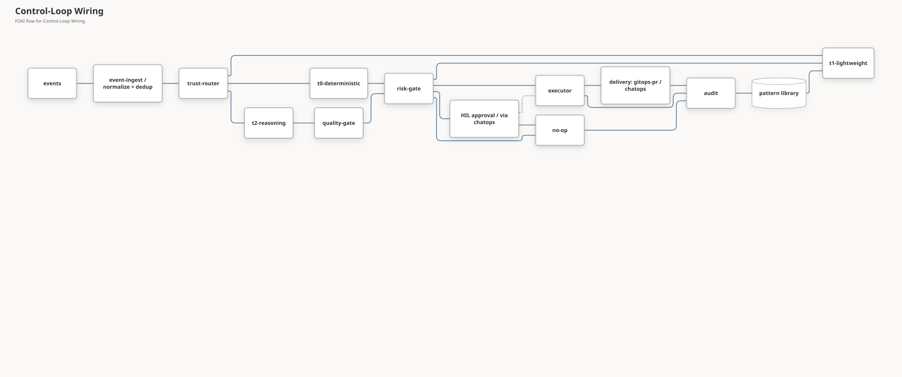

# Project Structure

The system is a **headless control plane + thin console + ChatOps**, not one web app. This document defines module boundaries, dependency direction, composition, and repository conventions inside the five-service workspace. See [Multi-Service Repository Layout](multi-service-repository-layout.md) for physical package ownership and [App Shape](../../../.github/instructions/app-shape.instructions.md) for local and deployed topology.

## Design at a glance

The physical five-service workspace is owned by [Multi-Service Repository Layout](multi-service-repository-layout.md). This document owns dependency direction, structural gates, extension seams, control-loop wiring, configuration, and repository conventions.

## Module Boundaries

Dependency direction is strict and one-way; a violation is a review blocker.

- **core is portable**: it MUST NOT import any cloud SDK directly. Cloud specifics enter
  only through the CSP-neutral interfaces in `shared/providers/`, whose implementations live
  in `delivery/` and `infra/` and are injected at composition time. This keeps a second cloud
  a matter of adding an adapter, never editing `core/`.
- **allowed imports**: `shared/` imports nothing from `core/`; `core/` may import only
  `shared/` contracts, providers, telemetry, and config; `delivery/` may compose `core/` and
  `shared/` behind adapter boundaries; `composition/` binds all layers. `core/` and `agents/`
  never import `delivery/`; provider behavior enters through shared Protocols and composition.
  Focused sibling modules may own canonical identity projection and hashing while the established
  owner module re-exports that public surface; the split must preserve serialized bytes and replay
  semantics.
  Pantheon members remain flat under `agents/`; private behavior-extraction mixins belong under
  `agents/_framework/` and cannot change the member's AgentSpec, topics, ownership, model policy,
  or authority.
- **semantic target resolution is deterministic**: a model-authored resource-identity
  clarification is removed only when Core verifies one exact runtime identifier from the same
  utterance. Zero or multiple identifiers and every other unresolved concept remain a typed
  clarification. This validation adds no provider I/O, decision, approval, mutation, or execution
  authority.
- **authorization is instance-bound**: the context provider must return the exact Resource ID from
  `ExecutionAuthorizationRequest.target_resource_ref`. A mismatch holds before policy, identity,
  or effective-access evaluation and is retained in the no-authority audit context.
- Historical topology is replay-safe only when every selected PostgreSQL revision carries the same
  exact ontology release binding. Missing or mixed releases and dangling active links lower
  completeness rather than proving absence.
- **policies and rules are data, not code paths**: T0 loads `rule-catalog/` entries and
  `policies/` at runtime; adding a rule or policy never requires an engine change. Rules
  describe intent and remediation; policies are the executable OPA/Rego the verifier re-checks.
  How sources are collected and normalized into that YAML is in
  [rule-catalog-collection.md](../rules-and-detection/rule-catalog-collection.md).
- **delivery is swappable**: `gitops-pr` and `chatops` are adapters behind one interface, so
  the executor emits an abstract action and the adapter renders it (remediation-pr, Adaptive
  Card). The executor holds the only privileged identity; adapters never share it.
- **console has no privileged identity**: it visualizes state, audit, shadow results, and the HIL queue. Access comes from verified App Roles, independent of the optional access projection.
  Command surfaces may submit authenticated records or typed proposals, but neither they nor the dev narrator can call an executor; risk, approval, audit, and execution remain server-side
  ([security-and-identity.md](security-and-identity.md)). With transport active, one semantic-aware adapter binds projection, proposal, and stream ports.
  Its outbox uses database `NOW()` deadlines, while transactional result reuse validates the request, principal, and terminal-result digest.
  Verified semantic query-node transitions use a separate bounded best-effort topic from Core to
  Operator. Operator keeps that progress transient for the active SSE stream; durable terminal
  projections and evidence receipts remain the reconnect and completion authority. Progress
  publication failure cannot change query execution or grant execution authority.
  Repository Best Practice definitions are loaded once at the composition root and exposed through
  GET-only list and detail routes. They remain catalog reference data; the projection reports
  `Unknown` and `not-connected` until a runtime evidence provider is explicitly bound.
  The navigation shell uses an icon-only Activity Bar with five stable domains:
  `Overview`, `Operations`, `Agents`, `Governance`, and `Evidence`. The adjacent Explorer
  renders the panels registered for the selected domain. Selecting a domain opens the Explorer
  and navigates to its first visible panel, using the operator's local panel order and visibility
  preferences. English is the default display
  language, and the Korean catalog provides `전체 현황`, `운영`, `에이전트`, `거버넌스`, and
  `감사·증적` without changing group ids, panel ids, or routes. An operator can reorder or hide
  panels in browser-local, account-scoped preferences. Icon-only shell controls expose their
  localized labels through a shared tooltip that opens on keyboard focus, delays pointer hover,
  renders through a document-body portal, and flips or shifts to remain in the viewport. It also
  honors reduced-motion preferences instead of relying on browser-native `title` bubbles.
  Hiding changes navigation display only;
  direct routes and search remain available, and the active panel cannot be hidden. Detail
  routes render a compact domain / panel hierarchy inside the shared page title so context
  remains visible when the Explorer is collapsed. Dashboard renders `Overview / Dashboard`;
  domain roots whose panel title repeats the domain label and standalone utilities keep a single
  title. The Agents domain also keeps a visible
  workspace tab row across its Roster, Organization, Activity, and Handover panels. Roster is
  the default agent view and projects current stream state, current work, incident association,
  reporting line, and evidence links without inventing metrics that the Operator API did not return.
  It separately shows runtime bindings: 11 typed EventBus subscribers plus Huginn's raw-ingress
  subscriber stay ready while Njord and Freyr wait for external adapters and Loki waits for a
  scheduled trigger. Huginn owns real-time resource discovery ingress: Azure create, update, and
  delete signals arrive through the canonical event topic, then an injected delivery projector
  enriches and applies ordered inventory deltas without putting Azure I/O inside the agent. The
  generic Inventory delta forwarder preserves each `InventoryBatch.links` patch by assigning
  `contains` to its target resource and other relationship types to their source resource. A link
  whose owner resource is absent from the same batch blocks cursor advancement so the page is
  retried instead of silently dropping graph data. The event idempotency identity includes a
  bounded SHA-256 digest of the scope, resource, and relationship payload, so long resource ids
  cannot truncate away the distinguishing digest or exceed the event contract. Delta resources require a
  timezone-aware RFC 3339 `last_seen`; missing or malformed ordering time blocks publication and
  cursor advancement instead of substituting a process wall clock. A batch may contain each
  `resource_id` only once; duplicates block the whole batch before any event is published.
  Resource and relationship properties must also serialize as canonical JSON with finite numeric
  values; unsupported objects and `NaN` are rejected before identity calculation, publication, or
  PostgreSQL connection. Realtime projectors and immutable snapshot staging store only prevalidated
  canonical JSON documents; snapshot coverage metadata follows the same rule before begin or
  promotion. Azure relationship property paths, allowed provider types, semantic direction,
  source-schema digest, and evidence policy come from the reviewed
  `provider-relationship-mappings` catalog. A complete-generation verifier activates a candidate
  only when the same generation observes both endpoints, provider and verifier identities differ,
  and an immutable verification receipt binds the edge and mapping revision. Missing endpoints,
  ambiguous orientation, stale schema mappings, duplicate or conflicting observations, and partial
  generations produce stable dropped reasons and no active graph edge. Verified links carry
  immutable state-fact and link-observation metadata. Stale or conflicting evidence can only lower
  operational-context autonomy.
  Versioned provider-schema candidate materialization remains a delivery concern:
  `provider_schema_relationship_generation.py` binds the exact provider-schema and REST evidence
  digests, mapping revision, projection manifest, direction, cardinality, and link metadata.
  Changed provider type/version identities invalidate only affected candidates. Its append-only
  ledger supports rollback and replay, while promotion remains a separately reviewed
  proposal-only catalog operation with no graph or migration authority. Exact-release direction
  comparison records whether strict release checks were requested, so replay cannot infer a
  one-sided metadata mode from whichever generation happens to be present. The reviewed mapping
  model supplies the canonical cardinality used to validate candidate metadata; an omitted
  cardinality is derived only from its reviewed LinkType default. Runtime constructors reject any
  attempt to set the rebuild, graph, execution, or migration authority literals to true.
  All events in the bounded batch are constructed and validated before the first publication, so
  a malformed later resource cannot leave an earlier event partially published by validation.
  Every delta page marked `has_more` must provide a new continuation cursor before its records are
  yielded. A missing or unchanged cursor fails the pull without a final fence; an advancing stream
  that reaches the configured page cap returns the latest cursor so the next pull resumes there.
  A terminal `final=True` batch may carry resources and relationships; the forwarder publishes
  that payload before committing its cursor. Any batch after the final fence fails the stream and
  leaves the prior durable cursor unchanged. If the final batch omits its cursor, the forwarder
  commits the last non-null page cursor instead of rewinding to the cursor from the start of pull.
  The Azure Activity Log adapter derives the resource-group `contains` relationship from each
  mapped ARM resource id and includes it in the same delta page. Dependencies that require a live
  resource read remain incomplete until an ARG or ARM hydration adapter supplies them. Event Grid
  remains authoritative for resource deletion. The upsert-only Activity Log adapter skips delete
  operations instead of resurrecting the resource, but still advances its page cursor from every
  valid event timestamp so filtered records cannot stall the stream. Multiple records for one
  resource use event time and then a canonical resource document as a deterministic tie-breaker;
  each page emits resources in `resource_id` order. Resume cursors and every object event in a page
  require timezone-aware RFC 3339 timestamps, including events that don't map to tracked resources.
  A malformed event timestamp fails the page rather
  than being dropped or treated as UTC, preserving the ordering authority. Non-2xx Activity Log
  errors report only the HTTP status; response bodies never enter exception or log text.
  In-flight cursors require both a valid running timestamp and a non-empty next link. The initial
  lower bound is carried across an empty intermediate page, so pagination cannot erase or rewind
  the eventual resume cursor. The single-subscription Activity Log adapter accepts only a canonical
  hyphenated subscription UUID, preventing scope text from altering the request path or query. Its
  bearer-token endpoint must be an HTTPS origin URL without userinfo, path, query, or fragment.
  Each Activity Log response is also bounded by `max_events_per_page` (default 1000); an oversized
  page fails before mapping or cursor advancement. Every `value` entry must be an object; a
  malformed entry fails the page because its ordering position cannot be verified safely.
  PostgreSQL projector applies each resource and its relationship changes in one transaction.
  Writers acquire locks in a fixed hierarchy: the snapshot-promotion shared gate, the graph
  reconciliation gate, then sorted locks for the changed resource and every relationship endpoint.
  Resource locks use seeded 63-bit advisory keys in the negative key range; the positive global
  promotion and reconciliation gates therefore occupy a disjoint key range.
  Ordinary patches share the graph gate, so unrelated resources remain concurrent. Resource
  deletion and a `links_complete: true` relationship replacement take the graph gate exclusively,
  read the effective relationship set, and write missing relationships as tombstones before commit.
  Every relationship upsert must resolve both endpoints in the effective resource graph and its
  declared endpoint types must match those resources; a missing or contradictory endpoint rolls
  back the resource and relationship changes together. Each inventory change carries at most one
  entry for a `(from_id, link_type, to_id)` key; duplicate keys are rejected before database I/O.
  Every incoming relationship patch must also be owned by the changed resource: `contains` is
  owned by its target and other relationship types are owned by their source. Unowned patches
  cannot mutate an unrelated graph edge. The per-change `max_links` cap is always positive; zero is
  rejected at startup because it would make every relationship-bearing delete unreconcilable.
  Database-derived tombstones use a separate `max_reconciled_links` cap (default 4096), which must
  be at least `max_links`; high-degree resources can therefore be deleted atomically without
  widening the untrusted payload limit.
  An existing effective `resource_id` also keeps its resource type across realtime updates. A
  contradictory type is rejected before the resource row or its relationships can change.
  While any realtime resource overlay remains pending, graph freshness is `unknown` and the read
  projection is degraded even when the base snapshot is within budget. A complete reconciliation
  promotion clears covered overlays and restores snapshot-derived freshness.
  Each projector result carries a typed outcome: `applied`, `not_applicable`, `snapshot_covered`,
  or `ordering_rejected`. Snapshot and ordering suppression also emit `inventory_delta_ignored`
  with the event id and bounded reason, so a safe no-op is distinguishable from an applied update.
  Existing two-field result construction remains compatible by defaulting an omitted outcome to
  `applied`.
  A payload that explicitly declares an event type is projected only when it is
  `inventory.resource_changed`; another domain's event is `not_applicable` even if it carries an
  `inventory_change` field. Omitting `event_type` remains supported for direct legacy callers.
  An absent or false `links_complete` never removes an unobserved relationship. Snapshot promotion
  keeps the exclusive promotion gate and therefore cannot overlap any delta transaction. The
  dedicated Inventory sync path atomically promotes complete Azure Resource Graph and ARM fallback
  snapshots. Heimdall monitors freshness, lag, and coverage without starting repair. The current
  fixed routine interval is legacy configuration. The target continuously combines event ingress,
  resumable deltas, and load-aware reconciliation under source budgets, provider rate limits,
  bounded backoff, and [maximum staleness objectives](continuous-operational-instance-graph.md);
  the local harness runs no Azure discovery.
  OI-12 aggregate certification remains a pure Core receipt. It requires exactly seven axes,
  keeps unmeasured axes unavailable with bounded reasons, and fixes observation, mutation, and
  execution authority to false. Its `complete` field means measurement coverage only. Provider
  adapters still own collection, and deployed certification remains separate evidence.
  Organization offers Directory and Org chart views; `?view=org` preserves a direct link to the
  live reporting hierarchy, and each node opens that agent's focused runtime detail.
  Its filters and search are browser-local presentation controls; Activity links preserve the
  selected agent in the route query. Activity shows that agent's current stream state and recent
  live incidents before its durable audit timeline, so delayed or missing audit attribution does
  not make an active agent appear blank. Local dev mode also exposes a `Labs`
  group immediately above Settings; production navigation omits this development-only group.

## Repository Script Layout

Repository automation is grouped by responsibility under `scripts/`; only the layout README,
`verify.sh`, and the Python package marker stay as root files. Quality gates, integrity tooling,
governance checks, catalog utilities, deployment helpers, and general automation each have their
own directory. See [scripts/README.md](../../../scripts/README.md) for the ownership map and
placement rules.
`infra/scenario-lab/` is an opt-in deployment-validation root, not a sixth runtime service. Its
runner scripts live under `scripts/deployment/scenario-lab/`, and the root `scenario-lab` Python
extra contains only driver dependencies needed by those bounded validation runs.

## Structural CI Gates

Four CI-enforced scripts back the boundary rules above so drift cannot creep
back once a refactor lands. They live under `scripts/quality/architecture/` and run in every
CI pipeline plus the local pre-push hook. Corresponding docs in
[coding-conventions.instructions.md](../../../.github/instructions/coding-conventions.instructions.md).

| Gate | Rule | Mode today |
|------|------|------------|
| [check-core-imports.sh](../../../scripts/quality/architecture/check-core-imports.sh) | `core/` forbids cloud SDKs, HTTP clients, and `fdai.delivery.*` | enforce |
| [check-agents-imports.sh](../../../scripts/quality/architecture/check-agents-imports.sh) | `agents/` forbids the same set | enforce |
| [check-file-loc.sh](../../../scripts/quality/architecture/check-file-loc.sh) | warn > 400 LOC, fail > 800 in enforce mode | warn-only |
| [check-subsystem-fanout.sh](../../../scripts/quality/architecture/check-subsystem-fanout.sh) | warn >= 8 sibling `core.*` subsystems in one file, fail >= 15 | warn-only |

### Adding a new gate

1. Write `scripts/quality/architecture/check-<name>.sh` following the pattern in the existing
   scripts (warn/fail thresholds via env vars, allowlist with a preceding `#` justification
   comment, stale-entry rejection, GitHub Actions annotations, `CHECK_QUIET=1` summary mode).
2. Ship the gate in **warn-only** so it does not break the current tree.
3. Add a job to `.github/workflows/ci.yml` and a call in `.githooks/pre-push`.
4. Add regression tests to `services/core-control-plane/tests/test_check_structural_gates.py` covering
   warn / enforce / threshold overrides / allowlist / stale entries / boundary conditions.
5. Extend `services/core-control-plane/tests/test_structural_gates_drift.py` so the CI job and the
   pre-push wiring are drift-guarded.

### Promoting a gate warn -> enforce

1. Land the refactor(s) that clear the current warn baseline (tracker #14).
2. Flip the gate's mode env var (`FILE_LOC_MODE=enforce`, etc.) in the CI job.
3. Add any legitimate exceptions to the gate's allowlist file with a
   written justification, following the H3 rule (preceding `#` comment).
4. Do NOT weaken the threshold to make the tree fit; either split the file
   or record the exception in the allowlist. Weakening a threshold to
   unblock a red pipeline is a governance regression.

## Customization via Dependency Injection

This repository is the **main project**. Per-customer customization is supplied by **dependency
injection**, never by editing `core/` or maintaining a divergent copy of it. The upstream repo
defines the interfaces and ships generic default implementations; a fork **registers its own
implementations** at a composition root, so customization is additive and upstream sync stays
clean (see the fork model in
[generic-scope.instructions.md](../../../.github/instructions/generic-scope.instructions.md)).

> **Fork maintainers**: start with the procedural walkthrough in
> [downstream-fork-guide.md](../fork-and-sequencing/downstream-fork-guide.md). This section is the seam catalog
> that guide operationalizes.

- **Composition root**: `core/` depends only on the CSP-neutral interfaces in `shared/`. A thin
  composition root (outside `core/`) binds concrete implementations at startup. `core/` never
  news-up a concrete adapter; it receives its dependencies. The upstream default binder is
  [`fdai.composition.default_container`](../../../services/core-control-plane/src/fdai/composition/__init__.py);
  a fork's entry point calls its own factory that wraps or replaces those bindings. Concrete
  adapter classes (e.g. `PackageResourceSchemaRegistry`, `JsonSchemaContractValidator`) are
  **not** re-exported from public sub-packages; they must be imported directly from their
  submodule, and only by a composition root, so `core/` cannot depend on a concrete by accident.
- **Config-driven binding**: configuration selects each implementation. `composition/wire_distiller.py`
  atomically binds the review-only `Distiller` from three exact-version endpoints and one replay-identical
  prompt; zero council records preserve abstention and partial records fail startup without changing execution T2.
- **Default implementations upstream**: the main repo provides working generic defaults for
  every seam so it runs standalone; a fork replaces only the seams it needs.
- **Current T1 reuse evidence**: `CurrentReuseVerifier` collects fresh resource, topology,
  graph, owner, policy, dry-run, and safety facts for an immutable operational case. Azure cache
  freshness is evaluated against the current evaluation clock with bounded age and future skew,
  so a recent pre-event cache can pass while historical replay cannot revive stale evidence.
  Learned signatures bind canonical parameters and the complete operational-case context. Growth
  and pgvector query/write boundaries reject non-finite embedding values before database I/O. The
  verifier grants no execution authority. An absent binding makes operational reuse abstain while
  legacy patterns continue. Pantheon composition can inject `OperatingPatternCompiler`; Norns
  serializes typed learning and applies bounded proposal backpressure before Mimir review.
- **Causal and Dynamic runtime evidence**: `TemporalCausalEvidenceProvider` supplies bounded pre-cutoff series and graph facts. `DynamicSimulationRequestProvider` supplies at most 32 current-state branches. `CausalHypothesisProjection` stays Forseti-owned, and model grades require an `EffectModelCausalEvidenceVerifier`. Dynamic models cannot use outcomes later than the simulation snapshot, current snapshots use evaluation-clock freshness, and the pure simulator rejects model cutoff or finite-arithmetic violations even outside the coordinator. These seams are read-only; absent bindings disable shadow paths.
- **Operational promotion authority**: `OperationalPromotionReceiptVerifier` and
  `OperationalPromotionUnitVerifier` resolve immutable evidence. The production registry remains
  shadow without them; raw scalar metrics are a test-only legacy fixture mode. A promotion-state
  refresh failure lowers the unified system-health ceiling instead of reusing stale enforcement.
- **Operational catalog review and measurement**: `DeterministicCatalogValidator` reuses the
  shipped Rule loader, shadow evaluator, and regression gate over a frozen scenario directory.
  `GitOpsCatalogReviewPublisher` publishes only a content-addressed inert review package. The
  `operational-promotion` measurement job accepts only exact-digest batches and manifest-bound
  causal and unit evidence, then stores a receipt without changing promotion state.
- **Governed action and probe delivery**: `GovernedGovernancePrPublisher` binds the pure
  retirement and exemption writers to the existing write-once PR adapter and persists a
  replayable open-to-merge or terminal receipt. The retirement loader projects merged
  retirement artifacts out of the active rule index, while exemptions use the canonical JSON
  schema. `LiveBlastProbeAdapter` binds deployment-supplied `BlastSignalSource` and
  `ProbeFailureStreakSource` implementations; missing or failed sources lower Axis E and never
  grant authority. Runtime assembly passes retired-rule projections to every downstream rule
  map and binds the durable promotion-attestation store before the HIL/direct route.
  HIL resume resolves rules only from that current active map; serialized parked
  rule bodies are never trusted after a catalog retirement or reload.
- **Independent effect observation**: the durable kinetic artifact store is the exact-plan source.
  `StateStoreExecutedActionObservationStore` accepts only Heimdall-attributed observations whose
  signed context passes the configured verifier on write and replay. Missing evidence remains held.
- **Azure operational evidence**: `bind_azure_operational_evidence` composes a strict promoted-inventory snapshot reader, current safety evaluator, configured Azure metrics, bounded branch estimator, and effect-model reader. Temporal adapters reject non-finite metric values before evidence hashing. Partial binding fails at container construction.

### Capability Bundles

The validated bundle, extension, trusted-artifact, skill disclosure, and revocation lifecycle is
owned by [Capability bundle lifecycle](capability-bundle-lifecycle.md).

### Injectable Seams

The eight seams marked **CSP-neutrality contract** below realize the wire-level contracts in
[csp-neutrality.md](csp-neutrality.md). `core/` sees only the interface; a fork or a future
non-Azure phase registers a new implementation at the composition root without editing `core/`.

| Seam | Interface (in `shared/`) | Contract | Default (upstream) | Fork override example |
|------|--------------------------|----------|--------------------|-----------------------|
| Event bus | `EventBus` (Kafka producer/consumer) | **CSP-neutrality contract** - [event bus](csp-neutrality.md#1-event-bus-contract--kafka-wire-protocol) | librdkafka-based client with SASL/OAUTHBEARER (Entra token source) | AWS IAM SigV4 auth, GCP IAM auth, Confluent SASL/PLAIN, self-hosted Kafka mTLS |
| Runtime | `RuntimeAdapter` (renders OCI + Knative-compatible manifest) | **CSP-neutrality contract** - [runtime](csp-neutrality.md#2-runtime-contract--oci-image--knative-compatible-manifest) | Container Apps IaC renderer (Bicep/Terraform) | Cloud Run YAML, App Runner service, Knative Service on any K8s |
| Secret & config | `SecretProvider` / `ConfigProvider` | **CSP-neutrality contract** - [secret](csp-neutrality.md#3-secret-contract--environment--k8s-secret) | env + Container Apps KV-reference bridge | ESO + Key Vault / AWS Secrets Manager / GCP Secret Manager / HashiCorp Vault |
| Workload identity | `WorkloadIdentity` (audience-scoped OIDC token) | **CSP-neutrality contract** - [workload identity](csp-neutrality.md#4-workload-identity-contract--oidc-token) | user-assigned Managed Identity (IMDS → Entra token) | IRSA, GCP Workload Identity Federation, SPIFFE/SPIRE SVID |
| Inventory | `Inventory` plus `InventorySnapshotStore` (CSP-neutral batches, immutable candidate staging, atomic active pointer) | **CSP-neutrality contract** - [inventory](csp-neutrality.md#5-inventory-contract--resource-graph) | Scheduled Azure collector under a dedicated read-only MI: ARG full-scan, direct ARM-list fallback, signed declarative recovery, PostgreSQL last-known-good projection; Core-owned migrations admit observed `peered_with` links and multiple valid `attached_to` anchors | A fork injects another ordered source while preserving coverage, authority, relationship cardinality, and atomic-promotion semantics |
| Metric ingestion | `MetricProvider` | **CSP-neutrality contract** - [metrics](csp-neutrality.md#6-metric-query-contract--csp-neutral-sample-iterator) | `NoopMetricProvider` or Azure Monitor Logs binding | CloudWatch, Prometheus, Datadog, or another normalized metric adapter |
| Log ingestion | `LogQueryProvider` | **CSP-neutrality contract** - [logs](csp-neutrality.md#7-log-query-contract--structured-log-records) | `NoopLogQueryProvider`; Azure adapter binds KQL when configured | Loki, Elasticsearch, CloudWatch Logs, or another structured log adapter |
| Trace ingestion | `TraceQueryProvider` | **CSP-neutrality contract** - [traces](csp-neutrality.md#8-trace-query-contract--distributed-trace-spans) | `NoopTraceQueryProvider`; Azure adapter binds Application Insights when configured | Tempo, Jaeger, Honeycomb, or another span adapter |
| Cloud provider | provider client | (uses the eight above) | reference/generic Azure adapter | a specific CSP adapter |
| **Schema source** | `SchemaRegistry` (raw JSON Schema loader) | - | `PackageResourceSchemaRegistry` (schemas ship inside the package) | remote schema-registry adapter; snapshot pinned by content hash |
| **Boundary validation** | `ContractValidator` / `EventValidator` (fail-closed input check) | - | `JsonSchemaContractValidator` + `JsonSchemaEventValidator` (draft-2020-12) | fork MAY layer domain-specific checks (e.g. source allowlist) without editing `core/` |
| **Action precondition evidence** | `PreconditionEvaluator` in `core/risk_gate/preconditions.py`; indexed `PreconditionEvaluation` records consumed by RiskGate | - | `GovernedPreconditionEvaluator` combines canonical event evidence, `StateStoreOpenActionEvidenceProvider` reads Thor's durable active-run index, and `OntologyChangeWindowEvidenceProvider` performs bounded window queries. Missing or malformed active rows conflict, missing providers leave conditions unresolved, and truncated or malformed windows stay inactive. | replace the read-only state projections while preserving every condition index and the rule that evidence can only preserve or lower authority |
| **Governed trajectory datasets** | Immutable audit / conversation / tool / approval / outcome snapshot Protocols, `TrajectoryAccessAuthorizer`, and `TrajectoryDatasetStore` in `shared/providers/trajectory.py`; `TrajectoryJoinService` and `TrajectoryDatasetAdminService` in `core/trajectory/` | - | Deny-by-default allowlist authorizer, in-memory metadata store, deterministic JSONL exporter, PostgreSQL metadata/quarantine adapters, Owner-only GET projection, and offline validator | inject policy-backed scope authorization and immutable source readers while preserving authorization-before-materialization, bounded excerpts, checksums, retention/legal hold, and reviewed-only Norns intake ([design](../interfaces/governed-trajectory-datasets.md)) |
| Rule / policy source | rule-catalog + `policies/` loader, `RuleIndex`, and `CatalogIndexLifecycle` | - | bundled generic rules with locked atomic current/N-1 dispatch indexes; digest tombstones reject conflicting evicted versions | customer rule set / thresholds |
| **Capability bundle runtime** | `CapabilityRuntime` + `CapabilityBundle` and trust-verified `ExtensionManager` in `core/capability_catalog/`; additive `StaticToolRegistry` / `CompositeToolRegistry` in `core/tools/`; `install_capability_bundle(...)` in `composition/` | - | default discovery catalog with no fork bindings; extensions install disabled | add reviewed reasoning-tool metadata and its provider, or bind a capability to an existing `ActionType` / `Workflow`; duplicate ids, digest, trust, compatibility, manifest parity, and all references validate before activation |
| **Capability licensing** | `LicenseVerifier` Protocol, token contract, and `resolve_entitlement(...)` in `core/licensing/`; `Ed25519LicenseVerifier` in `delivery/trust/ed25519.py` | - | upstream ships unlicensed, so the full catalog is available and development is never gated | a distribution packages its public key in the image, injects a signed token through the secret path, and may set `require_license` for fail-closed behavior; a license moves the `available` axis only and never promotion, RBAC, risk, or approval ([design](../fork-and-sequencing/capability-licensing.md)) |
| **Context selection policy** | `ContextSelectionPolicy`, mandatory invariant wrapper, revision-safe authority, shadow runner, replay, and evidence store in `core/working_context/`; `context_selection_policy` references in `CapabilityRuntime` | - | immutable `deterministic-tiered-v1@1.0.0`; candidate installation disabled; durable evidence reuses `StateStore` | register a reviewed policy implementation at composition, bind its exact id/version through `CapabilityRuntime`, measure it in bounded shadow, and promote only with an evidence window plus rollback target ([design](../decisioning/context-selection-policy.md)) |
| **Browser evidence** | `BrowserEvidenceProvider`, origin policy, capture request, artifact store, and custody sink in `shared/providers/browser_evidence.py`; policy and services in `core/browser_evidence/` | - | unbound by default; optional isolated Playwright delivery adapter, PostgreSQL artifacts, append-only custody, evidence workflow step, and GET-only inspection | bind exact server-owned policies and a restricted-egress runtime without executor identity; content stays untrusted and shadow-only ([design](../interfaces/browser-evidence.md)) |
| **MSCP effect observation** | `ExpectedEffectProvider` and `IndependentEffectObserver` in `core/mscp_profile/`; optional pair on immutable `Container` | - | unbound by default; the headless runtime passes a complete pair into ControlLoop for predict -> dispatch -> observe -> shadow-audit ordering | bind both collaborators with `dataclasses.replace`; partial binding fails fast and shadow results never raise autonomy ([design](mscp-operational-profile.md)) |
| **Typed external RPC** | `RpcRegistry`, `RpcMethod`, scopes, and idempotency contract in `core/rpc/`; bounded HTTP client/route, deterministic Python stub codegen, and `build_production_rpc_app(...)` in `delivery/rpc/` | - | no RPC route is mounted by the control plane; opt-in standalone app binds built-in tool discovery and PostgreSQL hashed claims | a fork supplies the identity-aware authorizer and explicit additional methods; side-effect methods require durable idempotency claims and still submit typed proposals rather than invoking an executor directly |
| **Ontology ObjectType / LinkType / InterfaceType** | Fail-closed ObjectType, LinkType, InterfaceType, and explicit Interface implementation loaders in `services/core-control-plane/src/fdai/rule_catalog/schema/` | - | shipped declarations under `rule-catalog/vocabulary/{object-types,link-types,interface-types,interface-implementations}/`, loaded into the corresponding immutable `Container.ontology_*` tuples; Interface bindings are compiled and pinned in the exact runtime release | a fork ships additional YAML under a fork-local vocabulary directory, loads both roots at its composition root, compiles the combined Interface bindings, and passes the concatenated tuples via `dataclasses.replace`. Duplicate names and dangling bindings fail closed. See [downstream-fork-seam-recipes.md § 5.8a](../fork-and-sequencing/downstream-fork-seam-recipes.md#58a-ontology-object-type--link-type-additions). |
| **Network query receipt verification** | `NetworkQueryReceiptVerifier` in `services/core-control-plane/src/fdai/core/ontology_platform/network_path.py` plus one opaque composition-owned verification context | - | unbound; `query.network_path_segments` cannot register as an authenticated production function without a receipt issuer and verifier | inject an issuer-backed verifier that authenticates the secured receipt role, singleton purpose, exact ontology release, projected-result digest, and `FunctionInvocationContext`; the opaque context never enters function arguments and verification grants no execution authority |
| **Runtime-call evidence projection** | `RuntimeCallObservation`, `RuntimeCallTelemetryProducer`, and `RuntimeCallInventoryEnricher` in `services/core-control-plane/src/fdai/{core/ontology_platform,delivery}/` | - | the scheduled inventory job binds the existing single-writer enrichment seam and records `telemetry_source_unavailable` without adding an edge until an authenticated source supplies exact caller and target Resource ids | inject an authoritative telemetry source while preserving exact-release, active-generation, scope, freshness, independent-verifier, and no-authority checks |
| **Workflow catalog (process automation)** | `load_workflow_catalog(root, *, schema_registry, action_type_names, rule_ids=...)` in `services/core-control-plane/src/fdai/rule_catalog/schema/workflow.py`; `compile_workflow(...)` in `services/core-control-plane/src/fdai/core/workflow/` | - | shadow-first Workflows under `rule-catalog/workflows/`; every action step cross-references an `ActionType`, while evidence/control steps use dedicated typed contracts | fork ships additional Workflow YAML under a fork-local `fork/workflows/` directory, loads it at its composition root with the concatenated ActionType / rule sets, and passes the tuple via `dataclasses.replace(container, workflows=...)`. Duplicate `name` across roots fails-closed. See [(4[56])](../decisioning/process-automation.md). |
| **Governed Python task** | `PythonTaskAuthor`, `PythonTaskArtifactStore`, `VmTaskTargetResolver`, and `VmTaskRunner` in `shared/providers/` | - | local template author + in-memory artifacts/targets + planning runner; production stores immutable artifacts in Postgres, resolves targets from active inventory, and the headless executor binds Azure Managed Run Command | a fork supplies another author, artifact repository, target resolver, or compute runner while preserving content hashes, declared capabilities, idempotency, non-executing Operator API plans, and typed proposal dispatch. See [(4[56]) § 4.5](../decisioning/workflow-control-loop-integration.md#45-governed-python-tasks-and-cron-schedules). |
| **Governed sandbox profiles** | `SandboxProfileCatalog`, `VmTaskSandboxCatalog`, `ToolSandboxCatalog`, and `DocumentConverterSandboxCatalog` in `core/sandbox/`; `DocumentConverter` in `shared/providers/` | - | unprofiled command, VM-task, tool, and converter requests fail closed; profiled wrappers enforce capability, mode, suffix, timeout, argument/input/output byte, and workspace/network ceilings immediately before concrete adapters | a fork supplies explicit server-owned profiles with each adapter binding. It may implement a converter or alternate runner behind the provider contracts, but cannot expose host paths, executables, credentials, or broader request authority. See [(4[56]) § 4.6](../decisioning/workflow-control-loop-integration.md#46-governed-command-and-shell-artifacts). |
| **Governed execution backend** | `ExecutionBackend` and `ExecutionSubmissionLedger` in `shared/providers/execution_backend.py`; profile intersection and coordinator in `core/execution_backend/`; `bind_execution_backends(...)` in `composition/` | - | profiles load disabled, existing sandbox validation runs first, PostgreSQL stores idempotent lifecycle attempts, bubblewrap and VM adapters preserve behavior, and Azure Container Apps Job starts only pre-provisioned pinned templates | supply server-owned profiles and concrete adapters at composition. A binding can narrow but cannot add workloads, credentials, network, workspace access, limits, region, or scope. It owns no eligibility, approval, rollback, or audit decision. See [execution-backends.md](../interfaces/execution-backends.md). |
| **Governed command, shell task, and code workspace** | `CommandRunner`, `CommandPlan`, `ShellTaskChecker`, `ShellTaskSpec`, `CodeWorkspaceProvider`, and `CodePatchSet` in `shared/providers/`; `CommandCatalog`, default command specs, shell structural validation, and workspace patch validation in `core/tools/` and `core/python_task/` | - | `RecordingCommandRunner`, `BashSyntaxChecker`, opt-in `BubblewrapCommandRunner`, copy-on-write `GitCodeWorkspaceProvider`, and opt-in `AzureCliCommandRunner` for typed `azure.resource.list`, `azure.group.list`, `azure.vm.list`, and `azure.vm.status` reads; local VM inventory uses `az vm list --show-details`; generated Python rejects `process`, shell artifacts validate but do not execute, and the upstream app binds no live runner by default | a fork may bind the credential-free local runner and private workspace provider, or the credentialed Azure read broker. It must preserve server-owned scope and identity, deterministic argv rendering, no raw command strings, stale-file hash checks, idempotency, output bounds, and the `tool_call` / `direct_api` / `run_runbook` path split. See [(4[56]) § 4.6](../decisioning/workflow-control-loop-integration.md#46-governed-command-and-shell-artifacts). |
| **Incident confirmation** | `IncidentProposalStore` in `core/incident/proposal_store.py` | - | bounded `InMemoryIncidentProposalStore` for local development; `PostgresIncidentProposalStore` in production uses atomic consume across replicas | inject another durable store only when it preserves same-principal/session binding, expiry, and atomic single-consumer semantics |
| **Incident notification delivery** | `IncidentLifecycleNotifier` wrapped by `DurableIncidentLifecycleNotifier`; `IncidentNotificationDeliveryStore` for atomic claim/complete/release | - | in-memory claims for local; PostgreSQL row-lock claims with leases in production; notification matrix + HIL escalation fallback | bind Teams, Slack, email, webhook, or pager adapters in `ChannelRegistry`; preserve stable `audit_id`, single-claimer semantics, lease recovery, and startup replay |
| Delivery adapter | delivery interface | - | `gitops-pr` / `chatops` | a different PR host / chat channel |
| Risk scoring & thresholds | risk-gate config | - | generic thresholds | customer risk policy |
| Model provider | model client (per capability) | - | configured default endpoints | customer-approved models |
| **Real-time outbound stream** | `SseSink` (async publish + async-iterator subscribe over an SSE-shaped payload) | - | `InMemorySseSink` (test/dev); HTTP `text/event-stream` adapter lands with the console read-only surface | replace with a WebSocket adapter for a two-way surface; a webhook-only variant for headless observers. `shared/streaming/SseBroadcaster` relays `EventBus` topics into channels. |
| **Pipeline stage publisher** | `StagePublisher` (in `shared/providers/stage_publisher.py`) with `emit(StageEvent)` | - | `NullStagePublisher` (discards; keeps stage code side-effect-free by default) | in-process dev / single-replica: `SseSinkStagePublisher` fans out directly onto `SseSink`. Multi-replica prod: `EventBusStagePublisher` writes to a Kafka topic (default `fdai.pipeline.stages`) and the existing `SseBroadcaster` relays that topic to the SSE channel every replica consumes. Pipeline stages (`event_ingest`, `trust_router`, T0/T1/T2, `risk_gate`, `executor`, `audit`) accept the Protocol so wiring is fully backward-compatible - the upstream default emits nothing. |
| **Console read panel** | `ReadPanel` (in `delivery/operator_api/panels.py`) | - | core routes only (`/audit`, `/kpi`, `/hil-queue`); `ExampleFinOpsPanel` ships as reference but is **not** registered, so the upstream UI stays minimal | fork adds vertical dashboards (FinOps cost, drift board, DR-drill history) via `OperatorApiConfig.extra_panels` (each wrapped as a GET-only route, path validated at build) + a matching entry in the console `panels.tsx` registry |
| **LLM metering** | `MeteringSink` / `MeteringReader` (in `core/metering/sink.py`); `MeteringEmitter` records measured provider `usage` with an explicit `control_plane` or `operator_chat` scope | - | one shared `InMemoryMeteringSink` in the single-process dev harness. T1, T2, and narrator adapters emit measured tokens; the independent Operator Service retains `GET /kpi/llm-cost`, reads durable `llm_invocation` rows through a SELECT-only role, and caps detail while keeping token-only aggregates exact. Interactive local separately materializes sanitized inventory and Settings projections from prepared authoritative inputs. | configured pricing remains internal to budget controls and isn't projected as provider spend; missing providers remain unavailable rather than synthetic |
| **Infra module** | `infra/modules/<seam>/` (Terraform sub-module selected by `var.<seam>_kind`) | - | Container Apps + PostgreSQL Flex + Event Hubs Kafka + Key Vault + Log Analytics | pick a different sub-module per [csp-neutrality.md § Approved Alternative Azure Implementations](csp-neutrality.md#approved-alternative-azure-implementations); the module's output contract stays fixed |

Because every seam is an injected interface, adding a customer or a second cloud is a matter of
registering an implementation - the strict one-way dependency direction above is preserved.

**Concurrency posture**: I/O-bearing provider Protocols such as `EventBus`, `StateStore`,
`SecretProvider`, `WorkloadIdentity`, `Inventory`, `MetricProvider`, `LogQueryProvider`, and
`TraceQueryProvider` are **async by default**. Their concrete implementations block the event
loop if forced to be sync. The **CPU / startup seams** - `SchemaRegistry`,
`ContractValidator` / `EventValidator`, `ConfigProvider` - stay **sync**: they run once at
startup, or are pure CPU boundary validation with no I/O, so an async wrapper would only add
noise. Tests use `pytest-asyncio` with `asyncio_mode = "auto"` so a plain `async def
test_...` runs without a per-test marker.

Startup readiness keeps provider-neutral pass budgets, probe timeouts, and derived evidence lifetimes
in `core/readiness`. Runtime schedules bounded refresh, closes at original expiry, and exposes the
live ceiling that Thor checks before privileged I/O; no layer can raise deployment authority.

`StateStore` exposes exactly one removal primitive, `delete_states_beyond(prefix, retain_newest)`.
It bounds the growth of an append-only evidence projection by dropping the oldest rows past the
bound, in the same order `read_states` returns. Newest-first means last-written first in every
backend, so which rows survive does not depend on which backend is bound. It cannot name a key, so
it can never erase an authoritative record or an audit entry.

## Control-Loop Wiring

Every terminal path-including reject, HIL timeout, abstain, and deny-writes an audit entry. T2
output reaches the risk-gate only after clearing the quality-gate. Boundary hardening keeps that
sequence fail-closed: ingest and routing normalize blank resource references before comparison, T1
rejects malformed reuse evidence, and a T2 proposal cannot bypass grounding authority when a
provider fails. HIL approval ids and executor idempotency keys are claimed atomically, while
per-resource locking serializes competing applies before any delivery adapter can mutate state.

## Configuration Model

- Everything environment-specific is **configuration**, injected at runtime (env vars,
  secret store references, config files). No customer, tenant, or environment values in source.
- Config is validated against the `shared/config/` schema at startup; the process **fails fast**
  on invalid or missing required config rather than starting in a degraded state.
- Secrets are read through an injected provider, never a global import-time read, and never
  written to logs, audit entries, or error messages.
- A fork supplies its own config and secret-store layer without editing `core/`.
- Feature flags gate new capabilities so they ship in **shadow-mode** (judge-and-log only)
  and are promoted to enforce per-action, in a separate reviewed change.

## Repository Conventions

- **Python (3.12+) is the shared backend runtime language** for the multi-service workspace. Executable
  application code lives in the five `services/*/src/` package roots, and the versioned shared SDK
  lives under `packages/service-contracts/src/`. Rationale and the
  historical choice matrix are in [tech-stack.md § OD-1](tech-stack.md#od-1-core-runtime-language).
  Non-Python trees are: [rule-catalog/](../../../rule-catalog) (YAML data), [policies/](../../../policies)
  (Rego), and [infra/](../../../infra) (Terraform HCL).
- **One lockfile** at the repo root (`uv.lock` or equivalent); the root `pyproject.toml` is a
  virtual workspace with `package = false`. Each runtime service and the shared contract SDK has
  its own distribution manifest while dependency resolution remains workspace-wide.
- Service wire contracts live in `packages/service-contracts/src/fdai_service_contracts/`.
  Each versioned JSON Schema under `schemas/<contract-id>/<version>.json` is immutable, so a new
  field ships as a new additive version that older consumers keep ignoring. `operator-core-request`
  is at `1.4.0`. Version 1.3 added the server-owned `semantic_turn.bound_context`, and version 1.4
  adds the bounded `semantic_turn.include_model_trace` opt-in without granting execution authority.
  `core-operator-projection` 1.4 adds the typed `direct_response` terminal disposition for a closed
  greeting intent without query digests, evidence references, verification claims, or authority.
  The bound incident read path passes canonical `incident_id` and audit `correlation_id` as
  separate `query.incident_evidence` arguments and preserves both in its no-authority result.
  Resource discovery similarly separates immutable `DiscoveryIntent`, `DiscoveryQueryPlan`,
  provider observations, execution receipts, command explanations, and coverage receipts. Core
  compares only provider-neutral scope, predicate, output, completeness, and equivalence fields;
  Azure profile metadata and registered command rendering remain under `delivery/azure/`.
  Core-only event, action, rule, and ontology types remain in
  `services/core-control-plane/src/fdai/shared/contracts/`, while catalog schemas live in
  `rule-catalog/schema/` (per-kind JSON Schema), carry a **semver** version, and change
  only in a backward-compatible way within a major version; breaking changes bump the
  major and ship a migration note. Runtime instance storage for those types is covered in
  [llm-strategy.md § Ontology Storage Layout](llm-strategy.md#ontology-storage-layout).
- Tests for `services/core-control-plane/src/fdai/core/tiers/t0_deterministic` (the
  deterministic-engine) and `services/core-control-plane/src/fdai/core/risk_gate` are the safety
  core: they hold a >= 90% coverage gate and include property-based tests asserting "high-risk
  never auto-executes", "shadow-mode never mutates", and "re-applying an action is a no-op". Every
  action path also has a shadow-mode test and a rollback test.
- Rule and policy changes ship with a regression test; the
  `services/core-control-plane/src/fdai/rule_catalog/pipeline/` promotion gate blocks on a failing regression
  suite or any policy-violation escape.
- CI enforces the gates referenced above-formatter/linter, secret scanning, dependency audit,
  coverage, and regression-before review; see
  [coding-conventions.instructions.md](../../../.github/instructions/coding-conventions.instructions.md).

## Related docs

| To learn about | Read |
|----------------|------|
| Physical service and package ownership | [Multi-Service Repository Layout](multi-service-repository-layout.md) |
| Runtime and package-tool choices | [Tech Stack](tech-stack.md) |
| Delivery status and remaining work | [Implementation ledger](../../roadmap-implementation/architecture/project-structure.md) |
