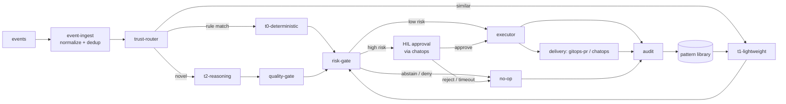

# Project Structure

The system is a **headless control plane + thin console + ChatOps**, not one web app. See [App Shape](../../../.github/instructions/app-shape.instructions.md).
The layout below records the physical service-owned tree; completion evidence and retirement
criteria are in the [Service Decomposition Execution Plan](service-decomposition-execution-plan.md#final-repository-layout).
Fifteen fixed agents own the control loop through typed events. Process splits follow
[Service Graduation and Data Ownership](service-graduation-and-ownership.md), and module names follow [Architecture](../../../.github/instructions/architecture.instructions.md).
The local five-service profile keeps each package independent over loopback PostgreSQL,
Redpanda, filesystem document storage, and ClamAV. Deployed composition replaces those adapters
with service-owned managed implementations without changing the shared wire contracts.

## Implementation status

### Implementation scope

| Area | State | Evidence | Notes |
|------|-------|----------|-------|
| Current-state activity identity | implemented | `read_investigation_latency.py`; `activity_projection.py`; focused persistence and projection tests (`6 passed`) | The latency profile retains only the hashed correlation reference, the audit entry remains correlation-free, and durable and live activity share one identity without carrying execution authority. |

### Implementation history

| Date | State | Change | Evidence | Remaining |
|------|-------|--------|----------|-----------|
| 2026-08-13 | implemented | Adopted the implementation ledger without reconstructing earlier provenance and recorded the bounded current-state activity identity change. | Current source plus `test_read_investigation_latency.py` and `test_activity_projection.py`; the focused suites passed. | Complete the deferred Phase 2 physical package move described below. |

### Remaining work

- [ ] Complete the deferred Phase 2 physical `git mv` after the compatibility import deprecation cycle, then update this layout to the resulting service-owned paths.

## Monorepo Layout

```text
fdai/
├── services/core-control-plane/src/fdai/            # Python (3.12+, src-layout); one language across the monorepo
│   ├── core/                  # headless control plane (no UI, no direct cloud SDK imports). G-1 phase 1 (tracker #14) introduced domain-group facades over the core subsystems: `pipeline/` (event_ingest, trust_router, tiers, quality_gate, risk_gate, hil_resume, executor, audit, control_loop), `incident/` (rca, slo, runbook, postmortem, oncall, irp, investigation, chaos, capacity), `operator/` (conversation, operator_memory, working_context, rbac, notifications, report_feed), `knowledge/` (prompts, tools, web_search, capability_catalog, rule_catalog_profiles, ontology_explorer), `platform/` (scheduler, metering, measurement, security, reporting, onboarding, workflow, detection, deploy_preflight, assurance_twin), plus `verticals/` (G-6). Phase 1 is additive: both `from fdai.core.<subsystem> import X` and `from fdai.core.<domain> import <subsystem>` resolve. Phase 2 (deferred) is the physical `git mv` mass move.
│   │   ├── event_ingest/       # bus consumers; normalize to event schema; dedup by idempotency key; correlate related events into incidents
│   │   ├── trust_router/       # routes each event to T0 | T1 | T2 by computed confidence
│   │   ├── tiers/
│   │   │   ├── t0_deterministic/    # deterministic-engine: policy, checklist, what-if, drift eval
│   │   │   ├── t1_lightweight/      # embedding similarity and learned-action reuse; operational cases require persisted immutable context plus fresh graph, owner, policy, dry-run, and safety evidence
│   │   │   └── t2_reasoning/        # frontier-model reasoning plus budgeted proposer failover, durable route selection, and sanitized attempt receipts
│   │   ├── prompts/            # catalog-as-code prompt composer (loads `rule-catalog/prompts/`, supplies T2)
│   │   ├── tools/              # T2 tool-catalog registry + `ToolExecutor` (shadow-mode gated)
│   │   ├── web_search/         # last-resort web-search seam (`NoOpWebSearchProvider` default; domain allowlist + sanitizer)
│   │   ├── browser_evidence/   # read-only origin/DNS policy, redaction, immutable artifacts, custody, and shadow comparison
│   │   ├── operator_memory/    # HIL-approved operator memory injected as untrusted `<operator_note>` data
│   │   ├── learning/           # consent-gated off-path turn eligibility, consensus, dedup ledger, and inert proposal routing
│   │   ├── conversation_assurance/ # deterministic-first completed-turn scoring, exact failure attribution, hold-first ontology adequacy review, mixed-family review, scoped disputes, subscription learning, chat-policy promotion/rollback, and the versioned 50-item hard-cap quality scorecard
│   │   ├── trajectory/         # authorization-first observable trajectory projection, version policy, reviewed aggregate, and offline validation
│   │   ├── case_history/       # canonical revisions, strict operational receipts, artifact-first intake, scoped retrieval, backfill, and retention
│   │   ├── task_worker/        # isolated depth-one read-only workers: capability attenuation, lifecycle, durable state, and parent synthesis
│   │   ├── background_task/    # durable detached reads: lease/CAS, atomic completion outbox, bounded retry, process-loss, and retention purge
│   │   ├── read_investigation/ # exact-resource VM/network planning, evidence, immutable provider-vs-graph shadow comparison, latency policy, owner-scoped direct/stream replay, honest cost usage, SSE heartbeats, and stream-close cancellation; no cloud SDK or execution authority
│   │   ├── briefing/           # deterministic opening/scheduled briefings over report-feed evidence
│   │   ├── scheduler/          # create/pause/resume/edit/run-now/cancel lifecycle, cron dispatch, run history, blueprints, and scoped continuations
│   │   ├── document_ingestion/ # upload lifecycle + split inspect/index worker; Forseti/Saga/Var/Muninn gates, durable stage lease/CAS claims, and replay-only gated-state recovery
│   │   ├── working_context/    # bounded per-turn prompt assembly: immutable selection policy + mandatory validator + shadow evidence/replay + planner/orchestrator folds + summarizer/retriever seams
│   │   ├── operational_context/ # atomic owned-subgraph replacement, time-consistent snapshots, and cutoff-bound graph+document evidence bundles with typed paths, provenance, source-freshness receipts, and fail-closed truncation
│   │   ├── decision_case/      # protected-objective options, deterministic selection, and response closure
│   │   ├── change_lineage/     # immutable replay-stable Change -> assessment -> decision -> action -> outcome join; no execution or promotion authority
│   │   ├── operational_planning/ # hard-constraint eligibility, Pareto pruning, Process planning phases, and replay-stable plan identity; no execution authority
│   │   ├── operational_learning/ # sealed-case classification, fingerprint/action cohort gates, immutable citations, and inert candidate mappings
│   │   ├── quality_gate/       # mixed-model cross-check, verifier, grounding; failed fan-out cancels and drains siblings (guards T2)
│   │   ├── rca/                # root-cause analysis (T0 deterministic + T2 reasoner behind seam; grounding-gated)
│   │   ├── risk_gate/          # unified authority: risk score + auto vs HIL vs deny; rejects malformed promotion metrics and enforces the seven safeguards
│   │   ├── execution_authorization/ # ontology-driven pre-dispatch capability policy, grant lifecycle, and replay-stable decisions
│   │   ├── rbac/               # human RBAC for the Operator API (5-role matrix, resolver, enforcer)
│   │   ├── human_assignment/   # immutable role/duty intent, normalized review quorum, revisioned StateStore lifecycle, and effect receipts
│   │   ├── hil_resume/         # HIL park/resume, no-drop grouping, bounded reminders, and CAS-owned shadow non-response supervision
│   │   ├── executor/           # logical-target lock, idempotency, dry-run receipt, pre-effect/terminal audit, delivery adapters
│   │   ├── execution_backend/  # profile intersection, durable lifecycle coordination, and shadow probes; no judgment authority
│   │   ├── audit/              # append-only, hash-chained audit log + KPI/metric emission
│   │   ├── notifications/      # channel-routing layer over the notifications matrix
│   │   ├── detection/          # anomaly/forecast evaluation, immutable episodes, event-time closure, and outbox contracts
│   │   ├── incident/           # lifecycle + 32-key/1024-char identities, evidence, severity, and notices
│   │   ├── slo/                # workload SLO / burn-rate evaluator (distinct from control-plane SLOs)
│   │   ├── runbook/            # runbook orchestrator (linear sequence + on-failure branch)
│   │   ├── workflow/           # version-pinned WorkflowDefinition + principal WorkflowBinding compilation; approval planner + shadow orchestrator + trigger index + event coordinator
│   │   ├── python_task/         # static validation for generated multi-file PythonTask artifacts and reviewed programmatic pipelines; never imports or executes task code
│   │   ├── programmatic_pipeline/ # capability-scoped read-only tool loops: immutable contracts, broker, receipts, compact result, and deterministic benchmark
│   │   ├── postmortem/         # LLM-optional postmortem / PIR draft generator
│   │   ├── rule_catalog_profiles/  # profile / pack layer - named rule bundles with `extends` chains + overrides
│   │   ├── measurement/        # Continuous measurement plus immutable revision/scenario operational-promotion receipts with confidence and guard gates
│   │   ├── mscp_profile/       # pure mscp-operational-v1 provenance, effect verification, cycle guard, runtime-integrity policies, and a never-raising authority ceiling; no execution authority
│   │   ├── deploy_preflight/   # pre-deployment feasibility probes → grounded readiness report
│   │   ├── readiness/          # operational handoff + startup and monitored-target readiness contracts, fail-closed reducers, evidence expiry, and authority ceilings
│   │   ├── assurance_twin/     # read-only ontology twin: text-to-query, scalar/graph active-challenger models, required invariants, durable trajectory episodes, deterministic simulation, and off-path outcome closure (never executes or promotes)
│   │   ├── ontology_platform/   # exact releases, semantic interfaces, bounded object sets, secured purpose/ACL query receipts, shared exact-number property semantics, cluster-scoped network/Pod telemetry verification, immutable diagnostic ledger/result projection, mutation plans, typed functions, authenticated reconciliation with proposal-only terminal outbox, and proposal-only SDK generation
│   │   ├── conversation/       # Bragi-owned model-free screen T0 plus schema-constrained whole-turn semantic frame/query-plan shadowing, principal-manifest verification, intent-graph evidence projection, compatibility intent/tool coordination, grounded narration, per-turn isolation, durable delivery, and busy-input arbitration
│   │   ├── user_context_projection.py  # metadata-only principal context / workflow binding projection into runtime ontology
│   │   ├── console_request/    # operator-console write-direction re-request policy (Scenario B deny-override), a single pure `evaluate_operator_rerequest`
│   │   ├── verticals/          # Resilience / Change Safety / Cost Governance (P3 integration surface); Resilience includes the control-plane recovery plan, record codec, epoch-fenced reducer, and durable CAS coordinator; each vertical is a sub-package (G-6) with its own orchestrator + submodules, plus the shared `Vertical` Protocol in `base.py` and the `VerticalRegistry` seam
│   │   ├── control_loop/       # P1 pipeline: `orchestrator.py` (ControlLoop composition plus exact property-semantics injection), `_process.py` (ordered event stages), `_fallback.py` (T1/T2), `_execution.py` (governance/risk/dispatch), `_rca.py` (shadow RCA), `_boundary.py` (audit/notification/stage adapters), `models.py` (typed results), `operator_request.py` (authoritative proposal lifecycle), `_helpers.py` (pure utilities), and `stages/` (Stage Protocol scaffold); semantic metadata never raises authority
│   │   └── ontology_explorer.py    # deterministic Mermaid renderer for the loaded ObjectType / LinkType catalog
│   ├── shared/                # cross-cutting; MUST NOT import from core/
│   │   ├── contracts/          # per-domain models + shared safety values + versioned isolated-Executor command/receipt schemas + registry.py + validation.py
│   │   │   ├── event/          # event/schema.json
│   │   │   ├── action/         # action/schema.json
│   │   │   ├── response-outcome/ # expected-versus-observed action-effect outcome
│   │   │   ├── rule/           # rule/schema.json
│   │   │   ├── ontology/       # object/link/action schemas; ObjectType may declare lifecycle criteria + provenance
│   │   │   └── workflow/       # workflow/schema.json (process-automation catalog)
│   │   ├── ontology/           # runtime ontology helpers (ACL, audit purposes, purpose taxonomy)
│   │   ├── providers/          # CSP-neutral cloud provider interfaces, including OperatingModelProvider, backward-compatible Distiller conformance, and action-bound control-plane recovery approval verification (adapters implement them)
│   │   │                       #   event_bus.py, secret_provider.py, state_store.py, execution_backend.py,
│   │   │                       #   workload_identity.py, inventory.py, log_query.py, trace_query.py, incident_platform.py, behavior_knowledge.py, programmatic_pipeline.py + LLM / channel / RBAC seams
│   │   │                       # `providers/local/` = process-local transport adapters plus bounded document format adapters (`document_limits.py` immutable ceilings, `document_text.py` for Markdown/SGML, `document_structure.py` for OOXML, `document_pdf.py` for pypdf/OCR) and explicit offline helpers;
│   │   │                       # `providers/testing/` = in-memory fakes used across the test suite (never bound in prod)
│   │   ├── streaming/          # `SseBroadcaster` + `StagePublisher`: relay EventBus topics → SSE channels
│   │   ├── telemetry/          # structured logging, tracing, metric helpers
│   │   └── config/             # config schema + startup validation (fail-fast)
│   ├── delivery/              # action delivery adapters (behind one shared interface)
│   │   ├── agent_introspection_bus.py # bounded cross-process Bragi request/reply over the shared EventBus; no executor identity
│   │   ├── gitops_pr/          # remediation-pr adapter: GitHub App / Azure DevOps, Checks API
│   │   ├── chatops/            # channel adapters (Teams / Slack / email / webhook / pager / SMS)
│   │   ├── notifications/      # per-channel senders; sibling `incident_platform/` provides PagerDuty/ServiceNow lifecycle and PagerDuty roster adapters
│   │   ├── persistence/        # Postgres / pgvector stores, including forecast episodes/outbox and relational case-history backfill
│   │   ├── operating_model/    # bounded JSON deployment operating-model adapter; startup-only and all-before-write
│   │   ├── runtime_settings.py  # allowlisted env defaults + revisioned StateStore overrides; no executor identity or promotion authority
│   │   ├── behavior_knowledge/ # in-memory hybrid behavior index, tracked-source freshness, and built-in behavior seeds
│   │   ├── catalog_search/     # candidate-only concrete semantic index; full/incremental Rule, ontology declaration, and eligible deployment-object generations; independent validation, atomic activation, stale detection, and rollback; durable pgvector binding remains delivery work
│   │   ├── pgvector/           # persistent document and behavior vector indexes
│   │   ├── azure/              # Azure-specific adapters, including bounded logs/metrics/App Insights traces and strict operational-learning evidence over promoted inventory
│   │   │                       #   `case_history_artifacts.py` stores content-addressed case revisions in private Blob through workload identity
│   │   │                       #   `vm_task.py` uses Managed Run Command; `container_apps_job_backend.py` starts pinned Job templates; `llm/python_task_author.py` generates inert drafts
│   │   ├── vm_task/            # planning-only read adapter + ontology ToolExecutor bridge; no cloud SDK imports
│   │   ├── execution_backend/  # bubblewrap and VM-task lifecycle adapters over existing sandbox authority
│   │   ├── programmatic_pipeline/ # local isolated child runner; Azure strict submission adapter remains under delivery/azure
│   │   ├── browser/             # optional isolated async Playwright evidence capture; GET/HEAD only, no page handle
│   │   ├── trajectory/         # deterministic JSONL streaming export with quarantine and atomic partial-file cleanup
│   │   ├── kubernetes/         # shared operational Kubernetes semantics: exact quantities, cluster-scoped topology, UID-grounded owners, exact-release diagnostic functions, and hold-only findings
│   │   ├── chaos/              # live chaos-inject adapters when a `Chaos` runbook step goes enforce: `live_injectors.py` (CSP-neutral primitive fan-out) + `chaos_mesh.py` (Chaos Mesh CRDs) + `mysql_load.py` (MySQL benchmark load)
│   │   ├── remediation/        # concrete `DirectApiExecutor` for direct-API remediation (`live_direct_api.py`); the Protocol lives in `shared/providers/`
│   │   ├── operator_api/           # thin ASGI - `main.py` composes route modules, including principal-scoped complete-history and read-only knowledge-context assembly plus Owner-only observation assignment cases beside IAM. GET routes project bounded state; POST commands submit governed records or typed proposals and never call a privileged executor or human-access provisioner directly
│   │   ├── ingestion_gateway/  # independent public upload API + internal durable worker process; scoped refs, deletion, and optional handover governance
│   │   ├── provisioning/       # surface-A Genesis bootstrap: pure `terraform_bridge.py` (terraform `-json` → `provision.*`) + `serve.py` harness (`aiter_json_lines` + `pump_provision_events`, I/O injected, no subprocess)
│   │   └── scheduler_tick_cli.py  # standalone entry point that drives the scheduler tick from a cron / Container Apps Job
│   ├── rule_catalog/          # rule-catalog PIPELINE code
│   │   ├── schema/             # rule, Best Practice, governance, ontology, and semantic retrieval schemas + validation
│   │   ├── sources/            # per-source collectors (WAF, CIS, OPA, IaC scanners, ...)
│   │   ├── pipeline/           # watch -> collect -> shadow/regression; distill adds the DocumentEnvelope provenance bridge, cross-format equivalence, and review-only ontology gates
│   │   └── codegen/            # authoring helpers (`new_action_type`, `new_object_type`) - generate scaffolds, never mutate the live catalog
│   ├── agents/                # pantheon runtime - 15 named agents, typed topics, v2 conversation charters, and bounded T1/T2 deliberation; see [agent-pantheon.md](../agents/agent-pantheon.md)
│   ├── evaluation/            # public EvaluationHost implementation, capability attenuation, workspace policy, artifact custody, typed ingress, and pre-judgment diagnostic ontology observation
│   ├── benchmarking/          # temporary 0.1.x compatibility facade for legacy benchmark contracts and runners
│   ├── composition/           # composition root package (G-3, tracker #14): `__init__.py` facade + `_helpers.py` Container/LlmBindings (including optional conversation T2 synthesis) + focused `wire_*` binders, including exact-release semantic query assembly with request-role executors
│   ├── runtime/               # headless lifecycle and composition, including reviewed alias-free metric-semantic catalog loading, versioned isolated Executor shadow/effect handling, stable-offset remote client, EventBus/DLQ/health supervision, production entry point, reversible authority probe, operating-model and diagnostic-catalog startup projection/status, durable T2 recovery observation/backfill, StateStore-backed proposer route selection with Thor/Vidar execution and rollback, semantic runtime availability/readiness binding with deadline-bounded durable projection replay, transport/identity bindings, startup readiness, worker gating, and post-turn review wiring into Norns
│   └── __main__.py            # entry point (starts the P1 control loop)
├── services/core-control-plane/{src/fdai_core_service,tests}/ # Core entry point and tests
├── services/{operator-service,document-ingestion-api,document-processing-worker,isolated-executor}/ and packages/service-contracts/ # independent packages, shared SDK, tests, type-stable semantic JSONB persistence, and process-owned semantic bridge health that does not depend on a projection row
├── evaluation-sdk/            # independently packageable neutral evaluation contracts and runner; no FDAI implementation imports
├── benchmarks/                # independently packaged external-harness drivers; not included in the FDAI wheel
├── extensions/                # independently packaged optional capabilities; not included in the FDAI wheel
│   └── code-assurance/         # read-only bounded GitHub PR code/security review + governed skill assets
├── rule-catalog/              # catalog-as-code DATA (YAML) - no Python; pipeline lives in services/core-control-plane/src/fdai/rule_catalog/
│   ├── schema/                 # JSON Schema definitions (data)
│   ├── vocabulary/             # canonical CSP-neutral vocabularies: resource-types.yaml, object-types/, link-types/, interface-types/, interface-implementations/
│   ├── action-types/           # upstream ontology ActionType instances (shadow-default, promotion_gate-required)
│   ├── action-types-custom/    # fork-only ActionType additions (deny-listed in upstream CI)
│   ├── action-types-overrides/ # scoped overrides to upstream ActionTypes (≤ resource-group scope)
│   ├── profiles/               # named rule packs (upstream)
│   ├── profiles-overrides/     # fork overlay for profiles
│   ├── best-practices/         # framework checklist controls with typed evidence requirements
│   ├── rule-sets/              # version-pinned governance initiatives for atomic rules
│   ├── prompts/                # catalog-as-code prompt fragments (task packs, tools, personas)
│   ├── remediation/            # remediation-plan artifacts
│   ├── operator-console/       # `SystemConsoleTool` descriptor bundles
│   ├── probes/                 # deploy-preflight feasibility-probe descriptors
│   ├── catalog/                # normalized rules (post-promotion, catalog-of-record)
│   ├── collected/              # raw upstream source snapshots pre-normalization
│   ├── exemptions/             # time-boxed audited exemption artifacts
│   ├── sources/                # per-source rule snapshots + provenance
│   ├── llm-registry.yaml       # per-capability LLM binding registry (data, resolved at composition time)
│   └── risk-classification.yaml # authoritative first-match risk-classification table (see risk-classification.md)
├── policies/                  # OPA/Rego policy-as-code consumed by T0 and the verifier
├── infra/                     # IaC: Terraform (HCL); entry command `terraform apply`
│   ├── modules/
│   │   ├── resource-group/          # rg-fdai; CAF-named per deploy-and-onboard.md
│   │   ├── identity/                # user-assigned Managed Identity for the executor
│   │   ├── compute/                 # runtime seam - alternates in siblings
│   │   │   └── container-apps/      # default (Consumption + KEDA)
│   │   ├── isolated-executor/       # opt-in internal shadow Container App; dedicated transport identity, no effect roles
│   │   ├── container-registry/      # ACR for the compute image
│   │   ├── state-store/             # audit + KPI + pgvector
│   │   │   └── postgres-flex/       # default
│   │   ├── event-bus/               # Kafka wire
│   │   │   └── event-hubs-kafka/    # default (Event Hubs, :9093)
│   │   ├── secret-store/            # env + Key Vault reference bridge
│   │   │   └── key-vault/           # default
│   │   ├── observability/           # Log Analytics + App Insights bound to it
│   │   │   └── log-analytics/       # default
│   │   ├── llm/                     # deployer-scoped LLM provisioning (dev-and-deploy parity contract)
│   │   │   └── azure-openai/        # default Azure OpenAI deployment set
│   │   ├── measurement-runners/     # Container Apps Jobs for automated regression + pattern-growth runners
│   │   ├── vm-task-host/             # cloud-init profile for custom Linux/GPU VMs
│   │   ├── vm-task-rbac/             # target-VM-scoped Managed Run Command RBAC
│   │   ├── preflight-toggles/       # feature-flag surface mapping preflight blockers → Terraform toggles
│   │   └── console/                 # Static Web App hosting for the read-only SPA
│   │       └── static-web-app/      # default
│   ├── local/                       # local-dev IaC (docker-compose, testcontainers wiring; not applied to Azure)
│   └── envs/                        # per-env tfvars (git-ignored; never committed)
│       ├── dev/
│       ├── staging/
│       └── prod/
├── console/                   # thin SPA (Vite + Preact) - operator views, bounded governed commands, local display settings, and observation-only IAM Assignments
│   ├── src/                    # shell, panel registry, GET-only client, routes, browser-local preferences
│   ├── index.html              # Vite entrypoint
│   ├── package.json            # deps: preact, @azure/msal-browser
│   └── vite.config.ts          # build → console/dist/ (git-ignored)
├── cli/                       # operator-console CLI (Ink) - one view-model, many renderers
│   ├── src/view-model/         # presentation-neutral briefing contract + block IR + builder
│   ├── src/renderers/          # ink (terminal) / text / slack (Block Kit) / teams (Adaptive Card)
│   ├── src/cli.tsx             # entrypoint: build briefing once, render per --surface
│   └── package.json            # deps: ink, react (run with tsx, no build step)
├── site/                      # Astro / Starlight docs site (renders docs/**/*.md with i18n + search)
├── ui/                        # (future) static UI kit (Calm Slate theme) - placeholder
├── services/core-control-plane/tests/                     # subsystem-focused unit tests plus cross-subsystem regression suites and shared fixtures
├── docs/roadmap/              # this roadmap and design docs
├── pyproject.toml             # single manifest for the Python monorepo
└── .github/                   # instructions/ and workflows/ (CI: lint, secret-scan, coverage)
```

Runtime bootstrap delegates semantic-turn readiness to `bootstrap_lifecycle.py` and vertical workload identities to `bootstrap_bindings.py`, preserving bounded provider construction and the injectable identity-builder boundary used by tests and forks. Resource-state composition also binds a no-authority publisher to the shared stage topic after the authoritative Heimdall read; a bounded latency profile retains only its hashed correlation so durable and live activity share one identity without question text, resource identity, executor capability, or an added latency-audit field, and broker failure never rewrites the answer.

> Directory names follow the canonical vocabulary in [language.instructions.md](../../../.github/instructions/language.instructions.md):
> `trust-router`, `deterministic-engine`, `rule-catalog`, `risk-gate`, `remediation-pr`, `shadow-mode`, and `HIL`.
> Disk identifiers use `snake_case`; each package owns its tests, while cross-service and repository checks remain in `tests/integration/`.

## Module Boundaries

Dependency direction is strict and one-way; a violation is a review blocker.

- **core is portable**: it MUST NOT import any cloud SDK directly. Cloud specifics enter
  only through the CSP-neutral interfaces in `shared/providers/`, whose implementations live
  in `delivery/` and `infra/` and are injected at composition time. This keeps a second cloud
  a matter of adding an adapter, never editing `core/`.
- **allowed imports**: `shared/` imports nothing from `core/`; `core/` may import only
  `shared/` contracts, providers, telemetry, and config; `delivery/` may compose `core/` and
  `shared/` behind adapter boundaries; `composition/` binds all layers. `core/` never imports
  `delivery/`, and browser code never imports Python implementation modules.
- **policies and rules are data, not code paths**: T0 loads `rule-catalog/` entries and
  `policies/` at runtime; adding a rule or policy never requires an engine change. Rules
  describe intent and remediation; policies are the executable OPA/Rego the verifier re-checks.
  How sources are collected and normalized into that YAML is in
  [rule-catalog-collection.md](../rules-and-detection/rule-catalog-collection.md).
- **delivery is swappable**: `gitops-pr` and `chatops` are adapters behind one interface, so
  the executor emits an abstract action and the adapter renders it (remediation-pr, Adaptive
  Card). The executor holds the only privileged identity; adapters never share it.
- **console has no privileged identity**: it visualizes state, audit, shadow results, and the HIL queue. Access comes from verified App Roles, independent of the optional access projection.
  Command surfaces may submit authenticated records or typed proposals, but neither they nor the dev narrator can call an executor; risk, approval, audit, and execution remain server-side
  ([security-and-identity.md](security-and-identity.md)). With transport active, one semantic-aware adapter binds projection, proposal, and stream ports.
  Its outbox uses database `NOW()` deadlines, while transactional result reuse validates the request, principal, and terminal-result digest.
  Repository Best Practice definitions are loaded once at the composition root and exposed through
  GET-only list and detail routes. They remain catalog reference data; the projection reports
  `Unknown` and `not-connected` until a runtime evidence provider is explicitly bound.
  The navigation shell uses an icon-only Activity Bar with five stable domains:
  `Overview`, `Operations`, `Agents`, `Governance`, and `Evidence`. The adjacent Explorer
  renders the panels registered for the selected domain. Selecting a domain opens the Explorer
  and navigates to its first visible panel, using the operator's local panel order and visibility
  preferences. English is the default display
  language, and the Korean catalog provides `전체 현황`, `운영`, `에이전트`, `거버넌스`, and
  `감사·증적` without changing group ids, panel ids, or routes. An operator can reorder or hide
  panels in browser-local, account-scoped preferences. Icon-only shell controls expose their
  localized labels through a shared tooltip that opens on keyboard focus, delays pointer hover,
  renders through a document-body portal, and flips or shifts to remain in the viewport. It also
  honors reduced-motion preferences instead of relying on browser-native `title` bubbles.
  Hiding changes navigation display only;
  direct routes and search remain available, and the active panel cannot be hidden. Detail
  routes render a compact domain / panel hierarchy inside the shared page title so context
  remains visible when the Explorer is collapsed. Dashboard renders `Overview / Dashboard`;
  domain roots whose panel title repeats the domain label and standalone utilities keep a single
  title. The Agents domain also keeps a visible
  workspace tab row across its Roster, Organization, Activity, and Handover panels. Roster is
  the default agent view and projects current stream state, current work, incident association,
  reporting line, and evidence links without inventing metrics that the Operator API did not return.
  It separately shows runtime bindings: 11 typed EventBus subscribers plus Huginn's raw-ingress
  subscriber stay ready while Njord and Freyr wait for external adapters and Loki waits for a
  scheduled trigger. Huginn owns real-time resource discovery ingress: Azure create, update, and
  delete signals arrive through the canonical event topic, then an injected delivery projector
  enriches and applies ordered inventory deltas without putting Azure I/O inside the agent. The
  generic Inventory delta forwarder preserves each `InventoryBatch.links` patch by assigning
  `contains` to its target resource and other relationship types to their source resource. A link
  whose owner resource is absent from the same batch blocks cursor advancement so the page is
  retried instead of silently dropping graph data. The event idempotency identity includes a
  bounded SHA-256 digest of the scope, resource, and relationship payload, so long resource ids
  cannot truncate away the distinguishing digest or exceed the event contract. Delta resources require a
  timezone-aware RFC 3339 `last_seen`; missing or malformed ordering time blocks publication and
  cursor advancement instead of substituting a process wall clock. A batch may contain each
  `resource_id` only once; duplicates block the whole batch before any event is published.
  Resource and relationship properties must also serialize as canonical JSON with finite numeric
  values; unsupported objects and `NaN` are rejected before identity calculation, publication, or
  PostgreSQL connection. Realtime projectors and immutable snapshot staging store only prevalidated
  canonical JSON documents; snapshot coverage metadata follows the same rule before begin or
  promotion. Azure relationship property paths, allowed provider types, semantic direction,
  source-schema digest, and evidence policy come from the reviewed
  `provider-relationship-mappings` catalog. A complete-generation verifier activates a candidate
  only when the same generation observes both endpoints, provider and verifier identities differ,
  and an immutable verification receipt binds the edge and mapping revision. Missing endpoints,
  ambiguous orientation, stale schema mappings, duplicate or conflicting observations, and partial
  generations produce stable dropped reasons and no active graph edge. Verified links carry
  immutable state-fact and link-observation metadata. Stale or conflicting evidence can only lower
  operational-context autonomy.
  All events in the bounded batch are constructed and validated before the first publication, so
  a malformed later resource cannot leave an earlier event partially published by validation.
  Every delta page marked `has_more` must provide a new continuation cursor before its records are
  yielded. A missing or unchanged cursor fails the pull without a final fence; an advancing stream
  that reaches the configured page cap returns the latest cursor so the next pull resumes there.
  A terminal `final=True` batch may carry resources and relationships; the forwarder publishes
  that payload before committing its cursor. Any batch after the final fence fails the stream and
  leaves the prior durable cursor unchanged. If the final batch omits its cursor, the forwarder
  commits the last non-null page cursor instead of rewinding to the cursor from the start of pull.
  The Azure Activity Log adapter derives the resource-group `contains` relationship from each
  mapped ARM resource id and includes it in the same delta page. Dependencies that require a live
  resource read remain incomplete until an ARG or ARM hydration adapter supplies them. Event Grid
  remains authoritative for resource deletion. The upsert-only Activity Log adapter skips delete
  operations instead of resurrecting the resource, but still advances its page cursor from every
  valid event timestamp so filtered records cannot stall the stream. Multiple records for one
  resource use event time and then a canonical resource document as a deterministic tie-breaker;
  each page emits resources in `resource_id` order. Resume cursors and every object event in a page
  require timezone-aware RFC 3339 timestamps, including events that don't map to tracked resources.
  A malformed event timestamp fails the page rather
  than being dropped or treated as UTC, preserving the ordering authority. Non-2xx Activity Log
  errors report only the HTTP status; response bodies never enter exception or log text.
  In-flight cursors require both a valid running timestamp and a non-empty next link. The initial
  lower bound is carried across an empty intermediate page, so pagination cannot erase or rewind
  the eventual resume cursor. The single-subscription Activity Log adapter accepts only a canonical
  hyphenated subscription UUID, preventing scope text from altering the request path or query. Its
  bearer-token endpoint must be an HTTPS origin URL without userinfo, path, query, or fragment.
  Each Activity Log response is also bounded by `max_events_per_page` (default 1000); an oversized
  page fails before mapping or cursor advancement. Every `value` entry must be an object; a
  malformed entry fails the page because its ordering position cannot be verified safely.
  PostgreSQL projector applies each resource and its relationship changes in one transaction.
  Writers acquire locks in a fixed hierarchy: the snapshot-promotion shared gate, the graph
  reconciliation gate, then sorted locks for the changed resource and every relationship endpoint.
  Resource locks use seeded 63-bit advisory keys in the negative key range; the positive global
  promotion and reconciliation gates therefore occupy a disjoint key range.
  Ordinary patches share the graph gate, so unrelated resources remain concurrent. Resource
  deletion and a `links_complete: true` relationship replacement take the graph gate exclusively,
  read the effective relationship set, and write missing relationships as tombstones before commit.
  Every relationship upsert must resolve both endpoints in the effective resource graph and its
  declared endpoint types must match those resources; a missing or contradictory endpoint rolls
  back the resource and relationship changes together. Each inventory change carries at most one
  entry for a `(from_id, link_type, to_id)` key; duplicate keys are rejected before database I/O.
  Every incoming relationship patch must also be owned by the changed resource: `contains` is
  owned by its target and other relationship types are owned by their source. Unowned patches
  cannot mutate an unrelated graph edge. The per-change `max_links` cap is always positive; zero is
  rejected at startup because it would make every relationship-bearing delete unreconcilable.
  Database-derived tombstones use a separate `max_reconciled_links` cap (default 4096), which must
  be at least `max_links`; high-degree resources can therefore be deleted atomically without
  widening the untrusted payload limit.
  An existing effective `resource_id` also keeps its resource type across realtime updates. A
  contradictory type is rejected before the resource row or its relationships can change.
  While any realtime resource overlay remains pending, graph freshness is `unknown` and the read
  projection is degraded even when the base snapshot is within budget. A complete reconciliation
  promotion clears covered overlays and restores snapshot-derived freshness.
  Each projector result carries a typed outcome: `applied`, `not_applicable`, `snapshot_covered`,
  or `ordering_rejected`. Snapshot and ordering suppression also emit `inventory_delta_ignored`
  with the event id and bounded reason, so a safe no-op is distinguishable from an applied update.
  Existing two-field result construction remains compatible by defaulting an omitted outcome to
  `applied`.
  A payload that explicitly declares an event type is projected only when it is
  `inventory.resource_changed`; another domain's event is `not_applicable` even if it carries an
  `inventory_change` field. Omitting `event_type` remains supported for direct legacy callers.
  An absent or false `links_complete` never removes an unobserved relationship. Snapshot promotion
  keeps the exclusive promotion gate and therefore cannot overlap any delta transaction. The
  dedicated Inventory sync job queries Azure Resource Graph with ARM fallback every six hours by
  default and atomically promotes a complete reconciliation snapshot. Heimdall monitors discovery
  freshness, lag, and coverage without starting repair. The job checks durable attempt state every
  10 minutes, keeps a six-hour healthy scan interval, and retries newer failed or abandoned attempts on the next tick;
  the local harness runs no Azure discovery.
  Organization offers Directory and Org chart views; `?view=org` preserves a direct link to the
  live reporting hierarchy, and each node opens that agent's focused runtime detail.
  Its filters and search are browser-local presentation controls; Activity links preserve the
  selected agent in the route query. Activity shows that agent's current stream state and recent
  live incidents before its durable audit timeline, so delayed or missing audit attribution does
  not make an active agent appear blank. Local dev mode also exposes a `Labs`
  group immediately above Settings; production navigation omits this development-only group.

## Repository Script Layout

Repository automation is grouped by responsibility under `scripts/`; only the
layout README, `verify.sh`, and the Python package marker stay as root files. Quality gates,
integrity tooling, governance checks, catalog utilities, deployment helpers,
and general automation each have their own directory. See
[scripts/README.md](../../../scripts/README.md) for the ownership map and
placement rules.

## Structural CI Gates

Four CI-enforced scripts back the boundary rules above so drift cannot creep
back once a refactor lands. They live under `scripts/quality/architecture/` and run in every
CI pipeline plus the local pre-push hook. Corresponding docs in
[coding-conventions.instructions.md](../../../.github/instructions/coding-conventions.instructions.md).

| Gate | Rule | Mode today |
|------|------|------------|
| [check-core-imports.sh](../../../scripts/quality/architecture/check-core-imports.sh) | `core/` forbids cloud SDKs, HTTP clients, and `fdai.delivery.*` | enforce |
| [check-agents-imports.sh](../../../scripts/quality/architecture/check-agents-imports.sh) | `agents/` forbids the same set | enforce |
| [check-file-loc.sh](../../../scripts/quality/architecture/check-file-loc.sh) | warn > 400 LOC, fail > 800 in enforce mode | warn-only |
| [check-subsystem-fanout.sh](../../../scripts/quality/architecture/check-subsystem-fanout.sh) | warn >= 8 sibling `core.*` subsystems in one file, fail >= 15 | warn-only |

### Adding a new gate

1. Write `scripts/quality/architecture/check-<name>.sh` following the pattern in the existing
   scripts (warn/fail thresholds via env vars, allowlist with a preceding
   `#` justification comment, stale-entry rejection, GitHub Actions
   annotations, `CHECK_QUIET=1` summary mode).
2. Ship the gate in **warn-only** so it does not break the current tree.
3. Add a job to `.github/workflows/ci.yml` and a call in `.githooks/pre-push`.
4. Add regression tests to `services/core-control-plane/tests/test_check_structural_gates.py` covering
   warn / enforce / threshold overrides / allowlist / stale entries /
   boundary conditions.
5. Extend `services/core-control-plane/tests/test_structural_gates_drift.py` so the CI job and the
   pre-push wiring are drift-guarded.

### Promoting a gate warn -> enforce

1. Land the refactor(s) that clear the current warn baseline (tracker #14).
2. Flip the gate's mode env var (`FILE_LOC_MODE=enforce`, etc.) in the CI job.
3. Add any legitimate exceptions to the gate's allowlist file with a
   written justification, following the H3 rule (preceding `#` comment).
4. Do NOT weaken the threshold to make the tree fit; either split the file
   or record the exception in the allowlist. Weakening a threshold to
   unblock a red pipeline is a governance regression.

## Customization via Dependency Injection

This repository is the **main project**. Per-customer customization is supplied by **dependency
injection**, never by editing `core/` or maintaining a divergent copy of it. The upstream repo
defines the interfaces and ships generic default implementations; a fork **registers its own
implementations** at a composition root, so customization is additive and upstream sync stays
clean (see the fork model in
[generic-scope.instructions.md](../../../.github/instructions/generic-scope.instructions.md)).

> **Fork maintainers**: start with the procedural walkthrough in
> [downstream-fork-guide.md](../fork-and-sequencing/downstream-fork-guide.md). This section is the seam catalog
> that guide operationalizes.

- **Composition root**: `core/` depends only on the CSP-neutral interfaces in `shared/`. A thin
  composition root (outside `core/`) binds concrete implementations at startup. `core/` never
  news-up a concrete adapter; it receives its dependencies. The upstream default binder is
  [`fdai.composition.default_container`](../../../services/core-control-plane/src/fdai/composition/__init__.py); a fork's
  entry point calls its own factory that wraps or replaces those bindings. Concrete adapter
  classes (e.g. `PackageResourceSchemaRegistry`, `JsonSchemaContractValidator`) are
  **not** re-exported from public sub-packages; they must be imported directly from their
  submodule, and only by a composition root, so `core/` cannot depend on a concrete by
  accident.
- **Config-driven binding**: configuration selects each implementation. `composition/wire_distiller.py`
  atomically binds the review-only `Distiller` from three exact-version endpoints and one replay-identical
  prompt; zero council records preserve abstention and partial records fail startup without changing execution T2.
- **Default implementations upstream**: the main repo provides working generic defaults for
  every seam so it runs standalone; a fork replaces only the seams it needs.
- **Current T1 reuse evidence**: `CurrentReuseVerifier` collects fresh resource, topology,
  graph, owner, policy, dry-run, and safety facts for an immutable operational case. Azure cache
  freshness is evaluated against the current evaluation clock with bounded age and future skew,
  so a recent pre-event cache can pass while historical replay cannot revive stale evidence.
  Learned signatures bind canonical parameters and the complete operational-case context. Growth
  and pgvector query/write boundaries reject non-finite embedding values before database I/O. The
  verifier grants no execution authority. An absent binding makes operational reuse abstain while
  legacy patterns continue. Pantheon composition can inject `OperatingPatternCompiler`; Norns
  serializes typed learning and applies bounded proposal backpressure before Mimir review.
- **Causal and Dynamic runtime evidence**: `TemporalCausalEvidenceProvider` supplies bounded
  pre-cutoff series and graph facts. `DynamicSimulationRequestProvider` supplies at most 32 current-
  state branches. `CausalHypothesisProjection` stays Forseti-owned, and model grades require an
  `EffectModelCausalEvidenceVerifier`. Dynamic models cannot use outcomes later than the simulation
  snapshot, current snapshots use evaluation-clock freshness, and the pure simulator rejects model
  cutoff or finite-arithmetic violations even outside the coordinator. These seams are read-only;
  absent bindings disable shadow paths.
- **Operational promotion authority**: `OperationalPromotionReceiptVerifier` and
  `OperationalPromotionUnitVerifier` resolve immutable evidence. The production registry remains
  shadow without them; raw scalar metrics are a test-only legacy fixture mode. A promotion-state
  refresh failure lowers the unified system-health ceiling instead of reusing stale enforcement.
- **Azure operational evidence**: `bind_azure_operational_evidence` composes a strict promoted-
  inventory snapshot reader, current safety evaluator, configured Azure metrics, bounded branch
  estimator, and effect-model reader. Temporal adapters reject non-finite metric values before
  evidence hashing. Partial binding fails at container construction.

### Capability Bundles

Use a `CapabilityBundle` when a fork adds a discoverable capability rather than replacing one
infrastructure seam. A bundle groups the operator-facing `Capability` metadata, one typed
`CapabilityBinding`, optional reviewed `ToolArtifact` metadata, and any reasoning-tool
`ToolProvider` implementations. A binding points to either an already loaded reasoning tool or a
tool carried by the same bundle, or to an existing `ActionType` or `Workflow`. It does not define
another execution path or load provider code from an artifact.

Install a bundle with `fdai.composition.install_capability_bundle(...)`. The installer builds
cross-references from the loaded catalogs and returns a new `Container` whose
`capability_runtime` contains the validated registration. Startup is blocked when a target is
unknown, a provider is missing or duplicated, a tool's declared provider does not match the
bundle, a package tool is unreferenced, or a package tool id shadows another source. The input
container remains unchanged when validation fails.

`wire_azure_container(...)` combines the file-backed tool catalog with package tools from the
installed runtime, then combines runtime providers with explicit
`AzureWireOverrides.tool_providers`. Duplicate tool or provider ids are configuration errors
rather than implicit overrides. `ActionType` and `Workflow` bindings are references only:
mutating requests still re-enter the trust router, risk gate, executor, and audit path. See
[Core package root](../../../services/core-control-plane/src/fdai/)
for a copy-ready read-only provider and bundle.

When a deployment needs install, enable, disable, or uninstall lifecycle around those bundles,
use `ExtensionManager` in `core/capability_catalog/extensions.py`. Installation verifies the
archive SHA-256 digest, an injected publisher trust decision, host-version compatibility, and
manifest-to-bundle capability parity. A verified extension is installed disabled. Enabling it
rebuilds a candidate `CapabilityRuntime` from the immutable base and every enabled bundle, so an
unknown ActionType, Workflow, reasoning tool, or provider blocks activation without changing the
current manager. Disable the extension before uninstalling it.

This lifecycle is intentionally not a dynamic code loader or public package downloader. The fork
composition root supplies already-reviewed provider implementations and the trust verifier.
Extension activation registers typed metadata and references only; every mutation still uses the
normal pipeline and starts in shadow mode according to its ActionType or Workflow contract.

`core/supply_chain/` owns the durable trusted-artifact contract and install orchestration shared by
extensions and skills. Installation first passes the existing extension or skill lifecycle, then
persists the exact raw artifact, detached signature, publisher source, digest, and disabled state.
A failed durable write returns no candidate catalog to the caller. `delivery/trust/` provides the
concrete source-keyed Ed25519 verifiers with distinct extension and skill signature domains, so a
signature cannot replay across artifact kind, source, id, version, or content digest.

Production uses `PostgresTrustedArtifactStore` and the `trusted_artifact` table. Extension and skill
ids share one schema but remain separated by `artifact_kind`; insert requires expected revision 0,
and every update requires an exact revision and increments by one. The table repeats the content
size, SHA-256, 64-byte signature, state, timestamp, and revision constraints. It stores no private
key or provider credential. Production Operator API startup loads skill records, resolves publisher
public keys from `FDAI_SKILL_TRUSTED_PUBLISHERS_PATH`, and atomically publishes a reverified
`RuntimeSkillDisclosure` shared by Bragi, optional typed RPC, and the GET-only Skills panel. Local
composition publishes an empty fail-closed snapshot when no durable skill store is configured.
Governed multi-skill manifests use the separate `skill_bundle` artifact kind and
`fdai.skill-bundle-signature.v1` domain. Startup rebuilds skills before bundles so exact member
versions and enabled state are validated before the shared runtime snapshot is published.

Approved external skill repositories use the separate durable source pipeline in
[skill-source-management.md](../interfaces/skill-source-management.md). `core/skills/source_registry.py`
owns immutable source identity; `core/supply_chain/skill_source_*.py` owns quarantine, disabled
candidate approval, scheduled ETag refresh, and revocation policy. PostgreSQL adapters persist the
five Alembic `0045` tables. Reader GET routes expose source evidence, while separate Approver and
Owner POST routes install disabled candidates or revoke without deleting provenance. Production
reloads the runtime disclosure after either command so durable disablement takes effect immediately.

### Injectable Seams

The eight seams marked **CSP-neutrality contract** below realize the wire-level contracts in
[csp-neutrality.md](csp-neutrality.md). `core/` sees only the interface; a fork or a future
non-Azure phase registers a new implementation at the composition root without editing `core/`.

| Seam | Interface (in `shared/`) | Contract | Default (upstream) | Fork override example |
|------|--------------------------|----------|--------------------|-----------------------|
| Event bus | `EventBus` (Kafka producer/consumer) | **CSP-neutrality contract** - [event bus](csp-neutrality.md#1-event-bus-contract--kafka-wire-protocol) | librdkafka-based client with SASL/OAUTHBEARER (Entra token source) | AWS IAM SigV4 auth, GCP IAM auth, Confluent SASL/PLAIN, self-hosted Kafka mTLS |
| Runtime | `RuntimeAdapter` (renders OCI + Knative-compatible manifest) | **CSP-neutrality contract** - [runtime](csp-neutrality.md#2-runtime-contract--oci-image--knative-compatible-manifest) | Container Apps IaC renderer (Bicep/Terraform) | Cloud Run YAML, App Runner service, Knative Service on any K8s |
| Secret & config | `SecretProvider` / `ConfigProvider` | **CSP-neutrality contract** - [secret](csp-neutrality.md#3-secret-contract--environment--k8s-secret) | env + Container Apps KV-reference bridge | ESO + Key Vault / AWS Secrets Manager / GCP Secret Manager / HashiCorp Vault |
| Workload identity | `WorkloadIdentity` (audience-scoped OIDC token) | **CSP-neutrality contract** - [workload identity](csp-neutrality.md#4-workload-identity-contract--oidc-token) | user-assigned Managed Identity (IMDS → Entra token) | IRSA, GCP Workload Identity Federation, SPIFFE/SPIRE SVID |
| Inventory | `Inventory` plus `InventorySnapshotStore` (CSP-neutral batches, immutable candidate staging, atomic active pointer) | **CSP-neutrality contract** - [inventory](csp-neutrality.md#5-inventory-contract--resource-graph) | Scheduled Azure collector under a dedicated read-only MI: ARG full-scan, direct ARM-list fallback, signed declarative recovery, PostgreSQL last-known-good projection; Core-owned migrations admit observed `peered_with` links and multiple valid `attached_to` anchors | A fork injects another ordered source while preserving coverage, authority, relationship cardinality, and atomic-promotion semantics |
| Metric ingestion | `MetricProvider` | **CSP-neutrality contract** - [metrics](csp-neutrality.md#6-metric-query-contract--csp-neutral-sample-iterator) | `NoopMetricProvider` or Azure Monitor Logs binding | CloudWatch, Prometheus, Datadog, or another normalized metric adapter |
| Log ingestion | `LogQueryProvider` | **CSP-neutrality contract** - [logs](csp-neutrality.md#7-log-query-contract--structured-log-records) | `NoopLogQueryProvider`; Azure adapter binds KQL when configured | Loki, Elasticsearch, CloudWatch Logs, or another structured log adapter |
| Trace ingestion | `TraceQueryProvider` | **CSP-neutrality contract** - [traces](csp-neutrality.md#8-trace-query-contract--distributed-trace-spans) | `NoopTraceQueryProvider`; Azure adapter binds Application Insights when configured | Tempo, Jaeger, Honeycomb, or another span adapter |
| Cloud provider | provider client | (uses the eight above) | reference/generic Azure adapter | a specific CSP adapter |
| **Schema source** | `SchemaRegistry` (raw JSON Schema loader) | - | `PackageResourceSchemaRegistry` (schemas ship inside the package) | remote schema-registry adapter; snapshot pinned by content hash |
| **Boundary validation** | `ContractValidator` / `EventValidator` (fail-closed input check) | - | `JsonSchemaContractValidator` + `JsonSchemaEventValidator` (draft-2020-12) | fork MAY layer domain-specific checks (e.g. source allowlist) without editing `core/` |
| **Action precondition evidence** | `PreconditionEvaluator` in `core/risk_gate/preconditions.py`; indexed `PreconditionEvaluation` records consumed by RiskGate | - | `GovernedPreconditionEvaluator` combines canonical event evidence, `StateStoreOpenActionEvidenceProvider` reads Thor's durable active-run index, and `OntologyChangeWindowEvidenceProvider` performs bounded window queries. Missing or malformed active rows conflict, missing providers leave conditions unresolved, and truncated or malformed windows stay inactive. | replace the read-only state projections while preserving every condition index and the rule that evidence can only preserve or lower authority |
| **Governed trajectory datasets** | Immutable audit / conversation / tool / approval / outcome snapshot Protocols, `TrajectoryAccessAuthorizer`, and `TrajectoryDatasetStore` in `shared/providers/trajectory.py`; `TrajectoryJoinService` and `TrajectoryDatasetAdminService` in `core/trajectory/` | - | Deny-by-default allowlist authorizer, in-memory metadata store, deterministic JSONL exporter, PostgreSQL metadata/quarantine adapters, Owner-only GET projection, and offline validator | inject policy-backed scope authorization and immutable source readers while preserving authorization-before-materialization, bounded excerpts, checksums, retention/legal hold, and reviewed-only Norns intake ([design](../interfaces/governed-trajectory-datasets.md)) |
| Rule / policy source | rule-catalog + `policies/` loader | - | bundled generic rules | customer rule set / thresholds |
| **Capability bundle runtime** | `CapabilityRuntime` + `CapabilityBundle` and trust-verified `ExtensionManager` in `core/capability_catalog/`; additive `StaticToolRegistry` / `CompositeToolRegistry` in `core/tools/`; `install_capability_bundle(...)` in `composition/` | - | default discovery catalog with no fork bindings; extensions install disabled | add reviewed reasoning-tool metadata and its provider, or bind a capability to an existing `ActionType` / `Workflow`; duplicate ids, digest, trust, compatibility, manifest parity, and all references validate before activation |
| **Capability licensing** | `LicenseVerifier` Protocol, token contract, and `resolve_entitlement(...)` in `core/licensing/`; `Ed25519LicenseVerifier` in `delivery/trust/ed25519.py` | - | upstream ships unlicensed, so the full catalog is available and development is never gated | a distribution packages its public key in the image, injects a signed token through the secret path, and may set `require_license` for fail-closed behavior; a license moves the `available` axis only and never promotion, RBAC, risk, or approval ([design](../fork-and-sequencing/capability-licensing.md)) |
| **Context selection policy** | `ContextSelectionPolicy`, mandatory invariant wrapper, revision-safe authority, shadow runner, replay, and evidence store in `core/working_context/`; `context_selection_policy` references in `CapabilityRuntime` | - | immutable `deterministic-tiered-v1@1.0.0`; candidate installation disabled; durable evidence reuses `StateStore` | register a reviewed policy implementation at composition, bind its exact id/version through `CapabilityRuntime`, measure it in bounded shadow, and promote only with an evidence window plus rollback target ([design](../decisioning/context-selection-policy.md)) |
| **Browser evidence** | `BrowserEvidenceProvider`, origin policy, capture request, artifact store, and custody sink in `shared/providers/browser_evidence.py`; policy and services in `core/browser_evidence/` | - | unbound by default; optional isolated Playwright delivery adapter, PostgreSQL artifacts, append-only custody, evidence workflow step, and GET-only inspection | bind exact server-owned policies and a restricted-egress runtime without executor identity; content stays untrusted and shadow-only ([design](../interfaces/browser-evidence.md)) |
| **MSCP effect observation** | `ExpectedEffectProvider` and `IndependentEffectObserver` in `core/mscp_profile/`; optional pair on immutable `Container` | - | unbound by default; the headless runtime passes a complete pair into ControlLoop for predict -> dispatch -> observe -> shadow-audit ordering | bind both collaborators with `dataclasses.replace`; partial binding fails fast and shadow results never raise autonomy ([design](mscp-operational-profile.md)) |
| **Typed external RPC** | `RpcRegistry`, `RpcMethod`, scopes, and idempotency contract in `core/rpc/`; bounded HTTP client/route, deterministic Python stub codegen, and `build_production_rpc_app(...)` in `delivery/rpc/` | - | no RPC route is mounted by the control plane; opt-in standalone app binds built-in tool discovery and PostgreSQL hashed claims | a fork supplies the identity-aware authorizer and explicit additional methods; side-effect methods require durable idempotency claims and still submit typed proposals rather than invoking an executor directly |
| **Ontology ObjectType / LinkType / InterfaceType** | Fail-closed ObjectType, LinkType, InterfaceType, and explicit Interface implementation loaders in `services/core-control-plane/src/fdai/rule_catalog/schema/` | - | shipped declarations under `rule-catalog/vocabulary/{object-types,link-types,interface-types,interface-implementations}/`, loaded into the corresponding immutable `Container.ontology_*` tuples; Interface bindings are compiled and pinned in the exact runtime release | a fork ships additional YAML under a fork-local vocabulary directory, loads both roots at its composition root, compiles the combined Interface bindings, and passes the concatenated tuples via `dataclasses.replace`. Duplicate names and dangling bindings fail closed. See [downstream-fork-seam-recipes.md § 5.8a](../fork-and-sequencing/downstream-fork-seam-recipes.md#58a-ontology-object-type--link-type-additions). |
| **Network query receipt verification** | `NetworkQueryReceiptVerifier` in `services/core-control-plane/src/fdai/core/ontology_platform/network_path.py` plus one opaque composition-owned verification context | - | unbound; `query.network_path_segments` cannot register as an authenticated production function without a receipt issuer and verifier | inject an issuer-backed verifier that authenticates the secured receipt role, singleton purpose, exact ontology release, projected-result digest, and `FunctionInvocationContext`; the opaque context never enters function arguments and verification grants no execution authority |
| **Workflow catalog (process automation)** | `load_workflow_catalog(root, *, schema_registry, action_type_names, rule_ids=...)` in `services/core-control-plane/src/fdai/rule_catalog/schema/workflow.py`; `compile_workflow(...)` in `services/core-control-plane/src/fdai/core/workflow/` | - | shadow-first Workflows under `rule-catalog/workflows/`; every action step cross-references an `ActionType`, while evidence/control steps use dedicated typed contracts | fork ships additional Workflow YAML under a fork-local `fork/workflows/` directory, loads it at its composition root with the concatenated ActionType / rule sets, and passes the tuple via `dataclasses.replace(container, workflows=...)`. Duplicate `name` across roots fails-closed. See [(4[56])](../decisioning/process-automation.md). |
| **Governed Python task** | `PythonTaskAuthor`, `PythonTaskArtifactStore`, `VmTaskTargetResolver`, and `VmTaskRunner` in `shared/providers/` | - | local template author + in-memory artifacts/targets + planning runner; production stores immutable artifacts in Postgres, resolves targets from active inventory, and the headless executor binds Azure Managed Run Command | a fork supplies another author, artifact repository, target resolver, or compute runner while preserving content hashes, declared capabilities, idempotency, non-executing Operator API plans, and typed proposal dispatch. See [(4[56]) § 4.5](../decisioning/workflow-control-loop-integration.md#45-governed-python-tasks-and-cron-schedules). |
| **Governed sandbox profiles** | `SandboxProfileCatalog`, `VmTaskSandboxCatalog`, `ToolSandboxCatalog`, and `DocumentConverterSandboxCatalog` in `core/sandbox/`; `DocumentConverter` in `shared/providers/` | - | unprofiled command, VM-task, tool, and converter requests fail closed; profiled wrappers enforce capability, mode, suffix, timeout, argument/input/output byte, and workspace/network ceilings immediately before concrete adapters | a fork supplies explicit server-owned profiles with each adapter binding. It may implement a converter or alternate runner behind the provider contracts, but cannot expose host paths, executables, credentials, or broader request authority. See [(4[56]) § 4.6](../decisioning/workflow-control-loop-integration.md#46-governed-command-and-shell-artifacts). |
| **Governed execution backend** | `ExecutionBackend` and `ExecutionSubmissionLedger` in `shared/providers/execution_backend.py`; profile intersection and coordinator in `core/execution_backend/`; `bind_execution_backends(...)` in `composition/` | - | profiles load disabled, existing sandbox validation runs first, PostgreSQL stores idempotent lifecycle attempts, bubblewrap and VM adapters preserve behavior, and Azure Container Apps Job starts only pre-provisioned pinned templates | supply server-owned profiles and concrete adapters at composition. A binding can narrow but cannot add workloads, credentials, network, workspace access, limits, region, or scope. It owns no eligibility, approval, rollback, or audit decision. See [execution-backends.md](../interfaces/execution-backends.md). |
| **Governed command, shell task, and code workspace** | `CommandRunner`, `CommandPlan`, `ShellTaskChecker`, `ShellTaskSpec`, `CodeWorkspaceProvider`, and `CodePatchSet` in `shared/providers/`; `CommandCatalog`, default command specs, shell structural validation, and workspace patch validation in `core/tools/` and `core/python_task/` | - | `RecordingCommandRunner`, `BashSyntaxChecker`, opt-in `BubblewrapCommandRunner`, copy-on-write `GitCodeWorkspaceProvider`, and opt-in `AzureCliCommandRunner` for typed `azure.resource.list`, `azure.group.list`, `azure.vm.list`, and `azure.vm.status` reads; local VM inventory uses `az vm list --show-details`; generated Python rejects `process`, shell artifacts validate but do not execute, and the upstream app binds no live runner by default | a fork may bind the credential-free local runner and private workspace provider, or the credentialed Azure read broker. It must preserve server-owned scope and identity, deterministic argv rendering, no raw command strings, stale-file hash checks, idempotency, output bounds, and the `tool_call` / `direct_api` / `run_runbook` path split. See [(4[56]) § 4.6](../decisioning/workflow-control-loop-integration.md#46-governed-command-and-shell-artifacts). |
| **Incident confirmation** | `IncidentProposalStore` in `core/incident/proposal_store.py` | - | bounded `InMemoryIncidentProposalStore` for local development; `PostgresIncidentProposalStore` in production uses atomic consume across replicas | inject another durable store only when it preserves same-principal/session binding, expiry, and atomic single-consumer semantics |
| **Incident notification delivery** | `IncidentLifecycleNotifier` wrapped by `DurableIncidentLifecycleNotifier`; `IncidentNotificationDeliveryStore` for atomic claim/complete/release | - | in-memory claims for local; PostgreSQL row-lock claims with leases in production; notification matrix + HIL escalation fallback | bind Teams, Slack, email, webhook, or pager adapters in `ChannelRegistry`; preserve stable `audit_id`, single-claimer semantics, lease recovery, and startup replay |
| Delivery adapter | delivery interface | - | `gitops-pr` / `chatops` | a different PR host / chat channel |
| Risk scoring & thresholds | risk-gate config | - | generic thresholds | customer risk policy |
| Model provider | model client (per capability) | - | configured default endpoints | customer-approved models |
| **Real-time outbound stream** | `SseSink` (async publish + async-iterator subscribe over an SSE-shaped payload) | - | `InMemorySseSink` (test/dev); HTTP `text/event-stream` adapter lands with the console read-only surface | replace with a WebSocket adapter for a two-way surface; a webhook-only variant for headless observers. `shared/streaming/SseBroadcaster` relays `EventBus` topics into channels. |
| **Pipeline stage publisher** | `StagePublisher` (in `shared/providers/stage_publisher.py`) with `emit(StageEvent)` | - | `NullStagePublisher` (discards; keeps stage code side-effect-free by default) | in-process dev / single-replica: `SseSinkStagePublisher` fans out directly onto `SseSink`. Multi-replica prod: `EventBusStagePublisher` writes to a Kafka topic (default `aw.pipeline.stages`) and the existing `SseBroadcaster` relays that topic to the SSE channel every replica consumes. Pipeline stages (`event_ingest`, `trust_router`, T0/T1/T2, `risk_gate`, `executor`, `audit`) accept the Protocol so wiring is fully backward-compatible - the upstream default emits nothing. |
| **Console read panel** | `ReadPanel` (in `delivery/operator_api/panels.py`) | - | core routes only (`/audit`, `/kpi`, `/hil-queue`); `ExampleFinOpsPanel` ships as reference but is **not** registered, so the upstream UI stays minimal | fork adds vertical dashboards (FinOps cost, drift board, DR-drill history) via `OperatorApiConfig.extra_panels` (each wrapped as a GET-only route, path validated at build) + a matching entry in the console `panels.tsx` registry |
| **LLM metering** | `MeteringSink` / `MeteringReader` (in `core/metering/sink.py`); `MeteringEmitter` records measured provider `usage` with an explicit `control_plane` or `operator_chat` scope | - | one shared `InMemoryMeteringSink` in the single-process dev harness. T1, T2, and narrator adapters emit measured tokens; the independent Operator Service retains `GET /kpi/llm-cost`, reads durable `llm_invocation` rows through a SELECT-only role, and caps detail while keeping token-only aggregates exact. Interactive local separately materializes sanitized inventory and Settings projections from prepared authoritative inputs. | configured pricing remains internal to budget controls and isn't projected as provider spend; missing providers remain unavailable rather than synthetic |
| **Infra module** | `infra/modules/<seam>/` (Terraform sub-module selected by `var.<seam>_kind`) | - | Container Apps + PostgreSQL Flex + Event Hubs Kafka + Key Vault + Log Analytics | pick a different sub-module per [csp-neutrality.md § Approved Alternative Azure Implementations](csp-neutrality.md#approved-alternative-azure-implementations); the module's output contract stays fixed |

Because every seam is an injected interface, adding a customer or a second cloud is a matter of
registering an implementation - the strict one-way dependency direction above is preserved.

**Concurrency posture**: I/O-bearing provider Protocols such as `EventBus`, `StateStore`,
`SecretProvider`, `WorkloadIdentity`, `Inventory`, `MetricProvider`, `LogQueryProvider`, and
`TraceQueryProvider` are **async by default**. Their concrete implementations block the event
loop if forced to be sync. The **CPU / startup seams** - `SchemaRegistry`,
`ContractValidator` / `EventValidator`, `ConfigProvider` - stay **sync**: they run once at
startup, or are pure CPU boundary validation with no I/O, so an async wrapper would only add
noise. Tests use `pytest-asyncio` with `asyncio_mode = "auto"` so a plain `async def
test_...` runs without a per-test marker.

## Control-Loop Wiring

Every terminal path-including reject, HIL timeout, abstain, and deny-writes an audit entry.
T2 output reaches the risk-gate only after clearing the quality-gate.
Boundary hardening keeps that sequence fail-closed: ingest and routing normalize blank resource
references before comparison, T1 rejects malformed reuse evidence, and a T2 proposal cannot bypass
grounding authority when a provider fails. HIL approval ids and executor idempotency keys are
claimed atomically, while per-resource locking serializes competing applies before any delivery
adapter can mutate state.


```mermaid
flowchart LR
    EV[events] --> NORM["event-ingest<br/>normalize + dedup"]
    NORM --> ROUTER[trust-router]
    ROUTER -->|rule match| T0[t0-deterministic]
    ROUTER -->|similar| T1[t1-lightweight]
    ROUTER -->|novel| T2[t2-reasoning]
    T2 --> QG[quality-gate]
    T0 --> RG[risk-gate]
    T1 --> RG
    QG --> RG
    RG -->|low risk| EX[executor]
    RG -->|high risk| HIL["HIL approval<br/>via chatops"]
    RG -->|abstain / deny| NOOP[no-op]
    HIL -->|approve| EX
    HIL -->|reject / timeout| NOOP
    EX --> DEL["delivery: gitops-pr / chatops"]
    EX --> AUD[audit]
    DEL --> AUD
    NOOP --> AUD
    AUD --> LIB[(pattern library)]
    LIB --> T1
```

## Configuration Model

- Everything environment-specific is **configuration**, injected at runtime (env vars,
  secret store references, config files). No customer, tenant, or environment values in source.
- Config is validated against the `shared/config/` schema at startup; the process **fails fast**
  on invalid or missing required config rather than starting in a degraded state.
- Secrets are read through an injected provider, never a global import-time read, and never
  written to logs, audit entries, or error messages.
- A fork supplies its own config and secret-store layer without editing `core/`.
- Feature flags gate new capabilities so they ship in **shadow-mode** (judge-and-log only)
  and are promoted to enforce per-action, in a separate reviewed change.

## Repository Conventions

- **Python (3.12+) is the single core runtime language** for the whole monorepo. Executable
  application code lives in the five `services/*/src/` package roots, and the versioned shared SDK
  lives under `packages/service-contracts/src/`. Rationale and the
  historical choice matrix are in [tech-stack.md § OD-1](tech-stack.md#od-1-core-runtime-language).
  Non-Python trees are: [rule-catalog/](../../../rule-catalog) (YAML data), [policies/](../../../policies)
  (Rego), and [infra/](../../../infra) (Terraform HCL).
- **One lockfile** at the repo root (`uv.lock` or equivalent); the root `pyproject.toml` is a
  virtual workspace with `package = false`. Each runtime service and the shared contract SDK has
  its own distribution manifest while dependency resolution remains workspace-wide.
- Service wire contracts live in `packages/service-contracts/src/fdai_service_contracts/`.
  Core-only event, action, rule, and ontology types remain in
  `services/core-control-plane/src/fdai/shared/contracts/`, while catalog schemas live in
  `rule-catalog/schema/` (per-kind JSON Schema), carry a **semver** version, and change
  only in a backward-compatible way within a major version; breaking changes bump the
  major and ship a migration note. Runtime instance storage for those types is covered in
  [llm-strategy.md § Ontology Storage Layout](llm-strategy.md#ontology-storage-layout).
- Tests for `services/core-control-plane/src/fdai/core/tiers/t0_deterministic` (the
  deterministic-engine) and `services/core-control-plane/src/fdai/core/risk_gate` are the safety
  core: they hold a >= 90% coverage gate
  and include property-based tests asserting "high-risk never auto-executes", "shadow-mode
  never mutates", and "re-applying an action is a no-op". Every action path also has a
  shadow-mode test and a rollback test.
- Rule and policy changes ship with a regression test; the
  `services/core-control-plane/src/fdai/rule_catalog/pipeline/` promotion gate blocks on a failing regression
  suite or any policy-violation escape.
- CI enforces the gates referenced above-formatter/linter, secret scanning, dependency audit,
  coverage, and regression-before review; see
  [coding-conventions.instructions.md](../../../.github/instructions/coding-conventions.instructions.md).
