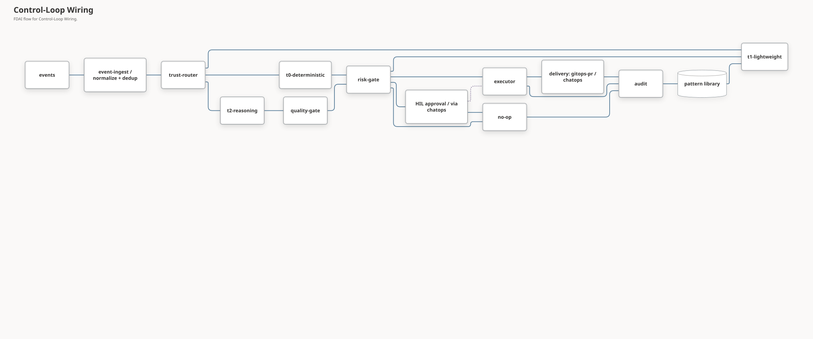

# Project Structure
The system is a **headless control plane + thin console + ChatOps**, not one web app. This document defines module boundaries, dependency direction, composition, and repository conventions for the validated five-service baseline and the independently packaged System Knowledge Service candidate. The shared service-contract SDK owns an authority-free `RuntimeScopeReceipt`; every service-owned entry point emits one before startup to bind product purpose, execution venue, and the complete permitted capability row without claiming provider state or success. Shared ontology code owns the pinned hard-bound registry for production routing and detection controls; runtime and delivery keep the active values in versioned configuration and import no new authority path. Post-turn runtime skill drafts retain canonical verified evidence references in proposal identity, durable storage, and audit metadata without activating the skill. The composition package also provides an inert startup helper that rebuilds signed skills before signed skill bundles and publishes both read-only disclosure snapshots only after both verify; Core startup does not call it until a trusted artifact store and deployment-supplied trust roots are composed. Bootstrap binds Norns rule hints behind the current discovery-activation decision before evaluating or publishing candidates. Packaged release catalogs bind only to reachable source revisions, and the derived-source gate compares every recorded source blob before commit and in CI. When an owning design source changes without changing catalog records, post-integration regeneration updates only the source commitment and aggregate digest so they identify the final merged blobs and reachable protected-main revision. Question-bank and CQAS artifacts likewise regenerate as a whole from exact source catalogs in dependency order; digest-only hand edits are not supported. Confirmed Incident creation crosses the Operator/Core boundary as a versioned, no-authority request on its own logical topic: Operator owns authentication, source-draft revalidation, and durable acceptance, while Core alone writes the Incident lifecycle and audit record. Workflow catalog loading also records whether a signal trigger resolved through the observation `SignalType` registry or the request/command workflow-trigger vocabulary; this is contract metadata only and adds no runtime authority path. See [Multi-Service Repository Layout](multi-service-repository-layout.md) for physical package ownership and [App Shape](../../../.github/instructions/app-shape.instructions.md) for local and deployed topology. The shared `fdai_service_contracts.post_turn_review` module is a versioned cross-service wire seam: Operator composition publishes post-turn review requests, and only Core Bragi publishes the review envelope, so review, routing, and ownership stay in Core and the Pantheon.

Workflow authoring commits are delegated to a focused Operator PostgreSQL module with its own audit table and service-migration ownership entry; the family facade only routes the committed draft or binding request and still grants no executor, publication, or promotion authority.
Diagnostic ontology candidate selection remains a composition-owned semantic-planning path: the
prompt profile selects the reviewed model role and reasoning effort, while Core still receives only
schema-validated typed clauses that the secured reader authorizes against the principal manifest.
Recent Resource change continuations stay inside Core's ontology platform and persistence modules: Operator exposes only an opaque forwarding route, while Core owns the continuation body, keyset cursor, expiry, reauthorization, and PostgreSQL storage.
Single-operator production approval profile wiring stays split across focused modules. `packages/service-contracts/src/fdai_service_contracts/approval_profile.py` owns the authority-neutral revision shape, digest, quorum, and approver rule shared by Core and Operator. `core/risk_gate/approval_profile.py` re-exports that pure contract and owns only Core's never-raising operator-policy input; `runtime/approval_profile.py` owns pointer-first runtime selection from Mimir's active approval policy-administration revision, with `FDAI_APPROVAL_PROFILE_JSON` and `FDAI_APPROVAL_PROFILE_PATH` retained only as bootstrap fallback; and `agents/_framework/var_approval_profile.py` owns Var's ticket-admission and approver checks for the digest-verified pinned revision. Control-loop, HIL resume, Forseti, Var, Thor, and the Operator callback carry the same pinned profile revision as metadata, so later activation changes do not rewrite in-flight HIL parks. Replay of a stored approval revision also requires Mimir's activation-history row for that exact revision and digest, so a pending proposal cannot authorize itself. None of these modules grants executor authority or changes the fixed agent roles. Policy administration follows the same split: `fdai_service_contracts.policy_administration` owns the typed request and activation contracts, the Operator IAM family's `policy_administration.py` route only authenticates and publishes a request, and Mimir's `agents/_framework/mimir_policy_administration.py` alone validates, signs, stores, and activates revisions.
Operator override promotion follows the same focused split: `promotion_override.py` owns Thor's override writer, `promotion_review.py` owns dispatch-time attestation/profile checks, `state_store_override_authority.py` owns durable Var-receipt verification, and `promotion_attestation.py` owns the canonical approval digest. Policy administration follows the same split: `fdai_service_contracts.policy_administration` owns the typed request and activation contracts, the Operator IAM family's `policy_administration.py` route only authenticates and publishes a request, and Mimir's `agents/_framework/mimir_policy_administration.py` alone validates, signs, stores, and activates revisions. Decision-side admission pinning stays in `core/risk_gate/operator_policy.py`, while the OPA-backed evaluator lives in `delivery/policy_admission.py` and is injected by runtime composition; agents never import delivery adapters. T0, T1, T2, and operator-request HIL parks carry the pinned operator-policy digest, while full-authority development category resume intentionally re-reads current policy only as a fail-closed revalidation.
Successive all-kinds relation continuations stay in Core conversation modules as shadow-only state over already verified plan batches; they grant no Operator route or default answer behavior.
Container-kind lineage grouping stays split between Core conversation compilation and generic ontology query handlers: the compiler selects the reviewed container kind, secured traversal emits typed lineage rows, and the aggregate handler computes nearest-root counts and `ambiguous_membership` without adding authority.
Remaining E9 operators keep their missing-prerequisite decisions in a focused Core conversation helper, so unsupported rank, aggregate, comparison, version, evidence, diagnose, and path rows do not fall back to another operation's plan.
Metric window comparison planning is likewise isolated in a focused Core conversation helper: form fields carry the two windows, while the query runtime uses the existing metric comparison node and grants no execution authority.
Current-path operand provenance checks stay in focused Core conversation helpers: model-proposed plan identities are accepted only from text, prior context, result handles, or server binding receipts, while server-built plans keep their existing authority boundary.
Residual reasoning hardening keeps server identity, plan coverage, and reviewed provider-property
authorization in focused Core helpers. Bound context receipts are accepted only after principal,
scope, and ontology-release checks; a provider path is available only when every selected Resource
type has reviewed that path. Recent-change continuation storage claims one opaque reference
atomically, while the conversation layer remains read-only and grants no execution authority.
Current-path relation and state-review convergence stays in the same Core conversation boundary: released relation plans come from the shared compiler, and independent state review compares closed meaning axes instead of facet text without adding Operator routes.
Typed constraint slots are also isolated at the shared contract and Core conversation boundary. The
service-contract SDK owns the versioned judgment and frame fields, while Core owns slot coverage,
plan coverage, and default-off model-schema exposure; this adds no Operator route or execution
authority.
Result-handle identity hardening follows the same split: service contracts carry the additive
handle-body field and generated wire views, while Core alone writes and rereads the sealed row
identities through secured ontology queries; Operator and Console still see only opaque references.
Production shadow reasoning follows the same split: the service-contract SDK owns the carried
`SemanticQuestionForm`, Core owns content-free shadow dispositions and non-interference checks, and
composition binds direction readers only when the default-off production shadow setting is enabled.
This does not add Operator routes or make compiled answers available outside the local venue.
Hardening keeps that split: a shadow record that fails to persist is logged and never changes the
planned answer, the carried form never reaches the frame model, and the judgment's typed slots bind
the frame so plan coverage can enforce them. The state-store sink schedules each record on the
service's own event loop without blocking, a rebuilt frame keeps its investigation identity, and
operand provenance also reads traversal endpoints and metric resource ids.
Relation execution holds also stay inside Core conversation runtime: an empty relation traversal
output from a compiled plan is a typed evidence hold until independent grounding confirms that an
empty relation result is answerable, and Operator or document routes receive no new authority.
Relation direction confirmation uses the same Core boundary: a blind-reader disagreement now holds
before compilation instead of changing relation roles, and no Operator or document route participates.
Schema declaration identity checks also remain in Core conversation compilation: a schema read whose
grounded ObjectType differs from the stated schema subject, including an over-quoted subject that
contains another ObjectType name, holds before a query plan is released.
Relation anchoring checks likewise stay in Core compilation: a collection-scope relation that would
traverse from a widened collection is held before any Operator or document route can answer.
Resource Health answer composition is split the same way: `ontology_platform` preserves the
typed exact-denominator rows, `fdai_core_service` owns locale presentation and validator
holds, and Operator receives only the terminal no-authority answer plus technical details.

Question-form concept-choice reuse is owned by Core conversation processing and ends with one
run. Its exact-input, reader-separated cache never stores observed state, authorization, or
cross-turn meaning. Azure delivery owns lossless catalog prompt encoding; Operator and Console
only display measured timing and usage, without another writer, service, or authority path.
Azure guidance packs remain prompt context only. They distinguish utterance-stated resource-name
fragments, exact container names, regions, and provider lifecycle states. A narrowed state reading
can yield one accepted typed value, and Core records each accepted concept value on the compiled
answer event. Environment inventory never becomes a stated operand, and the packs grant no
identity, query, or execution authority.
Question-form accounting also binds ranked order cues, treats authorized-scope and evidence-style
phrases as context, and keeps a resource kind named inside a measure phrase as its own mention.
Preflight routes environment reachability to operational evidence. A collection select may compile
each member's reviewed state or health concept, while the same measure on an anchor, relation, or
schema goal remains held as unsupported. Core re-derives the selected concepts during provenance
verification; these paths add no identity, provider, or execution authority.
E10 list mode asks the state reader for one typed row per authorized collection member and keeps
missing or unusable state as an explicit unknown row. E11 adds one bounded metric stage after the
same collection selection for threshold filtering or ranking under a pinned window and member-read
budget. The query receipt accounts for complete values and typed unknowns; provider routing and
answer review cannot turn a partial population into complete evidence.
E12 adds a discriminated collection relation anchor for one grounded kind, one sense, and one hop.
Core emits the anchor ObjectSet, traverses one attributable LinkType side with lineage, and
independently verifies the kind, direction, and visible anchor output. Per-anchor coverage receipts
still gate verified negative claims and remain a later slice.
Large relation reads batch roots under a separate traversal budget, merge every reviewed side with
LinkType lineage, and retain partial-source reasons. Large population receipts use a length-prefixed
member digest, and answer assembly reserves bounded room for later outputs instead of letting one
large table invalidate the whole verified answer.
The same typed-only boundary may reuse an independently certified direct read before legacy
judgment; action, quoted, hypothetical, bound-context, and required-document paths retain their
existing gates. Numeric call accounting adds no prompt capture or execution authority.
Reader-local two-shard waves are read-only concurrency inside the same bounded turn; their
cancellation drains outstanding work and adds no shared authority-bearing workflow state.
The same Core-owned scheduler covers independent finalist runoffs within the existing
remaining-call gate; no model, service, authority, or observed-state cache is added.

Collection relations also list per-anchor coverage rows, so an anchor with no related member is
verified empty only when its read was complete. Scoped collection traversals can read their exact
population hop by hop, collection metric reads can apply reviewed qualitative recipes, and a
stopped metric read can issue a leased continuation. Every one of these reads stays read-only.

## Design at a glance
Test-context choices extend the shared service-contract SDK with a no-authority projection schema. Operator owns authentication and choice rendering; Core remains the admission and lifecycle authority.

The Assurance Twin's production composition binds Heimdall's retained Inventory posture producer, durable evidence repository,
and content-free request outbox when the fixed Pantheon roles and state store are present. The producer reuses the control
loop's immutable T0/OPA generation off the event loop, requires declared inputs for every Resource, and holds Inventory
promotion and graph locks through source/target confirmation. Missing, stale, changing, or incomplete evidence remains
unavailable. Forseti reviews typed ActionType proposals and their what-if, never Terraform plans, and the Twin outbox relays
page only unpublished rows through a dotted `StateStore` field filter ([Assurance Twin](../operations/assurance-twin.md)).
This addition changes no cross-service schema, approval, or execution path. Rule-generation timestamps use a dedicated UTC
clock and never consume the injected control-loop clock used for replay, action creation, dispatch, or effect evidence.
Core resolves Rule and submission-criterion types through the shared contracts facade rather than a
contracts submodule, preserving the repository's one-way public import boundary. The shared service-contract SDK also owns
authority-free baseline evaluation terminal records for complete inventory generations: per-rule outcomes and per-generation
completion. These records add only a versioned Core-to-Operator wire surface; Forseti judgment, Saga audit, Operator
projection admission, and Console rendering remain separate owners.
`core/framework_rule_evidence/` turns those outcomes into framework evidence without a new wire surface. It derives
expected Resource and Rule pairs with the same `RuleIndex` dispatch T0 uses, accounts every activation member in scoped
coverage, and maps each WAF Rule requirement through an ordered outcome table. `core/framework_assessment/` admits a Rule
receipt only when its provenance matches the activation generation the profile pins. Neither module grants activation,
approval, or execution authority ([Framework Rule Evidence from T0](../rules-and-detection/framework-rule-evidence.md)).

Operator production composition keeps runtime wiring in its facade. Focused sibling modules own
lifecycle and resource cleanup, route-family assembly, and read-source declarations. Compatibility
exports preserve existing imports, and the split changes no service, identity, data owner, wire
contract, or authority. Model-facing declaration identities remain complete within the capability
byte limit. An oversized identity set stops before judgment instead of returning a ranked prefix.
The Core package owns the deployed `fdai-operational-catalog-review` entry point. It composes the existing durable Pantheon, Saga audit, and GitHub App delivery adapters inside the Core runtime boundary; it adds no service, executor identity, catalog activation, merge, or managed-resource authority. The Core package also owns the `fdai.delivery.automation_blueprint_tick_cli` binding, which composes PostgreSQL blueprint evidence, candidate, proposal, audit, and scheduler stores in one inert one-shot tick, which deployment does not schedule yet, without granting Operator routes or the tick any managed-resource executor identity.
Core keeps active Rule generation replacement behind a writer-exclusive barrier while complete decisions share concurrent read leases. This preserves one generation per decision without serializing unrelated resources. Focused modules own that barrier, semantic preflight, event-bus payload codecs, the assembled runtime model, the human-approval registry binding, and catalog loaders; public facades preserve their existing imports and authority boundaries. The `runtime/control_loop.py` facade explicitly re-exports its existing catalog-loader names for bootstrap and focused tests. The Core wheel inventory and service-test suite manifest assign every new runtime module and Rule activation test to one owning distribution without changing the five-service boundary or the System Knowledge candidate. The focused `runtime/causal_bindings.py` owner completes a deployment's bounded temporal series with Forseti's `CausalHypothesis` projection over the runtime ontology store and the `delivery/persistence/state_store_causal_receipts.py` resolver for Thor ActionRun receipts; causal revisions stay evidence-only.
Conversation causal context uses the same evidence-only boundary: it can read state-transition change
points, activity, and causal-grade receipts, but it cannot name a cause or grant recovery authority
without later P3 and promotion evidence.
The Operator's insert-only authentication receipt table is written only by the Operator role and read only through a Core-owned fixed-parameter source function granted to the verifier role, so a Core rollback drops that function before the role and no Operator object depends on it. The contract compatibility manifest negotiates `operator-core-request` 1.9.0, and the Operator emits it only behind a default-off setting. With that setting on, the Operator API and the channel edge wrap their semantic outbox with `families/conversation/semantic_authentication_receipts.py`, which retains the receipt for each request, keyed by receipt digest and request id, before the reference is published.
The shared Operator family-adapter facade now retains workflow persistence and compatibility
exports. Conversation persistence, operations projection and webhook handling, and pure workflow
catalog rendering have focused owners. This split preserves principal scope, durable proposal
idempotency, unavailable behavior, and the no-executor boundary.
Workflow dispatch fencing stays inside Core's workflow runtime and shared `ProcessRuntimeStore`
contract: replicas coordinate through attempt-scoped journal claims, while delivery adapters keep the
PostgreSQL CAS and idempotent replay semantics behind that provider boundary.
Shared authentication and projection response modules own structured exception mapping, so the
aggregate route facade assembles handlers without reimplementing boundary normalization.

Semantic query composition owns principal-scoped declaration candidate selection and source
authorization bindings. Core retains predicate, release, freshness, receipt, and query-algebra
verification; delivery owns bilingual ranking and PostgreSQL generation-cache validation.
Canonical JSON comparison belongs to the shared ontology provider utilities. Core predicates and
the reference store reuse it, including immutable projections, instead of maintaining separate
shallow Boolean guards. PostgreSQL retains its indexable containment prefilter but also checks each
complete property value before applying the row limit. Neither path grants query or action authority.
A missing property never satisfies an explicit JSON `null` equality filter in either store.
The focused current-evidence composition owner also binds graph-refresh decisions to the shared
StateStore audit. Complete, incomplete, stale, conflicting, and unavailable reads remain distinct,
principal-scoped, generation-bound, and authority-free without adding another service or writer.
Its re-query dependency is a narrow materialization Protocol so an exact-revision certification
job can exercise the same refresher without acquiring composition or provider authority.
The capability projection preserves every readable property name as well as every declaration
identity. It factors property names by ObjectType and reconstructs the same qualified identities
for grounding; adapters carry the explicit encoding without another model call. Complete projection
overflow stops before judgment. Neither projection nor a prompt bound changes manifest or query authority.
Delivery's ontology generation validator independently binds the explicit principal scope and exact declaration bytes, not only declaration IDs; runtime instance storage and activation must remain separate from Rule corpus pointers.
Core's secured gateway also owns the off-path, complete multi-type index-source scan. It applies the existing ACL to one bounded source snapshot and binds ordered object hashes; ordinary ObjectSet limits are unchanged. Delivery may stage this projection under an isolated immutable identity but cannot infer validation, activation, observed state, or execution authority from successful storage.
ObjectType and Property declarations can carry reviewed bilingual `query_terms` and exact value labels for semantic document projection. Delivery embeds those terms with authorized runtime object properties, along with reviewed ResourceType terms, so the candidate index preserves English and Korean context without adding a language lookup table, widening access, or changing query authority.
The focused `query_snapshot.py` helper revalidates source declaration references and object keys before ACL projection and computes bounded ordered projection identities. Missing or stale source references are rejected, never repinned to make an old row appear current.
Delivery's `ontology_evaluation_execution.py` encloses isolated diagnostic preparation and the
calibration/holdout runner in one counted call and deadline budget. It verifies frozen source and
embedding identities and retains bounded failure evidence. The caller supplies live authorization,
target attestation and isolated storage; the helper grants no qualification or activation authority.
The adjacent `ontology_evaluation_evidence.py` owns exclusive private JSONL retention for diagnostics.
Execution records call intent before dispatch and flushes completed stages before proceeding.
Persistence failure stops further calls; retained results remain separate from qualification,
agent-owned generation activation and runtime pointers.
The existing schema-repair policy recognizes a complete canonical single-kind manifest list before repair; catalog-owned prompt profiles propose that shape without raw-language routing or new authority.
Document and operational reads keep their independent evidence authorities and exact source scope. Core's frame gate also requires an accepted matching schema intent when judgment was evaluated; a rejected judgment cannot resume through a model-authored declaration list or detail frame.
Core defines the bounded `query.ontology_instance_candidates` contract with explicit object read sets and authenticated invocation context. Delivery supplies the audited current-index reader and reauthorizes candidate facts against the current graph. The focused `semantic_query_instance_candidates.py` binder shares one source-derived declaration between default release and semantic catalog construction. Bootstrap injects the same controlled-model workers into Pantheon and supervises bounded off-path reconciliation. Missing embedding-space/model-version identity keeps the index unavailable; unqualified semantic ranking remains closed while exact-ID reads retain current graph checks. Candidate output is non-exhaustive and cannot establish absence or execution authority.

The physical service workspace is owned by [Multi-Service Repository Layout](multi-service-repository-layout.md). The Core-owned `kubernetes` dependency backs reusable quantity accounting in delivery; root development tooling mirrors it, while shared contracts and independently packaged services do not acquire it. This document owns dependency direction, structural gates, extension seams, control-loop wiring, configuration, and repository conventions. The private
composition type module stays below its enforced size ceiling so new bindings remain reviewable and move to focused wire modules before the
shared container becomes a second root. Case-history review requires both failure and matched control evidence before it can propose an
inert learning candidate. The optional Core `StateStoreKeysetReader` lists bounded ascending keys so
historical case-copy cleanup can checkpoint exact rows without offset drift; only Muninn's source
deletion claim authorizes audited CAS removal, and the previous keys retain replay fences. This
adds no requirement to existing `StateStore` implementations, cross-service contract, case-read
authority, or new agent writer. A backend without keyset support keeps deletion pending.
A Workflow approval step cannot lower the no-self-approval invariant; the contract rejects a disabled value at
catalog load. Agent behavior hardening enters System Knowledge only through regenerated source commitments; catalog projection never gains
judgment, recovery, publication, or execution authority. Regenerating a source commitment changes neither record payloads nor operational evidence timestamps. Saga claims each handoff in the runtime `StateStore` before mutation and requires
an operation-aware issue adapter. The shipped `StateStoreIssueTrackerAdapter` persists issue and operation results across restart, so
validated checkpoints resume without duplicating or losing the materialized issue. The
`verticals.resilience` package exposes deterministic recovery-plan compilation without adding execution authority. DR objective evidence reports a nearest-rank p90, so a small cohort keeps its slowest measured run instead of reporting an
objective as met. A parked HIL record without a recorded action digest fails the integrity gate instead of resuming, so removing the digest
cannot authorize a tampered payload. The quality gate requires a bounded canonical identity for every cross-check model and refuses duplicate identities, so distinct wrappers cannot let one model agree with itself and satisfy the mixed-model quorum. An effective freeze or quiet ChangeWindow with unusable bounds denies maintenance authority instead of being skipped. A change event stamped further ahead than the configured clock-skew tolerance reports out-of-band instead of being suppressed by the settling window. Tolerated negative age never creates suppression when the configured settling window is zero. Pre-authority Change Safety evidence uses the same injected control-loop clock as action creation, dispatch, and audit, so frozen replay cannot become stale from host wall time. A missed breach is scored
only from complete telemetry, so a false-negative outcome never publishes a completeness claim its observation did not make. Forecast
closure attempts every claimed episode before re-raising the first failure, so one failing episode cannot hold the whole due queue open. T1
contextual reuse reads the event resource type through the same canonical shapes as the trust router, so an accepted event is not reported
as a changed resource type. Unified risk audit records serialize the risk gate's effective
`shadow` or `enforce` mode separately from the authority ceiling. Operator projections use that
explicit field and keep a legacy mode unavailable instead of inferring promotion. Recorded Resource state normalization, type-specific applicability, and allowlisted canonical unavailable reasons remain in the shared contract, Core, and Azure delivery; the Operator owns the read-only conversion, and the Console only localizes the resulting reason. Configuration-drift delivery likewise stays in `delivery/azure/` and protected Core service composition: reviewed snapshots move only through a content-addressed private Blob, runtime reads use Managed Identity, and the exact server-owned binding is verified independently after apply. Independent-service plan guards treat command and environment changes as part of the rollback boundary, and platform-owned secret references are refreshed from the current platform state before materialization instead of being trusted from retained service inputs. The isolated Executor may adopt the previously absent default-off legacy-unbound transition binding exactly once; enabling or replaying it, or combining it with unrelated runtime drift, remains ineligible.

The ResourceType catalog owns reviewed provider-to-neutral identity, while the shared recorded-state
contract independently owns operational and availability applicability. Adding `compute.image` and
`network.firewall-policy` changes neither provider adapters nor execution authority; each mapping
must satisfy both registries before a generation can remove its unclassified marker.

Verified conversation artifact compilation keeps routing and assembly in the v2 facade, domain-specific operational layouts in one module, and generic table, chart, timeline, comparison, and limitation rendering in another. Renderers copy only verified bounded values, grant no authority, and return no structured artifact when a readable scalar is non-finite; canonical text remains the fail-closed fallback.

Discovery contracts remain authority-free shared records. Plan schema `1.2.0` retains result kind;
Core enforces profile ceilings and the exact expected plan set before merging results. Azure
delivery binds execution receipts to the plan and reconciles coverage against the expected scope,
platform, and result count. Historical aggregate canaries do not certify a production service
binding or collector promotion. See [discovery verification boundaries](../interfaces/azure-resource-discovery-commands.md#verification-boundaries).

Inventory delivery verifies each configured subscription independently and reconciles provider-native
type counts without allowing supplementary ARM children to replace missing native identities.
The additive mapped-type accounting stays collection-local and preserves the existing persisted
coverage shape. Scheduled health requires the active and ontology generations to match with complete
object, relationship, and projection evidence; configured cadence remains within the source policy. Core observation adjudication owns the pure generation-clock check; inventory projection preserves independent property conflicts and canonical state provenance, without adding a provider dependency or writer.

Snapshot policy admission rejects capacities above 50,000 Resources or 200,000 links. Source
composition applies the declared page, record, and concurrency ceilings; ARM page collection also
uses its declared byte ceiling. Scope-and-generation jitter is replay-stable and cannot exceed the
maximum poll interval. These bounds do not yet establish a shared cross-source rolling byte budget
or a disk-backed generation stream.

Inventory also bounds retained normalized generation bytes independently from transport buffers. The PostgreSQL facade delegates batched replacement to `postgres_ontology_replacement.py`; versioned activation, copy-on-write publication and retention have focused persistence owners under the same Core writer. The four `ontology_*_version`/`ontology_graph_control` tables are Core-owned; their inactive migration changes no Operator, document or conversation writer. Explicit activation preserves read grants and reference identities, while materialization restores the latest version. Helpers gain no independent authority. Pure journal parameter conversion and observed-state validation stay in the existing record modules, preserving facade imports and evidence semantics. Journal writes, active-snapshot readers, and correction closure may likewise live in focused persistence siblings while the established modules re-export their compatibility surface and retain transaction, lock, and writer ownership. Semantic capability projection offers the judgment every declaration identity and its complete readable property domain, never a ranked slice or omitted property axis. Lossless ObjectType-scoped property factoring preserves the unchanged byte ceiling.

## Core domain navigation decision

Resource collection chunk encoding lives in `delivery/inventory_collection.py`. The existing
snapshot facade delegates atomic chunk/checkpoint persistence and bounded replay to
`delivery/persistence/postgres_inventory_chunks.py`; both paths reuse the support-owned candidate
batch writer. These helpers neither own promotion nor grant provider continuation authority.
`delivery/inventory_operator_graph.py` builds the bounded Console inventory graph projection from
the active snapshot; local preparation writes it after a full refresh, and the local reconciliation
loop rewrites it when its snapshot or freshness changes, only when
`FDAI_INVENTORY_OPERATOR_GRAPH_PROJECTION=1`, which deployed venues never set.
`composition/semantic_query_type_grounding.py` binds the independent second reader of semantic
planning from two narrator deployments: two blind choosers ground unbound Resource subtype words by
closed choice, and a blind constraint reading checks that the typed judgment copies every stated
restriction. Only the local launcher sets `FDAI_SEMANTIC_SECOND_READER=1`; deployed venues keep
the single-reader path until the reader is promoted. The same module reads two local-only
compiled-answer timing settings: `FDAI_SEMANTIC_CONCEPT_SHARD_BYTES` bounds a concept shard, and
`FDAI_SEMANTIC_SPECULATIVE_FORM_START` lets `core/conversation/semantic_runtime_speculation.py`
start the form path beside the preflight. `core/conversation/semantic_planning_speculation.py`
gives the planner the matching start, and the planner adopts the ticket only for the same question.
The form path runs on the owner loop, outside the turn's decision collector, so
`semantic_compiled_answers.py` carries the sample a resample replaced on the returned observation
and logs its decline on the turn's own context.
Repair feedback may repeat the judged words to
the model, but rejection logs keep only its location, type, and reason. `semantic_judgment_review.py`
owns both the second-tier review requirement and the promotion of a grounded state collection, so
the review decision and the planned family cannot diverge.

**Initial design.** Physically move every flat Core subsystem under `pipeline`, `incident`,
`operator`, `knowledge`, or `platform`, then rewrite every import in one codemod.

**Critique.** The current repository has 1,063 files that import the affected subsystem paths.
The move would also change the safety-core coverage source list and collapse the fan-out gate from
subsystem names to domain names. `incident` and `knowledge` already serve both subsystem and facade
roles, and `ontology_explorer.py` is a file while the other members are packages. Treating this as
a moves-only change would hide material test, coverage, and gate semantics inside a mass diff.

**Revised design.** The five domain facades are the permanent G-1 layout. They provide grouped
navigation while physical subsystems and direct imports remain stable. The 98 focused layout checks
pin domain membership, single ownership, dual-role packages, direct-import compatibility, and peer
isolation. `verticals` remains its own top-level group. A future physical move is not required and
would need a separate, domain-bounded design that explicitly preserves coverage and fan-out meaning.
## Module Boundaries
[Alert noise governance](../operations/alert-noise-governance.md) owns typed evidence, registered provider-neutral plan/result `1.1.0` schemas with regenerated Python and TypeScript contract views, and Process. Core registers an alert-specific unavailable direct-API route before generic fallbacks, and a read-only archived decoder retires unreleased `1.0.0` records; Terraform remains an operator-local deployment tool and supplies no runtime authority. Dedicated Operator composition binds request dependencies and one supervised bridge; the shared root owns lifecycle only. Role-local framework mixins preserve agent APIs and instance isolation. Shared admission inventory pins decision guards. The existing guarded generator re-evaluates release-derived source pins without rewriting operational receipts; source tests and generated knowledge grant no authority. The shared SDK publishes `test-context-draft`, `test-context-command`, and `test-context-application` version `1.0.0` schemas generated from the existing typed models. Its validator also applies those models' cross-field rules; a schema-valid record is not authenticated evidence or current authority. These standalone registrations do not establish a broker N/N-1 deployment transition. Post-integration System Knowledge regeneration records this boundary as release metadata only; it does not promote transport compatibility or operational qualification. Forecast scoring exclusions are public string enums exported by the model facade; their JSON values and legacy outcome wire shape remain unchanged. Context projection modules belong to the Core wheel, Operator context-command tests have an explicit service-suite owner, and database-only tests run in the integration selection. Evidence admission is evaluated after type validation, with exact non-mutating replay distinguished from a newly admitted write. Catalog source commitments are refreshed after owner-document reflow even when record payloads are unchanged.
Alert-noise authority and writer seams stay explicit composition inputs: production and shared alert changes keep two distinct authorized humans, the single-Owner quorum is accepted only for a configured full-authority development-profile scope, and provider writers without enforced conditional updates hold unless a governed exclusive-writer proof is bound.
Incident-creation regressions are claimed exactly once by the Core or Operator service suite. Operator incident-attention and observer-deployment projection regressions also have one explicit service-suite owner; test inventory metadata changes neither runtime ownership nor authority. The generated question-bank and semantic-intent coverage artifacts are deterministic derivatives rebuilt in dependency order after catalog text changes, so reviewed source changes carry design impact instead of regenerated provenance digests requiring duplicate owner updates.
Dependency direction is strict and one-way; a violation is a review blocker. [AKS token exchange](../deployment/runtime-deployment-profiles.md#identity-and-secrets) and declared SDK/async transport dependencies remain service-owned, never Core domain or shared-contract code. Operator's credential tests have one explicit service-suite owner, and its factory uses the existing adapters facade to preserve composition fanout. Trial records in `core/licensing/trial.py` grant no capability by themselves; `core/licensing/trial_entitlement.py` is the one place that turns a committed installation-bound record into an entitlement, and the shared license authority consults it where a token grants no acting capability, so execution paths carry no Trial check of their own. `core/licensing/entitlement_notice.py` derives the Console watermark notice from that one resolved entitlement; `runtime/licensing_state.py` publishes it through the single writer `delivery/persistence/postgres_licensing_entitlement_state.py`, and the Operator's `entitlement_stamp.py` only carries it on authenticated responses, so no second resolver exists. The crypto-free `core/licensing/installation_entitlement.py` contract is the key holder's installation-bound grant; the shared authority routes a signed token to one strict parser by its declared schema, so the v1 token, the entitlement, and the integrity manifest never verify as each other. Because a Trial observation commits to storage, the shared execution gate resolves entitlement in a worker thread, and the store refuses an event-loop thread so misuse denies instead of blocking Core. Deployment and persistence own atomic activation: the `licensing_trial` singleton row commits observations under a revision predicate, and runtime must authenticate retained state. A new service-owned table is registered in the ownership manifest's writer list rather than its legacy migration inventory, because the inventory records tables that predate service branches. Source provenance belongs to the CLI and is neither entitlement nor release signature. The Core distribution owns its Python Azure Monitor OpenTelemetry Distro dependency. Shared telemetry selects that exporter only when deployment injects the Key Vault-backed `APPLICATIONINSIGHTS_CONNECTION_STRING`, rejects a competing explicit OTLP endpoint, and otherwise preserves the local or vendor-neutral OTLP provider. This startup selection adds no provider SDK to Core domain modules or shared contracts, and the connection string never enters source, logs, or a general Terraform output.
Cost Governance pseudonym material is an Operator-owned composition secret. Shared contracts carry only pseudonymous references and disclosure metadata; they never receive the key, grant data access, or raise action authority. Deployment and drift plans bind the platform-owned key secret id only to Operator Service and reject an empty binding for it; tfvars materialization treats the empty binding that workflows export for every other service as absent. [Independent operational evidence](../rules-and-detection/independent-operational-evidence.md) keeps its non-agent verifier engine, pinned registries, and readbacks in `core/operational_evidence/`, behind the `OperationalEvidenceIssuer` provider seam in `shared/providers/`; `composition/operational_evidence_binding.py` binds the proof-store reader and bounded issuer only on explicit deployment opt-in and adds no agent, topic, or authority.
Cloud-reference collection belongs to ingestion API, parsing/index activation to the worker, and dated evidence to Core; [the lifecycle owner](../interfaces/cloud-resource-knowledge-lifecycle.md) defines the shared contracts and no-authority boundary. Core exposes applicability as bounded scalar selectors, preserving dependency-only evidence objects. Exact document contexts intersect these selectors before ranking and cannot fall back to broader collection reads. Each new ingestion test has one service-suite owner, and the API's already-declared `aiohttp` dependency is classified as direct rather than indirect. New packages default to normalized-only v2; the implemented [structured v3 extension](../interfaces/cloud-resource-knowledge-structured-rag.md) keeps normalizer `2.0.0` by default and requires reader `3.1.0` for explicit `2.1.0` preparation. Ingestion-owned review contracts, confined I/O, coordination and resource-limited parsing/measurement remain separate modules. Originals stay outside new transport; exact legacy identity, source clocks and approval gates remain unchanged.
Cloud update comparison validates raw and processing identities; Core rechecks provenance and the existing excerpt budget. Document-query schema upgrades also require the exact catalog-owned prompt layer, never capability presence alone. The frame-model schema excludes accepted-judgment-only query state while internal validation preserves it; recovery budgets do not increase. Post-merge System Knowledge metadata binds the now-reachable protected base without changing record payloads or cloud source-check times.
- **core is portable**: it MUST NOT import any cloud SDK directly. Cloud specifics enter
  only through the CSP-neutral interfaces in `shared/providers/`, whose implementations live
  in `delivery/` and `infra/` and are injected at composition time. This keeps a second cloud
  a matter of adding an adapter, never editing `core/`. The process-local
  `shared/providers/local/event_bus.py` keeps broker-like retention: it bounds each topic's
  replayable window, lets a late consumer group replay that window, and never compacts a record
  that a subscribed group has not consumed yet.
- **allowed imports**: `shared/` imports nothing from `core/`; `core/` may import only
  `shared/` contracts, providers, telemetry, and config; `delivery/` may compose `core/` and
  `shared/` behind adapter boundaries; `composition/` binds all layers. `core/` and `agents/`
  never import `delivery/`; provider behavior enters through shared Protocols and composition.
  Focused sibling modules may own canonical identity projection and hashing while the established owner module re-exports that public surface. Analyzer finding receipts, analyzer-job configuration and composition, and inventory snapshot context helpers follow the same split; their established modules continue to re-export public contracts, and no writer, provider, or authority moves. Idempotency reservation stable-operation comparison follows this split; serialized bytes, transition validation, and replay semantics remain unchanged. Versioned terminal measurement contracts follow the same service boundary: Core retains normalized event classifications atomically with audit, keeps the rebuildable state projection to the newest 50,000 records, and Operator reads them without importing Core or treating a classification as execution or effect authority. Projection retention never removes the append-only audit entry. Before routing a broker redelivery, Core compares its stable normalized event identity with any retained terminal measurement and returns a duplicate outcome only on an exact match; a collision fails closed before rule, similarity, or model evaluation. One conflicting pending terminal cannot poison later retry processing. Versioned operational activity follows that boundary: Core emits schema-validated, privacy-bounded records, Operator stores and relays only their read models, and Console localizes presentation only. Conflict evidence maps to machine-safe activity reason codes without changing its source token. A duplicate acknowledgement requires matching retained facts; a collision cannot silently replace or discard the original classification. Measurement timestamps require explicit timezone-bearing datetime or ISO 8601 text, never implicit numeric epoch coercion. Inventory progress follows the same ownership split: the shared package owns count-only contracts, Core alone writes the append-only ledger, Operator receives `SELECT` only and projects an allowlist, and Console gains no Blob, collection, promotion, retry, approval, or execution authority.
- **human approval stays split by service authority**: Operator owns Teams/Slack authentication, local cryptographic JWT/JWK verification through `cryptography`, callback audit, and the durable decision outbox. It imports no Core implementation and receives no executor identity.
- **forecast source history is read-only restatement**: `core/detection/forecast_history_producer.py` restates one positively checkpointed source read through a reviewed state mapping as `derived` transitions, `core/detection/forecast_history_chain.py` derives order-independent chains and compares them with the stored window, and `core/detection/forecast_history_source.py` defines the source Protocol. Delivery adapters read existing owner records read-only, and `delivery/forecast_history_configuration.py` is the one parser shared by runtime composition and the Settings row. No second writer, scoring authority, or execution authority is introduced; see [prediction learning](../rules-and-detection/prediction-learning-and-case-history.md).
- **semantic decision traces stay in the development channel**: `shared/telemetry/decision_events.py` binds one bounded collector to each semantic turn only when the local development diagnostic channel is enabled. `fdai_core_service/development_decisions.py` projects that collector, the turn's model-call observations, and its outcome into content-free typed steps for the runtime-diagnostics buffer. Neither module changes the semantic projection, an event contract, or any planning decision; see [semantic decision traces](../deployment/developer-workflow-assurance.md#semantic-decision-traces).
  Core consumes only typed decisions, routing workflow slots to the registry and action parks to the HIL coordinator or exact human-access route. Active HIL queue reads filter pending lifecycle states in `StateStore`; resolved parks and append-only audit evidence remain retained and cannot re-enter approval. A Core-owned partial PostgreSQL index supports that bounded read without moving approval or retention authority. The Core composition root passes a separately attached Bot Managed Identity to Teams A1 delivery and never reuses executor identity.
  The [Slack A1 binding](../../../services/core-control-plane/src/fdai/delivery/chatops/slack_binding.py) uses the composition-owned HTTP client without a Teams identity; its local send receipt and pending poll cannot supply the missing durable send reconciliation or authenticated browser actor binding. See [Channels and Notifications](../interfaces/channels-and-notifications.md).
- **scheduled-result copies stay under one deletion owner**: `core/scheduler/continuation_retention.py` owns retention ordering, legal hold, the durable deletion fence, and the fence assertion reused by other readers. `delivery/persistence/postgres_scheduled_continuation_retention.py` owns the scoped delete and independent readback statements for the projected conversation turn, the source briefing run, and the anchor row; it adds no retention policy. `core/scheduler/continuation_delivery.py` replays one already persisted anchor into the durable outbound ledger and holds no schedule, regeneration, or execution authority. Anchor creation and external delivery consult the same fence, so a replay or redelivery cannot restore a deleted body. The delivery persistence package re-exports `PostgresScheduledContinuationDeleter` and `RetentionReadbackError` so composition binds the deleter through the same facade as every other adapter, and the coordinator bounds channel rendering without rewriting an identifier. `ScheduledContinuationService` takes the fence as a required collaborator, so no composition can create an anchor without consulting the tombstone. A fence write that does not survive its own readback blocks every deletion, and the fence key prefix is permanent rather than retained. `shared/providers/conversation_delivery.py` specifies the in-memory ledger's origin reference, process-local tombstone, and origin-scoped deletion with a same-store absence check; it retains attempt and acknowledgement lineage and gains no schedule or retention policy. The Operator-owned PostgreSQL ledger needs its own durable implementation. `core/scheduler/continuation_delivery.py` invokes that deletion only under the recorded source fence, so the ledger keeps its own writer while the source keeps deletion intent.
- **Document OCR stays split by contract and provider ownership**: The shared service-contract SDK owns revisioned provider policy without deployment authority; the document worker owns the bounded local Tesseract adapter and Azure adapter selection. Infrastructure supplies only the selected endpoint, identity, and provider value, so neither ingestion service imports another service implementation. Migration CI serializes schema-mutating lifecycle tests after adoption, and forward repairs preserve root-owned shared indexes after rollback. The legacy Alembic compatibility head and all five adoption manifests advance together before service-owned migration validation; each affected service fingerprint advances with owned legacy columns and constraints before baseline adoption, preventing split lineage.
- **ownership and handover stay service-owned; draft delivery stays review-only**: Runtime composition and protected Core deployment preserve the GitOps, merge-effect, identity-health, catalog-timing, and knowledge-lifecycle boundaries in [Agent operational ownership lifecycle](../interfaces/agent-stewardship-operations.md). Operator owns checklist transitions, current reviewers, SQL read adapters, subject-wide session budgets, and six ownership-only H10 routes. The Console's scoped editor handles current user/group/schedule duties, UTC windows, fallback, and supersession without IAM or future-coverage authority; reviewed draft delivery stays separate from merge observation. Operator `composition` imports `AssignmentNoticeBridge` and `build_assignment_notice_bridge` through the existing `iam_composition` facade alongside the `HilDecisionOutboxBridge` re-export. The class and factory remain the original objects defined in `assignment_outbox` and `postgres_assignment_outbox`, respectively, without wrappers or changes to logic, durability, writers, roles, topics, lifecycle, or readiness.
  Core alone writes assignment cases and owns holds, replacement checks, source verification, owner-local stages, and readiness observations. `CoreHandoverServices`, `PostgresCoreHandoverReview`, and `PostgresCoreHandoverSearch` bind current goals, reviewers, admission, and retrieval. `CombinedGovernedHandoverReader` forwards explicit selectors unchanged only to the existing governed reader, never broad Core handover search; absent or failed existing sources raise without fallback for scoped requests. Direct scoped `CoreHandoverDocumentReader` calls hold before I/O; unconstrained merging is unchanged. `bind_handover_semantics` uses existing `AssignmentWorkflowBindings` for actual Norns/Mimir consumers: source ACL, purpose, and current review precede content. Exact typed JSON Rules and described `Distiller` ontology candidates enter private immutable packages; Mimir independently recompiles without a model. Its existing subscription retires monotonically and scrubs only with exact current legal-hold false evidence; unknown policy or outage never erases. Claims, receipts, digests, and audit survive. No document-table `SELECT`, active catalog/graph write, or single-model prose Rule fidelity is implied.
  Core constructs only `HumanAccessPlanner`, never a mutation identity. Its shared `human_access` facade re-exports `parse_human_access_role_groups` as the exact SDK parser object used by the isolated Executor, without a wrapper or duplicate parser. `HumanAccessWorkflowRuntime` binds original full Action/case/role-map/promotion material before original HIL review, exact preparation CAS `r -> r+1` without changing approved arguments, and fixed-owner pub/sub to Thor's isolated dedicated Managed Identity. Current exact source/allowlist, kill/health, principal-ActionType policy, seven safeguards, and the operation-independent membership lock remain required. One durable intent precedes dispatch; acknowledgement is not effect proof and unknown attempts never automatically repeat. Independent Heimdall observation and shared release closure precede Core effect recording. Vidar proposes/finishes fresh separately approved inverses with original owned mutation, current demand, and the same target generation; cases remain degraded/supersedable without copied approval or role authority. New ActionTypes remain shadow-default and local authority cutover is prohibited.
  Completed handover source work includes 20 execution-hardening rounds and the [12-round final integrated source review](../../internals/handover-lifecycle-hardening-20260914.md#final-integrated-critique-after-remaining-source-implementation), with no unresolved confirmed Medium/High source finding at that checkpoint. The second local main merge succeeded and was published as `c8edd2769` in [PR #1014](https://github.com/dotnetpower/fdai/pull/1014), but [CI run 34921323157, attempt 1](https://github.com/dotnetpower/fdai/actions/runs/34921323157/attempts/1) failed. Focused source repairs are implemented locally; the latest published head remains `c8edd2769`. The [ledger](../../roadmap-implementation/architecture/project-structure.md) keeps reviewed translation refresh, generation, repair hooks/PR update, and passing exact-head protected CI/merge pending under [#946](https://github.com/dotnetpower/fdai/issues/946), separately from full UI/assistive/live/deployment/promotion evidence; operational readiness remains false.
- **observation-mode ARB composition**: `core/architecture_review/observation_loop.py` owns provider-neutral Change -> authenticated context -> evidence bundle -> scenario -> DecisionCase and ImpactEnvelope composition. Forseti alone publishes observation verdicts on the existing typed bus; Saga audits them, and `ArchitectureReviewProjector.project_observation` derives read-only ReviewCase and ReviewCheck objects.
- **ARB definition coverage**: `core/architecture_review/pillar_coverage.py` reads the pinned WAF framework, BestPractice, and generated assessment catalogs to account for control and evidence definitions. It cannot assess a workload or grant readiness, approval, or execution authority.
  This path has no approval, mutation, promotion, or execution authority. Its injected state store supports duplicate and restart-safe replay; a bounded process-local oldest-first cache retains projection status only when the store lacks that marker contract.
  The loop accepts only planned intent, binds exact ontology and catalog releases, and projects transient holds without deleting prior checks. Observation verdicts remain audit-only: Odin excludes them from action portfolios and Thor never dispatches them.
  Process lineage projects only an existing typed Change `process_ref` to `change_instantiates_process`; validation conflicts never create shortcut edges, and normalized Change provenance retains the canonical `process_ref`.
  Complete graph source generation validates before a conformant envelope is published; failed read-model projections retry from persisted status. ASCII-safe bounded scenario identifiers keep UUID-shaped changes valid as ontology branch keys.
  Timeout persistence is bounded or handed to a durable outbox. Pantheon members remain flat under `agents/`; private behavior-extraction mixins stay in `agents/_framework/` without changing AgentSpec, topics, ownership, model policy, or authority.
- **vertical package materialization is collision-free**: the generic Core materializer rejects
  duplicate asset ids and package-relative paths. Installation validates complete Rule and Workflow
  contracts before a disabled package can enter the lifecycle. Cost effect observations and
  completeness receipts carry the exact expected-effect source digest across this boundary.
- **decision-critical evidence is contract-bound**: the shared service-contract SDK exposes
  `DecisionCriticalEvidenceReceipt`, `DecisionEvidenceVerificationBundle`, and their registered
  Draft 2020-12 schemas. The receipt binds the claim inputs. Five content-addressed proofs then bind
  authentication, evidence, completeness, conflict, and freshness-policy verification to the exact
  receipt, verifier version, trust anchor, and validity window. Core selects a current non-revoked
  binding through the provider-neutral registry and fails closed on producer self-verification,
  timeout, provider or transport failure, mismatch, expiry, revocation, or synthetic evidence.
  Unregistered or malformed verifier responses fail verification; Core revalidates returned bundles, readiness cannot retain an orphan digest, and eligible results cannot carry rejection details. Evidence expired at `recorded_at`, bundles predating recording or verifier activation, admissions beyond receipt or binding freshness, and timestamps without a defined UTC offset are invalid.
  Cancellation remains a control-flow signal and is never converted into a verification result. Cloud SDK use remains in delivery:
  the Azure adapter performs authoritative readback with a short-lived Managed Identity token and
  does not retain the credential. A successful bundle establishes evidence eligibility only; it
  cannot declare execution, approval, or promotion authority.
- **executed-action observation authentication stays in delivery**:
  `delivery/azure/observation_context.py` signs the exact observation digest and four identity
  lineages with a deployment-owned Ed25519 key. `runtime/observation_evidence.py` binds its verifier
  and ActionType-routed Azure collectors only for one complete deployed configuration. The
  protected service handoff attaches the inventory-reader Managed Identity to Core only as the
  observation source, binds scale-out to the FinOps execution lineage and VM start to the
  Resilience execution lineage, and removes that exact extra identity when observation is
  disabled. The source builder stays in `runtime/observation_evidence.py`, leaving
  `runtime/bootstrap_core.py` as composition-only code. Core receives the seed through a Managed
  Identity-backed Key Vault reference. Protected single-service deployment selects that exact deploy Managed Identity for Terraform and disables CLI and OIDC authentication, so no implicit or system identity can be used. The separate
  `fdai-operational-instance-certification` reads generation-fenced PostgreSQL aggregates and writes
  one private Blob receipt through a non-executor identity; all authority fields stay false.
- **standing-authorization lifecycle has one writer**: authenticated Operator commands enter through
  typed ingress, and one Core writer delegates to the provider-neutral atomic store. The PostgreSQL
  adapter serializes on a family row and commits an immutable revision, hash-chained transition,
  current projection, monotonic fence, and audit entry together. Revision identity covers immutable
  terms; approval and verified-evidence digests bind over that identity instead of creating a
  circular digest. The exact primary-store fence guard is shadow-only and unwired. A later
  enforcement design needs a reviewed lease that remains held through the side-effect commit.
- **semantic target resolution is deterministic**: Core removes resource-identity clarification only
  for one exact identifier or a complete read-only Resource and time correlation, and creates one
  bounded clarification for subtype-only exact-target operations. A sole `resource_identity` gap
  with a typed subject or resource-identity requirement renders as a locale-specific request for the exact resource name or ID;
  model-authored internal requirement tokens never become operator-facing copy. The shadow schema requires supplied
  intent and canonical identity, corrects only a unique span, and preserves `forbidden_actions`.
  Active v8 pins `1.0.0`; shadow v14 pins `1.1.0`. Neither adds provider I/O, decision, approval, mutation, or execution authority. Compact input bounds, generic collection-filter cleanup, and schema-repair guidance live in `core/conversation/conversation_preflight_validation.py`. The same helper classifies a known operational family paired with a mixed or contextual signal as non-repairable, so Core records one failed preflight attempt and falls through without another preflight model call. The public promotion helper continues to reject Resource collections by default; only capability-aware semantic planning opts in, and it reuses the candidate only after ontology type or inventory-state catalog grounding succeeds. Failed grounding retains full semantic judgment or a typed clarification without broadening the Resource scope. The `conversation_preflight.py` facade preserves compatibility imports while contracts, model invocation, typed target promotion, and family-shape validation live in focused sibling modules. The composition root resolves one exact prompt profile that pins ordered artifacts, lifecycle, request budget, output reserve, and replay digest; a higher artifact version cannot activate itself, and an oversized complete request holds before provider I/O.
  `core/conversation/semantic_catalog_value_mentions.py` derives an unambiguous stated
  `Resource.type` span from catalog vocabulary. Semantic judgment receives it only as candidate
  `stated_values`, and the manifest planner compares it with a targetless schema proposal to return a
  typed clarification; it never selects an intent. `fdai_core_service/semantic_ontology_answers.py`
  renders manifest declaration lists and counts and fails closed on inconsistent rows.
  `core/conversation/semantic_resource_state_planning.py` owns the check that refuses a contextual
  Resource list when it would drop a secondary intent or a stated state requirement, and
  target-candidate planning shares its collection filter kinds through
  `semantic_target_candidate_constants.py`. `core/conversation/semantic_stated_list_scope.py`
  keeps the deterministic Resource list to requests a list can answer: it refuses catalog-signalled
  mutation and relationship requests, builds a verbatim name-fragment list, and clarifies a
  region-qualified fragment. `core/prompts/assembly.py` composes dynamic profiles per call from
  typed assembly keys, and `core/conversation/semantic_judgment_assembly.py` derives preflight topic
  keys and re-judges once with the complete prompt on a coverage gap;
  `semantic_judgment_bounds.py` holds judgment input bounds, and `semantic_planning_assembly.py`
  derives frame intent keys, plan shape keys, frame result keys, and plan descriptor selection for
  the planning adapter. Membership planning grounds member filters from the group-only subjects so
  reviewed terms with particles, such as Korean pluralized VM wording, cannot displace the group
  anchor. The shadow `core/conversation/semantic_reasoning_*.py` modules own the closed question form, admission with utterance span accounting and a blind constraint review by another model family, with every directional relation settled before compilation by blind readers of other families, where a disputed role needs two agreeing concrete readings, that also lets its one repair split a mention merging an extracted restriction with another constraint or an ObjectType or declaration-kind mention holding any second constraint and holds a form that still merges them, a form whose goals cannot answer the extractor's closed answer kind, a `declares` word left uncited beside an instance goal, a name fragment whose quote no extracted literal matches, and an exclusion, comparison, or order that only a cue or particle states, one bounded form repair whose violations state each broken contract rule, that gives each earlier mention its id back before comparing, that leaves a proposal faulted only by accounting to the review when its repair reads every goal the same way but is unusable, and that compares schema-normalized values, fails closed unless every compared field of an unparsed proposal keeps the closed schema's shape, excuses a dropped quote only as an uncited typed time restatement, and keeps every stated operand, competing reading, and pending-goals signal, concept selection by two blind choosers of different model families that see reviewed ObjectType descriptions as labels, see reviewed metric and Resource Health concepts only while the manifest binds their reader and reviewed lifecycle values of other ObjectTypes in the state catalog, and bind only the values both choose and that try the sibling kind catalog for an instance collection subject whose stated ObjectType or resource type catalog fails, anchor binding that compares names without regard to case, reads at the gateway's clock, binds one verified match under incomplete coverage only with its uniqueness stated as unproven, and whose lookup-key quotes no repair may change, follow-up result handles that bind an anaphor or ordinal only to the rows its own conversation showed, relation and operator compilation that reads a reciprocal LinkType on both sides, admission that rejects mentions sharing words and accepts a transitive containment that only restates its goal's scope, independent V-SEM, V-PROV, V-LEVEL, and V-CLAIM verification, coverage and assurance projection that accept only reviewed ASCII declaration identifiers as subject types, the coverage receipt, the digest-only shadow runner that pins continuation passes to the first anchor snapshot, and the closed ambiguity reader of a third model family that alone lets a released reading answer over the judgment's clarification of the [Ontology Reasoning Compiler](../interfaces/ontology-reasoning-compiler.md), `core/ontology_platform/resource_health_values.py` derives the reviewed Resource Health groups that both the current path and the manifest read, `core/conversation/semantic_target_health.py` holds the one reviewed single-target health assessment shape that both paths plan, `core/conversation/semantic_reasoning_measure_reads.py` and `semantic_reasoning_measure_checks.py` compile and independently verify health lookups and state histories, `core/conversation/conversation_preflight_boundary.py` reads a thread dependency the router guesses for an explicit standalone question as none, `core/conversation/semantic_direction_receipt.py` records what each shadow turn's direction readers cost, split by reader count, `core/conversation/turn_reservations.py` reserves each turn stage's worst case at the shared model-call choke point so no stage starves a later one, `core/conversation/semantic_reasoning_property_reads.py` compiles and verifies a lookup of one reviewed property of one bound Resource as a projection of its reviewed provider path, which `fdai_core_service/semantic_property_answer.py` renders as the exact value, `composition/semantic_query_value_domains.py` declares the reviewed lifecycle domains of every ObjectType whose projection writes a canonical status enum, `core/conversation/semantic_plan_coverage.py` holds a current-path plan that reads only a filtered list against a wider reading or a stated grouping or relation, or only ontology declarations against an instance answer kind, `fdai_core_service/semantic_reading_holds.py` states a reviewed bilingual notice for each typed reading hold, and `delivery/azure/llm/identity_masking.py` sends exact identifiers to the form model only as opaque placeholders; `core/ontology_platform/query_traversal_tables.py` filters traversal endpoints and issues their exact output receipt, and resource-group membership binds the group by case-insensitive exact name before traversing `contains`.
  `conversation_preflight_family_validation.py` drops model-proposed canonical values on collection
  filters because Core grounds them from source text.
  `fdai_core_service/semantic_answer_presentation.py` renders provider
  lifecycle states, ISO instants, completeness, and the no-authority marker in operator language
  while the technical details keep the exact values.
  `fdai_core_service/semantic_source_limitations.py` explains typed source-limitation codes in the
  operator's locale and keeps each exact code visible; an unknown code stays a code without invented
  meaning. The provider-neutral `OntologyGraphSnapshot.source_incomplete_reason` carries those
  bounded codes only on an incomplete snapshot.
  If an exact-resource live refresh declines a broader secured Resource set, Core preserves the
  initial graph freshness, completeness, conflict, and synthetic-evidence reasons instead of
  reducing the result to an opaque refresh failure.
  Conversation-assurance readiness first scopes Resource state and Resource Health probes to
  resource types registered for the requested evidence source, then evaluates freshness from only
  that function's state-fact metadata keys. Missing or conflicting metadata on an unrelated state
  axis cannot invalidate the selected capability. Unclassified observed values remain the generic
  observed concept, and typed incompleteness reasons remain visible to readiness.
- **model catalog identity is publisher-qualified when available**: Core accepts an optional
  `(publisher, family)` catalog seam while preserving the family-only adapter contract. Azure
  delivery maps only allowlisted OpenAI and AIServices formats and keeps partner deployment and
  endpoint ownership outside the resolver. Root Terraform sends resolved OpenAI and partner
  capabilities to separate modules and creates the partner private endpoint/DNS only when needed.
  Deployment seals partner bindings before plan hashing. Runtime resolves a bounded map of exact
  account references and rejects provider/hostname mismatch. Platform Terraform owns that map,
  protected service materialization supplies the same origins to the independent Core root, and
  semantic planning plus post-turn review resolve their capability bindings through it. The
  staging ChatOps validation mode seals that result into plan metadata and revalidates it before
  both plan and apply. SKU-qualified quota lookup prevents another deployment tier from satisfying the reviewed secondary profile.
  Resolver and composition require distinct primary and secondary families and reject secondary-family reuse in a primary latency pool before binding. Semantic pre-frame selection keeps summaries, traces, and
  ownership frames typed separately; compatibility facades retain stable imports.
- **qualification reduction is authority-free**: `core/conversation_assurance/quality_qualification.py` accepts only premeasured normalized
  observations and reduces them against the installed contract. It derives hard caps and preserves
  raw threshold decisions. Schema v1 records `locale_statistical_evidence_missing` and cannot qualify. It cannot call a model, read a provider, promote a policy, approve a request, or execute an action.
  Operator migrations retain schema ownership of the Conversation Assurance assessment and dispute tables. The Core service migration grants `fdai_core` only `SELECT` and `INSERT`; it grants no update, delete, schema, approval, promotion, or execution authority.
  JSON parsing and artifact writing remain in the repository-owned
  `scripts/evaluation/chatops-quality-qualification.py` boundary, with duplicate-key rejection and atomic output replacement. Completed-turn observation
  adapters use the shared content-free contracts, hash runtime and evidence references, and keep
  every unsupported dimension unavailable instead of manufacturing a score. Evidence owners add
  measurements through contract-bound contributions; the merge rejects cross-case input,
  duplicate dimensions, and overwrite of existing measurements. Action observations reuse existing
  safeguard, execution-authorization, and unified-risk records instead of duplicating their
  decisions inside Conversation Assurance. HIL, identity-separation, and audit-replay observations
  likewise compare existing result records and never become approval or execution paths. The same
  adapter reads existing mitigation, runbook, what-if, and typed Action results without owning them.
  SRE observations likewise read the existing grounded RCA result and do not turn a hypothesis into
  authority. Alternative-cause observations accept only grounded RCA candidates, while impact
  observations reuse deterministic `ChangeAssessment` and preserve incomplete or truncated state.
  Orchestration observations reuse bounded shadow-planning and revisioned assignment records; they
  do not route work or apply ownership or IAM effects. Intent observations consume typed semantic
  outcomes and verified digests only; they do not add a lexical intent path. Answer-quality shape
  observations reuse the deterministic AnswerPlan and do not inspect answer prose. Grounding
  observations reuse terminal evidence and assessment references; injection resistance requires an
  explicit security-owner result rather than text inspection. Both paths remain authority-free. The sibling
  `quality_latency.py` module owns only the five-stage SLO contract and pure percentile reduction;
  `channel_assurance.py` applies common content, limitation, evidence, and authority checks plus capability-declared progress, rich, thread, and edit checks without owning transport. `copilot_review.py` exports and imports owner-only digest-bound review packets whose results grant neither qualification nor execution authority. Operator, channel, verification, and delivery owners retain timestamp and measurement authority.
  Stage owners provide monotonic start and completion values through a typed receipt; Core derives
  duration only after the receipt environment matches the installed stage contract.
  Conversation Assurance emits the deterministic-verification receipt only when composition injects both the PR benchmark environment and a sink. Ordinary Azure composition may expose the shared metering sink and pricing table for measured conversation usage, but it does not activate benchmark receipts.
  Explicit Pantheon campaigns use a separate one-time runtime binding after initialization. Core validates the fixed census case, Bragi produces one terminal answer, distinct-family reviewers append the correlated diagnostic, child closure retains attempted and held case ids, and an owner-only CLI transcript may retain bounded content and model attribution while omitting sensitive bodies and granting no qualification, policy, audit, or authority evidence. Opt-in semantic model traces project only a bounded prompt replay manifest with the SYSTEM digest, profile, ordered layers, and budgets; raw prompt text and authority do not cross this service boundary. Synthetic skill-reference layer ids may include bounded lowercase ASCII relative-reference path characters, while artifact and profile ids retain the stricter component-id syntax.
  Ordinary `operations-review` turns continue through the existing semantic runtime and immutable function-authority snapshot. Schema-validated judgment recovers only generic typed frames matching the active manifest, Golden certification binds the expected terminal posture, and the Operator envelope preserves locale before Core planning.
  The Azure evaluator adapter selects family-compatible completion fields and reduces connection, HTTP status, and invalid-response failures to bounded content-free reason codes. Core validates and preserves those codes through semantic reduction and held assessment merging without inspecting provider response content or granting provider authority. Operator emits `answered` only for a completed assessment and emits `held` for every other assurance state while retaining the generated answer and bounded reasons. Historical `context_locale_scorecard.py` remains a compatibility-only re-export.
  The repository CLI parses content-free samples and never converts a trace commitment into a
  complete-trace claim. The adjacent `quality_trace.py` reducer accepts only record commitments and
  proves completeness from the exact ordered session-to-audit chain; it performs no provider read
  and grants no authority. `quality_timing.py` joins the installed contract, source revision,
  trace count/set, and paired artifact digests before deriving timing fields. Legacy input remains
  capped; runtime owners retain timestamp and producer authority, and Core/CLI cannot create it.
- **authorization is instance-bound**: the context provider must return the exact Resource ID from
  `ExecutionAuthorizationRequest.target_resource_ref`. A mismatch holds before policy, identity,
  or effective-access evaluation and is retained in the no-authority audit context.
- Historical topology is replay-safe only when every selected PostgreSQL revision carries the same
  exact ontology release binding. Missing or mixed releases and dangling active links lower
  completeness rather than proving absence.
- The inventory projection contract registers reviewed `runtime_calls` links alongside the other
  Resource topology links. Verified edges retain declared direction in current and historical reads. Only the authenticated producer converts an untrusted envelope under a finite deadline after exact digest and independent-context checks; its receipt binds endpoint IDs and active-generation types. Operator records caller time only after broker acceptance. Independent service roots require two distinct canonical Container App ARM IDs. PostgreSQL role evidence remains outside Resource topology, rejects runtime authority, and derives principal handles from opaque authenticated references plus scoped source context rather than role names.
- **policies and rules are data, not code paths**: T0 loads `rule-catalog/` entries and
  `policies/` at runtime; adding a rule or policy never requires an engine change. Rules
  describe intent and remediation; policies are the executable OPA/Rego the verifier re-checks.
  How sources are collected and normalized into that YAML is in
  [rule-catalog-collection.md](../rules-and-detection/rule-catalog-collection.md).
  The startup catalog projector validates exact objective, Rule, policy-signature, and evidence
  pins before exposing a read-only binding relation. It does not alter T0 evaluation, promote
  a candidate, or give the graph any approval or execution role.
- **governance changes stay bounded and auditable**: scoped overrides and time-boxed exemptions
  load as validated catalog data. Core resolves only the exact covered rule and resource scope,
  preserves separate requester and approver identities, records parameter-relaxation and expiry
  evidence, and never treats an override as execution approval.
- **delivery is swappable**: `gitops-pr` and `chatops` are adapters behind one interface, so
  the executor emits an abstract action and the adapter renders it (remediation-pr, Adaptive
  Card). The executor holds the only privileged identity; adapters never share it.
- **console has no privileged identity**: it visualizes state, audit, shadow results, and the HIL queue. Access comes from verified App Roles, independent of the optional access projection.
  Command surfaces may submit authenticated records or typed proposals, but neither they nor the dev narrator can call an executor; risk, approval, audit, and execution remain server-side
  ([security-and-identity.md](security-and-identity.md)). With transport active, one semantic-aware adapter binds projection, proposal, and stream ports.
  Its outbox uses database `NOW()` deadlines, while transactional result reuse validates the request, principal, and terminal-result digest.
  A sibling versioned `background-task-projection` topic drains a Core-owned transactional outbox of
  detached-task snapshots and progress into Operator-owned projection tables. Operator reads those
  tables only, deduplicates duplicate and older reordered records by deterministic projection
  identity, and never reads Core `background_task_*` tables directly.
  Verified semantic query-node transitions use a separate bounded best-effort topic from Core to Operator.
  The same topic carries one plan-time `semantic-work-progress` pin ahead of the pinned plan's first
  node transition. The pin selects presentation density only.
  Durable terminals and evidence receipts remain authoritative; consumers retain content-free degraded
  health, resettable backoff, atomic Live cursor order, and retryable outbox closure. Transport or optional
  observation failures cannot grant authority or promote partial answers, attachments, or Incident actions.
  Repository Best Practice definitions are loaded once at the composition root and exposed through
  GET-only list and detail routes. They remain catalog reference data; the projection reports
  `Unknown` and `not-connected` until a runtime evidence provider is explicitly bound.
  The navigation shell uses an icon-only Activity Bar with five stable domains:
  `Overview`, `Operations`, `Agents`, `Governance`, and `Evidence`. The adjacent Explorer
  renders the panels registered for the selected domain. Selecting a domain opens the Explorer
  and navigates to its first visible panel, using the operator's local panel order and visibility
  preferences. English is the default display
  language, and the Korean catalog provides `전체 현황`, `운영`, `에이전트`, `거버넌스`, and
  `감사·증적` without changing group ids, panel ids, or routes. An operator can reorder or hide
  panels in browser-local, account-scoped preferences. Icon-only shell controls expose their
  localized labels through a shared tooltip that opens on keyboard focus, delays pointer hover,
  renders through a document-body portal, and flips or shifts to remain in the viewport. It also
  honors reduced-motion preferences instead of relying on browser-native `title` bubbles.
  Hiding changes navigation display only;
  direct routes and search remain available, and the active panel cannot be hidden. Detail
  routes render a compact domain / panel hierarchy inside the shared page title so context
  remains visible when the Explorer is collapsed. Dashboard renders `Overview / Dashboard`;
  domain roots whose panel title repeats the domain label and standalone utilities keep a single
  title. Conversation assurance context and locale measurements remain Core-owned in
  `core/conversation_assurance/quality_context_locale_observations.py`. Persistence, preference,
  session, and screen surfaces may emit only bounded evidence or projections. Their contributions
  must match the shared turn envelope's case and locale; they cannot aggregate across principals,
  substitute browser text for authority, or assign qualification state. Hidden-scope leaks and
  unsupported screen claims remain explicit critical-safety inputs. The Agents domain also keeps a
  visible
  workspace tab row across its Roster, Organization, Activity, and Handover panels. Roster is
  the default agent view and projects current stream state, current work, incident association,
  reporting line, and evidence links without inventing metrics that the Operator API did not return.
  It separately shows runtime bindings: 11 typed EventBus subscribers plus Huginn's raw-ingress
  subscriber stay ready while Njord and Freyr wait for external adapters and Loki waits for a
  scheduled trigger. Huginn owns real-time resource discovery ingress: Azure create, update, and
  delete signals arrive through the canonical event topic, then an injected delivery projector
  enriches and applies ordered inventory deltas without putting Azure I/O inside the agent. The
  generic Inventory delta forwarder preserves each `InventoryBatch.links` patch by assigning
  `contains` to its target resource and other relationship types to their source resource. A link
  whose owner resource is absent from the same batch blocks cursor advancement so the page is
  retried instead of silently dropping graph data. The event idempotency identity includes a
  bounded SHA-256 digest of the scope, resource, and relationship payload, so long resource ids
  cannot truncate away the distinguishing digest or exceed the event contract. Delta resources require a
  timezone-aware RFC 3339 `last_seen`; missing or malformed ordering time blocks publication and
  cursor advancement instead of substituting a process wall clock. A batch may contain each
  `resource_id` only once; duplicates block the whole batch before any event is published.
  Resource and relationship properties must also serialize as canonical JSON with finite numeric
  values; unsupported objects and `NaN` are rejected before identity calculation, publication, or
  PostgreSQL connection. Realtime projectors and immutable snapshot staging store only prevalidated
  canonical JSON documents; snapshot coverage metadata follows the same rule before begin or
  promotion. Azure relationship property paths, allowed provider types, semantic direction,
  source-schema digest, and evidence policy come from the reviewed
  `provider-relationship-mappings` catalog. A complete-generation verifier activates a candidate
  only when the same generation observes both endpoints, provider and verifier identities differ,
  and an immutable verification receipt binds the edge and mapping revision. Missing endpoints,
  ambiguous orientation, stale schema mappings, duplicate or conflicting observations, and partial
  generations produce stable dropped reasons and no active graph edge. Verified links carry
  immutable state-fact and link-observation metadata. Stale or conflicting evidence can only lower
  operational-context autonomy.
  Versioned provider-schema candidate materialization remains a delivery concern:
  `provider_schema_relationship_generation.py` binds the exact provider-schema and REST evidence
  digests, mapping revision, projection manifest, direction, cardinality, and link metadata.
  Changed provider type/version identities invalidate only affected candidates. Its append-only
  ledger supports rollback and replay, while promotion remains a separately reviewed
  proposal-only catalog operation with no graph or migration authority. Exact-release direction
  comparison records whether strict release checks were requested, so replay cannot infer a
  one-sided metadata mode from whichever generation happens to be present. The reviewed mapping
  model supplies the canonical cardinality used to validate candidate metadata; an omitted
  cardinality is derived only from its reviewed LinkType default. Runtime constructors reject any
  attempt to set the rebuild, graph, execution, or migration authority literals to true.
  All events in the bounded batch are constructed and validated before the first publication, so
  a malformed later resource cannot leave an earlier event partially published by validation.
  Every delta page marked `has_more` must provide a new continuation cursor before its records are
  yielded. A missing or unchanged cursor fails the pull without a final fence; an advancing stream
  that reaches the configured page cap returns the latest cursor so the next pull resumes there.
  A terminal `final=True` batch may carry resources and relationships; the forwarder publishes
  that payload before committing its cursor. Any batch after the final fence fails the stream and
  leaves the prior durable cursor unchanged. If the final batch omits its cursor, the forwarder
  commits the last non-null page cursor instead of rewinding to the cursor from the start of pull.
  The Azure Activity Log adapter derives the resource-group `contains` relationship from each
  mapped ARM resource id and includes it in the same delta page. Dependencies that require a live
  resource read remain incomplete until an ARG or ARM hydration adapter supplies them. Event Grid
  remains authoritative for resource deletion. The upsert-only Activity Log adapter skips delete
  operations instead of resurrecting the resource, but still advances its page cursor from every
  valid event timestamp so filtered records cannot stall the stream. Multiple records for one
  resource use event time and then a canonical resource document as a deterministic tie-breaker;
  each page emits resources in `resource_id` order. Resume cursors and every object event in a page
  require timezone-aware RFC 3339 timestamps, including events that don't map to tracked resources.
  A malformed event timestamp fails the page rather
  than being dropped or treated as UTC, preserving the ordering authority. Non-2xx Activity Log
  errors report only the HTTP status; response bodies never enter exception or log text.
  In-flight cursors require both a valid running timestamp and a non-empty next link. The initial
  lower bound is carried across an empty intermediate page, so pagination cannot erase or rewind
  the eventual resume cursor. The single-subscription Activity Log adapter accepts only a canonical
  hyphenated subscription UUID, preventing scope text from altering the request path or query. Its
  bearer-token endpoint must be an HTTPS origin URL without userinfo, path, query, or fragment.
  Each Activity Log response is also bounded by `max_events_per_page` (default 1000); an oversized
  page fails before mapping or cursor advancement. Every `value` entry must be an object; a
  malformed entry fails the page because its ordering position cannot be verified safely.
  PostgreSQL projector applies each resource and its relationship changes in one transaction.
  Writers acquire locks in a fixed hierarchy: the snapshot-promotion shared gate, the graph
  reconciliation gate, then sorted locks for the changed resource and every relationship endpoint.
  Resource locks use seeded 63-bit advisory keys in the negative key range; the positive global
  promotion and reconciliation gates therefore occupy a disjoint key range.
  Ordinary patches share the graph gate, so unrelated resources remain concurrent. Resource
  deletion and a `links_complete: true` relationship replacement take the graph gate exclusively,
  read the effective relationship set, and write missing relationships as tombstones before commit.
  Every relationship upsert must resolve both endpoints in the effective resource graph and its
  declared endpoint types must match those resources; a missing or contradictory endpoint rolls
  back the resource and relationship changes together. Each inventory change carries at most one
  entry for a `(from_id, link_type, to_id)` key; duplicate keys are rejected before database I/O.
  Every incoming relationship patch must also be owned by the changed resource: `contains` is
  owned by its target and other relationship types are owned by their source. Unowned patches
  cannot mutate an unrelated graph edge. The per-change `max_links` cap is always positive; zero is
  rejected at startup because it would make every relationship-bearing delete unreconcilable.
  Database-derived tombstones use a separate `max_reconciled_links` cap (default 4096), which must
  be at least `max_links`; high-degree resources can therefore be deleted atomically without
  widening the untrusted payload limit.
  An existing effective `resource_id` also keeps its resource type across realtime updates. A
  contradictory type is rejected before the resource row or its relationships can change.
  While any realtime resource overlay remains pending, graph freshness is `unknown` and the read projection is degraded even when the base snapshot is within budget. A complete reconciliation promotion clears covered overlays and restores snapshot-derived freshness. Read-only state-transition queries may retain verified positive rows from the available Resource scope, but they keep the result incomplete and cannot use the missing scope to prove absence.
  Each projector result carries a typed outcome: `applied`, `not_applicable`, `snapshot_covered`,
  or `ordering_rejected`. Snapshot and ordering suppression also emit `inventory_delta_ignored`
  with the event id and bounded reason, so a safe no-op is distinguishable from an applied update.
  Existing two-field result construction remains compatible by defaulting an omitted outcome to
  `applied`.
  Only `inventory.resource_changed` reaches projection; other typed events are `not_applicable`, while legacy callers may omit `event_type`.
  Journal records separate nullable provider-event and required FDAI-ingestion time from other clocks; old rows use recorded time without changing identity.
  Unsupported Event Grid types use `unclassified-resource`, admitted from rolling snapshots only by identity-complete `full_provider_scope` coverage.
  An absent or false `links_complete` never removes an unobserved relationship. Snapshot promotion
  keeps the exclusive promotion gate and therefore cannot overlap any delta transaction. The
  dedicated Inventory sync path atomically promotes complete Azure Resource Graph and ARM fallback
  snapshots. Each promoted Resource still enters exact deterministic Rule evaluation; when no Rule
  matches the complete baseline observation, Core records a T0 no-finding and does not invoke T1
  similarity or T2 RCA. Heimdall monitors freshness, lag, and coverage without starting repair. The current
  fixed routine interval is legacy configuration. The target continuously combines event ingress,
  resumable deltas, and load-aware reconciliation under source budgets, provider rate limits,
  bounded backoff, and [maximum staleness objectives](continuous-operational-instance-graph.md);
  the local harness runs no Azure discovery.
  OI-12 aggregate certification remains a pure Core receipt. It requires exactly seven axes,
  keeps unmeasured axes unavailable with bounded reasons, and fixes observation, mutation, and
  execution authority to false. Its `complete` field means measurement coverage only. Provider
  adapters still own collection, and deployed certification remains separate evidence.
  Organization offers Directory and Org chart views; `?view=org` preserves a direct link to the
  live reporting hierarchy, and each node opens that agent's focused runtime detail.
  Its filters and search are browser-local presentation controls; Activity links preserve the
  selected agent in the route query. Activity shows that agent's current stream state and recent
  live incidents before its durable audit timeline, so delayed or missing audit attribution does
  not make an active agent appear blank. Local dev mode also exposes a `Labs`
  group immediately above Settings; production navigation omits this development-only group.

Code-security findings keep their deterministic core in `core/security/code_findings/`, catalogs
in `rule-catalog/code-security/`, and adapters in `delivery/code_security_*.py` and
`delivery/persistence/state_store_code_security_*.py`. The Operator read side is
`code_security_review_projection.py`, and the Console route is `routes/code-security.tsx`. The
scan runner image sits beside the core image as `docker/code-security-scanner.Dockerfile`. The
labeled evaluation corpora, including the code and dependency cases of the curated corpus, live in
`rule-catalog/code-security/evaluation/` and are measured by the pure `evaluation.py` harness. See
[Code Security Findings](../operations/code-security-findings.md).

## Repository Script Layout

Repository automation is grouped by responsibility under `scripts/`; only the layout README, `verify.sh`, and the Python package marker stay
as root files. Quality gates, integrity tooling, governance checks, catalog utilities, deployment helpers, and general automation each have
their own directory. Cross-cutting deployment workflow tests under `tests/integration/scripts/` verify those helpers as transport contracts; they do not transfer ontology or runtime ownership. Local service launchers that wait for readiness install signal forwarding before spawning their runner and reap both the readiness probe and runner so detached service groups cannot survive supervisor shutdown. See [scripts/README.md](../../../scripts/README.md) for placement rules. Each deployed service has its own Terraform root under `infra/services/`, which CI initializes offline and validates with the pinned Terraform. Across `infra/`, a role assignment to a managed identity that the same apply creates declares `principal_type = "ServicePrincipal"`; `tests/integration/infra/test_role_assignment_principal_type.py` enforces it. `infra/scenario-lab/` is
an opt-in deployment-validation root, not a sixth runtime service. Its runner scripts live under `scripts/deployment/scenario-lab/`, and the
root `scenario-lab` Python extra contains only driver dependencies needed by those bounded validation runs.
The independent-service plan guard keeps transition orchestration in its facade, delegates plan shape, container, identity, and runtime comparison to a structural decoder, and delegates URL, model-endpoint, and database-host validation to a binding policy module. Plan bytes, resource entries, drift entries, and recursive difference depth are bounded before policy evaluation. This split changes no service scope, transition allowlist, rollback boundary, image requirement, or execution authority.

## Structural CI Gates

Four CI-enforced scripts back the boundary rules above so drift cannot creep
back once a refactor lands. They live under `scripts/quality/architecture/` and run in every
CI pipeline plus the local pre-push hook. Corresponding docs in
[coding-conventions.instructions.md](../../../.github/instructions/coding-conventions.instructions.md).

| Gate | Rule | Mode today |
|------|------|------------|
| [check-core-imports.sh](../../../scripts/quality/architecture/check-core-imports.sh) | `core/` forbids cloud SDKs, HTTP clients, and `fdai.delivery.*` | enforce |
| [check-agents-imports.sh](../../../scripts/quality/architecture/check-agents-imports.sh) | `agents/` forbids the same set | enforce |
| [check-file-loc.sh](../../../scripts/quality/architecture/check-file-loc.sh) | warn > 400 LOC, fail > 800 in enforce mode | warn-only |
| [check-subsystem-fanout.sh](../../../scripts/quality/architecture/check-subsystem-fanout.sh) | warn >= 8 sibling `core.*` subsystems in one file, fail >= 15 | warn-only |

### Adding a new gate

1. Write `scripts/quality/architecture/check-<name>.sh` following the pattern in the existing
   scripts (warn/fail thresholds via env vars, allowlist with a preceding `#` justification
   comment, stale-entry rejection, GitHub Actions annotations, `CHECK_QUIET=1` summary mode).
2. Ship the gate in **warn-only** so it does not break the current tree.
3. Add a job to `.github/workflows/ci.yml` and a call in `.githooks/pre-push`.
4. Add regression tests to `services/core-control-plane/tests/test_check_structural_gates.py` covering
   warn / enforce / threshold overrides / allowlist / stale entries / boundary conditions.
5. Extend `services/core-control-plane/tests/test_structural_gates_drift.py` so the CI job and the
   pre-push wiring are drift-guarded.

### Promoting a gate warn -> enforce

1. Land the refactor(s) that clear the current warn baseline (tracker #14).
2. Flip the gate's mode env var (`FILE_LOC_MODE=enforce`, etc.) in the CI job.
3. Add any legitimate exceptions to the gate's allowlist file with a
   written justification, following the H3 rule (preceding `#` comment).
4. Do NOT weaken the threshold to make the tree fit; either split the file
   or record the exception in the allowlist. Weakening a threshold to
   unblock a red pipeline is a governance regression.

## Customization via Dependency Injection

The complete seam catalog and composition rules are in [Project Structure Dependency Injection](project-structure-dependency-injection.md).
Core result-handle storage follows the same rule: `ResultHandleStore` is injected at Core composition, with an in-memory local implementation and a PostgreSQL implementation that keep encrypted handle bodies Core-owned while Operator persists only opaque references. Ordinal follow-up binding over those references stays inside the default-off compiled-answer shadow path and adds no execution authority.
The Core `ModelEvidenceView` builder is likewise a read-only conversation boundary: adaptive model evidence reads receive only the allowlisted projection, never raw query tables, provider bodies, handles, or retained snapshot cells. Verified-answer authoring uses a shared no-authority proposition contract and default-off author/reviewer ports; it does not change the current answer path until a promoted binding enables it.
Azure operational evidence composition may inject a retained current-reuse source writer alongside the existing snapshot, safety, metric, branch, and effect-model seams. The writer only records verifier-readable evidence for `current-case-reuse`; it does not grant approval, execution, or promotion authority.

## Control-Loop Wiring

Var keeps pure pending-ticket data in its private decision-record helper and re-exports the
original public type names. Field/default and approval behavior stay unchanged; derived repository
knowledge updates its source commitment without gaining approval or execution authority.
Muninn uses one Core-owned cohort-key function for publication and source-owned legacy cleanup.
Deletion retains only a bounded case fence and no body, while agent ownership and topics remain
unchanged.

Every terminal path writes an audit entry, and T2 output reaches the safety check only after the quality gate. Each action retains its
originating T0, T1, or T2 authority tier; routing, evidence reuse, grounding, approval, rollback, and restart ambiguity fail closed.
The [Agent Pantheon implementation plan](../agents/agent-pantheon-implementation.md#durable-authority-and-replay) owns detailed CAS, lease, idempotency, publication, and startup-recovery contracts; provider-neutral outcome predicates stay in `_execution_outcomes.py`.
Governed chaos timing remains part of Core's evidence contract: the harness records injection and detector-owned observation timestamps, and report-feed adapters preserve unknown latency instead of substituting hold duration.
Parked approvals and recovery receipts require the exact current ActionRun identity; production persists matching Thor state in shadow and enforce modes, and potentially effective executor results reach independent reconciliation before the control loop claims closure.
Deployment Preflight keeps its publication decision in `core/deploy_preflight/pre_publication_gate.py`: the analyzer re-verifies the accumulated overrides before any remediation proposal is submitted, and a blocking finding, stale evidence, a scope change, or an escalated reassembly withholds the whole pass rather than a subset. Submission crosses ingress as a control-plane signal that carries no ActionType, so Forseti binds `remediate.apply-preflight-toggle` from its own event-type table and the default human-review verdict stands. The gate rejects a non-finite freshness window or a clock without a time zone before any submission, and a hold record retains only a bounded set of finding ids.

## Configuration Model

- Everything environment-specific is **configuration**, injected at runtime (env vars,
  secret store references, config files). No customer, tenant, or environment values in source.
- Config is validated against the `shared/config/` schema at startup; the process **fails fast**
  on invalid or missing required config rather than starting in a degraded state. A disabled
  optional package is not required configuration: it can report capability-scoped unavailability
  while unrelated complete paths start normally. Enabling that package makes its declared
  bindings required and fail-closed.
- The optional full-authority development profile, including its Owner-only category park, is a
  separate authority input owned by [Project Structure Dependency Injection](project-structure-dependency-injection.md#full-authority-development-profile-composition).
- Without the `governed-execution` add-on, learned and predicted input stays ActionType-free
  evidence; the [Agent Pantheon plan](../agents/agent-pantheon-implementation.md#learned-and-predicted-output-boundary) owns the boundary.
- The default environment provider and the optional bounded `YamlFileConfigProvider` both enter the
  same JSON Schema and Pydantic boundary. The YAML provider reads one UTF-8 mapping, rejects
  symlinks, non-regular files, duplicate keys, unsupported or excessively nested YAML, and files
  over 1 MiB before returning config, and caches the validated startup snapshot. Parse errors do not
  retain file content or paths. The provider does not merge environment values or read secrets from
  the file.
- Secrets are read through an injected provider, never a global import-time read, and never
  written to logs, audit entries, or error messages.
- Outbound A2/A4 notification composition resolves named bindings from
  `FDAI_NOTIFICATION_BINDINGS_JSON`. An explicit `mode: shadow` Teams, Slack, or Direct Line binding
  uses the same pure provider renderer as enforce mode, writes the immutable provider payload
  through the injected `StateStore`, and resolves no endpoint or HTTP client. A Direct Line binding
  defaults to shadow when `mode` is omitted. Enforce bindings preserve the existing endpoint and
  credential environment references and fail startup when incomplete; a governed Direct Line
  channel also fails startup on a failover route.
  `core/notifications` receives only provider-neutral adapters plus durable delivery stores. Both
  in-memory and StateStore shadow recorders reject a stable record id reused with different content,
  and Core rejects a rendered shadow payload above 64 KiB before persistence. A shared validator
  keeps binding, capability, shadow, Teams, and Slack channel ids within one bounded ASCII format.
- A fork supplies its own config and secret-store layer without editing `core/`.
- Feature flags gate new capabilities so they ship in **shadow-mode** (judge-and-log only)
  and are promoted to enforce per-action, in a separate reviewed change.

## Repository Conventions

- **Python (3.12+) is the shared backend runtime language** for the multi-service workspace. Executable
  code lives in five `services/*/src/` roots. `packages/service-contracts/src/` owns the versioned
  wire SDK, while `packages/github-app-auth/src/` owns refreshable provider credentials. Rationale and the
  historical choice matrix are in [tech-stack.md § OD-1](tech-stack.md#od-1-core-runtime-language).
  Non-Python trees are: [rule-catalog/](../../../rule-catalog) (YAML data), [policies/](../../../policies)
  (Rego), and [infra/](../../../infra) (Terraform HCL).
- **[lifecycle/](../../../lifecycle/README.md) holds the Hub-managed lifecycle components**, which
  are not installation services. `lifecycle/hub/` is the Lifecycle Hub that computes signed Plans, and
  `lifecycle/agent/` is the lifecycle agent that runs beside an installation. Each is a standalone
  distribution with its own tests, so the governed five-service set and its service-suite manifest
  stay unchanged. Shared Plan and Release checks stay in `packages/deployment-cli/` until the
  `lifecycle-contracts` extraction in Lifecycle I1. In Lifecycle I0, the agent only polls, admits,
  dry-runs, and reports. It has no Kubernetes or Azure write path.
- **A frozen lock for each selected build profile.** The root `uv.lock` is the default workspace
  lock and the root `pyproject.toml` remains a virtual workspace with `package = false`.
  Independently released distributions may own another lock or constraints when their release
  process needs one. Each runtime service and shared package owns its distribution manifest. Root
  CI may include package-owned dependencies needed for direct test collection; the package manager,
  frozen lock, cold imports, and owning tests validate that environment without a duplicate mirror
  registry or textual range-equality gate. Source-checkout compatibility validation adds every declared shared package
  source root, including `packages/runtime-diagnostics/src/`, before importing service codecs. The
  service-suite manifest assigns every service-owned regression exactly one owner, and
  dependency/import manifests name each shared distribution used directly by a service. A security
  lock update invalidates prior image evidence and requires the selected images to rebuild and scan.
  Shipped Dockerfiles pin exact Alpine runtime package revisions. Alpine repositories keep only the
  latest revision, so an upstream security release makes the old pin unresolvable; every shipped
  Dockerfile and the image contract then move to the published revision together, and all selected
  images rebuild and scan.
  Optional extras that no image installs, such as `pdf-report` and `azure-mcp`, follow the same
  rule at lock level. A published advisory is fixed by locking a patched release. When a manifest
  range excludes that release, the root and service manifests move together with the adapter code
  and focused tests that the new release requires. A vulnerability database update can also fail
  the scan of an unchanged lock. The fix is then a lock change that resolves the patched release,
  validated by the focused tests of its consumers and by the scans of the selected images (for example, Mako 1.4.3 and multidict 6.9.1).
- Optional vertical distributions such as `fdai-cost-governance` live under `extensions/`. Core
  owns their immutable manifest, lifecycle, provider, and authority-neutral contracts, while the
  reviewed image composition supplies package code and resources. Core never imports an optional
  package, and package activation remains independent from user access and action promotion. A
  disabled unavailable package can leave unrelated complete paths ready; an enabled package with
  a missing required binding fails closed for that capability. Protected W7 workflows preserve
  exact release, Process, disclosure, and retention evidence without moving judgment, approval,
  execution, or promotion authority into package or Operator composition. The boundary-triggered
  minimum is defined in [Package Assurance](package-assurance.md).
- Service wire contracts live in `packages/service-contracts/src/fdai_service_contracts/`; `answer_claims.py` owns the no-authority proposition schema shared by verified answer authors, V-CLAIM, and entailment reviewers. `execution_safeguards.py` owns the provider-neutral, authority-free seven-proof bundle shared by Core, workflow, and isolated-Executor producers and validators. `recorded_resource_state.py` owns the provider-neutral state-path applicability sets, the optional exact-target `serving` path, and bounded unavailable-reason tokens shared by Core projection and Operator reads. Azure delivery supplies passive serving evidence through the existing `MetricProvider` seam, and its metadata survives the ontology projection allowlist. Provider adapters may select only a reviewed token; provider response text and provisioning inference stay outside the contract.
  `operational_activity.py` owns versioned, authority-free Agent Activity lifecycle evidence. Version `1.3.0` separates stable activity identity from transition idempotency and requires machine-safe reason codes. `runtime_call.py` owns exact caller and target Resource references plus the no-authority evidence metadata used by authenticated runtime-call projection. Core composition may enrich inventory only after exact release, generation, scope, freshness, and independent-verifier checks. `operator.py` keeps `AuditPageProjection` additive and `AuditQuery.include_summary` explicit: page-only reads remain the default, only Audit requests retained-scope counts and integrity observations, and neither projection grants approval, mutation, or execution authority.
  `reasoning_handles.py` owns the Core-only result-handle, evidence-manifest, aggregate and typed-path pushdown, and query-continuation contract records. They are read-only service contracts with rollout-safe N/N-1 schema rules and do not wire any Core or Operator runtime behavior by themselves.
  [Connector and observer contracts](aks-outbound-connector.md) validate scope/time/role without authority; Core owns snapshots, signed preflight, audited recommendations and evidence-bound setup suppression without changing inventory promotion, while Operator consumes leased events into its own ordered read projection for Console. Each published cross-process or durable JSON Schema under `schemas/<contract-id>/<version>.json` is immutable, so a new
  field ships as a new additive version that older consumers keep ignoring. A repository-owned,
  checksum-pinned generator projects every compatibility-manifest N/N-1 schema into Python types
  for the five backend services and TypeScript types for Console. The current generated views are refreshed from the safeguard-bound command and observation schemas. These files are read-only
  development views; runtime validation continues to use the canonical JSON Schema. Core-owned partial indexes on `state_kv` support Operator semantic claim ordering and principal-scoped replay without transferring table ownership.
  `executor-command` 1.1 adds `safeguard_proof_bundle_digest` and `source_revision` binding. The isolated Executor revalidates the proof bundle before provider dispatch and carries the digest in its terminal receipt with `effect_verified=false`. Missing or mismatched bundle evidence returns `rejected_invariant` before deadline recovery or provider invocation. The separate `observation-receipt` 1.0 contract verifies or refutes an effect (verified/failed/censored/unavailable) without granting execution authority.
  `operator-core-request` is at `1.5.0`. Version 1.3 added the server-owned
  `semantic_turn.bound_context`, version 1.4 added the bounded
  `semantic_turn.include_model_trace` opt-in, and version 1.5 added the server-resolved
  investigation continuation without granting execution authority.
  `core-operator-projection` 1.4 adds the typed `direct_response` terminal disposition for a closed
  social intent. Its bounded text comes from the schema-validated semantic judgment model and
  carries no query digests, evidence references, verification claims, or authority.
  `fdai_service_contracts.semantic_projection` owns the commitments of every Core semantic
  projection: the content-bound `projection_id` and the per-request-kind `evidence_digest`. Core
  computes both with it, and the Operator recomputes both before durable projection.
  The bound incident read path passes canonical `incident_id` and audit `correlation_id` as
  separate `query.incident_evidence` arguments and preserves both in its no-authority result.
  Resource discovery similarly separates immutable `DiscoveryIntent`, `DiscoveryQueryPlan`,
  provider observations, execution receipts, command explanations, and coverage receipts. Core
  compares only provider-neutral scope, predicate, output, completeness, and equivalence fields;
  Azure profile metadata and registered command rendering remain under `delivery/azure/`.
  Core-only event, action, rule, and ontology types remain in
  `services/core-control-plane/src/fdai/shared/contracts/`, while catalog schemas live in
  `rule-catalog/schema/` (per-kind JSON Schema), carry a **semver** version, and change
  only in a backward-compatible way within a major version; breaking changes bump the
  major and ship a migration note. Runtime instance storage for those types is covered in
  [llm-strategy.md § Ontology Storage Layout](llm-strategy.md#ontology-storage-layout).
- Tests for `services/core-control-plane/src/fdai/core/tiers/t0_deterministic` (the
  deterministic-engine) and `services/core-control-plane/src/fdai/core/risk_gate` are the safety
  core: they hold a >= 90% coverage gate and include property-based tests asserting "high-risk
  never auto-executes", "shadow-mode never mutates", "re-applying an action is a no-op", and "an
  `ActionPromotionRegistry` mutation from `consider_promotion` never survives a failed durable
  persist" (the registry's `restore` rolls it back). `OperationalPromotionDirectApiExecutor` holds
  a per-ActionType `ResourceLockManager` lock (`fdai/core/executor/lock.py`) around record, promote,
  persist, and restore, so two concurrent failed promotions for the same ActionType cannot
  interleave and leave an unpersisted enforce record visible to a reader. Every action path also
  has a shadow-mode test and a rollback test.
- Rule and policy changes ship with a regression test; the
  `services/core-control-plane/src/fdai/rule_catalog/pipeline/` promotion gate blocks on a failing regression
  suite or any policy-violation escape.
- A test that exercises time-bounded evidence, such as case retention, review age, image expiry,
  or grant windows, gives each component under test a fixed clock inside its fixtures' validity
  window. Where the component takes no clock, the fixture dates are relative to the current time,
  so no test depends on the date it runs.
- CI enforces the gates referenced above-formatter/linter, secret scanning, dependency audit,
  coverage, and regression-before review; see
  [coding-conventions.instructions.md](../../../.github/instructions/coding-conventions.instructions.md).

## Related docs

| To learn about | Read |
|----------------|------|
| Physical service and package ownership | [Multi-Service Repository Layout](multi-service-repository-layout.md) |
| Runtime and package-tool choices | [Tech Stack](tech-stack.md) |
| Delivery status and remaining work | [Implementation ledger](../../roadmap-implementation/architecture/project-structure.md) |
| Shared Workflow validation contracts | [Process Automation](../decisioning/process-automation.md#71-shared-validation-owner-design) |
| Image and package pin drift handling | [Developer Workflow Assurance](../deployment/developer-workflow-assurance.md) |
