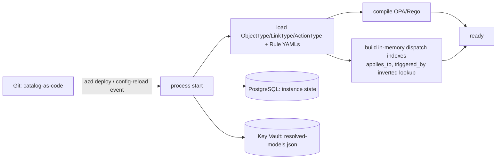

# 규칙 조회 온톨로지 저장소

이 문서는 규칙-결정 조회 온톨로지의 저장소, 관계형 스키마, 부트/리로드 설계를 관리합니다.
계층 조회 파이프라인은
[llm-strategy-ko.md](llm-strategy-ko.md#rule-to-decision-lookup-파이프라인)에서 계속 관리합니다.

## 온톨로지 저장 레이아웃

온톨로지는 **새 datastore 추가 안 함**. 모든 아티팩트가 최소 인벤토리가 이미 프로비저닝한 세
기존 표면([deploy-and-onboard-ko.md](../deployment/deploy-and-onboard-ko.md#azure-resource-inventory-minimum-set))
중 하나에 랜딩: **Git** (catalog-as-code), **PostgreSQL + pgvector**, **Key Vault**.

| 아티팩트 | 성격 | 저장 | 경로 / 테이블 |
|---------|------|------|-------------|
| `ObjectType` / `LinkType` / `ActionType` 정의 | 정적, 버전됨, 리뷰됨 | **Git** | `shared/contracts/ontology/*.json`, `rule-catalog/schema/*.json` |
| 온톨로지 전달 필드 있는 `Rule` 인스턴스 | 정적, 버전됨 | **Git** | `rule-catalog/rules/*.yaml` |
| 배정 / Exemption / 재정의 | 정적, 버전됨 | **Git** | `rule-catalog/{assignments,exemptions,overrides}/` |
| 컴파일된 전달 인덱스 (`applies_to`, `triggered_by`) | 부트에서 파생 | **In-memory** | `trust-router`, `t0-deterministic` 사이드카 |
| `Resource` 인스턴스(관찰된 인벤토리) | 런타임에 발견 | **PostgreSQL** | `ontology_resource` |
| `Signal` 인스턴스(원시 이벤트) | 일시 | in-flight는 **Event Hubs Kafka 토픽**; 상관관계 윈도우 상태만 지속 | 큐 + `signal_correlation` |
| `Finding` 인스턴스(규칙 매칭) | 감사, 지속 | **PostgreSQL** | `ontology_finding` + `audit_log` |
| `Link` 인스턴스(신호→Resource, 발견 사항→발견 사항, Resource→Resource `contains` / `attached_to` / `depends_on`, ...) | 런타임 + 감사 | **PostgreSQL** | `ontology_link` |
| 학습된 액션 (L2) | 지속, 카탈로그-버전 범위 | **PostgreSQL** | `learned_action` |
| 임베딩 (L3) | 지속, HNSW-인덱스 | **PostgreSQL + pgvector** | `ontology_embedding` |
| T2 결과 캐시 (L4) | TTL-bounded | **PostgreSQL** | `t2_cache` (파티션 by `catalog_version`) |
| 감사 체인 | 추가 전용, hash-chained | **PostgreSQL** | `audit_log` |
| `resolved-models.json` | 런타임 구성 | **Key Vault** | ([모델 프로비저닝 and 수명 주기](llm-strategy-ko.md#모델-프로비저닝과-라이프사이클) 참조) |

**단일-저장소 기본 (MUST)**

PostgreSQL Flexible + pgvector는 하나의 저장소, 하나의 백업 경로, 하나의 운영 표면. 전용 그래프
데이터베이스(Neo4j / AGE) 는 **프로비저닝 안 됨** - 우리가 필요한 런타임 탐색
(`Signal → Rule` via `triggered_by ∩ applies_to`) 은 B-tree + GIN 인덱스로 커버되는 두 인덱스
교집합. 측정이 같은 시나리오 세트에서 multi-hop causal 쿼리가 관계형 지연 예산 초과함을 보일 때만
단계 4에서 재평가.

**스키마 스케치** (illustrative - 컬럼 이름은 안정; 정확한 타입은 인벤토리 PR에서 튠):

```sql
CREATE TABLE ontology_object_type (
  type_id            text PRIMARY KEY,
  schema_version     text NOT NULL,
  schema             jsonb NOT NULL
);

CREATE TABLE ontology_link_type (
  link_type_id       text PRIMARY KEY,
  source_type        text NOT NULL,
  target_type        text NOT NULL,
  cardinality        text NOT NULL,
  is_transitive      boolean DEFAULT false,
  is_causal          boolean DEFAULT false,
  temporal_order     boolean DEFAULT false
);

CREATE TABLE ontology_resource (
  resource_id        text PRIMARY KEY,
  type               text NOT NULL REFERENCES ontology_object_type(type_id),
  props              jsonb NOT NULL,        -- redacted before write
  first_seen         timestamptz NOT NULL,
  last_seen          timestamptz NOT NULL
);
CREATE INDEX ix_resource_type       ON ontology_resource(type);
CREATE INDEX ix_resource_props_gin  ON ontology_resource USING gin(props jsonb_path_ops);

CREATE TABLE ontology_finding (
  finding_id         text PRIMARY KEY,
  rule_id            text NOT NULL,
  rule_version       text NOT NULL,
  resource_id        text NOT NULL REFERENCES ontology_resource(resource_id),
  signal_id          text NOT NULL,
  verdict            text NOT NULL,
  severity           text NOT NULL,
  context            jsonb NOT NULL,
  audit_id           text NOT NULL,
  created_at         timestamptz NOT NULL
);
CREATE INDEX ix_finding_rule_resource ON ontology_finding(rule_id, resource_id);

CREATE TABLE ontology_link (
  from_id            text NOT NULL,
  from_type          text NOT NULL,
  link_type          text NOT NULL REFERENCES ontology_link_type(link_type_id),
  to_id              text NOT NULL,
  to_type            text NOT NULL,
  link_props         jsonb DEFAULT '{}',
  created_at         timestamptz NOT NULL,
  PRIMARY KEY (from_id, link_type, to_id)
);
CREATE INDEX ix_link_out ON ontology_link(from_type, from_id, link_type);
CREATE INDEX ix_link_in  ON ontology_link(to_type, to_id, link_type);

CREATE TABLE learned_action (             -- L2
  signature          text PRIMARY KEY,
  rule_id            text NOT NULL,
  rule_version       text NOT NULL,
  catalog_version    text NOT NULL,       -- partition key candidate
  action             jsonb NOT NULL,
  reused_from        text NOT NULL,       -- back-reference to origin audit_id
  created_at         timestamptz NOT NULL
);
CREATE INDEX ix_learned_by_rule ON learned_action(rule_id, catalog_version);

CREATE TABLE ontology_embedding (         -- L3
  embedding_id       text PRIMARY KEY,
  kind               text NOT NULL,
  ref_id             text NOT NULL,
  vec                vector(384) NOT NULL
);
CREATE INDEX ix_emb_hnsw ON ontology_embedding USING hnsw (vec vector_cosine_ops);

CREATE TABLE t2_cache (                   -- L4
  signature          text PRIMARY KEY,
  catalog_version    text NOT NULL,
  model_config_ver   text NOT NULL,
  mode               text NOT NULL,       -- 'shadow' | 'enforce'
  outcome            jsonb NOT NULL,
  expires_at         timestamptz NOT NULL
);
CREATE INDEX ix_t2_cache_expiry ON t2_cache(expires_at);
```

스키마 노트:

- `resource.props` 는 **민감정보가 제거된** 저장; 원시 페이로드는
  [security-and-identity-ko.md § 데이터 Protection](security-and-identity-ko.md#데이터-보호) 과
  같은 아이덴티티와 프라이버시 규칙 하 `audit_log` 에 포인터로 존재.
- `learned_action` 과 `t2_cache` 는 **`catalog_version` 으로 파티션** - 그래서 규칙 승격이
  버전을 bump하고 stale 파티션이 하나의 작업으로 드롭됨 - per-row cache-flush 명령 불필요.
- 모든 기본 키는 **결정론 해시** (`MD5(name)[:12]` 스타일 또는 서명용 SHA256), 그래서
  리플레이와 크로스-서비스 참조가 같은 id 재현.

## 부트와 리로드



- **정적 아티팩트 진실 원본은 Git; 인스턴스 상태 진실 원본은 PostgreSQL.** 두 레이어는 절대
  겹치지 않음.
- 카탈로그 PR 머지 → `catalog_version` bump → 전달 인덱스 재빌드 → 새 버전이 모든 후속
  서명에 이동. **오래된 L2 / L4 엔트리는 자동으로 도달 불가** ; 명시적 무효화 명령 없음.
