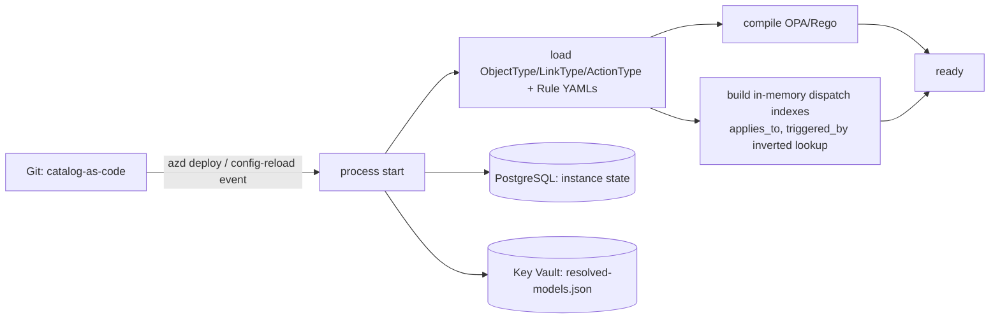

# Rule Lookup Ontology Storage

This document owns the storage, relational schema, and boot/reload design for the
rule-to-decision lookup ontology. The layered lookup pipeline remains in
[llm-strategy.md](llm-strategy.md#rule-to-decision-lookup-pipeline).

## Implementation status

### Implementation scope

| Area | State | Evidence | Notes |
|------|-------|----------|-------|
| Versioned ontology and Rule catalog artifacts | implemented | `rule-catalog/vocabulary/`; `rule-catalog/catalog/`; `test_ontology_catalog.py`; `test_rule_catalog.py` | Catalog loaders validate ObjectType, LinkType, ActionType, Rule references, and dispatch semantics before startup. |
| Relational ontology instances and exact release pinning | implemented | `alembic/versions/20260713_0011_ontology_instances.py`; `20260801_0067_ontology_release_pinning.py`; `20260813_0081_ontology_release_registry.py`; `test_postgres_ontology_instance.py` | PostgreSQL stores typed instances and exact release metadata with direction and compatibility guards. |
| Single-store L2-L4 persistence surfaces | in-progress | `service-migrations/branches/core-control-plane/versions/20260809_core_runtime_role.py`; current `learned_action`, `ontology_embedding`, and `t2_cache` tables | The tables and service ownership exist, but this document does not yet cite one focused lifecycle check proving promotion invalidation, expiry, and rollback together. |
| Boot, reload, and dispatch-index lifecycle | in-progress | [Boot and Reload](#boot-and-reload); catalog loader tests under `tests/rule_catalog/` | Startup compilation and exact catalog loading are implemented. A retained reload receipt proving atomic index replacement and N/N-1 behavior remains absent from this owner document. |

### Implementation history

| Date | State | Change | Evidence | Remaining |
|------|-------|--------|----------|-----------|
| 2026-08-14 | in-progress | Adopted the implementation ledger without reconstructing earlier provenance and aligned the storage description with the current migration-owned schema. | `current change`; catalog, migration, and focused persistence evidence listed in the scope table. | Close the L2-L4 lifecycle and atomic reload evidence gaps below. |

### Remaining work

- [ ] Add one focused PostgreSQL lifecycle check that proves catalog-version invalidation, T2 cache expiry, learned-action retention, and rollback on the current service migration head.
- [ ] Retain an atomic catalog reload receipt showing that failed compilation preserves the prior dispatch indexes and that an accepted N/N-1 transition remains replayable.
- [ ] Replace or annotate any schema-sketch field that diverges from the authoritative Alembic head before treating the sketch as an exact operator reference.

## Ontology Storage Layout

The ontology adds **no new datastore**. Every artifact lands in one of three existing
surfaces the minimum inventory already provisions
([deploy-and-onboard.md](../deployment/deploy-and-onboard.md#azure-resource-inventory-minimum-set)):
**Git** (catalog-as-code), **PostgreSQL + pgvector**, and **Key Vault**.

| Artifact | Nature | Storage | Path / table |
|----------|--------|---------|--------------|
| `ObjectType` / `LinkType` / `ActionType` definitions | static, versioned, reviewed | **Git** | `shared/contracts/ontology/*.json`, `rule-catalog/schema/*.json` |
| `Rule` instances (with ontology dispatch fields) | static, versioned | **Git** | `rule-catalog/rules/*.yaml` |
| Assignments / Exemptions / Overrides | static, versioned | **Git** | `rule-catalog/{assignments,exemptions,overrides}/` |
| Compiled dispatch indexes (`applies_to`, `triggered_by`) | derived at boot | **In-memory** | `trust-router`, `t0-deterministic` sidecars |
| `Resource` instances (observed inventory) | discovered at runtime | **PostgreSQL** | `ontology_resource` |
| `Signal` instances (raw events) | transient | **Event Hubs Kafka topic** in flight; only correlation window state persists | queue + `signal_correlation` |
| `Finding` instances (rule matches) | audited, persistent | **PostgreSQL** | `ontology_finding` + `audit_log` |
| `Link` instances (Signal→Resource, Finding→Finding, Resource→Resource `contains` / `attached_to` / `depends_on`, ...) | runtime + audit | **PostgreSQL** | `ontology_link` |
| Learned actions (L2) | persistent, catalog-version scoped | **PostgreSQL** | `learned_action` |
| Embeddings (L3) | persistent, HNSW-indexed | **PostgreSQL + pgvector** | `ontology_embedding` |
| T2 result cache (L4) | TTL-bounded | **PostgreSQL** | `t2_cache` (partition by `catalog_version`) |
| Audit chain | append-only, hash-chained | **PostgreSQL** | `audit_log` |
| `resolved-models.json` | runtime config | **Key Vault** | (see [Model Provisioning and Lifecycle](llm-strategy.md#model-provisioning-and-lifecycle)) |

**Single-store default (MUST)**

PostgreSQL Flexible + pgvector is one store, one backup path, one operational surface.
A dedicated graph database (Neo4j / AGE) is **not** provisioned - the runtime traversals
we need (`Signal → Rule` via `triggered_by ∩ applies_to`) are two indexed intersections,
covered by B-tree + GIN indexes. Re-evaluate at Phase 4 only if measurement shows
multi-hop causal queries exceed relational latency budgets on the same scenario set.

**Schema sketch** (illustrative): the authoritative current shape is the Alembic head under
`alembic/versions/` plus the Core service migration branch. The sketch explains the ownership and
query model; operators should use the migrations for exact columns, constraints, and types.

```sql
CREATE TABLE ontology_object_type (
  type_id            text PRIMARY KEY,
  schema_version     text NOT NULL,
  schema             jsonb NOT NULL
);

CREATE TABLE ontology_link_type (
  link_type_id       text PRIMARY KEY,
  source_type        text NOT NULL,
  target_type        text NOT NULL,
  cardinality        text NOT NULL,
  is_transitive      boolean DEFAULT false,
  is_causal          boolean DEFAULT false,
  temporal_order     boolean DEFAULT false
);

CREATE TABLE ontology_resource (
  resource_id        text PRIMARY KEY,
  type               text NOT NULL REFERENCES ontology_object_type(type_id),
  props              jsonb NOT NULL,        -- redacted before write
  first_seen         timestamptz NOT NULL,
  last_seen          timestamptz NOT NULL
);
CREATE INDEX ix_resource_type       ON ontology_resource(type);
CREATE INDEX ix_resource_props_gin  ON ontology_resource USING gin(props jsonb_path_ops);

CREATE TABLE ontology_finding (
  finding_id         text PRIMARY KEY,
  rule_id            text NOT NULL,
  rule_version       text NOT NULL,
  resource_id        text NOT NULL REFERENCES ontology_resource(resource_id),
  signal_id          text NOT NULL,
  verdict            text NOT NULL,
  severity           text NOT NULL,
  context            jsonb NOT NULL,
  audit_id           text NOT NULL,
  created_at         timestamptz NOT NULL
);
CREATE INDEX ix_finding_rule_resource ON ontology_finding(rule_id, resource_id);

CREATE TABLE ontology_link (
  from_id            text NOT NULL,
  from_type          text NOT NULL,
  link_type          text NOT NULL REFERENCES ontology_link_type(link_type_id),
  to_id              text NOT NULL,
  to_type            text NOT NULL,
  link_props         jsonb DEFAULT '{}',
  created_at         timestamptz NOT NULL,
  PRIMARY KEY (from_id, link_type, to_id)
);
CREATE INDEX ix_link_out ON ontology_link(from_type, from_id, link_type);
CREATE INDEX ix_link_in  ON ontology_link(to_type, to_id, link_type);

CREATE TABLE learned_action (             -- L2
  signature          text PRIMARY KEY,
  rule_id            text NOT NULL,
  rule_version       text NOT NULL,
  catalog_version    text NOT NULL,       -- partition key candidate
  action             jsonb NOT NULL,
  reused_from        text NOT NULL,       -- back-reference to origin audit_id
  created_at         timestamptz NOT NULL
);
CREATE INDEX ix_learned_by_rule ON learned_action(rule_id, catalog_version);

CREATE TABLE ontology_embedding (         -- L3
  embedding_id       text PRIMARY KEY,
  kind               text NOT NULL,
  ref_id             text NOT NULL,
  vec                vector(384) NOT NULL
);
CREATE INDEX ix_emb_hnsw ON ontology_embedding USING hnsw (vec vector_cosine_ops);

CREATE TABLE t2_cache (                   -- L4
  signature          text PRIMARY KEY,
  catalog_version    text NOT NULL,
  model_config_ver   text NOT NULL,
  mode               text NOT NULL,       -- 'shadow' | 'enforce'
  outcome            jsonb NOT NULL,
  expires_at         timestamptz NOT NULL
);
CREATE INDEX ix_t2_cache_expiry ON t2_cache(expires_at);
```

Notes on the schema:

- `resource.props` is stored **redacted**; the raw payload lives as a pointer in
  `audit_log` under the same identity and privacy rules as
  [security-and-identity.md § Data Protection](security-and-identity.md#data-protection).
- `learned_action` and `t2_cache` are **partitioned by `catalog_version`** so a rule
  promotion bumps the version and the stale partition is dropped in one operation - no
  per-row cache-flush command needed.
- All primary keys are **deterministic hashes** (`MD5(name)[:12]`-style or SHA256 for
  signatures), so replay and cross-service references reproduce the same id.

## Boot and Reload



- **Static artifacts source of truth is Git; instance state source of truth is PostgreSQL.**
  The two layers never overlap.
- A catalog PR merge → `catalog_version` bump → dispatch indexes rebuild → the new version
  travels into every subsequent signature. **Old L2 / L4 entries become unreachable
  automatically**; no explicit invalidation command exists.
