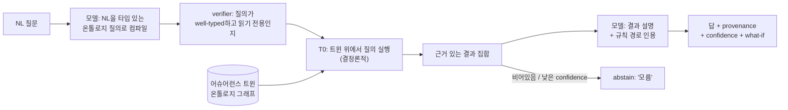

# 어슈어런스 트윈 (질의가능하고 선제적이며 검증가능한 리뷰)

"아키텍처 리뷰 에이전트" 요청에 대한 FDAI의 답은 문서 인덱스에 붙인 챗봇이
아닙니다. 그것은 **어슈어런스 트윈(Assurance Twin)** 입니다: 거버넌스 대상 구독의
질의가능하고 온톨로지에 근거한 디지털 트윈으로, 질문에 결정론적으로 답하고, 누가
요청하기 전에 변경을 리뷰하며, remediation을 제안(실행은 절대 하지 않음)합니다. 모델은
자연어를 타입이 있는 그래프 질의로 컴파일하고 마지막에 결과를 산문으로 렌더링합니다;
답 자체는 트윈 위에서 결정론적 엔진이 산출하므로, 모델의 주장이 아니라 **구성에 의해**
근거가 있고 검증가능합니다.

> **범위**: 고객-비종속. 트윈의 스키마, 규칙, 임계값은 제네릭합니다; 포크는 `Inventory`
> 시임과 자신의 규칙 세트를 통해 자체 리소스 모집단을 공급합니다. 고객 값, tenant id,
> 리소스 이름은 여기에 존재하지 않습니다
> ([generic-scope.instructions.md](../../.github/instructions/generic-scope.instructions.md)).

> **위치**: 트윈은 온톨로지 그래프 위의 **읽기 전용 투영(projection)** 입니다. 특권
> 아이덴티티를 절대 보유하지 않습니다. 모든 mutation은 여전히
> `risk-gate -> executor -> delivery` 를 거치며,
> [app-shape.instructions.md](../../.github/instructions/app-shape.instructions.md) 의
> 읽기 전용 표면 규칙을 보존합니다. 질문에 답하는 것은 결코 액션이 아닙니다.

## 이 문서가 다루는 것

이 문서는 아키텍처 리뷰, Q&A, assessment 리포트 유스케이스를 deterministic-first,
event-driven, risk-gated 설계를 저하시키지 않으면서 커버하는 리뷰/어슈어런스 표면을
규정합니다. [llm-strategy-ko.md](llm-strategy-ko.md) 의 온톨로지,
[architecture.instructions.md](../../.github/instructions/architecture.instructions.md) 의
계층 라우터와 quality gate,
[observability-and-detection-ko.md](observability-and-detection-ko.md) 의 탐지 finding,
[deployment-preflight-ko.md](deployment-preflight-ko.md) 의 배포 analyzer를 재사용합니다.
새 서브시스템 `core/assurance_twin/` 하나와 delivery 인텐트 하나를 추가하며, 나머지는
기존 부품의 조합입니다.

## 왜 챗봇이 아닌가

retrieval-augmented 챗봇은 다섯 가지 구조적 결함을 안고 리뷰 유스케이스에 답합니다.
트윈은 각각을 뒤집습니다.

| 챗봇의 한계 | 결과 | 어슈어런스 트윈의 전환 |
|--------------------|-------------|----------------------|
| **Reactive** - 물어봐야만 답함 | 리뷰 큐 리드타임을 재현(요청 대기, 그다음 사람 대기) | **Ambient** - 요청이 존재하기 전에 변경 이벤트에서 선제적으로 리뷰 |
| **Ungrounded** - 산문에 대한 벡터 유사도 | 환각 판정이 배포까지 도달 | **Ontology-grounded** - 답은 규칙 경로가 인용된 결정론적 그래프 질의 |
| **Stateless** - 실제 estate가 아니라 문서를 읽음 | "왜 non-compliant인가"에 대한 실제 근거 없음 | **Stateful twin** - inventory delta로 최신화되는 구독의 라이브 투영 |
| **Inert** - 정보만 반환하고 멈춤 | 사람이 여전히 손으로 고침 | **Action-bridging** - 답이 shadow remediation-PR 제안을 실을 수 있음 |
| **Static** - 인덱스가 stale됨 | 정책 변경 후 틀린 답 | **Self-improving** - 답 못한/abstain한 질문이 규칙 발견 루프로 투입 |

## 다섯 가지 전환

### 1. Ambient (reactive에서 proactive로)

트윈은 요청이 아니라 이벤트에서 변경을 리뷰합니다. 변경 신호가 도착하면(IaC pull request
열림, Activity Log 리소스 쓰기, drift diff), `event-ingest` 가 정규화하고, 트윈이 scratch
투영에 diff를 적용하며, T0가 영향받는 규칙을 평가하고, 결과가 리뷰로 되돌아 게시됩니다 -
PR의 Checks API 주석 또는 인시던트의 finding. "요청 시 배포 후 평가" 케이스가 "변경 시,
요청 없이 평가됨"이 됩니다.

예: 개발자가 private endpoint 없이 storage account를 추가하는 IaC PR을 엽니다. 리뷰가
요청되기 전에 트윈이 Check를 게시합니다: `blocked - object-storage.private-endpoint.required
(규칙 인용), resolution: private endpoint 추가 또는 exemption 적용`.

### 2. Ontology-grounded (retrieval에서 그래프 질의로)

트윈은 산문 인덱스가 아니라 온톨로지 그래프입니다. 모든 거버넌스 대상 리소스는 `Resource`
ObjectType이고; 관계는 기존의 타입 있는 LinkType(`contains`, `attached_to`, `depends_on`)이며,
규칙 매치는 `Finding` 입니다([llm-strategy-ko.md](llm-strategy-ko.md) 참조). "왜 이 리소스가
non-compliant인가"는 구체적인 근거 체인을 반환하는 그래프 traversal로 답합니다, 예:

```text
Resource:storage-x --attached_to--> Resource:subnet-y
subnet-y --contains(-1)--> vnet-z
Finding: storage-x violates rule:object-storage.private-endpoint.required
  evidence: rule path + evaluated property (publicNetworkAccess=Enabled)
```

체인은 결정론적이고 재현가능합니다: 같은 트윈 상태는 누가 묻든 어떻게 표현하든 같은 답을
산출합니다.

### 3. Verifiable (text-to-answer가 아니라 text-to-query)

이것이 핵심 메커니즘입니다. 모델은 **자연어 질문을 타입 있는 온톨로지 질의로 컴파일**하고,
마지막에 **결과를 산문으로 렌더링**하는 데 쓰입니다. 사실의 출처는 결코 모델이 아닙니다.



- **컴파일이 검증됨**: 컴파일된 질의는 온톨로지 스키마에 대해 well-typed여야 하고 읽기
  전용이어야 합니다; 검사를 통과하지 못한 질의는 실행되지 않고 거부됩니다. 이는 T2
  verifier와 동일한 fail-closed 자세입니다.
- **답은 계층을 거침**: 정확한 규칙/그래프 매치는 **T0** 에서 해결되고; 알려진 패턴에
  가까운 모호한 질문은 **T1** 유사도를 쓰며; 진정으로 새롭거나 모호한 질문만 **T2** 에
  도달하고, T2 출력은 표시되기 전에
  [quality gate](../../.github/instructions/architecture.instructions.md#llm-quality-gate-required-for-t2)
  (mixed-model cross-check, verifier, grounding)를 통과합니다.
- **grounding 아니면 abstain**: 모든 답은 그것을 정당화하는 규칙과 그래프 노드를 인용합니다.
  근거를 댈 수 없는 답은 추측 대신 "모름"을 반환합니다. 환각은 프롬프트 튜닝이 아니라
  구성에 의해 차단됩니다.

### 4. Action-bridging (inert에서 제안으로)

답은 제안된 수정을 실을 수 있지만, 트윈은 결코 실행하지 않습니다. 질문이 고칠 수 있는
Finding으로 해소되면, 트윈은 규칙의 `remediates` ActionType로부터 만든 **shadow
remediation-PR 제안**을 붙일 수 있습니다. 그것에 대해 행동하는 것은 기존의 gated 경로입니다:
`risk-gate -> executor -> delivery`, 고위험은 무엇이든 HIL로
([risk-classification-ko.md](risk-classification-ko.md) 참조). 챗과 콘솔은 읽기 전용
표면으로 남습니다; 제안은 PR로의 링크이지 mutate하는 버튼이 아닙니다.

예: "private endpoint 없는 storage account를 고쳐줘"는 Finding 집합으로 해소됩니다; 트윈은
리소스당 하나의 shadow remediation-PR을 엽니다(blast-radius 상한 아래 배치), 각각 rollback
계약을 가지며 HIL로 라우팅됩니다. 사람이 승인하기 전에는 아무것도 바뀌지 않습니다.

### 5. Self-improving (static에서 living으로)

질문은 발견 신호입니다. 트윈이 **abstain** 한 질문, 또는 커버하는 규칙이 없는 반복 질문은
[architecture.instructions.md](../../.github/instructions/architecture.instructions.md) 의
자율 규칙 발견 루프로 후보로 emit됩니다(HIL 패턴과 override를 지켜보는 것과 같은 루프).
후보는 provenance를 실으며 카탈로그에 들어가기 전에 표준 quality gate를 통과합니다; 트윈은
카탈로그를 직접 mutate하지 않습니다. 따라서 지식 표면은 stale되는 대신 estate를 추적합니다.

## 시뮬레이터로서의 트윈 (그래프 전체에 대한 what-if)

액션별 what-if verifier
([architecture.instructions.md](../../.github/instructions/architecture.instructions.md#llm-quality-gate-required-for-t2))
는 단일 변경의 효과를 예측합니다. 트윈은 이를 그래프 전체로 일반화합니다: 제안된 변경을
**scratch 투영**에 적용하고 라이브 estate에 손대기 전에 결과를 평가합니다. 하나의
시뮬레이션 표면이 세 vertical 모두를 서비스하며, 그래서 트윈은 설계를 복잡하게 하는 게
아니라 단순화합니다.

| Vertical | 시뮬레이션 질문 | 답하는 방법 |
|----------|---------------------|-------------|
| **Change Safety** | 이 변경의 blast radius는? 하류에서 무엇이 깨지는가? | 변경된 `Resource` 로부터 `attached_to` / `depends_on` traversal; 영향 집합 + 새로 위반된 규칙 보고 |
| **Resilience (DR)** | estate가 목표 RPO/RTO를 만족하는가? 무엇이 failover되는가? | 리전/존 손실 시나리오를 트윈에 대해 replay; 복구 경로 없는 리소스와 예상 RPO/RTO 갭 보고 |
| **Cost Governance** | 이 변경/이 최적화의 비용 델타는? | 투영에 SKU/스케일 델타 적용; 예상 unit-cost 변화 보고 |

- **읽기 전용이고 결정론적**: 시뮬레이션은 scratch 투영만 mutate하고, 라이브 estate나
  audit store는 절대 건드리지 않습니다. 이는 T0 성격의 패스입니다: 정적 그래프 평가가
  대부분을 해결하고, bounded 읽기 전용 프로브가 나머지를 확증합니다,
  [deployment-preflight-ko.md](deployment-preflight-ko.md) 가 하는 것과 정확히 같습니다.
- **Shadow-first**: 각 시뮬레이션 파생 finding은 shadow 모드로 배포되고, 정확도와
  false-positive 비율이 frozen 시나리오 세트에서 측정된 후에만 shadow-to-enforce 규칙에
  따라 승격됩니다([goals-and-metrics-ko.md](goals-and-metrics-ko.md)).
- **Fidelity 측정**: `core/assurance_twin/fidelity.py`
  (`SimulationFidelityLedger`) 가 그 승격의 메커니즘이다. 각 **예측된** 효과(비용 delta,
  blast-radius 개수, RPO/RTO gap)를 안정적인 prediction id 로 **실제** 관측 결과와 조인해
  예측기별 MAE, MAPE, within-tolerance 비율을 누적한다. `is_reliable` 은 이를 fail-closed
  승격 신호로 바꾼다: 최소 표본 수 미만이거나 MAPE 기준 초과인 예측기는 신뢰할 수 없으므로,
  호출자는 그것을 shadow 에 유지(또는 강등)한다. 이는 측정되지 않은 what-if 가 oracle 로
  작동하는 것을 막는다 - 실현되지 않는 시뮬레이션은 enforce 자격을 자동으로 잃는다.

## Assessment 리포트 (구독 자세, 온디맨드)

변경별 선제 리뷰는 estate 전체 리포트로 조합됩니다. 현재 트윈에 대해 적용가능한 모든
규칙을 실행하면 `PostureAssessmentReport` 가 산출됩니다 - `DeploymentReadinessReport`
([deployment-preflight-ko.md](deployment-preflight-ko.md))를 단일 배포에서 구독 전체로
일반화한 것입니다. 각 항목은 동일한 세 필수 부분을 유지합니다 - 근거 있는 evidence(인용된
규칙), severity, 구체적인 레버에 매핑된 resolution - 그래서 리포트는 단순 점수가 아니라
실행가능합니다. 콘솔은 읽기 전용 `ReadPanel` 라우트를 통해 이를 렌더링하며
([project-structure-ko.md](project-structure-ko.md)); 특권 호출을 하지 않습니다.

## 모듈 배치

서브시스템은 `core/assurance_twin/` 에 있으며 다른 모든 core 서브시스템처럼 `shared/`
계약과 provider만 import합니다
([project-structure-ko.md](project-structure-ko.md)). 클라우드 SDK도 특권 아이덴티티도
보유하지 않습니다.

| 컴포넌트 | 책임 |
|-----------|----------------|
| `projection` | `Inventory.full_snapshot()` + `delta()` 로부터 읽기 전용 트윈을 구축·유지; 시뮬레이션용 scratch 투영 유지 |
| `query` | 요청으로부터 검증된 well-typed 읽기 전용 온톨로지 질의를 컴파일; 트윈 위에서 traversal 실행 |
| `review` | 변경 신호에서 scratch 투영에 diff를 적용하고 T0를 실행해 리뷰 finding을 emit |
| `report` | Finding으로부터 `PostureAssessmentReport` 를 조립 |
| `explain` | 근거 있는 결과를 규칙/그래프 인용과 함께 산문으로 렌더링(모델 보조, quality-gated) |

Delivery는 기존 `chatops` 어댑터에 인텐트 하나를 추가하고(질문 입력, 근거 있는 답 출력)
제안과 Checks API 리뷰에 `gitops-pr` 어댑터를 재사용합니다. 새 특권 표면은 도입되지
않습니다.

## 안전 자세

- **읽기 전용 트윈, gated 실행**: 트윈과 모든 답은 읽기 전용입니다; mutation으로의 유일한
  경로는 `risk-gate -> executor` 로 진입하는 제안이며, 네 가지 safety invariant(stop-condition,
  rollback, blast-radius 제한, audit 항목)는 트윈이 아니라 거기서 강제됩니다.
- **Fail closed**: 근거 댈 수 없는 답은 abstain하고; 잘못 타입되거나 읽기 전용이 아닌 컴파일된
  질의는 거부되며; stale된 트윈(`Inventory` freshness가 `freshness_ttl` 초과)은 ghost 데이터로
  답하는 대신 estate 상태 질문에 답하기를 거부합니다, `RequiresInventoryFresh`
  ([llm-strategy-ko.md](llm-strategy-ko.md))를 반영.
- **신뢰할 수 없는 입력**: 질문 텍스트와 변경 payload는 신뢰할 수 없으며 prompt injection을
  실을 수 있습니다; verifier와 읽기 전용 질의 계약이 권위이지, 모델의 자유 텍스트가 아닙니다
  (위협 모델은 [security-and-identity-ko.md](security-and-identity-ko.md)).
- **감사됨**: 모든 제안, 리뷰, 시뮬레이션 파생 finding은 그 근거와 함께 audit 항목을
  씁니다; 제안을 산출하지 않는 읽기 전용 질문은 로그되지만 액션이 아닙니다.

## 페이즈

트윈은 기존 페이즈 위에 점진적으로 착지합니다; 새 계층도, risk gate가 이미 관장하지 않는 새
자율성도 도입하지 않습니다.

| 페이즈 | 착지하는 것 | 게이트 |
|-------|------------|------|
| **P2** ([phase-2-quality-and-t1-ko.md](phases/phase-2-quality-and-t1-ko.md)) | inventory로부터 트윈 투영; 검증된 text-to-query; quality gate를 통한 근거 있는 답; abstain-to-discovery 피드백 | 답은 근거가 있거나 abstain; 시나리오 세트에서 근거 없는 답 0 |
| **P3** ([phase-3-integrated-loop-ko.md](phases/phase-3-integrated-loop-ko.md)) | ambient 변경별 리뷰; Change/DR/FinOps에 대한 그래프 전체 시뮬레이션; shadow remediation-PR 제안; `PostureAssessmentReport` 패널 | 각 시뮬레이션 finding은 enforce 전에 shadow-first로 측정 |

## 다음 단계

| 배우고 싶은 것 | 읽을 문서 |
|----------------|------|
| 트윈이 질의하는 온톨로지 | [llm-strategy-ko.md](llm-strategy-ko.md) |
| 답이 거치는 계층과 quality gate | [architecture.instructions.md](../../.github/instructions/architecture.instructions.md#llm-quality-gate-required-for-t2) |
| 리포트가 일반화하는 배포 analyzer | [deployment-preflight-ko.md](deployment-preflight-ko.md) |
| 리뷰가 소비하는 탐지 finding | [observability-and-detection-ko.md](observability-and-detection-ko.md) |
| 서브시스템이 리포에서 있는 위치 | [project-structure-ko.md](project-structure-ko.md) |
| 제안이 어떻게 risk-classify되는가 | [risk-classification-ko.md](risk-classification-ko.md) |
