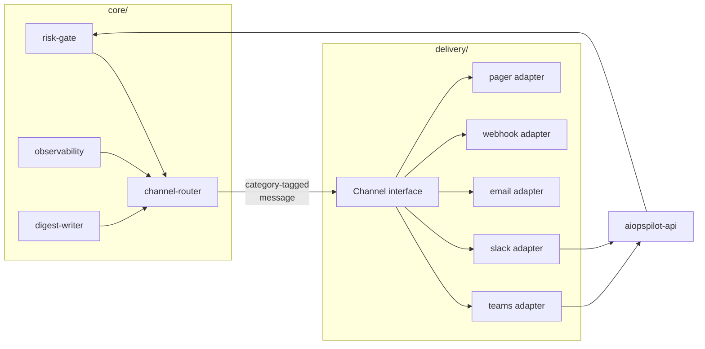

# 채널과 알림(Channels and Notifications)

AIOpsPilot가 **비-웹-UI 채널** — Teams, Slack, email, webhook, paging 서비스, SMS —
을 통해 사람과 소통하는 방법. 이 문서는 **채널 추상화, 신뢰 레벨, 카테고리 경계, 라우팅
정책, 채널 특이 규칙** 의 진실 원본입니다. [tech-stack-ko.md](tech-stack-ko.md) 에서 힌트한
"notifier 인터페이스" placeholder를 해결하고
[operating-and-verification-ko.md](operating-and-verification-ko.md#alert-routing) 의 Alert
Routing 조각들과
[user-rbac-and-identity-ko.md](user-rbac-and-identity-ko.md#7-chatops-hil-flow) 의 Teams-특이
흐름을 통합.

웹-UI(읽기 전용 콘솔) 는 이 문서 범위 밖; 콘솔의 아이덴티티 흐름은
[user-rbac-and-identity-ko.md](user-rbac-and-identity-ko.md) 에 있음.

> 고객-비종속: 아래 모든 채널 id, 그룹 이름, 엔드포인트는 **placeholder** ; 포크가 config로
> 자체 tenant, workspace, 엔드포인트 값 공급
> ([generic-scope.instructions.md](../../.github/instructions/generic-scope.instructions.md)).

## 1. 설계 원칙

1. **하나의 추상화, 여러 어댑터.** 코어 코드는 절대 Teams나 Slack을 이름 지정하지 않음;
   카테고리-태그된 메시지를 emit하고 라우터가 채널 선택. 새 채널은 추가적.
2. **벤더가 아니라 목적으로 분류.** 채널은 네 카테고리(§3) 중 하나 이상을 지원. 벤더는
   안전하게 서비스할 수 있는 카테고리로 제약됨.
3. **신뢰 티어링.** 승인 카테고리 트래픽(A1)은 사람의 Entra 아이덴티티를 종단으로 검증할 수
   없는 채널을 통해 흘러선 안 됨. 신뢰 낮은 채널은 정보를 운반해도 결정은 절대 안 됨(§4).
4. **안전 방향 실패.** 카테고리의 설정된 모든 채널이 실패하면 요청은 큐잉되고 운영 라인에
   page — 절대 auto-execute 안 함. 카테고리 내 fallback은 신뢰 티어 보존(§6).
5. **Redaction은 발신자의 일.** 시크릿, 자격증명, PII, 구독 id, 원시 고객 페이로드는 어떤
   카테고리에서도 채널 메시지로 신뢰 경계를 떠나지 않음.

## 2. 아키텍처 상 채널의 위치



- 어댑터는 `delivery/chatops/<vendor>/` 아래 존재
  ([project-structure-ko.md](project-structure-ko.md) 참조). 각 어댑터는 `shared/providers/` 의
  같은 `Channel` 인터페이스를 구현.
- **channel-router** 는 얇은 코어 모듈: 카테고리와 메시지를 받아 포크의 라우팅 config(§6)에
  따라 채널을 선택. 벤더 지식을 보유하지 않음.
- **어떤 어댑터의 승인 콜백도 `aiopspilot-api` 에 랜딩** , 이는 액션 전에 사람의 Entra
  아이덴티티를 재검증
  ([user-rbac-and-identity-ko.md](user-rbac-and-identity-ko.md#102-api-token-validation)).
  어댑터는 절대 자체로 결정을 authorize 하지 않음.

## 3. 카테고리 (A1–A4)

모든 채널 메시지는 **카테고리 태그** 를 운반하고 그 카테고리의 규칙을 준수해야 함.

| 카테고리 | 방향 | 예시 | 필요한 인증 강도 |
|----------|------|------|-----------------|
| **A1 — HIL 승인** | 양방향(결정 반환) | 고위험 액션 승인, enforce-promotion 승인, exemption 승인, override 승인 | **최고** — 검증된 Entra 아이덴티티, 액션-바인딩, 재생 없음 |
| **A2 — 운영 알림** | outbound only | SLO burn, DLQ depth, verifier 실패율, cold-start miss, IaC drift, adapter 불건강, canary miss | 낮음 — 정보성 |
| **A3 — 채팅 명령** | 양방향(쿼리/응답) | **read**: `/aw status`, `/aw shadow-report`, `/aw override list`, `/aw kill-switch status`. **write (draft-PR only)**: `/aw override draft`, `/aw exemption draft`, `/aw assignment param-tune` | 중간 — 명령별 롤-게이팅(§3.1) |
| **A4 — 다이제스트** | outbound only | 일간 shadow-accuracy 리포트, 주간 override 회고, 주간 enforce-promotion 후보, 주간 governance PR aging, 주간 exemption 만료 lookahead, 월간 KPI + 비용 총결, break-glass 사용 요약 | 낮음 — 수신자 스코프만 |

**카테고리 경계 (MUST)**

- **A1 승인은 절대 메시지에 결정 페이로드를 운반하지 않음.** Adaptive Card / Block Kit /
  email body는 **opaque `approval_id`** 을 운반; 실제 결정은 `aiopspilot-api` 로 post,
  이것이 재인증하고 재검증 (`idempotency_key` + `action_hash`) 하여 유출된 메시지가 유효한
  승인이 아니게 함.
- **A3 write 명령은 절대 라이브 카탈로그를 직접 변형하지 않음** — 콘솔과 같은 방식으로 draft
  PR을 생산
  ([user-rbac-and-identity-ko.md](user-rbac-and-identity-ko.md#6-identity-flow-console--draft-pr--audit)
  §6), invoker의 Entra OID를 PR trailer에 운반. PR은 이후 표준 quorum + 자기승인 없음 규칙을
  따름.
- **A2/A4 메시지는 절대 승인 버튼이나 실행 링크를 포함하지 않음.**

### 3.1 A3 명령 롤 게이팅

각 A3 명령은 **최소 롤** 과 read/write 여부를 선언. 봇 어댑터가 invoker의 Entra OID
(Teams SSO / Slack 매핑) 로 핸들러 실행 전에 검사 강제; 롤 부재는 in-channel `403` 응답과
감사 엔트리를 씀.

| 명령 | 타입 | 최소 롤 |
|------|------|--------|
| `/aw status`, `/aw shadow-report`, `/aw kpi` | read | `Reader` |
| `/aw override list`, `/aw exemption list`, `/aw kill-switch status` | read | `Reader` |
| `/aw override draft`, `/aw exemption draft`, `/aw assignment param-tune` | write → draft PR | `Contributor` |
| `/aw kill-switch on`/`off` | write → draft PR + A1 승인 | `Owner` |

## 4. 신뢰 레벨(matrix)

채널의 *허용 카테고리* 는 기술적으로 딜리버리 가능한 것과 인증이 증명할 수 있는 것의 교집합.

| 채널 | Entra tenant | 인증 경로 | 허용 카테고리 |
|------|--------------|-----------|--------------|
| **Teams (same tenant)** | ✓ | Teams SSO → OBO 교환 → `aiopspilot-api` 토큰 | **A1, A2, A3, A4** |
| **Teams (guest tenant)** | guest | guest OID로 OBO | **A2, A3, A4** (A1 거부 — [user-rbac-and-identity-ko.md §10.5](user-rbac-and-identity-ko.md#105-guest-entra-b2b-users) 와 동일한 guest 규칙) |
| **Slack** | ✗ | Slack OAuth; **fork-mandatory** Slack userId ↔ Entra OID 매핑; A1 승인은 브라우저에서 Entra 재인증을 위해 `aiopspilot-api` 로 바운스 | **A1, A2, A3, A4** — P1에서 A1 활성화(§7 Slack notes 참조) |
| **Email (SMTP / Graph)** | ✗ | 발신 전용, return 채널 없음 | **A2, A4 only** — 절대 A1 아님 (magic-link 승인 금지) |
| **Generic webhook** | ✗ | HMAC-signed, timestamped, replay-guarded | **A2 only** |
| **PagerDuty / Opsgenie** | ✗ | API 키, 모바일 앱에서 ack | **A2 only** (운영 라인 paging) |
| **SMS** | ✗ | — | **A2 only** (최소 페이로드; break-glass 도달성) |

**매트릭스를 안전하게 유지하는 규칙 (MUST)**

- **Magic-link 승인은 모든 채널에서 금지.** 승인은 항상 `aiopspilot-api` 를 통한 재인증된
  왕복이 필요.
- **A1 fallback은 A1-capable 채널 안에 머무름.** 실패한 Teams A1 시도는 절대 email로
  falls through 하지 않음; 다른 A1-capable 채널(Teams standby, 또는 매핑이 있을 때 Slack)
  또는 HIL 큐로 fall.
- **Slack A1은 userId↔OID 매핑 필요.** 매핑 provider가 응답 Slack 사용자에 대해 non-empty
  엔트리를 반환할 때까지 어댑터는 A1 트래픽 서비스 거부; 매핑 부재는 "승인자 없음" 취급
  (HIL 큐로 fail-closed).

## 5. Channel 인터페이스 (계약)

`Channel` 인터페이스는 `shared/providers/` 에, 벤더별 구현은 `delivery/chatops/<vendor>/`
에 존재. 코어 코드는 이 계약에만 의존.

```typescript
type ChannelCategory = 'A1' | 'A2' | 'A3' | 'A4';
type TrustLevel = 'entra-native' | 'external-mapped' | 'send-only';

interface Channel {
  id: string;                            // "teams-hil-prd", "slack-ops-alerts"
  categories: ChannelCategory[];         // 이 채널이 서비스할 수 있는 카테고리
  trust_level: TrustLevel;

  // A2 / A4 (send-only) — 모든 채널이 구현
  send(msg: NotificationMessage): Promise<DeliveryReceipt>;

  // A1 — 승인 가능 채널만 구현
  awaitDecision?(req: ApprovalRequest, ttl: Duration): Promise<ApprovalOutcome>;

  // A3 — 채팅-명령 가능 채널만 구현
  registerCommand?(cmd: ChatCommandSpec, handler: CommandHandler): void;
}

interface NotificationMessage {
  category: ChannelCategory;
  correlation_id: string;                // user-rbac-and-identity-ko.md §7
  audit_id?: string;
  title: string;
  body_markdown: string;                 // pre-redacted; 어댑터가 known-secret 패턴 재스캔
  links: { label: string; url: string }[];    // 링크만 — A2/A4용 인라인 액션 버튼 없음
  severity?: 'info' | 'warn' | 'error' | 'critical';
}

interface ApprovalRequest {
  category: 'A1';
  correlation_id: string;
  approval_id: string;                   // opaque; 결정 엔드포인트가 실제 authorize
  action_hash: string;                   // 승인을 특정 pending 액션에 바인딩
  idempotency_key: string;
  ttl: Duration;                         // 만료 시 fail-closed
}
```

- **어댑터는 절대 자체로 결정을 authorize 하지 않음.** `awaitDecision` 은 사용자가 클릭한
  무엇을 반환; 코어 라우터가 그 원시 클릭을 `aiopspilot-api` 로 넘기고, 그것이 유일한 권위
  (아이덴티티 재검증, 재생 검사, 자기승인 없음).
- **어댑터는 메시지 body를 재스캔** 해야 함 — 알려진 시크릿 패턴에 대해(CI secret 스캐너가
  쓰는 것과 같은 regex 세트) 발송 전에 마지막 방어선으로.
- **어댑터는 멱등 `send` 를 구현** 해야 함: 같은 `correlation_id + audit_id + category` 로
  재발행된 send는 중복 포스트를 생성해선 안 됨.

### 5.1 오디언스 파생 (channel-as-audience)

수신자 리스트는 라우터에서 per-user로 파생되지 **않음**. 각 채널이 오디언스 *그 자체* 이며,
멤버십은 컨트롤 플레인 **밖에서** 관리 — 보통 채널을 Entra 보안 그룹에 바인딩.

- **기본 (Option A)**: Teams 채널/DL은 `aw-*` Entra 보안 그룹으로 백업된 **group-connected
  team** 으로 생성. 멤버십은 Entra에서 자동 sync ("Owner가 Portal에서 `aw-approvers` 에
  사람 추가" → 그들은 즉시 다음 다이제스트와 모든 A1/A2/A3 포스트 보게 됨). 이는 관리를 하나의
  표면에 유지
  ([user-rbac-and-identity-ko.md §4.2](user-rbac-and-identity-ko.md#42-security-groups-slots)).
- **In-message `@mentions`** 은 채널 포스트 안에서 아티팩트-소유자를 호출(예: 만료되는 exemption
  의 요청자). 멘션은 감사 스트림이 이미 운반하는 아티팩트 메타데이터(`requested_by`, PR author,
  rule author)에서 파생 — 다이제스트 시점에 Graph 조회 없음.
- **롤-파생 direct messaging** 은 break-glass 사용 요약에만 사용(채널 포스트로 충분하지 않은
  작고 시간-임계 오디언스). 다른 모든 A4 다이제스트는 채널 전용.

다이제스트 엔트리의 허용 오디언스 모드:

| 모드 | 의미 | 허용 위치 |
|------|------|----------|
| `channel: <id>` | 채널/DL에 포스트; Entra 그룹 바인딩으로 멤버십 관리 | A2, A3, A4 (기본) |
| `mention-artifact-owner` | 추가적: 채널 포스트 안에서 아티팩트 소유자 `@mention` | A4 (다이제스트별 opt-in) |
| `role-dm: <RoleName>` | `aw-<role>` 멤버 Graph 조회, 각각 DM | A4 **break-glass 전용** (config 로드에서 다른 곳은 deny-list) |

## 6. 라우팅 정책 (config-driven)

라우팅은 선언적 config, channel-router가 평가. 채널 추가/교체/재정렬은 config 변경, 절대
코드 변경 아님.

**Config 위치**: 라우팅 config는 규칙, 할당, exemption, override와 함께 **catalog-as-code
리포** 에 존재 (경로: `rule-catalog/channel-routing/`). 같은 CODEOWNERS / signed-commit /
no-direct-push 보호를 상속; 라우팅 변경은 governance 변경처럼 리뷰. A1 라우팅을 만지는 모든
변경에 Owner-티어 리뷰어 필요.

```yaml
channel_routing:
  hil_approval:                    # 카테고리 A1
    primary:   teams-hil-prd
    fallback:  [teams-hil-standby, slack-hil-prd]   # A1 fallback은 A1-capable 이어야 함
    on_all_fail: queue_and_page_ops                 # 절대 auto-execute 안 함
    ttl: 30m                                        # 그다음 fail-closed → HIL 큐 + A2 알림

  operational_alerts:              # 카테고리 A2
    primary:   teams-ops-prd
    fallback:  [pagerduty-primary, email-oncall]
    dedupe_window: 10m                              # observability 상관관계 통해

  chat_commands:                   # 카테고리 A3
    channels:
      - teams-hil-prd
      - slack-hil-prd
    # 롤 검사는 명령별(§3.1); 라우터는 재구현 안 함

  digests:                         # 카테고리 A4 — 7가지 기본 다이제스트
    shadow_accuracy_daily:
      cron: "0 9 * * *"
      audience:
        - channel: teams-hil-prd
        - channel: email-governance
    enforce_promotion_candidates_weekly:
      cron: "0 9 * * MON"
      audience:
        - channel: teams-hil-prd
        - channel: email-governance
        - mention-artifact-owner: rule_author
    override_retrospective_weekly:
      cron: "0 9 * * MON"
      audience:
        - channel: teams-hil-prd
        - channel: email-governance
        - mention-artifact-owner: override_requester
    governance_pr_aging_weekly:
      cron: "0 9 * * MON"
      audience:
        - channel: teams-hil-prd
        - mention-artifact-owner: pr_author_and_reviewers
    exemption_expiry_lookahead_weekly:
      cron: "0 9 * * MON"
      audience:
        - channel: teams-hil-prd
        - channel: email-governance
        - mention-artifact-owner: exemption_requester
    kpi_and_cost_monthly:
      cron: "0 9 1 * *"
      audience:
        - channel: email-governance                # Owners-backed DL
        - channel: teams-hil-prd
        - github-issue: kpi-monthly-archive        # 리포의 append-only 아카이브
    break_glass_usage_summary:
      trigger: on-event-and-weekly                 # 모든 BG 사인인 즉시 + 월요일 롤업
      audience:
        - channel: teams-break-glass
        - role-dm: Owner                           # 허용된 role-dm 오디언스는 이것 뿐
```

**라우터 규칙 (MUST)**

- **카테고리 ⊆ channel.categories** — 라우터는 선언된 카테고리에 메시지 카테고리가 포함되지
  않은 채널로 메시지 전송을 거부. 시작 config 검증이 허용되지 않은 카테고리와 채널을 짝지은
  라우팅 엔트리를 거부(deny-by-default; fail fast).
- **Fallback 시 신뢰 보존** — A1 primary → A1 fallback만. Fallback에서 더 낮은 신뢰 레벨로
  다운그레이드는 config-load 에러.
- **`role-dm` 은 `break_glass_usage_summary` 를 제외하고 deny-list.** `role-dm` 을 시도하는
  다른 다이제스트는 config 로드 실패.
- **`mention-artifact-owner` 를 선언하는 다이제스트는 유효한 메타데이터 필드를 명시** 해야 함
  (`rule_author`, `override_requester`, `exemption_requester`, `pr_author_and_reviewers`);
  알려지지 않은 값은 config 로드 실패.
- **Bounded 재시도** — 각 어댑터는 자체 재시도 예산을 선언; 라우터는 소진 시 다음 채널 또는
  `on_all_fail` 로 escalate.
- **TTL fail-closed** — TTL까지 결정 없는 A1 요청은 no-op + A2 알림 + 감사 엔트리
  ([security-and-identity-ko.md](security-and-identity-ko.md#hil-approval-integrity)).

## 7. 채널 특이 노트

| 채널 | 노트 |
|------|------|
| **Teams** | A1에 Adaptive Cards; OAuth 스코프 세트를 최소로 유지(`ChannelMessage.Send.Group` + 봇 시그널링). SSO + OBO는 이미 [user-rbac-and-identity-ko.md §10.4](user-rbac-and-identity-ko.md#104-chatops-teams-sign-in) 에 커버. 다이제스트 오디언스는 **`aw-*` Entra 보안 그룹으로 백업된 group-connected 팀** — 멤버십이 별도 리스트 없이 Entra를 따름. |
| **Slack** | A2/A3에 Block Kit; 승인 콜백 URL은 `aiopspilot-api` 를 통해 리다이렉트하여 Entra 재인증이 Slack 안이 아니라 브라우저에서 발생. `chat:write` 스코프만. 포크는 userId↔OID 매핑 저장소를 공급해야 함; Slack 사용자에게 매핑된 Entra OID가 없으면 어댑터는 A1 트래픽 거부. Slack 채널 멤버십은 Slack에서 관리; 해당 `aw-*` 그룹과 수동 또는 SCIM으로 sync 유지. |
| **Email** | Send-only. 승인 링크 절대 포함 안 함; 다이제스트와 알림만. 발신자 아이덴티티는 알림 롤에 범위된 Graph API 메일박스. Redaction 필수 — `audit_id` 와 대시보드 URL 이상의 상관 페이로드 없음. 권장 DL: `aw-approvers` / `aw-owners` 를 미러링하는 **Entra 동적 분배 그룹**. |
| **Generic webhook** | HMAC-SHA256 서명, 단조 타임스탬프, 단발 nonce. Receiver 실패는 절대 블록 안 함; 코어가 어댑터 정책대로 재시도 후 이동. |
| **PagerDuty / Opsgenie** | Dedup 키 = observability 상관 id 이므로 버스트가 접힘. 런북 URL은 모든 알림에 필수. |
| **SMS** | 페이로드는 `<severity> <audit_id> <short-url-to-runbook>` 로 제한. 시크릿 없음, 고객 이름 없음, 자유 텍스트 없음. 주로 break-glass 도달성. |

## 8. Fallback과 Kill-Switch 상호작용

- **글로벌 kill-switch** 는 모든 A1 dispatch를 즉시 중단하고 열린 A1 요청을 재큐잉;
  kill-switch 상태 자체는 모든 운영 채널에서 A2로 공지.
- **모든 A2 채널이 다운** 이면, 어댑터 헬스 원격측정은 여전히 관측성에 랜딩하고 콘솔에 나타남;
  kill-switch는 전용 break-glass 경로를 통해 조작 가능
  ([security-and-identity-ko.md](security-and-identity-ko.md#rate-limiting-and-kill-switch-dos-and-containment)).
- 어댑터 불건강 자체는 A2 신호 — A1 딜리버리를 중단한 Teams outage는 fallback 채널을 통해
  운영 라인을 page.

## 9. 포크 vs 상류 분리

| 항목 | 상류 (이 리포) | 포크 |
|------|--------------|------|
| `Channel` 인터페이스 + `NotificationMessage` / `ApprovalRequest` 타입 | ✓ | — |
| Teams 어댑터 (기본 A1 + A2 + A3 + A4 구현) | ✓ | tenant / group-connected 팀 바인딩 |
| **A1 기본 활성화된 Slack 어댑터 (P1)** | ✓ | workspace 자격증명 + userId↔OID 매핑(필수) |
| Email / Webhook / Pager / SMS 어댑터 | ✓ (스켈레톤) | 자격증명 + 활성화 |
| 라우팅-config 스키마 + 시작 검증 | ✓ | 실제 라우팅 값 in `rule-catalog/channel-routing/` |
| 7개 기본 다이제스트 + 오디언스 파생 규칙 | ✓ | cron 타임존, 채널 id, 다이제스트별 on/off |
| Secret-scan regex 세트(어댑터가 재사용) | ✓ | 필요 시 패턴 확장 |
| Slack userId ↔ Entra OID 매핑 **인터페이스** | ✓ | 매핑 데이터(P1 A1에 필수) |
| 다이제스트 컨텐트 템플릿 | ✓ (범용) | 브랜딩 / localization |

## 10. Open Decisions

- [ ] 어댑터-헬스 알림 임계와 dedupe 윈도우.
- [ ] 어떤 벤더의 incoming webhook (있다면) 이 AIOpsPilot에 인시던트를 오픈할 수 있는가 —
      오늘 observability만이 A2 트래픽을 오픈; 외부 webhook in은 별도 범위.
- [ ] 아티팩트 소유자가 **guest** 사용자일 때의 `mention-artifact-owner` 동작 (Teams에서
      멘션은 여전히 resolve하지만, 정보 유출을 줄이기 위해 다이제스트가 억제하거나 다르게
      라우팅해야 하는가?).
- [ ] `kpi_and_cost_monthly` GitHub-Issue 아카이브: 대상 리포/경로 (기본은 catalog-as-code
      리포, `docs/kpi-archive/`).
