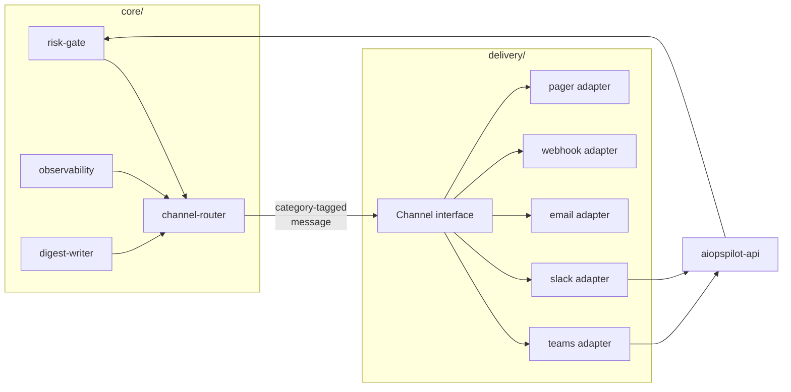

# Channels and Notifications

How AIOpsPilot talks to humans through **non-web-UI channels** - Teams, Slack, email,
webhooks, paging services, SMS. This file is authoritative for the **channel abstraction,
trust levels, category boundaries, routing policy, and channel-specific rules**. It
resolves the placeholder "notifier interface" hinted at in
[tech-stack.md](tech-stack.md) and consolidates the Alert Routing fragments from
[operating-and-verification.md](operating-and-verification.md#alert-routing) and the
Teams-specific flows in
[user-rbac-and-identity.md](user-rbac-and-identity.md#7-chatops-hil-flow).

Web-UI (the read-only console) is out of scope for this doc; the console's identity flow
lives in [user-rbac-and-identity.md](user-rbac-and-identity.md).

> **Direction scope.** This document covers **push** (system → human):
> notifications, alerts, and approval-card fan-out. The **pull** direction
> (human → system: conversational queries, tool calls, session-scoped
> approvals via the same channels) is documented in
> [operator-console.md](operator-console.md). Push and pull share channel
> credentials + routing config but ship as distinct adapters so send-only
> and receive-plus-send blast-radius stay separate.

> Customer-agnostic: every channel id, group name, and endpoint below is a **placeholder**.
> A fork supplies its own tenant, workspace, and endpoint values via config
> ([generic-scope.instructions.md](../../.github/instructions/generic-scope.instructions.md)).

## 1. Design Principles

1. **One abstraction, many adapters.** Core code never names Teams or Slack; it emits a
   category-tagged message and the router picks channels. New channels are additive.
2. **Categorize by purpose, not vendor.** A channel supports one or more of four
   categories (§3). Vendors are constrained by which categories they can safely serve.
3. **Trust-tiered.** Approval-category traffic (A1) MUST NOT flow through a channel that
   cannot verify the human's Entra identity end-to-end. A less-trusted channel MAY carry
   information but never decisions (§4).
4. **Choose the safer default when the outcome is uncertain.** If every configured channel for a category fails, the request
   queues and pages the operational lane - it never auto-executes. Fallback within a
   category preserves the trust tier (§6).
5. **Redaction is the sender's job.** No secret, credential, PII, subscription id, or raw
   customer payload leaves the trust boundary in a channel message. This applies to every
   category, not just approvals.

## 2. Where Channels Sit in the Architecture



- Adapters live under `delivery/chatops/<vendor>/` (see
  [project-structure.md](project-structure.md)). Each adapter implements the same
  `Channel` interface from `shared/providers/`.
- The **channel-router** is a thin core module: it takes a category and a message and
  picks channels per the fork's routing config (§6). It holds no vendor knowledge.
- **Approval callbacks from any adapter land at `aiopspilot-api`**, which re-validates
  the human's Entra identity ([user-rbac-and-identity.md](user-rbac-and-identity.md#102-api-token-validation))
  before acting. Adapters never authorize decisions themselves.

## 3. Categories (A1-A4)

Every channel message carries a **category tag** and must obey that category's rules.

| Category | Direction | Examples | Auth strength needed |
|----------|-----------|----------|----------------------|
| **A1 - HIL approval** | bidirectional (decision returned) | high-risk action approval, enforce-promotion approval, exemption approval, override approval | **highest** - verified Entra identity, action-bound, no replay |
| **A2 - Operational alert** | outbound only | SLO burn, DLQ depth, verifier failure rate, cold-start miss, IaC drift, adapter unhealthy, canary miss | low - informational |
| **A3 - Chat command** | bidirectional (query/response) | **read**: `/aw status`, `/aw shadow-report`, `/aw override list`, `/aw kill-switch status`. **write (draft-PR only)**: `/aw override draft`, `/aw exemption draft`, `/aw assignment param-tune` | medium - role-gated per command (see §3.1) |
| **A4 - Digest** | outbound only | daily shadow-accuracy report, weekly override retrospective, weekly enforce-promotion candidates, weekly governance PR aging, weekly exemption expiry lookahead, monthly KPI + cost roundup, break-glass usage summary | low - recipient scope only |

**Category boundaries (MUST)**

- **A1 approvals never carry the decision payload in the message.** The Adaptive Card /
  Block Kit / email body carries an **opaque `approval_id`**; the actual decision is
  posted back to `aiopspilot-api`, which re-authenticates and re-validates
  (`idempotency_key` + `action_hash`) so a leaked message is not a valid approval.
- **A3 write commands never mutate the live catalog directly** - they produce a draft
  PR the same way the console does (§6 in
  [user-rbac-and-identity.md](user-rbac-and-identity.md#6-identity-flow-console--draft-pr--audit)),
  carrying the invoker's Entra OID in the PR trailer. The PR then follows the standard
  quorum + no-self-approval rules.
- **A2/A4 messages never contain approval buttons or executable links.**

### 3.1 A3 command role gating

Each A3 command declares a **minimum role** and whether it is read or write. The bot
adapter enforces the check via the invoker's Entra OID (Teams SSO / Slack mapping) before
running the handler; a missing role responds with `403` in-channel and writes an audit
entry.

| Command | Type | Min role |
|---------|------|----------|
| `/aw status`, `/aw shadow-report`, `/aw kpi` | read | `Reader` |
| `/aw override list`, `/aw exemption list`, `/aw kill-switch status` | read | `Reader` |
| `/aw override draft`, `/aw exemption draft`, `/aw assignment param-tune` | write → draft PR | `Contributor` |
| `/aw kill-switch on`/`off` | write → draft PR + A1 approval | `Owner` |

## 4. Trust Levels (matrix)

A channel's *allowed categories* are the intersection of what it can technically deliver
and what its authentication can prove.

| Channel | Entra tenant | Auth path | Categories allowed |
|---------|--------------|-----------|--------------------|
| **Teams (same tenant)** | ✓ | Teams SSO → OBO exchange → `aiopspilot-api` token | **A1, A2, A3, A4** |
| **Teams (guest tenant)** | guest | OBO with guest OID | **A2, A3, A4** (A1 denied - same guest rule as [user-rbac-and-identity.md §10.5](user-rbac-and-identity.md#105-guest-entra-b2b-users)) |
| **Slack** | ✗ | Slack OAuth; **fork-mandatory** Slack userId ↔ Entra OID mapping; A1 approvals bounce through `aiopspilot-api` for Entra re-auth in the browser | **A1, A2, A3, A4** - A1 enabled in P1 (see §7 Slack notes) |
| **Email (SMTP / Graph)** | ✗ | send-only, no return channel | **A2, A4 only** - never A1 (magic-link approvals aren't supported) |
| **Generic webhook** | ✗ | HMAC-signed, timestamped, replay-guarded | **A2 only** |
| **PagerDuty / Opsgenie** | ✗ | API key, ack from mobile app | **A2 only** (operational lane paging) |
| **SMS** | ✗ | - | **A2 only** (minimal payload; break-glass reachability) |

**Rules that keep the matrix safe (MUST)**

- **Magic-link approvals aren't supported across every channel.** Approval always requires
  a re-authenticated round-trip through `aiopspilot-api`.
- **A1 fallback stays inside A1-capable channels.** A failed Teams A1 attempt never falls
  through to email; it falls to another A1-capable channel (Teams standby, or Slack when
  mapping is present) or to the HIL queue.
- **Slack A1 requires the userId↔OID mapping.** The adapter refuses to serve A1 traffic
  until the mapping provider returns a non-empty entry for the responding Slack user; a
  missing mapping is treated as "no approver" (fail-closed to HIL queue).

## 5. Channel Interface (contract)

The `Channel` interface lives in `shared/providers/` and is implemented per vendor under
`delivery/chatops/<vendor>/`. Core code depends only on this contract.

```typescript
type ChannelCategory = 'A1' | 'A2' | 'A3' | 'A4';
type TrustLevel = 'entra-native' | 'external-mapped' | 'send-only';

interface Channel {
  id: string;                            // "teams-hil-prd", "slack-ops-alerts"
  categories: ChannelCategory[];         // which categories this channel is allowed to serve
  trust_level: TrustLevel;

  // A2 / A4 (send-only) - every channel implements
  send(msg: NotificationMessage): Promise<DeliveryReceipt>;

  // A1 - implemented by approval-capable channels only
  awaitDecision?(req: ApprovalRequest, ttl: Duration): Promise<ApprovalOutcome>;

  // A3 - implemented by chat-command-capable channels only
  registerCommand?(cmd: ChatCommandSpec, handler: CommandHandler): void;
}

interface NotificationMessage {
  category: ChannelCategory;
  correlation_id: string;                // §7 in user-rbac-and-identity.md
  audit_id?: string;
  title: string;
  body_markdown: string;                 // pre-redacted; adapter re-scans for known-secret patterns
  links: { label: string; url: string }[];    // links only - no inline action buttons for A2/A4
  severity?: 'info' | 'warn' | 'error' | 'critical';
}

interface ApprovalRequest {
  category: 'A1';
  correlation_id: string;
  approval_id: string;                   // opaque; the decision endpoint is what actually authorizes
  action_hash: string;                   // binds the approval to a specific pending action
  idempotency_key: string;
  ttl: Duration;                         // fail-closed on expiry
}
```

- **Adapters MUST NOT authorize the decision themselves.** `awaitDecision` returns
  whatever the user clicks; the core router hands that raw click to `aiopspilot-api`,
  which is the sole authority (identity re-verify, replay check, no-self-approval).
- **Adapters MUST re-scan the message body** for known secret patterns (same regex set
  used by the CI secret scanner) before dispatching, as a last-line defense.
- **Adapters MUST implement idempotent `send`**: a re-issued send with the same
  `correlation_id + audit_id + category` MUST NOT create a duplicate post.

### 5.1 Audience Derivation (channel-as-audience)

Recipient lists are **not** derived per-user by the router. Each channel *is* an audience,
and membership is managed **outside** the control plane - typically by binding the channel
to an Entra security group.

- **Default (Option A)**: a Teams channel/DL is created as a **group-connected team**
  backed by an `aw-*` Entra security group. Membership syncs automatically from Entra
  ("Owner adds a person to `aw-approvers` in the Portal" → they immediately see the next
  digest and every A1/A2/A3 post). This keeps administration in one surface
  ([user-rbac-and-identity.md §4.2](user-rbac-and-identity.md#42-security-groups-slots)).
- **In-message `@mentions`** call out artifact-owners inside a channel post (e.g. the
  requester of an expiring exemption). Mentions are derived from artifact metadata
  (`requested_by`, PR author, rule author) already carried in the audit stream - no Graph
  lookup at digest time.
- **Role-derived direct messaging** is used **only** for break-glass usage summary
  (small, time-critical audience where a channel post is not enough). Every other A4
  digest is channel-only.

Allowed audience modes for a digest entry:

| Mode | Meaning | Where allowed |
|------|---------|---------------|
| `channel: <id>` | post to a channel/DL; membership managed via Entra group binding | A2, A3, A4 (default) |
| `mention-artifact-owner` | additive: `@mention` the artifact's owner inside a channel post | A4 (opt-in per digest) |
| `role-dm: <RoleName>` | Graph-lookup members of `aw-<role>`, DM each | A4 **only for break-glass** (deny-listed elsewhere at config load) |

## 6. Routing Policy (config-driven)

Routing is declarative config, evaluated by the channel-router. Adding, replacing, or
reordering channels is a config change, never a code change.

**Config location**: the routing config lives in the **catalog-as-code repo** alongside
rules, assignments, exemptions, and overrides (path: `rule-catalog/channel-routing/`). It
inherits the same CODEOWNERS / signed-commit / no-direct-push protections; a routing
change is reviewed like a governance change. Owner-tier reviewers are required on any
change touching A1 routing.

```yaml
channel_routing:
  hil_approval:                    # category A1
    primary:   teams-hil-prd
    fallback:  [teams-hil-standby, slack-hil-prd]   # A1 fallback MUST be A1-capable
    on_all_fail: queue_and_page_ops                 # never auto-execute
    ttl: 30m                                        # then fail-closed → HIL queue + A2 alert

  operational_alerts:              # category A2
    primary:   teams-ops-prd
    fallback:  [pagerduty-primary, email-oncall]
    dedupe_window: 10m                              # via observability correlation

  chat_commands:                   # category A3
    channels:
      - teams-hil-prd
      - slack-hil-prd
    # role check is per-command (§3.1); the router does not re-implement it

  digests:                         # category A4 - seven default digests
    shadow_accuracy_daily:
      cron: "0 9 * * *"
      audience:
        - channel: teams-hil-prd
        - channel: email-governance
    enforce_promotion_candidates_weekly:
      cron: "0 9 * * MON"
      audience:
        - channel: teams-hil-prd
        - channel: email-governance
        - mention-artifact-owner: rule_author
    override_retrospective_weekly:
      cron: "0 9 * * MON"
      audience:
        - channel: teams-hil-prd
        - channel: email-governance
        - mention-artifact-owner: override_requester
    governance_pr_aging_weekly:
      cron: "0 9 * * MON"
      audience:
        - channel: teams-hil-prd
        - mention-artifact-owner: pr_author_and_reviewers
    exemption_expiry_lookahead_weekly:
      cron: "0 9 * * MON"
      audience:
        - channel: teams-hil-prd
        - channel: email-governance
        - mention-artifact-owner: exemption_requester
    kpi_and_cost_monthly:
      cron: "0 9 1 * *"
      audience:
        - channel: email-governance                # Owners-backed DL
        - channel: teams-hil-prd
        - github-issue: kpi-monthly-archive        # append-only archive in the repo
    break_glass_usage_summary:
      trigger: on-event-and-weekly                 # immediate on every BG sign-in + Monday rollup
      audience:
        - channel: teams-break-glass
        - role-dm: Owner                           # the only allowed role-dm audience
```

**Router rules (MUST)**

- **Category ⊆ channel.categories** - the router refuses to send a message to a channel
  whose declared categories do not include the message's category. Startup config
  validation rejects a routing entry that pairs a channel with a disallowed category
  (deny-by-default; fail fast).
- **Trust preservation on fallback** - A1 primary → A1 fallback only. Downgrading to a
  lower trust level on fallback is a config-load error.
- **`role-dm` is deny-listed except for `break_glass_usage_summary`.** Any other digest
  attempting `role-dm` fails at config load.
- **Digests declaring `mention-artifact-owner` MUST specify a valid metadata field**
  (`rule_author`, `override_requester`, `exemption_requester`, `pr_author_and_reviewers`);
  unknown values fail at config load.
- **Bounded retries** - each adapter declares its own retry budget; router escalates to
  the next channel or to `on_all_fail` on exhaustion.
- **TTL fail-closed** - an A1 request with no decision by TTL is a no-op + A2 alert +
  audit entry ([security-and-identity.md](security-and-identity.md#hil-approval-integrity)).

## 7. Channel-Specific Notes

| Channel | Notes |
|---------|-------|
| **Teams** | Adaptive Cards for A1; keep the OAuth scope set minimal (`ChannelMessage.Send.Group` + bot signaling). SSO + OBO already covered in [user-rbac-and-identity.md §10.4](user-rbac-and-identity.md#104-chatops-teams-sign-in). Digest audience is a **group-connected team backed by an `aw-*` Entra security group** so membership follows Entra without a separate list. |
| **Slack** | Block Kit for A2/A3; the approval callback URL redirects through `aiopspilot-api` so Entra re-auth happens in the browser, not inside Slack. `chat:write` scope only. Fork MUST supply the userId↔OID mapping store; the adapter refuses A1 traffic when a Slack user has no mapped Entra OID. Slack channel membership is administered in Slack; keep it in sync with the corresponding `aw-*` group manually or via SCIM. |
| **Email** | Send-only. Never include an approval link; digest and alert only. Sender identity is a Graph API mailbox scoped to the notification role. Redaction is mandatory - no correlation payload beyond `audit_id` and dashboard URL. Recommended DL: an **Entra dynamic distribution group** mirroring `aw-approvers` / `aw-owners`. |
| **Generic webhook** | HMAC-SHA256 signature, monotonic timestamp, single-use nonce. Receiver failures never block; core retries per adapter policy and moves on. |
| **PagerDuty / Opsgenie** | Deduplication key = the observability correlation id so a burst collapses. Runbook URL is required in every alert. |
| **SMS** | Payload restricted to `<severity> <audit_id> <short-url-to-runbook>`. No secrets, no customer names, no free-form text. Break-glass reachability primarily. |

## 8. Fallback and Kill-Switch Interaction

- The **global kill-switch** halts every A1 dispatch immediately and re-queues open A1
  requests; kill-switch state itself is announced via A2 on every operational channel.
- If **all A2 channels are down**, adapter health telemetry still lands in observability
  and appears in the console; the kill-switch remains operable through its dedicated
  break-glass path ([security-and-identity.md](security-and-identity.md#rate-limiting-and-kill-switch-dos-and-containment)).
- Adapter unhealth is itself an A2 signal - a Teams outage that stops A1 delivery pages
  the operational lane through the fallback channel.

## 9. Fork vs Upstream Split

| Item | Upstream (this repo) | Fork |
|------|----------------------|------|
| `Channel` interface + `NotificationMessage` / `ApprovalRequest` types | ✓ | - |
| Teams adapter (default A1 + A2 + A3 + A4 impl) | ✓ | tenant / group-connected team binding |
| **Slack adapter with A1 enabled by default (P1)** | ✓ | workspace credentials + userId↔OID mapping (required) |
| Email / Webhook / Pager / SMS adapters | ✓ (skeletons) | credentials + enablement |
| Routing-config schema + startup validation | ✓ | actual routing values in `rule-catalog/channel-routing/` |
| Seven default digests + audience derivation rules | ✓ | cron timezone, channel ids, on/off per digest |
| Secret-scan regex set (reused by adapters) | ✓ | extend patterns if needed |
| Slack userId ↔ Entra OID mapping **interface** | ✓ | mapping data (mandatory for P1 A1) |
| Digest content templates | ✓ (generic) | branding / localization |

## 10. Open Decisions

- [ ] Adapter-health alert thresholds and dedupe windows.
- [ ] Which vendors' incoming webhooks (if any) may open incidents into AIOpsPilot -
      today only observability opens A2 traffic; external webhooks in are separate scope.
- [ ] The `mention-artifact-owner` behavior when the artifact owner is a **guest** user
      (mention still resolves in Teams, but should the digest suppress or route
      differently to reduce information leakage?).
- [ ] `kpi_and_cost_monthly` GitHub-Issue archive: destination repo/path (defaults to the
      catalog-as-code repo, `docs/kpi-archive/`).
