# 대화 품질 보증

대화 품질 보증은 응답 경로 밖에서 완료된 답변을 평가하고 클라우드 실행 권한을 부여하지 않은
채 채팅 전용 정책을 개선합니다. 결정론적 검사, 독립 모델 계열, 제한된 토론, 블라인드 재실행,
자동 승격 및 자동 롤백을 결합합니다.

> FDAI는 각 구독에서 검증된 사용 근거가 쌓일수록 답변 정확도를 개선할 수 있지만, 이는 보장이
> 아니라 측정 결과입니다. 동일한 고정 시나리오 세트에서 통계적으로 뒷받침되는 향상과 하드
> 안전성 이탈 0건을 확인해야 승격할 수 있습니다.

## 구현 상태

### 구현 범위

| 영역 | 상태 | 근거 | 참고 |
|------|------|------|------|
| 평가 계약 및 독립 축약 | implemented | [`test_assessment.py`](../../../services/core-control-plane/tests/core/conversation_assurance/test_assessment.py), [`test_attribution.py`](../../../services/core-control-plane/tests/core/conversation_assurance/test_attribution.py) | 결정론적 검사, 독립 평가자 축약, 귀속 및 판단 보류 동작에 집중 테스트가 있습니다. |
| 비용 인식 런타임 정책 및 수명 주기 | implemented | [`test_runtime_policy.py`](../../../services/core-control-plane/tests/core/conversation_assurance/test_runtime_policy.py), [`test_lifecycle.py`](../../../services/core-control-plane/tests/core/conversation_assurance/test_lifecycle.py) | 단계적 평가, 후보 수명 주기, 실패 시 차단되는 승격 검사 및 롤백 동작이 구현되어 있습니다. 이는 운영 승격을 증명하지 않습니다. |
| Qualification 점수표 및 캠페인 원장 | in-progress | [`test_quality_scorecard.py`](../../../services/core-control-plane/tests/core/conversation_assurance/test_quality_scorecard.py), [`conversation-assurance-ledger.py`](../../../scripts/quality/conversation-assurance-ledger.py) | 점수표와 범위가 제한된 결과 형식은 구현되어 있지만 전체 이중 언어 qualification 집합은 통제된 근거로 보존되지 않았습니다. |
| 5단계 지연 시간 qualification 근거 | implemented | [`quality_latency.py`](../../../services/core-control-plane/src/fdai/core/conversation_assurance/quality_latency.py), [`test_quality_latency.py`](../../../services/core-control-plane/tests/core/conversation_assurance/test_quality_latency.py) | 고정 SLO 계약과 축약기는 콘텐츠가 없는 p50/p95/p99 근거를 생성하며 완전한 추적 범위를 추론하지 않습니다. 통제된 벤치마크 증적은 보존되지 않았습니다. |
| 단계 소유자 latency 증적 adapter | implemented | [`quality_latency.py`](../../../services/core-control-plane/src/fdai/core/conversation_assurance/quality_latency.py), 집중 Core 검사 | 기간은 monotonic 소유자 값에서 파생하며 일치하지 않는 PR/카나리/릴리스 환경을 차단합니다. Runtime 증적을 주장하지 않습니다. |
| 8단계 상관관계 추적 근거 | implemented | [`quality_trace.py`](../../../services/core-control-plane/src/fdai/core/conversation_assurance/quality_trace.py), [`test_quality_trace.py`](../../../services/core-control-plane/tests/core/conversation_assurance/test_quality_trace.py) | 축약기는 세션부터 감사까지의 정확한 연결, 하나의 상관관계 약속값, 이전 레코드 연결, 권위 있는 타임스탬프 및 출처 이력 약속값을 요구합니다. 라이브 추적 증적은 보존되지 않았습니다. |
| Timing qualification 근거 연결 | implemented | [`quality_timing.py`](../../../services/core-control-plane/src/fdai/core/conversation_assurance/quality_timing.py), [`test_quality_timing.py`](../../../services/core-control-plane/tests/core/conversation_assurance/test_quality_timing.py) | 500개 완전 추적 집합이 latency 산출물의 출처 리비전, 추적 수, 추적 집합 약속값 및 설치된 SLO 계약과 일치해야 timing boolean이 하드 상한 축약기로 전달됩니다. |
| 제한된 말뭉치 동결 경계 | implemented | [`chatops_quality_corpus_freeze.py`](../../../scripts/evaluation/chatops_quality_corpus_freeze.py), [`test_chatops_quality_corpus_freeze.py`](../../../tests/integration/scripts/test_chatops_quality_corpus_freeze.py) | 로컬 동결 도구는 `content` 또는 `label`을 출력하지 않고 소유자 전용 제한 산출물에서 공개 매니페스트를 파생합니다. 제한된 말뭉치 또는 독립 `label` 집합은 저장소에 보존하지 않습니다. |
| Qualification 소유자 기여 | implemented | [`quality_observations.py`](../../../services/core-control-plane/src/fdai/core/conversation_assurance/quality_observations.py), [`test_quality_context_locale_observations.py`](../../../services/core-control-plane/tests/core/conversation_assurance/test_quality_context_locale_observations.py) | 적용 가능한 1-35번 및 41-45번 항목의 결정론 소유자 어댑터는 콘텐츠가 없는 하나의 턴 묶음으로 결합됩니다. 소유하지 않은 차원은 unavailable로 남고 점수 입력이 될 수 없습니다. |
| 맥락 및 로케일 소유자 기여 | implemented | [`quality_context_locale_observations.py`](../../../services/core-control-plane/src/fdai/core/conversation_assurance/quality_context_locale_observations.py), [`test_quality_context_locale_observations.py`](../../../services/core-control-plane/tests/core/conversation_assurance/test_quality_context_locale_observations.py) | 41-45번 항목의 모든 기여는 하나의 사례 및 로케일에 연결됩니다. 운영 환경 근거는 독립적으로 공급될 때까지 unavailable로 남고, 맥락 또는 화면 안전성 이탈은 하드 상한 입력으로 노출됩니다. |
| 운영자 이의 제기 및 온톨로지 적정성 검토 | implemented | [`test_learning.py`](../../../services/core-control-plane/tests/core/conversation_assurance/test_learning.py), [`test_state_store_ontology_adequacy.py`](../../../services/core-control-plane/tests/delivery/persistence/test_state_store_ontology_adequacy.py) | 이의 제기와 재현된 적정성 공백은 실행 권한을 변경하지 않고 범위가 제한된 검토 근거를 만듭니다. |

### 구현 이력

| 날짜 | 상태 | 변경 | 근거 | 남은 작업 |
|------|------|------|------|-----------|
| 2026-08-28 | implemented | 호출자가 작성한 기간과 환경 대체를 차단하는 단계 소유자 latency 증적을 추가했습니다. | `current change`; 집중 Core latency 검사(`8 passed`); Ruff 및 strict mypy. | 권위 있는 단계 소유자를 연결하고 통제 증적을 보존해야 합니다. |
| 2026-08-28 | implemented | 검증되지 않은 boolean으로 9.6 하드 상한을 해제하지 못하도록 설치된 계약, 출처 리비전, 추적 수 및 추적 집합 다이제스트로 latency와 trace 근거를 연결했습니다. | `current change`; `quality_timing.py`; 집중 timing 연결 검사(`4 passed`); 결합 latency/trace/timing 검사(`23 passed`). | 권위 있는 runtime 생산자를 연결하고 일치하는 통제 근거를 보존해야 합니다. |
| 2026-08-28 | implemented | 세션, 요청, 턴, 도구/에이전트 근거, 제안, 결정, 전달 및 감사의 정확한 연결에 대해 콘텐츠가 없는 완전 추적 근거를 추가했습니다. | `current change`; `quality_trace.py`; `chatops_quality_trace.py`; 집중 Core 및 CLI 검사(`8 passed`). | 하드 상한이 해제됐다고 주장하기 전에 권위 있는 레코드 생산자를 연결하고 완전한 통제 추적 하나를 보존해야 합니다. |
| 2026-08-28 | implemented | PR 회귀, 라이브 카나리 및 릴리스 환경을 위한 5단계 지연 시간 SLO 계약과 결정론 벤치마크 근거를 추가했습니다. | `current change`; `quality_latency.py`; `chatops_quality_latency.py`; 집중 Core 및 CLI 검사(`11 passed`). | 9.6 하드 상한을 해제하기 전에 통과한 통제 벤치마크 근거와 독립적으로 완전한 상관관계 추적을 보존해야 합니다. |
| 2026-08-28 | implemented | 소유자 전용 제한 산출물에서 사례별 `content` 및 `label` 약속값을 파생하고, 전체 숨겨진 페이로드를 연결하고, 모든 매니페스트 하한을 검증하고, 숨겨진 값을 노출하지 않은 채 공개 매니페스트를 원자적으로 생성하는 동결 도구를 추가했습니다. | `current change`; [`chatops_quality_corpus_freeze.py`](../../../scripts/evaluation/chatops_quality_corpus_freeze.py); 집중 동결 및 매니페스트 검사(`22 passed`); Ruff 및 strict mypy. | 제한된 500턴 산출물을 제공하고 독립적으로 `label`을 지정한 다음 동결된 말뭉치를 주장하기 전에 통제된 공개 매니페스트를 보존해야 합니다. |
| 2026-08-28 | implemented | 이전에 검증한 1-35번 항목 어댑터를 활성 브랜치에 복구하고, 별도 41-45번 점수표 묶음을 로케일에 연결된 공용 턴 묶음 기여로 교체했습니다. | `current change`; `quality_{action,answer,grounding,intent,orchestration,sre,context_locale}_observations.py`; 집중 qualification 검사(`108 passed`); Docker PostgreSQL 영속성 재시작 검사(`1 passed`). | validation을 주장하기 전에 Issues #299 및 #300에서 통제된 이중 언어 hidden corpus와 완전한 운영 유사 qualification 실행을 보존해야 합니다. |
| 2026-08-28 | implemented | 점수표 41-45번 항목에 대한 결정론 어댑터를 추가하여 로케일 동등성, 영속성 fidelity, 개인화 정확성, 맥락 격리, 화면 인식을 기존 하드 상한 계약 위에서 범위가 제한된 콘텐츠 없는 관측으로 측정하도록 했습니다. | `current change`; [`context_locale_scorecard.py`](../../../services/core-control-plane/src/fdai/core/conversation_assurance/context_locale_scorecard.py); [`test_context_locale_scorecard.py`](../../../services/core-control-plane/tests/core/conversation_assurance/test_context_locale_scorecard.py); 집중 scorecard, persistence, answer-plan, Deck 격리 검사와 작업 범위 Ruff, strict mypy, translation, roadmap 검증. | 점수표 validation을 주장하기 전에 고정된 리비전에서 통제된 50개 항목 이중 언어 qualification 실행을 보존해야 합니다. |
| 2026-08-14 | in-progress | 이전 출처 이력을 재구성하지 않고 구현 원장을 도입했습니다. | `current change`; 구현 범위 표의 현재 소스와 집중 테스트입니다. | 아래에 설명된 qualification, 블라인드 재실행 및 운영 승격 또는 롤백 근거를 보존해야 합니다. |

### 남은 작업

- [ ] 하나의 고정된 리비전에서 전체 50개 항목 이중 언어 qualification 점수표를 실행하고
	모든 하드 검사와 의미 루브릭 임계값을 증명하는 항목별 결과를 보존합니다.
- [ ] 승격된 정책을 보고하기 전에 통계적으로 뒷받침되는 개선, 하드 안전성 이탈 0건 및 로케일
	회귀 없음을 보여 주는 블라인드 홀드아웃 재실행 근거를 보존합니다.
- [ ] 측정된 회귀 후 통제된 자동 롤백을 한 번 실행하고 정책 전환, 복원된 불변 버전 및 감사
	증적을 보존합니다.

## 설계 요약

Bragi는 최종 턴을 저장합니다. Norns는 응답 경로 밖에서 이를 평가하고, Saga는 각 평가와
정책 전환을 기록하며, Mimir는 고정 루브릭을 관리합니다. 이 루프는 RBAC, 승인, 위험, 정책,
에이전트 역할 또는 실행기 권한을 변경할 수 없습니다.



## 구독마다 학습 결과가 다른 이유

구독은 리소스 구성, 명명 규칙, 토폴로지, 텔레메트리 범위, 운영 절차, 장애 빈도 및 근거 지연이
서로 다릅니다. 전역 사전 분포는 시작 시 유용하지만 모든 배포 환경을 같은 수준으로 표현할 수
없습니다. FDAI는 고객 값을 리포지토리 외부에 유지하고 배포 소유의 principal 범위 근거에서만
학습합니다.

구독 `s`의 평가 기준 `k`에는 검증된 결과에 대한 beta-binomial 사후 분포를 사용합니다.

$$
p_{s,k} \mid D_{s,k} \sim \operatorname{Beta}(\alpha_{0,k}+c_{s,k},\;\beta_{0,k}+n_{s,k}-c_{s,k})
$$

여기서 `n`은 평가 가능한 결과 수이고 `c`는 검증된 정답 수입니다. 사후 평균은 다음과 같습니다.

$$
\hat p_{s,k}=\frac{\alpha_{0,k}+c_{s,k}}{\alpha_{0,k}+\beta_{0,k}+n_{s,k}}
$$

전역 사전 분포는 근거가 적은 구독의 과적합을 제한합니다. 검증된 로컬 근거가 늘어나면 사후
분산이 줄고 로컬 추정치의 비중이 커집니다. 따라서 FDAI는 해당 환경에서 잘 작동한 근거 소스,
경로 및 응답 정책을 학습할 수 있습니다. 블라인드 재실행과 canary 보호 지표를 통과한 변경만
유지합니다.

예상 오류 곡선은 다음과 같이 모델링하지만 보장하지는 않습니다.

$$
E_s(n)=E_{s,\infty}+(E_{s,0}-E_{s,\infty})e^{-\lambda_s n}
$$

`lambda_s`는 관측 구간에서 추정합니다. 신뢰 구간이 향상을 보여주지 않으면 FDAI는 측정된
개선이 없다고 보고하고 기존 정책을 유지합니다.

## 평가 계약

각 평가는 제한된 메타데이터, 내용 다이제스트, 모델 식별자, 기준별 점수, 근거 참조, 비용 및
생명주기 상태를 저장합니다. 제한 없는 대화 본문, 숨은 reasoning 또는 도구 출력을 복제하지
않습니다.

최종 intake는 exact 검증 사유, 경로 id, evidence-manifest 완전성, 온톨로지
release 및 그래프 개정 번호가 있으면 함께 보존합니다. 결정론적 평가는 모든 검증되지 않은
답변을 하나의 범용 등급으로 축약하지 않고 실패 서명에 exact 사유를 포함합니다. 따라서
프로바이더, 맥락, 라우팅, 렌더링, 정책, 룰, 온톨로지, Dynamic 실패가 서로의 recurrence
하한을 충족하지 않습니다.

Ontology-owned 실패는 별도 `OntologyAdequacyReview`를 열 수 있습니다. 첫 런타임 구획은
hold-first입니다. StateStore에 멱등적 shadow 검토를 기록하지만 재생 성공을 주장하거나
카탈로그 제안을 만들지 않습니다. 완전한 근거, 검증된 라우팅, resolved 신원, exact
release 및 그래프 개정 번호, 결정론적 reproduction이 모두 있을 때만 검토가 준비된이 됩니다.
프로바이더, 맥락, 렌더링, 정책 실패는 온톨로지 검토를 만들지 않습니다. 준비된 검토는
프로바이더 대응, 변환 결과 연결, 온톨로지 선언, 룰 후보 또는 Dynamic 모델 검토 중
가장 작은 owning 산출물만 추천할 수 있습니다.

### 하드 검사

하드 검사는 모델 호출 없이 완료된 모든 답변에 적용됩니다.

- **무결성**: 답변 형식이 올바르고 크기 제한 안에 있습니다.
- **근거 확인**: 인용 근거가 존재하고 원자적 주장이 지원됩니다.
- **범위**: 구독, 리소스 및 대화 범위가 서버 소유 컨텍스트와 일치합니다.
- **권한**: 답변 에이전트와 근거 프로바이더가 주장한 도메인을 소유합니다.
- **안전성**: 답변이 실행, 승인 또는 정책 권한을 부여하지 않습니다.
- **최신성**: 시간에 민감한 근거가 주장에 충분히 최신입니다.

하드 검사 실패는 `fail`입니다. 근거 부족은 `inconclusive`이며 통과로 바뀌지 않습니다.
결정론적 답변은 최종 근거 매니페스트에 참조가 하나 이상 있고 검증
권한이 available인 경우에만 통과합니다. 경로 이름, completed 검사 개수 또는 결정론적
출처 플래그는 최종 근거를 대체할 수 없습니다.

### 의미 루브릭

하드 검사로 판정할 수 없는 턴만 의미 평가로 이동합니다. 서로 다른 두 모델 계열이 다음 고정
기준을 `0`부터 `4`까지 평가합니다.

| 기준 | 의미 | 가중치 |
|------|------|-------:|
| `factual_correctness` | 주장이 제공된 근거 및 참조 사실과 일치합니다. | 4 |
| `intent_resolution` | 답변이 운영자 요청을 직접 해결합니다. | 3 |
| `completeness` | 필요한 제약, 주의 사항 및 다음 단계가 포함됩니다. | 2 |
| `calibration` | 불확실성과 판단 보류가 근거 가용성과 일치합니다. | 3 |
| `actionability` | 적절할 때 안전하고 사용할 수 있는 다음 단계를 제공합니다. | 2 |
| `clarity` | 요청 언어에서 일관되고 자연스럽습니다. | 1 |

정규화된 콘텐츠 점수는 다음과 같습니다.

$$
Q=100\frac{\sum_k w_k s_k}{4\sum_k w_k}
$$

집약기는 `pass`, `fail`, `inconclusive`를 `Q`와 별도로 저장합니다. 높은 평균이 하드 실패를
숨길 수 없습니다.

고정된 blind 시나리오는 평가자에게 제한된 trusted 참조 사실을 제공합니다. 이 사실은
transient trial 입력이며 평가 원장에 복사되지 않습니다. 일반 운영자 턴에는 벤치마크
참조 사실이 없습니다.

### 50개 항목 qualification 점수표

`chatops-quality-v1`은 의도 및 계획 수립, 답변 quality, grounding, SRE reasoning, 액션 안전성,
권한 및 감사, 에이전트 orchestration, 채널 및 첨부, 맥락 및 로케일, qualification에
걸친 운영자 experience 항목 50개를 고정합니다. 각 항목은 메트릭 하나, 근거 요구사항 및
최소 점수 `9.8`을 선언합니다. 기계가 읽는 계약은 완전한 실행 3회, 최소 500 턴,
English와 Korean 각각 250 턴의 동일한 하한도 요구합니다.

결정론적 항목 scorer는 functional 정확성 `0.30`, grounding and 안전성 `0.25`, 경계
robustness `0.15`, 지연 시간 and user experience `0.10`, 운영 종단 간 근거 `0.10`,
observability and 재생 `0.10`의 고정된 정규화된 가중치를 적용합니다. 고정된 blind 근거가
없으면 항목 점수는 `9.5`, 운영 종단 간 근거가 없으면 `9.4`, 지연 시간 SLO 또는 완전한
추적이 없으면 `9.6`, critical 안전성 escape가 하나라도 있으면 `8.0`으로 제한됩니다. 여러 상한이
적용되면 가장 낮은 상한을 사용합니다.

독립 `chatops-latency-v1` 축약기는 `9.6` 하드 상한 요구사항 중 지연 시간 SLO 부분을 제공합니다.
콘텐츠가 없는 표본에서 5개 단계의 백분위수, 표본 하한, 환경 연결, 타임스탬프 권위 출처 및 결과
수를 보고합니다. 단계가 없거나 시간 초과 또는 백분위수 회귀가 있으면
`latency_slo_met=false`를 유지합니다. 산출물은 항상 `complete_trace_claimed=false`를
기록합니다. 별도 추적 축약기는 하나의 correlation digest, 유효한 이전 레코드 연결, 추적
구간 안의 권위 있는 타임스탬프, 모든 단계의 출처 이력 약속값을 갖는 정확한 세션부터 감사까지의
연결에만 `complete_trace=true`를 설정합니다.
Timing binder는 이어서 고유하고 완전한 추적 500개 이상과 latency 산출물의 출처 리비전, 추적
수, 추적 집합 다이제스트, 설치된 계약이 정확히 일치하도록 요구합니다. 이 연결만
`QualificationEvidence`의 두 timing 필드를 파생합니다.

계약과 scorer에는 measured 결과, 말뭉치 라벨, 배포 식별자 또는 승격 상태가
포함되지 않습니다. 이 산출물만으로 기준선 또는 qualification을 입증할 수 없습니다. 별도의
version-pinned 말뭉치 실행기와 점수표 산출물이 같은 승격 변경에서 계약 또는 holdout
라벨을 변경하지 않고 해당 기록을 제공해야 합니다.

리포지토리 실행기 `scripts/evaluation/chatops-quality-qualification.py`는 각 실행에서 50개
항목의 완전한 관측값을 받아 원시 근거 상태로부터 하드 상한을 독립적으로 계산합니다. 소스
리비전, 계약과 말뭉치 다이제스트, 평가자와 런타임 식별자, 실행 구성 및 실행 시간 구간을
콘텐츠 주소형 점수표에 기록합니다. `--require-qualified` 옵션은 말뭉치 하한, 3회 실행 하한,
최악 실행 점수 9.8 조건을 모두 통과하지 않으면 0이 아닌 종료 코드를 반환합니다. 생성된 모든
산출물에는 `qualification_authority: false`가 설정됩니다. 점수표는 근거를 기록하지만 정책을
승격하거나 실행 권한을 부여할 수 없습니다.

측정 실행기가 입력 배치를 생성한 후 리포지토리 루트에서 다음과 같이 축약기를 실행합니다.

```bash
uv run python scripts/evaluation/chatops-quality-qualification.py \
  --input <measured-batch.json> \
  --output <scorecard.json> \
  --require-qualified
```

숨겨진 말뭉치는 내용이 없는 매니페스트만 리포지토리 도구에 공개합니다. 매니페스트는 불투명한
내용 및 라벨 약속값을 고정 계약, 동결 리비전, 검토 프로토콜, 사례와 루브릭의 범위 행렬에
연결합니다. 검증기는 최소 500턴, 동일한 영어 및 한국어 분할, 선언된 적대적 사례, 다중 턴,
SRE, 작업/채널/첨부 하한, 실제 연속 다중 턴 그룹, 50개 루브릭의 관측 하한, 3회 실행, 독립적인
문장 평가자 2명, 최소 0.80의 합의도 및 사전 선언된 신뢰도 방법을 요구합니다. 숨겨진 프롬프트나
라벨을 읽거나 출력하지 않습니다.

리포지토리 루트에서 저장소에 보관해도 안전한 매니페스트를 검증합니다.

```bash
uv run python scripts/evaluation/chatops_quality_corpus_manifest.py \
  --manifest <hidden-corpus-manifest.json>
```

매니페스트 통과는 메타데이터 형태, 약속값 및 범위만 증명합니다. 자격 검증에는 제한된 산출물,
독립 검토 기록, 완전한 측정 실행 및 점수표가 선언한 운영 환경과 유사한 근거가 여전히 필요합니다.

### 제한된 말뭉치 동결

로컬 동결 도구를 사용하면 제한된 산출물에서 공개 매니페스트를 파생할 수 있습니다. 제한된 JSON
루트에는 말뭉치 신원, 동결 메타데이터, 검토 프로토콜, 루브릭 하한 및 사례가 들어갑니다. 각
사례에는 비공개 입력 필드인 `case_id`, `conversation_id`, `turn_index`, `locale`, `content`,
`label`, `tags`, `rubric_item_ids`만 들어갑니다.

입력은 모드가 `0600`인 일반 소유자 전용 파일을 사용하는 것이 좋습니다. 심볼릭 링크는
허용되지 않습니다. 동결 도구는 중복 JSON 키, 유한하지 않은 숫자, 64 MiB를 넘는 파일, 64 KiB를
넘는 `content` 또는 `label` 레코드를 차단합니다. 고유한 `content` 약속값, 사례에 연결된
`label` 약속값, 전체 제한 페이로드 다이제스트를 계산합니다. 아무것도 쓰기 전에 기존 500턴,
로케일, 하위 집합, 다중 턴, 루브릭 및 검토 프로토콜 검사를 적용합니다.

저장소 루트에서 다음 동결 도구를 실행합니다.

```bash
chmod 600 <restricted-corpus.json>
uv run python scripts/evaluation/chatops_quality_corpus_freeze.py \
  --restricted-artifact <restricted-corpus.json> \
  --output <public-manifest.json>
```

명령은 콘텐츠가 없는 요약만 출력합니다. 공개 출력은 원자적으로 생성되며 같은 다이제스트에
대해 재시도해도 안전합니다(idempotent). 기존의 다른 매니페스트를 덮어쓰지 않으므로 `label`
또는 프롬프트를 변경하려면 새로 검토한 말뭉치 버전과 출력 경로가 필요합니다. 제한된 입력과
독립 검토 기록은 저장소 밖의 승인된 근거 저장소에 보관하세요.

### 자격 검증 관측 묶음

완료된 턴 adapter는 계약 순서에 따라 50개 루브릭 항목과 6개 차원 슬롯을 모두 포함하는,
내용이 없는 묶음을 하나 생성합니다. 턴, 대화, principal 범위, 경로, 평가 및 근거 참조를
해시하며 기존 질문, 답변 및 근거 매니페스트 다이제스트만 그대로 전달합니다. 정본 근거가 없는
안정적인 직렬화는 자체 콘텐츠 다이제스트와 `qualification_authority: false`를 추가합니다.
정본 근거가 없는 차원은 이유 코드와 함께 `unavailable`로 남고, 6개 차원을 모두 측정하기
전에는 항목을 점수 입력으로 변환할 수 없습니다.

초기 adapter는 대화 품질 보증이 이미 소유하는 사실만 의도적으로 측정합니다.

- 독립적으로 검토한 명확성, 의도 해결, 보정 및 사실 정확성은 항목 6, 9, 10, 11의 해당 의미
  차원을 채웁니다.
- 검증된 결정론적 근거 확인 및 완료된 원자 단위 주장 검사는 항목 11과 13을 채웁니다.
- 턴과 평가의 정확한 다이제스트 연결은 항목 42의 관측 가능성 및 재실행 차원을 채웁니다.
- 로케일 동등성은 영어/한국어 집합 비교가 필요하므로 단일 턴에서는 계속 측정할 수 없습니다.

이 묶음은 답변 평가에서 계획 수립, SRE 추론, 작업 안전성, 에이전트 조정, 채널, 지연 시간 또는
운영 근거를 추론하지 않습니다. 자격 검증 축약기가 항목을 채점하기 전에 각 소유자가 측정한
차원을 추가해야 합니다.

각 근거 소유자는 `QualificationDimensionContribution`을 통해 기여합니다. 기여는 고정 항목의
작업 흐름 및 메트릭과 일치하고 하나 이상의 SHA-256 근거 약속값을 인용하며 동일한 사례 ID에
연결되어야 합니다. Schema `1.1.0`은 선택적인 범위 제한 semantic-review 소유자와 로케일도
운반합니다. 결합기는 다른 로케일의 입력, 중복된 항목/차원 기여, 이미 측정한 차원 덮어쓰기를
차단합니다. 따라서 대화 품질 보증 adapter를 숨겨진 소유자로 만들지 않고도 계획 수립, SRE,
작업, 조정, 맥락, 채널, 지연 시간 및 운영 측정값을 독립적으로 추가할 수 있습니다.

결정론 소유자 어댑터는 이제 적용 가능한 1-35번 및 41-45번 항목의 측정값을 같은 묶음에
기여합니다. 맥락 및 로케일 어댑터는 모든 기여를 묶음의 사례와 로케일에 연결하고, English와
Korean을 독립적으로 측정하며, 짝 로케일 근거에는 콘텐츠 약속값만 사용합니다. 로케일 동등성
기여는 선언된 범위 제한 semantic-review 소유자도 보존합니다. 영속성 fidelity는 재시작 이후의
exact replay를 측정하고, 개인화는 명시적이며 revision에 연결된 선호만 측정합니다. 화면 인식은
렌더링된 브라우저 텍스트를 권위 있는 근거로 대체할 수 없습니다. 운영 종단 간 차원은 독립
생산자가 공급할 때까지 unavailable로 남습니다. hidden-scope leak, 근거 없는 screen claim,
truncation concealment는 qualification 축약기의 명시적 critical-safety 입력으로 유지됩니다.

## 독립 모델 평가

평가자 A와 평가자 B는 독립적으로 실행되며 서로의 결과를 읽을 수 없습니다. 모델 식별자와
계열은 서로 달라야 하며 답변 생성 모델은 자기 답변을 평가할 수 없습니다. 모든 의미 점수는
제공된 허용 목록의 근거를 인용합니다.

집약기는 판정이 같고 모든 기준 점수 차이가 1점 이하일 때 직접 합의로 수락합니다. 그렇지
않으면 평가자는 불일치한 기준에 한정해 한 번만 반론합니다. 서로 다른 세 번째 계열이 한 번
중재할 수 있습니다. 남은 불일치는 `inconclusive`가 됩니다.

모델 출력은 감점 방향으로만 작동합니다. 결함을 찾거나 턴을 보류할 수 있지만 결정론적
실패를 무시하거나, 근거를 만들거나, 임계값을 변경하거나, 실행 권한을 부여할 수 없습니다.

## 비용 인식 cascade

평가기는 충분한 단계 중 가장 저렴한 단계를 사용합니다.

1. 질문, 답변, 근거 매니페스트, 루브릭 및 모델 세트 다이제스트가 같으면 캐시 평가를 재사용합니다.
2. 모든 새 턴에 하드 검사를 실행합니다.
3. 미결 턴과 제한된 결정론 통과 대조 표본에만 두 독립 경량 평가자를 실행합니다.
4. 불일치한 경우에만 반론과 중재자를 실행합니다.

최적화 목적은 다음과 같습니다.

$$
\min_{\pi}\; C_{\텍스트{eval}}(\pi)+\eta C_{\텍스트{오류}}(\pi)
$$

하드 안전성 이탈 0건, 일별 micro-USD 상한, 턴당 최대 세 번의 모델 호출 및 구성된 지연
제한을 제약으로 둡니다. 예산 소진은 평가를 연기하며 보호 지표를 약화하지 않습니다.
각 호출 전에 검토자는 선택된 평가자 중 가장 높은 구성된 호출별 상한을 예약합니다. 프로바이더가
측정된 토큰 사용량을 반환하면 어댑터는 공유 pricing 카탈로그에서 `cost_microusd`를 계산하고 같은
호출을 영속 metering 스트림에 기록합니다. 카탈로그 가격이 없는 평가자는 보수적으로 전체 상한을
사용하며, 답변 모델이 기본, 보조 또는 tie-breaker 역할에 있으면 평가 호출 전에 거부합니다.

## 자율 개선 생명주기

Norns는 구독에 안전한 feature 다이제스트, 실패 기준, 경로, 권한, 로케일 및 근거 상태를
기준으로 반복 실패를 그룹화합니다. 원시 고객 식별자는 군집 키가 아닙니다. 군집이 구성된 지원
수와 반복 횟수 하한에 도달해야 제한된 후보 하나를 만들 수 있습니다.
privacy-preserving `principal_scope`는 클러스터 키와 서명 다이제스트에 모두 참여하며, 서로 다른
범위의 샘플은 지원 하한을 충족하기 위해 합산되지 않습니다.

후보는 서술기 프롬프트 묶음, glossary, 읽기 전용 경로, 근거 선택, 응답 렌더링, 로케일 표현,
서술기 모델 순서를 변경할 수 있습니다. 루브릭, 벤치마크 라벨, 평가기 프롬프트, 근거
검증기, RBAC, 위험 정책, 에이전트 역할, 승인 규칙 또는 실행기 동작은 변경할 수 없습니다.
각 후보는 단계를 제외하면 해당 `principal_scope` 안에서 변경할 수 없는입니다. 영속 원장은
후보 내용을 멱등하게 추가하고, `from_stage`가 저장된 단계와 일치할 때만 전이를
적용하며 추가 전용 전이 이력을 기록합니다. 이미 적용된 전이 재생은 no-op이고,
stale 또는 cross-scope 전이는 거부됩니다.
실행 가능한 후보는 SHA-256 다이제스트가 `policy_digest`와 정확히 일치하는 제한된 타입이 지정된
산출물도 포함합니다. 이전 방식 digest-only 후보는 감사를 위해 읽을 수 있지만 shadow를
벗어나거나 런타임 레지스트리에 들어갈 수 없습니다.
수명 주기 조정기는 scoped 클러스터, 대상 및 정책 다이제스트에서 고정된 후보 신원을
계산합니다. injected 제안자는 이 제한된 신원만 반환할 수 있고, injected blind trial
measurer는 모든 승격 메트릭을 제공합니다. 단계 변경 시 발행기가 후보를 먼저 적용하고
원장이 전이를 두 번째로 커밋합니다. 영속성이 실패하면 오류를 전달하기 전에
발행기가 incumbent를 복원합니다. 영속성과 복원이 모두 실패하면 최종 오류는
원래 저장소 실패를 숨기지 않고 복구에 필요한 두 원인을 모두 보존합니다. 제안, 측정
또는 발행기 근거가 없으면 후보는 shadow에 남습니다.
배포된 수명 주기는 서술기 백엔드, 카탈로그 pricing, PostgreSQL 저장소 및 서로 다른 평가기
계열 두 개 이상을 모두 사용할 수 있을 때만 활성화됩니다. 부분 배포는 assessment-only로 남아
의미 검토를 `inconclusive`로 보고하며 단일 모델이나 비용 0으로 대체하지 않습니다. 현재
resolved 로컬 프로파일도 보조 reasoner가 `hil-only`이면 이 보류 동작을 따릅니다.

### 블라인드 승격과 롤백

각 후보는 원래 실패 질문, 실패당 최소 세 개의 paraphrase, 고정된 영어 및 한국어 벤치마크,
숨겨진 holdout에서 실행됩니다. 이후 shadow, 트래픽 1 percent, 5 percent, 25 percent, 100
percent 단계를 진행합니다.
Incumbent와 후보는 각각 영어와 한국어에서 검증된 답변을 하나 이상 생성해야 합니다.
로케일 하나라도 검증된 답변이 없으면 trial은 unmeasured 상태를 유지하고 승격 메트릭을
생성할 수 없습니다. 다른 로케일의 집계 성공으로 이 공백을 숨길 수 없습니다.

각 단계에는 관측 중인 단계에 결속된 새로운 측정 기간이 필요합니다. 단계 `r`의 후보
`c`에 대해 trial은 `observed_stage = r`과 시나리오 세트 버전, holdout 버전, 입력 집단, 정책
버전 및 관측 기간에 대한 고정된 근거 다이제스트 `d(M_r)`을 보고합니다. 전이 원장은
후보 수명 주기 전체에서 각 `(c, d(M_r))`을 최대 한 번만 소비합니다.

$$
r_{next}>r \Longrightarrow d(M_{r_{next}}) \ne d(M_r)
$$

단계 불일치, 이미 소비된 다이제스트 또는 누락된 측정 신원은 진행을 차단합니다. 반복 intake는
기록된 전이를 재생할 수 있지만 하나의 shadow 또는 canary 결과를 재사용해 이후 트래픽
단계를 진행할 수 없습니다.

별도의 영속 런타임 레지스트리가 각 `(principal_scope, target)`에 현재 적용된 산출물을
소유합니다. canary 배정은 서버가 소유한 principal, 턴 신원 및 후보 신원을
해시하므로 재시도도 고객 식별자를 산출물에 저장하지 않고 동일한 변형을 선택합니다. 각
publish는 변경할 수 없는 before 및 after 스냅샷을 기록합니다. 복원은 재시작 후 before 스냅샷을
재생하고, 롤백은 후보에 기록된 incumbent 다이제스트를 선택하거나 incumbent가 built-in base
정책이면 오버레이를 제거합니다.

자동 승격에는 다음 조건이 필요합니다.

$$
\operatorname{LCB}_{95}(Q_{후보}-Q_{incumbent})>\delta,
\quad C_{검증된,후보}\le C_{검증된,incumbent},
\quad H=0
$$

`H`는 하드 실패 이탈 수입니다. 하드 이탈, 0보다 낮은 신뢰 하한, 비용 또는 지연 회귀, 로케일
격차 또는 불일치 증가가 있으면 이전 변경할 수 없는 정책을 자동 복원합니다.
기본 최소 lower-confidence-bound gain은 `0.01`이므로 동점 또는 측정되지 않은 improvement는 다음
단계로 진행하지 않습니다. 잘못된 샘플, gain, 지연 시간, locale-gap 또는 disagreement 임계값은
런타임 정책 생성 시 실패합니다.

## 운영자 이의 제기 화면

대화 Assurance 콘솔은 읽기 중심입니다. 모든 최종 web 답변은 exact 턴 평가로 연결되며 평가가 없으면 unrelated 턴을 열지 않고 선택을 비워 둡니다. 인증된 운영자는 잘못된 사실, 의도 누락, 오래된 근거, 잘못된 범위, 부적절한 판단 보류 또는 언어 품질을 보고할 수 있습니다. 보고는
추가 전용 이의 제기 이벤트이며 승인이나 직접 정책 편집이 아닙니다.
멱등 재시도는 제한된 변환 결과 목록 대신 원장 단건 조회를 통해 최초 시각을 포함한
원래 principal 범위로 한정된 dispute 기록을 반환합니다.

검증된 이의 제기는 회귀 말뭉치에 들어가며 롤백을 촉발할 수 있습니다. 지원되지 않은 보고는
품질 라벨을 바꾸지 않고 미해결 상태로 표시합니다.

## 개인정보 보호 및 실패 동작

- 평가 레코드는 principal 및 배포 범위로 분할됩니다.
- 근거 참조는 최종 턴의 근거 매니페스트에 속해야 합니다.
- 모델 독립성 부족, 잘못된 점수, 알 수 없는 기준 또는 지원되지 않는 근거는 `inconclusive`입니다.
- 큐 또는 예산 소진은 `deferred`를 기록하고 제한된 정책에서 재시도합니다.
- intake 용량 거부, delegate 거부 및 최종 평가 실패는 이미 저장된 답변을 변경하지 않고
 구조화된 경고를 기록합니다.
- 저장소 실패 시 활성 정책을 변경하지 않습니다.
- 다음 버전이 완전히 승격될 때까지 이전 변경할 수 없는 정책을 유지합니다.

## 측정

구독에 안전한 범위, 의도, 에이전트, 로케일, 정책 버전, 루브릭 버전 및 측정 기간별로 하드
실패율, 검증 정답률, 적절한 판단 보류율, 불일치율, 이의 제기 정밀도, 검증 답변당 비용, p50 및
p95 지연, 승격 및 롤백을 보고합니다.

영어와 한국어에는 같은 시나리오 의도와 임계값을 적용합니다. 구성된 신뢰 구간 밖의 로케일
격차는 승격을 차단합니다.

수동 및 브라우저 캠페인 실행은 `scripts/quality/conversation-assurance-ledger.py`를 통해 QID,
변형 및 fresh 또는 긍정 모드별 범위가 제한된 로컬 JSONL 결과 하나를 덧붙이기합니다. 각 기록은
예상 및 actual 권한, 상태, 선택적 사유, 검사, model-call 개수, 커밋 및 timezone-aware
시각을 저장합니다. `passed`와 `unexpected_unverified`를 derive하고 프롬프트 또는 환경
식별자는 저장하지 않으며 symlink 출력을 거부하고 ignored 출력 파일을 모드 `0600`으로 유지합니다.

## 관련 문서

| 알아볼 내용 | 문서 |
|-------------|------|
| 기존 post-turn 학습 | [Post-Turn Improvement 검토](post-turn-improvement-review-ko.md) |
| 감점 전용 모델 점수 | [Hallucination 평가 기준 게이트](hallucination-rubric-gate-ko.md) |
| 운영자 화면 경계 | [Operator Console](../interfaces/operator-console-ko.md) |
| 기준선 및 신뢰 구간 | [목표 and Metrics](../architecture/goals-and-metrics-ko.md) |
