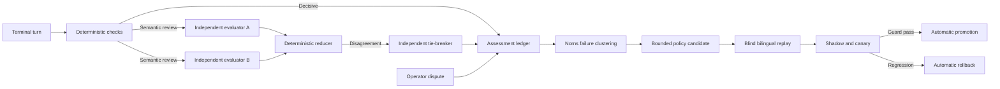

# Conversation Assurance

Conversation assurance evaluates completed answers outside the response path and improves chat-only
policies without granting cloud execution authority. It combines deterministic checks, independent
model families, bounded debate, blind replay, automatic promotion, and automatic rollback.

> Answer accuracy can improve as FDAI observes more verified use in each subscription, but this is
> a measured result, not a guarantee. Promotion requires a statistically supported gain on the same
> frozen scenario set and zero hard-safety escapes.

## Design at a glance

Bragi persists the terminal turn. Norns evaluates it off path, Saga records each assessment and
policy transition, and Mimir governs the fixed rubric. This loop cannot change RBAC, approval,
risk, policy, agent roles, or executor authority.

## Why subscriptions learn differently

Subscriptions differ in resource mix, naming conventions, topology, telemetry coverage, operating
procedures, failure frequency, and evidence latency. A global prior helps at startup but cannot
represent every deployment equally well. FDAI keeps customer values outside the repository and
learns only from deployment-owned, principal-scoped evidence.

For criterion `k` in subscription `s`, use a beta-binomial posterior over verified outcomes:

$$
p_{s,k} \mid D_{s,k} \sim \operatorname{Beta}(\alpha_{0,k}+c_{s,k},\;\beta_{0,k}+n_{s,k}-c_{s,k})
$$

Here, `n` is the number of scorable outcomes and `c` is the verified-correct count. The posterior
mean is:

$$
\hat p_{s,k}=\frac{\alpha_{0,k}+c_{s,k}}{\alpha_{0,k}+\beta_{0,k}+n_{s,k}}
$$

The global prior limits overfitting when a subscription has little evidence. As verified local
evidence grows, posterior variance decreases and the local estimate receives more weight. FDAI can
therefore learn which evidence sources, routes, and response policies work in that environment.
Only changes that pass blind replay and canary guards are retained.

The expected error curve is modeled, not promised, as:

$$
E_s(n)=E_{s,\infty}+(E_{s,0}-E_{s,\infty})e^{-\lambda_s n}
$$

`lambda_s` is estimated from observed windows. If the confidence interval does not show a gain,
FDAI reports no measured improvement and retains the incumbent policy.

## Assessment contract

Each assessment stores bounded metadata, content digests, model identities, criterion scores,
evidence references, cost, and lifecycle state. It does not duplicate unrestricted conversation
bodies, hidden reasoning, or tool output.

### Hard checks

Hard checks run for every completed answer without a model call:

- **Integrity**: The answer is well formed and within size bounds.
- **Grounding**: Cited evidence exists and atomic claims are supported.
- **Scope**: Subscription, resource, and conversation scope match server-owned context.
- **Authority**: The answering agent and evidence provider own the claimed domain.
- **Safety**: The answer does not grant execution, approval, or policy authority.
- **Freshness**: Time-sensitive evidence is current enough for the claim.

A hard failure produces `fail`. Missing evidence produces `inconclusive`; it never becomes a pass.

### Semantic rubric

Only turns unresolved by hard checks reach semantic evaluation. Two distinct model families score
the following closed criteria from `0` to `4`:

| Criterion | Meaning | Weight |
|-----------|---------|-------:|
| `factual_correctness` | Claims agree with supplied evidence and reference facts. | 4 |
| `intent_resolution` | The answer directly resolves the operator request. | 3 |
| `completeness` | Required constraints, caveats, and next steps are present. | 2 |
| `calibration` | Uncertainty and abstention match evidence availability. | 3 |
| `actionability` | The answer gives safe, usable next steps when appropriate. | 2 |
| `clarity` | The answer is coherent and natural in the requested locale. | 1 |

The normalized content score is:

$$
Q=100\frac{\sum_k w_k s_k}{4\sum_k w_k}
$$

The reducer stores `pass`, `fail`, or `inconclusive` separately from `Q`. A high average cannot
hide a hard failure.

## Independent model review

Evaluator A and evaluator B run independently and cannot read each other's result. Model identities
and families must be distinct, and the answer-producing model cannot evaluate its own answer. Every
semantic score cites evidence from the supplied allowlist.

The reducer accepts direct consensus when verdicts match and every criterion differs by at most one
point. Otherwise, evaluators receive one cross-examination round limited to disputed criteria. A
third independent family may break the tie once. Remaining disagreement becomes `inconclusive`.

Model output is subtractive only. It can identify a defect or hold a turn, but it cannot override a
deterministic failure, fabricate evidence, change a threshold, or grant execution authority.

## Cost-aware cascade

The evaluator uses the least expensive sufficient stage:

1. Reuse a cached assessment when question, answer, evidence manifest, rubric, and model-set digests
   match.
2. Run hard checks for every new turn.
3. Run two lightweight independent evaluators only for unresolved turns and a bounded control sample
   of deterministic passes.
4. Run cross-examination and a tie-breaker only on disagreement.

The optimization objective is:

$$
\min_{\pi}\; C_{\text{eval}}(\pi)+\eta C_{\text{error}}(\pi)
$$

Constraints include zero hard-safety escapes, a daily micro-USD ceiling, at most three model calls
per turn, and configured latency limits. Exhausted budgets defer assessment and never weaken a guard.
Before each call, the reviewer reserves the highest configured per-call ceiling across the selected
evaluators. After a provider returns measured token usage, the adapter derives `cost_microusd` from
the shared pricing catalog and emits the same invocation to the durable metering stream. An evaluator
without catalog pricing uses the full conservative ceiling, and the answer model is rejected before
any evaluator call if it occupies the primary, secondary, or tie-breaker role.

## Autonomous improvement lifecycle

Norns groups repeated failures by subscription-safe feature digests, failed criteria, route,
authority, locale, and evidence state. Raw customer identifiers are not clustering keys. A cluster
must reach configured support and recurrence floors before it creates one bounded candidate.

Candidates may change narrator prompt packs, glossary entries, read-only routing, evidence selection,
response rendering, locale phrasing, and narrator model ordering. Candidates cannot change the
rubric, benchmark labels, evaluator prompts, evidence verifier, RBAC, risk policy, agent roles,
approval rules, or executor behavior.

### Blind promotion and rollback

Each candidate runs against original failures, at least three paraphrases per failure, the frozen
English and Korean benchmark, and a hidden holdout. It then advances through shadow, 1 percent,
5 percent, 25 percent, and 100 percent traffic stages.

Automatic promotion requires:

$$
\operatorname{LCB}_{95}(Q_{candidate}-Q_{incumbent})>\delta,
\quad C_{verified,candidate}\le C_{verified,incumbent},
\quad H=0
$$

`H` is the hard-failure escape count. A hard escape, lower confidence bound below zero, cost or
latency regression, locale disparity, or increased disagreement automatically restores the prior
immutable policy.

## Operator dispute surface

The Conversation Assurance console is read-mostly. An authenticated operator can report wrong
facts, missing intent, stale evidence, wrong scope, inappropriate abstention, or language quality.
The report is an append-only dispute event, not an approval or direct policy edit.
An idempotent retry returns the original principal-scoped dispute record, including its first
timestamp, through a direct ledger lookup rather than a bounded projection list.

A verified dispute joins the regression corpus and can trigger rollback. An unsupported report
remains visible as unresolved without changing the quality label.

## Privacy and failure behavior

- Assessment records are partitioned by principal and deployment scope.
- Evidence references must belong to the terminal turn's evidence manifest.
- Missing model independence, malformed scores, unknown criteria, or unsupported evidence produce
  `inconclusive`.
- Queue or budget exhaustion records `deferred` and retries within bounded policy.
- Intake capacity rejection, delegate rejection, and terminal assessment failure emit structured
   warnings without changing the already persisted answer.
- Store failure leaves the active policy unchanged.
- The previous immutable policy remains available until the next version is fully promoted.

## Measurement

Report hard-failure rate, verified-correct rate, appropriate-abstention rate, disagreement rate,
dispute precision, cost per verified answer, p50 and p95 latency, promotions, and rollbacks by
subscription-safe scope, intent, agent, locale, policy version, rubric version, and window.

English and Korean use the same scenario intents and thresholds. A locale gap outside its configured
confidence interval blocks promotion.

## Related docs

| To learn about | Read |
|----------------|------|
| Existing post-turn learning | [Post-Turn Improvement Review](post-turn-improvement-review.md) |
| Subtractive model scoring | [Hallucination Rubric Gate](hallucination-rubric-gate.md) |
| Operator surface boundaries | [Operator Console](../interfaces/operator-console.md) |
| Baselines and confidence intervals | [Goals and Metrics](../architecture/goals-and-metrics.md) |
