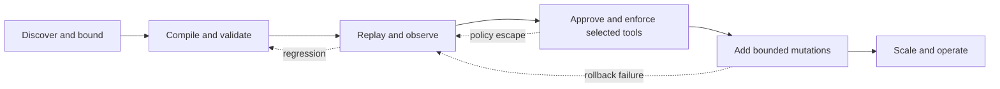

# Customer Workflow Automation Delivery Plan

This plan turns FDAI's existing workflow contracts into a production-ready path for automating
an adopting organization's operational and business processes. It defines the delivery waves,
implementation ownership, safety gates, and evidence required to move from observation mode to
bounded enforcement.

> **Scope.** This document covers the reusable delivery method. Customer procedures, identifiers,
> credentials, thresholds, and adapter configuration stay in deployment configuration or a
> downstream distribution. The upstream repository remains customer-agnostic.

> **Current posture.** Workflow authoring, validation, persistence, triggers, process journals,
> control steps, and governed action proposal dispatch are implemented. Broad resource mutation,
> behavior simulation, and customer-system adapters are not complete. Adoption should therefore
> start in observation mode, then promote one measured process at a time.

## Design at a glance

Customer workflow automation is ready only when a process can be discovered, expressed as a
versioned `Workflow`, exercised without changes, approved when required, executed through typed
`ActionType` adapters, recovered after interruption, and reconstructed from audit evidence. The
plan uses six delivery waves. Each wave has a release gate, and passing one wave doesn't grant a
later wave's authority.

## Target outcome

The first production milestone is not unrestricted automation. It is a portfolio of three to
five high-volume, deterministic processes with explicit boundaries and measurable outcomes.

An individual process is production-ready when it has all of the following:

- **Owned definition**: A versioned workflow, business owner, technical owner, source procedure,
  and review cadence are recorded.
- **Typed steps**: Every state-changing step resolves to a registered `ActionType`; no step uses
  an inline script or bypass route.
- **Safe execution**: Stop conditions, rollback or state-forward recovery, impact scope, safe
  retry behavior, per-resource serialization, and terminal audit records are verified.
- **Human approval**: Approval role, quorum, no-self-approval behavior, timeout, escalation, and
  rejection recovery are tested where policy requires them.
- **Operational recovery**: A waiting or interrupted process can resume without repeating a
  completed mutation, and an operator can cancel or move it back to observation mode.
- **Measured promotion**: Historical replay and live observation meet the workflow and ActionType
  promotion thresholds with zero policy escapes.

## Current baseline

The baseline separates implemented platform capability from adoption work.

| Capability | Current state | Delivery implication |
|------------|---------------|----------------------|
| Definition validation and private drafts | Implemented | Teams can model and review a process now. Drafts remain non-runnable. |
| Signal and schedule triggers | Implemented | Observation runs can start from normalized events or schedules. |
| Process snapshot and append-only journal | Implemented | Runs can be inspected and deterministically identified. |
| `WAIT`, `APPROVAL`, `DECISION`, `PARALLEL`, and `GATE` execution | Implemented in the runtime | Builder support and end-to-end operator transitions still need completion. |
| Read-only `EVIDENCE` execution | Implemented for browser evidence | Uses a separate evidence dispatcher, stays shadow-only, and fails closed without granting action authority. |
| Enforce workflow command | Owner and allowlist gated | Action steps publish typed `operator_request` events; this isn't direct mutation authority. |
| Tool execution | Available for selected adapters | GitHub, Jira, chaos, investigation, and Azure VM paths require explicit configuration and per-tool promotion. |
| PR-native remediation | Observation mode only | It creates draft remediation pull requests and doesn't merge them. |
| Direct API execution | Observation mode in core | Live Kubernetes handlers are narrow and aren't the generic production composition. |
| Behavior simulation | Not implemented | Structural validation must not be presented as a mutation preview. |
| Customer process catalog | Downstream responsibility | Customer procedures and derived catalog entries don't belong upstream. |

## Delivery principles

- **Start with the process, not the connector**: Select a measurable process and derive only the
  adapters it needs.
- **Keep authority independent**: Deployment environment, fork status, workflow lifecycle, user
  role, and enforcement mode remain separate controls.
- **Promote the smallest unit**: Promote one workflow and each referenced ActionType separately.
  An allowlisted workflow doesn't promote all of its steps.
- **Re-enter typed ingress**: Workflow actions return through the trust router, safety check
  (`risk-gate`), approval path, executor, and audit path.
- **Choose the safer default**: Unknown parameters, unresolved guards, stale approvals, missing
  adapters, and simulation differences hold the process for review.
- **Keep customer material downstream**: Source manuals, process thresholds, credentials, and
  bespoke integrations live outside the generic upstream distribution.

## Workstreams

Six workstreams run through the delivery waves.

| Workstream | Required output | Primary implementation area |
|------------|-----------------|-----------------------------|
| Process discovery | Ranked process inventory, owner, frequency, failure cost, anti-scope | Downstream onboarding artifacts and manual distillation |
| Definition and authoring | Versioned Workflow, parameter schema, trigger, guards, recovery graph | Workflow catalog, definition store, builder |
| Execution adapters | Typed tool or direct API adapter with promotion allowlist | Downstream composition root and delivery adapters |
| Approval and recovery | Durable decisions, timeout, escalation, cancel, resume, compensation | Workflow runtime, command APIs, notification adapters |
| Simulation and evidence | Historical replay, behavior preview, frozen scenarios, KPI report | Assurance twin, test harness, measurement stores |
| Operations | Dashboards, alerts, runbooks, ownership handover, demotion procedure | Console projections, reporting, operations docs |

## Wave 0 - Select and bound the pilot

Choose three to five processes before adding capabilities. Good pilot processes are frequent,
deterministic, reversible, and narrow in impact scope.

### Deliverables

- A process inventory with trigger, expected result, current manual steps, volume, duration,
  error rate, business owner, and technical owner.
- A suitability score covering determinism, reversibility, API availability, data sensitivity,
  approval burden, and impact scope.
- One canonical source procedure and content hash per selected process.
- Explicit anti-scope, stop condition, success metric, and maximum affected resources.
- A baseline measurement window and historical scenario set.

### Exit gate

Each selected process has two accountable owners, a stable source procedure, measurable baseline,
bounded target population, and no unresolved secret or personal-data handling path. Processes that
require unrestricted credentials, irreversible bulk changes, or undocumented judgment don't enter
the pilot.

## Wave 1 - Compile and run in observation mode

Convert each selected procedure into rules, `ActionType` entries, and a `Workflow`. Observation
mode records decisions and process transitions without applying customer-system changes.

### Deliverables

- Downstream catalog entries with provenance and immutable versions.
- Parameter schemas for every action and trigger binding.
- Concrete guard evaluation backed by policy-as-code where a step declares a guard.
- Builder support for action parameters and the control-step kinds used by the pilot.
- Historical replay plus live observation runs with process and audit projections.
- Operator-visible reasons for blocked, waiting, failed, and skipped steps.

### Exit gate

Every historical scenario produces the expected step sequence and terminal status. Live observation
runs meet the workflow's minimum sample and accuracy thresholds, produce no policy escapes, and
demonstrate that retries don't duplicate Process events or action proposals.

## Wave 2 - Enable approval-based tool automation

Promote only actions backed by a real tool adapter and a verified recovery contract. Typical first
targets are ticket creation, change-request submission, notification, and repository workflow
dispatch rather than infrastructure mutation.

### Deliverables

- Durable approval decisions linked to process, step, requester, approver, role, and timestamp.
- Quorum and no-self-approval checks at the command boundary and runtime boundary.
- Approval timeout, escalation, rejection, cancellation, and resume commands.
- Per-adapter enforcement allowlists and minimum-permission identities.
- Persistent idempotency receipts and redacted adapter audit details.
- Contract and sandbox tests for GitHub, Jira, MCP, or another selected business tool.

### Exit gate

Staging exercises approve, reject, time out, retry, and resume without duplicate external effects.
An unavailable adapter leaves the process waiting or failed with an actionable reason. Removing an
allowlist entry immediately prevents new enforcement while preserving read and audit access.

## Wave 3 - Add bounded substrate mutations

Add direct changes only for actions whose preconditions, observation path, and rollback behavior
can be verified against a real staging substrate.

### Deliverables

- Provider adapters registered through dependency injection, without changes to `core/`.
- Preflight and behavior simulation that report the intended target set and expected state delta.
- Durable distributed locking for deployments that run more than one executor replica.
- Postcondition probes, stop-condition monitoring, and compensation or state-forward recovery.
- A break-glass procedure that is separate from routine approval and fully audited.
- Fault-injection tests for timeout, partial success, stale state, rate limit, and rollback failure.

### Exit gate

The same immutable action artifact passes simulation and staging execution. Rollback drills restore
the accepted state or complete the documented state-forward recovery. Impact scope and rate caps
are enforced under concurrency, and no tested failure path loses its terminal audit record.

## Wave 4 - Complete the authoring and operating experience

Make complex workflows manageable without granting the console mutation authority.

### Deliverables

- Schema-driven parameter editing and insertion, removal, and reordering of steps.
- Authoring support for wait, approval, decision, parallel, gate, and failure branches.
- Draft recovery, deep links, immutable review diff, and GitHub catalog proposal flow.
- A behavior preview clearly separated from structural validation.
- Process inboxes for waiting approval, timed-out, failed, compensating, and suspended runs.
- Operator commands for cancel, retry from a safe boundary, resume, and demote to observation.

### Exit gate

An operator can author, review, publish through governance, bind, observe, approve, diagnose, and
recover a pilot workflow without direct database access. Reader views remain read-only, and every
command is capability-gated and represented in the Process journal.

## Wave 5 - Scale and hand over operations

Expand only after the pilot portfolio operates within its service and safety objectives.

### Deliverables

- Cell-aware scheduling, distributed locks, backpressure, and per-tenant concurrency limits.
- Service-level indicators for queue delay, process duration, approval latency, action success,
  rollback success, duplicate suppression, and policy escapes.
- Automated demotion when quality, safety, or adapter health crosses a threshold.
- Ownership handover, on-call runbook, adapter credential rotation, and disaster recovery drill.
- A quarterly process review that retires stale definitions and source procedures.

### Exit gate

Load and failure tests meet the declared service objectives. Operators complete a no-developer
recovery exercise, promotion and demotion evidence is queryable, and every production workflow has
primary and backup ownership.

## Implementation sequence

The implementation should follow the ownership boundaries below. Exact pull requests may split a
row further, but shouldn't combine promotion with a capability's first implementation.

| Order | Change | Expected verification |
|------:|--------|-----------------------|
| 1 | Add downstream process inventory and frozen scenarios | Source hashes, secret scan, owner review |
| 2 | Add Workflow, Rule, and ActionType entries in observation mode | Schema load, cross-reference, catalog regression |
| 3 | Bind a concrete guard evaluator | Guard true, false, error, and stale-input tests |
| 4 | Complete parameter and control-step authoring | Console reducer, decoder, accessibility, production build |
| 5 | Add durable approval and resume commands | RBAC, quorum, self-approval, timeout, replay tests |
| 6 | Add one real tool adapter per pilot need | Contract, sandbox, idempotency, redaction, fault tests |
| 7 | Run historical replay and live observation | Accuracy, policy escape, duplicate, latency reports |
| 8 | Promote one tool action and one workflow | Owner approval, allowlist, staging evidence, rollback plan |
| 9 | Add behavior simulation and direct mutation adapter if needed | State-delta parity and rollback drill |
| 10 | Add scale controls and operational handover | Load, failover, demotion, and on-call exercises |

## Verification matrix

| Layer | Required tests | Release-blocking result |
|-------|----------------|-------------------------|
| Catalog | Schema, cross-reference, version pin, provenance, anti-scope | Unknown reference or unversioned definition |
| Builder | Decode, parameter schema, graph edit, draft recovery, localization | UI emits a definition that server validation rejects |
| Runtime | All step kinds, resume, timeout, concurrency, deterministic replay | Completed step repeats or journal diverges from snapshot |
| Approval | Role, quorum, no-self-approval, stale decision, escalation | Unauthorized or self-approved mutation becomes eligible |
| Adapter | Shadow no-op, enforce allowlist, idempotency, redaction, recovery | Mutation without receipt, audit, or bounded target set |
| Simulation | Target set, expected delta, stale state, parity with staging | Simulation and staging affect different resources |
| Operations | Alert, demotion, cancel, restore, credential rotation | Operators can't stop or reconstruct a failed run |

## Promotion evidence

Promotion evidence is stored per workflow version and per ActionType version. A release packet
should include:

- Frozen scenario-set identifier and replay result.
- Observation duration, sample count, accuracy, false-positive rate, and policy escapes.
- Approval-path and recovery drill results.
- Simulation-to-staging target and state-delta comparison.
- Maximum observed impact scope and concurrency.
- Adapter identity and permission review.
- Owner decision, expiration or review date, and automatic demotion thresholds.

Promotion changes authority only for the named versions. A new workflow or ActionType version
returns to observation mode until it produces its own evidence.

## Risks and controls

| Risk | Control |
|------|---------|
| A process automates an obsolete manual | Source content hash, review date, and tombstone propagation |
| A workflow allowlist is mistaken for step authority | Independent workflow and ActionType promotion checks |
| A retry repeats an external effect | Stable idempotency key plus persistent adapter receipt |
| An approval is replayed after context changes | Bind decisions to process revision and expire stale decisions |
| A partial failure leaves mixed state | Postcondition probes, compensation, state-forward recovery, and operator hold |
| A connector receives broad credentials | Minimum-permission identity and adapter-scoped secret references |
| Simulation gives false confidence | Compare target set and state delta with staging execution |
| Scale introduces concurrent mutation | Distributed resource lock and per-tenant concurrency envelope |

## Definition of complete

The customer workflow automation capability is complete for a process portfolio when:

1. At least three production processes have passed Waves 0 through 4.
2. Each process has completed at least one promotion and one demotion or rollback drill.
3. No process depends on an unregistered mutation, inline credential, or untracked manual state.
4. Operators can stop, resume, diagnose, and reconstruct every run from supported surfaces.
5. Quality and safety thresholds automatically prevent or demote enforcement.
6. Primary and backup owners accept the operating handover and review schedule.

This definition applies per portfolio. It doesn't imply that every catalog workflow or customer
system is ready for enforcement.

## Related docs

| To learn about | Read |
|----------------|------|
| Workflow contracts and runtime | [Process automation](process-automation.md) |
| Action authority and executors | [Execution model](execution-model.md) |
| Turning procedures into catalogs | [Manual distillation](../rules-and-detection/manual-distillation.md) |
| Downstream implementation boundaries | [Downstream fork guide](../fork-and-sequencing/downstream-fork-guide.md) |
| Human roles and command authority | [User RBAC and identity](../interfaces/user-rbac-and-identity.md) |
| Production handover gates | [Operational readiness](../operations/operational-readiness.md) |
