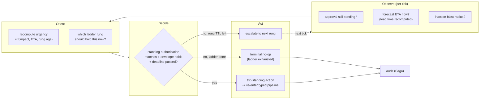
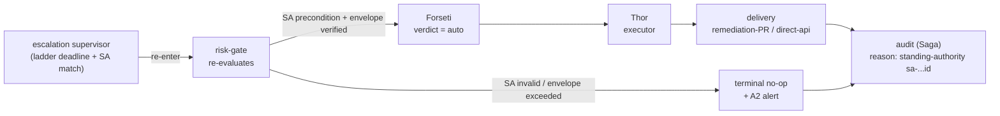

# 에스컬레이션과 상시 권한(감독형 OODA 루프)

리스크 게이트가 **고위험 결정을 사람에게 넘겨 일시정지시킨 뒤** - 아무도 응답하지
않을 때 - 무슨 일이 벌어지는가. 이 문서는 응답 없는 승인 요청을 영향도에 따라 on-call
사슬 위로 걸어 올리는 **시간 제한 에스컬레이션 사다리(escalation ladder)** 와, 기다리는
것이 행동하는 것보다 더 위험한 경우를 위해 운영자가 **경계가 정해진 조건부 자동 조치**
를 미리 확약해 둘 수 있는 **상시 권한(standing authorization)** 아티팩트를 규정한다.
둘 다 기존 단일 패스 컨트롤 루프 위에 얹는 **감독형 OODA 루프** 로 설계된다.

> **범위 알림.** 고객 무관(customer-agnostic). 아래의 모든 사다리 rung 이름, 그룹,
> 임계값, 채널 id 는 업스트림 **기본값** 이다; 포크는 config 와 catalog-as-code 로
> 이를 조정한다([generic-scope.instructions.md](../../../.github/instructions/generic-scope.instructions.md)).

> **안전 초점.** 여기의 어떤 것도 *안전을 향한 실패(fail toward safety)* 를 약화시키지
> 않는다. 상시 권한은 **미리 부여된 사람 승인** 이며, envelope 로 경계가 정해지고 실행
> 시점에 결정론적으로 재검증된다 - 절대 fail-open 경로가 아니며 LLM 이 실행을 부여하지
> 못한다. 이 문서의 모든 신규 역량은 **shadow 우선** 으로 ship 된다
> ([architecture.instructions.md § Safety Invariants](../../../.github/instructions/architecture.instructions.md#safety-invariants)).

> **구현 상태 (2026-07-21):** Proposed. 이 문서의 사람 무응답 ladder,
> standing-authority catalog, temporal supervisor, runtime binding은 아직 구현되지 않았습니다.
> `core/quality_gate/escalation_ladder.py`는 별도의 model escalation policy이며 이 설계를
> 구현하지 않습니다.

## 이 문서가 다루는 것

[architecture.instructions.md § Control Loop](../../../.github/instructions/architecture.instructions.md#control-loop)
의 컨트롤 루프는 **단일 패스** 다: 이벤트가 정규화 -> 라우팅 -> 판단 -> 실행 -> 감사되어
종단 상태로 간다. 이는 이산적 이벤트에는 옳다. 그러나 결정이 *보류(pending)* 인 채 주변
세계가 변하는 상황은 **모델링하지 않는다**:

- `hil` verdict 는 TTL 을 가진 승인 요청을 발동한다. 오늘날 TTL 만료는 **no-op + 감사 +
  A2 alert** 다([channels-and-notifications-ko.md § on-call, 에스컬레이션, 타임아웃](../interfaces/channels-and-notifications-ko.md)).
  Fail-closed 이며 옳다 - 그러나 거기서 멈춘다.
- **채널 fallback** 은 이미 존재한다: 실패한 Teams 승인은 다른 A1 가능 채널로, 이어서
  ops lane 을 페이지한다([channels-and-notifications-ko.md](../interfaces/channels-and-notifications-ko.md)).
  이는 **전달 실패(delivery failure)** 를 다루지, **사람 무응답(human non-response)**
  을 다루지 않는다 - 별개의 문제다.
- **예보 finding** 은 줄어드는 **lead time**(`actual_breach_time - finding_time`, 즉
  위반 ETA)을 운반한다([observability-and-detection-ko.md § 3](../rules-and-detection/observability-and-detection-ko.md#3-예측--예보predictive--forecasting)).
  승인이 응답 없이 놓여 있는 동안 그 ETA 는 계속 좁혀진다 - *무행동의 비용이 시계와 함께
  상승* 하지만, 단일 패스 루프는 이미 넘어가 버렸다.

빈틈은 **시간적 감독자(temporal supervisor)** 다: 결정이 보류인 동안 **타이머로** 루프를
재진입해 상황을 다시 읽고(승인자 여전히 침묵? ETA 더 가까워짐? 무행동의 blast radius
커짐?), 에스컬레이션하거나, 사전 승인되어 있다면 행동한다. 그것이 OODA 루프다.

## 감독 프레임으로서의 OODA

기존 판테온 컨트롤 루프는 이미 OODA 에 깔끔하게 매핑된다
([architecture.instructions.md § Trust Routing](../../../.github/instructions/architecture.instructions.md#trust-routing-3-tier)
의 매핑 참조). 여기서 추가하는 것은 *하나의 보류 결정* 을 감독하며 종단 상태에 이를
때까지 tick 하는 **두 번째, 더 느린 루프** 다.



- 감독자는 **substrate 를 직접 변경하지 않는다**. 유일한 privileged 결과(`A2`)는
  액션을 정상 principal 을 통해 재판단·실행하도록 **타입 파이프라인을 재진입** 시키는
  것뿐이다. executor 를 직접 호출하는 감독자는 defect 다
  ([architecture.instructions.md § Agent Pantheon](../../../.github/instructions/architecture.instructions.md#agent-pantheon)
  의 conversational port 규칙과 동일).
- 루프는 **경계가 정해져 있다**: 최대 rung 수와 하드한 전체 데드라인을 갖는다. 영원히
  tick 할 수 없다.

## 에스컬레이션 사다리

**에스컬레이션 사다리** 는 순서가 있는 **사람 권한 rung** 목록이다. 채널 fallback 과는
구별된다: 채널 fallback 은 *"메시지가 전달되지 않았다 - 같은 사람에게 다른 파이프로
시도"* 에 답하고, 사다리는 *"메시지는 전달됐지만 권한 있는 누구도 행동하지 않았다 -
누구에게 묻는지를 영향도에 따라 넓힌다"* 에 답한다.

| 개념 | 답하는 질문 | 페일오버 조건 | 위치 |
|------|-------------|---------------|------|
| **채널 fallback** | 전달 실패 | 채널 도달 불가 / 전송 오류 | [channels-and-notifications-ko.md § 6](../interfaces/channels-and-notifications-ko.md) |
| **에스컬레이션 사다리** | 사람 무응답 | rung TTL 이 결정 없이 경과 | 이 문서 |

각 rung 은 **누구**(Entra 그룹으로, 오늘날 승인자 그룹과 똑같이 컨트롤 플레인 바깥에서
해석됨), **rung 별 TTL**, 사용 가능한 **알림 카테고리**(결정을 운반하는 rung 은 A1,
인지용은 A2 페이징)를 선언한다. 사다리는 **영향도 tier 로 선택** 된다 - `resource`
범위 finding 은 primary on-call 까지만 도달하고, `subscription` 에 근접한 영향은 incident
commander 를 빠르게 소집한다.

```yaml
# Proposed catalog-as-code artifact (shadow-first; see Rollout).
# rule-catalog/escalation-ladders/<name>.yaml
version: 1
id: prod-outage-imminent
select_when:                     # first-match, evaluated by the risk gate
  environment: prod
  finding_class: forecast.breach
  impact_at_least: resource_group
rungs:
  - rung: on_call_primary
    audience_group: aw-oncall-primary   # placeholder; fork supplies real group
    ttl: 5m
    category: a1_hil_approval
  - rung: on_call_secondary
    audience_group: aw-oncall-secondary
    ttl: 5m
    category: a1_hil_approval
    also_page: [pagerduty-primary]      # A2 awareness, non-deciding
  - rung: incident_commander
    audience_group: aw-incident-commander
    ttl: 10m
    category: a1_hil_approval
    also_page: [pagerduty-primary, sms-oncall]
overall_deadline: 25m            # hard cap; on expiry -> terminal no-op unless
                                 # a standing authorization trips first
```

- **에스컬레이션을 거쳐도 self-approval 은 성립하지 않는다.** 이후 rung 은 *다른*
  principal 이다; approver-of-record 는 실제로 결정한 사람이고, executor 는 여전히 별개
  principal 이다(Var 가 승인, Thor 가 실행 - [agent-pantheon-ko.md](../agents/agent-pantheon-ko.md)).
- **모든 rung 전이는 감사** 되며, fingerprint 가 반복되면 기존 `HandoffEscalation` ->
  GitHub issue 경로로 흘러 만성적 무응답이 조용한 손실이 아니라 추적되는 신호가 된다
  ([agent-pantheon-ko.md § 6.4 Handoff escalation protocol](../agents/agent-pantheon-ko.md)).

## 시간 감쇠 긴급도

위 사다리는 명료함을 위해 *고정* TTL 을 쓰지만, 위반이 예보될 때 긴급도는 고정이 아니다.
감독자는 매 tick 마다 **긴급도(urgency)** 신호를 재계산해 rung TTL 을 **압축** 하고 **시작
rung 을 올린다**:

- **입력**(모두 이미 업스트림에서 생산됨, 신규 수집 없음): 리스크 게이트의 `impact` /
  blast radius, 예보기의 **위반 ETA**([observability-and-detection-ko.md § 3](../rules-and-detection/observability-and-detection-ko.md#3-예측--예보predictive--forecasting)),
  **rung age**(현재 rung 이 침묵한 시간).
- **경험칙**: `effective_ttl = min(rung.ttl, k * remaining_lead_time)`. 예보 ETA 가
  좁혀질수록 각 사람에게 주어지는 창은 줄고, 루프는 사다리를 더 빨리 오른다 - 선언된
  값을 넘겨 TTL 을 *늘리지는* 절대 않는다.
- **신뢰도는 여전히 게이트다.** 예보는 그 예측구간 band 가 설정된 신뢰 수준을 통과할
  때만 긴급도를 몰아간다([observability-and-detection-ko.md § 3](../rules-and-detection/observability-and-detection-ko.md#3-예측--예보predictive--forecasting));
  잡음 섞인 point-estimate 위반은 데드라인을 압축하지 못한다.

긴급도는 사다리를 **얼마나 빨리** 걷는지를 바꾼다; 액션이 auto-execute 되도록 허용되는지
**여부** 는 절대 바꾸지 않는다. 그 게이트가 상시 권한이다.

## 상시 권한(사전 승인 조건부 자동 조치)

이것이 *"운영자가 자동 조치를 미리 설정해 둔"* 경우 뒤의 메커니즘이다. **상시 권한** 은
운영자가 작성한 policy-as-code 아티팩트로 다음을 말한다:

> **조건** C 하에서, **envelope** E 안의 액션에 대해, 에스컬레이션 사다리가 **응답 없이**
> 데드라인에 도달하면, `hil` 이던 액션이 `auto` 자격을 얻는다 - 오직 그때만.

핵심 설계 속성: 상시 권한은 **새 결정 엔진이 아니고 우회도 아니다.** 그것은 기존 리스크
게이트에 대한 **결정론적 입력** 이다. 감독자의 Decide 단계가 *"이것이 무인 상태로 진행될
수 있는가?"* 를 물으면, 리스크 게이트는 다른 규칙을 검사하듯 상시 권한을 검사해 답한다 -
그리고 실행 자격은 여전히 그 결정론적 검증이 부여하며, 모델이 부여하지 않는다
([architecture.instructions.md § LLM Quality Gate](../../../.github/instructions/architecture.instructions.md#llm-quality-gate-required-for-t2)).

```yaml
# Proposed catalog-as-code artifact (shadow-first; see Rollout).
# rule-catalog/standing-authority/<name>.yaml
version: 1
id: sa-scale-out-before-quota-breach
authored_by: aw-owners           # a human authority; recorded as approver-of-record
scope:                            # MUST be resource-group-equivalent or narrower
  environment: prod              # (same bound as a human override)
  resource_group: <rg-name>      # placeholder; fork supplies real scope
precondition:                     # all must hold, deterministically checked
  finding_class: forecast.breach
  min_forecast_confidence: 0.90
  min_lead_time: 3m              # do not act on a breach already upon us
envelope:                         # the action MUST fall entirely inside this
  action_types: [remediate.scale-out.compute]
  max_blast_radius: resource_group
  reversible: true               # only reversible actions may be pre-authorized
  rollback_contract: scripted    # a tested undo path is mandatory
trigger:
  after: ladder_unanswered       # only after the ladder deadline, never before
mode: shadow                      # judge-and-log until explicitly promoted
```

**무엇이 이것을 안전하게 하는가(협상 불가 항목):**

- **사람 override 처럼 경계가 정해진다.** 범위는 resource-group-equivalent 이하여야
  한다 - 사람 override 메커니즘이 강제하는 것과 동일한 상한
  ([architecture.instructions.md § Human Override](../../../.github/instructions/architecture.instructions.md#human-override)).
  subscription 전역 상시 권한은 없다.
- **가역(reversible) 액션만.** `irreversible: true` 액션은 절대 사전 승인될 수 없다;
  항상 HIL+quorum 으로 라우팅된다
  ([coding-conventions.instructions.md § Safety](../../../.github/instructions/coding-conventions.instructions.md#safety)).
  상시 권한은 선언되고 테스트된 `rollback_contract` 를 요구한다.
- **사다리 우선, 사다리 대체 아님.** 트리거는 `after: ladder_unanswered` 다. 상시 권한은
  실제 사람들이 요청받고 데드라인이 지난 뒤에만 발동될 수 있다 - *꼬리를 줄일* 뿐,
  사람을 대체하지 않는다.
- **사람이 approver-of-record.** `authored_by` 는 결정을 사전 확약한 사람 권한을
  기록한다; Var 가 이를 상시 승인으로 운반해 approve-vs-execute principal 분리가 유지된다
  (self-approval 없음, model-as-approver 없음).
- **네 안전 불변식이 여전히 적용** 된다: stop-condition, rollback path, blast-radius
  limit, audit entry
  ([architecture.instructions.md § Safety Invariants](../../../.github/instructions/architecture.instructions.md#safety-invariants)).
- **위험한 액션보다 안전 강등(safe-degradation) 을 선호.** 가능하면 사전 승인 액션은
  파괴적 remediation 자체가 아니라 시간을 버는 **가역 완화(scale out, circuit breaker
  열기, quota 확장)** 다. 시간을 버는 것은 사람 루프를 끝내는 대신 재무장시킨다.

## 재결정 경로(우회 없음)

상시 권한이 발동되면 감독자는 **실행하지 않는다.** 보류된 액션을 새 결정으로 **타입
파이프라인에 재주입** 한다:



- **Forseti 가 재판단한다.** verdict 가 `auto` 로 뒤집히는 것은 **오직** 리스크 게이트가
  유효하고 만료되지 않았으며 범위가 맞고 precondition 이 성립하고 envelope 이 액션을
  포함하는 상시 권한을 검증했기 때문이다. 여전히 judge != executor.
- **Thor 가 실행** 하고, Vidar 는 rollback principal 로 남으며, Saga 는 명시적
  `standing-authority` 이유와 권한 id 로 감사한다 - 재현 가능하고 귀속 가능한 기록
  ([architecture.instructions.md § Idempotency, Ordering, and Replay](../../../.github/instructions/architecture.instructions.md#idempotency-ordering-and-replay)).
- **Envelope 위반은 fail-closed.** 보류 액션이 envelope 에 맞지 않으면(잘못된 action
  type, blast radius 증가, inventory stale) 상시 권한은 **적용되지 않고** 루프는 no-op
  으로 종료한다.

## 에이전트 매핑(신규 에이전트 없음)

판테온은 fork-locked 다 - **어떤 에이전트도 추가·제거·개명되지 않는다**
([agent-pantheon.instructions.md](../../../.github/instructions/agent-pantheon.instructions.md)).
감독형 루프는 기존 에이전트와 기존 토픽으로 표현된다:

| OODA 단계 | 에이전트 | 사용하는 기존 책임 |
|-----------|----------|--------------------|
| **Observe** | Heimdall, Huginn | 예보 finding + 보류 승인 상태 재독(센싱, 결정론 우선) |
| **Orient** | Odin | 영향도 중재; 지금 어느 rung 과 긴급도가 유효한가 |
| **Decide** | Forseti (+ 리스크 게이트) | 재판단; 검증된 상시 권한에만 `auto` 부여 |
| **Act (에스컬레이션)** | Var | 다음 rung 으로 A1 요청 운반; approver-of-record |
| **Act (실행)** | Thor | verdict 가 `auto` 가 된 뒤 유일한 privileged executor |
| **복구** | Vidar | 실행된 완화의 rollback path |
| **감사 / 핸드오프** | Saga | 감사 append + 만성 무응답 시 `HandoffEscalation` |

감독자 자체는 **보류 결정의 lifecycle 행위** 이지 열여섯 번째 에이전트가 아니다: 같은
타입 파이프라인의 타이머 구동 재진입이며, 승인 lifecycle(Var)이 소유하고 Odin 이
중재한다.

## 종단 상태

모든 경로는 감사된 종단 상태로 끝난다 - 루프는 새어나갈 수 없다:

| 종단 | 조건 | 결과 |
|------|------|------|
| **approved** | 어떤 rung 이 `approve` 결정 | Thor 로 실행, 감사 |
| **rejected** | 어떤 rung 이 `reject` 결정 | no-op, 감사 |
| **standing-authority executed** | 사다리 데드라인 경과, SA 유효, envelope 성립 | 재결정 -> `auto` -> 실행, SA id 로 감사 |
| **terminal no-op** | 사다리 소진, 유효 SA 없음 | 무행동, A2 alert, 감사, fingerprint 반복 시 `HandoffEscalation` |

**Fail-closed 가 여전히 기본값이다.** 유효한 상시 권한이 없으면 응답 없는 사다리는 여전히
no-op 으로 끝난다 - 오늘의 동작 그대로이되, 더 넓고 영향도 tier 별이며 시간 감쇠하는 사람
집합에게 행동할 기회를 준 뒤일 뿐이다.

## 롤아웃(shadow 우선)

1. **사다리를 shadow 로.** 에스컬레이션 사다리를 판단·기록만 하도록 ship 한다:
   *어느 rung 으로 언제 에스컬레이션했을지* 를 기록하고 아무것도 변경하지 않는다. 실제
   무응답 인시던트에 대해 에스컬레이션 타이밍이 검증되면 사다리별로 승격한다.
2. **상시 권한을 shadow 로.** 모든 상시 권한은 `mode: shadow` 와 측정 가능한 승격
   게이트(예: "N 회 shadow trip, envelope escape 0, policy-violation escape 0")를
   선언한다. enforce 승격은 작성 PR 과 절대 묶이지 않는 별도의 Owner 검토 변경이다
   ([coding-conventions.instructions.md § Safety](../../../.github/instructions/coding-conventions.instructions.md#safety)).
3. **메트릭**(기존 KPI 스트림에 접기,
   [goals-and-metrics-ko.md](../architecture/goals-and-metrics-ko.md)): rung 응답 지연, 에스컬레이션 깊이
   분포, 사다리 소진(no-op) 비율, 상시 권한 trip 비율, 그리고 - 가드 메트릭 - **반드시
   0 을 유지해야 하는 envelope-escape count**.

## 미해결 질문

- **Rung 멤버십 소스.** 승인자 그룹에 쓰는 Entra 그룹 바인딩을 재사용할지, 아니면
  on-call 스케줄 연동(PagerDuty/Opsgenie 스케줄 읽기)을 도입해 "누가 primary 인가" 가
  시간 인식적이게 할지. 업스트림은 그룹 우선, 스케줄 연동은 포크 seam 으로 기운다.
- **상시 권한 작성 정족수.** 사람 override 는 별개 승인자를 요구한다; 상시 권한은
  자율성을 사전 확약하므로 리스크 분류 테이블에 이미 쓰이는 **정족수 2 상향**
  ([risk-classification-ko.md](risk-classification-ko.md))이 필요할 가능성이 크다. 확인 필요.
- **긴급도 함수 형태.** `k * remaining_lead_time` 압축은 시작 휴리스틱이다; 정확한 곡선은
  enforce 전에 과거 예보-대-위반 시리즈로 backtest 할 튜닝 파라미터다.

## 다음 단계

| 알고 싶은 것 | 읽을 문서 |
|--------------|-----------|
| 이것이 감독하는 단일 패스 컨트롤 루프 | [architecture.instructions.md § Control Loop](../../../.github/instructions/architecture.instructions.md#control-loop) |
| 액션이 auto / HIL / deny 로 분류되는 방식 | [risk-classification-ko.md](risk-classification-ko.md) |
| 예보 lead time 과 예측구간 band | [observability-and-detection-ko.md § 3](../rules-and-detection/observability-and-detection-ko.md#3-예측--예보predictive--forecasting) |
| 채널 fallback vs 이 사람 권한 사다리 | [channels-and-notifications-ko.md](../interfaces/channels-and-notifications-ko.md) |
| 어느 에이전트가 에스컬레이션·판단·실행하는가 | [agent-pantheon-ko.md](../agents/agent-pantheon-ko.md) |
| 이것이 본뜬 경계형 사람 override 메커니즘 | [architecture.instructions.md § Human Override](../../../.github/instructions/architecture.instructions.md#human-override) |
