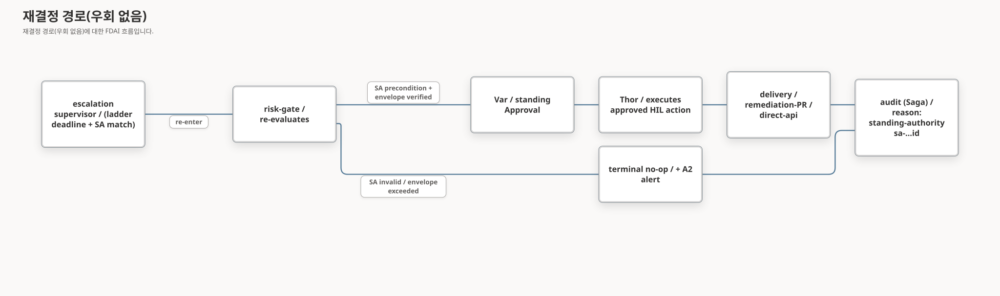

# 에스컬레이션과 상시 권한(감독형 OODA 루프)

리스크 게이트가 **고위험 결정을 사람에게 넘겨 일시정지시킨 뒤** - 아무도 응답하지
않을 때 - 무슨 일이 벌어지는가. 이 문서는 응답 없는 승인 요청을 영향도에 따라 on-call
사슬 위로 걸어 올리는 **시간 제한 에스컬레이션 사다리(에스컬레이션 단계 구조)** 와, 기다리는
것이 행동하는 것보다 더 위험한 경우를 위해 운영자가 **경계가 정해진 조건부 실행**
를 미리 확약해 둘 수 있는 **상시 권한** 아티팩트를 규정한다.
둘 다 기존 단일 패스 컨트롤 루프 위에 얹는 **감독형 OODA 루프** 로 설계된다.

> **범위 알림.** 고객 무관(customer-agnostic). 아래의 모든 사다리 rung 이름, 그룹,
> 임계값, 채널 id 는 업스트림 **기본값** 이다; 포크는 구성 와 catalog-as-code 로
> 이를 조정한다([generic-scope.instructions.md](../../../.github/instructions/generic-scope.instructions.md)).

> **안전 초점.** 여기의 어떤 것도 *안전을 향한 실패(fail toward 안전성)* 를 약화시키지
> 않는다. 상시 권한은 **미리 부여된 사람 승인** 이며, 묶음으로 경계가 정해지고 실행
> 시점에 결정론적으로 재검증된다 - 절대 fail-open 경로가 아니며 LLM 이 실행을 부여하지
> 못한다. 이 문서의 모든 신규 역량은 **shadow 우선** 으로 ship 된다
> ([architecture.instructions.md § 안전성 Invariants](../../../.github/instructions/architecture.instructions.md#safety-invariants)).

## 구현 상태

### 구현 범위

| 영역 | 상태 | 근거 | 참고 |
|------|------|------|------|
| 영구 shadow 에스컬레이션 supervisor | implemented | [`escalation_supervisor.py`](../../../services/core-control-plane/src/fdai/core/hil_resume/escalation_supervisor.py), [`test_escalation_supervisor.py`](../../../services/core-control-plane/tests/core/hil_resume/test_escalation_supervisor.py) | 제한된 스캔, 전달 claim 및 에스컬레이션 예정 관찰이 승인 또는 실행 권한을 진행하지 않도록 구현되어 있습니다. |
| HIL 재개 및 위임 단계 검증 | implemented | [`coordinator.py`](../../../services/core-control-plane/src/fdai/core/hil_resume/coordinator.py), [`test_delegation.py`](../../../services/core-control-plane/tests/core/hil_resume/test_delegation.py) | 타입이 지정된 경로를 계속하기 전에 재개 스냅샷과 단계 자격을 검증합니다. |
| 에스컬레이션 사다리 및 긴급도 카탈로그 | in-progress | [`escalation_ladder.py`](../../../services/core-control-plane/src/fdai/rule_catalog/schema/escalation_ladder.py), [`test_escalation_ladder_catalog.py`](../../../services/core-control-plane/tests/rule_catalog/test_escalation_ladder_catalog.py), [`rule-catalog/escalation-ladders/`](../../../rule-catalog/escalation-ladders/README.md) | 검토된 사다리 및 긴급도 정책 인스턴스가 fail-closed 로더 및 순수 스케줄 함수와 함께 배포되었으며, 집중 검사가 만료, 대체 전달, starvation 방지, 결정론적 재실행을 다룹니다. Supervisor는 아직 카탈로그를 읽지 않으며, 실행 중인 집합에서 측정된 긴급도 압축 근거는 없습니다. |
| A3-E 상시 사람 권한 | in-progress | [`standing-authorization.json`](../../../services/core-control-plane/src/fdai/shared/contracts/authority/standing-authorization.json), [`lifecycle.py`](../../../services/core-control-plane/src/fdai/core/standing_authority/lifecycle.py), [`fence.py`](../../../services/core-control-plane/src/fdai/core/standing_authority/fence.py), [`lease.py`](../../../services/core-control-plane/src/fdai/core/standing_authority/lease.py), [`promotion_candidate.py`](../../../services/core-control-plane/src/fdai/core/standing_authority/promotion_candidate.py), [`shadow_cohort_runner.py`](../../../services/core-control-plane/src/fdai/core/standing_authority/shadow_cohort_runner.py), [`postgres_standing_authority.py`](../../../services/core-control-plane/src/fdai/delivery/persistence/postgres_standing_authority.py), 집중 상시 권한 및 영속성 테스트 | 타입이 지정된 평가기, 변경할 수 없는 개정 번호와 증명 결속, 해시 체인 수명 주기, 원자적 PostgreSQL 저장소, 다시 만들 수 있는 스냅샷, 정확한 읽기 시점 fence 계약, 비활성 효과 범위 lease, 비활성 승격 후보 수명 주기, 그리고 결정론적 로컬 shadow 집단 실행기가 있습니다. 실행기는 소스 개정 번호, manifest/corpus/구성 다이제스트, 후보/lease 계약 버전, 순서가 지정된 케이스 결과, 거부 이유, 카운트, 정책 탈출 없음, 제한 시간 구성(총 1800초, 진행 없음 120초, 케이스당 30초), 레지스트리 전후 다이제스트를 결속한 정규 콘텐츠 주소 영수증을 생성합니다. 영수증은 `venue=local`, `evidence_class=synthetic_development`이며 모든 권한 플래그가 False이므로 런타임 승격을 충족할 수 없습니다. FDAI-CONST-008은 미구현 상태이며, #632 실제/통제 승격은 별도로 승인된 작업입니다. 이 모듈들은 어떤 권한 경로에도 연결되지 않았습니다. |

### 구현 이력

| 날짜 | 상태 | 변경 | 근거 | 남은 작업 |
|------|------|------|------|-----------|
| 2026-09-10 | in-progress | 비활성 A3-E 승격 후보 수명 주기를 추가했습니다. `promotion_candidate.py`는 타입이 지정된 `PromotionCandidateRecord`, `CandidateReviewRecord`, `CandidateRevocationRecord`, `TerminalDenialRecord`, `CandidateTransition`, `CandidateSnapshot`, `PromotionCandidateWriteResult`, `PromotionCandidateStore` Protocol을 정의합니다. 레코드는 정확한 권한 부여 개정 번호, 수명 주기 fence, `LEASE_CONTRACT_VERSION`(`a3e-lease-v1`), 적격 ActionType, 증거 요구사항, 소스 개정 번호, 검토자 신원을 결속합니다. 상태 기계는 생성자·검토자 분리를 강제하고, 자체 검토·중복/상충 검토·에이전트/실행자 신원·누락 증거를 거부하며, 모든 거부 또는 취소는 타입이 지정된 `DenialReason`을 생성합니다. 2단계 감사는 변형 전에 변경할 수 없는 `intent_digest`를 캡처하고 같은 전이 경계에서 `terminal_audit_digest`와 결속합니다. 단조로운 순서 번호를 가진 추가 전용 해시 체인. 테스트 전용 `InMemoryCandidateStore`가 원자성과 동시 검토/취소 순서를 증명합니다. 50개의 새로운 집중 테스트가 후보 재현, 동시 검토/취소 순서, 오래된 fence 세대, 생성자/검토자 분리, 침묵 권한 없음, 증거 누락, 모든 부적격 ActionType/프로바이더, 추가 전용 재현/위조 탐지, 재시작, 에이전트·`ActionPromotionRegistry`·위험 게이트·워크플로·HIL 재개·컨트롤 루프·실행기·조립에 대한 정적 비가져오기 증명을 다룹니다. 실행 권한, 프로덕션 연결, 레지스트리 변형 없음. | `current change`; `tests/core/standing_authority` 132건(50건 신규) 통과; 3개 파일에서 strict mypy 및 Ruff 통과. | 어떤 결정 또는 디스패치 경로도 평가기, 저장소, fence, lease 또는 승격 후보 모듈을 가져오기 전에 통제된 런타임 shadow 집단을 보존하고 독립 승격 검토를 받아야 합니다. |
| 2026-09-10 | in-progress | 비활성 효과 범위 A3-E lease를 추가했습니다. `lease.py`는 `StandingAuthorizationLease`, `LeaseOutcome`, `EffectStatus`, `ProviderCommitFenceRequest/Result`, `TerminalLeaseRecord`, `LeaseCheckpoint`를 정의합니다. 안정적인 idempotency 키는 권한 부여 개정 번호, 작업 다이제스트, 대상 다이제스트에서 도출됩니다. `shared/providers/standing_authority.py`의 `StandingAuthorizationLeaseStore` Protocol은 원자적 획득, 프로바이더 커밋 fence 검증, 하트비트 체크포인트, 터미널 릴리즈, 권한 있는 조정을 정의합니다. 테스트 전용 메모리 내 백엔드가 모든 결정론적 동시성 시나리오를 다룹니다. 31개의 새로운 집중 테스트가 커밋 전 취소, 커밋된 효과 후 취소, 중복 없는 충돌 후 커밋 조정, 효과 중 만료, lease 손실, 재전달, 재시작, 오래된 릴리즈, 교차 개정 번호 독립성, 부적격 역량, 정적 의존성 게이트를 다룹니다. 실행 권한, 프로덕션 연결, 승격 변형 없음. | `current change`; `tests/core/standing_authority` 82건(31건 신규) 통과; 4개 파일에서 strict mypy 및 Ruff 통과. | 어떤 결정 또는 디스패치 경로도 평가기, 저장소, fence 또는 lease를 가져오기 전에 통제된 런타임 shadow 집단을 보존하고 독립 승격 검토를 받아야 합니다. |
| 2026-09-10 | in-progress | 결정론적 로컬 A3-E shadow 집단 실행기를 추가했습니다. `shadow_cohort_runner.py`는 `CohortManifest`(콘텐츠 다이제스트, ≥1개의 적격 항목 필요), `CohortManifestEntry`, `CohortCaseInput`, `CohortExternalDenialInput`, `CohortCaseOutcome`, `CohortReceipt`, `build_manifest`, `run_cohort`, `CohortArtifactWriter`를 정의합니다. manifest는 모든 케이스 id와 터미널 처분을 미리 선언하고, `run_cohort`는 각 케이스를 정확히 한 번 실행하며 `complete=False`를 설정하는 DUPLICATE/UNEXPECTED/MISSING/ERRORED/INTERRUPTED 결과를 기록하고, 소스 개정 번호, manifest/corpus/구성 다이제스트, 후보/lease 계약 버전, 순서가 지정된 케이스 결과, 거부 이유, 카운트, 정책 탈출 없음, 제한 시간 상수, 레지스트리 전후 다이제스트를 결속합니다. 영수증은 `venue=local`, `evidence_class=synthetic_development`이며 모든 권한 플래그가 False입니다. 작성기 심은 해석된 경로 포함 유효성 검사를 수행하고 심볼릭 링크 artifact 디렉터리를 거부합니다. 38개의 집중 테스트가 결정론적 재현, 모든 이상 유형, 전체 거부 거절, 분모 계산, 잘못된 manifest, 영수증 위조, 권한 플래그, 레지스트리 변형, 심볼릭 링크/경로 포함, 세 가지 제한 시간 경계, 정적 가져오기 검사를 다룹니다. FDAI-CONST-008은 미구현 상태입니다. | `current change`; `tests/core/standing_authority` 172건(38건 신규 + 9개 거부 카테고리 매개변수화) 통과; 2개의 신규 파일(LOC 731/797)에서 strict mypy 및 Ruff 통과. | 독립 승격 검토를 받고 통제된 실제/핀된 집단(#632)을 보존한 후에 디스패치 경로를 연결해야 합니다. |
| 2026-08-29 | in-progress | Core가 소유하는 A3-E 수명 주기 계약을 추가했습니다. Core는 조건에서 변경할 수 없는 개정 번호 신원을 계산한 다음 승인과 독립적으로 검증된 근거 다이제스트를 해당 개정 번호에 결속합니다. 기능군별 PostgreSQL 트랜잭션은 승인, 갱신, 개정 번호 범위 폐기 및 기능군 폐기를 직렬화하면서 해시 체인 전이, 다시 만들 수 있는 스냅샷, 단조로운 fence 세대 및 수명 주기 감사 항목을 원자적으로 추가합니다. 정확한 주 저장소 fence 검사는 실패 시 차단하지만 읽기 시점 검사로 효과 실행 중 폐기 경쟁을 막을 수 없으므로 연결하지 않았습니다. | `current change`; 수명 주기, 프로바이더 프로토콜, PostgreSQL 어댑터, Core 마이그레이션 및 집중 상시 권한과 영속성 테스트. | 결정 또는 디스패치 경로에서 평가기, 저장소 또는 fence를 가져오기 전에 통제된 런타임 shadow 집단을 보존하고 효과 실행 동안 유지되는 잠금 또는 lease를 독립적으로 검토합니다. |
| 2026-08-19 | in-progress | "모든 헌법 조건에 실패 케이스가 있다"는 주장을 손으로 관리하는 대신 스스로 강제되도록 만들었습니다. 이제 테스트가 AST 스캔으로 평가기 소스가 반환할 수 있는 모든 reason code를 읽고, 케이스가 없는 코드가 있으면 실패합니다. 바로 하나를 찾았습니다. `action_type_outside_envelope`는 pin 검사가 먼저 실행되기 때문에 기존 표에서는 도달할 수 없었고, envelope가 허용하지 않지만 pin은 허용하는 action type에 대한 테스트가 없었습니다. 이제 그 케이스가 있습니다. 이는 승격 검토가 필요로 하는 첫 산출물이며, 합성 위임에 대한 오프라인 결정 코호트일 뿐 런타임 shadow 근거가 아닙니다. | `current change`, `tests/core/standing_authority`가 focused 40건 통과, 완전성 테스트는 자체 검증됨 - 누락 케이스를 추가하기 전에 `reason codes with no case: ['action_type_outside_envelope']`로 실패했습니다. 작업 범위 Ruff·format 통과 | envelope 이탈 0건인 통제된 런타임 shadow 코호트, 독립 승격 검토, 런타임 취소 저장소가 모두 없으므로 어떤 결정 경로도 평가기를 참조할 수 없습니다. |
| 2026-08-14 | in-progress | 이전 출처 이력을 재구성하지 않고 구현 원장을 도입하고 기존의 포괄적인 상태 요약을 바로잡았습니다. | `current change`; 구현 범위 표의 현재 소스, 집중 테스트 및 헌법 추적성입니다. | 카탈로그 기반 긴급도와 상시 권한 평가를 제공한 뒤 통제된 shadow 근거를 보존해야 합니다. |
| 2026-08-14 | in-progress | 검토된 에스컬레이션 사다리와 긴급도 정책 카탈로그 인스턴스를 fail-closed 로더, 결정론적 first-match 선택, 순수 스케줄 함수와 함께 배포했습니다. | `current change`; [`escalation_ladder.py`](../../../services/core-control-plane/src/fdai/rule_catalog/schema/escalation_ladder.py), [`test_escalation_ladder_catalog.py`](../../../services/core-control-plane/tests/rule_catalog/test_escalation_ladder_catalog.py); 집중 카탈로그 검사 37건과 rule-catalog 전체 스위트 1251건이 통과했고 strict mypy가 통과했습니다. | Supervisor를 카탈로그에 연결하고 통제된 shadow 집합에서 측정된 긴급도 압축 근거를 보존해야 합니다. |
| 2026-08-18 | in-progress | A3-E를 사용 가능하게 만들지 않은 채 실행 가능하게 만들었습니다. `authority/standing-authorization.json`이 카탈로그 스키마이고, `record.py`는 문서를 파싱·정규화하며 기본값을 채우는 대신 잘못된 입력을 거부합니다. `evaluator.py`는 모든 헌법 조건이 성립할 때만 적격을 반환하고 항상 첫 번째 실패 조건을 명시합니다. 레코드 부재, 파싱 실패, 시간대 없는 시계는 허용이 아니라 부적격입니다. 스키마는 `mode: shadow`와 resource 또는 resource group 범위만 허용하므로 enforce나 더 넓은 파급 범위는 표현할 수 없습니다. 어느 경로도 평가기를 소비하지 않으며, risk-gate·executor·HIL-resume·control-loop 트리를 파싱해 import가 있으면 실패하는 테스트가 있습니다. | `current change`, 긍정 경로 1건과 조건별 음성 사례를 정확한 reason code로 단언하는 `tests/core/standing_authority` focused 테스트 38건 통과, 작업 범위 Ruff·format·strict mypy 통과, core import 경계 게이트 통과 | envelope 이탈이 0인 통제된 shadow 집합을 보존한 뒤 독립적 승격 검토를 거쳐야 어느 결정 경로도 평가기를 참조할 수 있습니다. 철회 전파와 갱신의 신규 리비전화는 스키마에는 있지만 런타임 저장소가 없습니다. |

### 남은 작업

- [x] 검토된 에스컬레이션 사다리와 긴급도 정책 카탈로그 인스턴스가 fail-closed 로더와 함께
  배포되었으며, 집중 검사가 만료, 대체 전달, starvation 방지, 결정론적 재실행을 다룹니다.
- [ ] 에스컬레이션 supervisor를 카탈로그에 연결하고 실행 중인 집합에서 측정된 긴급도 압축
  근거를 보존합니다.
- [x] 정족수, 철회, 유효성, 대응자 확인, 정확한 묶음 및 자기 승인 방지 부정 테스트를
  갖춘 A3-E 상시 권한 스키마와 평가기를 구현합니다.
- [x] 권한을 연결하지 않고 변경할 수 없는 수명 주기 개정 번호, 원자적 PostgreSQL
  승인/갱신/폐기 전이, 변환 결과 재현 및 읽기 시점 디스패치 fence 계약을 구현합니다.
- [x] 획득, 제한된 유효성, 프로바이더 커밋 fence, 안정적인 idempotency, 충돌 조정, 터미널 릴리즈를
  갖춘 비활성 효과 범위 A3-E lease를 정의하고, 권한에서 연결 해제된 상태를 유지합니다.
- [x] 타입이 지정된 후보·검토·취소·터미널 거부 레코드, 생성자·검토자 분리, 2단계 감사,
  추가 전용 해시 체인 이력, 모든 권한 경로에 대한 정적 비가져오기 증명을 갖춘 비활성 A3-E
  승격 후보 수명 주기를 구현합니다.
- [x] 정규 콘텐츠 주소 영수증으로 정책 탈출 0건을 증명하는 로컬 합성 shadow 집단을 보존합니다.
  영수증은 ≥1개의 적격 후보와 정족수, 범위, 만료, 철회, lease, 증거, 신원 분리, 미지원 프로바이더
  거부에 걸쳐 증거를 결속합니다.
- [ ] 통제된 실제/핀된 집단(#632)을 보존하고 독립 승격 검토를 완료한 후에
  상시 권한 모듈을 디스패치 경로에 연결합니다.
- [ ] 에스컬레이션 supervisor를 카탈로그에 연결하고 실행 중인 집합에서 측정된 긴급도 압축
  근거를 보존합니다.

## 이 문서가 다루는 것

[architecture.instructions.md § 컨트롤 루프](../../../.github/instructions/architecture.instructions.md#control-loop)
의 컨트롤 루프는 **단일 패스** 다: 이벤트가 정규화 -> 라우팅 -> 판단 -> 실행 -> 감사되어
종단 상태로 간다. 이는 이산적 이벤트에는 옳다. 그러나 결정이 *보류(pending)* 인 채 주변
세계가 변하는 상황은 **모델링하지 않는다**:

적격 사용자는 서명된 Teams 또는 Slack 콜백이나 Entra 인증 FDAI Console 경로에서 이
승인 요청에 응답할 수 있습니다. 두 경로 모두 정확한 승인, 현재 역할, 만료 시각과 역할
분리를 다시 확인한 다음 결정과 지속성 outbox를 원자적으로 보존합니다. 이 변경은 안전한
응답 화면을 하나 더 제공하지만 에스컬레이션 타이머, 상시 권한 규칙 또는 Thor의 실행
경계를 바꾸지 않습니다.

- `hil` 판정 는 TTL 을 가진 승인 요청을 발동한다. 오늘날 TTL 만료는 **no-op + 감사 +
  A2 경보** 다([channels-and-notifications-ko.md § on-call, 에스컬레이션, 타임아웃](../interfaces/channels-and-notifications-ko.md)).
  실패 시 차단 이며 옳다 - 그러나 거기서 멈춘다.
- **채널 대체 경로** 은 이미 존재한다: 실패한 Teams 승인은 다른 A1 가능 채널로, 이어서
  ops 레인 을 페이지한다([channels-and-notifications-ko.md](../interfaces/channels-and-notifications-ko.md)).
  이는 **전달 실패(전달 실패)** 를 다루지, **사람 무응답(human non-response)**
  을 다루지 않는다 - 별개의 문제다.
- **예보 발견 사항** 은 줄어드는 **lead 시간**(`actual_breach_time - finding_time`, 즉
  위반 ETA)을 운반한다([observability-and-detection-ko.md § 3](../rules-and-detection/observability-and-detection-ko.md#3-예측--예보predictive--forecasting)).
  승인이 응답 없이 놓여 있는 동안 그 ETA 는 계속 좁혀진다 - *무행동의 비용이 시계와 함께
  상승* 하지만, 단일 패스 루프는 이미 넘어가 버렸다.

빈틈은 **시간적 감독자(temporal supervisor)** 다: 결정이 보류인 동안 **타이머로** 루프를
재진입해 상황을 다시 읽고(승인자 여전히 침묵? ETA 더 가까워짐? 무행동의 영향 범위
커짐?), 에스컬레이션하거나, 사전 승인되어 있다면 행동한다. 그것이 OODA 루프다.

## 감독 프레임으로서의 OODA

기존 판테온 컨트롤 루프는 이미 OODA 에 깔끔하게 매핑된다
([architecture.instructions.md § Trust 라우팅](../../../.github/instructions/architecture.instructions.md#trust-routing-3-tier)
의 매핑 참조). 여기서 추가하는 것은 *하나의 보류 결정* 을 감독하며 종단 상태에 이를
때까지 틱 하는 **두 번째, 더 느린 루프** 다.


- 감독자는 **기반 를 직접 변경하지 않는다**. 유일한 privileged 결과(`A2`)는
  액션을 정상 principal 을 통해 재판단·실행하도록 **타입 파이프라인을 재진입** 시키는
  것뿐이다. 실행기 를 직접 호출하는 감독자는 defect 다
  ([architecture.instructions.md § 에이전트 Pantheon](../../../.github/instructions/architecture.instructions.md#agent-pantheon)
  의 conversational 포트 규칙과 동일).
- 루프는 **경계가 정해져 있다**: 최대 rung 수와 하드한 전체 데드라인을 갖는다. 영원히
  틱 할 수 없다.

## 에스컬레이션 사다리

**에스컬레이션 사다리** 는 순서가 있는 **사람 권한 rung** 목록이다. 채널 대체 경로 과는
구별된다: 채널 대체 경로 은 *"메시지가 전달되지 않았다 - 같은 사람에게 다른 파이프로
시도"* 에 답하고, 사다리는 *"메시지는 전달됐지만 권한 있는 누구도 행동하지 않았다 -
누구에게 묻는지를 영향도에 따라 넓힌다"* 에 답한다.

| 개념 | 답하는 질문 | 페일오버 조건 | 위치 |
|------|-------------|---------------|------|
| **채널 대체 경로** | 전달 실패 | 채널 도달 불가 / 전송 오류 | [channels-and-notifications-ko.md § 6](../interfaces/channels-and-notifications-ko.md) |
| **에스컬레이션 사다리** | 사람 무응답 | rung TTL 이 결정 없이 경과 | 이 문서 |

각 rung 은 **누구**(Entra 그룹으로, 오늘날 승인자 그룹과 똑같이 컨트롤 플레인 바깥에서
해석됨), **rung 별 TTL**, 사용 가능한 **알림 카테고리**(결정을 운반하는 rung 은 A1,
인지용은 A2 페이징)를 선언한다. 사다리는 **영향도 계층으로 선택** 된다 - `resource`
범위 발견 사항 은 기본 on-call 까지만 도달하고, `subscription` 에 근접한 영향은 인시던트
commander 를 빠르게 소집한다.

```yaml
# 배포된 catalog-as-code 아티팩트 (shadow-first; 롤아웃 참고).
# rule-catalog/escalation-ladders/prod-forecast-breach.yaml
version: 1
kind: escalation_ladder
id: prod-forecast-breach
priority: 10                     # 고유값; 오름차순 first-match
select_when:
  environment: prod
  finding_class: forecast.breach
  impact_at_least: resource_group
rungs:
  - rung: on_call_primary
    audience_group: aw-oncall-primary   # placeholder; fork가 실제 그룹 공급
    ttl_seconds: 300
    category: hil_approval
  - rung: on_call_secondary
    audience_group: aw-oncall-secondary
    ttl_seconds: 300
    category: hil_approval
    also_page: [pagerduty-primary]      # A2 인지용, 비결정
  - rung: incident_commander
    audience_group: aw-incident-commander
    ttl_seconds: 600
    category: hil_approval
    also_page: [pagerduty-primary, sms-oncall]
overall_deadline_seconds: 1500   # hard cap; 만료 시 -> 상시 권한이 먼저
                                 # 발동하지 않는 한 종료성 no-op
```

지속 시간은 `5m` 문자열이 아니라 정수 초이므로, 재실행된 스케줄이 지속시간 파서에
의존하지 않습니다. `priority`는 first-match 선택을 전순서로 만들며, 로더는 중복을
거부합니다. 우선순위를 공유하는 두 사다리는 선택을 디렉터리 순서에 의존하게 만들기
때문입니다. 또한 로더는 rung TTL 합이 `overall_deadline_seconds`에 들어가지 않는 사다리를
거부하므로 마감이 조용히 도달 불가로 만드는 청중을 선언할 수 없고, 자신의 결정 청중을
페이징하는 rung도 거부합니다. 페이징은 인지일 뿐 절대 승인 권한이 아니기 때문입니다.

- **에스컬레이션을 거쳐도 자기 승인 은 성립하지 않는다.** 이후 rung 은 *다른*
  principal 이다; approver-of-record 는 실제로 결정한 사람이고, 실행기 는 여전히 별개
  principal 이다(Var 가 승인, Thor 가 실행 - [agent-pantheon-ko.md](../agents/agent-pantheon-ko.md)).
- **모든 rung 전이는 감사** 되며, 지문 가 반복되면 기존 `HandoffEscalation` ->
  GitHub issue 경로로 흘러 만성적 무응답이 조용한 손실이 아니라 추적되는 신호가 된다
  ([agent-pantheon-ko.md § 6.4 인계 에스컬레이션 프로토콜](../agents/agent-pantheon-ko.md)).

## 시간 감쇠 긴급도

위 사다리는 명료함을 위해 *고정* TTL 을 쓰지만, 위반이 예보될 때 긴급도는 고정이 아니다.
감독자는 매 틱 마다 **긴급도(urgency)** 신호를 재계산해 rung TTL 을 **압축** 하고 **시작
rung 을 올린다**:

- **입력**(모두 이미 업스트림에서 생산됨, 신규 수집 없음): 리스크 게이트의 `impact` /
  영향 범위, 예보기의 **위반 ETA**([observability-and-detection-ko.md § 3](../rules-and-detection/observability-and-detection-ko.md#3-예측--예보predictive--forecasting)),
  **rung age**(현재 rung 이 침묵한 시간).
- **경험칙**: `effective_ttl = min(rung.ttl, k * remaining_lead_time)`. 예보 ETA 가
  좁혀질수록 각 사람에게 주어지는 창은 줄고, 루프는 사다리를 더 빨리 오른다 - 선언된
  값을 넘겨 TTL 을 *늘리지는* 절대 않는다.
- **신뢰도는 여전히 게이트다.** 예보는 그 예측구간 band 가 설정된 신뢰 수준을 통과할
  때만 긴급도를 몰아간다([observability-and-detection-ko.md § 3](../rules-and-detection/observability-and-detection-ko.md#3-예측--예보predictive--forecasting));
  잡음 섞인 point-estimate 위반은 데드라인을 압축하지 못한다.
- **바닥이 starvation을 막는다.** 압축은 `[min_effective_ttl_seconds, rung.ttl_seconds]`로
  제한되므로, 임박한 위반이라도 rung을 사람이 답할 수 없는 창으로 줄이지 못한다.

```yaml
# rule-catalog/escalation-ladders/urgency.default.yaml
version: 1
kind: urgency_policy
id: default-forecast-urgency
lead_time_factor: 0.5            # 위의 k
min_forecast_confidence: 0.9     # 이보다 낮으면 아무것도 압축되지 않음
min_effective_ttl_seconds: 60    # starvation 바닥
```

스케줄은 시계를 읽는 대신 남은 lead time과 예보 신뢰도를 인자로 받는 순수 함수가
계산하므로, 기록된 에스컬레이션은 같은 타임라인으로 재실행됩니다. 정책이 없거나, 예보가
없거나, 예보가 `min_forecast_confidence` 미만이면 모든 rung은 선언된 TTL을 그대로
유지합니다. 증명되지 않은 긴급도 신호는 사람의 창을 절대 줄이지 않습니다.

긴급도는 사다리를 **얼마나 빨리** 걷는지를 바꿉니다. 무인 상태의 승인된 실행을 허용할지는
바꾸지 않으며 그 게이트가 상시 권한입니다.

## 상시 권한(사전 승인 조건부 실행)

이것이 *"운영자가 자동 조치를 미리 설정해 둔"* 경우 뒤의 메커니즘이다. **상시 권한** 은
운영자가 작성한 policy-as-code 아티팩트로 다음을 말한다:

> **조건** C 하에서, **묶음** E 안의 액션에 대해, 에스컬레이션 사다리가 **응답 없이**
> 데드라인에 도달하면, 미리 기록된 사람 Approval이 액션의 `hil` 요구를 충족할 수 있습니다.

핵심 설계 속성: 상시 권한은 **새 결정 엔진이 아니고 우회도 아니다.** 그것은 기존 리스크
게이트에 대한 **결정론적 입력** 이다. 감독자의 Decide 단계가 *"이것이 무인 상태로 진행될
수 있는가?"* 를 물으면, 리스크 게이트는 다른 규칙을 검사하듯 상시 권한을 검사해 답한다 -
그리고 실행 자격은 여전히 그 결정론적 검증이 부여하며, 모델이 부여하지 않는다
([architecture.instructions.md § LLM Quality 게이트](../../../.github/instructions/architecture.instructions.md#llm-quality-gate-required-for-t2)).

```yaml
# 배포된 스키마와 일치 (shadow 전용; 아래 롤아웃 참고).
# authority/standing-authorization.json
schema_version: "1.0.0"
id: sa-scale-out-before-quota-breach
authorization_revision: <content-digest>
status: active                  # active | revoked | expired | superseded
mode: shadow                     # 명시적으로 승격되기 전까지 판단·기록만; 오늘은 이 값만 허용
requested_by: <normalized-human-principal>
approvals:                       # 서로 다른 정규화된 human principal; 최소 2명
  - principal: <accountable-service-owner>
    role: service_owner
    approved_at: <rfc3339-timestamp>
  - principal: <owner-level-approver>
    role: owner
    approved_at: <rfc3339-timestamp>
quorum_required: 2
valid_from: <rfc3339-timestamp>
valid_until: <rfc3339-timestamp>  # 담당 owner가 갱신하지 않으면 만료됨
service_ref: <service-id>
scope:                            # resource-group-equivalent 이하여야 함
  level: resource_group          # resource | resource_group; 구독/테넌트 범위는 절대 불가
  value: <rg-name>               # placeholder; fork가 실제 범위 공급
pins:                             # 이 위임이 검토된 정확한 리비전
  policy_digest: <risk-and-approval-policy-digest>
  target_revision: <inventory-and-operating-model-revision>
  action_type_versions: [remediate.scale-out.compute@<version>]
  evidence_revisions: [<governed-evidence-ref>]
incident_classes: [forecast.breach]
responders:
  primary: <on-call-primary>
  backup: <on-call-backup>
  confirmed_at: <rfc3339-timestamp>
evidence:
  history_reviewed: true         # 담당자가 적용 가능한 로그·인시던트·감사 이력을 검토함
  precedent_ref: <governed-evidence-ref>
  scenario_evidence_ref: <dr-chaos-or-simulation-ref>
envelope:                         # 액션은 반드시 이 안에 완전히 들어와야 함
  action_types: [remediate.scale-out.compute]
  max_blast_radius: <bounded-resource-count>
  max_duration_seconds: <bounded-duration>
  reversible: true               # 가역적인 액션만 사전 승인될 수 있음
  rollback_contract: scripted    # 테스트된 되돌리기 경로가 필수
  stop_conditions: [<rollback-trigger-condition>]
```

**무엇이 이것을 안전하게 하는가(협상 불가 항목):**

- **사람 재정의 처럼 경계가 정해진다.** 범위는 resource-group-equivalent 이하여야
  한다 - 사람 재정의 메커니즘이 강제하는 것과 동일한 상한
  ([architecture.instructions.md § Human 재정의](../../../.github/instructions/architecture.instructions.md#human-override)).
  구독 전역 상시 권한은 없다.
- **비파괴적이고 가역적인 액션만.** 파괴적 액션 또는 `irreversible: true` 액션은 절대 사전 승인될 수 없다;
  항상 HIL+정족수로 라우팅된다
  ([coding-conventions.instructions.md § 안전성](../../../.github/instructions/coding-conventions.instructions.md#safety)).
  상시 권한은 선언되고 테스트된 `rollback_contract` 를 요구한다.
- **사다리 우선, 사다리 대체 아님.** 소비자는 에스컬레이션 사다리의 `overall_deadline_seconds`가
  응답 없이 경과한 뒤에만 상시 권한을 참조해야 합니다 - 이는 스키마가 인코딩하지 않는 호출
  코드 측 불변식입니다. 아직 아무것도 평가기를 소비하지 않기 때문입니다(구현 상태 참고). 먼저
  채널 대체 경로가 전달을 확인해야 하며 연락할 수 없는 사람을 침묵으로 기록하지 않습니다. 상시 권한은
  실제 사람들이 요청받고 데드라인이 지난 뒤에만 발동할 수 있습니다 - *꼬리를 줄이는* 것이지
  사람을 대체하지 않습니다.
- **서로 다른 human 정족수가 approver-of-record입니다.** 최소 2명의 정규화된 서로 다른 human,
  accountable 서비스 소유자 및 Owner-level 권한이 승인합니다. 요청자와 실행자는 제외됩니다.
  Var가 서명된 개정 번호를 standing Approval로 전달하며 model-as-approver는 허용되지 않습니다.
- **운영 증거가 최신이어야 합니다.** 담당자는 적용 가능한 서비스 로그, 인시던트 및 감사
  이력을 검토하고 선례의 존재 여부를 기록합니다. 충분한 선례가 없으면 현재 DR 훈련, 제한된
  Chaos 실험 또는 시뮬레이션이 시나리오 증거를 제공합니다.
- **인수인계 후 재확인 전까지 중단합니다.** 모든 담당자 인수인계에서 새 책임 담당자가 서비스,
  대응자, 경계, 증거 및 만료를 확인해야 합니다. 확인이 누락되거나 오래되거나 거절되면 상시
  권한을 적용할 수 없습니다.
- **Validity와 철회는 단조롭습니다.** `valid_from <= now < valid_until` 및
  `status=active`가 필요합니다. 취소는 즉시 pending re-decision을 차단합니다. 갱신은 기존
  레코드를 연장하지 않고 fresh 정족수, 근거 및 응답자 확인을 가진 새 변경할 수 없는
  개정 번호를 생성합니다.

### 수명 주기 영속성과 디스패치 fence

하나의 Core 수명 주기 작성기가 각 상시 권한 부여 기능군을 소유합니다. Operator API는 사람 명령을
인증하고 타입이 지정된 수신 경로로 게시하며 수명 주기 테이블을 직접 쓰지 않습니다. PostgreSQL은
하나의 기능군 행에서 승인, 갱신 및 폐기 명령을 직렬화하고 변경할 수 없는 개정 번호, 해시 체인
전이, 현재 스냅샷, fencing 세대 및 수명 주기 감사 항목을 하나의 트랜잭션으로 커밋합니다.

개정 번호 다이제스트는 Core가 발급한 기능군 ID, 발급 시각 및 선행 개정 번호를 포함한 변경할 수
없는 권한 부여 조건만 다룹니다. 승인과 독립적으로 검증된 근거 레코드는 이 다이제스트에 결속된
별도의 변경할 수 없는 항목입니다. 이 구조는 순환 다이제스트를 피하면서 승인이나 근거 묶음을 다른
개정 번호에 재사용하지 못하게 합니다.

각 전이는 연속된 기능군 순서, 이전 전이 다이제스트 및 단조롭게 증가하는 fencing 세대를
포함합니다. 재현은 승인 전이부터 시작하여 전체 체인을 검증한 뒤에만 활성 스냅샷을 다시 만들 수
있습니다. 변환 결과가 없거나 순서가 비거나 전이 순서가 바뀌거나 다이제스트가 깨지거나 예상 개정
번호 또는 세대가 오래된 경우 활성 권한을 반환하지 않습니다.

수명 주기 fence는 정확한 기능군, 개정 번호, 세대 및 전이 다이제스트를 지정합니다. 권위 있는 주
저장소는 효과 디스패치 직전에 이 fence를 비교할 수 있습니다. 이 읽기 시점 검사는 효과 실행 중
폐기 경쟁을 막지 못하므로 현재 shadow 범위에서는 평가기와 함께 연결하지 않습니다. 적용 모드에는
부작용 커밋 동안 유지되는 별도 검토된 잠금 또는 lease, 통제된 shadow 근거 및 독립적인 승격 검토가
필요합니다.

선택된 `ops.start-vm@1.0.0` 개발 범위는 리소스 그룹 하나의 VM 하나만 대상으로 하는
프로바이더 경계 shadow probe를 추가합니다. 기존 `StandingAuthorizationLeaseStore` fence를
통해 획득한 lease를 비교하고 콘텐츠 주소 영수증을 만들지만,
`provider_commit_attempted=false`, `effect_applied=false`,
`provider_capability_outcome=ineligible_capability`를 항상 기록합니다. Azure Resource
Manager는 VM 시작 수락을 PostgreSQL lease 트랜잭션과 결합할 수 없습니다. 따라서 현재
shadow fence는 계약에 대한 근거일 뿐 ActionType에 A3-E 자격을 부여하지 않습니다.

같은 범위는 순수 효과 결과 계획기도 추가합니다. 일치한 독립 근거는 전이를 제안하지 않고,
실패, 시간 초과, 누락, 오래됨, 충돌, 검열 또는 그 밖의 채점 불가 근거는
`return_to_shadow`를 제안합니다. 계획기는 레지스트리 작성자가 아니며, 상시 권한을 취소하거나
복구 권한을 부여하지 않습니다. 이후 권한을 수반하는 소비자는 별도로 검토하고 승인해야 합니다.

- **실행이 validity 구간 안에 들어갑니다.** Risk 게이트는 전달 전에
  `now + max_duration_seconds <= valid_until`을 요구합니다. 저장된 instant에는 trusted UTC를,
  실행 기한에는 단조 증가 경과 시간을 사용합니다. 시계 사용 불가 또는 과도한 skew가
  있으면 권한을 적용할 수 없습니다.
- **응답자가 최신이어야 합니다.** 충족 여부에는 time-aware OnCallSchedule 증적 또는
  `valid_until`보다 늦지 않게 만료되는 명시적 기본 및 백업 신원이 필요합니다.
- **버전을 고정하고 취소할 수 있습니다.** 권한 리비전, 정책 다이제스트, 대상 리비전, ActionType 및
  워크플로우 버전, 증거 리비전을 고정합니다. 불일치, 취소, 정책 변경, 대상 표류 또는 카탈로그
  변경이 발생하면 독립적인 재승인이 필요합니다.
- **Chaos 주입은 제외됩니다.** 상시 권한은 fault 주입을 승인하지 않습니다. 별도로
  사람이 승인한 실험은 제한된 중단 및 복구 경로만 사전승인할 수 있습니다.
- **7개 자율 작업 안전조건이 모두 적용됩니다.**
  ([architecture.instructions.md § Seven Autonomous-Action Safeguards](../../../.github/instructions/architecture.instructions.md#seven-autonomous-action-safeguards)).
- **위험한 액션보다 안전 강등(safe-degradation) 을 선호.** 가능하면 사전 승인 액션은
  파괴적 교정 자체가 아니라 시간을 버는 **가역 완화(스케일 아웃, circuit 차단기
  열기, 할당량 확장)** 다. 시간을 버는 것은 사람 루프를 끝내는 대신 재무장시킨다.

## 재결정 경로(우회 없음)

상시 권한이 발동되면 감독자는 **실행하지 않는다.** 보류된 액션을 새 결정으로 **타입
파이프라인에 재주입** 한다:



- **Forseti는 위험을 높이지 않고 재판단합니다.** 원래 `hil` 기준 판정은 유지됩니다. Risk 게이트는
  유효하고 만료되지 않았으며 범위가 맞고 고정된 리비전과 경계가 계속 성립하는 상시 권한을
  검증합니다. Var는 미리 기록된 사람 Approval을 구체화합니다. 판단자, 승인자 및 실행자는
  계속 분리됩니다.
- **상시 권한은 승인을 충족할 뿐 모드를 높이지 않습니다.** `ActionPromotionRegistry`는
  독립적인 shadow/enforce 축으로 유지되며 A3-E를 나타낼 수 없습니다. A3-E 검토는
  Owner를 포함한 서로 다른 두 명의 피싱 방지형 승인을 요구하는 전용
  `standing-authority-promotion` 변경 등급을 사용합니다. 일반 `enforce-promotion` 등급은
  이 권한을 충족할 수 없으며, 검토 결정 자체는 실행 권한을 부여하지 않습니다.
- **Thor 가 실행** 하고, Vidar 는 롤백 principal 로 남으며, Saga 는 명시적
  `standing-authority` 이유와 권한 id 로 감사한다 - 재현 가능하고 귀속 가능한 기록
  ([architecture.instructions.md § 멱등성, 정렬, and 재생](../../../.github/instructions/architecture.instructions.md#idempotency-ordering-and-replay)).
- **묶음 위반은 실패 시 차단.** 보류 액션이 묶음 에 맞지 않으면(잘못된 액션
  타입, 영향 범위 증가, 인벤토리 stale) 상시 권한은 **적용되지 않고** 루프는 no-op
  으로 종료한다.

## 에이전트 매핑(신규 에이전트 없음)

판테온은 fork-locked 다 - **어떤 에이전트도 추가·제거·개명되지 않는다**
([agent-pantheon.instructions.md](../../../.github/instructions/agent-pantheon.instructions.md)).
감독형 루프는 기존 에이전트와 기존 토픽으로 표현된다:

| OODA 단계 | 에이전트 | 사용하는 기존 책임 |
|-----------|----------|--------------------|
| **Observe** | Heimdall, Huginn | 예보 발견 사항 + 보류 승인 상태 재독(센싱, 결정론 우선) |
| **Orient** | Odin | 영향도 중재; 지금 어느 rung 과 긴급도가 유효한가 |
| **Decide** | Forseti (+ 리스크 게이트) | 원래 `hil` 기준을 높이지 않고 재판단 |
| **Act (에스컬레이션)** | Var | 다음 rung 으로 A1 요청 운반; approver-of-record |
| **Act (실행)** | Var, Thor | Var가 상시 Approval을 제공하고 Thor만 실행 |
| **복구** | Vidar | 실행된 완화의 롤백 경로 |
| **감사 / 핸드오프** | Saga | 감사 덧붙이기 + 만성 무응답 시 `HandoffEscalation` |

감독자 자체는 **보류 결정의 수명 주기 행위** 이지 열여섯 번째 에이전트가 아니다: 같은
타입 파이프라인의 타이머 구동 재진입이며, 승인 수명 주기(Var)이 소유하고 Odin 이
중재한다.

## 종단 상태

모든 경로는 감사된 종단 상태로 끝난다 - 루프는 새어나갈 수 없다:

| 종단 | 조건 | 결과 |
|------|------|------|
| **approved** | 어떤 rung 이 `approve` 결정 | Thor 로 실행, 감사 |
| **rejected** | 어떤 rung 이 `reject` 결정 | no-op, 감사 |
| **standing-authority executed** | 사다리 데드라인 경과, SA 유효, 묶음 성립 | 재결정 -> 상시 Approval -> 실행, SA id로 감사 |
| **최종 no-op** | 사다리 소진, 유효 SA 없음 | 무행동, A2 경보, 감사, 지문 반복 시 `HandoffEscalation` |

**실패 시 차단 가 여전히 기본값이다.** 유효한 상시 권한이 없으면 응답 없는 사다리는 여전히
no-op 으로 끝난다 - 오늘의 동작 그대로이되, 더 넓고 영향도 계층 별이며 시간 감쇠하는 사람
집합에게 행동할 기회를 준 뒤일 뿐이다.

## 롤아웃(shadow 우선)

1. **사다리를 shadow 로.** 에스컬레이션 사다리를 판단·기록만 하도록 ship 한다:
   *어느 rung 으로 언제 에스컬레이션했을지* 를 기록하고 아무것도 변경하지 않는다. 실제
   무응답 인시던트에 대해 에스컬레이션 타이밍이 검증되면 사다리별로 승격한다.
2. **상시 권한을 shadow 로.** 모든 상시 권한은 `mode: shadow` 와 측정 가능한 승격
   게이트(예: "N 회 shadow trip, 묶음 escape 0, policy-violation escape 0")를
   선언한다. A3-E shadow 검토에서 상시 승인 경로 자격으로의 승격은 별도의 Owner 검토
   `standing-authority-promotion` 변경이다. 이 승격은 상시 승인 경로만 적격으로 만들며
   레지스트리 모드를 바꾸거나 `hil`을 우회하지 않고, 작성 PR과 함께 처리하지 않는다
   ([coding-conventions.instructions.md § 안전성](../../../.github/instructions/coding-conventions.instructions.md#safety)).
3. **메트릭**(기존 KPI 스트림에 접기,
   [goals-and-metrics-ko.md](../architecture/goals-and-metrics-ko.md)): rung 응답 지연, 에스컬레이션 깊이
   분포, 사다리 소진(no-op) 비율, 상시 권한 trip 비율, 그리고 - 가드 메트릭 - **반드시
   0 을 유지해야 하는 envelope-escape 개수**.

## 미해결 질문

- **Rung 멤버십 소스.** 승인자 그룹에 쓰는 Entra 그룹 바인딩을 재사용할지, 아니면
  on-call 스케줄 연동(PagerDuty/Opsgenie 스케줄 읽기)을 도입해 "누가 기본 인가" 가
  시간 인식적이게 할지. 업스트림은 그룹 우선, 스케줄 연동은 포크 경계로 기운다.
- **긴급도 함수 형태.** `k * remaining_lead_time` 압축은 시작 휴리스틱이다; 정확한 곡선은
  강제 적용 전에 과거 예보-대-위반 시리즈로 backtest 할 튜닝 파라미터다.

## 다음 단계

| 알고 싶은 것 | 읽을 문서 |
|--------------|-----------|
| 이것이 감독하는 단일 패스 컨트롤 루프 | [architecture.instructions.md § 컨트롤 루프](../../../.github/instructions/architecture.instructions.md#control-loop) |
| 액션이 auto / HIL / 거부로 분류되는 방식 | [risk-classification-ko.md](risk-classification-ko.md) |
| 예보 lead 시간 과 예측구간 band | [observability-and-detection-ko.md § 3](../rules-and-detection/observability-and-detection-ko.md#3-예측--예보predictive--forecasting) |
| 채널 대체 경로 vs 이 사람 권한 사다리 | [channels-and-notifications-ko.md](../interfaces/channels-and-notifications-ko.md) |
| 어느 에이전트가 에스컬레이션·판단·실행하는가 | [agent-pantheon-ko.md](../agents/agent-pantheon-ko.md) |
| 이것이 본뜬 경계형 사람 재정의 메커니즘 | [architecture.instructions.md § Human 재정의](../../../.github/instructions/architecture.instructions.md#human-override) |
