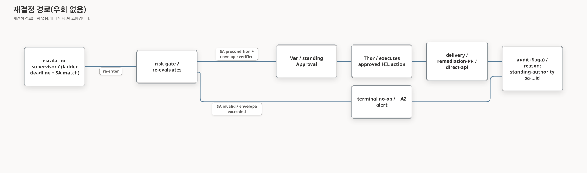

# 에스컬레이션과 상시 권한(감독형 OODA 루프)

리스크 게이트가 **고위험 결정을 사람에게 넘겨 일시정지시킨 뒤** - 아무도 응답하지
않을 때 - 무슨 일이 벌어지는가. 이 문서는 응답 없는 승인 요청을 영향도에 따라 on-call
사슬 위로 걸어 올리는 **시간 제한 에스컬레이션 사다리(에스컬레이션 단계 구조)** 와, 기다리는
것이 행동하는 것보다 더 위험한 경우를 위해 운영자가 **경계가 정해진 조건부 실행**
를 미리 확약해 둘 수 있는 **상시 권한** 아티팩트를 규정한다.
둘 다 기존 단일 패스 컨트롤 루프 위에 얹는 **감독형 OODA 루프** 로 설계된다.

> **범위 알림.** 고객 무관(customer-agnostic). 아래의 모든 사다리 rung 이름, 그룹,
> 임계값, 채널 id 는 업스트림 **기본값** 이다; 포크는 구성 와 catalog-as-code 로
> 이를 조정한다([generic-scope.instructions.md](../../../.github/instructions/generic-scope.instructions.md)).

> **안전 초점.** 여기의 어떤 것도 *안전을 향한 실패(fail toward 안전성)* 를 약화시키지
> 않는다. 상시 권한은 **미리 부여된 사람 승인** 이며, 묶음으로 경계가 정해지고 실행
> 시점에 결정론적으로 재검증된다 - 절대 fail-open 경로가 아니며 LLM 이 실행을 부여하지
> 못한다. 이 문서의 모든 신규 역량은 **shadow 우선** 으로 ship 된다
> ([architecture.instructions.md § 안전성 Invariants](../../../.github/instructions/architecture.instructions.md#safety-invariants)).

사람 보고 원본 고정값 갱신은 설명에만 사용되며 승인이나 실행 권한을 부여하지 않습니다.
## 이 문서가 다루는 것

[architecture.instructions.md § 컨트롤 루프](../../../.github/instructions/architecture.instructions.md#control-loop)
의 컨트롤 루프는 **단일 패스** 다: 이벤트가 정규화 -> 라우팅 -> 판단 -> 실행 -> 감사되어
종단 상태로 간다. 이는 이산적 이벤트에는 옳다. 그러나 결정이 *보류(pending)* 인 채 주변
세계가 변하는 상황은 **모델링하지 않는다**:

적격 사용자는 서명된 Teams 또는 Slack 콜백이나 Entra 인증 FDAI Console 경로에서 이
승인 요청에 응답할 수 있습니다. 두 경로 모두 정확한 승인, 현재 역할, 만료 시각과 역할
분리를 다시 확인한 다음 결정과 지속성 outbox를 원자적으로 보존합니다. 이 변경은 안전한
응답 화면을 하나 더 제공하지만 에스컬레이션 타이머, 상시 권한 규칙 또는 Thor의 실행
경계를 바꾸지 않습니다.
운영자 허용 정책이 활성 상태이면 HIL 보류 레코드는 Core가 결정 시작 시 고정한 정책 개정
다이제스트도 전달합니다. 재현과 재개는 새 활성화 포인터를 읽지 않고 그 다이제스트를 유지합니다.

- 등록된 ActionType이 있는 실행 가능한 `hil` 판정은 TTL이 있는 승인 요청을 생성합니다.
  거버넌스가 적용된 되돌릴 수 있는 ActionType 의미가 없거나, 작업을 알 수 없거나, 유효 정족수가
  둘 이상이거나, 일치한 규칙이 retired 또는 revoked이면 Forseti는 원래 자동 처리할 수 있던 판정도
  사람 승인으로 낮춥니다. 이렇게 낮아진 결정은 다른 `hil` 결정과 같은 승인 수명 주기를 만들고,
  자동 경로를 실행 가능하다고 보지 않고 결정론적 사유를 기록합니다.
  알림 채널이 구성되지 않아도 TTL 만료는 항상 **종단 무작업 + 감사** 상태로 수렴합니다.
  정확한 이유가 `no_rule_match` 또는 `anomaly_action_unavailable`인 작업 없는 shadow 사람
  검토 판정은 Odin과 Saga가 처리할 수 있도록 Verdict 스트림에 남지만, Thor는 `ActionRun`이나
  리소스 클레임을 만들지 않습니다. 따라서 새로 실행 가능한 제안을 판단하기 전까지 승인 TTL이
  없으며 이 감독자에 들어가지 않습니다. 사용할 수 있는 채널은
  [channels-and-notifications-ko.md의 on-call, 에스컬레이션 및 타임아웃](../interfaces/channels-and-notifications-ko.md)에
  설명된 A2 경보를 추가할 수 있지만, 전달 가능 여부가 만료 처리를 제어하지는 않습니다.
  이 동작은 실패 시 안전하게 차단하며 올바르지만 거기서 멈춥니다.
- **채널 대체 경로** 은 이미 존재한다: 실패한 Teams 승인은 다른 A1 가능 채널로, 이어서
  ops 레인 을 페이지한다([channels-and-notifications-ko.md](../interfaces/channels-and-notifications-ko.md)).
  이는 **전달 실패(전달 실패)** 를 다루지, **사람 무응답(human non-response)**
  을 다루지 않는다 - 별개의 문제다.
- **예보 발견 사항** 은 줄어드는 **lead 시간**(`actual_breach_time - finding_time`, 즉
  위반 ETA)을 운반한다([observability-and-detection-ko.md § 3](../rules-and-detection/observability-and-detection-ko.md#3-예측--예보predictive--forecasting)).
  승인이 응답 없이 놓여 있는 동안 그 ETA 는 계속 좁혀진다 - *무행동의 비용이 시계와 함께
  상승* 하지만, 단일 패스 루프는 이미 넘어가 버렸다.

빈틈은 **시간적 감독자(temporal supervisor)** 다: 결정이 보류인 동안 **타이머로** 루프를
재진입해 상황을 다시 읽고(승인자 여전히 침묵? ETA 더 가까워짐? 무행동의 영향 범위
커짐?), 에스컬레이션하거나, 사전 승인되어 있다면 행동한다. 그것이 OODA 루프다.

## 감독 프레임으로서의 OODA

기존 판테온 컨트롤 루프는 이미 OODA 에 깔끔하게 매핑된다
([architecture.instructions.md § Trust 라우팅](../../../.github/instructions/architecture.instructions.md#trust-routing-3-tier)
의 매핑 참조). 여기서 추가하는 것은 *하나의 보류 결정* 을 감독하며 종단 상태에 이를
때까지 틱 하는 **두 번째, 더 느린 루프** 다.


- 감독자는 **기반 를 직접 변경하지 않는다**. 유일한 privileged 결과(`A2`)는
  액션을 정상 principal 을 통해 재판단·실행하도록 **타입 파이프라인을 재진입** 시키는
  것뿐이다. 실행기 를 직접 호출하는 감독자는 defect 다
  ([architecture.instructions.md § 에이전트 Pantheon](../../../.github/instructions/architecture.instructions.md#agent-pantheon)
  의 conversational 포트 규칙과 동일).
- 루프는 **경계가 정해져 있다**: 최대 rung 수와 하드한 전체 데드라인을 갖는다. 영원히
  틱 할 수 없다.

## 에스컬레이션 사다리

**에스컬레이션 사다리** 는 순서가 있는 **사람 권한 rung** 목록이다. 채널 대체 경로 과는
구별된다: 채널 대체 경로 은 *"메시지가 전달되지 않았다 - 같은 사람에게 다른 파이프로
시도"* 에 답하고, 사다리는 *"메시지는 전달됐지만 권한 있는 누구도 행동하지 않았다 -
누구에게 묻는지를 영향도에 따라 넓힌다"* 에 답한다.

| 개념 | 답하는 질문 | 페일오버 조건 | 위치 |
|------|-------------|---------------|------|
| **채널 대체 경로** | 전달 실패 | 채널 도달 불가 / 전송 오류 | [channels-and-notifications-ko.md § 6](../interfaces/channels-and-notifications-ko.md) |
| **에스컬레이션 사다리** | 사람 무응답 | rung TTL 이 결정 없이 경과 | 이 문서 |

명시적으로 선택한 ActionType에서는 검토된
[사람 보고선](../interfaces/human-report-lines-and-approval-routing-ko.md)이 사다리의 사람 순서를
제공할 수 있습니다. FDAI는 첫 알림 전에 요청자에게 연락 동의를 받습니다. 각 전달 전과 승인을
수락하기 전에 그래프 리비전, 현재 역할 및 principal-to-ActionType 정책을 다시 확인합니다.
경로가 변경되거나 불완전하면 관련 없는 Owner로 대체하지 않고 안전한 무작업으로 종료합니다.

각 rung 은 **누구**(Entra 그룹으로, 오늘날 승인자 그룹과 똑같이 컨트롤 플레인 바깥에서
해석됨), **rung 별 TTL**, 사용 가능한 **알림 카테고리**(결정을 운반하는 rung 은 A1,
인지용은 A2 페이징)를 선언한다. 사다리는 **영향도 계층으로 선택** 된다 - `resource`
범위 발견 사항 은 기본 on-call 까지만 도달하고, `subscription` 에 근접한 영향은 인시던트
commander 를 빠르게 소집한다.

```yaml
# 배포된 catalog-as-code 아티팩트 (shadow-first; 롤아웃 참고).
# rule-catalog/escalation-ladders/prod-forecast-breach.yaml
version: 1
kind: escalation_ladder
id: prod-forecast-breach
priority: 10                     # 고유값; 오름차순 first-match
select_when:
  environment: prod
  finding_class: forecast.breach
  impact_at_least: resource_group
rungs:
  - rung: on_call_primary
    audience_group: aw-oncall-primary   # placeholder; fork가 실제 그룹 공급
    ttl_seconds: 300
    category: hil_approval
  - rung: on_call_secondary
    audience_group: aw-oncall-secondary
    ttl_seconds: 300
    category: hil_approval
    also_page: [pagerduty-primary]      # A2 인지용, 비결정
  - rung: incident_commander
    audience_group: aw-incident-commander
    ttl_seconds: 600
    category: hil_approval
    also_page: [pagerduty-primary, sms-oncall]
overall_deadline_seconds: 1500   # hard cap; 만료 시 -> 상시 권한이 먼저
                                 # 발동하지 않는 한 종료성 no-op
```

지속 시간은 `5m` 문자열이 아니라 정수 초이므로, 재실행된 스케줄이 지속시간 파서에
의존하지 않습니다. `priority`는 first-match 선택을 전순서로 만들며, 로더는 중복을
거부합니다. 우선순위를 공유하는 두 사다리는 선택을 디렉터리 순서에 의존하게 만들기
때문입니다. 또한 로더는 rung TTL 합이 `overall_deadline_seconds`에 들어가지 않는 사다리를
거부하므로 마감이 조용히 도달 불가로 만드는 청중을 선언할 수 없고, 자신의 결정 청중을
페이징하는 rung도 거부합니다. 페이징은 인지일 뿐 절대 승인 권한이 아니기 때문입니다.

- **에스컬레이션을 거쳐도 자기 승인 은 성립하지 않는다.** 이후 rung 은 *다른*
  principal 이다; approver-of-record 는 실제로 결정한 사람이고, 실행기 는 여전히 별개
  principal 이다(Var 가 승인, Thor 가 실행 - [agent-pantheon-ko.md](../agents/agent-pantheon-ko.md)).
- **모든 rung 전이는 감사** 되며, 지문 가 반복되면 기존 `HandoffEscalation` ->
  GitHub issue 경로로 흘러 만성적 무응답이 조용한 손실이 아니라 추적되는 신호가 된다
  ([agent-pantheon-ko.md § 6.4 인계 에스컬레이션 프로토콜](../agents/agent-pantheon-ko.md)).

## 시간 감쇠 긴급도

위 사다리는 명료함을 위해 *고정* TTL 을 쓰지만, 위반이 예보될 때 긴급도는 고정이 아니다.
감독자는 매 틱 마다 **긴급도(urgency)** 신호를 재계산해 rung TTL 을 **압축** 하고 **시작
rung 을 올린다**:

- **입력**(모두 이미 업스트림에서 생산됨, 신규 수집 없음): 리스크 게이트의 `impact` /
  영향 범위, 예보기의 **위반 ETA**([observability-and-detection-ko.md § 3](../rules-and-detection/observability-and-detection-ko.md#3-예측--예보predictive--forecasting)),
  **rung age**(현재 rung 이 침묵한 시간).
- **경험칙**: `effective_ttl = min(rung.ttl, k * remaining_lead_time)`. 예보 ETA 가
  좁혀질수록 각 사람에게 주어지는 창은 줄고, 루프는 사다리를 더 빨리 오른다 - 선언된
  값을 넘겨 TTL 을 *늘리지는* 절대 않는다.
- **신뢰도는 여전히 게이트다.** 예보는 그 예측구간 band 가 설정된 신뢰 수준을 통과할
  때만 긴급도를 몰아간다([observability-and-detection-ko.md § 3](../rules-and-detection/observability-and-detection-ko.md#3-예측--예보predictive--forecasting));
  잡음 섞인 point-estimate 위반은 데드라인을 압축하지 못한다.
- **바닥이 starvation을 막는다.** 압축은 `[min_effective_ttl_seconds, rung.ttl_seconds]`로
  제한되므로, 임박한 위반이라도 rung을 사람이 답할 수 없는 창으로 줄이지 못한다.

```yaml
# rule-catalog/escalation-ladders/urgency.default.yaml
version: 1
kind: urgency_policy
id: default-forecast-urgency
lead_time_factor: 0.5            # 위의 k
min_forecast_confidence: 0.9     # 이보다 낮으면 아무것도 압축되지 않음
min_effective_ttl_seconds: 60    # starvation 바닥
```

스케줄은 시계를 읽는 대신 남은 lead time과 예보 신뢰도를 인자로 받는 순수 함수가
계산하므로, 기록된 에스컬레이션은 같은 타임라인으로 재실행됩니다. 정책이 없거나, 예보가
없거나, 예보가 `min_forecast_confidence` 미만이면 모든 rung은 선언된 TTL을 그대로
유지합니다. 증명되지 않은 긴급도 신호는 사람의 창을 절대 줄이지 않습니다.

긴급도는 사다리를 **얼마나 빨리** 걷는지를 바꿉니다. 무인 상태의 승인된 실행을 허용할지는
바꾸지 않으며 그 게이트가 상시 권한입니다.

## 상시 권한(사전 승인 조건부 실행)

이것이 *"운영자가 자동 조치를 미리 설정해 둔"* 경우 뒤의 메커니즘이다. **상시 권한** 은
운영자가 작성한 policy-as-code 아티팩트로 다음을 말한다:

> **조건** C 하에서, **묶음** E 안의 액션에 대해, 에스컬레이션 사다리가 **응답 없이**
> 데드라인에 도달하면, 미리 기록된 사람 Approval이 액션의 `hil` 요구를 충족할 수 있습니다.

핵심 설계 속성: 상시 권한은 **새 결정 엔진이 아니고 우회도 아니다.** 그것은 기존 리스크
게이트에 대한 **결정론적 입력** 이다. 감독자의 Decide 단계가 *"이것이 무인 상태로 진행될
수 있는가?"* 를 물으면, 리스크 게이트는 다른 규칙을 검사하듯 상시 권한을 검사해 답한다 -
그리고 실행 자격은 여전히 그 결정론적 검증이 부여하며, 모델이 부여하지 않는다
([architecture.instructions.md § LLM Quality 게이트](../../../.github/instructions/architecture.instructions.md#llm-quality-gate-required-for-t2)).
확정된 `CausalHypothesis` 종결도 마찬가지로 근거일 뿐이며, 그 자체로 상시 권한 조건, 범위
또는 `hil` 요구 사항을 충족하지 않는다.

```yaml
# 배포된 스키마와 일치 (shadow 전용; 아래 롤아웃 참고).
# authority/standing-authorization.json
schema_version: "1.0.0"
id: sa-scale-out-before-quota-breach
authorization_revision: <content-digest>
status: active                  # active | revoked | expired | superseded
mode: shadow                     # 명시적으로 승격되기 전까지 판단·기록만; 오늘은 이 값만 허용
requested_by: <normalized-human-principal>
approvals:                       # 서로 다른 정규화된 human principal; 최소 2명
  - principal: <accountable-service-owner>
    role: service_owner
    approved_at: <rfc3339-timestamp>
  - principal: <owner-level-approver>
    role: owner
    approved_at: <rfc3339-timestamp>
quorum_required: 2
valid_from: <rfc3339-timestamp>
valid_until: <rfc3339-timestamp>  # 담당 owner가 갱신하지 않으면 만료됨
service_ref: <service-id>
scope:                            # resource-group-equivalent 이하여야 함
  level: resource_group          # resource | resource_group; 구독/테넌트 범위는 절대 불가
  value: <rg-name>               # placeholder; fork가 실제 범위 공급
pins:                             # 이 위임이 검토된 정확한 리비전
  policy_digest: <risk-and-approval-policy-digest>
  target_revision: <inventory-and-operating-model-revision>
  action_type_versions: [remediate.scale-out.compute@<version>]
  evidence_revisions: [<governed-evidence-ref>]
incident_classes: [forecast.breach]
responders:
  primary: <on-call-primary>
  backup: <on-call-backup>
  confirmed_at: <rfc3339-timestamp>
evidence:
  history_reviewed: true         # 담당자가 적용 가능한 로그·인시던트·감사 이력을 검토함
  precedent_ref: <governed-evidence-ref>
  scenario_evidence_ref: <dr-chaos-or-simulation-ref>
envelope:                         # 액션은 반드시 이 안에 완전히 들어와야 함
  action_types: [remediate.scale-out.compute]
  max_blast_radius: <bounded-resource-count>
  max_duration_seconds: <bounded-duration>
  reversible: true               # 가역적인 액션만 사전 승인될 수 있음
  rollback_contract: scripted    # 테스트된 되돌리기 경로가 필수
  stop_conditions: [<rollback-trigger-condition>]
```

**무엇이 이것을 안전하게 하는가(협상 불가 항목):**

- **사람 재정의 처럼 경계가 정해진다.** 범위는 resource-group-equivalent 이하여야
  한다 - 사람 재정의 메커니즘이 강제하는 것과 동일한 상한
  ([architecture.instructions.md § Human 재정의](../../../.github/instructions/architecture.instructions.md#human-override)).
  구독 전역 상시 권한은 없다.
- **비파괴적이고 가역적인 액션만.** 파괴적 액션 또는 `irreversible: true` 액션은 절대 사전 승인될 수 없다;
  항상 HIL+정족수로 라우팅된다
  ([coding-conventions.instructions.md § 안전성](../../../.github/instructions/coding-conventions.instructions.md#safety)).
  상시 권한은 선언되고 테스트된 `rollback_contract` 를 요구한다.
- **사다리 우선, 사다리 대체 아님.** 소비자는 에스컬레이션 사다리의 `overall_deadline_seconds`가
  응답 없이 경과한 뒤에만 상시 권한을 참조해야 합니다 - 이는 스키마가 인코딩하지 않는 호출
  코드 측 불변식입니다. 아직 아무것도 평가기를 소비하지 않기 때문입니다(구현 상태 참고). 먼저
  채널 대체 경로가 전달을 확인해야 하며 연락할 수 없는 사람을 침묵으로 기록하지 않습니다. 상시 권한은
  실제 사람들이 요청받고 데드라인이 지난 뒤에만 발동할 수 있습니다 - *꼬리를 줄이는* 것이지
  사람을 대체하지 않습니다.
- **서로 다른 human 정족수가 approver-of-record입니다.** 최소 2명의 정규화된 서로 다른 human,
  accountable 서비스 소유자 및 Owner-level 권한이 승인합니다. 요청자와 실행자는 제외됩니다.
  Var가 서명된 개정 번호를 standing Approval로 전달하며 model-as-approver는 허용되지 않습니다.
- **단독 운영자 프로덕션 프로필.** 설치의 승인 정책이
  [단독 운영자 프로덕션 프로필](operator-governance-profiles-ko.md)을 선택하면, 서비스 소유자와
  Owner 역할을 모두 가진 지정 운영자가 유일한 승인자가 될 수 있으며 `quorum_required: 1`은 이
  프로필에서만 유효합니다. 상시 권한 스키마와 평가기가 이 규칙을 구현합니다. 새 인증, 전체 권한 내용의 명시적 확인, 경계, 만료, 철회, 인수인계 재확인,
  사후 검토는 그대로이며 실행자는 계속 승인자가 될 수 없습니다. 기본 다중 운영자 프로필은 여전히
  두 개의 승인을 요구합니다.
- **운영 증거가 최신이어야 합니다.** 담당자는 적용 가능한 서비스 로그, 인시던트 및 감사
  이력을 검토하고 선례의 존재 여부를 기록합니다. 충분한 선례가 없으면 현재 DR 훈련, 제한된
  Chaos 실험 또는 시뮬레이션이 시나리오 증거를 제공합니다.
- **인수인계 후 재확인 전까지 중단합니다.** 모든 담당자 인수인계에서 새 책임 담당자가 서비스,
  대응자, 경계, 증거 및 만료를 확인해야 합니다. 확인이 누락되거나 오래되거나 거절되면 상시
  권한을 적용할 수 없습니다.
- **Validity와 철회는 단조롭습니다.** `valid_from <= now < valid_until` 및
  `status=active`가 필요합니다. 취소는 즉시 pending re-decision을 차단합니다. 갱신은 기존
  레코드를 연장하지 않고 fresh 정족수, 근거 및 응답자 확인을 가진 새 변경할 수 없는
  개정 번호를 생성합니다.

### 수명 주기 영속성과 디스패치 fence

하나의 Core 수명 주기 작성기가 각 상시 권한 부여 기능군을 소유합니다. Operator API는 사람 명령을
인증하고 타입이 지정된 수신 경로로 게시하며 수명 주기 테이블을 직접 쓰지 않습니다. PostgreSQL은
하나의 기능군 행에서 승인, 갱신 및 폐기 명령을 직렬화하고 변경할 수 없는 개정 번호, 해시 체인
전이, 현재 스냅샷, fencing 세대 및 수명 주기 감사 항목을 하나의 트랜잭션으로 커밋합니다.

개정 번호 다이제스트는 Core가 발급한 기능군 ID, 발급 시각 및 선행 개정 번호를 포함한 변경할 수
없는 권한 부여 조건만 다룹니다. 승인과 독립적으로 검증된 근거 레코드는 이 다이제스트에 결속된
별도의 변경할 수 없는 항목입니다. 이 구조는 순환 다이제스트를 피하면서 승인이나 근거 묶음을 다른
개정 번호에 재사용하지 못하게 합니다.

각 전이는 연속된 기능군 순서, 이전 전이 다이제스트 및 단조롭게 증가하는 fencing 세대를
포함합니다. 재현은 승인 전이부터 시작하여 전체 체인을 검증한 뒤에만 활성 스냅샷을 다시 만들 수
있습니다. 변환 결과가 없거나 순서가 비거나 전이 순서가 바뀌거나 다이제스트가 깨지거나 예상 개정
번호 또는 세대가 오래된 경우 활성 권한을 반환하지 않습니다.

수명 주기 fence는 정확한 기능군, 개정 번호, 세대 및 전이 다이제스트를 지정합니다. 권위 있는 주
저장소는 효과 디스패치 직전에 이 fence를 비교할 수 있습니다. 이 읽기 시점 검사는 효과 실행 중
폐기 경쟁을 막지 못하므로 현재 shadow 범위에서는 평가기와 함께 연결하지 않습니다. 적용 모드에는
부작용 커밋 동안 유지되는 별도 검토된 잠금 또는 lease, 통제된 shadow 근거 및 독립적인 승격 검토가
필요합니다.

선택된 `ops.start-vm@1.0.0` 개발 범위는 리소스 그룹 하나의 VM 하나만 대상으로 하는
프로바이더 경계 shadow probe를 추가합니다. 기존 `StandingAuthorizationLeaseStore` fence를
통해 획득한 lease를 비교하고 콘텐츠 주소 영수증을 만들지만,
`provider_commit_attempted=false`, `effect_applied=false`,
`provider_capability_outcome=ineligible_capability`를 항상 기록합니다. Azure Resource
Manager는 VM 시작 수락을 PostgreSQL lease 트랜잭션과 결합할 수 없습니다. 따라서 현재
shadow fence는 계약에 대한 근거일 뿐 ActionType에 A3-E 자격을 부여하지 않습니다.

이제 이 부적격은 주장이 아니라 도출됩니다. `provider_eligibility.py`는 프로바이더 커밋 시점에
현재 lease와 fencing 세대를 원자적으로 검증하는 ActionType 집합인 `A3E_COMMIT_FENCE_ADAPTERS`를
소유합니다. 이 집합은 비어 있으므로 `a3e_fence_capability`는 배포된 모든 ActionType에
`INELIGIBLE_CAPABILITY`를 반환하고, 승격 후보는 부적격 집합을 작성자에게서 받는 대신 이 분류에서
도출합니다. 어댑터 등록은 위의 영속 프로바이더 경계를 요구하는 권한 관련 변경이며, 그 자체로는
실행 권한이나 승격 권한을 부여하지 않습니다.

같은 범위는 순수 효과 결과 계획기도 추가합니다. 일치한 독립 근거는 전이를 제안하지 않고,
실패, 시간 초과, 누락, 오래됨, 충돌, 검열 또는 그 밖의 채점 불가 근거는
`return_to_shadow`를 제안합니다. 계획기는 레지스트리 작성자가 아니며, 상시 권한을 취소하거나
복구 권한을 부여하지 않습니다. 이후 권한을 수반하는 소비자는 별도로 검토하고 승인해야 합니다.

로컬 acceptance fence 모델은 한 프로세스 안에서 스크립트로 만든 provider 제출 시도 하나의
순서를 정합니다. callback 전에 `PREPARED`를 영구 기록하고 정확한 lease fence를 다시 확인하며,
target-fence 다이제스트마다 permit을 최대 하나만 발급하고 `ACCEPTED`, 긍정적으로 입증된
`NOT_ACCEPTED`, 또는 `UNKNOWN`을 기록합니다. 기존 상태는 모두 추가 제출을 차단합니다.
시간 초과, 취소, 예외 또는 종료 기록 불확실성은 commit-equivalent 상태로 남아 재시도할 수
없습니다. 결정론적 `x-ms-client-request-id`는 상관관계 용도일 뿐 provider 측 중복 제거가 아닙니다.

이 모델은 분산 원자성이 아니고, 취소와 제출의 경쟁을 닫지 않으며, VM 효과를 증명하지 않습니다.
`production_eligible=false`를 선언하고 process-local 테스트 저장소만 가지며 연결하지 않은 상태를
유지합니다. 엄격한 `StandingAuthorizationLeaseStore` provider-commit 계약과
`INELIGIBLE_CAPABILITY` 결과는 바뀌지 않습니다.

- **실행이 validity 구간 안에 들어갑니다.** Risk 게이트는 전달 전에
  `now + max_duration_seconds <= valid_until`을 요구합니다. 저장된 instant에는 trusted UTC를,
  실행 기한에는 단조 증가 경과 시간을 사용합니다. 시계 사용 불가 또는 과도한 skew가
  있으면 권한을 적용할 수 없습니다.
- **응답자가 최신이어야 합니다.** 충족 여부에는 time-aware OnCallSchedule 증적 또는
  `valid_until`보다 늦지 않게 만료되는 명시적 기본 및 백업 신원이 필요합니다.
- **버전을 고정하고 취소할 수 있습니다.** 권한 리비전, 정책 다이제스트, 대상 리비전, ActionType 및
  워크플로우 버전, 증거 리비전을 고정합니다. 불일치, 취소, 정책 변경, 대상 표류 또는 카탈로그
  변경이 발생하면 독립적인 재승인이 필요합니다.
- **Chaos 주입은 제외됩니다.** 상시 권한은 fault 주입을 승인하지 않습니다. 별도로
  사람이 승인한 실험은 제한된 중단 및 복구 경로만 사전승인할 수 있습니다.
- **7개 자율 작업 안전조건이 모두 적용됩니다.**
  ([architecture.instructions.md § Seven Autonomous-Action Safeguards](../../../.github/instructions/architecture.instructions.md#seven-autonomous-action-safeguards)).
- **위험한 액션보다 안전 강등(safe-degradation) 을 선호.** 가능하면 사전 승인 액션은
  파괴적 교정 자체가 아니라 시간을 버는 **가역 완화(스케일 아웃, circuit 차단기
  열기, 할당량 확장)** 다. 시간을 버는 것은 사람 루프를 끝내는 대신 재무장시킨다.

## 재결정 경로(우회 없음)

상시 권한이 발동되면 감독자는 **실행하지 않는다.** 보류된 액션을 새 결정으로 **타입
파이프라인에 재주입** 한다:



- **Forseti는 위험을 높이지 않고 재판단합니다.** 원래 `hil` 기준 판정은 유지됩니다. Risk 게이트는
  유효하고 만료되지 않았으며 범위가 맞고 고정된 리비전과 경계가 계속 성립하는 상시 권한을
  검증합니다. Var는 미리 기록된 사람 Approval을 구체화합니다. 판단자, 승인자 및 실행자는
  계속 분리됩니다.
- **상시 권한은 승인을 충족할 뿐 모드를 높이지 않습니다.** `ActionPromotionRegistry`는
  독립적인 shadow/enforce 축으로 유지되며 A3-E를 나타낼 수 없습니다. A3-E 검토는
  Owner를 포함한 서로 다른 두 명의 피싱 방지형 승인을 요구하는 전용
  `standing-authority-promotion` 변경 등급을 사용합니다. 계획된 단독 운영자 프로덕션 프로필에서는
  지정 운영자의 단일 Owner 승인이 이 등급을 충족합니다. 일반 `enforce-promotion` 등급은
  이 권한을 충족할 수 없으며, 검토 결정 자체는 실행 권한을 부여하지 않습니다.
- **Thor 가 실행** 하고, Vidar 는 롤백 principal 로 남으며, Saga 는 명시적
  `standing-authority` 이유와 권한 id 로 감사한다 - 재현 가능하고 귀속 가능한 기록
  ([architecture.instructions.md § 멱등성, 정렬, and 재생](../../../.github/instructions/architecture.instructions.md#idempotency-ordering-and-replay)).
- **묶음 위반은 실패 시 차단.** 보류 액션이 묶음 에 맞지 않으면(잘못된 액션
  타입, 영향 범위 증가, 인벤토리 stale) 상시 권한은 **적용되지 않고** 루프는 no-op
  으로 종료한다.

## 에이전트 매핑(신규 에이전트 없음)

판테온은 fork-locked 다 - **어떤 에이전트도 추가·제거·개명되지 않는다**
([agent-pantheon.instructions.md](../../../.github/instructions/agent-pantheon.instructions.md)).
감독형 루프는 기존 에이전트와 기존 토픽으로 표현된다:

| OODA 단계 | 에이전트 | 사용하는 기존 책임 |
|-----------|----------|--------------------|
| **Observe** | Heimdall, Huginn | 예보 발견 사항 + 보류 승인 상태 재독(센싱, 결정론 우선) |
| **Orient** | Odin | 영향도 중재; 지금 어느 rung 과 긴급도가 유효한가 |
| **Decide** | Forseti (+ 리스크 게이트) | 원래 `hil` 기준을 높이지 않고 재판단 |
| **Act (에스컬레이션)** | Var | 다음 rung 으로 A1 요청 운반; approver-of-record |
| **Act (실행)** | Var, Thor | Var가 상시 Approval을 제공하고 Thor만 실행 |
| **복구** | Vidar | 실행된 완화의 롤백 경로 |
| **감사 / 핸드오프** | Saga | 감사 덧붙이기 + 만성 무응답 시 `HandoffEscalation` |

감독자 자체는 **보류 결정의 수명 주기 행위** 이지 열여섯 번째 에이전트가 아니다: 같은
타입 파이프라인의 타이머 구동 재진입이며, 승인 수명 주기(Var)이 소유하고 Odin 이
중재한다.

## 종단 상태

모든 경로는 감사된 종단 상태로 끝난다 - 루프는 새어나갈 수 없다:

| 종단 | 조건 | 결과 |
|------|------|------|
| **approved** | 어떤 rung 이 `approve` 결정 | Thor 로 실행, 감사 |
| **rejected** | 어떤 rung 이 `reject` 결정 | no-op, 감사 |
| **standing-authority executed** | 사다리 데드라인 경과, SA 유효, 묶음 성립 | 재결정 -> 상시 Approval -> 실행, SA id로 감사 |
| **최종 no-op** | 사다리 소진, 유효 SA 없음 | 무행동, A2 경보, 감사, 지문 반복 시 `HandoffEscalation` |

**실패 시 차단 가 여전히 기본값이다.** 유효한 상시 권한이 없으면 응답 없는 사다리는 여전히
no-op 으로 끝난다 - 오늘의 동작 그대로이되, 더 넓고 영향도 계층 별이며 시간 감쇠하는 사람
집합에게 행동할 기회를 준 뒤일 뿐이다.

## 롤아웃(shadow 우선)

1. **사다리를 shadow 로.** 에스컬레이션 사다리를 판단·기록만 하도록 ship 한다:
   *어느 rung 으로 언제 에스컬레이션했을지* 를 기록하고 아무것도 변경하지 않는다. 실제
   무응답 인시던트에 대해 에스컬레이션 타이밍이 검증되면 사다리별로 승격한다.
2. **상시 권한을 shadow 로.** 모든 상시 권한은 `mode: shadow` 와 측정 가능한 승격
   게이트(예: "N 회 shadow trip, 묶음 escape 0, policy-violation escape 0")를
   선언한다. A3-E shadow 검토에서 상시 승인 경로 자격으로의 승격은 별도의 Owner 검토
   `standing-authority-promotion` 변경이다. 이 승격은 상시 승인 경로만 적격으로 만들며
   레지스트리 모드를 바꾸거나 `hil`을 우회하지 않고, 작성 PR과 함께 처리하지 않는다
   ([coding-conventions.instructions.md § 안전성](../../../.github/instructions/coding-conventions.instructions.md#safety)).
3. **메트릭**(기존 KPI 스트림에 접기,
   [goals-and-metrics-ko.md](../architecture/goals-and-metrics-ko.md)): rung 응답 지연, 에스컬레이션 깊이
   분포, 사다리 소진(no-op) 비율, 상시 권한 trip 비율, 그리고 - 가드 메트릭 - **반드시
   0 을 유지해야 하는 envelope-escape 개수**.

## 미해결 질문

- **Rung 멤버십 소스.** 승인자 그룹에 쓰는 Entra 그룹 바인딩을 재사용할지, 아니면
  on-call 스케줄 연동(PagerDuty/Opsgenie 스케줄 읽기)을 도입해 "누가 기본 인가" 가
  시간 인식적이게 할지. 업스트림은 그룹 우선, 스케줄 연동은 포크 경계로 기운다.
- **긴급도 함수 형태.** `k * remaining_lead_time` 압축은 시작 휴리스틱이다; 정확한 곡선은
  강제 적용 전에 과거 예보-대-위반 시리즈로 backtest 할 튜닝 파라미터다.

## 다음 단계

| 알고 싶은 것 | 읽을 문서 |
|--------------|-----------|
| 이것이 감독하는 단일 패스 컨트롤 루프 | [architecture.instructions.md § 컨트롤 루프](../../../.github/instructions/architecture.instructions.md#control-loop) |
| 액션이 auto / HIL / 거부로 분류되는 방식 | [risk-classification-ko.md](risk-classification-ko.md) |
| 예보 lead 시간 과 예측구간 band | [observability-and-detection-ko.md § 3](../rules-and-detection/observability-and-detection-ko.md#3-예측--예보predictive--forecasting) |
| 채널 대체 경로 vs 이 사람 권한 사다리 | [channels-and-notifications-ko.md](../interfaces/channels-and-notifications-ko.md) |
| 어느 에이전트가 에스컬레이션·판단·실행하는가 | [agent-pantheon-ko.md](../agents/agent-pantheon-ko.md) |
| 이것이 본뜬 경계형 사람 재정의 메커니즘 | [architecture.instructions.md § Human 재정의](../../../.github/instructions/architecture.instructions.md#human-override) |

## 관련 문서

| 알아볼 내용 | 읽을 문서 |
|-------------|-----------|
| 구현 상태 및 남은 작업 | [구현 원장](../../roadmap-implementation/decisioning/escalation-and-standing-authority.md) |
