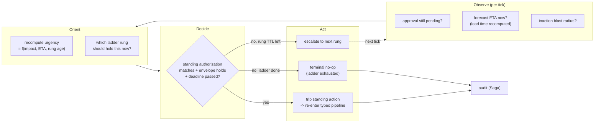
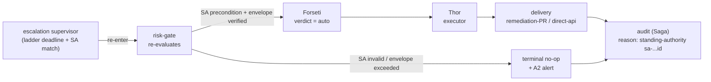

# Escalation and Standing Authority (the supervised OODA loop)

What happens to a **high-risk decision after the risk gate pauses it for a
human** - and nobody answers. This doc specifies the **time-bounded escalation
ladder** that walks an unanswered approval up the on-call chain by impact, and
the **standing authorization** artifact that lets an operator pre-commit a
bounded, conditional auto-action for the case where waiting is more dangerous
than acting. Both are framed as a **supervised OODA loop** layered on the
existing single-pass control loop.

> **Scope reminder.** Customer-agnostic. Every rung name, group, threshold, and
> channel id below is an upstream **default**; a fork tunes them via config and
> catalog-as-code ([generic-scope.instructions.md](../../../.github/instructions/generic-scope.instructions.md)).

> **Safety focus.** Nothing here weakens *fail toward safety*. Standing
> authorization is a **human approval given in advance**, bounded by an
> envelope and re-verified deterministically at execution time - it is never a
> fail-open path and never lets an LLM grant execution. Every new capability in
> this doc ships **shadow-first** ([architecture.instructions.md § Safety
> Invariants](../../../.github/instructions/architecture.instructions.md#safety-invariants)).

> **Implementation status (2026-07-21):** Proposed. The human non-response
> ladder, standing-authority catalogs, temporal supervisor, and runtime bindings
> described here have not landed. `core/quality_gate/escalation_ladder.py` is a
> separate model-escalation policy and does not implement this design.

## What this doc covers

The control loop in
[architecture.instructions.md § Control Loop](../../../.github/instructions/architecture.instructions.md#control-loop)
is **single-pass**: an event is normalized, routed, decided, acted on, and
audited to a terminal state. That is correct for a discrete event. It does
**not** model a decision that stays *pending* while the world changes around it:

- A `hil` verdict fires an approval request with a TTL. Today, TTL expiry is a
  **no-op + audit + A2 alert** ([channels-and-notifications.md § on-call,
  escalation, timeouts](../interfaces/channels-and-notifications.md)). Fail-closed, correct -
  but it stops there.
- **Channel fallback** already exists: a failed Teams approval falls to another
  A1-capable channel, then pages the ops lane
  ([channels-and-notifications.md](../interfaces/channels-and-notifications.md)). That handles
  **delivery failure**, not **human non-response** - a different problem.
- A **forecast finding** carries a shrinking **lead time** (`actual_breach_time
  - finding_time`, the breach ETA) ([observability-and-detection.md § 3.
  Predictive / Forecasting](../rules-and-detection/observability-and-detection.md#3-predictive--forecasting)).
  While an approval sits unanswered, that ETA keeps closing - the *cost of
  inaction rises with the clock*, but the single-pass loop has already moved on.

The gap is a **temporal supervisor**: something that re-enters the loop **on a
timer** for as long as a decision is pending, re-reads the situation (approver
still silent? ETA closer? blast radius of inaction grown?), and escalates or, if
pre-authorized, acts. That is an OODA loop.

## OODA as the supervision frame

The existing pantheon control loop already maps cleanly onto OODA (see the
mapping in [architecture.instructions.md § Trust Routing](../../../.github/instructions/architecture.instructions.md#trust-routing-3-tier)).
The addition here is a **second, slower loop** that supervises *one pending
decision* and ticks until it reaches a terminal state.



- The supervisor **never mutates substrate directly**. Its only privileged
  outcome (`A2`) is to **re-enter the typed pipeline** so the action is
  re-judged and executed through the normal principals. A supervisor that called
  an executor directly would be a defect (same rule as the conversational port
  in [architecture.instructions.md § Agent Pantheon](../../../.github/instructions/architecture.instructions.md#agent-pantheon)).
- The loop is **bounded**: it has a maximum number of rungs and a hard overall
  deadline. It cannot tick forever.

## The escalation ladder

An **escalation ladder** is an ordered list of **human-authority rungs**. It is
distinct from channel fallback: channel fallback answers *"the message did not
get delivered - try another pipe for the same person"*; the ladder answers
*"the message was delivered but nobody with authority acted - widen who is
asked, by impact."*

| Concept | Answers | Fails over on | Lives in |
|---------|---------|---------------|----------|
| **Channel fallback** | delivery failure | channel unreachable / send error | [channels-and-notifications.md § 6](../interfaces/channels-and-notifications.md) |
| **Escalation ladder** | human non-response | rung TTL elapsed with no decision | this doc |

Each rung declares: **who** (an Entra group, resolved outside the control plane
exactly like approver groups today), a **per-rung TTL**, and the **notification
category** it may use (A1 for the decision-carrying rung, A2 paging for
awareness). The ladder is **selected by impact tier** - a `resource`-scoped
finding may only ever reach the primary on-call; a `subscription`-adjacent
impact recruits the incident commander quickly.

```yaml
# Proposed catalog-as-code artifact (shadow-first; see Rollout).
# rule-catalog/escalation-ladders/<name>.yaml
version: 1
id: prod-outage-imminent
select_when:                     # first-match, evaluated by the risk gate
  environment: prod
  finding_class: forecast.breach
  impact_at_least: resource_group
rungs:
  - rung: on_call_primary
    audience_group: aw-oncall-primary   # placeholder; fork supplies real group
    ttl: 5m
    category: a1_hil_approval
  - rung: on_call_secondary
    audience_group: aw-oncall-secondary
    ttl: 5m
    category: a1_hil_approval
    also_page: [pagerduty-primary]      # A2 awareness, non-deciding
  - rung: incident_commander
    audience_group: aw-incident-commander
    ttl: 10m
    category: a1_hil_approval
    also_page: [pagerduty-primary, sms-oncall]
overall_deadline: 25m            # hard cap; on expiry -> terminal no-op unless
                                 # a standing authorization trips first
```

- **No self-approval survives escalation.** A later rung is a *different*
  principal; the approver-of-record is whoever actually decides, and the executor
  is still a separate principal (Var approves, Thor executes -
  [agent-pantheon.md](../agents/agent-pantheon.md)).
- **Every rung transition is audited** and, when the fingerprint repeats, feeds
  the existing `HandoffEscalation` -> GitHub issue path so chronic non-response
  becomes a tracked signal, not a silent loss
  ([agent-pantheon.md § 6.4 Handoff escalation protocol](../agents/agent-pantheon.md)).

## Time-decaying urgency

The ladder above uses *fixed* TTLs for clarity, but urgency is not fixed when a
breach is forecast. The supervisor recomputes, each tick, an **urgency** signal
and uses it to **compress** rung TTLs and to **raise the starting rung**:

- **Inputs** (all already produced upstream, no new collection): `impact` /
  blast radius from the risk gate, **breach ETA** from the forecaster
  ([observability-and-detection.md § 3](../rules-and-detection/observability-and-detection.md#3-predictive--forecasting)),
  and **rung age** (how long the current rung has been silent).
- **Rule of thumb**: `effective_ttl = min(rung.ttl, k * remaining_lead_time)`.
  As the forecast ETA closes, the window each human gets shrinks, and the loop
  climbs the ladder faster - it never *lengthens* a TTL past the declared value.
- **Confidence still gates.** A forecast only drives urgency when its
  prediction-interval band clears the configured confidence level
  ([observability-and-detection.md § 3](../rules-and-detection/observability-and-detection.md#3-predictive--forecasting));
  a noisy point-estimate breach does not get to compress deadlines.

Urgency changes **how fast** the ladder is walked; it never changes **whether**
an action is allowed to auto-execute. That gate is standing authorization.

## Standing authorization (pre-authorized conditional auto-action)

This is the mechanism behind *"the operator configured an automatic action in
advance."* A **standing authorization** is an operator-authored, policy-as-code
artifact that says:

> Under **condition** C, for actions inside **envelope** E, if the escalation
> ladder reaches its deadline **unanswered**, the action that was `hil` becomes
> `auto`-eligible - and only then.

The crucial design property: a standing authorization is **not a new decision
engine and not a bypass**. It is a **deterministic input to the existing risk
gate**. When the supervisor's Decide step asks *"can this proceed unattended?"*,
the risk gate answers by checking a standing authorization the same way it checks
any other rule - and execution eligibility is still granted by that deterministic
verification, never by a model
([architecture.instructions.md § LLM Quality Gate](../../../.github/instructions/architecture.instructions.md#llm-quality-gate-required-for-t2)).

```yaml
# Proposed catalog-as-code artifact (shadow-first; see Rollout).
# rule-catalog/standing-authority/<name>.yaml
version: 1
id: sa-scale-out-before-quota-breach
authored_by: aw-owners           # a human authority; recorded as approver-of-record
scope:                            # MUST be resource-group-equivalent or narrower
  environment: prod              # (same bound as a human override)
  resource_group: <rg-name>      # placeholder; fork supplies real scope
precondition:                     # all must hold, deterministically checked
  finding_class: forecast.breach
  min_forecast_confidence: 0.90
  min_lead_time: 3m              # do not act on a breach already upon us
envelope:                         # the action MUST fall entirely inside this
  action_types: [remediate.scale-out.compute]
  max_blast_radius: resource_group
  reversible: true               # only reversible actions may be pre-authorized
  rollback_contract: scripted    # a tested undo path is mandatory
trigger:
  after: ladder_unanswered       # only after the ladder deadline, never before
mode: shadow                      # judge-and-log until explicitly promoted
```

**What makes this safe (the non-negotiables):**

- **Bounded like a human override.** Scope MUST be resource-group-equivalent or
  narrower - the same ceiling the human-override mechanism enforces
  ([architecture.instructions.md § Human Override](../../../.github/instructions/architecture.instructions.md#human-override)).
  There is no subscription-wide standing authorization.
- **Reversible-only.** An `irreversible: true` action can never be pre-authorized;
  it always routes HIL+quorum
  ([coding-conventions.instructions.md § Safety](../../../.github/instructions/coding-conventions.instructions.md#safety)).
  A standing authorization requires a declared, tested `rollback_contract`.
- **Ladder-first, never ladder-instead.** The trigger is `after:
  ladder_unanswered`. A standing authorization can only fire once real humans
  were asked and the deadline passed - it *shortens the tail*, it does not
  replace the human.
- **Human is the approver-of-record.** `authored_by` records the human authority
  that pre-committed the decision; Var carries it as the standing approval so the
  approve-vs-execute principal split holds (no self-approval, no
  model-as-approver).
- **All four safety invariants still apply** to the executed action:
  stop-condition, rollback path, blast-radius limit, audit entry
  ([architecture.instructions.md § Safety Invariants](../../../.github/instructions/architecture.instructions.md#safety-invariants)).
- **Prefer safe-degradation over the risky action.** When possible, the
  pre-authorized action is a **reversible mitigation** (scale out, open a circuit
  breaker, extend a quota) that buys time, not the destructive remediation itself.
  Buying time re-arms the human loop rather than ending it.

## The re-decide path (no bypass)

When a standing authorization trips, the supervisor does **not** execute. It
**re-injects the pending action into the typed pipeline** as a fresh decision:



- **Forseti re-judges.** The verdict flips to `auto` **only because** the risk
  gate verified a valid, unexpired, scope-matching standing authorization whose
  precondition holds and whose envelope contains the action. Judge is still not
  executor.
- **Thor executes**, Vidar remains the rollback principal, Saga audits with an
  explicit `standing-authority` reason and the authorization id - a replayable,
  attributable record ([architecture.instructions.md § Idempotency, Ordering,
  and Replay](../../../.github/instructions/architecture.instructions.md#idempotency-ordering-and-replay)).
- **Envelope violation fails closed.** If the pending action does not fit the
  envelope (wrong action type, blast radius grew, inventory went stale), the
  standing authorization does **not** apply and the loop terminates as a no-op.

## Agent mapping (no new agents)

The pantheon is fork-locked - **no agent is added, removed, or renamed**
([agent-pantheon.instructions.md](../../../.github/instructions/agent-pantheon.instructions.md)).
The supervised loop is expressed with existing agents and their existing topics:

| OODA step | Agent(s) | Existing responsibility used |
|-----------|----------|------------------------------|
| **Observe** | Heimdall, Huginn | re-read forecast finding + pending-approval state (sensing, deterministic-first) |
| **Orient** | Odin | impact arbitration; which rung and urgency hold now |
| **Decide** | Forseti (+ risk gate) | re-judge; grant `auto` only on verified standing authorization |
| **Act (escalate)** | Var | carry the A1 request to the next rung; approver-of-record |
| **Act (execute)** | Thor | sole privileged executor once verdict is `auto` |
| **Recovery** | Vidar | rollback path for the executed mitigation |
| **Audit / handoff** | Saga | append audit + `HandoffEscalation` on chronic non-response |

The supervisor itself is a **lifecycle behavior of the pending decision**, not a
sixteenth agent: it is the timer-driven re-entry of the same typed pipeline,
owned by the approval lifecycle (Var) and arbitrated by Odin.

## Terminal states

Every path ends in an audited terminal state - the loop cannot leak:

| Terminal | When | Result |
|----------|------|--------|
| **approved** | any rung decides `approve` | execute via Thor, audit |
| **rejected** | any rung decides `reject` | no-op, audit |
| **standing-authority executed** | ladder deadline passed, SA valid, envelope holds | re-decide -> `auto` -> execute, audit with SA id |
| **terminal no-op** | ladder exhausted, no valid SA | no action, A2 alert, audit, `HandoffEscalation` if fingerprint repeats |

**Fail-closed remains the default.** Absent a valid standing authorization, an
unanswered ladder still ends in no-op - exactly today's behavior, just after a
wider, impact-tiered, time-decaying set of humans were given the chance to act.

## Rollout (shadow-first)

1. **Ladder in shadow.** Ship the escalation ladder judging-and-logging only:
   it records *which rung it would have escalated to and when*, mutating nothing.
   Promote per-ladder once the escalation timing is validated against real
   non-response incidents.
2. **Standing authorization in shadow.** Every standing authorization declares
   `mode: shadow` and a measurable promotion gate (e.g. "N shadow trips, zero
   envelope escapes, zero policy-violation escapes"). Promotion to enforce is a
   separate, Owner-reviewed change, never bundled with the authoring PR
   ([coding-conventions.instructions.md § Safety](../../../.github/instructions/coding-conventions.instructions.md#safety)).
3. **Metrics** (fold into the existing KPI stream,
   [goals-and-metrics.md](../architecture/goals-and-metrics.md)): rung-response latency,
   escalation depth distribution, ladder-exhaustion (no-op) rate, standing-
   authority trip rate, and - the guard metric - **envelope-escape count, which
   must stay zero**.

## Open questions

- **Rung membership source.** Reuse the Entra-group binding used for approver
  groups, or introduce an on-call schedule integration (PagerDuty/Opsgenie
  schedule read) so "who is primary" is time-aware? Leaning group-first for the
  upstream, schedule integration as a fork seam.
- **Standing-authority quorum to author.** Human override needs a distinct
  approver; a standing authorization pre-commits autonomy, so it likely needs
  the **elevated quorum of 2** already used for the risk-classification table
  ([risk-classification.md](risk-classification.md)). To confirm.
- **Urgency function shape.** The `k * remaining_lead_time` compression is a
  starting heuristic; the exact curve is a tuning parameter to backtest against
  historical forecast-to-breach series before enforce.

## Next steps

| To learn about | Read |
|----------------|------|
| The single-pass control loop this supervises | [architecture.instructions.md § Control Loop](../../../.github/instructions/architecture.instructions.md#control-loop) |
| How an action is classified auto / HIL / deny | [risk-classification.md](risk-classification.md) |
| Forecast lead time and the prediction-interval band | [observability-and-detection.md § 3](../rules-and-detection/observability-and-detection.md#3-predictive--forecasting) |
| Channel fallback vs this human-authority ladder | [channels-and-notifications.md](../interfaces/channels-and-notifications.md) |
| Which agent escalates, judges, and executes | [agent-pantheon.md](../agents/agent-pantheon.md) |
| The bounded human-override mechanism this mirrors | [architecture.instructions.md § Human Override](../../../.github/instructions/architecture.instructions.md#human-override) |
