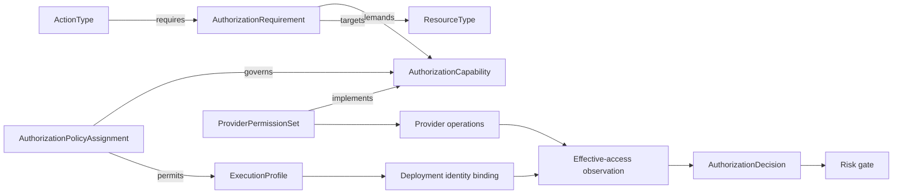
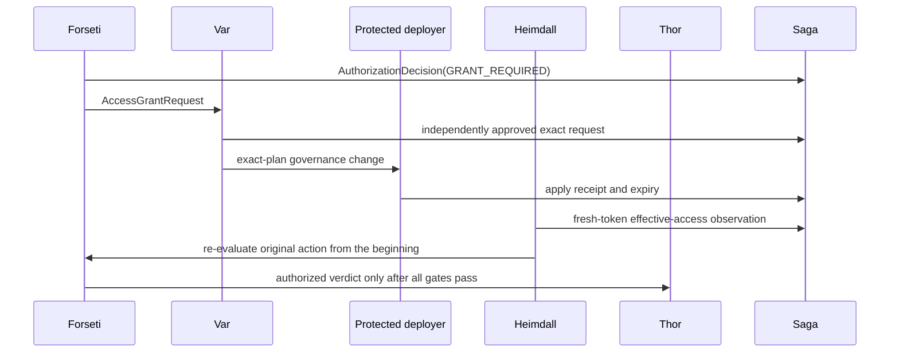

# 실행 권한 부여 온톨로지

이 문서는 provider 역할이나 고객 정책을 `ActionType` 또는 core 코드에 포함하지 않고 FDAI가
액션 실행에 필요한 권한을 확인하는 방법을 정의합니다. 의미 capability, 범위가 지정된 고객 정책,
provider mapping, effective-access evidence, 기존 위험 및 사람 승인 결정을 분리합니다.

> **권한 경계:** 온톨로지는 필요한 capability와 정책 관계를 설명합니다. 접근 권한을 부여하지
> 않습니다. 범위 정책이 capability를 허용하고, 선택된 workload identity의 유효 접근이 확인되며,
> 기존 risk gate가 허용한 경우에만 액션이 진행됩니다.
>
> **고객 경계:** Upstream은 metamodel과 deterministic resolver를 소유합니다. Downstream 배포판은
> 지원되는 catalog 및 provider seam을 통해 정책과 provider mapping을 추가합니다. 배포 identity,
> scope, observation은 upstream source control 외부에 둡니다.

> **구현 상태(2026-07-31):** Strict requirement 및 assignment loader, resolver-backed evaluator,
> hierarchical scope resolver, effective-access probe assembly, exact-plan grant validation,
> composition binder, role-filtered pending-grant browser projection 및 revision-bound browser review가
> 구현되어 있습니다. 배포 환경은 context, identity, permission mapping, probe, 선택적 grant adapter를 바인딩하여 gate를
> 활성화합니다.

## 설계 개요

실행 권한 부여는 독립적으로 versioning되는 네 계층에서 확인됩니다. 모든 결정은 deterministic
replay를 위해 네 계층의 입력을 고정합니다.



| 계층 | 질문 | 권한 |
|------|------|------|
| 의미 | 이 액션에는 어떤 capability가 필요합니까? | Versioned ontology catalog |
| 거버넌스 | 어디에서 어떤 grant posture로 사용할 수 있습니까? | Scoped policy assignment |
| Provider | 어떤 실제 operation이 capability를 구현합니까? | 주입된 provider mapping |
| 근거 | 선택된 identity가 현재 operation을 수행할 수 있습니까? | Effective-access probe |

## Metamodel

권한 부여 개념의 조건, version, lifecycle은 결정에 영향을 주므로 일급 object로 모델링합니다.
Link property만으로 decision-critical state를 표현하지 않습니다.

| ObjectType | 목적 |
|------------|------|
| `AuthorizationCapability` | `compute.restart`와 같은 안정적인 provider-neutral capability입니다. |
| `AuthorizationRequirement` | `ActionType`에 대한 조건부 capability requirement입니다. |
| `ExecutionProfile` | Provider identity identifier가 아닌 논리 executor profile입니다. |
| `AuthorizationPolicyAssignment` | Capability, profile, scope에 바인딩된 고객 정책입니다. |
| `ProviderPermissionSet` | Capability를 provider operation과 token audience로 매핑합니다. |
| `AuthorizationObservation` | 시간 제한이 있는 effective-access evidence입니다. |
| `AccessGrantRequest` | 범위가 제한된 권한 변경 요청입니다. |
| `AccessGrant` | 승인 및 apply evidence와 연결된 만료 가능 grant입니다. |
| `AuthorizationDecision` | Risk classification 및 dispatch 전에 생성되는 replay 가능한 결과입니다. |

관계 kernel은 다음과 같습니다.

| LinkType | Endpoint | 의미 |
|----------|----------|------|
| `requires_authorization` | ActionType -> AuthorizationRequirement | 액션 의미에 이 관계가 필요합니다. |
| `demands_capability` | AuthorizationRequirement -> AuthorizationCapability | Requirement를 안정적인 capability로 확인합니다. |
| `authorization_targets` | AuthorizationRequirement -> ResourceType | Requirement가 적용되는 resource type입니다. |
| `governs_capability` | AuthorizationPolicyAssignment -> AuthorizationCapability | Assignment가 capability를 제한합니다. |
| `permits_profile` | AuthorizationPolicyAssignment -> ExecutionProfile | Assignment에서 적격한 profile입니다. |
| `implements_capability` | ProviderPermissionSet -> AuthorizationCapability | Capability를 구현하는 provider operation입니다. |
| `satisfies_requirement` | AccessGrant -> AuthorizationRequirement | Requirement를 충족하도록 적용한 grant입니다. |
| `attests_grant` | AuthorizationObservation -> AccessGrant | 적용된 grant의 effective probe evidence입니다. |

Capability id는 provider-neutral dotted name을 사용합니다. Provider operation 문자열, tenant
identifier, resource id, workload identity id는 upstream capability 선언에 포함하지 않습니다.

## Requirement 확인

`AuthorizationRequirement`는 stable requirement와 capability reference, action 및 resource-type
selector, bounded scope expression, deterministic condition, target quantifier, provenance,
semantic version을 선언합니다.

Scope expression은 닫힌 provider-neutral grammar를 사용합니다.

| Expression | 결과 |
|------------|------|
| `target` | 정확한 액션 target입니다. |
| `ancestor(resource_group)` | Resource-group-equivalent ancestor입니다. |
| `ancestor(account)` | Account 또는 subscription ancestor입니다. |
| `related(link, depth)` | 하나의 선언된 ontology link를 bounded traversal합니다. |
| `affected_set` | Risk gate에서 이미 계산한 affected resource set입니다. |

알 수 없는 link, truncated traversal, stale inventory, 확인되지 않은 target 또는 선언된 최대 scope보다
넓은 결과는 `UNKNOWN`을 생성합니다. 자동으로 ancestor까지 넓히지 않습니다.

Requirement는 다른 ActionType에서 상속하지 않습니다. 여러 액션을 하나의 versioned requirement 또는
capability와 연결하여 공통 의미를 표현합니다. 이 방식은 circular inheritance를 방지하고 액션
evolution을 독립적으로 유지합니다.

Requirement는 deployment 또는 downstream distribution의 catalog-as-code entry로 관리합니다. Strict
loader는 startup 전에 unknown field, duplicate id, 지원되지 않는 scope expression 및 알 수 없는 action
type, resource type, capability 또는 execution profile reference를 차단합니다.

```yaml
kind: authorization-requirement
id: object.write.target
version: "1.0.0"
capability_id: object.write
action_type_ids: [object.update]
resource_types: [object-storage]
scope_expressions: [target]
execution_profile: change-executor
provenance:
  created_at: "2026-07-31T00:00:00Z"
  created_by: example-team
```

Provider operation, mapping digest, deployment scope id 및 identity reference는 runtime evidence입니다.
이 값은 semantic requirement entry에 포함하지 않습니다.

## 범위가 지정된 정책 assignment

Authorization definition은 assignment가 capability, execution profile, scope에 바인딩할 때까지 inert
상태입니다. Scope grammar는 기존 `scope://` hierarchy와 selector를 재사용합니다.

```yaml
kind: authorization-assignment
id: authz.object-write.prod
version: "1.0.0"
capabilities: [object.write]
execution_profiles: [change-executor]
scope:
  include: [scope://example/account/prod]
  selectors:
    resource_types: [object-storage]
posture: request_jit
constraints:
  allowed_grant_modes: [action_bound, time_bound]
  max_scope: resource
  max_duration_seconds: 1800
  quorum: 2
  approver_roles: [owner]
  require_effective_probe: true
  exemptible: false
enforcement: do-not-enforce
```

| Posture | 의미 |
|---------|------|
| `prohibit` | 선택된 profile과 scope에서 capability가 허용되지 않습니다. |
| `delegate_manual` | 사람 또는 외부 시스템이 operation을 수행합니다. |
| `preprovisioned_only` | 기존 effective access가 필요하며 grant를 요청할 수 없습니다. |
| `request_jit` | 접근이 없을 때 bounded grant request를 생성할 수 있습니다. |
| `standing` | Assignment constraint 내에서 검토된 standing grant가 허용됩니다. |

여기의 `standing`은 provider-access posture이며 헌법의 A3-E standing human authorization이
아닙니다. `AccessGrant`는 action HIL 또는 standing Approval을 충족하지 않고 A3-E Approval은
provider permission을 만들지 않습니다. 둘 다 적용되면 두 독립 gate가 모두 통과해야 합니다.

새 assignment는 `enforcement: do-not-enforce`로 시작합니다. Shadow evaluation은 enforcement가 생성할
결정을 기록합니다. `enforce` promotion은 existing reviewed catalog transition을 따르며 environment 또는
fork marker로 선택할 수 없습니다.

Authoritative intersection에는 `enforce` assignment만 참여합니다. 일치하는 `do-not-enforce`
assignment는 별도 shadow comparison에 사용할 수 있지만 live decision을 prohibit, authorize, narrow 또는
widen할 수 없습니다.

## 정책 합성

일치하는 모든 assignment가 constraint를 제공합니다. FDAI는 더 구체적인 allow가 넓은 restriction을
대체하도록 하지 않고 교집합을 계산합니다.

- `prohibit`는 다른 모든 posture보다 우선합니다.
- 허용되는 grant mode는 교집합으로 계산합니다.
- 최대 scope는 가장 좁은 선언을 사용합니다.
- 최대 duration은 가장 작은 양의 duration을 사용합니다.
- Quorum은 가장 큰 선언을 사용합니다.
- 필수 approver role과 evidence check는 합집합으로 계산합니다.
- `exemptible: false`는 `true`보다 우선합니다.
- 빈 교집합 또는 동일한 specificity의 parameter 불일치는 `POLICY_CONFLICT`를 생성합니다.
- 일치하는 enforced assignment가 없으면 implicit allow가 아닌 `UNCONFIGURED`를 생성합니다.

Scope specificity는 같은 specificity의 모든 assignment가 동의할 때만 parameter source를 선택합니다.
Posture를 높이거나 constraint를 제거할 수 없습니다. Relaxation은 resource-group-equivalent 이하 scope의
별도 time-bounded independent approval exemption을 사용합니다.

## Identity 및 provider mapping

`ExecutionProfile`은 `change-executor` 또는 `recovery-executor`와 같은 논리 이름입니다. 주입된
`ExecutionIdentityResolver`가 profile과 target context를 deployment identity reference로 매핑합니다.
Core는 provider credential을 받거나 resource name을 계산하지 않습니다.

주입된 `ProviderPermissionMapper`는 capability를 atomic provider operation, token audience,
authorization plane, probe strategy 및 mapping version으로 확인합니다. Azure mapping은 Resource
Manager action, RBAC `DataActions`, service-local RBAC 또는 Kubernetes verb를 포함할 수 있습니다.
Azure adapter가 해당 값을 소유합니다.

## Runtime assembly

`ResolverBackedExecutionAuthorizationEvaluator`는 control-loop request를 pure resolver에 연결하는
provider-neutral bridge입니다. Stable requirement id 순서로 다음 단계를 수행합니다.

1. 고정된 `ExecutionAuthorizationContext`와 neutral `ResourceContext`를 확인합니다.
2. 적용 가능한 catalog requirement를 선택하고 bounded scope expression을 각각 확인합니다.
3. 주입된 adapter를 통해 execution identity와 provider permission mapping을 확인합니다.
4. Scoped policy를 먼저 적용합니다. Terminal policy decision은 effective-access probe를 건너뜁니다.
5. 필요한 모든 scope를 probe하고 결과를 expiring observation으로 변환한 다음 pure resolver를
  호출합니다.
6. 모든 requirement decision을 보수적으로 축소합니다. 모든 결과가 `AUTHORIZED`인 경우에만 risk
  gate로 진행합니다.
   Authorized requirement는 정확히 하나의 `executor_identity_ref`로 수렴해야 하며 identity가
  없거나 여러 개면 risk evaluation 전에 fail closed합니다. 이 ref는 typed Action과 모든
  executor audit로 복사됩니다. DirectApiRequest metadata는 core가 provider client id를 알지
  않고도 bound workload identity를 선택하는 데 사용하며, PR-native metadata는 attribution만
  보존하고 별도로 승인된 Git publisher identity를 대체하지 않습니다.
7. `GRANT_REQUIRED`인 경우 모든 missing requirement 및 scope를 combined decision digest, allowed
  grant mode, maximum duration, quorum 및 approver-role floor와 비교하여 검증한 후 각 pair별로
  canonical order의 proposal 하나를 제출합니다.

`bind_execution_authorization`은 두 catalog를 load 및 cross-check하고 evaluator를 조립한 다음
`execution_authorization_required=True`를 설정합니다. 빈 requirement catalog와 절반만 바인딩된 grant
planner/sink pair는 composition 중에 실패합니다. Runtime evidence가 없거나 확인에 실패하면 held status를
반환하며 dispatch로 넘어가지 않습니다.

## 결정 알고리즘

Resolver는 deterministic하며 I/O를 수행하지 않습니다. Caller는 resolver 호출 전에 graph, policy,
identity, mapping, probe evidence를 수집합니다.

1. Action, ontology, policy bundle, provider mapping 및 inventory revision을 고정합니다.
2. 적용 가능한 모든 requirement를 stable id 순서로 확인합니다.
3. 제공된 graph snapshot에서 target scope를 계산하고 제한합니다.
4. 일치하는 assignment를 선택하고 constraint 교집합을 계산합니다.
5. 정확히 하나의 execution profile과 provider permission set을 확인합니다.
6. Identity, operation, scope, revision 및 expiry에 대해 observation을 검증합니다.
7. 하나의 authorization status와 전체 contribution trace를 생성합니다.
8. 가장 낮은 authority를 선택하여 result와 risk gate를 결합합니다.

| Status | Control-loop 동작 |
|--------|------------------|
| `AUTHORIZED` | 기존 risk gate로 계속 진행합니다. |
| `GRANT_REQUIRED` | 액션을 보류하고 모든 missing requirement 및 scope의 bounded grant request를 생성합니다. |
| `DELEGATED` | Manual handoff를 생성하며 Thor는 원래 액션을 dispatch하지 않습니다. |
| `PROHIBITED` | 차단하고 security-relevant decision을 기록합니다. |
| `UNKNOWN` | Evidence가 없거나 stale 또는 truncated이므로 검토를 위해 보류합니다. |
| `POLICY_CONFLICT` | 실행을 차단하고 정책 수정을 요청합니다. |
| `UNCONFIGURED` | Enforced assignment가 capability를 포함하지 않으므로 실행을 차단합니다. |

액션에 대한 사람 승인은 authorization status를 변경하지 않습니다. `GRANT_REQUIRED`는 별도 governance
lifecycle을 시작하며 원래 액션은 계속 보류됩니다.

## Grant lifecycle

각 `AccessGrantRequest`는 requirement 하나와 정확한 scope뿐 아니라 논리 execution profile,
provider mapping version, grant mode, expiry, 원래 action id, combined authorization decision digest 및
idempotency key에 바인딩됩니다. 여러 missing pair는 서로 다른 request id를 생성합니다. 일부 proposal
제출이 실패하면 proposal별로 audit하고 원래 액션을 계속 보류합니다.



Executor identity는 자체 역할을 부여할 수 없습니다. Protected deployer가 승인된 exact plan을 적용합니다.
Scope, operation set, duration, identity profile 또는 plan digest가 변경되면 승인은 무효가 됩니다. Expiry와
revocation은 선택적 cleanup이 아니라 완료 조건입니다. 각 grant는 `status`, `valid_from`,
`expires_at`, optional `revoked_at` 및 immutable revocation receipt를 기록합니다. Pre-dispatch
evaluation은 `status=active`, validity interval 및 fresh effective-access observation을 요구합니다.
Revocation은 pending action을 즉시 차단합니다.

Operator API는 App Role과 request의 approver role이 교차하는 인증된 browser principal에게 redacted
pending projection을 stream할 수 있습니다. Projection에는 request, correlation, capability, scope,
mode, timestamp, quorum, status 및 revision이 포함됩니다. Requester, executor identity, provider
mapping, decision 및 apply-plan digest는 제외됩니다. 적격 principal은 필수 사유를 입력하고 정확한
projection revision에 대한 승인 또는 거부를 기록할 수 있습니다. Response은 권한이 적용되지 않았고
새로운 probe가 여전히 필요하다고 알립니다. Browser는 grant를 apply, verify 또는 revoke할 수 없습니다.

## Runtime failure classification

Pre-dispatch evidence는 defense in depth이며 provider call 성공을 보장하지 않습니다. Adapter는 core에서
문자열을 parsing하지 않고 failure를 분류합니다.

- `authentication_failed`: token 또는 identity가 인증되지 않았습니다.
- `permission_denied`: 인증된 identity에 effective access가 없습니다.
- `policy_denied`: 명시적 provider policy 또는 deny assignment가 호출을 차단했습니다.
- `network_denied`: 정책으로 authorization endpoint 또는 data plane에 접근할 수 없습니다.
- `provider_failed`: 다른 provider failure가 발생했습니다.

모든 class는 fail-closed하며 audit됩니다. `permission_denied`는 일치하는 cached evidence를 무효화하고,
자동 grant request를 생성하지 않으며, authorization resolution으로 다시 진입합니다. Generic transient
failure로 retry하지 않습니다.

## Caching 및 replay

Cache key에는 principal reference, capability, mapping version, 정확한 scope, policy bundle digest,
inventory generation이 포함됩니다. Entry는 observation, assignment 또는 grant expiry 중 가장 이른 시점에
만료됩니다. Authorization change, catalog reload, mapping 또는 identity-binding change, inventory change,
명시적 denial 및 readiness degradation이 일치하는 entry를 무효화합니다.

Saga는 requirement id, 일치 및 losing assignment id, intersection result, identity profile, mapping digest,
observation digest, graph generation, algorithm version 및 최종 status를 기록합니다. Replay는 해당 입력을
정확히 사용하며 현재 provider state로 대체하지 않습니다.

## 확장 및 배포 경계

| 소유자 | Artifact |
|--------|----------|
| Upstream | Metamodel, resolver, validation, base capability, audit shape, provider Protocol입니다. |
| Downstream distribution | 추가 capability, requirement, policy template, mapping, adapter입니다. |
| Deployment configuration | Signed policy bundle reference, identity binding, 실제 scope id입니다. |
| Runtime store | Observation, decision, request, grant, expiry 및 revocation receipt입니다. |

Fork marker는 authorization behavior를 선택하지 않습니다. 하나의 downstream distribution은 서로 다른
signed policy bundle을 가진 여러 deployment를 지원할 수 있습니다. Fork addition은 constraint를 추가할
수 있지만 upstream capability id를 재정의하거나 upstream maximum을 높일 수 없습니다.

## 검증 matrix

| Concern | 필수 proof |
|---------|------------|
| 고객별 차이 | 하나의 액션이 세 가지 synthetic policy bundle에서 다르게 확인됩니다. |
| Deny 우선 | 일치하는 `prohibit` assignment가 하나라도 있으면 실행을 차단합니다. |
| 교집합 | Scope, duration, mode, quorum, role 및 evidence를 보수적으로 합성합니다. |
| Unknown safety | Missing, stale, conflicting 또는 truncated evidence가 권한을 부여하지 않습니다. |
| Identity 분리 | Approver, executor 및 grant-applying deployer가 서로 다릅니다. |
| Replay | 동일하게 고정된 입력이 동일한 decision과 digest를 생성합니다. |
| Expiry | 만료된 observation과 grant가 requirement를 충족하지 않습니다. |
| Runtime denial | Provider permission denial은 transient로 retry하지 않습니다. |
| Fork safety | Deployment 및 fork marker는 정책을 선택하거나 authority를 높일 수 없습니다. |

## 관련 문서

| 알아볼 내용 | 문서 |
|-------------|------|
| 액션 의미 및 고객 overlay | [Action ontology](action-ontology-ko.md) |
| 위험 및 dispatch authority | [Execution model](execution-model-ko.md) |
| Workload identity 및 최소 권한 | [Security and identity](../architecture/security-and-identity-ko.md) |
| 공유 semantic graph 경계 | [Operating ontology](../architecture/operating-ontology-ko.md) |
| Scoped assignment 동작 | [Rule governance](../rules-and-detection/rule-governance-ko.md) |
