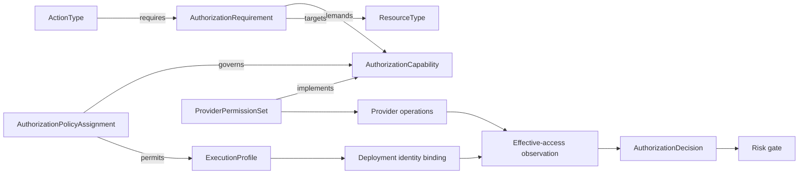
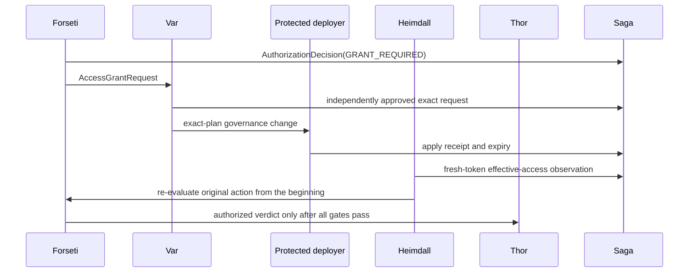

# Execution Authorization Ontology

This document defines how FDAI resolves the permissions required to execute an action without
embedding provider roles or customer policy in `ActionType` or core code. It separates semantic
capability, scoped customer policy, provider mapping, effective-access evidence, and the existing
risk and human-approval decision.

> **Authority boundary:** The ontology describes required capability and policy relationships. It
> never grants access. An action can proceed only when scoped policy allows the capability, the
> selected workload identity has verified effective access, and the ordinary risk gate permits it.
>
> **Customer boundary:** Upstream owns the metamodel and deterministic resolver. A downstream
> distribution adds policy and provider mappings through supported catalog and provider seams.
> Deployment identities, scopes, and observations remain outside upstream source control.

> **Implementation status (2026-07-31):** The strict requirement and assignment loaders,
> resolver-backed evaluator, hierarchical scope resolver, effective-access probe assembly,
> exact-plan grant validation, and composition binder are implemented. A deployment enables the
> gate by binding its context, identity, permission mapping, probe, and optional grant adapters.

## Design at a glance

Execution authorization is resolved in four independently versioned layers. Every decision pins
the inputs from all four layers for deterministic replay.



| Layer | Question | Authority |
|-------|----------|-----------|
| Semantic | What capability does this action require? | Versioned ontology catalog |
| Governance | Where and under what grant posture may it be used? | Scoped policy assignment |
| Provider | Which concrete operations implement the capability? | Injected provider mapping |
| Evidence | Can the selected identity perform those operations now? | Effective-access probe |

## Metamodel

Authorization concepts are first-class objects because their conditions, versions, and lifecycle
affect decisions. Link properties alone are not sufficient for decision-critical state.

| ObjectType | Purpose |
|------------|---------|
| `AuthorizationCapability` | Stable provider-neutral capability such as `compute.restart`. |
| `AuthorizationRequirement` | One conditional capability requirement for an `ActionType`. |
| `ExecutionProfile` | Logical executor profile, not a provider identity identifier. |
| `AuthorizationPolicyAssignment` | Customer policy bound to capabilities, profiles, and scope. |
| `ProviderPermissionSet` | Mapping from a capability to provider operations and token audience. |
| `AuthorizationObservation` | Time-bounded effective-access evidence. |
| `AccessGrantRequest` | Immutable request for a bounded permission change. |
| `AccessGrant` | Applied, expiring grant linked to approval and apply evidence. |
| `AuthorizationDecision` | Replayable result produced before risk classification and dispatch. |

The relationship kernel is:

| LinkType | Endpoints | Meaning |
|----------|-----------|---------|
| `requires_authorization` | ActionType -> AuthorizationRequirement | Action semantics require this relation. |
| `demands_capability` | AuthorizationRequirement -> AuthorizationCapability | Requirement resolves to a stable capability. |
| `authorization_targets` | AuthorizationRequirement -> ResourceType | Resource type the requirement applies to. |
| `governs_capability` | AuthorizationPolicyAssignment -> AuthorizationCapability | Assignment constrains the capability. |
| `permits_profile` | AuthorizationPolicyAssignment -> ExecutionProfile | Profiles eligible under the assignment. |
| `implements_capability` | ProviderPermissionSet -> AuthorizationCapability | Provider operations that realize the capability. |
| `satisfies_requirement` | AccessGrant -> AuthorizationRequirement | Applied grant intended to satisfy a requirement. |
| `attests_grant` | AuthorizationObservation -> AccessGrant | Effective probe evidence for an applied grant. |

Capability ids are provider-neutral dotted names. Provider operation strings, tenant identifiers,
resource ids, and workload identity ids never appear in upstream capability declarations.

## Requirement resolution

An `AuthorizationRequirement` declares a stable requirement and capability reference, action and
resource-type selectors, a bounded scope expression, deterministic conditions, target quantifier,
provenance, and semantic version.

Scope expressions use a closed provider-neutral grammar:

| Expression | Result |
|------------|--------|
| `target` | Exact action target. |
| `ancestor(resource_group)` | Resource-group-equivalent ancestor. |
| `ancestor(account)` | Account or subscription ancestor. |
| `related(link, depth)` | Bounded traversal over one declared ontology link. |
| `affected_set` | Risk gate's already-computed affected resource set. |

Unknown links, truncated traversal, stale inventory, an unresolved target, or a result wider than
the declared maximum scope produces `UNKNOWN`. It never widens to an ancestor automatically.

Requirements do not inherit from other ActionTypes. Shared meaning is expressed by linking
several actions to one versioned requirement or capability. This avoids circular inheritance and
keeps action evolution independent.

Requirements are catalog-as-code entries under a deployment or downstream distribution. The
strict loader rejects unknown fields, duplicate ids, unsupported scope expressions, and references
to unknown action types, resource types, capabilities, or execution profiles before startup.

```yaml
kind: authorization-requirement
id: object.write.target
version: "1.0.0"
capability_id: object.write
action_type_ids: [object.update]
resource_types: [object-storage]
scope_expressions: [target]
execution_profile: change-executor
provenance:
  created_at: "2026-07-31T00:00:00Z"
  created_by: example-team
```

Provider operations, mapping digests, deployment scope ids, and identity references are runtime
evidence. They do not belong in this semantic requirement entry.

## Scoped policy assignments

An authorization definition is inert until an assignment binds it to capability, execution
profile, and scope. The scope grammar reuses the existing `scope://` hierarchy and selectors.

```yaml
kind: authorization-assignment
id: authz.object-write.prod
version: "1.0.0"
capabilities: [object.write]
execution_profiles: [change-executor]
scope:
  include: [scope://example/account/prod]
  selectors:
    resource_types: [object-storage]
posture: request_jit
constraints:
  allowed_grant_modes: [action_bound, time_bound]
  max_scope: resource
  max_duration_seconds: 1800
  quorum: 2
  approver_roles: [owner]
  require_effective_probe: true
  exemptible: false
enforcement: do-not-enforce
```

| Posture | Meaning |
|---------|---------|
| `prohibit` | The capability is not allowed for the selected profile and scope. |
| `delegate_manual` | A human or external system performs the operation. |
| `preprovisioned_only` | Existing effective access is required; no grant may be requested. |
| `request_jit` | A bounded grant request may be created when access is missing. |
| `standing` | A reviewed standing grant is allowed within the assignment constraints. |

`standing` here is a provider-access posture, not the Constitution's A3-E standing human
authorization. An `AccessGrant` never satisfies action HIL or standing Approval, and an A3-E
Approval never creates provider permission. Both independent gates must pass when both apply.

New assignments start with `enforcement: do-not-enforce`. Shadow evaluation records the decision
that enforcement would have produced. Promotion to `enforce` follows the ordinary reviewed
catalog transition and cannot be selected by an environment or fork marker.

Only `enforce` assignments participate in the authoritative intersection. A matching
`do-not-enforce` assignment remains available to a separate shadow comparison, but it cannot
prohibit, authorize, narrow, or widen the live decision.

## Policy composition

Every matching assignment contributes a constraint. FDAI computes their intersection instead of
letting a more-specific allow replace a broader restriction.

- `prohibit` dominates every other posture.
- Allowed grant modes are intersected.
- Maximum scope is the narrowest declared scope.
- Maximum duration is the smallest positive duration.
- Quorum is the largest declared quorum.
- Required approver roles and evidence checks are unioned.
- `exemptible: false` dominates `true`.
- An empty intersection or equally specific parameter disagreement produces `POLICY_CONFLICT`.
- No matching enforced assignment produces `UNCONFIGURED`, never implicit allow.

Scope specificity selects parameter sources only when all equally specific assignments agree. It
cannot raise posture or remove a constraint. A relaxation uses a separate time-bounded,
independently approved exemption whose scope is resource-group-equivalent or narrower.

## Identity and provider mapping

An `ExecutionProfile` is a logical name such as `change-executor` or `recovery-executor`. An
injected `ExecutionIdentityResolver` maps the profile and target context to a deployment identity
reference. Core never receives a provider credential or computes a resource name.

An injected `ProviderPermissionMapper` resolves a capability to atomic provider operations, token
audience, authorization plane, probe strategy, and mapping version. For Azure, a mapping may
contain Resource Manager actions, RBAC `DataActions`, service-local RBAC, or Kubernetes verbs. The
Azure adapter owns those values.

## Runtime assembly

`ResolverBackedExecutionAuthorizationEvaluator` is the provider-neutral bridge from a control-loop
request to the pure resolver. It performs this sequence in stable requirement-id order:

1. Resolve a pinned `ExecutionAuthorizationContext` and neutral `ResourceContext`.
2. Select applicable catalog requirements and resolve each bounded scope expression.
3. Resolve the execution identity and provider permission mapping through injected adapters.
4. Apply scoped policy first. Terminal policy decisions skip the effective-access probe.
5. Probe every required scope, convert results to expiring observations, and invoke the pure
  resolver.
6. Reduce all requirement decisions conservatively. Only all-`AUTHORIZED` results enter the risk
  gate.
7. For `GRANT_REQUIRED`, validate every missing requirement and scope against the combined
  decision digest, allowed grant mode, maximum duration, quorum, and approver-role floor before
  submitting one canonically ordered proposal per pair.

`bind_execution_authorization` loads and cross-checks both catalogs, assembles the evaluator, and
sets `execution_authorization_required=True`. Empty requirement catalogs and half-bound grant
planner/sink pairs fail during composition. Missing or failed runtime evidence returns a held
status; it never falls through to dispatch.

## Decision algorithm

The resolver is deterministic and I/O-free. Callers gather graph, policy, identity, mapping, and
probe evidence before invoking it.

1. Pin the action, ontology, policy bundle, provider mapping, and inventory revisions.
2. Resolve all applicable requirements in stable id order.
3. Derive and bound target scopes from the supplied graph snapshot.
4. Select matching assignments and intersect their constraints.
5. Resolve exactly one execution profile and provider permission set.
6. Validate observations for identity, operation, scope, revision, and expiry.
7. Produce one authorization status and a complete contribution trace.
8. Combine the result with the risk gate by taking the least authority.

| Status | Control-loop behavior |
|--------|-----------------------|
| `AUTHORIZED` | Continue to the ordinary risk gate. |
| `GRANT_REQUIRED` | Hold the action and create bounded grant requests for every missing requirement and scope. |
| `DELEGATED` | Create a manual handoff; Thor never dispatches the original action. |
| `PROHIBITED` | Deny and record a security-relevant decision. |
| `UNKNOWN` | Hold for review because evidence is absent, stale, or truncated. |
| `POLICY_CONFLICT` | Block execution and request a policy correction. |
| `UNCONFIGURED` | Block execution because no enforced assignment covers the capability. |

Human approval of an action does not change an authorization status. `GRANT_REQUIRED` starts a
separate governance lifecycle, and the original action remains held.

## Grant lifecycle

Each `AccessGrantRequest` is bound to one requirement and exact scope plus the logical execution
profile, provider mapping version, grant mode, expiry, original action id, combined authorization
decision digest, and idempotency key. Multiple missing pairs produce distinct request ids. A
partial submission failure is audited per proposal and leaves the original action held.



The executor identity cannot grant roles to itself. The protected deployer applies the approved
exact plan. A changed scope, operation set, duration, identity profile, or plan digest invalidates
approval. Each grant records `status`, `valid_from`, `expires_at`, optional `revoked_at`, and an
immutable revocation receipt. Pre-dispatch evaluation requires `status=active`, checks the validity
interval, and obtains a fresh effective-access observation. Revocation blocks pending actions
immediately. Expiry and revocation are part of completion, not optional cleanup.

## Runtime failure classification

Pre-dispatch evidence is defense in depth, not a guarantee that a provider call will succeed.
Adapters classify failures without parsing them in core:

- `authentication_failed` - token or identity could not be authenticated;
- `permission_denied` - authenticated identity lacks effective access;
- `policy_denied` - an explicit provider policy or deny assignment blocked the call;
- `network_denied` - the authorization endpoint or data plane was unreachable by policy;
- `provider_failed` - another provider failure occurred.

Every class fails closed and is audited. `permission_denied` invalidates matching cached evidence,
creates no automatic grant request, and re-enters authorization resolution. It is never retried as
a generic transient failure.

## Caching and replay

Cache keys include the principal reference, capability, mapping version, exact scope, policy
bundle digest, and inventory generation. Entries expire at the earliest observation, assignment,
or grant expiry. Authorization changes, catalog reload, mapping or identity-binding changes,
inventory changes, explicit denial, and readiness degradation invalidate matching entries.

Saga records requirement ids, matching and losing assignment ids, the intersection result,
identity profile, mapping digest, observation digests, graph generation, algorithm version, and
final status. Replay uses those exact inputs and never substitutes current provider state.

## Extension and deployment boundaries

| Owner | Artifacts |
|-------|-----------|
| Upstream | Metamodel, resolver, validation, base capabilities, audit shape, provider Protocols. |
| Downstream distribution | Additional capabilities, requirements, policy templates, mappings, adapters. |
| Deployment configuration | Signed policy bundle reference, identity bindings, real scope ids. |
| Runtime store | Observations, decisions, requests, grants, expiry and revocation receipts. |

A fork marker never selects authorization behavior. One downstream distribution can support many
deployments with different signed policy bundles. Fork additions can add constraints but cannot
redefine upstream capability ids or raise an upstream maximum.

## Verification matrix

| Concern | Required proof |
|---------|----------------|
| Customer variance | One action resolves differently under three synthetic policy bundles. |
| Deny dominance | Any matching `prohibit` assignment blocks execution. |
| Intersection | Scope, duration, modes, quorum, roles, and evidence compose conservatively. |
| Unknown safety | Missing, stale, conflicting, or truncated evidence never authorizes. |
| Identity separation | Approver, executor, and grant-applying deployer are distinct. |
| Replay | The same pinned inputs produce the same decision and digest. |
| Expiry | Expired observations and grants cannot satisfy a requirement. |
| Runtime denial | A provider permission denial never retries as transient. |
| Fork safety | Deployment and fork markers cannot select policy or raise authority. |

## Related docs

| To learn about | Read |
|----------------|------|
| Action semantics and customer overlays | [Action ontology](action-ontology.md) |
| Risk and dispatch authority | [Execution model](execution-model.md) |
| Workload identity and minimum permissions | [Security and identity](../architecture/security-and-identity.md) |
| Shared semantic graph boundaries | [Operating ontology](../architecture/operating-ontology.md) |
| Scoped assignment behavior | [Rule governance](../rules-and-detection/rule-governance.md) |
