# 운영 계획

이 문서는 FDAI의 고정된 15개 에이전트 판테온이 전문 증거를 제한된 계획으로 바꾸고, 관리
리소스를 변경하지 않고 후보 효과를 시험하며, 적격한 선택만 기존 결정 및 실행 경로로 보내는
방법을 정의합니다. 중앙 플래너나 다른 권한 표면을 추가하지 않고 Workflow, Process,
DecisionCase, ActionOption, typed ontology function, Assurance Twin을 재사용합니다.

> **권한 경계:** 계획, 최적화, simulation은 A0 활동입니다. 증거와 제안을 만들 수 있지만 승인,
> 실행, 승격 또는 외부 효과를 주장할 수 없습니다.
>
> **에이전트 경계:** 에이전트는 권한이 있는 작업을 schema 검증된 event로 교환합니다. 읽기 전용
> 대화형 숙의는 같은 증거를 설명할 수 있지만, 그 text는 Process를 진행하거나 DecisionCase를
> 변경하지 않습니다.
>
> **구현 상태:** P1-P4 core path가 구현되었습니다. Canonical release가 function declaration을
> 고정하고, authorized invocation이 replay-stable receipt를 emit하며, operational planning은 Pareto
> pruning 및 weighted selection 전에 hard constraint를 적용하고, ordered planning phase는 기존
> Process journal에 append합니다. Forseti는 optional coordinator로 기존 Cost 및 Capacity topic을
> enrich할 수 있습니다. Programmatic simulator는 exact reviewed source를 bounded pipeline sandbox에서
> 실행하고 timeout 또는 malformed output을 unscorable로 처리합니다. P5는 read-only Twin adapter,
> exact selected-option MutationPlan compilation, independent ResponseOutcome closure를 추가합니다.
> P6는 기존 Process detail route 안에 strict read-only Planning Room projection을 추가합니다.
> P7은 durable Process recorder, shadow-only planning Workflow, verified dimension 7개와 명시적인
> release-evidence proxy 2개를 가진 9개 차원의 frozen scenario manifest, deterministic
> constitutional constraint check, conditional production runtime binding을
> 추가합니다. Runtime은 exact ontology release, operational context, Process store, active
> effect-model reader, causal verifier가 모두 있을 때만 planning을 bind합니다. Staging proof와
> shadow measurement는 누락된 runtime behavior가 아니라 release evidence로 남습니다.

## 한눈에 보는 설계

운영 계획 run은 version이 고정된 Workflow instance입니다. Process journal이 진행 상태를 기록하고,
DecisionCase와 ActionOption은 변경할 수 없는 의미 기반 결정 artifact로 유지됩니다.

```mermaid
flowchart LR
    R[Typed planning request] --> P[Workflow and Process]
    P --> C[Muninn context snapshot]
    C --> F[Forseti DecisionCase]
    F --> S[Specialist evidence]
    S --> L[Versioned logic assets]
    L --> X[Compute and twin simulation]
    X --> H[Heimdall verification]
    H --> O[Odin arbitration]
    O --> V[Forseti verdict]
    V --> A[Var approval when required]
    A --> T[Thor execution]
    T --> E[Observed outcome]
    E --> N[Muninn and Norns learning]
```



## 재사용하는 권위 원천

운영 계획은 권위 있는 `PlanningSession` object나 16번째 agent를 추가하지 않습니다.

| 관심사 | 기존 권위 원천 | 계획에서의 용도 |
|--------|----------------|-----------------|
| 지속 가능한 진행 상태 | Workflow declaration과 Process snapshot 및 journal | 하나의 shadow-first planning workflow가 제한된 phase와 terminal state를 기록합니다. |
| 시점이 일치하는 사실 | Muninn `OperationalContextSnapshot` | 모든 후보가 하나의 cutoff, release set, freshness receipt, context digest를 사용합니다. |
| Option과 effect | Forseti `DecisionCase`, `ActionOption`, `ExpectedEffect` | Case는 no-action, hold, 실행 가능한 후보를 포함합니다. |
| 목표 간 arbitration | Odin `ArbitrationDecision` | Odin은 모든 hard constraint를 통과한 후보만 순위를 정합니다. |
| 승인 | Var `Approval` | 승인은 계획 text나 simulation score에서 나오지 않습니다. |
| 실행 | Thor `ActionRun` | 선택된 ActionType은 일반 risk, lock, dry-run, audit 경로에 다시 진입합니다. |
| Effect closure | Heimdall observation과 `ObservedOutcome` | Provider 수락과 관측된 수렴을 구분합니다. |
| Audit 및 학습 | Saga, Muninn, Norns | 거절된 option과 실패한 simulation도 증거로 남으며 스스로 승격하지 않습니다. |

Bragi는 operator request를 typed ingress로 번역하고 read model을 렌더링할 수 있습니다. Bragi는
DecisionCase를 만들거나 option을 선택하거나 run을 승인하거나 executor를 호출하지 않습니다.

## Process lifecycle

Workflow runtime은 기존 Process status를 유지합니다. Planning phase는 append-only child event로
기록하므로 새 capability가 또 다른 mutable state machine을 만들지 않습니다.

```text
context_frozen
-> proposals_collected
-> simulations_closed
-> critiques_closed
-> arbitration_closed
-> selected | held | abstained
```

각 planning event는 Process id, correlation id, DecisionCase id, context digest, causation id,
actor agent, evidence reference, logic release digest, idempotency key를 기록합니다.

- **중복 delivery:** 같은 idempotency key는 no-op입니다.
- **순서가 뒤바뀐 delivery:** 필요한 predecessor가 없는 child event는 audit하고 dead-letter
  handling으로 보냅니다. Process snapshot을 진행하지 않습니다.
- **늦은 증거:** 선택된 DecisionCase를 수정하지 않습니다. 실질적으로 새로운 증거는 새 Process
  revision과 새 DecisionCase를 엽니다.
- **오래된 target:** target revision이 변경된 선택 계획은 planning 또는 사람 검토로 돌아갑니다.
  새 revision에 실행하지 않습니다.
- **Budget 소진:** 완료되지 않은 필수 branch는 `held`로 닫습니다. 완료된 branch를 전체 search로
  간주하지 않습니다.

## Logic asset

Logic asset은 query, derive, validate 또는 plan에 사용하는 versioned ontology function입니다.
Prediction, optimization, simulation은 새 실행 경로가 아니라 해당 function kind의 capability
label입니다.

각 active logic declaration은 다음을 기록합니다.

- 정확한 function version, artifact digest, publisher, ontology release digest
- input 및 output JSON Schema
- 제한된 ObjectSet read set과 evidence cutoff
- deterministic 또는 seeded-stochastic execution class
- 재생 가능한 stochastic function을 위한 server-derived seed policy
- CPU, memory, timeout, output, network, credential ceiling
- 필요한 role, 허용 purpose, 호출 가능한 agent
- model 또는 algorithm version, training 또는 learning cutoff, evidence grade
- shadow evidence, promotion criteria, rollback에 사용하는 이전 version

Function registry는 input 및 output schema와 caller authorization을 검증합니다. Function은 Thor의
executor identity를 받지 않으며 provider mutation을 호출할 수 없습니다. Invocation receipt는
declaration digest, input digest, read-set watermark, seed, output digest, duration, resource usage,
redaction, terminal status를 결합합니다.

## 후보 구성

Forseti는 필요한 specialist evidence가 닫힌 뒤에만 DecisionCase를 구성합니다. 초기 vertical은
기존 agent 소유 artifact를 사용합니다.

- Heimdall은 forecast와 observation evidence를 제공합니다.
- Freyr는 capacity forecast와 sizing recommendation을 제공합니다.
- Njord는 제한된 cost evidence와 recommendation을 제공합니다.
- Loki는 request에 experiment가 포함되면 resilience scenario를 제공합니다.
- Mimir는 참조된 Rule, ActionType, Workflow, logic declaration을 검증합니다.

ActionOption은 proposing agent, logic invocation receipt, simulation receipt, assumption, expected
effect range, uncertainty, violated constraint, evidence reference를 기록합니다. No-action baseline은
필수입니다. Baseline이 없으면 case가 유효하지 않습니다.

## Constraint 및 optimization

후보 선택에는 세 개의 결정론적 단계가 있습니다.

1. **Hard-constraint eligibility:** 순수 policy 및 ontology check가 safety, security, identity,
   data integrity, recovery, 승인된 SLO, RTO, RPO, impact 또는 change constraint를 위반하는 후보를
   제거합니다. 누락, stale, conflict, truncation evidence는 pass가 아니라 ineligible입니다.
2. **Pareto pruning:** 적격 후보 중 다른 후보가 선언된 모든 soft objective에서 같거나 더 좋고
   하나 이상에서 더 좋은 option만 제거합니다. Pareto pruning은 winner를 선택하지 않습니다.
3. **Odin arbitration:** 기존 weighted arbiter가 남은 soft-objective tradeoff의 순위를 정합니다.
   가까운 margin, non-finite score, 미지원 domain 또는 active/challenger divergence는 사람 검토가
   필요합니다.

초기 optimizer는 schema-valid 후보를 결정론적 순서로 최대 32개 열거합니다. Cap을 초과하는 input은
분해하거나 검토를 위해 보류하며 조용히 자르지 않습니다. Frozen fixture가 bounded enumeration으로
필요한 문제를 표현할 수 없음을 증명한 뒤에만 solver adapter를 추가합니다.

Artifact validation은 objective 또는 effect entry를 32개, constraint를 64개, candidate별 simulation을
8개, item별 evidence reference를 64개, 전체 nested evidence manifest를 unique reference 256개로
제한합니다. 이 check는 simulation 또는 artifact 생성 전에 실행됩니다. Caller는 더 작은 read
projection 뒤에 초과 lineage를 숨길 수 없습니다.

## Simulation 수준

Simulation이라는 단어는 서로 다른 세 개의 권한 envelope를 포함합니다.

| 수준 | 목적 | 허용 access | 권한 |
|------|------|-------------|------|
| Compute sandbox | 검토된 prediction, optimization 또는 validation artifact를 실행합니다. | Credential 없음, 일반 network 없음, 제한된 read tool, read-only workspace입니다. | Evidence only입니다. |
| Assurance Twin branch | Copy-on-write ontology snapshot에 candidate delta를 적용합니다. | Frozen context와 versioned effect model입니다. | Evidence only입니다. |
| Non-production staging | 격리된 실제 target에 등록된 ActionType을 실행합니다. | 전용 workload identity와 정확한 staging scope입니다. | 일반 risk, approval, execution, rollback, audit rule입니다. |

성공한 compute 또는 twin run은 staging 또는 production authorization을 충족하지 않습니다. Staging
결과는 independent observation이 expected effect를 닫은 경우에만 promotion evidence가 됩니다.

## Failure handling

| Failure | 안전한 결과 |
|---------|-------------|
| Context가 stale, incomplete, conflicting 또는 truncated입니다. | 자동 선택을 무효화하고 새 context revision을 열거나 검토를 위해 보류합니다. |
| Logic artifact, declaration digest, input schema 또는 output schema가 실패합니다. | Invocation을 거부하고 dependent candidate를 ineligible로 표시합니다. |
| Sandbox가 crash, timeout, budget 초과 또는 금지된 access를 시도합니다. | Failed receipt를 emit하고 capability를 revoke하며 필수 branch이면 보류합니다. |
| Twin active model이 없거나 challenger와 divergence가 발생합니다. | Branch를 unscorable로 유지하거나 검토를 요구합니다. |
| Heimdall이 결과를 독립적으로 닫을 수 없습니다. | Simulation 또는 action success를 보고하지 않습니다. |
| Saga 또는 Vidar를 사용할 수 없습니다. | Planning read는 계속할 수 있지만 선택된 mutation은 실행할 수 없습니다. |
| Staging이 target을 부분적으로 변경합니다. | Forward dispatch를 멈추고 reverse dependency 순서로 compensate하며 recovery가 검증될 때까지 automation hold를 유지합니다. |

## 실행 bridge

적격한 선택은 정확한 target revision, read 및 write set, expected effect, rollback 또는 compensation,
impact evidence, digest가 있는 immutable MutationPlan으로 compile됩니다. Bridge는 선택된 ActionType을
typed ingress로 submit합니다. Thor를 호출하지 않습니다.

Risk evaluation은 current policy, promotion state, role, environment, impact, approval, target revision,
일곱 safeguard를 다시 검사합니다. Planning evidence는 결과 authority를 유지하거나 낮출 수만
있습니다. T2가 만든 candidate content도 ActionOption이 되기 전에 일반 mixed-model, grounding,
schema, policy, verifier check를 통과합니다.

Observed outcome closure에는 하나의 exact evidence chain이 필요합니다. MutationPlan은 선택된
operational plan을 참조하고, ActionType은 선택된 option과 일치하며, ResponseOutcome prediction id는
해당 MutationPlan을 참조해야 합니다. 이 chain이 없는 provider acceptance는 결정을 닫지 않습니다.

## Planning Room

FDAI Console은 Process event, DecisionCase, ActionOption, simulation receipt의 read projection으로
Planning Room을 제공합니다. 다음 정보를 보여 줍니다.

- Process timeline과 각 contribution의 accountable agent
- Context cutoff, freshness, unavailable evidence
- Expected range가 있는 no-action 및 candidate branch
- Logic 및 model version, receipt, simulation status
- Hard-constraint exclusion, Pareto pruning, score, margin, rejected reason
- 존재하는 경우 approval, execution, rollback, observed-outcome link

Operator API는 A0 simulation을 시작하거나 선택한 proposal을 typed ingress로 submit하기 위한 인증되고
revision-bound request를 받을 수 있습니다. Browser는 executor identity를 받지 않으며 숨겨진 control을
authorization으로 간주하지 않습니다.

### Runtime availability

Startup은 exact ontology release, operational context materializer, Process store, effect-model reader,
causal-evidence verifier로 하나의 immutable capability status를 계산합니다. Structured log는
`available`, `enabled`, `mode`, `reason`, 누락된 모든 requirement를 기록합니다. Planning은 항상
`shadow`이고 모든 requirement를 사용할 수 있을 때만 bind됩니다. Optional planner를 사용할 수 없는
상태는 runtime readiness를 낮추거나 관련 없는 agent work를 차단하지 않으며, 명시적으로 관측 가능한
안전한 degradation으로 남습니다.

## 초기 vertical

첫 번째 complete vertical은 하나의 generic compute workload에 대한 predictive capacity planning입니다.
Heimdall은 current observation을 제공하고, Freyr는 제한된 replica count를 제안하며, Njord는 cost를
추정하고, Assurance Twin은 no-action 및 scale branch를 비교합니다. Reliability 및 recovery
constraint가 cost와 efficiency를 Odin이 검토하기 전에 후보를 filter합니다. `ops.scale-out`은
shadow-first를 유지하며 기존 approval 및 promotion gate를 따릅니다.

Frozen scenario pack에는 다음이 포함됩니다.

1. 성공적인 no-action 대 scale-out planning 및 검증된 outcome closure
2. 명시적 hold를 만드는 stale telemetry
3. arbitration이 필요한 reliability 및 cost conflict
4. 선택된 action이 없는 sandbox timeout
5. compensation과 recovery verification이 있는 partial staging failure
6. duplicate, reordered, restart replay
7. active 및 challenger model divergence
8. artifact tampering 및 sandbox escape 시도
9. A0 planning에 대한 A3-E non-applicability와 참조된 ActionType 자체의 authority proof

## Delivery 및 exit criteria

| Wave | Deliverable | Exit criteria |
|------|-------------|---------------|
| P0 | 이 설계, ownership review, competency fixture, failure matrix입니다. | Schema 작업 전에 term, authority, unknown handling을 검토합니다. |
| P1 | Logic identity, invocation, constraint, simulation receipt contract입니다. | Schema, release pinning, compatibility, replay test를 통과합니다. |
| P2 | Process child event 및 durable planning projection입니다. | Duplicate, reorder, concurrency, restart, retention test를 통과합니다. |
| P3 | Authorized logic registry 및 compute sandbox입니다. | 같은 input과 seed가 byte-identical output을 만들고 escape test가 fail closed합니다. |
| P4 | Twin branch, hard filter, Pareto pruning, Odin arbitration input입니다. | Ineligible option을 scoring하지 않고 incomplete search가 선택할 수 없습니다. |
| P5 | MutationPlan 및 typed-ingress bridge입니다. | 선택한 action과 target revision이 정확히 일치하고 shadow는 mutate하지 않습니다. |
| P6 | Planning Room API 및 Console projection입니다. | RBAC, redaction, provenance, loading, unavailable, responsive UI test를 통과합니다. |
| P7 | Frozen scenario, non-production drill, shadow measurement입니다. | Safety escape 없이 complete evidence chain, rollback, replay, outcome closure를 통과합니다. |

## Verification matrix

| 관심사 | 필요한 증명 |
|--------|-------------|
| Agent ownership | 모든 contribution이 owner의 typed topic을 사용하며 direct agent call 또는 shared workflow state가 없습니다. |
| Determinism | 같은 release, context, input, seed, receipt가 같은 case와 selection을 만듭니다. |
| Constraints | 제외된 모든 option이 하나 이상의 실패한 hard constraint를 인용하고 eligible survivor만 Odin에 도달합니다. |
| Isolation | Compute 및 twin run에는 provider credential 또는 managed-resource mutation path가 없습니다. |
| Replay | Process journal 및 고정된 release로 같은 phase, option, score, terminal reason을 재구성합니다. |
| Safety | Planning은 authority를 높이지 않으며 선택된 action은 approval과 일곱 safeguard를 계속 충족합니다. |
| Effect closure | Prediction, simulation, action success는 독립적으로 관측되거나 명시적으로 unscorable이 될 때까지 pending입니다. |
| Learning | Failed, refused, no-op, rollback, recurrence control을 balanced evidence cohort에 유지합니다. |

## 관련 문서

| 알아볼 내용 | 읽을 문서 |
|-------------|-----------|
| 공유 decision 및 effect 의미 | [FDAI 운영 온톨로지](../architecture/operating-ontology-ko.md) |
| Typed function 및 mutation plan | [FDAI 온톨로지 안전 인프라](../architecture/operating-ontology-platform-ko.md) |
| Workflow 및 Process runtime | [Process Automation](process-automation-ko.md) |
| Action eligibility 및 execution | [Execution Model](execution-model-ko.md) |
| 읽기 전용 graph simulation | [Assurance Twin](../operations/assurance-twin-ko.md) |
| Agent ownership 및 arbitration | [Agent Pantheon](../agents/agent-pantheon-ko.md) |
