# 운영 계획

이 문서는 FDAI의 고정된 15개 에이전트 판테온이 전문 증거를 제한된 계획으로 바꾸고, 관리
리소스를 변경하지 않고 후보 효과를 시험하며, 적격한 선택만 기존 결정 및 실행 경로로 보내는
방법을 정의합니다. 중앙 플래너나 다른 권한 표면을 추가하지 않고 작업 흐름, 프로세스,
DecisionCase, ActionOption, 타입이 지정된 온톨로지 함수, Assurance Twin을 재사용합니다.

> **권한 경계:** 계획, 최적화, 시뮬레이션은 A0 활동입니다. 증거와 제안을 만들 수 있지만 승인,
> 실행, 승격 또는 외부 효과를 주장할 수 없습니다.
>
> **에이전트 경계:** 에이전트는 권한이 있는 작업을 스키마 검증된 이벤트로 교환합니다. 읽기 전용
> 대화형 숙의는 같은 증거를 설명할 수 있지만, 그 텍스트는 프로세스를 진행하거나 DecisionCase를
> 변경하지 않습니다.
>
> **구현 상태:** P1-P4 코어 경로가 구현되었습니다. 정본 release가 함수 선언을
> 고정하고, authorized 호출이 replay-stable 증적을 발행하며, operational 계획 수립은 Pareto
> pruning 및 weighted 선택 전에 hard 제약을 적용하고, ordered 계획 수립 단계는 기존
> 프로세스 저널에 덧붙이기합니다. Forseti는 선택적 조정기로 기존 비용 및 용량 토픽을
> enrich할 수 있습니다. Programmatic simulator는 exact 검토된 출처를 범위가 제한된 파이프라인 샌드박스에서
> 실행하고 시간 초과 또는 malformed 출력을 unscorable로 처리합니다. P5는 읽기 전용 Twin 어댑터,
> exact selected-option MutationPlan compilation, 독립적인 ResponseOutcome 종결을 추가합니다.
> P6는 기존 프로세스 상세 경로 안에 strict 읽기 전용 계획 수립 Room 변환 결과를 추가합니다.
> P7은 영속 프로세스 recorder, shadow-only 계획 수립 작업 흐름, 검증된 dimension 8개와 명시적인
> release-evidence proxy 1개를 가진 9개 차원의 고정된 시나리오 매니페스트, 결정론적
> constitutional 제약 검사, conditional 운영 런타임 연결을
> 추가합니다. 런타임은 exact 온톨로지 release, operational 맥락, 프로세스 저장소, 활성
> effect-model 읽기 담당, causal 검증기가 모두 있을 때만 계획 수립을 연결합니다. Staging 부분
> 실행 증명과 live graph shadow 측정은 완료된 live claim이 아니라 release 근거로 남습니다.
> Production graph evidence와 개발 `ops.scale-out` VM Scale Set 실행기 연결은 구현되어 focused
> test로 검증됩니다. Independent Core 및 Operator service HIL binding, 보호된 러너 훈련, 독립
> pre-dispatch kinetic receipt writer, Heimdall 소유 verified independent effect observer, 종결 및
> 전체 recurrence window는 아직 남아 있습니다.

## 구현 상태

### 구현 범위

| 영역 | 상태 | 근거 | 참고 |
|------|------|------|------|
| P1-P7 operational-planning core | implemented | `services/core-control-plane/src/fdai/core/operational_planning/` 및 focused planning test | 계획은 A0로 유지되고 기존 Process 및 권한 경로를 재사용합니다. |
| Production graph evidence 및 scale-out executor binding | implemented | `services/core-control-plane/src/fdai/delivery/azure/` 및 focused composition/delivery test | Code와 test만으로는 live outcome evidence가 되지 않습니다. |
| Argument-bound kinetic proposal contract 및 Thor lineage | implemented | `services/core-control-plane/src/fdai/core/operational_planning/kinetic_proposal.py`, `services/core-control-plane/src/fdai/agents/thor.py` 및 focused contract/agent test | Optional A0 proposal은 verdict, quorum, mode 또는 authority를 바꾸지 않고 기존 exact V2 plan을 보존합니다. |
| Exact kinetic handoff 및 independent effect-observation runtime binding | in-progress | `services/core-control-plane/src/fdai/delivery/reconciliation_artifacts.py`, `config/ohl-scale-out-evidence.json` 및 focused artifact/manifest test | Immutable store는 존재하지만 pre-dispatch writer와 Heimdall 소유 verified observer는 아직 연결되지 않았습니다. |
| Independent-service HIL binding | in-progress | `config/ohl-scale-out-evidence.json` 및 배포된 Core/Operator environment contract | Approval이 action을 park하고 resolve하기 전에 service root가 HIL channel 및 callback signing secret을 bind해야 합니다. |
| OHL Lane F live evidence | in-progress | `docs/runbooks/ohl-scale-out-evidence-ko.md` | Protected execution, independent closure, sample 100개 및 14일 recurrence window가 열려 있습니다. |

### 구현 이력

| 날짜 | 상태 | 변경 | 근거 | 남은 작업 |
|------|------|------|------|-----------|
| 2026-08-13 | in-progress | 이전 provenance를 재구성하지 않고 implementation ledger를 도입하고 independent-service HIL binding residual을 드러냈습니다. | current change, `services/core-control-plane/tests/scenarios/operational-planning/test_manifest.py` 결과 7 passed | 두 service root에 HIL을 bind하고 exact revision을 배포한 뒤 live evidence campaign을 완료합니다. |
| 2026-08-14 | in-progress | 누락된 exact-plan writer와 verified independent effect observer를 별도 Lane F runtime residual로 드러냈습니다. | `current change`, Lane F contract, runbook gate, artifact-store test 및 manifest test | Plan을 reconstruct하거나 executor/provider receipt로 대체하지 않고 두 source를 모두 연결합니다. |
| 2026-08-14 | implemented | Authority-free argument-bound kinetic proposal contract를 추가하고 valid proposal을 Thor의 durable ActionRun까지 보존했습니다. | `current change`, focused kinetic-proposal, Thor dispatch, persistence 및 role-invariant 검사 | Runtime residual을 제거하기 전에 Forseti 소유 producer와 Core pre-dispatch consumer를 추가합니다. |

### 남은 작업

- [ ] Complete operational plan에서만 `KineticActionProposal`을 생성하고 dispatch 전에 Core typed
  ingress에서 소비하며 proposal이 없을 때 legacy Action이 변경되지 않음을 입증합니다.
- [ ] Provider dispatch 전에 기존 exact V2 plan의 kinetic receipt를 저장하고 Heimdall 소유 verified
  independent effect observer를 연결한 뒤 focused substitution 및 replay test를 보존합니다.
- [ ] Core HIL channel 및 Operator callback signing secret을 bind하고 검증해 서로 다른 human
  approver가 하나의 `ops.scale-out` proposal을 park, resolve 및 resume하도록 합니다.
- [ ] Protected-runner drill을 완료하고 independent graph closure, live-shadow sample 100개,
  policy escape 0, rollback/cleanup 및 전체 14일 recurrence window를 기록합니다.

## 한눈에 보는 설계

운영 계획 실행은 버전이 고정된 작업 흐름 인스턴스입니다. 프로세스 저널이 진행 상태를 기록하고,
DecisionCase와 ActionOption은 변경할 수 없는 의미 기반 결정 산출물로 유지됩니다.



```mermaid
flowchart LR
    R[Typed planning request] --> P[Workflow and Process]
    P --> C[Muninn context snapshot]
    C --> F[Forseti DecisionCase]
    F --> S[Specialist evidence]
    S --> L[Versioned logic assets]
    L --> X[Compute and twin simulation]
    X --> H[Heimdall verification]
    H --> O[Odin arbitration]
    O --> V[Forseti verdict]
    V --> A[Var approval when required]
    A --> T[Thor execution]
    T --> E[Observed outcome]
    E --> N[Muninn and Norns learning]
```

## 재사용하는 권위 원천

운영 계획은 권위 있는 `PlanningSession` 객체나 16번째 에이전트를 추가하지 않습니다.

| 관심사 | 기존 권위 원천 | 계획에서의 용도 |
|--------|----------------|-----------------|
| 지속 가능한 진행 상태 | 작업 흐름 선언과 프로세스 스냅샷 및 저널 | 하나의 shadow-first 계획 수립 작업 흐름이 제한된 단계와 최종 상태를 기록합니다. |
| 시점이 일치하는 사실 | Muninn `OperationalContextSnapshot` | 모든 후보가 하나의 기준 시점, release 집합, 최신성 증적, 맥락 다이제스트를 사용합니다. |
| 옵션과 효과 | Forseti `DecisionCase`, `ActionOption`, `ExpectedEffect` | 사례는 no-action, 보류, 실행 가능한 후보를 포함합니다. |
| 목표 간 중재 | Odin `ArbitrationDecision` | Odin은 모든 hard 제약을 통과한 후보만 순위를 정합니다. |
| 승인 | Var `Approval` | 승인은 계획 텍스트나 시뮬레이션 점수에서 나오지 않습니다. |
| 실행 | Thor `ActionRun` | 선택된 ActionType은 일반 risk, 잠금, 예행 실행, 감사 경로에 다시 진입합니다. |
| 효과 종결 | Heimdall 관측과 `ObservedOutcome` | 프로바이더 수락과 관측된 수렴을 구분합니다. |
| 감사 및 학습 | Saga, Muninn, Norns | 거절된 옵션과 실패한 시뮬레이션도 증거로 남으며 스스로 승격하지 않습니다. |

Bragi는 운영자 요청을 타입이 지정된 유입으로 번역하고 읽기 모델을 렌더링할 수 있습니다. Bragi는
DecisionCase를 만들거나 옵션을 선택하거나 실행을 승인하거나 실행기를 호출하지 않습니다.

## 프로세스 수명 주기

작업 흐름 런타임은 기존 프로세스 상태를 유지합니다. 계획 수립 단계는 추가 전용 하위 이벤트로
기록하므로 새 기능이 또 다른 변경 가능한 상태 머신을 만들지 않습니다.

```text
context_frozen
-> proposals_collected
-> simulations_closed
-> critiques_closed
-> arbitration_closed
-> selected | held | abstained
```

각 계획 수립 이벤트는 프로세스 id, 상관관계 id, DecisionCase id, 맥락 다이제스트, causation id,
행위자 에이전트, 근거 참조, logic release 다이제스트, 멱등성 키를 기록합니다.

- **중복 전달:** 같은 멱등성 키는 no-op입니다.
- **순서가 뒤바뀐 전달:** 필요한 predecessor가 없는 하위 이벤트는 감사하고 dead-letter
  처리로 보냅니다. 프로세스 스냅샷을 진행하지 않습니다.
- **늦은 증거:** 선택된 DecisionCase를 수정하지 않습니다. 실질적으로 새로운 증거는 새 프로세스
  개정 번호와 새 DecisionCase를 엽니다.
- **오래된 대상:** 대상 개정 번호가 변경된 선택 계획은 계획 수립 또는 사람 검토로 돌아갑니다.
  새 개정 번호에 실행하지 않습니다.
- **예산 소진:** 완료되지 않은 필수 가지는 `held`로 닫습니다. 완료된 가지를 전체 검색으로
  간주하지 않습니다.

## Logic asset

Logic asset은 조회, derive, validate 또는 계획에 사용하는 versioned 온톨로지 함수입니다.
Prediction, optimization, 시뮬레이션은 새 실행 경로가 아니라 해당 함수 종류의 기능
라벨입니다.

각 활성 logic 선언은 다음을 기록합니다.

- 정확한 함수 버전, 산출물 다이제스트, 발행기, 온톨로지 release 다이제스트
- 입력 및 출력 JSON 스키마
- 제한된 ObjectSet 읽기 집합과 근거 기준 시점
- 결정론적 또는 seeded-stochastic 실행 등급
- 재생 가능한 stochastic 함수를 위한 server-derived 시드 정책
- CPU, 기억, 시간 초과, 출력, 네트워크, 자격 증명 상한
- 필요한 역할, 허용 용도, 호출 가능한 에이전트
- 모델 또는 algorithm 버전, training 또는 learning 기준 시점, 근거 grade
- shadow 근거, 승격 criteria, 롤백에 사용하는 이전 버전

함수 레지스트리는 입력 및 출력 스키마와 호출자 권한 확인을 검증합니다. 함수는 Thor의
실행기 신원을 받지 않으며 프로바이더 변경을 호출할 수 없습니다. 호출 증적은
선언 다이제스트, 입력 다이제스트, read-set watermark, 시드, 출력 다이제스트, 소요 시간, 리소스 사용량,
민감정보 제거, 최종 상태를 결합합니다.

## 후보 구성

Forseti는 필요한 전문가 근거가 닫힌 뒤에만 DecisionCase를 구성합니다. 초기 버티컬은
기존 에이전트 소유 산출물을 사용합니다.

- Heimdall은 예측과 관측 근거를 제공합니다.
- Freyr는 용량 예측과 sizing 권고를 제공합니다.
- Njord는 제한된 비용 근거와 권고를 제공합니다.
- Loki는 요청에 실험이 포함되면 복원력 시나리오를 제공합니다.
- Mimir는 참조된 Rule, ActionType, 작업 흐름, logic 선언을 검증합니다.

ActionOption은 proposing 에이전트, logic 호출 증적, 시뮬레이션 증적, assumption, 예상
효과 범위, uncertainty, violated 제약, 근거 참조를 기록합니다. No-action 기준선은
필수입니다. 기준선이 없으면 사례가 유효하지 않습니다.

## 제약 및 optimization

후보 선택에는 세 개의 결정론적 단계가 있습니다.

1. **Hard-constraint 충족 여부:** 순수 정책 및 온톨로지 검사가 안전성, security, 신원,
   데이터 무결성, 복구, 승인된 SLO, RTO, RPO, 영향 또는 변경 제약을 위반하는 후보를
   제거합니다. 누락, stale, 충돌, 잘림 근거는 통과가 아니라 ineligible입니다.
2. **Pareto pruning:** 적격 후보 중 다른 후보가 선언된 모든 soft 목표에서 같거나 더 좋고
   하나 이상에서 더 좋은 옵션만 제거합니다. Pareto pruning은 winner를 선택하지 않습니다.
3. **Odin 중재:** 기존 weighted arbiter가 남은 soft-objective tradeoff의 순위를 정합니다.
   가까운 margin, non-finite 점수, 미지원 도메인 또는 활성/challenger divergence는 사람 검토가
   필요합니다.

초기 optimizer는 schema-valid 후보를 결정론적 순서로 최대 32개 열거합니다. 상한을 초과하는 입력은
분해하거나 검토를 위해 보류하며 조용히 자르지 않습니다. 고정된 고정본이 범위가 제한된 enumeration으로
필요한 문제를 표현할 수 없음을 증명한 뒤에만 solver 어댑터를 추가합니다.

산출물 검증은 목표 또는 효과 항목을 32개, 제약을 64개, 후보별 시뮬레이션을
8개, 항목별 근거 참조를 64개, 전체 중첩된 근거 매니페스트를 unique 참조 256개로
제한합니다. 이 검사는 시뮬레이션 또는 산출물 생성 전에 실행됩니다. 호출자는 더 작은 읽기
변환 결과 뒤에 초과 계보를 숨길 수 없습니다.

## 시뮬레이션 수준

시뮬레이션이라는 단어는 서로 다른 세 개의 권한 묶음을 포함합니다.

| 수준 | 목적 | 허용 접근 | 권한 |
|------|------|-------------|------|
| Compute 샌드박스 | 검토된 prediction, optimization 또는 검증 산출물을 실행합니다. | 자격 증명 없음, 일반 네트워크 없음, 제한된 읽기 도구, 읽기 전용 workspace입니다. | 근거 only입니다. |
| Assurance Twin 가지 | Copy-on-write 온톨로지 스냅샷에 후보 delta를 적용합니다. | 고정된 맥락과 versioned 효과 모델입니다. | 근거 only입니다. |
| Non-production staging | 격리된 실제 대상에 등록된 ActionType을 실행합니다. | 전용 워크로드 신원과 정확한 staging 범위입니다. | 일반 risk, 승인, 실행, 롤백, 감사 룰입니다. |

성공한 compute 또는 twin 실행은 staging 또는 운영 권한 확인을 충족하지 않습니다. Staging
결과는 독립적인 관측이 예상 효과를 닫은 경우에만 승격 근거가 됩니다.

## 실패 처리

| 실패 | 안전한 결과 |
|---------|-------------|
| 맥락이 stale, 불완전한, conflicting 또는 잘린입니다. | 자동 선택을 무효화하고 새 맥락 개정 번호를 열거나 검토를 위해 보류합니다. |
| Logic 산출물, 선언 다이제스트, 입력 스키마 또는 출력 스키마가 실패합니다. | 호출을 거부하고 dependent 후보를 ineligible로 표시합니다. |
| 샌드박스가 비정상 종료, 시간 초과, 예산 초과 또는 금지된 접근을 시도합니다. | 실패한 증적을 발행하고 기능을 철회하며 필수 가지이면 보류합니다. |
| Twin 활성 모델이 없거나 challenger와 divergence가 발생합니다. | 가지를 unscorable로 유지하거나 검토를 요구합니다. |
| Heimdall이 결과를 독립적으로 닫을 수 없습니다. | 시뮬레이션 또는 액션 성공을 보고하지 않습니다. |
| Saga 또는 Vidar를 사용할 수 없습니다. | 계획 수립 읽기는 계속할 수 있지만 선택된 변경은 실행할 수 없습니다. |
| Staging이 대상을 부분적으로 변경합니다. | Forward 전달을 멈추고 reverse 의존성 순서로 compensate하며 복구가 검증될 때까지 자동화 보류를 유지합니다. |

## 실행 브리지

적격한 선택은 정확한 대상 개정 번호, 읽기 및 쓰기 집합, 예상 효과, 롤백 또는 보상,
영향 근거, 다이제스트가 있는 변경할 수 없는 MutationPlan으로 compile됩니다. 브리지는 선택된 ActionType을
타입이 지정된 유입으로 제출합니다. Thor를 호출하지 않습니다.

Provider dispatch 전에 실행 경로는 기존 exact V2 plan의 kinetic safety receipt를 저장해야 합니다.
Action에서 plan을 reconstruct하면 안 됩니다. Dispatch 후에는 Heimdall 소유 adapter가 independent
effect observation을 authenticate해야 합니다. Executor 또는 provider receipt는 dispatch evidence이며
observed outcome을 대체할 수 없습니다. Immutable store는 구현되었지만 이 두 runtime binding은
release blocker로 남아 있습니다.

### Argument-bound kinetic proposal

`KineticActionProposal`은 complete operational plan과 기존 typed execution path 사이의 authority-free
bridge입니다. 기존 semantic V2 `MutationPlan` 하나, exact raw Action argument와 digest, 대상 하나,
Process, plan, selection 및 correlation lineage를 content-addressing합니다. Proposal timestamp는 plan보다
앞설 수 없고 canonical body에는 hard byte ceiling이 있습니다. Approval, mode, promotion 또는 execution
authority를 포함하지 않습니다.

Forseti는 이 optional proposal을 기존 `object.verdict` 안에서만 전달할 수 있습니다. Thor는 correlation,
selected ActionType, target, argument 및 DecisionCase lineage가 exact한지 검증한 뒤 durable `ActionRun`에
보존합니다. Malformed 또는 substituted proposal은 실행 전에 verdict를 deny로 바꿉니다. Proposal이
없으면 legacy path는 변경되지 않으며 V2 plan을 만들지 않습니다. 후속 delivery 소유 producer와 Core
consumer가 event bus를 통해 runtime gap을 닫아야 하며 contract 존재만으로는 production binding
evidence가 되지 않습니다.

Risk evaluation은 현재 정책, 승격 상태, 역할, 환경, 영향, 승인, 대상 개정 번호,
일곱 safeguard를 다시 검사합니다. 계획 수립 근거는 결과 권한을 유지하거나 낮출 수만
있습니다. T2가 만든 후보 내용도 ActionOption이 되기 전에 일반 mixed-model, grounding,
스키마, 정책, 검증기 검사를 통과합니다.

관찰된 결과 종결에는 하나의 exact 근거 체인이 필요합니다. MutationPlan은 선택된
operational 계획을 참조하고, ActionType은 선택된 옵션과 일치하며, ResponseOutcome prediction id는
해당 MutationPlan을 참조해야 합니다. 이 체인이 없는 프로바이더 acceptance는 결정을 닫지 않습니다.

## 계획 수립 Room

FDAI Console은 프로세스 이벤트, DecisionCase, ActionOption, 시뮬레이션 증적의 읽기 변환 결과로
계획 수립 Room을 제공합니다. 다음 정보를 보여 줍니다.

- 프로세스 타임라인과 각 contribution의 accountable 에이전트
- 맥락 기준 시점, 최신성, 사용 불가 근거
- 예상 범위가 있는 no-action 및 후보 가지
- Logic 및 모델 버전, 증적, 시뮬레이션 상태
- Hard-constraint exclusion, Pareto pruning, 점수, margin, rejected 사유
- 존재하는 경우 승인, 실행, 롤백, observed-outcome 링크

Operator API는 A0 시뮬레이션을 시작하거나 선택한 제안을 타입이 지정된 유입으로 제출하기 위한 인증되고
revision-bound 요청을 받을 수 있습니다. 브라우저는 실행기 신원을 받지 않으며 숨겨진 컨트롤을
권한 확인으로 간주하지 않습니다.

### 런타임 가용성

시작은 exact 온톨로지 release, operational 맥락 materializer, 프로세스 저장소, effect-model 읽기 담당,
causal-evidence 검증기로 하나의 변경할 수 없는 기능 상태를 계산합니다. 구조화된 로그는
`available`, `enabled`, `mode`, `reason`, 누락된 모든 요구사항을 기록합니다. 계획 수립은 항상
`shadow`이고 모든 요구사항을 사용할 수 있을 때만 연결됩니다. 선택적 플래너를 사용할 수 없는
상태는 런타임 준비 상태를 낮추거나 관련 없는 에이전트 작업을 차단하지 않으며, 명시적으로 관측 가능한
안전한 성능 저하로 남습니다.

## 초기 버티컬

첫 번째 완전한 버티컬은 하나의 범용 compute 워크로드에 대한 predictive 용량 계획 수립입니다.
Heimdall은 현재 관측을 제공하고, Freyr는 제한된 복제본 개수를 제안하며, Njord는 비용을
추정하고, Assurance Twin은 no-action 및 규모 가지를 비교합니다. Reliability 및 복구
제약이 비용과 efficiency를 Odin이 검토하기 전에 후보를 필터링합니다. `ops.scale-out`은
shadow-first를 유지하며 기존 승인 및 승격 게이트를 따릅니다.

고정된 시나리오 묶음에는 다음이 포함됩니다.

1. 성공적인 no-action 대 확장 계획 수립 및 검증된 결과 종결
2. 명시적 보류를 만드는 stale 텔레메트리
3. 중재가 필요한 reliability 및 비용 충돌
4. 선택된 액션이 없는 샌드박스 시간 초과
5. 보상과 복구 검증이 있는 부분 staging 실패
6. 중복, reordered, 재시작 재생
7. 활성 및 challenger 모델 divergence
8. 산출물 tampering 및 샌드박스 escape 시도
9. A0 계획 수립에 대한 A3-E non-applicability와 참조된 ActionType 자체의 권한 증명

## 다목적 중재

전문가가 같은 리소스에 대해 충돌하면 각 소유자가 raw 신호를 정규화하고 `[0, 1]`의 `impact`를
추가합니다. Njord는 비용 anomaly에 `clamp(ratio - 1.0, 0, 1)`을 사용하고 Freyr는 용량 예측에
`clamp(forecast_util, 0, 1)`을 사용합니다. Forseti는 비교 가능한 magnitude를 소유 토픽인
`object.arbitration-request`로 전달하며 도메인 메트릭을 다시 해석하지 않습니다.

Odin은 다음 규칙에 따라 결정론적 `MultiObjectiveArbiter`를 적용합니다.

- Forseti와 risk 게이트는 점수 계산 전에 안전성, security, 신원, 데이터 무결성, 복구 또는
  service-objective 제약을 위반하는 옵션을 제거합니다.
- 초기 실행 버티컬의 충돌은 먼저
  `resilience_safety_hold > resilience > change_safety > cost`를 적용합니다. 알 수 없음, 중복,
  security 또는 용량 도메인은 weighted 중재로 이어집니다.
- 조건을 충족한 soft-objective 점수는 `weight * impact`를 사용합니다. 기본 priority는
  `resilience > security > change_safety > cost > capacity`입니다. 포크는 `1.0`과 `0.4`에 기준점된
  convex/concave curve를 포함한 static 가중치 또는 결정론적 `weight_fn`을 공급할 수 있습니다.
- 같은 영향은 이전 방식 priority winner를 재현합니다. 낮은 priority 목표는 조건을 충족한 soft tradeoff
  안에서 measured 영향이 더 큰 경우에만 이길 수 있습니다.
- Top-two margin이 구성된 human-approval band(기본 `0.10`) 이내이거나 도메인이 알 수 없음이면
  `escalate_hil`을 설정합니다. 모든 결정은 `objective_scores`와 `margin`을
  `object.arbitration-decision`에 기록합니다.

Arbiter는 I/O 또는 모델 호출을 수행하지 않습니다. 선택적 읽기 전용
`SpecialistPlanningCoordinator`는 DecisionCase에 logic, 시뮬레이션 및 hard-constraint 증적을 추가하고
Odin이 조건을 충족한 옵션을 받기 전에 Pareto pruning을 적용합니다. 계획 수립 근거가 없거나 unscorable이면
별도 실행 경로를 만들지 않고 검토로 이동합니다.

Temporal 정책은 명시적 선택이며 결정론적합니다. `AlternatingFairnessPolicy`는 `streak_threshold` 이후
repeated loser에게 범위가 제한된 가중을 주고 반대편 승리 한 번이 streak를 reset합니다.
`HysteresisPolicy`는 최근 `window` 라운드가 실제로 flapping할 때만 most recent winner를 가중합니다. 둘 다
`(base_weights, domains, history)`의 pure 함수이며 human-approval margin과 non-finite 검사를 유지하고
같은 감사 이력에서 재생됩니다. 업스트림은 stateless 행동을 유지하는 `NoopDecisionHistory`를
사용합니다.

## 전달 및 exit criteria

| Wave | Deliverable | Exit criteria |
|------|-------------|---------------|
| P0 | 이 설계, 소유권 검토, competency 고정본, 실패 매트릭스입니다. | 스키마 작업 전에 용어, 권한, 알 수 없음 처리를 검토합니다. |
| P1 | Logic 신원, 호출, 제약, 시뮬레이션 증적 계약입니다. | 스키마, release pinning, 호환성, 재생 테스트를 통과합니다. |
| P2 | 프로세스 하위 이벤트 및 영속 계획 수립 변환 결과입니다. | 중복, reorder, 동시성, 재시작, 보존 테스트를 통과합니다. |
| P3 | Authorized logic 레지스트리 및 compute 샌드박스입니다. | 같은 입력과 시드가 byte-identical 출력을 만들고 escape 테스트가 실패 시 차단합니다. |
| P4 | Twin 가지, hard 필터, Pareto pruning, Odin 중재 입력입니다. | Ineligible 옵션을 채점하지 않고 불완전한 검색이 선택할 수 없습니다. |
| P5 | MutationPlan 및 typed-ingress 브리지입니다. | 선택한 액션과 대상 개정 번호가 정확히 일치하고 shadow는 mutate하지 않습니다. |
| P6 | 계획 수립 Room API 및 Console 변환 결과입니다. | RBAC, 민감정보 제거, 출처 이력, 로딩, 사용 불가, responsive UI 테스트를 통과합니다. |
| P7 | 고정된 시나리오, non-production 훈련, shadow 측정입니다. | 안전성 escape 없이 완전한 근거 체인, 롤백, 재생, 결과 종결을 통과합니다. |

## 검증 매트릭스

| 관심사 | 필요한 증명 |
|--------|-------------|
| 에이전트 소유권 | 모든 contribution이 소유자의 타입이 지정된 토픽을 사용하며 direct 에이전트 호출 또는 shared 작업 흐름 상태가 없습니다. |
| 결정성 | 같은 release, 맥락, 입력, 시드, 증적이 같은 사례와 선택을 만듭니다. |
| Constraints | 제외된 모든 옵션이 하나 이상의 실패한 hard 제약을 인용하고 조건을 충족한 survivor만 Odin에 도달합니다. |
| 격리 | Compute 및 twin 실행에는 프로바이더 자격 증명 또는 managed-resource 변경 경로가 없습니다. |
| 재생 | 프로세스 저널 및 고정된 release로 같은 단계, 옵션, 점수, 최종 사유를 재구성합니다. |
| 안전성 | 계획 수립은 권한을 높이지 않으며 선택된 액션은 승인과 일곱 safeguard를 계속 충족합니다. |
| 효과 종결 | Prediction, 시뮬레이션, 액션 성공은 독립적으로 관측되거나 명시적으로 unscorable이 될 때까지 pending입니다. |
| Learning | 실패한, refused, no-op, 롤백, recurrence 컨트롤을 balanced 근거 집단에 유지합니다. |

## 관련 문서

| 알아볼 내용 | 읽을 문서 |
|-------------|-----------|
| 공유 결정 및 효과 의미 | [FDAI 운영 온톨로지](../architecture/operating-ontology-ko.md) |
| 타입이 지정된 함수 및 변경 계획 | [FDAI 온톨로지 안전 인프라](../architecture/operating-ontology-platform-ko.md) |
| 작업 흐름 및 프로세스 런타임 | [프로세스 자동화](process-automation-ko.md) |
| 액션 충족 여부 및 실행 | [실행 모델](execution-model-ko.md) |
| 읽기 전용 그래프 시뮬레이션 | [Assurance Twin](../operations/assurance-twin-ko.md) |
| 에이전트 소유권 및 중재 | [에이전트 Pantheon](../agents/agent-pantheon-ko.md) |
| 12개 라운드 구현 검토 | [운영 계획 하드닝 근거](operational-planning-hardening-ko.md) |
