# Operational Planning

This document defines how FDAI's fixed 15-agent pantheon turns specialist evidence into a bounded
plan, tests candidate effects without changing managed resources, and sends only an eligible
selection through the existing decision and execution path. It reuses Workflow, Process,
DecisionCase, ActionOption, typed ontology functions, and the Assurance Twin instead of adding a
central planner or another authority surface.

> **Authority boundary:** Planning, optimization, and simulation are A0 activities. They can
> produce evidence and proposals, but they cannot approve, execute, promote, or claim an external
> effect.
>
> **Agent boundary:** Agents exchange authority-bearing work through schema-validated events.
> Read-only conversational deliberation may explain the same evidence, but its text never advances
> a Process or changes a DecisionCase.
>
> **Implementation status:** P1-P4 core paths are implemented. Canonical releases pin function
> declarations; authorized invocation emits replay-stable receipts; operational planning applies
> hard constraints before Pareto pruning and weighted selection; and ordered planning phases append
> to the existing Process journal. Forseti can enrich the existing Cost and Capacity topics through
> an optional coordinator. A programmatic simulator runs exact reviewed sources through the bounded
> pipeline sandbox and treats timeout or malformed output as unscorable. P5 adds a read-only Twin
> adapter, exact selected-option MutationPlan compilation, and independent ResponseOutcome closure.
> P6 adds a strict, read-only Planning Room projection inside the existing Process detail route.
> P7 adds a durable Process recorder, a shadow-only planning Workflow, a nine-dimension frozen
> scenario manifest with eight verified dimensions and one explicit release-evidence proxy,
> deterministic constitutional constraint checks, and conditional production
> runtime binding. The runtime binds planning only when the exact ontology release, operational
> context, Process store, active effect-model reader, and causal verifier are available. Staging
> partial-execution proof and live graph shadow measurement remain release evidence, not completed
> live claims. Production graph evidence and the development `ops.scale-out` VM Scale Set executor
> bindings are implemented and covered by focused tests. Independent Core and Operator service
> HIL bindings, production Forseti proposal-source composition, the Heimdall-owned verified
> independent effect observer, the protected-runner drill, independent closure, and the full
> recurrence window remain outstanding. The Core runtime now stores an exact kinetic safety receipt
> before every Thor-owned executor when a proposal exists, and preserves the legacy path when it does
> not.

## Implementation status

### Implementation scope

| Area | State | Evidence | Notes |
|------|-------|----------|-------|
| P1-P7 operational-planning core | implemented | `services/core-control-plane/src/fdai/core/operational_planning/` and focused planning tests | Planning remains A0 and reuses existing Process and authority paths. |
| Production graph evidence and scale-out executor bindings | implemented | `services/core-control-plane/src/fdai/delivery/azure/` and focused composition/delivery tests | Code presence and tests don't count as live outcome evidence. |
| Argument-bound kinetic proposal production and verdict lineage | implemented | `services/core-control-plane/src/fdai/core/operational_planning/kinetic_proposal.py`, `services/core-control-plane/src/fdai/delivery/kinetic_proposal.py`, `services/core-control-plane/src/fdai/agents/forseti.py`, `services/core-control-plane/src/fdai/agents/thor.py`, and focused producer and agent tests | The delivery-owned producer accepts only a complete plan plus an existing exact V2 plan. Forseti resolves it through an optional source and preserves it on the existing Verdict without changing quorum, mode, approval, or execution authority. |
| Exact kinetic handoff and independent effect-observation runtime binding | in-progress | `services/core-control-plane/src/fdai/core/operational_planning/kinetic_safety.py`, `services/core-control-plane/src/fdai/delivery/kinetic_safety.py`, `services/core-control-plane/src/fdai/delivery/reconciliation_artifacts.py`, `services/core-control-plane/src/fdai/runtime/control_loop.py`, `config/ohl-scale-out-evidence.json`, and focused dispatch, HIL, artifact, and runtime tests (`115 passed`) | Core resolves an indexed existing proposal and stores its exact V2 plan before every Thor-owned executor. Missing proposals preserve legacy behavior, while malformed, ambiguous, orphaned, or substituted evidence blocks dispatch. Production Forseti source composition and the Heimdall-owned verified observer remain unbound. |
| Independent-service HIL binding | in-progress | `config/ohl-scale-out-evidence.json` and the deployed Core/Operator environment contract | The service roots must bind the HIL channel and callback signing secret before approval can park and resolve the action. |
| OHL Lane F live evidence | in-progress | `docs/runbooks/ohl-scale-out-evidence.md` | Protected execution, independent closure, 100 samples, and the 14-day recurrence window remain open. |

### Implementation history

| Date | State | Change | Evidence | Remaining |
|------|-------|--------|----------|-----------|
| 2026-08-13 | in-progress | Adopted the implementation ledger without reconstructing earlier provenance and exposed the independent-service HIL binding residual. | current change; `services/core-control-plane/tests/scenarios/operational-planning/test_manifest.py` reports 7 passed. | Bind HIL in both service roots, deploy the exact revision, and complete the live evidence campaign. |
| 2026-08-14 | in-progress | Exposed the missing exact-plan writer and verified independent effect observer as separate Lane F runtime residuals. | `current change`; the Lane F contract, runbook gate, artifact-store tests, and manifest tests. | Bind both sources without reconstructing plans or substituting executor/provider receipts. |
| 2026-08-14 | implemented | Added an authority-free, argument-bound kinetic proposal contract and preserved valid proposals through Thor's durable ActionRun. | `current change`; focused kinetic-proposal, Thor dispatch, persistence, and role-invariant checks. | Add the Forseti-owned producer and Core pre-dispatch consumer before removing the runtime residual. |
| 2026-08-14 | implemented | Added delivery-owned exact proposal production and optional Forseti source resolution on both resolved and human-review arbitration verdicts. Missing proposals preserve the legacy verdict, while source failure, corruption, or lineage substitution lowers the verdict to deny. | `current change`; `kinetic_proposal.py`, `forseti.py`, `test_kinetic_proposal.py`, `test_decision_case_e2e.py`, and focused producer, Forseti, Thor, factory, and framework checks. | Bind the source in production composition, persist the pre-dispatch kinetic safety receipt, and retain governed live evidence. |
| 2026-08-14 | implemented | Bound an exact-proposal kinetic safety writer before every Core Thor executor without reconstructing an Action or plan. Missing proposals remain a legacy no-op; malformed, conflicting, orphaned, late, or substituted evidence returns an invariant rejection before provider dispatch. | `current change`; `core/operational_planning/kinetic_safety.py`, `delivery/kinetic_safety.py`, `delivery/kinetic_proposal.py`, `runtime/control_loop.py`, and focused dispatch, HIL, artifact, proposal, and runtime checks passed 115 cases. | Bind the proposal source in production Forseti composition, add the verified independent observer, and retain governed live evidence. |

### Remaining work

- [x] Produce `KineticActionProposal` only from a complete operational plan, resolve it through
  Forseti's optional source on the existing typed Verdict path, and prove missing proposals leave
  legacy Actions unchanged.
- [x] Persist an existing proposal's exact V2 plan before every Core Thor executor and prove
  missing proposals preserve legacy behavior while malformed or substituted evidence blocks
  dispatch.
- [ ] Bind the proposal source in production Forseti composition and a Heimdall-owned verified
  independent effect observer, then retain governed end-to-end evidence without substituting an
  executor or provider receipt for the observed outcome.
- [ ] Bind and verify the Core HIL channel plus Operator callback signing secret so a distinct human
  approval parks, resolves, and resumes one `ops.scale-out` proposal.
- [ ] Complete the protected-runner drill and record independent graph closure, 100 live-shadow
  samples, zero policy escapes, rollback/cleanup, and the full 14-day recurrence window.

## Design at a glance

An operational-planning run is a version-pinned Workflow instance. Its Process journal records
progress, while DecisionCase and ActionOption remain the immutable semantic decision artifacts.

```mermaid
flowchart LR
    R[Typed planning request] --> P[Workflow and Process]
    P --> C[Muninn context snapshot]
    C --> F[Forseti DecisionCase]
    F --> S[Specialist evidence]
    S --> L[Versioned logic assets]
    L --> X[Compute and twin simulation]
    X --> H[Heimdall verification]
    H --> O[Odin arbitration]
    O --> V[Forseti verdict]
    V --> A[Var approval when required]
    A --> T[Thor execution]
    T --> E[Observed outcome]
    E --> N[Muninn and Norns learning]
```



## Reused authorities

Operational planning adds no authoritative `PlanningSession` object and no sixteenth agent.

| Concern | Existing authority | Planning use |
|---------|--------------------|--------------|
| Durable progress | Workflow declaration and Process snapshot plus journal | One shadow-first planning workflow records bounded phases and terminal state. |
| Time-consistent facts | Muninn `OperationalContextSnapshot` | Every candidate uses one cutoff, release set, freshness receipt, and context digest. |
| Options and effects | Forseti `DecisionCase`, `ActionOption`, and `ExpectedEffect` | The case includes no-action, hold, and executable candidates. |
| Cross-objective arbitration | Odin `ArbitrationDecision` | Odin ranks only candidates that passed every hard constraint. |
| Approval | Var `Approval` | Approval never comes from planning text or a simulation score. |
| Execution | Thor `ActionRun` | A selected ActionType re-enters the normal risk, lock, dry-run, and audit path. |
| Effect closure | Heimdall observation and `ObservedOutcome` | Provider acceptance remains distinct from observed convergence. |
| Audit and learning | Saga, Muninn, and Norns | Rejected options and failed simulations remain evidence; they never self-promote. |

Bragi can translate an operator request into typed ingress and render the read model. Bragi does
not create a DecisionCase, select an option, approve a run, or call an executor.

## Process lifecycle

The Workflow runtime keeps its existing Process statuses. Planning phases are append-only child
events so a new capability does not create another mutable state machine.

```text
context_frozen
-> proposals_collected
-> simulations_closed
-> critiques_closed
-> arbitration_closed
-> selected | held | abstained
```

Each planning event records the Process id, correlation id, DecisionCase id, context digest,
causation id, actor agent, evidence references, logic-release digest, and idempotency key.

- **Duplicate delivery:** The same idempotency key is a no-op.
- **Out-of-order delivery:** A child event that lacks its required predecessor is audited and sent
  to dead-letter handling. It does not advance the Process snapshot.
- **Late evidence:** A selected DecisionCase is never edited. Materially newer evidence opens a new
  Process revision and a new DecisionCase.
- **Stale target:** A selected plan whose target revision changed returns to planning or human
  review. It never executes against the new revision.
- **Budget exhaustion:** Incomplete required branches close as `held`. Completed branches are not
  silently treated as a complete search.

## Logic assets

A logic asset is a versioned ontology function used to query, derive, validate, or plan. Prediction,
optimization, and simulation are capability labels on those function kinds, not new execution
paths.

Every active logic declaration records:

- exact function version, artifact digest, publisher, and ontology-release digest;
- input and output JSON Schemas;
- bounded ObjectSet read sets and evidence cutoff;
- deterministic or seeded-stochastic execution class;
- server-derived seed policy for replayable stochastic functions;
- CPU, memory, timeout, output, network, and credential ceilings;
- required role, allowed purposes, and allowed calling agents;
- model or algorithm version, training or learning cutoff, and evidence grade;
- shadow evidence, promotion criteria, and the prior version used for rollback.

The function registry validates input and output schemas and caller authorization. A function never
receives Thor's executor identity and cannot call a provider mutation. The invocation receipt binds
the declaration digest, input digest, read-set watermarks, seed, output digest, duration, resource
usage, redactions, and terminal status.

## Candidate construction

Forseti constructs a DecisionCase only after required specialist evidence closes. The initial
vertical uses existing agent-owned artifacts:

- Heimdall supplies forecast and observation evidence.
- Freyr supplies capacity forecasts and sizing recommendations.
- Njord supplies bounded cost evidence and recommendations.
- Loki supplies resilience scenarios when the request includes an experiment.
- Mimir validates referenced Rule, ActionType, Workflow, and logic declarations.

An ActionOption records its proposing agent, logic invocation receipts, simulation receipts,
assumptions, expected effect ranges, uncertainty, violated constraints, and evidence references.
The no-action baseline is mandatory. A missing baseline makes the case invalid.

## Constraints and optimization

Candidate selection has three deterministic stages.

1. **Hard-constraint eligibility:** Pure policy and ontology checks remove candidates that violate
   safety, security, identity, data-integrity, recovery, approved SLO, RTO, RPO, impact, or change
   constraints. Missing, stale, conflicting, or truncated evidence is ineligible, not a pass.
2. **Pareto pruning:** Among eligible candidates, remove only an option that another option equals
   or improves on every declared soft objective and improves at least one. Pareto pruning never
   selects the winner.
3. **Odin arbitration:** The existing weighted arbiter ranks surviving soft-objective tradeoffs.
   A close margin, non-finite score, unsupported domain, or active/challenger divergence requires
   human review.

The initial optimizer enumerates at most 32 schema-valid candidates with deterministic ordering.
An input that would exceed the cap is decomposed or held for review; it is never silently
truncated. A solver adapter is added only after a frozen fixture demonstrates that bounded
enumeration cannot express the required problem.

Artifact validation also caps objective or effect entries at 32, constraints at 64, simulations
per candidate at 8, evidence references per item at 64, and the complete nested evidence manifest
at 256 unique references. These checks run before simulation or artifact construction. A caller
cannot hide excess lineage behind a smaller read projection.

## Simulation levels

The word simulation covers three distinct authority envelopes.

| Level | Purpose | Allowed access | Authority |
|-------|---------|----------------|-----------|
| Compute sandbox | Run a reviewed prediction, optimization, or validation artifact. | No credentials, no general network, bounded read tools, read-only workspace. | Evidence only. |
| Assurance Twin branch | Apply candidate deltas to a copy-on-write ontology snapshot. | Frozen context and versioned effect models. | Evidence only. |
| Non-production staging | Exercise a registered ActionType against an isolated real target. | Dedicated workload identity and exact staging scope. | Ordinary risk, approval, execution, rollback, and audit rules. |

A successful compute or twin run does not satisfy staging or production authorization. A staging
result contributes promotion evidence only when independent observation closes its expected effect.

## Failure handling

| Failure | Safe result |
|---------|-------------|
| Context is stale, incomplete, conflicting, or truncated | Invalidate automatic selection and open a new context revision or hold for review. |
| Logic artifact, declaration digest, input schema, or output schema fails | Reject the invocation and mark the dependent candidate ineligible. |
| Sandbox crashes, times out, exceeds budget, or attempts forbidden access | Emit a failed receipt, revoke its capability, and hold when the branch is required. |
| Twin active model is absent or diverges from its challenger | Keep the branch unscorable or require review. |
| Heimdall cannot independently close a result | Do not report simulation or action success. |
| Saga or Vidar is unavailable | Planning reads may continue; no selected mutation can execute. |
| Staging partially changes a target | Stop forward dispatch, compensate in reverse dependency order, and retain an automation hold until recovery is verified. |

## Execution bridge

An eligible selection compiles to an immutable MutationPlan with exact target revisions, read and
write sets, expected effects, rollback or compensation, impact evidence, and a digest. The bridge
submits the selected ActionType through typed ingress. It does not call Thor.

Before provider dispatch, the execution path must persist a kinetic safety receipt for that
existing exact V2 plan. It must not reconstruct a plan from an Action. After dispatch, a
Heimdall-owned adapter must authenticate an independent effect observation; an executor or provider
receipt is dispatch evidence and cannot substitute for the observed outcome. The immutable store
and Core pre-dispatch writer are implemented and runtime-bound. The verified independent
observation binding remains a release blocker.

### Argument-bound kinetic proposal

`KineticActionProposal` is an authority-free bridge between a complete operational plan and the
ordinary typed execution path. It content-addresses one existing semantic V2 `MutationPlan`, the
exact raw Action arguments and digest, one target, and the Process, plan, selection, and correlation
lineage. The proposal timestamp cannot precede the plan, and its canonical body has a hard byte
ceiling. It never carries approval, mode, promotion, or execution authority.

The `MutationPlan` preserves its signed planner FunctionType identity in `planner_ref` and cites
the selected operational plan independently through `operational_plan_ref`. These identities must
not be conflated: planner provenance and decision lineage are separate replay checks.

Forseti may carry this optional proposal only inside its existing `object.verdict`. The
delivery-owned StateStore producer and optional Forseti source are implemented. The producer never
compiles or upgrades a plan, and missing proposals preserve the legacy verdict. Thor validates
that its correlation, selected ActionType, target, arguments, and DecisionCase lineage are exact,
then preserves it on the durable `ActionRun`. A malformed or substituted proposal changes the
verdict to deny before execution. An absent proposal leaves the legacy path unchanged and never
causes a V2 plan to be created. Core runtime composition now resolves the proposal by exact
correlation, stores its existing plan before every Thor-owned executor, and blocks malformed or
substituted evidence. Production Forseti source composition, the independent observer, and governed
live evidence remain open; focused tests alone do not establish end-to-end runtime validation.

Risk evaluation rechecks current policy, promotion state, role, environment, impact, approval,
target revision, and all seven safeguards. Planning evidence can only preserve or lower the
resulting authority. T2-generated candidate content also passes the ordinary mixed-model,
grounding, schema, policy, and verifier checks before it can become an ActionOption.

Observed outcome closure requires one exact evidence chain: the MutationPlan cites the selected
operational plan, its ActionType matches the selected option, and the ResponseOutcome prediction id
cites that MutationPlan. Provider acceptance without this chain does not close the decision.

## Planning Room

FDAI Console presents a Planning Room as a read projection over Process events, DecisionCase,
ActionOption, and simulation receipts. It shows:

- the process timeline and accountable agent for each contribution;
- context cutoff, freshness, and unavailable evidence;
- no-action and candidate branches with expected ranges;
- logic and model versions, receipts, and simulation status;
- hard-constraint exclusions, Pareto pruning, scores, margin, and rejected reasons;
- approval, execution, rollback, and observed-outcome links when they exist.

The Operator API may accept an authenticated, revision-bound request to start an A0 simulation or
submit a selected proposal through typed ingress. The browser never receives an executor identity
and never treats a hidden control as authorization.

### Runtime availability

Startup computes one immutable capability status from the exact ontology release, operational
context materializer, Process store, effect-model reader, and causal-evidence verifier. Its
structured log records `available`, `enabled`, `mode`, `reason`, and every missing requirement.
Planning is always `shadow` and binds only when all requirements are available. An unavailable
optional planner does not lower runtime readiness or block unrelated agent work; it remains an
explicitly observable safe degradation.

## Initial vertical

The first complete vertical is predictive capacity planning for one generic compute workload.
Heimdall provides current observations, Freyr proposes bounded replica counts, Njord estimates cost,
and the Assurance Twin compares no-action and scale branches. Reliability and recovery constraints
filter candidates before Odin considers cost and efficiency. `ops.scale-out` remains shadow-first
and follows its existing approval and promotion gates.

The frozen scenario pack includes:

1. successful no-action versus scale-out planning and verified outcome closure;
2. stale telemetry that produces an explicit hold;
3. a reliability and cost conflict that requires arbitration;
4. a sandbox timeout with no selected action;
5. partial staging failure with compensation and recovery verification;
6. duplicate, reordered, and restart replay;
7. active and challenger model divergence;
8. artifact tampering and sandbox escape attempts; and
9. A3-E non-applicability for A0 planning, plus the referenced ActionType's own authority proof.

## Multi-objective arbitration

When specialists disagree on one resource, each owner normalizes its own raw signal and attaches
an `impact` in `[0, 1]`. Njord uses `clamp(ratio - 1.0, 0, 1)` for cost anomalies, while Freyr uses
`clamp(forecast_util, 0, 1)` for capacity forecasts. Forseti forwards those comparable magnitudes
on its owned `object.arbitration-request`; it does not reinterpret domain metrics.

Odin applies the deterministic `MultiObjectiveArbiter` under these rules:

- Forseti and the risk gate remove options that violate safety, security, identity, data integrity,
  recovery, or service-objective constraints before any score is computed.
- Conflicts within the initial execution verticals apply
  `resilience_safety_hold > resilience > change_safety > cost` first. Unknown, duplicate,
  security, or capacity domains continue to weighted arbitration.
- Eligible soft-objective scores use `weight * impact`. Default priority is
  `resilience > security > change_safety > cost > capacity`; a fork can supply static weights or a
  deterministic `weight_fn`, including convex or concave curves anchored at `1.0` and `0.4`.
- Equal impact reproduces the legacy priority winner. A lower-priority objective can win only among
  eligible soft tradeoffs when its measured impact is larger.
- A top-two margin within the configured human-approval band, default `0.10`, or an unknown domain
  sets `escalate_hil`. Every decision records `objective_scores` and `margin` on
  `object.arbitration-decision`.

The arbiter performs no I/O or model call. An optional read-only `SpecialistPlanningCoordinator`
adds logic, simulation, and hard-constraint receipts to the DecisionCase and applies Pareto pruning
before Odin receives eligible options. Missing or unscorable planning evidence routes to review
without creating another execution path.

Temporal policy remains opt-in and deterministic. `AlternatingFairnessPolicy` gives a bounded
boost to a repeated loser after `streak_threshold`; one opposing win resets the streak.
`HysteresisPolicy` boosts the most recent winner only when the last `window` rounds are actually
flapping. Both are pure functions of `(base_weights, domains, history)`, retain the human-approval
margin and non-finite checks, and replay from the same audit history. Upstream uses
`NoopDecisionHistory`, preserving stateless behavior.

## Delivery and exit criteria

| Wave | Deliverable | Exit criteria |
|------|-------------|---------------|
| P0 | This design, ownership review, competency fixtures, and failure matrix. | Terms, authorities, and unknown handling are reviewed before schema work. |
| P1 | Logic identity, invocation, constraint, and simulation receipt contracts. | Schema, release pinning, compatibility, and replay tests pass. |
| P2 | Process child events and durable planning projection. | Duplicate, reorder, concurrency, restart, and retention tests pass. |
| P3 | Authorized logic registry and compute sandbox. | Same input and seed produce byte-identical output; escape tests fail closed. |
| P4 | Twin branches, hard filter, Pareto pruning, and Odin arbitration input. | No ineligible option is scored; incomplete search cannot select. |
| P5 | MutationPlan and typed-ingress bridge. | Selected action and target revisions match exactly; shadow never mutates. |
| P6 | Planning Room API and Console projection. | RBAC, redaction, provenance, loading, unavailable, and responsive UI tests pass. |
| P7 | Frozen scenarios, non-production drill, and shadow measurement. | Complete evidence chain, rollback, replay, and outcome closure pass with zero safety escapes. |

## Verification matrix

| Concern | Required proof |
|---------|----------------|
| Agent ownership | Every contribution uses its owner's typed topic; no direct agent call or shared workflow state exists. |
| Determinism | Identical release, context, inputs, seed, and receipts produce the same case and selection. |
| Constraints | Every excluded option cites at least one failed hard constraint; only eligible survivors reach Odin. |
| Isolation | Compute and twin runs have no provider credential or managed-resource mutation path. |
| Replay | Process journal plus pinned releases reconstruct the same phases, options, scores, and terminal reason. |
| Safety | Planning never raises authority; selected actions still satisfy approval and all seven safeguards. |
| Effect closure | Prediction, simulation, and action success remain pending until independently observed or explicitly unscorable. |
| Learning | Failed, refused, no-op, rollback, and recurrence controls remain in balanced evidence cohorts. |

## Related docs

| To learn about | Read |
|----------------|------|
| Shared decision and effect semantics | [FDAI Operating Ontology](../architecture/operating-ontology.md) |
| Typed functions and mutation plans | [FDAI Ontology Safety Infrastructure](../architecture/operating-ontology-platform.md) |
| Workflow and Process runtime | [Process Automation](process-automation.md) |
| Action eligibility and execution | [Execution Model](execution-model.md) |
| Read-only graph simulation | [Assurance Twin](../operations/assurance-twin.md) |
| Agent ownership and arbitration | [Agent Pantheon](../agents/agent-pantheon.md) |
| Twelve-round implementation review | [Operational Planning Hardening Evidence](operational-planning-hardening.md) |
