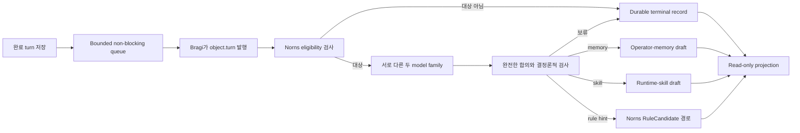

# Post-Turn 개선 검토

이 설계는 FDAI가 완료된 operator conversation을 request 경로 밖에서 검토하고 비활성 개선 제안을
만드는 방법을 정의합니다. 동의, evidence 제한, agent ownership, mixed-family 검토, durable 중복
제거, governed routing, read-only 운영을 다룹니다.

> **범위:** 검토는 operator memory, runtime skill 또는 rule hint를 제안합니다. Runtime 동작을
> 변경하거나 authority를 부여하거나 자체 output을 승인하거나 완료된 response를 지연하지 않습니다.

## 한눈에 보는 설계

Bragi는 기존 `object.turn` topic에 bounded completed-turn envelope 하나를 발행합니다. Learner인
Norns는 결정론적 eligibility를 적용하고 선택적으로 서로 다른 두 model family에 동일한 typed
proposal을 요청합니다. 완전한 합의가 이루어지면 target artifact의 owner subsystem에 draft를 만들
수 있습니다. 그 밖의 모든 결과는 bounded terminal record가 됩니다.

## Input contract

`PostTurnReviewInput`은 transcript나 process snapshot이 아니라 bounded projection입니다. 다음
항목을 포함합니다:

- Stable review, operator-turn, assistant-turn, principal-scope identifier.
- Completion time과 safe evidence reference.
- 각 tool receipt의 tool name, status, evidence reference. Raw tool output은 제외합니다.
- Validation outcome, explicit correction, recovered-failure status, 선택적 repeated procedure
  fingerprint.
- Principal이 `share_with_learner: true`로 설정한 경우에만 선택적 operator 및 assistant body.
- Scope kind와 scope reference를 모두 아는 경우에만 선택적 operator-memory scope.

Identifier, body 길이, tuple 개수, timestamp, scope pair는 생성 시 검증합니다. Raw credential,
hidden reasoning, unrestricted process state, unrestricted tool output은 contract에 포함하지 않습니다.

## Ownership 및 transport

Bragi는 계속 `object.turn`의 single writer입니다. Read API는 bounded queue에 제출하고
`EventBusPostTurnReviewIntake`를 사용해 Bragi-owned envelope만 발행합니다. Reviewer를 만들거나
자신을 Norns로 표시하지 않습니다.

Norns는 `object.turn`의 consent-filtered `post_turn_review` envelope를 구독합니다.
`producer_principal`이 `Bragi`가 아닌 envelope를 차단하고 review mapping을 엄격하게 parse한 뒤
주입된 coordinator를 off path에서 호출합니다. Norns는 새 owned topic이나 execution authority를
얻지 않습니다.

Azure transport는 모든 Pantheon logical object topic을 `MultiplexedEventBus`를 통해 configured
physical object topic으로 보냅니다. 따라서 headless runtime과 read API는 같은
logical-to-physical mapping을 사용합니다. Process-local transport도 Azure evidence를 만들지 않고
같은 logical contract를 유지합니다.

## Eligibility

`PostTurnEligibilityPolicy`는 model 호출 전에 저렴한 결정론적 signal을 평가합니다:

| Signal | 대상 조건 |
|--------|----------|
| Complex procedure | Tool-receipt 개수가 configured minimum에 도달합니다. |
| Explicit correction | Bounded correction이 하나 이상 있습니다. |
| Recovered failure | Failure-to-success transition이 기록됩니다. |
| Repeated procedure | Stable fingerprint가 configured repetition threshold에 도달합니다. |

동의가 없으면 `opted_out`, injection marker가 있으면 `unsafe_content`가 됩니다. Qualifying signal이
없는 safe turn은 `ineligible`이 됩니다. 이 결과는 reviewer를 호출하지 않고 저장합니다.

## Review 및 verification

Azure adapter는 catalog prompt를 받고 strict JSON object 하나를 반환합니다. Temperature zero,
bounded completion budget, audience-scoped workload identity를 사용하며 tool access는 없습니다.

`ConsensusPostTurnReviewer`는 identity와 family가 서로 다른 model 두 개 이상의 완전한 합의만
허용합니다. 이후 다음 항목을 검사합니다:

- 모든 proposal evidence reference가 supplied evidence의 subset입니다.
- Proposal text에 injection marker나 secret-like content가 없습니다.
- Operator-memory scope가 supplied scope와 정확히 일치합니다.
- Runtime-skill Markdown이 parse되고 manifest name이 proposal name과 일치합니다.

Model binding 누락, one-family resolution, model abstention, disagreement, unsupported evidence,
unsafe content 또는 schema failure는 `NoImprovement`를 만듭니다. Runtime은 agreement requirement를
model 하나로 낮추지 않습니다.

## Governed routing

Accepted proposal은 기존 owner workflow 뒤에 남습니다:

| Proposal | Owner 경로 | 초기 상태 |
|----------|-----------|----------|
| `OperatorMemoryCandidate` | `OperatorMemoryProposalWorkshop` | `draft` |
| `SkillProposalDraft` | `SkillWorkshop` | `draft` |
| `RuleCandidateHint` | Norns `submit_rule_hint`, 이후 Mimir governance | inert hint/candidate |

Runtime authorizer는 review와 materialization을 허용하지 않습니다. 별도로 인증된 human path가
draft를 검토해야 합니다. Operator memory는 계속 distinct approver를 요구합니다. Runtime-skill
promotion은 publisher trust를 다시 확인하고 disabled 상태로 install합니다. Rule candidate는 계속
Mimir quality 및 promotion gate를 통과해야 합니다.

## Durability 및 idempotency

PostgreSQL은 review ledger, proposal claim, operator-memory draft, runtime-skill draft를 저장합니다.
Stable review id는 redelivery 후 duplicate model call을 차단합니다. Principal scope, proposal kind,
procedure fingerprint, evidence digest로 만든 proposal key는 replica 두 개가 같은 draft를 만드는
것을 차단합니다.

Review state는 `pending`에서 다음 terminal value 중 하나로 이동합니다:

- `ineligible`
- `abstained`
- `duplicate`
- `routed`
- `failed`

Compare-and-swap transition은 첫 terminal outcome을 보존합니다. Reviewer 및 router exception은 bounded
`failed` reason이 되며 원래 conversation 결과에는 영향을 주지 않습니다.

## Read-only 운영

Production panel `post-turn-reviews`는 durable store를 읽습니다. Review, operator-memory draft,
skill draft의 bounded row list와 다음 whole-store aggregate count를 반환합니다:

- Eligibility, abstention, duplicate suppression, routing, failure.
- Proposal kind 및 owner-workflow state.
- 독립적으로 review된 memory와 skill draft의 operator acceptance.

Projection은 proposal body를 제외하며 approve, materialize, promote, execute route를 추가하지
않습니다. 사용할 수 없는 local 또는 deployed data source는 unavailable 또는 empty로 남고 synthetic
review record로 대체되지 않습니다.

## Failure behavior

- Queue saturation은 response를 바꾸지 않고 review work를 drop하며 queue metric을 기록합니다.
- Retry는 bounded하며 asynchronous intake failure에만 적용합니다.
- Reviewer binding이 없으면 `reviewer_unavailable`을 기록합니다.
- Invalid 또는 non-Bragi envelope는 Norns boundary에서 fail closed합니다.
- Database conflict는 winning review 또는 proposal claim을 보존합니다.
- Read projection failure는 proposal state를 바꾸지 않습니다.

## Verification

Focused coverage는 eligibility signal, input bound, consent, exact consensus, injection 및 secret canary,
owner routing, non-blocking queue behavior, physical-topic multiplexing, restart-safe PostgreSQL state,
cross-replica proposal claim, read-only projection, agent-role layout을 포함합니다. Repository gate는
`scripts/verify.sh`입니다.

## 관련 문서

| 알아볼 내용 | 문서 |
|------------|------|
| Pantheon ownership 및 topic | [Agent Pantheon](../agents/agent-pantheon-ko.md) |
| Operator memory 및 runtime skill | [Prompt Composition](prompt-composition-ko.md) |
| Consent 및 conversation persistence | [Operator Console](../interfaces/operator-console-ko.md) |
| Local 및 deployed provider parity | [Runtime Parity](../deployment/dev-and-deploy-parity-ko.md) |
