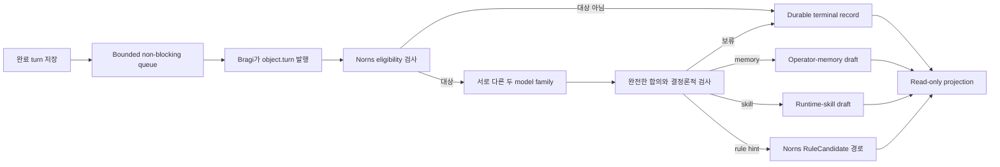

# Post-Turn 개선 검토

이 설계는 FDAI가 완료된 운영자 대화를 요청 경로 밖에서 검토하고 비활성 개선 제안을
만드는 방법을 정의합니다. 동의, 근거 제한, 에이전트 소유권, mixed-family 검토, 영속 중복
제거, 통제된 라우팅, 읽기 전용 운영을 다룹니다.

> **범위:** 검토는 운영자 기억, 런타임 스킬 또는 룰 힌트를 제안합니다. 런타임 동작을
> 변경하거나 권한을 부여하거나 자체 출력을 승인하거나 완료된 응답을 지연하지 않습니다.

## 한눈에 보는 설계

Bragi는 기존 `object.turn` 토픽에 범위가 제한된 completed-turn 묶음 하나를 발행합니다. Learner인
Norns는 결정론적 충족 여부를 적용하고 선택적으로 서로 다른 두 모델 계열에 동일한 타입이 지정된
제안을 요청합니다. 완전한 합의가 이루어지면 대상 산출물의 소유자 subsystem에 초안을 만들
수 있습니다. 그 밖의 모든 결과는 범위가 제한된 최종 기록이 됩니다.

```mermaid
flowchart LR
    CHAT[완료 turn 저장] --> QUEUE[Bounded non-blocking queue]
    QUEUE --> BRAGI[Bragi가 object.turn 발행]
    BRAGI --> NORNS[Norns eligibility 검사]
    NORNS -->|대상 아님| LEDGER[Durable terminal record]
    NORNS -->|대상| MODELS[서로 다른 두 model family]
    MODELS --> VERIFY[완전한 합의와 결정론적 검사]
    VERIFY -->|보류| LEDGER
    VERIFY -->|memory| MEMORY[Operator-memory draft]
    VERIFY -->|skill| SKILL[Runtime-skill draft]
    VERIFY -->|rule hint| RULE[Norns RuleCandidate 경로]
    MEMORY --> PANEL[Read-only projection]
    SKILL --> PANEL
    RULE --> PANEL
    LEDGER --> PANEL
```

## 입력 계약

`PostTurnReviewInput`은 대화 기록나 프로세스 스냅샷이 아니라 범위가 제한된 변환 결과입니다. 다음
항목을 포함합니다:

- 고정된 검토, operator-turn, assistant-turn, principal-scope 식별자.
- 완료 시간과 safe 근거 참조.
- 각 도구 증적의 도구 이름, 상태, 근거 참조. Raw 도구 출력은 제외합니다.
- 검증 결과, 명시적 correction, recovered-failure 상태, 선택적 repeated procedure
  지문.
- principal이 `share_with_learner: true`로 설정한 경우에만 선택적 운영자 및 assistant 본문.
- 범위 종류와 범위 참조를 모두 아는 경우에만 선택적 operator-memory 범위.

식별자, 본문 길이, 튜플 개수, 시각, 범위 쌍은 생성 시 검증합니다. Raw 자격 증명,
hidden reasoning, unrestricted 프로세스 상태, unrestricted 도구 출력은 계약에 포함하지 않습니다.

## 소유권 및 전송 계층

Bragi는 계속 `object.turn`의 single 쓰기 담당입니다. Operator API는 범위가 제한된 큐에 제출하고
`EventBusPostTurnReviewIntake`를 사용해 Bragi-owned 묶음만 발행합니다. 검토자를 만들거나
자신을 Norns로 표시하지 않습니다.

Norns는 `object.turn`의 consent-filtered `post_turn_review` 묶음을 구독합니다.
`producer_principal`이 `Bragi`가 아닌 묶음을 차단하고 검토 대응을 엄격하게 parse한 뒤
주입된 조정기를 off 경로에서 호출합니다. Norns는 새 owned 토픽이나 실행 권한을
얻지 않습니다.

Azure 전송 계층은 모든 Pantheon logical 객체 토픽을 `MultiplexedEventBus`를 통해 구성된
physical 객체 토픽으로 보냅니다. 따라서 headless 런타임과 Operator API는 같은
logical-to-physical 대응을 사용합니다. Process-local 전송 계층도 Azure 근거를 만들지 않고
같은 logical 계약을 유지합니다.

## 충족 여부

`PostTurnEligibilityPolicy`는 모델 호출 전에 저렴한 결정론적 신호를 평가합니다:

| 신호 | 대상 조건 |
|--------|----------|
| Complex procedure | Tool-receipt 개수가 구성된 최소에 도달합니다. |
| 명시적 correction | 범위가 제한된 correction이 하나 이상 있습니다. |
| Recovered 실패 | Failure-to-success 전이가 기록됩니다. |
| Repeated procedure | 고정된 지문이 구성된 repetition 임계값에 도달합니다. |

동의가 없으면 `opted_out`, 주입 표시가 있으면 `unsafe_content`가 됩니다. Qualifying 신호가
없는 safe 턴은 `ineligible`이 됩니다. 이 결과는 검토자를 호출하지 않고 저장합니다.

## 검토 및 검증

Azure 어댑터는 카탈로그 프롬프트를 받고 strict JSON 객체 하나를 반환합니다. Temperature zero,
범위가 제한된 완료 예산, audience-scoped 워크로드 신원을 사용하며 도구 접근은 없습니다.

`ConsensusPostTurnReviewer`는 신원과 계열이 서로 다른 모델 두 개 이상의 완전한 합의만
허용합니다. 이후 다음 항목을 검사합니다:

- 모든 제안 근거 참조가 supplied 근거의 subset입니다.
- 제안 텍스트에 주입 표시나 secret-like 내용이 없습니다.
- Operator-memory 범위가 supplied 범위와 정확히 일치합니다.
- Runtime-skill Markdown이 parse되고 매니페스트 이름이 제안 이름과 일치합니다.

모델 연결 누락, one-family 해석, 모델 abstention, disagreement, 지원하지 않는 근거,
unsafe 내용 또는 스키마 실패는 `NoImprovement`를 만듭니다. 런타임은 agreement 요구사항을
모델 하나로 낮추지 않습니다.

## 통제된 라우팅

Accepted 제안은 기존 소유자 작업 흐름 뒤에 남습니다:

| 제안 | Owner 경로 | 초기 상태 |
|----------|-----------|----------|
| `OperatorMemoryCandidate` | `OperatorMemoryProposalWorkshop` | `draft` |
| `SkillProposalDraft` | `SkillWorkshop` | `draft` |
| `RuleCandidateHint` | Norns `submit_rule_hint`, 이후 Mimir 거버넌스 | inert 힌트/후보 |

런타임 authorizer는 검토와 구체화를 허용하지 않습니다. 별도로 인증된 human 경로가
초안을 검토해야 합니다. Operator 기억은 계속 서로 다른 승인자를 요구합니다. Runtime-skill
승격은 발행기 trust를 다시 확인하고 비활성화된 상태로 install합니다. Rule 후보는 계속
Mimir quality 및 승격 게이트를 통과해야 합니다.

## 내구성 및 멱등성

PostgreSQL은 검토 원장, 제안 점유, operator-memory 초안, runtime-skill 초안을 저장합니다.
고정된 검토 id는 재전달 후 중복 모델 호출을 차단합니다. principal 범위, 제안 종류,
procedure 지문, 근거 다이제스트로 만든 제안 키는 복제본 두 개가 같은 초안을 만드는
것을 차단합니다.

검토 상태는 `pending`에서 다음 최종 값 중 하나로 이동합니다:

- `ineligible`
- `abstained`
- `duplicate`
- `routed`
- `failed`

Compare-and-swap 전이는 첫 최종 결과를 보존합니다. 검토자 및 라우터 exception은 범위가 제한된
`failed` 사유가 되며 원래 대화 결과에는 영향을 주지 않습니다.

## 읽기 전용 운영

운영 패널 `post-turn-reviews`는 영속 저장소를 읽습니다. 검토, operator-memory 초안,
스킬 초안의 범위가 제한된 행 목록과 다음 whole-store 집계 개수를 반환합니다:

- 충족 여부, abstention, 중복 suppression, 라우팅, 실패.
- 제안 종류 및 owner-workflow 상태.
- 독립적으로 검토된 기억과 스킬 초안의 운영자 acceptance.

변환 결과는 제안 본문을 제외하며 approve, materialize, promote, execute 경로를 추가하지
않습니다. 사용할 수 없는 로컬 또는 deployed 데이터 출처는 사용 불가 또는 빈으로 남고 synthetic
검토 기록으로 대체되지 않습니다.

## 실패 행동

- 큐 포화는 응답을 바꾸지 않고 검토 작업을 폐기하며 큐 메트릭을 기록합니다.
- 재시도는 범위가 제한된하며 asynchronous intake 실패에만 적용합니다.
- 검토자 연결이 없으면 `reviewer_unavailable`을 기록합니다.
- 잘못된 또는 non-Bragi 묶음은 Norns 경계에서 실패 시 차단합니다.
- 데이터베이스 충돌은 winning 검토 또는 제안 점유를 보존합니다.
- 읽기 변환 결과 실패는 제안 상태를 바꾸지 않습니다.

## 검증

Focused 커버리지는 충족 여부 신호, 입력 한계, consent, exact 합의, 주입 및 시크릿 canary,
소유자 라우팅, non-blocking 큐 행동, physical-topic multiplexing, restart-safe PostgreSQL 상태,
cross-replica 제안 점유, 읽기 전용 변환 결과, agent-role 배치를 포함합니다. 저장소 게이트는
`scripts/verify.sh`입니다.

## 관련 문서

| 알아볼 내용 | 문서 |
|------------|------|
| Pantheon 소유권 및 토픽 | [에이전트 Pantheon](../agents/agent-pantheon-ko.md) |
| Operator 기억 및 런타임 스킬 | [프롬프트 조립](prompt-composition-ko.md) |
| Consent 및 대화 영속성 | [Operator Console](../interfaces/operator-console-ko.md) |
| 로컬 및 deployed 프로바이더 동등성 | [런타임 동등성](../deployment/dev-and-deploy-parity-ko.md) |
