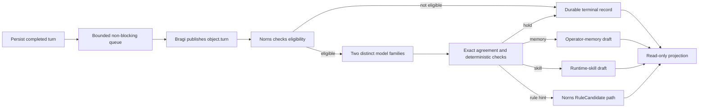

# Post-Turn Improvement Review

This design defines how FDAI reviews a completed operator conversation outside the request path
and produces an inert improvement proposal. It covers consent, evidence bounds, agent ownership,
mixed-family review, durable deduplication, governed routing, and read-only operations.

> **Scope:** The review proposes operator memory, runtime skills, or rule hints. It never changes
> runtime behavior, grants authority, approves its own output, or delays the completed response.

## Design at a glance

Bragi publishes one bounded completed-turn envelope on its existing `object.turn` topic. Norns,
the learner, applies deterministic eligibility and optionally asks two distinct model families for
the same typed proposal. Exact agreement can create a draft in the subsystem that owns the target
artifact. Every other outcome becomes a bounded terminal record.

## Input contract

`PostTurnReviewInput` is a bounded projection, not a transcript or process snapshot. It includes:

- Stable review, operator-turn, assistant-turn, and principal-scope identifiers.
- Completion time and safe evidence references.
- Tool name, status, and evidence reference for each tool receipt. Raw tool output is excluded.
- Validation outcomes, explicit corrections, recovered-failure status, and an optional repeated
  procedure fingerprint.
- Optional operator and assistant bodies only when the principal has
  `share_with_learner: true`.
- Optional operator-memory scope only when both scope kind and scope reference are known.

Identifiers, body length, tuple counts, timestamps, and scope pairs are validated at construction.
Raw credentials, hidden reasoning, unrestricted process state, and unrestricted tool output are
not part of the contract.

## Ownership and transport

Bragi remains the single writer of `object.turn`. The read API submits to a bounded queue and uses
`EventBusPostTurnReviewIntake` only to publish a Bragi-owned envelope. It does not instantiate a
reviewer or label itself as Norns.

Norns subscribes to consent-filtered `post_turn_review` envelopes on `object.turn`. It rejects an
envelope whose `producer_principal` is not `Bragi`, strictly parses the review mapping, and invokes
the injected coordinator off path. Norns gains no new owned topic and no execution authority.

Azure transport sends every Pantheon logical object topic through the configured physical object
topic with `MultiplexedEventBus`. The headless runtime and read API therefore share the same
logical-to-physical mapping. Process-local transport keeps the same logical contract without
inventing Azure evidence.

## Eligibility

`PostTurnEligibilityPolicy` evaluates cheap deterministic signals before any model call:

| Signal | Eligible when |
|--------|---------------|
| Complex procedure | Tool-receipt count reaches the configured minimum. |
| Explicit correction | At least one bounded correction is present. |
| Recovered failure | A failure-to-success transition is recorded. |
| Repeated procedure | A stable fingerprint reaches the configured repetition threshold. |

Missing consent produces `opted_out`. Injection markers produce `unsafe_content`. A safe turn with
no qualifying signal produces `ineligible`. These outcomes are stored without calling a reviewer.

## Review and verification

The Azure adapter receives a catalog prompt and returns one strict JSON object. It uses temperature
zero, a bounded completion budget, audience-scoped workload identity, and no tool access.

`ConsensusPostTurnReviewer` accepts only exact agreement from at least two models with distinct
identities and distinct families. It then checks:

- Every proposal evidence reference is a subset of supplied evidence.
- Proposal text has no injection marker or secret-like content.
- Operator-memory scope exactly matches the supplied scope.
- Runtime-skill Markdown parses, and its manifest name matches the proposal name.

Missing model bindings, one-family resolution, model abstention, disagreement, unsupported
evidence, unsafe content, or schema failure produces `NoImprovement`. The runtime never degrades
the agreement requirement to one model.

## Governed routing

Accepted proposals stay behind the current owner workflow:

| Proposal | Owning path | Initial state |
|----------|-------------|---------------|
| `OperatorMemoryCandidate` | `OperatorMemoryProposalWorkshop` | `draft` |
| `SkillProposalDraft` | `SkillWorkshop` | `draft` |
| `RuleCandidateHint` | Norns `submit_rule_hint` then Mimir governance | inert hint/candidate |

The runtime authorizer denies review and materialization. A separately authenticated human path
must review the draft. Operator memory still requires a distinct approver. Runtime-skill promotion
rechecks publisher trust and installs disabled. Rule candidates still pass Mimir's quality and
promotion gates.

## Durability and idempotency

PostgreSQL stores the review ledger, proposal claim, operator-memory draft, and runtime-skill
draft. A stable review id prevents duplicate model calls after redelivery. A proposal key derived
from principal scope, proposal kind, procedure fingerprint, and evidence digest prevents two
replicas from creating the same draft.

Review state advances from `pending` to one terminal value:

- `ineligible`
- `abstained`
- `duplicate`
- `routed`
- `failed`

Compare-and-swap transitions preserve the first terminal outcome. Reviewer and router exceptions
become bounded `failed` reasons and do not affect the original conversation result.

## Read-only operations

The production panel `post-turn-reviews` reads the durable stores. It returns bounded row lists
for reviews, operator-memory drafts, and skill drafts, plus whole-store aggregate counts for:

- Eligibility, abstention, duplicate suppression, routing, and failure.
- Proposal kind and owner-workflow state.
- Operator acceptance over independently reviewed memory and skill drafts.

The projection omits proposal bodies and adds no approve, materialize, promote, or execute route.
Unavailable local or deployed data sources remain unavailable or empty; they are not replaced by
synthetic review records.

## Failure behavior

- Queue saturation drops review work without changing the response and records queue metrics.
- Retry is bounded and applies only to asynchronous intake failures.
- Missing reviewer bindings record `reviewer_unavailable`.
- Invalid or non-Bragi envelopes fail closed at the Norns boundary.
- Database conflicts preserve the winning review or proposal claim.
- Read projection failure does not change proposal state.

## Verification

Focused coverage includes eligibility signals, input bounds, consent, exact consensus, injection
and secret canaries, owner routing, non-blocking queue behavior, physical-topic multiplexing,
restart-safe PostgreSQL state, cross-replica proposal claims, read-only projection, and agent-role
layout. The repository gate remains `scripts/verify.sh`.

## Related docs

| To learn about | Read |
|----------------|------|
| Pantheon ownership and topics | [Agent Pantheon](../agents/agent-pantheon.md) |
| Operator memory and runtime skills | [Prompt Composition](prompt-composition.md) |
| Consent and conversation persistence | [Operator Console](../interfaces/operator-console.md) |
| Local and deployed provider parity | [Runtime Parity](../deployment/dev-and-deploy-parity.md) |
