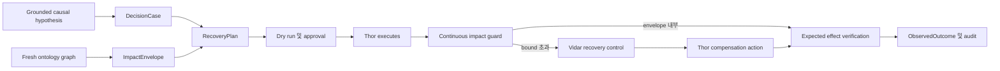

# 복구 및 chaos 적용

이 문서는 FDAI가 근거에 기반한 causal 가설을 recoverable 액션 계획으로 바꾸고, 승인된 chaos
실험을 영향 범위 안에서 적용 모드로 실행하는 방법을 정의합니다. 복구와
실험 실행은 기존 ActionType, 작업 흐름, 안전성 검사, 승인, 실행기, 감사 계약을
재사용합니다.

> **권한 경계:** 영향 analysis는 자율성을 유지하거나 낮출 수만 있습니다. 액션을 promote하거나
> 실험을 승인하거나 권위 있는 승격 레지스트리를 대신할 수 없습니다.
>
> **Chaos 경계:** Loki는 실험을 제안하고 모든 chaos 적용 실행에는 사람 승인이
> 필요합니다. Thor는 sole privileged 실행기, Var는 독립적인 승인자로 유지되며 Vidar는
> 롤백과 복구 컨트롤을 소유합니다.
>
> **구현 상태(2026-07-31):** 타입이 지정된 영향 analysis, 복구 계획, continuous 가드, 영속 실행
> 상태, pre-authorized 복구, 6개 탐색 검증, automatic demotion, S1-S14 계약을
> 구현했습니다. Tool-call 적용에는 주입된 통제된 chaos 실행기가 필요합니다. 기본
> 런타임은 관찰 모드를 유지하며 이 연결 없이 적용을 활성화하면 시작을 차단합니다.

## 설계 개요

FDAI는 온톨로지 그래프에서 예상 영향 범위를 계산하고 변경 전에 복구 계획을
compile하며 주입, stop, 롤백, 검증을 함께 다루는 하나의 결정을 요청합니다.
런타임은 관찰된 영향과 approved 묶음을 계속 비교합니다. 한계를 하나라도 넘으면
실험을 중지하고 이미 승인된 복구 경로를 시작합니다.



## 온톨로지 계약

이 설계는 `DecisionCase`, `ActionOption`, `ExpectedEffect`, `Experiment`, `Process`, `ActionRun`,
`ObservedOutcome`, `RecoveryObjective`, `ServiceObjective`, `Resource`, `Workload`를 재사용합니다.
변경할 수 없는 객체 두 개를 추가합니다.

### `ImpactEnvelope` ObjectType

`ImpactEnvelope`은 액션 또는 실험 하나에 대해 승인된 upper 한계입니다. 결정
근거이므로 Forseti가 accepted 묶음을 소유합니다. Loki는 입력을 제안할 수 있지만 자체
predicted 영향을 승인할 수 없습니다.

| Property | 타입 | 의미 |
|----------|------|------|
| `id` | 문자열 | 결정, 그래프 개정 번호, target-set 다이제스트, 묶음 버전에서 파생한 고정된 id입니다. |
| `decision_case_id` | 문자열 | 묶음을 수락한 변경할 수 없는 결정 맥락입니다. |
| `graph_revision` | 문자열 | 영향 탐색에 사용한 인벤토리와 operating-model 개정 번호입니다. |
| `target_set_digest` | 문자열 | 허용된 direct 대상의 다이제스트입니다. |
| `affected_set_digest` | 문자열 | 허용 가능한 최대 direct/indirect affected 집합 다이제스트입니다. |
| `max_affected_resources` | 정수 | Hard resource-count 상한입니다. |
| `max_dependency_depth` | 정수 | 최대 온톨로지 탐색 깊이입니다. |
| `max_duration_seconds` | 정수 | Mutated 상태에 머무를 수 있는 hard 시간입니다. |
| `objective_bounds` | json | 타입이 지정된 SLI 성능 저하 한계와 evaluation 구간입니다. |
| `required_signals` | json | 방식이 맞을 때 나타나야 하는 신호입니다. |
| `forbidden_signals` | json | 나타나는 즉시 실행을 중지하는 신호입니다. |
| `telemetry_requirements` | json | 필수 프로바이더, 최신성, 샘플 cadence입니다. |
| `uncertainty` | number | `[0, 1]` 잔여 uncertainty이며 알 수 없음은 `1`입니다. |
| `expires_at` | datetime | 토폴로지와 준비 상태를 다시 평가해야 하는 시간입니다. |

다이제스트는 결정 근거 저장소에 보관하는 범위가 제한된 리소스 목록을 대체하지 않습니다. 큰 토폴로지
스냅샷을 이벤트 버스에 넣지 않고 고정된 감사와 재생 handle을 제공합니다.

### `RecoveryPlan` ObjectType

`RecoveryPlan`은 대상을 acceptable 상태로 되돌리는 compiled, version-pinned 순서입니다.
Vidar가 계획과 준비 상태 상태를 소유합니다. 모든 변경은 계속 Thor를 통해 실행합니다.

| Property | 타입 | 의미 |
|----------|------|------|
| `id` | 문자열 | 결정, 대상, 작업 흐름 버전, 카탈로그 다이제스트에서 파생한 고정된 id입니다. |
| `strategy` | 문자열 | `rollback`, `compensate`, `state_forward`, `failover`, `restore` 중 하나입니다. |
| `status` | 문자열 | `draft`, `ready`, `stale`, `executing`, `verifying`, `recovered`, `escalated`, `failed` 중 하나입니다. |
| `workflow_ref` | 문자열 | 복구에 사용하는 versioned 작업 흐름입니다. |
| `action_type_refs` | json | Ordered 복구 ActionType과 pinned 버전입니다. |
| `compensation_order` | json | 이미 적용한 단계의 reverse 의존성 순서입니다. |
| `impact_envelope_id` | 문자열 | 주입과 복구를 모두 제한하는 묶음입니다. |
| `recovery_objective_ref` | 문자열 | 계획이 만족해야 하는 RTO/RPO 목표입니다. |
| `verification_probes` | json | 독립적인 상태, SLI, 상태 검사입니다. |
| `last_rehearsed_at` | datetime | 같은 방식 버전으로 성공한 최신 예행 연습 시간입니다. |
| `expires_at` | datetime | 토폴로지 및 프로바이더 표류에 따른 준비 상태 만료입니다. |

`ready` 계획은 모든 ActionType을 해석하고 인자를 validate했으며 예행 실행을 완료하고 fresh
검증 탐색과 tested stop 조건을 가집니다. Free-form 런북은 준비된 계획이 될 수
없습니다.

### 복구 및 영향 LinkType

| LinkType | 엔드포인트 | 의미 |
|----------|----------|------|
| `envelope_bounds_experiment` | ImpactEnvelope -> 실험 | Chaos 실행에 승인된 영향 경계입니다. |
| `envelope_bounds_action_option` | ImpactEnvelope -> ActionOption | 일반 복구 옵션에 승인된 경계입니다. |
| `envelope_protects_objective` | ImpactEnvelope -> ServiceObjective | 성능 저하를 제한하는 목표입니다. |
| `recovery_addresses_hypothesis` | RecoveryPlan -> CausalHypothesis | 계획이 되돌리려는 근거에 기반한 원인입니다. |
| `recovery_targets_resource` | RecoveryPlan -> Resource | Direct 복구 대상입니다. |
| `recovery_realized_as_process` | RecoveryPlan -> 프로세스 | 계획의 영속 실행 저널입니다. |
| `outcome_evaluates_envelope` | ObservedOutcome -> ImpactEnvelope | 관찰된 영향과 approved 영향의 독립 비교입니다. |

각 physical 선언에는 하나의 구체적인 출처와 대상 ObjectType이 있습니다. Conceptual
union은 untyped 관계 대신 명시적 LinkType 이름으로 compile합니다.

## 영향 analysis

영향 analysis는 예행 실행 전과 실행 직전에 다시 실행합니다. ActionType이 선언한 영향
radius 탐색에서 시작하고 operating 맥락을 추가합니다.

### Affected-set 탐색

탐색은 네 집합을 계산합니다.

1. **Direct 대상:** 실행기가 mutate할 수 있는 Resource입니다.
2. **런타임 dependent:** 변경을 관측할 수 있는 reverse `depends_on`, `runs_on`,
 `implemented_by` 경로입니다.
3. **Protected 서비스:** 해당 워크로드에서 도달 가능한 BusinessService와 목표입니다.
4. **컨트롤 의존성:** 실행을 안전하게 유지하는 데 필요한 텔레메트리, 신원, 감사, 잠금,
 복구 리소스입니다.

탐색은 링크 허용 목록, 깊이, 노드 개수, 간선 개수, 바이트 크기, 기한으로 제한합니다.
Stale, conflicted 또는 잘린 그래프에서는 묶음이 불완전한하므로 chaos 적용을
차단합니다.

### 영향 feature vector

안전성 검사는 입력을 unexplained 점수 하나로 합치지 않고 다음 값을 기록합니다.

| Feature | 출처 | 안전성 사용 |
|---------|--------|-------------|
| 환경 및 서비스 criticality | Operating 온톨로지 | Approval과 정족수 요구사항을 높입니다. |
| Direct/indirect 리소스 개수 | Graph 탐색 | Hard affected-set 상한을 적용합니다. |
| 의존성 동시 확산 및 critical-path position | 타입이 지정된 링크 | Cascade 가능성을 찾습니다. |
| Error-budget 및 목표 headroom | ServiceObjective 관측 | 허용 성능 저하와 소요 시간을 제한합니다. |
| Data-plane 및 stateful-resource exposure | ActionType과 Resource 인터페이스 | 더 강한 복구와 승인을 요구합니다. |
| 복구 준비 상태 및 예행 연습 age | RecoveryPlan | 복구가 stale이면 실행을 차단합니다. |
| 텔레메트리 완전성 및 lag | 근거 프로바이더 | 가드 관측이 stop 예산 안에 도착하지 못하면 차단합니다. |
| 동시 변경, 인시던트, 실험 | Operating 맥락 | 모호한하거나 compounding intervention을 막습니다. |
| Graph 최신성 및 탐색 잘림 | 인벤토리 변환 결과 | 권한을 낮추거나 실행을 차단합니다. |
| Prediction uncertainty | Impact-model 증적 | Uncertainty가 높아질수록 권한을 낮춥니다. |

기존 risk 표가 계속 권위 있는합니다. 이 feature는 never-raising 상한 축과
precondition에 입력되며 두 번째 결정 엔진을 만들지 않습니다.

## 복구 계획 compilation

Vidar는 선택한 ActionOption 하나와 근거에 기반한 가설로 계획을 compile합니다. Compilation은
다음을 pin합니다.

- 정확한 ActionType 및 작업 흐름 버전
- Rollback 계약에 필요한 pre-action 상태 또는 스냅샷 참조
- Forward 및 보상 의존성
- 단계별 멱등성 키와 리소스 잠금
- Stop 조건 및 최대 실행 시간
- 검증 탐색, 예상 범위, 관측 구간
- 기본 복구가 RTO/RPO를 충족하지 못할 때 에스컬레이션 대상

보상 순서는 단순한 reverse YAML 순서가 아니라 applied 단계의 reverse topological
순서를 따릅니다. Cycle, 해결되지 않은 의존성, 누락된 inverse 액션 또는 테스트하지 않은 stateful
복원이 있으면 계획을 `ready`로 만들 수 없습니다.

### Pre-authorized 복구

승인된 실험 결정은 범위가 제한된 주입과 stop, 롤백, 보상, 검증
순서를 함께 포함합니다. 따라서 stop 조건이 발생하면 fault가 활성인 상태에서 다른
사람 응답을 기다리지 않고 Vidar가 즉시 복구를 시작할 수 있습니다.

Pre-authorization은 같은 대상 집합, ActionType 버전, 시간 box, 영향 묶음 안에서만
유효합니다. 더 넓은 범위, destructive 액션, 다른 장애 조치 대상 또는 만료된 계획이 필요한
복구는 pause하고 새 승인을 요청합니다.

## Chaos 적용 충족 여부

아래 게이트가 모두 통과하면 chaos를 적용 모드로 실행할 수 있습니다. 적용은 승인된
실험이 실제 fault를 inject한다는 뜻이며 자율 실험 승인을 뜻하지 않습니다.

| 게이트 | 필수 근거 |
|------|-------------------|
| 카탈로그 | 시나리오 스키마 valid, 출처 출처 이력 present, injector/탐색 등록된입니다. |
| 승격 | 시나리오와 모든 변경 ActionType이 권위 있는 레지스트리에서 promoted 상태입니다. |
| Causal 용도 | Named 가설, 방식, 예상 신호, refutation 조회가 있습니다. |
| 대상 | 명시적 인벤토리 대상, supported 환경, 소유자, maintenance 구간이 있습니다. |
| Graph | Fresh, 완전한, 범위가 제한된 영향 탐색이며 해결되지 않은 critical 링크가 없습니다. |
| 목표 | Error-budget 및 recovery-objective headroom이 충분합니다. |
| 복구 | `RecoveryPlan.status=ready`, 예행 연습 fresh, 롤백 근거 available입니다. |
| 텔레메트리 | 기준선 샘플이 있고 continuous 가드 지연 시간이 stop 예산보다 짧습니다. |
| 동시성 | Conflicting 액션, 인시던트 응답, 실험, protected 변경이 없습니다. |
| 안전성 | 예행 실행 증적, 잠금, 멱등성, kill 전환, stop 조건, 감사가 준비됐습니다. |
| Approval | Var가 distinct-principal 승인을 기록합니다. 운영 또는 stateful 범위는 정족수 2입니다. |

업스트림 자세는 모든 chaos 실험을 human-approved로 유지합니다. 배포는 실행
mechanics를 shadow에서 강제 적용으로 promote할 수 있지만 Loki를 자기 승인으로 promote할 수는
없습니다.

## 런타임 상태 머신

적용 실행은 단조 증가 상태 머신을 따릅니다.

```text
planned -> impact_checked -> dry_run_verified -> approved -> injecting
injecting -> observing -> verified -> recovering -> verifying -> recovered
injecting|observing -> stop_triggered -> recovering
verifying -> recovered|escalated|failed
```

각 전이는 compare-and-swap, 추가 전용, safe to 재시도이며 실험과 대상 집합으로
keying합니다. 프로세스 재시작은 마지막 committed 상태에서 재개하고 증적이 이미 있는
주입을 반복하지 않습니다.

## Continuous 영향 가드

Heimdall은 주입과 복구 동안 approved 묶음을 평가합니다. 다음을 확인합니다.

- 관찰된 affected 리소스가 approved 집합의 subset으로 유지됩니다.
- 필수 텔레메트리가 stop 예산을 적용할 만큼 fresh합니다.
- 목표 burn, 지연 시간, 오류 비율, 포화, 가용성이 한계 안에 있습니다.
- Forbidden 신호, unexpected 의존성 실패, security 이벤트가 나타나지 않습니다.
- Injector와 복구 백엔드에 도달할 수 있습니다.
- 경과 시간이 hard 소요 시간 아래에 있습니다.

필수 가드의 알 수 없음 값은 FDAI가 containment를 더 이상 입증할 수 없으므로 unsafe입니다.
가드는 타입이 지정된 stop 이벤트를 publish합니다. Vidar가 복구 컨트롤을 소유하고 Thor가 이미 승인된
복구 ActionType을 실행합니다.

## 복구 검증

Injector를 중지했다고 복구가 완료된 것은 아닙니다. Heimdall은 모든 declared postcondition을
독립적으로 확인합니다.

1. 변경 또는 injected fault가 없어졌습니다.
2. Direct 대상 상태가 accepted 범위로 돌아왔습니다.
3. Protected 서비스 목표가 declared 구간 안에서 회복됐습니다.
4. Indirect affected 리소스에서 predicted propagated symptom이 더 이상 나타나지 않습니다.
5. 보상 또는 롤백 단계가 부분으로 남지 않았습니다.
6. Recurrence 구간이 같은 causal 지문 없이 종료됐습니다.

최종 결과는 `recovered`, `partially_recovered`, `not_recovered`, `unscorable` 중 하나입니다.
완전한 텔레메트리가 있는 `recovered`만 긍정 승격 근거로 사용할 수 있습니다.

## 승격 및 automatic demotion

승격 근거는 mechanics, detection, containment, 복구를 분리합니다.

| Measure | Acceptance criterion 예시 |
|---------|---------------------------|
| Detection | 예상 신호가 declared 지연 시간 예산 안에서 관측됩니다. |
| Containment | 묶음 밖 리소스와 forbidden 목표 breach가 모두 0입니다. |
| 복구 | RTO 안에서 복구가 끝나고 모든 검증 탐색이 통과합니다. |
| Repeatability | 고정된 시나리오 집합에서 최소 샘플과 일을 충족합니다. |
| 결정 quality | False-positive, missed-stop, policy-escape 비율이 구성된 한도 안에 있습니다. |

Criteria는 구성이며 관측 기간 전에 설정하는 것이 좋습니다. Policy escape,
out-of-envelope 영향, missed stop, 롤백 실패, stale 그래프 또는 material detector 회귀가
하나라도 발생하면 시나리오와 affected ActionType을 자동으로 shadow 모드로 되돌립니다.

## SRE 시나리오 적용

이 설계는 코어에 S1-S14 식별자를 hard-code하지 않고 시나리오 묶음을 지원합니다.

- **Kubernetes fault:** 묶음은 워크로드, 서비스, 유입, 목표 링크를 따라갑니다.
 복구는 복제본, 롤아웃, 엔드포인트, service-level 신호를 확인합니다.
- **VM stress 및 네트워크 delay:** 묶음은 호스트 dependent와 control-plane 접근을 포함합니다.
 복구는 프로세스 exit, 큐 discipline, 기억, CPU, 의존성 지연 시간을 확인합니다.
- **데이터베이스 포화:** 계획은 데이터 무결성을 보호하고 부하를 중지하며 테스트 데이터를 clean-up한
 뒤 credit, 처리량, 지연 시간, 연결 복구를 확인합니다.
- **비율 limiting:** 가설은 demand, 할당량, 프로바이더, 배포 변경을 구분합니다. 복구는
 부하 stop, 재시도 대기, promoted 경로 전환 또는 할당량 액션 요청을 수행할 수 있습니다.
- **게이트웨이 cascade:** Graph는 다운스트림 propagation을 예측하고 백엔드 상태와 외부 서비스
 목표를 모두 확인합니다.
- **Bad 배포:** 복구는 이전 개정 번호를 pin하고 forward 롤백을 실행한 뒤 롤아웃과
 dependent 서비스 상태를 확인합니다.
- **표류 및 alert 트리거:** Non-fault 시나리오는 같은 가설과 복구 계약을 사용하지만
 실험 또는 injector는 필요하지 않습니다.

## 전달 상태

구현은 독립적으로 테스트할 수 있는 구획으로 나뉩니다.

1. `ImpactEnvelope`, `RecoveryPlan`, 7개 타입이 지정된 LinkType을 추가합니다.
2. 범위가 제한된 affected-set 탐색을 구현하고 결정 근거를 저장합니다.
3. Reverse-topological 보상과 준비 상태 만료가 있는 복구 작업 흐름을 compile합니다.
4. Continuous 영향 가드와 타입이 지정된 stop 이벤트를 추가합니다.
5. Pre-authorized Vidar 복구 컨트롤을 Thor의 등록된 복구 액션에 연결합니다.
6. 독립적인 복구 검증과 승격/demotion 근거를 추가합니다.
7. S1-S14 disposable-substrate 캠페인을 shadow, approved 강제 적용, forced-stop 모드로 실행합니다.

구획 1-6은 코어에 구현했고 focused 회귀 테스트로 검증합니다. 구획 7은 배포
근거입니다. Promoted 시나리오와 ActionType 버전, 주입된 Thor, Vidar, Heimdall, 텔레메트리,
인벤토리, 감사 연결이 필요합니다. 환경 플래그 활성화는 이 연결을 대신하지 않습니다.

## 관련 문서

| 알아볼 내용 | 문서 |
|-------------|------|
| Causal 가설 및 근거 grade | [인과 인시던트 그래프](../rules-and-detection/causal-incident-graph-ko.md) |
| 공유 서비스, 목표, 결과 의미 | [FDAI 운영 온톨로지](../architecture/operating-ontology-ko.md) |
| 액션 안전성 선언 | [액션 온톨로지](action-ontology-ko.md) |
| 작업 흐름 저널 및 보상 | [프로세스 자동화](process-automation-ko.md) |
| 기준선 안전성 분류 | [위험 분류](risk-classification-ko.md) |
