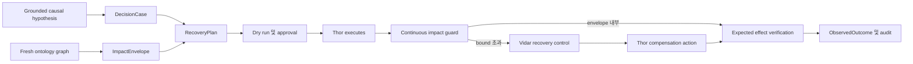

# Recovery 및 chaos enforcement

이 문서는 FDAI가 grounded causal hypothesis를 recoverable action plan으로 바꾸고, 승인된 chaos
experiment를 impact scope 안에서 enforcement mode로 실행하는 방법을 정의합니다. Recovery와
experiment execution은 기존 ActionType, workflow, safety check, approval, executor, audit contract를
재사용합니다.

> **권한 경계:** Impact analysis는 autonomy를 유지하거나 낮출 수만 있습니다. Action을 promote하거나
> experiment를 승인하거나 authoritative promotion registry를 대신할 수 없습니다.
>
> **Chaos 경계:** Loki는 experiment를 제안하고 모든 chaos enforcement run에는 사람 승인이
> 필요합니다. Thor는 sole privileged executor, Var는 independent approver로 유지되며 Vidar는
> rollback과 recovery control을 소유합니다.
>
> **구현 상태(2026-07-31):** Typed impact analysis, recovery plan, continuous guard, durable run
> state, pre-authorized recovery, 6개 probe verification, automatic demotion, S1-S14 contract를
> 구현했습니다. Tool-call enforcement에는 주입된 governed chaos executor가 필요합니다. 기본
> runtime은 관찰 모드를 유지하며 이 binding 없이 enforcement를 활성화하면 startup을 차단합니다.

## 설계 개요

FDAI는 ontology graph에서 expected impact scope를 계산하고 mutation 전에 recovery plan을
compile하며 injection, stop, rollback, verification을 함께 다루는 하나의 decision을 요청합니다.
Runtime은 observed impact와 approved envelope를 계속 비교합니다. Bound를 하나라도 넘으면
experiment를 중지하고 이미 승인된 recovery path를 시작합니다.



## Ontology contract

이 설계는 `DecisionCase`, `ActionOption`, `ExpectedEffect`, `Experiment`, `Process`, `ActionRun`,
`ObservedOutcome`, `RecoveryObjective`, `ServiceObjective`, `Resource`, `Workload`를 재사용합니다.
Immutable object 두 개를 추가합니다.

### `ImpactEnvelope` ObjectType

`ImpactEnvelope`은 action 또는 experiment 하나에 대해 승인된 upper bound입니다. Decision
evidence이므로 Forseti가 accepted envelope을 소유합니다. Loki는 input을 제안할 수 있지만 자체
predicted impact를 승인할 수 없습니다.

| Property | Type | 의미 |
|----------|------|------|
| `id` | string | Decision, graph revision, target-set digest, envelope version에서 파생한 stable id입니다. |
| `decision_case_id` | string | Envelope을 수락한 immutable decision context입니다. |
| `graph_revision` | string | Impact traversal에 사용한 inventory와 operating-model revision입니다. |
| `target_set_digest` | string | 허용된 direct target의 digest입니다. |
| `affected_set_digest` | string | 허용 가능한 최대 direct/indirect affected set digest입니다. |
| `max_affected_resources` | integer | Hard resource-count ceiling입니다. |
| `max_dependency_depth` | integer | 최대 ontology traversal depth입니다. |
| `max_duration_seconds` | integer | Mutated state에 머무를 수 있는 hard time입니다. |
| `objective_bounds` | json | Typed SLI degradation bound와 evaluation window입니다. |
| `required_signals` | json | Mechanism이 맞을 때 나타나야 하는 signal입니다. |
| `forbidden_signals` | json | 나타나는 즉시 run을 중지하는 signal입니다. |
| `telemetry_requirements` | json | Required provider, freshness, sample cadence입니다. |
| `uncertainty` | number | `[0, 1]` residual uncertainty이며 unknown은 `1`입니다. |
| `expires_at` | datetime | Topology와 readiness를 다시 평가해야 하는 시간입니다. |

Digest는 decision evidence store에 보관하는 bounded resource list를 대체하지 않습니다. 큰 topology
snapshot을 event bus에 넣지 않고 stable audit와 replay handle을 제공합니다.

### `RecoveryPlan` ObjectType

`RecoveryPlan`은 target을 acceptable state로 되돌리는 compiled, version-pinned sequence입니다.
Vidar가 plan과 readiness status를 소유합니다. 모든 mutation은 계속 Thor를 통해 실행합니다.

| Property | Type | 의미 |
|----------|------|------|
| `id` | string | Decision, target, workflow version, catalog digest에서 파생한 stable id입니다. |
| `strategy` | string | `rollback`, `compensate`, `state_forward`, `failover`, `restore` 중 하나입니다. |
| `status` | string | `draft`, `ready`, `stale`, `executing`, `verifying`, `recovered`, `escalated`, `failed` 중 하나입니다. |
| `workflow_ref` | string | Recovery에 사용하는 versioned workflow입니다. |
| `action_type_refs` | json | Ordered recovery ActionType과 pinned version입니다. |
| `compensation_order` | json | 이미 적용한 step의 reverse dependency order입니다. |
| `impact_envelope_id` | string | Injection과 recovery를 모두 제한하는 envelope입니다. |
| `recovery_objective_ref` | string | Plan이 만족해야 하는 RTO/RPO objective입니다. |
| `verification_probes` | json | Independent health, SLI, state check입니다. |
| `last_rehearsed_at` | datetime | 같은 mechanism version으로 성공한 최신 rehearsal 시간입니다. |
| `expires_at` | datetime | Topology 및 provider drift에 따른 readiness expiration입니다. |

`ready` plan은 모든 ActionType을 resolve하고 argument를 validate했으며 dry-run을 완료하고 fresh
verification probe와 tested stop condition을 가집니다. Free-form runbook은 ready plan이 될 수
없습니다.

### Recovery 및 impact LinkType

| LinkType | Endpoint | 의미 |
|----------|----------|------|
| `envelope_bounds_experiment` | ImpactEnvelope -> Experiment | Chaos run에 승인된 impact boundary입니다. |
| `envelope_bounds_action_option` | ImpactEnvelope -> ActionOption | 일반 recovery option에 승인된 boundary입니다. |
| `envelope_protects_objective` | ImpactEnvelope -> ServiceObjective | Degradation을 제한하는 objective입니다. |
| `recovery_addresses_hypothesis` | RecoveryPlan -> CausalHypothesis | Plan이 되돌리려는 grounded cause입니다. |
| `recovery_targets_resource` | RecoveryPlan -> Resource | Direct recovery target입니다. |
| `recovery_realized_as_process` | RecoveryPlan -> Process | Plan의 durable execution journal입니다. |
| `outcome_evaluates_envelope` | ObservedOutcome -> ImpactEnvelope | Observed impact와 approved impact의 독립 비교입니다. |

각 physical declaration에는 하나의 concrete source와 target ObjectType이 있습니다. Conceptual
union은 untyped relationship 대신 explicit LinkType name으로 compile합니다.

## Impact analysis

Impact analysis는 dry-run 전과 execution 직전에 다시 실행합니다. ActionType이 선언한 blast
radius traversal에서 시작하고 operating context를 추가합니다.

### Affected-set traversal

Traversal은 네 집합을 계산합니다.

1. **Direct target:** Executor가 mutate할 수 있는 Resource입니다.
2. **Runtime dependent:** Mutation을 관측할 수 있는 reverse `depends_on`, `runs_on`,
   `implemented_by` path입니다.
3. **Protected service:** 해당 workload에서 도달 가능한 BusinessService와 objective입니다.
4. **Control dependency:** Run을 안전하게 유지하는 데 필요한 telemetry, identity, audit, lock,
   recovery resource입니다.

Traversal은 link allowlist, depth, node count, edge count, byte size, deadline으로 제한합니다.
Stale, conflicted 또는 truncated graph에서는 envelope이 incomplete하므로 chaos enforcement를
차단합니다.

### Impact feature vector

Safety check는 input을 unexplained score 하나로 합치지 않고 다음 값을 기록합니다.

| Feature | Source | Safety 사용 |
|---------|--------|-------------|
| Environment 및 service criticality | Operating ontology | Approval과 quorum requirement를 높입니다. |
| Direct/indirect resource count | Graph traversal | Hard affected-set cap을 적용합니다. |
| Dependency fan-out 및 critical-path position | Typed link | Cascade 가능성을 찾습니다. |
| Error-budget 및 objective headroom | ServiceObjective observation | 허용 degradation과 duration을 제한합니다. |
| Data-plane 및 stateful-resource exposure | ActionType과 Resource interface | 더 강한 recovery와 approval을 요구합니다. |
| Recovery readiness 및 rehearsal age | RecoveryPlan | Recovery가 stale이면 execution을 차단합니다. |
| Telemetry completeness 및 lag | Evidence provider | Guard observation이 stop budget 안에 도착하지 못하면 차단합니다. |
| Concurrent change, incident, experiment | Operating context | Ambiguous하거나 compounding intervention을 막습니다. |
| Graph freshness 및 traversal truncation | Inventory projection | Authority를 낮추거나 execution을 차단합니다. |
| Prediction uncertainty | Impact-model receipt | Uncertainty가 높아질수록 authority를 낮춥니다. |

기존 risk table이 계속 authoritative합니다. 이 feature는 never-raising ceiling axis와
precondition에 입력되며 두 번째 decision engine을 만들지 않습니다.

## Recovery plan compilation

Vidar는 선택한 ActionOption 하나와 grounded hypothesis로 plan을 compile합니다. Compilation은
다음을 pin합니다.

- 정확한 ActionType 및 workflow version
- Rollback contract에 필요한 pre-action state 또는 snapshot reference
- Forward 및 compensation dependency
- Step별 idempotency key와 resource lock
- Stop condition 및 maximum execution time
- Verification probe, expected range, observation window
- Primary recovery가 RTO/RPO를 충족하지 못할 때 escalation target

Compensation order는 단순한 reverse YAML order가 아니라 applied step의 reverse topological
order를 따릅니다. Cycle, unresolved dependency, missing inverse action 또는 test하지 않은 stateful
restore가 있으면 plan을 `ready`로 만들 수 없습니다.

### Pre-authorized recovery

승인된 experiment decision은 bounded injection과 stop, rollback, compensation, verification
sequence를 함께 포함합니다. 따라서 stop condition이 발생하면 fault가 active인 상태에서 다른
사람 응답을 기다리지 않고 Vidar가 즉시 recovery를 시작할 수 있습니다.

Pre-authorization은 같은 target set, ActionType version, time box, impact envelope 안에서만
유효합니다. 더 넓은 scope, destructive action, 다른 failover target 또는 expired plan이 필요한
recovery는 pause하고 새 approval을 요청합니다.

## Chaos enforcement eligibility

아래 gate가 모두 통과하면 chaos를 enforcement mode로 실행할 수 있습니다. Enforcement는 승인된
experiment가 실제 fault를 inject한다는 뜻이며 autonomous experiment approval을 뜻하지 않습니다.

| Gate | Required evidence |
|------|-------------------|
| Catalog | Scenario schema valid, source provenance present, injector/probe registered입니다. |
| Promotion | Scenario와 모든 mutation ActionType이 authoritative registry에서 promoted 상태입니다. |
| Causal purpose | Named hypothesis, mechanism, expected signal, refutation query가 있습니다. |
| Target | Explicit inventory target, supported environment, owner, maintenance window가 있습니다. |
| Graph | Fresh, complete, bounded impact traversal이며 unresolved critical link가 없습니다. |
| Objective | Error-budget 및 recovery-objective headroom이 충분합니다. |
| Recovery | `RecoveryPlan.status=ready`, rehearsal fresh, rollback evidence available입니다. |
| Telemetry | Baseline sample이 있고 continuous guard latency가 stop budget보다 짧습니다. |
| Concurrency | Conflicting action, incident response, experiment, protected change가 없습니다. |
| Safety | Dry-run receipt, lock, idempotency, kill switch, stop condition, audit가 준비됐습니다. |
| Approval | Var가 distinct-principal approval을 기록합니다. Production 또는 stateful scope는 quorum 2입니다. |

Upstream posture는 모든 chaos experiment를 human-approved로 유지합니다. Deployment는 execution
mechanics를 shadow에서 enforce로 promote할 수 있지만 Loki를 self-approval로 promote할 수는
없습니다.

## Runtime state machine

Enforcement run은 monotonic state machine을 따릅니다.

```text
planned -> impact_checked -> dry_run_verified -> approved -> injecting
injecting -> observing -> verified -> recovering -> verifying -> recovered
injecting|observing -> stop_triggered -> recovering
verifying -> recovered|escalated|failed
```

각 transition은 compare-and-swap, append-only, safe to retry이며 experiment와 target set으로
keying합니다. Process restart는 마지막 committed state에서 resume하고 receipt가 이미 있는
injection을 반복하지 않습니다.

## Continuous impact guard

Heimdall은 injection과 recovery 동안 approved envelope을 평가합니다. 다음을 확인합니다.

- Observed affected resource가 approved set의 subset으로 유지됩니다.
- Required telemetry가 stop budget을 적용할 만큼 fresh합니다.
- Objective burn, latency, error rate, saturation, availability가 bound 안에 있습니다.
- Forbidden signal, unexpected dependency failure, security event가 나타나지 않습니다.
- Injector와 recovery backend에 도달할 수 있습니다.
- Elapsed time이 hard duration 아래에 있습니다.

Required guard의 unknown 값은 FDAI가 containment를 더 이상 입증할 수 없으므로 unsafe입니다.
Guard는 typed stop event를 publish합니다. Vidar가 recovery control을 소유하고 Thor가 이미 승인된
recovery ActionType을 실행합니다.

## Recovery verification

Injector를 중지했다고 recovery가 완료된 것은 아닙니다. Heimdall은 모든 declared postcondition을
독립적으로 확인합니다.

1. Mutation 또는 injected fault가 없어졌습니다.
2. Direct target health가 accepted range로 돌아왔습니다.
3. Protected service objective가 declared window 안에서 회복됐습니다.
4. Indirect affected resource에서 predicted propagated symptom이 더 이상 나타나지 않습니다.
5. Compensation 또는 rollback step이 partial로 남지 않았습니다.
6. Recurrence window가 같은 causal fingerprint 없이 종료됐습니다.

Terminal outcome은 `recovered`, `partially_recovered`, `not_recovered`, `unscorable` 중 하나입니다.
Complete telemetry가 있는 `recovered`만 positive promotion evidence로 사용할 수 있습니다.

## Promotion 및 automatic demotion

Promotion evidence는 mechanics, detection, containment, recovery를 분리합니다.

| Measure | Acceptance criterion 예시 |
|---------|---------------------------|
| Detection | Expected signal이 declared latency budget 안에서 관측됩니다. |
| Containment | Envelope 밖 resource와 forbidden objective breach가 모두 0입니다. |
| Recovery | RTO 안에서 recovery가 끝나고 모든 verification probe가 통과합니다. |
| Repeatability | Frozen scenario set에서 minimum sample과 day를 충족합니다. |
| Decision quality | False-positive, missed-stop, policy-escape rate가 configured limit 안에 있습니다. |

Criteria는 configuration이며 observation period 전에 설정하는 것이 좋습니다. Policy escape,
out-of-envelope impact, missed stop, rollback failure, stale graph 또는 material detector regression이
하나라도 발생하면 scenario와 affected ActionType을 자동으로 shadow mode로 되돌립니다.

## SRE scenario 적용

이 설계는 core에 S1-S14 identifier를 hard-code하지 않고 scenario pack을 지원합니다.

- **Kubernetes fault:** Envelope은 workload, service, ingress, objective link를 따라갑니다.
  Recovery는 replica, rollout, endpoint, service-level signal을 확인합니다.
- **VM stress 및 network delay:** Envelope은 host dependent와 control-plane access를 포함합니다.
  Recovery는 process exit, queue discipline, memory, CPU, dependency latency를 확인합니다.
- **Database saturation:** Plan은 data integrity를 보호하고 load를 중지하며 test data를 clean-up한
  뒤 credit, throughput, latency, connection recovery를 확인합니다.
- **Rate limiting:** Hypothesis는 demand, quota, provider, deployment change를 구분합니다. Recovery는
  load stop, backoff, promoted route switch 또는 quota action request를 수행할 수 있습니다.
- **Gateway cascade:** Graph는 downstream propagation을 예측하고 backend health와 external service
  objective를 모두 확인합니다.
- **Bad deployment:** Recovery는 prior revision을 pin하고 forward rollback을 실행한 뒤 rollout과
  dependent service health를 확인합니다.
- **Drift 및 alert trigger:** Non-fault scenario는 같은 hypothesis와 recovery contract를 사용하지만
  Experiment 또는 injector는 필요하지 않습니다.

## Delivery 상태

구현은 독립적으로 테스트할 수 있는 slice로 나뉩니다.

1. `ImpactEnvelope`, `RecoveryPlan`, 7개 typed LinkType을 추가합니다.
2. Bounded affected-set traversal을 구현하고 decision evidence를 저장합니다.
3. Reverse-topological compensation과 readiness expiry가 있는 recovery workflow를 compile합니다.
4. Continuous impact guard와 typed stop event를 추가합니다.
5. Pre-authorized Vidar recovery control을 Thor의 registered recovery action에 bind합니다.
6. Independent recovery verification과 promotion/demotion evidence를 추가합니다.
7. S1-S14 disposable-substrate campaign을 shadow, approved enforce, forced-stop mode로 실행합니다.

Slice 1-6은 core에 구현했고 focused regression test로 검증합니다. Slice 7은 deployment
evidence입니다. Promoted scenario와 ActionType version, 주입된 Thor, Vidar, Heimdall, telemetry,
inventory, audit binding이 필요합니다. Environment flag 활성화는 이 binding을 대신하지 않습니다.

## 관련 문서

| 알아볼 내용 | 문서 |
|-------------|------|
| Causal hypothesis 및 evidence grade | [인과 incident graph](../rules-and-detection/causal-incident-graph-ko.md) |
| 공유 service, objective, outcome 의미 | [FDAI 운영 온톨로지](../architecture/operating-ontology-ko.md) |
| Action safety declaration | [Action 온톨로지](action-ontology-ko.md) |
| Workflow journal 및 compensation | [프로세스 자동화](process-automation-ko.md) |
| Baseline safety classification | [위험 분류](risk-classification-ko.md) |
