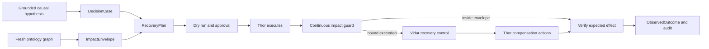

# Recovery and Chaos Enforcement

This document defines how FDAI turns a grounded causal hypothesis into a recoverable action plan
and how an approved chaos experiment can run in enforcement mode without exceeding its impact
scope. Recovery and experiment execution reuse the existing ActionType, workflow, safety check,
approval, executor, and audit contracts.

> **Authority boundary:** Impact analysis can preserve or lower autonomy. It cannot promote an
> action, approve an experiment, or replace the authoritative promotion registry.
>
> **Chaos boundary:** Loki proposes experiments and every chaos enforcement run requires human
> approval. Thor remains the sole privileged executor, Var remains the independent approver, and
> Vidar owns rollback and recovery control.
>
## Implementation status

### Implementation scope

| Area | State | Evidence | Notes |
|------|-------|----------|-------|
| Impact analysis and envelope compilation | implemented | [`impact_analysis`](../../../services/core-control-plane/src/fdai/core/impact_analysis), [`test_impact_analysis.py`](../../../services/core-control-plane/tests/core/impact_analysis/test_impact_analysis.py) | Bounded traversal, feature calculation, incomplete-evidence refusal, and impact caps have focused coverage. |
| Recovery-plan contracts and state transitions | implemented | [`test_recovery_plan.py`](../../../services/core-control-plane/tests/core/verticals/test_recovery_plan.py), [Ontology contract](#ontology-contract) | Versioned plans and recovery transitions exist; this does not prove a live recovery outcome. |
| Continuous guard and independent verification | implemented | [`test_impact_analysis.py`](../../../services/core-control-plane/tests/core/impact_analysis/test_impact_analysis.py), [Runtime state machine](#runtime-state-machine) | Guard and verification mechanics fail closed on stale, incomplete, or over-envelope evidence. |
| S1-S14 governed chaos campaign and executor binding | in-progress | [`constitution-traceability.json`](../../../config/constitution-traceability.json), [Delivery status](#delivery-status) | Scenario taxonomy exists, but constitutional domain coverage remains incomplete and no governed live executor campaign is retained. |

### Implementation history

| Date | State | Change | Evidence | Remaining |
|------|-------|--------|----------|-----------|
| 2026-08-14 | in-progress | Adopted the implementation ledger without reconstructing earlier provenance and separated tested mechanics from operational enforcement evidence. | `current change`; current source, focused tests, and constitutional traceability listed in the scope table. | Bind the governed executor and complete the frozen recovery and chaos campaign. |

### Remaining work

- [ ] Bind an injected `GovernedChaosExecutor` through deployment composition and prove startup
  refuses enforcement when the binding or required authority is absent.
- [ ] Execute the frozen S1-S14 campaign with approved impact envelopes, continuous stop guards,
  independent recovery verification, and retained replayable receipts.
- [ ] Close the missing constitutional scenario dimensions for recovery and Chaos Engineering before
  claiming domain validation or enforce readiness.

## Design at a glance

FDAI calculates an expected impact scope from the ontology graph, compiles a recovery plan before
any mutation, and asks for one decision covering injection, stop, rollback, and verification. The
runtime then compares observed impact with the approved envelope continuously. Exceeding any bound
stops the experiment and starts the already authorized recovery path.



## Ontology contract

The design reuses `DecisionCase`, `ActionOption`, `ExpectedEffect`, `Experiment`, `Process`,
`ActionRun`, `ObservedOutcome`, `RecoveryObjective`, `ServiceObjective`, `Resource`, and
`Workload`. It adds two immutable objects.

### `ImpactEnvelope` ObjectType

`ImpactEnvelope` is the approved upper bound for one action or experiment. Forseti owns the
accepted envelope because it is decision evidence; Loki can propose inputs but cannot approve its
own predicted impact.

| Property | Type | Meaning |
|----------|------|---------|
| `id` | string | Stable id from decision, graph revision, target set digest, and envelope version. |
| `decision_case_id` | string | Immutable decision context that accepted the envelope. |
| `graph_revision` | string | Inventory and operating-model revision used for impact traversal. |
| `target_set_digest` | string | Digest of the allowed direct targets. |
| `affected_set_digest` | string | Digest of the maximum direct and indirect affected set. |
| `max_affected_resources` | integer | Hard resource-count ceiling. |
| `max_dependency_depth` | integer | Maximum ontology traversal depth. |
| `max_duration_seconds` | integer | Hard time in the mutated state. |
| `objective_bounds` | json | Typed SLI degradation bounds and evaluation windows. |
| `required_signals` | json | Signals that should appear if the mechanism is correct. |
| `forbidden_signals` | json | Signals that immediately stop the run. |
| `telemetry_requirements` | json | Required providers, freshness, and sample cadence. |
| `uncertainty` | number | Residual uncertainty in `[0, 1]`; unknown values use `1`. |
| `expires_at` | datetime | Time after which topology and readiness should be evaluated again. |

The digests do not replace the bounded resource list retained in the decision evidence store. They
provide stable audit and replay handles without placing a large topology snapshot on the event bus.

### `RecoveryPlan` ObjectType

`RecoveryPlan` is a compiled, version-pinned sequence that returns the target to an acceptable
state. Vidar owns the plan and its readiness status. Every mutation still executes through Thor.

| Property | Type | Meaning |
|----------|------|---------|
| `id` | string | Stable id from decision, target, workflow version, and catalog digest. |
| `strategy` | string | `rollback`, `compensate`, `state_forward`, `failover`, or `restore`. |
| `status` | string | `draft`, `ready`, `stale`, `executing`, `verifying`, `recovered`, `escalated`, or `failed`. |
| `workflow_ref` | string | Versioned workflow used for recovery. |
| `action_type_refs` | json | Ordered recovery ActionTypes and pinned versions. |
| `compensation_order` | json | Reverse dependency order for already applied steps. |
| `impact_envelope_id` | string | Envelope that bounds both injection and recovery. |
| `recovery_objective_ref` | string | RTO/RPO objective the plan should satisfy. |
| `verification_probes` | json | Independent health, SLI, and state checks. |
| `last_rehearsed_at` | datetime | Latest successful rehearsal using the same mechanism version. |
| `expires_at` | datetime | Readiness expiration based on topology and provider drift. |

A plan marked `ready` has resolved every ActionType, validated arguments, completed dry-run, fresh
verification probes, and a tested stop condition. A free-form runbook cannot become a ready plan.

### Recovery and impact LinkTypes

| LinkType | Endpoints | Meaning |
|----------|-----------|---------|
| `envelope_bounds_experiment` | ImpactEnvelope -> Experiment | Approved impact boundary for a chaos run. |
| `envelope_bounds_action_option` | ImpactEnvelope -> ActionOption | Approved boundary for an ordinary recovery option. |
| `envelope_protects_objective` | ImpactEnvelope -> ServiceObjective | Objective whose degradation is bounded. |
| `recovery_addresses_hypothesis` | RecoveryPlan -> CausalHypothesis | Grounded cause the plan is intended to reverse. |
| `recovery_targets_resource` | RecoveryPlan -> Resource | Direct recovery target. |
| `recovery_realized_as_process` | RecoveryPlan -> Process | Durable execution journal for the plan. |
| `outcome_evaluates_envelope` | ObservedOutcome -> ImpactEnvelope | Independent comparison of observed and approved impact. |

Each physical declaration has one concrete source and target ObjectType. Conceptual unions compile
to explicit LinkType names rather than an untyped relationship.

## Impact analysis

Impact analysis runs before dry-run and again immediately before execution. It starts from the
ActionType's declared blast-radius traversal and adds operating context.

### Affected-set traversal

The traversal computes four sets:

1. **Direct targets:** Resources the executor can mutate.
2. **Runtime dependents:** Reverse `depends_on`, `runs_on`, and `implemented_by` paths that may
   observe the mutation.
3. **Protected services:** Business services and objectives reachable from those workloads.
4. **Control dependencies:** Telemetry, identity, audit, lock, and recovery resources required to
   keep the run safe.

The traversal is bounded by link allowlist, depth, node count, edge count, byte size, and deadline.
A stale, conflicted, or truncated graph makes the envelope incomplete and blocks chaos enforcement.

### Impact feature vector

The safety check records these inputs rather than collapsing them into one unexplained score:

| Feature | Source | Safety use |
|---------|--------|------------|
| Environment and service criticality | Operating ontology | Raises approval and quorum requirements. |
| Direct and indirect resource count | Graph traversal | Enforces the hard affected-set cap. |
| Dependency fan-out and critical path position | Typed links | Detects cascade potential. |
| Error-budget and objective headroom | ServiceObjective observations | Limits allowed degradation and duration. |
| Data-plane and stateful-resource exposure | ActionType and Resource interfaces | Requires stronger recovery and approval. |
| Recovery readiness and rehearsal age | RecoveryPlan | Blocks execution when recovery is stale. |
| Telemetry completeness and lag | Evidence providers | Blocks execution when guard observations cannot arrive in time. |
| Concurrent changes, incidents, and experiments | Operating context | Prevents ambiguous or compounding interventions. |
| Graph freshness and traversal truncation | Inventory projection | Lowers authority or blocks execution. |
| Prediction uncertainty | Impact model receipt | Lowers authority as uncertainty grows. |

The existing risk table remains authoritative. These features feed never-raising ceiling axes and
preconditions; they do not create a second decision engine.

## Recovery plan compilation

Vidar compiles a plan from one selected ActionOption and its grounded hypothesis. Compilation pins:

- the exact ActionType and workflow versions;
- pre-action state or snapshot reference needed by the rollback contract;
- forward and compensation dependencies;
- per-step idempotency keys and resource locks;
- stop conditions and maximum execution time;
- verification probes, expected ranges, and observation windows;
- escalation target when the primary recovery cannot meet RTO/RPO.

Compensation order follows reverse topological order over applied steps, not merely reverse YAML
order. A cycle, unresolved dependency, missing inverse action, or untested stateful restore keeps
the plan out of `ready`.

### Pre-authorized recovery

An approved experiment decision covers the bounded injection plus its stop, rollback,
compensation, and verification sequence. This lets Vidar start recovery immediately when a stop
condition fires without waiting for another human response while the fault is active.

Pre-authorization is valid only inside the same target set, ActionType versions, time box, and
impact envelope. A recovery that needs a wider scope, a destructive action, a different failover
target, or an expired plan pauses and requests a new approval.

## Chaos enforcement eligibility

Chaos can run in enforcement mode after every gate below passes. "Enforcement" means the approved
experiment injects a real fault; it does not mean autonomous experiment approval.

| Gate | Required evidence |
|------|-------------------|
| Catalog | Scenario schema valid, source provenance present, injector and probe registered. |
| Promotion | Scenario and every mutation ActionType are promoted by the authoritative registry. |
| Causal purpose | Named hypothesis, mechanism, expected signals, and refutation query. |
| Target | Explicit inventory targets, supported environment, owner, and maintenance window. |
| Graph | Fresh, complete, bounded impact traversal with no unresolved critical link. |
| Objectives | Sufficient error-budget and recovery-objective headroom. |
| Recovery | `RecoveryPlan.status=ready`, rehearsal fresh, rollback evidence available. |
| Telemetry | Baseline samples present and continuous guard latency below the stop budget. |
| Concurrency | No conflicting action, incident response, experiment, or protected change. |
| Safety | Dry-run receipt, locks, idempotency, kill switch, stop conditions, and audit ready. |
| Approval | Var records distinct-principal approval; production or stateful scope requires quorum 2. |

The upstream posture keeps every chaos experiment human-approved. A deployment can promote the
execution mechanics from shadow to enforce, but it cannot promote Loki into self-approval.

## Runtime state machine

An enforcement run follows a monotonic state machine:

```text
planned -> impact_checked -> dry_run_verified -> approved -> injecting
injecting -> observing -> verified -> recovering -> verifying -> recovered
injecting|observing -> stop_triggered -> recovering
verifying -> recovered|escalated|failed
```

Each transition is compare-and-swap, append-only, safe to retry, and keyed by the experiment and
target set. A process restart resumes from the last committed state and never repeats an injection
whose receipt already exists.

## Continuous impact guard

Heimdall evaluates the approved envelope throughout injection and recovery. It checks:

- observed affected resources remain a subset of the approved set;
- required telemetry remains fresh enough to enforce the stop budget;
- objective burn, latency, error rate, saturation, and availability stay within bounds;
- no forbidden signal, unexpected dependency failure, or security event appears;
- the injector and recovery backends remain reachable;
- elapsed time remains below the hard duration.

Any unknown value on a required guard is unsafe because FDAI can no longer prove containment. The
guard publishes a typed stop event. Vidar owns recovery control, and Thor executes the already
authorized recovery ActionTypes.

## Recovery verification

Stopping the injector is not recovery. Heimdall independently checks all declared postconditions:

1. The mutation or injected fault is absent.
2. Direct target health returned to its accepted range.
3. Protected service objectives recovered within the declared window.
4. Indirect affected resources no longer show the predicted propagated symptoms.
5. No compensation or rollback step remains partial.
6. The recurrence window closes without the same causal fingerprint.

The terminal outcome is `recovered`, `partially_recovered`, `not_recovered`, or `unscorable`.
Only `recovered` with complete telemetry can count as positive promotion evidence.

## Promotion and automatic demotion

Promotion evidence keeps mechanics, detection, containment, and recovery separate:

| Measure | Example acceptance criterion |
|---------|------------------------------|
| Detection | Expected signal observed within its declared latency budget. |
| Containment | Zero resources outside the envelope and zero forbidden objective breaches. |
| Recovery | Recovery completed within RTO with every verification probe passing. |
| Repeatability | Minimum samples and days met across the frozen scenario set. |
| Decision quality | False-positive, missed-stop, and policy-escape rates within configured limits. |

The criteria are configuration and should be set before the observation period. Any policy escape,
out-of-envelope impact, missed stop, rollback failure, stale graph, or material detector regression
automatically returns the scenario and affected ActionTypes to shadow mode.

## SRE scenario application

The design supports the S1-S14 pack without hard-coding those identifiers into core:

- **Kubernetes faults:** The envelope follows workload, service, ingress, and objective links;
  recovery verifies replicas, rollout, endpoints, and service-level signals.
- **VM stress and network delay:** The envelope includes host dependents and control-plane access;
  recovery verifies process exit, queue discipline, memory, CPU, and dependency latency.
- **Database saturation:** The plan protects data integrity, stops load, cleans test data, and
  verifies credits, throughput, latency, and connection recovery.
- **Rate limiting:** The hypothesis distinguishes demand, quota, provider, and deployment changes;
  recovery can stop load, apply backoff, switch a promoted route, or request quota action.
- **Gateway cascade:** The graph predicts downstream propagation and verifies both backend health
  and external service objectives.
- **Bad deployment:** Recovery pins the prior revision, performs forward rollback, and verifies the
  rollout plus dependent service health.
- **Drift and alert triggers:** Non-fault scenarios use the same hypothesis and recovery contracts
  but do not require an Experiment or injector.

## Delivery status

The implementation is split into independently testable slices:

1. Add `ImpactEnvelope`, `RecoveryPlan`, and the seven typed LinkTypes.
2. Implement bounded affected-set traversal and persist its decision evidence.
3. Compile recovery workflows with reverse-topological compensation and readiness expiry.
4. Add the continuous impact guard and typed stop event.
5. Bind pre-authorized Vidar recovery control to Thor's registered recovery actions.
6. Add independent recovery verification and promotion/demotion evidence.
7. Run the S1-S14 disposable-substrate campaign in shadow, approved enforce, and forced-stop modes.

Slices 1-6 are implemented in core and covered by focused regression tests. Slice 7 is deployment
evidence: it requires promoted scenario and ActionType versions plus injected Thor, Vidar, Heimdall,
telemetry, inventory, and audit bindings. Enabling an environment flag does not substitute for
those bindings.

## Related docs

| To learn about | Read |
|----------------|------|
| Causal hypotheses and evidence grades | [Causal Incident Graph](../rules-and-detection/causal-incident-graph.md) |
| Shared service, objective, and outcome meaning | [FDAI Operating Ontology](../architecture/operating-ontology.md) |
| Action safety declarations | [Action Ontology](action-ontology.md) |
| Workflow journal and compensation | [Process Automation](process-automation.md) |
| Baseline safety classification | [Risk Classification](risk-classification.md) |
