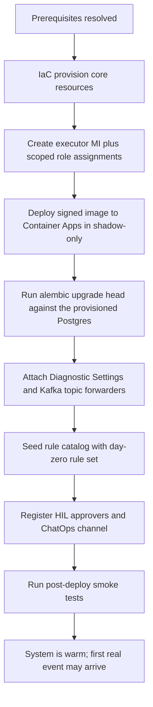

# Deploy and Onboard

How to provision FDAI into an Azure subscription and complete first-time onboarding
so the system is ready to observe. This file is authoritative for **the concrete deployment
inventory, the bootstrap sequence, and the fork ↔ core responsibility split**; the deployment
lifecycle (CI/CD, progressive delivery, rollback, DR) remains in
[deployment.md](deployment.md).

Azure focus: this document targets an Azure subscription. Non-Azure providers are TBD (see
[Implementation Focus](../../.github/copilot-instructions.md#implementation-focus-must)).
All identifiers are synthetic per
[generic-scope.instructions.md](../../.github/instructions/generic-scope.instructions.md).

> Concrete SKUs, counts, and region choices are **not yet decided** - they live in
> [Open Decisions](#open-decisions). The structure below is stable so a future inventory PR
> fills the values without reshaping the sections. The **entry command is decided**:
> `terraform apply` against `infra/` (Terraform HCL) - see
> [tech-stack.md § OD-1](tech-stack.md#od-1-core-runtime-language) and
> [Deployment Artifacts](#deployment-artifacts).

## Prerequisites

### Deployer Identity (Azure)

- Subscription-scoped **Owner** or **Contributor + User Access Administrator** on the target
  resource group - required to create the executor Managed Identity and its scoped role
  assignments.
- Ability to grant subscription-scoped roles matching the executor's **action whitelist**
  ([security-and-identity.md](security-and-identity.md)).
- **TBD**: whether a purpose-built custom role packages the deployer permissions.

### Azure Prerequisites

- Region with confirmed availability of every service in the inventory below.
- Confirmed quota headroom (Container Apps cores, Event Hubs throughput units, PostgreSQL
  vCores, Key Vault operations).
- Diagnostic Settings destination (Log Analytics workspace) - new or existing; ownership TBD.
- **Private networking (policy-locked tenants).** Tenants that enforce "Key Vault public
  network access disabled" (common in enterprise / managed tenants) set
  `enable_private_networking = true`: the deploy provisions a VNet + a Key Vault private
  endpoint on `privatelink.vaultcore.azure.net` with a linked private DNS zone, binds the
  Container App Environment to a delegated infrastructure subnet, and locks the vault to
  private access. Because a private-only vault is unreachable from an operator laptop,
  `terraform apply` MUST then run from a host with VNet line-of-sight to the endpoint - a
  CI runner or a jumpbox inside the VNet (the executor writes the DSN secrets from there).
  ACR / Event Hubs / Postgres private endpoints reuse the same generic
  `modules/private-endpoint` module and are added the same way when a tenant restricts them
  too.

#### Ops/hub runner (private-everything tenants)

Some tenants force **every** data service private (Key Vault *and* storage), so even a
terraform remote-state backend is laptop-unreachable. The `infra/bootstrap` layer stands up
the durable hub that makes the deploy possible and survives app rebuilds:

- an **ops resource group + hub VNet** (`rg-fdai-ops-<region_short>` / `vnet-fdai-ops-...`)
  separate from the app RG, with a runner subnet and a private-endpoint subnet;
- a **terraform remote-state storage account** locked to private, fronted by a blob private
  endpoint on `privatelink.blob.core.windows.net` linked to the ops VNet;
- a **self-hosted deploy runner VM** (no public IP) with a system-assigned managed identity
  that holds `Contributor` on the app RG and `Storage Blob Data Contributor` on the state
  account. It is the only host with line-of-sight to the app's private endpoints.

The app config peers its spoke VNet to the ops hub (both directions) and links its private
DNS zones to the ops VNet via the `extra_vnet_links` seam, so the runner resolves the app's
Key Vault privately. The runner is the terraform apply principal, so the existing
`kv_officer_self` grant makes it `Key Vault Secrets Officer` on the app vault - it writes the
DSN secrets during apply. Deploys run through the [`deploy-dev` workflow](../../.github/workflows/deploy-dev.yml)
on the `[self-hosted, fdai-deploy]` runner (plan-only by default; the `apply` input enforces).
Full runbook: [`infra/bootstrap/README.md`](../../infra/bootstrap/README.md).

### Non-Azure Prerequisites

- A **GitOps host** (GitHub or Azure DevOps organization) with an installed GitHub App or
  service connection scoped to the catalog + fork repos.
- A **Teams tenant** with a group-connected team for HIL approvals (Teams is the default A1 primary - see [channels-and-notifications.md](channels-and-notifications.md)).
- A **Slack workspace** with the FDAI Slack app installed and the mandatory userId ↔ Entra OID mapping store provisioned; required for the P1 Slack A1 channel ([channels-and-notifications.md#7-channel-specific-notes](channels-and-notifications.md#7-channel-specific-notes)).
- A **container registry** (ACR or an external registry) that supports signature +
  attestation storage.
- **TBD**: OpenTelemetry backend selection (Log Analytics vs Grafana/Tempo vs App Insights).

## Deployment Artifacts

- IaC in `infra/` (see [project-structure.md](project-structure.md)) is the entry point. Every
  environment is provisioned identically from the same code with per-environment parameters
  and per-environment isolated state.
- **Entry command**: `terraform apply` against the `infra/` Terraform (HCL) modules - resolves
  the previous OD (`azd up` vs `terraform apply` vs a wrapper). Environment values are supplied
  via `*.tfvars` files that are **never committed** (per
  [generic-scope.instructions.md](../../.github/instructions/generic-scope.instructions.md));
  a small wrapper script MAY orchestrate `init → plan → apply → post-provision checks`, but the
  entry command remains Terraform. Bicep and OpenTofu remain compatible fallbacks per
  [tech-stack.md](tech-stack.md).
- Same signed image is promoted `dev → staging → prod`; nothing is rebuilt per environment
  ([deployment.md](deployment.md)).

## Resource Naming Convention

Every Azure resource this repo provisions follows the **Microsoft Cloud Adoption Framework
(CAF)** abbreviation convention. Names are deterministic, deployment-agnostic, and safe to
grep for - a rename is a Terraform diff, never a hand-edit.

Pattern:

```
<caf-prefix>-<workload>[-<component>][-<env>][-<region>][-<instance>]
```

- **workload** is the fixed literal `fdai` (product name, not a customer identifier -
  allowed under [generic-scope.instructions.md](../../.github/instructions/generic-scope.instructions.md)).
- **component** is added only when one resource kind is provisioned more than once
  (e.g. `ca-fdai-core` vs a future `ca-fdai-worker`).
- **env** (`dev`/`staging`/`prod`) and **region** (`krc`/`weu`/`eus`) suffixes are added only
  when the resource is deployed side-by-side; the day-zero deployment keeps names
  suffix-free.
- **instance** (`01`, `02`, ...) is added only when multiple copies exist in one env.

The default **resource group** is `rg-fdai` (fixed by user directive). Everything the
system provisions lives under that RG unless a resource type requires a subscription-scope
placement (none today).

### CAF prefixes for the day-zero inventory

| Resource | CAF prefix | Char rules | Example name |
|----------|------------|------------|--------------|
| Resource Group | `rg-` | 1-90; alphanumerics + hyphens/underscores | `rg-fdai` |
| User-assigned Managed Identity | `id-` | 3-128 | `id-fdai-executor` |
| Container Apps environment | `cae-` | 2-32; alphanumerics + hyphens | `cae-fdai` |
| Container App (core) | `ca-` | 2-32 | `ca-fdai-core` |
| Container Apps Job (out-of-band) | `caj-` | 2-32 | `caj-fdai-oob` |
| Event Hubs namespace | `evhns-` | 6-50 | `evhns-fdai` |
| PostgreSQL Flexible Server | `psql-` | 3-63; lowercase | `psql-fdai` |
| Key Vault | `kv-` | 3-24; alphanumerics + hyphens | `kv-fdai` |
| **Container Registry (ACR)** | `cr` | 5-50; **alphanumeric only, no hyphens** | `crfdai` |
| Log Analytics workspace | `log-` | 4-63 | `log-fdai` |
| Azure Bot (HIL Adaptive Cards) | `bot-` | 2-64 | `bot-fdai` |
| Static Web App (read-only console) | `stapp-` | 2-40 | `stapp-fdai` |

### Length-safety rules (MUST)

- **ACR names never contain hyphens**; the prefix `cr` is fused with the workload token
  (`crfdai`). When env/region suffixes join, do NOT reintroduce hyphens - use one
  continuous lowercase alphanumeric string (e.g. `crfdaidevkrc01`).
- **Storage account** (if ever added) is 24-char lowercase alphanumeric only - same
  no-hyphen rule (`stfdai...`).
- If a legal name exceeds the character limit after adding env/region/instance, use the
  documented short-name `aip` in place of `fdai` - and only for that resource kind.
  Do not sprinkle `aip` where the full name still fits.

### What this rule forbids

- **No random or opaque suffixes** in Terraform (`crfdaicyutlgcnv3` from a hash source
  is a review blocker). Determinism is a debugging tool.
- **No customer names or environment values baked into the identifier** - those live in
  `*.tfvars` and the tag map, never in the resource name.
- **No inline naming logic in Python** - the app reads whatever it is handed via env vars;
  the name is decided in `infra/` at plan time.

## Azure Resource Inventory (minimum set)

The inventory is deliberately minimized for **cost-efficiency first**. Every choice below is
driven by the [Cost-Efficiency Principles](#cost-efficiency-principles) at the end of this
document. The inventory is rendered from the four CSP-neutral contracts (event bus, runtime,
secret, workload identity) defined in [csp-neutrality.md](csp-neutrality.md); Azure is
today's realization of each contract. Concrete tier values, exact names, region, and per-app
replica caps are still **fork-specific** and tuned per environment; the shape is stable.

| # | Resource | Tier | Purpose | Notes |
|---|----------|------|---------|-------|
| 1 | **Container Apps environment** | Consumption | scale-to-zero compute host | one environment shared by all core services; realizes the [Runtime contract](csp-neutrality.md#2-runtime-contract--oci-image--knative-compatible-manifest) |
| 2 | **Container App** (unified core) | 1 app, `minReplicas: 0`, KEDA scaler on Kafka lag (Event Hubs) | `event-ingest` (primary) + `trust-router`, `executor`, `audit-writer` as **sidecar containers** | one scale unit, `localhost` IPC - see [Compute Shape](#compute-shape-sidecar-containers); no Dapr, no Envoy-specific ingress |
| 3 | **Container Apps Job** | Consumption | scheduled probes and out-of-band change detection | replaces Azure Functions; shares the environment |
| 4 | **Event Hubs namespace** | Standard (1 TU, auto-inflate off) | Kafka-wire event bus (endpoint on `:9093`) | realizes the [Event Bus contract](csp-neutrality.md#1-event-bus-contract--kafka-wire-protocol); DLQ is a Kafka `<topic>.dlq` convention, not a native DLQ resource |
| 5 | **Diagnostic Settings + `azure-events`-style forwarders** | included with Log Analytics / Activity Log | forward Activity Log / resource events into an Event Hubs Kafka topic | replaces standalone Event Grid system topics; the core sees Kafka only |
| 6 | **PostgreSQL Flexible Server** | Burstable **B1ms**, 1 zone, 7-day backup | audit + KPI + pattern library + **pgvector** T1 embeddings, single store | HA / multi-zone deferred to Phase 4 |
| 7 | **Key Vault** | Standard | secret backend consumed via **Container Apps native secret + Key Vault reference** - realizes the [Secret contract](csp-neutrality.md#3-secret-contract--environment--k8s-secret) | Premium (HSM) not required; app never calls a secret SDK |
| 8 | **User-assigned Managed Identity** | - | executor's least-privilege, action-whitelisted identity; realizes the [Workload Identity contract](csp-neutrality.md#4-workload-identity-contract--oidc-token) | Phase 1 ships **one** MI (`mi-aw-executor`) using built-in role composition, RG-scoped; Phase 3 splits into per-domain MIs - see [security-and-identity.md § Identity Mapping (Phased)](security-and-identity.md#identity-mapping-phased) |
| 9 | **Log Analytics workspace** | Pay-as-you-go, **30-day default retention** | traces / metrics / logs / audit-forward; App Insights binds to it | retention is **UI-configurable** post-deploy, defaulting to 30 days |
| 10 | **Container Registry (ACR)** | Basic (Standard if geo-replication needed later) | signed images + build attestations | pin by digest, never a mutable tag |
| 11 | **Azure OpenAI / AI Foundry account** (**opt-in**, `var.enable_llm`) | Standard | T1 embedding + T2 mixed-model reasoner deployments (one per capability from `resolved-models.json`) | provisioned only when the deployer holds `Cognitive Services Contributor` on the sub AND the region exposes the preferred family; otherwise the affected capabilities degrade to **`hil-only`** (see [dev-and-deploy-parity.md § Deployer-Scoped LLM Provisioning](dev-and-deploy-parity.md#deployer-scoped-llm-provisioning)). Never deployed in `dev` mode - dev-mode binds deterministic fakes. |

Additional required elements that **do not incur a billable Azure resource of their own**:

- **App registrations × 3** - split audiences per
  [user-rbac-and-identity.md#41-app-registrations](user-rbac-and-identity.md#41-app-registrations):
  `fdai-console-spa` (SPA sign-in, PKCE), `fdai-api` (Web API audience for
  console + ChatOps backend), and `fdai-approval-bot` (Teams SSO). None hold the
  executor identity. Step-by-step `az` creation:
  [../runbooks/entra-app-registration.md](../runbooks/entra-app-registration.md).
- **Entra security groups × 5** - `aw-readers`, `aw-contributors`, `aw-approvers`,
  `aw-owners`, `aw-break-glass`. Fork-owned; objectIds injected via config and validated at
  startup ([user-rbac-and-identity.md#42-security-groups-slots](user-rbac-and-identity.md#42-security-groups-slots)).
- **Conditional Access policies** - phishing-resistant MFA on `aw-approvers`/`aw-owners`,
  compliant-device on `aw-owners`, dedicated hardware token + sign-in alert on
  `aw-break-glass`. Available on Entra ID P1
  ([user-rbac-and-identity.md#43-conditional-access](user-rbac-and-identity.md#43-conditional-access)).
- **Azure Bot (Free tier)** - Teams Adaptive Cards for HIL approvals.
- **Static Web Apps (Free tier)** - read-only console hosting; free tier covers the intended
  bandwidth.
- **Workload identity federation** - CI/CD short-lived OIDC tokens; not a resource, no cost.

Explicitly **not provisioned** on day zero (deferred to a later phase when a measured need
justifies them):

- **Service Bus namespace and Event Grid custom topics** - the event bus is the Kafka
  endpoint on Event Hubs ([csp-neutrality.md § Event Bus Contract](csp-neutrality.md#1-event-bus-contract--kafka-wire-protocol));
  Activity Log / resource events are forwarded via Diagnostic Settings into an Event Hubs
  Kafka topic. Event Grid system topics remain available as a signal *source*, but no
  standalone Event Grid resource is provisioned when Diagnostic-Settings forwarding covers
  the need.
- Dedicated vector database (pgvector inside PostgreSQL suffices at initial scale).
- Front Door, Application Gateway, API Management (no public inbound endpoint; console is
  read-only static hosting).
- Secondary-region resources for DR (Phase 4 - TBD; see
  [Implementation Focus](../../.github/copilot-instructions.md#implementation-focus-must)).
- Separate Application Insights resource (it binds to the shared Log Analytics workspace).

### Compute Shape (sidecar containers)

The core is deployed as **one Container App with sidecar containers**, not one app per
subsystem. This keeps deployment count minimal while preserving the SRP boundaries defined at
the code level in [project-structure.md](project-structure.md).

- **Primary container**: `event-ingest` - the Kafka consumer (Event Hubs `:9093`) that
  drives KEDA scale-to-zero via Kafka lag.
- **Sidecar containers** (same replica pod): `trust-router`, `executor`, `audit-writer`, and
  any other core subsystem.
- **IPC**: containers talk via `localhost` (HTTP/gRPC on 127.0.0.1). No cross-network hop, no
  external service discovery.
- **Independence**: each sidecar ships as its own **signed image**; images are versioned and
  rolled independently at the registry level even though they deploy together.
- **Trade-off (accepted for the initial scale)**: sidecars share one scale unit - when
  ingress scales up, every sidecar scales with it, and restarts happen together. If any
  sidecar develops a distinct scaling profile, it graduates into its own Container App in a
  later phase. This graduation is **planned**, not a rewrite: sidecars communicate over
  loopback the same way they would over a service mesh, so the split is a config change.
- **Safety invariants unchanged**: sidecars share the executor's identity **only if their
  responsibility requires it**; sidecars that do not execute (e.g. `trust-router`) MUST run
  under a **less-privileged identity** so the executor's role is not leaked into every
  container.

## Bootstrap Sequence

Provisioning is IaC-driven, but the **logical bootstrap order** to a first live event MUST be
honored. Any earlier stage failing halts and unwinds; the deployment does not proceed to a
later stage with a broken earlier one.



- **Shadow-only on first deploy**: no rule / action starts in enforce mode, ever. Promotion is
  a separate act ([rule-governance.md](rule-governance.md)).
- **Migrations MUST run before the first control-loop tick**. The Container App itself does
  not migrate on start (to keep replicas identical + prevent races). Run
  `alembic upgrade head` from a workstation or a CI job that can reach the provisioned
  Postgres FQDN with the admin DSN. The 6 migrations under `alembic/versions/` are
  reversible - a broken deploy can `alembic downgrade -1` back to the prior baseline.
- Post-deploy smoke tests and the synthetic canary are defined in
  [operating-and-verification.md](operating-and-verification.md).

## Fork vs Core Responsibility Matrix

The upstream repo (this repo) ships everything **customer-agnostic**. A per-customer **fork**
provides values, secrets, and any customer-specific bindings via dependency injection at the
composition root - never by editing `core/`
([generic-scope.instructions.md](../../.github/instructions/generic-scope.instructions.md)).

| Concern | Upstream (this repo) | Fork (per-customer) |
|---------|----------------------|---------------------|
| IaC modules | parameterized modules, no environment values | environment tfvars, secret references |
| Provider adapters | Azure adapter interfaces + Azure implementation | fork MAY override an implementation via DI |
| Rule catalog seed | no seeded rules | day-zero seed set + custom rules |
| Assignments and overrides | none | tenant/RG-scoped assignments, RG-scoped overrides |
| HIL approver list | not committed | Teams channel id, approver group ids |
| MSAL / OIDC config | schema + envelope | client ids, tenant id, redirect URIs |
| Model endpoints (T2) | interface + capability config + bootstrap resolver + weekly reconciler ([llm-strategy.md § Model Provisioning and Lifecycle](llm-strategy.md#model-provisioning-and-lifecycle)) | `rule-catalog/llm-registry.yaml` overrides, mixed-model mode (`azure-foundry` / `external` / `hil-only`), Azure OpenAI or Foundry resource values |
| Runtime config values | key schema (no values) | env vars + Key Vault refs |

## Runtime Configuration Matrix

All values MUST come from env vars or Key Vault refs at runtime. **No environment value is
committed to this repo.** The list below is the **schema of keys** the deployment expects; the
full expanded catalog and defaults are authored during the inventory PR.

| Key | Source | Owner | Notes |
|-----|--------|-------|-------|
| `AZURE_TENANT_ID` | env | fork | non-secret |
| `AZURE_SUBSCRIPTION_ID` | env | fork | non-secret |
| `AZURE_RG` | env | fork | target resource group |
| `KAFKA_BOOTSTRAP_SERVERS` | env | fork | Event Hubs Kafka endpoint (`<ns>.servicebus.windows.net:9093`); realizes the [Event Bus contract](csp-neutrality.md#1-event-bus-contract--kafka-wire-protocol) |
| `KAFKA_SECURITY_PROTOCOL` | env | fork | `SASL_SSL` on Azure; provider-specific value elsewhere |
| `KAFKA_SASL_MECHANISM` | env | fork | `OAUTHBEARER` on Azure |
| `KEYVAULT_URL` | env | fork | executor MI has GET on secrets |
| `FDAI_STATE_STORE_DSN` | KV ref | upstream | Postgres connection URI for audit + KPI; wired by `infra/main.tf` `azurerm_key_vault_secret.state_store_dsn` from `module.state_store.application_dsn`, exposed to the Container App via `secret{}` + `env{}` (see [project-structure.md](project-structure.md) `infra/modules/compute/container-apps/`). Empty at runtime => in-memory fallback. |
| `FDAI_OPERATOR_MEMORY_DSN` | KV ref | upstream | Postgres DSN for HIL-approved operator memory. Same source as `FDAI_STATE_STORE_DSN` day-zero (single Flexible Server); a fork MAY split it later without touching core code. |
| `FDAI_T1_PATTERN_LIBRARY_DSN` | KV ref | upstream | Postgres DSN for the pgvector-backed T1 pattern library. Same source day-zero; wired identically. |
| `KAFKA_TOPIC_EVENTS` | env | fork | primary event ingest topic |
| `KAFKA_TOPIC_DLQ_SUFFIX` | env | fork | dead-letter suffix (default `.dlq`) |
| `TEAMS_HIL_CHANNEL_ID` | env | fork | HIL routing |
| `T2_MODEL_ENDPOINT` | env | fork | primary reasoner - populated by the bootstrap resolver from `rule-catalog/llm-registry.yaml`; see [llm-strategy.md § Model Provisioning and Lifecycle](llm-strategy.md#model-provisioning-and-lifecycle) |
| `T2_MODEL_ENDPOINT_CROSSCHECK` | env | fork | mixed-model cross-check target - distinct publisher enforced at bootstrap |
| `LLM_MODE` | env | fork | `local-fake` (default in `dev`) or `azure`. Governs the composition-root binding; see [dev-and-deploy-parity.md § Parity Contract](dev-and-deploy-parity.md#parity-contract-must). |
| `LLM_RESOLVED_MODELS_PATH` | KV ref | fork | required when `LLM_MODE=azure`; points at the `resolved-models.json` written by the bootstrap resolver |
| `RULE_CATALOG_REF` | env | fork | git ref of catalog snapshot |
| `AUTONOMY_MODE_DEFAULT` | env | fork | MUST default to `shadow` |
| `FDAI_LOG_LEVEL` | env | upstream | Python logger level for the core app (`DEBUG` / `INFO` / `WARNING` / `ERROR`). Default `INFO`. |
| `FDAI_READ_API_DEV_MODE` | env | dev-only | `1` bypasses Entra JWT validation in the read API for local dev. MUST NOT be set in staging / prod. |
| `FDAI_READ_API_LOCAL_ENTRA` | env | dev-only | `1` runs the local seed harness with **real** Entra JWT verification (requires `FDAI_ENTRA_TENANT_ID` + `FDAI_API_AUDIENCE`) so sign-in can be tested locally. Mutually exclusive with dev-mode; MUST NOT be set in staging / prod. |
| `FDAI_POLICIES_ROOT` | env | fork | absolute path to the OPA / Rego bundle root consumed by T0 and the verifier. Defaults to the in-repo `policies/` when unset. |
| `FDAI_MI_CLIENT_ID` | env | upstream | executor user-assigned MI client id (populated by Container Apps from the assigned identity). Used by `WorkloadIdentity` for the audience-scoped OIDC exchange. |
| `FDAI_MEASUREMENT_MODE` | env | upstream | `shadow` (default) or `enforce` - governs the Container Apps Jobs runners in `infra/modules/measurement-runners/`. |
| `FDAI_DIRECT_API_FAKE` | env | dev-only | `1` swaps the executor direct-API path for the in-memory fake; used by tests and local dev. |
| `FDAI_TOOL_CALL_FAKE` | env | dev-only | `1` swaps the executor tool-call path for the in-memory fake (`RecordingToolExecutor`); used by tests and local dev. |
| `FDAI_PROFILE_ID` | env | fork | selects one profile from `rule-catalog/profiles/` (see [rule-catalog-profiles.md](rule-catalog-profiles.md)). **Composition-root wiring pending** as of 2026-07. |
| `FDAI_NARRATOR_PROVIDER` / `FDAI_NARRATOR_BASE_URL` / `FDAI_NARRATOR_MODEL` / `FDAI_NARRATOR_API_VERSION` / `FDAI_NARRATOR_API_KEY` | env + KV ref | fork | Operator-console narrator translator config (see [operator-console.md](operator-console.md)); `API_KEY` MUST go through KV. Empty provider = deterministic fallback. |
| `FDAI_CHATOPS_APPROVE_CALLBACK_URL` / `FDAI_CHATOPS_REJECT_CALLBACK_URL` / `FDAI_CHATOPS_WEBHOOK_SECRET` / `FDAI_CHATOPS_TIMEOUT_SECONDS` | env + KV ref | fork | Chatops HIL callback endpoints and the shared webhook secret; the secret MUST go through KV. |
| `FDAI_GITOPS_API_BASE` / `FDAI_GITOPS_DEFAULT_BRANCH` / `FDAI_GITOPS_BRANCH_PREFIX` / `FDAI_GITOPS_TIMEOUT_SECONDS` | env | fork | `gitops-pr` adapter target repo config (GitHub App / Azure DevOps). Auth secrets flow through the platform's App installation, not env vars. |
| `FDAI_RBAC_READERS_GROUP_ID` / `FDAI_RBAC_CONTRIBUTORS_GROUP_ID` / `FDAI_RBAC_APPROVERS_GROUP_ID` / `FDAI_RBAC_OWNERS_GROUP_ID` / `FDAI_RBAC_BREAK_GLASS_GROUP_ID` | env | fork | Entra ID group object ids for the five human roles (see [user-rbac-and-identity.md](user-rbac-and-identity.md)). Unset group = role unassigned. |
| `FDAI_ENTRA_TENANT_ID` / `FDAI_API_AUDIENCE` | env | fork | Required for the production read-API Entra JWT verifier (`EntraJwtVerifier`): the fork's tenant id and the `fdai-api` App ID URI (`api://<fdai-api-guid>`). See [user-rbac-and-identity.md#102-api-token-validation](user-rbac-and-identity.md#102-api-token-validation). |
| `FDAI_ENTRA_ISSUER` / `FDAI_ENTRA_JWKS_URI` | env | fork | Optional verifier overrides; default to the tenant's v2 issuer + public key set. Set `ISSUER` to `https://sts.windows.net/<tenant>/` for a v1-token app; override `JWKS_URI` only for sovereign / air-gapped clouds. |
| `FDAI_DR_DRILL_SOURCE_SERVER_ARM_ID` / `FDAI_DR_DRILL_TARGET_LOCATION` / `FDAI_DR_DRILL_TARGET_RG_PREFIX` / `FDAI_DR_DRILL_TARGET_SERVER_PREFIX` / `FDAI_DR_DRILL_PITR_OFFSET_MINUTES` / `FDAI_DR_DRILL_DRY_RUN` | env | fork | DB-DR drill job config (see [../runbooks/db-dr-drill.md](../runbooks/db-dr-drill.md)); `DRY_RUN=true` upstream default keeps the job idempotent. |
| `FDAI_SECRET_KAFKA_TOKEN` / other `FDAI_SECRET_*` | KV ref | fork | generic escape hatch for a secret consumed by an adapter that does not yet have a dedicated env-var name; every `FDAI_SECRET_*` value MUST come from KV. |

Rules that apply to every key:

- Startup **fails fast** on missing or unparseable config
  ([coding-conventions.instructions.md](../../.github/instructions/coding-conventions.instructions.md)).
- Secrets go through Key Vault refs, never plain env; a secret in plain env fails the CI
  secret-scan gate.
- Per-environment values differ; the same image reads them from the injected environment.

## Event Source Subscription

Signals wired at bootstrap so the three initial verticals have something to observe. The
concrete event types, subscription filters, and rate caps are **TBD**; the shape of the
wiring is stable.

| Vertical | Azure signal candidates | Delivery |
|--------|-------------------------|----------|
| Change | Activity Log (resource-write / delete), Change Analysis, Resource Health | Diagnostic Settings → Event Hubs Kafka topic (`aw.change.events`) |
| DR / Chaos | Resource Health, backup vault events, PostgreSQL / SQL replication-lag metrics, restore-rehearsal outcomes | Diagnostic Settings + scheduled Container Apps Job probes → Kafka topic (`aw.dr.events`) |
| FinOps | cost anomaly alerts, budget alerts, Advisor cost recommendations | Cost Management pull → Kafka topic (`aw.finops.events`); anomaly alerts fan in through the same Diagnostic-Settings path |

Every event is stamped with an **idempotency key at ingress** so a replay is a no-op; DLQs
MUST be reachable and covered by the [alert routing](operating-and-verification.md#alert-routing)
before enforce is enabled anywhere.

## Verification After Provisioning

Post-provision verification (adapter reachability, canary round-trip, shadow correctness) is
defined in [operating-and-verification.md](operating-and-verification.md#post-deploy-smoke-tests).
A failing verification aborts the promotion and rolls traffic back
([deployment.md#release-and-rollback](deployment.md#release-and-rollback)).

## Cost-Efficiency Principles

Every provisioning choice honors these principles; a resource that violates them needs an
explicit justification in the deployment PR. The **illustrative monthly cost envelope** that
results from these principles is in [cost-model.md](cost-model.md).

1. **Scale-to-zero first** - idle compute cost MUST be zero. KEDA drives Container Apps and
   Container Apps Jobs off **Kafka consumer lag** on the Event Hubs endpoint.
2. **One region, one zone, non-HA at day zero** - multi-zone and multi-region are Phase 4
   (TBD). The initial deployment is a single geographic footprint.
3. **Managed services collapsed** - pgvector inside PostgreSQL is the vector store; App
   Insights binds to the shared Log Analytics workspace; no separate vector DB or APM
   resource is provisioned.
4. **Basic / Standard tiers by default** - Premium tiers require a stated, measured need. HA
   variants, geo-replication, and private-endpoint premium features are deferred.
5. **Free tiers where they cover the use case** - Static Web Apps (console), Azure Bot
   (HIL Adaptive Cards), and workload identity federation (CI/CD) are all Free tier.
6. **Monolithic-with-sidecars deployment** - one Container App runs the core subsystems as
   sidecars ([Compute Shape](#compute-shape-sidecar-containers)). SRP is enforced at the code
   level; deployment is minimized. Splitting into multiple Container Apps is a **later
   configuration change**, not a rewrite.
7. **Model budget cap** - T2 inference is designed to reach ~5-10% of events; token/spend
   budgets are enforced and overflow degrades to HIL, never to uncapped inference.
8. **Catalog is git-hosted, not a service** - the rule catalog lives in a git repository, not
   a managed store, so no extra Azure resource is needed for catalog storage.
9. **No public inbound endpoint** - no Application Gateway / Front Door / API Management on
   day zero; ingress is the event bus, egress is allow-listed.
10. **Deferred DR resources** - secondary-region resources are **not** provisioned initially;
    control-plane DR is planned via IaC + state backups (see
    [deployment.md](deployment.md#control-plane-disaster-recovery)).

## Open Decisions

- [x] Entry command - **resolved: `terraform apply` against `infra/` (Terraform HCL)**. A
      thin wrapper script MAY orchestrate `init → plan → apply → post-provision checks`, but
      the entry point is Terraform. See [Deployment Artifacts](#deployment-artifacts).
- [ ] Concrete tier values within the minimum set (PostgreSQL storage size, Log Analytics
      daily cap, ACR retention window, Event Hubs throughput-unit ceiling).
- [ ] Region choice and the single-zone deployment posture (multi-zone deferred to Phase 4).
- [ ] Custom Azure role packaging for the deployer identity.
- [ ] Log Analytics daily-cap and query cost budget (retention default 30 days is
      **configurable from the console UI**; alert thresholds TBD).
- [ ] Kafka topic naming + Diagnostic-Settings forwarding filters, per-domain fan-in shape.
- [ ] Networking posture: public + IP allowlist vs private endpoints + hub-spoke.
- [ ] Full runtime config key list (values matrix expanded).
- [ ] Day-zero seed rule set (which sources, which rule ids) - cross-linked to Phase 1.
- [ ] Sidecar → separate Container App **graduation triggers**: metrics that indicate a
      subsystem needs its own scale unit and privilege boundary.
