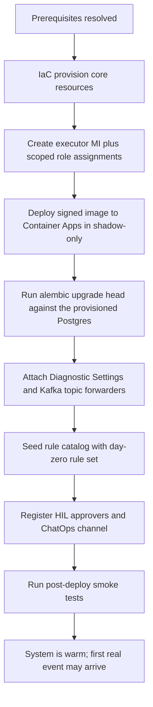

# 배포와 온보딩(Deploy and Onboard)

Azure 구독에 FDAI를 프로비저닝하고 첫 온보딩을 완료해 시스템이 관측 준비되도록 하는
방법. 이 문서는 **구체적 배포 인벤토리, 부트스트랩 순서, 포크 ↔ 코어 책임 분리**의 진실
원본입니다; 배포 라이프사이클(CI/CD, progressive delivery, 롤백, DR)은
[deployment-ko.md](deployment-ko.md)에 남습니다.

Azure 초점: 이 문서는 Azure 구독을 대상으로 함. 비-Azure 프로바이더는 TBD
([Implementation Focus](../../../.github/copilot-instructions.md#implementation-focus-must)).
모든 식별자는
[generic-scope.instructions.md](../../../.github/instructions/generic-scope.instructions.md)에
따라 합성.

> Day-zero 서비스 tier와 수량은
> [Azure Resource Inventory](#azure-resource-inventory-minimum-set)에서 결정되어 있습니다.
> 포크는 배포 전에 region, quota, retention, replica 상한, production tier override를
> 확인합니다. 엔트리 명령은
> [tech-stack-ko.md § OD-1](../architecture/tech-stack-ko.md#od-1-core-런타임-언어)과 함께
> `terraform apply`로 결정되어 있습니다.

## 전제조건(Prerequisites)

### 배포자 아이덴티티 (Azure)

- 대상 리소스 그룹에 대한 subscription-scoped **Owner** 또는 **Contributor + User Access
  Administrator** - executor Managed Identity와 그 범위된 롤 할당 생성에 필요.
- Executor의 **액션 화이트리스트**에 매칭되는 subscription-scoped 롤 부여 능력
  ([security-and-identity-ko.md](../architecture/security-and-identity-ko.md)).
- **TBD**: 목적별 custom 롤이 배포자 권한을 패키징할지.

### Azure 전제조건

- 아래 인벤토리의 모든 서비스 가용성이 확인된 리전.
- 확인된 쿼터 헤드룸 (Container Apps 코어, Event Hubs 처리량 단위, PostgreSQL vCore,
  Key Vault 작업).
- Diagnostic Settings 목적지 (Log Analytics workspace) - 신규 또는 기존; 소유권 TBD.
- **private networking (정책 잠금 테난트).** "Key Vault public network access 비활성"을
  강제하는 테난트(엔터프라이즈 / 관리 테난트에 흔함)는 `enable_private_networking = true`
  로 설정한다: 배포가 VNet + `privatelink.vaultcore.azure.net` 의 Key Vault private
  endpoint + 연결된 private DNS zone 를 provision 하고, Container App Environment 를 위임
  infra 서브넷에 바인드하며, vault 를 private 접근으로 잠근다. private-only vault 는
  운영자 laptop 에서 도달 불가능하므로, `terraform apply` 는 endpoint 에 VNet 시야가
  확보된 호스트 - VNet 내 CI 러너 또는 점프박스 - 에서 실행해야 MUST (executor 가 거기서
  DSN 시크릿을 write). ACR / Event Hubs / Postgres private endpoint 도 동일한 제네릭
  `modules/private-endpoint` 모듈을 재사용해 테난트가 제한할 때 같은 방식으로 추가한다.

#### ops/hub 러너 (private-everything 테난트)

일부 테난트는 **모든** 데이터 서비스를 private 로 강제한다(Key Vault 와 storage 둘 다).
그래서 terraform remote-state 백엔드조차 laptop 에서 도달 불가능하다. `infra/bootstrap`
레이어가 배포를 가능케 하는 지속적 hub 를 세우며, 이는 앱 재빌드에도 살아남는다:

- 앱 RG 와 분리된 **ops 리소스 그룹 + hub VNet**(`rg-fdai-ops-<region_short>` /
  `vnet-fdai-ops-...`), 러너 서브넷과 private-endpoint 서브넷 포함;
- private 로 잠긴 **terraform remote-state storage account**, ops VNet 에 링크된
  `privatelink.blob.core.windows.net` blob private endpoint 로 프론트;
- public IP 없는 **self-hosted 배포 러너 VM**, system-assigned managed identity 가 앱 RG 에
  `Contributor`, state account 에 `Storage Blob Data Contributor` 를 보유. 앱의 private
  endpoint 에 시야가 확보된 유일한 호스트다.

앱 config 는 spoke VNet 을 ops hub 에 (양방향) peering 하고 private DNS zone 을
`extra_vnet_links` seam 으로 ops VNet 에 링크해, 러너가 앱 Key Vault 를 private 로 해석하게
한다. 러너가 terraform apply 주체이므로 기존 `kv_officer_self` 부여가 러너를 앱 vault 의
`Key Vault Secrets Officer` 로 만든다 - apply 중 DSN 시크릿을 write 한다. 배포는
`[self-hosted, fdai-deploy]` 러너 위에서 [`deploy-dev` 워크플로](../../../.github/workflows/deploy-dev.yml)
로 실행한다(기본 plan-only; `apply` 입력이 enforce). 전체 런북:
[`infra/bootstrap/README.md`](../../../infra/bootstrap/README.md).

#### 온보딩 자동화

러너 경로를 반복 가능하게 만드는 5개 헬퍼(전부 customer-agnostic, 파라미터화):

- [`preflight-policy-check.sh`](../../../infra/bootstrap/preflight-policy-check.sh) 는 throwaway
  KV + storage 를 프로브해 테난트가 private-everything 를 강제하는지(러너 경로 필수 여부)
  사전에 알려준다.
- [`onboard.sh`](../../../infra/bootstrap/onboard.sh) 는 create-state-account -> bootstrap
  apply -> GitHub Actions 설정 출력을 한 번에 수행(idempotent).
- [`set-gh-actions-config.sh`](../../../scripts/set-gh-actions-config.sh) 는 bootstrap output 에서
  repo Variables + Secrets 를 설정(비번은 생성 후 파이프, 절대 출력 안 함).
- [`register-runner.sh`](../../../infra/bootstrap/register-runner.sh) 는 러너 토큰을 발급하고
  `run-command` 로 VNet 러너를 등록.
- [`teardown-env.sh`](../../../scripts/teardown-env.sh) 는 러너 deallocate/start(비용) 와 ops hub
  + state account 를 절대 건드리지 않는 env 별 `terraform destroy` 가드를 제공.

#### 프로덕션 하드닝 knob

전부 dev posture 를 기본값으로(라이브 무변경) 하고 env 별 tfvars 로 강화한다
([`staging.tfvars.example`](../../../infra/envs/staging.tfvars.example) /
[`prod.tfvars.example`](../../../infra/envs/prod.tfvars.example) 참조):

| 관심사 | knob | prod 값 |
|--------|------|---------|
| 삭제 보호 | `enable_resource_locks`, bootstrap `enable_state_lock` | `true` |
| Key Vault | `kv_purge_protection_enabled`, `kv_soft_delete_retention_days` | `true`, `90` |
| Postgres network | `enable_private_postgres` | `true` |
| Postgres 내구성 | `postgres_backup_retention_days`, `postgres_geo_redundant_backup` | `35`, `true` |
| Registry | `acr_sku` | `Premium` |
| 모니터링 | `enable_monitoring`, `alert_email`, `alert_webhook_url` | on + 목적지 |
| 비용 | `monthly_budget_amount`, `budget_alert_emails`, bootstrap `runner_auto_shutdown_time` | 설정 |

`enable_private_postgres`는 PostgreSQL Flexible Server 전용 delegated subnet을 추가하고 app/ops
VNet에 private DNS zone을 연결하며 public access와 `AllowAllAzureServices` firewall rule을
비활성화합니다. 기존 public server에서 활성화하면 server가 교체될 수 있으므로 promotion 전에
plan을 review하고 backup/restore를 rehearsal하는 것이 좋습니다. `infra/production-gates.tf`의
assertion은 signed image digest, private networking, durability, alert destination, cost budget
최소값이 제공될 때까지 production plan을 차단합니다.

CI 는 자격증명 없는 가드 2개를 더한다: [`infra-lint.yml`](../../../.github/workflows/infra-lint.yml)
(모든 infra PR 에 fmt + validate + tfsec + Checkov) 와
[`infra-drift.yml`](../../../.github/workflows/infra-drift.yml) (러너에서 스케줄 `plan -detailed-exitcode`
- 빨간 run 은 라이브 infra 가 코드에서 drift 했다는 뜻). 모니터링은 활성화 시 action group +
metric alert(Postgres / Key Vault / Event Hubs / Container App) + Log Analytics 진단설정을
provision 하며, alert 는 인간 신호일 뿐 자율 액션이 아니다.

### 비-Azure 전제조건

- 카탈로그 + 포크 리포에 범위된 설치된 GitHub App 또는 서비스 커넥션을 가진 **GitOps 호스트**
  (GitHub 또는 Azure DevOps 조직).
- HIL 승인을 위한 그룹-연결 팀이 있는 **Teams 테넌트** (Teams가 기본 A1 primary -
  [channels-and-notifications-ko.md](../interfaces/channels-and-notifications-ko.md) 참조).
- FDAI Slack 앱이 설치되고 필수 Slack userId ↔ Entra OID 매핑 저장소가 프로비저닝된
  **Slack 워크스페이스**; P1 Slack A1 채널에 필요
  ([channels-and-notifications-ko.md#7-channel-specific-notes](../interfaces/channels-and-notifications-ko.md#7-channel-specific-notes)).
- 서명 + attestation 저장을 지원하는 **컨테이너 레지스트리** (ACR 또는 외부 레지스트리).
- **OpenTelemetry backend**: Log Analytics workspace에 Application Insights를 바인딩합니다.
  포크는 telemetry provider 계약을 통해 backend를 교체할 수 있지만 Azure day-zero
  인벤토리에서는 이 선택을 열어 두지 않습니다.

## 배포 아티팩트

- `infra/`의 IaC ([project-structure-ko.md](../architecture/project-structure-ko.md) 참조)가 엔트리 포인트.
  모든 환경은 환경별 파라미터와 환경별 격리된 state로 같은 코드에서 동일하게 프로비저닝.
- **엔트리 명령**: `infra/`의 Terraform (HCL) 모듈에 대해 `terraform apply` - 이전 OD
  (`azd up` vs `terraform apply` vs wrapper 스크립트) 해결. 환경 값은 **깃에 커밋되지 않는**
  `*.tfvars` 파일로 공급 ([generic-scope.instructions.md](../../../.github/instructions/generic-scope.instructions.md)
  준수); 필요시 얇은 wrapper 스크립트가 `init → plan → apply → post-provision 체크`를
  오케스트레이션할 수 있으나 엔트리 명령은 Terraform. Bicep과 OpenTofu는
  [tech-stack-ko.md](../architecture/tech-stack-ko.md)에 따른 호환 대안로 남습니다.
- 같은 서명 이미지가 `dev → staging → prod` 승격; 환경별 재빌드 없음
  ([deployment-ko.md](deployment-ko.md)).

## 리소스 명명 규약(Resource Naming Convention)

이 리포가 프로비저닝하는 모든 Azure 리소스는 **Microsoft Cloud Adoption Framework(CAF)**
축약 규약을 따릅니다. 이름은 결정론적이며 배포에 종속적이지 않고 grep 가능해야 합니다 -
이름 변경은 Terraform diff이지, 손편집이 아닙니다.

패턴:

```
<caf-prefix>-<workload>[-<component>][-<env>][-<region>][-<instance>]
```

- **workload**는 고정 리터럴 `fdai` (프로덕트 이름이지 고객 identifier가 아니라
  [generic-scope.instructions.md](../../../.github/instructions/generic-scope.instructions.md)
  에 따라 허용됩니다).
- **component**는 같은 리소스 종류가 두 개 이상 프로비저닝될 때만 추가 (예:
  `ca-fdai-core` vs 미래의 `ca-fdai-worker`).
- **env** (`dev`/`staging`/`prod`)와 **region** (`krc`/`weu`/`eus`) 접미사는 리소스가
  나란히 배포될 때만 추가; day-zero 배포는 접미사 없이 유지.
- **instance** (`01`, `02`, ...)는 한 env에 다중 인스턴스가 있을 때만 추가.

기본 **리소스 그룹**은 `rg-fdai` (사용자 지시로 고정). 서브스크립션 범위 배치가 필요한
리소스 종류(오늘은 없음)를 제외하면 시스템이 프로비저닝하는 모든 것은 이 RG 아래에 있음.

### Day-zero 인벤토리를 위한 CAF 접두사

| 리소스 | CAF 접두사 | 문자 규칙 | 예시 이름 |
|--------|-----------|----------|-----------|
| Resource Group | `rg-` | 1-90; 알파벳숫자 + 하이픈/언더스코어 | `rg-fdai` |
| User-assigned Managed Identity | `id-` | 3-128 | `id-fdai-executor` |
| Container Apps environment | `cae-` | 2-32; 알파벳숫자 + 하이픈 | `cae-fdai` |
| Container App (core) | `ca-` | 2-32 | `ca-fdai-core` |
| Container Apps Job (out-of-band) | `caj-` | 2-32 | `caj-fdai-oob` |
| Event Hubs namespace | `evhns-` | 6-50 | `evhns-fdai` |
| PostgreSQL Flexible Server | `psql-` | 3-63; 소문자 | `psql-fdai` |
| Key Vault | `kv-` | 3-24; 알파벳숫자 + 하이픈 | `kv-fdai` |
| **Container Registry (ACR)** | `cr` | 5-50; **알파벳숫자만, 하이픈 불가** | `crfdai` |
| Log Analytics workspace | `log-` | 4-63 | `log-fdai` |
| Azure Bot (HIL Adaptive Cards) | `bot-` | 2-64 | `bot-fdai` |
| Static Web App (read-only 콘솔) | `stapp-` | 2-40 | `stapp-fdai` |

### 길이 안전 규칙 (MUST)

- **ACR 이름은 절대 하이픈을 포함하지 않음**; 접두사 `cr`는 workload 토큰과 융합
  (`crfdai`). env/region 접미사가 붙을 때에도 하이픈을 재도입하지 말 것 - 하나의
  연속된 소문자 알파벳숫자 문자열 사용(예: `crfdaidevkrc01`).
- **Storage account**(향후 추가된다면)는 24자 소문자 알파벳숫자만 - 같은 하이픈 불가 규칙
  (`stfdai...`).
- 합법적 이름이 env/region/instance 추가 후 문자 제한을 초과하면 문서화된 short-name
  `aip`를 `fdai` 대신 사용 - 그리고 그 리소스 종류에만. 전체 이름이 여전히 맞으면
  `aip`를 흩뿌리지 말 것.

### 이 규칙이 금지하는 것

- **Terraform에 무작위 또는 불투명한 접미사** 없음 (해시 소스로 생성된
  `crfdaicyutlgcnv3`는 리뷰 블로커). 결정론은 디버깅 도구.
- **고객 이름이나 환경 값을 identifier에 굽지 말 것** - 그것들은 `*.tfvars`와 태그
  맵에 있고, 리소스 이름에는 절대 없음.
- **Python에 인라인 명명 로직 없음** - 앱은 env vars로 받은 것을 읽음; 이름은 plan
  시점의 `infra/` 에서 결정.

## 리소스 태깅 규약(Resource Tagging Convention)

명명은 리소스를 *읽기 쉽게* 만들고, 태깅은 플릿을 *질의 가능하게* 만든다. 이 repo가
프로비저닝하는 모든 리소스는 작고 기계 파싱 가능한 태그 세트를 지닌다. FDAI 소유의 모든
키는 `fdai:` 접두어로 네임스페이스되어 전체 세트가 grep 가능하고, 다른 팀 리소스가 나란히
있는 **공유 구독**에서도 FDAI가 프로비저닝한 리소스를 명확히 구분한다. 태그 맵은
Terraform(`infra/main.tf` `base_tags`)에서 결정하며, Python에서 계산하지 않는다.

### 기본 태그 세트 (모든 리소스에 적용)

| 태그 키 | 값 | 소스 | 목적 |
|---------|-----|------|------|
| `fdai:managed` | `true` | 상수 | **소유권 마커.** "FDAI가 이걸 프로비저닝함"을 나타내는 유일한 권위 있는 플래그. `az resource list --tag fdai:managed=true` 로 FDAI 소유 리소스를 정확히 열거 - blast-radius 스코핑, 정리/감사 교차검증, 비용 귀속의 기반. |
| `fdai:workload` | `fdai` | `var.workload` | 제품/워크로드 토큰; CAF 이름 토큰과 일치. |
| `fdai:env` | `day-zero` / `dev` / `staging` / `prod` | `var.env` | 환경. `day-zero` 는 미한정 배포. |
| `fdai:layer` | `control-plane` / `ops-bootstrap` | 구성별 | 아키텍처 레이어 - 앱 spoke(`infra/main.tf`) vs ops/hub bootstrap(`infra/bootstrap`). |
| `fdai:managed-by` | `terraform` | 상수 | 프로비저닝 도구. |
| `fdai:vertical` | `shared` / `resilience` / `change-safety` / `cost-governance` | `var.cost_vertical` (기본 `shared`) | 리소스 비용이 귀속되는 AIOps 버티컬. 교차 버티컬 컨트롤 플레인 인프라는 `shared` 유지; 버티컬별 리소스(예: 3개 executor MI)는 이 키를 오버라이드. |

### `fdai:managed` 가 중요한 이유

executor 는 FDAI가 소유하지 **않는** 리소스도 함께 호스팅하는 구독 안에서 실행될 수 있다.
소유권 마커가 바로 컨트롤 플레인이 그 경계를 긋게 해준다 - 어느 한 스크립트가 하드코딩하는
동작이 아니라, 이 능력들이 의존하는 질의 키다:

- **blast-radius 스코핑** - 자율 액션이 타겟 세트를 한정해야 한다는 안전 불변식은
  `fdai:managed=true` 로 표현되므로, 리메디에이션을 FDAI가 만든 리소스로 제한하고
  만들지 않은 것엔 절대 닿지 않게 함.
- **정리와 감사** - `terraform destroy` 는 이미 상태 기반으로 프로비저닝된 플릿을 제거;
  마커는 스윗이나 감사가 삭제 대상으로 고려하기 전에 리소스가 FDAI 소유인지 확인하는
  out-of-band 교차검증.
- **비용 귀속** - Cost Management 와 Resource Graph 는 `fdai:vertical` 로 지출을 그룹핑하고
  전체 FDAI 풋프린트를 `fdai:managed=true` 슬라이스로 분리 가능.

### 포크 공급 태그(`additional_tags`)

고객 및 환경 특정 키는 `base_tags` 에 **절대** 하드코딩하지 않는다(그러면
[generic-scope](../../../.github/instructions/generic-scope.instructions.md) 위반). 포크는
자신의 `*.tfvars` 안 `additional_tags` 맵으로 `fdai:` 네임스페이스를 유지하며 공급한다:

```hcl
additional_tags = {
  "fdai:cost-center"        = "cc-1234"
  "fdai:owner"              = "team-platform"
  "fdai:criticality"        = "high"
  "fdai:data-classification" = "internal"
}
```

`additional_tags` 는 `base_tags` 위에 병합되므로, 포크는 코어를 편집하지 않고 기본값을
오버라이드(예: `fdai:vertical` 고정)할 수도 있다.

### 리소스별 오버라이드

모듈 호출은 로컬 `merge` 로 단일 키를 좁힐 수 있다 - 예: 버티컬별 executor MI 는
`merge(local.tags, { "fdai:vertical" = "resilience" })` 를 설정. 한 리소스가 한 개념에 대해
경쟁하는 두 키를 갖지 않도록 동일한 `fdai:` 네임스페이스를 사용한다. 한 리소스 종류가 두 번
이상 프로비저닝될 때(예: `core` vs `worker`)의 CAF component 토큰에는 위 명명 규약을 따라
`fdai:component` 를 예약한다.

### 규칙

- **모든 FDAI 키는 `fdai:` 네임스페이스 사용.** 맨 `env` 나 `vertical` 키는 리뷰 블로커 -
  다른 팀과 충돌하고 grep 가능성 보장을 깨뜨림.
- **`base_tags` 에 고객/비밀 값 없음** - 그것들은 리소스 이름과 똑같이 `*.tfvars` 의
  `additional_tags` 에 있음.
- **질의에 쓰이는 값은 안정적이고 소문자**(`true`, `dev`, `resilience`); Cost Management 와
  Resource Graph 는 리터럴로 그룹핑하므로 드리프트가 집계를 깨뜨림.

## Azure 리소스 인벤토리 (최소 세트)

인벤토리는 **비용 효율 우선**을 위해 의도적으로 최소화. 아래 모든 선택은 이 문서 끝의
[Cost-Efficiency Principles](#cost-efficiency-principles)가 주도. 인벤토리는 [csp-neutrality-ko.md](../architecture/csp-neutrality-ko.md)
에 정의된 네 개의 CSP-중립 계약 (이벤트버스, 런타임, 시크릿, 워크로드 아이덴티티) 에서
렌더링된것; Azure는 오늘의 각 계약의 구현. 구체적 티어 값, 정확한 이름, 리전, 앱별 replica
상한은 여전히 **포크별** 이며 환경마다 튜닝; 형상은 안정적.

| # | 리소스 | 티어 | 목적 | 노트 |
|---|--------|------|------|------|
| 1 | **Container Apps environment** | Consumption | scale-to-zero 컴퓨트 호스트 | 모든 코어 서비스가 공유하는 하나의 environment; [Runtime 계약](../architecture/csp-neutrality-ko.md#2-런타임-계약--oci-이미지--knative-호환-매니페스트) 구현 |
| 2 | **Container App** (통합 코어) | 1 앱, `minReplicas: 0`, Kafka lag (Event Hubs)에 대한 KEDA scaler | `event-ingest` (primary) + `trust-router`, `executor`, `audit-writer`를 **사이드카 컨테이너**로 | 하나의 scale unit, `localhost` IPC - [Compute Shape](#compute-shape-sidecar-containers) 참조; Dapr 없음, Envoy-특이 ingress 없음 |
| 3 | **Container Apps Job** | Consumption | 스케줄 프로브와 out-of-band 변경 감지 | Azure Functions 대체; environment 공유 |
| 4 | **Event Hubs namespace** | Standard (1 TU, auto-inflate off) | Kafka-와이어 이벤트 버스 (`:9093` endpoint) | [이벤트버스 계약](../architecture/csp-neutrality-ko.md#1-이벤트버스-계약--kafka-와이어-프로토콜) 구현; DLQ는 native DLQ 리소스가 아닌 Kafka `<topic>.dlq` 규약 |
| 5 | **Diagnostic Settings + `azure-events` 스타일 포워더** | Log Analytics / Activity Log에 포함 | Activity Log / 리소스 이벤트를 Event Hubs Kafka 토픽으로 forward | 독립 Event Grid system topic 대체; 코어는 Kafka만 봄 |
| 6 | **PostgreSQL Flexible Server** | Burstable **B1ms**, 1 zone, 7일 백업 | audit + KPI + 패턴 라이브러리 + **pgvector** T1 임베딩, 단일 저장 | HA / 멀티 존은 Phase 4로 연기 |
| 7 | **Key Vault** | Standard | **Container Apps native secret + Key Vault reference**로 소비되는 secret backend - [시크릿 계약](../architecture/csp-neutrality-ko.md#3-시크릿-계약--환경변수--k8s-secret) 구현 | Premium (HSM) 불필요; 앱은 secret SDK 호출 안 함 |
| 8 | **User-assigned Managed Identity** | - | executor의 최소권한, 액션-화이트리스트 아이덴티티; [워크로드 아이덴티티 계약](../architecture/csp-neutrality-ko.md#4-워크로드-아이덴티티-계약--oidc-토큰) 구현 | Phase 1은 built-in 롤 구성으로 RG-스코프의 **하나의** MI (`mi-aw-executor`) 배포; Phase 3에서 도메인별 MI로 분할 - [security-and-identity-ko.md § Identity Mapping (Phased)](../architecture/security-and-identity-ko.md#identity-mapping-phased) 참조 |
| 9 | **Log Analytics workspace** | Pay-as-you-go, **기본 30일 보존** | traces / metrics / logs / audit-forward; App Insights 바인딩 | 보존은 배포 후 **UI에서 설정 가능**, 기본 30일 |
| 10 | **Container Registry (ACR)** | Basic (나중에 geo-replication 필요 시 Standard) | 서명된 이미지 + 빌드 attestation | digest로 고정, mutable 태그 절대 아님 |
| 11 | **Azure OpenAI / AI Foundry account** (**opt-in**, `var.enable_llm`) | Standard | T1 embedding + T2 mixed-model reasoner deployment (`resolved-models.json`의 각 capability 당 하나) | 배포자가 sub에 `Cognitive Services Contributor`를 갖고 AND 리전이 preferred family 노출할 때만 프로비저닝; 그렇지 않으면 해당 capability는 **`hil-only`**로 강등 ([dev-and-deploy-parity-ko.md § 배포자-스코프 LLM 프로비저닝](dev-and-deploy-parity-ko.md#배포자-스코프-llm-프로비저닝) 참조). `dev` 모드에서는 절대 배포 안 함 - dev-mode는 결정론적 fake 바인딩. |

**자체 청구 가능한 Azure 리소스를 발생시키지 않는** 추가 필수 요소:

- **App registration × 3** - 오디언스 분리
  ([user-rbac-and-identity-ko.md#41-app-registrations](../interfaces/user-rbac-and-identity-ko.md#41-app-registrations)):
  `fdai-console-spa` (SPA 사인인, PKCE), `fdai-api` (콘솔 + ChatOps 백엔드용
  Web API 오디언스), `fdai-approval-bot` (Teams SSO). 어느 것도 executor 아이덴티티
  보유 안 함. 단계별 `az` 생성:
  [../runbooks/entra-app-registration-ko.md](../../runbooks/entra-app-registration-ko.md).
- **Entra 보안 그룹 × 5** - `aw-readers`, `aw-contributors`, `aw-approvers`, `aw-owners`,
  `aw-break-glass`. 포크 소유; objectId는 config로 주입되고 시작 시 검증
  ([user-rbac-and-identity-ko.md#42-security-groups-slots](../interfaces/user-rbac-and-identity-ko.md#42-security-groups-slots)).
- **Conditional Access 정책** - `aw-approvers`/`aw-owners`에 phishing-resistant MFA,
  `aw-owners`에 compliant-device, `aw-break-glass`에 전용 하드웨어 토큰 + 사인인 알림.
  Entra ID P1에서 이용 가능
  ([user-rbac-and-identity-ko.md#43-conditional-access](../interfaces/user-rbac-and-identity-ko.md#43-conditional-access)).
- **Azure Bot (Free tier)** - HIL 승인용 Teams Adaptive Cards.
- **Static Web Apps (Free tier)** - 읽기 전용 콘솔 호스팅; free tier가 의도한 대역폭 커버.
- **Workload identity federation** - CI/CD 단명 OIDC 토큰; 리소스 아님, 비용 없음.

첫날에 **프로비저닝되지 않음** (측정된 필요가 정당화할 때 후속 phase로 연기):

- **Service Bus namespace와 Event Grid 커스텀 토픽** - 이벤트 버스는 Event Hubs의 Kafka
  endpoint ([csp-neutrality-ko.md § 이벤트버스 계약](../architecture/csp-neutrality-ko.md#1-이벤트버스-계약--kafka-와이어-프로토콜));
  Activity Log / 리소스 이벤트는 Diagnostic Settings를 통해 Event Hubs Kafka 토픽으로 forward.
  Event Grid system topic은 신호 *소스*로 사용 가능하지만, Diagnostic-Settings forwarding
  이 필요를 커버하면 독립 Event Grid 리소스는 프로비저닝되지 않음.
- 전용 vector database (PostgreSQL 내부 pgvector가 초기 스케일에서 충분).
- Front Door, Application Gateway, API Management (public inbound 엔드포인트 없음; 콘솔은
  읽기 전용 정적 호스팅).
- DR용 secondary-region 리소스 (Phase 4 - TBD;
  [Implementation Focus](../../../.github/copilot-instructions.md#implementation-focus-must) 참조).
- 별도 Application Insights 리소스 (공유 Log Analytics workspace에 바인딩).

### Compute Shape (사이드카 컨테이너)

코어는 서브시스템당 하나의 앱이 아니라 **하나의 Container App + 사이드카 컨테이너**로 배포.
이는 [project-structure-ko.md](../architecture/project-structure-ko.md)에 정의된 코드 레벨의 SRP 경계를
보존하면서 배포 카운트를 최소로 유지.

- **주 컨테이너**: `event-ingest` - Kafka lag으로 KEDA scale-to-zero를 주도하는 Kafka
  컨슈머 (Event Hubs `:9093`).
- **사이드카 컨테이너** (같은 replica pod): `trust-router`, `executor`, `audit-writer`, 그리고
  다른 코어 서브시스템.
- **IPC**: 컨테이너들은 `localhost`로 통신 (127.0.0.1의 HTTP/gRPC). 크로스-네트워크 hop 없음,
  외부 서비스 발견 없음.
- **독립성**: 각 사이드카는 자체 **서명 이미지**로 출시; 이미지는 함께 배포되지만 레지스트리
  레벨에서 버전되고 독립적으로 롤됨.
- **Trade-off (초기 스케일에 수용)**: 사이드카는 하나의 scale unit 공유 - ingress가 스케일업하면
  모든 사이드카가 함께 스케일, 재시작도 함께 발생. 어떤 사이드카가 별개 스케일링 프로파일을
  개발하면, 후속 phase에서 자체 Container App으로 졸업. 이 졸업은 **계획됨** 이지 재작성이
  아님: 사이드카는 서비스 메시로 통신하듯이 loopback으로 통신하므로 분할은 config 변경.
- **안전 불변식 불변**: 사이드카는 **책임이 요구하는 경우에만** executor의 아이덴티티 공유;
  실행하지 않는 사이드카(예: `trust-router`)는 executor의 롤이 모든 컨테이너에 새어나가지
  않도록 **덜 권한 있는 아이덴티티**로 실행해야 함.

## 부트스트랩 순서

프로비저닝은 IaC 주도이지만 첫 라이브 이벤트까지의 **논리적 부트스트랩 순서**는 지켜야 함.
앞의 단계가 실패하면 halt하고 unwind; 배포는 깨진 앞 단계로 뒤 단계에 진행하지 않음.



- **첫 배포에서 shadow-only**: 어떤 규칙/액션도 절대 enforce 모드로 시작하지 않음. 승격은
  별개의 행위 ([rule-governance-ko.md](../rules-and-detection/rule-governance-ko.md)).
- **첫 컨트롤 루프 tick 전에 마이그레이션이 반드시 실행되어야 함**. Container App 은
  startup 시 마이그레이션을 실행하지 않음 (replica 간 일관성 유지 + race 방지).
  프로비저닝된 Postgres FQDN 에 admin DSN 으로 접속 가능한 워크스테이션 또는 CI 잡에서
  `alembic upgrade head` 를 실행. `alembic/versions/` 아래 6개 마이그레이션은 모두
  reversible - 잘못된 배포는 `alembic downgrade -1` 로 이전 baseline 으로 롤백 가능.
- Post-deploy smoke 테스트와 합성 카나리는
  [operating-and-verification-ko.md](../operations/operating-and-verification-ko.md)에 정의.

## Fork vs Core 책임 매트릭스

상류 리포(이 리포)는 모든 것을 **고객-비종속**으로 제공. 고객별 **포크**는 조립 루트에서 DI로
값, 시크릿, 고객별 바인딩을 제공 - 절대 `core/` 편집이 아님
([generic-scope.instructions.md](../../../.github/instructions/generic-scope.instructions.md)).

| 관심사 | 상류 (이 리포) | 포크 (고객별) |
|--------|--------------|--------------|
| IaC 모듈 | 파라미터화된 모듈, 환경 값 없음 | environment tfvars, secret 참조 |
| Provider 어댑터 | Azure 어댑터 인터페이스 + Azure 구현 | 포크가 DI로 구현 오버라이드 가능 |
| Rule 카탈로그 시드 | 시드된 규칙 없음 | 첫날 시드 세트 + 커스텀 규칙 |
| 할당과 override | 없음 | 테넌트/RG-스코프 할당, RG-스코프 override |
| HIL 승인자 리스트 | 커밋 안 됨 | Teams 채널 id, 승인자 그룹 id |
| MSAL / OIDC 설정 | 스키마 + envelope | client id, tenant id, redirect URI |
| 모델 엔드포인트 (T2) | 인터페이스 + capability 설정 + 부트스트랩 resolver + 주간 reconciler ([llm-strategy-ko.md § Model Provisioning and Lifecycle](../architecture/llm-strategy-ko.md#model-provisioning-and-lifecycle)) | `rule-catalog/llm-registry.yaml` 오버라이드, mixed-model 모드 (`azure-foundry` / `external` / `hil-only`), Azure OpenAI 또는 Foundry 리소스 값 |
| 런타임 config 값 | 키 스키마 (값 없음) | env vars + Key Vault refs |

## 런타임 설정 매트릭스

모든 값은 런타임에 env vars 또는 Key Vault refs에서 옴. **이 리포에 커밋되는 환경 값 없음.**
아래 리스트는 배포가 기대하는 **키의 스키마** ; 완전한 확장 카탈로그와 기본값은 인벤토리 PR에서
작성됨.

| 키 | 소스 | 소유자 | 노트 |
|----|------|--------|------|
| `AZURE_TENANT_ID` | env | fork | 비-시크릿 |
| `AZURE_SUBSCRIPTION_ID` | env | fork | 비-시크릿 |
| `AZURE_RG` | env | fork | 대상 리소스 그룹 |
| `KAFKA_BOOTSTRAP_SERVERS` | env | fork | Event Hubs Kafka endpoint (`<ns>.servicebus.windows.net:9093`); [이벤트버스 계약](../architecture/csp-neutrality-ko.md#1-이벤트버스-계약--kafka-와이어-프로토콜) 구현 |
| `KAFKA_SECURITY_PROTOCOL` | env | fork | Azure 에서 `SASL_SSL`; 다른 곳에서는 프로바이더별 값 |
| `KAFKA_SASL_MECHANISM` | env | fork | Azure 에서 `OAUTHBEARER` |
| `KEYVAULT_URL` | env | fork | executor MI가 시크릿에 GET |
| `FDAI_STATE_STORE_DSN` | KV ref | upstream | audit + KPI 용 Postgres 연결 URI. `infra/main.tf` 의 `azurerm_key_vault_secret.state_store_dsn` 이 `module.state_store.application_dsn` 으로부터 배선하고, Container App 은 `secret{}` + `env{}` 로 노출 ([project-structure-ko.md](../architecture/project-structure-ko.md) 의 `infra/modules/compute/container-apps/` 참조). 런타임에 값이 없으면 in-memory 폴백. |
| `FDAI_OPERATOR_MEMORY_DSN` | KV ref | upstream | HIL 승인 operator memory 용 Postgres DSN. day-zero 는 `FDAI_STATE_STORE_DSN` 과 동일 소스 (단일 Flexible Server); fork 는 core 를 건드리지 않고 나중에 분리 가능. |
| `FDAI_T1_PATTERN_LIBRARY_DSN` | KV ref | upstream | pgvector 기반 T1 패턴 라이브러리 용 Postgres DSN. day-zero 동일 소스, 동일 배선. |
| `KAFKA_TOPIC_EVENTS` | env | fork | 주 이벤트 ingest 토픽 |
| `KAFKA_TOPIC_DLQ_SUFFIX` | env | fork | dead-letter suffix (기본 `.dlq`) |
| `TEAMS_HIL_CHANNEL_ID` | env | fork | HIL 라우팅 |
| `T2_MODEL_ENDPOINT` | env | fork | primary reasoner - `rule-catalog/llm-registry.yaml` 에서 부트스트랩 resolver가 채움; [llm-strategy-ko.md § Model Provisioning and Lifecycle](../architecture/llm-strategy-ko.md#model-provisioning-and-lifecycle) 참조 |
| `T2_MODEL_ENDPOINT_CROSSCHECK` | env | fork | mixed-model 교차 검사 대상 - 부트스트랩에서 별개 publisher 강제 |
| `LLM_MODE` | env | fork | `local-fake` (`dev` 기본) 또는 `azure`. Composition-root 바인딩을 지배; [dev-and-deploy-parity-ko.md § Parity 컨트랙트](dev-and-deploy-parity-ko.md#parity-컨트랙트-must) 참조. |
| `LLM_RESOLVED_MODELS_PATH` | KV ref | fork | `LLM_MODE=azure` 시 필수; 부트스트랩 resolver가 쓴 `resolved-models.json`을 가리킴 |
| `RULE_CATALOG_REF` | env | fork | 카탈로그 스냅샷 git ref |
| `AUTONOMY_MODE_DEFAULT` | env | fork | **반드시** `shadow` 기본값 |
| `FDAI_LOG_LEVEL` | env | upstream | 코어 앱의 Python 로거 레벨 (`DEBUG` / `INFO` / `WARNING` / `ERROR`). 기본 `INFO`. |
| `FDAI_READ_API_DEV_MODE` | env | dev-only | `1` 은 로컬 개발용으로 read API 의 Entra JWT 검증을 우회. staging / prod 에서 **금지**. |
| `FDAI_READ_API_LOCAL_ENTRA` | env | dev-only | `1` 은 로컬 seed 하네스를 **실제** Entra JWT 검증과 함께 실행(`FDAI_ENTRA_TENANT_ID` + `FDAI_API_AUDIENCE` 필요)해 로컬에서 사인인 테스트 가능. dev-mode 와 상호배타; staging / prod 에서 **금지**. |
| `FDAI_POLICIES_ROOT` | env | fork | T0 와 verifier 가 소비하는 OPA / Rego 번들 루트의 절대 경로. 미설정 시 in-repo `policies/` 를 기본값. |
| `FDAI_MI_CLIENT_ID` | env | upstream | executor user-assigned MI client id (Container Apps 가 할당된 identity 로부터 채움). `WorkloadIdentity` 가 audience-scoped OIDC exchange 에 사용. |
| `FDAI_MEASUREMENT_MODE` | env | upstream | `shadow` (기본) 또는 `enforce` - `infra/modules/measurement-runners/` 의 Container Apps Jobs 러너를 지배. |
| `FDAI_DIRECT_API_FAKE` | env | dev-only | `1` 은 executor direct-API 경로를 in-memory fake 로 스왑; 테스트와 로컬 개발용. |
| `FDAI_TOOL_CALL_FAKE` | env | dev-only | `1` 은 executor tool-call 경로를 in-memory fake (`RecordingToolExecutor`) 로 스왑; 테스트와 로컬 개발용. |
| `FDAI_PROFILE_ID` | env | fork | `rule-catalog/profiles/` 에서 한 프로파일을 선택 ([rule-catalog-profiles-ko.md](../rules-and-detection/rule-catalog-profiles-ko.md) 참조). **2026-07 기준 composition-root 배선 대기.** |
| `FDAI_NARRATOR_PROVIDER` / `FDAI_NARRATOR_BASE_URL` / `FDAI_NARRATOR_MODEL` / `FDAI_NARRATOR_API_VERSION` / `FDAI_NARRATOR_API_KEY` | env + KV ref | fork | Operator-console narrator translator 설정 ([operator-console-ko.md](../interfaces/operator-console-ko.md) 참조); `API_KEY` 는 반드시 KV 경유. 빈 provider = 결정론적 폴백. |
| `FDAI_CHATOPS_APPROVE_CALLBACK_URL` / `FDAI_CHATOPS_REJECT_CALLBACK_URL` / `FDAI_CHATOPS_WEBHOOK_SECRET` / `FDAI_CHATOPS_TIMEOUT_SECONDS` | env + KV ref | fork | Chatops HIL 콜백 엔드포인트와 공유 webhook secret; secret 은 반드시 KV 경유. |
| `FDAI_GITOPS_API_BASE` / `FDAI_GITOPS_DEFAULT_BRANCH` / `FDAI_GITOPS_BRANCH_PREFIX` / `FDAI_GITOPS_TIMEOUT_SECONDS` | env | fork | `gitops-pr` 어댑터 target repo 설정 (GitHub App / Azure DevOps). 인증 secret 은 플랫폼 App installation 을 통해 흐르고 env var 아님. |
| `FDAI_RBAC_READERS_GROUP_ID` / `FDAI_RBAC_CONTRIBUTORS_GROUP_ID` / `FDAI_RBAC_APPROVERS_GROUP_ID` / `FDAI_RBAC_OWNERS_GROUP_ID` / `FDAI_RBAC_BREAK_GLASS_GROUP_ID` | env | fork | 5개 human role 의 Entra ID group object id ([user-rbac-and-identity-ko.md](../interfaces/user-rbac-and-identity-ko.md) 참조). 미설정 group = role 미할당. |
| `FDAI_ENTRA_TENANT_ID` / `FDAI_API_AUDIENCE` | env | fork | 프로덕션 read-API Entra JWT verifier (`EntraJwtVerifier`) 필수: 포크의 tenant id 와 `fdai-api` App ID URI (`api://<fdai-api-guid>`). [user-rbac-and-identity-ko.md#102-api-토큰-검증](../interfaces/user-rbac-and-identity-ko.md#102-api-토큰-검증) 참조. |
| `FDAI_ENTRA_ISSUER` / `FDAI_ENTRA_JWKS_URI` | env | fork | 선택 verifier 오버라이드; 기본값은 tenant 의 v2 발급자 + 공개 키 셋. v1-토큰 앱은 `ISSUER` 를 `https://sts.windows.net/<tenant>/` 로; `JWKS_URI` 는 소버린 / 에어갭 클라우드에서만 오버라이드. |
| `FDAI_DR_DRILL_SOURCE_SERVER_ARM_ID` / `FDAI_DR_DRILL_TARGET_LOCATION` / `FDAI_DR_DRILL_TARGET_RG_PREFIX` / `FDAI_DR_DRILL_TARGET_SERVER_PREFIX` / `FDAI_DR_DRILL_PITR_OFFSET_MINUTES` / `FDAI_DR_DRILL_DRY_RUN` | env | fork | DB-DR drill job 설정 ([../runbooks/db-dr-drill-ko.md](../../runbooks/db-dr-drill-ko.md) 참조); `DRY_RUN=true` upstream 기본으로 job 이 idempotent 유지. |
| `FDAI_SECRET_KAFKA_TOKEN` / 기타 `FDAI_SECRET_*` | KV ref | fork | 전용 env var 이름이 아직 없는 어댑터가 소비하는 secret 을 위한 generic escape hatch; 모든 `FDAI_SECRET_*` 값은 반드시 KV 경유. |

모든 키에 적용되는 규칙:

- 시작 시 누락/파싱 불가 config에 대해 **fail fast**
  ([coding-conventions.instructions.md](../../../.github/instructions/coding-conventions.instructions.md)).
- 시크릿은 Key Vault refs로, 절대 plain env가 아님; plain env의 시크릿은 CI secret-scan 게이트
  실패.
- 환경별 값이 다름; 같은 이미지가 주입된 환경에서 값을 읽음.

## 이벤트 소스 구독

세 초기 버티컬이 관측할 것이 있도록 부트스트랩에서 배선되는 신호. 구체적 이벤트 타입,
구독 필터, 속도 상한은 **TBD** ; 배선 형상은 안정적.

| 버티컬 | Azure 신호 후보 | 딜리버리 |
|--------|----------------|---------|
| Change | Activity Log (resource-write / delete), Change Analysis, Resource Health | Diagnostic Settings → Event Hubs Kafka 토픽 (`aw.change.events`) |
| DR / Chaos | Resource Health, backup vault 이벤트, PostgreSQL / SQL replication-lag 메트릭, restore-rehearsal 결과 | Diagnostic Settings + 스케줄 Container Apps Job 프로브 → Kafka 토픽 (`aw.dr.events`) |
| FinOps | 비용 이상 알림, 예산 알림, Advisor 비용 권고 | Cost Management pull → Kafka 토픽 (`aw.finops.events`); 이상 알림은 같은 Diagnostic-Settings 경로로 fan in |

모든 이벤트는 ingress에서 **idempotency 키가 스탬프** 되어 리플레이는 no-op; DLQ는 도달 가능
해야 하며 어디에서든 enforce가 활성화되기 전에
[alert routing](../operations/operating-and-verification-ko.md#alert-routing)이 커버해야 함.

## 프로비저닝 후 검증

프로비저닝 후 검증(adapter 도달성, canary 왕복, shadow 정확성)은
[operating-and-verification-ko.md](../operations/operating-and-verification-ko.md#post-deploy-smoke-tests)
에 정의. 실패한 검증은 승격을 중단하고 트래픽 롤백
([deployment-ko.md#release-and-rollback](deployment-ko.md#release-and-rollback)).

## 비용 효율 원칙

모든 프로비저닝 선택은 이 원칙을 존중; 위반 리소스는 배포 PR에 명시적 정당화 필요. 이 원칙에서
나오는 **예시 월간 비용 envelope**은 [cost-model-ko.md](../interfaces/cost-model-ko.md)에 있음.

1. **Scale-to-zero 우선** - 유휴 컴퓨트 비용은 0이어야 함. KEDA가 Event Hubs endpoint의
   **Kafka 컨슈머 lag** 으로부터 Container Apps와 Container Apps Jobs를 주도.
2. **하루 첫날 한 리전, 한 존, non-HA** - 멀티 존과 멀티 리전은 Phase 4 (TBD). 초기 배포는
   단일 지리적 footprint.
3. **관리 서비스 축소** - PostgreSQL 내부 pgvector가 vector store; App Insights가 공유 Log
   Analytics workspace에 바인딩; 별도 vector DB 또는 APM 리소스 프로비저닝 없음.
4. **기본으로 Basic / Standard 티어** - Premium 티어는 명시된 측정 필요. HA 변형, geo-
   replication, private-endpoint premium 기능은 연기.
5. **사용 사례를 커버하는 곳에서 Free 티어** - Static Web Apps (콘솔), Azure Bot (HIL
   Adaptive Cards), workload identity federation (CI/CD) 모두 Free 티어.
6. **사이드카가 있는 monolithic 배포** - 하나의 Container App이 코어 서브시스템을 사이드카로
   실행 ([Compute Shape](#compute-shape-sidecar-containers)). SRP는 코드 레벨에서 강제; 배포는
   최소화. 여러 Container Apps로 분할은 **후속 설정 변경** ,  재작성이 아님.
7. **모델 예산 상한** - T2 추론은 이벤트의 ~5-10%에 도달하도록 설계; token/spend 예산은 강제
   되고 overflow는 uncapped inference가 아니라 HIL로 강등.
8. **카탈로그는 git-hosted, 서비스가 아님** - rule 카탈로그는 관리 저장소가 아니라 git 저장소에
   있으므로 카탈로그 저장에 추가 Azure 리소스 불필요.
9. **Public inbound 엔드포인트 없음** - 첫날에 Application Gateway / Front Door / API
   Management 없음; ingress는 이벤트 버스, egress는 allow-list.
10. **연기된 DR 리소스** - secondary-region 리소스는 초기에 **프로비저닝되지 않음** ;
    컨트롤 플레인 DR은 IaC + state 백업을 통해 계획됨
    ([deployment-ko.md](deployment-ko.md#control-plane-disaster-recovery)).

## Open Decisions

- [x] 엔트리 명령 - **해결: `infra/` (Terraform HCL)에 대해 `terraform apply`**. 얇은
      wrapper 스크립트가 `init → plan → apply → post-provision 체크`를 오케스트레이션할
      수 있으나 엔트리 포인트는 Terraform. [배포 아티팩트](#배포-아티팩트) 참조.
- [ ] 최소 세트 내 구체적 티어 값(PostgreSQL 저장소 크기, Log Analytics daily cap, ACR
      retention 윈도우, Event Hubs 처리량-단위 상한).
- [ ] 리전 선택과 single-zone 배포 자세(멀티 존은 Phase 4로 연기).
- [ ] 배포자 아이덴티티를 위한 커스텀 Azure 롤 패키징.
- [ ] Log Analytics daily-cap과 쿼리 비용 예산 (보존 기본 30일은 **콘솔 UI에서 설정 가능**;
      알림 임계값 TBD).
- [ ] Kafka 토픽 명명 + Diagnostic-Settings forwarding 필터, 도메인별 fan-in 형상.
- [x] Production networking baseline - **해결: VNet-integrated Container Apps, private Key
  Vault, delegated-subnet private PostgreSQL**. Development는 public PostgreSQL path를
  유지할 수 있으며 ACR/Event Hubs private endpoint는 tenant policy에 따라 추가합니다.
- [ ] 완전한 런타임 config 키 리스트 (값 매트릭스 확장).
- [ ] 첫날 시드 규칙 세트(어떤 소스, 어떤 규칙 id) - Phase 1과 교차 링크.
- [ ] 사이드카 → 별도 Container App **졸업 트리거**: 서브시스템이 자체 scale unit과 권한
      경계가 필요함을 나타내는 메트릭.
