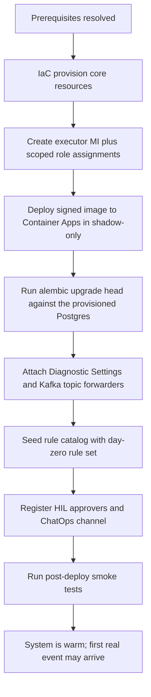

# 배포와 온보딩(Deploy and Onboard)

Azure 구독에 FDAI를 프로비저닝하고 첫 온보딩을 완료해 시스템이 관측 준비되도록 하는
방법. 이 문서는 **구체적 배포 인벤토리, 부트스트랩 순서, distribution/deployment 책임 분리**의 진실
원본입니다; 배포 라이프사이클(CI/CD, progressive delivery, 롤백, DR)은
[deployment-ko.md](deployment-ko.md)에 남습니다.

Azure 초점: 이 문서는 Azure 구독을 대상으로 함. 비-Azure 프로바이더는 TBD
([Implementation Focus](../../../.github/copilot-instructions.md#implementation-focus-must)).
모든 식별자는
[generic-scope.instructions.md](../../../.github/instructions/generic-scope.instructions.md)에
따라 합성.

> Day-zero 서비스 tier와 수량은
> [Azure Resource Inventory](#azure-resource-inventory-minimum-set)에서 결정되어 있습니다.
> Deployment owner는 배포 전에 region, quota, retention, replica 상한, production tier override를
> 확인합니다. **실행 엔진**은 `infra/`의 `terraform apply`로 결정되어 있습니다.
> 계획된 운영자 진입점은 설치형 `fdaictl` facade입니다. 이 facade는 Terraform을 source of
> truth로 유지하고 plan 및 apply 작업을 승인된 runner에 제출합니다.
> [설치형 배포 CLI](installable-deployment-cli-ko.md)와
> [배포 아티팩트](#배포-아티팩트)를 참조하세요.

## 전제조건(Prerequisites)

### 배포자 아이덴티티 (Azure)

- 대상 리소스 그룹에 대한 subscription-scoped **Owner** 또는 **Contributor + User Access
  Administrator** - executor Managed Identity와 그 범위된 롤 할당 생성에 필요.
- Executor의 **액션 화이트리스트**에 매칭되는 subscription-scoped 롤 부여 능력
  ([security-and-identity-ko.md](../architecture/security-and-identity-ko.md)).
- **TBD**: 목적별 custom 롤이 배포자 권한을 패키징할지.

### Azure 전제조건

- 아래 인벤토리의 모든 서비스 가용성이 확인된 리전.
- 확인된 쿼터 헤드룸 (Container Apps 코어, Event Hubs 처리량 단위, PostgreSQL vCore,
  Key Vault 작업).
- Diagnostic Settings 목적지 (Log Analytics workspace) - 신규 또는 기존; 소유권 TBD.
- **private networking (정책 잠금 테난트).** "Key Vault public network access 비활성"을
  강제하는 테난트(엔터프라이즈 / 관리 테난트에 흔함)는 `enable_private_networking = true`
  로 설정한다: 배포가 VNet + `privatelink.vaultcore.azure.net` 의 Key Vault private
  endpoint + 연결된 private DNS zone 를 provision 하고, Container App Environment 를 위임
  infra 서브넷에 바인드하며, vault 를 private 접근으로 잠근다. private-only vault 는
  운영자 laptop 에서 도달 불가능하므로, `terraform apply` 는 endpoint 에 VNet 시야가
  확보된 호스트 - VNet 내 CI 러너 또는 점프박스 - 에서 실행해야 합니다(executor가 거기서
  DSN 시크릿을 write). ACR / Event Hubs / Postgres private endpoint 도 동일한 제네릭
  `modules/private-endpoint` 모듈을 재사용해 테난트가 제한할 때 같은 방식으로 추가한다.

#### ops/hub 러너 (private-everything 테난트)

일부 테난트는 **모든** 데이터 서비스를 private 로 강제한다(Key Vault 와 storage 둘 다).
그래서 terraform remote-state 백엔드조차 laptop 에서 도달 불가능하다. `infra/bootstrap`
레이어가 배포를 가능케 하는 지속적 hub 를 세우며, 이는 앱 재빌드에도 살아남는다:

- 앱 RG 와 분리된 **ops 리소스 그룹 + hub VNet**(`rg-fdai-ops-<region_short>` /
  `vnet-fdai-ops-...`), 러너 서브넷과 private-endpoint 서브넷 포함;
- private 로 잠긴 **terraform remote-state storage account**, ops VNet 에 링크된
  `privatelink.blob.core.windows.net` blob private endpoint 로 프론트;
- public IP 없는 **self-hosted 배포 러너 VM**, system-assigned managed identity가 앱 RG에
  `Contributor` + `User Access Administrator`, ops RG에 `Network Contributor`, state
  account에 `Storage Blob Data Contributor`를 보유. 앱의 private endpoint에 시야가
  확보된 배포 호스트입니다.

앱 config 는 spoke VNet 을 ops hub 에 (양방향) peering 하고 private DNS zone 을
`extra_vnet_links` seam 으로 ops VNet 에 링크해, 러너가 앱 Key Vault 를 private 로 해석하게
한다. 러너가 terraform apply 주체이므로 기존 `kv_officer_self` 부여가 러너를 앱 vault 의
`Key Vault Secrets Officer` 로 만든다 - apply 중 DSN 시크릿을 write 한다. 배포는
`[self-hosted, fdai-deploy]` 러너 위에서 [`deploy-dev` 워크플로](../../../.github/workflows/deploy-dev.yml)
로 실행한다(기본 plan-only; `apply` 입력이 enforce).
Protected plan은 binary Terraform plan, bounded preflight evidence, Function source archive를
각각 별도 SHA-256 digest와 함께 저장합니다. Exact apply는 모든 artifact를 download하고
검증합니다. Development operations gateway를 선택하면 Terraform은 해당 Function resource와
dependency graph만 target으로 사용하므로 관련 없는 pending Event Hub 또는 runtime 변경은 plan에서
제외됩니다. Terraform은 `AzureWebJobsStorage`가 reader managed identity를 사용하도록 구성하며,
shared-key host storage와 Terraform source publishing은 비활성 상태로 유지합니다. Function
`site_config`는 Application Insights connection을 단독으로 관리해 duplicate app-setting drift를
방지합니다. Exact apply가 수렴하면 workflow가 보호된 source archive를 다시 검증하고 remote
build한 후 현재의 성공한 deployment record와 Function trigger를 확인합니다. 전체 런북:
[`infra/bootstrap/README.md`](../../../infra/bootstrap/README.md).

Scheduled driver는 `SCHEDULER_TICK_CRON_EXPRESSION` 및
`ANALYZER_TICK_CRON_EXPRESSION` 리포지토리 변수를 통해 Terraform이 관리합니다. 선택적
analyzer 입력에는 `ANALYZER_TARGETS_JSON`, `ANALYZER_WINDOW_SECONDS`,
`ANALYZER_BUDGET_SECONDS`를 사용합니다. 빈 cron은 해당 job을 비활성화합니다. 각 plan 전에
workflow는 remote state에 아직 없는 동일 scheduler 또는 analyzer job을 안전하게 가져옵니다.
이후 image와 configuration 변경은 같은 plan 및 apply 경로를 통해 수렴합니다.

#### 제한된 egress 환경의 인벤토리 디스커버리

강한 NSG egress 제어는 Azure 서비스 디스커버리를 비활성화하지 않고 애플리케이션 서브넷을
폐쇄 상태로 유지하는 것이 좋습니다. Preflight 중 실제 디스커버리 서브넷에서 managed
identity token 발급, DNS, ARM 관리 엔드포인트에 대한 TLS, 제한된 Azure Resource Graph
쿼리 하나, pagination, private projection 게시를 테스트합니다.

직접 ARG access가 차단되면 승인된 hub management path를 사용하는 VNet 통합 ops runner
또는 Container Apps Job에서 읽기 전용 수집기를 실행합니다. 그런 다음 검증된 Resource
Management Private Link 경로, shard된 ARM list 작업, 범위가 명시된 authoritative Azure
inventory, Activity Log 연속성, 마지막으로 서명된 declarative recovery snapshot 순서로
fallback합니다. 실패한 경로는 마지막 완전한 graph를 유지하고 stale로 표시하며 빈 graph를
게시하지 않습니다. 전체 network matrix, source 우선순위, coverage manifest, autonomy 저하
규칙은
[제한적인 NSG egress 환경의 Azure 인벤토리](../architecture/csp-neutrality-ko.md#제한적인-nsg-egress-환경의-azure-인벤토리)를
참조하세요.

#### 온보딩 자동화

러너 경로를 반복 가능하게 만드는 5개 헬퍼(전부 customer-agnostic, 파라미터화):

- [`preflight-policy-check.sh`](../../../infra/bootstrap/preflight-policy-check.sh) 는 throwaway
  KV + storage 를 프로브해 테난트가 private-everything 를 강제하는지(러너 경로 필수 여부)
  사전에 알려준다.
- [`onboard.sh`](../../../infra/bootstrap/onboard.sh) 는 create-state-account -> bootstrap
  apply -> GitHub Actions 설정 출력을 한 번에 수행(idempotent).
- [`set-gh-actions-config.sh`](../../../scripts/deployment/azure/set-gh-actions-config.sh) 는 bootstrap output 에서
  repo Variables + Secrets 를 설정(비번은 생성 후 파이프, 절대 출력 안 함).
- [`register-runner.sh`](../../../infra/bootstrap/register-runner.sh) 는 러너 토큰을 발급하고
  `run-command` 로 VNet 러너를 등록.
- [`teardown-env.sh`](../../../scripts/deployment/azure/teardown-env.sh) 는 러너 deallocate/start(비용) 와 ops hub
  + state account 를 절대 건드리지 않는 env 별 `terraform destroy` 가드를 제공.

#### 프로덕션 하드닝 knob

전부 dev posture 를 기본값으로(라이브 무변경) 하고 env 별 tfvars 로 강화한다
([`staging.tfvars.example`](../../../infra/envs/staging.tfvars.example) /
[`prod.tfvars.example`](../../../infra/envs/prod.tfvars.example) 참조):

| 관심사 | knob | prod 값 |
|--------|------|---------|
| 삭제 보호 | `enable_resource_locks`, bootstrap `enable_state_lock` | `true` |
| Key Vault | `kv_purge_protection_enabled`, `kv_soft_delete_retention_days` | `true`, `90` |
| Postgres network | `enable_private_postgres` | `true` |
| Postgres 내구성 | `postgres_backup_retention_days`, `postgres_geo_redundant_backup` | `35`, `true` |
| Postgres 가용성 | `postgres_high_availability_mode` | `ZoneRedundant` |
| HIL 전달 | `enable_chatops_hil`, `chatops_webhook_url`, `chatops_webhook_secret` | 활성화 + CI secret |
| Email 알림 | `enable_email_notifications`, `notification_email_recipients`, `email_data_location` | 활성화 + 수신자 그룹 |
| Registry | `acr_sku` | `Premium` |
| 모니터링 | `enable_monitoring`, `alert_email`, `alert_webhook_url` | on + 목적지 |
| 비용 | `monthly_budget_amount`, `budget_alert_emails`, bootstrap `runner_auto_shutdown_time` | 설정 |

`enable_private_postgres`는 PostgreSQL Flexible Server 전용 delegated subnet을 추가하고 app/ops
VNet에 private DNS zone을 연결하며 public access와 `AllowAllAzureServices` firewall rule을
비활성화합니다. 기존 public server에서 활성화하면 server가 교체될 수 있으므로 promotion 전에
plan을 review하고 backup/restore를 rehearsal하는 것이 좋습니다. `infra/production-gates.tf`의
assertion은 signed image digest, private networking, durability, alert destination, cost budget
최소값이 제공될 때까지 production plan을 차단합니다.

승인된 out-of-band ACS Email bootstrap은 첫 dev convergence plan에서
`import_existing_email_notifications=true`를 설정할 수 있습니다. Import block은
Communication Service, Email Service, Azure-managed domain, association, notification identity,
deterministic role assignment을 state로 가져옵니다. Plan을 적용한 뒤 flag를 끄는 것이 좋으며,
새 환경에서는 Terraform이 stack을 직접 생성하도록 합니다.

CI 는 자격증명 없는 가드 2개를 더한다: [`infra-lint.yml`](../../../.github/workflows/infra-lint.yml)
(모든 infra PR 에 fmt + validate + tfsec + Checkov) 와
[`infra-drift.yml`](../../../.github/workflows/infra-drift.yml) (러너에서 스케줄 `plan -detailed-exitcode`
- 빨간 run 은 라이브 infra 가 코드에서 drift 했다는 뜻). 모니터링은 활성화 시 action group +
metric alert(Postgres / Key Vault / Event Hubs / Container App) + Log Analytics 진단설정을
provision 하며, alert 는 인간 신호일 뿐 자율 액션이 아니다.

### 비-Azure 전제조건

- 카탈로그 + 포크 리포에 범위된 설치된 GitHub App 또는 서비스 커넥션을 가진 **GitOps 호스트**
  (GitHub 또는 Azure DevOps 조직).
- 사람 승인(`hil` 경로)을 위한 그룹-연결 팀이 있는 **Teams 테넌트**. Teams가 기본 A1
  primary입니다. 자세한 내용은
  [channels-and-notifications-ko.md](../interfaces/channels-and-notifications-ko.md)를 참조하세요.
- FDAI Slack 앱이 설치되고 필수 Slack userId ↔ Entra OID 매핑 저장소가 프로비저닝된
  **Slack 워크스페이스**; P1 Slack A1 채널에 필요
  ([channels-and-notifications-ko.md#7-channel-specific-notes](../interfaces/channels-and-notifications-ko.md#7-channel-specific-notes)).
- 서명 + attestation 저장을 지원하는 **컨테이너 레지스트리** (ACR 또는 외부 레지스트리).
- **OpenTelemetry backend**: Log Analytics workspace에 Application Insights를 바인딩합니다.
  포크는 telemetry provider 계약을 통해 backend를 교체할 수 있지만 Azure day-zero
  인벤토리에서는 이 선택을 열어 두지 않습니다.

## 배포 아티팩트

- `infra/`의 IaC ([project-structure-ko.md](../architecture/project-structure-ko.md) 참조)가 엔트리 포인트.
  모든 환경은 환경별 파라미터와 환경별 격리된 state로 같은 코드에서 동일하게 프로비저닝합니다.
  Terraform은 primary Event Hub 이름을 `event_bus_topics`로, stage, approval, inventory ingress
  auxiliary 이름을 `event_bus_auxiliary_topics`로 제공해 local runtime 준비가 provision된 topic만 연결합니다.
- **엔트리 명령**: `infra/`의 Terraform (HCL) 모듈에 대해 `terraform apply` - 이전 OD
  (`azd up` vs `terraform apply` vs wrapper 스크립트) 해결. 환경 값은 **깃에 커밋되지 않는**
  `*.tfvars` 파일로 공급 ([generic-scope.instructions.md](../../../.github/instructions/generic-scope.instructions.md)
  준수). [`fdaictl`](installable-deployment-cli-ko.md) wrapper와 runner는
  `request 검증 -> init -> plan -> live preflight -> exact remote apply -> post-provision 체크`를
  순서대로 실행합니다. Protected plan에 완전한 non-secret preflight profile이 없으면 Azure
  login 또는 Terraform initialization 전에 중단합니다. Live probe가 차단되면 workflow는
  중단하기 전에 sanitized check과 finding만 출력합니다. Terraform은 실행 엔진이자
  infrastructure source of truth로 유지됩니다. Bicep과 OpenTofu는
  [tech-stack-ko.md](../architecture/tech-stack-ko.md)에 따른 호환 대안으로 남습니다.
- 같은 서명 이미지가 `dev → staging → prod` 승격; 환경별 재빌드 없음
  ([deployment-ko.md](deployment-ko.md)).

## 리소스 명명 규약(Resource Naming Convention)

이 리포가 프로비저닝하는 모든 Azure 리소스는 **Microsoft Cloud Adoption Framework(CAF)**
축약 규약을 따릅니다. 이름은 결정론적이며 배포에 종속적이지 않고 grep 가능해야 합니다 -
이름 변경은 Terraform diff이지, 손편집이 아닙니다.

패턴:

```
<caf-prefix>-<workload>[-<component>][-<env>][-<region>][-<instance>]
```

- **workload**는 고정 리터럴 `fdai` (프로덕트 이름이지 고객 identifier가 아니라
  [generic-scope.instructions.md](../../../.github/instructions/generic-scope.instructions.md)
  에 따라 허용됩니다).
- **component**는 같은 리소스 종류가 두 개 이상 프로비저닝될 때만 추가 (예:
  `ca-fdai-core` vs 미래의 `ca-fdai-worker`).
- **env** (`dev`/`staging`/`prod`)와 **region** (`krc`/`weu`/`eus`) 접미사는 리소스가
  나란히 배포될 때만 추가; day-zero 배포는 접미사 없이 유지.
- **instance** (`01`, `02`, ...)는 한 env에 다중 인스턴스가 있을 때만 추가.

기본 **리소스 그룹**은 `rg-fdai` (사용자 지시로 고정). 서브스크립션 범위 배치가 필요한
리소스 종류(오늘은 없음)를 제외하면 시스템이 프로비저닝하는 모든 것은 이 RG 아래에 있음.

### Day-zero 인벤토리를 위한 CAF 접두사

| 리소스 | CAF 접두사 | 문자 규칙 | 예시 이름 |
|--------|-----------|----------|-----------|
| Resource Group | `rg-` | 1-90; 알파벳숫자 + 하이픈/언더스코어 | `rg-fdai` |
| User-assigned Managed Identity | `id-` | 3-128 | `id-fdai-executor` |
| Container Apps environment | `cae-` | 2-32; 알파벳숫자 + 하이픈 | `cae-fdai` |
| Container App (core) | `ca-` | 2-32 | `ca-fdai-core` |
| Container Apps Job (out-of-band) | `caj-` | 2-32 | `caj-fdai-oob` |
| Event Hubs namespace | `evhns-` | 6-50 | `evhns-fdai` |
| PostgreSQL Flexible Server | `psql-` | 3-63; 소문자 | `psql-fdai` |
| Key Vault | `kv-` | 3-24; 알파벳숫자 + 하이픈 | `kv-fdai` |
| **Container Registry (ACR)** | `cr` | 5-50; **알파벳숫자만, 하이픈 불가** | `crfdai` |
| Log Analytics workspace | `log-` | 4-63 | `log-fdai` |
| Azure Bot (HIL Adaptive Cards) | `bot-` | 2-64 | `bot-fdai` |
| Static Web App (read-only 콘솔) | `stapp-` | 2-40 | `stapp-fdai` |

### 길이 안전 규칙 (MUST)

- **ACR 이름은 절대 하이픈을 포함하지 않음**; 접두사 `cr`는 workload 토큰과 융합
  (`crfdai`). env/region 접미사가 붙을 때에도 하이픈을 재도입하지 말 것 - 하나의
  연속된 소문자 알파벳숫자 문자열 사용(예: `crfdaidevkrc01`).
- **Storage account**는 24자 소문자 알파벳숫자만 사용합니다. Document storage는 전역
  유일성을 위해 subscription + environment에서 파생한 안정적인 6자 hash suffix를 사용합니다.
- 합법적 이름이 env/region/instance 추가 후 문자 제한을 초과하면 문서화된 short-name
  `aip`를 `fdai` 대신 사용 - 그리고 그 리소스 종류에만. 전체 이름이 여전히 맞으면
  `aip`를 흩뿌리지 말 것.

### 이 규칙이 금지하는 것

- **무작위 접미사 없음.** Storage처럼 전역 유일 이름이 필요한 리소스의 짧은 deterministic
  hash는 허용하지만, 매 plan마다 바뀌는 random suffix는 리뷰 블로커입니다.
- **고객 이름이나 환경 값을 identifier에 굽지 말 것** - 그것들은 `*.tfvars`와 태그
  맵에 있고, 리소스 이름에는 절대 없음.
- **Python에 인라인 명명 로직 없음** - 앱은 env vars로 받은 것을 읽음; 이름은 plan
  시점의 `infra/` 에서 결정.

## 리소스 태깅 규약(Resource Tagging Convention)

명명은 리소스를 *읽기 쉽게* 만들고, 태깅은 플릿을 *질의 가능하게* 만든다. 이 repo가
프로비저닝하는 모든 리소스는 작고 기계 파싱 가능한 태그 세트를 지닌다. FDAI 소유의 모든
키는 `fdai:` 접두어로 네임스페이스되어 전체 세트가 grep 가능하고, 다른 팀 리소스가 나란히
있는 **공유 구독**에서도 FDAI가 프로비저닝한 리소스를 명확히 구분한다. 태그 맵은
Terraform(`infra/main.tf` `base_tags`)에서 결정하며, Python에서 계산하지 않는다.

### 기본 태그 세트 (모든 리소스에 적용)

| 태그 키 | 값 | 소스 | 목적 |
|---------|-----|------|------|
| `fdai:managed` | `true` | 상수 | **소유권 마커.** "FDAI가 이걸 프로비저닝함"을 나타내는 유일한 권위 있는 플래그. `az resource list --tag fdai:managed=true` 로 FDAI 소유 리소스를 정확히 열거 - blast-radius 스코핑, 정리/감사 교차검증, 비용 귀속의 기반. |
| `fdai:workload` | `fdai` | `var.workload` | 제품/워크로드 토큰; CAF 이름 토큰과 일치. |
| `fdai:env` | `day-zero` / `dev` / `staging` / `prod` | `var.env` | 환경. `day-zero` 는 미한정 배포. |
| `fdai:layer` | `control-plane` / `ops-bootstrap` | 구성별 | 아키텍처 레이어 - 앱 spoke(`infra/main.tf`) vs ops/hub bootstrap(`infra/bootstrap`). |
| `fdai:managed-by` | `terraform` | 상수 | 프로비저닝 도구. |
| `fdai:vertical` | `shared` / `resilience` / `change-safety` / `cost-governance` | `var.cost_vertical` (기본 `shared`) | 리소스 비용이 귀속되는 AIOps 버티컬. 교차 버티컬 컨트롤 플레인 인프라는 `shared` 유지; 버티컬별 리소스(예: 3개 executor MI)는 이 키를 오버라이드. |

### `fdai:managed` 가 중요한 이유

executor 는 FDAI가 소유하지 **않는** 리소스도 함께 호스팅하는 구독 안에서 실행될 수 있다.
소유권 마커가 바로 컨트롤 플레인이 그 경계를 긋게 해준다 - 어느 한 스크립트가 하드코딩하는
동작이 아니라, 이 능력들이 의존하는 질의 키다:

- **blast-radius 스코핑** - 자율 액션이 타겟 세트를 한정해야 한다는 안전 불변식은
  `fdai:managed=true` 로 표현되므로, 리메디에이션을 FDAI가 만든 리소스로 제한하고
  만들지 않은 것엔 절대 닿지 않게 함.
- **정리와 감사** - `terraform destroy` 는 이미 상태 기반으로 프로비저닝된 플릿을 제거;
  마커는 스윗이나 감사가 삭제 대상으로 고려하기 전에 리소스가 FDAI 소유인지 확인하는
  out-of-band 교차검증.
- **비용 귀속** - Cost Management 와 Resource Graph 는 `fdai:vertical` 로 지출을 그룹핑하고
  전체 FDAI 풋프린트를 `fdai:managed=true` 슬라이스로 분리 가능.

### Deployment 공급 태그(`additional_tags`)

고객 및 환경 특정 키는 `base_tags` 에 **절대** 하드코딩하지 않는다(그러면
[generic-scope](../../../.github/instructions/generic-scope.instructions.md) 위반). Deployment는
자신의 `*.tfvars` 안 `additional_tags` 맵으로 `fdai:` 네임스페이스를 유지하며 공급한다:

```hcl
additional_tags = {
  "fdai:cost-center"        = "cc-1234"
  "fdai:owner"              = "team-platform"
  "fdai:criticality"        = "high"
  "fdai:data-classification" = "internal"
}
```

`additional_tags` 는 `base_tags` 위에 병합되므로, deployment는 core를 편집하지 않고 기본값을
오버라이드(예: `fdai:vertical` 고정)할 수도 있다.

### 리소스별 오버라이드

모듈 호출은 로컬 `merge` 로 단일 키를 좁힐 수 있다 - 예: 버티컬별 executor MI 는
`merge(local.tags, { "fdai:vertical" = "resilience" })` 를 설정. 한 리소스가 한 개념에 대해
경쟁하는 두 키를 갖지 않도록 동일한 `fdai:` 네임스페이스를 사용한다. 한 리소스 종류가 두 번
이상 프로비저닝될 때(예: `core` vs `worker`)의 CAF component 토큰에는 위 명명 규약을 따라
`fdai:component` 를 예약한다.

### 규칙

- **모든 FDAI 키는 `fdai:` 네임스페이스 사용.** 맨 `env` 나 `vertical` 키는 리뷰 블로커 -
  다른 팀과 충돌하고 grep 가능성 보장을 깨뜨림.
- **`base_tags` 에 고객/비밀 값 없음** - 그것들은 리소스 이름과 똑같이 `*.tfvars` 의
  `additional_tags` 에 있음.
- **질의에 쓰이는 값은 안정적이고 소문자**(`true`, `dev`, `resilience`); Cost Management 와
  Resource Graph 는 리터럴로 그룹핑하므로 드리프트가 집계를 깨뜨림.

## Azure 리소스 인벤토리 (최소 세트)

인벤토리는 **비용 효율 우선**을 위해 의도적으로 최소화. 아래 모든 선택은 이 문서 끝의
[Cost-Efficiency Principles](#cost-efficiency-principles)가 주도. 인벤토리는 [csp-neutrality-ko.md](../architecture/csp-neutrality-ko.md)
에 정의된 네 개의 CSP-중립 계약 (이벤트버스, 런타임, 시크릿, 워크로드 아이덴티티) 에서
렌더링된것; Azure는 오늘의 각 계약의 구현. 구체적 티어 값, 정확한 이름, 리전, 앱별 replica
상한은 여전히 **deployment별** 이며 환경마다 튜닝하고 형상은 안정적으로 유지합니다.

| # | 리소스 | 티어 | 목적 | 노트 |
|---|--------|------|------|------|
| 1 | **Container Apps environment** | Consumption | 공유 서버리스 컴퓨트 호스트 | 코어 앱과 예약 작업이 하나의 environment를 공유하며 [Runtime 계약](../architecture/csp-neutrality-ko.md#2-런타임-계약--oci-이미지--knative-호환-매니페스트)을 구현합니다. |
| 2 | **Container App** (통합 코어) | 1 앱, `minReplicas: 1`, 기본 최대 3 | 하나의 모듈식 프로세스가 `event-ingest`, `trust-router`, `executor`, `audit`를 구성합니다. | 자격 증명 없는 scaler 인증을 검증할 때까지 Kafka lag 기반 scale-to-zero는 연기합니다. [Compute Shape](#compute-shape-single-modular-process)를 참조하세요. |
| 3 | **Container Apps Job** | Consumption | 스케줄 프로브와 out-of-band 변경 감지 | Azure Functions 대체; environment 공유 |
| 4 | **Event Hubs namespace** | Standard (1 TU, auto-inflate off) | Kafka-와이어 이벤트 버스 (`:9093` endpoint) | [이벤트버스 계약](../architecture/csp-neutrality-ko.md#1-이벤트버스-계약--kafka-와이어-프로토콜) 구현; DLQ는 native DLQ 리소스가 아닌 Kafka `<topic>.dlq` 규약 |
| 5 | **Event Grid inventory subscription + Diagnostic Settings** | subscription event delivery / Log Analytics | Resource write/delete를 `aw.inventory.raw`로 보내고 플랫폼 진단을 workspace로 보냄 | Event Grid는 전용 inventory UAMI로 Event Hubs에 게시하며 코어는 Kafka만 봄 |
| 6 | **PostgreSQL Flexible Server** | Dev: Burstable **B1ms**, HA 비활성, 7일 백업; prod: zone-redundant HA, 35일 geo backup | audit + KPI + 패턴 라이브러리 + **pgvector** T1 임베딩, 단일 저장 | `postgres_high_availability_mode=ZoneRedundant`가 아니면 production plan이 차단됩니다. |
| 7 | **Key Vault** | Standard | **Container Apps native secret + Key Vault reference**로 소비되는 secret backend - [시크릿 계약](../architecture/csp-neutrality-ko.md#3-시크릿-계약--환경변수--k8s-secret) 구현 | Premium (HSM) 불필요; 앱은 secret SDK 호출 안 함 |
| 8 | **User-assigned Managed Identity** | - | executor의 최소권한, 액션-화이트리스트 아이덴티티; [워크로드 아이덴티티 계약](../architecture/csp-neutrality-ko.md#4-워크로드-아이덴티티-계약--oidc-토큰) 구현 | Phase 1은 built-in 롤 구성으로 RG-스코프의 **하나의** MI (`mi-aw-executor`) 배포; Phase 3에서 도메인별 MI로 분할 - [security-and-identity-ko.md § Identity Mapping (Phased)](../architecture/security-and-identity-ko.md#identity-mapping-phased) 참조 |
| 9 | **Log Analytics workspace + Application Insights** | Pay-as-you-go, **기본 30일 보존** | traces / metrics / logs / audit-forward | `appi-*` 리소스가 workspace에 바인딩되며 보존은 배포 후 **UI에서 설정 가능** |
| 10 | **Container Registry (ACR)** | Basic (나중에 geo-replication 필요 시 Standard) | 서명된 이미지 + 빌드 attestation | digest로 고정, mutable 태그 절대 아님 |
| 11 | **Azure OpenAI / AI Foundry account** (**opt-in**, `var.enable_llm`) | Standard | T1 embedding + T2 mixed-model reasoner deployment (`resolved-models.json`의 각 capability 당 하나) | 배포자가 sub에 `Cognitive Services Contributor`를 갖고 AND 리전이 preferred family 노출할 때만 프로비저닝; 그렇지 않으면 해당 capability는 **`hil-only`**로 강등 ([dev-and-deploy-parity-ko.md § 배포자-스코프 LLM 프로비저닝](dev-and-deploy-parity-ko.md#배포자-스코프-llm-프로비저닝) 참조). `dev` 모드에서는 절대 배포 안 함 - dev-mode는 결정론적 fake 바인딩. |
| 12 | **ADLS Gen2 document account** (**opt-in**, `enable_document_ingestion`) | StorageV2 Standard ZRS, HNS | private quarantine, immutable governed version, derived envelope | Private mode에서 Shared Key와 public access 비활성화; soft delete + lifecycle; `blob`과 `dfs` private endpoint |
| 13 | **Document ingestion Container App** (**opt-in**) | Consumption, gateway + ClamAV sidecar | 인증된 bounded upload relay, safety scan, extraction, pgvector indexing, lifecycle event | Dedicated UAMI를 사용하며 external HTTPS gateway에는 executor permission이 없습니다. Durable worker는 shared `aw.pipeline.stages`의 document lifecycle record를 consume합니다. |
| 14 | **Control-loop canary Job** | Consumption, 5분마다 실행 | `aw.control.canary`에 멱등 이벤트 하나를 게시합니다. | 전용 UAMI에는 ACR pull과 Event Hubs send만 있으며, 코어는 별도 consumer 경로에서 no-op audit을 기록합니다. |
| 15 | **Development operations Function App** (**opt-in**, `enable_dev_operations_gateway`) | Flex Consumption FC1 | 로컬 개발에서 private resource로 registered read, write, execute operation을 relay합니다. | dev 및 private-networking 전용이며 전용 `/27` subnet, private AAD-only deployment 및 idempotency storage, Easy Auth, 분리된 reader/executor UAMI, 일회용 server-issued mutation plan receipt를 사용합니다. 임의 URL, ARM path, command, query surface는 제공하지 않습니다. |

추가 identity/channel/console 요소는 deployment 또는 opt-in 기능이 소유합니다:

- **App registration × 3** - 오디언스 분리
  ([user-rbac-and-identity-ko.md#41-app-registrations](../interfaces/user-rbac-and-identity-ko.md#41-app-registrations)):
  `fdai-console-spa` (SPA 사인인, PKCE), `fdai-api` (콘솔 + ChatOps 백엔드용
  Web API 오디언스), `fdai-approval-bot` (Teams SSO). 어느 것도 executor 아이덴티티
  보유 안 함. 단계별 `az` 생성:
  [../runbooks/entra-app-registration-ko.md](../../runbooks/entra-app-registration-ko.md).
  콘솔 apply 후 deploy workflow는 Terraform이 출력한 Static Web App origin을 대상
  tenant의 SPA redirect URI에 안전하게 재시도 가능한 방식으로 동기화합니다. Tenant가
  일치하지 않거나 Graph 권한이 없으면, 사인인할 수 없는 콘솔을 배포하지 않도록
  deployment를 차단합니다.
- **Entra 보안 그룹 × 5** - `aw-readers`, `aw-contributors`, `aw-approvers`, `aw-owners`,
  `aw-break-glass`. Deployment 소유이며 objectId는 config로 주입되고 시작 시 검증
  ([user-rbac-and-identity-ko.md#42-security-groups-slots](../interfaces/user-rbac-and-identity-ko.md#42-security-groups-slots)).
- **Conditional Access 정책** - `aw-approvers`/`aw-owners`에 phishing-resistant MFA,
  `aw-owners`에 compliant-device, `aw-break-glass`에 전용 하드웨어 토큰 + 사인인 알림.
  Entra ID P1에서 이용 가능
  ([user-rbac-and-identity-ko.md#43-conditional-access](../interfaces/user-rbac-and-identity-ko.md#43-conditional-access)).
- **Azure Bot (Free tier, 미프로비저닝)** - Teams Adaptive Card 채널을 선택한 downstream
  deployment가 별도로 제공합니다. Upstream Terraform은 signed webhook seam만 배포합니다.
- **서명된 HIL webhook** - production은 CI secret으로 URL과 32자 이상의 HMAC secret을
  제공합니다. Terraform은 둘 다 Key Vault에 저장하며, core는 URL과 secret을 읽고 read API에는
  callback secret만 전달합니다.
- **Topic-scoped Event Hubs role** - executor는 namespace가 아니라 현재 프로비저닝된 각 hub
  entity에 Data Owner를 받습니다. Inventory와 canary는 각자의 topic에만 send할 수 있습니다.
  Read API command identity는 proposal/HIL decision을 send하고 stage topic을 receive합니다.
  Document ingestion은 `aw.pipeline.stages`로 제한됩니다.
- **Static Web Apps (Free tier, opt-in)** - `enable_console=true`일 때 읽기 전용 콘솔을 호스팅합니다.
- **Workload identity federation** - CI/CD 단명 OIDC 토큰; 리소스 아님, 비용 없음.

### Document ingestion 배포

`enable_document_ingestion=true`는 `enable_llm=true`, resolved `t1.embedding` capability,
console API audience, Entra RBAC group id 5개, 명시적인 ingestion CORS origin과 함께 설정합니다.
Terraform은 다음 항목을 프로비저닝합니다.

- ACR pull, Key Vault DSN read, Event Hubs send, ADLS data, Azure OpenAI invoke role만 가진
  dedicated ingestion UAMI
- HNS, `documents`와 `derived` filesystem, quarantine expiry, derived-data cool tiering, soft
  delete, Shared Key 비활성화를 적용한 StorageV2 account
- `blob` 및 `dfs` private endpoint. App VNet은 endpoint zone에 link하고, ops runner는 기존
  central Blob zone의 A record로 Blob을 resolve합니다. DFS zone은 두 VNet에 link합니다.
  이 방식은 한 VNet을 같은 namespace의 중복 zone에 link하지 않습니다.
- FDAI gateway와 replica-local ClamAV sidecar가 포함된 ingestion Container App
- Traffic 전에 document metadata와 pgvector schema를 적용하는 manual migration job

`deploy-dev` workflow는 `deploy_document_ingestion` input을 제공합니다. 기본 동작은 plan이며,
apply는 ingestion migration job을 실행하고 `ingestion_gateway_fqdn`을 출력합니다. Console은
`VITE_INGESTION_API_BASE_URL=https://<fqdn>`으로 build합니다. Production gate는 private
networking과 digest-pinned FDAI 및 ClamAV image를 요구합니다.

Public Static Web App은 ADLS에 직접 접근하지 않습니다. Storage account를 private로 유지하기
위해 인증된 gateway를 통해 stream합니다. Gateway는 ADLS, Event Hubs, Azure OpenAI에 Managed
Identity를 사용하며 connection string 또는 Storage account key를 만들지 않습니다.

첫날에 **프로비저닝되지 않음** (측정된 필요가 정당화할 때 후속 phase로 연기):

- **Service Bus namespace와 Event Grid 커스텀 토픽** - 이벤트 버스는 Event Hubs의 Kafka
  endpoint ([csp-neutrality-ko.md § 이벤트버스 계약](../architecture/csp-neutrality-ko.md#1-이벤트버스-계약--kafka-와이어-프로토콜));
  inventory write/delete용 subscription-scoped Event Grid subscription은 기본 배포되지만
  별도 custom topic은 만들지 않습니다.
- 전용 vector database (PostgreSQL 내부 pgvector가 초기 스케일에서 충분).
- Front Door, Application Gateway, API Management (public inbound 엔드포인트 없음; 콘솔은
  읽기 전용 정적 호스팅).
- DR용 secondary-region 리소스 (Phase 4 - TBD;
  [Implementation Focus](../../../.github/copilot-instructions.md#implementation-focus-must) 참조).

### Compute Shape (control-loop core의 단일 모듈식 프로세스)

권위 있는 control-loop core는 하나의 Container App 안에서 서명된 이미지 하나와 Python
프로세스 하나로 배포됩니다. Opt-in read API와 document-ingestion gateway는 권한/ingress
경계 때문에 별도 Container App입니다. 코드 수준의 core 경계는 Protocol과 composition
root로 유지되며, 문서화되지 않은 localhost IPC는 없습니다.

- **Runtime**: `python -m fdai`가 Kafka consumer를 시작하고 routing, quality, risk, execution,
  audit stage를 하나의 프로세스에서 구성합니다.
- **Health**: 내부 `/live`와 `/ready` probe는 권위 있는 control loop가 조립된 후에만 열립니다.
  앱은 public ingress를 노출하지 않습니다.
- **Replica floor**: 기본값은 replica 하나입니다. 검증된 Kafka scaler 없이 0으로 설정하면 Event
  Hubs 데이터로 깨어나지 않으므로 Terraform은 scale-to-zero를 주장하지 않습니다.
- **분리 기준**: 측정된 부하 또는 권한 격리에 독립 scale unit이 필요하고 typed transport가
  준비된 경우에만 서브시스템을 별도 Container App으로 분리합니다.
- **Identity 분리**: 별도 read API에는 read UAMI와 command-transport UAMI가 연결됩니다. Event
  Hubs send/receive 권한은 read principal에 속하지 않습니다.

## 부트스트랩 순서

프로비저닝은 IaC 주도이지만 첫 라이브 이벤트까지의 **논리적 부트스트랩 순서**는 지켜야 함.
앞의 단계가 실패하면 halt하고 unwind; 배포는 깨진 앞 단계로 뒤 단계에 진행하지 않음.



- **첫 배포에서 shadow-only**: 어떤 규칙/액션도 절대 enforce 모드로 시작하지 않음. 승격은
  별개의 행위 ([rule-governance-ko.md](../rules-and-detection/rule-governance-ko.md)).
- **첫 컨트롤 루프 tick 전에 마이그레이션이 반드시 실행되어야 함**. Container App 은
  startup 시 마이그레이션을 실행하지 않음 (replica 간 일관성 유지 + race 방지).
  프로비저닝된 Postgres FQDN 에 admin DSN 으로 접속 가능한 워크스테이션 또는 CI 잡에서
  `alembic upgrade head` 를 실행. `alembic/versions/`의 모든 tracked migration은
  `downgrade()`를 정의하지만, schema/data rollback은 파괴적일 수 있으므로 backup/restore와
  migration별 downgrade를 staging에서 rehearsal한 뒤 실행합니다.
- Post-deploy smoke 테스트와 합성 카나리는
  [operating-and-verification-ko.md](../operations/operating-and-verification-ko.md)에 정의.

## Distribution 및 Deployment 책임 매트릭스

Upstream repo는 모든 것을 **customer-agnostic**으로 제공합니다. Downstream distribution은
`core/`를 편집하지 않고 dependency injection으로 capability를 제한하거나 확장할 수 있습니다.
Deployment는 source control 밖에서 environment value, identity, secret reference, promotion
state를 제공합니다.
([generic-scope.instructions.md](../../../.github/instructions/generic-scope.instructions.md)).

| 관심사 | Upstream distribution | Downstream customization | Deployment configuration |
|--------|-----------------------|--------------------------|--------------------------|
| IaC module | Parameterized module | 선택적 module overlay | environment tfvars, state, secret reference |
| Provider adapter | Protocol 및 Azure implementation | DI를 통한 선택적 replacement | endpoint 및 identity binding |
| Rule catalog | Generic seed 및 schema | 추가 rule 및 policy overlay | assignment, exemption, promotion state |
| HIL 및 RBAC | Role 및 approval contract | 선택적 channel adapter | Entra group, channel id, approver binding |
| Model | Capability registry 및 resolver | 선택적 provider adapter 또는 preference overlay | resolved endpoint, quota, region, identity |
| Runtime value | 검증된 key schema | tenant value 없음 | environment variable 및 Key Vault reference |

## 런타임 설정 매트릭스

모든 값은 런타임에 env vars 또는 Key Vault refs에서 옴. **이 리포에 커밋되는 환경 값 없음.**
아래 리스트는 배포가 기대하는 **키의 스키마** ; 완전한 확장 카탈로그와 기본값은 인벤토리 PR에서
작성됨.

| 키 | 소스 | 소유자 | 노트 |
|----|------|--------|------|
| `AZURE_TENANT_ID` | env | deployment | 비-시크릿 |
| `AZURE_SUBSCRIPTION_ID` | env | deployment | 비-시크릿 |
| `AZURE_RESOURCE_GROUP` | env | deployment | 대상 리소스 그룹 |
| `KAFKA_BOOTSTRAP_SERVERS` | env | deployment | Event Hubs Kafka endpoint (`<ns>.servicebus.windows.net:9093`); [이벤트버스 계약](../architecture/csp-neutrality-ko.md#1-이벤트버스-계약--kafka-와이어-프로토콜) 구현 |
| `KAFKA_SECURITY_PROTOCOL` | env | deployment | Azure 에서 `SASL_SSL`; 다른 곳에서는 프로바이더별 값 |
| `KAFKA_SASL_MECHANISM` | env | deployment | Azure 에서 `OAUTHBEARER` |
| `FDAI_STATE_STORE_DSN` | KV ref | upstream | audit + KPI 용 Postgres 연결 URI. `infra/main.tf` 의 `azurerm_key_vault_secret.state_store_dsn` 이 `module.state_store.application_dsn` 으로부터 배선하고, Container App 은 `secret{}` + `env{}` 로 노출 ([project-structure-ko.md](../architecture/project-structure-ko.md) 의 `infra/modules/compute/container-apps/` 참조). Local/dev는 없을 때 in-memory를 사용할 수 있지만 `RUNTIME_ENV=staging|prod`는 시작을 차단합니다. |
| `FDAI_OPERATOR_MEMORY_DSN` | KV ref | upstream | HIL 승인 operator memory 용 Postgres DSN. day-zero 는 `FDAI_STATE_STORE_DSN` 과 동일 소스 (단일 Flexible Server); deployment는 core를 건드리지 않고 나중에 분리할 수 있습니다. |
| `FDAI_T1_PATTERN_LIBRARY_DSN` | KV ref | upstream | pgvector 기반 T1 패턴 라이브러리 용 Postgres DSN. day-zero 동일 소스, 동일 배선. |
| `FDAI_INVENTORY_DSN` | KV ref | upstream | Scheduled inventory collector가 immutable candidate를 stage하고 active graph를 atomic promotion하는 데만 사용하는 PostgreSQL DSN. |
| `FDAI_INVENTORY_SCOPES` / `FDAI_INVENTORY_RESOURCE_TYPES` | env | deployment | 쉼표로 구분한 subscription scope와 선택적 CSP-중립 resource-type subset. 빈 scope는 시작을 차단합니다. |
| `FDAI_INVENTORY_SOURCES` | env | upstream | Ordered fallback list. 기본값은 `arg,arm`입니다. `declarative`는 fixture path와 SHA-256이 모두 있을 때만 허용합니다. |
| `FDAI_INVENTORY_MANAGEMENT_ENDPOINT` / `FDAI_INVENTORY_MANAGEMENT_AUDIENCE` | env | deployment | 검증된 HTTPS ARM root 및 OIDC audience pair. 승인된 sovereign-cloud 또는 검증된 Resource Management Private Link 경로에서는 둘 다 override합니다. |
| `FDAI_INVENTORY_FRESHNESS_SECONDS` | env | upstream | Active snapshot이 stale 상태가 되고 graph 기반 autonomy를 사람 검토로 낮추기 전의 최대 age입니다. 기본값은 `86400`입니다. |
| `FDAI_ANALYZER_TARGETS` / `FDAI_ANALYZER_WINDOW_SECONDS` / `FDAI_ANALYZER_BUDGET_SECONDS` | env | deployment / upstream | 선택적 analyzer target 및 bound. target이 비어 있으면 analyzer Job이 `FDAI_INVENTORY_DSN`을 통해 active inventory에서 지원 resource kind를 탐색합니다. |
| `KAFKA_TOPIC_EVENTS` | env | deployment | 주 이벤트 ingest 토픽 |
| `KAFKA_TOPIC_DLQ_SUFFIX` | env | deployment | dead-letter suffix (기본 `.dlq`) |
| `LLM_MODE` | env | deployment | 명시적 test/mock용 `local-fake` 또는 authoritative profile용 `azure`. Environment는 binding을 선택하지 않습니다. [dev-and-deploy-parity-ko.md § Parity 컨트랙트](dev-and-deploy-parity-ko.md#parity-컨트랙트-must) 참조. |
| `LLM_RESOLVED_MODELS_PATH` | KV ref | deployment | `LLM_MODE=azure` 시 필수; 부트스트랩 resolver가 쓴 `resolved-models.json`을 가리킴 |
| `RULE_CATALOG_REF` | env | deployment | 카탈로그 스냅샷 git ref |
| `AUTONOMY_MODE_DEFAULT` | env | deployment | **반드시** `shadow` 기본값 |
| `FDAI_LOG_LEVEL` | env | upstream | 코어 앱의 Python 로거 레벨 (`DEBUG` / `INFO` / `WARNING` / `ERROR`). 기본 `INFO`. |
| `FDAI_READ_API_LOCAL_AZURE_CLI` | env | local-only | Fixed role ceiling을 사용하는 명시적 CLI-principal debug 대안입니다. `VITE_LOCAL_AZURE_CLI_AUTH=1`과 함께 사용합니다. |
| `FDAI_READ_API_DEV_MODE` | env | test-only | Automated read API test용 authentication bypass입니다. VS Code full-stack profile은 설정하지 않습니다. |
| `FDAI_READ_API_LOCAL_ENTRA` | env | local-only | Canonical interactive profile입니다. Browser Entra JWT와 App Role은 deployment와 같으며 server Azure CLI session은 Azure adapter로 제한됩니다. |
| `FDAI_START_PANTHEON` | env | upstream / local | 15-agent runtime의 disable-only control입니다. 미설정은 활성 상태이며 `0`, `false`, `no`, `off`만 비활성화합니다. Event Hubs variable은 transport를 선택하며 Pantheon을 활성화하지 않습니다. |
| `FDAI_LOCAL_SCENARIO_REPLAY` | env | test-only | Automated test와 명시적 mock application용 generated scenario replay입니다. Interactive local startup은 이를 거부합니다. |
| `FDAI_LOCAL_AZURE_DISCOVERY` | env | local-only | Azure discovery는 필수입니다. 미설정 또는 `1`은 read-only `AzureCliInventory`를 사용하고 `0`은 거부하며 synthetic graph를 선택하지 않습니다. |
| `FDAI_LOCAL_AZURE_SUBSCRIPTION_ID` | env | dev-only | 모든 로컬 `az group/resource list` 호출에 전달하는 선택적 subscription입니다. 미설정 시 선택한 Azure CLI profile의 active subscription을 사용합니다. 채워진 값을 commit하지 않습니다. |
| `FDAI_LOCAL_AZURE_CONFIG_DIR` | env | dev-only | 선택적 격리 Azure CLI profile입니다. 미설정 시 adapter가 상속된 `AZURE_CONFIG_DIR`를 제거하고 기본 profile을 사용합니다. |
| `FDAI_POLICIES_ROOT` | env | deployment | T0 와 verifier 가 소비하는 OPA / Rego 번들 루트의 절대 경로. 미설정 시 in-repo `policies/` 를 기본값. |
| `FDAI_MI_CLIENT_ID` | env | upstream | 현재 process의 user-assigned MI client id. Core에는 executor id를 주입하고 inventory job에는 별도 read-only discovery id를 주입합니다. |
| `FDAI_EMAIL_ENDPOINT` / `FDAI_EMAIL_SENDER_ADDRESS` / `FDAI_EMAIL_RECIPIENT_ADDRESSES_JSON` / `FDAI_NOTIFICATION_MI_CLIENT_ID` | env | upstream / deployment | ACS Email A2/A4 채널을 활성화합니다. Terraform이 endpoint와 Azure-managed sender를 파생하고 전용 notification MI를 연결한 뒤 client id를 주입합니다. Deployment configuration은 `NOTIFICATION_EMAIL_RECIPIENTS_JSON`으로 수신자를 공급하며 앱에는 access key나 connection string이 들어가지 않습니다. 부분 설정은 startup을 차단합니다. |
| `FDAI_MEASUREMENT_MODE` | env | upstream | `shadow` (기본) 또는 `enforce` - `infra/modules/measurement-runners/` 의 Container Apps Jobs 러너를 지배. |
| `FDAI_DIRECT_API_FAKE` | env | test-only | Automated test에서 executor direct-API 경로를 in-memory fake로 바꿉니다. Interactive local startup은 executor를 연결하지 않습니다. |
| `FDAI_TOOL_CALL_FAKE` | env | test-only | Automated test에서 executor tool-call 경로를 `RecordingToolExecutor`로 바꿉니다. Interactive local startup은 executor를 연결하지 않습니다. |
| `FDAI_WORKFLOW_SHADOW` | env | upstream | `1`이면 event-triggered catalog Workflow를 non-mutating shadow mode로 활성화합니다. Azure core app은 기본 설정입니다. |
| `FDAI_WORKFLOW_ENFORCE_ALLOWLIST` | env | deployment / local | Owner가 `mode=enforce`로 시작할 수 있는 Workflow 이름의 comma-separated 목록입니다. Event Hubs command transport가 필요하며 action step은 일반 promotion/risk/HIL/executor 경로로 재진입합니다. |
| `KAFKA_TOPIC_EVENTS` / `FDAI_STAGE_TOPIC` | env | upstream / local | Deployed runtime과 Azure-backed interactive transport가 공유하는 event 및 stage topic입니다. Kafka bootstrap과 event topic이 모두 없으면 interactive local은 `aw.events`와 bounded local EventBus/SSE adapter를 사용합니다. |
| `FDAI_IRP_ENABLED` / `FDAI_IRP_BUDGET_SECONDS` | env | upstream | alert-shaped event를 budgeted investigation -> typed proposal 경로로 처리합니다. proposal은 표준 risk/HIL/executor loop에 재진입합니다. |
| `FDAI_CHAOS_CONTEXT_JSON` / `FDAI_CHAOS_ENFORCE` | env | deployment | promoted chaos injector runtime context. 명시 flag가 `1`이고 scenario가 promoted 상태이며 injector와 probe가 모두 등록된 경우에만 enforce를 허용합니다. |
| `FDAI_JIRA_BASE_URL` / `FDAI_JIRA_ACCOUNT_EMAIL` / `FDAI_JIRA_API_TOKEN_SECRET` / `FDAI_JIRA_TOOL_MAP_JSON` | env + KV ref | deployment | Production `JiraToolExecutor`를 설정합니다. `TOOL_MAP_JSON`은 `tool.open-incident-ticket`을 Jira project key에 매핑합니다. Token 값은 KV-backed `FDAI_SECRET_<API_TOKEN_SECRET>`에서 resolve하며 mapping에 token을 넣지 않습니다. Durable Jira ledger와 distributed resource lock을 위해 `FDAI_STATE_STORE_DSN`이 필요합니다. |
| `FDAI_JIRA_ENFORCE` | env | deployment | unset/`0` 기본값은 Jira를 shadow-only로 유지합니다. `1`은 ActionType promotion gate와 risk/HIL decision도 enforce를 허용한 경우에만 enforce request를 허용합니다. Shadow receipt는 실제 incident ticket으로 link되지 않습니다. |
| `FDAI_PROFILE_ID` | env | deployment | `rule-catalog/profiles/` 에서 한 프로파일을 선택 ([rule-catalog-profiles-ko.md](../rules-and-detection/rule-catalog-profiles-ko.md) 참조). **2026-07 기준 composition-root 배선 대기.** |
| `FDAI_NARRATOR_PROVIDER` / `FDAI_NARRATOR_BASE_URL` / `FDAI_NARRATOR_MODEL` / `FDAI_NARRATOR_API_VERSION` / `FDAI_NARRATOR_API_KEY` | env + KV ref | deployment | Operator-console narrator translator 설정 ([operator-console-ko.md](../interfaces/operator-console-ko.md) 참조); `API_KEY` 는 반드시 KV 경유. 빈 provider = 결정론적 폴백. |
| `FDAI_CHATOPS_APPROVE_CALLBACK_URL` / `FDAI_CHATOPS_REJECT_CALLBACK_URL` / `FDAI_CHATOPS_WEBHOOK_SECRET` / `FDAI_CHATOPS_TIMEOUT_SECONDS` | env + KV ref | deployment | Chatops HIL 콜백 엔드포인트와 공유 webhook secret입니다. Secret 은 반드시 KV를 경유합니다. Secret 을 설정하면 production callback route 와 durable Postgres decision registry 가 활성화됩니다. |
| `FDAI_KAFKA_BOOTSTRAP_SERVERS` / `FDAI_HIL_DECISION_TOPIC` | env | deployment / upstream | Read API 가 durable HIL decision receipt 를 publish 하는 Event Hubs Kafka endpoint 입니다. Topic 기본값은 `aw.hil.decisions`이며 core 가 같은 topic 을 소비하고 resume/execution 을 소유합니다. |
| `FDAI_GITOPS_API_BASE` / `FDAI_GITOPS_DEFAULT_BRANCH` / `FDAI_GITOPS_BRANCH_PREFIX` / `FDAI_GITOPS_TIMEOUT_SECONDS` | env | deployment | `gitops-pr` 어댑터 target repo 설정 (GitHub App / Azure DevOps). 인증 secret 은 플랫폼 App installation 을 통해 흐르고 env var 아님. |
| `FDAI_GITOPS_TOKEN` / `FDAI_GITOPS_OWNER` / `FDAI_GITOPS_REPO` / `FDAI_GITHUB_WORKFLOW_TOOLS_ENFORCE` | KV ref + env | deployment | fix/release/security/incident/IRP artifact용 GitHub change feed 및 workflow tool binding. enforce flag는 ActionType promotion 및 risk/HIL gate를 우회하지 않습니다. |
| `FDAI_RBAC_READERS_GROUP_ID` / `FDAI_RBAC_CONTRIBUTORS_GROUP_ID` / `FDAI_RBAC_APPROVERS_GROUP_ID` / `FDAI_RBAC_OWNERS_GROUP_ID` / `FDAI_RBAC_BREAK_GLASS_GROUP_ID` | env | deployment | 5개 human role 의 Entra ID group object id ([user-rbac-and-identity-ko.md](../interfaces/user-rbac-and-identity-ko.md) 참조). 미설정 group = role 미할당. |
| `FDAI_STEWARDSHIP_REQUIRE_BINDINGS` | env | deployment | 모든 deployed environment에서 `1`로 설정하여 placeholder maintainer/steward id가 startup을 차단하게 합니다. 이 readiness gate는 fork 여부와 독립적입니다. |
| `FDAI_ENTRA_TENANT_ID` / `FDAI_API_AUDIENCE` | env | deployment | 프로덕션 read-API Entra JWT verifier (`EntraJwtVerifier`) 필수: deployment tenant id와 `fdai-api` App ID URI (`api://<fdai-api-guid>`). [user-rbac-and-identity-ko.md#102-api-토큰-검증](../interfaces/user-rbac-and-identity-ko.md#102-api-토큰-검증) 참조. |
| `FDAI_ENTRA_ISSUER` / `FDAI_ENTRA_JWKS_URI` | env | deployment | 선택 verifier 오버라이드; 기본값은 tenant 의 v2 발급자 + 공개 키 셋. v1-토큰 앱은 `ISSUER` 를 `https://sts.windows.net/<tenant>/` 로; `JWKS_URI` 는 소버린 / 에어갭 클라우드에서만 오버라이드. |
| `FDAI_EXECUTOR_PRINCIPAL_ID` / `FDAI_EXECUTOR_EVENT_ROLE_DEFINITION_ID` / `FDAI_EXECUTOR_SECRET_ROLE_DEFINITION_ID` | env | upstream | read API onboarding probe 입력. ARG를 사용해 provisioned resource set 및 executor Event Hubs / Key Vault 역할을 검증합니다. |
| `FDAI_DR_DRILL_SOURCE_SERVER_ARM_ID` / `FDAI_DR_DRILL_TARGET_LOCATION` / `FDAI_DR_DRILL_TARGET_RG_PREFIX` / `FDAI_DR_DRILL_TARGET_SERVER_PREFIX` / `FDAI_DR_DRILL_PITR_OFFSET_MINUTES` / `FDAI_DR_DRILL_DRY_RUN` | env | deployment | DB-DR drill job 설정 ([../runbooks/db-dr-drill-ko.md](../../runbooks/db-dr-drill-ko.md) 참조); `DRY_RUN=true` upstream 기본으로 job 이 idempotent 유지. |
| `FDAI_SECRET_KAFKA_TOKEN` / 기타 `FDAI_SECRET_*` | KV ref | deployment | 전용 env var 이름이 아직 없는 어댑터가 소비하는 secret 을 위한 generic escape hatch; 모든 `FDAI_SECRET_*` 값은 반드시 KV 경유. |

모든 키에 적용되는 규칙:

Onboarding 콘솔은 모든 Azure probe 입력이 있을 때만 `probe_mode=configured`를 보고합니다.
입력이 없을 때 `probe_mode=not-configured`는 표시된 gap이 로그인한 tenant의 관찰 결과가
아니라 필요한 baseline임을 의미합니다.

- 시작 시 누락/파싱 불가 config에 대해 **fail fast**
  ([coding-conventions.instructions.md](../../../.github/instructions/coding-conventions.instructions.md)).
- 시크릿은 Key Vault refs로, 절대 plain env가 아님; plain env의 시크릿은 CI secret-scan 게이트
  실패.
- 환경별 값이 다름; 같은 이미지가 주입된 환경에서 값을 읽음.

## 이벤트 소스 구독

세 초기 버티컬이 관측할 것이 있도록 부트스트랩에서 배선되는 신호. 구체적 이벤트 타입,
구독 필터, 속도 상한은 **TBD** ; 배선 형상은 안정적.

| 버티컬 | Azure 신호 후보 | 딜리버리 |
|--------|----------------|---------|
| Change | Activity Log (resource-write / delete), Change Analysis, Resource Health | Canonical Event Hubs Kafka ingress로 push하며 Huginn이 실시간 discovery 정규화를 소유하고 Inventory sync job이 전체 graph를 reconcile합니다. |
| DR / Chaos | Resource Health, backup vault 이벤트, PostgreSQL / SQL replication-lag 메트릭, restore-rehearsal 결과 | Diagnostic Settings + 스케줄 Container Apps Job 프로브 → Kafka 토픽 (`aw.dr.events`) |
| FinOps | 비용 이상 알림, 예산 알림, Advisor 비용 권고 | Cost Management pull → Kafka 토픽 (`aw.finops.events`); 이상 알림은 같은 Diagnostic-Settings 경로로 fan in |

모든 이벤트는 ingress에서 **idempotency 키가 스탬프** 되어 리플레이는 no-op; DLQ는 도달 가능
해야 하며 어디에서든 enforce가 활성화되기 전에
[alert routing](../operations/operating-and-verification-ko.md#alert-routing)이 커버해야 함.

Azure forwarding mechanism은 shared secret이 없는 경계를 유지하는 것이 좋습니다. Diagnostic
Settings export를 위해 Event Hubs local authentication만 다시 활성화하지 않습니다. 선택한 Azure
signal source가 managed identity로 publish할 수 없다면 승인된 push transport가 준비될 때까지 bounded
Activity Log recovery reader를 사용합니다. 6시간 Inventory sync job은 모든 배포에서 completeness
backstop으로 계속 필요합니다.

## 프로비저닝 후 검증

프로비저닝 후 검증(adapter 도달성, canary 왕복, shadow 정확성)은
[operating-and-verification-ko.md](../operations/operating-and-verification-ko.md#post-deploy-smoke-tests)
에 정의. 실패한 검증은 승격을 중단하고 트래픽 롤백
([deployment-ko.md#release-and-rollback](deployment-ko.md#release-and-rollback)).

## 비용 효율 원칙

모든 프로비저닝 선택은 이 원칙을 존중; 위반 리소스는 배포 PR에 명시적 정당화 필요. 이 원칙에서
나오는 **예시 월간 비용 envelope**은 [cost-model-ko.md](../interfaces/cost-model-ko.md)에 있음.

1. **이벤트 기반 우선** - 예약 Container Apps Job은 실행 사이에 scale-to-zero됩니다. 코어는
  자격 증명 없는 Event Hubs Kafka-lag scaler가 검증되지 않았으므로 현재 replica 하나를
  유지합니다. 이 floor를 바꾸려면 측정되고 검증된 scaler가 필요합니다.
2. **하루 첫날 한 리전, 한 존, non-HA** - 멀티 존과 멀티 리전은 Phase 4 (TBD). 초기 배포는
   단일 지리적 footprint.
3. **관리 서비스 축소** - PostgreSQL 내부 pgvector가 vector store; App Insights가 공유 Log
   Analytics workspace에 바인딩; 별도 vector DB 또는 APM 리소스 프로비저닝 없음.
4. **기본으로 Basic / Standard 티어** - Premium 티어는 명시된 측정 필요. HA 변형, geo-
   replication, private-endpoint premium 기능은 연기.
5. **사용 사례를 커버하는 곳에서 Free 티어** - Static Web Apps (콘솔), Azure Bot (HIL
   Adaptive Cards), workload identity federation (CI/CD) 모두 Free 티어.
6. **단일 모듈식 프로세스** - 하나의 Container App이 코어 composition을 실행합니다.
  ([Compute Shape](#compute-shape-single-modular-process)). SRP는 코드 수준에서 적용되며, 이후
  프로세스 분리에는 typed transport와 측정된 근거가 필요합니다.
7. **모델 예산 상한** - T2 추론은 이벤트의 ~5-10%에 도달하도록 설계; token/spend 예산은 강제
   되고 overflow는 uncapped inference가 아니라 HIL로 강등.
8. **카탈로그는 git-hosted, 서비스가 아님** - rule 카탈로그는 관리 저장소가 아니라 git 저장소에
   있으므로 카탈로그 저장에 추가 Azure 리소스 불필요.
9. **Public inbound 엔드포인트 없음** - 첫날에 Application Gateway / Front Door / API
   Management 없음; ingress는 이벤트 버스, egress는 allow-list.
10. **연기된 DR 리소스** - secondary-region 리소스는 초기에 **프로비저닝되지 않음** ;
    컨트롤 플레인 DR은 IaC + state 백업을 통해 계획됨
    ([deployment-ko.md](deployment-ko.md#control-plane-disaster-recovery)).

## Open Decisions

- [x] 배포 interface - **해결: Terraform은 실행 엔진이고 계획된 운영자 interface는
  `fdaictl`**. 설치형 CLI는 읽기 전용 preflight를 실행하고 Terraform을 대체하지
  않으면서 exact-plan 작업을 승인된 runner에 제출합니다.
  [설치형 배포 CLI](installable-deployment-cli-ko.md)를 참조하세요.
- [ ] 최소 세트 내 구체적 티어 값(PostgreSQL 저장소 크기, Log Analytics daily cap, ACR
      retention 윈도우, Event Hubs 처리량-단위 상한).
- [ ] 리전 선택과 single-zone 배포 자세(멀티 존은 Phase 4로 연기).
- [ ] 배포자 아이덴티티를 위한 커스텀 Azure 롤 패키징.
- [ ] Log Analytics daily-cap과 쿼리 비용 예산 (보존 기본 30일은 **콘솔 UI에서 설정 가능**;
      알림 임계값 TBD).
- [ ] Kafka 토픽 명명 + Diagnostic-Settings forwarding 필터, 도메인별 fan-in 형상.
- [x] Production networking baseline - **해결: VNet-integrated Container Apps, private Key
  Vault, delegated-subnet private PostgreSQL**. Development는 public PostgreSQL path를
  유지할 수 있으며 ACR/Event Hubs private endpoint는 tenant policy에 따라 추가합니다.
- [ ] 완전한 런타임 config 키 리스트 (값 매트릭스 확장).
- [ ] 첫날 시드 규칙 세트(어떤 소스, 어떤 규칙 id) - Phase 1과 교차 링크.
- [ ] 단일 프로세스 -> 별도 Container App **분리 트리거**: 서브시스템에 자체 scale unit,
  typed transport, 권한 경계가 필요함을 나타내는 메트릭.
