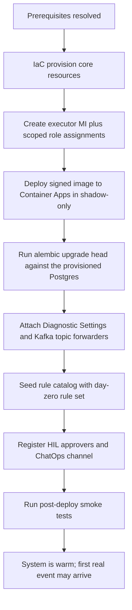

# 배포와 온보딩(Deploy and Onboard)

Azure 구독에 FDAI를 프로비저닝하고 첫 온보딩을 완료해 시스템이 관측 준비되도록 하는
방법. 이 문서는 **구체적 배포 인벤토리, 부트스트랩 순서, distribution/deployment 책임 분리**의 진실
원본입니다; 배포 라이프사이클(CI/CD, progressive delivery, 롤백, DR)은
[deployment-ko.md](deployment-ko.md)에 남습니다.

Azure 초점: 이 문서는 Azure 구독을 대상으로 함. 비-Azure 프로바이더는 TBD
([Implementation Focus](../../../.github/copilot-instructions.md#implementation-focus-must)).
모든 식별자는
[generic-scope.instructions.md](../../../.github/instructions/generic-scope.instructions.md)에
따라 합성.

> Day-zero 서비스 tier와 수량은
> [Azure Resource Inventory](#azure-resource-inventory-minimum-set)에서 결정되어 있습니다.
> Deployment owner는 배포 전에 region, quota, retention, replica 상한, production tier override를
> 확인합니다. **실행 엔진**은 `infra/`의 `terraform apply`로 결정되어 있습니다.
> 계획된 운영자 진입점은 설치형 `fdaictl` facade입니다. 이 facade는 Terraform을 source of
> truth로 유지하고 plan 및 apply 작업을 승인된 runner에 제출합니다.
> [설치형 배포 CLI](installable-deployment-cli-ko.md)와
> [배포 아티팩트](#배포-아티팩트)를 참조하세요.

## 전제조건(Prerequisites)

### 배포자 아이덴티티 (Azure)

- 대상 리소스 그룹에 대한 subscription-scoped **Owner** 또는 **Contributor + User Access
  Administrator** - executor Managed Identity와 그 범위된 롤 할당 생성에 필요.
- Executor의 **액션 화이트리스트**에 매칭되는 subscription-scoped 롤 부여 능력
  ([security-and-identity-ko.md](../architecture/security-and-identity-ko.md)).
- **TBD**: 목적별 custom 롤이 배포자 권한을 패키징할지.

### Azure 전제조건

- 아래 인벤토리의 모든 서비스 가용성이 확인된 리전.
- 확인된 쿼터 헤드룸 (Container Apps 코어, Event Hubs 처리량 단위, PostgreSQL vCore,
  Key Vault 작업).
- Diagnostic Settings 목적지 (Log Analytics workspace) - 신규 또는 기존; 소유권 TBD.
- **private networking (정책 잠금 테난트).** Private data service를 강제하는 테난트는
  `enable_private_networking = true`로 설정합니다. 배포는 Key Vault, 두 Event Hubs namespace
  shard 및 public-mode PostgreSQL에 VNet, private endpoint, linked private DNS를 provision합니다.
  Event Hubs public access는 비활성화됩니다. Public-mode PostgreSQL endpoint는 additive이므로 기존
  server를 유지하며, `enable_private_postgres = true`는 별도 delegated-subnet mode로 남습니다.
  배포는 Container App Environment도 위임 infra subnet에 bind하고 vault를 private access로
  잠급니다. Private-only vault는
  운영자 laptop 에서 도달 불가능하므로, `terraform apply` 는 endpoint 에 VNet 시야가
  확보된 호스트 - VNet 내 CI 러너 또는 점프박스 - 에서 실행해야 합니다(executor가 거기서
  DSN 시크릿을 write). `acr_sku = "Premium"`이면 ACR도 같은 방식으로 잠깁니다. Registry는 public
  network access를 잃고 `privatelink.azurecr.io` endpoint를 받으며, zone group이 login-server와
  data-endpoint record를 등록합니다. Private link는 Premium 전용이므로 Basic 또는 Standard
  registry는 의도적으로 public으로 남습니다. Private 경로 없이 닫으면 모든 image pull이
  깨지기 때문입니다. Prod는 이미 Premium을 요구합니다.

#### Terraform이 만들지 않는 것

아래 인벤토리는 Terraform이 소유하지만, 첫 apply 전에 반드시 존재해야 하는 입력이 넷 있습니다.
하나라도 없으면 plan 시점이 아니라 실행 도중에 실패합니다.

- **Deployer 신원과 role assignment 권한.** Executor identity와 scoped role을 만들려면 User Access
  Administrator가 필요합니다. Contributor만 있으면 plan은 통과하고 apply에서 실패합니다.
- **Terraform state storage account.** `infra/bootstrap/create-state-account.sh`가 `az`로
  만듭니다. Private + key-disabled 계정은 운영자 워크스테이션에서 Terraform의 data-plane readiness
  poll을 끝낼 수 없기 때문입니다. Terraform은 data source로 읽기만 합니다.
- **Bootstrap 계층이 runner VM을 만들 때의 app resource group.** 그 계층은 runner의 Contributor
  grant 범위를 정하려고 이 group을 data source로 읽는데, 정작 group을 만드는 것은 app 계층입니다.
  빈 구독에서는 빈 group을 먼저 만들거나, `create_runner_vm = false`로 bootstrap을 한 번 apply한
  뒤 app 계층을 돌리고 runner를 켜서 다시 apply합니다.
- **Runner용 SSH public key**, 그리고 위에 적은 쿼터 헤드룸과 Log Analytics 목적지.

Azure Policy가 인벤토리 일부를 거부하는 테난트는 plan이 수렴하기 전에 예외 또는 대응하는
capability-mode 토글이 필요합니다
([deployment-preflight-ko.md](deployment-preflight-ko.md)).

#### ops/hub 러너 (private-everything 테난트)

일부 테난트는 **모든** 데이터 서비스를 private 로 강제한다(Key Vault 와 storage 둘 다).
그래서 terraform remote-state 백엔드조차 laptop 에서 도달 불가능하다. `infra/bootstrap`
레이어가 배포를 가능케 하는 지속적 hub 를 세우며, 이는 앱 재빌드에도 살아남는다:

Ops 계층은 기본적으로 outbound 경로 하나, static public IP를 가진 NAT gateway를 만듭니다.
GitHub에 등록된 runner가 GitHub, management plane, identity plane에 도달해야 하기 때문입니다.
폐쇄망은 `enable_public_egress = false`로 설정합니다. Public 주소를 만들지 않고, 호스트는 등록된
runner가 아니라 점프박스가 되며, 테난트가 자체 승인 경로를 공급합니다.

- 앱 RG 와 분리된 **ops 리소스 그룹 + hub VNet**(`rg-fdai-ops-<region_short>` /
  `vnet-fdai-ops-...`), 러너 서브넷과 private-endpoint 서브넷 포함;
- private 로 잠긴 **terraform remote-state storage account**, ops VNet 에 링크된
  `privatelink.blob.core.windows.net` blob private endpoint 로 프론트;
- public IP 없는 **self-hosted 배포 러너 VM**, system-assigned managed identity가 앱 RG에
  `Contributor` + `User Access Administrator`, ops RG에 `Network Contributor`, state
  account에 `Storage Blob Data Contributor`, subscription scope에는 realtime inventory
  system topic과 subscription 관리용 `EventGrid Contributor`만 보유합니다. 각 workflow run은 managed
  identity login 전에 Azure CLI account cache를 지운 뒤 storage, plan, apply 전에 repository에
  설정된 exact subscription과 tenant를 증명하며 앱 private endpoint에 시야를 확보합니다.
Checkout 전 runner는 legacy generated `infra/None` cache path만 제거해 root-owned action
residue가 exact-commit clean을 막지 않게 합니다. 해당 step은 Azure CLI config를
`RUNNER_TEMP` 아래에 만들고 subsequent step용 `GITHUB_ENV`로 export합니다.
앱 config 는 spoke VNet 을 ops hub 에 (양방향) peering 하고 private DNS zone 을
`extra_vnet_links` seam 으로 ops VNet 에 링크해, 러너가 앱 Key Vault 를 private 로 해석하게
한다. 러너가 terraform apply 주체이므로 기존 `kv_officer_self` 부여가 러너를 앱 vault 의
`Key Vault Secrets Officer` 로 만든다 - apply 중 DSN 시크릿을 write 한다. 배포는
`[self-hosted, fdai-deploy]` 러너 위에서 [`deploy-dev` 워크플로](../../../.github/workflows/deploy-dev.yml)
로 실행한다(기본 plan-only; `apply` 입력이 enforce).
Repository workflow는 review된 remote action만 허용하고 exact Node 24-compatible release ref로
pin하며 container supply-chain action은 immutable commit SHA를 사용합니다. CI contract는 unknown
action과 mismatched ref를 차단합니다. Terraform fixture test는 선언된 `>= 1.9` floor에서 허용되는
syntax만 사용합니다. Exact CI version이 parsing과 plan assertion을 검증합니다. Upgrade는 action runtime metadata를 검증하고 runner는 version 2.327.1 이상을 유지합니다. Private networking이 enabled이면 PostgreSQL public access와 broad Azure-services firewall을
비활성화합니다. Dev는 approved private endpoint를 사용하고 production은 delegated-subnet mode를
계속 선택할 수 있습니다.
Protected request는 `commit_sha`를 명시적으로 checkout하고 `git rev-parse HEAD`와 비교합니다.
따라서 dispatch와 execution 사이에 release commit이 `main`을 이동해도 plan 또는 apply code가
바뀌지 않습니다.
배포 job은 `infra/`에서 실행되므로, repository root script를 호출하는 step은 `../scripts/`로
접근하거나 working directory를 override합니다. 맨 `scripts/...` 경로는 `infra/` 아래로 해석되어
Terraform이 검사할 결과를 만들기도 전에 runner에서 127로 종료됩니다.
Protected plan은 binary Terraform plan, bounded preflight evidence, Function source archive를
각각 별도 SHA-256 digest와 함께 저장합니다. Exact apply는 모든 artifact를 download하고
검증합니다. 새 plan 저장 전 runner는 24시간이 지난 allowlisted plan, metadata, source,
preflight, claim, receipt blob만 선택합니다. 1001개 미만을 scan하고 worker 8개로 최대 1000개를
삭제하며 selection이 incomplete이거나 delete가 하나라도 실패하면 plan을 중지합니다.
Development operations gateway를 선택하면 Terraform은 해당 Function, core, Operator API,
ingestion, 선택된 경우 isolated Executor, operational canary, inventory reconciliation Job,
realtime inventory publisher 및 해당 dependency graph를 target합니다. 이렇게 하면 관련 없는 runtime resource 변경은 plan에서
제외하면서 Job image와 required shared runtime config를 수렴 상태로 유지합니다. Target set에는
활성 Terraform `moved` block의 source 및 destination address가 모두 포함됩니다. Workflow contract
test는 이 address를 동기화하여 state migration 때문에 protected plan이 무효화되지 않도록 합니다.
`for_each` key rename에는 명시적인 `moved` block을 사용합니다. 따라서 Terraform은 기존 resource를
삭제한 후 새로 만들도록 계획하지 않고 현재 resource를 그대로 보존합니다.
Targeted plan에는 해당 `for_each` move의 collection resource address가 포함됩니다. 따라서
Terraform은 key가 지정된 두 instance를 함께 평가할 수 있으며 AI account와 role collection도 함께 target하므로 network 및 authorization 설정이 하나의 apply에서 수렴합니다.
Terraform은 host와 deployment
storage에 reader managed identity를 사용하며 workflow는 publish 전에 Flex-generated exact shared-key
override를 제거합니다. 해당 identity에는 host용 `Storage Blob Data Owner`와 idempotency용 contributor
grant를 별도로 부여합니다. Function `site_config`는 Application Insights를 단독 관리하며 Easy Auth는
gateway principal 검사 전에 core executor managed identity client만 허용합니다. Operator API deployment는
repository Variable의 non-secret maintainer와 모든 non-autonomous agent stewardship binding도 요구하며
Container App precondition이 incomplete map을 거부합니다. Exact apply가 수렴하면 workflow가 검증된
source를 official Flex One Deploy action으로 remote build하고 bounded trigger sync 후 두 Function trigger를 확인합니다.
Immutable claim 뒤 identity 또는 health check가 실패하면 verification resume이 claim을 검증하고
Terraform apply를 건너뛰며 convergence와 post-apply check를 다시 수행합니다. Console hostname
복구는 arbitrary resource search가 아니라 Terraform state의 exact Static Web App id를 사용합니다. 전체 런북:
Health acceptance는 apply receipt를 기록하기 전에 core Container App의 latest revision이 항상
`Provisioned`와 `Healthy`인지 확인합니다. 선택된 Operator API 및 ingestion revision도 healthy여야
하며 shared ingress `/healthz` response는 고정된 success payload를 반환해야 합니다. Runtime을
plan하지 않는 design-mocks-only apply만 예외입니다.
Protected-plan delete gate는 broad PostgreSQL Azure-services firewall path를 닫거나, 검토된
split 이전 ingestion grant를 삭제하면서 모든 exact API 또는 worker successor를 같은 plan에서
pure-create하는 bounded security retirement만 허용합니다. 기존 주소 replacement, 누락되거나
create가 아닌 successor, 그 밖의 모든 delete는 계속 차단됩니다.
[`infra/bootstrap/README.md`](../../../infra/bootstrap/README.md).
Scheduled driver는 Terraform이 관리합니다. `SCHEDULER_TICK_CRON_EXPRESSION` 및
`ANALYZER_TICK_CRON_EXPRESSION`은 기존 job을 설정하고, `forecast_tick_cron_expression`과
`forecast_targets_json`은 forecast Job을 opt-in하고 `FDAI_FORECAST_TARGETS_JSON`을 주입합니다.
Forecast Job은 raw tick만 publish하며 Huginn이 이를 Heimdall 평가 및 closure용으로 정규화합니다.
Inventory reconciliation Job은 core와 같은 required non-secret runtime config를 상속해
recovery-delta forwarding이 partial config 없이 typed Event Bus publisher를 열게 합니다.
Scheduler 및 analyzer Job은 해당 Job에 연결된 user-assigned identity의 client id를
`FDAI_MI_CLIENT_ID`로 설정하므로 Azure Monitor 및 Event Hubs token 획득에서 implicit identity
selection을 사용하지 않습니다. Legacy generic OOB Job은 probe entry point가 소유할 때까지 bounded
inert compatibility resource로 유지되며, 구현된 recurring work는 dedicated Job이 담당합니다.
Public-network profile에서 운영자가 realtime-inventory Event Grid subscription을 out-of-band로
복구한 경우 Terraform은 deterministic subscription을 가져오고 다음 protected apply에서 Event Hub
destination, delivery identity, event filter 및 retry policy를 수렴시킵니다. Private-networking
profile은 지원되지 않는 Event Grid-to-private-Event-Hubs path를 만들지 않습니다. 대신 VNet-integrated
inventory Job은 각 reconciliation 후 bounded Activity Log recovery delta를 primary Event Bus로
전달하며 topic-scoped Data Sender role과 durable idempotency cursor를 사용합니다.
빈 cron은 해당 job을 비활성화합니다. 기존 scheduler 또는 analyzer job은 plan 전에 안전하게
가져오고 이후 image와 configuration 변경은 같은 plan 및 apply 경로로 수렴합니다.
Analyzer job은 기본 1분 shadow schedule을 사용합니다. 명시적 analyzer target이 비어 있으면
durable inventory에서 지원 target을 읽고 Huginn을 통해 AKS 감지 준비도 관측을 발행합니다.
Analyzer cron을 명시적으로 빈 문자열로 설정하면 job이 비활성화됩니다.

#### 제한된 egress 환경의 인벤토리 디스커버리

강한 NSG egress 제어는 Azure 서비스 디스커버리를 비활성화하지 않고 애플리케이션 서브넷을
폐쇄 상태로 유지하는 것이 좋습니다. Preflight 중 실제 디스커버리 서브넷에서 managed
identity token 발급, DNS, ARM 관리 엔드포인트에 대한 TLS, 제한된 Azure Resource Graph
쿼리 하나, pagination, private projection 게시를 테스트합니다.

직접 ARG access가 차단되면 승인된 hub management path를 사용하는 VNet 통합 ops runner
또는 Container Apps Job에서 읽기 전용 수집기를 실행합니다. 그런 다음 검증된 Resource
Management Private Link 경로, shard된 ARM list 작업, 범위가 명시된 authoritative Azure
inventory, Activity Log 연속성, 마지막으로 서명된 declarative recovery snapshot 순서로
fallback합니다. 실패한 경로는 마지막 완전한 graph를 유지하고 stale로 표시하며 빈 graph를
게시하지 않습니다. 전체 network matrix, source 우선순위, coverage manifest, autonomy 저하
규칙은
[제한적인 NSG egress 환경의 Azure 인벤토리](../architecture/csp-neutrality-ko.md#제한적인-nsg-egress-환경의-azure-인벤토리)를
참조하세요.

#### 온보딩 자동화

러너 경로를 반복 가능하게 만드는 6개 헬퍼(전부 customer-agnostic, 파라미터화):

Helper 실행 전 `AZURE_SUBSCRIPTION_ID`와 `AZURE_TENANT_ID`를 승인된 deployment target으로
설정합니다. [`verify-azure-context.sh`](../../../scripts/deployment/azure/verify-azure-context.sh)는
두 axis를 모두 요구하고 tenant를 증명한 뒤에만 expected subscription을 선택하며, identity가
exact pair에 access할 수 없으면 mutation 전에 fail합니다.

- [`verify-azure-context.sh`](../../../scripts/deployment/azure/verify-azure-context.sh)는 Azure
  CLI와 `azd` entry point를 approved subscription/tenant pair에 bind합니다.

- [`preflight-policy-check.sh`](../../../infra/bootstrap/preflight-policy-check.sh) 는 throwaway
  KV + storage 를 프로브해 테난트가 private-everything 를 강제하는지(러너 경로 필수 여부)
  사전에 알려준다.
- [`onboard.sh`](../../../infra/bootstrap/onboard.sh) 는 create-state-account -> bootstrap
  apply -> GitHub Actions 설정 출력을 한 번에 수행(idempotent).
- [`set-gh-actions-config.sh`](../../../scripts/deployment/azure/set-gh-actions-config.sh) 는 bootstrap output 에서
  repo Variables + Secrets 를 설정(비번은 생성 후 파이프, 절대 출력 안 함).
- [`register-runner.sh`](../../../infra/bootstrap/register-runner.sh) 는 러너 토큰을 발급하고
  `run-command` 로 VNet 러너를 등록합니다. 다시 실행하면 기존 service를 중지하고 uninstall한
  뒤 short-lived removal token으로 stale local 및 GitHub registration을 제거하고 fresh service를
  설치합니다. 따라서 token을 보관하지 않고 broker-session 손상을 복구합니다.
- [`teardown-env.sh`](../../../scripts/deployment/azure/teardown-env.sh) 는 러너 deallocate/start(비용) 와 ops hub
  + state account 를 절대 건드리지 않는 env 별 `terraform destroy` 가드를 제공.

#### 프로덕션 하드닝 knob

전부 dev posture 를 기본값으로(라이브 무변경) 하고 env 별 tfvars 로 강화한다
([`staging.tfvars.example`](../../../infra/envs/staging.tfvars.example) /
[`prod.tfvars.example`](../../../infra/envs/prod.tfvars.example) 참조):

| 관심사 | knob | prod 값 |
|--------|------|---------|
| 삭제 보호 | `enable_resource_locks`, bootstrap `enable_state_lock` | `true` |
| Key Vault | `kv_purge_protection_enabled`, `kv_soft_delete_retention_days` | `true`, `90` |
| Postgres network | `enable_private_postgres` | `true` |
| Postgres 내구성 | `postgres_backup_retention_days`, `postgres_geo_redundant_backup` | `35`, `true` |
| Postgres 가용성 | `postgres_high_availability_mode` | `ZoneRedundant` |
| HIL 전달 | `enable_chatops_hil`, `chatops_webhook_url`, `chatops_webhook_secret` | 활성화 + CI secret |
| Email 알림 | `enable_email_notifications`, `notification_email_recipients`, `email_data_location` | 활성화 + 수신자 그룹 |
| Registry | `acr_sku` | `Premium` |
| 모니터링 | `enable_monitoring`, `alert_email`, `alert_webhook_url` | on + 목적지 |
| 비용 | `monthly_budget_amount`, `budget_alert_emails`, bootstrap `runner_auto_shutdown_time` | 설정 |

Public registry egress가 없는 테난트는 `--build-arg BASE_IMAGE_REGISTRY=<내부-미러>`로 런타임
이미지를 빌드합니다. 움직이는 것은 registry host뿐이고 base image digest는 `Dockerfile`에 pin된
채로 남습니다. 따라서 미러는 바이트의 출처를 바꿀 수 있어도 어떤 바이트가 수락되는지는 바꿀 수
없습니다. Base image가 둘 중 하나라도 잃으면 `scripts/quality/ci/check-ci-contracts.py`가 빌드를
실패시킵니다.

`enable_private_postgres`는 PostgreSQL Flexible Server 전용 delegated subnet을 추가하고 app/ops
VNet에 private DNS zone을 연결하며 public access와 `AllowAllAzureServices` firewall rule을
비활성화합니다. 기존 public server에서 활성화하면 server가 교체될 수 있으므로 promotion 전에
plan을 review하고 backup/restore를 rehearsal하는 것이 좋습니다. `infra/production-gates.tf`의
assertion은 signed image digest, private networking, durability, alert destination, cost budget
최소값이 제공될 때까지 production plan을 차단합니다.

`enable_private_networking = true`이고 delegated-subnet PostgreSQL이 꺼져 있으면 Terraform은
`postgresqlServer` private endpoint를 추가하고 `privatelink.postgres.database.azure.com`을 app/ops
VNet에 연결합니다. 두 Event Hubs shard는 `privatelink.servicebus.windows.net`을 공유하며 각
namespace는 자체 private endpoint를 갖고 public network access는 비활성화됩니다. 따라서 startup
probe는 development database를 교체하지 않고 Container Apps subnet 또는 peered runner에서 실행할
수 있습니다.

승인된 out-of-band ACS Email bootstrap은 첫 dev convergence plan에서
`import_existing_email_notifications=true`를 설정할 수 있습니다. Import block은
Communication Service, Email Service, Azure-managed domain, association, notification identity,
deterministic role assignment을 state로 가져옵니다. Plan을 적용한 뒤 flag를 끄는 것이 좋으며,
새 환경에서는 Terraform이 stack을 직접 생성하도록 합니다.

CI 는 자격증명 없는 가드 2개를 더한다: [`infra-lint.yml`](../../../.github/workflows/infra-lint.yml)
(모든 infra PR 에 fmt + validate + tfsec + Checkov) 와
[`infra-drift.yml`](../../../.github/workflows/infra-drift.yml) (러너에서 스케줄 `plan -detailed-exitcode`
- 빨간 run 은 라이브 infra 가 코드에서 drift 했다는 뜻). 모니터링은 활성화 시 action group +
metric alert(Postgres / Key Vault / Event Hubs / Container App) + Log Analytics 진단설정을
provision 하며, alert 는 인간 신호일 뿐 자율 액션이 아니다.

### 비-Azure 전제조건

- 카탈로그 + 포크 리포에 범위된 설치된 GitHub App 또는 서비스 커넥션을 가진 **GitOps 호스트**
  (GitHub 또는 Azure DevOps 조직).
- 사람 승인(`hil` 경로)을 위한 그룹-연결 팀이 있는 **Teams 테넌트**. Teams가 기본 A1
  primary입니다. 자세한 내용은
  [channels-and-notifications-ko.md](../interfaces/channels-and-notifications-ko.md)를 참조하세요.
- FDAI Slack 앱이 설치되고 필수 Slack userId ↔ Entra OID 매핑 저장소가 프로비저닝된
  **Slack 워크스페이스**; P1 Slack A1 채널에 필요
  ([channels-and-notifications-ko.md#7-channel-specific-notes](../interfaces/channels-and-notifications-ko.md#7-channel-specific-notes)).
- 서명 + attestation 저장을 지원하는 **컨테이너 레지스트리** (ACR 또는 외부 레지스트리).
- **OpenTelemetry backend**: Log Analytics workspace에 Application Insights를 바인딩합니다.
  포크는 telemetry provider 계약을 통해 backend를 교체할 수 있지만 Azure day-zero
  인벤토리에서는 이 선택을 열어 두지 않습니다.

## 배포 아티팩트

- `infra/`의 IaC ([project-structure-ko.md](../architecture/project-structure-ko.md) 참조)가 엔트리 포인트.
  모든 환경은 환경별 파라미터와 환경별 격리된 state로 같은 코드에서 동일하게 프로비저닝합니다.
  Terraform은 primary Event Hub 이름을 `event_bus_topics`로, stage, approval, inventory ingress
  auxiliary 이름을 `event_bus_auxiliary_topics`로 제공해 local runtime 준비가 provision된 topic만 연결합니다.
- **엔트리 명령**: `infra/`의 Terraform (HCL) 모듈에 대해 `terraform apply` - 이전 OD
  (`azd up` vs `terraform apply` vs wrapper 스크립트) 해결. 환경 값은 **깃에 커밋되지 않는**
  `*.tfvars` 파일로 공급 ([generic-scope.instructions.md](../../../.github/instructions/generic-scope.instructions.md)
  준수). [`fdaictl`](installable-deployment-cli-ko.md) wrapper와 runner는
  `request 검증 -> init -> plan -> live preflight -> exact remote apply -> post-provision 체크`를
  순서대로 실행합니다. Protected plan에 완전한 non-secret preflight profile이 없으면 Azure
  login 또는 Terraform initialization 전에 중단합니다. Live probe가 차단되면 workflow는
  중단하기 전에 sanitized check과 finding만 출력합니다. Terraform은 실행 엔진이자
  infrastructure source of truth로 유지됩니다. Bicep과 OpenTofu는
  [tech-stack-ko.md](../architecture/tech-stack-ko.md)에 따른 호환 대안으로 남습니다.
- 같은 서명 이미지가 `dev → staging → prod` 승격; 환경별 재빌드 없음
  ([deployment-ko.md](deployment-ko.md)).

## 리소스 명명 규약(Resource Naming Convention)

리소스 명명 및 태깅 계약은
[배포 리소스 규약](deployment-resource-conventions-ko.md)이 소유합니다. 이 집중 문서는
CAF 접두사, 결정론적 길이 처리, `fdai:` 태그 네임스페이스, 배포 공급 태그,
`fdai:managed=true` 소유권 경계를 정의합니다. 이 제목은 기존 링크의 안정적인 대상으로
유지합니다.

## Azure 리소스 인벤토리 (최소 세트)

인벤토리는 **비용 효율 우선**을 위해 의도적으로 최소화. 아래 모든 선택은 이 문서 끝의
[Cost-Efficiency Principles](#cost-efficiency-principles)가 주도. 인벤토리는 [csp-neutrality-ko.md](../architecture/csp-neutrality-ko.md)
에 정의된 네 개의 CSP-중립 계약 (이벤트버스, 런타임, 시크릿, 워크로드 아이덴티티) 에서
렌더링된것; Azure는 오늘의 각 계약의 구현. 구체적 티어 값, 정확한 이름, 리전, 앱별 replica
상한은 여전히 **deployment별** 이며 환경마다 튜닝하고 형상은 안정적으로 유지합니다.
| # | 리소스 | 티어 | 목적 | 노트 |
|---|--------|------|------|------|
| 1 | **Container Apps environment** | Consumption | 공유 서버리스 컴퓨트 호스트 | 코어 앱과 예약 작업이 하나의 environment를 공유하며 [Runtime 계약](../architecture/csp-neutrality-ko.md#2-런타임-계약--oci-이미지--knative-호환-매니페스트)을 구현합니다. |
| 2 | **Container Apps** (현재 Core와 목표 Executor) | 현재 Core app은 `minReplicas: 1`, 목표는 internal app 1개 추가 | Transition baseline은 Core에서 execution을 구성하고 완료된 5개 service topology는 Executor를 격리합니다. | 모든 graduation gate 통과 후에만 Executor가 effect authority를 받습니다. [Compute Shape](#compute-shape-current-core와-5개-service-목표)를 참조하세요. |
| 3 | **Container Apps Job** | Consumption | 스케줄 프로브와 out-of-band 변경 감지 | Azure Functions 대체; environment 공유 |
| 4 | **Event Hubs namespace shard** | Standard 2개 (각 1 TU, auto-inflate off) | Kafka-와이어 이벤트 버스 (`:9093` endpoint) | primary는 governed ingress, DLQ, HIL, stage를 소유하고 operational은 canary + DLQ, startup round-trip, raw inventory, Executor command + DLQ 및 Executor receipt entity를 소유하며 namespace당 entity 10개 제한을 지킵니다. |
| 5 | **Event Grid inventory system topic + subscription + Diagnostic Settings** | global subscription event delivery / Log Analytics | Resource write/delete를 `aw.inventory.raw`로 보내고 플랫폼 진단을 workspace로 보냄 | Terraform은 Azure canonical lowercase type으로 tracked topic 하나를 adopt하고 send-only inventory UAMI를 할당하며 dedicated system-topic subscription API를 사용합니다. Discovery가 모호하면 plan을 차단합니다. |
| 6 | **PostgreSQL Flexible Server** | Dev: Burstable **B1ms**, HA 비활성, 7일 백업; prod: zone-redundant HA, 35일 geo backup | audit + KPI + 패턴 라이브러리 + **pgvector** T1 임베딩, 단일 저장 | Terraform은 `vector`와 `pg_trgm`을 allowlist하며 production은 `ZoneRedundant` HA를 요구합니다. |
| 7 | **Key Vault** | Standard | **Container Apps native secret + Key Vault reference**로 소비되는 secret backend - [시크릿 계약](../architecture/csp-neutrality-ko.md#3-시크릿-계약--환경변수--k8s-secret) 구현 | Premium (HSM) 불필요; 앱은 secret SDK 호출 안 함 |
| 8 | **User-assigned Managed Identity** | - | executor의 최소권한, 액션-화이트리스트 아이덴티티; [워크로드 아이덴티티 계약](../architecture/csp-neutrality-ko.md#4-워크로드-아이덴티티-계약--oidc-토큰) 구현 | Phase 1은 built-in 롤 구성으로 RG-스코프의 **하나의** MI (`mi-aw-executor`) 배포; Phase 3에서 도메인별 MI로 분할 - [security-and-identity-ko.md § Identity Mapping (Phased)](../architecture/security-and-identity-ko.md#identity-mapping-phased) 참조 |
| 9 | **Log Analytics workspace + Application Insights** | Pay-as-you-go, **기본 30일 보존** | traces / metrics / logs / audit-forward | `appi-*` 리소스가 workspace에 바인딩되며 보존은 배포 후 **UI에서 설정 가능** |
| 10 | **Container Registry (ACR)** | Basic (나중에 geo-replication 필요 시 Standard) | 서명된 이미지 + 빌드 attestation | digest로 고정, mutable 태그 절대 아님 |
| 11 | **Azure OpenAI account + Foundry account/project** (**opt-in**, `var.enable_llm`) | Standard | T1 embedding + T2 mixed-model deployment 및 100K TPM의 전용 GPT-4.1-nano web-search prompt agent | 프로비저닝에는 deployer 권한과 리전 family capacity가 필요하며, 그렇지 않으면 해당 capability가 **`hil-only`**로 강등됩니다. [dev-and-deploy-parity-ko.md § 배포자-스코프 LLM 프로비저닝](dev-and-deploy-parity-ko.md#배포자-스코프-llm-프로비저닝)을 참조하세요. Web search를 활성화하면 Terraform이 deployment region에 별도 `AIServices` Foundry account, project 및 `t1.web_search` deployment를 만들고 deployer와 활성화된 Operator API identity에 `Azure AI User`를 부여합니다. 보호된 post-apply 단계는 실제 tool readiness probe 전에 정확한 domain allowlist로 `fdai-web-search`를 reconcile합니다. Private mode는 `privatelink.services.ai.azure.com`을 추가하며 tenant policy가 소유하는 deny ACL 세부 정보는 Terraform이 보존합니다. |
| 12 | **ADLS Gen2 document account** (**opt-in**, `enable_document_ingestion`) | StorageV2 Standard ZRS, HNS | private quarantine, immutable governed version, derived envelope | Private mode에서 Shared Key와 public access 비활성화; soft delete + lifecycle; `blob`과 `dfs` private endpoint |
| 13 | **Case-history Blob account** (`enable_case_history`) | StorageV2 Standard ZRS | Replay 및 governed Norns 분석용 content-addressed prediction/incident case revision | Shared Key 비활성화, private container, versioning, change feed, soft delete, bounded old-version lifecycle, Defender scanner private-link access, 전용 case-history UAMI data role, `blob` private endpoint. Executor MI에는 Blob role을 부여하지 않습니다. |
| 14 | **Document ingestion Container Apps** (**opt-in**) | Consumption, public API + ClamAV를 포함한 internal worker | 인증된 bounded upload relay와 독립적으로 scale되는 safety scan, extraction, pgvector indexing, lifecycle event | API, worker, migration UAMI를 분리합니다. Worker만 Event Hubs receive와 OCR 권한을 받으며 runtime identity에는 executor permission이 없습니다. |
| 15 | **Control-loop canary Job** | Consumption, 5분마다 실행 | `aw.control.canary`에 멱등 이벤트 하나를 게시합니다. | 전용 UAMI에는 ACR pull과 Event Hubs send만 있으며, 코어는 별도 consumer 경로에서 no-op audit을 기록합니다. |
| 16 | **Development operations Function App** (**opt-in**, `enable_dev_operations_gateway`) | Flex Consumption FC1 | 로컬 개발에서 private resource로 registered read, write, execute operation을 relay합니다. | dev 및 private-networking 전용이며 lifecycle precondition으로 강제되고 `infra/tests/dev_operations_gateway.tftest.hcl`이 이를 검증합니다. Easy Auth 뒤에서 **public** inbound endpoint를 종단합니다. 개발자가 도달해야 하기 때문이며, 따라서 폐쇄망에서는 꺼둔 채로 둡니다. 전용 `/27` subnet, private AAD-only deployment 및 idempotency storage, Easy Auth, 분리된 reader/executor UAMI, 일회용 server-issued mutation plan receipt를 사용합니다. 임의 URL, ARM path, command, query surface는 제공하지 않습니다. |
추가 identity/channel/console 요소는 deployment 또는 opt-in 기능이 소유합니다:

- **App registration × 3** - 오디언스 분리
  ([user-rbac-and-identity-ko.md#41-app-registrations](../interfaces/user-rbac-and-identity-ko.md#41-app-registrations)):
  `fdai-console-spa` (SPA 사인인, PKCE), `fdai-api` (콘솔 + ChatOps 백엔드용
  Web API 오디언스), `fdai-approval-bot` (Teams SSO). 어느 것도 executor 아이덴티티
  보유 안 함. 단계별 `az` 생성:
  [../runbooks/entra-app-registration-ko.md](../../runbooks/entra-app-registration-ko.md).
  콘솔 apply 후 deploy workflow는 Terraform이 출력한 Static Web App origin을 대상
  tenant의 SPA redirect URI에 안전하게 재시도 가능한 방식으로 동기화합니다. Tenant가
  일치하지 않거나 Graph 권한이 없으면, 사인인할 수 없는 콘솔을 배포하지 않도록
  deployment를 차단합니다.
- **Entra 보안 그룹 × 5** - `aw-readers`, `aw-contributors`, `aw-approvers`, `aw-owners`,
  `aw-break-glass`. Deployment 소유이며 objectId는 config로 주입되고 시작 시 검증
  ([user-rbac-and-identity-ko.md#42-security-groups-slots](../interfaces/user-rbac-and-identity-ko.md#42-security-groups-slots)).
- **Conditional Access 정책** - `aw-approvers`/`aw-owners`에 phishing-resistant MFA,
  `aw-owners`에 compliant-device, `aw-break-glass`에 전용 하드웨어 토큰 + 사인인 알림.
  Entra ID P1에서 이용 가능
  ([user-rbac-and-identity-ko.md#43-conditional-access](../interfaces/user-rbac-and-identity-ko.md#43-conditional-access)).
- **Azure Bot (Free tier, 미프로비저닝)** - Teams Adaptive Card 채널을 선택한 downstream
  deployment가 별도로 제공합니다. Upstream Terraform은 signed webhook seam만 배포합니다.
- **서명된 HIL webhook** - production은 CI secret으로 URL과 32자 이상의 HMAC secret을
  제공합니다. Terraform은 둘 다 Key Vault에 저장하며, core는 URL과 secret을 읽고 Operator API에는
  callback secret만 전달합니다.
- **Topic-scoped Event Hubs role** - executor는 namespace가 아니라 현재 프로비저닝된 각 hub
  entity에 Data Owner를 받습니다. Inventory와 canary는 각자의 topic에만 send할 수 있습니다.
  Operator API command identity는 proposal, HIL decision, pantheon object message를 send하고
  stage topic을 receive합니다. Document ingestion은 `aw.pipeline.stages`로 제한됩니다.
- **Static Web Apps (Free tier, opt-in)** - `enable_console=true`일 때 읽기 전용 콘솔을 호스팅합니다.
- **Design-mocks Static Web App (Free tier, opt-in)** - `enable_design_mocks=true`일 때 격리된
  정적 디자인 검토 아티팩트를 호스팅합니다. 아티팩트 빌더는 `index.html`, `mocks/`,
  `examples/`, 공유 agent icon에서 허용된 브라우저 자산만 복사합니다. Static Web Apps
  인증은 익명 요청을 Microsoft Entra ID로 리디렉션하고 초대된 `reviewer` 역할 구성원만
  허용합니다. 보호된 exact-apply workflow는 Terraform 소유 리소스에서 배포 토큰을 읽고
  마스킹한 다음 exact-version Static Web Apps CLI에 `SWA_CLI_DEPLOYMENT_TOKEN` 환경변수로만
  전달합니다. Workflow는 허용 목록 아티팩트를 게시하고 인증 리디렉션을 확인합니다. 토큰은
  커밋하거나 repository secret으로 저장하지 않습니다. 이 경로는 `module.design_mocks`만
  대상으로 하며, 해당 모듈 외부의 리소스 변경이 계획되면 차단하고 core canary와 다른 runtime
  reconcile을 건너뜁니다.
- **Workload identity federation** - CI/CD 단명 OIDC 토큰; 리소스 아님, 비용 없음.

### Document ingestion 배포

`enable_document_ingestion=true`는 `enable_llm=true`, resolved `t1.embedding` capability,
console API audience, Entra RBAC group id 5개, 명시적인 ingestion CORS origin과 함께 설정합니다.
Terraform은 다음 항목을 프로비저닝합니다.

- 별도 API, worker, migration UAMI와 role-scoped PostgreSQL DSN. API는 stage를 publish하지만
  consume하지 않으며 worker만 stage receive와 optional Document Intelligence OCR 권한을 가집니다.
- HNS, `documents`와 `derived` filesystem, lifecycle control, Shared Key 비활성화와
  Terraform-owned Defender scanner private-link access를 적용한 StorageV2 account
- `blob` 및 `dfs` private endpoint. App VNet은 endpoint zone에 link하고, ops runner는 기존
  central Blob zone의 A record로 Blob을 resolve합니다. DFS zone은 두 VNet에 link합니다.
  이 방식은 한 VNet을 같은 namespace의 중복 zone에 link하지 않습니다.
- Public ingestion API Container App과 replica-local ClamAV를 포함한 internal worker app
- Traffic 전에 document metadata와 pgvector schema를 적용하는 manual migration job

`deploy-dev` workflow는 `deploy_document_ingestion` input을 제공합니다. 기본 동작은 plan이며,
apply는 migration job을 실행하고 두 revision을 검증한 뒤 `ingestion_gateway_fqdn`을 출력합니다. Console은
`VITE_INGESTION_API_BASE_URL=https://<fqdn>`으로 build합니다. Production gate는 private
networking과 digest-pinned FDAI 및 ClamAV image를 요구합니다.

Public Static Web App은 ADLS에 직접 접근하지 않습니다. Storage account를 private로 유지하기
위해 인증된 gateway를 통해 stream합니다. Gateway는 ADLS, Event Hubs, Azure OpenAI에 Managed
Identity를 사용하며 connection string 또는 Storage account key를 만들지 않습니다.

첫날에 **프로비저닝되지 않음** (측정된 필요가 정당화할 때 후속 phase로 연기):

- **Service Bus namespace와 Event Grid 커스텀 토픽** - 이벤트 버스는 Event Hubs의 Kafka
  endpoint ([csp-neutrality-ko.md § 이벤트버스 계약](../architecture/csp-neutrality-ko.md#1-이벤트버스-계약--kafka-와이어-프로토콜));
  inventory write/delete용 subscription-scoped Event Grid subscription은 기본 배포되지만
  별도 custom topic은 만들지 않습니다.
- 전용 vector database (PostgreSQL 내부 pgvector가 초기 스케일에서 충분).
- Front Door, Application Gateway, API Management (public inbound 엔드포인트 없음; 콘솔은
  읽기 전용 정적 호스팅).
- DR용 secondary-region 리소스 (Phase 4 - TBD;
  [Implementation Focus](../../../.github/copilot-instructions.md#implementation-focus-must) 참조).

### Compute Shape (현재 Core와 5개 service 목표)

현재 control-loop Core는 서명된 이미지와 Python process 하나로 배포됩니다. 5개 service 목표는 internal Isolated Executor를 추가하고 cutover에서 Core의 executor role을 제거합니다. Operator, ingestion API, ingestion worker는 별도이며 이전 topology는 rollback artifact입니다. 모든 gate는 [실행 계획](../architecture/service-decomposition-execution-plan-ko.md)에서 추적합니다.

- **Runtime**: `python -m fdai`가 Kafka consumer를 시작하고 routing, quality, risk, audit stage를 구성합니다. `fdai-isolated-executor`는 기본적으로 shadow-only입니다. 명시적 cutover는 stable Core receipt consumer group, versioned command/receipt transport, 기존 guarded direct-API executor 및 전용 gateway caller identity를 사용합니다. Deployment venue와 `RUNTIME_ENV`는 독립적으로 유지합니다.
- **Health**: Core는 내부 `/live`와 `/ready`, ingestion API는 `/healthz`, internal worker는 `/live`와 `/ready`를 사용합니다. Isolated Executor도 `FDAI_ISOLATED_EXECUTOR_HEALTH_PORT`에서 내부 `/live`와 `/ready` contract를 사용합니다.
- **Replica floor**: 기본값은 replica 하나입니다. 검증된 Kafka scaler 없이 0으로 설정하면 Event Hubs 데이터로 깨어나지 않으므로 Terraform은 scale-to-zero를 주장하지 않습니다.
- **분리 기준**: 목표는 Core, Operator, Ingestion API, Processing Worker, Isolated Executor이며 authority cutover는 [서비스 승격과 데이터 소유권](../architecture/service-graduation-and-ownership-ko.md)의 모든 gate를 따릅니다.
- **Identity 분리**: Operator API read/command와 ingestion API/worker/migration principal을 분리합니다. Worker는 `aw.pantheon.objects`에서 Saga/Muninn object만 receive하고 `aw.pipeline.stages`로 stage fact를 send합니다. `ingestion_cohost_worker=true`는 두 scope를 API identity로 돌립니다.
- **Executor 배포와 cutover**: `enable_isolated_executor=true`는 internal app과 ACR pull, command receive, receipt/DLQ send, state-secret read만 가진 전용 UAMI를 프로비저닝합니다. 기본값은 `false`이며 private-runner workflow는 기본 plan-only를 유지하고 checksum-pinned GitHub CLI를 설치하며 embedded plan-metadata code를 syntax-check하고 attestation을 검증한 뒤 동일한 ACR digest를 binding하고 latest revision을 health check에 포함합니다. `promote_runtime_image=true`는 rebuild 없이 verified digest를 import하지만 exact apply는 promotion을 거부하고 protected plan만 사용하며 convergence에도 같은 runtime digest를 복원합니다. `enable_isolated_executor_authority_cutover=true`는 development operations gateway도 요구하며 Core의 gateway 및 vertical effect access를 제거하고 isolated identity를 승인하며 Core에는 transport/read access만 유지합니다. `verify_executor_effect=true`는 non-interactive runner에서 explicit pseudo-terminal을 통해 reversible NSG rule probe를 실행하고 remote exit status를 보존하며 duplicate delivery가 immutable action 및 command identity를 유지하도록 하나의 issued-at timestamp를 재사용합니다. Azure Resource Manager에서 effect를 확인하고 duplicate write를 차단하며 offset과 terminal receipt를 기록한 뒤 정리합니다. 900초가 지나면 실패합니다.

## 부트스트랩 순서

프로비저닝은 IaC 주도이지만 첫 라이브 이벤트까지의 **논리적 부트스트랩 순서**는 지켜야 함.
앞의 단계가 실패하면 halt하고 unwind; 배포는 깨진 앞 단계로 뒤 단계에 진행하지 않음.

```mermaid
flowchart TD
    A[Prerequisites resolved] --> B[IaC provision core resources]
    B --> C[Create executor MI plus scoped role assignments]
    C --> D[Deploy signed image to Container Apps in shadow-only]
    D --> D1[Run alembic upgrade head against the provisioned Postgres]
    D1 --> E[Attach Diagnostic Settings and Kafka topic forwarders]
    E --> F[Seed rule catalog with day-zero rule set]
    F --> G[Register HIL approvers and ChatOps channel]
    G --> H[Run post-deploy smoke tests]
    H --> I[System is warm; first real event may arrive]
```

- **첫 배포에서 shadow-only**: 어떤 규칙/액션도 절대 enforce 모드로 시작하지 않음. 승격은
  별개의 행위 ([rule-governance-ko.md](../rules-and-detection/rule-governance-ko.md)).
- **첫 컨트롤 루프 tick 전에 마이그레이션이 반드시 실행되어야 함**. Container App 은
  startup 시 마이그레이션을 실행하지 않음 (replica 간 일관성 유지 + race 방지).
  프로비저닝된 Postgres FQDN 에 admin DSN 으로 접속 가능한 워크스테이션 또는 CI 잡에서
  `alembic upgrade head` 를 실행. `alembic/versions/`의 모든 tracked migration은
  `downgrade()`를 정의하지만, schema/data rollback은 파괴적일 수 있으므로 backup/restore와
  migration별 downgrade를 staging에서 rehearsal한 뒤 실행합니다.
- Post-deploy smoke 테스트와 합성 카나리는
  [operating-and-verification-ko.md](../operations/operating-and-verification-ko.md)에 정의.

## Distribution 및 Deployment 책임 매트릭스

Upstream repo는 모든 것을 **customer-agnostic**으로 제공합니다. Downstream distribution은
`core/`를 편집하지 않고 dependency injection으로 capability를 제한하거나 확장할 수 있습니다.
Deployment는 source control 밖에서 environment value, identity, secret reference, promotion
state를 제공합니다.
([generic-scope.instructions.md](../../../.github/instructions/generic-scope.instructions.md)).

| 관심사 | Upstream distribution | Downstream customization | Deployment configuration |
|--------|-----------------------|--------------------------|--------------------------|
| IaC module | Parameterized module | 선택적 module overlay | environment tfvars, state, secret reference |
| Provider adapter | Protocol 및 Azure implementation | DI를 통한 선택적 replacement | endpoint 및 identity binding |
| Rule catalog | Generic seed 및 schema | 추가 rule 및 policy overlay | assignment, exemption, promotion state |
| HIL 및 RBAC | Role 및 approval contract | 선택적 channel adapter | Entra group, channel id, approver binding |
| Model | Capability registry 및 resolver | 선택적 provider adapter 또는 preference overlay | resolved endpoint, quota, region, identity |
| Runtime value | 검증된 key schema | tenant value 없음 | environment variable 및 Key Vault reference |

## 런타임 설정 매트릭스

모든 값은 런타임에 env vars 또는 Key Vault refs에서 옴. **이 리포에 커밋되는 환경 값 없음.**
아래 리스트는 배포가 기대하는 **키의 스키마** ; 완전한 확장 카탈로그와 기본값은 인벤토리 PR에서
작성됨.

Console은 Settings > Runtime policies에서 안전한 subset을 projection합니다. Reader는 environment,
durable override 및 effective value를 비교할 수 있습니다. Owner는 revision 및 audit check를 통해
문서화된 allowlist만 변경할 수 있습니다. IRP, analyzer, inventory freshness 및 retention tick 변경은
다음 event 또는 Job 경계에서 동적으로 적용됩니다. Logging level과 case retention 또는 deletion day
변경은 headless runtime restart가 필요합니다. Deployment identity, transport, endpoint, secret,
promotion 및 test-only key는 editable surface에 포함되지 않습니다.

| 키 | 소스 | 소유자 | 노트 |
|----|------|--------|------|
| `AZURE_TENANT_ID` | env | deployment | 비-시크릿 |
| `AZURE_SUBSCRIPTION_ID` | env | deployment | 비-시크릿 |
| `AZURE_RESOURCE_GROUP` | env | deployment | 대상 리소스 그룹 |
| `KAFKA_BOOTSTRAP_SERVERS` | env | deployment | Event Hubs Kafka endpoint (`<ns>.servicebus.windows.net:9093`); [이벤트버스 계약](../architecture/csp-neutrality-ko.md#1-이벤트버스-계약--kafka-와이어-프로토콜) 구현 |
| `FDAI_AUXILIARY_KAFKA_BOOTSTRAP_SERVERS` | env | deployment | Core의 canary 및 raw inventory consumer만 사용하는 operational Event Hubs Kafka endpoint입니다. 설정하지 않으면 비-Azure adapter에서 primary endpoint로 fallback합니다. |
| `KAFKA_SECURITY_PROTOCOL` | env | deployment | Azure 에서 `SASL_SSL`; 다른 곳에서는 프로바이더별 값 |
| `KAFKA_SASL_MECHANISM` | env | deployment | Azure 에서 `OAUTHBEARER` |
| `FDAI_STATE_STORE_DSN` | KV ref | upstream | audit + KPI 용 Postgres 연결 URI. `infra/main.tf` 의 `azurerm_key_vault_secret.state_store_dsn` 이 `module.state_store.application_dsn` 으로부터 배선하고, Container App 은 `secret{}` + `env{}` 로 노출 ([project-structure-ko.md](../architecture/project-structure-ko.md) 의 `infra/modules/compute/container-apps/` 참조). Local/dev는 없을 때 in-memory를 사용할 수 있지만 `RUNTIME_ENV=staging|prod`는 시작을 차단합니다. |
| `FDAI_CASE_HISTORY_CONTAINER_URL` / `FDAI_CASE_HISTORY_MI_CLIENT_ID` / `FDAI_CASE_HISTORY_RETENTION_DAYS` / `FDAI_CASE_HISTORY_DELETION_DAYS` / `FDAI_CASE_HISTORY_RETENTION_TICK_SECONDS` | env | upstream / deployment | Immutable case revision용 private Blob container URL, 전용 attached UAMI client id, active-retention/deletion-due offset 및 제한된 Muninn retention cadence입니다. Terraform은 storage와 identity binding을 파생하고 deletion이 retention보다 이르지 않게 검증하며, startup은 전용 identity id가 없거나 executor identity와 같으면 실패합니다. Public/key-auth fallback은 사용하지 않습니다. Retention tick 기본값은 `86400`입니다. |
| `FDAI_OPERATOR_MEMORY_DSN` | KV ref | upstream | HIL 승인 operator memory 용 Postgres DSN. day-zero 는 `FDAI_STATE_STORE_DSN` 과 동일 소스 (단일 Flexible Server); deployment는 core를 건드리지 않고 나중에 분리할 수 있습니다. |
| `FDAI_T1_PATTERN_LIBRARY_DSN` | KV ref | upstream | pgvector 기반 T1 패턴 라이브러리 용 Postgres DSN. day-zero 동일 소스, 동일 배선. |
| `FDAI_CHANGE_MI_CLIENT_ID` / `FDAI_RESILIENCE_MI_CLIENT_ID` / `FDAI_FINOPS_MI_CLIENT_ID` | env | deployment | Core app에 attach된 세 vertical별 user-assigned managed identity의 client id입니다. Delivery principal 식별에만 사용하며, execution authorization과 fork 소유 action whitelist가 선택된 identity의 실행 가능 여부를 계속 결정합니다. |
| `FDAI_INVENTORY_DSN` | KV ref | upstream | Scheduled inventory collector가 immutable candidate를 stage하고 active graph를 atomic promotion하는 데만 사용하는 PostgreSQL DSN. |
| `FDAI_INVENTORY_SCOPES` / `FDAI_INVENTORY_RESOURCE_TYPES` | env | deployment | 쉼표로 구분한 subscription scope와 선택적 CSP-중립 resource-type subset. 빈 scope는 시작을 차단합니다. |
| `FDAI_INVENTORY_SOURCES` | env | upstream | Ordered fallback list. 기본값은 `arg,arm`입니다. `declarative`는 fixture path와 SHA-256이 모두 있을 때만 허용합니다. |
| `FDAI_INVENTORY_MANAGEMENT_ENDPOINT` / `FDAI_INVENTORY_MANAGEMENT_AUDIENCE` | env | deployment | 검증된 HTTPS ARM root 및 OIDC audience pair. 승인된 sovereign-cloud 또는 검증된 Resource Management Private Link 경로에서는 둘 다 override합니다. |
| `FDAI_INVENTORY_FRESHNESS_SECONDS` | env | upstream | Active snapshot이 stale 상태가 되고 graph 기반 autonomy를 사람 검토로 낮추기 전의 최대 age입니다. 기본값은 `86400`입니다. |
| `FDAI_ANALYZER_TARGETS` / `FDAI_ANALYZER_WINDOW_SECONDS` / `FDAI_ANALYZER_BUDGET_SECONDS` | env | deployment / upstream | 선택적 analyzer target 및 bound. target이 비어 있으면 analyzer Job이 `FDAI_INVENTORY_DSN`을 통해 active inventory에서 지원 resource kind를 탐색합니다. |
| `KAFKA_TOPIC_EVENTS` | env | deployment | 주 이벤트 ingest 토픽 |
| `KAFKA_TOPIC_DLQ_SUFFIX` | env | deployment | dead-letter suffix (기본 `.dlq`) |
| `FDAI_EXECUTOR_COMMAND_TOPIC` / `FDAI_EXECUTOR_RECEIPT_TOPIC` | env | upstream / deployment | Isolated Executor command 및 versioned terminal receipt topic입니다. 기본값은 `object.executor-command`, `object.executor-receipt`이며 서로 달라야 합니다. |
| `FDAI_ISOLATED_EXECUTOR_MI_CLIENT_ID` / `FDAI_ISOLATED_EXECUTOR_AUTHORITY_CUTOVER` | env | deployment | 전용 isolated identity와 정확한 default-off cutover marker입니다. Shadow에서는 transport/state access만 가지며 cutover 후에는 유일한 development-gateway caller가 되고 Core는 transport/read access만 유지합니다. |
| `FDAI_ISOLATED_EXECUTOR_DEPLOYED` | env | upstream / deployment | 독립 배포 process의 exact opt-in marker입니다. `1`일 때만 이 entrypoint를 시작하며 environment 이름은 deployment venue 또는 authority를 의미하지 않습니다. |
| `FDAI_ISOLATED_EXECUTOR_HEALTH_PORT` / `FDAI_ISOLATED_EXECUTOR_INSTANCE_ID` | env | upstream / deployment | 내부 health port(기본 `8000`)와 receipt attribution용 bounded instance id입니다. Explicit instance id가 없으면 Container Apps의 `HOSTNAME`을 사용합니다. |
| `LLM_MODE` | env | deployment | 명시적 test/mock용 `local-fake` 또는 authoritative profile용 `azure`. Environment는 binding을 선택하지 않습니다. [dev-and-deploy-parity-ko.md § Parity 컨트랙트](dev-and-deploy-parity-ko.md#parity-컨트랙트-must) 참조. |
| `LLM_RESOLVED_MODELS_PATH` | KV ref | deployment | `LLM_MODE=azure` 시 필수; 부트스트랩 resolver가 쓴 `resolved-models.json`을 가리킴 |
| `T1_SIMILARITY_THRESHOLD` / `T1_MIN_SUCCESS_RATE` | env | deployment | Learned-action reuse 전 similarity와 historical success에 적용하는 검증된 `[0,1]` 하한입니다. 기본값은 `0.8`, `0.9`입니다. |
| `QUALITY_GATE_CONFIDENCE_THRESHOLD` / `QUALITY_GATE_QUORUM` | env | deployment | T2에 적용하는 검증된 confidence 하한과 independent-model agreement quorum입니다. 기본값은 `0.7`, `2`이며 quorum은 2보다 작을 수 없습니다. |
| `RULE_CATALOG_REF` | env | deployment | 카탈로그 스냅샷 git ref |
| `AUTONOMY_MODE_DEFAULT` | env | deployment | **반드시** `shadow` 기본값 |
| `FDAI_LOG_LEVEL` | env | upstream | 코어 앱의 Python 로거 레벨 (`DEBUG` / `INFO` / `WARNING` / `ERROR`). 기본 `INFO`. |
| `FDAI_OPERATOR_API_LOCAL_AZURE_CLI` | env | local-only | Fixed role ceiling을 사용하는 명시적 CLI-principal debug 대안입니다. `VITE_LOCAL_AZURE_CLI_AUTH=1`과 함께 사용합니다. |
| `FDAI_OPERATOR_API_DEV_MODE` | env | test-only | Automated Operator API test용 authentication bypass입니다. VS Code full-stack profile은 설정하지 않습니다. |
| `FDAI_OPERATOR_API_LOCAL_ENTRA` | env | local-only | Canonical interactive profile입니다. Browser Entra JWT와 App Role은 deployment와 같으며 server Azure CLI session은 Azure adapter로 제한됩니다. |
| `FDAI_START_PANTHEON` | env | upstream / local | 15-agent runtime의 disable-only control입니다. 미설정은 활성 상태이며 `0`, `false`, `no`, `off`만 비활성화합니다. Event Hubs variable은 transport를 선택하며 Pantheon을 활성화하지 않습니다. |
| `FDAI_LOCAL_SCENARIO_REPLAY` | env | test-only | Automated test와 명시적 mock application용 generated scenario replay입니다. Interactive local startup은 이를 거부합니다. |
| `FDAI_LOCAL_AZURE_DISCOVERY` | env | local-only | Azure discovery는 필수입니다. 미설정 또는 `1`은 read-only `AzureCliInventory`를 사용하고 `0`은 거부하며 synthetic graph를 선택하지 않습니다. |
| `FDAI_LOCAL_AZURE_SUBSCRIPTION_ID` | env | dev-only | 모든 로컬 `az group/resource list` 호출에 전달하는 선택적 subscription입니다. 미설정 시 선택한 Azure CLI profile의 active subscription을 사용합니다. 채워진 값을 commit하지 않습니다. |
| `FDAI_LOCAL_AZURE_CONFIG_DIR` | env | dev-only | 선택적 격리 Azure CLI profile입니다. 미설정 시 adapter가 상속된 `AZURE_CONFIG_DIR`를 제거하고 기본 profile을 사용합니다. |
| `FDAI_POLICIES_ROOT` | env | deployment | T0 와 verifier 가 소비하는 OPA / Rego 번들 루트의 절대 경로. 미설정 시 in-repo `policies/` 를 기본값. |
| `FDAI_MI_CLIENT_ID` | env | upstream | 현재 process의 user-assigned MI client id. Core에는 executor id를 주입하고 inventory job에는 별도 read-only discovery id를 주입합니다. |
| `FDAI_INVENTORY_RECONCILIATION_INTERVAL_SECONDS` | env | upstream | Inventory Job의 정상 full-scan interval입니다. 기본 Job cron은 10분마다 wake하지만 PostgreSQL attempt state가 interval due 전 scan을 skip하고 newer failed/abandoned attempt는 다음 tick에 retry합니다. |
| `FDAI_EMAIL_ENDPOINT` / `FDAI_EMAIL_SENDER_ADDRESS` / `FDAI_EMAIL_RECIPIENT_ADDRESSES_JSON` / `FDAI_NOTIFICATION_MI_CLIENT_ID` | env | upstream / deployment | ACS Email A2/A4 채널을 활성화합니다. Terraform이 endpoint와 Azure-managed sender를 파생하고 전용 notification MI를 연결한 뒤 client id를 주입합니다. Deployment configuration은 `NOTIFICATION_EMAIL_RECIPIENTS_JSON`으로 수신자를 공급하며 앱에는 access key나 connection string이 들어가지 않습니다. 부분 설정은 startup을 차단합니다. |
| `FDAI_CONSOLE_BASE_URL` | env | deployment | Incident email의 read-only evidence link를 만드는 public HTTPS origin입니다. Console을 활성화하면 Terraform이 Static Web App hostname에서 파생합니다. 값이 없으면 email 전달은 계속되며 renderer는 incident CTA를 생략합니다. |
| `FDAI_MEASUREMENT_MODE` | env | upstream | `infra/modules/measurement-runners/`의 Container Apps Job entry point를 선택합니다. `baseline`은 고정된 scenario regression measurement를 실행하고 `growth`는 검토된 outcome을 pattern-growth intake로 전달합니다. Action authority는 promotion 및 risk gate가 독립적으로 관리합니다. |
| `FDAI_DIRECT_API_FAKE` | env | test-only / dev-local | `1`이면 executor direct-API 경로를 in-memory shadow fake로 바꿉니다. Automated test는 명시적으로 설정하고, `prepare-local-runtime-env.sh`는 operations gateway를 찾지 못할 때만 - Terraform state에도 없고 resource group의 live Azure CLI probe(`func-*-devgw-*`와 해당 App Service Authentication audience)로도 복구되지 않을 때 - interactive local dev에서 이를 자동 주입하여 live backend 없이도 `execution_path: direct_api` dispatch를 유지합니다. `FDAI_DEV_OPERATIONS_GATEWAY_URL`과 상호 배타적입니다. |
| `FDAI_TOOL_CALL_FAKE` | env | test-only | Automated test에서 executor tool-call 경로를 `RecordingToolExecutor`로 바꿉니다. Interactive local startup은 executor를 연결하지 않습니다. |
| `FDAI_WORKFLOW_SHADOW` | env | upstream | Event-triggered catalog Workflow는 기본적으로 non-mutating shadow mode로 실행됩니다. 명시적 maintenance disable에만 `0`, `false`, `no`, `off`를 설정합니다. |
| `FDAI_WORKFLOW_ENFORCE_ALLOWLIST` | env | deployment / local | Owner가 `mode=enforce`로 시작할 수 있는 Workflow 이름의 comma-separated 목록입니다. Event Hubs command transport가 필요하며 action step은 일반 promotion/risk/HIL/executor 경로로 재진입합니다. |
| `KAFKA_TOPIC_EVENTS` / `FDAI_STAGE_TOPIC` | env | upstream / local | Deployed runtime과 Azure-backed interactive transport가 공유하는 event 및 stage topic입니다. Kafka bootstrap과 event topic이 모두 없으면 interactive local은 `aw.events`와 bounded local EventBus/SSE adapter를 사용합니다. |
| `FDAI_IRP_ENABLED` / `FDAI_IRP_BUDGET_SECONDS` | env | upstream | alert-shaped event를 budgeted investigation -> typed proposal 경로로 처리합니다. proposal은 표준 risk/HIL/executor loop에 재진입합니다. |
| `FDAI_CHAOS_CONTEXT_JSON` / `FDAI_CHAOS_ENFORCE` | env | deployment | promoted chaos injector runtime context. 명시 flag가 `1`이고 scenario가 promoted 상태이며 injector와 probe가 모두 등록된 경우에만 enforce를 허용합니다. |
| `FDAI_JIRA_BASE_URL` / `FDAI_JIRA_ACCOUNT_EMAIL` / `FDAI_JIRA_API_TOKEN_SECRET` / `FDAI_JIRA_TOOL_MAP_JSON` | env + KV ref | deployment | Production `JiraToolExecutor`를 설정합니다. `TOOL_MAP_JSON`은 `tool.open-incident-ticket`을 Jira project key에 매핑합니다. Token 값은 KV-backed `FDAI_SECRET_<API_TOKEN_SECRET>`에서 resolve하며 mapping에 token을 넣지 않습니다. Durable Jira ledger와 distributed resource lock을 위해 `FDAI_STATE_STORE_DSN`이 필요합니다. |
| `FDAI_JIRA_ENFORCE` | env | deployment | unset/`0` 기본값은 Jira를 shadow-only로 유지합니다. `1`은 ActionType promotion gate와 risk/HIL decision도 enforce를 허용한 경우에만 enforce request를 허용합니다. Shadow receipt는 실제 incident ticket으로 link되지 않습니다. |
| `FDAI_PROFILE_ID` | env | deployment | `rule-catalog/profiles/` 에서 한 프로파일을 선택 ([rule-catalog-profiles-ko.md](../rules-and-detection/rule-catalog-profiles-ko.md) 참조). **2026-07 기준 composition-root 배선 대기.** |
| `FDAI_NARRATOR_PROVIDER` / `FDAI_NARRATOR_BASE_URL` / `FDAI_NARRATOR_MODEL` / `FDAI_NARRATOR_API_VERSION` / `FDAI_NARRATOR_API_KEY` | env + KV ref | deployment | Operator-console narrator translator 설정 ([operator-console-ko.md](../interfaces/operator-console-ko.md) 참조); `API_KEY` 는 반드시 KV 경유. 빈 provider = 결정론적 폴백. |
| `FDAI_CHATOPS_APPROVE_CALLBACK_URL` / `FDAI_CHATOPS_REJECT_CALLBACK_URL` / `FDAI_CHATOPS_WEBHOOK_SECRET` / `FDAI_CHATOPS_TIMEOUT_SECONDS` | env + KV ref | deployment | Chatops HIL 콜백 엔드포인트와 공유 webhook secret입니다. Secret 은 반드시 KV를 경유합니다. Secret 을 설정하면 production callback route 와 durable Postgres decision registry 가 활성화됩니다. |
| `FDAI_KAFKA_BOOTSTRAP_SERVERS` / `FDAI_HIL_DECISION_TOPIC` | env | deployment / upstream | Operator API 가 durable HIL decision receipt 를 publish 하는 Event Hubs Kafka endpoint 입니다. Topic 기본값은 `aw.hil.decisions`이며 core 가 같은 topic 을 소비하고 resume/execution 을 소유합니다. |
| `FDAI_GITOPS_API_BASE` / `FDAI_GITOPS_DEFAULT_BRANCH` / `FDAI_GITOPS_BRANCH_PREFIX` / `FDAI_GITOPS_TIMEOUT_SECONDS` | env | deployment | `gitops-pr` 어댑터 target repo 설정 (GitHub App / Azure DevOps). 인증 secret 은 플랫폼 App installation 을 통해 흐르고 env var 아님. |
| `FDAI_GITOPS_TOKEN` / `FDAI_GITOPS_OWNER` / `FDAI_GITOPS_REPO` / `FDAI_GITHUB_WORKFLOW_TOOLS_ENFORCE` | KV ref + env | deployment | fix/release/security/incident/IRP artifact용 GitHub change feed 및 workflow tool binding. enforce flag는 ActionType promotion 및 risk/HIL gate를 우회하지 않습니다. |
| `FDAI_RBAC_READERS_GROUP_ID` / `FDAI_RBAC_CONTRIBUTORS_GROUP_ID` / `FDAI_RBAC_APPROVERS_GROUP_ID` / `FDAI_RBAC_OWNERS_GROUP_ID` / `FDAI_RBAC_BREAK_GLASS_GROUP_ID` | env | deployment | 5개 human role 의 Entra ID group object id ([user-rbac-and-identity-ko.md](../interfaces/user-rbac-and-identity-ko.md) 참조). 미설정 group = role 미할당. |
| `FDAI_STEWARDSHIP_REQUIRE_BINDINGS` | env | deployment | 모든 deployed environment에서 `1`로 설정하여 placeholder maintainer/steward id가 startup을 차단하게 합니다. 이 readiness gate는 fork 여부와 독립적입니다. |
| `FDAI_ENTRA_TENANT_ID` / `FDAI_API_AUDIENCE` | env | deployment | 프로덕션 Operator API Entra JWT verifier (`EntraJwtVerifier`) 필수: deployment tenant id와 `fdai-api` App ID URI (`api://<fdai-api-guid>`). [user-rbac-and-identity-ko.md#102-api-토큰-검증](../interfaces/user-rbac-and-identity-ko.md#102-api-토큰-검증) 참조. |
| `FDAI_ENTRA_ISSUER` / `FDAI_ENTRA_JWKS_URI` | env | deployment | 선택 verifier 오버라이드; 기본값은 tenant 의 v2 발급자 + 공개 키 셋. v1-토큰 앱은 `ISSUER` 를 `https://sts.windows.net/<tenant>/` 로; `JWKS_URI` 는 소버린 / 에어갭 클라우드에서만 오버라이드. |
| `FDAI_EXECUTOR_PRINCIPAL_ID` / `FDAI_EXECUTOR_EVENT_ROLE_DEFINITION_ID` / `FDAI_EXECUTOR_SECRET_ROLE_DEFINITION_ID` | env | upstream | Operator API onboarding probe 입력. ARG를 사용해 provisioned resource set 및 executor Event Hubs / Key Vault 역할을 검증합니다. |
| `FDAI_DR_DRILL_SOURCE_SERVER_ARM_ID` / `FDAI_DR_DRILL_TARGET_LOCATION` / `FDAI_DR_DRILL_TARGET_RG_PREFIX` / `FDAI_DR_DRILL_TARGET_SERVER_PREFIX` / `FDAI_DR_DRILL_PITR_OFFSET_MINUTES` / `FDAI_DR_DRILL_DRY_RUN` | env | deployment | DB-DR drill job 설정 ([../runbooks/db-dr-drill-ko.md](../../runbooks/db-dr-drill-ko.md) 참조); `DRY_RUN=true` upstream 기본으로 job 이 idempotent 유지. |
| `FDAI_SECRET_KAFKA_TOKEN` / 기타 `FDAI_SECRET_*` | KV ref | deployment | 전용 env var 이름이 아직 없는 어댑터가 소비하는 secret 을 위한 generic escape hatch; 모든 `FDAI_SECRET_*` 값은 반드시 KV 경유. |

모든 키에 적용되는 규칙:

Onboarding 콘솔은 모든 Azure probe 입력이 있을 때만 `probe_mode=configured`를 보고합니다.
입력이 없을 때 `probe_mode=not-configured`는 표시된 gap이 로그인한 tenant의 관찰 결과가
아니라 필요한 baseline임을 의미합니다.

- 시작 시 누락/파싱 불가 config에 대해 **fail fast**
  ([coding-conventions.instructions.md](../../../.github/instructions/coding-conventions.instructions.md)).
- 시크릿은 Key Vault refs로, 절대 plain env가 아님; plain env의 시크릿은 CI secret-scan 게이트
  실패.
- 환경별 값이 다름; 같은 이미지가 주입된 환경에서 값을 읽음.

## 이벤트 소스 구독

세 초기 버티컬이 관측할 것이 있도록 부트스트랩에서 배선되는 신호. 구체적 이벤트 타입,
구독 필터, 속도 상한은 **TBD** ; 배선 형상은 안정적.

| 버티컬 | Azure 신호 후보 | 딜리버리 |
|--------|----------------|---------|
| Change | Activity Log (resource-write / delete), Change Analysis, Resource Health | Canonical Event Hubs Kafka ingress로 push하며 Huginn이 실시간 discovery 정규화를 소유하고 Inventory sync job이 전체 graph를 reconcile합니다. |
| DR / Chaos | Resource Health, backup vault 이벤트, PostgreSQL / SQL replication-lag 메트릭, restore-rehearsal 결과 | Diagnostic Settings + 스케줄 Container Apps Job 프로브 → Kafka 토픽 (`aw.dr.events`) |
| FinOps | 비용 이상 알림, 예산 알림, Advisor 비용 권고 | Cost Management pull → Kafka 토픽 (`aw.finops.events`); 이상 알림은 같은 Diagnostic-Settings 경로로 fan in |

모든 이벤트는 ingress에서 **idempotency 키가 스탬프** 되어 리플레이는 no-op; DLQ는 도달 가능
해야 하며 어디에서든 enforce가 활성화되기 전에
[alert routing](../operations/operating-and-verification-ko.md#alert-routing)이 커버해야 함.

Azure forwarding mechanism은 shared secret이 없는 경계를 유지하는 것이 좋습니다. Diagnostic
Settings export를 위해 Event Hubs local authentication만 다시 활성화하지 않습니다. 선택한 Azure
signal source가 managed identity로 publish할 수 없다면 승인된 push transport가 준비될 때까지 bounded
Activity Log recovery reader를 사용합니다. 6시간 Inventory sync job은 모든 배포에서 completeness
backstop으로 계속 필요합니다.

## 프로비저닝 후 검증

프로비저닝 후 검증(adapter 도달성, canary 왕복, shadow 정확성)은
[operating-and-verification-ko.md](../operations/operating-and-verification-ko.md#post-deploy-smoke-tests)
에 정의. 실패한 검증은 승격을 중단하고 트래픽 롤백
([deployment-ko.md#release-and-rollback](deployment-ko.md#release-and-rollback)).

## 비용 효율 원칙

모든 프로비저닝 선택은 이 원칙을 존중; 위반 리소스는 배포 PR에 명시적 정당화 필요. 이 원칙에서
나오는 **예시 월간 비용 envelope**은 [cost-model-ko.md](../interfaces/cost-model-ko.md)에 있음.

1. **이벤트 기반 우선** - 예약 Container Apps Job은 실행 사이에 scale-to-zero됩니다. 코어는
  자격 증명 없는 Event Hubs Kafka-lag scaler가 검증되지 않았으므로 현재 replica 하나를
  유지합니다. 이 floor를 바꾸려면 측정되고 검증된 scaler가 필요합니다.
2. **하루 첫날 한 리전, 한 존, non-HA** - 멀티 존과 멀티 리전은 Phase 4 (TBD). 초기 배포는
   단일 지리적 footprint.
3. **관리 서비스 축소** - PostgreSQL 내부 pgvector가 vector store; App Insights가 공유 Log
   Analytics workspace에 바인딩; 별도 vector DB 또는 APM 리소스 프로비저닝 없음.
4. **기본으로 Basic / Standard 티어** - Premium 티어는 명시된 측정 필요. HA 변형, geo-
   replication, private-endpoint premium 기능은 연기.
5. **사용 사례를 커버하는 곳에서 Free 티어** - Static Web Apps (콘솔), Azure Bot (HIL
   Adaptive Cards), workload identity federation (CI/CD) 모두 Free 티어.
6. **단계적 5개 service 목표** - Executor evidence를 구축하는 동안 Core는 modular 상태를
  유지합니다. 완료 topology는 둘을 분리하며 다른 package는 자체 gate 없이는 in-process입니다.
7. **모델 예산 상한** - T2 추론은 이벤트의 ~5-10%에 도달하도록 설계; token/spend 예산은 강제
   되고 overflow는 uncapped inference가 아니라 HIL로 강등.
8. **카탈로그는 git-hosted, 서비스가 아님** - rule 카탈로그는 관리 저장소가 아니라 git 저장소에
   있으므로 카탈로그 저장에 추가 Azure 리소스 불필요.
9. **Public inbound 엔드포인트 없음** - 첫날에 Application Gateway / Front Door / API
   Management 없음; ingress는 이벤트 버스, egress는 allow-list.
10. **연기된 DR 리소스** - secondary-region 리소스는 초기에 **프로비저닝되지 않음** ;
    컨트롤 플레인 DR은 IaC + state 백업을 통해 계획됨
    ([deployment-ko.md](deployment-ko.md#control-plane-disaster-recovery)).

## Open Decisions

- [x] 배포 interface - **해결: Terraform은 실행 엔진이고 계획된 운영자 interface는
  `fdaictl`**. 설치형 CLI는 읽기 전용 preflight를 실행하고 Terraform을 대체하지
  않으면서 exact-plan 작업을 승인된 runner에 제출합니다.
  [설치형 배포 CLI](installable-deployment-cli-ko.md)를 참조하세요.
- [ ] 최소 세트 내 구체적 티어 값(PostgreSQL 저장소 크기, Log Analytics daily cap, ACR
      retention 윈도우, Event Hubs 처리량-단위 상한).
- [ ] 리전 선택과 single-zone 배포 자세(멀티 존은 Phase 4로 연기).
- [ ] 배포자 아이덴티티를 위한 커스텀 Azure 롤 패키징.
- [ ] Log Analytics daily-cap과 쿼리 비용 예산 (보존 기본 30일은 **콘솔 UI에서 설정 가능**;
      알림 임계값 TBD).
- [ ] Kafka 토픽 명명 + Diagnostic-Settings forwarding 필터, 도메인별 fan-in 형상.
- [x] Production networking baseline - **해결: VNet-integrated Container Apps, private Key
  Vault, delegated-subnet private PostgreSQL**. Development는 public PostgreSQL path를
  유지할 수 있으며 ACR/Event Hubs private endpoint는 tenant policy에 따라 추가합니다.
- [ ] 완전한 런타임 config 키 리스트 (값 매트릭스 확장).
- [ ] 첫날 시드 규칙 세트(어떤 소스, 어떤 규칙 id) - Phase 1과 교차 링크.
- [x] Core -> Isolated Executor **목표 boundary** - 5개 service 프로그램에 필수이며 authority
  cutover는 모든 binary gate와 rollback receipt를 기다립니다.
