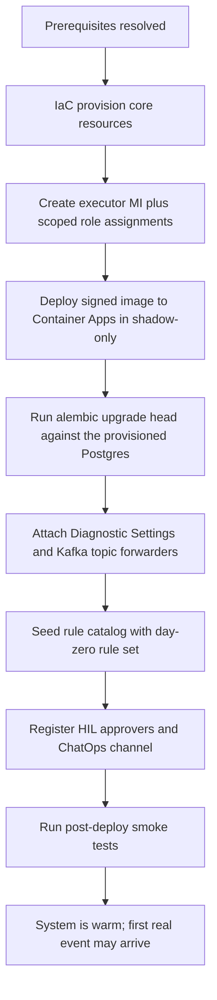

# 배포와 온보딩(Deploy and Onboard)

Azure 구독에 FDAI를 프로비저닝하고 첫 온보딩을 완료해 시스템이 관측 준비되도록 하는
방법. 이 문서는 **구체적 배포 인벤토리, 부트스트랩 순서, 분포/배포 책임 분리**의 진실
원본입니다; 배포 라이프사이클(CI/CD, progressive 전달, 롤백, DR)은
[deployment-ko.md](deployment-ko.md)에 남습니다.

Azure 초점: 이 문서는 Azure 구독을 대상으로 함. 비-Azure 프로바이더는 TBD
([구현 Focus](../../../.github/copilot-instructions.md#implementation-focus-must)).
모든 식별자는
[generic-scope.instructions.md](../../../.github/instructions/generic-scope.instructions.md)에
따라 합성.

> Day-zero 서비스 계층과 수량은
> [Azure Resource 인벤토리](#azure-resource-inventory-minimum-set)에서 결정되어 있습니다.
> 배포 소유자는 배포 전에 지역, 할당량, 보존, 복제본 상한, 운영 계층 재정의를
> 확인합니다. **실행 엔진**은 `infra/`의 `terraform apply`로 결정되어 있습니다.
> 계획된 운영자 진입점은 설치형 `fdaictl` 파사드입니다. 이 파사드는 Terraform을 출처 of
> truth로 유지하고 계획 및 적용 작업을 승인된 실행기에 제출합니다.
> [설치형 배포 CLI](installable-deployment-cli-ko.md)와
> [배포 아티팩트](#배포-아티팩트)를 참조하세요.

## 구현 상태

### 구현 범위

| 영역 | 상태 | 근거 | 참고 |
|------|------|------|------|
| Protected platform 계획 및 exact 적용 | implemented | `.github/workflows/deploy-dev.yml` 및 집중 배포 workflow 검사 | Private runner 계획, 변경할 수 없는 적용 claim 및 post-apply 검사가 제공되지만, 통제된 platform 적용 증적은 리포지토리에 보존되어 있지 않습니다. |
| 독립 소유 런타임 service | validated | `.github/workflows/service-deploy.yml` 및 `config/independent-service-live-evidence-manifest.json` | 각 service에 별도 root, protected 계획, 상태 검사 및 rollback evidence가 있습니다. |
| OHL scale-out evidence target 및 proposal Job | implemented | `infra/` 및 `services/core-control-plane/src/fdai/delivery/`의 current change, 집중 Terraform 및 publisher test 결과 8 passed와 13 passed | 둘 다 기본적으로 비활성화되며 protected 적용이 남아 있습니다. |
| OHL production evidence campaign | in-progress | `config/ohl-scale-out-evidence.json` 및 `docs/runbooks/ohl-scale-out-evidence-ko.md` | Runtime rollout, 통제된 실행, sample 100개 및 14일 recurrence window가 남아 있습니다. |
| 로컬 파괴적 검증 격리 | implemented | `infra/local/docker-compose.yml`, 로컬 준비 스크립트 및 focused migration test | 런타임은 port `5432`의 로컬 PostgreSQL을 사용하고 파괴적 검증은 port `5433`의 별도 로컬 cluster와 volume을 사용합니다. Azure 배포 리소스는 추가하지 않습니다. |

### 구현 이력

| 날짜 | 상태 | 변경 | 근거 | 남은 작업 |
|------|------|------|------|-----------|
| 2026-08-13 | implemented | 이전 provenance를 재구성하지 않고 implementation ledger를 도입하고 범위가 제한된 OHL evidence target의 protected provisioning 및 proposal-only Job을 추가했습니다. | current change, 집중 Terraform test 결과 8 passed 및 publisher/workflow test 결과 13 passed | Exact 계획을 적용하고 증명된 런타임 이미지를 배포한 뒤 실제 evidence campaign을 완료합니다. |
| 2026-08-13 | implemented | 로컬 파괴적 migration 검증을 활성 로컬 런타임 PostgreSQL cluster에서 격리했습니다. | 현재 변경, Compose configuration 통과, focused queue 및 local-environment test 68개 통과, 격리된 migration upgrade/downgrade 검사 2개 통과. | 로컬 검증 데이터베이스 격리에 남은 구현 작업은 없습니다. |
| 2026-08-13 | implemented | Protected platform 계획 및 exact 적용 상태를 `validated`에서 `implemented`로 정정했습니다. Workflow source는 메커니즘을 입증하지만 리포지토리는 통제된 platform 적용 증적을 보존하지 않습니다. | current change, `.github/workflows/deploy-dev.yml`, roadmap, 번역 및 문서 검사 | `validated`로 복원하기 전에 리포지토리에 안전한 통제된 platform 적용 증적을 보존합니다. |

### 남은 작업

- [ ] Exact protected 계획, source revision, target identity 및 post-apply 검증을 결합하는 리포지토리에 안전한 통제된 platform 적용 증적을 보존한 뒤 platform exact 적용 범위를 `validated`로 전환합니다.
- [ ] OHL target과 exact-revision Core 및 Executor image의 protected 적용 증적을 기록하고 배포된 revision이 같은 source commit으로 해석되는지 검증합니다.
- [ ] 통제된 `ops.scale-out` 훈련을 완료하고 독립 rollback, cleanup, graph outcome, sample 100개 및 14일 recurrence evidence를 보존합니다.

## 전제조건(Prerequisites)

### 배포자 아이덴티티 (Azure)

- 대상 리소스 그룹에 대한 subscription-scoped **Owner** 또는 **기여자 + User 접근
  Administrator** - 실행기 Managed Identity와 그 범위된 롤 할당 생성에 필요.
- 실행기의 **액션 화이트리스트**에 매칭되는 subscription-scoped 롤 부여 능력
  ([security-and-identity-ko.md](../architecture/security-and-identity-ko.md)).
- **TBD**: 목적별 custom 롤이 배포자 권한을 패키징할지.

### Azure 전제조건

- 아래 인벤토리의 모든 서비스 가용성이 확인된 리전.
- 확인된 쿼터 헤드룸 (Container Apps 코어, Event Hubs 처리량 단위, PostgreSQL vCore,
  Key Vault 작업).
- Diagnostic Settings 목적지 (Log Analytics workspace) - 신규 또는 기존; 소유권 TBD.
- **비공개 networking (정책 잠금 테난트).** 비공개 데이터 서비스를 강제하는 테난트는
  `enable_private_networking = true`로 설정합니다. 배포는 Key Vault, 두 Event Hubs 이름 공간
  샤드 및 public-mode PostgreSQL에 VNet, 비공개 엔드포인트, linked 비공개 DNS를 provision합니다.
  Event Hubs 공개 접근은 비활성화됩니다. Public-mode PostgreSQL 엔드포인트는 가산이므로 기존
  서버를 유지하며, `enable_private_postgres = true`는 별도 delegated-subnet 모드로 남습니다.
  배포는 Container App 환경도 위임 infra 서브넷에 연결하고 금고를 비공개 접근으로
  잠급니다. Private-only 금고는
  운영자 laptop 에서 도달 불가능하므로, `terraform apply` 는 엔드포인트 에 VNet 시야가
  확보된 호스트 - VNet 내 CI 러너 또는 점프박스 - 에서 실행해야 합니다(실행기가 거기서
  DSN 시크릿을 쓰기). `acr_sku = "Premium"`이면 ACR도 같은 방식으로 잠깁니다. 레지스트리는 공개
  네트워크 접근을 잃고 `privatelink.azurecr.io` 엔드포인트를 받으며, 영역 그룹이 login-server와
  data-endpoint 기록을 등록합니다. 비공개 링크는 Premium 전용이므로 Basic 또는 Standard
  레지스트리는 의도적으로 공개로 남습니다. 비공개 경로 없이 닫으면 모든 이미지 pull이
  깨지기 때문입니다. Prod는 이미 Premium을 요구합니다.

#### Terraform이 만들지 않는 것

아래 인벤토리는 Terraform이 소유하지만, 첫 적용 전에 반드시 존재해야 하는 입력이 넷 있습니다.
하나라도 없으면 계획 시점이 아니라 실행 도중에 실패합니다.

- **Deployer 신원과 역할 배정 권한.** 실행기 신원과 scoped 역할을 만들려면 User 접근
  Administrator가 필요합니다. 기여자만 있으면 계획은 통과하고 적용에서 실패합니다.
- **Terraform 상태 저장소 계정.** `infra/bootstrap/create-state-account.sh`가 `az`로
  만듭니다. 비공개 + key-disabled 계정은 운영자 워크스테이션에서 Terraform의 data-plane 준비 상태
  poll을 끝낼 수 없기 때문입니다. Terraform은 데이터 출처로 읽기만 합니다.
- **초기화 계층이 실행기 VM을 만들 때의 앱 리소스 그룹.** 그 계층은 실행기의 기여자
  권한 부여 범위를 정하려고 이 그룹을 데이터 출처로 읽는데, 정작 그룹을 만드는 것은 앱 계층입니다.
  빈 구독에서는 빈 그룹을 먼저 만들거나, `create_runner_vm = false`로 초기화를 한 번 적용한
  뒤 앱 계층을 돌리고 실행기를 켜서 다시 적용합니다.
- **실행기용 SSH 공개 키**, 그리고 위에 적은 쿼터 헤드룸과 Log Analytics 목적지.

Azure Policy가 인벤토리 일부를 거부하는 테난트는 계획이 수렴하기 전에 예외 또는 대응하는
capability-mode 토글이 필요합니다
([deployment-preflight-ko.md](deployment-preflight-ko.md)).

#### ops/허브 러너 (private-everything 테난트)

일부 테난트는 **모든** 데이터 서비스를 비공개 로 강제한다(Key Vault 와 저장소 둘 다).
그래서 terraform remote-state 백엔드조차 laptop 에서 도달 불가능하다. `infra/bootstrap`
레이어가 배포를 가능케 하는 지속적 허브 를 세우며, 이는 앱 재빌드에도 살아남는다:

Ops 계층은 기본적으로 아웃바운드 경로 하나, static 공개 IP를 가진 NAT 게이트웨이를 만듭니다.
GitHub에 등록된 실행기가 GitHub, 관리 평면, 신원 평면에 도달해야 하기 때문입니다.
폐쇄망은 `enable_public_egress = false`로 설정합니다. 공개 주소를 만들지 않고, 호스트는 등록된
실행기가 아니라 점프박스가 되며, 테난트가 자체 승인 경로를 공급합니다.

- 앱 RG 와 분리된 **ops 리소스 그룹 + 허브 VNet**(`rg-fdai-ops-<region_short>` /
  `vnet-fdai-ops-...`), 러너 서브넷과 private-endpoint 서브넷 포함;
- 비공개 로 잠긴 **terraform remote-state 저장소 계정**, ops VNet 에 링크된
  `privatelink.blob.core.windows.net` 블롭 비공개 엔드포인트 로 프론트;
- 공개 IP 없이 독립 실행기 자리를 1-5개 등록하는 **자체 호스팅 배포 실행기 VM**. 자리마다
  VM-side Bash에서 경로를 확장하고 필수 성공 표시를 내보냅니다. 작업 디렉터리는 분리하고 managed 신원은 공유합니다. 이 신원은 앱 RG에
  `Contributor` + `User Access Administrator`, ops RG에 `Network Contributor`, 상태 계정에
  `Storage Blob Data Contributor`, 구독 범위에 `EventGrid Contributor`만 보유합니다.
  각 실행은 managed 신원 login 전에 Azure CLI 계정 캐시를 지운 뒤 저장소, 계획, 적용 전에
  저장소에 설정된 exact 구독과 테넌트를 증명합니다.
체크아웃 전 실행기는 이전 방식 생성된 `infra/None` 캐시 경로만 제거해 root-owned 액션
residue가 exact-commit clean을 막지 않게 합니다. 해당 단계는 Azure CLI 구성을
`RUNNER_TEMP` 아래에 만들고 subsequent 단계용 `GITHUB_ENV`로 내보내기합니다. 배포 작업의
기본 경로가 `infra/`이므로 이 pre-checkout 단계도 `RUNNER_TEMP`에서 실행합니다. Fresh slot에는
아직 저장소 디렉터리가 없으며 이전 checkout residue에 의존하지 않습니다.
앱 구성 는 spoke VNet 을 ops 허브 에 (양방향) 피어링 하고 비공개 DNS 영역 을
`extra_vnet_links` 경계 으로 ops VNet 에 링크해, 러너가 앱 Key Vault 를 비공개 로 해석하게
한다. 러너가 terraform 적용 주체이므로 기존 `kv_officer_self` 부여가 러너를 앱 금고 의
`Key Vault Secrets Officer` 로 만든다 - 적용 중 DSN 시크릿을 쓰기 한다. 배포는
`[self-hosted, fdai-deploy]` 러너 위에서 [`deploy-dev` 워크플로](../../../.github/workflows/deploy-dev.yml)
로 실행한다(기본 plan-only; `apply` 입력이 강제 적용).
저장소 작업 흐름은 검토된 원격 액션만 허용하고 exact 노드 24-compatible release 참조로
pin하며 컨테이너 supply-chain 액션은 변경할 수 없는 커밋 SHA를 사용합니다. CI 계약은 알 수 없음
액션과 mismatched 참조를 차단합니다. Terraform 고정본 테스트는 선언된 `>= 1.9` 하한에서 허용되는
구문만 사용합니다. Exact CI 버전이 파싱과 계획 assertion을 검증합니다. 업그레이드는 액션 런타임 메타데이터를 검증하고 실행기는 버전 2.327.1 이상을 유지합니다. 비공개 networking이 활성화된이면 PostgreSQL 공개 접근과 broad Azure-services firewall을
비활성화합니다. Dev는 approved 비공개 엔드포인트를 사용하고 운영은 delegated-subnet 모드를
계속 선택할 수 있습니다.
Protected 요청은 `commit_sha`를 명시적으로 체크아웃하고 `git rev-parse HEAD`와 비교합니다.
따라서 전달과 실행 사이에 release 커밋이 `main`을 이동해도 계획 또는 적용 코드가
바뀌지 않습니다.
배포 작업은 `infra/`에서 실행되므로, 저장소 루트 스크립트를 호출하는 단계는 `../scripts/`로
접근하거나 working 디렉터리를 재정의합니다. 맨 `scripts/...` 경로는 `infra/` 아래로 해석되어
Terraform이 검사할 결과를 만들기도 전에 실행기에서 127로 종료됩니다.
Protected 실행기는 Terraform 계획 이후 `scripts/deployment/azure/run_live_preflight.py`를
직접 호출합니다. 이 standalone read-only 진입점은 런타임 서비스 wheel이나 별도 배포되는
`fdaictl` package에 의존하지 않고 Azure Policy, Compute quota, executor RBAC 및 value-blind
Key Vault secret metadata를 검사합니다. Mapping, 자격 증명, category 또는 probe 결과가 없으면
계획 산출물을 저장하기 전에 실패 시 차단됩니다.
Protected 계획은 binary Terraform 계획, 범위가 제한된 preflight 근거, 함수 출처 보관을
각각 별도 SHA-256 다이제스트와 함께 저장합니다. Exact 적용은 모든 산출물을 download하고
검증합니다. Peer 증적은 인증된 실행기 신원과 범위가 제한된 시간 초과로 허용 목록에 있는 isolated 백엔드 블롭을 각각 직접 download하여 상태 바이트를 변경하지 않으면서 반복 프로바이더 initialization을 제거합니다. 서비스 롤백은 변경할 수 없는 스냅샷에 없는 post-apply 시크릿 이름만 제거한 뒤 exact Key Vault 참조를 복원합니다. Independent-service Container App 계획은 lowercase plan-time 개정 번호 접미사도 saved Terraform 계획에 봉인하므로 out-of-band 검증된 이미지 롤백 이후 desired Terraform 이미지가 변경되지 않은 상태에서도 exact 적용이 fresh 개정 번호를 생성합니다. 가드는 exact 이미지 갱신 옆에서 해당 범위가 제한된 접미사만 허용하며 적용 증적을 기록하려면 상태가 attested 이미지를 실행하는 새 개정 번호를 계속 요구합니다. 새 계획 저장 전 실행기는 24시간이 지난 허용 목록에 있는 계획, 메타데이터, 출처,
preflight, 점유, 증적 블롭만 선택합니다. 1001개 미만을 검사하고 워커 8개로 최대 1000개를
삭제하며 선택이 불완전한이거나 삭제가 하나라도 실패하면 계획을 중지합니다.
개발 operations 게이트웨이를 선택하면 Terraform은 해당 함수, 코어, Operator API,
인제스트, 선택된 경우 isolated 실행기, operational canary, 인벤토리 조정 작업,
realtime 인벤토리 발행기 및 해당 의존성 그래프를 대상합니다. 이렇게 하면 관련 없는 런타임 리소스 변경은 계획에서
제외하면서 작업 이미지와 필수 shared 런타임 구성을 수렴 상태로 유지합니다. 대상 집합에는
활성 Terraform `moved` 블록의 출처 및 대상 주소가 모두 포함됩니다. 작업 흐름 계약
테스트는 이 주소를 동기화하여 상태 이행 때문에 protected 계획이 무효화되지 않도록 합니다.
`for_each` 키 이름 변경에는 명시적인 `moved` 블록을 사용합니다. 따라서 Terraform은 기존 리소스를
삭제한 후 새로 만들도록 계획하지 않고 현재 리소스를 그대로 보존합니다.
Targeted 계획에는 해당 `for_each` move의 수집 리소스 주소가 포함됩니다. 따라서
Terraform은 키가 지정된 두 인스턴스를 함께 평가할 수 있으며 AI 계정과 역할 수집도 함께 대상하므로 네트워크 및 권한 확인 설정이 하나의 적용에서 수렴합니다.
Terraform은 호스트와 배포
저장소에 읽기 담당 managed 신원을 사용하며 작업 흐름은 publish 전에 Flex-generated exact shared-key
재정의를 제거합니다. 해당 신원에는 호스트용 `Storage Blob Data Owner`와 멱등성용 기여자
권한 부여를 별도로 부여합니다. 함수 `site_config`는 Application Insights를 단독 관리하며 Easy Auth는
게이트웨이 principal 검사 전에 코어 실행기 managed 신원 클라이언트만 허용합니다. Operator API 배포는
저장소 Variable의 non-secret 관리자와 모든 non-autonomous 에이전트 담당 체계 연결도 요구하며
Container App precondition이 불완전한 지도를 거부합니다. Exact 적용이 수렴하면 작업 흐름이 검증된
출처를 official Flex One Deploy 액션으로 원격 빌드하고 범위가 제한된 트리거 sync 후 두 함수 트리거를 확인합니다.
변경할 수 없는 점유 뒤 신원 또는 상태 검사가 실패하면 검증 재개가 점유를 검증하고
Terraform 적용을 건너뛰며 convergence와 post-apply 검사를 다시 수행합니다. Console hostname
복구는 arbitrary 리소스 검색이 아니라 Terraform 상태의 exact Static Web App id를 사용합니다. 전체 런북:
Health acceptance는 적용 증적을 기록하기 전에 코어 Container App의 최신 개정 번호가 항상
`Provisioned`와 `Healthy`인지 확인합니다. 선택된 Operator API 및 인제스트 개정 번호도 healthy여야
하며 shared 유입 `/healthz` 응답은 고정된 성공 페이로드를 반환해야 합니다. 런타임을
계획하지 않는 design-mocks-only 적용만 예외입니다.
Protected-plan 삭제 게이트는 broad PostgreSQL Azure-services firewall 경로를 닫거나, 검토된
분리 이전 인제스트 권한 부여를 삭제하면서 모든 exact API 또는 워커 successor를 같은 계획에서
pure-create하는 범위가 제한된 security retirement만 허용합니다. 기존 주소 replacement, 누락되거나
생성이 아닌 successor, 그 밖의 모든 삭제는 계속 차단됩니다.
[`infra/bootstrap/README.md`](../../../infra/bootstrap/README.md).
Scheduled driver는 Terraform이 관리합니다. `SCHEDULER_TICK_CRON_EXPRESSION` 및
`ANALYZER_TICK_CRON_EXPRESSION`은 기존 작업을 설정하고, `forecast_tick_cron_expression`과
`forecast_targets_json`은 예측 작업을 명시적 선택하고 `FDAI_FORECAST_TARGETS_JSON`을 주입합니다.
예측 작업은 raw 틱만 publish하며 Huginn이 이를 Heimdall 평가 및 종결용으로 정규화합니다.
인벤토리 조정 작업은 코어와 같은 필수 non-secret 런타임 구성을 상속해
recovery-delta forwarding이 부분 구성 없이 타입이 지정된 Event 버스 발행기를 열게 합니다.
스케줄러 및 analyzer 작업은 해당 작업에 연결된 user-assigned 신원의 클라이언트 id를
`FDAI_MI_CLIENT_ID`로 설정하므로 Azure Monitor 및 Event Hubs 토큰 획득에서 암묵적 신원
선택을 사용하지 않습니다. 이전 방식 범용 OOB 작업은 탐색 항목 지점이 소유할 때까지 범위가 제한된
inert 호환성 리소스로 유지되며, 구현된 recurring 작업은 dedicated 작업이 담당합니다.
Public-network 프로파일에서 운영자가 realtime-inventory Event Grid 구독을 out-of-band로
복구한 경우 Terraform은 결정론적 구독을 가져오고 다음 protected 적용에서 Event 허브
대상, 전달 신원, 이벤트 필터 및 재시도 정책을 수렴시킵니다. Private-networking
프로파일은 지원되지 않는 Event Grid-to-private-Event-Hubs 경로를 만들지 않습니다. 대신 VNet-integrated
인벤토리 작업은 각 조정 후 범위가 제한된 Activity Log 복구 delta를 기본 Event 버스로
전달하며 topic-scoped 데이터 발신자 역할과 영속 멱등성 커서를 사용합니다.
빈 cron은 해당 작업을 비활성화합니다. 기존 스케줄러 또는 analyzer 작업은 계획 전에 안전하게
가져오고 이후 이미지와 구성 변경은 같은 계획 및 적용 경로로 수렴합니다.
Analyzer 작업은 기본 1분 shadow 예약을 사용합니다. 명시적 analyzer 대상이 비어 있으면
영속 인벤토리에서 지원 대상을 읽고 Huginn을 통해 AKS 감지 준비도 관측을 발행합니다.
Analyzer cron을 명시적으로 빈 문자열로 설정하면 작업이 비활성화됩니다.

#### 제한된 egress 환경의 인벤토리 디스커버리

강한 NSG egress 제어는 Azure 서비스 디스커버리를 비활성화하지 않고 애플리케이션 서브넷을
폐쇄 상태로 유지하는 것이 좋습니다. Preflight 중 실제 디스커버리 서브넷에서 managed
신원 토큰 발급, DNS, ARM 관리 엔드포인트에 대한 TLS, 제한된 Azure Resource Graph
쿼리 하나, 페이지 나누기, 비공개 변환 결과 게시를 테스트합니다.

직접 ARG 접근이 차단되면 승인된 허브 관리 경로를 사용하는 VNet 통합 ops 실행기
또는 Container Apps 작업에서 읽기 전용 수집기를 실행합니다. 그런 다음 검증된 Resource
관리 Private Link 경로, 샤드된 ARM 목록 작업, 범위가 명시된 권위 있는 Azure
인벤토리, Activity Log 연속성, 마지막으로 서명된 declarative 복구 스냅샷 순서로
대체 경로합니다. 실패한 경로는 마지막 완전한 그래프를 유지하고 stale로 표시하며 빈 그래프를
게시하지 않습니다. 전체 네트워크 매트릭스, 출처 우선순위, 커버리지 매니페스트, 자율성 저하
규칙은
[제한적인 NSG egress 환경의 Azure 인벤토리](../architecture/csp-neutrality-ko.md#제한적인-nsg-egress-환경의-azure-인벤토리)를
참조하세요.

#### 온보딩 자동화

러너 경로를 반복 가능하게 만드는 6개 헬퍼(전부 customer-agnostic, 파라미터화):

보조 로직 실행 전 `AZURE_SUBSCRIPTION_ID`와 `AZURE_TENANT_ID`를 승인된 배포 대상으로
설정합니다. [`verify-azure-context.sh`](../../../scripts/deployment/azure/verify-azure-context.sh)는
두 축을 모두 요구하고 테넌트를 증명한 뒤에만 예상 구독을 선택하며, 신원이
exact 쌍에 접근할 수 없으면 변경 전에 fail합니다.

- [`verify-azure-context.sh`](../../../scripts/deployment/azure/verify-azure-context.sh)는 Azure
  CLI와 `azd` 항목 지점을 approved 구독/테넌트 쌍에 연결합니다.

- [`preflight-policy-check.sh`](../../../infra/bootstrap/preflight-policy-check.sh) 는 throwaway
  KV + 저장소 를 프로브해 테난트가 private-everything 를 강제하는지(러너 경로 필수 여부)
  사전에 알려준다.
- [`onboard.sh`](../../../infra/bootstrap/onboard.sh) 는 create-state-account -> 초기화
  적용 -> GitHub Actions 설정 출력을 한 번에 수행(멱등적).
- [`set-gh-actions-config.sh`](../../../scripts/deployment/azure/set-gh-actions-config.sh) 는 초기화 출력 에서
  repo Variables + Secrets 를 설정(비번은 생성 후 파이프, 절대 출력 안 함).
- [`register-runner.sh`](../../../infra/bootstrap/register-runner.sh) 는 러너 토큰을 발급하고
  `run-command` 로 VNet 러너를 등록합니다. 다시 실행하면 기존 서비스를 중지하고 uninstall한
  뒤 수명이 짧은 제거 토큰으로 stale 로컬 및 GitHub 등록을 제거하고 fresh 서비스를
  설치합니다. 따라서 토큰을 보관하지 않고 broker-session 손상을 복구합니다.
- [`teardown-env.sh`](../../../scripts/deployment/azure/teardown-env.sh) 는 러너 deallocate/시작(비용) 와 ops 허브
  + 상태 계정 를 절대 건드리지 않는 env 별 `terraform destroy` 가드를 제공.

#### 프로덕션 하드닝 knob

전부 dev 자세 를 기본값으로(라이브 무변경) 하고 env 별 tfvars 로 강화한다
([`staging.tfvars.example`](../../../infra/envs/staging.tfvars.example) /
[`prod.tfvars.example`](../../../infra/envs/prod.tfvars.example) 참조):

| 관심사 | knob | prod 값 |
|--------|------|---------|
| 삭제 보호 | `enable_resource_locks`, 초기화 `enable_state_lock` | `true` |
| Key Vault | `kv_purge_protection_enabled`, `kv_soft_delete_retention_days` | `true`, `90` |
| Postgres 네트워크 | `enable_private_postgres` | `true` |
| Postgres 내구성 | `postgres_backup_retention_days`, `postgres_geo_redundant_backup` | `35`, `true` |
| Postgres 가용성 | `postgres_high_availability_mode` | `ZoneRedundant` |
| HIL 전달 | `enable_chatops_hil`, `chatops_webhook_url`, `chatops_webhook_secret` | 활성화 + CI 시크릿 |
| 이메일 알림 | `enable_email_notifications`, `notification_email_recipients`, `email_data_location` | 활성화 + 수신자 그룹 |
| 레지스트리 | `acr_sku` | `Premium` |
| 모니터링 | `enable_monitoring`, `alert_email`, `alert_webhook_url` | on + 목적지 |
| 비용 | `monthly_budget_amount`, `budget_alert_emails`, 초기화 `runner_auto_shutdown_time` | 설정 |

공개 레지스트리 egress가 없는 테난트는 `--build-arg BASE_IMAGE_REGISTRY=<내부-미러>`로 런타임
이미지를 빌드합니다. 움직이는 것은 레지스트리 호스트뿐이고 base 이미지 다이제스트는 `Dockerfile`에 pin된
채로 남습니다. 따라서 미러는 바이트의 출처를 바꿀 수 있어도 어떤 바이트가 수락되는지는 바꿀 수
없습니다. Base 이미지가 둘 중 하나라도 잃으면 `scripts/quality/ci/check-ci-contracts.py`가 빌드를
실패시킵니다.

`enable_private_postgres`는 PostgreSQL Flexible Server 전용 delegated 서브넷을 추가하고 앱/ops
VNet에 비공개 DNS 영역을 연결하며 공개 접근과 `AllowAllAzureServices` firewall 룰을
비활성화합니다. 기존 공개 서버에서 활성화하면 서버가 교체될 수 있으므로 승격 전에
계획을 검토하고 백업/복원을 예행 연습하는 것이 좋습니다. `infra/production-gates.tf`의
assertion은 signed 이미지 다이제스트, 비공개 networking, 내구성, 경보 대상, 비용 예산
최소값이 제공될 때까지 운영 계획을 차단합니다.

`enable_private_networking = true`이고 delegated-subnet PostgreSQL이 꺼져 있으면 Terraform은
`postgresqlServer` 비공개 엔드포인트를 추가하고 `privatelink.postgres.database.azure.com`을 앱/ops
VNet에 연결합니다. 두 Event Hubs 샤드는 `privatelink.servicebus.windows.net`을 공유하며 각
이름 공간은 자체 비공개 엔드포인트를 갖고 공개 네트워크 접근은 비활성화됩니다. 따라서 시작
탐색은 개발 데이터베이스를 교체하지 않고 Container Apps 서브넷 또는 peered 실행기에서 실행할
수 있습니다.

승인된 out-of-band ACS 이메일 초기화는 첫 dev convergence 계획에서
`import_existing_email_notifications=true`를 설정할 수 있습니다. 가져오기 블록은
Communication 서비스, 이메일 서비스, Azure-managed 도메인, association, 알림 신원,
결정론적 역할 배정을 상태로 가져옵니다. 계획을 적용한 뒤 플래그를 끄는 것이 좋으며,
새 환경에서는 Terraform이 stack을 직접 생성하도록 합니다.

CI는 자격증명 없는 가드 2개를 추가합니다. [`infra-lint.yml`](../../../.github/workflows/infra-lint.yml)은
모든 infra PR에서 fmt + validate + tfsec + Checkov를 실행합니다.
[`infra-drift.yml`](../../../.github/workflows/infra-drift.yml)은 실행기에서 이전 방식, 독립 서비스 5개,
초기화 상태 루트에 대해 스케줄된 `plan -detailed-exitcode`를 실행합니다. 루트가 없거나 읽을 수 없거나
변경되면 닫힌 상태로 실패하므로 green 실행은 루트 7개를 모두 확인했다는 뜻입니다. 모니터링은 활성화 시 액션 그룹 +
메트릭 경보(Postgres / Key Vault / Event Hubs / Container App) + Log Analytics 진단설정을
provision 하며, 경보 는 인간 신호일 뿐 자율 액션이 아니다.

### 비-Azure 전제조건

- 카탈로그 + 포크 리포에 범위된 설치된 GitHub App 또는 서비스 커넥션을 가진 **GitOps 호스트**
  (GitHub 또는 Azure DevOps 조직).
- 사람 승인(`hil` 경로)을 위한 그룹-연결 팀이 있는 **Teams 테넌트**. Teams가 기본 A1
  기본입니다. 자세한 내용은
  [channels-and-notifications-ko.md](../interfaces/channels-and-notifications-ko.md)를 참조하세요.
- FDAI Slack 앱이 설치되고 필수 Slack userId ↔ Entra OID 매핑 저장소가 프로비저닝된
  **Slack 워크스페이스**; P1 Slack A1 채널에 필요
  ([channels-and-notifications-ko.md#7-channel-specific-notes](../interfaces/channels-and-notifications-ko.md#7-channel-specific-notes)).
- 서명 + 증명 저장을 지원하는 **컨테이너 레지스트리** (ACR 또는 외부 레지스트리).
- **OpenTelemetry 백엔드**: Log Analytics workspace에 Application Insights를 바인딩합니다.
  포크는 텔레메트리 프로바이더 계약을 통해 백엔드를 교체할 수 있지만 Azure day-zero
  인벤토리에서는 이 선택을 열어 두지 않습니다.

## 배포 아티팩트

- `infra/`의 IaC ([project-structure-ko.md](../architecture/project-structure-ko.md) 참조)가 엔트리 포인트.
  모든 환경은 환경별 파라미터와 환경별 격리된 상태로 같은 코드에서 동일하게 프로비저닝합니다.
  Terraform은 기본 Event 허브 이름을 `event_bus_topics`로, 단계, 승인, 인벤토리 유입
  auxiliary 이름을 `event_bus_auxiliary_topics`로 제공해 로컬 런타임 준비가 provision된 토픽만 연결합니다.
- **엔트리 명령**: `infra/`의 Terraform (HCL) 모듈에 대해 `terraform apply` - 이전 OD
  (`azd up` vs `terraform apply` vs 래퍼 스크립트) 해결. 환경 값은 **깃에 커밋되지 않는**
  `*.tfvars` 파일로 공급 ([generic-scope.instructions.md](../../../.github/instructions/generic-scope.instructions.md)
  준수). [`fdaictl`](installable-deployment-cli-ko.md) 래퍼와 실행기는
  `request 검증 -> init -> plan -> live preflight -> exact remote apply -> post-provision 체크`를
  순서대로 실행합니다. Protected 계획에 완전한 non-secret preflight 프로파일이 없으면 Azure
  login 또는 Terraform initialization 전에 중단합니다. 실제 운영 탐색이 차단되면 작업 흐름은
  중단하기 전에 정제된 검사와 발견 사항만 출력합니다. Terraform은 실행 엔진이자
  infrastructure 정본으로 유지됩니다. Bicep과 OpenTofu는
  [tech-stack-ko.md](../architecture/tech-stack-ko.md)에 따른 호환 대안으로 남습니다.
- 같은 서명 이미지가 `dev → staging → prod` 승격; 환경별 재빌드 없음
  ([deployment-ko.md](deployment-ko.md)).

## 리소스 명명 규약(Resource Naming Convention)

리소스 명명 및 태깅 계약은
[배포 리소스 규약](deployment-resource-conventions-ko.md)이 소유합니다. 이 집중 문서는
CAF 접두사, 결정론적 길이 처리, `fdai:` 태그 네임스페이스, 배포 공급 태그,
`fdai:managed=true` 소유권 경계를 정의합니다. 이 제목은 기존 링크의 안정적인 대상으로
유지합니다.

## Azure 리소스 인벤토리 (최소 세트)

인벤토리는 **비용 효율 우선**을 위해 의도적으로 최소화. 아래 모든 선택은 이 문서 끝의
[Cost-Efficiency Principles](#cost-efficiency-principles)가 주도. 인벤토리는 [csp-neutrality-ko.md](../architecture/csp-neutrality-ko.md)
에 정의된 네 개의 CSP-중립 계약 (이벤트버스, 런타임, 시크릿, 워크로드 아이덴티티) 에서
렌더링된것; Azure는 오늘의 각 계약의 구현. 구체적 티어 값, 정확한 이름, 리전, 앱별 복제본
상한은 여전히 **배포별** 이며 환경마다 튜닝하고 형상은 안정적으로 유지합니다.
| # | 리소스 | 티어 | 목적 | 노트 |
|---|--------|------|------|------|
| 1 | **Container Apps 환경** | Consumption | 공유 서버리스 컴퓨트 호스트 | 코어 앱과 예약 작업이 하나의 환경을 공유하며 [런타임 계약](../architecture/csp-neutrality-ko.md#2-런타임-계약--oci-이미지--knative-호환-매니페스트)을 구현합니다. |
| 2 | **Container Apps** (현재 Core와 목표 실행기) | 현재 Core 앱은 `minReplicas: 1`, 목표는 내부 앱 1개 추가 | 전이 기준선은 Core에서 실행을 구성하고 완료된 5개 서비스 토폴로지는 실행기를 격리합니다. | 모든 graduation 게이트 통과 후에만 실행기가 효과 권한을 받습니다. [Compute 형태](#compute-shape-current-core와-5개-service-목표)를 참조하세요. |
| 3 | **Container Apps 작업** | Consumption | 스케줄 프로브와 out-of-band 변경 감지 | Azure Functions 대체; 환경 공유 |
| 4 | **Event Hubs 이름 공간 샤드** | Standard 2개 (각 1 TU, auto-inflate off) | Kafka-와이어 이벤트 버스 (`:9093` 엔드포인트) | 기본은 통제된 유입, DLQ, HIL 및 단계를 소유합니다. Operational은 canary + DLQ, 전용 synthetic 시작 round-trip, raw 인벤토리, 실행기 명령 + DLQ 및 실행기 증적 개체를 소유합니다. Core는 배포 구성을 통해 operational 초기화 엔드포인트와 시작 토픽을 받습니다. |
| 5 | **Event Grid 인벤토리 system 토픽 + 구독 + Diagnostic Settings** | global 구독 이벤트 전달 / Log Analytics | Resource 쓰기/삭제를 `aw.inventory.raw`로 보내고 플랫폼 진단을 workspace로 보냄 | Terraform은 Azure 정본 lowercase 타입으로 tracked 토픽 하나를 adopt하고 send-only 인벤토리 UAMI를 할당하며 dedicated system-topic 구독 API를 사용합니다. 발견이 모호하면 계획을 차단합니다. |
| 6 | **PostgreSQL Flexible Server** | Dev: Burstable **B1ms**, HA 비활성, 7일 백업; prod: zone-redundant HA, 35일 geo 백업 | 감사 + KPI + 패턴 라이브러리 + **pgvector** T1 임베딩, 단일 저장 | Terraform은 `vector`와 `pg_trgm`을 허용 목록하고 운영은 `ZoneRedundant` HA를 요구하며, 로컬 Compose는 별도 bind-mounted initializer 없이 같은 Alembic-owned `vector` 확장을 사용합니다. |
| 7 | **Key Vault** | Standard | **Container Apps native 시크릿 + Key Vault 참조**로 소비되는 시크릿 백엔드 - [시크릿 계약](../architecture/csp-neutrality-ko.md#3-시크릿-계약--환경변수--k8s-secret) 구현 | Premium (HSM) 불필요; 앱은 시크릿 SDK 호출 안 함 |
| 8 | **User-assigned Managed Identity** | - | 실행기의 최소권한, 액션-화이트리스트 아이덴티티; [워크로드 아이덴티티 계약](../architecture/csp-neutrality-ko.md#4-워크로드-아이덴티티-계약--oidc-토큰) 구현 | 단계 1은 built-in 롤 구성으로 RG-스코프의 **하나의** MI (`mi-aw-executor`) 배포; 단계 3에서 도메인별 MI로 분할 - [security-and-identity-ko.md § 신원 대응 (Phased)](../architecture/security-and-identity-ko.md#identity-mapping-phased) 참조 |
| 9 | **Log Analytics workspace + Application Insights** | Pay-as-you-go, **기본 30일 보존** | traces / metrics / logs / audit-forward | `appi-*` 리소스가 workspace에 바인딩되며 보존은 배포 후 **UI에서 설정 가능** |
| 10 | **Container Registry (ACR)** | Basic (나중에 geo-replication 필요 시 Standard) | 서명된 이미지 + 빌드 증명 | 다이제스트로 고정, 변경 가능한 태그 절대 아님 |
| 11 | **Azure OpenAI 계정 + Foundry 계정/project** (**명시적 선택**, `var.enable_llm`) | Standard | T1 임베딩 + T2 mixed-model 배포 및 100K TPM의 전용 GPT-4.1-nano 웹 검색 프롬프트 에이전트 | 프로비저닝에는 deployer 권한과 리전 계열 용량이 필요하며, 그렇지 않으면 해당 기능이 **`hil-only`**로 강등됩니다. [dev-and-deploy-parity-ko.md § 배포자-스코프 LLM 프로비저닝](dev-and-deploy-parity-ko.md#배포자-스코프-llm-프로비저닝)을 참조하세요. 웹 검색을 활성화하면 Terraform이 배포 지역에 별도 `AIServices` Foundry 계정, project 및 `t1.web_search` 배포를 만들고 deployer와 활성화된 Operator API 신원에 `Azure AI User`를 부여합니다. 보호된 post-apply 단계는 실제 도구 준비 상태 탐색 전에 정확한 도메인 허용 목록으로 `fdai-web-search`를 조정합니다. 비공개 모드는 `privatelink.services.ai.azure.com`을 추가하며 테넌트 정책이 소유하는 거부 ACL 세부 정보는 Terraform이 보존합니다. |
| 12 | **ADLS Gen2 문서 계정** (**명시적 선택**, `enable_document_ingestion`) | StorageV2 Standard ZRS, HNS | 비공개 격리 구역, 변경할 수 없는 통제된 버전, derived 묶음 | 비공개 모드에서 Shared Key와 공개 접근 비활성화; soft 삭제 + 수명 주기; `blob`과 `dfs` 비공개 엔드포인트 |
| 13 | **Case-history Blob 계정** (`enable_case_history`) | StorageV2 Standard ZRS | 재생 및 통제된 Norns 분석용 내용 기반 주소를 가진 prediction/인시던트 사례 개정 번호 | Shared Key 비활성화, 비공개 컨테이너, versioning, 변경 피드, soft 삭제, 범위가 제한된 old-version 수명 주기, Defender scanner private-link 접근, 전용 case-history UAMI 데이터 역할, `blob` 비공개 엔드포인트. 실행기 MI에는 Blob 역할을 부여하지 않습니다. |
| 14 | **문서 인제스트 Container Apps** (**명시적 선택**) | Consumption, 공개 API + ClamAV를 포함한 내부 워커 | 인증된 범위가 제한된 업로드 중계와 독립적으로 규모되는 안전성 검사, 추출, pgvector 인덱싱, 수명 주기 이벤트 | API, 워커, 이행 UAMI를 분리합니다. 워커만 Event Hubs 수신과 OCR 권한을 받으며 런타임 신원에는 실행기 권한이 없습니다. |
| 15 | **Control-loop canary 작업** | Consumption, 5분마다 실행 | `aw.control.canary`에 멱등 이벤트 하나를 게시합니다. | 전용 UAMI에는 ACR pull과 Event Hubs 전송만 있으며, 코어는 별도 소비자 경로에서 no-op 감사를 기록합니다. |
| 16 | **개발 operations Function App** (**명시적 선택**, `enable_dev_operations_gateway`) | Flex Consumption FC1 | 로컬 개발에서 비공개 리소스로 등록된 읽기, 쓰기, execute 연산을 중계합니다. | dev 및 private-networking 전용이며 수명 주기 precondition으로 강제되고 `infra/tests/dev_operations_gateway.tftest.hcl`이 이를 검증합니다. Easy Auth 뒤에서 **공개** 인바운드 엔드포인트를 종단합니다. 개발자가 도달해야 하기 때문이며, 따라서 폐쇄망에서는 꺼둔 채로 둡니다. 전용 `/27` 서브넷, 비공개 AAD-only 배포 및 멱등성 저장소, Easy Auth, 분리된 읽기 담당/실행기 UAMI, 일회용 server-issued 변경 계획 증적을 사용합니다. 임의 URL, ARM 경로, 명령, 조회 표면은 제공하지 않습니다. |
| 17 | **OHL scale-out evidence VM Scale Set + proposal Job** (**명시적 선택**, `enable_ohl_scale_out_evidence_target`) | Uniform `Standard_B1s`, 용량 `1`, manual Consumption Job | 통제된 `ops.scale-out` 근거용으로 범위가 제한된 non-production target 및 normal-ingress shadow proposal | dev, 비공개 networking 및 operations gateway가 필요합니다. 배포는 region에서 사용할 수 있는 exact image version을 공급하고 변경 가능한 `latest`를 거부합니다. 전용 `/27` subnet에는 public IP가 없습니다. Proposal UAMI에는 ACR pull과 primary Event Hub send만 있습니다. Protected provider staging은 검증된 rollback 전에 capacity를 `2`까지만 늘릴 수 있습니다. |
로컬 parity 프로필은 동일한 5개 service package를 loopback PostgreSQL과 Redpanda,
filesystem-backed 문서 object 및 ClamAV에 연결해 시작합니다. Plaintext Kafka는 loopback broker에서만
사용합니다. 배포 모듈은 service-owned managed identity와 service-specific PostgreSQL role을 사용하는
Event Hubs Kafka를 계속 요구합니다.
활성 로컬 런타임은 port `5432`의 `pgvector/pgvector:pg16`을 사용합니다. 별도 volume을
가진 port `5433`의 두 번째 로컬 `pgvector/pgvector:pg16` cluster는 파괴적 migration 검증에만
사용합니다. Alembic이 관리하는 role이 PostgreSQL cluster-global이기 때문입니다. 로컬 런타임
준비는 전용 검증 DSN을 생성하고 detached 중앙 검증은 해당 DSN만 통합 테스트에 매핑합니다.
두 번째 cluster는 로컬 검증 의존성이며 위 Azure 리소스 인벤토리에는 포함되지 않습니다.
추가 신원/채널/콘솔 요소는 배포 또는 명시적 선택 기능이 소유합니다:

- **App 등록 × 3** - 오디언스 분리
  ([user-rbac-and-identity-ko.md#41-app-registrations](../interfaces/user-rbac-and-identity-ko.md#41-app-registrations)):
  `fdai-console-spa` (SPA 사인인, PKCE), `fdai-api` (콘솔 + ChatOps 백엔드용
  Web API 오디언스), `fdai-approval-bot` (Teams SSO). 어느 것도 실행기 아이덴티티
  보유 안 함. 단계별 `az` 생성:
  [../runbooks/entra-app-registration-ko.md](../../runbooks/entra-app-registration-ko.md).
  콘솔 적용 후 deploy 작업 흐름은 Terraform이 출력한 Static Web App 출처를 대상
  테넌트의 SPA redirect URI에 안전하게 재시도 가능한 방식으로 동기화합니다. 테넌트가
  일치하지 않거나 Graph 권한이 없으면, 사인인할 수 없는 콘솔을 배포하지 않도록
  배포를 차단합니다.
- **Entra 보안 그룹 × 5** - `aw-readers`, `aw-contributors`, `aw-approvers`, `aw-owners`,
  `aw-break-glass`. 배포 소유이며 objectId는 구성으로 주입되고 시작 시 검증
  ([user-rbac-and-identity-ko.md#42-security-groups-slots](../interfaces/user-rbac-and-identity-ko.md#42-security-groups-slots)).
- **Conditional 접근 정책** - `aw-approvers`/`aw-owners`에 phishing-resistant MFA,
  `aw-owners`에 compliant-device, `aw-break-glass`에 전용 하드웨어 토큰 + 사인인 알림.
  Entra ID P1에서 이용 가능
  ([user-rbac-and-identity-ko.md#43-conditional-access](../interfaces/user-rbac-and-identity-ko.md#43-conditional-access)).
- **Azure Bot (Free 계층, 미프로비저닝)** - Teams Adaptive 카드 채널을 선택한 다운스트림
  배포가 별도로 제공합니다. 업스트림 Terraform은 signed 웹훅 경계만 배포합니다.
- **서명된 HIL 웹훅** - 운영은 CI 시크릿으로 URL과 32자 이상의 HMAC 시크릿을
  제공합니다. Terraform은 둘 다 Key Vault에 저장하며, 코어는 URL과 시크릿을 읽고 Operator API에는
  콜백 시크릿만 전달합니다.
- **Topic-scoped Event Hubs 역할** - 실행기는 이름 공간이 아니라 현재 프로비저닝된 각 허브
  개체에 데이터 Owner를 받습니다. 인벤토리와 canary는 각자의 토픽에만 전송할 수 있습니다.
  Operator API 명령 신원은 제안, HIL 결정, pantheon 객체 메시지를 전송하고
  단계 토픽을 수신합니다. 문서 인제스트는 `aw.pipeline.stages`로 제한됩니다.
- **Static Web Apps (Free 계층, 명시적 선택)** - `enable_console=true`일 때 읽기 전용 콘솔을 호스팅합니다.
- **Design-mocks Static Web App (Free 계층, 명시적 선택)** - `enable_design_mocks=true`일 때 격리된
  정적 디자인 검토 아티팩트를 호스팅합니다. 아티팩트 빌더는 `index.html`, `mocks/`,
  `examples/`, 공유 에이전트 icon에서 허용된 브라우저 자산만 복사합니다. Static Web Apps
  인증은 익명 요청을 Microsoft Entra ID로 리디렉션하고 초대된 `reviewer` 역할 구성원만
  허용합니다. 보호된 exact-apply 작업 흐름은 Terraform 소유 리소스에서 배포 토큰을 읽고
  마스킹한 다음 exact-version Static Web Apps CLI에 `SWA_CLI_DEPLOYMENT_TOKEN` 환경변수로만
  전달합니다. 작업 흐름은 허용 목록 아티팩트를 게시하고 인증 리디렉션을 확인합니다. 토큰은
  커밋하거나 저장소 시크릿으로 저장하지 않습니다. 이 경로는 `module.design_mocks`만
  대상으로 하며, 해당 모듈 외부의 리소스 변경이 계획되면 차단하고 코어 canary와 다른 런타임
  조정을 건너뜁니다.
- **워크로드 신원 federation** - CI/CD 단명 OIDC 토큰; 리소스 아님, 비용 없음.

### 문서 인제스트 배포

`enable_document_ingestion=true`는 `enable_llm=true`, resolved `t1.embedding` 기능,
콘솔 API 대상, Entra RBAC 그룹 id 5개, 명시적인 인제스트 CORS 출처와 함께 설정합니다.
Terraform은 다음 항목을 프로비저닝합니다.

- 별도 API, 워커, 이행 UAMI와 role-scoped PostgreSQL DSN. API는 단계를 publish하지만
  consume하지 않으며 워커만 단계 수신과 선택적 문서 Intelligence OCR 권한을 가집니다.
- HNS, `documents`와 `derived` 파일 시스템, 수명 주기 컨트롤, Shared Key 비활성화와
  Terraform-owned Defender scanner private-link 접근을 적용한 StorageV2 계정
- `blob` 및 `dfs` 비공개 엔드포인트. App VNet은 엔드포인트 영역에 링크하고, ops 실행기는 기존
  central Blob 영역의 A 기록으로 Blob을 해석합니다. DFS 영역은 두 VNet에 링크합니다.
  이 방식은 한 VNet을 같은 이름 공간의 중복 영역에 링크하지 않습니다.
- 공개 인제스트 API Container App과 replica-local ClamAV를 포함한 내부 워커 앱. Initial 전환은 롤백용 exact 빈 이전 방식 sidecar 탐색만 스냅샷할 수 있고 새 개정 번호는 계속 strict 탐색 3개를 요구합니다.
- 트래픽 전에 문서 메타데이터와 pgvector 스키마를 적용하는 수동 이행 작업

`deploy-dev` 작업 흐름은 `deploy_document_ingestion` 입력을 제공합니다. 기본 동작은 계획이며,
적용은 이행 작업을 실행합니다. 독립 서비스 적용도 Key Vault admin DSN을 마스킹하고 가지를 적용하며
트래픽 전에 PostgreSQL `PGOPTIONS`로 declared 역할을 강제합니다. 두 개정 번호를 검증한 뒤 `ingestion_gateway_fqdn`을 출력합니다. Console은
`VITE_INGESTION_API_BASE_URL=https://<fqdn>`으로 빌드합니다. 운영 게이트는 비공개
networking과 digest-pinned FDAI 및 ClamAV 이미지를 요구합니다.

공개 Static Web App은 ADLS에 직접 접근하지 않습니다. Storage 계정을 비공개로 유지하기
위해 인증된 게이트웨이를 통해 스트림합니다. 게이트웨이는 ADLS, Event Hubs, Azure OpenAI에 Managed
신원을 사용하며 연결 문자열 또는 Storage 계정 키를 만들지 않습니다.

첫날에 **프로비저닝되지 않음** (측정된 필요가 정당화할 때 후속 단계로 연기):

- **Service Bus 이름 공간과 Event Grid 커스텀 토픽** - 이벤트 버스는 Event Hubs의 Kafka
  엔드포인트 ([csp-neutrality-ko.md § 이벤트버스 계약](../architecture/csp-neutrality-ko.md#1-이벤트버스-계약--kafka-와이어-프로토콜));
  인벤토리 쓰기/삭제용 subscription-scoped Event Grid 구독은 기본 배포되지만
  별도 custom 토픽은 만들지 않습니다.
- 전용 vector 데이터베이스 (PostgreSQL 내부 pgvector가 초기 스케일에서 충분).
- Front Door, 애플리케이션 게이트웨이, API 관리 (공개 인바운드 엔드포인트 없음; 콘솔은
  읽기 전용 정적 호스팅).
- DR용 secondary-region 리소스 (단계 4 - TBD;
  [구현 Focus](../../../.github/copilot-instructions.md#implementation-focus-must) 참조).

### Compute 형태 (현재 Core와 5개 서비스 목표)
현재 control-loop Core는 서명된 이미지와 Python 프로세스 하나로 배포됩니다. 5개 서비스 목표는 내부 Isolated 실행기를 추가하고 전환에서 Core의 실행기 역할을 제거합니다. Operator, 인제스트 API, 인제스트 워커는 별도이며 이전 토폴로지는 롤백 산출물입니다. 모든 게이트는 [실행 계획](../architecture/service-decomposition-execution-plan-ko.md)에서 추적합니다.
- **런타임**: `python -m fdai`가 Kafka 소비자를 시작하고 라우팅, quality, risk, 감사 단계를 구성합니다. `fdai-isolated-executor`는 기본적으로 shadow-only입니다. 명시적 전환은 고정된 Core 증적 소비자 그룹, versioned 명령/증적 전송 계층, 기존 guarded direct-API 실행기 및 전용 게이트웨이 호출자 신원을 사용합니다. 배포 venue와 `RUNTIME_ENV`는 독립적으로 유지합니다.
- **Health**: Core는 내부 `/live`와 `/ready`, 인제스트 API는 `/healthz`, 내부 워커는 `/live`와 `/ready`를 사용합니다. Isolated 실행기도 `FDAI_ISOLATED_EXECUTOR_HEALTH_PORT`에서 내부 `/live`와 `/ready` 계약을 사용합니다.
- **Core 시작 왕복**: 독립적인 Core는 synthetic 시작 기록을 publish하기 전에 고유 operational Event Hubs 소비자 그룹의 결합을 12초 동안 기다립니다. 탐색별 기한은 30초이고 단계 기한은 75초이므로 기본 시도 2회를 위한 범위가 제한된 headroom을 확보합니다. 배포는 이 순서가 보장된 값을 조정할 수 있지만 자신이 publish한 exact 기록을 consume하지 못하면 탐색은 준비된 상태가 되지 않습니다.
- **복제본 하한**: 기본값은 복제본 하나입니다. 검증된 Kafka scaler 없이 0으로 설정하면 Event Hubs 데이터로 깨어나지 않으므로 Terraform은 scale-to-zero를 주장하지 않습니다.
- **분리 기준**: 목표는 Core, Operator, 인제스트 API, 처리 워커, Isolated 실행기이며 권한 전환은 [서비스 승격과 데이터 소유권](../architecture/service-graduation-and-ownership-ko.md)의 모든 게이트를 따릅니다.
- **신원 분리**: Operator API 읽기/명령과 인제스트 API/워커/이행 principal을 분리합니다. 워커는 `aw.pantheon.objects`에서 Saga/Muninn 객체만 수신하고 `aw.pipeline.stages`로 단계 사실을 전송합니다. `ingestion_cohost_worker=true`는 두 범위를 API 신원으로 돌립니다.
- **실행기 배포와 전환**: `enable_isolated_executor=true`는 내부 앱과 ACR pull, 명령 수신, 증적/DLQ 전송, state-secret 읽기만 가진 전용 UAMI를 프로비저닝합니다. 기본값은 `false`이며 private-runner 작업 흐름은 기본 plan-only를 유지하고 checksum-pinned GitHub CLI를 설치하며 embedded plan-metadata 코드를 syntax-check하고 증명을 검증한 뒤 동일한 ACR 다이제스트를 연결하고 최신 개정 번호를 상태 검사에 포함합니다. `promote_runtime_image=true`는 재구축 없이 검증된 다이제스트를 가져오기하지만 exact 적용은 승격을 거부하고 protected 계획만 사용하며 convergence에도 같은 런타임 다이제스트를 복원합니다. `enable_isolated_executor_authority_cutover=true`는 개발 operations 게이트웨이도 요구하며 Core의 게이트웨이 및 버티컬 효과 접근을 제거하고 isolated 신원을 승인하며 Core에는 전송 계층/읽기 접근만 유지합니다. `verify_executor_effect=true`는 non-interactive 실행기에서 명시적 pseudo-terminal을 통해 reversible NSG 룰 탐색을 실행하고 원격 exit 상태를 보존합니다. 중복 전달은 변경할 수 없는 액션 및 명령 신원을 유지하도록 하나의 issued-at 시각을 공유하고 정리는 새 범위가 제한된 기한을 받습니다. Azure Resource Manager에서 효과를 확인하고 중복 쓰기를 차단하며 오프셋과 최종 증적을 기록한 뒤 정리합니다. 900초가 지나면 실패합니다.
- **OHL evidence target**: `enable_ohl_scale_out_evidence_target=true`는 `dev`에만 전용 Uniform
  VM Scale Set 하나와 manual proposal Job 하나를 추가합니다. 비공개 networking, development
  operations gateway, exact `OHL_SCALE_OUT_EVIDENCE_IMAGE_VERSION`, retry-stable
  `OHL_SCALE_OUT_EVIDENCE_CAMPAIGN_ID`, human
  `OHL_SCALE_OUT_EVIDENCE_INITIATOR_PRINCIPAL_ID`, non-secret
  `OHL_SCALE_OUT_EVIDENCE_SSH_PUBLIC_KEY`이 필요합니다. Protected platform workflow가 target,
  subnet, proposal UAMI 및 Job을 소유하며 evidence 실행 전에 `service-deploy`가 exact revision
  Core 및 Executor image를 독립적으로 rollout합니다. Job을 시작하면 normal ingress를 통해 shadow
  proposal 하나를 게시하며 provider-effect 권한은 없습니다.

## 부트스트랩 순서

프로비저닝은 IaC 주도이지만 첫 라이브 이벤트까지의 **논리적 부트스트랩 순서**는 지켜야 함.
앞의 단계가 실패하면 halt하고 unwind; 배포는 깨진 앞 단계로 뒤 단계에 진행하지 않음.

```mermaid
flowchart TD
    A[Prerequisites resolved] --> B[IaC provision core resources]
    B --> C[Create executor MI plus scoped role assignments]
    C --> D[Deploy signed image to Container Apps in shadow-only]
    D --> D1[Run alembic upgrade head against the provisioned Postgres]
    D1 --> E[Attach Diagnostic Settings and Kafka topic forwarders]
    E --> F[Seed rule catalog with day-zero rule set]
    F --> G[Register HIL approvers and ChatOps channel]
    G --> H[Run post-deploy smoke tests]
    H --> I[System is warm; first real event may arrive]
```

- **첫 배포에서 shadow-only**: 어떤 규칙/액션도 절대 강제 적용 모드로 시작하지 않음. 승격은
  별개의 행위 ([rule-governance-ko.md](../rules-and-detection/rule-governance-ko.md)).
- **첫 컨트롤 루프 틱 전에 마이그레이션이 반드시 실행되어야 함**. Container App 은
  시작 시 마이그레이션을 실행하지 않음 (복제본 간 일관성 유지 + race 방지).
  프로비저닝된 Postgres FQDN 에 admin DSN 으로 접속 가능한 워크스테이션 또는 CI 잡에서
  `alembic upgrade head` 를 실행. `alembic/versions/`의 모든 tracked 이행은
  `downgrade()`를 정의하지만, 스키마/데이터 롤백은 파괴적일 수 있으므로 백업/복원과
  이행별 downgrade를 staging에서 예행 연습한 뒤 실행합니다.
- Post-deploy smoke 테스트와 합성 카나리는
  [operating-and-verification-ko.md](../operations/operating-and-verification-ko.md)에 정의.

## 분포 및 배포 책임 매트릭스

업스트림 repo는 모든 것을 **customer-agnostic**으로 제공합니다. 다운스트림 분포는
`core/`를 편집하지 않고 의존성 주입으로 기능을 제한하거나 확장할 수 있습니다.
배포는 출처 컨트롤 밖에서 환경 값, 신원, 시크릿 참조, 승격
상태를 제공합니다.
([generic-scope.instructions.md](../../../.github/instructions/generic-scope.instructions.md)).

| 관심사 | 업스트림 분포 | 다운스트림 customization | 배포 구성 |
|--------|-----------------------|--------------------------|--------------------------|
| IaC 모듈 | Parameterized 모듈 | 선택적 모듈 오버레이 | 환경 tfvars, 상태, 시크릿 참조 |
| 프로바이더 어댑터 | 프로토콜 및 Azure 구현 | DI를 통한 선택적 replacement | 엔드포인트 및 신원 연결 |
| Rule 카탈로그 | 범용 시드 및 스키마 | 추가 룰 및 정책 오버레이 | 배정, exemption, 승격 상태 |
| HIL 및 RBAC | 역할 및 승인 계약 | 선택적 채널 어댑터 | Entra 그룹, 채널 id, 승인자 연결 |
| 모델 | 기능 레지스트리 및 해석기 | 선택적 프로바이더 어댑터 또는 선호 설정 오버레이 | resolved 엔드포인트, 할당량, 지역, 신원 |
| 런타임 값 | 검증된 키 스키마 | 테넌트 값 없음 | 환경 variable 및 Key Vault 참조 |

## 런타임 설정 매트릭스

모든 값은 런타임에 env vars 또는 Key Vault refs에서 옴. **이 리포에 커밋되는 환경 값 없음.**
아래 리스트는 배포가 기대하는 **키의 스키마** ; 완전한 확장 카탈로그와 기본값은 인벤토리 PR에서
작성됨.

Console은 Settings > 런타임 policies에서 안전한 subset을 변환 결과합니다. 읽기 담당은 환경,
영속 재정의 및 effective 값을 비교할 수 있습니다. Owner는 개정 번호 및 감사 검사를 통해
문서화된 허용 목록만 변경할 수 있습니다. IRP, analyzer, 인벤토리 최신성 및 보존 틱 변경은
다음 이벤트 또는 작업 경계에서 동적으로 적용됩니다. 로깅 수준과 사례 보존 또는 deletion 일
변경은 headless 런타임 재시작이 필요합니다. 배포 신원, 전송 계층, 엔드포인트, 시크릿,
승격 및 test-only 키는 editable 표면에 포함되지 않습니다.

| 키 | 소스 | 소유자 | 노트 |
|----|------|--------|------|
| `AZURE_TENANT_ID` | env | 배포 | 비-시크릿 |
| `AZURE_SUBSCRIPTION_ID` | env | 배포 | 비-시크릿 |
| `AZURE_RESOURCE_GROUP` | env | 배포 | 대상 리소스 그룹 |
| `KAFKA_BOOTSTRAP_SERVERS` | env | 배포 | Event Hubs Kafka 엔드포인트 (`<ns>.servicebus.windows.net:9093`); [이벤트버스 계약](../architecture/csp-neutrality-ko.md#1-이벤트버스-계약--kafka-와이어-프로토콜) 구현 |
| `FDAI_AUXILIARY_KAFKA_BOOTSTRAP_SERVERS` | env | 배포 | Core의 canary 및 raw 인벤토리 소비자만 사용하는 operational Event Hubs Kafka 엔드포인트입니다. 설정하지 않으면 비-Azure 어댑터에서 기본 엔드포인트로 대체 경로합니다. |
| `KAFKA_SECURITY_PROTOCOL` | env | 배포 | Azure 에서 `SASL_SSL`; 다른 곳에서는 프로바이더별 값 |
| `KAFKA_SASL_MECHANISM` | env | 배포 | Azure 에서 `OAUTHBEARER` |
| `FDAI_STATE_STORE_DSN` | KV 참조 | 업스트림 | 감사 + KPI 용 Postgres 연결 URI. `infra/main.tf` 의 `azurerm_key_vault_secret.state_store_dsn` 이 `module.state_store.application_dsn` 으로부터 배선하고, Container App 은 `secret{}` + `env{}` 로 노출 ([project-structure-ko.md](../architecture/project-structure-ko.md) 의 `infra/modules/compute/container-apps/` 참조). 로컬/dev는 없을 때 in-memory를 사용할 수 있지만 `RUNTIME_ENV=staging|prod`는 시작을 차단합니다. |
| `FDAI_CASE_HISTORY_CONTAINER_URL` / `FDAI_CASE_HISTORY_MI_CLIENT_ID` / `FDAI_CASE_HISTORY_RETENTION_DAYS` / `FDAI_CASE_HISTORY_DELETION_DAYS` / `FDAI_CASE_HISTORY_RETENTION_TICK_SECONDS` | env | 업스트림 / 배포 | 변경할 수 없는 사례 개정 번호용 비공개 Blob 컨테이너 URL, 전용 연결된 UAMI 클라이언트 id, active-retention/deletion-due 오프셋 및 제한된 Muninn 보존 cadence입니다. Terraform은 저장소와 신원 연결을 파생하고 deletion이 보존보다 이르지 않게 검증하며, 시작은 전용 신원 id가 없거나 실행기 신원과 같으면 실패합니다. 공개/key-auth 대체 경로는 사용하지 않습니다. 보존 틱 기본값은 `86400`입니다. |
| `FDAI_OPERATOR_MEMORY_DSN` | KV 참조 | 업스트림 | HIL 승인 운영자 기억 용 Postgres DSN. day-zero 는 `FDAI_STATE_STORE_DSN` 과 동일 소스 (단일 Flexible Server); 배포는 코어를 건드리지 않고 나중에 분리할 수 있습니다. |
| `FDAI_T1_PATTERN_LIBRARY_DSN` | KV 참조 | 업스트림 | pgvector 기반 T1 패턴 라이브러리 용 Postgres DSN. day-zero 동일 소스, 동일 배선. |
| `FDAI_CHANGE_MI_CLIENT_ID` / `FDAI_RESILIENCE_MI_CLIENT_ID` / `FDAI_FINOPS_MI_CLIENT_ID` | env | 배포 | Core 앱에 첨부된 세 버티컬별 user-assigned managed 신원의 클라이언트 id입니다. 전달 principal 식별에만 사용하며, 실행 권한 확인과 포크 소유 액션 whitelist가 선택된 신원의 실행 가능 여부를 계속 결정합니다. |
| `FDAI_INVENTORY_DSN` | KV 참조 | 업스트림 | Scheduled 인벤토리 수집기가 변경할 수 없는 후보를 단계하고 활성 그래프를 atomic 승격하는 데만 사용하는 PostgreSQL DSN. |
| `FDAI_INVENTORY_SCOPES` / `FDAI_INVENTORY_RESOURCE_TYPES` | env | 배포 | 쉼표로 구분한 구독 범위와 선택적 CSP-중립 resource-type subset. 빈 범위는 시작을 차단합니다. |
| `FDAI_INVENTORY_SOURCES` | env | 업스트림 | Ordered 대체 경로 목록. 기본값은 `arg,arm`입니다. `declarative`는 고정본 경로와 SHA-256이 모두 있을 때만 허용합니다. |
| `FDAI_INVENTORY_MANAGEMENT_ENDPOINT` / `FDAI_INVENTORY_MANAGEMENT_AUDIENCE` | env | 배포 | 검증된 HTTPS ARM 루트 및 OIDC 대상 쌍. 승인된 sovereign-cloud 또는 검증된 Resource 관리 Private Link 경로에서는 둘 다 재정의합니다. |
| `FDAI_INVENTORY_FRESHNESS_SECONDS` | env | 업스트림 | 활성 스냅샷이 stale 상태가 되고 그래프 기반 자율성을 사람 검토로 낮추기 전의 최대 age입니다. 기본값은 `86400`입니다. |
| `FDAI_ANALYZER_TARGETS` / `FDAI_ANALYZER_WINDOW_SECONDS` / `FDAI_ANALYZER_BUDGET_SECONDS` | env | 배포 / 업스트림 | 선택적 analyzer 대상 및 한계. 대상이 비어 있으면 analyzer 작업이 `FDAI_INVENTORY_DSN`을 통해 활성 인벤토리에서 지원 리소스 종류를 탐색합니다. |
| `KAFKA_TOPIC_EVENTS` | env | 배포 | 주 이벤트 ingest 토픽 |
| `KAFKA_TOPIC_DLQ_SUFFIX` | env | 배포 | dead-letter 접미사 (기본 `.dlq`) |
| `FDAI_EXECUTOR_COMMAND_TOPIC` / `FDAI_EXECUTOR_RECEIPT_TOPIC` | env | 업스트림 / 배포 | Isolated 실행기 명령 및 versioned 최종 증적 토픽입니다. 기본값은 `object.executor-command`, `object.executor-receipt`이며 서로 달라야 합니다. |
| `FDAI_ISOLATED_EXECUTOR_MI_CLIENT_ID` / `FDAI_ISOLATED_EXECUTOR_AUTHORITY_CUTOVER` | env | 배포 | 전용 isolated 신원과 정확한 default-off 전환 표시입니다. Shadow에서는 전송 계층/상태 접근만 가지며 전환 후에는 유일한 development-gateway 호출자가 되고 Core는 전송 계층/읽기 접근만 유지합니다. |
| `FDAI_ISOLATED_EXECUTOR_DEPLOYED` | env | 업스트림 / 배포 | 독립 배포 프로세스의 exact 명시적 선택 표시입니다. `1`일 때만 이 entrypoint를 시작하며 환경 이름은 배포 venue 또는 권한을 의미하지 않습니다. |
| `FDAI_ISOLATED_EXECUTOR_HEALTH_PORT` / `FDAI_ISOLATED_EXECUTOR_INSTANCE_ID` | env | 업스트림 / 배포 | 내부 상태 포트(기본 `8000`)와 증적 귀속용 범위가 제한된 인스턴스 id입니다. 명시적 인스턴스 id가 없으면 Container Apps의 `HOSTNAME`을 사용합니다. |
| `LLM_MODE` | env | 배포 | 명시적 테스트/mock용 `local-fake` 또는 권위 있는 프로파일용 `azure`. 환경은 연결을 선택하지 않습니다. [dev-and-deploy-parity-ko.md § 동등성 컨트랙트](dev-and-deploy-parity-ko.md#parity-컨트랙트-must) 참조. |
| `LLM_RESOLVED_MODELS_PATH` | KV 참조 | 배포 | `LLM_MODE=azure` 시 필수; 부트스트랩 해석기가 쓴 `resolved-models.json`을 가리킴 |
| `T1_SIMILARITY_THRESHOLD` / `T1_MIN_SUCCESS_RATE` | env | 배포 | Learned-action reuse 전 유사도와 historical 성공에 적용하는 검증된 `[0,1]` 하한입니다. 기본값은 `0.8`, `0.9`입니다. |
| `QUALITY_GATE_CONFIDENCE_THRESHOLD` / `QUALITY_GATE_QUORUM` | env | 배포 | T2에 적용하는 검증된 확신도 하한과 independent-model agreement 정족수입니다. 기본값은 `0.7`, `2`이며 정족수는 2보다 작을 수 없습니다. |
| `RULE_CATALOG_REF` | env | 배포 | 카탈로그 스냅샷 git 참조 |
| `AUTONOMY_MODE_DEFAULT` | env | 배포 | **반드시** `shadow` 기본값 |
| `FDAI_LOG_LEVEL` | env | 업스트림 | 코어 앱의 Python 로거 레벨 (`DEBUG` / `INFO` / `WARNING` / `ERROR`). 기본 `INFO`. |
| `FDAI_OPERATOR_API_LOCAL_AZURE_CLI` | env | local-only | Fixed 역할 상한을 사용하는 명시적 CLI-principal debug 대안입니다. `VITE_LOCAL_AZURE_CLI_AUTH=1`과 함께 사용합니다. |
| `FDAI_OPERATOR_API_DEV_MODE` | env | test-only | Automated Operator API 테스트용 authentication bypass입니다. VS 코드 full-stack 프로파일은 설정하지 않습니다. |
| `FDAI_OPERATOR_API_LOCAL_ENTRA` | env | local-only | 정본 interactive 프로파일입니다. 브라우저 Entra JWT와 App 역할은 배포와 같으며 서버 Azure CLI 세션은 Azure 어댑터로 제한됩니다. |
| `FDAI_START_PANTHEON` | env | 업스트림 / 로컬 | 15-agent 런타임의 disable-only 컨트롤입니다. 미설정은 활성 상태이며 `0`, `false`, `no`, `off`만 비활성화합니다. Event Hubs variable은 전송 계층을 선택하며 Pantheon을 활성화하지 않습니다. |
| `FDAI_LOCAL_SCENARIO_REPLAY` | env | test-only | Automated 테스트와 명시적 mock 애플리케이션용 생성된 시나리오 재생입니다. Interactive 로컬 시작은 이를 거부합니다. |
| `FDAI_LOCAL_AZURE_DISCOVERY` | env | local-only | Azure 발견은 필수입니다. 미설정 또는 `1`은 읽기 전용 `AzureCliInventory`를 사용하고 `0`은 거부하며 synthetic 그래프를 선택하지 않습니다. |
| `FDAI_LOCAL_AZURE_SUBSCRIPTION_ID` | env | dev-only | 모든 로컬 `az group/resource list` 호출에 전달하는 선택적 구독입니다. 미설정 시 선택한 Azure CLI 프로파일의 활성 구독을 사용합니다. 채워진 값을 커밋하지 않습니다. |
| `FDAI_LOCAL_AZURE_CONFIG_DIR` | env | dev-only | 선택적 격리 Azure CLI 프로파일입니다. 미설정 시 어댑터가 상속된 `AZURE_CONFIG_DIR`를 제거하고 기본 프로파일을 사용합니다. |
| `FDAI_POLICIES_ROOT` | env | 배포 | T0 와 검증기 가 소비하는 OPA / Rego 번들 루트의 절대 경로. 미설정 시 in-repo `policies/` 를 기본값. |
| `FDAI_MI_CLIENT_ID` | env | 업스트림 | 현재 프로세스의 user-assigned MI 클라이언트 id. Core에는 실행기 id를 주입하고 인벤토리 작업에는 별도 읽기 전용 발견 id를 주입합니다. |
| `FDAI_INVENTORY_RECONCILIATION_INTERVAL_SECONDS` | env | 업스트림 | 인벤토리 작업의 정상 full-scan 간격입니다. 기본 작업 cron은 10분마다 wake하지만 PostgreSQL 시도 상태가 간격 due 전 검사를 건너뜀하고 newer 실패한/abandoned 시도는 다음 틱에 재시도합니다. |
| `FDAI_EMAIL_ENDPOINT` / `FDAI_EMAIL_SENDER_ADDRESS` / `FDAI_EMAIL_RECIPIENT_ADDRESSES_JSON` / `FDAI_NOTIFICATION_MI_CLIENT_ID` | env | 업스트림 / 배포 | ACS 이메일 A2/A4 채널을 활성화합니다. Terraform이 엔드포인트와 Azure-managed 발신자를 파생하고 전용 알림 MI를 연결한 뒤 클라이언트 id를 주입합니다. 배포 구성은 `NOTIFICATION_EMAIL_RECIPIENTS_JSON`으로 수신자를 공급하며 앱에는 접근 키나 연결 문자열이 들어가지 않습니다. 부분 설정은 시작을 차단합니다. |
| `FDAI_CONSOLE_BASE_URL` | env | 배포 | 인시던트 이메일의 읽기 전용 근거 링크를 만드는 공개 HTTPS 출처입니다. Console을 활성화하면 Terraform이 Static Web App hostname에서 파생합니다. 값이 없으면 이메일 전달은 계속되며 렌더러는 인시던트 CTA를 생략합니다. |
| `FDAI_MEASUREMENT_MODE` | env | 업스트림 | `infra/modules/measurement-runners/`의 Container Apps 작업 항목 지점을 선택합니다. `baseline`은 고정된 시나리오 회귀 측정을 실행하고 `growth`는 검토된 결과를 pattern-growth intake로 전달합니다. 액션 권한은 승격 및 risk 게이트가 독립적으로 관리합니다. |
| `FDAI_DIRECT_API_FAKE` | env | test-only / dev-local | `1`이면 실행기 direct-API 경로를 in-memory shadow 가짜로 바꿉니다. Automated 테스트는 명시적으로 설정하고, `prepare-local-runtime-env.sh`는 operations 게이트웨이를 찾지 못할 때만 - Terraform 상태에도 없고 리소스 그룹의 실제 운영 Azure CLI 탐색(`func-*-devgw-*`와 해당 App Service Authentication 대상)로도 복구되지 않을 때 - interactive 로컬 dev에서 이를 자동 주입하여 실제 운영 백엔드 없이도 `execution_path: direct_api` 전달을 유지합니다. `FDAI_DEV_OPERATIONS_GATEWAY_URL`과 상호 배타적입니다. |
| `FDAI_TOOL_CALL_FAKE` | env | test-only | Automated 테스트에서 실행기 tool-call 경로를 `RecordingToolExecutor`로 바꿉니다. Interactive 로컬 시작은 실행기를 연결하지 않습니다. |
| `FDAI_WORKFLOW_SHADOW` | env | 업스트림 | Event-triggered 카탈로그 작업 흐름은 기본적으로 non-mutating shadow 모드로 실행됩니다. 명시적 maintenance 비활성화에만 `0`, `false`, `no`, `off`를 설정합니다. |
| `FDAI_WORKFLOW_ENFORCE_ALLOWLIST` | env | 배포 / 로컬 | Owner가 `mode=enforce`로 시작할 수 있는 작업 흐름 이름의 comma-separated 목록입니다. Event Hubs 명령 전송 계층이 필요하며 액션 단계는 일반 승격/risk/HIL/실행기 경로로 재진입합니다. |
| `KAFKA_TOPIC_EVENTS` / `FDAI_STAGE_TOPIC` | env | 업스트림 / 로컬 | Deployed 런타임과 Azure-backed interactive 전송 계층이 공유하는 이벤트 및 단계 토픽입니다. Kafka 초기화와 이벤트 토픽이 모두 없으면 interactive 로컬은 `aw.events`와 범위가 제한된 로컬 EventBus/SSE 어댑터를 사용합니다. |
| `FDAI_IRP_ENABLED` / `FDAI_IRP_BUDGET_SECONDS` | env | 업스트림 | alert-shaped 이벤트를 budgeted 조사 -> 타입이 지정된 제안 경로로 처리합니다. 제안은 표준 risk/HIL/실행기 루프에 재진입합니다. |
| `FDAI_CHAOS_CONTEXT_JSON` / `FDAI_CHAOS_ENFORCE` | env | 배포 | promoted chaos injector 런타임 맥락. 명시 플래그가 `1`이고 시나리오가 promoted 상태이며 injector와 탐색이 모두 등록된 경우에만 강제 적용을 허용합니다. |
| `FDAI_JIRA_BASE_URL` / `FDAI_JIRA_ACCOUNT_EMAIL` / `FDAI_JIRA_API_TOKEN_SECRET` / `FDAI_JIRA_TOOL_MAP_JSON` | env + KV 참조 | 배포 | 운영 `JiraToolExecutor`를 설정합니다. `TOOL_MAP_JSON`은 `tool.open-incident-ticket`을 Jira project 키에 매핑합니다. 토큰 값은 KV-backed `FDAI_SECRET_<API_TOKEN_SECRET>`에서 해석하며 대응에 토큰을 넣지 않습니다. 영속 Jira 원장과 distributed 리소스 잠금을 위해 `FDAI_STATE_STORE_DSN`이 필요합니다. |
| `FDAI_JIRA_ENFORCE` | env | 배포 | unset/`0` 기본값은 Jira를 shadow-only로 유지합니다. `1`은 ActionType 승격 게이트와 risk/HIL 결정도 강제 적용을 허용한 경우에만 강제 적용 요청을 허용합니다. Shadow 증적은 실제 인시던트 티켓으로 링크되지 않습니다. |
| `FDAI_PROFILE_ID` | env | 배포 | `rule-catalog/profiles/` 에서 한 프로파일을 선택 ([rule-catalog-profiles-ko.md](../rules-and-detection/rule-catalog-profiles-ko.md) 참조). **2026-07 기준 composition-root 배선 대기.** |
| `FDAI_NARRATOR_PROVIDER` / `FDAI_NARRATOR_BASE_URL` / `FDAI_NARRATOR_MODEL` / `FDAI_NARRATOR_API_VERSION` / `FDAI_NARRATOR_API_KEY` | env + KV 참조 | 배포 | Operator-console 서술기 translator 설정 ([operator-console-ko.md](../interfaces/operator-console-ko.md) 참조); `API_KEY` 는 반드시 KV 경유. 빈 프로바이더 = 결정론적 폴백. |
| `FDAI_CHATOPS_APPROVE_CALLBACK_URL` / `FDAI_CHATOPS_REJECT_CALLBACK_URL` / `FDAI_CHATOPS_WEBHOOK_SECRET` / `FDAI_CHATOPS_TIMEOUT_SECONDS` | env + KV 참조 | 배포 | Chatops HIL 콜백 엔드포인트와 공유 웹훅 시크릿입니다. 시크릿 은 반드시 KV를 경유합니다. 시크릿 을 설정하면 운영 콜백 경로 와 영속 Postgres 결정 레지스트리 가 활성화됩니다. |
| `FDAI_KAFKA_BOOTSTRAP_SERVERS` / `FDAI_HIL_DECISION_TOPIC` | env | 배포 / 업스트림 | Operator API 가 영속 HIL 결정 증적 를 publish 하는 Event Hubs Kafka 엔드포인트 입니다. 토픽 기본값은 `aw.hil.decisions`이며 코어 가 같은 토픽 을 소비하고 재개/실행 을 소유합니다. |
| `FDAI_KAFKA_BOOTSTRAP_SERVERS` / `FDAI_SEMANTIC_TURN_REQUEST_TOPIC` / `FDAI_SEMANTIC_TURN_PROJECTION_TOPIC` | env | 배포 / 업스트림 | Operator 의미 전송 계층 구성입니다. 세 값은 모두 함께 설정하며 부분 구성은 시작을 차단합니다. 요청과 변환 결과 값은 프로비저닝된 `operator-core-request` 및 `core-operator-projection` 개체를 지정합니다. 선택 항목인 `FDAI_SEMANTIC_TURN_CONSUMER_GROUP_ID`와 `FDAI_SEMANTIC_TURN_KAFKA_CLIENT_ID`는 안정적인 서비스 기본값을 재정의합니다. `FDAI_COMMAND_MI_CLIENT_ID`는 `OAUTHBEARER`용 명령 신원을 선택하며 연결 문자열 또는 shared 키는 지원하지 않습니다. 로컬 preparation은 Terraform 출력에 같은 토픽이 이미 있을 때만 값을 복사하고 해당 실행에서는 dev-only 서술기를 비활성화합니다. |
| `FDAI_GITOPS_API_BASE` / `FDAI_GITOPS_DEFAULT_BRANCH` / `FDAI_GITOPS_BRANCH_PREFIX` / `FDAI_GITOPS_TIMEOUT_SECONDS` | env | 배포 | `gitops-pr` 어댑터 대상 repo 설정 (GitHub App / Azure DevOps). 인증 시크릿 은 플랫폼 App installation 을 통해 흐르고 env var 아님. |
| `FDAI_GITOPS_TOKEN` / `FDAI_GITOPS_OWNER` / `FDAI_GITOPS_REPO` / `FDAI_GITHUB_WORKFLOW_TOOLS_ENFORCE` | KV 참조 + env | 배포 | fix/release/security/인시던트/IRP 산출물용 GitHub 변경 피드 및 작업 흐름 도구 연결. 강제 적용 플래그는 ActionType 승격 및 risk/HIL 게이트를 우회하지 않습니다. |
| `FDAI_RBAC_READERS_GROUP_ID` / `FDAI_RBAC_CONTRIBUTORS_GROUP_ID` / `FDAI_RBAC_APPROVERS_GROUP_ID` / `FDAI_RBAC_OWNERS_GROUP_ID` / `FDAI_RBAC_BREAK_GLASS_GROUP_ID` | env | 배포 | 5개 human 역할 의 Entra ID 그룹 객체 id ([user-rbac-and-identity-ko.md](../interfaces/user-rbac-and-identity-ko.md) 참조). 미설정 그룹 = 역할 미할당. |
| `FDAI_STEWARDSHIP_REQUIRE_BINDINGS` | env | 배포 | 모든 deployed 환경에서 `1`로 설정하여 자리 표시자 관리자/담당자 id가 시작을 차단하게 합니다. 이 준비 상태 게이트는 포크 여부와 독립적입니다. |
| `FDAI_ENTRA_TENANT_ID` / `FDAI_API_AUDIENCE` | env | 배포 | 프로덕션 Operator API Entra JWT 검증기 (`EntraJwtVerifier`) 필수: 배포 테넌트 id와 `fdai-api` App ID URI (`api://<fdai-api-guid>`). [user-rbac-and-identity-ko.md#102-api-토큰-검증](../interfaces/user-rbac-and-identity-ko.md#102-api-토큰-검증) 참조. |
| `FDAI_ENTRA_ISSUER` / `FDAI_ENTRA_JWKS_URI` | env | 배포 | 선택 검증기 오버라이드; 기본값은 테넌트 의 v2 발급자 + 공개 키 셋. v1-토큰 앱은 `ISSUER` 를 `https://sts.windows.net/<tenant>/` 로; `JWKS_URI` 는 소버린 / 에어갭 클라우드에서만 오버라이드. |
| `FDAI_EXECUTOR_PRINCIPAL_ID` / `FDAI_EXECUTOR_EVENT_ROLE_DEFINITION_ID` / `FDAI_EXECUTOR_SECRET_ROLE_DEFINITION_ID` | env | 업스트림 | Operator API onboarding 탐색 입력. ARG를 사용해 프로비저닝된 리소스 집합 및 실행기 Event Hubs / Key Vault 역할을 검증합니다. |
| `FDAI_DR_DRILL_SOURCE_SERVER_ARM_ID` / `FDAI_DR_DRILL_TARGET_LOCATION` / `FDAI_DR_DRILL_TARGET_RG_PREFIX` / `FDAI_DR_DRILL_TARGET_SERVER_PREFIX` / `FDAI_DR_DRILL_PITR_OFFSET_MINUTES` / `FDAI_DR_DRILL_DRY_RUN` | env | 배포 | DB-DR 훈련 작업 설정 ([../runbooks/db-dr-drill-ko.md](../../runbooks/db-dr-drill-ko.md) 참조); `DRY_RUN=true` 업스트림 기본으로 작업 이 멱등적 유지. |
| `FDAI_SECRET_KAFKA_TOKEN` / 기타 `FDAI_SECRET_*` | KV 참조 | 배포 | 전용 env var 이름이 아직 없는 어댑터가 소비하는 시크릿 을 위한 범용 escape hatch; 모든 `FDAI_SECRET_*` 값은 반드시 KV 경유. |

모든 키에 적용되는 규칙:

Onboarding 콘솔은 모든 Azure 탐색 입력이 있을 때만 `probe_mode=configured`를 보고합니다.
입력이 없을 때 `probe_mode=not-configured`는 표시된 공백이 로그인한 테넌트의 관찰 결과가
아니라 필요한 기준선임을 의미합니다.

- 시작 시 누락/파싱 불가 구성에 대해 **fail fast**
  ([coding-conventions.instructions.md](../../../.github/instructions/coding-conventions.instructions.md)).
- 시크릿은 Key Vault refs로, 절대 plain env가 아님; plain env의 시크릿은 CI secret-scan 게이트
  실패.
- 환경별 값이 다름; 같은 이미지가 주입된 환경에서 값을 읽음.

## 이벤트 소스 구독

세 초기 버티컬이 관측할 것이 있도록 부트스트랩에서 배선되는 신호. 구체적 이벤트 타입,
구독 필터, 속도 상한은 **TBD** ; 배선 형상은 안정적.

| 버티컬 | Azure 신호 후보 | 딜리버리 |
|--------|----------------|---------|
| 변경 | Activity Log (resource-write / 삭제), 변경 Analysis, Resource Health | 정본 Event Hubs Kafka 유입으로 push하며 Huginn이 실시간 발견 정규화를 소유하고 인벤토리 sync 작업이 전체 그래프를 조정합니다. |
| DR / Chaos | Resource Health, 백업 금고 이벤트, PostgreSQL / SQL replication-lag 메트릭, restore-rehearsal 결과 | Diagnostic Settings + 스케줄 Container Apps 작업 프로브 → Kafka 토픽 (`aw.dr.events`) |
| FinOps | 비용 이상 알림, 예산 알림, Advisor 비용 권고 | 비용 관리 pull → Kafka 토픽 (`aw.finops.events`); 이상 알림은 같은 Diagnostic-Settings 경로로 fan in |

모든 이벤트는 유입에서 **멱등성 키가 스탬프** 되어 리플레이는 no-op; DLQ는 도달 가능
해야 하며 어디에서든 강제 적용이 활성화되기 전에
[경보 라우팅](../operations/operating-and-verification-ko.md#alert-routing)이 커버해야 함.

Azure forwarding 방식은 shared 시크릿이 없는 경계를 유지하는 것이 좋습니다. 진단
Settings 내보내기를 위해 Event Hubs 로컬 authentication만 다시 활성화하지 않습니다. 선택한 Azure
신호 출처가 managed 신원으로 publish할 수 없다면 승인된 push 전송 계층이 준비될 때까지 범위가 제한된
Activity Log 복구 읽기 담당을 사용합니다. 6시간 인벤토리 sync 작업은 모든 배포에서 완전성
backstop으로 계속 필요합니다.

## 프로비저닝 후 검증

프로비저닝 후 검증(어댑터 도달성, canary 왕복, shadow 정확성)은
[operating-and-verification-ko.md](../operations/operating-and-verification-ko.md#post-deploy-smoke-tests)
에 정의. 실패한 검증은 승격을 중단하고 트래픽 롤백
([deployment-ko.md#release-and-rollback](deployment-ko.md#release-and-rollback)).

## 비용 효율 원칙

모든 프로비저닝 선택은 이 원칙을 존중; 위반 리소스는 배포 PR에 명시적 정당화 필요. 이 원칙에서
나오는 **예시 월간 비용 묶음**은 [cost-model-ko.md](../interfaces/cost-model-ko.md)에 있음.

1. **이벤트 기반 우선** - 예약 Container Apps 작업은 실행 사이에 scale-to-zero됩니다. 코어는
  자격 증명 없는 Event Hubs Kafka-lag scaler가 검증되지 않았으므로 현재 복제본 하나를
  유지합니다. 이 하한을 바꾸려면 측정되고 검증된 scaler가 필요합니다.
2. **하루 첫날 한 리전, 한 존, non-HA** - 멀티 존과 멀티 리전은 단계 4 (TBD). 초기 배포는
   단일 지리적 footprint.
3. **관리 서비스 축소** - PostgreSQL 내부 pgvector가 vector 저장소; App Insights가 공유 로그
   Analytics workspace에 바인딩; 별도 vector DB 또는 APM 리소스 프로비저닝 없음.
4. **기본으로 Basic / Standard 티어** - Premium 티어는 명시된 측정 필요. HA 변형, geo-
   replication, private-endpoint premium 기능은 연기.
5. **사용 사례를 커버하는 곳에서 Free 티어** - Static Web Apps (콘솔), Azure Bot (HIL
   Adaptive Cards), 워크로드 신원 federation (CI/CD) 모두 Free 티어.
6. **단계적 5개 서비스 목표** - 실행기 근거를 구축하는 동안 Core는 modular 상태를
  유지합니다. 완료 토폴로지는 둘을 분리하며 다른 패키지는 자체 게이트 없이는 프로세스 내입니다.
7. **모델 예산 상한** - T2 추론은 이벤트의 ~5-10%에 도달하도록 설계; 토큰/spend 예산은 강제
   되고 초과분은 uncapped inference가 아니라 HIL로 강등.
8. **카탈로그는 git-hosted, 서비스가 아님** - 룰 카탈로그는 관리 저장소가 아니라 git 저장소에
   있으므로 카탈로그 저장에 추가 Azure 리소스 불필요.
9. **공개 인바운드 엔드포인트 없음** - 첫날에 애플리케이션 게이트웨이 / Front Door / API
   관리 없음; 유입은 이벤트 버스, egress는 allow-list.
10. **연기된 DR 리소스** - secondary-region 리소스는 초기에 **프로비저닝되지 않음** ;
    컨트롤 플레인 DR은 IaC + 상태 백업을 통해 계획됨
    ([deployment-ko.md](deployment-ko.md#control-plane-disaster-recovery)).

## 열림 Decisions

- [x] 배포 인터페이스 - **해결: Terraform은 실행 엔진이고 계획된 운영자 인터페이스는
  `fdaictl`**. 설치형 CLI는 읽기 전용 preflight를 실행하고 Terraform을 대체하지
  않으면서 exact-plan 작업을 승인된 실행기에 제출합니다.
  [설치형 배포 CLI](installable-deployment-cli-ko.md)를 참조하세요.
- [ ] 최소 세트 내 구체적 티어 값(PostgreSQL 저장소 크기, Log Analytics daily 상한, ACR
      보존 윈도우, Event Hubs 처리량-단위 상한).
- [ ] 리전 선택과 single-zone 배포 자세(멀티 존은 단계 4로 연기).
- [ ] 배포자 아이덴티티를 위한 커스텀 Azure 롤 패키징.
- [ ] Log Analytics daily-cap과 쿼리 비용 예산 (보존 기본 30일은 **콘솔 UI에서 설정 가능**;
      알림 임계값 TBD).
- [ ] Kafka 토픽 명명 + Diagnostic-Settings forwarding 필터, 도메인별 fan-in 형상.
- [x] 운영 networking 기준선 - **해결: VNet-integrated Container Apps, 비공개 Key
  Vault, delegated-subnet 비공개 PostgreSQL**. 개발은 공개 PostgreSQL 경로를
  유지할 수 있으며 ACR/Event Hubs 비공개 엔드포인트는 테넌트 정책에 따라 추가합니다.
- [ ] 완전한 런타임 구성 키 리스트 (값 매트릭스 확장).
- [ ] 첫날 시드 규칙 세트(어떤 소스, 어떤 규칙 id) - 단계 1과 교차 링크.
- [x] Core -> Isolated 실행기 **목표 경계** - 5개 서비스 프로그램에 필수이며 권한
  전환은 모든 binary 게이트와 롤백 증적을 기다립니다.
