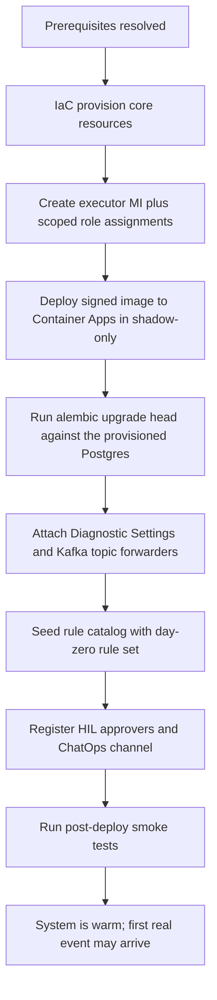

# Deploy and Onboard

How to provision FDAI into an Azure subscription and complete first-time onboarding
so the system is ready to observe. This file is authoritative for **the concrete deployment
inventory, the bootstrap sequence, and the fork ↔ core responsibility split**; the deployment
lifecycle (CI/CD, progressive delivery, rollback, DR) remains in
[deployment.md](deployment.md).

Azure focus: this document targets an Azure subscription. Non-Azure providers are TBD (see
[Implementation Focus](../../../.github/copilot-instructions.md#implementation-focus-must)).
All identifiers are synthetic per
[generic-scope.instructions.md](../../../.github/instructions/generic-scope.instructions.md).

> The day-zero service tiers and counts are decided in
> [Azure Resource Inventory](#azure-resource-inventory-minimum-set). A fork confirms the
> region, quota, retention, replica caps, and production tier overrides before deployment.
> The **execution engine is decided**: `terraform apply` against `infra/` (Terraform HCL).
> The planned operator entry point is the installable `fdaictl` facade, which keeps Terraform
> as the source of truth and submits plan and apply work to the approved runner. See
> [Installable Deployment CLI](installable-deployment-cli.md) and
> [Deployment Artifacts](#deployment-artifacts).

## Prerequisites

### Deployer Identity (Azure)

- Subscription-scoped **Owner** or **Contributor + User Access Administrator** on the target
  resource group - required to create the executor Managed Identity and its scoped role
  assignments.
- Ability to grant subscription-scoped roles matching the executor's **action whitelist**
  ([security-and-identity.md](../architecture/security-and-identity.md)).
- **TBD**: whether a purpose-built custom role packages the deployer permissions.

### Azure Prerequisites

- Region with confirmed availability of every service in the inventory below.
- Confirmed quota headroom (Container Apps cores, Event Hubs throughput units, PostgreSQL
  vCores, Key Vault operations).
- Diagnostic Settings destination (Log Analytics workspace) - new or existing; ownership TBD.
- **Private networking (policy-locked tenants).** Tenants that enforce "Key Vault public
  network access disabled" (common in enterprise / managed tenants) set
  `enable_private_networking = true`: the deploy provisions a VNet + a Key Vault private
  endpoint on `privatelink.vaultcore.azure.net` with a linked private DNS zone, binds the
  Container App Environment to a delegated infrastructure subnet, and locks the vault to
  private access. Because a private-only vault is unreachable from an operator laptop,
  `terraform apply` MUST then run from a host with VNet line-of-sight to the endpoint - a
  CI runner or a jumpbox inside the VNet (the executor writes the DSN secrets from there).
  ACR / Event Hubs / Postgres private endpoints reuse the same generic
  `modules/private-endpoint` module and are added the same way when a tenant restricts them
  too.

#### Ops/hub runner (private-everything tenants)

Some tenants force **every** data service private (Key Vault *and* storage), so even a
terraform remote-state backend is laptop-unreachable. The `infra/bootstrap` layer stands up
the durable hub that makes the deploy possible and survives app rebuilds:

- an **ops resource group + hub VNet** (`rg-fdai-ops-<region_short>` / `vnet-fdai-ops-...`)
  separate from the app RG, with a runner subnet and a private-endpoint subnet;
- a **terraform remote-state storage account** locked to private, fronted by a blob private
  endpoint on `privatelink.blob.core.windows.net` linked to the ops VNet;
- a **self-hosted deploy runner VM** (no public IP) with a system-assigned managed identity
  that holds `Contributor` on the app RG and `Storage Blob Data Contributor` on the state
  account. It is the only host with line-of-sight to the app's private endpoints.

The app config peers its spoke VNet to the ops hub (both directions) and links its private
DNS zones to the ops VNet via the `extra_vnet_links` seam, so the runner resolves the app's
Key Vault privately. The runner is the terraform apply principal, so the existing
`kv_officer_self` grant makes it `Key Vault Secrets Officer` on the app vault - it writes the
DSN secrets during apply. Deploys run through the [`deploy-dev` workflow](../../../.github/workflows/deploy-dev.yml)
on the `[self-hosted, fdai-deploy]` runner (plan-only by default; the `apply` input enforces).
Full runbook: [`infra/bootstrap/README.md`](../../../infra/bootstrap/README.md).

Scheduled drivers remain Terraform-owned through the `SCHEDULER_TICK_CRON_EXPRESSION` and
`ANALYZER_TICK_CRON_EXPRESSION` repository variables. Optional analyzer inputs use
`ANALYZER_TARGETS_JSON`, `ANALYZER_WINDOW_SECONDS`, and `ANALYZER_BUDGET_SECONDS`. An empty
cron disables its job. Before each plan, the workflow safely adopts a matching existing
scheduler or analyzer job when it isn't already in remote state. Subsequent image and
configuration changes then converge through the same plan and apply path.

#### Inventory discovery with restricted egress

Strong NSG egress control should keep the application subnet closed without disabling Azure
service discovery. During preflight, test managed-identity token acquisition, DNS, TLS to the
ARM management endpoint, one bounded Azure Resource Graph query, pagination, and publication
to the private projection from the actual discovery subnet.

If direct ARG access is blocked, run the read-only collector on the VNet-integrated ops runner
or a Container Apps Job with the approved hub management path. Then fall back in order to a
validated Resource Management Private Link route, sharded ARM list operations, an
authoritative scoped Azure inventory, Activity Log continuity, and finally a signed
declarative recovery snapshot. A failed path retains the last complete graph and marks it
stale; it never publishes an empty graph. The complete network matrix, source precedence,
coverage manifest, and autonomy degradation rules are defined in
[Azure inventory under restricted NSG egress](../architecture/csp-neutrality.md#azure-inventory-under-restricted-nsg-egress).

#### Onboarding automation

Five helpers make the runner path repeatable (all customer-agnostic, parameterized):

- [`preflight-policy-check.sh`](../../../infra/bootstrap/preflight-policy-check.sh) probes a
  throwaway KV + storage to tell you up front whether the tenant forces private-everything
  (and thus mandates the runner path).
- [`onboard.sh`](../../../infra/bootstrap/onboard.sh) runs create-state-account -> bootstrap
  apply -> prints the GitHub Actions config (idempotent).
- [`set-gh-actions-config.sh`](../../../scripts/deployment/azure/set-gh-actions-config.sh) sets the repo
  Variables + Secrets from the bootstrap outputs (password generated + piped, never printed).
- [`register-runner.sh`](../../../infra/bootstrap/register-runner.sh) mints a runner token and
  registers the VNet runner over `run-command`.
- [`teardown-env.sh`](../../../scripts/deployment/azure/teardown-env.sh) deallocates/starts the runner (cost) and
  guards a per-env `terraform destroy` that never touches the ops hub or state account.

#### Production hardening knobs

All default to the dev posture (the live env is unchanged) and tighten via tfvars per env
(see [`staging.tfvars.example`](../../../infra/envs/staging.tfvars.example) /
[`prod.tfvars.example`](../../../infra/envs/prod.tfvars.example)):

| Concern | Knob | Prod value |
|---------|------|------------|
| Delete protection | `enable_resource_locks`, bootstrap `enable_state_lock` | `true` |
| Key Vault | `kv_purge_protection_enabled`, `kv_soft_delete_retention_days` | `true`, `90` |
| Postgres network | `enable_private_postgres` | `true` |
| Postgres durability | `postgres_backup_retention_days`, `postgres_geo_redundant_backup` | `35`, `true` |
| Postgres availability | `postgres_high_availability_mode` | `ZoneRedundant` |
| HIL delivery | `enable_chatops_hil`, `chatops_webhook_url`, `chatops_webhook_secret` | enabled + CI secrets |
| Registry | `acr_sku` | `Premium` |
| Monitoring | `enable_monitoring`, `alert_email`, `alert_webhook_url` | on + destination |
| Cost | `monthly_budget_amount`, `budget_alert_emails`, bootstrap `runner_auto_shutdown_time` | set |

`enable_private_postgres` adds a dedicated subnet delegated to PostgreSQL Flexible Server,
links a private DNS zone to the app and ops VNet, disables public access, and removes the
`AllowAllAzureServices` firewall rule. Turning it on for an existing public server may replace
that server, so review the plan and rehearse backup/restore before promotion. The assertions in
`infra/production-gates.tf` block a production plan until the signed image digest, private
networking, durability, alert destination, and cost budget minimums are supplied.

CI adds two credential-free guards: [`infra-lint.yml`](../../../.github/workflows/infra-lint.yml)
(fmt + validate + tfsec + Checkov on every infra PR) and
[`infra-drift.yml`](../../../.github/workflows/infra-drift.yml) (scheduled `plan -detailed-exitcode`
on the runner - a red run means live infra drifted from code). Monitoring, when enabled,
provisions an action group + metric alerts (Postgres / Key Vault / Event Hubs / Container App)
+ diagnostic settings to Log Analytics; alerts are a human signal only, never an autonomous
action.

### Non-Azure Prerequisites

- A **GitOps host** (GitHub or Azure DevOps organization) with an installed GitHub App or
  service connection scoped to the catalog + fork repos.
- A **Teams tenant** with a group-connected team for HIL approvals (Teams is the default A1 primary - see [channels-and-notifications.md](../interfaces/channels-and-notifications.md)).
- A **Slack workspace** with the FDAI Slack app installed and the mandatory userId ↔ Entra OID mapping store provisioned; required for the P1 Slack A1 channel ([channels-and-notifications.md#7-channel-specific-notes](../interfaces/channels-and-notifications.md#7-channel-specific-notes)).
- A **container registry** (ACR or an external registry) that supports signature +
  attestation storage.
- **OpenTelemetry backend**: Log Analytics with Application Insights bound to the workspace.
  A fork may replace the backend through the telemetry provider contracts, but the Azure
  day-zero inventory does not leave this choice open.

## Deployment Artifacts

- IaC in `infra/` (see [project-structure.md](../architecture/project-structure.md)) is the entry point. Every
  environment is provisioned identically from the same code with per-environment parameters
  and per-environment isolated state.
- **Entry command**: `terraform apply` against the `infra/` Terraform (HCL) modules - resolves
  the previous OD (`azd up` vs `terraform apply` vs a wrapper). Environment values are supplied
  via `*.tfvars` files that are **never committed** (per
  [generic-scope.instructions.md](../../../.github/instructions/generic-scope.instructions.md));
  the planned [`fdaictl`](installable-deployment-cli.md) wrapper orchestrates
  `init -> plan -> preflight -> remote apply -> post-provision checks`, while Terraform remains
  the execution engine and infrastructure source of truth. Bicep and OpenTofu remain compatible
  fallbacks per [tech-stack.md](../architecture/tech-stack.md).
- Same signed image is promoted `dev → staging → prod`; nothing is rebuilt per environment
  ([deployment.md](deployment.md)).

## Resource Naming Convention

Every Azure resource this repo provisions follows the **Microsoft Cloud Adoption Framework
(CAF)** abbreviation convention. Names are deterministic, deployment-agnostic, and safe to
grep for - a rename is a Terraform diff, never a hand-edit.

Pattern:

```
<caf-prefix>-<workload>[-<component>][-<env>][-<region>][-<instance>]
```

- **workload** is the fixed literal `fdai` (product name, not a customer identifier -
  allowed under [generic-scope.instructions.md](../../../.github/instructions/generic-scope.instructions.md)).
- **component** is added only when one resource kind is provisioned more than once
  (e.g. `ca-fdai-core` vs a future `ca-fdai-worker`).
- **env** (`dev`/`staging`/`prod`) and **region** (`krc`/`weu`/`eus`) suffixes are added only
  when the resource is deployed side-by-side; the day-zero deployment keeps names
  suffix-free.
- **instance** (`01`, `02`, ...) is added only when multiple copies exist in one env.

The default **resource group** is `rg-fdai` (fixed by user directive). Everything the
system provisions lives under that RG unless a resource type requires a subscription-scope
placement (none today).

### CAF prefixes for the day-zero inventory

| Resource | CAF prefix | Char rules | Example name |
|----------|------------|------------|--------------|
| Resource Group | `rg-` | 1-90; alphanumerics + hyphens/underscores | `rg-fdai` |
| User-assigned Managed Identity | `id-` | 3-128 | `id-fdai-executor` |
| Container Apps environment | `cae-` | 2-32; alphanumerics + hyphens | `cae-fdai` |
| Container App (core) | `ca-` | 2-32 | `ca-fdai-core` |
| Container Apps Job (out-of-band) | `caj-` | 2-32 | `caj-fdai-oob` |
| Event Hubs namespace | `evhns-` | 6-50 | `evhns-fdai` |
| PostgreSQL Flexible Server | `psql-` | 3-63; lowercase | `psql-fdai` |
| Key Vault | `kv-` | 3-24; alphanumerics + hyphens | `kv-fdai` |
| **Container Registry (ACR)** | `cr` | 5-50; **alphanumeric only, no hyphens** | `crfdai` |
| Log Analytics workspace | `log-` | 4-63 | `log-fdai` |
| Azure Bot (HIL Adaptive Cards) | `bot-` | 2-64 | `bot-fdai` |
| Static Web App (read-only console) | `stapp-` | 2-40 | `stapp-fdai` |

### Length-safety rules (MUST)

- **ACR names never contain hyphens**; the prefix `cr` is fused with the workload token
  (`crfdai`). When env/region suffixes join, do NOT reintroduce hyphens - use one
  continuous lowercase alphanumeric string (e.g. `crfdaidevkrc01`).
- **Storage account** (if ever added) is 24-char lowercase alphanumeric only - same
  no-hyphen rule (`stfdai...`).
- If a legal name exceeds the character limit after adding env/region/instance, use the
  documented short-name `aip` in place of `fdai` - and only for that resource kind.
  Do not sprinkle `aip` where the full name still fits.

### What this rule forbids

- **No random or opaque suffixes** in Terraform (`crfdaicyutlgcnv3` from a hash source
  is a review blocker). Determinism is a debugging tool.
- **No customer names or environment values baked into the identifier** - those live in
  `*.tfvars` and the tag map, never in the resource name.
- **No inline naming logic in Python** - the app reads whatever it is handed via env vars;
  the name is decided in `infra/` at plan time.

## Resource Tagging Convention

Naming makes a resource *readable*; tagging makes a fleet *queryable*. Every resource this
repo provisions carries a small, machine-parseable tag set. All FDAI-owned keys are
namespaced under the `fdai:` prefix so the whole set is grep-able and FDAI-provisioned
resources are unambiguous even in a **shared subscription** where other teams' resources
sit side by side. The tag map is decided in Terraform (`infra/main.tf` `base_tags`), never
computed in Python.

### Base tag set (applied to every resource)

| Tag key | Value | Source | Purpose |
|---------|-------|--------|---------|
| `fdai:managed` | `true` | constant | **Ownership marker.** The single authoritative "FDAI provisioned this" flag. `az resource list --tag fdai:managed=true` enumerates exactly what FDAI owns - the basis for blast-radius scoping, cleanup/audit cross-checks, and cost attribution. |
| `fdai:workload` | `fdai` | `var.workload` | Product/workload token; mirrors the CAF name token. |
| `fdai:env` | `day-zero` / `dev` / `staging` / `prod` | `var.env` | Environment. `day-zero` is the unqualified deployment. |
| `fdai:layer` | `control-plane` / `ops-bootstrap` | per-config | Architectural layer - the app spoke (`infra/main.tf`) vs the ops/hub bootstrap (`infra/bootstrap`). |
| `fdai:managed-by` | `terraform` | constant | Provisioning tool. |
| `fdai:vertical` | `shared` / `resilience` / `change-safety` / `cost-governance` | `var.cost_vertical` (default `shared`) | AIOps vertical the resource's cost is attributed to. Cross-vertical control-plane infra stays `shared`; per-vertical resources (e.g. the three executor MIs) override this key. |

### Why `fdai:managed` matters

The executor may run inside a subscription that also hosts resources FDAI does **not** own.
The ownership marker is what lets the control plane draw that boundary - it is the query key
these capabilities rely on, not a behavior any single script hardcodes:

- **Blast-radius scoping** - the safety invariant that an autonomous action must bound its
  target set is expressed against `fdai:managed=true`, so a remediation can be constrained to
  resources FDAI created and never reach one it did not.
- **Cleanup and audit** - `terraform destroy` already removes the provisioned fleet by state;
  the marker is the out-of-band cross-check that lets a sweep or audit confirm a resource
  belongs to FDAI before it is ever considered for deletion.
- **Cost attribution** - Cost Management and Resource Graph can group spend by `fdai:vertical`
  and isolate the total FDAI footprint as the `fdai:managed=true` slice.

### Fork-supplied tags (`additional_tags`)

Customer- and environment-specific keys are **never** hardcoded in `base_tags` (that would
break [generic-scope](../../../.github/instructions/generic-scope.instructions.md)). A fork
supplies them via the `additional_tags` map in its `*.tfvars`, keeping the `fdai:` namespace:

```hcl
additional_tags = {
  "fdai:cost-center"        = "cc-1234"
  "fdai:owner"              = "team-platform"
  "fdai:criticality"        = "high"
  "fdai:data-classification" = "internal"
}
```

`additional_tags` is merged on top of `base_tags`, so a fork can also override a base value
(e.g. pin `fdai:vertical`) without editing core.

### Per-resource overrides

A module invocation MAY narrow a single key with a local `merge` - e.g. the per-vertical
executor MIs set `merge(local.tags, { "fdai:vertical" = "resilience" })`. Use the same
`fdai:` namespace so a resource never carries two competing keys for one concept. Reserve
`fdai:component` for the CAF component token when one resource kind is provisioned more than
once (e.g. `core` vs `worker`), mirroring the naming convention above.

### Rules

- **All FDAI keys use the `fdai:` namespace.** A bare `env` or `vertical` key is a review
  blocker - it collides with other teams and defeats the grep-ability guarantee.
- **No customer or secret values in `base_tags`** - those live in `additional_tags` from
  `*.tfvars`, exactly like resource names.
- **Values are stable and lowercase** where they feed a query (`true`, `dev`, `resilience`);
  Cost Management and Resource Graph group on the literal, so drift breaks aggregation.

## Azure Resource Inventory (minimum set)

The inventory is deliberately minimized for **cost-efficiency first**. Every choice below is
driven by the [Cost-Efficiency Principles](#cost-efficiency-principles) at the end of this
document. The inventory is rendered from the four CSP-neutral contracts (event bus, runtime,
secret, workload identity) defined in [csp-neutrality.md](../architecture/csp-neutrality.md); Azure is
today's realization of each contract. Concrete tier values, exact names, region, and per-app
replica caps are still **fork-specific** and tuned per environment; the shape is stable.

| # | Resource | Tier | Purpose | Notes |
|---|----------|------|---------|-------|
| 1 | **Container Apps environment** | Consumption | shared serverless compute host | one environment shared by the core app and scheduled jobs; realizes the [Runtime contract](../architecture/csp-neutrality.md#2-runtime-contract--oci-image--knative-compatible-manifest) |
| 2 | **Container App** (unified core) | 1 app, `minReplicas: 1`, max 3 by default | one modular process composes `event-ingest`, `trust-router`, `executor`, and `audit` | Kafka-lag scale-to-zero remains deferred until credential-free scaler authentication is verified; see [Compute Shape](#compute-shape-single-modular-process) |
| 3 | **Container Apps Job** | Consumption | scheduled probes and out-of-band change detection | replaces Azure Functions; shares the environment |
| 4 | **Event Hubs namespace** | Standard (1 TU, auto-inflate off) | Kafka-wire event bus (endpoint on `:9093`) | realizes the [Event Bus contract](../architecture/csp-neutrality.md#1-event-bus-contract--kafka-wire-protocol); DLQ is a Kafka `<topic>.dlq` convention, not a native DLQ resource |
| 5 | **Diagnostic Settings + `azure-events`-style forwarders** | included with Log Analytics / Activity Log | forward Activity Log / resource events into an Event Hubs Kafka topic | replaces standalone Event Grid system topics; the core sees Kafka only |
| 6 | **PostgreSQL Flexible Server** | Dev: Burstable **B1ms**, HA disabled, 7-day backup; prod: zone-redundant HA, 35-day geo backup | audit + KPI + pattern library + **pgvector** T1 embeddings, single store | production plan fails unless `postgres_high_availability_mode=ZoneRedundant` |
| 7 | **Key Vault** | Standard | secret backend consumed via **Container Apps native secret + Key Vault reference** - realizes the [Secret contract](../architecture/csp-neutrality.md#3-secret-contract--environment--k8s-secret) | Premium (HSM) not required; app never calls a secret SDK |
| 8 | **User-assigned Managed Identity** | - | executor's least-privilege, action-whitelisted identity; realizes the [Workload Identity contract](../architecture/csp-neutrality.md#4-workload-identity-contract--oidc-token) | Phase 1 ships **one** MI (`mi-aw-executor`) using built-in role composition, RG-scoped; Phase 3 splits into per-domain MIs - see [security-and-identity.md § Identity Mapping (Phased)](../architecture/security-and-identity.md#identity-mapping-phased) |
| 9 | **Log Analytics workspace** | Pay-as-you-go, **30-day default retention** | traces / metrics / logs / audit-forward; App Insights binds to it | retention is **UI-configurable** post-deploy, defaulting to 30 days |
| 10 | **Container Registry (ACR)** | Basic (Standard if geo-replication needed later) | signed images + build attestations | pin by digest, never a mutable tag |
| 11 | **Azure OpenAI / AI Foundry account** (**opt-in**, `var.enable_llm`) | Standard | T1 embedding + T2 mixed-model reasoner deployments (one per capability from `resolved-models.json`) | provisioned only when the deployer holds `Cognitive Services Contributor` on the sub AND the region exposes the preferred family; otherwise the affected capabilities degrade to **`hil-only`** (see [dev-and-deploy-parity.md § Deployer-Scoped LLM Provisioning](dev-and-deploy-parity.md#deployer-scoped-llm-provisioning)). Never deployed in `dev` mode - dev-mode binds deterministic fakes. |
| 12 | **ADLS Gen2 document account** (**opt-in**, `enable_document_ingestion`) | StorageV2 Standard ZRS, HNS | private quarantine, immutable governed versions, derived envelopes | Shared Key and public access disabled in private mode; soft delete + lifecycle; `blob` and `dfs` private endpoints |
| 13 | **Document ingestion Container App** (**opt-in**) | Consumption, gateway + ClamAV sidecar | authenticated bounded upload relay, safety scan, extraction, pgvector indexing, lifecycle events | dedicated UAMI; external HTTPS gateway cannot access executor permissions; durable worker consumes document lifecycle records from shared `aw.pipeline.stages` |
| 14 | **Control-loop canary Job** | Consumption, every 5 minutes | publishes one idempotent event to `aw.control.canary` | dedicated UAMI has only ACR pull and Event Hubs send; the core records a no-op audit through a separate consumer path |

Additional required elements that **do not incur a billable Azure resource of their own**:

- **App registrations × 3** - split audiences per
  [user-rbac-and-identity.md#41-app-registrations](../interfaces/user-rbac-and-identity.md#41-app-registrations):
  `fdai-console-spa` (SPA sign-in, PKCE), `fdai-api` (Web API audience for
  console + ChatOps backend), and `fdai-approval-bot` (Teams SSO). None hold the
  executor identity. Step-by-step `az` creation:
  [../runbooks/entra-app-registration.md](../../runbooks/entra-app-registration.md).
  After a console apply, the deploy workflow safely retries an idempotent sync
  of the Terraform-emitted Static Web App origin into the target tenant's SPA
  redirect URIs. A tenant mismatch or missing Graph permission blocks the
  deployment rather than shipping a console that cannot sign in.
- **Entra security groups × 5** - `aw-readers`, `aw-contributors`, `aw-approvers`,
  `aw-owners`, `aw-break-glass`. Fork-owned; objectIds injected via config and validated at
  startup ([user-rbac-and-identity.md#42-security-groups-slots](../interfaces/user-rbac-and-identity.md#42-security-groups-slots)).
- **Conditional Access policies** - phishing-resistant MFA on `aw-approvers`/`aw-owners`,
  compliant-device on `aw-owners`, dedicated hardware token + sign-in alert on
  `aw-break-glass`. Available on Entra ID P1
  ([user-rbac-and-identity.md#43-conditional-access](../interfaces/user-rbac-and-identity.md#43-conditional-access)).
- **Azure Bot (Free tier)** - Teams Adaptive Cards for HIL approvals.
- **Signed HIL webhook** - production supplies the URL and a 32+ character HMAC secret through
  CI secrets. Terraform stores both in Key Vault; the core reads URL + secret and the read API
  receives only the callback secret.
- **Topic-scoped Event Hubs roles** - the executor receives Data Owner on each currently
  provisioned hub entity, not the namespace. Inventory and canary can send only to their own
  topics. The read API command identity sends proposals/HIL decisions and receives the stage
  topic. Document ingestion is limited to `aw.pipeline.stages`.
- **Static Web Apps (Free tier)** - read-only console hosting; free tier covers the intended
  bandwidth.
- **Workload identity federation** - CI/CD short-lived OIDC tokens; not a resource, no cost.

### Document ingestion deployment

Set `enable_document_ingestion=true` only with `enable_llm=true`, a resolved
`t1.embedding` capability, the console API audience, all five Entra RBAC group ids, and explicit
ingestion CORS origins. Terraform then provisions:

- a dedicated ingestion UAMI with only ACR pull, Key Vault DSN read, Event Hubs send, ADLS data,
  and Azure OpenAI invoke roles;
- a StorageV2 account with HNS, the `documents` and `derived` filesystems, quarantine expiry,
  derived-data cool tiering, soft delete, and no Shared Key;
- `blob` and `dfs` private endpoints. The app VNet links to the endpoint zones; the ops runner
  resolves Blob through an A record in its existing central Blob zone, while the DFS zone links
  to both VNets. This avoids linking one VNet to duplicate zones with the same namespace;
- an ingestion Container App with the FDAI gateway and replica-local ClamAV sidecar;
- a manual migration job that applies the document metadata and pgvector schema before traffic.

The `deploy-dev` workflow exposes `deploy_document_ingestion`. Plan remains the default. An apply
runs the ingestion migration job and publishes `ingestion_gateway_fqdn`; build the console with
`VITE_INGESTION_API_BASE_URL=https://<fqdn>`. Production gates require private networking and
digest-pinned FDAI plus ClamAV images.

The public Static Web App never reaches ADLS directly. It streams through the authenticated
gateway because the Storage account stays private. The gateway uses Managed Identity for ADLS,
Event Hubs, and Azure OpenAI; no connection string or Storage account key is created.

Explicitly **not provisioned** on day zero (deferred to a later phase when a measured need
justifies them):

- **Service Bus namespace and Event Grid custom topics** - the event bus is the Kafka
  endpoint on Event Hubs ([csp-neutrality.md § Event Bus Contract](../architecture/csp-neutrality.md#1-event-bus-contract--kafka-wire-protocol));
  Activity Log / resource events are forwarded via Diagnostic Settings into an Event Hubs
  Kafka topic. Event Grid system topics remain available as a signal *source*, but no
  standalone Event Grid resource is provisioned when Diagnostic-Settings forwarding covers
  the need.
- Dedicated vector database (pgvector inside PostgreSQL suffices at initial scale).
- Front Door, Application Gateway, API Management (no public inbound endpoint; console is
  read-only static hosting).
- Secondary-region resources for DR (Phase 4 - TBD; see
  [Implementation Focus](../../../.github/copilot-instructions.md#implementation-focus-must)).
- Separate Application Insights resource (it binds to the shared Log Analytics workspace).

### Compute Shape (single modular process)

The core currently deploys as one signed image and one Python process inside one Container App.
Code-level subsystem boundaries remain explicit through Protocols and the composition root; there
is no undocumented localhost IPC or sidecar image lifecycle.

- **Runtime**: `python -m fdai` starts the Kafka consumer and composes routing, quality, risk,
  execution, and audit stages in one process.
- **Health**: internal `/live` and `/ready` probes open only after the authoritative control loop
  is assembled. The app exposes no public ingress.
- **Replica floor**: the default is one replica. A zero floor without a verified Kafka scaler
  would never wake on Event Hubs data, so Terraform does not claim scale-to-zero.
- **Graduation rule**: split a subsystem into another Container App only after measured load or
  privilege isolation requires an independent scale unit and a typed transport is available.
- **Identity split**: the separate read API attaches a read UAMI and a command-transport UAMI;
  Event Hubs send/receive does not belong to the read principal.

## Bootstrap Sequence

Provisioning is IaC-driven, but the **logical bootstrap order** to a first live event MUST be
honored. Any earlier stage failing halts and unwinds; the deployment does not proceed to a
later stage with a broken earlier one.



- **Shadow-only on first deploy**: no rule / action starts in enforce mode, ever. Promotion is
  a separate act ([rule-governance.md](../rules-and-detection/rule-governance.md)).
- **Migrations MUST run before the first control-loop tick**. The Container App itself does
  not migrate on start (to keep replicas identical + prevent races). Run
  `alembic upgrade head` from a workstation or a CI job that can reach the provisioned
  Postgres FQDN with the admin DSN. The 6 migrations under `alembic/versions/` are
  reversible - a broken deploy can `alembic downgrade -1` back to the prior baseline.
- Post-deploy smoke tests and the synthetic canary are defined in
  [operating-and-verification.md](../operations/operating-and-verification.md).

## Fork vs Core Responsibility Matrix

The upstream repo (this repo) ships everything **customer-agnostic**. A per-customer **fork**
provides values, secrets, and any customer-specific bindings via dependency injection at the
composition root - never by editing `core/`
([generic-scope.instructions.md](../../../.github/instructions/generic-scope.instructions.md)).

| Concern | Upstream (this repo) | Fork (per-customer) |
|---------|----------------------|---------------------|
| IaC modules | parameterized modules, no environment values | environment tfvars, secret references |
| Provider adapters | Azure adapter interfaces + Azure implementation | fork MAY override an implementation via DI |
| Rule catalog seed | no seeded rules | day-zero seed set + custom rules |
| Assignments and overrides | none | tenant/RG-scoped assignments, RG-scoped overrides |
| HIL approver list | not committed | Teams channel id, approver group ids |
| MSAL / OIDC config | schema + envelope | client ids, tenant id, redirect URIs |
| Model endpoints (T2) | interface + capability config + bootstrap resolver + weekly reconciler ([llm-strategy.md § Model Provisioning and Lifecycle](../architecture/llm-strategy.md#model-provisioning-and-lifecycle)) | `rule-catalog/llm-registry.yaml` overrides, mixed-model mode (`azure-foundry` / `external` / `hil-only`), Azure OpenAI or Foundry resource values |
| Runtime config values | key schema (no values) | env vars + Key Vault refs |

## Runtime Configuration Matrix

All values MUST come from env vars or Key Vault refs at runtime. **No environment value is
committed to this repo.** The list below is the **schema of keys** the deployment expects; the
full expanded catalog and defaults are authored during the inventory PR.

| Key | Source | Owner | Notes |
|-----|--------|-------|-------|
| `AZURE_TENANT_ID` | env | fork | non-secret |
| `AZURE_SUBSCRIPTION_ID` | env | fork | non-secret |
| `AZURE_RG` | env | fork | target resource group |
| `KAFKA_BOOTSTRAP_SERVERS` | env | fork | Event Hubs Kafka endpoint (`<ns>.servicebus.windows.net:9093`); realizes the [Event Bus contract](../architecture/csp-neutrality.md#1-event-bus-contract--kafka-wire-protocol) |
| `KAFKA_SECURITY_PROTOCOL` | env | fork | `SASL_SSL` on Azure; provider-specific value elsewhere |
| `KAFKA_SASL_MECHANISM` | env | fork | `OAUTHBEARER` on Azure |
| `KEYVAULT_URL` | env | fork | executor MI has GET on secrets |
| `FDAI_STATE_STORE_DSN` | KV ref | upstream | Postgres connection URI for audit + KPI; wired by `infra/main.tf` `azurerm_key_vault_secret.state_store_dsn` from `module.state_store.application_dsn`, exposed to the Container App via `secret{}` + `env{}` (see [project-structure.md](../architecture/project-structure.md) `infra/modules/compute/container-apps/`). Empty at runtime => in-memory fallback. |
| `FDAI_OPERATOR_MEMORY_DSN` | KV ref | upstream | Postgres DSN for HIL-approved operator memory. Same source as `FDAI_STATE_STORE_DSN` day-zero (single Flexible Server); a fork MAY split it later without touching core code. |
| `FDAI_T1_PATTERN_LIBRARY_DSN` | KV ref | upstream | Postgres DSN for the pgvector-backed T1 pattern library. Same source day-zero; wired identically. |
| `FDAI_INVENTORY_DSN` | KV ref | upstream | PostgreSQL DSN used only by the scheduled inventory collector to stage immutable candidates and atomically promote the active graph. |
| `FDAI_INVENTORY_SCOPES` / `FDAI_INVENTORY_RESOURCE_TYPES` | env | fork | Comma-separated subscription scopes and optional CSP-neutral resource-type subset. Empty scope fails startup. |
| `FDAI_INVENTORY_SOURCES` | env | upstream | Ordered fallback list: `arg,arm` by default; `declarative` is accepted only with a fixture path and SHA-256. |
| `FDAI_INVENTORY_MANAGEMENT_ENDPOINT` / `FDAI_INVENTORY_MANAGEMENT_AUDIENCE` | env | fork | Validated HTTPS ARM root and OIDC audience pair. Override both for an approved sovereign-cloud or validated Resource Management Private Link path. |
| `FDAI_INVENTORY_FRESHNESS_SECONDS` | env | upstream | Maximum active snapshot age before the projection becomes stale and graph-dependent autonomy degrades to human review. Default `86400`. |
| `FDAI_ANALYZER_TARGETS` / `FDAI_ANALYZER_WINDOW_SECONDS` / `FDAI_ANALYZER_BUDGET_SECONDS` | env | fork / upstream | Optional explicit analyzer targets and bounds. When targets are empty, the analyzer Job discovers supported resource kinds from the active inventory through `FDAI_INVENTORY_DSN`. |
| `KAFKA_TOPIC_EVENTS` | env | fork | primary event ingest topic |
| `KAFKA_TOPIC_DLQ_SUFFIX` | env | fork | dead-letter suffix (default `.dlq`) |
| `TEAMS_HIL_CHANNEL_ID` | env | fork | HIL routing |
| `T2_MODEL_ENDPOINT` | env | fork | primary reasoner - populated by the bootstrap resolver from `rule-catalog/llm-registry.yaml`; see [llm-strategy.md § Model Provisioning and Lifecycle](../architecture/llm-strategy.md#model-provisioning-and-lifecycle) |
| `T2_MODEL_ENDPOINT_CROSSCHECK` | env | fork | mixed-model cross-check target - distinct publisher enforced at bootstrap |
| `LLM_MODE` | env | fork | `local-fake` (default in `dev`) or `azure`. Governs the composition-root binding; see [dev-and-deploy-parity.md § Parity Contract](dev-and-deploy-parity.md#parity-contract-must). |
| `LLM_RESOLVED_MODELS_PATH` | KV ref | fork | required when `LLM_MODE=azure`; points at the `resolved-models.json` written by the bootstrap resolver |
| `RULE_CATALOG_REF` | env | fork | git ref of catalog snapshot |
| `AUTONOMY_MODE_DEFAULT` | env | fork | MUST default to `shadow` |
| `FDAI_LOG_LEVEL` | env | upstream | Python logger level for the core app (`DEBUG` / `INFO` / `WARNING` / `ERROR`). Default `INFO`. |
| `FDAI_READ_API_DEV_MODE` | env | dev-only | `1` bypasses Entra JWT validation in the read API for local dev. MUST NOT be set in staging / prod. |
| `FDAI_READ_API_LOCAL_ENTRA` | env | dev-only | `1` runs the local seed harness with **real** Entra JWT verification (requires `FDAI_ENTRA_TENANT_ID` + `FDAI_API_AUDIENCE`) so sign-in can be tested locally. Mutually exclusive with dev-mode; MUST NOT be set in staging / prod. |
| `FDAI_LOCAL_SCENARIO_REPLAY` | env | dev-only | Unset by default, leaving Live and Agents streams quiet. Set to `1` only for an explicit generated-scenario demo; never set it in staging / prod. |
| `FDAI_LOCAL_AZURE_DISCOVERY` | env | dev-only | `1` replaces the synthetic local Architecture graph with read-only Azure CLI discovery. Requires an explicit local subscription id. |
| `FDAI_LOCAL_AZURE_SUBSCRIPTION_ID` | env | dev-only | Subscription passed to every local `az group/resource list` call when local Azure discovery is enabled. Never commit a populated value. |
| `FDAI_LOCAL_AZURE_CONFIG_DIR` | env | dev-only | Optional isolated Azure CLI profile. When omitted, the adapter removes an inherited `AZURE_CONFIG_DIR` and uses the default profile. |
| `FDAI_POLICIES_ROOT` | env | fork | absolute path to the OPA / Rego bundle root consumed by T0 and the verifier. Defaults to the in-repo `policies/` when unset. |
| `FDAI_MI_CLIENT_ID` | env | upstream | User-assigned MI client id for the current process. The core receives the executor id; the inventory job receives its distinct read-only discovery id. |
| `FDAI_MEASUREMENT_MODE` | env | upstream | `shadow` (default) or `enforce` - governs the Container Apps Jobs runners in `infra/modules/measurement-runners/`. |
| `FDAI_DIRECT_API_FAKE` | env | dev-only | `1` swaps the executor direct-API path for the in-memory fake; used by tests and local dev. |
| `FDAI_TOOL_CALL_FAKE` | env | dev-only | `1` swaps the executor tool-call path for the in-memory fake (`RecordingToolExecutor`); used by tests and local dev. |
| `FDAI_WORKFLOW_SHADOW` | env | upstream | `1` enables event-triggered catalog Workflows in non-mutating shadow mode. The Azure core app sets it by default. |
| `FDAI_IRP_ENABLED` / `FDAI_IRP_BUDGET_SECONDS` | env | upstream | Enables alert-shaped event handling through the budgeted investigation -> typed proposal path. The proposal re-enters the standard risk/HIL/executor loop. |
| `FDAI_CHAOS_CONTEXT_JSON` / `FDAI_CHAOS_ENFORCE` | env | fork | Runtime context for promoted chaos injectors. Enforce stays disabled unless the explicit flag is `1`, the scenario is promoted, and both injector and probe are registered. |
| `FDAI_JIRA_BASE_URL` / `FDAI_JIRA_ACCOUNT_EMAIL` / `FDAI_JIRA_API_TOKEN_SECRET` / `FDAI_JIRA_TOOL_MAP_JSON` | env + KV ref | fork | Configures the production `JiraToolExecutor`. `TOOL_MAP_JSON` maps `tool.open-incident-ticket` to a Jira project key. The token value is resolved from `FDAI_SECRET_<API_TOKEN_SECRET>` (KV-backed); never place the token in the mapping. Requires `FDAI_STATE_STORE_DSN` for the durable Jira ledger and distributed resource lock. |
| `FDAI_JIRA_ENFORCE` | env | fork | Default unset/`0` keeps Jira shadow-only. `1` permits enforce requests only after the ActionType promotion gate and risk/HIL decision also permit enforce. Shadow receipts are never linked as real incident tickets. |
| `FDAI_PROFILE_ID` | env | fork | selects one profile from `rule-catalog/profiles/` (see [rule-catalog-profiles.md](../rules-and-detection/rule-catalog-profiles.md)). **Composition-root wiring pending** as of 2026-07. |
| `FDAI_NARRATOR_PROVIDER` / `FDAI_NARRATOR_BASE_URL` / `FDAI_NARRATOR_MODEL` / `FDAI_NARRATOR_API_VERSION` / `FDAI_NARRATOR_API_KEY` | env + KV ref | fork | Operator-console narrator translator config (see [operator-console.md](../interfaces/operator-console.md)); `API_KEY` MUST go through KV. Empty provider = deterministic fallback. |
| `FDAI_CHATOPS_APPROVE_CALLBACK_URL` / `FDAI_CHATOPS_REJECT_CALLBACK_URL` / `FDAI_CHATOPS_WEBHOOK_SECRET` / `FDAI_CHATOPS_TIMEOUT_SECONDS` | env + KV ref | fork | Chatops HIL callback endpoints and the shared webhook secret; the secret MUST go through KV. Setting the secret enables the production callback route and durable Postgres decision registry. |
| `FDAI_KAFKA_BOOTSTRAP_SERVERS` / `FDAI_HIL_DECISION_TOPIC` | env | fork / upstream | Event Hubs Kafka endpoint used by the read API to publish durable HIL decision receipts; topic defaults to `aw.hil.decisions`. Core consumes the same topic and owns resume/execution. |
| `FDAI_GITOPS_API_BASE` / `FDAI_GITOPS_DEFAULT_BRANCH` / `FDAI_GITOPS_BRANCH_PREFIX` / `FDAI_GITOPS_TIMEOUT_SECONDS` | env | fork | `gitops-pr` adapter target repo config (GitHub App / Azure DevOps). Auth secrets flow through the platform's App installation, not env vars. |
| `FDAI_GITOPS_TOKEN` / `FDAI_GITOPS_OWNER` / `FDAI_GITOPS_REPO` / `FDAI_GITHUB_WORKFLOW_TOOLS_ENFORCE` | KV ref + env | fork | Binds the GitHub change feed and workflow tools for fix/release/security/incident/IRP artifacts. The enforce flag never bypasses the ActionType promotion and risk/HIL gates. |
| `FDAI_RBAC_READERS_GROUP_ID` / `FDAI_RBAC_CONTRIBUTORS_GROUP_ID` / `FDAI_RBAC_APPROVERS_GROUP_ID` / `FDAI_RBAC_OWNERS_GROUP_ID` / `FDAI_RBAC_BREAK_GLASS_GROUP_ID` | env | fork | Entra ID group object ids for the five human roles (see [user-rbac-and-identity.md](../interfaces/user-rbac-and-identity.md)). Unset group = role unassigned. |
| `FDAI_ENTRA_TENANT_ID` / `FDAI_API_AUDIENCE` | env | fork | Required for the production read-API Entra JWT verifier (`EntraJwtVerifier`): the fork's tenant id and the `fdai-api` App ID URI (`api://<fdai-api-guid>`). See [user-rbac-and-identity.md#102-api-token-validation](../interfaces/user-rbac-and-identity.md#102-api-token-validation). |
| `FDAI_ENTRA_ISSUER` / `FDAI_ENTRA_JWKS_URI` | env | fork | Optional verifier overrides; default to the tenant's v2 issuer + public key set. Set `ISSUER` to `https://sts.windows.net/<tenant>/` for a v1-token app; override `JWKS_URI` only for sovereign / air-gapped clouds. |
| `FDAI_EXECUTOR_PRINCIPAL_ID` / `FDAI_EXECUTOR_EVENT_ROLE_DEFINITION_ID` / `FDAI_EXECUTOR_SECRET_ROLE_DEFINITION_ID` | env | upstream | Read-API onboarding probe inputs. The probe uses ARG to verify the provisioned resource set and the executor's Event Hubs / Key Vault roles. |
| `FDAI_DR_DRILL_SOURCE_SERVER_ARM_ID` / `FDAI_DR_DRILL_TARGET_LOCATION` / `FDAI_DR_DRILL_TARGET_RG_PREFIX` / `FDAI_DR_DRILL_TARGET_SERVER_PREFIX` / `FDAI_DR_DRILL_PITR_OFFSET_MINUTES` / `FDAI_DR_DRILL_DRY_RUN` | env | fork | DB-DR drill job config (see [../runbooks/db-dr-drill.md](../../runbooks/db-dr-drill.md)); `DRY_RUN=true` upstream default keeps the job idempotent. |
| `FDAI_SECRET_KAFKA_TOKEN` / other `FDAI_SECRET_*` | KV ref | fork | generic escape hatch for a secret consumed by an adapter that does not yet have a dedicated env-var name; every `FDAI_SECRET_*` value MUST come from KV. |

Rules that apply to every key:

The Onboarding console reports `probe_mode=configured` only when every Azure probe input is
present. When the inputs are absent, `probe_mode=not-configured` means the displayed gaps are the
required baseline, not observations from the signed-in tenant.

- Startup **fails fast** on missing or unparseable config
  ([coding-conventions.instructions.md](../../../.github/instructions/coding-conventions.instructions.md)).
- Secrets go through Key Vault refs, never plain env; a secret in plain env fails the CI
  secret-scan gate.
- Per-environment values differ; the same image reads them from the injected environment.

## Event Source Subscription

Signals wired at bootstrap so the three initial verticals have something to observe. The
concrete event types, subscription filters, and rate caps are **TBD**; the shape of the
wiring is stable.

| Vertical | Azure signal candidates | Delivery |
|--------|-------------------------|----------|
| Change | Activity Log (resource-write / delete), Change Analysis, Resource Health | Diagnostic Settings → Event Hubs Kafka topic (`aw.change.events`) |
| DR / Chaos | Resource Health, backup vault events, PostgreSQL / SQL replication-lag metrics, restore-rehearsal outcomes | Diagnostic Settings + scheduled Container Apps Job probes → Kafka topic (`aw.dr.events`) |
| FinOps | cost anomaly alerts, budget alerts, Advisor cost recommendations | Cost Management pull → Kafka topic (`aw.finops.events`); anomaly alerts fan in through the same Diagnostic-Settings path |

Every event is stamped with an **idempotency key at ingress** so a replay is a no-op; DLQs
MUST be reachable and covered by the [alert routing](../operations/operating-and-verification.md#alert-routing)
before enforce is enabled anywhere.

## Verification After Provisioning

Post-provision verification (adapter reachability, canary round-trip, shadow correctness) is
defined in [operating-and-verification.md](../operations/operating-and-verification.md#post-deploy-smoke-tests).
A failing verification aborts the promotion and rolls traffic back
([deployment.md#release-and-rollback](deployment.md#release-and-rollback)).

## Cost-Efficiency Principles

Every provisioning choice honors these principles; a resource that violates them needs an
explicit justification in the deployment PR. The **illustrative monthly cost envelope** that
results from these principles is in [cost-model.md](../interfaces/cost-model.md).

1. **Event-driven first** - scheduled Container Apps Jobs scale to zero between runs. The core
  currently keeps one replica because a credential-free Event Hubs Kafka-lag scaler has not
  been verified; changing that floor requires a measured, tested scaler.
2. **One region, one zone, non-HA at day zero** - multi-zone and multi-region are Phase 4
   (TBD). The initial deployment is a single geographic footprint.
3. **Managed services collapsed** - pgvector inside PostgreSQL is the vector store; App
   Insights binds to the shared Log Analytics workspace; no separate vector DB or APM
   resource is provisioned.
4. **Basic / Standard tiers by default** - Premium tiers require a stated, measured need. HA
   variants, geo-replication, and private-endpoint premium features are deferred.
5. **Free tiers where they cover the use case** - Static Web Apps (console), Azure Bot
   (HIL Adaptive Cards), and workload identity federation (CI/CD) are all Free tier.
6. **Single modular process** - one Container App runs the core composition
  ([Compute Shape](#compute-shape-single-modular-process)). SRP is enforced at the code level;
  a later process split requires a typed transport and measured justification.
7. **Model budget cap** - T2 inference is designed to reach ~5-10% of events; token/spend
   budgets are enforced and overflow degrades to HIL, never to uncapped inference.
8. **Catalog is git-hosted, not a service** - the rule catalog lives in a git repository, not
   a managed store, so no extra Azure resource is needed for catalog storage.
9. **No public inbound endpoint** - no Application Gateway / Front Door / API Management on
   day zero; ingress is the event bus, egress is allow-listed.
10. **Deferred DR resources** - secondary-region resources are **not** provisioned initially;
    control-plane DR is planned via IaC + state backups (see
    [deployment.md](deployment.md#control-plane-disaster-recovery)).

## Open Decisions

- [x] Deployment interface - **resolved: Terraform is the execution engine; the planned
  operator interface is `fdaictl`**. The installable CLI runs read-only preflight and
  submits exact-plan work to the approved runner without replacing Terraform. See
  [Installable Deployment CLI](installable-deployment-cli.md).
- [ ] Concrete tier values within the minimum set (PostgreSQL storage size, Log Analytics
      daily cap, ACR retention window, Event Hubs throughput-unit ceiling).
- [ ] Region choice and the single-zone deployment posture (multi-zone deferred to Phase 4).
- [ ] Custom Azure role packaging for the deployer identity.
- [ ] Log Analytics daily-cap and query cost budget (retention default 30 days is
      **configurable from the console UI**; alert thresholds TBD).
- [ ] Kafka topic naming + Diagnostic-Settings forwarding filters, per-domain fan-in shape.
- [x] Production networking baseline - **resolved: VNet-integrated Container Apps, private Key
  Vault, and delegated-subnet private PostgreSQL**. Development may retain the public
  PostgreSQL path; ACR/Event Hubs private endpoints remain tenant-policy-driven additions.
- [ ] Full runtime config key list (values matrix expanded).
- [ ] Day-zero seed rule set (which sources, which rule ids) - cross-linked to Phase 1.
- [ ] Single process -> separate Container App **graduation triggers**: metrics that indicate a
  subsystem needs its own scale unit, typed transport, and privilege boundary.
