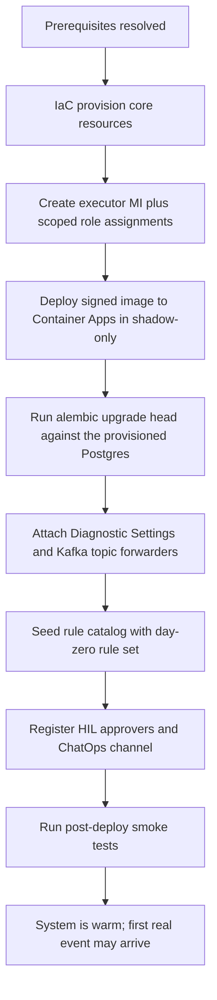

# Deploy and Onboard

How to provision FDAI into an Azure subscription and complete first-time onboarding
so the system is ready to observe. This file is authoritative for **the concrete deployment
inventory, the bootstrap sequence, and the distribution/deployment responsibility split**; the deployment
lifecycle (CI/CD, progressive delivery, rollback, DR) remains in
[deployment.md](deployment.md).

Azure focus: this document targets an Azure subscription. Non-Azure providers are TBD (see
[Implementation Focus](../../../.github/copilot-instructions.md#implementation-focus-must)).
All identifiers are synthetic per
[generic-scope.instructions.md](../../../.github/instructions/generic-scope.instructions.md).

> The day-zero service tiers and counts are decided in
> [Azure Resource Inventory](#azure-resource-inventory-minimum-set). A deployment owner confirms the
> region, quota, retention, replica caps, and production tier overrides before deployment.
> The **execution engine is decided**: `terraform apply` against `infra/` (Terraform HCL).
> The planned operator entry point is the installable `fdaictl` facade, which keeps Terraform
> as the source of truth and submits plan and apply work to the approved runner. See
> [Installable Deployment CLI](installable-deployment-cli.md) and
> [Deployment Artifacts](#deployment-artifacts).

## Prerequisites

### Deployer Identity (Azure)

- Subscription-scoped **Owner** or **Contributor + User Access Administrator** on the target
  resource group - required to create the executor Managed Identity and its scoped role
  assignments.
- Ability to grant subscription-scoped roles matching the executor's **action whitelist**
  ([security-and-identity.md](../architecture/security-and-identity.md)).
- **TBD**: whether a purpose-built custom role packages the deployer permissions.

### Azure Prerequisites

- Region with confirmed availability of every service in the inventory below.
- Confirmed quota headroom (Container Apps cores, Event Hubs throughput units, PostgreSQL
  vCores, Key Vault operations).
- Diagnostic Settings destination (Log Analytics workspace) - new or existing; ownership TBD.
- **Private networking (policy-locked tenants).** Tenants that enforce private data services set
  `enable_private_networking = true`: the deploy provisions a VNet, private endpoints, and linked
  private DNS for Key Vault, both Event Hubs namespace shards, and public-mode PostgreSQL. Event
  Hubs public access is disabled. The public-mode PostgreSQL endpoint is additive and preserves the
  existing server; `enable_private_postgres = true` remains the separate delegated-subnet mode.
  The deploy also binds the Container App Environment to a delegated infrastructure subnet and
  locks Key Vault to private access. Because a private-only vault is unreachable from an operator laptop,
  `terraform apply` MUST then run from a host with VNet line-of-sight to the endpoint - a
  CI runner or a jumpbox inside the VNet (the executor writes the DSN secrets from there).
  ACR is locked the same way when `acr_sku = "Premium"`: the registry loses public network
  access and receives a `privatelink.azurecr.io` endpoint whose zone group registers the
  login-server and data-endpoint records. Private link is Premium-only, so a Basic or Standard
  registry deliberately stays public - closing it without a private path would break every
  image pull. Prod already requires Premium.

#### What Terraform does not create

Terraform owns the inventory below, but four inputs must exist before the first apply, and a
missing one fails mid-run rather than at plan time:

- **The deployer identity and its role-assignment permission.** Creating the executor identity and
  its scoped roles needs User Access Administrator; Contributor alone plans and then fails.
- **The Terraform state storage account.** `infra/bootstrap/create-state-account.sh` creates it with
  `az`, because a private, key-disabled account cannot complete Terraform's data-plane readiness
  poll from an operator workstation. Terraform reads it through a data source.
- **The app resource group, when the bootstrap layer creates the runner VM.** That layer reads the
  group as a data source to scope the runner's Contributor grant, while the app layer is what
  creates it. On an empty subscription, create the empty group first or apply bootstrap once with
  `create_runner_vm = false`, run the app layer, then re-apply with the runner enabled.
- **An SSH public key for the runner**, plus quota headroom and the Log Analytics destination above.

A tenant whose Azure Policy denies part of the inventory also needs either an exemption or the
matching capability-mode toggle before the plan can converge
([deployment-preflight.md](deployment-preflight.md)).

#### Ops/hub runner (private-everything tenants)

Some tenants force **every** data service private (Key Vault *and* storage), so even a
terraform remote-state backend is laptop-unreachable. The `infra/bootstrap` layer stands up
the durable hub that makes the deploy possible and survives app rebuilds:

The ops layer creates one outbound path by default, a NAT gateway with a static public IP, because
a GitHub-registered runner must reach GitHub, the management plane, and the identity plane. A
closed network sets `enable_public_egress = false`: no public address is created, the host is a
jumpbox rather than a registered runner, and the tenant supplies its own approved route.

- an **ops resource group + hub VNet** (`rg-fdai-ops-<region_short>` / `vnet-fdai-ops-...`)
  separate from the app RG, with a runner subnet and a private-endpoint subnet;
- a **terraform remote-state storage account** locked to private, fronted by a blob private
  endpoint on `privatelink.blob.core.windows.net` linked to the ops VNet;
- a **self-hosted deploy runner VM** (no public IP) whose system-assigned managed identity
  holds `Contributor` + `User Access Administrator` on the app RG, `Network Contributor` on
  the ops RG, `Storage Blob Data Contributor` on the state account, and only `EventGrid
  Contributor` at subscription scope for realtime inventory system-topic and subscription delivery. Each
  workflow run clears the Azure CLI account cache before managed-identity login, then proves the
  exact repository-configured subscription and tenant before any storage, plan, or apply step.
  Before checkout, the runner removes only the legacy generated `infra/None` cache path so
  root-owned action residue cannot block the exact-commit clean step. That step creates the Azure
  CLI config under `RUNNER_TEMP` and exports it through `GITHUB_ENV` for subsequent steps.
The app config peers its spoke VNet to the ops hub (both directions) and links its private
DNS zones to the ops VNet via the `extra_vnet_links` seam, so the runner resolves the app's
Key Vault privately. The runner is the terraform apply principal, so the existing
`kv_officer_self` grant makes it `Key Vault Secrets Officer` on the app vault - it writes the
DSN secrets during apply. Deploys run through the [`deploy-dev` workflow](../../../.github/workflows/deploy-dev.yml)
on the `[self-hosted, fdai-deploy]` runner (plan-only by default; the `apply` input enforces).
Repository workflows allow only reviewed remote actions pinned to exact Node 24-compatible release
refs; container supply-chain actions use immutable commit SHAs. The CI contract rejects unknown
actions and mismatched refs. Terraform fixture tests use syntax accepted at the declared `>= 1.9`
floor. The exact CI version proves parsing and plan assertions. Upgrades verify action runtime metadata, and the runner remains at version 2.327.1 or newer. When private networking is enabled, PostgreSQL public access and the broad Azure-services firewall
are disabled. Dev uses its approved private endpoint; delegated-subnet mode remains available for
production.
Protected requests checkout `commit_sha` explicitly and compare it with `git rev-parse HEAD`, so a
release commit that advances `main` between dispatch and execution cannot change plan or apply code.
The deploy job runs from `infra/`, so a step that invokes a repository-root script reaches it with
`../scripts/` or overrides the working directory. A bare `scripts/...` path resolves under `infra/`
and exits 127 on the runner, before Terraform has produced anything to inspect.
Protected plans store the binary Terraform plan, bounded preflight evidence, and the Function
source archive with separate SHA-256 digests. Exact apply downloads and verifies every artifact.
Before storing a new plan, the runner selects only allowlisted plan, metadata, source, preflight,
claim, and receipt blobs older than 24 hours. It scans fewer than 1001, deletes at most 1000 with
eight workers, and fails the plan if selection is incomplete or any delete fails.
When the development operations gateway is selected, Terraform targets that Function, core, Operator API,
ingestion, the isolated Executor when selected, operational canary, inventory reconciliation Job,
realtime inventory publishers, and their dependency graphs. This keeps the Job's image and required
shared runtime configuration converged while unrelated runtime-resource changes stay outside the plan.
The target set includes both source and
destination addresses from active Terraform `moved` blocks, and the workflow contract test keeps
those addresses synchronized so state migrations cannot invalidate a protected plan. A `for_each`
key rename uses an explicit `moved` block so Terraform preserves the existing resource instead of
planning a delete and replacement create. A targeted plan includes the collection resource address
for that `for_each` move so Terraform can evaluate both keyed instances together; it also targets the AI account with its role collection so network and authorization settings converge in one apply.
Terraform uses the reader managed identity for host and deployment storage; the workflow removes
Flex-generated shared-key overrides before publishing. It grants `Storage Blob Data Owner` for the host
and a separate idempotency role. Easy Auth admits only the core executor client before principal checks.
Operator API deployment also requires non-secret maintainer and all non-autonomous agent stewardship
bindings from repository Variables; Container App preconditions reject an incomplete map.
After exact apply converges, the official Flex One Deploy action remote-builds the verified source,
retries bounded trigger sync, and requires both Function triggers before recording the apply receipt.
If a later identity or health check fails after the immutable claim, verification resume validates
that claim, skips Terraform apply, and reruns convergence and post-apply checks. Console hostname
recovery uses the exact Static Web App id from Terraform state, never an arbitrary resource search.
Health acceptance always requires the core Container App's latest revision to be `Provisioned`
and `Healthy` before an apply receipt can be recorded. Selected Operator API and ingestion
revisions must also be healthy, and their shared ingress `/healthz` responses must return the
fixed success payload. Design-mocks-only applies are the sole exception because they do not plan
the runtime.
The protected-plan delete gate permits only bounded security retirements: closing the broad
PostgreSQL Azure-services firewall path, or deleting one of the reviewed pre-split ingestion grants
when every exact API or worker successor is pure-created in the same plan. A replacement at the old
address, a missing or non-create successor, and every other delete remain blocked.
Full runbook: [`infra/bootstrap/README.md`](../../../infra/bootstrap/README.md).
Scheduled drivers remain Terraform-owned. `SCHEDULER_TICK_CRON_EXPRESSION` and
`ANALYZER_TICK_CRON_EXPRESSION` configure the existing jobs; `forecast_tick_cron_expression` and
`forecast_targets_json` opt into the forecast Job and inject `FDAI_FORECAST_TARGETS_JSON`. The
forecast Job publishes only a raw tick, which Huginn normalizes for Heimdall to evaluate and close.
The inventory reconciliation Job inherits the same required non-secret runtime config as core so
recovery-delta forwarding can open its typed Event Bus publisher without a partial config.
Scheduler and analyzer Jobs set `FDAI_MI_CLIENT_ID` to the client id of the user-assigned identity
attached to that Job, so Azure Monitor and Event Hubs token acquisition never relies on implicit
identity selection. The legacy generic OOB Job remains a bounded, inert compatibility resource
until a probe entry point owns it; implemented recurring work stays in the dedicated Jobs.
On a public-network profile, Terraform also adopts the deterministic realtime-inventory Event Grid
subscription when an operator restores it out of band, then converges its Event Hub destination,
delivery identity, event filter, and retry policy on the next protected apply. Private-networking
profiles do not create that unsupported Event Grid-to-private-Event-Hubs path. The VNet-integrated
inventory Job instead forwards bounded Activity Log recovery deltas to the primary Event Bus after
each reconciliation, using its topic-scoped Data Sender role and durable idempotency cursor.
An empty cron disables its job. Existing scheduler or analyzer jobs are safely adopted before a
plan, and later image or configuration changes converge through the same plan and apply path.
The analyzer job defaults to a one-minute shadow schedule. When explicit analyzer targets are
empty, it reads supported targets from durable inventory and publishes AKS detection-readiness
observations through Huginn. Set the analyzer cron to an explicit empty string to disable the job.

#### Inventory discovery with restricted egress

Strong NSG egress control should keep the application subnet closed without disabling Azure
service discovery. During preflight, test managed-identity token acquisition, DNS, TLS to the
ARM management endpoint, one bounded Azure Resource Graph query, pagination, and publication
to the private projection from the actual discovery subnet.

If direct ARG access is blocked, run the read-only collector on the VNet-integrated ops runner
or a Container Apps Job with the approved hub management path. Then fall back in order to a
validated Resource Management Private Link route, sharded ARM list operations, an
authoritative scoped Azure inventory, Activity Log continuity, and finally a signed
declarative recovery snapshot. A failed path retains the last complete graph and marks it
stale; it never publishes an empty graph. The complete network matrix, source precedence,
coverage manifest, and autonomy degradation rules are defined in
[Azure inventory under restricted NSG egress](../architecture/csp-neutrality.md#azure-inventory-under-restricted-nsg-egress).

#### Onboarding automation

Six helpers make the runner path repeatable (all customer-agnostic, parameterized):

Set `AZURE_SUBSCRIPTION_ID` and `AZURE_TENANT_ID` to the approved deployment target before running
any helper. [`verify-azure-context.sh`](../../../scripts/deployment/azure/verify-azure-context.sh)
requires both axes, selects the expected subscription only after it proves the tenant, and fails
before mutation when the identity cannot access that exact pair.

- [`verify-azure-context.sh`](../../../scripts/deployment/azure/verify-azure-context.sh) binds Azure
  CLI and `azd` entry points to the approved subscription and tenant pair.

- [`preflight-policy-check.sh`](../../../infra/bootstrap/preflight-policy-check.sh) probes a
  throwaway KV + storage to tell you up front whether the tenant forces private-everything
  (and thus mandates the runner path).
- [`onboard.sh`](../../../infra/bootstrap/onboard.sh) runs create-state-account -> bootstrap
  apply -> prints the GitHub Actions config (idempotent).
- [`set-gh-actions-config.sh`](../../../scripts/deployment/azure/set-gh-actions-config.sh) sets the repo
  Variables + Secrets from the bootstrap outputs (password generated + piped, never printed).
- [`register-runner.sh`](../../../infra/bootstrap/register-runner.sh) mints a runner token and
  registers the VNet runner over `run-command`. Re-running it stops and uninstalls an existing
  service, removes the stale local and GitHub registration with a short-lived removal token, and
  then installs the fresh service. This recovers broker-session corruption without keeping a token.
- [`teardown-env.sh`](../../../scripts/deployment/azure/teardown-env.sh) deallocates/starts the runner (cost) and
  guards a per-env `terraform destroy` that never touches the ops hub or state account.

#### Production hardening knobs

All default to the dev posture (the live env is unchanged) and tighten via tfvars per env
(see [`staging.tfvars.example`](../../../infra/envs/staging.tfvars.example) /
[`prod.tfvars.example`](../../../infra/envs/prod.tfvars.example)):

| Concern | Knob | Prod value |
|---------|------|------------|
| Delete protection | `enable_resource_locks`, bootstrap `enable_state_lock` | `true` |
| Key Vault | `kv_purge_protection_enabled`, `kv_soft_delete_retention_days` | `true`, `90` |
| Postgres network | `enable_private_postgres` | `true` |
| Postgres durability | `postgres_backup_retention_days`, `postgres_geo_redundant_backup` | `35`, `true` |
| Postgres availability | `postgres_high_availability_mode` | `ZoneRedundant` |
| HIL delivery | `enable_chatops_hil`, `chatops_webhook_url`, `chatops_webhook_secret` | enabled + CI secrets |
| Email notifications | `enable_email_notifications`, `notification_email_recipients`, `email_data_location` | enabled + recipient group |
| Registry | `acr_sku` | `Premium` |
| Monitoring | `enable_monitoring`, `alert_email`, `alert_webhook_url` | on + destination |
| Cost | `monthly_budget_amount`, `budget_alert_emails`, bootstrap `runner_auto_shutdown_time` | set |

A tenant without public registry egress builds the runtime image with
`--build-arg BASE_IMAGE_REGISTRY=<internal-mirror>`. Only the registry host moves; the base
image digests stay pinned in the `Dockerfile`, so a mirror can change where the bytes come from
but never which bytes are accepted. `scripts/quality/ci/check-ci-contracts.py` fails the build
when a base image loses either property.

`enable_private_postgres` adds a dedicated subnet delegated to PostgreSQL Flexible Server,
links a private DNS zone to the app and ops VNet, disables public access, and removes the
`AllowAllAzureServices` firewall rule. Turning it on for an existing public server may replace
that server, so review the plan and rehearse backup/restore before promotion. The assertions in
`infra/production-gates.tf` block a production plan until the signed image digest, private
networking, durability, alert destination, and cost budget minimums are supplied.

When `enable_private_networking = true` and delegated-subnet PostgreSQL is off, Terraform adds a
`postgresqlServer` private endpoint and links `privatelink.postgres.database.azure.com` to the app
and ops VNets. Both Event Hubs shards share `privatelink.servicebus.windows.net`; each namespace
has its own private endpoint, and public network access is disabled. This lets startup probes run
from the Container Apps subnet or the peered runner without replacing the development database.

An approved out-of-band ACS Email bootstrap can set
`import_existing_email_notifications=true` for its first dev convergence plan. The import
blocks adopt the Communication Service, Email Service, Azure-managed domain, association,
notification identity, and deterministic role assignment. Turn the flag off after the plan
is applied; new environments should let Terraform create the stack directly.

CI adds two credential-free guards: [`infra-lint.yml`](../../../.github/workflows/infra-lint.yml)
(fmt + validate + tfsec + Checkov on every infra PR) and
[`infra-drift.yml`](../../../.github/workflows/infra-drift.yml) (scheduled `plan -detailed-exitcode`
on the runner - a red run means live infra drifted from code). Monitoring, when enabled,
provisions an action group + metric alerts (Postgres / Key Vault / Event Hubs / Container App)
+ diagnostic settings to Log Analytics; alerts are a human signal only, never an autonomous
action.

### Non-Azure Prerequisites

- A **GitOps host** (GitHub or Azure DevOps organization) with an installed GitHub App or
  service connection scoped to the catalog + fork repos.
- A **Teams tenant** with a group-connected team for human approval (the `hil` route). Teams is
  the default A1 primary. See
  [channels-and-notifications.md](../interfaces/channels-and-notifications.md).
- A **Slack workspace** with the FDAI Slack app installed and the mandatory userId ↔ Entra OID mapping store provisioned; required for the P1 Slack A1 channel ([channels-and-notifications.md#7-channel-specific-notes](../interfaces/channels-and-notifications.md#7-channel-specific-notes)).
- A **container registry** (ACR or an external registry) that supports signature +
  attestation storage.
- **OpenTelemetry backend**: Log Analytics with Application Insights bound to the workspace.
  A fork may replace the backend through the telemetry provider contracts, but the Azure
  day-zero inventory does not leave this choice open.

## Deployment Artifacts

- IaC in `infra/` (see [project-structure.md](../architecture/project-structure.md)) is the entry point. Every
  environment is provisioned identically from the same code with per-environment parameters
  and per-environment isolated state. Terraform exposes primary Event Hub names through
  `event_bus_topics` and auxiliary stage, approval, and inventory-ingress names through
  `event_bus_auxiliary_topics` so local runtime preparation binds only provisioned topics.
- **Entry command**: `terraform apply` against the `infra/` Terraform (HCL) modules - resolves
  the previous OD (`azd up` vs `terraform apply` vs a wrapper). Environment values are supplied
  via `*.tfvars` files that are **never committed** (per
  [generic-scope.instructions.md](../../../.github/instructions/generic-scope.instructions.md));
  the [`fdaictl`](installable-deployment-cli.md) wrapper and runner orchestrate
  `validate request -> init -> plan -> live preflight -> exact remote apply -> post-provision
  checks`. A protected plan without the complete non-secret preflight profile stops before Azure
  login or Terraform initialization. A blocked live probe emits only its sanitized checks and
  findings before the workflow stops. Terraform remains the execution engine and infrastructure
  source of truth. Bicep and OpenTofu remain compatible fallbacks per
  [tech-stack.md](../architecture/tech-stack.md).
- Same signed image is promoted `dev → staging → prod`; nothing is rebuilt per environment
  ([deployment.md](deployment.md)).

## Resource Naming Convention

Resource naming and tagging are owned by
[Deployment Resource Conventions](deployment-resource-conventions.md). The focused contract
defines CAF prefixes, deterministic length handling, the `fdai:` tag namespace, deployment-
supplied tags, and the `fdai:managed=true` ownership boundary. This heading remains as a stable
target for existing links.

## Azure Resource Inventory (minimum set)

The inventory is deliberately minimized for **cost-efficiency first**. Every choice below is
driven by the [Cost-Efficiency Principles](#cost-efficiency-principles) at the end of this
document. The inventory is rendered from the four CSP-neutral contracts (event bus, runtime,
secret, workload identity) defined in [csp-neutrality.md](../architecture/csp-neutrality.md); Azure is
today's realization of each contract. Concrete tier values, exact names, region, and per-app
replica caps are still **deployment-specific** and tuned per environment; the shape is stable.
| # | Resource | Tier | Purpose | Notes |
|---|----------|------|---------|-------|
| 1 | **Container Apps environment** | Consumption | shared serverless compute host | one environment shared by the core app and scheduled jobs; realizes the [Runtime contract](../architecture/csp-neutrality.md#2-runtime-contract--oci-image--knative-compatible-manifest) |
| 2 | **Container Apps** (current Core and target Executor) | current Core app uses `minReplicas: 1`; target adds 1 internal app | transition baseline composes execution in Core; completed five-service topology isolates Executor | Executor receives effect authority only after every graduation gate passes; see [Compute Shape](#compute-shape-current-core-and-five-service-target) |
| 3 | **Container Apps Job** | Consumption | scheduled probes and out-of-band change detection | replaces Azure Functions; shares the environment |
| 4 | **Event Hubs namespace shards** | 2 x Standard (1 TU, auto-inflate off) | Kafka-wire event bus (endpoints on `:9093`) | primary owns governed ingress, DLQs, HIL, and stages; operational owns canary + DLQ, startup round-trip, raw inventory, Executor command + DLQ, and Executor receipt entities, keeping each namespace within the Standard 10-entity limit |
| 5 | **Event Grid inventory system topic + subscription + Diagnostic Settings** | global subscription event delivery / Log Analytics | send resource writes/deletes to `aw.inventory.raw` and platform diagnostics to the workspace | Terraform adopts one tracked topic with Azure's canonical lowercase type, assigns the send-only inventory UAMI, and uses the dedicated system-topic subscription API; ambiguous discovery blocks the plan |
| 6 | **PostgreSQL Flexible Server** | Dev: Burstable **B1ms**, HA disabled, 7-day backup; prod: zone-redundant HA, 35-day geo backup | audit + KPI + pattern library + **pgvector** T1 embeddings, single store | Terraform allowlists `vector` and `pg_trgm`; production plan requires `ZoneRedundant` HA |
| 7 | **Key Vault** | Standard | secret backend consumed via **Container Apps native secret + Key Vault reference** - realizes the [Secret contract](../architecture/csp-neutrality.md#3-secret-contract--environment--k8s-secret) | Premium (HSM) not required; app never calls a secret SDK |
| 8 | **User-assigned Managed Identity** | - | executor's least-privilege, action-whitelisted identity; realizes the [Workload Identity contract](../architecture/csp-neutrality.md#4-workload-identity-contract--oidc-token) | Phase 1 ships **one** MI (`mi-aw-executor`) using built-in role composition, RG-scoped; Phase 3 splits into per-domain MIs - see [security-and-identity.md § Identity Mapping (Phased)](../architecture/security-and-identity.md#identity-mapping-phased) |
| 9 | **Log Analytics workspace + Application Insights** | Pay-as-you-go, **30-day default retention** | traces / metrics / logs / audit-forward | an `appi-*` resource binds to the workspace; retention is **UI-configurable** post-deploy |
| 10 | **Container Registry (ACR)** | Basic (Standard if geo-replication needed later) | signed images + build attestations | pin by digest, never a mutable tag |
| 11 | **Azure OpenAI accounts + Foundry account/project** (**opt-in**, `var.enable_llm`) | Standard | T1 embedding + T2 mixed-model deployments, plus a dedicated GPT-4.1-nano web-search prompt agent at 100K TPM | Provisioning requires deployer permission and regional family capacity; otherwise the affected capability degrades to **`hil-only`** (see [dev-and-deploy-parity.md § Deployer-Scoped LLM Provisioning](dev-and-deploy-parity.md#deployer-scoped-llm-provisioning)). When web search is enabled, Terraform creates a separate `AIServices` Foundry account, project, and `t1.web_search` deployment in the deployment region, grants `Azure AI User` to the deployer and enabled Operator API identity, and the protected post-apply stage reconciles `fdai-web-search` with the exact domain allowlist before a real-tool readiness probe. Private mode adds `privatelink.services.ai.azure.com`; tenant policy owns deny ACL details, which Terraform preserves. |
| 12 | **ADLS Gen2 document account** (**opt-in**, `enable_document_ingestion`) | StorageV2 Standard ZRS, HNS | private quarantine, immutable governed versions, derived envelopes | Shared Key and public access disabled in private mode; soft delete + lifecycle; `blob` and `dfs` private endpoints |
| 13 | **Case-history Blob account** (`enable_case_history`) | StorageV2 Standard ZRS | content-addressed prediction/incident case revisions for replay and governed Norns analysis | Shared Key disabled; private container, versioning, change feed, soft delete, bounded old-version lifecycle, Defender scanner private-link access, dedicated case-history UAMI data role, and `blob` private endpoint; the executor MI receives no Blob role |
| 14 | **Document ingestion Container Apps** (**opt-in**) | Consumption, public API + internal worker with ClamAV | authenticated bounded upload relay plus independently scaled safety scan, extraction, pgvector indexing, and lifecycle events | API, worker, and migration UAMIs are distinct; only the worker receives Event Hubs receive and OCR; neither runtime identity receives executor permissions |
| 15 | **Control-loop canary Job** | Consumption, every 5 minutes | publishes one idempotent event to `aw.control.canary` | dedicated UAMI has only ACR pull and Event Hubs send; the core records a no-op audit through a separate consumer path |
| 16 | **Development operations Function App** (**opt-in**, `enable_dev_operations_gateway`) | Flex Consumption FC1 | relays registered read, write, and execute operations from local development to private resources | dev and private-networking only, enforced by a lifecycle precondition and covered by `infra/tests/dev_operations_gateway.tftest.hcl`; terminates a **public** inbound endpoint behind Easy Auth - a developer has to reach it - so it stays off on a closed network; dedicated `/27` subnet, private AAD-only deployment and idempotency storage, Easy Auth, separate reader/executor UAMIs, one-time server-issued mutation plan receipts, and no arbitrary URL, ARM path, command, or query surface |
Additional identity, channel, and console elements are deployment-owned or opt-in:

- **App registrations × 3** - split audiences per
  [user-rbac-and-identity.md#41-app-registrations](../interfaces/user-rbac-and-identity.md#41-app-registrations):
  `fdai-console-spa` (SPA sign-in, PKCE), `fdai-api` (Web API audience for
  console + ChatOps backend), and `fdai-approval-bot` (Teams SSO). None hold the
  executor identity. Step-by-step `az` creation:
  [../runbooks/entra-app-registration.md](../../runbooks/entra-app-registration.md).
  After a console apply, the deploy workflow safely retries an idempotent sync
  of the Terraform-emitted Static Web App origin into the target tenant's SPA
  redirect URIs. A tenant mismatch or missing Graph permission blocks the
  deployment rather than shipping a console that cannot sign in.
- **Entra security groups × 5** - `aw-readers`, `aw-contributors`, `aw-approvers`,
  `aw-owners`, `aw-break-glass`. Deployment-owned; objectIds injected via config and validated at
  startup ([user-rbac-and-identity.md#42-security-groups-slots](../interfaces/user-rbac-and-identity.md#42-security-groups-slots)).
- **Conditional Access policies** - phishing-resistant MFA on `aw-approvers`/`aw-owners`,
  compliant-device on `aw-owners`, dedicated hardware token + sign-in alert on
  `aw-break-glass`. Available on Entra ID P1
  ([user-rbac-and-identity.md#43-conditional-access](../interfaces/user-rbac-and-identity.md#43-conditional-access)).
- **Azure Bot (Free tier, not provisioned)** - a downstream deployment that selects Teams
  Adaptive Cards supplies it. Upstream Terraform ships only the signed webhook seam.
- **Signed HIL webhook** - production supplies the URL and a 32+ character HMAC secret through
  CI secrets. Terraform stores both in Key Vault; the core reads URL + secret and the Operator API
  receives only the callback secret.
- **Topic-scoped Event Hubs roles** - the executor receives Data Owner on each currently
  provisioned hub entity, not the namespace. Inventory and canary can send only to their own
  topics. The Operator API command identity sends proposals, HIL decisions, and pantheon object
  messages, and receives the stage topic. Document ingestion is limited to `aw.pipeline.stages`.
- **Static Web Apps (Free tier, opt-in)** - hosts the read-only console when
  `enable_console=true`.
- **Design-mocks Static Web App (Free tier, opt-in)** - hosts the isolated static design-review
  artifact when `enable_design_mocks=true`. The artifact builder copies only allowlisted browser
  assets from `index.html`, `mocks/`, `examples/`, and the shared agent icons. Static Web Apps
  authentication redirects anonymous requests to Microsoft Entra ID and admits only invited
  members of the `reviewer` role. The protected exact-apply workflow reads the deployment token
  from the Terraform-owned resource, masks it, and passes it only through the
  `SWA_CLI_DEPLOYMENT_TOKEN` environment variable to an exact-version Static Web Apps CLI. The
  workflow publishes the allowlisted artifact and verifies the authentication redirect. This path
  targets only `module.design_mocks`, rejects any planned resource change outside that module, and
  skips core canary and other runtime reconciliation. The token is never committed or stored as a
  repository secret.
- **Workload identity federation** - CI/CD short-lived OIDC tokens; not a resource, no cost.

### Document ingestion deployment

Set `enable_document_ingestion=true` only with `enable_llm=true`, a resolved
`t1.embedding` capability, the console API audience, all five Entra RBAC group ids, and explicit
ingestion CORS origins. Terraform then provisions:

- distinct API, worker, and migration UAMIs plus role-scoped PostgreSQL DSNs. API can publish but
  not consume stages; worker alone receives stages and optional Document Intelligence OCR access;
- a StorageV2 account with HNS, the `documents` and `derived` filesystems, lifecycle controls,
  no Shared Key, and Terraform-owned Defender scanner private-link access;
- `blob` and `dfs` private endpoints. The app VNet links to the endpoint zones; the ops runner
  resolves Blob through an A record in its existing central Blob zone, while the DFS zone links
  to both VNets. This avoids linking one VNet to duplicate zones with the same namespace;
- a public ingestion API Container App and an internal worker app with replica-local ClamAV;
- a manual migration job that applies the document metadata and pgvector schema before traffic.

The `deploy-dev` workflow exposes `deploy_document_ingestion`. Plan remains the default. An apply
runs the migration job, verifies both revisions, and publishes `ingestion_gateway_fqdn`; build with
`VITE_INGESTION_API_BASE_URL=https://<fqdn>`. Production gates require private networking and
digest-pinned FDAI plus ClamAV images.

The public Static Web App never reaches ADLS directly. It streams through the authenticated
gateway because the Storage account stays private. The gateway uses Managed Identity for ADLS,
Event Hubs, and Azure OpenAI; no connection string or Storage account key is created.

Explicitly **not provisioned** on day zero (deferred to a later phase when a measured need
justifies them):

- **Service Bus namespace and Event Grid custom topics** - the event bus is the Kafka
  endpoint on Event Hubs ([csp-neutrality.md § Event Bus Contract](../architecture/csp-neutrality.md#1-event-bus-contract--kafka-wire-protocol));
  a subscription-scoped Event Grid subscription for inventory writes/deletes is enabled by
  default, but no separate custom topic is created.
- Dedicated vector database (pgvector inside PostgreSQL suffices at initial scale).
- Front Door, Application Gateway, API Management (no public inbound endpoint; console is
  read-only static hosting).
- Secondary-region resources for DR (Phase 4 - TBD; see
  [Implementation Focus](../../../.github/copilot-instructions.md#implementation-focus-must)).

### Compute Shape (current core and five-service target)

The current control-loop Core deploys as one signed image and one Python process. The five-service target adds an internal Isolated Executor and removes executor roles from Core at cutover; Operator, ingestion API, and ingestion worker remain separate. The prior topology is the rollback artifact, and the [execution plan](../architecture/service-decomposition-execution-plan.md) tracks every gate.

- **Runtime**: `python -m fdai` starts the Kafka consumer and composes routing, quality, risk, and audit stages. `fdai-isolated-executor` stays shadow-only by default. The explicit cutover uses a stable Core receipt consumer group, the versioned command/receipt transport, the existing guarded direct-API executor, and a dedicated gateway caller identity. Deployment venue and `RUNTIME_ENV` remain independent.
- **Health**: internal `/live` and `/ready` probes open only after the authoritative control loop is assembled. The isolated Executor uses the same internal `/live` and `/ready` contract on `FDAI_ISOLATED_EXECUTOR_HEALTH_PORT`. The ingestion API uses `/healthz`; its internal worker uses `/live` and `/ready`.
- **Replica floor**: the default is one replica. A zero floor without a verified Kafka scaler would never wake on Event Hubs data, so Terraform does not claim scale-to-zero.
- **Graduation rule**: the target is Core, Operator, Ingestion API, Processing Worker, and Isolated Executor; authority cutover follows every gate in [Service Graduation and Data Ownership](../architecture/service-graduation-and-ownership.md).
- **Identity split**: Operator API read/command and ingestion API/worker/migration principals stay distinct. The worker receives Saga/Muninn objects only from `aw.pantheon.objects` and sends stage facts to `aw.pipeline.stages`; `ingestion_cohost_worker=true` returns both scopes to the API identity.
- **Executor deployment and cutover**: `enable_isolated_executor=true` provisions the internal app and a dedicated UAMI with ACR pull, command receive, receipt/DLQ send, and state-secret read only. The default is `false`; the private-runner workflow remains plan-only by default, installs a checksum-pinned GitHub CLI, syntax-checks embedded plan-metadata code, verifies attestation, binds the identical ACR digest, and includes the latest revision in health checks. `promote_runtime_image=true` imports that verified digest without rebuilding, while exact apply rejects promotion, consumes only the protected plan, and restores the same runtime digest for convergence. `enable_isolated_executor_authority_cutover=true` additionally requires the development operations gateway, removes gateway and vertical effect access from Core, authorizes the isolated identity, and keeps Core transport/read access. `verify_executor_effect=true` runs one reversible NSG rule probe through an explicit pseudo-terminal on the non-interactive runner and preserves the remote exit status. Duplicate delivery shares one issued-at timestamp to retain immutable action and command identity; cleanup receives a fresh bounded deadline. The workflow checks the effect through Azure Resource Manager, rejects duplicate writes, records offsets and terminal receipts, cleans up, and fails after 900 seconds.

## Bootstrap Sequence

Provisioning is IaC-driven, but the **logical bootstrap order** to a first live event MUST be
honored. Any earlier stage failing halts and unwinds; the deployment does not proceed to a
later stage with a broken earlier one.

```mermaid
flowchart TD
    A[Prerequisites resolved] --> B[IaC provision core resources]
    B --> C[Create executor MI plus scoped role assignments]
    C --> D[Deploy signed image to Container Apps in shadow-only]
    D --> D1[Run alembic upgrade head against the provisioned Postgres]
    D1 --> E[Attach Diagnostic Settings and Kafka topic forwarders]
    E --> F[Seed rule catalog with day-zero rule set]
    F --> G[Register HIL approvers and ChatOps channel]
    G --> H[Run post-deploy smoke tests]
    H --> I[System is warm; first real event may arrive]
```

- **Shadow-only on first deploy**: no rule / action starts in enforce mode, ever. Promotion is
  a separate act ([rule-governance.md](../rules-and-detection/rule-governance.md)).
- **Migrations MUST run before the first control-loop tick**. The Container App itself does
  not migrate on start (to keep replicas identical + prevent races). Run
  `alembic upgrade head` from a workstation or a CI job that can reach the provisioned
  Postgres FQDN with the admin DSN. Every tracked migration under `alembic/versions/` defines
  `downgrade()`, but schema/data rollback can be destructive. Rehearse backup/restore and each
  migration-specific downgrade in staging before using it.
- Post-deploy smoke tests and the synthetic canary are defined in
  [operating-and-verification.md](../operations/operating-and-verification.md).

## Distribution and Deployment Responsibility Matrix

The upstream repo ships everything **customer-agnostic**. A downstream distribution may limit or
extend capabilities through dependency injection without editing `core/`. A deployment supplies
environment values, identity, secret references, and promotion state outside source control
([generic-scope.instructions.md](../../../.github/instructions/generic-scope.instructions.md)).

| Concern | Upstream distribution | Downstream customization | Deployment configuration |
|---------|-----------------------|--------------------------|--------------------------|
| IaC modules | parameterized modules | optional module overlays | environment tfvars, state, secret references |
| Provider adapters | Protocols and Azure implementations | optional replacement implementation through DI | endpoint and identity bindings |
| Rule catalog | generic seed and schemas | additional rules and policy overlays | assignments, exemptions, promotion state |
| HIL and RBAC | role and approval contracts | optional channel adapter | Entra groups, channel ids, approver bindings |
| Models | capability registry and resolver | optional provider adapter or preference overlay | resolved endpoints, quota, region, identity |
| Runtime values | validated key schema | no tenant values | environment variables and Key Vault references |

## Runtime Configuration Matrix

All values MUST come from env vars or Key Vault refs at runtime. **No environment value is
committed to this repo.** The list below is the **schema of keys** the deployment expects; the
full expanded catalog and defaults are authored during the inventory PR.

The Console projects a safe subset through Settings > Runtime policies. Readers can compare the
environment, durable override, and effective value. Owners can change only the documented
allowlist through revision and audit checks. IRP, analyzer, inventory freshness, and retention tick
changes apply dynamically at their next event or Job boundary. Logging level and case retention or
deletion day changes require a headless runtime restart. Deployment identity, transport, endpoint,
secret, promotion, and test-only keys remain outside the editable surface.

| Key | Source | Owner | Notes |
|-----|--------|-------|-------|
| `AZURE_TENANT_ID` | env | deployment | non-secret |
| `AZURE_SUBSCRIPTION_ID` | env | deployment | non-secret |
| `AZURE_RESOURCE_GROUP` | env | deployment | target resource group |
| `KAFKA_BOOTSTRAP_SERVERS` | env | deployment | Event Hubs Kafka endpoint (`<ns>.servicebus.windows.net:9093`); realizes the [Event Bus contract](../architecture/csp-neutrality.md#1-event-bus-contract--kafka-wire-protocol) |
| `FDAI_AUXILIARY_KAFKA_BOOTSTRAP_SERVERS` | env | deployment | Operational Event Hubs Kafka endpoint used only by the core canary and raw inventory consumers; unset falls back to the primary endpoint for non-Azure adapters. |
| `KAFKA_SECURITY_PROTOCOL` | env | deployment | `SASL_SSL` on Azure; provider-specific value elsewhere |
| `KAFKA_SASL_MECHANISM` | env | deployment | `OAUTHBEARER` on Azure |
| `FDAI_STATE_STORE_DSN` | KV ref | upstream | Postgres connection URI for audit + KPI; wired by `infra/main.tf` `azurerm_key_vault_secret.state_store_dsn` from `module.state_store.application_dsn`, exposed to the Container App via `secret{}` + `env{}` (see [project-structure.md](../architecture/project-structure.md) `infra/modules/compute/container-apps/`). Local/dev may use in-memory when absent; `RUNTIME_ENV=staging|prod` fails startup. |
| `FDAI_CASE_HISTORY_CONTAINER_URL` / `FDAI_CASE_HISTORY_MI_CLIENT_ID` / `FDAI_CASE_HISTORY_RETENTION_DAYS` / `FDAI_CASE_HISTORY_DELETION_DAYS` / `FDAI_CASE_HISTORY_RETENTION_TICK_SECONDS` | env | upstream / deployment | Private Blob container URL, dedicated attached UAMI client id, active-retention/deletion-due offsets, and the bounded Muninn retention cadence for immutable case revisions. Terraform derives the storage and identity bindings, validates deletion is not earlier than retention, and startup fails if the dedicated identity id is missing or matches the executor identity; public/key-auth fallback is not used. The retention tick defaults to `86400`. |
| `FDAI_OPERATOR_MEMORY_DSN` | KV ref | upstream | Postgres DSN for HIL-approved operator memory. Same source as `FDAI_STATE_STORE_DSN` day-zero (single Flexible Server); a deployment MAY split it later without touching core code. |
| `FDAI_T1_PATTERN_LIBRARY_DSN` | KV ref | upstream | Postgres DSN for the pgvector-backed T1 pattern library. Same source day-zero; wired identically. |
| `FDAI_CHANGE_MI_CLIENT_ID` / `FDAI_RESILIENCE_MI_CLIENT_ID` / `FDAI_FINOPS_MI_CLIENT_ID` | env | deployment | Client ids of the three attached per-vertical user-assigned managed identities. They identify delivery principals only; execution authorization and fork-owned action whitelists still decide whether a selected identity may act. |
| `FDAI_INVENTORY_DSN` | KV ref | upstream | PostgreSQL DSN used only by the scheduled inventory collector to stage immutable candidates and atomically promote the active graph. |
| `FDAI_INVENTORY_SCOPES` / `FDAI_INVENTORY_RESOURCE_TYPES` | env | deployment | Comma-separated subscription scopes and optional CSP-neutral resource-type subset. Empty scope fails startup. |
| `FDAI_INVENTORY_SOURCES` | env | upstream | Ordered fallback list: `arg,arm` by default; `declarative` is accepted only with a fixture path and SHA-256. |
| `FDAI_INVENTORY_MANAGEMENT_ENDPOINT` / `FDAI_INVENTORY_MANAGEMENT_AUDIENCE` | env | deployment | Validated HTTPS ARM root and OIDC audience pair. Override both for an approved sovereign-cloud or validated Resource Management Private Link path. |
| `FDAI_INVENTORY_FRESHNESS_SECONDS` | env | upstream | Maximum active snapshot age before the projection becomes stale and graph-dependent autonomy degrades to human review. Default `86400`. |
| `FDAI_ANALYZER_TARGETS` / `FDAI_ANALYZER_WINDOW_SECONDS` / `FDAI_ANALYZER_BUDGET_SECONDS` | env | deployment / upstream | Optional explicit analyzer targets and bounds. When targets are empty, the analyzer Job discovers supported resource kinds from the active inventory through `FDAI_INVENTORY_DSN`. |
| `KAFKA_TOPIC_EVENTS` | env | deployment | primary event ingest topic |
| `KAFKA_TOPIC_DLQ_SUFFIX` | env | deployment | dead-letter suffix (default `.dlq`) |
| `FDAI_EXECUTOR_COMMAND_TOPIC` / `FDAI_EXECUTOR_RECEIPT_TOPIC` | env | upstream / deployment | Isolated Executor command and versioned terminal receipt topics. Defaults are `object.executor-command` and `object.executor-receipt`; they must remain distinct. |
| `FDAI_ISOLATED_EXECUTOR_MI_CLIENT_ID` / `FDAI_ISOLATED_EXECUTOR_AUTHORITY_CUTOVER` | env | deployment | Dedicated isolated identity plus the exact default-off cutover marker. The identity has transport/state access in shadow; cutover additionally makes it the sole development-gateway caller while Core keeps only transport/read access. |
| `FDAI_ISOLATED_EXECUTOR_DEPLOYED` | env | upstream / deployment | Exact opt-in marker for the independently deployed process. Only `1` starts this entry point; environment names do not imply deployment venue or authority. |
| `FDAI_ISOLATED_EXECUTOR_HEALTH_PORT` / `FDAI_ISOLATED_EXECUTOR_INSTANCE_ID` | env | upstream / deployment | Internal health port (default `8000`) and bounded receipt-attribution instance id. Container Apps supplies `HOSTNAME` when the explicit instance id is unset. |
| `LLM_MODE` | env | deployment | `local-fake` for explicit tests/mocks or `azure` for authoritative profiles. Environment does not select the binding; see [dev-and-deploy-parity.md § Parity Contract](dev-and-deploy-parity.md#parity-contract-must). |
| `LLM_RESOLVED_MODELS_PATH` | KV ref | deployment | required when `LLM_MODE=azure`; points at the `resolved-models.json` written by the bootstrap resolver |
| `T1_SIMILARITY_THRESHOLD` / `T1_MIN_SUCCESS_RATE` | env | deployment | Validated `[0,1]` floors for similarity and historical success before learned-action reuse. Defaults are `0.8` and `0.9`. |
| `QUALITY_GATE_CONFIDENCE_THRESHOLD` / `QUALITY_GATE_QUORUM` | env | deployment | Validated confidence floor and independent-model agreement quorum for T2. Defaults are `0.7` and `2`; quorum cannot be lower than two. |
| `RULE_CATALOG_REF` | env | deployment | git ref of catalog snapshot |
| `AUTONOMY_MODE_DEFAULT` | env | deployment | MUST default to `shadow` |
| `FDAI_LOG_LEVEL` | env | upstream | Python logger level for the core app (`DEBUG` / `INFO` / `WARNING` / `ERROR`). Default `INFO`. |
| `FDAI_OPERATOR_API_LOCAL_AZURE_CLI` | env | local-only | Explicit CLI-principal debug alternative with a fixed role ceiling. Paired with `VITE_LOCAL_AZURE_CLI_AUTH=1`. |
| `FDAI_OPERATOR_API_DEV_MODE` | env | test-only | Authentication bypass for automated Operator API tests. The VS Code full-stack profile MUST NOT set it. |
| `FDAI_OPERATOR_API_LOCAL_ENTRA` | env | local-only | Canonical interactive profile. Browser Entra JWT and App Roles match deployment; the server Azure CLI session is confined to Azure adapters. |
| `FDAI_START_PANTHEON` | env | upstream / local | Disable-only control for the 15-agent runtime. Unset means enabled; `0`, `false`, `no`, or `off` disables it. Event Hubs variables select transport and do not activate the Pantheon. |
| `FDAI_LOCAL_SCENARIO_REPLAY` | env | test-only | Generated scenario replay for automated tests and explicit mock applications. Interactive local startup rejects it. |
| `FDAI_LOCAL_AZURE_DISCOVERY` | env | local-only | Azure discovery is mandatory. Unset or `1` uses read-only `AzureCliInventory`; `0` is rejected and never selects a synthetic graph. |
| `FDAI_LOCAL_AZURE_SUBSCRIPTION_ID` | env | dev-only | Optional subscription passed to every local `az group/resource list` call. When omitted, discovery uses the active subscription in the selected Azure CLI profile. Never commit a populated value. |
| `FDAI_LOCAL_AZURE_CONFIG_DIR` | env | dev-only | Optional isolated Azure CLI profile. When omitted, the adapter removes an inherited `AZURE_CONFIG_DIR` and uses the default profile. |
| `FDAI_POLICIES_ROOT` | env | deployment | absolute path to the OPA / Rego bundle root consumed by T0 and the verifier. Defaults to the in-repo `policies/` when unset. |
| `FDAI_MI_CLIENT_ID` | env | upstream | User-assigned MI client id for the current process. The core receives the executor id; the inventory job receives its distinct read-only discovery id. |
| `FDAI_INVENTORY_RECONCILIATION_INTERVAL_SECONDS` | env | upstream | Healthy full-scan interval for the Inventory Job. The default Job cron wakes every 10 minutes, but PostgreSQL attempt state skips scans until this interval is due and retries a newer failed or abandoned attempt on the next tick. |
| `FDAI_EMAIL_ENDPOINT` / `FDAI_EMAIL_SENDER_ADDRESS` / `FDAI_EMAIL_RECIPIENT_ADDRESSES_JSON` / `FDAI_NOTIFICATION_MI_CLIENT_ID` | env | upstream / deployment | Enables the ACS Email A2/A4 channels. Terraform derives the endpoint and Azure-managed sender, attaches a dedicated notification MI, and injects the client id. Deployment configuration supplies recipients through `NOTIFICATION_EMAIL_RECIPIENTS_JSON`; no access key or connection string enters the app. Partial configuration fails startup. |
| `FDAI_CONSOLE_BASE_URL` | env | deployment | Public HTTPS origin used to build read-only evidence links in incident email. Terraform derives it from the Static Web App hostname when the Console is enabled. Without it, email delivery continues and the renderer omits the incident CTA. |
| `FDAI_MEASUREMENT_MODE` | env | upstream | Selects the Container Apps Job entry point in `infra/modules/measurement-runners/`: `baseline` runs frozen-scenario regression measurement and `growth` drains reviewed outcomes into pattern-growth intake. Action authority remains governed independently by promotion and risk gates. |
| `FDAI_DIRECT_API_FAKE` | env | test-only / dev-local | `1` swaps the executor direct-API path for the in-memory shadow fake. Automated tests set it explicitly; `prepare-local-runtime-env.sh` auto-injects it for interactive local dev only when no operations gateway is found - neither surfaced by Terraform state nor recovered from a live Azure CLI probe of the resource group (`func-*-devgw-*` plus its App Service Authentication audience) - so the `execution_path: direct_api` dispatch stays live without a live backend. Mutually exclusive with `FDAI_DEV_OPERATIONS_GATEWAY_URL`. |
| `FDAI_TOOL_CALL_FAKE` | env | test-only | `1` swaps the executor tool-call path for `RecordingToolExecutor` in automated tests. Interactive local startup does not wire an executor. |
| `FDAI_WORKFLOW_SHADOW` | env | upstream | Event-triggered catalog Workflows run in non-mutating shadow mode by default. Set `0`, `false`, `no`, or `off` only for explicit maintenance disablement. |
| `FDAI_WORKFLOW_ENFORCE_ALLOWLIST` | env | deployment / local | Comma-separated Workflow names an Owner may start with `mode=enforce`. Requires Event Hubs command transport. Action steps re-enter the normal promotion/risk/HIL/executor path. |
| `KAFKA_TOPIC_EVENTS` / `FDAI_STAGE_TOPIC` | env | upstream / local | Event and stage topics shared by deployed runtime and Azure-backed interactive transport. When both Kafka bootstrap and event topic are absent, interactive local uses `aw.events` plus the bounded local EventBus/SSE adapters. |
| `FDAI_IRP_ENABLED` / `FDAI_IRP_BUDGET_SECONDS` | env | upstream | Enables alert-shaped event handling through the budgeted investigation -> typed proposal path. The proposal re-enters the standard risk/HIL/executor loop. |
| `FDAI_CHAOS_CONTEXT_JSON` / `FDAI_CHAOS_ENFORCE` | env | deployment | Runtime context for promoted chaos injectors. Enforce stays disabled unless the explicit flag is `1`, the scenario is promoted, and both injector and probe are registered. |
| `FDAI_JIRA_BASE_URL` / `FDAI_JIRA_ACCOUNT_EMAIL` / `FDAI_JIRA_API_TOKEN_SECRET` / `FDAI_JIRA_TOOL_MAP_JSON` | env + KV ref | deployment | Configures the production `JiraToolExecutor`. `TOOL_MAP_JSON` maps `tool.open-incident-ticket` to a Jira project key. The token value is resolved from `FDAI_SECRET_<API_TOKEN_SECRET>` (KV-backed); never place the token in the mapping. Requires `FDAI_STATE_STORE_DSN` for the durable Jira ledger and distributed resource lock. |
| `FDAI_JIRA_ENFORCE` | env | deployment | Default unset/`0` keeps Jira shadow-only. `1` permits enforce requests only after the ActionType promotion gate and risk/HIL decision also permit enforce. Shadow receipts are never linked as real incident tickets. |
| `FDAI_PROFILE_ID` | env | deployment | selects one profile from `rule-catalog/profiles/` (see [rule-catalog-profiles.md](../rules-and-detection/rule-catalog-profiles.md)). **Composition-root wiring pending** as of 2026-07. |
| `FDAI_NARRATOR_PROVIDER` / `FDAI_NARRATOR_BASE_URL` / `FDAI_NARRATOR_MODEL` / `FDAI_NARRATOR_API_VERSION` / `FDAI_NARRATOR_API_KEY` | env + KV ref | deployment | Operator-console narrator translator config (see [operator-console.md](../interfaces/operator-console.md)); `API_KEY` MUST go through KV. Empty provider = deterministic fallback. |
| `FDAI_CHATOPS_APPROVE_CALLBACK_URL` / `FDAI_CHATOPS_REJECT_CALLBACK_URL` / `FDAI_CHATOPS_WEBHOOK_SECRET` / `FDAI_CHATOPS_TIMEOUT_SECONDS` | env + KV ref | deployment | Chatops HIL callback endpoints and the shared webhook secret; the secret MUST go through KV. Setting the secret enables the production callback route and durable Postgres decision registry. |
| `FDAI_KAFKA_BOOTSTRAP_SERVERS` / `FDAI_HIL_DECISION_TOPIC` | env | deployment / upstream | Event Hubs Kafka endpoint used by the Operator API to publish durable HIL decision receipts; topic defaults to `aw.hil.decisions`. Core consumes the same topic and owns resume/execution. |
| `FDAI_GITOPS_API_BASE` / `FDAI_GITOPS_DEFAULT_BRANCH` / `FDAI_GITOPS_BRANCH_PREFIX` / `FDAI_GITOPS_TIMEOUT_SECONDS` | env | deployment | `gitops-pr` adapter target repo config (GitHub App / Azure DevOps). Auth secrets flow through the platform's App installation, not env vars. |
| `FDAI_GITOPS_TOKEN` / `FDAI_GITOPS_OWNER` / `FDAI_GITOPS_REPO` / `FDAI_GITHUB_WORKFLOW_TOOLS_ENFORCE` | KV ref + env | deployment | Binds the GitHub change feed and workflow tools for fix/release/security/incident/IRP artifacts. The enforce flag never bypasses the ActionType promotion and risk/HIL gates. |
| `FDAI_RBAC_READERS_GROUP_ID` / `FDAI_RBAC_CONTRIBUTORS_GROUP_ID` / `FDAI_RBAC_APPROVERS_GROUP_ID` / `FDAI_RBAC_OWNERS_GROUP_ID` / `FDAI_RBAC_BREAK_GLASS_GROUP_ID` | env | deployment | Entra ID group object ids for the five human roles (see [user-rbac-and-identity.md](../interfaces/user-rbac-and-identity.md)). Unset group = role unassigned. |
| `FDAI_STEWARDSHIP_REQUIRE_BINDINGS` | env | deployment | Set to `1` so placeholder identities fail startup. Terraform also supplies `FDAI_MAINTAINERS`, `FDAI_STEWARD_<AGENT>`, the audit interval, and optional Key Vault-backed GitOps/webhook inputs defined in [Agent operational ownership lifecycle](../interfaces/agent-stewardship-operations.md). |
| `FDAI_ENTRA_TENANT_ID` / `FDAI_API_AUDIENCE` | env | deployment | Required for the production Operator API Entra JWT verifier (`EntraJwtVerifier`): the deployment tenant id and the `fdai-api` App ID URI (`api://<fdai-api-guid>`). See [user-rbac-and-identity.md#102-api-token-validation](../interfaces/user-rbac-and-identity.md#102-api-token-validation). |
| `FDAI_ENTRA_ISSUER` / `FDAI_ENTRA_JWKS_URI` | env | deployment | Optional verifier overrides; default to the tenant's v2 issuer + public key set. Set `ISSUER` to `https://sts.windows.net/<tenant>/` for a v1-token app; override `JWKS_URI` only for sovereign / air-gapped clouds. |
| `FDAI_EXECUTOR_PRINCIPAL_ID` / `FDAI_EXECUTOR_EVENT_ROLE_DEFINITION_ID` / `FDAI_EXECUTOR_SECRET_ROLE_DEFINITION_ID` | env | upstream | Operator API onboarding probe inputs. The probe uses ARG to verify the provisioned resource set and the executor's Event Hubs / Key Vault roles. |
| `FDAI_DR_DRILL_SOURCE_SERVER_ARM_ID` / `FDAI_DR_DRILL_TARGET_LOCATION` / `FDAI_DR_DRILL_TARGET_RG_PREFIX` / `FDAI_DR_DRILL_TARGET_SERVER_PREFIX` / `FDAI_DR_DRILL_PITR_OFFSET_MINUTES` / `FDAI_DR_DRILL_DRY_RUN` | env | deployment | DB-DR drill job config (see [../runbooks/db-dr-drill.md](../../runbooks/db-dr-drill.md)); `DRY_RUN=true` upstream default keeps the job idempotent. |
| `FDAI_SECRET_KAFKA_TOKEN` / other `FDAI_SECRET_*` | KV ref | deployment | generic escape hatch for a secret consumed by an adapter that does not yet have a dedicated env-var name; every `FDAI_SECRET_*` value MUST come from KV. |

Rules that apply to every key:

The Onboarding console reports `probe_mode=configured` only when every Azure probe input is
present. When the inputs are absent, `probe_mode=not-configured` means the displayed gaps are the
required baseline, not observations from the signed-in tenant.

- Startup **fails fast** on missing or unparseable config
  ([coding-conventions.instructions.md](../../../.github/instructions/coding-conventions.instructions.md)).
- Secrets go through Key Vault refs, never plain env; a secret in plain env fails the CI
  secret-scan gate.
- Per-environment values differ; the same image reads them from the injected environment.

## Event Source Subscription

Signals wired at bootstrap so the three initial verticals have something to observe. The
concrete event types, subscription filters, and rate caps are **TBD**; the shape of the
wiring is stable.

| Vertical | Azure signal candidates | Delivery |
|--------|-------------------------|----------|
| Change | Activity Log (resource-write / delete), Change Analysis, Resource Health | Push into the canonical Event Hubs Kafka ingress; Huginn owns real-time discovery normalization and the Inventory sync job reconciles the full graph |
| DR / Chaos | Resource Health, backup vault events, PostgreSQL / SQL replication-lag metrics, restore-rehearsal outcomes | Diagnostic Settings + scheduled Container Apps Job probes → Kafka topic (`aw.dr.events`) |
| FinOps | cost anomaly alerts, budget alerts, Advisor cost recommendations | Cost Management pull → Kafka topic (`aw.finops.events`); anomaly alerts fan in through the same Diagnostic-Settings path |

Every event is stamped with an **idempotency key at ingress** so a replay is a no-op; DLQs
MUST be reachable and covered by the [alert routing](../operations/operating-and-verification.md#alert-routing)
before enforce is enabled anywhere.

The Azure forwarding mechanism must preserve the no-shared-secret boundary. Do not enable Event
Hubs local authentication only to satisfy a Diagnostic Settings export. When the selected Azure
signal source cannot publish with managed identity, use the bounded Activity Log recovery reader
until an approved push transport is available. The six-hour Inventory sync job remains required
in every deployment as the completeness backstop.

## Verification After Provisioning

Post-provision verification (adapter reachability, canary round-trip, shadow correctness) is
defined in [operating-and-verification.md](../operations/operating-and-verification.md#post-deploy-smoke-tests).
A failing verification aborts the promotion and rolls traffic back
([deployment.md#release-and-rollback](deployment.md#release-and-rollback)).

## Cost-Efficiency Principles

Every provisioning choice honors these principles; a resource that violates them needs an
explicit justification in the deployment PR. The **illustrative monthly cost envelope** that
results from these principles is in [cost-model.md](../interfaces/cost-model.md).

1. **Event-driven first** - scheduled Container Apps Jobs scale to zero between runs. The core
  currently keeps one replica because a credential-free Event Hubs Kafka-lag scaler has not
  been verified; changing that floor requires a measured, tested scaler.
2. **One region, one zone, non-HA at day zero** - multi-zone and multi-region are Phase 4
   (TBD). The initial deployment is a single geographic footprint.
3. **Managed services collapsed** - pgvector inside PostgreSQL is the vector store; App
   Insights binds to the shared Log Analytics workspace; no separate vector DB or APM
   resource is provisioned.
4. **Basic / Standard tiers by default** - Premium tiers require a stated, measured need. HA
   variants, geo-replication, and private-endpoint premium features are deferred.
5. **Free tiers where they cover the use case** - Static Web Apps (console), Azure Bot
   (HIL Adaptive Cards), and workload identity federation (CI/CD) are all Free tier.
6. **Staged five-service target** - Core remains modular while Executor evidence is built; the
  completed topology separates them, and other packages stay in-process without their own gates.
7. **Model budget cap** - T2 inference is designed to reach ~5-10% of events; token/spend
   budgets are enforced and overflow degrades to HIL, never to uncapped inference.
8. **Catalog is git-hosted, not a service** - the rule catalog lives in a git repository, not
   a managed store, so no extra Azure resource is needed for catalog storage.
9. **No public inbound endpoint** - no Application Gateway / Front Door / API Management on
   day zero; ingress is the event bus, egress is allow-listed.
10. **Deferred DR resources** - secondary-region resources are **not** provisioned initially;
    control-plane DR is planned via IaC + state backups (see
    [deployment.md](deployment.md#control-plane-disaster-recovery)).

## Open Decisions

- [x] Deployment interface - **resolved: Terraform is the execution engine; the planned
  operator interface is `fdaictl`**. The installable CLI runs read-only preflight and
  submits exact-plan work to the approved runner without replacing Terraform. See
  [Installable Deployment CLI](installable-deployment-cli.md).
- [ ] Concrete tier values within the minimum set (PostgreSQL storage size, Log Analytics
      daily cap, ACR retention window, Event Hubs throughput-unit ceiling).
- [ ] Region choice and the single-zone deployment posture (multi-zone deferred to Phase 4).
- [ ] Custom Azure role packaging for the deployer identity.
- [ ] Log Analytics daily-cap and query cost budget (retention default 30 days is
      **configurable from the console UI**; alert thresholds TBD).
- [ ] Kafka topic naming + Diagnostic-Settings forwarding filters, per-domain fan-in shape.
- [x] Production networking baseline - **resolved: VNet-integrated Container Apps, private Key
  Vault, and delegated-subnet private PostgreSQL**. Development may retain the public
  PostgreSQL path; ACR/Event Hubs private endpoints remain tenant-policy-driven additions.
- [ ] Full runtime config key list (values matrix expanded).
- [ ] Day-zero seed rule set (which sources, which rule ids) - cross-linked to Phase 1.
- [x] Core -> Isolated Executor **target boundary** - required for the five-service program;
  authority cutover waits for every binary gate and rollback receipt.
