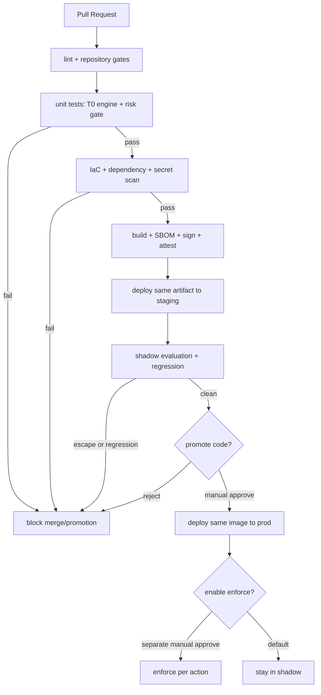

# 배포(Deployment)

배포는 앱 형상을 따릅니다: 기본 1 replica의 **headless 이벤트-기반 코어**, opt-in
**얇은 콘솔 + read API**, 그리고 **PR-네이티브 + ChatOps** 딜리버리
([app-shape.instructions.md](../../../.github/instructions/app-shape.instructions.md) 참조).
인프라는 코드이며, 모든 릴리스는 [Release and Rollback](#release-and-rollback) 에 정의된
계층화된 롤백 경로로 되돌릴 수 있습니다.

코어는 **CSP-중립 설계** 입니다: 클라우드 접근은 provider 어댑터 뒤에 있으므로, 아래 Azure
매핑이 유일한 구현 대상입니다. **비-Azure 프로바이더는 TBD** 입니다
([Implementation Focus](../../../.github/copilot-instructions.md#implementation-focus-must)).
어댑터 표면은 보존되어 향후 대상은 추가적입니다. Downstream distribution은 core를 편집하지
않고 provider implementation을 제공할 수 있으며, 각 deployment는 configuration으로 identity와
state binding을 제공합니다.
([generic-scope.instructions.md](../../../.github/instructions/generic-scope.instructions.md)).

> **구현 상태.** Terraform plan/apply, production input gate, image scan/SBOM/attestation,
> drift plan, post-apply canary Job smoke는 배포됐습니다. 자동 dev -> staging -> prod 승격,
> Container Apps traffic-split canary, SLO 기반 자동 rollback, console blue/green은 아직
> 목표 설계입니다. Core Container App은 현재 `revision_mode = Single`입니다.

## 환경(Environments)

승격은 **단방향** (`dev → staging → prod`) 이며 **아티팩트 단위** 입니다: staging을
통과한 동일한 서명된 이미지가 prod로 승격됩니다 - 절대 환경별로 재빌드하지 않습니다.
Staging은 prod 토폴로지를 미러링하여 shadow 평가가 대표성을 갖도록 합니다.

| 환경 | 목적 | 자율성 수준 |
|------|------|-------------|
| `dev` | 개발 및 통합 검증 | authoritative promotion state, 동일한 risk/HIL gate |
| `staging` | pre-prod 검증, 신규 규칙/액션 shadow 평가 (prod 미러) | shadow, 선택적 enforce |
| `prod` | 라이브 운영 | 저위험은 enforce; 고위험은 HIL |

- 환경별로 설정이 다름; **소스에 환경 값 없음** - 모두 런타임 주입.
- Deployment는 core 편집 없이 environment config를 제공합니다. Environment는 capability를
  promote하거나 demote하지 않습니다. [ADR-0002](../architecture/decisions/0002-independent-runtime-axes-ko.md)를
  참조하세요.
- **콘솔과 executor는 별개 identity로 배포** - 콘솔은 읽기 전용이며 executor의 privileged
  Managed Identity를 절대 보유하지 않음
  ([security-and-identity-ko.md](../architecture/security-and-identity-ko.md) 참조).

## Infrastructure as Code

- 모든 인프라는 `infra/` 에 정의(Terraform 주, Azure-only 부분은 Bicep 선택). **코어 엔진은
  CSP-중립 유지**; 벤더 특이 IaC는 런타임 어댑터와 동일한 provider 경계 뒤에 있습니다.
- **State 관리**: 앱 layer는 원격 backend + locking + **환경별 state 격리**를 사용합니다.
  `infra/bootstrap/` ops layer만 state backend 자체를 만들기 위해 local state를 유지합니다.
- **Drift 감지**: 환경별 스케줄된 `plan` (읽기 전용) 이 drift를 알림과 조정 PR로 표면화;
  drift는 prod에 조용히 auto-apply 되지 않음.
- 프로비저닝 리소스 - **최소 비용 효율 세트** (전체 인벤토리 + 티어 결정은
  [deploy-and-onboard-ko.md](deploy-and-onboard-ko.md#azure-resource-inventory-minimum-set);
  인벤토리는 [csp-neutrality-ko.md](../architecture/csp-neutrality-ko.md) 의 CSP-중립 계약을 렌더링):
  - **Container Apps environment** (Consumption) 에서 실행되는 **하나의 control-loop core
    Container App** 으로 `event-ingest` + `trust-router` + `executor`
    + `audit-writer`, 런타임이 이식 가능하도록 **OCI 이미지 + Knative 호환 매니페스트 서브셋**
    에서 배포 ([csp-neutrality-ko.md § 런타임 계약](../architecture/csp-neutrality-ko.md#2-런타임-계약--oci-이미지--knative-호환-매니페스트)).
    Core에는 sidecar/ingress가 없습니다. Opt-in read API와 ClamAV sidecar를 가진 ingestion
    gateway는 별도 Container App입니다.
  - **Container Apps Jobs** (같은 environment) 로 스케줄 프로브와 경량 트리거를 실행하며 runtime
    scheduling에서 Azure Functions를 대체합니다. Opt-in 개발 전용 FC1 Function App은 예외이며,
    private resource에 registered operation을 relay할 뿐 scheduler나 control-loop runtime이 아닙니다.
  - **Event Hubs** (Standard 1-TU namespace shard 2개, auto-inflate off) 를 **`:9093` 의
    Kafka endpoint 로만** 소비 - CSP-중립 이벤트 버스 계약
    ([csp-neutrality-ko.md § 이벤트버스 계약](../architecture/csp-neutrality-ko.md#1-이벤트버스-계약--kafka-와이어-프로토콜)).
    Primary shard는 governed ingress, 해당 DLQ, HIL, pipeline stage를 소유합니다. Operational
    shard는 `aw.control.canary`, 해당 DLQ, `aw.inventory.raw`를 소유합니다. 이 분리는 parser별
    payload를 한 topic에 섞지 않고 Standard tier의 namespace당 entity 10개 제한을 지킵니다.
    Subscription resource write/delete는 managed-identity Event Grid subscription이
    `aw.inventory.raw`로 forward합니다. 독립 Service Bus와 custom Event Grid topic은 없습니다.
  - **PostgreSQL Flexible Server** (Burstable B1ms, 1 zone, 7일 백업) 을 audit + KPI +
    패턴 라이브러리 + **pgvector** T1 임베딩의 단일 저장소로.
  - **Key Vault** 를 secret backend 로, 앱은 **Container Apps native secret + Key Vault
    reference** 를 통해 소비 - 앱은 env vars 만 읽고 secret SDK 를 import 하지 않음
    ([csp-neutrality-ko.md § 시크릿 계약](../architecture/csp-neutrality-ko.md#3-시크릿-계약--환경변수--k8s-secret)).
  - **여러 User-assigned Managed Identity** + 범위된 롤 할당, `WorkloadIdentity` 인터페이스
    (OIDC 토큰) 로 코어에 노출 - [security-and-identity-ko.md](../architecture/security-and-identity-ko.md)
    및 [csp-neutrality-ko.md § 워크로드 아이덴티티 계약](../architecture/csp-neutrality-ko.md#4-워크로드-아이덴티티-계약--oidc-토큰) 참조.
    Executor, inventory, canary, 세 vertical identity가 기본 배포되고 read/command/ingestion/
    notification identity는 기능별 opt-in입니다.
  - **Log Analytics workspace + workspace-based Application Insights** (기본 30일 보존).
  - **Azure Container Registry** (Basic) 로 서명된 이미지.
  - 무료 티어 / 비-과금 요소: opt-in Static Web Apps (콘솔), workload identity federation
    (CI/CD), 콘솔 SPA + API + 승인 봇의 앱 등록. Azure Bot은 downstream Teams channel이
    선택적으로 제공하며 upstream Terraform은 프로비저닝하지 않습니다
    ([user-rbac-and-identity-ko.md](../interfaces/user-rbac-and-identity-ko.md)).
- 명시적으로 연기: 별도 vector DB, 독립 Service Bus / 커스텀 Event Grid 토픽,
  Front Door / API Management, secondary-region DR 리소스 (Phase 4 - TBD).
- IaC는 CI에서 Terraform validate + pinned Trivy + Checkov로 스캔됩니다.

## CI/CD 파이프라인

- **CI identity**: 파이프라인은 **단명, OIDC-federated** identity로 인증(장기 클라우드 키 CI에
  없음). 시크릿은 런타임에 secret store에서 pull, 로그·빌드 아티팩트에 **절대 쓰지 않음**
  (secret scanning이 머지를 게이팅).
- **공급망**: `.github/workflows/container-supply-chain.yml`은 Dockerfile을 build하고
  HIGH/CRITICAL Trivy finding을 차단하며 CycloneDX **SBOM**을 생성합니다. `main`/release에서는
  검증된 image를 GHCR에 publish하고 GitHub build-provenance/SBOM attestation을 기록합니다.
  Dockerfile base는 **digest**로 고정되고 uid 65532로 실행됩니다. Deployment는 rollout 전에
  attestation과 digest를 검증하며 unattested image를 차단합니다.
- **아티팩트 레지스트리**: 이미지와 그 SBOM/attestation을 명시적 보존 정책으로 유지하여 어떤
  prod revision도 추적·재검증 가능.
- **ACR handoff**: Upstream GHCR은 generic build-evidence registry입니다. ACR이 필요한 포크는
  rebuild 없이 verified image를 copy하여 digest를 유지하고 target-registry attestation을
  생성하거나 복사한 뒤 해당 ACR digest를 ARB evidence manifest의
  `signed-image-provenance`로 binding합니다. ACR용 두 번째 build는 다른 subject를 만들기 때문에
  수락하지 않습니다.
- **승격 게이트 체크리스트** (모두 통과 필수): T0-engine과 risk-gate 단위 테스트가 커버리지
  바에서 green; IaC + dependency + secret 스캔 클린; shadow 평가에서 **정책 위반 escape 0**
  + 회귀 스위트 통과; staging SLO 건강.
- 새로운 자율 액션의 **enforce 승격**은 **별도의 명시적 승인** - 코드 배포가 enforce를
  자동 활성화하지 않음(기본은 shadow 유지,
  [security-and-identity-ko.md](../architecture/security-and-identity-ko.md) 참조).

## 점진 딜리버리(Progressive Delivery, 목표 상태)

아래 전략은 아직 자동 배선되지 않았습니다. 현재 deploy workflow는 단일 revision을 apply한 뒤
canary publisher smoke를 실행하며, 실패 시 run을 중단하지만 이전 revision으로 traffic을
자동 전환하지 않습니다.

- **Core (Container Apps revisions)**: 트래픽 스플릿에 의한 **canary**. 단계로 승격(예: 5% →
  25% → 100%) 하며 헬스 신호로 게이팅. SLO burn, 에러율 급증, 가드 메트릭 상승 시 **자동
  롤백**([goals-and-metrics-ko.md](../architecture/goals-and-metrics-ko.md)).
- **Console (정적 호스팅)**: **blue/green** - 새 버전을 기존 옆에 게시하고 원자적으로 컷오버.
  읽기 전용이며 상태 없음.
- **DB 마이그레이션**: **expand/contract**, 전방향 전용. 추가 스키마 먼저 배포, 양쪽 형태를
  허용하는 코드 배포, 이후 릴리스에서 옛 형태 제거. 마이그레이션은 앱 revision이 트래픽 받기
  **전에** 게이트된 스텝으로 실행되고, revision 롤백이 스키마를 깨지 않도록 backward-compatible
  유지.

## 릴리스와 롤백(Release and Rollback)

모든 자율 액션은
[architecture.instructions.md](../../../.github/instructions/architecture.instructions.md) 의
네 가지 안전 불변식(stop-condition, rollback path, blast-radius limit, audit entry) 을
운반합니다; 배포 롤백은 액션당 롤백을 대체하지 않고 보완합니다.

- **애플리케이션 롤백**: 이전 컨테이너 revision으로 트래픽 시프트.
- **액션 롤백**: PR-네이티브 액션은 git으로 되돌림; stateful 액션(예: DB DR)은 액션당 롤백 경로
  (스냅샷/replica restore)를 따르고 종료 전에 액션의 stop-condition에 대해 **restore를 검증**.
- **Rule-catalog 롤백**: 규칙은 catalog-as-code이며 버전 관리; 나쁜 규칙 세트는 업데이트
  파이프라인으로 되돌림. 규칙 세트 승격은 **회귀 스위트가 escape 0으로 통과** 를 요구; 실패한
  회귀는 승격을 블록하거나 규칙 세트를 강등 (
  [phase-2-quality-and-t1-ko.md](../phases/phase-2-quality-and-t1-ko.md) 참조).

## 컨트롤 플레인 재해 복구(Disaster Recovery)

컨트롤 플레인은 다른 것을 remediate하는 것뿐 아니라 자신도 복구해야 합니다.

- **State/audit 저장소**: **RPO/RTO** 정의된 point-in-time 백업; append-only 감사 로그가
  진실 원본이며 결정론적 리플레이(judge-only, 재실행하지 않음)에 복원 가능.
- **Event bus**: 순서 보장 + **dead-letter queue** 에 의존; 복구 시 코어는 이벤트를 드롭하지
  않고 DLQ에서 재처리 (idempotency key가 이중 적용 방지).
- **리전/가용성**: IaC가 state + 백업으로부터 대체 리전에 스택을 재프로비저닝 가능; failover는
  임기응변이 아니라 리허설된 런북.

## 관측성, SLO, 알림

- **원격측정**: OpenTelemetry 트레이스/메트릭/로그가 KPI 대시보드(metrics 1-4 및
  [goals-and-metrics-ko.md](../architecture/goals-and-metrics-ko.md) 의 가드 메트릭) 에 공급; 모든 자율 액션은
  상관 id 있는 감사 기록과 KPI 이벤트를 발행.
- **SLO**: 컨트롤 플레인 SLO 정의 (티어당 이벤트 처리 지연, 액션 성공률, 콘솔 가용성) + **에러
  예산**; SLO burn이 progressive-delivery 롤백에 공급.
- **알림**: 두 라인 - **운영** 알림(파이프라인 실패, IaC drift, DLQ depth, SLO burn,
  verifier 실패율) 은 on-call로; **HIL** 알림은 고위험 승인을 Teams 채널로.
- **On-call과 런북**: 롤백, DR failover, DLQ drain, drift 조정에 대한 런북 유지. ChatOps
  다운 시 고위험 HIL 항목은 **큐잉되고 fallback으로 알림** ; 승인 없이 auto-execute 없음.

## 비용 자세(Cost Posture)

아래의 모든 비용 주장은 **측정된 베이스라인에 대해 검증할 방향 목표**
([goals-and-metrics-ko.md](../architecture/goals-and-metrics-ko.md)) 이지 보장이 아닙니다.

- 코어는 검증된 Kafka scaler가 없으므로 기본 1 replica를 유지합니다. Scheduled Job만 실행
  사이에 scale-to-zero합니다.
- 이벤트의 **작은 소수 (~5-10%)** 만 프론티어 모델에 도달하도록 설계; 토큰 예산이 지출 상한을
  두고 초과는 uncapped inference가 아니라 HIL로 강등.
- OSS 컴포넌트(OPA, IaC 스캐너, OpenCost, Chaos Mesh)가 per-seat 라이선스 비용 회피.

## 미결 결정(Open Decisions)

- [x] IaC 엔진 - **해결: Terraform**. Bicep과 OpenTofu는 호환 대안이며 현재 배포 graph는
  `infra/` HCL이 소유합니다([tech-stack-ko.md](../architecture/tech-stack-ko.md) 참조).
- [x] Compute target - **해결: Azure Container Apps + Jobs**. AKS는 custom networking,
  DaemonSet, GPU 같은 측정된 요구가 생길 때만 재검토합니다.
- [ ] Enforce 승격을 위한 canary 스텝 함수와 자동 롤백 임계값.
- [x] Azure remote state와 identity - **해결: private Storage backend + VNet self-hosted
  runner MI**, 환경별 state key. 비-Azure 대상의 per-CSP identity는 TBD;
      [Implementation Focus](../../../.github/copilot-instructions.md#implementation-focus-must)
      와 [security-and-identity-ko.md](../architecture/security-and-identity-ko.md) 참조).
