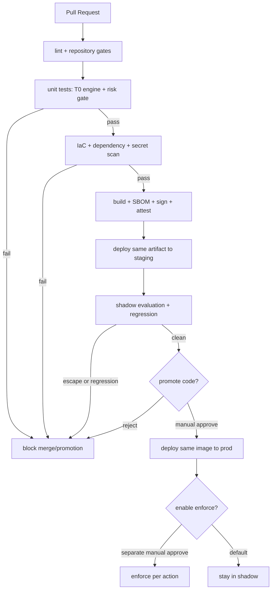

# 배포(배포)

배포는 앱 형상을 따릅니다: 기본 1 복제본의 **headless 이벤트-기반 코어**, 명시적 선택
**얇은 콘솔 + Operator API**, 그리고 **PR-네이티브 + ChatOps** 딜리버리
([app-shape.instructions.md](../../../.github/instructions/app-shape.instructions.md) 참조).
인프라는 코드이며, 모든 릴리스는 [release and Rollback](#release-and-rollback) 에 정의된
계층화된 롤백 경로로 되돌릴 수 있습니다.

코어는 **CSP-중립 설계** 입니다: 클라우드 접근은 프로바이더 어댑터 뒤에 있으므로, 아래 Azure
매핑이 유일한 구현 대상입니다. **비-Azure 프로바이더는 TBD** 입니다
([구현 Focus](../../../.github/copilot-instructions.md#implementation-focus-must)).
어댑터 표면은 보존되어 향후 대상은 추가적입니다. 다운스트림 분포는 코어를 편집하지
않고 프로바이더 구현을 제공할 수 있으며, 각 배포는 구성으로 신원과
상태 연결을 제공합니다.
([generic-scope.instructions.md](../../../.github/instructions/generic-scope.instructions.md)).

## 구현 상태

### 구현 범위

| 영역 | 상태 | 근거 | 참고 |
|------|------|------|------|
| Terraform 계획/적용 및 공급망 게이트 | implemented | `.github/workflows/deploy-dev.yml`, `.github/workflows/container-supply-chain.yml` 및 집중 workflow 테스트 | 운영 입력, 이미지 증명, 표류 계획 및 post-apply smoke 검사가 제공됩니다. |
| 독립 서비스 protected 배포 | validated | `config/independent-service-live-evidence-manifest.json` 및 `config/independent-service-remote-evidence.json` | Protected 계획은 출처, 백엔드, 대상, 신원 및 이미지를 결합하고 peer 격리와 롤백 증적을 보존합니다. |
| Operator schema 및 catalog 초기화 | implemented | 현재 변경의 `infra/modules/operator-api/container-app/`, `.github/workflows/deploy-dev.yml` 및 `tests/integration/scripts/test_service_deploy_workflow.py` | Alembic Job 성공 후 별도의 Core-image Job이 변경 불가능한 Rule 및 Ontology 참조 projection을 기록합니다. |
| 자동 승격 및 점진적 배포 | not-started | 이 문서의 목표 설계 | 자동 dev -> staging -> prod 승격, traffic-split canary, SLO 롤백 및 콘솔 blue/green은 구현되지 않았습니다. |

### 구현 이력

| 날짜 | 상태 | 변경 | 근거 | 남은 작업 |
|------|------|------|------|-----------|
| 2026-08-13 | implemented | 이전 provenance를 재구성하지 않고 implementation ledger를 도입하고 schema migration 뒤 배포된 Operator catalog 초기화를 추가했습니다. | current change, 집중 deployment workflow 및 Terraform 검사 | Catalog Job의 통제된 적용 증적을 수집하고 점진적 배포 목표를 구현합니다. |
| 2026-08-14 | implemented | Co-host 호환 경로가 제거된 뒤 인제스트 롤백 지침을 수정했습니다. 이제 롤백은 독립 API 및 워커의 정확한 이전 개정 번호를 복원합니다. | `current change`, 집중 Terraform 검증 및 mock 인제스트 테스트 5개 통과 | 배포 가이드와 mock 테스트를 독립 서비스 루트에 맞게 유지합니다. |

### 남은 작업

- [ ] Operator migration Job이 catalog Job보다 먼저 성공하고 이후 두 immutable projection
  key를 읽을 수 있음을 보여 주는 리포지토리에 안전한 통제된 적용 증적을 보존합니다.
- [ ] 문서화된 자동 artifact 승격, traffic-split canary, SLO 롤백 및 콘솔 blue/green
  흐름을 집중 테스트와 통제된 런타임 증적으로 구현합니다.

## 환경(Environments)

승격은 **단방향** (`dev → staging → prod`) 이며 **아티팩트 단위** 입니다: staging을
통과한 동일한 서명된 이미지가 prod로 승격됩니다 - 절대 환경별로 재빌드하지 않습니다.
Staging은 prod 토폴로지를 미러링하여 shadow 평가가 대표성을 갖도록 합니다.

| 환경 | 목적 | 자율성 수준 |
|------|------|-------------|
| `dev` | 개발 및 통합 검증 | 권위 있는 승격 상태, 동일한 risk/HIL 게이트 |
| `staging` | pre-prod 검증, 신규 규칙/액션 shadow 평가 (prod 미러) | shadow, 선택적 강제 적용 |
| `prod` | 라이브 운영 | 저위험은 강제 적용; 고위험은 HIL |

- 환경별로 설정이 다름; **소스에 환경 값 없음** - 모두 런타임 주입.
- 배포는 코어 편집 없이 환경 구성을 제공합니다. 환경은 기능을
  promote하거나 demote하지 않습니다. [ADR-0002](../architecture/decisions/0002-independent-runtime-axes-ko.md)를
  참조하세요.
- **콘솔과 실행기는 별개 신원으로 배포** - 콘솔은 읽기 전용이며 실행기의 privileged
  Managed Identity를 절대 보유하지 않음
  ([security-and-identity-ko.md](../architecture/security-and-identity-ko.md) 참조).

## Infrastructure as 코드

- 모든 인프라는 `infra/` 에 정의(Terraform 주, Azure-only 부분은 Bicep 선택). **코어 엔진은
  CSP-중립 유지**; 벤더 특이 IaC는 런타임 어댑터와 동일한 프로바이더 경계 뒤에 있습니다.
- **상태 관리**: 앱 계층은 원격 백엔드 + locking + **환경별 상태 격리**를 사용합니다.
  첫 `infra/bootstrap/` 적용은 상태 백엔드를 만들기 때문에 로컬 상태를 사용합니다. 백엔드와
  VNet 실행기가 준비되면 초기화 상태를 전용 `ops/bootstrap/<environment>.tfstate` 키로
  이동합니다. 이동한 원격 키가 권위 상태이며, 로컬 출처는 계보, serial, 리소스 개수를
  검증할 때까지만 제한된 이행 백업으로 유지합니다.
- **독립 서비스 상태 전환**: 각 런타임 서비스는 별도 백엔드 키를 사용합니다. 이행
  도구는 두 상태를 모두 백업하고 선언된 주소 하나를 이동합니다. 출처에 copy가 0개이고
  대상에 정확히 1개일 때만 전환을 수락합니다. 이전 방식 배포 계획 게이트는 migrated
  출처 주소의 이후 생성, 갱신, replacement, 삭제를 차단합니다. Protected 서비스 계획과
  성공한 적용은 작업 전후 peer 상태 4개를 모두 pull합니다. 각 peer의 정본 상태 다이제스트,
  serial, 계보 다이제스트 및 managed-resource 개수를 비교합니다. Raw 상태는 즉시 삭제하고
  업로드하지 않으며, 작업 흐름은 sealed peer-isolation 증적을 90일 동안 보존합니다.
- **최초 서비스 런타임 전환**: 상태 소유권을 이동한 뒤 첫 protected 계획은 명시적
  `initial_cutover` 모드를 사용합니다. Sealed 계획은 리소스 신원, platform, 워크로드
  신원, 리소스 한도, 시크릿 출처 이력, sidecar를 그대로 유지하면서 이전 방식 명령,
  환경, 시크릿 연결, 기본 탐색을 서비스 소유 계약으로 바꿀 수 있습니다.
  Core는 이미 활성화된 isolated-Executor 전환 표시를 제거할 수 있지만 어떤 서비스도
  권한을 추가할 수 없습니다. 이후 계획은 별도로 검토된 배포 모드가 추가되지 않는
  한 image-only 갱신으로 돌아갑니다. 서비스 계약에는 운영 항목 지점이 소비하는
  모든 환경 값이 포함됩니다. 예를 들어 Core는 protected 계획이 시작 검증을
  통과하기 전에 Azure 테넌트, 구독, 지역, PostgreSQL 호스트 및 데이터베이스를 연결합니다.
- **표류 감지**: 환경별로 스케줄된 읽기 전용 `plan`은 이전 방식 platform 루트, 독립 서비스 루트
  5개, 초기화 루트를 모두 검사합니다. 루트 계약은 서로 다른 백엔드 키를 사용하고
  새로 고침 전 상태에서 서비스 이미지를 해석하므로 out-of-band 이미지 변경도 드러납니다. 상태나
  입력이 없거나 근거를 읽을 수 없거나 표류가 발견되면 실행이 실패합니다. 표류를 prod에
  자동으로 적용하지 않습니다.
- 프로비저닝 리소스 - **최소 비용 효율 세트** (전체 인벤토리 + 티어 결정은
  [deploy-and-onboard-ko.md](deploy-and-onboard-ko.md#azure-resource-inventory-minimum-set);
  인벤토리는 [csp-neutrality-ko.md](../architecture/csp-neutrality-ko.md) 의 CSP-중립 계약을 렌더링):
  - **Container Apps 환경** (Consumption) 에서 실행되는 **하나의 control-loop 코어
    Container App** 으로 `event-ingest` + `trust-router` + `executor`
    + `audit-writer`, 런타임이 이식 가능하도록 **OCI 이미지 + Knative 호환 매니페스트 서브셋**
    에서 배포 ([csp-neutrality-ko.md § 런타임 계약](../architecture/csp-neutrality-ko.md#2-런타임-계약--oci-이미지--knative-호환-매니페스트)).
    Core에는 sidecar/유입이 없습니다. 명시적 선택 Operator API, 공개 인제스트 API, ClamAV
    sidecar를 가진 내부 인제스트 워커 및 Isolated 실행기는 별도 Container App입니다.
    실행기 앱은 유입이 없고 기본 배포는 shadow-only를 유지합니다. 명시적 SD-08
    전환이 게이트웨이 호출자 권한과 액션 신원을 Core에서 이동합니다.
  - **Container Apps Jobs** (같은 환경) 로 스케줄 프로브, 경량 트리거 및 범위가 제한된 배포
    준비를 실행하며 런타임 예약에서 Azure Functions를 대체합니다. Operator 배포는 schema
    migration Job을 먼저 실행한 뒤 별도의 digest-pinned Core-image Job으로 변경 불가능한 Rule
    및 Ontology 참조 projection을 기록합니다. 명시적 선택 개발 전용 FC1 Function App은
    예외이며, 비공개 리소스에 등록된 연산을 중계할 뿐 스케줄러나 control-loop 런타임이
    아닙니다.
  - **Event Hubs** (Standard 1-TU 이름 공간 샤드 2개, auto-inflate off) 를 **`:9093` 의
    Kafka 엔드포인트 로만** 소비 - CSP-중립 이벤트 버스 계약
    ([csp-neutrality-ko.md § 이벤트버스 계약](../architecture/csp-neutrality-ko.md#1-이벤트버스-계약--kafka-와이어-프로토콜)).
    기본 샤드는 통제된 유입, 해당 DLQ, HIL, 파이프라인 단계를 소유합니다. Operational
    샤드는 canary + DLQ, 시작 round-trip, raw 인벤토리, 실행기 명령 + DLQ 및 실행기
    증적 개체를 소유하며 Standard 계층의 이름 공간당 개체 10개 제한을 지킵니다.
    구독 리소스 쓰기/삭제는 managed-identity Event Grid 구독이
    `aw.inventory.raw`로 forward합니다. 독립 Service Bus와 custom Event Grid 토픽은 없습니다.
  - **PostgreSQL Flexible Server** (Burstable B1ms, 1 영역, 7일 백업) 을 감사 + KPI +
    패턴 라이브러리 + **pgvector** T1 임베딩의 단일 저장소로.
  - **비공개 StorageV2 case-history 계정**에 Shared Key 비활성화, Blob versioning,
    soft 삭제, 범위가 제한된 버전 수명 주기, 전용 non-executor 워크로드 신원, 비공개 엔드포인트를
    적용합니다. 내용 기반 주소를 가진 사례 개정 번호를 저장하고 PostgreSQL에는 rebuildable hot
    인덱스만 유지합니다.
  - **Key Vault** 를 시크릿 백엔드 로, 앱은 **Container Apps native 시크릿 + Key Vault
    참조** 를 통해 소비 - 앱은 env vars 만 읽고 시크릿 SDK 를 가져오기 하지 않음
    ([csp-neutrality-ko.md § 시크릿 계약](../architecture/csp-neutrality-ko.md#3-시크릿-계약--환경변수--k8s-secret)).
  - **여러 User-assigned Managed Identity** + 범위된 롤 할당, `WorkloadIdentity` 인터페이스
    (OIDC 토큰) 로 코어에 노출 - [security-and-identity-ko.md](../architecture/security-and-identity-ko.md)
    및 [csp-neutrality-ko.md § 워크로드 아이덴티티 계약](../architecture/csp-neutrality-ko.md#4-워크로드-아이덴티티-계약--oidc-토큰) 참조.
    실행기, 인벤토리, canary, 세 버티컬 신원이 기본 배포되고 읽기/명령/isolated-
    실행기 shadow 전송 계층/인제스트 API/인제스트 워커/인제스트 이행/알림
    신원은 기능별 명시적 선택입니다. Shadow 전송 계층 신원에는 효과 역할이 없습니다.
  - **Log Analytics workspace + workspace-based Application Insights** (기본 30일 보존).
  - **Azure Container Registry** (Basic) 로 서명된 이미지.
  - 무료 티어 / 비-과금 요소: 명시적 선택 Static Web Apps (콘솔), 워크로드 신원 federation
    (CI/CD), 콘솔 SPA + API + 승인 봇의 앱 등록. Azure Bot은 다운스트림 Teams 채널이
    선택적으로 제공하며 업스트림 Terraform은 프로비저닝하지 않습니다
    ([user-rbac-and-identity-ko.md](../interfaces/user-rbac-and-identity-ko.md)).
- 명시적으로 연기: 별도 vector DB, 독립 Service Bus / 커스텀 Event Grid 토픽,
  Front Door / API 관리, secondary-region DR 리소스 (단계 4 - TBD).
- IaC는 CI에서 Terraform validate + pinned Trivy + Checkov로 스캔됩니다.

## CI/CD 파이프라인

```mermaid
flowchart TD
    PR[Pull Request] --> LINT[lint + repository gates]
    LINT --> UNIT[unit tests: T0 engine + risk gate]
    UNIT -->|fail| STOP[block merge/promotion]
    UNIT -->|pass| SCAN[IaC + dependency + secret scan]
    SCAN -->|fail| STOP
    SCAN -->|pass| BUILD[build + SBOM + sign + attest]
    BUILD --> STAGE[deploy same artifact to staging]
    STAGE --> SHADOW[shadow evaluation + regression]
    SHADOW -->|escape or regression| STOP
    SHADOW -->|clean| GATE{promote code?}
    GATE -->|manual approve| PRODCD[deploy same image to prod]
    GATE -->|reject| STOP
    PRODCD --> ENFORCE{enable enforce?}
    ENFORCE -->|separate manual approve| ON[enforce per action]
    ENFORCE -->|default| SHADOWMODE[stay in shadow]
```

- **CI 신원**: 파이프라인은 **단명, OIDC-federated** 신원으로 인증(장기 클라우드 키 CI에
  없음). 시크릿은 런타임에 시크릿 저장소에서 pull, 로그·빌드 아티팩트에 **절대 쓰지 않음**
  (시크릿 검사가 머지를 게이팅).
- **공급망**: `.github/workflows/container-supply-chain.yml`은 변경의 영향을 받는 service-owned
  Dockerfile을 선택합니다. 한 서비스의 소스만 변경되면 해당 이미지만 빌드하고 공용 계약,
  잠금 파일, 패키지 메타데이터 또는 워크플로가 변경되면 모든 서비스 이미지를 빌드합니다.
  수동 실행도 모든 이미지를 빌드합니다. 선택된 각 빌드는 HIGH/CRITICAL Trivy 발견 사항을
  차단하고 CycloneDX **SBOM**을 생성합니다. `main`/release에서는 검증된 이미지를 GHCR에
  publish하고 GitHub build-provenance/SBOM 증명을 기록합니다. Dockerfile base는
  **다이제스트**로 고정되고 uid 65532로 실행됩니다. 배포는 롤아웃 전에 증명과 다이제스트를
  검증하며 unattested 이미지를 차단합니다.
- **아티팩트 레지스트리**: 이미지와 그 SBOM/증명을 명시적 보존 정책으로 유지하여 어떤
  prod 개정 번호도 추적·재검증 가능.
- **ACR 인계**: 업스트림 GHCR은 범용 build-evidence 레지스트리입니다. ACR이 필요한 포크는
  재구축 없이 검증된 이미지를 copy하여 다이제스트를 유지하고 target-registry 증명을
  생성하거나 복사한 뒤 해당 ACR 다이제스트를 ARB 근거 매니페스트의
  `signed-image-provenance`로 연결합니다. ACR용 두 번째 빌드는 다른 대상을 만들기 때문에
  수락하지 않습니다. Private-runner 실행기 계획은 하나의 출처 개정 번호를 attested GHCR
  다이제스트로 해석하고 명시적 승격 입력이 있을 때만 해당 exact 대상을 가져오기하며 ACR
  다이제스트가 동일한지 검증한 뒤 Terraform에 연결합니다. Exact 적용은 protected 계획에 기록된
  이미지를 promote하거나 교체할 수 없습니다.
- **승격 게이트 체크리스트** (모두 통과 필수): T0-engine과 risk-gate 단위 테스트가 커버리지
  바에서 green; IaC + 의존성 + 시크릿 스캔 클린; shadow 평가에서 **정책 위반 escape 0**
  + 회귀 스위트 통과; staging SLO 건강.
- 새로운 자율 액션의 **강제 적용 승격**은 **별도의 명시적 승인** - 코드 배포가 강제 적용을
  자동 활성화하지 않음(기본은 shadow 유지,
  [security-and-identity-ko.md](../architecture/security-and-identity-ko.md) 참조).

## 점진 딜리버리(Progressive 전달, 목표 상태)

Traffic-split canary 전략은 아직 자동 배선되지 않았습니다. Platform deploy 작업 흐름은 단일
개정 번호를 적용한 뒤 canary 발행기 smoke를 실행합니다. 반면 독립 서비스 작업 흐름은 exact
적용 전에 현재 개정 번호와 이미지를 수집하고 새 리소스 id, 구독, 컴포넌트 tag, 이미지
다이제스트, 개정 번호를 검증합니다. Immediate 상태 검사가 실패하면 복구 개정 번호를 자동 생성하고
검증합니다. SLO 구간 트래픽 롤백은 계속 목표 설계입니다.

- **Core (Container Apps revisions)**: 트래픽 스플릿에 의한 **canary**. 단계로 승격(예: 5% →
  25% → 100%) 하며 헬스 신호로 게이팅. SLO burn, 에러율 급증, 가드 메트릭 상승 시 **자동
  롤백**([goals-and-metrics-ko.md](../architecture/goals-and-metrics-ko.md)).
- **Console (정적 호스팅)**: **blue/green** - 새 버전을 기존 옆에 게시하고 원자적으로 컷오버.
  읽기 전용이며 상태 없음.
- **DB 마이그레이션**: **expand/계약**, 전방향 전용. 추가 스키마 먼저 배포, 양쪽 형태를
  허용하는 코드 배포, 이후 릴리스에서 옛 형태 제거. 마이그레이션은 앱 개정 번호가 트래픽 받기
  **전에** 게이트된 스텝으로 실행되고, 개정 번호 롤백이 스키마를 깨지 않도록 하위 호환되는
  상태를 유지합니다. Online Alembic 실행은 database-scoped 트랜잭션 잠금으로 개정 번호 확인,
  DDL 및 version-row 갱신을 직렬화하므로 동시 시작 또는 테스트 워커가 같은 개정 번호를
  두 번 적용하지 않습니다. Operator migration이 성공하면 배포는 별도의 Core-image Job을 실행해
  변경 불가능한 리포지토리 catalog projection을 결정론적으로 새로 고칩니다. 이 행은 검토된 참조
  선언을 설명할 뿐 finding, inventory, incident, readiness 또는 실행 권한을 만들지 않습니다.

## 릴리스와 롤백(release and Rollback)

모든 자율 액션은
[architecture.instructions.md](../../../.github/instructions/architecture.instructions.md) 의
7개 안전조건(stop-condition, 롤백 경로, blast-radius 한도, 예행 실행, 리소스 잠금,
멱등성, 감사 항목)을
운반합니다; 배포 롤백은 액션당 롤백을 대체하지 않고 보완합니다.

- **애플리케이션 롤백**: 독립 서비스 배포는 immediate 상태 실패 뒤 exact captured 개정 번호와
  digest-pinned 이미지를 복원하고 복구 개정 번호를 검증한 다음 배포를 실패로 닫습니다.
  Isolated 실행기는 전환 설정도 선언된 `core-in-process` 권한 대체 경로로 되돌립니다.
- **인제스트 토폴로지 롤백**: 소비자 그룹이나 오프셋을 변경하지 않고 Document Ingestion
  API와 Document Processing Worker의 정확한 이전 개정 번호 및 digest-pinned 이미지를
  복원합니다. 제거된 `ingestion_cohost_worker` 입력은 계획 전에 거부됩니다.
- **액션 롤백**: PR-네이티브 액션은 git으로 되돌림; stateful 액션(예: DB DR)은 액션당 롤백 경로
  (스냅샷/복제본 복원)를 따르고 종료 전에 액션의 stop-condition에 대해 **복원을 검증**.
- **Rule-catalog 롤백**: 규칙은 catalog-as-code이며 버전 관리; 나쁜 규칙 세트는 업데이트
  파이프라인으로 되돌림. 규칙 세트 승격은 **회귀 스위트가 escape 0으로 통과** 를 요구; 실패한
  회귀는 승격을 블록하거나 규칙 세트를 강등 (
  [phase-2-quality-and-t1-ko.md](../phases/phase-2-quality-and-t1-ko.md) 참조).

## 컨트롤 플레인 재해 복구(Disaster 복구)

컨트롤 플레인은 다른 대상을 remediate하는 것뿐 아니라 자신도 복구해야 합니다. 정본
[컨트롤 플레인 재해 복구 설계](control-plane-disaster-recovery-ko.md)는 active-passive 프로파일,
single-writer 복구 에포크, 기본 fencing, 상태와 이벤트 복구, failback 및 근거
게이트를 정의합니다.

Dead-letter 큐만으로 regional 이벤트 복구를 수행할 수 없습니다. Event Hubs 메타데이터
disaster 복구는 이벤트 데이터를 복제하지 않으며 PostgreSQL geo-redundant 백업은 원격
point-in-time 복원이 아닙니다. 각 운영 배포는 명시적 이벤트 출처, 데이터 복구
방법, numeric RPO/RTO, 트래픽 strategy 및 측정된 장애 조치/failback 훈련 근거를
연결합니다.

## 관측성, SLO, 알림

- **원격측정**: OpenTelemetry 트레이스/메트릭/로그가 KPI 대시보드(metrics 1-4 및
  [goals-and-metrics-ko.md](../architecture/goals-and-metrics-ko.md) 의 가드 메트릭) 에 공급; 모든 자율 액션은
  상관 id 있는 감사 기록과 KPI 이벤트를 발행.
- **SLO**: 컨트롤 플레인 SLO 정의 (티어당 이벤트 처리 지연, 액션 성공률, 콘솔 가용성) + **에러
  예산**; SLO burn이 progressive-delivery 롤백에 공급.
- **알림**: 두 라인 - **운영** 알림(파이프라인 실패, IaC 표류, DLQ 깊이, SLO burn,
  검증기 실패율) 은 on-call로; **HIL** 알림은 고위험 승인을 Teams 채널로.
- **On-call과 런북**: 롤백, DR 장애 조치, DLQ 배출, 표류 조정에 대한 런북 유지. ChatOps
  다운 시 고위험 HIL 항목은 **큐잉되고 대체 경로로 알림** ; 승인 없이 auto-execute 없음.

## 비용 자세(비용 자세)

아래의 모든 비용 주장은 **측정된 베이스라인에 대해 검증할 방향 목표**
([goals-and-metrics-ko.md](../architecture/goals-and-metrics-ko.md)) 이지 보장이 아닙니다.

- 코어는 검증된 Kafka scaler가 없으므로 기본 1 복제본을 유지합니다. Scheduled 작업만 실행
  사이에 scale-to-zero합니다.
- 이벤트의 **작은 소수 (~5-10%)** 만 프론티어 모델에 도달하도록 설계; 토큰 예산이 지출 상한을
  두고 초과는 uncapped inference가 아니라 HIL로 강등.
- OSS 컴포넌트(OPA, IaC 스캐너, OpenCost, Chaos Mesh)가 per-seat 라이선스 비용 회피.

## 미결 결정(열림 Decisions)

- [x] IaC 엔진 - **해결: Terraform**. Bicep과 OpenTofu는 호환 대안이며 현재 배포 그래프는
  `infra/` HCL이 소유합니다([tech-stack-ko.md](../architecture/tech-stack-ko.md) 참조).
- [x] Compute 대상 - **해결: Azure Container Apps + Jobs**. AKS는 custom networking,
  DaemonSet, GPU 같은 측정된 요구가 생길 때만 재검토합니다.
- [ ] 강제 적용 승격을 위한 canary 스텝 함수와 자동 롤백 임계값.
- [x] Azure 원격 상태와 신원 - **해결: 비공개 Storage 백엔드 + VNet 자체 호스팅
  실행기 MI**, 환경별 상태 키. 비-Azure 대상의 per-CSP 신원은 TBD;
      [구현 Focus](../../../.github/copilot-instructions.md#implementation-focus-must)
      와 [security-and-identity-ko.md](../architecture/security-and-identity-ko.md) 참조).
