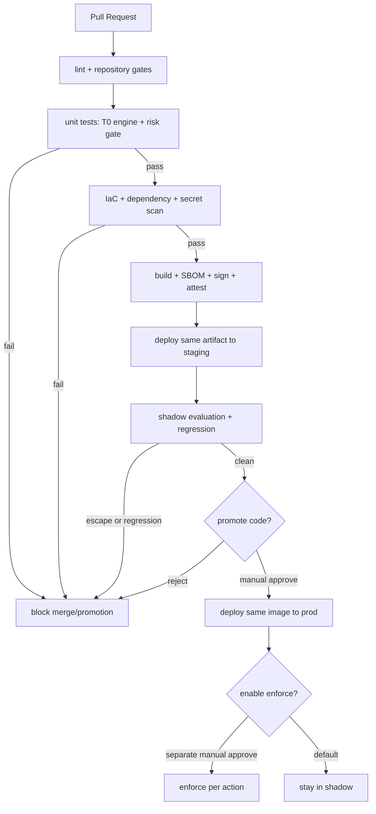

# Deployment

Deployment follows the app shape: a **headless, event-driven core** with one replica by default,
an opt-in **thin console + read API**, and **PR-native + ChatOps** delivery (see
[app-shape.instructions.md](../../../.github/instructions/app-shape.instructions.md)).
Infrastructure is code; every release is reversible through the layered rollback paths defined
in [Release and Rollback](#release-and-rollback).

The core is **CSP-neutral by design**: cloud access sits behind provider adapters, so the
Azure mapping below is the one implemented target. **Non-Azure providers are TBD** (see
[Implementation Focus](../../../.github/copilot-instructions.md#implementation-focus-must)); the
adapter surface is preserved so a future target is additive. A downstream distribution may supply
provider implementations without editing core; each deployment supplies identities and state
bindings through configuration (see
[generic-scope.instructions.md](../../../.github/instructions/generic-scope.instructions.md)).

> **Implementation status.** Terraform plan/apply, production input gates, image
> scan/SBOM/attestation, drift plans, and the post-apply canary Job smoke are shipped.
> Automated dev -> staging -> prod promotion, Container Apps traffic-split canaries,
> SLO-driven rollback, and console blue/green remain target designs. The core Container App
> currently uses `revision_mode = Single`.

## Environments

Promotion is **one-way** (`dev → staging → prod`) and **by artifact**: the same signed image
that passed staging is promoted to prod - never rebuilt per environment. Staging mirrors the
prod topology so shadow evaluation is representative.

| Environment | Purpose | Autonomy level |
|-------------|---------|----------------|
| `dev` | development and integration validation | authoritative promotion state; same risk/HIL gates |
| `staging` | pre-prod validation, shadow evaluation of new rules/actions (prod-mirrored) | shadow, selective enforce |
| `prod` | live operations | enforce for low-risk; HIL for high-risk |

- Config differs per environment; **no environment values in source** - all injected at runtime.
- A deployment supplies its environment config without editing core. Environment never promotes or
  demotes a capability; see [ADR-0002](../architecture/decisions/0002-independent-runtime-axes.md).
- **Console and executor deploy as distinct identities** - the console is read-only and never
  holds the executor's privileged Managed Identity (see
  [security-and-identity.md](../architecture/security-and-identity.md)).

## Infrastructure as Code

- All infrastructure defined in `infra/` (Terraform primary; Bicep optional for Azure-only
  bits). The **core engine stays CSP-neutral**; vendor-specific IaC lives behind the same
  provider boundary as the runtime adapters.
- **State management**: the app layer uses a locked remote backend with **per-environment state
  isolation**. Only the `infra/bootstrap/` ops layer keeps local state because it creates the
  state backend itself.
- **Drift detection**: scheduled `plan` (read-only) per environment surfaces drift as an alert
  and a reconciliation PR; drift is never silently auto-applied to prod.
- Provisioned resources - **minimum cost-efficient set** (full inventory + tier decisions in
  [deploy-and-onboard.md](deploy-and-onboard.md#azure-resource-inventory-minimum-set); the
  inventory renders the CSP-neutral contracts in [csp-neutrality.md](../architecture/csp-neutrality.md)):
  - **Container Apps environment** (Consumption) running **one control-loop core Container
    App** for `event-ingest` + `trust-router` + `executor` +
    `audit-writer`, deployed from an **OCI image + Knative-compatible manifest subset** so
    the runtime is portable ([csp-neutrality.md § Runtime contract](../architecture/csp-neutrality.md#2-runtime-contract--oci-image--knative-compatible-manifest)).
    The core has no sidecar or ingress. The opt-in read API and ingestion gateway with its
    ClamAV sidecar are separate Container Apps.
  - **Container Apps Jobs** in the same environment for scheduled probes and light triggers
    (replaces Azure Functions for runtime scheduling). An opt-in development-only FC1 Function
    App is the narrow exception: it relays registered operations to private resources and is not a
    scheduler or control-loop runtime.
  - **Event Hubs** (two Standard 1-TU namespace shards, auto-inflate off) consumed **only via
    Kafka endpoints on `:9093`** - the CSP-neutral event bus contract
    ([csp-neutrality.md § Event bus contract](../architecture/csp-neutrality.md#1-event-bus-contract--kafka-wire-protocol)).
    The primary shard owns governed ingress, its DLQs, HIL, and pipeline stages. The operational
    shard owns `aw.control.canary`, its DLQ, and `aw.inventory.raw`. This stays within the Standard
    tier's ten-entity namespace limit without mixing parser-specific payloads on one topic.
    Subscription resource writes/deletes are forwarded to `aw.inventory.raw` by a managed-identity
    Event Grid subscription. No Service Bus or custom Event Grid topic exists.
  - **PostgreSQL Flexible Server** (Burstable B1ms, 1 zone, 7-day backup) as the single store
    for audit + KPI + pattern library + **pgvector** T1 embeddings.
  - **Key Vault** as the secret backend, consumed by the app via **Container Apps native
    secret + Key Vault reference** - the app reads env vars only and never imports a secret
    SDK ([csp-neutrality.md § Secret contract](../architecture/csp-neutrality.md#3-secret-contract--environment--k8s-secret)).
  - **Multiple User-assigned Managed Identities** with scoped role assignments, exposed as
    the `WorkloadIdentity` interface (OIDC token) - see
    [security-and-identity.md](../architecture/security-and-identity.md) and
    [csp-neutrality.md § Workload identity contract](../architecture/csp-neutrality.md#4-workload-identity-contract--oidc-token).
    Executor, inventory, canary, and three vertical identities ship by default; read, command,
    ingestion, and notification identities are feature opt-ins.
  - **Log Analytics workspace + workspace-based Application Insights** (30-day default).
  - **Azure Container Registry** (Basic) for signed images.
  - Free-tier / non-billable elements: opt-in Static Web Apps (console), workload identity
    federation (CI/CD), and app registrations for console SPA + API + approval bot. A downstream
    Teams channel may supply Azure Bot; upstream Terraform does not provision it
    ([user-rbac-and-identity.md](../interfaces/user-rbac-and-identity.md)).
- Explicitly deferred: separate vector DB, standalone Service Bus / custom Event Grid topics,
  Front Door / API Management, secondary-region DR resources (Phase 4 - TBD).
- IaC passes Terraform validate plus pinned Trivy and Checkov scans in CI.

## CI/CD Pipeline

- **CI identity**: the pipeline authenticates with a **short-lived, OIDC-federated** identity
  (no long-lived cloud keys in CI). Secrets are pulled from the secret store at runtime and
  are **never** written to logs or build artifacts (secret scanning gates the merge).
- **Supply chain**: `.github/workflows/container-supply-chain.yml` builds the Dockerfile,
  blocks on HIGH/CRITICAL Trivy findings, emits a CycloneDX **SBOM**, publishes the verified
  image to GHCR on `main`/release, and writes GitHub build-provenance and SBOM attestations.
  The Dockerfile base is pinned by **digest** and runs as uid 65532. Deployment verifies the
  attestation and digest before rollout; an unattested image is rejected.
- **Artifact registry**: images and their SBOM/attestations are retained with an explicit
  retention policy so any prod revision can be traced and re-verified.
- **ACR handoff**: upstream GHCR is the generic build-evidence registry. A fork that requires
  ACR copies the verified image without rebuilding so the digest stays stable, creates or
  copies the target-registry attestations, and binds that ACR digest as
  `signed-image-provenance` in the ARB evidence manifest. Building a second image for ACR is
  not accepted because it produces a different subject.
- **Promotion gate checklist** (all must pass): T0-engine and risk-gate unit tests green at the
  coverage bar; IaC + dependency + secret scans clean; shadow evaluation shows **zero
  policy-violation escapes** and the regression suite passes; staging SLOs healthy.
- **Promotion to enforce** for any new autonomous action is a **separate, explicit approval** -
  deploying code never auto-enables enforce (default stays shadow, see
  [security-and-identity.md](../architecture/security-and-identity.md)).

## Progressive Delivery (target state)

These strategies are not automated yet. The current deploy workflow applies a single revision
and runs the canary publisher smoke. A failure stops the run but does not shift traffic back to
an earlier revision automatically.

- **Core (Container Apps revisions)**: **canary** by traffic split. Promote in steps
  (e.g. 5% → 25% → 100%) gated on health signals; **automated rollback** triggers on SLO burn,
  error-rate spikes, or a rise in the guard metrics
  ([goals-and-metrics.md](../architecture/goals-and-metrics.md)).
- **Console (static hosting)**: **blue/green** - publish the new version alongside the old and
  cut over atomically, since it is read-only and holds no state.
- **Database migrations**: **expand/contract**, forward-only. Ship additive schema first,
  deploy code that tolerates both shapes, then remove the old shape in a later release.
  Migrations run as a gated step **before** the app revision takes traffic and stay
  backward-compatible so a revision rollback does not break the schema.

## Release and Rollback

Every autonomous action carries the four safety invariants (stop-condition, rollback path,
blast-radius limit, audit entry) from
[architecture.instructions.md](../../../.github/instructions/architecture.instructions.md);
deployment rollback complements, not replaces, per-action rollback.

- **Application rollback**: shift traffic back to the previous container revision.
- **Action rollback**: PR-native actions revert via git; stateful actions (e.g. DB DR) follow
  the per-action rollback path (snapshot/replica restore) and **verify** the restore against
  the action's stop-condition before closing.
- **Rule-catalog rollback**: rules are catalog-as-code and versioned; a bad rule set is
  reverted via the update pipeline. Promotion of a rule set requires the **regression suite to
  pass with zero escapes**; a failing regression blocks promotion or demotes the rule set (see
  [phase-2-quality-and-t1.md](../phases/phase-2-quality-and-t1.md)).

## Control-Plane Disaster Recovery

The control plane must recover itself, not only remediate others.

- **State/audit store**: point-in-time backups with defined **RPO/RTO**; the append-only audit
  log is the source of truth and is restorable for deterministic replay (judge-only, never
  re-executes).
- **Event bus**: rely on ordering plus **dead-letter queues**; on recovery the core reprocesses
  from the DLQ (idempotency keys prevent double-apply) rather than dropping events.
- **Region/availability**: IaC can re-provision the stack in an alternate region from state +
  backups; failover is a rehearsed runbook, not an ad-hoc action.

## Observability, SLOs, and Alerting

- **Telemetry**: OpenTelemetry traces/metrics/logs feed the KPI dashboard (metrics 1-4 and the
  guard metrics in [goals-and-metrics.md](../architecture/goals-and-metrics.md)); every autonomous action emits
  an audit record and KPI event with a correlation id.
- **SLOs**: define control-plane SLOs (event-processing latency per tier, action success rate,
  console availability) with **error budgets**; SLO burn feeds progressive-delivery rollback.
- **Alerting**: two lanes - **operational** alerts (pipeline failure, IaC drift, DLQ depth,
  SLO burn, verifier failure rate) route to on-call; **HIL** alerts route high-risk approvals
  to the Teams channel.
- **On-call and runbooks**: maintain runbooks for rollback, DR failover, DLQ drain, and drift
  reconciliation. If ChatOps is down, high-risk HIL items **queue and alert via a fallback**;
  nothing auto-executes without approval.

## Cost Posture

All cost claims below are **directional targets to validate against a measured baseline**
([goals-and-metrics.md](../architecture/goals-and-metrics.md)), not guarantees.

- The core keeps one replica until a Kafka scaler is verified. Scheduled Jobs scale to zero
  between executions.
- Only a **small minority (~5-10%)** of events are designed to reach a frontier model; token
  budgets cap spend and overflow degrades to HIL rather than uncapped inference.
- OSS components (OPA, IaC scanners, OpenCost, Chaos Mesh) avoid per-seat license cost.

## Open Decisions

- [x] IaC engine - **resolved: Terraform**. Bicep and OpenTofu remain compatible alternatives;
  the current deployment graph is owned by `infra/` HCL (see [tech-stack.md](../architecture/tech-stack.md)).
- [x] Compute target - **resolved: Azure Container Apps + Jobs**. Revisit AKS only for a
  measured need such as custom networking, DaemonSets, or GPUs.
- [ ] Canary step function and automated-rollback thresholds for enforce promotion.
- [x] Azure remote state and identity - **resolved: private Storage backend + VNet self-hosted
  runner MI**, with a state key per environment. Per-CSP identity for non-Azure targets is TBD; see
      [Implementation Focus](../../../.github/copilot-instructions.md#implementation-focus-must)
      and [security-and-identity.md](../architecture/security-and-identity.md)).
