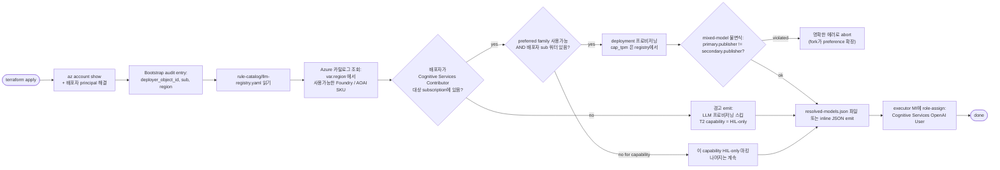

# Runtime Parity - Authoritative Local Development 및 Test Fixture

**목표**: 자동화 테스트는 결정론적이고 secret-free 상태를 유지하며, interactive local
Console은 운영자의 실제 Azure 개발 환경만 표시합니다. Azure 배포에서는 계속 **배포자의
Azure 권한과 리전 카탈로그가 어떤 LLM과 기타 리소스를 프로비저닝할지 결정**합니다.
세 명제가 동시에 참입니다:

- **자동화 테스트 truth**: pytest와 committed mock은 결정론적 fake를 사용할 수 있습니다.
  명시적 test-fixture builder를 사용하며 Azure 관측 상태로 표현하지 않습니다.
- **Full-stack local truth**: `Console Web: Full Stack`은 deployment와 같은 App Role 검사를
  적용하는 browser Entra sign-in을 사용합니다. Server의 Azure CLI session은 Azure development
  data plane provider credential만 제공합니다. Inventory, model availability, agent activity,
  Process state, promotion evidence, audit data는 authoritative provider에서만 표시합니다.
  Source가 없으면 unavailable 또는 명시적 empty로 표시하며 생성 예제로 대체하지 않습니다.
- **Deploy truth**: `terraform apply` 가 CSP-neutral 컨트랙트의 Azure 측 실현체를 생성.
  **LLM 부분은 배포자-스코프**: bootstrap resolver가 배포자 아이덴티티를 대상 리전
  카탈로그와 대조해 **배포자가 만들 권한이 있는 것만** 프로비저닝하고, resolved
  `{capability → deployment}` 매핑과 resolver 입력 provenance를 artifact에 기록합니다.

모든 profile은 **하나의 control path**를 공유하며 composition-root adapter와 credential만 다릅니다.
([project-structure.md § Customization via Dependency Injection](../architecture/project-structure-ko.md#customization-via-dependency-injection)).
실제 Azure 클라이언트 추가는 fork-side injection이고 `core/` 는 절대 안 건드림.

## 전수조사 - 로컬 동작 vs Azure 필요

2026-07-21 기준. "자동화 테스트"는 test runner가 실행하는 pytest 또는 committed mock을
뜻합니다. "Full-stack local"은 operator에 browser Entra를 사용하고 server-side Azure adapter에
현재 Azure CLI context를 사용하는 VS Code compound launch입니다. Test fixture는 이 launch
profile에서 활성화되지 않습니다.

### 자동화 테스트에서 완전 동작 (Azure 불필요)

| 서브시스템 | 로컬 backend | 비고 |
|-----------|-------------|------|
| T0 결정론 엔진 | `opa` 바이너리 + Rego 정책 + rule catalog | 100% 오프라인; CI parity gate가 증명 |
| Rule catalog 로더 + shadow eval 파이프라인 | 파일시스템 YAML | 클라우드 콜 없음 |
| Risk gate + promotion registry | 인-메모리 `ActionPromotionRegistry` | seam 스왑 가능 |
| Executor + resource lock | 인-프로세스 | fixture 전용이며 interactive executor가 아님 |
| Audit store | `InMemoryStateStore` (hash-chain 검증) | prod backend = Postgres |
| Event ingest + trust router | 인-프로세스 | 버스 미배선 |
| Verticals (Resilience / FinOps / Change Safety) | 순수 결정 모듈 | 클라우드 없음 |
| Quality gate | `StaticVerifier` + `MatchTypeCrossCheckModel` + `InMemoryGroundingSource` | [llm-strategy-ko.md § T2](../architecture/llm-strategy-ko.md#t2--reasoning-tier-quality-gate-required) 참조 |
| T1 유사도 | `DeterministicEmbeddingModel` + `InMemoryPatternLibrary` | 해시 기반, 실제 임베딩 없음 |

Operator browser E2E test는 명시적인 dev-test profile에서 실제 Vite SPA를 Playwright로
실행합니다. Route interception은 선언된 synthetic read-source manifest, incident, agent frame 및
chat SSE response를 제공합니다. 이 fixture는 test runner 안에서만 존재하며 `Console Web: Full
Stack`에서는 활성화되지 않습니다. Backend integration test는 같은 request contract를 실제
Starlette route와 server-owned evidence resolver로 별도 검증합니다.

### dev-up.sh 필요 (여전히 로컬)

| 서브시스템 | 로컬 backend | Prod backend |
|-----------|-------------|--------------|
| State store (통합 테스트) | `pgvector/pgvector:pg16` on `:5432` | Azure PostgreSQL Flexible + pgvector |
| Event bus (통합 테스트) | Redpanda on `:19092` (Kafka wire) | Event Hubs Kafka on `:9093` |

### 고정 workspace port

커밋된 VS Code 설정은 각 local web surface가 항상 같은 port를 사용하게 합니다. 정적 design mock
site는 인증된 Console full stack과 분리되어 있습니다.

| Surface | 기본 address | Workspace entry point |
|---------|-------------|-----------------------|
| Design mock | `http://127.0.0.1:5373` | `design mocks: serve (5373)` task 또는 Live Server |
| Console SPA | `http://127.0.0.1:5273` | `Console Web: Frontend` |
| Read API | `http://127.0.0.1:8010` | `Console Web: Read API` |
| Test ingestion gateway | `http://127.0.0.1:8011` | `Console Web: Ingestion Gateway` |

`Console Web: Full Stack` compound는 core runtime, Console SPA, read API를 시작합니다. 정적 design
mock과 격리된 test ingestion gateway는 시작하지 않습니다.

### Workspace context 정리

커밋된 VS Code 설정은 dependency tree, cache, 생성된 report, local runtime state, secret,
Terraform state 및 임시 output을 용도에 따라 Explorer, search 또는 file watching에서
제외합니다. 이 제외는 editor 부하를 줄이고 생성되거나 로컬에만 있는 artifact가 기본 workspace
search context에 포함되지 않게 합니다. 탐색 기본값일 뿐이므로 명시적 작업에서는 제외된 경로를
직접 열 수 있습니다. 어떤 제외도 evidence profile, authentication mode, action lifecycle 또는
runtime adapter를 선택하지 않습니다. Source, test 및 담당 design doc은 계속 검색할 수 있습니다.

### 로컬 개발의 Console 데이터

Canonical local read API는 `FDAI_READ_API_LOCAL_ENTRA=1`을 사용하고 deployment와 route-owned runtime helper를 공유합니다. Browser가 API token을
얻고 API는 deployment와 동일하게 JWT 및 App Role을 검증합니다. Server의 Azure CLI token은
Resource Graph, Microsoft Graph, model discovery, Event Hubs 같은 Azure adapter로 제한됩니다.
`FDAI_READ_API_LOCAL_AZURE_CLI=1`과 `VITE_LOCAL_AZURE_CLI_AUTH=1` 조합은 fixed role ceiling을
사용하는 명시적 CLI-principal debug 대안입니다.

`FDAI_MONITOR_WORKSPACE_ID`가 설정되면 명시적 Command Deck `query_log` 명령은 두 profile에서
같은 bounded Azure Monitor Logs provider를 사용합니다. Interactive local은 현재 Azure CLI
context에서 data plane token을 얻고 deployment는 `FDAI_MI_CLIENT_ID`가 선택한 전용 read-API
managed identity를 사용합니다. Workspace는 server config로 정하며 browser가 변경할 수 없습니다.
Workspace, identity, permission 또는 telemetry를 사용할 수 없으면 fixture나 model fallback 없이
unavailable로 보류합니다.

Local runtime environment generator는 applied subscription 및 resource group도 bounded Azure
read-investigation adapter에 제공합니다. Terraform이 optional development operations gateway URL과
Easy Auth audience를 모두 출력하면 NSG 및 VNet peering 질문은 local Azure CLI identity로 gateway의
registered read operation만 호출합니다. Pair가 없으면 wrapper를 비활성화하고 configured gateway가
실패하면 direct ARM fallback 없이 unavailable을 보고합니다. Gateway는 reader/executor managed
identity를 분리하며 local read API에 execution identity를 제공하지 않습니다. Mutation은 target-scoped
Blob lease와 durable idempotency claim을 사용하며 upstream Terraform은 configured executor
principal에 development-only mutation operation을 활성화하고 gateway URL과 audience는 headless core
Container App에만 전달합니다. 해당 runtime은 `AzureGatewayDirectApiExecutor`를 bind하며 read API는
read-only gateway transport를 유지하고 enforce capability를 받지 않습니다. Executor는 정확한 registered
operation, arguments, idempotency, audit, stop-condition, rollback 및 impact evidence에 대해
server-issued dry-run receipt를 먼저 요청해야 합니다. Gateway는 bounded reader-identity ARM GET으로
target을 확인하고 해당 receipt를 private Blob storage에 5분 동안 저장한 다음 target-scoped resource
lease를 획득하여 ARM을 호출하기 전에 ETag compare-and-swap으로 한 번만 소비합니다. Caller가
주장한 receipt, 변경된 payload, 만료되거나 replay된 receipt는 mutation 전에 실패합니다. ARM
long-running operation은 `submitted` 상태로 유지되며
executor만 원래 idempotency key를 통해 server-owned status URL을 조회할 수 있습니다.
Stale pending claim은 계속 차단된 상태로 남지 않고 bounded timeout 이후 ETag compare-and-swap으로
복구됩니다.
동일한 plan을 반복하면 소비되지 않은 같은 receipt를 반환합니다. 소비되거나 만료된 plan은 새
idempotency key가 필요합니다. ARM throttling은 최대 3회까지 bounded `Retry-After`를 따르며 mutation
`5xx` response는 결과가 ambiguous할 수 있으므로 자동으로 반복하지 않습니다.

동일한 read-investigation wiring은 applied subscription 및 resource group으로 bounded Azure
subscription-health provider를 구성하므로, local 개발도 deployment와 동일한 Azure adapter를 통해
subscription-health 질문에 답합니다. Local factory는 read-investigation wiring이 존재할 때만 해당
provider를 read API에 주입하여 read-only, server-owned data-plane 경계를 유지합니다.

Local factory는 15개 agent를 기본으로 모두 시작합니다. `FDAI_START_PANTHEON`은 disable-only
control입니다. 값이 없으면 활성화하고 `0`, `false`, `no`, `off`만 runtime을 비활성화합니다.
Event Hubs가 설정되면 agent는 전용 local consumer group으로 Azure transport를 사용합니다.
설정되지 않으면 local in-process EventBus가 실제 Pantheon message를 전달하고 agent SSE snapshot을
제공합니다. 이 adapter는 Azure evidence, durable state 또는 execution authority를 만들지 않습니다.
Kafka가 구성된 topic을 startup 중 거부하면 Event Hubs adapter는 오류를 전달하기 전에 실패한 consumer를 닫습니다.

Local runtime environment generator는 applied Terraform output에서 transport setting을 읽습니다.
Terraform executor identity resource ID에 포함된 subscription과 활성 Azure CLI subscription을
비교하고 둘이 다르면 resource 조회나 파일 생성 전에 중단합니다.
또한 local user와 host에서 식별 정보를 노출하지 않는 consumer instance hash를 파생하므로 동시에
실행하는 개발자가 같은 Event Hubs Kafka consumer group에 참여하지 않습니다. Automation에서
명시적으로 안정된 이름이 필요하면 `FDAI_LOCAL_CONSUMER_INSTANCE`에 최대 20자의 lowercase
alphanumeric 및 hyphen identifier를 설정할 수 있습니다. 생성된 core, Pantheon, read API group은
이 instance를 사용하고 deployed read API replica는 runtime hostname을 사용합니다. 따라서 각
console stream은 다른 developer 또는 replica와 partition을 나누지 않고 모든 frame을 수신합니다.

Workflow definition은 deployment와 같은 enforce allowlist를 사용하며 각 ActionType은
authoritative promotion 및 risk gate의 적용을 받습니다. Enforce workflow에는 계속 Azure event
transport가 필요합니다. Thor는 developer credential을 받지 않으며 privileged execution은
deployed Managed Identity runtime에 남습니다. Scenario replay, seeded audit row, recording
executor, VM-task fake, synthetic scheduler/cost data, scope template, blast-radius fixture는 pytest
전용입니다.

FDAI Azure PostgreSQL, Event Hubs, runtime, executor resource가 없으면 해당 surface는 runtime
claim 없이 unavailable 또는 empty로 표시됩니다. Repository catalog와 schema는 observed runtime
evidence가 아니라 configuration-as-code이므로 계속 표시합니다.

Local API는 `GET /system/data-sources`를 제공합니다. Standard full stack에서는 production
PostgreSQL read-model adapter가 local pgvector를 사용합니다. Local read API는 traffic을 받기 전에
해당 adapter를 통해 bounded `SELECT 1`을 실행합니다. Probe가 실패하면 부분적으로 연결된 콘솔을
노출하지 않고 startup을 중단합니다. Probe가 성공하면 PostgreSQL 기반 entry는 `available` 및
`reachable=true`를 보고합니다. 구성된 remote 및 Azure request-time source는 자체 evidence
contract가 검증할 때까지 `unknown`을 유지합니다.
`FDAI_DATABASE_URL`과 `FDAI_AUTHORITATIVE_READ_API_BASE_URL`은 상호배타적인 source profile을
선택합니다. 둘을 함께 구성하면 provider를 만들기 전에 startup을 중단하므로 manifest가 local
PostgreSQL을 설명하면서 allowlist request를 remote API가 처리하는 상태를 허용하지 않습니다.
Remote forwarding은 decoded canonical allowlisted path만 일치시키며 normalized, encoded, 중복
separator 및 control-character variant는 local에 유지합니다. Upstream cache directive를 폐기하고
모든 proxy response에 `Cache-Control: no-store`를 보내므로 인증된 operational evidence가 browser
또는 shared cache에 저장되지 않습니다. Response header 전에 발생한 remote failure는 bounded JSON
`503`으로 변환하고, header 이후 failure는 두 번째 ASGI response start 없이 response body를 닫습니다.

Runtime skill inspection도 같은 규칙을 따릅니다. Production은 traffic을 받기 전에 signed
PostgreSQL trusted-artifact record에서 enabled catalog를 재구성합니다. Interactive local은 durable
verified store가 명시적으로 compose되지 않으면 empty fail-closed snapshot으로 같은 Reader-gated
`/skills` contract와 narrator verb를 노출하며 installed skill이나 load outcome을 만들지 않습니다.

Agent Activity는 live runtime frame과 durable audit row를 분리합니다. 관찰된 agent를 선택하면
live state, current work, runtime binding, state timestamp, stream provenance, incident context를
항상 표시합니다. 현재 window에 귀속 audit row가 없으면 live summary를 대체하거나 audit event를
추론하지 않고 timeline에서 그 부재를 명시합니다.
Headless Pantheon은 control-loop progress를 전달하는 동일한 `aw.pipeline.stages` transport에 실제
health에서 파생한 `agent.runtime-state` frame을 발행합니다. Read API는 runtime-state frame과 stage
frame을 구분하고 consumer가 live이며 health probe가 error가 아닌 agent만 전달합니다. Interactive
local과 deployment는 같은 cross-process 경로를 사용하며 local profile은 agent activation이나 stream
semantic이 아니라 PostgreSQL binding만 바꿉니다.
Browser는 해당 tab이 열려 있는 동안 최근 100개 SSE frame도 보존하고 별도 live journal로
표시합니다. Runtime heartbeat는 연결을 증명하지만 work로 계산하지 않습니다. Collecting,
analyzing, deciding, executing, approving, auditing, Incident 및 handoff frame은 work로 계산합니다.
이 journal은 bounded 및 non-durable이며 reload 시 초기화되고 각 frame에 기록된 source를
보존합니다. Append-only audit log를 대체하지 않습니다.

완료된 conversation review도 같은 분리를 따릅니다. Interactive local transport는 bounded Bragi
`object.turn` envelope를 발행할 수 있지만 reviewer나 durable proposal store를 만들어 내지
않습니다. Deployed headless runtime은 결정론적 ineligible/unsupported reason을 기록하고 서로 다른
두 model family가 resolve된 경우에만 Azure reviewer를 사용합니다. PostgreSQL은 restart-safe review
및 draft state를 보관하며 production read API는 process memory를 공유하거나 approval endpoint를
추가하지 않고 해당 row를 projection합니다.

### Azure-backed integration

| 서브시스템 | 상태 | 갭 |
|-----------|------|-----|
| Azure Resource Graph inventory | Production은 promoted PostgreSQL snapshot과 Huginn의 real-time delta overlay를 읽습니다. | Full-stack local은 subscription 및 Azure CLI profile fingerprint로 격리한 `.fdai/cache/inventory` snapshot과 함께 읽기 전용 `AzureCliInventory`를 사용하며 synthetic opt-out을 거부합니다. |
| Azure Monitor Logs KQL | Production과 local adapter가 `AzureLogAnalyticsQueryProvider`를 공유합니다. | Server-owned `FDAI_MONITOR_WORKSPACE_ID`가 필요하며 명시적 `query_log`는 unavailable일 때 fail closed합니다. |
| Managed Identity 토큰 (`WorkloadIdentity`) | Deployed adapter 존재 | interactive local은 deployed executor로 publish하며 fixture test만 local issuer 사용 |
| Governed execution backend | Provider-neutral Protocol, profile registry, durable PostgreSQL ledger, bubblewrap/VM adapter, Azure Container Apps Job adapter가 존재합니다. | Profile은 기본적으로 disabled이고 local interactive에는 executor binding이 없으며 promotion 전에 live Azure Job evidence가 필요합니다. |
| Browser evidence | Provider-neutral contract, 선택적 Playwright adapter, PostgreSQL artifact, GET-only inspection이 존재합니다. | 기본 unbound이며 interactive local에는 executor identity가 없습니다. Isolated restricted-egress browser runtime과 exact origin policy를 구성하기 전에는 unavailable로 표시합니다. |
| Key Vault secret provider (`SecretProvider`) | deployment가 Key Vault reference 주입 | interactive adapter는 environment reference 사용, fixture value는 test 전용 |
| GitOps PR publisher | 실제 GitHub adapter 존재 | interactive execution은 configured adapter 사용, recording publisher는 test 전용 |
Local inventory cache는 final fence에 도달한 scan만 promote하고 atomic replace로 기록합니다.
Fresh cache는 read API restart 이후에도 즉시 반환됩니다. 만료되었거나 Huginn이 invalidate한 cache는
`cache.status=refreshing`인 `stale` 상태로 즉시 반환되고, background Azure CLI scan이 이를 원자적으로
교체합니다. Provision된 `aw.inventory.raw` topic을 `FDAI_INVENTORY_RAW_TOPIC`으로 구성하면 수락된
write/delete event가 durable projection 이후 local cache를 invalidate합니다. 해당 auxiliary-topic
binding이 없는 stack은 TTL refresh로 수렴합니다. 명시적 subscription이 없으면 다른 active Azure CLI
subscription의 snapshot을 사용할 위험을 피하기 위해 persistent cache 재사용을 비활성화합니다.
Cache envelope은 resource limit도 bind하고 malformed 또는 과도하게 미래 시각인 snapshot을 거부하며
각 local refresh를 240초로 제한합니다. Cache file 또는 marker I/O failure가 발생해도 마지막 complete
in-memory graph를 유지합니다. Marker write failure는 TTL 수렴으로 fallback하고 marker metadata read
failure는 stale로 처리해 불확실한 cache를 신뢰하지 않고 refresh합니다.
Persistent read는 user-private regular file만 수용하고 이미 연 descriptor에 5 MB 제한을 적용합니다.
Write는 cache directory를 mode `0700`으로 교정하고 mode `0600` file을 생성하며 replace 전에 serialized
byte를 제한하고 directory를 fsync합니다. Live graph와 cached graph 모두 duplicate resource 또는 link,
dangling/self link, non-finite 또는 world 밖 geometry, invalid root 또는 parent cycle, 미래 timestamp,
invalid envelope, configured limit 초과 count를 거부합니다.

## Parity 컨트랙트 (MUST)

out-of-process 의존을 건드리는 모든 seam은 다음을 갖춰야:

1. **`shared/providers/` 의 Protocol** - 중립 wire contract. `core/` 는 Protocol만 import.
   `EventBus`, `StateStore`, `SecretProvider`, `WorkloadIdentity`, `Inventory` 및 LLM seam
   (`EmbeddingModel`, `CrossCheckModel`, `VerifierPolicy`, `GroundingSource`) 이미 준수.
2. **테스트 fake 구현** - 결정론적, in-process, secret-free입니다. 자동화 테스트 또는
  committed mock/example app이 명시적 fixture builder로만 선택하며 interactive local
  Console은 사용하지 않습니다.
3. **Runtime adapter** - interactive profile은 transport 및 SSE에 bounded local adapter를 사용할
  수 있습니다. Azure adapter는 `delivery/azure/` 하위에 두며 `core/`에는 두지 않습니다.
  Adapter 선택은 Pantheon을 활성화하거나 비활성화하지 않습니다.
4. **Mismatch 시 fail-fast 또는 unavailable** - interactive/deployed runtime은 test fake로
  fallback하지 않습니다. 필수 startup source는 startup을 실패시키고 optional read panel은
  unavailable로 표시합니다. 조용한 fallback은 **금지**
   ([llm-strategy.md § Bootstrap Provisioner](../architecture/llm-strategy-ko.md#bootstrap-provisioner) 의
   "no HIL-silent fallback" 룰과 일치).

파이프라인을 exercise하는 모든 테스트는 (1)+(2) 모드로 실행 → CI parity gate가 Azure 토큰
필요 없음.

자동화 action test는 agent run이 예상 terminal state에 도달할 때까지 기다립니다. 관측된
`verdicted` 같은 intermediate state를 완료로 취급하지 않습니다. CI는 narrator endpoint
auto-open도 비활성화하므로 결정론적 parity test가 Azure CLI를 호출하거나 firewall rule을
변경하지 않습니다.

Execution backend parity도 같은 규칙을 따릅니다. 자동화 테스트는 in-memory ledger와 mock HTTP
transport를 bind할 수 있습니다. Interactive local은 disabled profile을 shadow health 또는 plan
probe로 inspect할 수 있지만 work를 submit하거나 Thor identity를 받지 않습니다. Deployment는 같은
provider-neutral coordinator를 PostgreSQL 및 injected executor `WorkloadIdentity`에 bind하며 Azure
adapter는 `delivery/azure/` 아래에 유지합니다.
[거버넌스 적용 실행 백엔드](../interfaces/execution-backends-ko.md)를 참조하세요.

## 배포자-스코프 LLM 프로비저닝

`terraform apply` 시점의 resolver 동작:

**배포자 권한 게이트** (resolver가 카탈로그 건드리기 전 확인):

| 체크 | 실패 모드 | 후속조치 |
|------|---------|--------|
| `az account show` 가 로그인된 principal 반환 | abort - 배포자가 `az login` 필요 | 한 줄 진단 |
| Principal이 대상 subscription에 `Cognitive Services Contributor` (또는 `Owner`) 보유 | LLM 프로비저닝 스킵, 모든 `t2.*` 및 `t1.judge` capability를 `hil-only` 로, 경고 emit | fork가 role 부여 후 재실행 |
| 리전이 각 capability preference 중 최소 하나 family 노출 | 해당 capability만 `hil-only` 마킹, 경고 | fork가 `llm-registry.yaml` preference 확장 후 재실행 |
| 배포자 subscription이 요청한 `capacity_tpm` 쿼터 보유 | 요청의 ≥ 20% 이상 큰 최대 사용가능 capacity로 축소; 미만이면 거부 | fork가 쿼터 증가 요청 |
| Mixed-model 불변식 (`t2.reasoner.primary.publisher != t2.reasoner.secondary.publisher`) resolve 후 만족 | **abort** - quality gate 통과 못하는 T2 tier 부분 배포 안 함 | fork가 preference 조정 |

Resolver 결과 artifact는 배포자 `object_id`, subscription, 리전, resolved capability map과
reason을 포함합니다. 동일 registry + catalog + permission + quota 입력은 동일 JSON을 산출합니다.
Audit store append는 resolver caller가 소유합니다.

## 작업 계획 (phased, additive)

각 phase는 head에서 빌드/테스트 가능한 상태 유지. 멀티 클라우드는 **TBD**
([copilot-instructions § Implementation Focus](../../../.github/copilot-instructions.md#implementation-focus-must)).

**2026-07-21 기준 상태**: W-A에서 W-G까지 **배포됨**; W-H (문서 동기화)는
이 문서 초안과 함께 배포된 상태; W-I (매주 reconciler job)는 연기. 각 작업 항목은
실제 럭딩된 범위(코드, 테스트, 게이트 커버리지)를 반영.

### W-A: LLM용 Config schema + dev-mode 플래그 ✅  *(baseline, 배포)*

- `src/fdai/shared/config/schema.json` + `models.py` 에 `LlmConfig` 추가:
  - `mode`: `local-fake` | `azure`. `local-fake`는 명시적 test/mock binding이며 deployment
    environment가 선택하지 않습니다.
  - `resolved_models_path`: 옵셔널 KV secret 이름 또는 파일시스템 경로.
  - `capabilities`: capability 이름 리스트 (`t1.embedding`, `t1.judge`,
    `t2.reasoner.primary`, `t2.reasoner.secondary`) - registry를 미러.
  - `t2_primary_latency_routing`: bool, default `true`. T2 primary
    proposer를 동일 publisher 후보 pool 내에서 지연 라우팅(invariant-safe;
    enforce on). 리졸버가 >= 2 pool 을 emit(`--emit-primary-pool`) 할 때만
    적용; 단일 primary 로 pin 하려면 `false`.
    [llm-strategy-ko.md](../architecture/llm-strategy-ko.md) 의
    "T2 Primary Latency Pool" 참조.
- Fail-fast validator: `mode == "azure"` 는 `resolved_models_path` 필수.
- 테스트: schema + pydantic validator.

### W-B: `rule-catalog/llm-registry.yaml` + schema ✅ *(catalog-as-code, 배포)*

- 신규 파일: 업스트림 기본값 있는 `rule-catalog/llm-registry.yaml` (mini → Opus tier).
- JSON Schema: `rule-catalog/schema/llm-registry.schema.json`.
- Python 로더: `fdai.rule_catalog.schema.llm_registry` - 다른 곳에서 쓰는 aggregating
  fail-close 패턴 사용 (`exemption.py` 참고).
- 테스트: schema 검증, mixed-model 불변식 체크.

### W-C: Bootstrap resolver CLI ✅ *(배포자-스코프, 배포)*

- 신규: `src/fdai/rule_catalog/schema/llm_resolver_cli.py`.
- 입력: `--registry`, `--region`, `--subscription-id`, `--dry-run`, `--out`.
- 기본 fixture mode는 catalog/permission/quota JSON 세 개를 요구해 offline CI를 지원합니다.
- `--use-azure-cli` mode는 기존 `az login` context와 선택적 `AZURE_CONFIG_DIR`을 사용해
  model catalog, role assignment, usage/quota, provisioned capacity를 읽기 전용 조회합니다.
- `resolved-models.json` emit (또는 `--dry-run` 은 stdout).
- [배포자-스코프 LLM 프로비저닝](#배포자-스코프-llm-프로비저닝) 의 모든 체크 강제.
- 테스트: 두 SDK 클라이언트 mock; precedence + mixed-model 불변식 + `hil-only` fallback +
  동일 입력 idempotent 출력 assert.

### W-D: Azure OpenAI Terraform 모듈 + preflight ✅ *(infra, 배포)*

- 신규: `infra/modules/llm/azure-openai/`.
  - `main.tf`: `azurerm_cognitive_account` (kind=`OpenAI`) + 입력 변수의
    `resolved_capabilities` 로부터 N개 `azurerm_cognitive_deployment`.
  - `variables.tf`: `enable_llm` (default `false` - 최소 배포도 성공하도록),
    `resolved_capabilities` (resolver 로부터의 object list).
  - `outputs.tf`: `endpoint`, `deployments` map, `resource_id`.
- Role assignment: executor MI → account의 `Cognitive Services OpenAI User`.
- 루트 `infra/main.tf` 에서 `var.enable_llm` 조건부로 모듈 wire.
- `infra/README.md` 갱신: resolver 먼저 → `enable_llm=true` 로 `terraform apply`.

### W-E: Azure OpenAI 어댑터 클래스 ✅ *(delivery, 배포)*

- `src/fdai/delivery/azure/llm/embeddings.py` - `EmbeddingModel` 을 구현하는
  `AzureOpenAIEmbeddingModel`, injected async `httpx` + `WorkloadIdentity`.
- `src/fdai/delivery/azure/llm/cross_check.py` - `CrossCheckModel` 구현
  `AzureOpenAICrossCheckModel`.
- 타임아웃, retry-after honouring, structured output (`response_format={"type":"json_object"}`)
  - [llm-strategy.md § Provider Abstraction](../architecture/llm-strategy-ko.md#provider-abstraction) 참조.
- 테스트: `httpx.MockTransport` + 녹화 fixture - 라이브 네트워크 없음.

### W-F: Composition-root wiring ✅ *(binding, 배포)*

- `Container` 확장: `embedding_model: EmbeddingModel`, `cross_check_models`,
  `verifier_policy`, `grounding_source` 필드.
- `default_container(config)`는 `local-fake`에 결정론적 binding을 넣고 `azure`에는
  아직 binding되지 않은 container를 반환합니다. Runtime bootstrap이
  `bind_azure_llm_bindings`/`wire_azure_container`를 호출해 `resolved-models.json`을 로드하고
  capability별 adapter를 binding합니다. 누락 entry는 fail fast합니다.
- 테스트: 양쪽 branch; `local-fake` 가 `delivery.azure.llm` 을 import 안 함 assert.

### W-G: Fixture identity + secret + inventory adapter ✅ *(test 지원, 배포)*

- `shared/providers/testing/` 의 `EnvSecretProvider` (dev 사용 반영해
  `shared/providers/local/` 로 이름 변경).
- `LocalWorkloadIdentity` - fixture adapter만 수락하는 인-메모리 OIDC token을 발급합니다.
  Interactive local은 이를 Thor identity로 사용하지 않습니다.
- `FileFixtureInventory` - fork 가 생성자에 넘긴 어떤 YAML fixture 든 (`fixture=Path(...)`) 에서 `Resource` 레코드를 읽는다. 업스트림은 시드 fixture 를 배송하지 않으며, 권장 컨벤션은 `tests/scenarios/inventory/*.yaml` (frozen scenario replay 옆) 이라 verticals 가 ARG 없이 dry-run 가능.
- 테스트 + docstring이 정확한 fork-side 패턴 시연.

### W-H: 문서 동기화  *(이 phase)*

- ✅ 이 문서 자체.
- [deploy-and-onboard.md § Runtime Configuration Matrix](deploy-and-onboard-ko.md#runtime-configuration-matrix)
  에 `LLM_MODE`, `LLM_RESOLVED_MODELS_PATH` 추가.
- [deploy-and-onboard.md § Azure Resource Inventory](deploy-and-onboard-ko.md#azure-resource-inventory-minimum-set)
  에 row 11 (Azure OpenAI, opt-in) 추가.
- [tech-stack.md § Local Development](../architecture/tech-stack-ko.md#local-development) 에서
  authoritative interactive adapter와 명시적 fixture를 구분합니다.
- [llm-strategy.md § Bootstrap Provisioner](../architecture/llm-strategy-ko.md#bootstrap-provisioner) 를
  배포자-권한 게이트에 대해 이 문서 참조로.

### W-I: Reconciler weekly Job  *(later phase - deferred)*

Future work로 유지. 전체 설계는 이미
[llm-strategy.md § Reconciler Job](../architecture/llm-strategy-ko.md#reconciler-job) 에 있음;
`infra/modules/compute/container-apps-job/` 재사용 + Python 엔트리로 shipping.

## Fork-Side 오버라이드 지점

위 모든 게 customer-agnostic 유지. Fork는 `core/` 를 안 건드리고 커스텀:

- 리전/컴플라이언스 오버라이드 있는 자체 `llm-registry.yaml` 제공.
- fork의 subscription을 가리키는 `AZURE_TENANT_ID` / `AZURE_SUBSCRIPTION_ID` env 제공.
  **이 리포는 그 값들을 절대 저장 안 함.**
- 추가 LLM 프로바이더 (예: Anthropic 직접 API) 등록: composition root에서 fork 소유
  `CrossCheckModel` 구현 바인딩 - [llm-strategy.md § Mixed-Model Family Strategies](../architecture/llm-strategy-ko.md#mixed-model-family-strategies)
  의 `azure-foundry` / `external` / `hil-only` 토글.

## 검증 게이트

각 작업 항목은 CI에서 증명 가능해야:

- 명시적 fixture profile은 `delivery.azure.*` module을 import하지 않습니다. Interactive local은
  authoritative profile이 선택한 Azure adapter를 사용합니다.
- 동일한 input, App Role, promotion state, risk configuration은 local 및 deployed에서 같은 verdict와
  Process transition을 만듭니다.
- Interactive local은 15개 agent를 기본 시작합니다. Event Hubs가 있으면 Azure transport를,
  없으면 bounded in-process EventBus/SSE를 사용하며 recording/in-memory executor는 binding하지 않습니다.
- `Reader` 롤만 있는 fresh subscription에서 `enable_llm=false` 로 Terraform plan 성공 →
  LLM 모듈이 정말 opt-in 임을 증명.
- 녹화된 리전 카탈로그에 대한 resolver dry-run이 stable `resolved-models.json` 해시 →
  idempotency 증명.

## Open Questions

- **`resolved-models.json` runtime 전달 - 해결됨.** Day-zero는 filesystem path 또는 inline
  JSON env/secretRef를 지원합니다. Reconciler의 direct Key Vault loader는 W-I와 함께 연기됩니다.
- **Local Ollama / LM Studio fixture를 추가할 가치가 있나요?** 지금은 아닙니다. 이는 명시적
  model binding이며 interactive local profile을 다시 정의하지 않습니다.
- **Reconciler 알림 채널** - Teams로 가정; W-I 시점에 확정.
