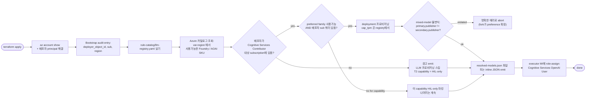

# 런타임 동등성 - 권위 있는 로컬 개발 및 테스트 고정본

**목표**: 자동화 테스트는 결정론적이고 secret-free 상태를 유지하며, interactive 로컬 Console은 운영자의 실제 Azure 개발 환경만 표시합니다. Azure 배포에서는 계속 **배포자의 Azure 권한과 리전 카탈로그가 어떤 LLM과 기타 리소스를 프로비저닝할지 결정**합니다.
세 명제가 동시에 참입니다:

- **자동화 테스트 truth**: pytest와 committed mock은 결정론적 가짜를 사용할 수 있습니다. 명시적 test-fixture 빌더를 사용하며 Azure 관측 상태로 표현하지 않습니다.
- **Full-stack 로컬 truth**: `Console Web: Full Stack`은 배포와 같은 App 역할 검사를 적용하는 브라우저 Entra sign-in을 사용합니다. 서버의 Azure CLI 세션은 Azure 개발
  데이터 평면 프로바이더 자격 증명만 제공합니다. 인벤토리, 모델 가용성, 에이전트 활동,
  프로세스 상태, 승격 근거, 감사 데이터는 권위 있는 프로바이더에서만 표시합니다.
  출처가 없으면 사용 불가 또는 명시적 빈으로 표시하며 생성 예제로 대체하지 않습니다.
- **Deploy truth**: `terraform apply` 가 CSP-neutral 컨트랙트의 Azure 측 실현체를 생성.
  **LLM 부분은 배포자-스코프**: 초기화 해석기가 배포자 아이덴티티를 대상 리전
  카탈로그와 대조해 **배포자가 만들 권한이 있는 것만** 프로비저닝하고, resolved
  `{capability → deployment}` 매핑과 해석기 입력 출처 이력을 산출물에 기록합니다.

모든 프로파일은 **하나의 컨트롤 경로**를 공유하며 composition-root 어댑터와 자격 증명만 다릅니다.
([project-structure.md § Customization via 의존성 주입](../architecture/project-structure-ko.md#customization-via-dependency-injection)). 검토된 docstring은 기존 경계를 기록하며 별도 런타임을 만들거나
상태 소유권을 변경하거나 고정본을 허용하지 않습니다. 실제 Azure 클라이언트 추가는 fork-side 주입이며 `core/`를 편집하지 않습니다.

## 전수조사 - 로컬 동작 vs Azure 필요

2026-07-21 기준. "자동화 테스트"는 테스트 실행기가 실행하는 pytest 또는 committed mock을
뜻합니다. "Full-stack 로컬"은 운영자에 브라우저 Entra를 사용하고 서버 측 Azure 어댑터에
현재 Azure CLI 맥락을 사용하는 VS 코드 compound launch입니다. 테스트 고정본은 이 launch
프로파일에서 활성화되지 않습니다.

### 자동화 테스트에서 완전 동작 (Azure 불필요)

| 서브시스템 | 로컬 백엔드 | 비고 |
|-----------|-------------|------|
| T0 결정론 엔진 | `opa` 바이너리 + Rego 정책 + 룰 카탈로그 | 100% 오프라인; CI 동등성 게이트가 증명 |
| Rule 카탈로그 로더 + shadow eval 파이프라인 | 파일시스템 YAML | 클라우드 콜 없음 |
| Risk 게이트 + 승격 레지스트리 | 인-메모리 `ActionPromotionRegistry` | 경계 스왑 가능 |
| 실행기 + 리소스 잠금 | 인-프로세스 | 고정본 전용이며 interactive 실행기가 아님 |
| 감사 + T2 복구 상태 | `InMemoryStateStore` (hash-chain 검증) | prod 백엔드 = Postgres이며 같은 증적/경로 키가 결정론적 채팅 읽기를 제공합니다 |
| Event ingest + trust 라우터 | 인-프로세스 | 버스 미배선 |
| Verticals (복원력 / FinOps / 변경 안전성) | 순수 결정 모듈 | 클라우드 없음 |
| Quality 게이트 | `StaticVerifier` + `MatchTypeCrossCheckModel` + `InMemoryGroundingSource` | [llm-strategy-ko.md § T2](../architecture/llm-strategy-ko.md#t2--reasoning-tier-quality-gate-required) 참조 |
| T1 유사도 | `DeterministicEmbeddingModel` + `InMemoryPatternLibrary` | 해시 기반, 실제 임베딩 없음 |

Operator 브라우저 E2E 테스트는 명시적인 dev-test 프로파일에서 실제 Vite SPA를 Playwright로
실행합니다. 경로 interception은 선언된 synthetic read-source 매니페스트, 인시던트, 에이전트 프레임 및
채팅 SSE 응답을 제공합니다. 이 고정본은 테스트 실행기 안에서만 존재하며 `Console Web: Full
Stack`에서는 활성화되지 않습니다. 백엔드 통합 테스트는 같은 요청과 범위가 제한된 최종
turn-timing 계약을 실제 Starlette 경로와 근거 해석기로 별도 검증합니다.

이를 보완하는 `npm --prefix console run test:e2e:live` 모음은 경로 interception 없이 신뢰할
수 있는 로컬 PostgreSQL 및 Azure CLI 프로파일을 시작합니다. 등록된 모든 Console 패널을 방문하고,
패널 경계가 안정될 때까지 기다리며, 브라우저 exception과 Operator API `4xx`/`5xx` 응답을
차단하고, 테스트 경로 인벤토리가 운영 레지스트리와 계속 일치하는지 검증합니다. 또한 실제 운영
Command Deck을 통해 결정론적 현재 시각 턴과 허용 목록에 포함된 Microsoft Learn 웹 검색을
제출하고, 검증된 또는 근거에 기반한 최종 근거를 요구합니다. CLI principal 프로파일을 새로
시작하는 대신 이미 인증된 stack을 재사용하려면 `FDAI_E2E_BASE_URL`과
`FDAI_E2E_OPERATOR_API_URL`을 설정합니다.

### dev-up.sh 필요 (여전히 로컬)

| 서브시스템 | 로컬 백엔드 | Prod 백엔드 |
|-----------|-------------|--------------|
| 상태 저장소 (통합 테스트) | `pgvector/pgvector:pg16` on `:5432` | Azure PostgreSQL Flexible + pgvector |
| Event 버스 (통합 테스트) | Redpanda on `:19092` (Kafka wire) | Event Hubs Kafka on `:9093` |

### 고정 workspace 포트

커밋된 VS 코드 설정은 각 로컬 web 표면이 항상 같은 포트를 사용하게 합니다. 정적 design mock
site는 인증된 Console full stack과 분리되어 있습니다.

| 표면 | 기본 주소 | Workspace 항목 지점 |
|---------|-------------|-----------------------|
| Design mock | `http://127.0.0.1:5373` | `Design Mocks: Static Site` launch, `design mocks: serve (5373)` 작업 또는 실제 운영 서버 |
| Console SPA | `http://127.0.0.1:5273` | `Console Web: Full Stack` (권장) 또는 `Console Web: Frontend` (SPA 전용) |
| Operator API | `http://127.0.0.1:8010` | `Console Web: Operator API` |
| 테스트 인제스트 게이트웨이 | `http://127.0.0.1:8011` | `Console Web: Ingestion Gateway` |

`Console Web: Full Stack` compound는 코어 런타임, Console SPA 및 Operator API를 시작합니다. 백엔드 launch는
service-owned Core 컨트롤 플레인 및 Operator 서비스 분포를 가져오기하며 제거된 top-level 패키지 또는
프로세스 내 Operator API 호환성 경로를 복원하지 않고 정적 design mock과 격리된 테스트 인제스트 게이트웨이도
시작하지 않습니다. 신뢰된 workspace에서는 `console: prepare local state`가 한 번 실행되어 로컬 PostgreSQL과
Redpanda를 시작하고 고정된 이전 방식 Alembic 계보를 전진시킨 후 Core와 Operator의 service-owned 이행 가지를 채택하고 업그레이드하며 single-instance 한도로 중복을 막습니다. 동일한 준비는 읽기 전용 Azure Resource Graph 인벤토리를 새로 읽고, 테넌트 식별자, 리소스 엔드포인트 또는 자격 증명을 복사하지 않은 채 준비된 권위 있는 입력에서 정제된 모델 및 런타임 Settings 변환 결과를 materialize합니다. 프로바이더가 사용 불가 상태이거나 권한이 없으면 고정본 데이터로 대체하지 않고 인벤토리를 명시적으로 사용 불가 상태로 유지합니다.
같은 이행이 로컬 및 deployed PostgreSQL에 principal 범위 `conversation_image` 저장소를
만듭니다. 따라서 두 프로파일의 Command Deck 이력은 동일한 인증 Operator API 경로를 통해 전송된
이미지를 복원하며, 어느 프로파일도 inline base64를 턴 메타데이터 또는 브라우저 대화 기록 캐시에
저장하지 않습니다.
Compound는 하위 구성을 시작하기 전에 `console: prepare full stack`을 완료하므로 이행,
두 백엔드 환경 및 Entra synchronization이 한 번만 실행됩니다. Operator 환경은 브라우저
API 범위에서 JWT 대상을 파생하고 브라우저와 Azure 테넌트 일치를 요구하며, 일치할 수 없는 로컬
자리로 raw-group 대체 경로를 비활성화하고 `SET ROLE fdai_operator`로 연결합니다. Standalone Core
런타임 또는 Operator API debug launch에서는 이 준비 작업을 먼저 실행합니다.
준비 순서에서는 구성된 Entra SPA 등록에 `http://localhost:5273`과
`http://127.0.0.1:5273`을 안전하게 재시도할 수 있는 방식으로 동기화합니다. 보조 로직은 기존
redirect를 보존하고 해당 loopback 호스트에만 HTTP를 허용하며, 활성 테넌트가 다르거나 운영자가
등록을 읽거나 업데이트할 수 없으면 서비스 시작 전에 중단합니다. 로컬 Event Hubs 토큰 새로 고침은
준비된 `AZURE_TENANT_ID`와 `AZURE_SUBSCRIPTION_ID`에 고정되므로 이후 기본값 계정이 바뀌어도
실행 중인 서비스의 Event Hubs 발급자를 바꿀 수 없습니다.
Resolved-model 산출물이 있으면 같은 준비 단계에서 서술기 엔드포인트가 HTTPS 출처인지 검증하고
`FDAI_LLM_ENDPOINT`와 `LLM_RESOLVED_MODELS_PATH`를 비공개 로컬 런타임 환경에 기록합니다.
Narrator 엔드포인트가 없거나 올바르지 않으면 코어 런타임을 시작한 뒤 실패하게 두지 않고 Terraform
또는 Azure 프로바이더에 접근하기 전에 준비 단계를 중단합니다.
선택적인 로컬 configuration-baseline 대화는 ignored 산출물 세 개를 `FDAI_CONFIGURATION_BASELINE_JSON`, `FDAI_CONFIGURATION_BASELINE_DOCX`, `FDAI_CONFIGURATION_OBSERVATION_JSON`으로 연결합니다. Full-stack preparation 이후 Operator API launch에 세 값을 모두 제공합니다. Preparation이 생성된 `.fdai/local-runtime.env`를 교체하므로 해당 파일을 직접 수정하지 않는 것이 좋습니다.
일부 값만 구성하거나 기준선 무결성 또는 DOCX 다이제스트가 일치하지 않으면 Operator API 시작이 중단되며 호출자는 고정된 범위, 버전, 다이제스트 또는 문서를 바꿀 수 없습니다. 연결이 성공하면 로컬 조립은 같은 맥락을 결정론적 채팅과 GET-only 구성 기준선 패널에 등록합니다.
패널은 요청마다 관측 출처를 실행하고 연결 부재를 사용 불가로 보고하며 고정본나 cached Azure 상태를 대체 근거로 사용하지 않습니다. 가능한 경우 캠페인 상태를 PostgreSQL에 연결합니다.
캠페인 개정 번호와 감사 증적은 재시작 후에도 유지됩니다. 영속성이 없으면 검토는 not 구성된이고 in-memory 대체 경로를 사용하지 않으며, pinned 산출물만 활성 변경할 수 없는 레지스트리 항목이 되어 이력이 구성되지 않은 버전을 만들지 않습니다.
배포는 absolute mounted 기준선 JSON/DOCX 경로와 읽기 담당 허용 목록의 `FDAI_CONFIGURATION_BASELINE_RESOURCE_GROUP`을 함께 요구하고 해당 읽기 담당의 Managed Identity와 범위가 제한된 HTTP 클라이언트를 재사용합니다.
신원 누락, 범위 escape, malformed 파일 또는 무결성 mismatch는 시작을 차단하며 성공 시 읽기 근거, 영속 캠페인/보고 상태, independently 검토된 shadow 예약만 추가합니다.
시작 탐색 중 브라우저는 initial 골격을 유지하고 `GET /iam/self`의 fetch-level 네트워크 실패만 약 28초 동안 재시도합니다.
HTTP 응답, authentication 실패, malformed 페이로드 또는 소진된 예약은 기존 access-recovery 표면에 표시합니다.
IAM 초기화가 성공하면 대시보드는 `GET /kpi`를 필수 backbone으로 취급하고 해당 응답이
해석되는 즉시 경로 골격을 종료합니다. 선택 FinOps, promotion-gate 및 자율성 변환 결과는
독립적으로 합류하며 `404`, `501`, `503`이면 사용 불가로 표시하고 전체 대시보드를 실패시키지 않습니다.
모든 브라우저 Operator API 요청에도 구성 가능한 기본 30초 시간 초과를 적용합니다. 정지한 fetch는
abort되고 영구 골격을 남기지 않고 기존 경로 오류 표면으로 전환됩니다.
각 long-running Console 작업은 VS 코드 인스턴스 하나만 허용합니다. Core 작업과 debug launch는
`.fdai/core-runtime.lock`도 공유하므로 두 번째 프로세스는 Kafka 소비자 그룹에 참여하기 전에
실패합니다. 따라서 작업/debug overlap이 중복 Pantheon 소비자와 지속적인 rebalance를 만들지 않습니다.
Core 런타임, Operator API 및 프런트엔드 작업은 각각 별도의 dedicated 최종 그룹을 사용하며 재시작할 때 자신의 이전 출력만 지웁니다. Operator API 시작은 조용히 유지되며 editor focus를 가져가지 않습니다.
VS 코드는 Pantheon 브리지 시작, Uvicorn 애플리케이션 시작 완료 또는
Vite 로컬 주소 게시를 각각 확인한 뒤에만 background 작업을 준비된으로 표시합니다. 따라서 프로세스가
생성되기만 한 상태를 준비된 서비스로 표시하지 않습니다.
표준 로컬 Azure 프로파일은 `FDAI_RUNTIME_LOCK_FILE`이 설정되지 않아도 같은 잠금을 기본값으로 사용하므로, `python -m fdai`를 직접 실행해도 singleton 가드를 우회할 수 없습니다. 운영 런타임은 배포에서 명시적으로 구성한 경우에만 프로세스 잠금을 계속 사용합니다.
Core 런타임만 Pantheon을 소유하며 로컬 및 deployed interactive 읽기는 같은 execution-mode 정책을 사용하고 의도 ID, Heimdall 소유권 또는 계획 연결 표류 시 시작을 차단합니다. Embedded direct Pantheon 채팅 위임은 fixture-only입니다. `FDAI_OPERATOR_API_EMBED_PANTHEON=0`일 때 Operator API는 기존 `aw.pantheon.objects` 전송 계층의 범위가 제한된 요청/응답 logical 토픽을 통해 Bragi conversational
포트에 접근합니다. 시작 탐색으로 응답 소비자 준비를 확인한 후 트래픽을 받습니다. 클라이언트는 재시도 중 joining 소비자를 재사용하고 최초 Event Hubs 그룹 결합을 최대 20초 허용합니다.
운영 복제본은 서버 소비자 그룹을 공유하므로 요청마다 복제본 하나만 응답합니다. Singleton 로컬 코어는 process-scoped 서버 그룹을 사용하므로 재시작할 때 이전 프로세스의 관련 없는 Pantheon 트래픽을 재생하지 않고 physical 토픽의 현재 오프셋에서 시작합니다.
요청은 raw 신원 대신 salted SHA-256 user/세션 참조를 전달하며, 시간 초과 또는 잘못된 응답은 전문가 답변을 꾸미지 않고 명시적인 agent-to-Bragi 인계로 표시합니다. 같은 지연 시간 프로파일은 같은 direct, streamed 또는 detached 모드를 선택하며 측정된 프로바이더 지연 시간과 구성된 근거 가용성만 모드를 바꿀 수 있습니다.
장기 실행 코어 및 Operator API 작업의 최종 출력은 `.fdai/logs/core-runtime.log`와
`.fdai/logs/operator-api.log`에 보존됩니다. 캡처된 모든 child-output 줄은 millisecond와 로컬 표준 시간대
약어를 포함한 Python 로깅 style 시각으로 시작합니다. 예시는 `2026-07-28 15:25:53,717 KST`입니다.
각 로그는 서비스 시작 및 중지 시각과 하위 exit 코드도 기록하고 비공개 로컬 권한을
사용하며, 1 MiB에서 회전하여 이전 세대를 최대 3개 유지합니다. Git에서 제외된 이 진단 로그는 작업
최종이 닫혀도 유지되며 구조화된 경고 및 오류 기록인 `warnings.jsonl`을 대체하지 않습니다.
Core 최종은 기계가 읽는 JSON 스트림을 유지하지만, 코어 파일은 Operator API 로그와 같은
`LEVEL: logger: message` 형식으로 기록을 렌더링합니다. 로컬 Operator API는 같은 구조화된 logger를
사용하고 기본값이 `INFO`인 `FDAI_LOG_LEVEL`을 적용합니다. Uvicorn 접근 로그는 비활성화하고,
`aiokafka`, `httpx`, `weasyprint`의 `WARNING` 미만 기록은 억제하지만 FDAI 수명 주기 및 결정
기록은 `INFO`로 유지합니다. Event Hubs 어댑터는 aiokafka의 맥락이 없는 소켓별 authentication
성공 메시지도 억제하고, logical 소비자마다 토픽, 소비자 그룹, 클라이언트 id 및 authentication
방식을 포함한 `event_bus_consumer_started` 기록 하나를 내보냅니다. 의존성 경고와
오류는 계속 표시됩니다. 단기 준비 상태 소비자는 그룹 조정기와 소켓을 닫기 전에 fetch
I/O를 취소하고 배출하므로 의도적인 탐색 종료가 전송 계층 실패로 기록되지 않습니다. 시작
모델 지연 시간 탐색은 구성된 모든
reasoning 후보가 지원하는 Azure Responses API output-token 예산을 사용합니다. Core 준비 상태
샘플은 안정적인 `startup-readiness:<probe-id>` 상관관계 id를 사용하고 Operator API 지연 시간 샘플은
안정적인 `operator-api:*:latency-probe` 상관관계 id를 사용하므로 측정된 탐색 사용량이 uncorrelated
트래픽으로 기록되지 않습니다.
로컬 및 deployed 콘솔 모두 에이전트 카드의 Ask 액션에서 새 user-scoped 대화 키를
할당하고 제출 전에 선택한 에이전트를 대화 요약에 저장합니다. 브라우저는 고정된 per-agent
키를 사용해 이전 대화 기록을 묵시적으로 재개하지 않습니다.
Core, Operator API, debugger 및 로컬 작업은 담당 서비스와 shared 계약 SDK 출처 디렉터리를
Python 가져오기 경로의 첫 위치에 둡니다. 따라서 다른 워크트리의 editable-install 메타데이터가 오래된
출처를 시작하거나 independent-service 구현 경계를 넘을 수 없습니다.

### Workspace 맥락 정리

VS 코드 설정은 의존성, 캐시, 생성된 보고, 로컬 상태, 시크릿, Terraform 상태, 임시 출력 및
`.improve/`를 Explorer, 검색, 파일 watching에서 제외합니다. 이 설정은 editor 부하와 워크트리
copy로 인한 Problems 중복을 줄입니다. 이는 탐색 기본값이므로 제외된 경로를 직접 열 수 있으며
근거, 신원, 권한 또는 런타임 어댑터에는 영향을 주지 않습니다. 출처, 테스트 및 담당
design doc은 계속 검색할 수 있습니다. Terraform 인덱싱은 검증된 non-Terraform 디렉터리 이름을
건너뛰고 tracked `.tf` 파일이 있는 모든 디렉터리를 보존합니다.

Workspace는 `.github/workflows/deploy-dev.yml` 하나만 plain YAML 언어 모드에 연결합니다.
GitHub Actions 확장은 참조한 액션 tag가 존재하고 다음 단계에서 `GITHUB_ENV` 값을 사용할 수
있는 경우에도 이 작업 흐름에 unresolved-action 및 dynamic 맥락 오류를 표시할 수 있습니다. Plain
YAML 검증은 계속 활성 상태입니다. 원격 action-tag 확인, 저장소 작업 흐름 계약 테스트 및
GitHub Actions 런타임 검증이 권위 있으며 다른 작업 흐름의 GitHub Actions 언어 support는
유지됩니다.

공유 FDAI 프로파일과 확장 목록은 HashiCorp Terraform만 언어 서버로 유지합니다.
WSL 초기화는 프로파일 sync가 전달하지 못하는 path-free 머신 설정을 적용합니다. 이러한 editor
설정은 신원, 근거, 런타임, 승격 또는 실행 권한을 선택하지 않습니다.

선택적 `dev-access: configure VPN on folder open` 작업은 workstation에 격리된 P2S 개발 접근
stack의 로컬 상태가 있을 때만 활성화됩니다. VPN이 연결되어 있으면 FDAI 런타임 리소스를
변경하지 않고 transient WSL 해석기 연결을 복구합니다. VPN 연결이 끊겨 있으면 Azure VPN
클라이언트를 열고 실패한 시작 작업의 Problems 패널 오류를 보고하며, 개발자가 Entra sign-in 및
MFA를 계속 완료합니다. 로컬 dev-access 상태가 없는 workstation에는 프롬프트나 네트워크 변경이
발생하지 않습니다.

### 로컬 개발의 Console 데이터

정본 로컬 Operator API는 `FDAI_OPERATOR_API_LOCAL_ENTRA=1`을 사용하고 배포와 route-owned 런타임 보조 로직을 공유합니다. 브라우저가 API 토큰을
얻고 API는 배포와 동일하게 JWT 및 App 역할을 검증합니다. 서버의 Azure CLI 토큰은
Resource Graph, Microsoft Graph, 모델 발견, Event Hubs 같은 Azure 어댑터로 제한됩니다.
`FDAI_OPERATOR_API_LOCAL_AZURE_CLI=1`과 `VITE_LOCAL_AZURE_CLI_AUTH=1` 조합은 fixed 역할 상한을
사용하는 명시적 CLI-principal debug 대안입니다.

로컬 Kubernetes 워크로드 근거는 명시적 선택이며 서버가 소유한입니다.
`FDAI_LOCAL_KUBECONFIG`, `FDAI_LOCAL_KUBERNETES_CONTEXT`,
`FDAI_LOCAL_KUBERNETES_CLUSTER_NAME`을 함께 설정하면 하나의 고정된 읽기 전용 `kubectl` 조회를
연결합니다. 배포 또는 Pod 근거가 AKS 답변의 커버리지를 완료하려면 클러스터 이름이
Azure 인벤토리 결과와 일치해야 합니다. 세 값이 모두 없으면 워크로드 커버리지는 명시적으로
사용 불가 상태를 유지하며, 일부만 설정된 연결은 암묵적 현재 맥락을 사용하는 대신
시작에 실패합니다.

로컬 및 deployed 인벤토리 변환 결과는 같은 두 조회 모드를 사용합니다.
`scope=<view-id>`는 결정론적 named 아키텍처 화면을 선택합니다. 이 모드와 함께 사용할 수
없는 rooted 모드는 `root=<resource-id>`, `depth=1..8`, `limit=1..1000`으로 하나의 양방향
neighborhood를 반환합니다. 알 수 없는 루트는 `404`를 반환하고 상한에 도달하면
`truncated=true`로 표시합니다. 로컬 Azure CLI 프로바이더는 권위 있는 cached 스냅샷에
동일한 제한을 적용하며 deployed PostgreSQL 프로바이더는 활성 스냅샷과 real-time 오버레이
내부에 적용합니다. 어느 프로파일도 rooted 요청을 완전한 인벤토리로 확장하지 않습니다.
Deployed 프로바이더는 유효 그래프를 하나의 repeatable-read, 읽기 전용 트랜잭션에서 읽으며,
두 프로파일 모두 같은 깊이의 frontier 리소스를 결정론적 순서로 round-robin 확장합니다.
Named-view 요청은 기존 3-argument 프로바이더 호출 계약을 유지하며 rooted 요청만 확장
키워드를 요구합니다. Relationship-filter 개수와 텍스트 length는 프로바이더 전달 전에
제한합니다. 읽기 경로는 malformed 리소스, 알 수 없음 또는 dangling 관계, 중복
리소스 id, 잘못된 잘림 메타데이터, oversized 프로바이더 출력을 차단합니다. 두 프로파일은
중첩된 AKS `powerState.code`를 포함한 관찰된 operational 상태를 프로비저닝 상태로 대체하지
않고 보존합니다. 로컬 캐시 묶음 v13은 스냅샷을 만든 Azure CLI/ARG 명령의 strict 민감정보가 제거된
증적을 기록합니다. 이전 묶음은 프로바이더 실행 상세를 노출하기 전에 새로 고침합니다.
Command Deck 인벤토리 턴은 해당 스냅샷에 IQL을 적용하며 질문마다 프로바이더 명령을 다시
실행했다고 주장하지 않습니다. Rooted 출력은
요청된 리소스 상한과 이에 대응하는 간선 상한을 사용하고, named 화면은 기존
5,000-resource 및 40,000-link 응답 상한을 유지합니다.
두 프로파일은 리소스, adjacent-edge, internal-edge, 출처 상한으로 구성된 같은 잘림
사유 vocabulary를 노출합니다. 읽기 경로는 알 수 없음 사유와 non-truncated 페이로드에 붙은
사유를 차단합니다.

런타임 policies는 배포와 로컬 PostgreSQL이 구성된 경우 동일한 StateStore 기록을
사용합니다. 영속 로컬 상태가 없으면 출처 매니페스트는 영속성을 주장하지 않고 settings
저장소를 사용 불가 또는 non-durable로 표시합니다. 읽기 담당은 정제된 환경, 영속 재정의 및
effective 값 변환 결과를 확인합니다. Owner는 optimistic 개정 번호 및 원자적 감사 검사를 통해
허용 목록만 업데이트할 수 있습니다. IRP 변경은 다음 조건을 충족한 경보에 적용되고 analyzer, 인벤토리 및
보존 cadence 변경은 다음 작업 또는 틱에 적용됩니다. 로깅 수준과 사례 보존/deletion 일
변경은 재시작 필수로 표시되며 headless 런타임이 시작될 때 로드됩니다. 어떤 설정도 로컬 읽기
API에 실행기 신원을 부여하거나 ActionType 및 작업 흐름 승격 상태를 변경하지 않습니다.

인시던트 auto-open 활성화, 최소 심각도, repeat 임계값 및 repeat 구간도 startup-bound입니다.
Headless 런타임은 영속 effective 값을 로드합니다. Embedded 로컬 Pantheon은 별도의 fixed 심각도나
구간 대신 동일하게 검증된 환경, 기본값 및 accepted-versus-held 인계 결과를 사용합니다.

Detection 준비 상태도 같은 경계를 사용합니다. 배포는 항상 PostgreSQL에서 Muninn
StateSnapshot을 읽습니다. Interactive 로컬은 로컬 PostgreSQL이 구성된 경우에만
`/detection-readiness`를 등록하며, 그렇지 않으면 경로와 출처 매니페스트가 사용 불가를
보고합니다. 로컬 브라우저는 Azure CLI 인벤토리로 대체하거나 Heimdall 판정을 다시 계산하지
않습니다.

Standard full-stack launch는 서술기 엔드포인트 조정을 유지합니다. 독립 Operator 서비스는
`RUNTIME_ENV=dev`에서만 local-only 서술기 어댑터를 연결하고 `LLM_RESOLVED_MODELS_PATH`와 수명이 짧은
Azure CLI 토큰을 사용하며 Core 가져오기 또는 실행기 권한 없이 Azure OpenAI 서술기를 시도합니다.
Health는 엔드포인트를 민감정보 제거하고 모델 지식만 쓴 답변은 검증되지 않은으로 유지합니다. 시작 훅은 권한이
있을 때 현재 공개 IP를 허용 목록할 수 있습니다. Automated 테스트는
`FDAI_NARRATOR_AUTO_OPEN_AOAI=0`을 설정하며 모델이 미구성, 승인되지 않은 또는 unreachable이면 해당
턴만 결정론적 answerer로 안전하게 대체 경로합니다.
Full-stack 준비는 명시적 재정의, 검증된 `.fdai/resolved-models-vision.json`, repository-local `resolved-models.json` 순서로 `LLM_MODE=azure`와 `LLM_RESOLVED_MODELS_PATH`를 만들고 metering을 read-model PostgreSQL에 연결합니다. Vision 산출물은 연결 가능한 T1 임베딩과 연결 가능한 기본/보조 T2 쌍 또는 명시적인 top-level `hil-only` 모드라는 코어 조립 하한도 충족할 때만 사용할 수 있습니다. 호환되지 않는 vision 산출물은 준비가 성공했다고 보고한 뒤 Core 런타임을 중지시키는 대신 정본 산출물로 대체 경로합니다. LLM 비용 패널과 `query_llm_usage` 채팅 기능은 로컬 및 deployed 프로파일에서 이 measured 읽기 담당을 공유합니다. 비용은 명시적
deployment-to-family 연결만 사용하며 누락된 계열은 unpriced 상태로 둡니다. 대화
Assurance는 배포와 같은 로컬 대화 및 평가 저장소를 사용하고 결정론적 최종
검사를 항상 실행합니다. 의미 검토는 서로 다른 resolved 모델 계열이 둘 이상일 때만
활성화되며 narrator-only 또는 `hil-only` 보조는 단일 모델 대신 inconclusive를 유지합니다.
산출물이 없으면 모델 및 assurance inference는 사용 불가이며 고정본으로 대체하지 않습니다.
PostgreSQL StateStore가 구성되면 두 프로파일은 ontology-owned failed-answer 귀속을 shadow
감사 기록이 있는 멱등적 hold-first adequacy 검토로 저장합니다. 영속 상태가 없는
interactive 로컬은 선택적 검토 싱크를 사용 불가로 유지합니다. 어느 프로파일도 이 intake
경로에서 재생을 수행하거나 제안을 만들거나 검토를 promote하지 않습니다.

`FDAI_MONITOR_WORKSPACE_ID`가 설정되면 명시적 Command Deck `query_log` 명령은 두 프로파일에서
같은 범위가 제한된 Azure Monitor Logs 프로바이더를 사용합니다. Interactive 로컬은 현재 Azure CLI
맥락에서 데이터 평면 토큰을 얻고 배포는 `FDAI_MI_CLIENT_ID`가 선택한 전용 Operator API
managed 신원을 사용합니다. Workspace는 서버 구성으로 정하며 브라우저가 변경할 수 없습니다.
Workspace, 신원, 권한 또는 텔레메트리를 사용할 수 없으면 고정본나 모델 대체 경로 없이
사용 불가로 보류합니다.
로컬 준비는 applied Terraform의 `log_workspace_customer_id` 출력에서 workspace customer GUID를 읽습니다. 이전 상태 또는 targeted 상태가 해당 출력을 노출하지 않으면 applied 리소스 그룹 안의 workspace만 나열하고 정확히 하나가 있을 때만 대체 경로를 수락합니다. Workspace가 0개이면 프로바이더를 사용 불가로 유지하고 여러 개이면 암시적으로 하나를 선택하지 않고 준비를 중지합니다. 재생성할 때 stale 로컬 workspace id는 제거합니다.
로컬 런타임 환경 generator는 applied 구독 및 리소스 그룹도 범위가 제한된 Azure
read-investigation 어댑터에 제공합니다. Terraform이 선택적 개발 operations 게이트웨이 URL과
Easy Auth 대상을 모두 출력하면 NSG 및 VNet 피어링 질문은 로컬 Azure CLI 신원으로 게이트웨이의
등록된 읽기 연산만 호출합니다. 쌍이 없으면 래퍼를 비활성화하고 구성된 게이트웨이가
실패하면 direct ARM 대체 경로 없이 사용 불가를 보고합니다. 게이트웨이는 읽기 담당/실행기 managed
신원을 분리하며 로컬 Operator API에 실행 신원을 제공하지 않습니다. 변경은 target-scoped
Blob 임차 기간과 영속 멱등성 점유를 사용하며 업스트림 Terraform은 구성된 실행기
principal에 development-only 변경 연산을 활성화하고 게이트웨이 URL과 대상은 headless 코어
Container App에만 전달합니다. 해당 런타임은 `AzureGatewayDirectApiExecutor`를 연결하며 Operator API는
읽기 전용 게이트웨이 전송 계층을 유지하고 강제 적용 기능을 받지 않습니다. 실행기는 정확한 등록된
연산, arguments, 멱등성, 감사, stop-condition, 롤백 및 영향 근거에 대해
server-issued 예행 실행 증적을 먼저 요청해야 합니다. 게이트웨이는 범위가 제한된 reader-identity ARM GET으로
대상을 확인하고 해당 증적을 비공개 Blob 저장소에 5분 동안 저장한 다음 target-scoped 리소스
임차 기간을 획득하여 ARM을 호출하기 전에 ETag compare-and-swap으로 한 번만 소비합니다. 호출자가
주장한 증적, 변경된 페이로드, 만료되거나 재생된 증적은 변경 전에 실패합니다. ARM
long-running 연산은 `submitted` 상태로 유지되며
실행기만 원래 멱등성 키를 통해 서버가 소유한 상태 URL을 조회할 수 있습니다.
Stale pending 점유는 계속 차단된 상태로 남지 않고 범위가 제한된 시간 초과 이후 ETag compare-and-swap으로
복구됩니다.
동일한 계획을 반복하면 소비되지 않은 같은 증적을 반환합니다. 소비되거나 만료된 계획은 새
멱등성 키가 필요합니다. ARM throttling은 최대 3회까지 범위가 제한된 `Retry-After`를 따르며 변경
`5xx` 응답은 결과가 모호한할 수 있으므로 자동으로 반복하지 않습니다.

동일한 read-investigation 배선이 범위가 제한된 Azure subscription-health 프로바이더를 구성합니다. 기본값은 resource-group 허용 목록이며, interactive 로컬은 권위 있는 인벤토리가 전체 구독을 이미 읽으므로 서버가 소유한 `subscription` 모드와 1,000개 리소스 상한을 선택하고 배포는 적절한 범위의 읽기 담당 신원으로 의도적으로 연결하지 않으면 `resource_groups`를 유지합니다.
브라우저와 모델 입력은 모드를 변경할 수 없습니다. 로컬 factory는 read-investigation 배선이 있을 때만
프로바이더를 주입하여 읽기 전용 data-plane 경계를 유지합니다.

Direct Command Deck 읽기도 두 프로파일에서 동일한 owner-scoped run-ledger 실행기를 사용합니다.
Interactive 로컬은 구성된 로컬 PostgreSQL 데이터베이스에 연결하고 배포는 Azure PostgreSQL에
연결합니다. 두 프로파일 모두 정본 요청 다이제스트, 임차 기간, 사용량 및 최종 결과를 저장하므로
completed 재시도는 프로바이더를 다시 호출하지 않고 재생됩니다. 브라우저 입력은 원장 소유자를
선택하거나 Azure 범위를 넓히거나 서버가 소유한 읽기 담당 자격 증명을 바꿀 수 없습니다.

두 프로파일은 범위가 제한된 PostgreSQL 타입 지도와 `InventoryQuery` 검증기를 공유합니다. Interactive 로컬은
Azure CLI 그래프와 읽기 담당 토큰으로 현재 상태 및 범위가 제한된 Activity Log를 읽고 배포는
promoted PostgreSQL 인벤토리와 전용 읽기 담당 managed 신원을 사용합니다. 두 프로파일 모두 조립에서
구독/resource-group 범위를 고정하고 후속 조치 선택자를 다시 해석하며 동일한 30일 활동
로그 규칙을 적용합니다. 브라우저/모델 입력은 범위를 넓힐 수 없고 이력 근거가 없거나 일치하지
않으면 스냅샷 inference로 대체 경로하지 않고 사용 불가 상태를 유지합니다.

로컬 factory는 15개 에이전트를 기본으로 모두 시작합니다. `FDAI_START_PANTHEON`은 disable-only
컨트롤입니다. 값이 없으면 활성화하고 `0`, `false`, `no`, `off`만 런타임을 비활성화합니다.
Event Hubs가 설정되면 에이전트는 전용 로컬 소비자 그룹으로 Azure 전송 계층을 사용합니다.
설정되지 않으면 로컬 프로세스 내 EventBus가 실제 Pantheon 메시지를 전달하고 에이전트 SSE 스냅샷을
제공합니다. 이 어댑터는 Azure 근거, 영속 상태 또는 실행 권한을 만들지 않습니다.
Kafka가 구성된 토픽을 시작 중 거부하면 Event Hubs 어댑터는 오류를 전달하기 전에 실패한 소비자를 닫습니다.

예측 learning은 두 프로파일에서 동일한 PostgreSQL 에피소드 저장소와 Heimdall 핸들러를
사용합니다. `FDAI_FORECAST_TARGETS_JSON`이 설정된 경우에만 활성화됩니다. 배포는 명시적 선택
Container Apps 작업으로 raw 틱을 제공하고 로컬 개발은 synthetic 메트릭을 만들거나
콘솔에 쓰기 경로를 주지 않고 동일한 기계적 틱 CLI를 호출할 수 있습니다.

로컬 런타임 환경 generator는 applied Terraform 출력에서 기한이 제한된 영속 재생에 사용하는
semantic logical/physical topic을 포함한 전송 계층 설정을 읽습니다. Terraform 실행기 신원의 구독과
Azure CLI 구독을 비교하고 둘이 다르면 리소스 조회나 파일 생성 전에 중단합니다.
또한 로컬 user와 호스트에서 식별 정보를 노출하지 않는 소비자 인스턴스 해시를 파생하므로 동시에
실행하는 개발자가 같은 Event Hubs Kafka 소비자 그룹에 참여하지 않습니다. 자동화에서
명시적으로 안정된 이름이 필요하면 `FDAI_LOCAL_CONSUMER_INSTANCE`에 최대 20자의 lowercase
alphanumeric 및 hyphen 식별자를 설정할 수 있습니다. 생성된 코어, Pantheon, Operator API 그룹은
이 인스턴스를 사용하고 deployed Operator API 복제본은 런타임 hostname을 사용합니다. 따라서 각
콘솔 스트림은 다른 developer 또는 복제본과 파티션을 나누지 않고 모든 프레임을 수신합니다.

작업 흐름 정의는 배포 강제 적용 허용 목록을 사용하며 ActionType은 승격 및 risk 게이트를 유지합니다.
강제 적용에는 Azure 이벤트 전송 계층과 작업 흐름 승인 근거를 공유하는 영속 데이터베이스가 필요합니다.
두 프로파일은 영속 프로세스 상태에서 본문 없는 재개, safe 취소, effect-free 재시도를 제공합니다.
App 역할 및 허용 목록을 다시 검사하고 시도 상한을 공유하며 unsafe 재시도 또는 취소를 차단합니다.
Thor는 developer 자격 증명을 받지 않으며 실행은 deployed Managed Identity 런타임에 남습니다.
시나리오 재생, recording 실행기, VM-task 가짜, synthetic 데이터 및 범위 고정본은 pytest 전용입니다.
명시적 pytest 고정본 빌더는 synthetic 인벤토리 그래프를 연결하고 Azure 인벤토리 예열 또는
종료 수명 주기를 등록하지 않습니다. Interactive 로컬 조립은 항상 실제 운영 Azure 프로바이더를 유지합니다.

FDAI Azure PostgreSQL, Event Hubs, 런타임, 실행기 리소스가 없으면 해당 표면은 런타임
점유 없이 사용 불가 또는 빈으로 표시됩니다. 저장소 카탈로그와 스키마는 관찰된 런타임
근거가 아니라 configuration-as-code이므로 계속 표시합니다.
로컬 및 deployed Operator API factory는 룰의 `Controls` 참조 화면을 위해 동일한 검증된
Best Practice 정의를 로드합니다. 이 동등성은 런타임 점유를 만들지 않습니다. 권위 있는
근거 프로바이더가 없으면 두 factory 모두 모든 컨트롤과 요구사항을 `Unknown`, 출처는
`not_connected`로 노출합니다.
두 factory는 같은 온톨로지 release에 읽기 전용 카탈로그 조회 함수도 등록하므로 로컬 및 deployed
Command Deck 턴은 동일한 타입이 지정된, 범위가 제한된, non-mutating 근거 계약을 사용합니다.

로컬 API는 `GET /system/data-sources`를 제공합니다. Standard full stack에서는 운영
PostgreSQL read-model 어댑터가 로컬 pgvector를 사용합니다. 로컬 Operator API는 트래픽을 받기 전에
해당 어댑터를 통해 범위가 제한된 `SELECT 1`을 실행합니다. 탐색이 실패하면 부분적으로 연결된 콘솔을
노출하지 않고 시작을 중단합니다. 탐색이 성공하면 PostgreSQL 기반 항목은 `available` 및
`reachable=true`를 보고합니다. 구성된 원격 및 Azure request-time 출처는 자체 근거
계약이 검증할 때까지 `unknown`을 유지합니다.
`FDAI_DATABASE_URL`과 `FDAI_AUTHORITATIVE_OPERATOR_API_BASE_URL`은 상호배타적인 출처 프로파일을
선택합니다. 둘을 함께 구성하면 프로바이더를 만들기 전에 시작을 중단하므로 매니페스트가 로컬
PostgreSQL을 설명하면서 허용 목록 요청을 원격 API가 처리하는 상태를 허용하지 않습니다.
원격 forwarding은 decoded 정본 허용 목록에 있는 경로만 일치시키며 정규화된, encoded, 중복
구분자 및 control-character 변형은 로컬에 유지합니다. 업스트림 캐시 directive를 폐기하고
모든 proxy 응답에 `Cache-Control: no-store`를 보내므로 인증된 operational 근거가 브라우저
또는 shared 캐시에 저장되지 않습니다. 응답 헤더 전에 발생한 원격 실패는 범위가 제한된 JSON
`503`으로 변환하고, 헤더 이후 실패는 두 번째 ASGI 응답 시작 없이 응답 본문을 닫습니다.

런타임 스킬 점검도 같은 규칙을 따릅니다. 운영은 트래픽을 받기 전에 signed
PostgreSQL trusted-artifact 기록에서 활성화된 카탈로그를 재구성합니다. Interactive 로컬은 영속
검증된 저장소가 명시적으로 compose되지 않으면 빈 실패 시 차단 스냅샷으로 같은 Reader-gated
`/skills` 계약과 서술기 동사를 노출하며 installed 스킬이나 부하 결과를 만들지 않습니다.

에이전트 활동은 실제 운영 런타임 프레임과 영속 감사 행을 분리합니다. 관찰된 에이전트를 선택하면
실제 운영 상태, 현재 작업, 런타임 연결, 상태 시각, 스트림 출처 이력, 인시던트 맥락을
항상 표시합니다. 현재 구간에 귀속 감사 행이 없으면 실제 운영 요약을 대체하거나 감사 이벤트를
추론하지 않고 타임라인에서 그 부재를 명시합니다.
Headless Pantheon은 control-loop 진행 상황을 전달하는 동일한 `aw.pipeline.stages` 전송 계층에 실제
상태에서 파생한 `agent.runtime-state` 프레임을 발행합니다. Operator API는 runtime-state 프레임과 단계
프레임을 구분하고 소비자가 실제 운영이며 상태 탐색이 오류가 아닌 에이전트만 전달합니다. Interactive
로컬과 배포는 같은 프로세스 간 경로를 사용하며 로컬 프로파일은 에이전트 activation이나 스트림
의미가 아니라 PostgreSQL 연결만 바꿉니다.
브라우저는 해당 탭이 열려 있는 동안 최근 100개 SSE 프레임도 보존하고 별도 실제 운영 저널로
표시합니다. 런타임 하트비트는 연결을 증명하지만 작업으로 계산하지 않습니다. Collecting,
analyzing, deciding, executing, approving, auditing, 인시던트 및 인계 프레임은 작업으로 계산합니다.
이 저널은 범위가 제한된 및 non-durable이며 reload 시 초기화되고 각 프레임에 기록된 출처를
보존합니다. 추가 전용 감사 로그를 대체하지 않습니다.

완료된 대화 검토도 같은 분리를 따릅니다. Interactive 로컬 전송 계층은 범위가 제한된 Bragi
`object.turn` 묶음을 발행할 수 있지만 검토자나 영속 제안 저장소를 만들어 내지
않습니다. Deployed headless 런타임은 결정론적 ineligible/지원하지 않는 사유를 기록하고 서로 다른
두 모델 계열이 해석된 경우에만 Azure 검토자를 사용합니다. PostgreSQL은 restart-safe 검토
및 초안 상태를 보관하며 운영 Operator API는 프로세스 기억을 공유하거나 승인 엔드포인트를
추가하지 않고 해당 행을 변환 결과합니다.

Approval 결정 전달도 재시작 전후에 같은 형태를 유지합니다. 운영은 서명된 A1
결정을 게시하기 전에 PostgreSQL에 기록하고 전달 시도를 체크포인트하며 시작 및 주기적
루프에서 적격한 미전달 증적을 배출합니다. 최종 delivered 또는 abandoned 증적은 이전
상태로 돌아가지 않으며 종료는 이벤트 전송 계층을 닫기 전에 복구를 중지합니다. 배포는
`FDAI_HIL_DECISION_RECOVERY_INTERVAL_SECONDS`,
`FDAI_HIL_DECISION_PUBLISH_TIMEOUT_SECONDS`,
`FDAI_HIL_DECISION_MAX_DELIVERY_ATTEMPTS`로 간격, publish 시간 초과, 전체 시도 상한을
조정할 수 있습니다. 테스트는 in-memory 저장소 및 발행기와 같은 레지스트리 계약을 사용합니다.
Interactive 로컬은 승인자를 만들어 내거나 signed 콜백 auth를 우회하지 않습니다.

Headless Bragi 의미 라우팅은 T1과 같은 한계 임베딩 기능을 사용합니다. 배포는
`FDAI_AGENT_SEMANTIC_COSINE_THRESHOLD`, `FDAI_AGENT_SEMANTIC_MARGIN_THRESHOLD`를 설정할 수 있으며
잘못된 값은 시작을 실패시킵니다. 임베딩 연결이 없으면 명시적, read-intent, 도메인
라우팅을 결정론적하게 유지합니다. 임베딩은 conversational 대체 경로이며 타입이 지정된 액션
트래픽에 들어가지 않습니다.

### Azure-backed 통합

| 서브시스템 | 상태 | 갭 |
|-----------|------|-----|
| Azure Resource Graph 인벤토리 | 운영은 promoted PostgreSQL 스냅샷과 Huginn의 real-time delta 오버레이를 읽습니다. | Full-stack 로컬은 읽기 전용 `AzureCliInventory`를 통해 등록된 모든 Azure ARM 타입을 매핑하고 관계와 VM power 상태에 범위가 제한된 `az graph query` 속성을 사용하므로 별도 `az vm list --show-details`를 호출하지 않습니다. 스냅샷은 구독 및 Azure CLI 프로파일 지문으로 격리한 `.fdai/cache/inventory`에 저장하고 synthetic opt-out은 거부합니다. |
| Azure Monitor Logs KQL | 운영과 로컬 어댑터가 `AzureLogAnalyticsQueryProvider`를 공유합니다. | 서버가 소유한 `FDAI_MONITOR_WORKSPACE_ID`가 필요하며 명시적 `query_log`는 사용 불가일 때 실패 시 차단합니다. |
| Managed Identity 토큰 (`WorkloadIdentity`) | Deployed 어댑터 존재 | interactive 로컬은 deployed 실행기로 publish하며 고정본 테스트만 로컬 발급자 사용 |
| 통제된 실행 백엔드 | 프로바이더 중립적인 프로토콜, 프로파일 레지스트리, 영속 PostgreSQL 원장, bubblewrap/VM 어댑터, Azure Container Apps 작업 어댑터가 존재합니다. | 프로파일은 기본적으로 비활성화된이고 로컬 interactive에는 실행기 연결이 없으며 승격 전에 실제 운영 Azure 작업 근거가 필요합니다. |
| 브라우저 근거 | 프로바이더 중립적인 계약, 선택적 Playwright 어댑터, PostgreSQL 산출물, GET-only 점검이 존재합니다. | 기본 unbound이며 interactive 로컬에는 실행기 신원이 없습니다. Isolated restricted-egress 브라우저 런타임과 exact 출처 정책을 구성하기 전에는 사용 불가로 표시합니다. |
| Key Vault 시크릿 프로바이더 (`SecretProvider`) | 배포가 Key Vault 참조 주입 | interactive 어댑터는 환경 참조 사용, 고정본 값은 테스트 전용 |
| GitOps PR 발행기 | 실제 GitHub 어댑터 존재 | interactive 실행은 구성된 어댑터 사용, recording 발행기는 테스트 전용 |
로컬 인벤토리 캐시는 최종 fence에 도달한 검사만 promote하고 atomic replace로 기록합니다.
Operator API 시작은 준비 상태를 차단하지 않고 persistent 캐시를 부하해 stale 또는 누락된 새로 고침을 예약하며 종료는 해당 작업을 취소하고 배출합니다. Fresh 캐시는 재시작 이후 즉시 반환되고 fresh-required 조회는 예열이 아직 실행 중일 때만 기다립니다. 만료되었거나 Huginn이 invalidate한 캐시는 `cache.status=refreshing`인 `stale` 상태로 즉시 반환되고 background Azure CLI 검사가 이를 원자적으로 교체합니다. Provision된 `aw.inventory.raw` 토픽을 `FDAI_INVENTORY_RAW_TOPIC`으로 구성하면 수락된
쓰기/삭제 이벤트가 영속 변환 결과 이후 로컬 캐시를 invalidate합니다. 해당 auxiliary-topic
연결이 없는 stack은 TTL 새로 고침으로 수렴합니다. Resource 타입 또는 관계를 추가하는 인벤토리
변환 결과 변경은 캐시 묶음 스키마 개정 번호를 올리므로, 이전 완전한 스냅샷을 stale 의미와
함께 표시하지 않고 새로 고침합니다. 스키마 개정 번호 10은 정규화된 Azure 서비스 상태와 catalog-driven
resource-type 및 Azure `kind` disambiguation 이전 개정 번호를 포함한 모든 이전 스냅샷을 invalidate합니다.
따라서 첫 database-status 또는 shared-ARM-type 질문은 이전 `unknown` 또는 잘못 분류된 상태를
재생하지 않습니다. 명시적 구독이 없으면 다른 활성 Azure CLI
구독의 스냅샷을 사용할 위험을 피하기 위해 persistent 캐시 재사용을 비활성화합니다.
캐시 묶음은 리소스 한도도 연결하고 malformed 또는 과도하게 미래 시각인 스냅샷을 거부하며
각 로컬 새로 고침을 240초로 제한합니다. 캐시 파일 또는 표시 I/O 실패가 발생해도 마지막 완전한
in-memory 그래프를 유지합니다. 표시 쓰기 실패는 TTL 수렴으로 대체 경로하고 표시 메타데이터 읽기
실패는 stale로 처리해 불확실한 캐시를 신뢰하지 않고 새로 고침합니다.
Persistent 읽기는 user-private regular 파일만 수용하고 이미 연 서술자에 5 MB 제한을 적용합니다.
쓰기는 캐시 디렉터리를 모드 `0700`으로 교정하고 모드 `0600` 파일을 생성하며 replace 전에 serialized
바이트를 제한하고 디렉터리를 fsync합니다. 실제 운영 그래프와 cached 그래프 모두 중복 리소스 또는 링크,
dangling/self 링크, non-finite 또는 세계 밖 형상, 잘못된 루트 또는 상위 cycle, 미래 시각,
잘못된 묶음, 구성된 한도 초과 개수를 거부합니다.
로컬 그래프 기본값은 500개 리소스와 synthetic 구독 루트입니다. 더 큰 인벤토리는 완전한
커버리지를 조용히 주장하지 않고 `truncated=true`를 설정합니다.
로컬 변환 결과는 링크 타입이 등록되어 있고 두 엔드포인트 id가 모두 선택되며 엔드포인트 타입이 리소스
기록과 일치할 때만 discovered 관계를 보존합니다. 이미 변환 결과된 관계와 엔드포인트
타입까지 정확히 같은 중복은 멱등적 no-op으로 처리합니다. 알 수 없음, mismatched, dangling, self,
conflicting 중복 및 over-limit 링크는 count-only 경고와 함께 폐기합니다. 완전한 리소스
스냅샷은 유지되고 `truncated=true`를 보고합니다.
Resource Graph CLI 확장 또는 ARG 요청을 사용할 수 없으면 로컬 발견은 코어
`az resource list`로 대체 경로합니다. 이 대체 경로는 등록된 리소스 커버리지를 보존하지만 해당
명령이 모든 타입의 관계 속성을 반환하지 않으므로 부분 그래프를 보고할 수 있습니다.

## 동등성 컨트랙트 (MUST)

out-of-process 의존을 건드리는 모든 경계는 다음을 갖춰야:

1. **`shared/providers/` 의 프로토콜** - 중립 wire 계약. `core/` 는 프로토콜만 가져오기.
   `EventBus`, `StateStore`, `SecretProvider`, `WorkloadIdentity`, `Inventory` 및 LLM 경계
   (`EmbeddingModel`, `CrossCheckModel`, `VerifierPolicy`, `GroundingSource`) 이미 준수.
2. **테스트 가짜 구현** - 결정론적, 프로세스 내, secret-free입니다. 자동화 테스트 또는
  committed mock/예시 앱이 명시적 고정본 빌더로만 선택하며 interactive 로컬
  Console은 사용하지 않습니다.
3. **런타임 어댑터** - interactive 프로파일은 전송 계층 및 SSE에 범위가 제한된 로컬 어댑터를 사용할
  수 있습니다. Azure 어댑터는 `delivery/azure/` 하위에 두며 `core/`에는 두지 않습니다.
  어댑터 선택은 Pantheon을 활성화하거나 비활성화하지 않습니다.
4. **Mismatch 시 fail-fast 또는 사용 불가** - interactive/deployed 런타임은 테스트 가짜로
  대체 경로하지 않습니다. 필수 시작 출처는 시작을 실패시키고 선택적 읽기 패널은
  사용 불가로 표시합니다. 조용한 대체 경로는 **금지**
   ([llm-strategy.md § 초기화 Provisioner](../architecture/llm-strategy-ko.md#bootstrap-provisioner) 의
   "no HIL-silent 대체 경로" 룰과 일치).

파이프라인을 exercise하는 모든 테스트는 (1)+(2) 모드로 실행 → CI 동등성 게이트가 Azure 토큰
필요 없음.

자동화 액션 테스트는 에이전트 실행이 예상 최종 상태에 도달할 때까지 기다립니다. 관측된
`verdicted` 같은 intermediate 상태를 완료로 취급하지 않습니다. CI는 서술기 엔드포인트
auto-open도 비활성화하므로 결정론적 동등성 테스트가 Azure CLI를 호출하거나 firewall 룰을
변경하지 않습니다.

실행 백엔드 동등성도 같은 규칙을 따릅니다. 자동화 테스트는 in-memory 원장과 mock HTTP
전송 계층을 연결할 수 있습니다. Interactive 로컬은 비활성화된 프로파일을 shadow 상태 또는 계획
탐색으로 inspect할 수 있지만 작업을 제출하거나 Thor 신원을 받지 않습니다. 배포는 같은
프로바이더 중립적인 조정기를 PostgreSQL 및 injected 실행기 `WorkloadIdentity`에 연결하며 Azure
어댑터는 `delivery/azure/` 아래에 유지합니다.
[거버넌스 적용 실행 백엔드](../interfaces/execution-backends-ko.md)를 참조하세요.

## 배포자-스코프 LLM 프로비저닝

`terraform apply` 시점의 해석기 동작:

```mermaid
flowchart LR
    START([terraform apply]) --> WHOAMI["az account show<br/>+ 배포자 principal 해결"]
    WHOAMI --> AUDIT[Bootstrap audit entry:<br/>deployer_object_id, sub, region]
    AUDIT --> REG[rule-catalog/llm-registry.yaml 읽기]
    REG --> CAT["Azure 카탈로그 조회:<br/>var.region 에서<br/>사용가능한 Foundry / AOAI SKU"]
    CAT --> RBAC{배포자가<br/>Cognitive Services Contributor<br/>대상 subscription에 있음?}
    RBAC -->|no| SKIP1[경고 emit:<br/>LLM 프로비저닝 스킵<br/>T2 capability = HIL-only]
    RBAC -->|yes| MATCH{"preferred family 사용가능<br/>AND 배포자 sub 쿼터 있음?"}
    MATCH -->|no for capability| SKIP2["이 capability HIL-only 마킹<br/>나머지는 계속"]
    MATCH -->|yes| DEPLOY["deployment 프로비저닝<br/>cap_tpm 은 registry에서"]
    DEPLOY --> INV{"mixed-model 불변식:<br/>primary.publisher != secondary.publisher?"}
    INV -->|violated| ABORT["명확한 에러로 abort<br/>(fork가 preference 확장)"]
    INV -->|ok| WRITE[resolved-models.json 파일 또는 inline JSON emit]
    SKIP1 --> WRITE
    SKIP2 --> WRITE
    WRITE --> ROLE[executor MI에 role-assign:<br/>Cognitive Services OpenAI User]
    ROLE --> DONE([done])
```

**배포자 권한 게이트** (해석기가 카탈로그 건드리기 전 확인):

| 체크 | 실패 모드 | 후속조치 |
|------|---------|--------|
| `az account show` 가 로그인된 principal 반환 | abort - 배포자가 `az login` 필요 | 한 줄 진단 |
| principal이 대상 구독에 `Cognitive Services Contributor` (또는 `Owner`) 보유 | LLM 프로비저닝 스킵, 모든 `t2.*` 및 `t1.judge` 기능을 `hil-only` 로, 경고 발행 | 포크가 역할 부여 후 재실행 |
| 리전이 각 기능 선호 설정 중 최소 하나 계열 노출 | 해당 기능만 `hil-only` 마킹, 경고 | 포크가 `llm-registry.yaml` 선호 설정 확장 후 재실행 |
| 배포자 구독이 요청한 `capacity_tpm` 쿼터 보유 | 요청의 ≥ 20% 이상 큰 최대 사용가능 용량으로 축소; 미만이면 거부 | 포크가 쿼터 증가 요청 |
| Mixed-model 불변식 (`t2.reasoner.primary.publisher != t2.reasoner.secondary.publisher`) 해석 후 만족 | **abort** - quality 게이트 통과 못하는 T2 계층 부분 배포 안 함 | 포크가 선호 설정 조정 |

해석기 결과 산출물은 배포자 `object_id`, 구독, 리전, resolved 기능 지도와
사유를 포함합니다. 동일 레지스트리 + 카탈로그 + 권한 + 할당량 입력은 동일 JSON을 산출합니다.
감사 저장소 덧붙이기는 해석기 호출자가 소유합니다.

## 작업 계획 (phased, 가산)

각 단계는 헤드에서 빌드/테스트 가능한 상태 유지. 멀티 클라우드는 **TBD**
([copilot-instructions § 구현 Focus](../../../.github/copilot-instructions.md#implementation-focus-must)).

**2026-07-21 기준 상태**: W-A에서 W-G까지 **배포됨**; W-H (문서 동기화)는
이 문서 초안과 함께 배포된 상태; W-I (매주 조정기 작업)는 연기. 각 작업 항목은
실제 럭딩된 범위(코드, 테스트, 게이트 커버리지)를 반영.

### W-A: LLM용 구성 스키마 + dev-mode 플래그 ✅  *(기준선, 배포)*

- `services/core-control-plane/src/fdai/shared/config/schema.json` + `models.py` 에 `LlmConfig` 추가:
  - `mode`: `local-fake` | `azure`. `local-fake`는 명시적 테스트/mock 연결이며 배포
    환경이 선택하지 않습니다.
  - `resolved_models_path`: 옵셔널 KV 시크릿 이름 또는 파일시스템 경로.
  - `capabilities`: 기능 이름 리스트 (`t1.embedding`, `t1.judge`,
    `t2.reasoner.primary`, `t2.reasoner.secondary`) - 레지스트리를 미러.
  - `t2_primary_latency_routing`: bool, 기본값 `true`. T2 기본
    제안자를 동일 발행기 후보 풀 내에서 지연 라우팅(invariant-safe;
    강제 적용 on). 리졸버가 >= 2 풀 을 발행(`--emit-primary-pool`) 할 때만
    적용; 단일 기본 로 pin 하려면 `false`.
    [llm-strategy-ko.md](../architecture/llm-strategy-ko.md) 의
    "T2 기본 지연 시간 풀" 참조.
- Fail-fast 검증기: `mode == "azure"` 는 `resolved_models_path` 필수.
- 테스트: 스키마 + pydantic 검증기.

### W-B: `rule-catalog/llm-registry.yaml` + 스키마 ✅ *(catalog-as-code, 배포)*

- 신규 파일: 업스트림 기본값 있는 `rule-catalog/llm-registry.yaml` (mini → Opus 계층).
- JSON 스키마: `rule-catalog/schema/llm-registry.schema.json`.
- Python 로더: `fdai.rule_catalog.schema.llm_registry` - 다른 곳에서 쓰는 aggregating
  fail-close 패턴 사용 (`exemption.py` 참고).
- 테스트: 스키마 검증, mixed-model 불변식 체크.

### W-C: 초기화 해석기 CLI ✅ *(배포자-스코프, 배포)*

- 신규: `services/core-control-plane/src/fdai/rule_catalog/schema/llm_resolver_cli.py`.
- 입력: `--registry`, `--region`, `--subscription-id`, `--dry-run`, `--out`.
- 기본 고정본 모드는 카탈로그/권한/할당량 JSON 세 개를 요구해 offline CI를 지원합니다.
- `--use-azure-cli` 모드는 기존 `az login` 맥락과 선택적 `AZURE_CONFIG_DIR`을 사용해
  모델 카탈로그, 역할 배정, 사용량/할당량, 프로비저닝된 용량을 읽기 전용 조회합니다.
- `resolved-models.json` 발행 (또는 `--dry-run` 은 stdout).
- [배포자-스코프 LLM 프로비저닝](#배포자-스코프-llm-프로비저닝) 의 모든 체크 강제.
- 테스트: 두 SDK 클라이언트 mock; precedence + mixed-model 불변식 + `hil-only` 대체 경로 +
  동일 입력 멱등적 출력 assert.

### W-D: Azure OpenAI Terraform 모듈 + preflight ✅ *(infra, 배포)*

- 신규: `infra/modules/llm/azure-openai/`.
  - `main.tf`: `azurerm_cognitive_account` (종류=`OpenAI`) + 입력 변수의
    `resolved_capabilities` 로부터 N개 `azurerm_cognitive_deployment`.
  - `variables.tf`: `enable_llm` (기본값 `false` - 최소 배포도 성공하도록),
    `resolved_capabilities` (해석기 로부터의 객체 목록).
  - `outputs.tf`: `endpoint`, `deployments` 지도, `resource_id`.
- 역할 배정: 실행기 MI → 계정의 `Cognitive Services OpenAI User`.
- 루트 `infra/main.tf` 에서 `var.enable_llm` 조건부로 모듈 wire.
- `infra/README.md` 갱신: 해석기 먼저 → `enable_llm=true` 로 `terraform apply`.

### W-E: Azure OpenAI 어댑터 클래스 ✅ *(전달, 배포)*

- `services/core-control-plane/src/fdai/delivery/azure/llm/embeddings.py` - `EmbeddingModel` 을 구현하는
  `AzureOpenAIEmbeddingModel`, injected 비동기 `httpx` + `WorkloadIdentity`.
- `services/core-control-plane/src/fdai/delivery/azure/llm/cross_check.py` - `CrossCheckModel` 구현
  `AzureOpenAICrossCheckModel`.
- 타임아웃, retry-after honouring, 구조화된 출력 (`response_format={"type":"json_object"}`)
  - [llm-strategy.md § 프로바이더 Abstraction](../architecture/llm-strategy-ko.md#provider-abstraction) 참조.
- 테스트: `httpx.MockTransport` + 녹화 고정본 - 라이브 네트워크 없음.

### W-F: Composition-root 배선 ✅ *(연결, 배포)*

- `Container` 확장: `embedding_model: EmbeddingModel`, `cross_check_models`,
  `verifier_policy`, `grounding_source` 필드.
- `default_container(config)`는 `local-fake`에 결정론적 연결을 넣고 `azure`에는
  아직 연결되지 않은 컨테이너를 반환합니다. 런타임 초기화가
  `bind_azure_llm_bindings`/`wire_azure_container`를 호출해 `resolved-models.json`을 로드하고
  기능별 어댑터를 연결합니다. 누락 항목은 fail fast합니다.
- 테스트: 양쪽 가지; `local-fake` 가 `delivery.azure.llm` 을 가져오기 안 함 assert.

### W-G: 고정본 신원 + 시크릿 + 인벤토리 어댑터 ✅ *(테스트 지원, 배포)*

- `shared/providers/testing/` 의 `EnvSecretProvider` (dev 사용 반영해
  `shared/providers/local/` 로 이름 변경).
- `LocalWorkloadIdentity` - 고정본 어댑터만 수락하는 인-메모리 OIDC 토큰을 발급합니다.
  Interactive 로컬은 이를 Thor 신원으로 사용하지 않습니다.
- `FileFixtureInventory` - 포크 가 생성자에 넘긴 어떤 YAML 고정본 든 (`fixture=Path(...)`) 에서 `Resource` 레코드를 읽는다. 업스트림은 시드 고정본 를 배송하지 않으며, 권장 컨벤션은 `services/core-control-plane/tests/scenarios/inventory/*.yaml` (고정된 시나리오 재생 옆) 이라 verticals 가 ARG 없이 예행 실행 가능.
- 테스트 + docstring이 정확한 fork-side 패턴 시연.

### W-H: 문서 동기화  *(이 단계)*

- ✅ 이 문서 자체.
- [deploy-and-onboard.md § 런타임 구성 매트릭스](deploy-and-onboard-ko.md#runtime-configuration-matrix)
  에 `LLM_MODE`, `LLM_RESOLVED_MODELS_PATH` 추가.
- [deploy-and-onboard.md § Azure Resource 인벤토리](deploy-and-onboard-ko.md#azure-resource-inventory-minimum-set)
  에 행 11 (Azure OpenAI, 명시적 선택) 추가.
- [tech-stack.md § 로컬 개발](../architecture/tech-stack-ko.md#local-development) 에서
  권위 있는 interactive 어댑터와 명시적 고정본을 구분합니다.
- [llm-strategy.md § 초기화 Provisioner](../architecture/llm-strategy-ko.md#bootstrap-provisioner) 를
  배포자-권한 게이트에 대해 이 문서 참조로.

### W-I: 조정기 weekly 작업  *(later 단계 - deferred)*

Future 작업으로 유지. 전체 설계는 이미
[llm-strategy.md § 조정기 작업](../architecture/llm-strategy-ko.md#reconciler-job) 에 있음;
`infra/modules/compute/container-apps-job/` 재사용 + Python 엔트리로 shipping.

## Fork-Side 오버라이드 지점

위 모든 게 customer-agnostic 유지. 포크는 `core/` 를 안 건드리고 커스텀:

- 리전/컴플라이언스 오버라이드 있는 자체 `llm-registry.yaml` 제공.
- 포크의 구독을 가리키는 `AZURE_TENANT_ID` / `AZURE_SUBSCRIPTION_ID` env 제공.
  **이 리포는 그 값들을 절대 저장 안 함.**
- 추가 LLM 프로바이더 (예: Anthropic 직접 API) 등록: 조립 루트에서 포크 소유
  `CrossCheckModel` 구현 바인딩 - [llm-strategy.md § Mixed-Model 계열 Strategies](../architecture/llm-strategy-ko.md#mixed-model-family-strategies)
  의 `azure-foundry` / `external` / `hil-only` 토글.

## 검증 게이트

각 작업 항목은 CI에서 증명 가능해야:

- 명시적 고정본 프로파일은 `delivery.azure.*` 모듈을 가져오기하지 않습니다. Interactive 로컬은
  권위 있는 프로파일이 선택한 Azure 어댑터를 사용합니다.
- 동일한 입력, App 역할, 승격 상태, risk 구성은 로컬 및 deployed에서 같은 판정과
  프로세스 전이를 만듭니다.
- Interactive 로컬은 15개 에이전트를 기본 시작합니다. Event Hubs가 있으면 Azure 전송 계층을,
  없으면 범위가 제한된 프로세스 내 EventBus/SSE를 사용하며 recording/in-memory 실행기는 연결하지 않습니다.
- `Reader` 롤만 있는 fresh 구독에서 `enable_llm=false` 로 Terraform 계획 성공 →
  LLM 모듈이 정말 명시적 선택 임을 증명.
- 녹화된 리전 카탈로그에 대한 해석기 예행 실행이 고정된 `resolved-models.json` 해시 →
  멱등성 증명.
