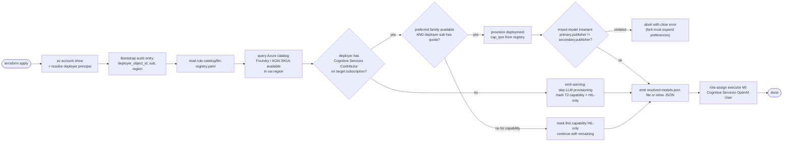

# Runtime Parity - Authoritative Local Development and Test Fixtures

**Goal**: automated tests remain deterministic and secret-free, while every interactive local
Console session shows the operator's actual Azure development environment. Azure deployment
still uses the **deployer's Azure permissions + region catalog to decide which LLM and other
resources are provisioned**. Three truths hold at the same time:

- **Automated-test truth**: pytest and committed mocks may bind deterministic fakes. They use an
  explicit test-fixture builder and never represent observed Azure state.
- **Full-stack local truth**: `Console Web: Full Stack` uses browser Entra sign-in with the same
  App Role checks as deployment. The server's Azure CLI session supplies provider credentials for
  the Azure development data plane only. Inventory, model availability, agent activity, Process
  state, promotion evidence, and audit data appear only from authoritative providers. Missing
  sources render unavailable or explicitly empty; the Console never substitutes generated examples.
- **Deploy truth**: `terraform apply` provisions the Azure-side realizations of the
  CSP-neutral contracts. The **LLM subset is deployer-scoped**: the bootstrap resolver
  queries the deployer's identity against the target region's catalog, provisions
  **only what the deployer has permission to create**, and records the resolved
  `{capability → deployment}` mapping plus resolver input provenance in the artifact.

All profiles share **one control path**: only composition-root adapters and credentials differ
([project-structure.md § Customization via Dependency Injection](../architecture/project-structure.md#customization-via-dependency-injection)).
Adding a real Azure client is a fork-side injection; it MUST NOT edit `core/`.

## Audit - What Works Local, What Needs Azure

Snapshot as of 2026-07-21. "Automated test" means pytest or a committed mock invoked by the
test runner. "Full-stack local" means the VS Code compound launch using browser Entra for the
operator and the current Azure CLI context for server-side Azure adapters. Test fixtures are never
enabled by that launch profile.

### Fully working in automated tests (no Azure needed)

| Subsystem | Local backend | Notes |
|-----------|---------------|-------|
| T0 deterministic engine | `opa` binary + Rego policies + rule catalog | 100% offline; the CI parity gate proves this |
| Rule catalog loader + shadow eval pipeline | filesystem YAML | no cloud calls |
| Risk gate + promotion registry | in-memory `ActionPromotionRegistry` | seam swappable |
| Executor + resource lock | in-process | fixture-only; never an interactive executor |
| Audit store | `InMemoryStateStore` (hash-chain verified) | prod backend = Postgres |
| Event ingest + trust router | in-process | no bus wired |
| Verticals (Resilience / FinOps / Change Safety) | pure decision modules | no cloud |
| Quality gate | `StaticVerifier` + `MatchTypeCrossCheckModel` + `InMemoryGroundingSource` | see [llm-strategy.md § T2](../architecture/llm-strategy.md#t2--reasoning-tier-quality-gate-required) |
| T1 similarity | `DeterministicEmbeddingModel` + `InMemoryPatternLibrary` | hash-based, no real embeddings |

Operator browser E2E tests use Playwright against the real Vite SPA with an explicit dev-test
profile. Route interception supplies a declared synthetic read-source manifest, incidents, agent
frames, and chat SSE response. These fixtures exist only inside the test runner and never activate
for `Console Web: Full Stack`. Backend integration tests separately exercise the same request
contract through the real Starlette route and server-owned evidence resolver.

### Backed by dev-up.sh (still local)

| Subsystem | Local backend | Prod backend |
|-----------|---------------|--------------|
| State store (integration tests) | `pgvector/pgvector:pg16` on `:5432` | Azure PostgreSQL Flexible + pgvector |
| Event bus (integration tests) | Redpanda on `:19092` (Kafka wire) | Event Hubs Kafka on `:9093` |

### Fixed workspace ports

Committed VS Code settings keep each local web surface on one predictable port. The design mock
site is static and separate from the authenticated Console full stack.

| Surface | Default address | Workspace entry point |
|---------|-----------------|-----------------------|
| Design mocks | `http://127.0.0.1:5373` | `design mocks: serve (5373)` task or Live Server |
| Console SPA | `http://127.0.0.1:5273` | `Console Web: Frontend` |
| Read API | `http://127.0.0.1:8010` | `Console Web: Read API` |
| Test ingestion gateway | `http://127.0.0.1:8011` | `Console Web: Ingestion Gateway` |

The `Console Web: Full Stack` compound starts the core runtime, Console SPA, and read API. It does
not start the static design mocks or the isolated test ingestion gateway.

### Workspace context hygiene

The committed VS Code settings exclude dependency trees, caches, generated reports, local runtime
state, secrets, Terraform state, and scratch outputs from Explorer, search, or file watching as
appropriate. These exclusions reduce editor load and keep generated or local artifacts out of
default workspace-search context. They are discovery preferences only: you can still open an
excluded path for an explicit task, and no exclusion selects an evidence profile, authentication
mode, action lifecycle, or runtime adapter. Source, tests, and owning design docs remain searchable.

### Console data in local development

The canonical local read API uses `FDAI_READ_API_LOCAL_ENTRA=1` and shares route-owned runtime helpers with deployment. The browser obtains the API token
and the API verifies its JWT and App Roles exactly as deployment does. The server's Azure CLI token
is confined to Azure adapters such as Resource Graph, Microsoft Graph, model discovery, and Event
Hubs. `FDAI_READ_API_LOCAL_AZURE_CLI=1` with `VITE_LOCAL_AZURE_CLI_AUTH=1` is an explicit
CLI-principal debug alternative with a fixed role ceiling.

When `FDAI_MONITOR_WORKSPACE_ID` is configured, explicit Command Deck `query_log` commands use
the same bounded Azure Monitor Logs provider in both profiles. Interactive local obtains its data
plane token from the current Azure CLI context; deployment uses the dedicated read-API managed
identity selected by `FDAI_MI_CLIENT_ID`. The workspace is server-configured and cannot be changed
by the browser. If the workspace, identity, permission, or telemetry is unavailable, the query
holds as unavailable without a fixture or model fallback.

The local runtime environment generator also supplies the applied subscription and resource group
to the bounded Azure read-investigation adapter. When Terraform emits both the optional development
operations gateway URL and its Easy Auth audience, NSG and VNet peering questions use the local
Azure CLI identity to call only the gateway's registered read operations. A missing pair disables
the wrapper, while a configured gateway failure reports unavailable without a direct-ARM fallback.
The gateway uses separate reader and executor managed identities and does not give the local read
API an execution identity. Upstream Terraform enables the development-only mutation operations for
the configured executor principal and passes the gateway URL and audience only to the headless core
Container App. That runtime binds `AzureGatewayDirectApiExecutor`; the read API keeps its read-only
gateway transport and never receives enforce capability. The executor must first request a server-issued dry-run receipt
for the exact registered operation, arguments, and idempotency, audit, stop-condition, rollback,
and impact evidence. The gateway confirms the target through a bounded reader-identity ARM GET,
stores the receipt in private Blob storage for five minutes, and consumes it once with ETag
compare-and-swap before taking the target-scoped resource lease and calling ARM. Caller-asserted,
changed, expired, or replayed receipts fail before mutation. An ARM
long-running operation remains `submitted`; only the executor can resolve its server-owned status
URL through the original idempotency key. A stale pending claim is recovered with ETag
compare-and-swap after its bounded timeout instead of remaining blocked indefinitely.
Repeated identical plans return the same unconsumed receipt. A consumed or expired plan needs a
new idempotency key. ARM throttling honors a bounded `Retry-After` for at most three attempts, while
mutation `5xx` responses remain ambiguous and aren't automatically repeated.

The same read-investigation wiring constructs the bounded Azure subscription-health provider from
the applied subscription and resource groups, so local development answers subscription-health
questions through the identical Azure adapter that deployment uses. The local factory injects that
provider into the read API only when the read-investigation wiring is present, preserving the
read-only, server-owned data-plane boundary.

The local factory starts all 15 agents by default. `FDAI_START_PANTHEON` is a disable-only control:
unset means enabled, while `0`, `false`, `no`, or `off` disables the runtime. When Event Hubs is
configured, the agents use that Azure transport under a dedicated local consumer group. Otherwise,
the local in-process EventBus carries real Pantheon messages and exposes the agent SSE snapshot. It
does not create Azure evidence, durable state, or execution authority. If Kafka rejects a configured
topic during startup, the Event Hubs adapter closes the failed consumer before surfacing the error.

The local runtime environment generator reads transport settings from the applied Terraform
outputs. It compares the subscription encoded in the Terraform executor identity resource ID with
the active Azure CLI subscription and stops before resource lookup or file creation when they differ.
It also derives a non-identifying consumer instance hash from the local user and host so concurrent
developers never join the same Event Hubs Kafka consumer group. Automation can set
`FDAI_LOCAL_CONSUMER_INSTANCE` to a lowercase alphanumeric-and-hyphen identifier of at most 20
characters when it needs a stable explicit name. Generated core, Pantheon, and read API groups use
that instance, while deployed read API replicas use their runtime hostname. Each console stream
therefore receives every frame instead of sharing partitions with another developer or replica.

Workflow definitions use the same enforce allowlist as deployment, while each ActionType remains
subject to its authoritative promotion and risk gates. Enforce workflows still require Azure event
transport. Thor does not receive the developer's credential: privileged execution remains in the
deployed Managed Identity runtime. Scenario replay, seeded audit rows, recording executors, VM-task
fakes, synthetic scheduler/cost data, scope templates, and blast-radius fixtures remain pytest-only.

When FDAI's Azure PostgreSQL, Event Hubs, runtime, or executor resources are absent, the associated
surfaces are unavailable or empty with no runtime claim. Repository catalogs and schemas remain
visible because they are configuration-as-code, not observed runtime evidence.

The local API exposes `GET /system/data-sources`. In the standard full stack, the production
PostgreSQL read-model adapter points to local pgvector. Before accepting traffic, the local read API
runs a bounded `SELECT 1` through that adapter. A failed probe stops startup instead of exposing a
partially connected console. After the probe succeeds, PostgreSQL-backed entries report
`available` and `reachable=true`; configured remote and Azure request-time sources remain `unknown`
until their own evidence contract verifies them.
`FDAI_DATABASE_URL` and `FDAI_AUTHORITATIVE_READ_API_BASE_URL` select mutually exclusive source
profiles. Configuring both stops startup before either provider is constructed so the manifest can
never describe local PostgreSQL while allowlisted requests are served by the remote API.
Remote forwarding matches only decoded canonical allowlisted paths; normalized, encoded,
duplicated-separator, and control-character variants remain local. It discards upstream cache
directives and emits `Cache-Control: no-store` for every proxied response so authenticated
operational evidence never enters a browser or shared cache. A remote failure before response
headers becomes a bounded JSON `503`; a failure after headers closes the response body without
sending a second ASGI response start.

Runtime skill inspection follows the same rule. Production reconstructs the enabled catalog from
signed PostgreSQL trusted-artifact records before accepting traffic. Interactive local exposes the
same Reader-gated `/skills` contract and narrator verbs with an empty fail-closed snapshot unless a
durable verified store is explicitly composed; it never invents installed skills or load outcomes.

Agent Activity keeps live runtime frames separate from durable audit rows. Selecting an observed
agent always shows its live state, current work, runtime binding, state timestamp, stream
provenance, and incident context. If no audit row is attributed in the current window, the timeline
states that explicitly instead of replacing the live summary or inferring an audit event.
The headless Pantheon publishes health-derived `agent.runtime-state` frames on the same
`aw.pipeline.stages` transport that carries control-loop progress. The read API distinguishes
runtime-state frames from stage frames and forwards only agents whose consumers are live and whose
health probe isn't in error. Interactive local and deployment use this same cross-process path; the
local profile changes the PostgreSQL binding, not agent activation or stream semantics.
The browser also retains the newest 100 observed SSE frames for the lifetime of the tab and renders
them as a separate live journal. Runtime heartbeats prove connectivity but don't count as work;
collecting, analyzing, deciding, executing, approving, auditing, Incident, and handoff frames do.
This journal is bounded and non-durable, resets on reload, preserves each frame's recorded source,
and never substitutes for the append-only audit log.

Completed conversation review follows the same split. Interactive local transport can publish the
bounded Bragi `object.turn` envelope, but it does not fabricate a reviewer or durable proposal
store. The deployed headless runtime records deterministic ineligible/unsupported reasons and uses
the Azure reviewer only when two distinct model families resolve. PostgreSQL holds restart-safe
review and draft state; the production read API projects those rows without sharing process memory
or adding an approval endpoint.

### Azure-backed integrations

| Subsystem | Status | Gap |
|-----------|--------|-----|
| Azure Resource Graph inventory | Production reads the promoted PostgreSQL snapshot plus Huginn's real-time delta overlay | Full-stack local uses read-only `AzureCliInventory` with a `.fdai/cache/inventory` snapshot isolated by subscription and Azure CLI profile fingerprint; synthetic opt-out is rejected |
| Azure Monitor Logs KQL | Production and local adapters share `AzureLogAnalyticsQueryProvider` | Requires server-owned `FDAI_MONITOR_WORKSPACE_ID`; explicit `query_log` fails closed when unavailable |
| Managed Identity token (`WorkloadIdentity`) | Deployed adapter exists | interactive local publishes to the deployed executor; fixture tests may use a local issuer |
| Governed execution backend | Provider-neutral Protocol, profile registry, durable PostgreSQL ledger, bubblewrap/VM adapters, and Azure Container Apps Job adapter exist | profiles are disabled by default; local interactive has no executor binding, and live Azure Job evidence remains required before promotion |
| Browser evidence | Provider-neutral contracts, optional Playwright adapter, PostgreSQL artifacts, and GET-only inspection exist | unbound by default; interactive local has no executor identity and renders unavailable until an isolated restricted-egress browser runtime and exact origin policies are configured |
| Key Vault secret provider (`SecretProvider`) | deployment injects Key Vault references | interactive adapters use environment references; fixture values remain test-only |
| GitOps PR publisher | Real GitHub adapter exists | interactive execution uses the configured adapter; recording publishers are test-only |
The local inventory cache promotes only scans that reach the final fence and writes them by atomic
replace. A fresh cache returns immediately across read API restarts. An expired or Huginn-invalidated
cache returns immediately as `stale` with `cache.status=refreshing`, then a background Azure CLI scan
atomically replaces it. When a provisioned `aw.inventory.raw` topic is configured through
`FDAI_INVENTORY_RAW_TOPIC`, accepted write/delete events invalidate the local cache after durable
projection. A stack without that auxiliary-topic binding converges through TTL refresh. A missing
explicit subscription disables persistent cache reuse rather than risking a snapshot from another
active Azure CLI subscription. The cache envelope also binds the resource limit, rejects malformed
or materially future-dated snapshots, and bounds each local refresh to 240 seconds. Cache-file or
marker I/O failure preserves the last complete in-memory graph. Marker write failure falls back to
TTL convergence; marker metadata read failure is treated as stale and schedules refresh rather than
trusting uncertain cache state. Persistent reads accept only user-private regular files and enforce
the 5 MB limit on an already-open descriptor. Writes repair the cache directory to mode `0700`,
create mode-`0600` files, cap serialized bytes before replace, and fsync the directory. Both live
and cached graphs reject duplicate resources or links, dangling/self links, non-finite or out-of-
world geometry, invalid roots or parent cycles, future timestamps, invalid envelopes, and counts
beyond the configured limit.

## Parity Contract (MUST)

Every seam that touches an out-of-process dependency MUST provide:

1. **A Protocol in `shared/providers/`** - the neutral wire contract. `core/` imports the
   Protocol only. This already holds for `EventBus`, `StateStore`, `SecretProvider`,
   `WorkloadIdentity`, `Inventory`, and the LLM seams (`EmbeddingModel`,
   `CrossCheckModel`, `VerifierPolicy`, `GroundingSource`).
2. **A test-fake implementation** - deterministic, in-process, and secret-free. It is selected
  only by automated tests or committed mock/example applications through an explicit fixture
  builder, never by the interactive local Console.
3. **A runtime adapter** - the interactive profile may use a bounded local adapter for transport
  and SSE while Azure adapters remain under `delivery/azure/` (never `core/`). Adapter selection
  does not enable or disable the Pantheon.
4. **Fail-fast or unavailable in the mismatch case** - an interactive or deployed runtime never
  falls back to a test fake. A required startup source fails startup; an optional read panel
  renders unavailable. Silent fallback is **prohibited** (matches the "no HIL-silent fallback" rule in
   [llm-strategy.md § Bootstrap Provisioner](../architecture/llm-strategy.md#bootstrap-provisioner)).

Every test that exercises the pipeline runs in mode (1)+(2) so the CI parity gate never
needs an Azure token.

Automated action tests wait for the agent run to reach its expected terminal state; an observed
intermediate state such as `verdicted` does not count as completion. CI also disables narrator
endpoint auto-open so deterministic parity tests never invoke Azure CLI or change firewall rules.

Execution backend parity follows the same rule. Automated tests may bind the in-memory ledger and
mock HTTP transport. Interactive local may inspect a disabled profile through a shadow health or
plan probe, but it does not submit work or receive Thor's identity. Deployment binds the same
provider-neutral coordinator to PostgreSQL and the injected executor `WorkloadIdentity`; the Azure
adapter remains under `delivery/azure/`. See
[Governed Execution Backends](../interfaces/execution-backends.md).

## Deployer-Scoped LLM Provisioning

At `terraform apply` time the resolver behaves like this:

**Deployer permission gates** (checked by the resolver before touching the catalog):

| Check | Failure mode | Follow-up |
|-------|--------------|-----------|
| `az account show` returns a signed-in principal | abort - deployer must run `az login` | one-line diagnostic |
| Principal has `Cognitive Services Contributor` (or `Owner`) on the target subscription | skip LLM provisioning, mark all `t2.*` and `t1.judge` capabilities as `hil-only`, emit warning | fork can grant the role and re-run |
| Region exposes at least one family from each capability's preferences | mark just the affected capability `hil-only`, warn | fork can expand preferences in `llm-registry.yaml` and re-run |
| Deployer's subscription has quota for the requested `capacity_tpm` | reduce to the largest available capacity ≥ 20% of requested; refuse below that | fork requests quota increase |
| Mixed-model invariant (`t2.reasoner.primary.publisher != t2.reasoner.secondary.publisher`) after resolution | **abort** - do NOT partially deploy a T2 tier that would fail the quality gate | fork adjusts preferences |

The resolver artifact contains the deployer's `object_id`, subscription, region, resolved
capability map, and reasons. Identical registry + catalog + permission + quota inputs produce
identical JSON. The resolver caller owns appending that evidence to the audit store.

## Work Plan (phased, additive)

Every phase leaves the tree buildable + testable at `head`. Multi-cloud is **TBD**
throughout ([copilot-instructions § Implementation Focus](../../../.github/copilot-instructions.md#implementation-focus-must)).

**Status as of 2026-07-21**: W-A through W-G are **shipped**; W-H (docs sync) shipped
alongside the initial draft of this document; W-I (reconciler weekly job) remains deferred.
Each work item below reflects what actually landed - code, tests, and gate coverage.

### W-A: Config schema for LLM + dev-mode flag ✅ *(baseline, shipped)*

- Add `LlmConfig` to `src/fdai/shared/config/schema.json` + `models.py`:
  - `mode`: `local-fake` | `azure`. `local-fake` is an explicit test/mock binding; deployment
    environment does not select it.
  - `resolved_models_path`: optional KV secret name or filesystem path.
  - `capabilities`: list of capability names (`t1.embedding`, `t1.judge`,
    `t2.reasoner.primary`, `t2.reasoner.secondary`) - mirrors the registry.
  - `t2_primary_latency_routing`: bool, default `true`. Latency routing of
    the T2 primary proposer among its same-publisher candidate pool
    (invariant-safe; enforced on). Takes effect only when the resolver emits
    a >= 2 pool (`--emit-primary-pool`); set `false` to pin the single
    primary. See [llm-strategy.md](../architecture/llm-strategy.md) section
    "T2 Primary Latency Pool".
- Fail-fast validator: `mode == "azure"` requires `resolved_models_path` present.
- Tests: schema + pydantic validators.

### W-B: `rule-catalog/llm-registry.yaml` + schema  ✅ *(catalog-as-code, shipped)*

- New file: `rule-catalog/llm-registry.yaml` with upstream defaults (mini → Opus tier).
- JSON Schema: `rule-catalog/schema/llm-registry.schema.json`.
- Python loader: `fdai.rule_catalog.schema.llm_registry` with the aggregating
  fail-close pattern used elsewhere (see `exemption.py`).
- Tests: schema validation, mixed-model invariant check.

### W-C: Bootstrap resolver CLI  ✅ *(deployer-scoped, shipped)*

- New: `src/fdai/rule_catalog/schema/llm_resolver_cli.py`.
- Inputs: `--registry`, `--region`, `--subscription-id`, `--dry-run`, `--out`.
- Fixture mode requires catalog, permission, and quota JSON inputs for offline CI.
- `--use-azure-cli` uses the existing `az login` context and optional `AZURE_CONFIG_DIR`
  to query model catalogs, role assignments, usage/quota, and provisioned capacity read-only.
- Emits `resolved-models.json` (or `--dry-run` prints to stdout).
- Enforces every check in [Deployer-Scoped LLM Provisioning](#deployer-scoped-llm-provisioning).
- Tests: mock the two SDK clients; assert precedence + mixed-model invariant + `hil-only`
  fallback + idempotent output on same inputs.

### W-D: Azure OpenAI Terraform module + preflight  ✅ *(infra, shipped)*

- New: `infra/modules/llm/azure-openai/`.
  - `main.tf`: `azurerm_cognitive_account` (kind=`OpenAI`) + N
    `azurerm_cognitive_deployment` from `resolved_capabilities`.
  - `variables.tf`: `enable_llm` (default `false` so bare-minimum deploys still succeed),
    `resolved_capabilities` (object list from resolver).
  - `outputs.tf`: `endpoint`, `deployments` map, `resource_id`.
- Role assignment: executor MI → `Cognitive Services OpenAI User` on the account.
- Root `infra/main.tf` wires the module conditionally on `var.enable_llm`.
- Update `infra/README.md` with the deploy flow: resolver first → `terraform apply` with
  `enable_llm=true`.

### W-E: Azure OpenAI adapter classes  ✅ *(delivery, shipped)*

- `src/fdai/delivery/azure/llm/embeddings.py` - `AzureOpenAIEmbeddingModel`
  implementing `EmbeddingModel`, using injected async `httpx` + `WorkloadIdentity`.
- `src/fdai/delivery/azure/llm/cross_check.py` - `AzureOpenAICrossCheckModel`
  implementing `CrossCheckModel`.
- Timeout, retry-after honouring, structured output (`response_format={"type":"json_object"}`)
  - see [llm-strategy.md § Provider Abstraction](../architecture/llm-strategy.md#provider-abstraction).
- Tests: use `httpx.MockTransport` + recorded fixtures - no live network.

### W-F: Composition-root wiring  ✅ *(binding, shipped)*

- Extend `Container` with `embedding_model: EmbeddingModel`, `cross_check_models`,
  `verifier_policy`, `grounding_source` fields.
- `default_container(config)` binds deterministic fakes for `local-fake` and returns an
  unbound container for `azure`. Runtime bootstrap then calls
  `bind_azure_llm_bindings`/`wire_azure_container`, loads `resolved-models.json`, and binds
  adapters per capability. A missing entry fails fast.
- Tests: both branches; assert `local-fake` never imports `delivery.azure.llm`.

### W-G: Fixture identity + secret + inventory adapters  ✅ *(test support, shipped)*

- `EnvSecretProvider` in `shared/providers/testing/` (renamed to
  `shared/providers/local/` to reflect dev usage).
- `LocalWorkloadIdentity` - issues an in-memory OIDC token accepted only by fixture adapters
  (no network). Interactive local never uses it as Thor's identity.
- `FileFixtureInventory` - reads `Resource` records from any YAML fixture the fork passes to its constructor (`fixture=Path(...)`); upstream ships zero seed fixtures, and the recommended convention is `tests/scenarios/inventory/*.yaml` alongside the frozen scenario replay so verticals can dry-run without ARG.
- Tests + docstrings show the exact fork-side pattern.

### W-H: Docs sync  *(this phase)*

- ✅ This document itself.
- Update [deploy-and-onboard.md § Runtime Configuration Matrix](deploy-and-onboard.md#runtime-configuration-matrix)
  to add `LLM_MODE`, `LLM_RESOLVED_MODELS_PATH`.
- Update [deploy-and-onboard.md § Azure Resource Inventory](deploy-and-onboard.md#azure-resource-inventory-minimum-set)
  to add row 11 (Azure OpenAI, opt-in).
- Update [tech-stack.md § Local Development](../architecture/tech-stack.md#local-development) to
  distinguish authoritative interactive adapters from explicit fixtures.
- Update [llm-strategy.md § Bootstrap Provisioner](../architecture/llm-strategy.md#bootstrap-provisioner)
  to reference this doc for the deployer-permission gates.

### W-I: Reconciler weekly Job  *(later phase - deferred)*

Kept as future work. Full design already in
[llm-strategy.md § Reconciler Job](../architecture/llm-strategy.md#reconciler-job); ships as a
`infra/modules/compute/container-apps-job/` reuse plus a Python entry point.

## Fork-Side Override Points

Everything above stays customer-agnostic. A fork customises without touching `core/` by:

- Providing its own `llm-registry.yaml` with region/compliance overrides.
- Supplying `AZURE_TENANT_ID` / `AZURE_SUBSCRIPTION_ID` env pointing at the fork's
  subscription. **This repo never stores those values.**
- Registering additional LLM providers (e.g. Anthropic direct API) by binding a fork-owned
  `CrossCheckModel` implementation in its composition root - the `azure-foundry` /
  `external` / `hil-only` toggle in
  [llm-strategy.md § Mixed-Model Family Strategies](../architecture/llm-strategy.md#mixed-model-family-strategies).

## Verification Gates

Each work item MUST be provable at CI time:

- The explicit fixture profile imports zero `delivery.azure.*` modules. Interactive local uses the
  Azure adapters selected by its authoritative profile.
- Identical input, App Roles, promotion state, and risk configuration produce the same local and
  deployed verdict and Process transition.
- Interactive local starts all 15 agents by default. It uses Azure transport when Event Hubs is
  configured and bounded in-process EventBus/SSE otherwise, without recording/in-memory executors.
- Terraform plan with `enable_llm=false` succeeds on a fresh subscription with only
  `Reader` role - proving the LLM module is truly opt-in.
- Resolver dry-run against a recorded region catalog produces a stable
  `resolved-models.json` hash - proving idempotency.

## Open Questions

- **Runtime delivery for `resolved-models.json` - resolved.** Day zero supports a filesystem
  path or inline JSON env/secretRef. A direct Key Vault loader remains deferred with W-I.
- **Is a local Ollama / LM Studio fixture worth adding?** Not now. It would be an explicit model
  binding and would not redefine the interactive local profile.
- **Reconciler alerts channel** - assumed Teams; confirm at W-I time.
