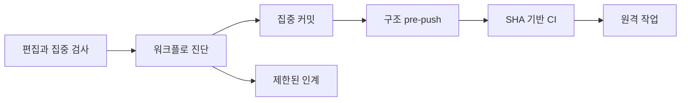

# 개발 워크플로 보증

이 문서는 동시 FDAI 개발을 빠르고 재개 가능하며 fail-closed 상태로 유지하는 저장소 통제를
정의합니다. 개발 워크플로 진단과 지연 근거를 소유하며, 제품 control plane이나 실행 권한은
소유하지 않습니다.

> 범위: 이 제한된 캠페인은 [이슈 #116](https://github.com/dotnetpower/fdai/issues/116)에서
> 추적합니다. 워크플로 최적화는 설계 문맥, 집중 검사, SHA 기반 CI, 신원 확인 또는 배포 승인을
> 우회하지 않습니다. 로컬 validation queue는 opt-in 진단이며 commit, push 또는 배포 권한이 아닙니다.

## 설계 개요

FDAI는 로컬 스크립트 전반에서 하나의 읽기 전용 개발 워크플로 진단 표면을 사용합니다. 이
표면은 공유 쓰기, 검증, 문맥, 인계, 테스트 격리, hook, 브라우저 검사, 로컬 서비스, 편집기
부하 및 원격 사전 검사의 실행 가능한 상태를 보고합니다. 각 소유 메커니즘은 기존 권한을
유지하고 독립적으로 fail-closed 처리합니다.

진입점은 `python3 scripts/automation/developer-workflow.py`입니다. 다음과 같은 제한된 명령을
제공합니다.

| 명령 | 결과 |
|------|------|
| `status` | Git, 검증, 인계, 테스트 환경, hook 위험, 로컬 서비스, 브라우저 runner 및 편집기 부하 진단을 집계합니다. |
| `resume` | 최신 관련 인계를 현재 검증 및 worktree drift와 함께 렌더링합니다. |
| `context-plan <path>...` | 대상 경로의 중복 제거된 현재 설계 문서와 집중 검사를 출력합니다. |
| `preflight` | Git index, hook 상태, Python path, virtual environment 또는 database identity가 오염되면 집중 검사 전에 실패합니다. |
| `--json` | 명시적인 `ok`, `warning` 또는 `unavailable` 상태가 있는 하나의 version object를 출력합니다. |

이 명령은 기존 Git common dir 상태와 프로세스 메타데이터를 읽습니다. 두 번째 감사 로그를
추가하거나, 커밋 후 세션 소유권을 추론하거나, 사용할 수 없는 진단을 성공 결과로 바꾸지
않습니다.

## 측정 통제

| 영역 | 필요한 통제 | 완료 측정값 |
|------|-------------|-------------|
| 공유 쓰기 | staged 및 unstaged 경로 중첩, 안전하지 않은 공유 index 명령 및 활성 경로 예약을 감지합니다. | 커밋 경계에 해결되지 않은 중첩 또는 안전하지 않은 commit 명령이 없습니다. |
| 검증 | 로컬 receipt를 권위로 만들지 않고 집중 검사 상태, push된 SHA의 CI 상태 및 optional queue 진단을 보고합니다. | 일반 commit과 push는 optional queue를 기다리지 않으며, 필요한 CI는 정확한 push SHA에 귀속됩니다. |
| 설계 문맥 | 캐시된 바이트를 새 세션이 설계를 읽었다는 증명으로 취급하지 않고 중복 제거된 route 계획을 해석합니다. | 작업마다 계획 1개이며 같은 세션에서 변경되지 않은 필수 문서를 반복해서 읽지 않습니다. |
| 세션 연속성 | 제한되고 비밀이 없는 worktree, diff, 검증 및 다음 검사 메타데이터를 보존합니다. | 새 세션이 저장소 전체 재탐색 없이 하나의 인계 명령으로 재개합니다. |
| 집중 테스트 | 테스트 시작 전에 Python import, 데이터베이스, 런타임 환경 및 checkout 오염을 감지합니다. | 오염된 검사는 작업 코드를 import하거나 데이터베이스 연결을 열기 전에 실패합니다. |
| Hook | 변경형 hook 실행 전에 staged 및 unstaged 중첩을 감지하고 결정론적 복구 지침을 보존합니다. | Hook 실패가 작업 소유 변경을 조용히 버리지 않습니다. |
| 브라우저 검사 | 집중 CLI Playwright 검사를 우선하고 공유 10-slot lease 계약을 보존합니다. | CLI 근거가 충분하면 브라우저 도구 사용을 제한된 최종 상호 작용 1회로 제한합니다. |
| 로컬 서비스 | 제한된 timeout과 소유권 진단으로 모든 표준 로컬 서비스를 독립적으로 probe합니다. | Full-stack 준비 상태가 사용 불가능한 모든 서비스를 지목하며 SPA만으로 준비 상태를 추론하지 않습니다. |
| 편집기 부하 | 호스트 부하, extension 부하 및 upstream 브라우저 payload 비용을 분리합니다. | 진단이 소유 프로세스를 식별하거나 제한을 upstream으로 분류합니다. |
| 원격 사전 검사 | 고정된 시도 및 시간 예산 안에서 transient 읽기 실패만 retry합니다. | 영구 권한 및 policy 실패는 즉시 실패하며 retry는 Azure를 변경하지 않습니다. |

모든 진단은 제한됩니다. Git 기록 scan은 최대 64개 commit, validation 지연은 최대 50개
receipt, 변경 파일 출력은 최대 20개 경로, 프로세스 출력은 최대 20개 행, HTTP probe는
커밋된 로컬 port inventory, Azure 읽기는 최대 3회 시도를 사용합니다.

## 안전 경계

- 진단 표면은 읽기 전용입니다. Stage, restore, reset, commit, kill, restart, deploy, approve
  또는 promote하지 않습니다.
- 설계 문맥 재사용은 세션 범위이며 content-addressed 방식입니다. 인계는 필수 문서를 지목할
  수 있지만, 수신 세션은 고위험 편집 전에 현재 내용을 다시 읽습니다.
- Optional queue 근거는 commit 주소 기반으로 유지됩니다. Queue 지연 경고는 receipt를 만들거나
  push를 승인하거나 실패한 단계를 건너뛰지 않습니다.
- 환경 검사는 자격 증명, token, 연결 문자열, tenant 값 또는 고객 리소스 이름을 출력하지 않고
  정규화된 identity를 비교합니다.
- Azure retry는 안전한 읽기와 transient 전송 또는 throttling 응답에만 적용됩니다. 승인된
  host 검사는 모든 시도 전에 실행되며 retry 소진 시 하나의 `PreflightError`를 반환합니다.
- Upstream VS Code 및 Copilot 동작은 저장소에서 다시 구현하지 않습니다. 저장소 통제는 제한된
  진단과 저비용 검증 경로를 제공합니다.
- 적용은 기존 edit hook, commit-scope hook, 집중 테스트 runner, 구조 pre-push gate, SHA 기반 CI
  및 배포 preflight에 남습니다. Optional validation queue와 통합 명령은 상태를 보고하며 대체 권한
  경로가 되지 않습니다.

## 실패 동작

| 실패 | 진단 동작 | 소유 적용 |
|------|-----------|-----------|
| Git common dir 상태가 없거나 손상됨 | 안정적인 reason code와 함께 `unavailable`을 보고합니다. | 기존 Git 및 hook 명령은 독립적으로 실패합니다. |
| Optional validation receipt의 timestamp가 잘못됨 | 지연 계산에서 제외하고 잘못된 record 수를 보고합니다. | Optional receipt 검증은 변경되지 않습니다. |
| Handover가 도달 불가능한 기록을 참조함 | Drift와, 가능한 경우 가장 가까운 도달 가능한 관련 handover를 보고합니다. | Branch 또는 worktree를 변경하지 않습니다. |
| 로컬 서비스 probe timeout | 서비스와 port를 unavailable로 보고합니다. | 서비스 task는 독립적으로 제어됩니다. |
| VS Code 프로세스 데이터를 사용할 수 없음 | 편집기 부하를 upstream-unavailable로 분류합니다. | 집중 CLI 검증은 계속 사용할 수 있습니다. |
| Azure가 영구 오류를 반환함 | 첫 시도 후 중단합니다. | 읽기 전용 preflight는 fail-closed 처리합니다. |

## 비평 프로토콜

각 라운드는 반증 가능한 발견 사항 하나로 시작하고 집중 검사로 끝납니다. 기존 통제가 잔존
위험을 이미 Low로 낮춘 경우 기각된 발견 사항으로 기록합니다. Production 변경은 독립적으로
검증된 발견 사항으로 제한하고 최종 검토에서 전체 위협 목록을 다시 확인합니다.

캠페인은 다음 심각도 정의를 사용합니다.

| 심각도 | 의미 |
|--------|------|
| Critical | 작업을 잃거나 잘못 귀속하고, 필수 gate를 우회하거나 false validation을 만들 수 있습니다. |
| High | 자율 진행을 반복해서 차단하거나 잘못된 checkout 또는 환경을 검증할 수 있습니다. |
| Medium | 안전 결정을 약화하지 않지만 상당한 지연 또는 수동 복구를 유발합니다. |
| Low | 결정론적 진단과 복구가 있는 제한된 불편입니다. |

구현 순서는 라운드마다 하나의 발견 사항을 유지합니다.

| 라운드 | 초점 | 계획 근거 |
|-------:|------|-----------|
| 1 | 통합 status schema 및 제한된 수집 | 집중 workflow CLI 테스트 |
| 2 | 공유 index 및 staged/unstaged 중첩 진단 | 합성 dirty-index 테스트 |
| 3 | Validation pending 시간 및 지연 계산 | 합성 queue 상태 테스트 |
| 4 | 중복 제거된 설계 문맥 계획 | 기존 route fixture 및 CLI 테스트 |
| 5 | 재개 가능한 handover schema 및 drift 감지 | Handover 호환성 테스트 |
| 6 | Python, checkout 및 database 오염 preflight | 오염된 환경 테스트 |
| 7 | Hook 복구 진단 | Staged/unstaged 중첩 fixture |
| 8 | 브라우저 runner 및 로컬 서비스 준비 상태 요약 | 정적 lease 및 제한된 HTTP probe 테스트 |
| 9 | 편집기 부하 분류 | Stub 프로세스 및 pressure record |
| 10 | Azure transient retry 예산 | Stub HTTP 및 timeout 테스트 |
| 11 | 기존 통제 적대적 검토 | 설계 문맥, route 및 port-pool 집중 suite |
| 12 | 통합 잔존 위험 검토 | 모든 캠페인 집중 검사 및 정확한 diff selection |

## 보증 결과

캠페인은 13개의 독립 라운드를 완료했습니다. 수락된 각 발견 사항은 집중 커밋으로 반영했고,
기각된 발견 사항은 기존 통제 또는 직접 테스트를 근거로 제시합니다.

| 라운드 | 결과 | 집중 근거 |
|-------:|------|-----------|
| 1 | 수락 | Versioned 읽기 전용 status schema, workflow 테스트 2개가 통과했습니다. |
| 2 | 수락 | 공유 index overlap 진단, workflow 테스트 3개가 통과했습니다. |
| 3 | 수락 후 라운드 13에서 추가 hardening | Pending 시간과 receipt 지연, workflow 테스트 4개가 통과했습니다. |
| 4 | 수락 | 중복 제거된 route 문서와 검사, design-context 및 workflow 테스트 93개가 통과했습니다. |
| 5 | 수락 후 라운드 13에서 추가 hardening | Handover schema v2와 drift, handover 및 workflow 테스트 8개가 통과했습니다. |
| 6 | 수락 | 비밀을 출력하지 않는 환경 오염 preflight, workflow 테스트 7개가 통과했습니다. |
| 7 | 수락 | Hook 복구 분류, workflow 테스트 8개가 통과했습니다. |
| 8 | 수락 후 라운드 13에서 추가 hardening | 브라우저 lease와 6개 서비스 준비 상태, workflow 테스트 10개가 통과했습니다. |
| 9 | 수락 | Host와 client 부하 분리, 불필요한 client probe 제거 후 테스트 11개가 1.01초에 통과했습니다. |
| 10 | 수락 | Azure transient-only 제한 retry, Azure 접근 없이 preflight 테스트 6개가 통과했습니다. |
| 11 | 수락 | 기존 통제의 Python 테스트 163개와 Playwright port-pool 테스트 6개가 통과했습니다. |
| 12 | 수락 | Collector를 248, 276, 195줄로 분리했고 workflow 테스트 11개가 통과했습니다. |
| 13 | 수락 | Window 불확실성, invalid receipt, malformed handover 및 잘못된 checkout의 core readiness를 fail-closed 처리했고 테스트 48개가 통과했습니다. |

최종 독립 재검토에서는 Low를 초과하는 잔존 사항이 없었습니다. 다음과 같은 제한된 Low 위험을
수락했습니다.

- Overlap 경로는 20개만 렌더링하지만 `overlap_count`는 정확한 전체 수를 유지합니다.
- Linux PSI threshold는 권한 또는 autoscaling 결정이 아닌 보수적인 고정 진단입니다.
- 저장소 외부로 해석되는 target symlink는 `context_target_outside_repository`와 함께
  차단됩니다.

검토에서는 Azure retry가 없다는 한 가지 false finding도 기각했습니다. Transport 구현과
throttle, permanent error 및 retry exhaustion 집중 테스트가 해당 동작을 증명합니다.

## 잔존 Top 20 캠페인

[이슈 #118](https://github.com/dotnetpower/fdai/issues/118)은 다음 10개의 측정된 병목까지 보증
범위를 확장합니다. 기존 Top 10 통제는 변경하지 않습니다.

| 순위 | 잔존 병목 | 측정 기준선 | Hardening 라운드 |
|-----:|-----------|-------------|------------------|
| 11 | 비활성 lane의 validation record | Pending 822개 중 활성 checkout 조상 1개, 보존 ref commit 394개, 참조되지 않는 commit 427개 | 모든 checkout과 보존 ref에서 unreachable인 오래된 record만 보수적으로 정리합니다. |
| 12 | 현재 처리량과 섞인 과거 validation 지연 | 최신 receipt 50개의 p95가 cohort age 없이 779.346초로 보고되었습니다. | 현재 cohort 지연과 과거 debt를 분리합니다. |
| 13 | Automation test 선택 불확실성 | Automation 변경은 이미 `tests/integration/scripts`를 선택하며, 이전 broad 선택은 Makefile 변경에서 발생했습니다. | 기존 focused ownership rule을 검증하고 유지합니다. |
| 14 | Warning candidate의 probe instrumentation | Warning 1,901행 중 905행이 명시적 `PROBE_` message를 사용했습니다. | Raw log는 보존하면서 명시적 probe를 actionable warning 수에서 제외합니다. |
| 15 | Core runtime readiness 귀속 | 다른 checkout 또는 wrapper에 runtime process가 있을 때 표준 stack은 6개 중 5개 ready를 보고했습니다. | 정확한 checkout 및 runtime command에 readiness를 바인딩합니다. |
| 16 | Agent tool의 destructive Git 명령 | Commit pathspec은 guard되지만 reset, restore, clean, checkout 및 stash는 guard되지 않았습니다. | Destructive 명령에 명시적 approval marker를 요구합니다. |
| 17 | Dirty-tree validation 복구 | No-edit 지시에도 validation subagent가 uncommitted 문서를 restore했습니다. | 안전하지 않은 dirty-tree validation 진입점을 표시하고 차단합니다. |
| 18 | Issue lifecycle type drift | 완료된 task가 canonical type label 누락으로 `needs-triage`를 다시 받았습니다. | Project start 전에 type label을 요구합니다. |
| 19 | 순차 로컬 readiness probe | HTTP probe 5개가 각각 독립적인 0.5초 timeout을 사용했습니다. | 하나의 제한된 budget 안에서 probe를 병렬 실행합니다. |
| 20 | 반복 Git discovery subprocess | Status 한 번이 여러 section에서 같은 repository와 common directory를 반복 해석했습니다. | Invocation 범위 repository context를 재사용합니다. |

각 라운드는 집중 반증 검사를 사용합니다. 현재 구현이 이미 다루는 finding은 중복 코드를
추가하지 않고 근거와 함께 기각합니다. 종료 조건은 Low를 초과하는 잔존 사항이 없는 또 한 번의
독립 검토입니다.

### Top 20 보증 결과

확장 캠페인은 라운드 11부터 32까지 22개 라운드를 완료했습니다. 독립 검토에서 추가 hardening
및 evidence 라운드 12개가 열렸기 때문입니다.

| 라운드 | 결과 | 근거 |
|-------:|------|------|
| 11 | 수락 | 오래되고 참조되지 않는 pending record는 maintenance 전에 age와 reachability로 preview됩니다. |
| 12 | 수락 | 현재 24시간 receipt 지연과 과거 debt를 별도로 보고합니다. |
| 13 | 기각 | 기존 `test_script_change_selects_moved_integration_script_tests`가 automation 변경이 `tests/integration/scripts`를 선택함을 이미 증명합니다. Makefile 및 다른 global input의 broad 선택은 올바르게 유지됩니다. |
| 14 | 수락 | 명시적 `PROBE_` 및 `diagnostic_probe` record는 raw log에 남지만 제한된 actionable warning 수에서는 제외됩니다. |
| 15 | 수락 | Core runtime readiness는 정확한 checkout 소유권과 다른 checkout owner 수를 보고하며 primary readiness로 취급하지 않습니다. |
| 16 | 수락 후 라운드 21과 23에서 추가 hardening | Destructive Git은 명시적 approval marker를 요구합니다. |
| 17 | 수락 | `delegation-preflight`는 dirty snapshot을 거부하며 always-on agent contract는 dirty worktree의 delegated validation을 금지합니다. |
| 18 | 수락 | Project start는 assignment 또는 board 변경 전에 정확히 하나의 canonical work type을 요구합니다. |
| 19 | 수락 | HTTP probe 5개는 고정된 probe별 0.5초 timeout 안에서 병렬 실행되며 출력 순서는 안정적으로 유지됩니다. |
| 20 | 수락 | Status 한 번이 repository 및 Git common-dir context를 한 번만 해석합니다. |
| 21 | 수락 | 절대경로, `env`, `command` 및 `git -C` destructive 명령을 guard합니다. |
| 22 | 수락 | Reachability는 모든 ref와 checkout head를 한 번의 batch traversal로 계산하고 apply 전에 재계산하며, record를 삭제하지 않고 quarantine으로 이동합니다. |
| 23 | 수락 | 재귀 shell parsing이 `sh -c`, `bash -lc`, `zsh -c` 및 wrapped bare commit을 다룹니다. |
| 24 | 수락 | Checkout 또는 ref가 commit을 다시 활성화하면 quarantine record가 pending으로 자동 복원됩니다. |
| 25 | 수락 | Validator의 `reset --hard`와 `clean -ffdx`는 대상이 정확한 Git common-dir scratch worktree가 아니면 fail-closed 처리됩니다. |
| 26 | 수락 | 명시적인 selector contract가 `developer-workflow.py` 변경이 `tests/integration/scripts`만 선택함을 증명합니다. |
| 27 | 수락 | 실제 pre-tool dispatcher가 direct, absolute, `git -C`, `env` 및 shell-wrapped mutation과 commit을 deny policy로 전달합니다. |
| 28 | 수락 | Validator scratch 준비는 reset 또는 clean 전에 symbolic-link path를 거부하며 sentinel 테스트가 target이 변경되지 않음을 증명합니다. |
| 29 | 수락 | Empty commit pathspec, forged comment approval, Git alias 및 symbolic-link state root가 실제 hook과 validator path에서 fail-closed 처리됩니다. |
| 30 | 수락 | Config-env alias와 mid-word hash token은 destructive operation 또는 commit-scope policy를 우회할 수 없습니다. |
| 31 | 수락 | 값이 이전 shell export에서 왔더라도 해석되지 않은 config-env alias definition은 fail-closed 처리됩니다. |
| 32 | 수락 | 반복된 모든 config-env option을 scan하며 separate 및 equals form을 destructive 및 commit alias에 고정했습니다. |

Review-driven 라운드 전에 focused integration 테스트 231개가 통과했습니다. 최종 focused suite는
통합 dispatcher 및 parser fixture 40개, scratch ownership guard 3개, validation queue 테스트
37개 및 validator와 selector 테스트 85개가 통과했습니다. 변경된 workflow source의 Ruff와
strict mypy도 통과했습니다. 최종 독립 검토에서 Low를 초과하는 잔존 사항이 없었습니다.

남은 Low 위험은 명시적이고 제한됩니다.

- Warning 요약은 최대 5 MiB와 5,000행을 scan하므로 더 오래된 actionable warning은 현재 진단
  window 밖에 남을 수 있지만 raw log는 변경되지 않습니다.
- Retired pending record는 이후 maintenance policy가 제거할 때까지 Git common-dir quarantine에
  남습니다. 자동 reactivation은 validation starvation을 방지합니다.
- Terminal guard는 agent tool을 통해 실행되는 선언적 shell command string을 다룹니다. 임의로
  생성된 program의 동작까지 증명하려고 하지 않으며, 해당 program은 user request, code review 및
  clean-snapshot contract의 적용을 계속 받습니다.

## 구현 상태

### 구현 범위

| 영역 | 상태 | 근거 | 참고 |
|------|------|------|------|
| 공유 쓰기 및 hook | implemented | `developer_workflow_repository.py`, overlap 및 복구 분류 workflow 테스트 | 적용은 기존 hook에 남습니다. |
| 검증 및 인계 | implemented | Versioned queue record, 제한된 지연 진단, handover schema v2, 최종 집중 테스트 48개 통과 | Window 불확실성과 malformed 상태를 fail-closed 처리합니다. |
| Hermetic 검사 및 로컬 서비스 | implemented | Workflow 환경 preflight와 checkout 소유 서비스 준비 상태, 집중 workflow 테스트 | 진단은 서비스를 시작하거나 다시 시작하지 않습니다. |
| 브라우저 및 편집기 부하 | implemented | 기존 집중 Playwright 진입점, 10-slot lease pool 및 profile 부하 통제 | 최종 비평에서 Medium 잔존이 없음을 검증해야 합니다. |
| 원격 사전 검사 | implemented | `live_preflight/transport.py`, 집중 테스트 6개 | 읽기 시도는 최대 3회이며 영구 오류는 즉시 실패합니다. |
| 10회 보증 | validated | 13개 라운드, 최종 독립 재검토 및 `d3f5257b9` 중앙 receipt | Low를 초과하는 잔존 발견 사항이 없습니다. |
| 개발자 검증 권한 | implemented | `.githooks/post-commit`, `.githooks/pre-push`, `scripts/agent/design_context.py`, focused hook 및 dispatcher 테스트 | Commit과 push는 더 이상 로컬 queue receipt에 의존하지 않으며 CI가 push된 SHA의 integration을 소유합니다. |

### 구현 이력

| 날짜 | 상태 | 변경 | 근거 | 남은 작업 |
|------|------|------|------|-----------|
| 2026-08-15 | in-progress | 개발 워크플로 보증 소유 문서를 도입하고 캠페인 범위를 제한했습니다. 이전 구현 출처는 재구성하지 않았습니다. | 현재 변경과 구현 범위 표에 나열된 기존 통제입니다. | 집중 라운드와 최종 잔존 위험 검토를 완료합니다. |
| 2026-08-15 | in-progress | 독립 비평 후 CLI 계약, 제한된 근거 window, 실패 동작, 권한 분리 및 12회 순서를 정의해 설계를 수정했습니다. | 현재 변경, roadmap, 번역 및 punctuation 검사입니다. | 수락된 각 발견 사항을 구현하고 검증합니다. |
| 2026-08-15 | implemented | 13개의 비평 및 hardening 라운드를 완료하고 재현 가능한 모든 Medium 이상 잔존 사항을 제거했습니다. | 현재 변경, 집중 Python 통제 테스트 163개, Playwright port-pool 테스트 6개, 최종 false-ready 테스트 48개, Ruff 및 최종 독립 검토입니다. | 통합 revision의 중앙 validation receipt를 기록합니다. |
| 2026-08-15 | validated | 중앙 검증이 통합 구현 revision을 수락했습니다. | `validation_queue.py check-commit d3f5257b9`가 통과했습니다. | 이 제한된 캠페인에 남은 작업이 없습니다. |
| 2026-08-15 | in-progress | 측정된 Top 20 잔존 캠페인을 시작했습니다. | 이슈 #118 및 잔존 캠페인 표의 기준선입니다. | 추가 비평 라운드 10개 이상과 중앙 검증을 완료합니다. |
| 2026-08-15 | implemented | 순위 11부터 20까지 추가 비평 및 hardening 라운드 14개를 완료했습니다. | 현재 변경, 위 Top 20 보증 결과, focused tests, Ruff 및 strict mypy입니다. | Exact revision을 통합하고 중앙 검증을 받은 후 이슈 #118을 완료합니다. |
| 2026-08-15 | implemented | Validator scratch 소유권과 focused automation test 선택을 고정하는 review evidence 라운드 2개를 추가했습니다. | 현재 변경, validator 및 selector suite 테스트 85개 통과입니다. | Exact revision을 통합하고 중앙 검증을 받은 후 이슈 #118을 완료합니다. |
| 2026-08-15 | implemented | 실제 pre-tool dispatcher와 validator scratch symlink 경계의 integration-level 우회를 닫았습니다. | 현재 변경, dispatcher 및 guard 테스트 19개와 scratch ownership 테스트 2개 통과입니다. | Exact 중앙 검증을 받고 이슈 #118을 완료합니다. |
| 2026-08-15 | implemented | Commit scope, approval comment, Git alias, config-env option form 및 symlink ancestor를 다루는 adversarial parser 라운드 4개를 닫았습니다. | 현재 변경, dispatcher 및 parser fixture 40개와 scratch ownership guard 3개 통과이며 독립 acceptance에서 Low를 초과하는 잔존 사항이 없었습니다. | Exact 중앙 검증을 받고 이슈 #118을 완료합니다. |
| 2026-08-15 | validated | 중앙 검증이 최종 Top 20 구현과 assurance ledger revision을 수락했습니다. | `validation_queue.py check-commit 4a18ce982` 통과, 최종 focused join 테스트 221개 통과입니다. | 이슈 #118을 완료하고 project board를 동기화합니다. |
| 2026-08-15 | in-progress | 세션 근거에서 36개 세션에 걸쳐 대기 불만 51건이 확인된 뒤 이슈 #122의 측정된 bounded-wait 캠페인을 시작했습니다. | 이슈 #122 및 bounded wait 캠페인 표의 기준선입니다. | Bounded 예산을 구현하고 비평 라운드 10개 이상을 완료합니다. |
| 2026-08-15 | implemented | Assurance checkpoint를 전체 run configuration이 아니라 evidence identity에 바인딩해, per-run session id나 조정된 pacing, deadline, retry 노브가 완료된 turn을 폐기하지 않도록 했고 모든 보존 결과를 생성 실행에 귀속했습니다. | 현재 변경, console suite 1793개 통과 및 TypeScript 프로젝트 검사 통과입니다. | 이슈 #122의 남은 hardening 라운드를 완료합니다. |
| 2026-08-15 | implemented | Checkpoint 바인딩에 대상 stack origin을 추가하고, 예산 소진으로 생긴 비결과를 영구 실패로 저장하지 않도록 했으며, 실행 예산 override를 선언된 봉투로 제한하고 재시도 집계를 보존 증거에서 유도했으며 보존 결과 형태를 검증하고 과장된 원장 행 6개를 정정했습니다. | 현재 변경, live-evidence Vitest 89개 통과 및 TypeScript 프로젝트 검사 통과입니다. | 이슈 #122의 남은 hardening 라운드를 완료합니다. |
| 2026-08-15 | implemented | 정체된 질문 경계와 실행 예산 경계를 테스트된 정책으로 분리하고, checkpoint 읽기 경로에서 무시되던 결과 술어를 전달했으며, 예산으로 중단된 실행을 끝낸 질문을 공개하고 typecheck 게이트를 `console/tests`로 확장했습니다. 이로 인해 이 캐페인이 typecheck 밖 spec에 만든 실제 타입 파손을 발견해 수정했습니다. | 현재 변경, live-evidence Vitest 95개 통과, `npm run typecheck`가 `console/tests`를 포함해 통과합니다. | 이슈 #122의 남은 hardening 라운드를 완료합니다. |
| 2026-08-15 | implemented | 앞 행을 정정합니다. 해당 변경은 Console typecheck script만 확장했고 강제되는 게이트는 확장하지 못했습니다. 이번 변경은 `run-operator-surfaces.sh`에서 `npm --prefix console run typecheck`를 실행하고, 만료된 시도가 실제로 잘린 경계를 공개하며, 해당 outcome을 `per_attempt_deadline_exceeded`로 이름을 바꾸고 일시적 turn 오류가 남은 시도를 사용하도록 합니다. | 현재 변경, live-evidence Vitest 98개 통과, 전체 Console suite 1802개 통과, `npm run typecheck` 통과입니다. | 이슈 #122의 남은 hardening 라운드를 완료합니다. |
| 2026-08-15 | implemented | Cohort를 완주했지만 발행 전에 중단된 실행이 영원히 통과하지 못하고 checkpoint까지 잃던 재개 함정을 제거했습니다. 완전히 재개된 cohort는 `run_mode: resumed_replay`로 발행되고, 회수는 발행을 전제하며, 강제 게이트는 중복 애플리케이션 typecheck를 피해 tests project만 실행하고, 해당 게이트 행을 parity 테스트로 고정했으며 아티팩트는 정체된 질문을 별도로 집계합니다. | 현재 변경, live-evidence Vitest 및 typecheck-parity suite 통과입니다. | 이슈 #122의 남은 hardening 라운드를 완료합니다. |
| 2026-08-15 | implemented | 앞 행이 열어 둔 재생 권한 구멍을 닫았습니다. Live 검증이 없는 실행은 `receipt_source: resumed_replay`로 발행되며 production-ready가 될 수 없고, 중단된 실행을 재생으로 잘못 표기하지 않습니다. 통과 기준이 읽는 모든 보존 필드를 검증하고, transport 재시도 집계 범위를 좁혔으며, checkpoint를 evidence identity로 키잉하고 아티팩트 schema를 올렸습니다. | 현재 변경, live-evidence Vitest 102개 통과, `npm run typecheck` 및 typecheck-parity 통과입니다. | 이슈 #122의 남은 hardening 라운드를 완료합니다. |
| 2026-08-15 | implemented | 재개된 cohort가 자신이 보고하는 stack을 실제로 증명하도록 했습니다. Checkpoint만으로 완주한 실행은 마지막 질문을 live stack에 다시 물으며, 보존된 모든 답변은 동일한 ontology release와 principal manifest 세대를 서술해야 하므로 오래된 답변이 live turn 하나에 편승할 수 없습니다. | 커밋 `344c445b8`, bounded wait 캠페인 표의 16위 항목입니다. | 이슈 #122의 남은 hardening 라운드를 완료합니다. |
| 2026-08-15 | implemented | 그 live 증명을 반증 가능하게 만들었습니다. 재개 시 답변이 필요한 마지막 질문까지 tail을 풀고, live 권한은 ontology release에 바인딩된 답변 turn을 요구하며, 재발행된 세대는 live 답변으로 확인되어야 하고, 완주했으나 실패한 cohort는 checkpoint를 유지하며, 실행 예산이 자신의 preamble까지 포함하고, checkpoint 신뢰·통과·회수·경로 정책을 게이트되지 않은 spec에서 테스트되는 순수 함수로 옮겼습니다. | 커밋 `d9adeccb2`, bounded wait 캠페인 표의 17위 항목입니다. | 이슈 #122의 남은 hardening 라운드를 완료합니다. |
| 2026-08-15 | implemented | 재개된 cohort가 수렴하도록 했습니다. 검증된 turn만 재개하고, 답변이 필요한 질문 정확히 하나만 live 증명으로 풀며, preamble의 각 단계가 자체 경계를 갖고, 세대를 증명할 수 없는 선택은 거부하며, 보존된 locale·operation·attempt outcome을 통제된 값으로 검증합니다. | 커밋 `11635c075`, bounded wait 캠페인 표의 18위 항목입니다. | 이슈 #122의 남은 hardening 라운드를 완료합니다. |
| 2026-08-16 | implemented | 실제로 증명할 수 있는 증명 질문을 풀도록 했습니다. 푸는 질문은 이전 실행이 세대 digest와 함께 답한 마지막 질문이며, 완주한 cohort는 러너가 단언하는 outcome이 충족될 때만 checkpoint를 회수하고, 포기한 turn이 재사용 페이지에 인증 스트림을 남기지 않으며, 누락된 receipt를 원래의 transport outcome으로 보고하고, 보존 결과 타입을 러너와 공유합니다. | 커밋 `d9eed948d`, bounded wait 캠페인 표의 19위 항목입니다. | 이슈 #122의 남은 hardening 라운드를 완료합니다. |
| 2026-08-16 | implemented | 탐지된 모든 결함을 복구 가능하게 만들었습니다. 세대가 섞인 checkpoint는 영원히 거부되는 대신 폐기되고, checkpoint 파일을 바인딩 전체로 키잉해 번갈아 쓰는 revision이나 target stack이 각자의 재개 상태를 유지하며, 실행 컨텍스트를 재설정할 수 없는 페이지는 실행을 중단시키고, `console/scripts`를 typecheck project에 넣자 실제 타입 결함이 드러나 수정했습니다. | 커밋 `6c2f0848b`, bounded wait 캠페인 표의 20위 항목입니다. | 이슈 #122의 남은 hardening 라운드를 완료합니다. |
| 2026-08-16 | implemented | 실행되지 않던 게이트를 복구했습니다. `npm exec`가 호출자 디렉터리를 유지해 operator 게이트가 저장소 루트에서 `tsconfig.tests.json`을 요구하다 TS5058로 실패했고 `set -e` 아래에서 console build와 CLI 검사 두 개까지 함께 무너뜨렸습니다. 이제 게이트가 project를 저장소 루트 기준으로 지정하고 parity 테스트가 그 형태를 고정하며, 잘린 실행은 유효한 checkpoint를 유지하고, 실행 중 release 교체가 무효화한 turn만 정리하며, 앞뒤가 맞지 않는 통제된 거부는 실패하고, 부분 checkpoint 파일은 프로세스별 이름을 갖습니다. | 커밋 `1782464e4`, bounded wait 캠페인 표의 21위 항목입니다. | 이슈 #122의 남은 hardening 라운드를 완료합니다. |
| 2026-08-16 | implemented | 막힌 cohort가 자신을 재생하지 못하게 했습니다. 거부만 한 답변 필수 turn을 풀어 이후 실행이 다시 시도하게 하고, pacing 결함이나 checkpoint 쓰기 실패는 아티팩트 없이 빠져나가는 대신 통제된 중단 사유가 되며, parity 테스트가 호출 전체를 고정하고, 운영자가 지정한 checkpoint 경로를 다듬습니다. | 커밋 `ddf1e47f5`, bounded wait 캠페인 표의 22위 항목입니다. | 이슈 #122의 남은 hardening 라운드를 완료합니다. |
| 2026-08-16 | implemented | Pacing만이 아니라 질문 전체를 보호하도록 했습니다. Pacing과 질문 내 재시도 대기, turn이 하나의 중단 경로를 공유하므로 재시도 대기 중 페이지 결함이나 허용된 0 pacing 재정의 상황에서도 아티팩트가 남고, 예산으로 잘린 시도는 쓸 수 없는 reload를 소비하지 않으며, 예산 중단은 중단된 질문의 이름을 남깁니다. | 커밋 `62f68be0e`, bounded wait 캠페인 표의 23위 항목입니다. | 이슈 #122의 남은 hardening 라운드를 완료합니다. |
| 2026-08-16 | implemented | 24라운드가 assurance 러너 밖에서 찾아낸 대기를 제한했습니다. Container App health 폴링은 반복마다 진행 줄을 출력하고 자체 900초 deadline에서 실패하며, auto-pull은 `git fetch`와 `git pull --rebase`를 interval 아래로 제한하고 완료되지 못한 fetch를 보고하며, 재시도하는 모든 워크플로 다운로드가 누적 재시도 window를 선언하고, 재개된 cohort는 loop 전에 복원·잔여 개수를 출력합니다. | 현재 변경, 배포 워크플로·validation queue·게이트 parity 집중 테스트 71개 통과, 두 스크립트의 `bash -n`, `npm --prefix console run typecheck`, live-evidence Vitest 143개 통과입니다. | 24라운드의 findings 3건을 근거와 함께 기각했고 이슈 #122의 비평 라운드를 계속합니다. |
| 2026-08-16 | implemented | Deadline이 전혀 없던 검증 단계 자체를 제한했습니다. 30분간 출력이 없거나 4시간 예산을 넘긴 단계는 프로세스 그룹 단위로 종료되고, 어떤 경계가 작동했는지와 함께 상태 124로 보고되며, 실패 지역화에서 제외되어 환경 정체가 커밋을 탓하지 않습니다. 또한 개발자에게 중간까지 진행된 rebase를 남길 수 있었던 24라운드의 `git pull --rebase` 처리를 정정해, 뒤처진 브랜치는 이미 fetch한 ref 위로 로컬 `merge --ff-only`로 전진하고, readiness 프로브는 재시도 window와 요청당 상한을 선언합니다. | 현재 변경, validation queue·배포 워크플로·게이트 parity 집중 테스트 73개 통과(정체된 단계와 예산 초과 단계를 종료하는 신규 watchdog 테스트 2개 포함), strict mypy, Ruff, 두 스크립트의 `bash -n`입니다. | 비평 라운드를 계속하고 이슈 #122의 exact 중앙 검증을 확보합니다. |
| 2026-08-16 | implemented | 26라운드가 25라운드 변경에서 찾아낸 공유 상태와 지연 종료 위험을 제거했습니다. Auto-pull은 브랜치별 remote-tracking ref로 fetch해 그 ref를 기준으로 비교하고 전진하므로 같은 Git common directory의 동시 fetch가 비교 대상을 바꾸거나 무관한 ref로 브랜치를 전진시킬 수 없고, 단계 watchdog은 단계가 이미 종료했으면 종료 신호를 보내지 않으며 실제로 그 종료로 죽은 경우에만 만료를 인정합니다. | 현재 변경, validation queue 집중 테스트 44개 통과, strict mypy, Ruff, auto-pull 스크립트의 `bash -n`입니다. | 비평 라운드를 계속하고 이슈 #122의 exact 중앙 검증을 확보합니다. |
| 2026-08-16 | implemented | 27라운드가 여전히 재현할 수 있던 마지막 대기를 닫았습니다. 검증기의 Git 헬퍼가 600초 경계를 선언해 단계 watchdog 밖의 어떤 검증기 단계도 문자 그대로 무한 대기하지 않고, roadmap 에이전트는 프로세스가 중단 불가 I/O에 걸린 경우 자신이 보낸 SIGKILL 뒤에 영원히 기다리지 않으며, auto-pull은 fetch timeout과 다른 이유의 fetch 실패를 구분합니다. 27라운드에서 Low를 넘는 재현 가능한 finding은 없었습니다. | 현재 변경, validation queue 집중 테스트 44개 통과, 변경된 두 모듈의 strict mypy, Ruff, auto-pull 스크립트의 `bash -n`입니다. | Exact 중앙 검증을 확보하고 이슈 #122를 완료합니다. |
| 2026-08-16 | implemented | 러너 기본값만 있던 자리에 예산을 선언했습니다. 보호된 Terraform job은 180분, 보호된 서비스 배포 job은 120분으로 제한하고, health 검증기는 자체 deadline 뒤에 실행하던 복구 검증과 readiness 경로 단계를 제한합니다. 28라운드 수용 검토는 assurance 러너, 검증 단계, auto-pull, health 검증, Azure preflight, 배포 워크플로, roadmap 에이전트 예산, Playwright 포트 풀 전반에서 Low를 넘는 재현 가능한 finding을 더 찾지 못했습니다. | 현재 변경, 배포 워크플로 집중 테스트 24개 통과, health 스크립트의 `bash -n`, 두 워크플로 문서의 YAML 파싱입니다. | Exact 중앙 검증을 확보하고 이슈 #122를 완료합니다. |
| 2026-08-16 | implemented | 29라운드는 28라운드가 선언한 예산을 각 job과 스크립트의 실제 최악 소요와 대조해, 느리지만 정상인 배포를 자르지 않고 그 위에 있음을 확인했고, `timeout` 래퍼가 `set -euo pipefail` 아래에서 종료 코드 전달을 보존하며 두 job 예산이 job 수준에서 유효한 YAML임을 확인했습니다. 캠페인 종료 조건을 충족합니다. Low를 넘는 재현 가능한 finding은 남아 있지 않습니다. | 현재 변경, 29라운드 확인 검토와 위 행들에 기록된 집중 테스트입니다. | Exact 중앙 검증을 확보하고 이슈 #122를 완료합니다. |
| 2026-08-16 | validated | 중앙 검증이 통합된 bounded wait revision을 수락했고 나가는 범위를 `origin/main`에 푸시했습니다. | Revision `85c5aadf4`에 대해 `validation_queue.py check-range origin/main..HEAD`가 통과했고, 푸시가 해당 exact 증적과 구조 증적을 재사용했습니다. | 이슈 #122를 완료하고 프로젝트 보드를 동기화합니다. |
| 2026-08-17 | implemented | 집중 검사, 경로 예약, commit 범위, 구조 pre-push gate 및 SHA 기반 CI를 유지하면서 중앙 검증을 필수 개발 경로에서 제거했습니다. | `current change`, 이슈 #148, focused hook, dispatcher 및 constitution 테스트입니다. | 도입 후 CI 및 push 지연을 관찰하고 queue는 명시적 진단에만 사용합니다. |

### 남은 작업

- [x] 집중 검사와 함께 13개의 독립 비평 라운드를 완료하고 수락 또는 기각된 발견 사항을 위에
  기록했습니다.
- [x] 중앙 검증이 통합 구현 revision `d3f5257b9`를 수락했습니다.
- [x] 최종 독립 검토에서 Low를 초과하는 잔존 발견 사항이 없었습니다.
- [x] 위의 제한된 Low 잔존 사항만 남기고 추가 라운드 22개를 완료했습니다.
- [x] Top 20 revision `4a18ce982`를 통합하고 exact 중앙 validation receipt를 받았습니다.
- [ ] 이슈 #118을 완료하고 project board를 동기화합니다.
- [x] 이슈 #122의 bounded wait 캠페인 비평 라운드를 완료했으며, 28라운드 수용 검토에서 Low를 초과하는 재현 가능한 잔존 사항은 없었습니다.
- [x] 중앙 검증이 bounded wait revision `85c5aadf4`를 수락했고 해당 범위를 푸시했습니다.
- [x] 이슈 #148에서 일반 commit, push 및 agent-tool 경로의 자동 queue 등록과 commit별 receipt
  요구를 제거했습니다.
- [ ] 이슈 #122를 완료하고 프로젝트 보드를 동기화합니다.

## Bounded wait 캠페인

이슈 [#122](https://github.com/dotnetpower/fdai/issues/122)는 처리 시간을 지배하는 긴 timeout,
고정 sleep 및 순차 polling을 제한합니다. 7일 동안 143개 세션 중 68개가 1시간을 넘었고 36개
세션에 명시적 대기 불만 51건이 있었습니다.

지배 규칙은 총 timeout이 정체 보호 수단이 아니라는 것입니다. 큰 봉투는 정체된 실행과 느린
실행을 구분할 수 없게 만들므로, 모든 장시간 작업은 단계별 deadline, 무진행 deadline, 진행
신호 및 재개 가능한 checkpoint를 선언합니다.

| 순위 | 제한 대상 | 측정된 기준선 | 조치 |
|-----:|-----------|---------------|------|
| 1 | Assurance 요청 pacing | 고정 15초 sleep 99회가 정상 full cohort에 24분 45초를 추가했습니다 | 요청 시작 사이 최소 간격을 목표로 하고 turn 소요 시간을 흡수합니다. |
| 2 | Transport 재시도 지연 | 재시도 가능한 실패마다 고정 60초 sleep 1회입니다 | 선언된 최대값으로 clamp된 제한된 지수 지연을 계산합니다. |
| 3 | Assurance 정체 감지 | turn별 또는 질문별 deadline 없이 4시간 봉투 하나입니다 | 정체된 turn은 3분, 정체된 질문은 5분에 실패시킵니다. |
| 4 | Assurance 재개 | 외부 종료가 완료된 모든 질문을 폐기했습니다 | Source, workspace, 대상 stack 및 evidence identity에 바인딩된 checkpoint를 저장하고 남은 질문을 재개합니다. |
| 5 | Assurance 진행 근거 | 장시간 실행이 종료 전까지 완료 신호를 내지 않았습니다 | 완료된 질문마다 제한된 진행 줄 하나를 출력합니다. |
| 6 | 반복된 live 검증 | 작은 수정마다 재시작, canary 및 전체 gate를 반복했습니다 | 에이전트 계약에서 batch 검증과 release 경계 cohort 실행을 요구합니다. |
| 7 | Roadmap 에이전트 봉투 | 4시간 예산 하나가 1초짜리 번역 검사에도 적용됐습니다 | 에이전트, 변경 테스트 및 품질 검사에 별도 예산을 부여합니다. |
| 8 | Roadmap 서비스 봉투 | `TimeoutStartSec=5h`와 `2h`가 실제 단계 합계를 초과했습니다 | 각 unit을 선언된 단계 예산 바로 위로 제한합니다. |
| 9 | 배포 migration polling | 각 job이 자체 30회 시도 곱을 가졌습니다 | 누적 900초 migration deadline 하나를 선언합니다. |
| 10 | 배포 revision polling | 각 app이 자체 24회 시도 곱을 가졌습니다 | 누적 300초 revision deadline 하나를 선언합니다. |
| 11 | Azure preflight 예산 | 32 페이지 곱하기 3회 시도가 per-attempt timeout을 곱했습니다 | 각 요청도 제한하는 전체 preflight deadline을 추가합니다. |
| 12 | 브라우저 서버 기동 | 각 Playwright 서버가 120초를 대기했습니다 | 대기를 절반으로 줄여 잘못 설정된 서버가 더 빨리 드러나게 합니다. |
| 13 | 의존성 다운로드 | job마다 300초 재시도 window와 `--retry 5`입니다 | 120초 재시도 window, 90초 전송 상한 및 `--retry 3`으로 줄입니다. |
| 14 | 원격 drift 감지 | Auto-pull이 최대 600초 뒤에 원격 drift를 관측했습니다 | Clean-tree 및 validation guard를 유지하면서 180초마다 확인합니다. |
| 15 | 제외된 빠른 테스트 | `tests/live-e2e/**`가 해당 디렉터리의 모든 Vitest 파일을 일반 실행에서 제외했습니다 | Playwright spec만 제외해 빠른 계약이 일반 loop에서 실행되게 합니다. |
| 16 | 재생된 assurance 권한 | Checkpoint로 완성된 cohort가 live stack에 질문을 하나도 답하지 않고 발행될 수 있었습니다 | 최소 한 질문을 live로 재검증하고 모든 보존 답변이 하나의 통제된 세대를 기술하도록 요구합니다. |
| 17 | 반증 불가능한 live 증명 | 풀려난 질문이 generation digest를 전혀 담지 않는 질문일 수 있었고, 완주했지만 실패한 cohort가 checkpoint를 버렸습니다 | 마지막 answer-required 질문까지 꼬리를 풀고, 재개 세대를 live 답변로 확인하며, 통과 발행 뒤에만 checkpoint를 회수합니다. |
| 18 | 수렴하지 않는 재개 | 실패한 turn이 영구 실패로 재개되고, 풀린 꼬리가 예산 하나를 넘을 수 있었으며, 실행 preamble에 선언된 timeout이 없었습니다 | 검증된 turn만 재개하고, 증명 질문을 정확히 하나만 풀며, 모든 preamble 단계를 제한합니다. |
| 19 | 증명할 수 없는 증명 질문 | 풀린 질문을 operation으로 골라 통제된 거부가 나오면 재개 cohort가 세대를 증명할 수 없었고, release 기준만 실패한 완주 cohort가 여전히 checkpoint를 버렸습니다 | 이전 실행이 답변한 질문을 풀고, 단언된 release 결과에만 회수하며, deadline 초과 뒤 페이지를 재설정합니다. |
| 20 | 감지했지만 회복 불가능한 상태 | 세대가 섞인 checkpoint를 저장한 뒤 영구히 거부했고, 파일 하나가 모든 binding을 대표했으며, 페이지 재설정 실패에도 실행이 계속됐습니다 | 불일치 checkpoint를 폐기하고, 파일 키를 binding 전체로 잡으며, 페이지를 재설정할 수 없으면 중단합니다. |
| 21 | 실행되지 않은 게이트 | 강제된 테스트 타입 검사가 프로젝트 경로를 저장소 루트에서 해석해 실패하며 나머지 operator 게이트를 중단시켰고, 중단된 실행이 유효한 checkpoint를 폐기했습니다 | 프로젝트 경로를 해석하고, 해석되는 호출 형태를 고정하며, 완주한 실행이 모순을 관측한 경우에만 폐기합니다. |
| 22 | 영원히 재생되는 차단된 cohort | 모든 turn이 통과했지만 release 기준을 놓친 완주 cohort가 같은 차단을 다시 발행하는 checkpoint를 유지했고, 페이지나 checkpoint 결함이 아티팩트 없이 빠져나갔습니다 | 거부한 answer-required turn을 풀고, pacing 및 checkpoint 결함을 통제된 중단 사유로 바꿉니다. |
| 23 | 부분적으로만 보호된 질문 | 질문 사이 pacing 대기만 보호되어 재시도 대기 중이나 pacing 비활성 시 페이지 결함이 아티팩트 없이 빠져나갔고, 예산 중단이 컨텍스트 재설정 실패로 보고될 수 있었습니다 | 질문 전체를 보호하고, 예산이 무의미하게 만든 재설정을 건너뛰며, 실행을 끝낸 질문을 기록합니다. |
| 24 | 조용한 배포·개발 대기 | 900초 Container App health 폴링이 아무것도 출력하지 않고 만료된 deadline을 수렴처럼 통과시켰고, auto-pull이 180초 loop 안에서 timeout 없이 `git fetch`와 `git pull --rebase`를 실행했으며, 재시도하는 워크플로 다운로드 7건이 재시도 횟수만 선언하고 누적 window는 선언하지 않았고, 재개된 assurance cohort가 복원한 turn 수를 최종 아티팩트에서만 공개했습니다 | Health 폴링마다 진행 줄 하나를 출력하고 health deadline에서 실패시키며, auto-pull의 모든 원격 호출을 interval 아래로 제한하고, 재시도하는 모든 다운로드에 `--retry-max-time`을 선언하며, cohort loop 앞에 재개 줄 하나를 출력합니다. |
| 25 | 경계 없는 검증 단계 | 검증 단계가 `Popen`과 `wait()`로 아무 deadline 없이 실행되어 게이트 하나가 멈추면 큐와 그 뒤의 모든 푸시가 무기한 막혔고, 24라운드가 `git pull --rebase`에 씌운 `timeout`은 개발자 트리에 중간까지 진행된 rebase를 남길 수 있었으며, readiness 프로브는 60초 봉투 안에서 요청당 상한 없이 재시도했습니다 | 30분간 출력이 없거나 4시간 예산을 넘긴 단계를 종료하고, 그 종료를 커밋 탓으로 돌리지 않도록 별도 상태로 보고하며, 뒤처진 브랜치는 로컬 fast-forward로 전진시키고, readiness 재시도 window를 선언합니다. |
| 26 | 공유 ref와 지연된 watchdog | Auto-pull이 Git common directory의 모든 프로세스가 덮어쓰는 기본 fetch head를 기준으로 비교하고 전진해 동시 fetch가 브랜치를 무관한 ref로 전진시킬 수 있었고, 25라운드 watchdog은 단계가 이미 정상 종료한 뒤에도 종료됨으로 표시할 수 있었습니다 | 브랜치별 remote-tracking ref로 fetch해 그 ref를 기준으로 비교·전진하고, 단계가 종료했으면 종료 신호를 건너뛰며, 실제로 그 종료로 죽은 경우에만 만료를 인정합니다. |
| 27 | 마지막 남은 검증기 대기 | 검증기가 로컬 Git plumbing을 timeout 없는 `subprocess.run`으로 실행했고, roadmap 에이전트가 자신이 보낸 SIGKILL 뒤에 경계 없이 대기했으며, 어떤 이유로든 실패한 fetch를 timeout으로 보고했습니다 | Git 헬퍼와 종료 후 대기에 경계를 두고, 루프가 실제로 관측한 fetch 실패를 그대로 이름 붙입니다. |
| 28 | 러너 기본값만 있는 배포 job | 보호된 Terraform과 서비스 배포 job이 예산을 선언하지 않아 6시간 러너 기본값이 유일한 경계였고 그동안 단일 배포 러너를 붙잡았으며, health 검증기는 자체 deadline 뒤에 경계 없는 로컬 Python 단계 두 개를 실행했습니다 | 두 배포 job에 job 예산을 선언하고 검증기와 readiness 경로 단계를 제한합니다. |

### 계약

- Assurance 실행 예산은 cohort 크기에서 유도하며 최소 5분, 최대 90분이고 operator는 선언된
  범위 안에서 재정의할 수 있습니다.
- 모든 turn은 남은 실행 예산으로 제한되므로 예산 소진은 실행을 멈추고 마지막으로 기록된
  checkpoint를 그대로 두며 불투명한 harness timeout에 도달하는 대신 명시적 정지 사유로
  실패합니다.
- 정체된 질문 deadline은 재시도를 포함한 질문 하나 전체를 제한하고 시도별 deadline은 시도 하나를
  제한합니다. 각 시도는 실제로 자신을 끝낸 경계를 보고하므로 `per_attempt_deadline_exceeded`,
  `stalled_question`, `question_budget_exhausted`가 아티팩트에서 구분됩니다.
- Checkpoint는 source revision, workspace patch digest, 대상 stack origin, evidence identity 및
  순서가 있는 cohort가 모두 일치할 때만 재개하며, 손상되거나 잘렸거나 불완전한 checkpoint는 cohort를
  다시 시작합니다.
- 실행 예산 소진만으로 종료된 질문은 실패로 저장하지 않습니다. 실행은 명시적인 중단 사유로 멈추고
  해당 질문을 미완료로 남기므로, 재개된 실행은 stack이 유발하지 않은 영구 실패를 상속하지 않고
  다시 시도합니다.
- 정체로 종료된 질문은 실제 실패입니다. 고유한 사유로 기록되고 cohort는 계속되며, 예산 소진으로
  보고되지 않습니다. 아티팩트는 예산으로 중단된 실행을 끝낸 질문과 시도도 공개합니다.
- Evidence identity는 결과 schema, cohort seed, 순서가 있는 question id, 인증 방식을 포함합니다.
  Per-run session id와 pacing, deadline, retry 노브는 제외합니다. 이 값들은 실행 비용을 바꿀 뿐
  완료된 답변이 여전히 유효한 증거인지는 바꾸지 않기 때문입니다. 모든 보존 결과는 이를 생성한
  실행을 기록하므로 재개된 cohort도 귀속 가능하며, 해당 귀속이 없는 결과는 통과할 수 없습니다.
- 시도별 deadline 위반은 질문을 종료하며, 재시도 가능한 transport source 또는 일시적 turn 오류만 남은
  시도를 사용합니다.
- Live 답변이 없는 실행은 권위 있는 결과로 발행되지 않습니다. 재개된 실행은 이전 실행이 generation digest와
  함께 답변한 질문 하나를 풀어, 보고하는 stack의 ontology release와 principal manifest를 증명할 수 있는
  질문을 다시 답합니다. 그런 저장 답변이 없는 cohort는 대신 마지막 answer-required 질문을 풉니다.
- 검증된 turn만 재개합니다. 실패한 turn은 상속하지 않고 다시 시도하므로, 한 번의 불안정한 turn이 고정된
  revision에서 cohort를 영구히 통과 불가능하게 만들지 않으며, 재개 비용은 증명 질문과 이전 실행이
  검증하지 못한 질문들입니다.
- 다시 발행되는 모든 답변은 live turn이 확인해야 합니다. Live 답변이 재현하지 못한 ontology release
  또는 principal manifest digest를 가진 재개 답변은 혼합 세대 결과로 발행되지 않고 cohort를
  실패시킵니다. 통제된 거부는 세대를 공개하지 않으므로 이 규칙에 중립이며 자체 기준으로 다시
  발행됩니다.
- 모든 turn이 통과했지만 release 기준을 만족하지 못한 cohort는 거부만 한 answer-required turn을
  풀어, 이후 실행이 같은 차단을 재생하는 대신 다시 시도하게 합니다.
- 완료된 cohort는 아티팩트 발행 후, 단언 전에 checkpoint를 회수합니다. 따라서 발행 실패가 완성된
  cohort를 파괴하지 않고 이후 실행도 재생할 수 없으며, live turn을 수행하지 않은 실행은
  `interrupted`로 보고되고 release 권한을 갖지 않으므로 production-ready 아티팩트를 보고할 수
  없습니다.

## 관련 문서

| 알아볼 내용 | 문서 |
|-------------|------|
| 로컬 및 배포 런타임 동등성 | [런타임 동등성](dev-and-deploy-parity-ko.md) |
| 저장소 검증 명령 | [스크립트 참조](../../../scripts/README.md) |
| 배포 안전성 | [배포 사전 검사](deployment-preflight-ko.md) |
