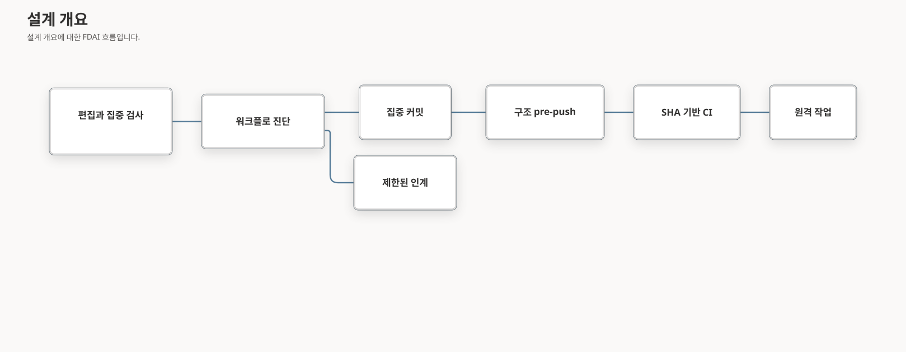

# 개발 워크플로 보증

Post-turn review ingress는 supervised Core runtime task만 추가하며 developer workflow authority 또는 diagnostic shortcut을 추가하지 않습니다.

Local post-turn review mechanics 테스트는 loopback PostgreSQL과 in-memory event bus를 근거로 사용할 수 있지만, deployed transport receipt나 developer workflow authority가 아닙니다.

이 문서는 동시 FDAI 개발을 빠르고 재개 가능하며 fail-closed 상태로 유지하는 저장소 통제를
정의합니다. 개발 워크플로 진단과 지연 근거를 소유하며, 제품 control plane이나 실행 권한은
소유하지 않습니다.

> 범위: 이 제한된 캠페인은 [이슈 #116](https://github.com/dotnetpower/fdai/issues/116)에서
> 추적합니다. 워크플로 최적화는 설계 문맥, 집중 검사, SHA 기반 CI, 신원 확인 또는 배포 승인을
> 우회하지 않습니다. 로컬 validation queue는 opt-in 진단이며 commit, push 또는 배포 권한이 아닙니다.
>
> 로컬 제품 기본값은 헤드리스 관찰 우선 프로필입니다. Console 전체 스택, 알림, 엔터프라이즈
> 신원 및 `governed-execution`은 서로 독립적인 명시적 추가 기능이며 개발 도구나 패키지
> 존재 여부로 선택할 수 없습니다.

## 설계 개요
테스트 맥락 선택지 경로는 다른 로컬 진단 화면과 같은 Operator 경로 패밀리 조립 방식을 사용합니다. 이 추가는 개발자 워크플로 소켓, 검증 대기열 동작 또는 로컬 실행 권한을 변경하지 않습니다.
Outcome Assurance 읽기 패널도 Operator 경로 패밀리 조립 방식을 사용하지만, 인증된 읽기 전용
변환 결과로 남습니다. 이 추가는 개발자 워크플로 소켓, 검증 대기열 동작, 로컬 진단 우회 경로
또는 로컬 실행 권한을 변경하지 않습니다.
이미지 스캔 결과를 해결하는 의존성 갱신은 패키지 유지보수입니다. 매니페스트와 lock을 갱신할 뿐이며 로컬 검증, 대기열 진단 또는 개발 도구를 권위 있는 근거로 만들지 않습니다.
의미 결과 핸들 저장과 재생은 일반 Operator/Core 의미 요청 경로를 사용합니다. 개발자 워크플로
소켓, 검증 대기열 동작 또는 로컬 실행 권한을 추가하지 않습니다.
통제된 Chaos 프로바이더 작업 영역 패키지도 보호된 시나리오 랩 실행기를 위한 설치 산출물입니다.
`uv sync --all-packages`에 추가하면 실행기가 명시적으로 패키지 집합을 요청할 때만 진입점을
찾을 수 있습니다. 로컬 진단 소켓, 검증 대기열 동작 또는 개발자 워크플로 권한을 추가하지 않습니다.

FDAI는 로컬 스크립트 전반에서 하나의 읽기 전용 개발 워크플로 진단 표면을 사용합니다. 이
표면은 공유 쓰기, 검증, 문맥, 인계, 테스트 격리, hook, 브라우저 검사, 로컬 서비스, 편집기
부하 및 원격 사전 검사의 실행 가능한 상태를 보고합니다. 각 소유 메커니즘은 기존 권한을
유지하고 독립적으로 fail-closed 처리합니다.

진입점은 `python3 scripts/automation/developer-workflow.py`입니다. 다음과 같은 제한된 명령을
제공합니다.

| 명령 | 결과 |
|------|------|
| `status` | Git, 검증, 인계, 테스트 환경, hook 위험, 로컬 서비스, 브라우저 runner 및 편집기 부하 진단을 집계합니다. |
| `resume` | 최신 관련 인계를 현재 검증 및 worktree drift와 함께 렌더링합니다. |
| `context-plan <path>...` | 대상 경로의 중복 제거된 현재 설계 문서와 집중 검사를 출력합니다. |
| `preflight` | Git index, hook 상태, Python path, virtual environment 또는 database identity가 오염되면 집중 검사 전에 실패합니다. |
| `--json` | 명시적인 `ok`, `warning` 또는 `unavailable` 상태가 있는 하나의 version object를 출력합니다. |

이 명령은 기존 Git common dir 상태와 프로세스 메타데이터를 읽습니다. 두 번째 감사 로그를
추가하거나, 커밋 후 세션 소유권을 추론하거나, 사용할 수 없는 진단을 성공 결과로 바꾸지
않습니다.
Core 초기화는 기존 `runtime_settings_service_from_env` 테스트 seam을 유지하면서 운영 시작에서는 런타임 소유 `StateStore`를 재사용해 설정 스냅샷 하나를 읽습니다. 이 호환 경로는 진단 소켓, 실행 위치, 프로바이더 신원 또는 배포 권한을 변경하지 않습니다.
Core 초기화는 라이선스 판정기도 한 번만 만들어 실행 게이트와 사용권 상태 게시자가 함께 사용하게 합니다. 진단 채널은 이 상태를 읽거나 바꾸지 않으며, 캡처로 Console 워터마크를 숨길 수 없습니다.
소비자를 시작할 때 같은 저장소에 [컨텍스트 선택 shadow 실행기](../decisioning/context-selection-policy-ko.md#shadow-평가-및-근거)를 연결합니다. 종료 시 진행 중인 비교 평가에 5초를 허용한 뒤 남은 작업을 취소하고 저장소를 닫습니다. 개발 진단 화면과 활성 프롬프트 선택은 변경하지 않습니다.
Core manifest의 배포용 `fdai-operational-catalog-review` entry point는 로컬 진단 channel 밖에서 실행됩니다. 이 entry point 추가는 task-backed launcher, socket identity, capture scope 또는 개발 검증 권한을 변경하지 않습니다.

장기 실행 workspace supervisor는 커밋된 VS Code 작업에서 필요한 모든 endpoint와 비공개 파일
경로를 받습니다. 대화 품질 보증 supervisor 작업은 표준 loopback Operator URL과 소유자 전용
bearer-token 파일 경로를 전달하지만 bearer 값 자체는 전달하지 않습니다. 따라서 source를 다시
불러오고 작업을 재시작해도 editor의 주변 환경에 의존하지 않고 인증된 로컬 계약을 유지합니다.

`console: restart full stack`은 같은 checkout의 검증된 관리 supervisor만 중지하고 lock 해제를
기다린 뒤 관리 준비 과정을 실행하고 표준 Browser Entra 구성을 시작합니다. 먼저 중지하므로
데이터베이스와 브로커 세대 유지 관리가 오래된 프로세스에 대해 준비를 실행하지 않고 활성 consumer와
연결을 거부할 수 있습니다. 전용 터미널과 준비 상태 검사기를 사용하며, 완료된 시작 작업의 오래된
출력은 새 프로세스나 준비 완료의 근거가 아닙니다.
관리되는 준비 과정은 로컬 PostgreSQL 및 Redpanda와 명시적 Azure CLI 읽기 범위를 사용합니다.
Terraform 상태를 초기화하거나 읽지 않으며 게이트웨이 검색은 로컬 실행기 신원을 부여하지 않습니다.
관리되는 로컬 준비 과정은 비활성 consumer group offset도 일반 topic 데이터와 같은 24시간 구간으로
제한하고 1분마다 만료를 확인하며, 활성 group에는 영향을 주지 않습니다.

## 측정 통제

| 영역 | 필요한 통제 | 완료 측정값 |
|------|-------------|-------------|
| 공유 쓰기 | staged 및 unstaged 경로 중첩, 안전하지 않은 공유 index 명령 및 활성 경로 예약을 감지합니다. | 커밋 경계에 해결되지 않은 중첩 또는 안전하지 않은 commit 명령이 없습니다. |
| 검증 | 로컬 증적을 권위로 만들지 않고 집중 검사 상태, push된 SHA의 CI 상태 및 선택적 대기열 진단을 보고합니다. 문서, 운영자 표면, 평가, 의존성, 고정 시나리오 및 Terraform 변경을 담당하는 고비용 작업으로 전달하고 전체 Python 회귀 테스트는 균형 잡힌 네 개 샤드로 분할합니다. Pages가 병합 후에만 실행하는 문서 사이트 원본 검사를 필수 contracts 작업에서도 실행합니다. | 일반 commit과 push는 선택적 대기열을 기다리지 않으며, 필요한 CI는 정확한 push SHA에 귀속됩니다. 관련 없는 고비용 작업은 의도적으로 생략됩니다. 다이어그램 마이그레이션, Neural View 소스 그래프 또는 사이트 테스트를 깨뜨리는 pull request는 병합 전에 실패합니다. |
| 설계 문맥 | 캐시된 바이트를 새 세션이 설계를 읽었다는 증명으로 취급하지 않고 중복 제거된 route 계획을 해석합니다. | 작업마다 계획 1개이며 같은 세션에서 변경되지 않은 필수 문서를 반복해서 읽지 않습니다. |
| 세션 연속성 | 제한되고 비밀이 없는 worktree, diff, 검증 및 다음 검사 메타데이터를 보존합니다. | 새 세션이 저장소 전체 재탐색 없이 하나의 인계 명령으로 재개합니다. |
| 집중 테스트 | 테스트 시작 전에 Python import, 데이터베이스, 런타임 환경 및 checkout 오염을 감지합니다. | 오염된 검사는 작업 코드를 import하거나 데이터베이스 연결을 열기 전에 실패합니다. |
| Hook | 변경형 hook 실행 전에 staged 및 unstaged 중첩을 감지하고 결정론적 복구 지침을 보존합니다. | Hook 실패가 작업 소유 변경을 조용히 버리지 않습니다. |
| 브라우저 검사 | 집중 CLI Playwright 검사를 우선하고 공유 10-slot lease 계약을 보존합니다. | CLI 근거가 충분하면 브라우저 도구 사용을 제한된 최종 상호 작용 1회로 제한합니다. |
| 로컬 서비스 | 제한된 timeout과 소유권 진단으로 모든 표준 로컬 서비스를 독립적으로 probe합니다. Primary Core 변경 consumer의 최신 partition별 진행을 요구하고 각 최신 lag를 합산합니다. | Full-stack 준비 상태가 사용 불가능한 모든 서비스를 지목하고, 누락되거나 오래된 lag 근거 및 합계 1,000건 초과를 거부하며, SPA만으로 준비 상태를 추론하지 않습니다. |
| 개발 진단 | 표준 작업 기반 로컬 실행기가 시작한 각 Core 또는 Operator 프로세스를 소유자 전용 Unix 소켓을 통해 프로파일링하고 결과를 정확한 소스 입력에 연결합니다. | 범위가 제한된 패킷이 지연 시간, CPU, Python 힙 및 추적되지 않는 메모리를 분리하고, GitHub Copilot은 정확히 일치하는 workspace snapshot만 진단합니다. |
| 편집기 부하 | 호스트 부하, extension 부하 및 upstream 브라우저 payload 비용을 분리합니다. | 진단이 소유 프로세스를 식별하거나 제한을 upstream으로 분류합니다. |
| 원격 사전 검사 | 고정된 시도 및 시간 예산 안에서 transient 읽기 실패만 retry합니다. | 영구 권한 및 policy 실패는 즉시 실패하며 retry는 Azure를 변경하지 않습니다. |

모든 진단은 제한됩니다. Git 기록 scan은 최대 64개 commit, validation 지연은 최대 50개
receipt, 변경 파일 출력은 최대 20개 경로, 프로세스 출력은 최대 20개 행, HTTP probe는
커밋된 로컬 port inventory, Azure 읽기는 최대 3회 시도를 사용합니다.

CI 범위 해석기는 결정론적으로 동작하며 안전한 쪽을 선택합니다. CI 워크플로 변경은 범위가
있는 모든 표면을 선택하고, 분류되지 않은 경로는 알 수 없는 소비자를 건너뛰는 대신 범위가
있는 모든 표면으로 돌아갑니다. Python 변경은 전체 회귀, 안전 핵심 커버리지, 데이터베이스,
거버넌스 및 파생 원본 검사를 유지합니다. 운영자 표면과 평가 검사는 각자의 소스 및 공유
의존성을 기준으로 선택합니다. 지침, 스킬, 프롬프트, 에이전트 디렉터리의 Markdown은
문서로 분류하되 실행 가능한 스킬 자산은 보수적으로 분류합니다. 필수 결합 작업은 성공한
작업과 의도적으로 생략된 작업만 허용하므로, 범위 전달은 실패하거나 취소된 검사를 성공으로
바꾸지 않고 관련 없는 작업만 줄입니다.

## 개발 진단 채널

표준 작업 기반 로컬 실행기는 Core와 Operator 프로세스의 개발 진단 채널을 항상 활성화합니다.
각 프로세스는 실행 위치가 `local`일 때만 소유자 전용 Unix 소켓 하나를 노출합니다. 해당
실행기를 우회해 프로세스를 직접 시작할 때는 진단을 활성화하기 전에 완전한 소스 및 digest
연결을 제공해야 합니다. HTTP, 브라우저, Teams, Slack, Event Bus 또는 관리 리소스 경로에서는
이 소켓에 접근할 수 없습니다.
관측 제안 소비자는 진단 채널이 아니라 일반 애플리케이션 수명 주기 워커입니다.
Operator 워커 준비 검사에 참여하지만 GET 표시 경로로 진단 소켓에 접근하거나 스택 재시작·실제 공급자 점검을 허가하지는 않습니다.

Operator 조립은 기본값이 꺼진 의미 인증 영수증 참조 설정도 읽으며, 설정이 켜지면 의미 outbox를 요청별 영수증
보존으로 감쌉니다. 이 설정은 진단 소켓, 실행기, 캡처 범위 또는 개발자 검증 권한을 바꾸지 않습니다.

`status`와 `capture` 명령은 최신 후보 소켓에 범위가 제한된 프로토콜 요청을 보내고, 살아 있는
서버가 해당 서비스 이름을 알려 주는 소켓만 사용해 각 서비스의 실행 식별자 소켓을 찾습니다. 중단된
프로세스가 남긴 소켓 경로는 정상 상태가 아니라 사용 불가 상태로 보고합니다.

프로세스 로컬 probe는 범위가 제한된 지연 시간 집계와 내용이 없는 프로세스 상태를 유지합니다.
명시적 캡처는 프로세스마다 한 번씩 최대 30초 동안 `cProfile`과 `tracemalloc`을 실행할 수
있습니다. 패킷은 저장소 상대 함수 또는 파일 위치, CPU 시간, Python 힙 차이, 상주 메모리,
가비지 컬렉션, 스레드 및 파일 서술자 수, 이벤트 루프 지연, 캡처 오버헤드, 잘림 및 사용 불가
이유를 보고합니다. 힙 객체, 요청이나 답변 본문, 환경 값, 공급자 payload, 자격 증명 또는 숨겨진
추론은 영속화하지 않습니다. 이벤트 루프 지연은 요청한 비동기 sleep의 초과 시간만 측정하며,
CPU/힙 snapshot 처리 시간은 전체 측정 기간에 남아 있어도 지연 필드를 부풀리지 않습니다.
Operator semantic runtime은 제품 projection을 위해 assurance 답변 생성 귀속, evaluator model
귀속 및 판단 보류 상태를 검증할 수 있습니다. 이러한 필드는 제품 대화 데이터로 유지되며 진단
probe, packet, export 또는 Copilot 검토에 들어가지 않습니다.
Runtime은 내용이 제거된 조회 활동 변환과 검증된 문서 답변 구체화를 전용 모듈에 위임합니다.
이벤트 순서, 재생 cursor, 진행 단조성, 기한 보류, 진단 timing 및 실행 권한 없음은 영속 runtime이
계속 소유합니다. Runtime이 직접 만든 기한 보류는 별도 로컬 보류 경로로 영속화합니다. 수집 단계가 다시
계산하는 근거 digest와 projection 신원은 Core projection에만 있기 때문입니다.

### 의미 판단 추적

실행 시간 프로필은 한 턴이 어디에서 시간을 썼는지는 보여 주지만, 런타임이 질문을 왜 그렇게
이해했는지는 보여 주지 않습니다. 그래서 채널이 활성화되어 있으면 Core는 완료된 의미 해석 턴마다
내용이 없는 판단 추적 하나를 프로세스 로컬 버퍼에 보관합니다. 추적은 다음 단계를 순서대로
기록합니다.

1. 라우팅 사전 판정 또는 적응형 계획
2. 기록된 각 판단 시도
3. 닫힌 선택지 근거화 호출
4. 플래너가 직접 남긴 판단 이벤트
5. 실행된 의도 그래프
6. 결과

플래너는 판단 재시도, 거부된 제안, 해결되지 않은 대상 범위, T2 상향, 복구, 근거화, 선택된 계획
출처에 대한 구조화된 판단 이벤트를 이미 남기고 있습니다. 의미 해석 턴 소비자는 턴마다 크기가
제한된 수집기 하나를 연결하고, 활성화된 채널에만 존재하는 로깅 처리기가 이 이벤트를 수집기에
복사합니다. 각 이벤트는 허용 목록에 있는 필드만 보관합니다.
거부된 판단 이벤트는 독립적인 제약 읽기가 포함되지 않았다고 판단한 제약의 닫힌 역할(예:
`times`, `restricts`)을 기록합니다. 공개 projection은 여러 플래너 이유를 하나의 일반 보류로
줄일 수 있으므로, 결과 단계에는 플래너 자체의 처리 결과와 이유 코드도 함께 보관합니다.

추적은 형식이 정해진 기계 값만 보관합니다.

- 운영 분류, 요청 주제, 문맥 의존성, 대상 종류, 의도, facet, 출력 형태처럼 모델이 만든 토큰은
  검토된 어휘에 속할 때만 보관합니다. 이 어휘는 고객 정보가 없는 프롬프트 카탈로그와 어휘
  카탈로그에 있는 단어로 구성됩니다. 그 밖의 모델 토큰은 상수 표식 `~`로 바뀌며, 해당 단계는
  그 개수를 세고 검토 대상으로 표시합니다.
- 이유 코드, 처리 결과, 계획 출처, capability, ObjectType, LinkType, FunctionType 이름, 증거
  상태처럼 서버가 만든 토큰은 닫힌 토큰 문법을 통과해야 합니다. 이 문법은 하이픈, 공백,
  따옴표, 비 ASCII 텍스트를 거부합니다.
- 개수, 플래그, 순서대로 나열한 대상 종류. 원문 위치는 프로세스 안에서만 비교해 대상 미포함
  신호를 만들 때 쓰고 밖으로 내보내지 않습니다.
- 조건의 속성과 연산자 쌍. 조건 값은 `type` 조건의 값이 검토된 리소스 유형 식별자일 때만
  보관합니다.
- 모델 배포 이름과 세션 식별자 대신 쓰는 프로세스 로컬 별칭. 별칭은 원래 값을 드러내지 않으며
  다른 프로세스의 추적과 연결되지도 않습니다.

추적은 질문이나 답변 텍스트, 대상 값이나 정규화 값, 인용문, 그 밖의 조건 값, 명확화 요청이나
초안 텍스트, 증거 행, 리소스 식별자, 요청이나 응답 본문, 숨겨진 추론을 보관하지 않습니다. 패킷
스키마는 토큰 문법을 한 번 더 확인하고, 모든 신호가 실제 단계를 가리키는지 검증합니다. 기록은
범위가 제한된 최선의 노력으로 동작합니다. 버퍼 잠금은 최대 10밀리초만 기다리고, 자체 실패를
스스로 처리하며, 제품 턴에 예외를 전달하거나 제품 턴을 막지 않습니다. 버퍼는 각각 최대
16,000바이트인 추적을 최대 50개까지 보관합니다. 재시작하면 비어 있는 상태로 시작하며, 명시적인
소유자 전용 캡처나 내보내기에서만 프로세스 밖으로 나갑니다. 각 패킷은 누적 제거 개수와 누적
거부 개수를 보고합니다. 최근 50번의 기록 시도 중 거부가 있으면 `decision_traces_rejected` 제한
사항이 추가되며, 스냅샷을 읽어도 상태는 바뀌지 않습니다. 판단 데이터가 없는 패킷은 스키마
`1.0.0`의 전송 형태를 유지하고, 판단 데이터가 있는 패킷은 스키마 `1.1.0`을 사용합니다. 수집기는
의미 해석 턴이 끝날 때 그 턴이 마지막으로 만든 projection으로 추적을 기록합니다. 따라서 전송 예산
초과나 결과 저장 실패로 나중에 만든 보류 projection이 앞서 만든 답변 projection을 대체합니다.

각 신호는 코드와 확인할 단계를 함께 가리킵니다. 신호는 다음을 다룹니다.

- 적응형 경로의 라우팅 인수 또는 진행 중인 대화 문맥에 대한 의존
- 판단 재시도, 거부, 모호성, 검토되지 않은 모델 토큰
- 어떤 판단 대상도 포함하지 않는 사전 판정 대상, 또는 유형 조건으로 이어지지 않은 유형 대상
- 모델 프레임이나 계획 호출, 해결되지 않은 프레임 용어, 거부된 계획
- T2 상향 또는 보류
- 명확화, 보류, 미지원, 조언, 부분 답변 결과, 온톨로지 읽기 없음, 불완전한 증거
- 컴파일된 답변 결과, 또는 release된 형식 해석 때문에 보류된 단어 기반 복구 계획

컴파일된 답변 이벤트는 거절된 컴파일이 통과하지 못한 선택 규칙 하나, 배치 수, 마지막 form 패스의
형태도 기록합니다. 형태는 각 언급과 목표를 form 안의 식별자와 닫힌 값으로만 나타냅니다. 예를 들어
`m1:instance:name`, `qualifier:m2:m1:containment`, `measure:g1:count:container`와 같으므로 검토자는
질문을 읽지 않고도 종류를 한정자로 밝혔다는 사실을 볼 수 있습니다. 검토가 무효이면 추출이 검토 역할을
할 수 없는 이유(질문에 없는 인용 등)를 인용 없이 기록합니다. 오프셋이 붙은 포함되지 않은 제약처럼 범위
표기로 끝나는 서버 사유는 닫힌 코드 접두사만 남기고 범위를 버리며, 이벤트는 두 블라인드 reader가 관계
역할을 맞바꾼 목표를 나열합니다. 로컬 프롬프트 원본 검사는 진단을 표준 오류로 기록하므로, 커밋하지 않은
프롬프트를 명시적으로 허용한 상태에서도 `dev-discuss explain`이 서비스 입력 다이제스트를 읽을 수 있습니다.

form 경로가 질문을 두 번째로 읽으면, 대체된 샘플이 거절된 이유가 같은 닫힌 필드를 가진 별도의
`semantic_form_sample_declined` 이벤트로 나타납니다. 따라서 두 번째 샘플로 복구된 턴도 첫 샘플이 실패한
이유를 보여 줍니다. 로컬 일반 서비스 로그는 컴파일된 답변 로거에 한해서만, 그리고 닫힌 토큰일 때만 같은
form 경로 결정 필드를 출력합니다. 그래서 재시작으로 추적 버퍼가 비워진 뒤에도 보류된 턴을 로그 파일로
설명할 수 있습니다. 수리는 질문 구조화 호출을 한 번 더 쓰므로, 컴파일된 답변 이벤트는 어떤 패스를
수리했는지와 각 수리를 일으킨 결함의 닫힌 코드도 나열합니다. 각 ObjectSet 조회는 구체화, 갱신, 영수증
단계의 밀리초와 객체 수를 `ontology_object_set_stages_timed`로 기록하므로, 프로파일러 없이도 느린 조회의
단계를 찾을 수 있습니다.

신호는 검토할 위치를 가리킬 뿐 원인에 대한 결론이 아닙니다. `dev-discuss explain`은 스냅샷을
캡처하고 각 추적을 신호와 함께 출력합니다. 질문은 패킷에 들어가지 않으므로 검토자는 자신이 한
질문과 추적을 직접 비교합니다. 프레임과 계획의 출처는 모델 호출 수와 플래너가 보고한 계획
출처로 나타납니다.

| 비평 | 수정 |
|------|------|
| 모델이 만든 열린 토큰은 리소스 이름을 그대로 옮길 수 있으므로 토큰 문법만으로는 개인정보 경계가 되지 않습니다. | 모델이 만든 토큰은 검토된 어휘에 속해야 하며, 값이 들어 있는 필드는 읽지 않습니다. |
| 일부 응답은 비어 있거나 잘리거나 관측되지 않으므로 모델 응답을 다시 파싱해서는 모든 판단을 보여 줄 수 없습니다. | 플래너가 직접 남기는 구조화된 판단 이벤트를 턴마다 수집하고, 파싱하지 못한 호출은 추측하지 않고 표시합니다. |
| 배포 이름과 세션의 짧은 digest는 추측하거나 서로 연결할 수 있습니다. | 두 값 모두 프로세스 로컬 별칭으로 대체합니다. |
| 정확한 대상 위치는 질문의 구조를 드러냅니다. | 위치는 프로세스 안에만 두고, 추적에는 대상 종류와 이로부터 도출한 대상 미포함 신호만 남깁니다. |
| 기록 결함이나 잠금 대기가 제품 턴에 영향을 줄 수 있습니다. | 기록은 자체 실패를 처리하고 최대 10밀리초만 기다리며, 순번과 위치를 하나의 잠금 안에서 정합니다. |
| 보관된 이력을 캡처 구간의 근거로 오해할 수 있고, 거부 한 번이 이후 모든 패킷을 불완전하게 만들 수 있습니다. | 패킷은 누적 제거 개수와 누적 거부 개수를 담고, 최근 50번의 시도 중 거부만 제한 사항을 추가하며, 각 추적은 기록 시각을 보관합니다. |
| 새 패킷 필드가 스키마 `1.0.0` 독자를 깨뜨릴 수 있습니다. | 판단 데이터가 없는 패킷은 `1.0.0` 전송 형태와 digest를 유지합니다. |
| 단계 정보가 없는 신호로는 어느 단계를 확인해야 하는지 알 수 없습니다. | 각 신호는 검증된 단계 색인을 함께 가집니다. |
| 구현 검토: 소켓 탐색용 스냅샷이 거부 기준점을 소모해 저장된 패킷이 완전해 보였습니다. | 스냅샷은 상태를 바꾸지 않으며, 스냅샷 캡처는 탐색 패킷을 그대로 재사용합니다. |
| 구현 검토: 턴이 나중에 보류를 전달해도 처음 만든 projection이 기록되었습니다. | 수집기는 턴이 끝날 때 마지막으로 만든 projection으로 기록합니다. |

모든 패킷은 Git 리비전, 로컬 서비스 입력 digest, worktree patch digest, 프로세스 신원,
runtime-scope receipt digest, 시간 구간 및 패킷 digest를 연결합니다. 캡처 허용 여부는 정식
서비스 입력 digest를 비교합니다. Git 리비전과 worktree digest는 출처 정보로 유지하므로 해당
서비스 입력 밖의 commit이나 편집은 실행 중인 서비스를 무효화하지 않습니다. GitHub Copilot
검토는 소유자 전용 export 및 import 경계를 사용하며 전체 workspace 신원을 유지합니다.
Workspace 신원이나 패킷 digest가 바뀌면 검토를 수락하지 않습니다.
실행기는 checkout 전용 `.fdai` 디렉터리 아래에 소켓을 유지하고 서비스와 전체 런타임 신원에서
짧은 이름을 파생합니다. 따라서 프로세스 분리를 약화하지 않으면서 긴 worktree에서도 Unix 소켓
경로가 이식 가능한 100바이트 제한 안에 유지됩니다.
Copilot은 일치하는 workspace를 검사하고 진단을 제안할 수 있지만, 런타임은
Copilot을 호출하거나 저장소 파일을 읽거나 코드를 편집하거나 pull request를 열거나 병합 또는
실행 권한을 부여하지 않습니다. System Knowledge는 release 계약을 설명할 수 있지만 실제 측정은
이 개발 워크플로에서 소유합니다.

프로파일링된 전체 스택 시작은 진단 소켓이 생성되기 전에 필수 준비 단계를 완료합니다. 관리되는
전체 스택 작업은 권위 있는 인벤토리 새로 고침을 지속 인벤토리 조정 프로세스에 맡기므로 Console,
Core 및 Operator 프로세스가 이 새로 고침과 병렬로 시작할 수 있습니다. 전체 준비 상태는 활성 범위
인벤토리 커버리지와 analyzer의 첫 번째 정상 tick을 계속 기다리며, 독립 실행 준비는 동기 인벤토리
단계를 유지합니다. 준비 단계는 프로세스 시작 전 병목에 대해 내용이 없는 단계별 시간을 내보내고,
소켓은 실행 중인 Core 및 Operator 프로세스만 측정합니다. 로컬 Core 실행기는 서비스 소유 진입점을 사용합니다.
Operator ASGI 애플리케이션 팩터리는 Uvicorn이 팩터리를 직접 불러도 runtime-scope receipt를 연결합니다.
그런 다음 실행기가 활성화한 진단을 조립된 애플리케이션 수명 주기에 추가하여 로컬 계측이
프로덕션 조립 루트의 의존성 수를 늘리지 않게 합니다.
`dev discuss: start or restart profiled services`를 실행하면 항상 프로파일링되는 동일한 로컬
스택의 오래된 작업 인스턴스를 교체합니다. 같은 checkout의 검증된 supervisor만 종료하고,
supervisor lock이 해제된 후 새 자식 프로세스를 시작합니다.
내보낸 패킷은 현재 코딩 세션의 GitHub Copilot이 검토하며, 진단 채널은 FDAI 런타임 모델이나
Azure OpenAI 배포를 선택하거나 호출하지 않습니다.
서비스 재사용 fingerprint에는 runtime-diagnostics 패키지를 포함한 정식 서비스 입력 digest가
포함됩니다. 관련 입력이 바뀌면 오래된 프로세스를 교체하지만 관련 없는 commit이나 worktree
편집 때문에 재시작하지는 않습니다. 로컬 준비
상태 검사는 서비스 소유 Core 실행기를 프로세스 소유자로 인식하고 새로운 semantic consumer
진행 뒤의 새로운 heartbeat를 허용합니다. 또한 관측된 각 partition마다 타임스탬프가 있는 primary 변경
consumer 진행을 요구하고, 최신 lag를 합산하며, 근거가 없거나 합계가 1,000건을 넘으면 준비되지 않은
상태로 유지합니다. event bus가 backlog가 있는 측정을 1분마다 보고하므로 그런 측정은 75초보다
오래되지 않아야 합니다. offset이 멈춘 따라잡은 partition은 event bus가 5분마다만 다시 보고하므로
lag가 0인 측정은 375초 동안 유효하며, 유휴 상태의 스택이 멈춘 것처럼 보이지 않습니다. 인벤토리 세대가 ontology checkpoint 변환보다 먼저 바뀌면 로컬 analyzer는 준비되지
않은 상태를 유지하지만 전체 loop interval을 기다리지 않고 5초 안에 target resolution을 다시
시도합니다.
프로파일링된 Core 런타임은 공유 StateStore에 대해 범위가 제한된 비동기 connection pool 하나를
소유하고, 의존하는 worker와 transport가 중지된 뒤 해당 pool을 닫습니다. 개발 진단은 그 결과인
프로세스 및 연결 수를 측정할 수 있지만, 측정값을 권한으로 바꾸지는 않습니다.
시작 설정 snapshot은 해당 런타임 소유 pool을 재사용하며, worker가 event loop보다 오래 남는 임시
pool을 만들지 않습니다. Pantheon subscriber 종료에서 broker 정리가 첫 drain 기한에 도달하면 두
번째 범위 제한 마무리 단계를 사용하며, 완료된 작업의 참조를 제거하기 전에 해당 작업을 수집합니다.
로컬 analyzer는 다음 loop interval 전에 tick 범위의 decision-evidence 및 run-receipt StateStore
pool을 닫습니다. 정상 tick은 garbage collection 대상으로 비동기 pool worker를 남길 수 없으며,
영속화 실패도 준비 상태를 사용할 수 없음으로 유지하기 전에 store를 닫습니다.
분석기의 로컬 브로커 연결은 재시작 후 결과가 불확실한 분석기 이벤트를 범위가 제한된 읽기 전용
조회로 확인합니다. 일치하는 기록이 없더라도 재발행하거나 준비 완료로 판단할 수 없습니다.
분석기 의존성 조립 모듈이 조회 구성을 소유하며 CLI는 검증된 브로커 엔드포인트, 실행 장소,
워크로드 신원만 전달합니다.
관리 launcher는 서비스 소유 StateStore DSN을 해당 analyzer 프로세스에 명시적으로 전달하므로 대상
선택 전에 결정 근거 admission provider가 연결됩니다. 이 binding은 읽기 전용이며 ActionType을
승격하거나 자율성을 높이거나 실행 권한을 부여할 수 없습니다.
데이터베이스 재생성으로 로컬 broker 세대를 파괴적으로 초기화해야 할 때 준비 단계는 group과 topic을
삭제하는 동안 stack lock과 모든 관리형 서비스 lock을 유지합니다. 따라서 연결이 끊겼지만 계속 실행
중인 consumer를 유휴 상태로 오인해 삭제된 topic에 다시 연결하게 할 수 없습니다.

## 검증 단계와 결과 재사용

개발 검사는 커밋 생성 자체가 아니라 변경된 동작을 대상으로 합니다. 변경 테스트 선택이
전체 검사로 확대되면 범위를 출력하고 실행 전에 중단합니다. 명시적으로 요청한 로컬 전체
검사에서만 `--allow-full-suite`를 지정합니다.
`verify.sh --full <path>`는 선택한 pytest 대상만 실행합니다. 추가 정적 검사는 담당
범위에 따라 명시적으로 선택하며, 경로 계획에 범위 없는 저장소 검사를 일괄 추가하지 않습니다.
워크플로 지침은 헌법과 추적 근거 문맥을 유지합니다. 상세 런타임 권한 문서는 모든 CI 도구
편집이 아니라 해당 런타임 계약을 변경할 때 불러옵니다.
Pre-commit 파생 출처 검사는 경량 staged-input selector에 항상 진입합니다. 고정된 문서, System
Knowledge 출처, 카탈로그, 검사기 또는 hook 설정이 바뀔 때만 전체 검사를 실행합니다. selector는
staged 카탈로그에서 출처 집합을 파생하므로 새 출처를 등록할 때 hook 경로 필터를 수동으로 맞출
필요가 없습니다.
Core 수량·리소스 계산 검사는 클러스터에 접속하지 않고 루트 개발 의존성의 잠긴 Kubernetes 도구를 사용합니다. 타입 선언 부재에 대한 예외는 `kubernetes.utils.quantity`에만 적용하며 어댑터는 반환된 Decimal 값을 검증합니다. 의존성 변경은 소유 범위와 Core wheel 검사를 유지하며 진단 채널이나 실제 수집을 활성화하지 않습니다.
루트 CI가 서비스 소스를 수집할 때는 해당 소스가 가져오는 모든 서드파티 패키지를 `dev`
extra에 반영합니다. 런타임 이미지와 패키지 소유권은 서비스 매니페스트가 계속 담당합니다.
루트 CI는 독립 배포 단위인 `lifecycle/`도 수집합니다. 루트 pytest, ruff, mypy 설정과 변경 경로 테스트
범위에 포함됩니다. Hub는 `packages/deployment-cli`처럼 자체 잠금 파일을 두고 자기 디렉터리에서
`uv run`으로 명령을 실행합니다. 수명 주기 에이전트는 자체 잠금 파일이 없으며, 의존성을 이미 제공하는
루트 개발 환경에서 실행됩니다.

| 단계 | 필요한 근거 | 재사용 경계 |
|------|-------------|-------------|
| 편집 | 담당 집중 테스트와 영향받는 정적 계약 | 코드, 테스트, 검사기, 설정, 의존성, 도구 및 관련 환경 입력이 같을 때만 재사용합니다. |
| 커밋과 push | 전달할 내용이 검증한 입력과 일치하며 각 hook의 통제를 유지함 | 커밋 식별자가 바뀌었다는 이유만으로 내용 기반 로컬 결과를 무효화하지 않습니다. 미커밋 내용으로 깨끗한 커밋을 검증할 수 없습니다. |
| 병합 | 실제 통합 리비전의 필수 CI | 로컬 결과는 필수 원격 검사를 대체하지 않습니다. 병합 요청이 로컬 전체 검사까지 요청하는 것은 아닙니다. |
| release 후보 | 보호된 워크플로에서 선택한 이미지를 빌드, 검사, 게시하고 출처를 증명합니다. 타입 정보를 제공하는 공유 패키지는 선언된 모든 소비자 이미지에 marker와 wheel을 포함합니다. | 모든 소스 커밋이나 환경에서 다시 빌드하지 않고 검증된 후보 digest를 재사용합니다. |
| 배포 | 정확한 소스, digest, 출처, 승인, 정책 및 최신 근거 | 로컬 캐시는 배포 권한을 부여하지 않습니다. 취약점 근거가 오래되면 같은 digest를 다시 검사할 수 있습니다. |

의존성 잠금 파일 변경은 작업 worktree의 자체 가상 환경처럼 그 잠금 파일로 동기화한 환경에서
검증합니다. 공유 개발 환경에는 아직 이전 버전이 설치되어 있기 때문입니다. 전이 의존성의 보안
업데이트라면 그 환경에서 해당 패키지나 그 패키지에 직접 의존하는 패키지를 사용하는 저장소 코드의
집중 테스트를 실행합니다. 예를 들어 Mako는 Alembic, multidict는 aiohttp를 사용하는 코드가 대상입니다.

로컬 구조 검사기는 전체 내용과 실행 문맥이 일치할 때만 선택적 검증기와 push hook 사이에서
성공한 결과를 재사용합니다. 더 좁은 의존성 범위가 입증되지 않은 검사는 추적 중인 전체
트리를 사용합니다. 캐시가 없거나 손상되었거나 실패 또는 불일치 기록이면 검사를 실행하며,
성공으로 대신 처리하지 않습니다. 캐시 사용 가능 여부는 필수 조건이 아닙니다.
구조 증적은 24시간 후 만료되며 Git common dir의 `fdai-local-validation` 상태에 최대
128개를 보관합니다. 관련 hook 명령은 그룹마다 환경 준비를 한 번만 수행합니다. 집중 게이트
캐시 식별자는 게이트마다가 아니라 묶음 실행 전후에 한 번씩 계산합니다. 순수 검사는 내용에,
이력 검사는 리비전과 참조에도 연결됩니다. 입력이 바뀌면 묶음을 수락하지 않습니다.
무결성과 외부 근거 검사는 캐시하지 않으며 CI는 자체 실행 환경을 유지합니다.
`tests-for-diff.sh --run` 뒤의 변경 테스트 실행기도 같은 규칙을 따릅니다. 샤드 통과 결과는
하나의 내용 식별자가 같을 때만 재사용합니다. 이 식별자는 선택된 테스트, 해당 소스, 잠금 파일을
포함한 추적 중인 파일과 무시되지 않은 미추적 작업 트리 파일 전체의 바이트, `uv run`이 선택하는
프로젝트 환경에 대해 구조 검사기가 계산하되 테스트가 쓰는 바이트코드 캐시는 제외한 설치 환경
다이제스트, 정확한 pytest 명령, 그리고 인터프리터, pytest, uv, 로캘 변수로 이루어집니다. 명령만
기록한 이전 표식을 포함해 다른 식별자로 기록된 통과 결과는 다시 실행합니다. 모든 샤드가 끝난 뒤
작업 트리가 각 파일의 상태 시각까지 그대로이고 환경도 그대로일 때만 통과를 기록합니다. 따라서 실행
중에 되돌린 작업 트리 변경이나 실행 중에 `uv run`이 동기화한 환경이 있으면 다음 실행까지 아무것도
기록하지 않습니다.
식별자를 계산할 수 없으면 재사용하지 않습니다.

문서 변경은 실제로 검토한 번역 파일의 SHA만 갱신합니다. 커버리지 후보 선택에는 기존
보고서를 참고할 수 있으며, 모듈 하나를 다루는 작업은 전체 기준선 대신 그 모듈을 측정합니다.
시각 검증은 매 편집마다 모든 화면 크기를 반복하는 대신 변경된 슬라이드나 경로에서 시작해
공유 레이아웃의 소비자와 최종 release 산출물로 범위를 확대합니다.

이 방식은 관련 없는 통합 또는 패키징 실패의 발견 시점을 늦출 수 있습니다. 필수 CI,
빌드 입력 변경 검사, 알 수 없는 경로의 보수적 분류 및 보호된 후보 검증으로 각 담당 단계의
검사를 유지합니다. 대기열, 준비, 검사 실행 및 반복 작업 시간을 구분해 측정하며,
비교 가능한 실행 근거 없이 지연 감소를 주장하지 않습니다.

## 안전 경계

- 진단 표면은 읽기 전용입니다. Stage, restore, reset, commit, kill, restart, deploy, approve
  또는 promote하지 않습니다.
- 설계 문맥 재사용은 세션 범위이며 content-addressed 방식입니다. 인계는 필수 문서를 지목할
  수 있지만, 수신 세션은 고위험 편집 전에 현재 내용을 다시 읽습니다.
- Optional queue 근거는 commit 주소 기반으로 유지됩니다. Queue 지연 경고는 receipt를 만들거나
  push를 승인하거나 실패한 단계를 건너뛰지 않습니다.
- 환경 검사는 자격 증명, token, 연결 문자열, tenant 값 또는 고객 리소스 이름을 출력하지 않고
  정규화된 identity를 비교합니다.
- Azure retry는 안전한 읽기와 transient 전송 또는 throttling 응답에만 적용됩니다. 승인된
  host 검사는 모든 시도 전에 실행되며 retry 소진 시 하나의 `PreflightError`를 반환합니다.
- Upstream VS Code 및 Copilot 동작은 저장소에서 다시 구현하지 않습니다. 저장소 통제는 제한된
  진단과 저비용 검증 경로를 제공합니다.
- 적용은 기존 edit hook, commit-scope hook, 집중 테스트 runner, 구조 pre-push gate, SHA 기반 CI
  및 배포 preflight에 남습니다. Optional validation queue와 통합 명령은 상태를 보고하며 대체 권한
  경로가 되지 않습니다.

## 실패 동작

| 실패 | 진단 동작 | 소유 적용 |
|------|-----------|-----------|
| Git common dir 상태가 없거나 손상됨 | 안정적인 reason code와 함께 `unavailable`을 보고합니다. | 기존 Git 및 hook 명령은 독립적으로 실패합니다. |
| Optional validation receipt의 timestamp가 잘못됨 | 지연 계산에서 제외하고 잘못된 record 수를 보고합니다. | Optional receipt 검증은 변경되지 않습니다. |
| Handover가 도달 불가능한 기록을 참조함 | Drift와, 가능한 경우 가장 가까운 도달 가능한 관련 handover를 보고합니다. | Branch 또는 worktree를 변경하지 않습니다. |
| 등록된 로드맵 캠페인 worktree가 삭제됨 | 구성된 해당 캠페인의 오래된 Git 등록만 제거하고, 격리 branch checkout을 다시 만든 다음 로컬 의존성 링크를 복구하고 그 위치에서 주기를 실행합니다. | 타이머는 기본 프로젝트 checkout에서 시작하므로 캠페인 디렉터리가 없어도 복구할 수 있고 다른 worktree를 정리하지 않습니다. |
| 로컬 서비스 probe timeout | 서비스와 port를 unavailable로 보고합니다. | 서비스 task는 독립적으로 제어됩니다. |
| VS Code 프로세스 데이터를 사용할 수 없음 | 편집기 부하를 upstream-unavailable로 분류합니다. | 집중 CLI 검증은 계속 사용할 수 있습니다. |
| Azure가 영구 오류를 반환함 | 첫 시도 후 중단합니다. | 읽기 전용 preflight는 fail-closed 처리합니다. |

## 비평 프로토콜

각 라운드는 반증 가능한 발견 사항 하나로 시작하고 집중 검사로 끝납니다. 기존 통제가 잔존
위험을 이미 Low로 낮춘 경우 기각된 발견 사항으로 기록합니다. Production 변경은 독립적으로
검증된 발견 사항으로 제한하고 최종 검토에서 전체 위협 목록을 다시 확인합니다.

캠페인은 다음 심각도 정의를 사용합니다.

| 심각도 | 의미 |
|--------|------|
| Critical | 작업을 잃거나 잘못 귀속하고, 필수 gate를 우회하거나 false validation을 만들 수 있습니다. |
| High | 자율 진행을 반복해서 차단하거나 잘못된 checkout 또는 환경을 검증할 수 있습니다. |
| Medium | 안전 결정을 약화하지 않지만 상당한 지연 또는 수동 복구를 유발합니다. |
| Low | 결정론적 진단과 복구가 있는 제한된 불편입니다. |

구현 순서는 라운드마다 하나의 발견 사항을 유지합니다.

| 라운드 | 초점 | 계획 근거 |
|-------:|------|-----------|
| 1 | 통합 status schema 및 제한된 수집 | 집중 workflow CLI 테스트 |
| 2 | 공유 index 및 staged/unstaged 중첩 진단 | 합성 dirty-index 테스트 |
| 3 | Validation pending 시간 및 지연 계산 | 합성 queue 상태 테스트 |
| 4 | 중복 제거된 설계 문맥 계획 | 기존 route fixture 및 CLI 테스트 |
| 5 | 재개 가능한 handover schema 및 drift 감지 | Handover 호환성 테스트 |
| 6 | Python, checkout 및 database 오염 preflight | 오염된 환경 테스트 |
| 7 | Hook 복구 진단 | Staged/unstaged 중첩 fixture |
| 8 | 브라우저 runner 및 로컬 서비스 준비 상태 요약 | 정적 lease 및 제한된 HTTP probe 테스트 |
| 9 | 편집기 부하 분류 | Stub 프로세스 및 pressure record |
| 10 | Azure transient retry 예산 | Stub HTTP 및 timeout 테스트 |
| 11 | 기존 통제 적대적 검토 | 설계 문맥, route 및 port-pool 집중 suite |
| 12 | 통합 잔존 위험 검토 | 모든 캠페인 집중 검사 및 정확한 diff selection |

## 보증 결과

캠페인은 13개의 독립 라운드를 완료했습니다. 수락된 각 발견 사항은 집중 커밋으로 반영했고,
기각된 발견 사항은 기존 통제 또는 직접 테스트를 근거로 제시합니다.

| 라운드 | 결과 | 집중 근거 |
|-------:|------|-----------|
| 1 | 수락 | Versioned 읽기 전용 status schema, workflow 테스트 2개가 통과했습니다. |
| 2 | 수락 | 공유 index overlap 진단, workflow 테스트 3개가 통과했습니다. |
| 3 | 수락 후 라운드 13에서 추가 hardening | Pending 시간과 receipt 지연, workflow 테스트 4개가 통과했습니다. |
| 4 | 수락 | 중복 제거된 route 문서와 검사, design-context 및 workflow 테스트 93개가 통과했습니다. |
| 5 | 수락 후 라운드 13에서 추가 hardening | Handover schema v2와 drift, handover 및 workflow 테스트 8개가 통과했습니다. |
| 6 | 수락 | 비밀을 출력하지 않는 환경 오염 preflight, workflow 테스트 7개가 통과했습니다. |
| 7 | 수락 | Hook 복구 분류, workflow 테스트 8개가 통과했습니다. |
| 8 | 수락 후 라운드 13에서 추가 hardening | 브라우저 lease와 6개 서비스 준비 상태, workflow 테스트 10개가 통과했습니다. |
| 9 | 수락 | Host와 client 부하 분리, 불필요한 client probe 제거 후 테스트 11개가 1.01초에 통과했습니다. |
| 10 | 수락 | Azure transient-only 제한 retry, Azure 접근 없이 preflight 테스트 6개가 통과했습니다. |
| 11 | 수락 | 기존 통제의 Python 테스트 163개와 Playwright port-pool 테스트 6개가 통과했습니다. |
| 12 | 수락 | Collector를 248, 276, 195줄로 분리했고 workflow 테스트 11개가 통과했습니다. |
| 13 | 수락 | Window 불확실성, invalid receipt, malformed handover 및 잘못된 checkout의 core readiness를 fail-closed 처리했고 테스트 48개가 통과했습니다. |

최종 독립 재검토에서는 Low를 초과하는 잔존 사항이 없었습니다. 다음과 같은 제한된 Low 위험을
수락했습니다.

- Overlap 경로는 20개만 렌더링하지만 `overlap_count`는 정확한 전체 수를 유지합니다.
- Linux PSI threshold는 권한 또는 autoscaling 결정이 아닌 보수적인 고정 진단입니다.
- 저장소 외부로 해석되는 target symlink는 `context_target_outside_repository`와 함께
  차단됩니다.

검토에서는 Azure retry가 없다는 한 가지 false finding도 기각했습니다. Transport 구현과
throttle, permanent error 및 retry exhaustion 집중 테스트가 해당 동작을 증명합니다.

## 잔존 Top 20 캠페인

[이슈 #118](https://github.com/dotnetpower/fdai/issues/118)은 다음 10개의 측정된 병목까지 보증
범위를 확장합니다. 기존 Top 10 통제는 변경하지 않습니다.

| 순위 | 잔존 병목 | 측정 기준선 | Hardening 라운드 |
|-----:|-----------|-------------|------------------|
| 11 | 비활성 lane의 validation record | Pending 822개 중 활성 checkout 조상 1개, 보존 ref commit 394개, 참조되지 않는 commit 427개 | 모든 checkout과 보존 ref에서 unreachable인 오래된 record만 보수적으로 정리합니다. |
| 12 | 현재 처리량과 섞인 과거 validation 지연 | 최신 receipt 50개의 p95가 cohort age 없이 779.346초로 보고되었습니다. | 현재 cohort 지연과 과거 debt를 분리합니다. |
| 13 | Automation test 선택 불확실성 | Automation 변경은 이미 `tests/integration/scripts`를 선택하며, 이전 broad 선택은 Makefile 변경에서 발생했습니다. | 기존 focused ownership rule을 검증하고 유지합니다. |
| 14 | Warning candidate의 probe instrumentation | Warning 1,901행 중 905행이 명시적 `PROBE_` message를 사용했습니다. | Raw log는 보존하면서 명시적 probe를 actionable warning 수에서 제외합니다. |
| 15 | Core runtime readiness 귀속 | 다른 checkout 또는 wrapper에 runtime process가 있을 때 표준 stack은 6개 중 5개 ready를 보고했습니다. | 정확한 checkout 및 runtime command에 readiness를 바인딩합니다. |
| 16 | Agent tool의 destructive Git 명령 | Commit pathspec은 guard되지만 reset, restore, clean, checkout 및 stash는 guard되지 않았습니다. | Destructive 명령에 명시적 approval marker를 요구합니다. |
| 17 | Dirty-tree validation 복구 | No-edit 지시에도 validation subagent가 uncommitted 문서를 restore했습니다. | 안전하지 않은 dirty-tree validation 진입점을 표시하고 차단합니다. |
| 18 | Issue lifecycle type drift | 완료된 task가 canonical type label 누락으로 `needs-triage`를 다시 받았습니다. | Project start 전에 type label을 요구합니다. |
| 19 | 순차 로컬 readiness probe | HTTP probe 5개가 각각 독립적인 0.5초 timeout을 사용했습니다. | 하나의 제한된 budget 안에서 probe를 병렬 실행합니다. |
| 20 | 반복 Git discovery subprocess | Status 한 번이 여러 section에서 같은 repository와 common directory를 반복 해석했습니다. | Invocation 범위 repository context를 재사용합니다. |

각 라운드는 집중 반증 검사를 사용합니다. 현재 구현이 이미 다루는 finding은 중복 코드를
추가하지 않고 근거와 함께 기각합니다. 종료 조건은 Low를 초과하는 잔존 사항이 없는 또 한 번의
독립 검토입니다.

### Top 20 보증 결과

확장 캠페인은 라운드 11부터 32까지 22개 라운드를 완료했습니다. 독립 검토에서 추가 hardening
및 evidence 라운드 12개가 열렸기 때문입니다.

| 라운드 | 결과 | 근거 |
|-------:|------|------|
| 11 | 수락 | 오래되고 참조되지 않는 pending record는 maintenance 전에 age와 reachability로 preview됩니다. |
| 12 | 수락 | 현재 24시간 receipt 지연과 과거 debt를 별도로 보고합니다. |
| 13 | 기각 | 기존 `test_script_change_selects_moved_integration_script_tests`가 automation 변경이 `tests/integration/scripts`를 선택함을 이미 증명합니다. Makefile 및 다른 global input의 broad 선택은 올바르게 유지됩니다. |
| 14 | 수락 | 명시적 `PROBE_` 및 `diagnostic_probe` record는 raw log에 남지만 제한된 actionable warning 수에서는 제외됩니다. |
| 15 | 수락 | Core runtime readiness는 정확한 checkout 소유권과 다른 checkout owner 수를 보고하며 primary readiness로 취급하지 않습니다. |
| 16 | 수락 후 라운드 21과 23에서 추가 hardening | Destructive Git은 명시적 approval marker를 요구합니다. |
| 17 | 수락 | `delegation-preflight`는 dirty snapshot을 거부하며 always-on agent contract는 dirty worktree의 delegated validation을 금지합니다. |
| 18 | 수락 | Project start는 assignment 또는 board 변경 전에 정확히 하나의 canonical work type을 요구합니다. |
| 19 | 수락 | HTTP probe 5개는 고정된 probe별 0.5초 timeout 안에서 병렬 실행되며 출력 순서는 안정적으로 유지됩니다. |
| 20 | 수락 | Status 한 번이 repository 및 Git common-dir context를 한 번만 해석합니다. |
| 21 | 수락 | 절대경로, `env`, `command` 및 `git -C` destructive 명령을 guard합니다. |
| 22 | 수락 | Reachability는 모든 ref와 checkout head를 한 번의 batch traversal로 계산하고 apply 전에 재계산하며, record를 삭제하지 않고 quarantine으로 이동합니다. |
| 23 | 수락 | 재귀 shell parsing이 `sh -c`, `bash -lc`, `zsh -c` 및 wrapped bare commit을 다룹니다. |
| 24 | 수락 | Checkout 또는 ref가 commit을 다시 활성화하면 quarantine record가 pending으로 자동 복원됩니다. |
| 25 | 수락 | Validator의 `reset --hard`와 `clean -ffdx`는 대상이 정확한 Git common-dir scratch worktree가 아니면 fail-closed 처리됩니다. |
| 26 | 수락 | 명시적인 selector contract가 `developer-workflow.py` 변경이 `tests/integration/scripts`만 선택함을 증명합니다. |
| 27 | 수락 | 실제 pre-tool dispatcher가 direct, absolute, `git -C`, `env` 및 shell-wrapped mutation과 commit을 deny policy로 전달합니다. |
| 28 | 수락 | Validator scratch 준비는 reset 또는 clean 전에 symbolic-link path를 거부하며 sentinel 테스트가 target이 변경되지 않음을 증명합니다. |
| 29 | 수락 | Empty commit pathspec, forged comment approval, Git alias 및 symbolic-link state root가 실제 hook과 validator path에서 fail-closed 처리됩니다. |
| 30 | 수락 | Config-env alias와 mid-word hash token은 destructive operation 또는 commit-scope policy를 우회할 수 없습니다. |
| 31 | 수락 | 값이 이전 shell export에서 왔더라도 해석되지 않은 config-env alias definition은 fail-closed 처리됩니다. |
| 32 | 수락 | 반복된 모든 config-env option을 scan하며 separate 및 equals form을 destructive 및 commit alias에 고정했습니다. |

Review-driven 라운드 전에 focused integration 테스트 231개가 통과했습니다. 최종 focused suite는
통합 dispatcher 및 parser fixture 40개, scratch ownership guard 3개, validation queue 테스트
37개 및 validator와 selector 테스트 85개가 통과했습니다. 변경된 workflow source의 Ruff와
strict mypy도 통과했습니다. 최종 독립 검토에서 Low를 초과하는 잔존 사항이 없었습니다.

남은 Low 위험은 명시적이고 제한됩니다.

- Warning 요약은 최대 5 MiB와 5,000행을 scan하므로 더 오래된 actionable warning은 현재 진단
  window 밖에 남을 수 있지만 raw log는 변경되지 않습니다.
- Retired pending record는 이후 maintenance policy가 제거할 때까지 Git common-dir quarantine에
  남습니다. 자동 reactivation은 validation starvation을 방지합니다.
- Terminal guard는 agent tool을 통해 실행되는 선언적 shell command string을 다룹니다. 임의로
  생성된 program의 동작까지 증명하려고 하지 않으며, 해당 program은 user request, code review 및
  clean-snapshot contract의 적용을 계속 받습니다.
## Bounded wait 캠페인

이슈 [#122](https://github.com/dotnetpower/fdai/issues/122)는 처리 시간을 지배하는 긴 timeout,
고정 sleep 및 순차 polling을 제한합니다. 7일 동안 143개 세션 중 68개가 1시간을 넘었고 36개
세션에 명시적 대기 불만 51건이 있었습니다.

지배 규칙은 총 timeout이 정체 보호 수단이 아니라는 것입니다. 큰 봉투는 정체된 실행과 느린
실행을 구분할 수 없게 만들므로, 모든 장시간 작업은 단계별 deadline, 무진행 deadline, 진행
신호 및 재개 가능한 checkpoint를 선언합니다.

| 순위 | 제한 대상 | 측정된 기준선 | 조치 |
|-----:|-----------|---------------|------|
| 1 | Assurance 요청 pacing | 고정 15초 sleep 99회가 정상 full cohort에 24분 45초를 추가했습니다 | 요청 시작 사이 최소 간격을 목표로 하고 turn 소요 시간을 흡수합니다. |
| 2 | Transport 재시도 지연 | 재시도 가능한 실패마다 고정 60초 sleep 1회입니다 | 선언된 최대값으로 clamp된 제한된 지수 지연을 계산합니다. |
| 3 | Assurance 정체 감지 | turn별 또는 질문별 deadline 없이 4시간 봉투 하나입니다 | 정체된 turn은 3분, 정체된 질문은 5분에 실패시킵니다. |
| 4 | Assurance 재개 | 외부 종료가 완료된 모든 질문을 폐기했습니다 | Source, workspace, 대상 stack 및 evidence identity에 바인딩된 checkpoint를 저장하고 남은 질문을 재개합니다. |
| 5 | Assurance 진행 근거 | 장시간 실행이 종료 전까지 완료 신호를 내지 않았습니다 | 완료된 질문마다 제한된 진행 줄 하나를 출력합니다. |
| 6 | 반복된 live 검증 | 작은 수정마다 재시작, canary 및 전체 gate를 반복했습니다 | 에이전트 계약에서 batch 검증과 release 경계 cohort 실행을 요구합니다. |
| 7 | Roadmap 에이전트 봉투 | 4시간 예산 하나가 1초짜리 번역 검사에도 적용됐습니다 | 에이전트, 변경 테스트 및 품질 검사에 별도 예산을 부여합니다. |
| 8 | Roadmap 서비스 봉투 | `TimeoutStartSec=5h`와 `2h`가 실제 단계 합계를 초과했습니다 | 각 unit을 선언된 단계 예산 바로 위로 제한합니다. |
| 9 | 배포 migration polling | 각 job이 자체 30회 시도 곱을 가졌습니다 | 누적 900초 migration deadline 하나를 선언합니다. |
| 10 | 배포 revision polling | 각 app이 자체 24회 시도 곱을 가졌습니다 | 누적 300초 revision deadline 하나를 선언합니다. |
| 11 | Azure preflight 예산 | 32 페이지 곱하기 3회 시도가 per-attempt timeout을 곱했습니다 | 각 요청도 제한하는 전체 preflight deadline을 추가합니다. |
| 12 | 브라우저 서버 기동 | 각 Playwright 서버가 120초를 대기했습니다 | 대기를 절반으로 줄여 잘못 설정된 서버가 더 빨리 드러나게 합니다. |
| 13 | 의존성 다운로드 | job마다 300초 재시도 window와 `--retry 5`입니다 | 120초 재시도 window, 90초 전송 상한 및 `--retry 3`으로 줄입니다. |
| 14 | 원격 drift 감지 | Auto-pull이 최대 600초 뒤에 원격 drift를 관측했습니다 | Clean-tree 및 validation guard를 유지하면서 180초마다 확인합니다. |
| 15 | 제외된 빠른 테스트 | `tests/live-e2e/**`가 해당 디렉터리의 모든 Vitest 파일을 일반 실행에서 제외했습니다 | Playwright spec만 제외해 빠른 계약이 일반 loop에서 실행되게 합니다. |
| 16 | 재생된 assurance 권한 | Checkpoint로 완성된 cohort가 live stack에 질문을 하나도 답하지 않고 발행될 수 있었습니다 | 최소 한 질문을 live로 재검증하고 모든 보존 답변이 하나의 통제된 세대를 기술하도록 요구합니다. |
| 17 | 반증 불가능한 live 증명 | 풀려난 질문이 generation digest를 전혀 담지 않는 질문일 수 있었고, 완주했지만 실패한 cohort가 checkpoint를 버렸습니다 | 마지막 answer-required 질문까지 꼬리를 풀고, 재개 세대를 live 답변로 확인하며, 통과 발행 뒤에만 checkpoint를 회수합니다. |
| 18 | 수렴하지 않는 재개 | 실패한 turn이 영구 실패로 재개되고, 풀린 꼬리가 예산 하나를 넘을 수 있었으며, 실행 preamble에 선언된 timeout이 없었습니다 | 검증된 turn만 재개하고, 증명 질문을 정확히 하나만 풀며, 모든 preamble 단계를 제한합니다. |
| 19 | 증명할 수 없는 증명 질문 | 풀린 질문을 operation으로 골라 통제된 거부가 나오면 재개 cohort가 세대를 증명할 수 없었고, release 기준만 실패한 완주 cohort가 여전히 checkpoint를 버렸습니다 | 이전 실행이 답변한 질문을 풀고, 단언된 release 결과에만 회수하며, deadline 초과 뒤 페이지를 재설정합니다. |
| 20 | 감지했지만 회복 불가능한 상태 | 세대가 섞인 checkpoint를 저장한 뒤 영구히 거부했고, 파일 하나가 모든 binding을 대표했으며, 페이지 재설정 실패에도 실행이 계속됐습니다 | 불일치 checkpoint를 폐기하고, 파일 키를 binding 전체로 잡으며, 페이지를 재설정할 수 없으면 중단합니다. |
| 21 | 실행되지 않은 게이트 | 강제된 테스트 타입 검사가 프로젝트 경로를 저장소 루트에서 해석해 실패하며 나머지 operator 게이트를 중단시켰고, 중단된 실행이 유효한 checkpoint를 폐기했습니다 | 프로젝트 경로를 해석하고, 해석되는 호출 형태를 고정하며, 완주한 실행이 모순을 관측한 경우에만 폐기합니다. |
| 22 | 영원히 재생되는 차단된 cohort | 모든 turn이 통과했지만 release 기준을 놓친 완주 cohort가 같은 차단을 다시 발행하는 checkpoint를 유지했고, 페이지나 checkpoint 결함이 아티팩트 없이 빠져나갔습니다 | 거부한 answer-required turn을 풀고, pacing 및 checkpoint 결함을 통제된 중단 사유로 바꿉니다. |
| 23 | 부분적으로만 보호된 질문 | 질문 사이 pacing 대기만 보호되어 재시도 대기 중이나 pacing 비활성 시 페이지 결함이 아티팩트 없이 빠져나갔고, 예산 중단이 컨텍스트 재설정 실패로 보고될 수 있었습니다 | 질문 전체를 보호하고, 예산이 무의미하게 만든 재설정을 건너뛰며, 실행을 끝낸 질문을 기록합니다. |
| 24 | 조용한 배포·개발 대기 | 900초 Container App health 폴링이 아무것도 출력하지 않고 만료된 deadline을 수렴처럼 통과시켰고, auto-pull이 180초 loop 안에서 timeout 없이 `git fetch`와 `git pull --rebase`를 실행했으며, 재시도하는 워크플로 다운로드 7건이 재시도 횟수만 선언하고 누적 window는 선언하지 않았고, 재개된 assurance cohort가 복원한 turn 수를 최종 아티팩트에서만 공개했습니다 | Health 폴링마다 진행 줄 하나를 출력하고 health deadline에서 실패시키며, auto-pull의 모든 원격 호출을 interval 아래로 제한하고, 재시도하는 모든 다운로드에 `--retry-max-time`을 선언하며, cohort loop 앞에 재개 줄 하나를 출력합니다. |
| 25 | 경계 없는 검증 단계 | 검증 단계가 `Popen`과 `wait()`로 아무 deadline 없이 실행되어 게이트 하나가 멈추면 큐와 그 뒤의 모든 푸시가 무기한 막혔고, 24라운드가 `git pull --rebase`에 씌운 `timeout`은 개발자 트리에 중간까지 진행된 rebase를 남길 수 있었으며, readiness 프로브는 60초 봉투 안에서 요청당 상한 없이 재시도했습니다 | 30분간 출력이 없거나 4시간 예산을 넘긴 단계를 종료하고, 그 종료를 커밋 탓으로 돌리지 않도록 별도 상태로 보고하며, 뒤처진 브랜치는 로컬 fast-forward로 전진시키고, readiness 재시도 window를 선언합니다. |
| 26 | 공유 ref와 지연된 watchdog | Auto-pull이 Git common directory의 모든 프로세스가 덮어쓰는 기본 fetch head를 기준으로 비교하고 전진해 동시 fetch가 브랜치를 무관한 ref로 전진시킬 수 있었고, 25라운드 watchdog은 단계가 이미 정상 종료한 뒤에도 종료됨으로 표시할 수 있었습니다 | 브랜치별 remote-tracking ref로 fetch해 그 ref를 기준으로 비교·전진하고, 단계가 종료했으면 종료 신호를 건너뛰며, 실제로 그 종료로 죽은 경우에만 만료를 인정합니다. |
| 27 | 마지막 남은 검증기 대기 | 검증기가 로컬 Git plumbing을 timeout 없는 `subprocess.run`으로 실행했고, roadmap 에이전트가 자신이 보낸 SIGKILL 뒤에 경계 없이 대기했으며, 어떤 이유로든 실패한 fetch를 timeout으로 보고했습니다 | Git 헬퍼와 종료 후 대기에 경계를 두고, 루프가 실제로 관측한 fetch 실패를 그대로 이름 붙입니다. |
| 28 | 러너 기본값만 있는 배포 job | 보호된 Terraform과 서비스 배포 job이 예산을 선언하지 않아 6시간 러너 기본값이 유일한 경계였고 그동안 단일 배포 러너를 붙잡았으며, health 검증기는 자체 deadline 뒤에 경계 없는 로컬 Python 단계 두 개를 실행했습니다 | 두 배포 job에 job 예산을 선언하고 검증기와 readiness 경로 단계를 제한합니다. |

### 계약

- Assurance 실행 예산은 cohort 크기에서 유도하며 최소 5분, 최대 90분이고 operator는 선언된
  범위 안에서 재정의할 수 있습니다.
- 모든 turn은 남은 실행 예산으로 제한되므로 예산 소진은 실행을 멈추고 마지막으로 기록된
  checkpoint를 그대로 두며 불투명한 harness timeout에 도달하는 대신 명시적 정지 사유로
  실패합니다.
- 정체된 질문 deadline은 재시도를 포함한 질문 하나 전체를 제한하고 시도별 deadline은 시도 하나를
  제한합니다. 각 시도는 실제로 자신을 끝낸 경계를 보고하므로 `per_attempt_deadline_exceeded`,
  `stalled_question`, `question_budget_exhausted`가 아티팩트에서 구분됩니다.
- Checkpoint는 source revision, workspace patch digest, 대상 stack origin, evidence identity 및
  순서가 있는 cohort가 모두 일치할 때만 재개하며, 손상되거나 잘렸거나 불완전한 checkpoint는 cohort를
  다시 시작합니다.
- 실행 예산 소진만으로 종료된 질문은 실패로 저장하지 않습니다. 실행은 명시적인 중단 사유로 멈추고
  해당 질문을 미완료로 남기므로, 재개된 실행은 stack이 유발하지 않은 영구 실패를 상속하지 않고
  다시 시도합니다.
- 정체로 종료된 질문은 실제 실패입니다. 고유한 사유로 기록되고 cohort는 계속되며, 예산 소진으로
  보고되지 않습니다. 아티팩트는 예산으로 중단된 실행을 끝낸 질문과 시도도 공개합니다.
- Evidence identity는 결과 schema, cohort seed, 순서가 있는 question id, 인증 방식을 포함합니다.
  Per-run session id와 pacing, deadline, retry 노브는 제외합니다. 이 값들은 실행 비용을 바꿀 뿐
  완료된 답변이 여전히 유효한 증거인지는 바꾸지 않기 때문입니다. 모든 보존 결과는 이를 생성한
  실행을 기록하므로 재개된 cohort도 귀속 가능하며, 해당 귀속이 없는 결과는 통과할 수 없습니다.
- 시도별 deadline 위반은 질문을 종료하며, 재시도 가능한 transport source 또는 일시적 turn 오류만 남은
  시도를 사용합니다.
- Live 답변이 없는 실행은 권위 있는 결과로 발행되지 않습니다. 재개된 실행은 이전 실행이 generation digest와
  함께 답변한 질문 하나를 풀어, 보고하는 stack의 ontology release와 principal manifest를 증명할 수 있는
  질문을 다시 답합니다. 그런 저장 답변이 없는 cohort는 대신 마지막 answer-required 질문을 풉니다.
- 검증된 turn만 재개합니다. 실패한 turn은 상속하지 않고 다시 시도하므로, 한 번의 불안정한 turn이 고정된
  revision에서 cohort를 영구히 통과 불가능하게 만들지 않으며, 재개 비용은 증명 질문과 이전 실행이
  검증하지 못한 질문들입니다.
- 다시 발행되는 모든 답변은 live turn이 확인해야 합니다. Live 답변이 재현하지 못한 ontology release
  또는 principal manifest digest를 가진 재개 답변은 혼합 세대 결과로 발행되지 않고 cohort를
  실패시킵니다. 통제된 거부는 세대를 공개하지 않으므로 이 규칙에 중립이며 자체 기준으로 다시
  발행됩니다.
- 모든 turn이 통과했지만 release 기준을 만족하지 못한 cohort는 거부만 한 answer-required turn을
  풀어, 이후 실행이 같은 차단을 재생하는 대신 다시 시도하게 합니다.
- 완료된 cohort는 아티팩트 발행 후, 단언 전에 checkpoint를 회수합니다. 따라서 발행 실패가 완성된
  cohort를 파괴하지 않고 이후 실행도 재생할 수 없으며, live turn을 수행하지 않은 실행은
  `interrupted`로 보고되고 release 권한을 갖지 않으므로 production-ready 아티팩트를 보고할 수
  없습니다.

## 관련 문서

| 알아볼 내용 | 문서 |
|-------------|------|
| 구현 상태 및 남은 작업 | [구현 원장](../../roadmap-implementation/deployment/developer-workflow-assurance.md) |
| 로컬 및 배포 런타임 동등성 | [런타임 동등성](dev-and-deploy-parity-ko.md) |
| 저장소 검증 명령 | [스크립트 참조](../../../scripts/README.md) |
| 배포 안전성 | [배포 사전 검사](deployment-preflight-ko.md) |
| 이미지 검사 및 패키지 핀 드리프트 | [런타임 배포 프로파일](runtime-deployment-profiles-ko.md) |
