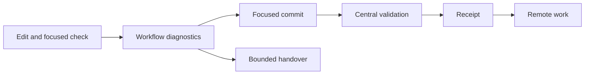

# Developer workflow assurance

This document defines the repository controls that keep concurrent FDAI development fast,
resumable, and fail-closed. It owns developer workflow diagnostics and latency evidence, not the
product control plane or its execution authority.

> Scope: issue [#116](https://github.com/dotnetpower/fdai/issues/116) tracks this bounded campaign.
> A workflow optimization never bypasses design context, focused checks, centralized validation,
> identity verification, or deployment approval.

## Design at a glance

FDAI uses one read-only developer workflow diagnostic surface across local scripts. The surface
reports actionable state for shared writes, validation, context, handover, test isolation, hooks,
browser checks, local services, editor pressure, and remote preflight. Each owning mechanism keeps
its existing authority and fails closed independently.

The entry point is `python3 scripts/automation/developer-workflow.py`. It provides these bounded
commands:

| Command | Result |
|---------|--------|
| `status` | Aggregates Git, validation, handover, test-environment, hook-risk, local-service, browser-runner, and editor-pressure diagnostics. |
| `resume` | Renders the latest relevant handover with current validation and worktree drift. |
| `context-plan <path>...` | Prints deduplicated current design documents and focused checks for the target paths. |
| `preflight` | Fails before a focused check when the Git index, hook state, Python path, virtual environment, or database identity is contaminated. |
| `--json` | Emits one versioned object with explicit `ok`, `warning`, or `unavailable` states. |

The command reads existing Git-common-dir state and process metadata. It does not add a second
audit log, infer session ownership after a commit, or convert an unavailable diagnostic into a
successful result.

## Measured controls

| Area | Required control | Completion measure |
|------|------------------|--------------------|
| Shared writes | Detect overlapping staged and unstaged paths, unsafe shared-index commands, and active path reservations. | No unresolved overlap or unsafe commit command at the commit boundary. |
| Validation | Report oldest reachable pending age, current stage, latest failure, receipt state, and recent receipt latency. | Commit-to-receipt p95 is at most 5 minutes across the newest 50 complete local receipts when focused checks pass. |
| Design context | Resolve a deduplicated route plan without treating cached bytes as proof that a new session read the design. | One plan per task and no repeated read of an unchanged required document in the same session. |
| Session continuity | Persist bounded, secret-free worktree, diff, validation, and next-check metadata. | A new session resumes from one handover command without repository-wide discovery. |
| Focused tests | Detect Python import, database, runtime environment, and checkout contamination before a test starts. | A contaminated check fails before importing task code or opening a database connection. |
| Hooks | Detect staged and unstaged overlap and preserve deterministic recovery guidance before a mutating hook runs. | Hook failure does not silently discard task-owned work. |
| Browser checks | Prefer focused CLI Playwright checks and preserve the shared 10-slot lease contract. | Browser-tool use is limited to one bounded final interaction when CLI evidence is sufficient. |
| Local services | Probe every standard local service independently with bounded timeout and ownership diagnostics. | Full-stack readiness names every unavailable service and never infers readiness from the SPA. |
| Editor pressure | Separate host pressure, extension pressure, and upstream browser payload cost. | Diagnostics identify the owning process or classify the limitation as upstream. |
| Remote preflight | Retry only transient read failures within a fixed attempt and time budget. | Permanent authorization and policy failures fail immediately; retries never mutate Azure. |

Every diagnostic is bounded. Git history scans inspect at most 64 commits, validation latency uses
at most 50 receipts, changed-file output uses at most 20 paths, process output uses at most 20 rows,
HTTP probes use the committed local port inventory, and Azure reads use at most three attempts.

## Safety boundaries

- The diagnostic surface is read-only. It does not stage, restore, reset, commit, kill, restart,
  deploy, approve, or promote.
- Design-context reuse is session-scoped and content-addressed. A handover can name required
  documents, but a receiving session still reads current content before a high-risk edit.
- Validation evidence remains commit-addressed. Queue latency warnings never mint receipts or skip
  failed stages.
- Environment checks compare normalized identities without printing credentials, tokens,
  connection strings, tenant values, or customer resource names.
- Azure retry applies only to safe reads and transient transport or throttling responses. The
  approved-host check runs before every attempt, and exhausted retries return one `PreflightError`.
- Upstream VS Code and Copilot behavior is not reimplemented in the repository. Repository controls
  provide bounded diagnostics and lower-cost validation paths.
- Enforcement remains with the existing edit hook, commit-scope hook, focused test runner,
  validation queue, and deployment preflight. The unified command reports their state and never
  becomes an alternate authority path.

## Failure behavior

| Failure | Diagnostic behavior | Owning enforcement |
|---------|---------------------|--------------------|
| Git-common-dir state is missing or malformed | Report `unavailable` with a stable reason code. | Existing Git and hook commands fail independently. |
| A validation receipt has invalid timestamps | Exclude it from latency calculation and report the invalid record count. | Receipt verification remains unchanged. |
| A handover references unreachable history | Report drift and the nearest relevant reachable handover when available. | No branch or worktree is changed. |
| A local service probe times out | Report the service and port as unavailable. | The service task remains independently controlled. |
| VS Code process data is unavailable | Classify editor pressure as upstream-unavailable. | Focused CLI validation remains available. |
| Azure returns a permanent error | Stop after the first attempt. | The read-only preflight fails closed. |

## Critique protocol

Each round starts with one falsifiable finding and ends with a focused check. A rejected finding is
recorded when the existing control already lowers residual risk to Low. Production changes are
limited to independently verified findings, and the final review repeats the full threat list.

The campaign uses these severity definitions:

| Severity | Meaning |
|----------|---------|
| Critical | Can lose or misattribute work, bypass a required gate, or produce false validation. |
| High | Repeatedly blocks autonomous progress or can validate the wrong checkout or environment. |
| Medium | Causes material delay or manual recovery without weakening a safety decision. |
| Low | Bounded inconvenience with deterministic diagnosis and recovery. |

The implementation sequence keeps one finding per round:

| Round | Focus | Planned evidence |
|------:|-------|------------------|
| 1 | Unified status schema and bounded collection | Focused workflow CLI tests |
| 2 | Shared-index and staged/unstaged overlap diagnosis | Synthetic dirty-index tests |
| 3 | Validation pending age and latency calculation | Synthetic queue state tests |
| 4 | Deduplicated design-context plan | Existing route fixtures plus CLI tests |
| 5 | Resumable handover schema and drift detection | Handover compatibility tests |
| 6 | Python, checkout, and database contamination preflight | Poisoned environment tests |
| 7 | Hook recovery diagnosis | Staged/unstaged overlap fixtures |
| 8 | Browser runner and local-service readiness summary | Static lease and bounded HTTP probe tests |
| 9 | Editor pressure classification | Stubbed process and pressure records |
| 10 | Azure transient retry budget | Stubbed HTTP and timeout tests |
| 11 | Existing-control adversarial review | Design-context, route, and port-pool focused suites |
| 12 | Integrated residual-risk review | All campaign-focused checks and exact diff selection |

## Assurance results

The campaign completed 13 independent rounds. Each accepted finding landed in a focused commit,
and rejected findings cite an existing control or direct test.

| Round | Result | Focused evidence |
|------:|--------|------------------|
| 1 | accepted | Versioned read-only status schema; 2 workflow tests passed. |
| 2 | accepted | Shared index overlap diagnosis; 3 workflow tests passed. |
| 3 | accepted, then hardened again in round 13 | Pending age and receipt latency; 4 workflow tests passed. |
| 4 | accepted | Deduplicated route documents and checks; 93 design-context and workflow tests passed. |
| 5 | accepted, then hardened again in round 13 | Handover schema v2 and drift; 8 handover and workflow tests passed. |
| 6 | accepted | Secret-free environment contamination preflight; 7 workflow tests passed. |
| 7 | accepted | Hook recovery classification; 8 workflow tests passed. |
| 8 | accepted, then hardened again in round 13 | Browser leases and six-service readiness; 10 workflow tests passed. |
| 9 | accepted | Host and client pressure separation; 11 tests passed in 1.01 seconds after removing unnecessary client probes. |
| 10 | accepted | Azure transient-only bounded retry; 6 preflight tests passed without Azure access. |
| 11 | accepted | Existing controls: 163 Python tests and 6 Playwright port-pool tests passed. |
| 12 | accepted | Collectors split to 248, 276, and 195 lines; 11 workflow tests passed. |
| 13 | accepted | Window uncertainty, invalid receipts, malformed handover, and wrong-checkout core readiness fail closed; 48 tests passed. |

The final independent re-review found no residual above Low. It accepted these bounded Low risks:

- Only 20 overlap paths render, while `overlap_count` retains the exact total.
- Linux PSI thresholds are conservative fixed diagnostics, not authority or autoscaling decisions.
- A target symlink that resolves outside the repository is rejected with
  `context_target_outside_repository`.

The review also rejected one false finding that Azure retry was absent. The transport implementation
and focused throttle, permanent-error, and retry-exhaustion tests prove that behavior.

## Implementation status

### Implementation scope

| Area | State | Evidence | Notes |
|------|-------|----------|-------|
| Shared writes and hooks | implemented | `developer_workflow_repository.py`; workflow tests for overlap and recovery classification | Enforcement remains in existing hooks. |
| Validation and handover | implemented | Versioned queue records, bounded latency diagnostics, handover schema v2; 48 final focused tests passed | Window uncertainty and malformed state fail closed. |
| Hermetic checks and local services | implemented | Workflow environment preflight and checkout-owned service readiness; focused workflow tests | The diagnostic never starts or restarts a service. |
| Browser and editor pressure | implemented | Existing focused Playwright entry points, 10-slot lease pool, and profile pressure controls | Final critique must verify no Medium residual. |
| Remote preflight | implemented | `live_preflight/transport.py`; 6 focused tests | At most three read attempts; permanent errors fail immediately. |
| Ten-round assurance | implemented | 13 rounds and final independent re-review recorded above | No residual finding exceeds Low. |

### Implementation history

| Date | State | Change | Evidence | Remaining |
|------|-------|--------|----------|-----------|
| 2026-08-15 | in-progress | Adopted the developer workflow assurance owner and bounded the campaign; earlier implementation provenance was not reconstructed. | Current change and existing controls listed in the scope table. | Complete the focused rounds and final residual-risk review. |
| 2026-08-15 | in-progress | Revised the design after independent critique by defining the CLI contract, bounded evidence windows, failure behavior, authority separation, and 12-round sequence. | Current change; roadmap, translation, and punctuation checks. | Implement and verify each accepted finding. |
| 2026-08-15 | implemented | Completed 13 critique-and-hardening rounds and removed every reproducible Medium-or-higher residual. | Current change; 163 focused Python control tests, 6 Playwright port-pool tests, 48 final false-ready tests, Ruff, and the final independent review. | Record the centralized validation receipt for the integrated revision. |

### Remaining work

- [x] Completed 13 independent critique rounds with focused checks and recorded accepted and
  rejected findings above.
- [ ] Record one central validation receipt for the integrated campaign commit.
- [x] The final independent review found no residual finding above Low.

## Related docs

| To learn about | Read |
|----------------|------|
| Local and deployed runtime parity | [Runtime parity](dev-and-deploy-parity.md) |
| Repository validation commands | [Scripts reference](../../../scripts/README.md) |
| Deployment safety | [Deployment preflight](deployment-preflight.md) |
