# Hub 관리형 수명 주기

이 문서는 FDAI의 세 번째 설치 경로를 정의합니다. Lifecycle Hub는 Palantir Apollo의
hub-and-spoke 모델을 따라 각 설치를 구독한 release channel과 고객이 승인한 구성에 맞춰
유지합니다. 이 문서는 수명 주기 아키텍처, 계획과 상태 루프, 고객 격리 경계를 소유합니다.

> **상태:** 설계만 되어 있습니다. Hub, 설치 에이전트, Lifecycle Plan, 업그레이드 번들은 아직
> 없습니다. [구현 ledger](../../roadmap-implementation/deployment/hub-managed-lifecycle.md)가
> 제공 현황을 추적하며, [ADR-0003](../architecture/decisions/0003-hub-managed-lifecycle-and-operator-governance-ko.md)이
> 결정을 기록합니다.
>
> **범위:** 이 경로는 설치, 업그레이드, 구성, 드리프트, 회수 같은 FDAI 자체의 수명 주기를
> 관리합니다. 고객 리소스는 관리하지 않으며, 고객 리소스는 계속 운영 루프가 다룹니다.
> [수명 주기 구성](lifecycle-configuration-ko.md)이 구성 계층과 비밀을, [Lifecycle Release와
> 채널](lifecycle-releases-and-channels-ko.md)이 Release, 채널, 번들, 회수를 소유합니다.

## 설계 한눈에 보기

| 관심사 | 결정 |
|--------|------|
| 제품과 설치 | 서명된 Release 하나가 모든 고객에게 쓰입니다. 설치마다 다른 것은 구성, 정책, 자기 환경에 대한 바인딩뿐입니다. |
| Hub 배치 | 연결된 고객마다 중앙 Hub cell을 두거나, 고객 경계 안에 온라인으로 동기화하거나 서명된 번들을 오프라인으로 가져오는 Target Hub를 둡니다. |
| 원하는 상태 | 단일 목표 상태는 없습니다. Hub는 채널 구독, 버전 범위, 구성 개정, 제약 조건에서 목표를 도출합니다. |
| 계획 계산 | Hub가 Lifecycle Plan을 계산합니다. 설치 에이전트는 최대 효과 경계를 로컬에서 도출하며, Plan은 그 경계를 좁힐 수만 있습니다. |
| 설치 에이전트 | 워크로드용 수명 주기 에이전트는 클러스터 안에, 정확한 Terraform 계획용 인프라 에이전트는 실행 호스트에 둡니다. 둘 다 판테온 에이전트가 아닙니다. |
| 업그레이드 | 유지 관리 구간 안에서 자동으로 적용합니다. 구성 변경에는 승인된 변경 요청이, Azure 리소스 삭제나 교체에는 확인이 필요합니다. |
| 데이터 경계 | Hub는 Azure 자격 증명, 비밀 값, 운영 데이터를 보관하지 않습니다. 경계를 넘는 것은 수명 주기 메타데이터뿐입니다. |
| 기록 | cell이나 Target Hub마다 Hub PostgreSQL을 두고, 설치 증적은 Foundation 스토리지에 추가 전용으로 남깁니다. |

## 핵심 개념

설계 전체는 네 가지 개념으로 이루어집니다. 이 개념들을 분리해 두어야 제품 하나가 포크 없이 모든
고객에게 쓰일 수 있습니다.

| 개념 | 정의 | 소유자 | 변경 방법 | 위치 |
|------|------|--------|-----------|------|
| 제품 | 모든 고객에게 동일한 서명된 Release로 제공되는 FDAI 자체 | 공급업체 | Release 파이프라인, 채널 승격, 회수 | Release 카탈로그 |
| 설치 | 고객 경계 하나 안에 있는 FDAI 배포 하나로, Apollo의 Environment에 해당합니다. 고객은 여러 설치를 가질 수 있습니다. | 고객 | 등록, 채널 구독, Entity 설정 | Hub의 `installation` 및 `entity` 테이블 |
| 구성 | 설치 하나에 대해 원하는 값인 Environment Config와 Entity 재정의 블록입니다. 권한은 절대 담지 않습니다. | 고객 | 고객 Git의 검토된 병합을 서명된 패키지로 전달 | 고객 Git, 이어서 Hub 구성 테이블 |
| 런타임 상태 | 설치가 실제로 실행하고 관측하는 것: 보고 상태, 증적, 정책과 권한 상태, 운영 데이터 | 설치 | 에이전트와 관리되는 권한 경로만 | 설치 저장소. Hub는 수명 주기 메타데이터만 봅니다. |

## 설계와 비판 검토

**초기 설계:** 중앙 컨트롤 플레인이 고객마다 원하는 상태 하나를 저장하고, 5계층 재정의 스택이
구성을 결정하며, 새로운 배포, 구성, 드리프트, 정책 에이전트가 롤아웃을 실행합니다.

**비판 검토:**

- Apollo는 환경별 목표 상태를 하나만 두지 않습니다. 제품은 release channel과 제약 조건을
  따르며 목표는 그로부터 도출됩니다
  ([Apollo overview](https://www.palantir.com/docs/apollo/core/overview)).
- 판테온은 고정되어 있습니다. 자신이 실행되는 런타임을 업그레이드하는 에이전트는 순환 의존성도
  만듭니다.
- 정확한 계획을 만드는 중앙 엔진에는 모든 고객의 Azure 자격 증명이 필요하며, 규제 고객은 이를
  금지합니다.
- 선형 재정의 스택은 구성으로 권한을 바꿀 수 있게 하며, ADR-0002가 이를 금지합니다.
- 오프라인 사이트는 중앙 서비스를 폴링할 수 없습니다.

**수정된 계약:** Hub는 조율만 합니다. 실제로 무엇이 바뀔 수 있는지는 서명된 산출물과 설치 쪽
에이전트가 결정합니다. 권한은 정책과 승격 레지스트리에 남고, 오프라인 사이트는 자체 Target Hub를
운영합니다.

## Apollo 개념과 FDAI 용어

| Apollo 개념 | FDAI 대응 | 차이점 |
|-------------|-----------|--------|
| [Product, Release](https://www.palantir.com/docs/apollo/core/products-releases-versions) | FDAI Release: 서명된 이미지 다이제스트와 메타데이터 | 제품은 하나입니다. 서비스를 따로 release하지 않습니다. |
| [Release Channel](https://www.palantir.com/docs/apollo/core/release-channels) | `DEV`, `RELEASE_CANDIDATE`, `RELEASE`, 사용자 지정 채널 | 같은 모델입니다. [Lifecycle Release와 채널](lifecycle-releases-and-channels-ko.md)을 참조하세요. |
| [Hub, Orchestration Engine](https://www.palantir.com/docs/apollo/core/overview) | Lifecycle Hub | Plan을 계산하지만 정확한 인프라 변경은 만들지 않습니다 |
| [Environment](https://www.palantir.com/docs/apollo/core/environments) | 설치 | 환경마다 설치 하나입니다. 고객은 여러 설치를 가질 수 있습니다. |
| [Spoke Control Plane](https://www.palantir.com/docs/apollo/core/spoke-control-plane) | 수명 주기 에이전트와 인프라 에이전트 | Azure 쓰기는 기존 실행 호스트에 남습니다 |
| [Entity, Reported State](https://www.palantir.com/docs/apollo/core/entities) | Entity, 보고 상태 | 에이전트는 Core Entity의 하위 상태입니다 |
| [Environment Config](https://www.palantir.com/docs/apollo/managing-environments/environment-config), [config overrides](https://www.palantir.com/docs/apollo/managing-entities/set-config-overrides) | Environment Config, Entity 재정의 블록 | 권한 값은 제외합니다 |
| [Change Requests](https://www.palantir.com/docs/apollo/managing-changes/change-requests) | 고객 Git의 검토된 병합을 서명된 구성 패키지로 전달 | Git이 원하는 구성의 원본입니다 |
| [Plans and Constraints](https://www.palantir.com/docs/apollo/core/plans-and-constraints) | Lifecycle Plan과 제약 조건 | 데이터 상주와 파괴적 변경 확인을 추가합니다 |
| [Export and Import](https://www.palantir.com/docs/apollo/export-import/overview) | Target Hub로 가져오는 업그레이드 번들 | 구성 패키지는 고객 서명을 유지합니다 |
| [Secrets](https://www.palantir.com/docs/apollo/managing-secrets/add-edit-delete-secrets) | Key Vault 참조만 사용 | Hub는 비밀 값을 받지 않습니다 |

## 아키텍처

| 구성 요소 | 실행 위치 | 신원 | 보관하는 것 | 보관하지 않는 것 |
|-----------|-----------|------|-------------|------------------|
| Release 카탈로그 | 공급업체 | 오프라인으로 보관하는 공급업체 release 키 | 서명된 Release, 채널 구성원, 회수, 승격 파이프라인 | 고객 데이터 |
| Lifecycle Hub | 중앙 Hub cell 또는 Target Hub | Hub 서비스 신원. 승인자는 고객의 Entra ID로 로그인합니다. | 설치 설정, 가져온 구성 패키지, 보고 상태, Plan, 제약 조건 결과, 감사 | Azure 자격 증명, 비밀 값, 평문 봉인 값, 운영 데이터 |
| 수명 주기 에이전트 | 설치의 AKS 클러스터, 전용 네임스페이스 | FDAI 네임스페이스에서만 Kubernetes 권한을 가진 워크로드 신원 | 생성한 워크로드 매니페스트와 워크로드 증적 | Azure 쓰기 신원, 실행기 신원 |
| 인프라 에이전트 | 기존 실행 호스트 | 기존 배포 관리 ID | 정확한 Terraform 계획, Foundation 상태, 인프라 증적 | 실행기 신원, 운영 데이터 |
| FDAI 서비스 | 설치 | 기존 서비스 신원 | 운영 루프 상태 | 수명 주기 권한 |

### Hub 배치

| 배치 | 위치 | 카탈로그 원천 | 운영 주체 | 일반적인 고객 |
|------|------|---------------|-----------|---------------|
| 중앙 Hub cell | 고객과 합의한 리전의 공급업체 구독. 고객마다 자체 데이터베이스와 고객 관리 키를 가진 격리된 cell을 받습니다. | Release 카탈로그를 직접 사용 | 공급업체 | 연결되어 있고 경계 제한이 없는 고객 |
| 온라인 Target Hub | 고객 운영 리소스 그룹 | 허용 목록에 있는 아웃바운드 경로로 카탈로그에서 동기화 | 고객 | 규제를 받으며 연결된 고객 |
| 오프라인 Target Hub | 고객 운영 리소스 그룹 | 운영자가 가져오는 서명된 업그레이드 번들 | 고객 | 인터넷에 연결되지 않은 고객 |

Hub cell은 중앙 Hub의 고객별 격리 단위입니다. [하이퍼스케일 셀 아키텍처](../architecture/hyperscale-cell-architecture-ko.md)의
스트리밍 셀과는 관계가 없습니다.

### 신뢰 경계

- 공급업체 release 키는 Release, 카탈로그 메타데이터, 회수 공지, 업그레이드 번들에 서명합니다.
  최신성과 순서는 [카탈로그 무결성](lifecycle-releases-and-channels-ko.md#카탈로그-무결성)이
  정의합니다.
- 고객 구성 키는 구성 패키지에 서명합니다. 이 키는 고객의 Key Vault나 HSM에 남습니다.
- 각 설치는 자기 Key Vault에 내보낼 수 없는 설치 키를 보관합니다. 등록할 때 이 키의 보유를
  증명하고, 이후 봉인된 값을 풀고 증적에 서명하는 데 사용합니다.
- 각 Hub cell이나 Target Hub는 자체 Hub 키를 가집니다. Hub 키와 설치 키는 서명된 키 기록으로
  교체되며, 키를 폐기하면 그 키가 서명한 모든 Plan이 무효가 됩니다.
- 설치 에이전트는 서명된 Release, 구성 패키지, 소유권 증거, 로컬 강제 정책에서 최대 효과 경계를
  직접 도출합니다. Hub Plan은 그 경계를 좁힐 수만 있습니다.
- 경계를 넘는 것은 버전, 다이제스트, 대략적인 구성 요소 상태, 제약 조건 결과, 정리된 계획
  요약 같은 수명 주기 메타데이터뿐입니다. 이벤트 내용, 리소스 식별 정보, 온톨로지 내용, 감사
  내용, 비밀, 자격 증명, 평문 식별자는 설치 안에 남습니다.

## 수명 주기 루프

### 원하는 입력

Hub는 다음 입력에서 각 설치의 목표를 도출합니다.

- 채널 구독과 선택적인 버전 범위
- 현재 구성 개정: Environment Config와 Entity 재정의 블록
- 카탈로그 사실: Release, 채널 구성원, 회수, 제품 의존성, 스키마 범위
- 제약 조건과 최신 보고 상태

목표는 구독한 채널에서 버전 범위 안에 있고 모든 제약 조건을 통과하며 회수되지 않은 최신
Release입니다. 이 Release는 버전 범위가 가장 구체적으로 일치하는 재정의 블록과 함께 배포됩니다.

### Entity와 보고 상태

| Entity 종류 | 예 | 관리 여부 |
|-------------|-----|-----------|
| 워크로드 | Core, Operator API, Document Ingestion API, Document Processing Worker, isolated Executor, Console, CronJob, 수명 주기 에이전트 | 관리 |
| 플랫폼 | AKS 클러스터, PostgreSQL, Event Hubs 네임스페이스, Key Vault, 컨테이너 레지스트리, 스토리지, 네트워크 | 관리 |
| 비관리 | 고객 소유 API Management, 프라이빗 DNS 영역, ITSM 엔드포인트 | 관측만 함 |

보고 상태에는 Release 버전, 이미지 다이제스트, 구성 다이제스트, 대략적인 상태, 마지막 Plan
결과가 들어 있습니다. Core Entity는 에이전트마다 실행 중, 성능 저하, 중지 가운데 하나의 상태
구간과 범위가 정해진 consumer lag 구간 및 유휴 시간 구간을 추가합니다. 이벤트 내용과 이벤트별
시각은 설치 안에 남습니다. 플랫폼 Entity는 Terraform 상태 lineage, serial, 리소스 식별 정보의
다이제스트를 추가합니다. Apollo와 마찬가지로 설정과 보고 상태가 모두 있는 Entity는 관리
Entity이고, 보고 상태만 있는 Entity는 비관리 Entity입니다. 보고 상태는 추가 전용이며 이벤트
시각과 기록 시각을 유지합니다.

### Lifecycle Plan

Plan 유형은 설치, 업그레이드, 구성 변경, 회수 roll-off(회수된 Release에서 벗어나기), 드리프트
조정, 제거입니다. 제거에는 항상 운영자 확인이 필요합니다. 각 Plan은 대상 설치, Hub 키 epoch,
계산의 근거가 된 보고 상태 다이제스트, 설치별로 증가하는 순번, 펜싱 세대, 목표 Release, 구성
개정, Entity 집합, 제약 조건 결과, 범위를 좁히는 효과 경계, 만료 시각을 명시합니다. 에이전트는
순번, 세대, 원본 상태 다이제스트가 오래된 Plan을 거부하고 그 거부를 내구성 있게 기록합니다.

Plan은 펜싱된 단계 순서로 실행됩니다. 인프라 에이전트가 인프라 단계를, 수명 주기 에이전트가
워크로드 단계를 소유합니다. 각 단계는 이전 단계의 증적이 기록된 뒤에만 시작합니다. 실패하면
Release가 허용하는 경우 완료된 단계를 역순으로 보상하고, 그렇지 않으면 설치를 운영자 판단까지
보류합니다.

1. 에이전트는 Hub를 폴링하고 Plan의 서명, 대상, 순번, 세대를 검증합니다.
2. 에이전트는 Release와 구성의 서명을 검증합니다. 공급업체가 서명한 회수가 롤백을 허용하지 않는
   한, 이미 적용한 최신 Release보다 오래된 Release를 거부합니다.
3. 인프라 에이전트는 봉인된 값을 로컬에서 복호화해 정확한 Terraform 계획을 만듭니다. 수명 주기
   에이전트는 워크로드 매니페스트를 만듭니다.
4. 에이전트는 정확한 변경을 Plan이 좁힌 로컬 도출 효과 경계와 비교합니다. 그 경계를 벗어난
   변경은 거부하고, 기존 Azure 리소스의 삭제나 교체는 같은 정확한 계획 다이제스트에 결속된
   운영자 확인이 있을 때까지 보류합니다.
5. 에이전트는 정확한 계획 다이제스트를 Plan, Release, 구성 개정, 열린 구간에 결속하는 로컬
   수명 주기 승인 증적을 기록합니다. 이 증적은 기존 정확한 계획의 claim, 적용, 검증 전용 복구
   단계에서 운영자의 명령 실행을 대신합니다. 에이전트는 다이제스트와 정리된 요약을 Hub에
   보고합니다.
6. 성공하려면 정상적인 워크로드, 두 번째 변경 없음 계획, 독립적인 재확인이 필요합니다. 증적은
   Foundation 스토리지에 추가되고 Hub는 결과를 기록합니다.

수명 주기 에이전트, 인프라 에이전트, Target Hub는 두 개의 슬롯으로 스스로 업그레이드합니다. 새
버전이 이전 버전 옆에서 시작해 상태 검사를 통과한 뒤 역할을 넘겨받습니다. 이전 슬롯은 롤백
대상으로 남습니다.

### 제약 조건

| 제약 조건 | 설정 주체 | 차단 대상 |
|-----------|-----------|-----------|
| 유지 관리 구간(무중단 또는 다운타임) | 고객. Release가 고정한 시간대 데이터베이스 버전의 IANA 시간대를 사용합니다. | 선언된 최대 소요 시간이 남은 구간에 들어가지 않는 Plan. 같은 종류의 구간이 겹치면 합치며, 신뢰할 수 있는 UTC 시계가 판단합니다. |
| 억제 구간 | 운영자, 또는 실패 후 자동 | 범위 안의 Plan. 실패로 생긴 억제는 실패한 Plan의 롤백을 막지 않습니다. |
| 버전 범위 | 고객 | 범위 밖의 Release |
| 제품 의존성과 스키마 범위 | Release 메타데이터 | 호환되지 않는 업그레이드와 롤백 |
| 산출물 가용성 | 설치 레지스트리 | 이미지가 경계 안에 없는 Plan |
| 재정의 적용 범위 | 고객 | 일치하는 재정의 블록이 없는 Release |
| 데이터 상주 | Environment Config | 허용 범위 밖에서 데이터를 처리하는 Release나 모델 바인딩 |
| 회수 | 공급업체 | 회수된 Release의 제안. 회수는 roll-off도 시작합니다. |
| 파괴적 변경 | 헌법 | 확인 전까지 기존 Azure 리소스의 삭제나 교체 |

### 실패, 드리프트, 조정

- 실패한 Plan은 해당 Entity에 자동 억제 구간을 둡니다. 실패가 설정된 임계값을 넘으면 Apollo처럼
  설치 전체를 억제합니다. 스키마 범위가 허용하면 이전 Release로 롤백하는 Plan이 실행되고,
  그렇지 않으면 설치를 운영자 판단까지 보류합니다.
- 수명 주기 드리프트는 보고 상태와 원하는 입력의 차이입니다. Deployment를 수동으로 바꾸거나
  Terraform refresh에서 드리프트가 발견된 경우가 해당합니다. Hub는 다음 일치하는 구간에 조정
  Plan을 발행합니다.
- Hub는 보고 상태, Entity 설정, 구성 개정, 채널 구성원, 회수가 바뀔 때와 Plan이 정해진 임계
  시간보다 오래 차단될 때 Plan을 다시 계산합니다.

### 명령과 재정의

Apollo에는 런타임 재정의 계층이 없습니다. 가장 가까운 개념은 억제 구간, 유지 관리 구간 재정의,
비상 해제(break-glass) 명령입니다. FDAI도 이 구분을 유지합니다.

| 명령 | 주체 | 효과 | 만료 |
|------|------|------|------|
| 억제 구간 | 수명 주기 운영자 | 범위 안의 새 Plan을 즉시 중지합니다 | 필수 |
| 권한을 낮추는 명령 | 설치 운영자 | ActionType 강등, 자율성 상한 하향, kill switch 작동을 즉시 적용합니다 | 필수. 운영자는 만료 전에 알림을 받고 연장할 수 있습니다. |
| 비상 해제 명령 | 새 인증을 마친 비상 해제 역할 | 스케일 아웃 같은 비상 구성 변경을 적용하거나, 유지 관리 구간, 억제 구간, 버전 범위를 우회합니다 | 필수. 만료되면 병합된 변경이 이를 채택하지 않은 한 Hub가 승인된 Git 개정으로 조정합니다. |

권한을 높이는 명령은 없습니다. 비상 해제 명령은 유지 관리 구간, 억제 구간, 버전 범위만 우회할
수 있습니다. 서명 검사, 로컬 효과 경계, 정확한 계획, 잠금, 멱등성, 감사 의도, 회수, 파괴적
변경 확인, 복구, 독립적인 재확인은 그대로 거칩니다. 설치 자체의 kill switch 경로는 기존 동작을
유지합니다.

## 운영 루프와의 분리

- 수명 주기 루프는 FDAI가 소유함을 증명할 수 있는 리소스만 변경합니다. 증명은 Terraform 상태
  식별 정보와 일치하는 서명된 Foundation 생성 증적입니다. 태그 권한이 있는 누구나 붙일 수 있으므로
  `fdai:managed=true` 태그는 탐색 단서일 뿐입니다.
- 운영 루프는 소유가 증명된 FDAI 리소스를 대상으로 하는 작업을 제안하지 않으며, 위험 게이트는
  그런 대상을 차단합니다. Heimdall은 여전히 그 리소스의 드리프트를 참고 증거로 보고할 수 있습니다.
- 수명 주기 에이전트는 권한이 있는 이벤트를 게시하지 않습니다. Saga는 수명 주기 증적을 증거
  참조로만 인용할 수 있습니다.

## 고객 격리와 데이터 상주

| 요구사항 | 설계가 충족하는 방법 | 확인 방법 |
|----------|----------------------|-----------|
| 데이터를 국내에 유지 | Target Hub와 설치를 Korea Central에 두고, Hub는 메타데이터만 저장합니다 | Azure Policy 허용 위치와 보고된 바인딩 범위 |
| 해외 엔드포인트 금지 | 허용 목록에 있는 카탈로그 동기화 또는 오프라인 번들 | 이그레스 방화벽 로그와 [네트워크 매트릭스](network-connectivity-matrix-ko.md) |
| 승인된 모델 엔드포인트만 사용 | Environment Config의 모델 바인딩 허용 목록과 상주 제약 조건 | 시작 시 바인딩 검증 |
| PTU 필수 | 용량 유형이 `ptu`인 모델 바인딩 | Settings의 모델 인벤토리 |
| 격리된 네트워크 | 프라이빗 엔드포인트를 쓰고, 에이전트는 경계 안의 Target Hub를 폴링합니다 | 네트워크 매트릭스 시나리오 |
| 데이터에 대한 중앙 접근 금지 | Target Hub를 경계 안에 둡니다. 중앙 cell도 운영 데이터는 보관하지 않고 봉인된 식별자만 보관합니다. | Hub 데이터 모델 검토와 감사 |

Azure 모델 배포 유형은 프롬프트를 처리하는 위치가 서로 다릅니다. Global 유형은 어느 리전이든
사용할 수 있고, Data Zone 유형은 아시아 태평양 같은 영역 안에 머무르며, Standard나 Regional
Provisioned 유형은 리소스가 속한 지역 안에 머무릅니다
([deployment types](https://learn.microsoft.com/en-us/azure/foundry/foundry-models/concepts/deployment-types)).
따라서 PTU를 쓰면서 국내에서 처리하려면 Regional Provisioned가 필요하며, 이 유형은 모든 모델에
제공되지는 않습니다.

### Hub가 침해된 경우

침해된 Hub는 업그레이드를 지연하거나 Plan을 보류할 수 있습니다. 하지만 효과 경계를 넓히거나,
Release나 구성 패키지를 위조하거나, Plan을 다른 설치로 재전송하거나, 봉인된 값을 읽거나, Azure
자격 증명을 얻을 수는 없습니다. 에이전트는 공급업체가 서명한 회수 없이는 버전 롤백을 거부하며,
만료된 카탈로그 메타데이터는 [카탈로그 무결성](lifecycle-releases-and-channels-ko.md#카탈로그-무결성)에
설명한 대로 권한을 낮춥니다. 각 cell은 자체 키, 데이터베이스, 고객 관리 키를 가지므로 침해된
cell이 다른 고객의 cell에 영향을 줄 수 없습니다.

### 공급업체 지원

지원 담당자는 중앙 cell의 메타데이터만 봅니다. Target Hub의 기록은 고객이 정리된 지원 번들을
내보내지 않는 한 고객에게 남습니다. 설치에 접근하려면 고객이 자기 테넌트에서 부여하는 시간
제한 역할을 사용합니다. Hub는 어떤 접근도 부여하지 않습니다.

## 등록과 마이그레이션

1. 운영자는 다른 경로와 마찬가지로 자신의 로그인으로 Foundation을 만들거나 기존 설치에서
   시작합니다. 오프라인 사이트는 서명된 오프라인 패키지로 Target Hub와 첫 Release를 설치합니다.
2. 운영자는 서명된 Release에서 수명 주기 에이전트와 인프라 에이전트를 설치합니다.
3. 설치는 Hub에 설치 키 보유를 증명하고, 고객 승인자가 등록을 수락합니다.
4. Entity는 비관리 상태로 시작합니다. 소유가 증명되고 운영자가 설정을 추가한 뒤에만 관리
   Entity가 됩니다.
5. 첫 Plan이 소스 빌드 이미지를 서명된 이미지로 바꿉니다.

현재는 Terraform 애플리케이션 단계가 워크로드를 만듭니다. Hub 경로는
[워크로드 렌더링 마이그레이션](#워크로드-렌더링-마이그레이션)에 정의한 대로 네임스페이스 범위의
워크로드 객체 생성을 수명 주기 에이전트로 옮깁니다. Azure 리소스, 클러스터 범위 객체, 권한을
부여하는 역할 바인딩은 Terraform에 남습니다.

## 워크로드 렌더링 마이그레이션

이 섹션은 Hub 관리형 설치가 워크로드 렌더링을 Terraform 애플리케이션 단계에서 수명 주기
에이전트로 옮기는 방법과 이를 되돌리는 방법을 정의합니다. 한 줄 소스 배포와 서명된 오프라인
패키지는 Terraform 애플리케이션 단계를 그대로 유지합니다.

### 현재 렌더링

배포 CLI는 기반 출력값, 이미지 다이제스트, 제품 프로필에서 `workloads` 맵과 `scheduled_jobs`
맵을 만듭니다. 그런 다음 정확한 계획의 claim, 적용, 검증 전용 복구 단계를 거쳐 Terraform 루트
하나(`infra/runtimes/aks/workloads`)를 적용합니다. 이 루트는 세 종류의 객체를 만듭니다.

- 각 워크로드와 예약 작업의 네임스페이스 범위 Kubernetes 객체
- 클러스터 범위 Kubernetes 객체와 FDAI 신원에 접근 범위를 부여하는 역할 바인딩
- Azure 리소스: 페더레이션 ID 자격 증명, API Management 브라우저 게이트웨이와 네트워크 보안 규칙

### 설계와 비판 검토

**초기 설계:** Terraform 워크로드 루트 전체를 수명 주기 에이전트 안에서 실행합니다.

**비판 검토:**

- 이 루트는 Azure 리소스를 쓰지만, ADR-0003 A11은 Azure 쓰기 신원을 실행 호스트에 둡니다.
- 이 루트는 네임스페이스와 클러스터 역할을 만듭니다. 수명 주기 에이전트는 FDAI 네임스페이스
  안에서만 Kubernetes 권한을 가집니다.
- API Management는 외부 LoadBalancer 서비스에서 백엔드 주소를 읽습니다. 에이전트가 이
  서비스를 소유하면 인프라 단계가 워크로드 단계에 의존하게 됩니다.
- 워크로드 값에는 이미지, 프로브, 보안 설정 같은 제품 내용과 클라이언트 ID, 엔드포인트 같은 설치
  식별자가 섞여 있습니다. Release는 식별자를 담을 수 없고, Hub는 식별자를 볼 수 없어야 합니다.
- `terraform state rm`으로 주소를 지우면 검토된 정확한 계획 밖에서 상태가 바뀝니다.

**수정된 계약:** 객체 종류에 따라 소유를 나눕니다. 수명 주기 에이전트는 따로 서명된 세 입력으로
네임스페이스 범위의 워크로드 객체만 렌더링합니다. Terraform은 `removed` 블록과 `import` 블록을
쓰는 정확한 계획으로만 이 객체를 넘기고 다시 가져옵니다.

### Hub 경로의 객체 소유

| 객체 | 범위 | 소유자 |
|------|------|--------|
| Deployment, HorizontalPodAutoscaler, PodDisruptionBudget, NetworkPolicy, 내부 Service, ServiceAccount, SecretProviderClass, CronJob, identity-bridge ConfigMap | FDAI 네임스페이스 | 수명 주기 에이전트 |
| Operator API와 Document Ingestion API의 외부 LoadBalancer Service | FDAI 네임스페이스 | 인프라 에이전트. API Management가 이 주소에 바인딩되기 때문입니다 |
| 실행기의 외부 스케일용 Role과 RoleBinding | FDAI 밖의 지정된 대상 네임스페이스 | 인프라 에이전트. 권한을 부여하기 때문입니다 |
| 네임스페이스, 인벤토리 조회용 ClusterRole과 ClusterRoleBinding | 클러스터 | 인프라 에이전트 |
| 페더레이션 ID 자격 증명, API와 작업을 포함한 API Management 브라우저 게이트웨이, 네트워크 보안 규칙 | Azure | 인프라 에이전트 |

수명 주기 에이전트는 역할 바인딩을 만들거나 바꾸지 않습니다. 따라서 워크로드 적용으로 어떤
신원의 접근 범위도 넓어지지 않습니다.

수명 주기 에이전트가 같은 필드를 두고 다른 쓰기 주체와 다투지 않도록 두 가지 규칙을 둡니다.

- **FDAI 네임스페이스 안에서는 실행기 효과를 쓰지 않습니다.** 기존 경로에서는 격리된 실행기가
  FDAI 네임스페이스의 Deployment를 패치하고 스케일하며 파드를 삭제할 수 있습니다. Hub 경로에서는
  인프라 에이전트가 이 역할을 바인딩하지 않습니다. 수명 주기 에이전트가 그 변경을 되돌리게 되고,
  [운영 루프와의 분리](#운영-루프와의-분리)에 따라 운영 루프는 FDAI 소유 리소스를 대상으로 삼으면
  안 되기 때문입니다. 그 결과 Hub 경로에서는 파드 재시작이나 Deployment 스케일 같은 Kubernetes
  ActionType을 FDAI 자신의 워크로드에 쓸 수 없습니다. 다른 네임스페이스의 실행기 스케일 대상은
  그대로 유지합니다.
- **레플리카 수는 오토스케일러가 소유합니다.** 워크로드에 HorizontalPodAutoscaler가 있으면,
  에이전트는 현재 Terraform 루트가 `ignore_changes`로 하듯이 적용하는 Deployment에서
  `spec.replicas`를 빼고 적용합니다. 레플리카 재정의 값은 대신 오토스케일러의 최솟값과 최댓값을
  정합니다.

### 렌더링 입력

수명 주기 에이전트는 세 입력으로 렌더링합니다. 입력마다 서명자와 공개 범위가 다릅니다.

| 입력 | 내용 | 서명 | Hub가 보는 것 |
|------|------|------|---------------|
| Release의 워크로드 템플릿 | 구성 요소별 이미지, 명령, 포트, 프로브, 보안 컨텍스트, 사이드카, 기본 크기, 값 출처가 지정된 환경 키 | 공급업체 Release 키 | 다이제스트 |
| Entity 재정의 값 | 템플릿 한도 안의 레플리카, CPU, 메모리 | 고객 구성 키 | 값 |
| 설치 바인딩 | 신원의 클라이언트 ID와 리소스 ID, 컨테이너 레지스트리 로그인 서버, Kafka와 PostgreSQL 엔드포인트, Event Hubs 토픽 이름, Key Vault 이름, 비밀 이름, 설치와 사용권 바인딩, 로컬에서 복호화한 봉인 식별자 | 설치 키 | 다이제스트만 |

설치 바인딩은 인프라 에이전트가 자기 단계를 마친 뒤 설치 안에서 작성합니다. 자기 Terraform
루트의 출력값과, [수명 주기 구성](lifecycle-configuration-ko.md#값-분류)에 정의된 대로 구성
패키지에서 복호화한 봉인 식별자를 합칩니다. 템플릿의 각 환경 항목은 값 출처를 리터럴, 구성 키,
바인딩 키 중 하나로
선언합니다. 렌더러는 알 수 없는 키와 다른 값 출처를 거부합니다. 그래서 템플릿은 엔드포인트를
담을 수 없고, Plan에는 바인딩 값이 필요하지 않습니다.

### 업그레이드 Plan의 단계

1. **인프라:** 인프라 에이전트가 Azure 리소스, 클러스터 범위 객체, 역할 바인딩, 외부 Service에
   대해 추가와 제자리 변경만 적용하고, 목표 Release의 모든 워크로드와 작업에 대한 페더레이션 ID
   자격 증명을 만듭니다. 그런 다음 설치 바인딩과 그 증적을 기록합니다.
2. **스키마 확장:** Release는 데이터베이스 마이그레이션을 Kubernetes Job 템플릿으로 제공하며,
   이 템플릿은 마이그레이션과 카탈로그 도구가 이미 들어 있는 Core 이미지를 사용합니다. Job은 현재
   관리 호스트의 마이그레이션 단계처럼 기존 마이그레이션, 선언된 순서에 따른 서비스 소유
   마이그레이션, 권위 카탈로그 반영을 실행합니다. 다만 Release가 확장으로 분류한 개정만 실행하고,
   스키마를 삭제하거나 이름을 바꾸는 개정은 거부합니다. 축소 개정은 [Lifecycle Release와
   채널](lifecycle-releases-and-channels-ko.md#스키마-호환성)이 요구하는 복원 체크포인트 뒤에 별도의
   펜싱된 Plan에서 실행합니다. 이전 개정은 이미 적용되어 있으므로, 분류는 설치의 등록 기준 시점
   이후에 추가된 개정에만 필요합니다. 기존 업그레이드 중 일부는 테이블을 삭제하므로, Hub 관리형
   업그레이드는 분류되지 않은 새 개정을 실행하지 않습니다. 기존 마이그레이션 잠금은 단계마다
   따로 쓰는 트랜잭션 잠금이고 카탈로그 반영에는 잠금이 없으므로, Job은 세 단계와 증적 기록 전체에
   걸쳐 설치 범위의 마이그레이션 리스 하나를 유지합니다. 수명 주기 에이전트는 어떤 워크로드도
   전환하기 전에 전용 마이그레이션 신원으로 FDAI 네임스페이스에서 이 Job을 실행합니다.
3. **워크로드:** 수명 주기 에이전트가 객체를 렌더링하고, 로컬에서 도출한 효과 경계와 비교한 뒤,
   자기 필드 관리자로 server-side apply를 사용해 적용합니다.
4. **검증:** 두 에이전트는 정상 워크로드, 변경 없는 두 번째 렌더링, 남은 Terraform 루트의 변경
   없는 계획, 독립적인 재조회를 요구합니다.
5. **인프라 정리:** 목표 Release에서 빠진 워크로드가 사라졌음을 재조회로 확인한 뒤, 인프라
   에이전트가 그 워크로드가 쓰던 외부 Service, API Management 경로, 역할 부여, 페더레이션 ID 자격
   증명을 제거합니다.

Release에 새로 추가된 워크로드는 1단계에서 페더레이션 ID 자격 증명을 받으므로, 3단계에서 파드가
생기기 전에 신원이 준비됩니다. 기존 경로에서는 관리 호스트가 애플리케이션 단계 직전에
마이그레이션을 직접 계속 실행합니다.

### 기존 설치의 소유 이전

등록된 설치는 네 단계로 워크로드 객체를 수명 주기 에이전트로 옮깁니다. 각 단계에는 로컬 수명 주기
승인 증적이 필요하며, 어떤 단계도 실행 중인 객체를 지우거나 다시 만들지 않습니다.

1단계 전에 두 개의 정확한 계획으로 소유 이전을 준비합니다.

- **Service 리소스 분리:** Terraform `removed` 블록은 인스턴스 키 없이 리소스 전체만 지정할 수
  있는데, 현재는 내부 Service와 외부 Service가 하나의 리소스 블록을 같이 씁니다. `moved` 블록을 쓰는
  리팩터링으로 이를 내부 Service 리소스와 외부 Service 리소스로 나눕니다. 이 변경은 모든 설치
  경로에서 변경 없는 계획으로 적용됩니다.
- **FDAI 네임스페이스에서 실행기 역할 제거:** Hub 경로에서는 별도 계획이 FDAI 네임스페이스의
  실행기 Kubernetes 효과용 Role과 RoleBinding을 삭제합니다. 권한을 낮추는 변경이며, 소유 이전 중
  허용되는 유일한 삭제입니다.

1. **관찰 비교:** 에이전트는 객체를 렌더링해 쓰기 없이 실행 중인 객체와 비교합니다. 서버 기본값과
   바인딩 순서에서만 오는 차이는 정규화합니다. 설정한 횟수만큼 연속으로 차이가 0이면 통과합니다.
2. **Terraform에서 해제:** 인프라 에이전트가 Release에 들어 있는 Hub용 워크로드 루트 변형의
   정확한 계획을 적용합니다. `removed` 블록은 해당 리소스 블록이 설정에 없어야 하므로, 이 변형은
   에이전트 소유 리소스 블록을 각각 `destroy = false`인 `removed` 블록으로 바꿉니다. 이 블록은
   Terraform 1.7 이상에서 지원되며, 고정된 도구 체인은 1.9.8입니다. 계획에는 삭제와 수정이 없어야
   합니다.
3. **인수:** 에이전트는 `fdai-lifecycle-agent` 필드 관리자로 같은 렌더링 결과를 server-side
   apply로 적용합니다. Terraform 필드 관리자가 소유한 필드에서만 충돌을 강제로 넘겨받고, 다른
   충돌이 있으면 멈춥니다. 객체를 하나씩 인수하면서 객체 UID, 리소스 버전, 렌더링 다이제스트를 담은
   객체별 증적을 기록하므로, 중단된 인수는 마지막 증적부터 이어집니다. 각 객체는 Release ID와 렌더링
   다이제스트를 주석으로 기록합니다.
4. **검증:** 두 번째 렌더링에 변경이 없고, 워크로드가 정상이며, 남은 Terraform 루트의 계획에
   변경이 없어야 합니다.

2단계 이후에는 설치가 로컬 Hub 소유 표시를 기록합니다. 전체 워크로드 루트를 계획하려는 배포 CLI의
모든 진입점은 실행을 거부하거나 Hub용 변형을 사용합니다. 일반 애플리케이션 단계, 서비스별
업데이트, 과거 상태 조정이 모두 포함됩니다. 그래서 Terraform과 에이전트가 같은 객체를 함께 쓰지
않습니다.

**되돌리기:** 먼저 에이전트가 인수한 객체의 조정을 멈추고, 조정 리스를 놓고, 해제를 기록합니다.
그런 다음 인프라 에이전트가 같은 주소에 대해 `import` 블록이 있는 정확한 계획을 적용하고, 이어지는
계획에 변경이 없으면 Terraform 상태가 실행 중인 객체와 일치함이 증명됩니다. 2단계나 3단계에서
실패해도 이미 인수한 객체의 필드 소유와 주석만 바뀝니다. 실행 중인 객체를 지우거나 다시 만들지
않으므로, 되돌리기에 재생성이 필요하지 않습니다.

### 렌더링 동등성

단일 렌더러가 생기기 전까지는 Terraform 루트와 수명 주기 에이전트가 하나의 워크로드 템플릿
계약을 구현합니다. 집중 테스트가 같은 입력 조합을 두 렌더러에 넣고 Terraform 계획 값과 에이전트
출력을 비교합니다. 입력 조합은 제품 프로필, 추가 기능, identity bridge, 실행기 스케일 대상을
포함합니다. 비교에는 Kubernetes 서버 기본값을 제거하고 비밀 공급자 바인딩을 정규화하는 배포 CLI의
기존 규칙을 재사용합니다. 보호된 CronJob 템플릿 다이제스트와, 인프라 에이전트가 만든 외부
Service의 셀렉터가 에이전트가 렌더링한 파드 레이블과 일치하는지도 확인합니다. 차이가 하나라도
있으면 테스트가 실패합니다.

Hub 경로에서 카탈로그 검토와 초기 인벤토리를 실행하는 일회성 Job 실행은 보호된 CronJob 템플릿
다이제스트를 Terraform 입력이 아니라 에이전트의 렌더링 증적에서 도출합니다.

### 이전 미해결 질문에 대한 결정

Hub 관리형 수명 주기 담당자가 2026-10-07에 다음과 같이 결정했습니다.

- **마이그레이션 신원:** 스키마 확장 Job은 어떤 워크로드와도 공유하지 않는 전용 마이그레이션
  ServiceAccount와 관리 ID로 실행합니다. MVP에서는 이 신원이 현재 관리 호스트의 마이그레이션
  단계가 쓰는 것과 같은 Key Vault 데이터베이스 비밀을 읽습니다. 마이그레이션이 서비스 역할을 만들고
  데이터를 채우기 때문에 이 비밀에는 서버 관리자 로그인이 들어 있습니다. 이후 변경에서 객체 소유를
  관리자에서 전용 마이그레이션 데이터베이스 역할로 옮긴 뒤, 마이그레이션에 필요한 권한만 가진 그
  역할로 바꿉니다.
- **단일 렌더러:** MVP가 검증될 때까지 Terraform 루트와 에이전트 렌더러를 렌더링 동등성 검사와
  함께 모두 유지합니다. 그 뒤에는 Terraform 워크로드 루트가 에이전트가 렌더링한 매니페스트를
  적용하므로 모든 설치 경로가 하나의 렌더러를 쓰고, 동등성 검사는 필요 없어집니다.

### 미해결 질문

- 현재 관리 호스트가 애플리케이션 단계 뒤에 실행하는 배포 후 단계(Trial 활성화, 초기 인벤토리,
  카탈로그 검토)를 어떤 구성 요소가 실행할지
- 실행 호스트가 선택 사항인 매일 자동 종료(`runner_auto_shutdown_time`)를 쓸 때 인프라 에이전트를
  어떻게 계속 실행할지
- 설치가 `postgres-aks` 데이터베이스 배치를 선택했을 때 클러스터 안 PostgreSQL 네임스페이스를 어느
  에이전트가 소유할지

## 설치 예시

| 항목 | Customer A | Customer B | Customer C |
|------|------------|------------|------------|
| Hub | Korea Central의 온라인 또는 오프라인 Target Hub | East US의 중앙 Hub cell | 중앙 Hub cell 또는 Target Hub |
| 채널 | `RELEASE` 또는 수동으로 승격하는 사용자 지정 채널 | `RELEASE_CANDIDATE` | 범위가 `>=1.4.0 <1.5.0`인 `RELEASE` |
| 구간 | 주간 다운타임 구간과 야간 무중단 구간 | 매일 구간 | 합의한 대로 |
| 모델 | 승인된 엔드포인트의 Regional Provisioned PTU | Standard 종량제 | API Management를 통해 Azure에서 도달할 수 있는 자체 호스팅 모델 |
| 거버넌스 | 정책이 모든 상태 변경을 승인까지 보류 | 운영자가 승격한 작업과 상시 권한을 쓰는 단독 운영자 프로덕션 프로필 | 실행별 승인 |

이 설치들의 구성은 [수명 주기 구성](lifecycle-configuration-ko.md#예시)에서 볼 수 있습니다.
Customer C의 온프레미스 런타임과 로컬 모델에는 별도 승인과 ADR이 필요합니다.

## Hub 데이터 모델

| 테이블 | 키 | 용도 | 시간 필드 | 변경 방식 |
|--------|-----|------|-----------|-----------|
| `installation` | `installation_id` | 등록, Hub 배치, 채널, 버전 범위, 구간 | `enrolled_at`, `recorded_at` | 개정 관리 |
| `entity` | `installation_id`, `entity_id` | 종류, 관리 여부, 설정 개정 | `effective_from`, `recorded_at` | 개정 관리 |
| `entity_reported_state` | `installation_id`, `entity_id`, `observed_at` | 버전, 다이제스트, 상태, 에이전트 하위 상태 | `observed_at`, `recorded_at` | 추가 전용 |
| `lifecycle_plan` | `plan_id` | 유형, 목표 Release, 구성 개정, 효과 경계, 만료 | `created_at`, `issued_at`, `expires_at` | 상태 변경은 `lifecycle_plan_event`에 기록 |
| `plan_constraint_result` | `plan_id`, `constraint` | 결과와 사유 | `evaluated_at` | 추가 전용 |
| `plan_execution_report` | `plan_id`, `attempt` | 정확한 계획 다이제스트, 정리된 요약, 결과 | `reported_at` | 추가 전용 |
| `lifecycle_command` | `command_id` | 범위와 실행자가 있는 억제, 권한 하향, 비상 해제 명령 | `starts_at`, `expires_at`, `recorded_at` | 철회 가능 |
| `hub_audit` | `sequence` | 모든 Hub 변경의 해시 체인 기록 | `recorded_at` | 추가 전용 |

Release 테이블은 [Lifecycle Release와 채널](lifecycle-releases-and-channels-ko.md)이, 구성 테이블은
[수명 주기 구성](lifecycle-configuration-ko.md)이 소유합니다.

## 현재 한계

- 이 문서의 어떤 내용도 아직 구현되지 않았습니다.
- Terraform 밖의 워크로드 렌더링은 [워크로드 렌더링 마이그레이션](#워크로드-렌더링-마이그레이션)에
  설계되어 있습니다. 에이전트 렌더러, 렌더링 동등성 테스트, 소유 이전은 아직 구현되지 않았습니다.
- 에이전트와 Target Hub의 두 슬롯 자체 업그레이드에는 별도의 실패 분석이 필요합니다.
- Hub 관리형 설치에 사용권이 어떻게 전달되는지는 아직 정하지 않았습니다. Hub 업그레이드는
  Trial을 갱신하지 않습니다.
- 오프라인 설치는 운영자가 다음 번들을 가져올 때만 회수를 받습니다.
- Hub 경로는 AKS만 지원하며 온프레미스 런타임은 범위 밖입니다.

## 관련 문서

| 알아볼 내용 | 참고 문서 |
|-------------|-----------|
| 결정 기록 | [ADR-0003](../architecture/decisions/0003-hub-managed-lifecycle-and-operator-governance-ko.md) |
| 구성 계층, 패키지, 비밀 | [수명 주기 구성](lifecycle-configuration-ko.md) |
| Release, 채널, 번들, 회수 | [Lifecycle Release와 채널](lifecycle-releases-and-channels-ko.md) |
| 승인 프로필과 정책 관리 | [운영자 거버넌스 프로필](../decisioning/operator-governance-profiles-ko.md) |
| 기존 설치 경로 | [단일 명령 소스 배포](source-deployment-ko.md), [연결 끊김 배포](disconnected-deployment-ko.md) |
| 정확한 계획 적용과 복구 | [설치 가능한 배포 CLI](installable-deployment-cli-ko.md) |
| 제공 현황과 남은 작업 | [구현 ledger](../../roadmap-implementation/deployment/hub-managed-lifecycle.md) |
