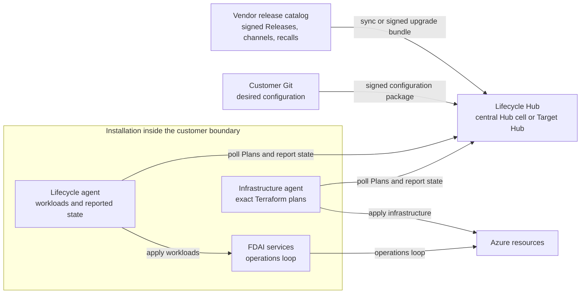

# Hub-Managed Lifecycle

This document defines FDAI's third installation path. A Lifecycle Hub keeps each installation on
its subscribed release channel and on the configuration that its customer approved, following the
hub-and-spoke model of Palantir Apollo. It owns the lifecycle architecture, the plan and state
loop, and the customer isolation boundary.

> **Status:** Design only. No Hub, installation agent, Lifecycle Plan, or upgrade bundle exists
> yet. The [implementation ledger](../../roadmap-implementation/deployment/hub-managed-lifecycle.md)
> tracks delivery. [ADR-0003](../architecture/decisions/0003-hub-managed-lifecycle-and-operator-governance.md)
> records the decisions.
>
> **Scope:** This path manages FDAI's own lifecycle: installation, upgrade, configuration, drift,
> and recall. It never manages customer resources, which stay with the operations loop.
> [Lifecycle Configuration](lifecycle-configuration.md) owns configuration layers and secrets, and
> [Lifecycle Releases and Channels](lifecycle-releases-and-channels.md) owns Releases, channels,
> bundles, and recall.

## Design at a glance

| Concern | Decision |
|---------|----------|
| Product versus installation | One signed Release serves every customer. An installation differs only in configuration, policy, and bindings to its own environment. |
| Hub placement | A central Hub cell per connected customer, or a Target Hub inside the customer boundary that syncs online or imports signed bundles offline |
| Desired state | No single target state. The Hub derives the target from a channel subscription, version range, configuration revision, and constraints. |
| Plan computation | The Hub computes Lifecycle Plans. Installation agents derive the maximum effect envelope locally, and a Plan can only narrow it. |
| Installation agents | A lifecycle agent inside the cluster for workloads, and an infrastructure agent on the execution host for exact Terraform plans. Neither is a pantheon agent. |
| Upgrades | Automatic inside maintenance windows. Configuration changes need an approved change request, and deleting or replacing an Azure resource needs confirmation. |
| Data boundary | The Hub holds no Azure credential, secret value, or operational data. Only lifecycle metadata crosses the boundary. |
| Records | Hub PostgreSQL per cell or Target Hub, and append-only installation receipts in Foundation storage |

## Design and critique

**Initial design:** A central control plane stores one desired state per customer, a five-layer
override stack resolves configuration, and new Deployment, Configuration, Drift, and Policy agents
run the rollout.

**Critique:**

- Apollo doesn't keep one target state per environment. A product follows a release channel and
  constraints, and the target emerges from them
  ([Apollo overview](https://www.palantir.com/docs/apollo/core/overview)).
- The pantheon is fixed. An agent that upgrades the runtime it runs on also creates a circular
  dependency.
- A central engine that renders exact plans needs every customer's Azure credentials, which
  regulated customers prohibit.
- A linear override stack lets configuration change authority, which ADR-0002 forbids.
- Offline sites can't poll a central service.

**Revised contract:** The Hub orchestrates. Signed artifacts and installation-side agents decide
what can actually change. Authority stays in policy and the promotion registry, and offline sites
run their own Target Hub.

## Apollo concepts in FDAI terms

| Apollo concept | FDAI equivalent | Difference |
|----------------|-----------------|------------|
| [Product, Release](https://www.palantir.com/docs/apollo/core/products-releases-versions) | FDAI Release: signed image digests and metadata | One product. Services aren't released separately. |
| [Release Channel](https://www.palantir.com/docs/apollo/core/release-channels) | `DEV`, `RELEASE_CANDIDATE`, `RELEASE`, and custom channels | Same model. See [Lifecycle Releases and Channels](lifecycle-releases-and-channels.md). |
| [Hub, Orchestration Engine](https://www.palantir.com/docs/apollo/core/overview) | Lifecycle Hub | Computes Plans but never renders exact infrastructure changes |
| [Environment](https://www.palantir.com/docs/apollo/core/environments) | Installation | One installation per environment. A customer can have several. |
| [Spoke Control Plane](https://www.palantir.com/docs/apollo/core/spoke-control-plane) | Lifecycle agent and infrastructure agent | Azure writes stay on the existing execution host |
| [Entity, Reported State](https://www.palantir.com/docs/apollo/core/entities) | Entity, reported state | Agents are sub-state of the Core Entity |
| [Environment Config](https://www.palantir.com/docs/apollo/managing-environments/environment-config), [config overrides](https://www.palantir.com/docs/apollo/managing-entities/set-config-overrides) | Environment Config, Entity override blocks | Authority values are excluded |
| [Change Requests](https://www.palantir.com/docs/apollo/managing-changes/change-requests) | Reviewed merge in customer Git, delivered as a signed configuration package | Git is the source of desired configuration |
| [Plans and Constraints](https://www.palantir.com/docs/apollo/core/plans-and-constraints) | Lifecycle Plans and constraints | Adds data residency and destructive-change confirmation |
| [Export and Import](https://www.palantir.com/docs/apollo/export-import/overview) | Upgrade bundle imported into a Target Hub | Configuration packages keep the customer signature |
| [Secrets](https://www.palantir.com/docs/apollo/managing-secrets/add-edit-delete-secrets) | Key Vault references only | The Hub never receives a secret value |

## Architecture

| Component | Runs in | Identity | Holds | Never holds |
|-----------|---------|----------|-------|-------------|
| Release catalog | Vendor | Vendor release key, kept offline | Signed Releases, channel membership, recalls, promotion pipelines | Customer data |
| Lifecycle Hub | Central Hub cell or Target Hub | Hub service identity. Approvers sign in with the customer's Entra ID. | Installation settings, imported configuration packages, reported state, Plans, constraint results, audit | Azure credentials, secret values, clear-text sealed values, operational data |
| Lifecycle agent | Installation AKS cluster, own namespace | Workload identity with Kubernetes rights in FDAI namespaces only | Rendered workload manifests and workload receipts | Azure write identity, executor identity |
| Infrastructure agent | Existing execution host | Existing deployment managed identity | Exact Terraform plans, Foundation state, infrastructure receipts | Executor identity, operational data |
| FDAI services | Installation | Existing service identities | Operations-loop state | Lifecycle authority |

### Hub placement

| Placement | Location | Catalog source | Operated by | Typical customer |
|-----------|----------|----------------|-------------|------------------|
| Central Hub cell | Vendor subscription, in a region agreed with the customer. Each customer gets an isolated cell with its own database and customer-managed key. | Release catalog directly | Vendor | Connected, no boundary restriction |
| Online Target Hub | Customer operations resource group | Sync from the catalog over an allowlisted outbound path | Customer | Regulated and connected |
| Offline Target Hub | Customer operations resource group | Signed upgrade bundles that an operator imports | Customer | No internet access |

A Hub cell is a per-customer isolation unit of the central Hub. It's unrelated to the streaming
cells in [Hyperscale Cell Architecture](../architecture/hyperscale-cell-architecture.md).

### Trust boundaries

- The vendor release key signs Releases, catalog metadata, recall notices, and upgrade bundles.
  [Catalog integrity](lifecycle-releases-and-channels.md#catalog-integrity) defines freshness and
  ordering.
- The customer configuration key signs configuration packages. It stays in the customer's Key
  Vault or HSM.
- Each installation holds a non-exportable installation key in its Key Vault. It proves possession
  of that key at enrollment, then uses it to unwrap sealed values and sign receipts.
- Each Hub cell or Target Hub has its own Hub key. Hub and installation keys rotate through signed
  key records, and revoking a key invalidates every Plan it signed.
- Installation agents derive the maximum effect envelope locally from the signed Release, the
  configuration package, ownership evidence, and local hard policy. A Hub Plan can only narrow it.
- Only lifecycle metadata crosses the boundary: versions, digests, coarse component health,
  constraint results, and sanitized plan summaries. Event content, resource identities, ontology
  content, audit content, secrets, credentials, and clear-text identifiers stay inside the
  installation.

## Lifecycle loop

### Desired inputs

The Hub derives each installation's target from these inputs:

- channel subscription and an optional version range;
- current configuration revision: Environment Config and Entity override blocks;
- catalog facts: Releases, channel membership, recalls, product dependencies, and schema ranges;
- constraints and the latest reported state.

The target is the newest non-recalled Release on the subscribed channel inside the version range
that passes every constraint. It deploys with the override block whose version range matches that
Release most specifically.

### Entities and reported state

| Entity kind | Examples | Managed |
|-------------|----------|---------|
| Workload | Core, Operator API, Document Ingestion API, Document Processing Worker, isolated Executor, Console, CronJobs, lifecycle agent | Yes |
| Platform | AKS cluster, PostgreSQL, Event Hubs namespace, Key Vault, container registry, storage, network | Yes |
| Unmanaged | Customer-owned API Management, private DNS zones, ITSM endpoints | Observed only |

Reported state includes the Release version, image digests, configuration digest, coarse health,
and the last Plan result. The Core Entity adds a band for each agent: running, degraded, or stopped,
with bounded consumer-lag and idle-time bands. Event content and per-event times stay inside the
installation. Platform Entities add digests of Terraform state lineage, serial, and resource
identities. As in Apollo, an Entity with settings and reported state is managed, and an Entity with
reported state only is unmanaged. Reported state is append-only and keeps event and recorded time.

### Lifecycle Plans

Plan types are install, upgrade, configuration change, recall roll-off, drift reconciliation, and
uninstall. Uninstall always needs operator confirmation. Each Plan names its installation as the
audience, the Hub key epoch, the reported-state digest it was computed from, a sequence number that
increases per installation, a fencing generation, the target Release, the configuration revision,
the Entity set, constraint results, a narrowing envelope, and an expiry. Agents durably reject a
Plan whose sequence, generation, or source-state digest is stale.

A Plan runs as a fenced sequence of phases. The infrastructure agent owns the infrastructure phase,
and the lifecycle agent owns the workload phase. A phase starts only after the previous phase's
receipt is recorded. A failure compensates completed phases in reverse order when the Release
allows it, and otherwise holds the installation for the operator.

1. An agent polls the Hub and verifies the Plan signature, audience, sequence, and generation.
2. The agent verifies the Release and configuration signatures. It rejects a Release older than
   the newest one it applied unless a vendor-signed recall allows the roll-back.
3. The infrastructure agent renders the exact Terraform plan with sealed values decrypted locally.
   The lifecycle agent renders workload manifests.
4. The agent compares the exact change with its locally derived envelope as narrowed by the Plan.
   It refuses any change outside that envelope and holds the deletion or replacement of an existing
   Azure resource for an operator confirmation bound to the same exact plan digest.
5. The agent writes a local lifecycle authorization receipt that binds the exact plan digest to the
   Plan, Release, configuration revision, and open window. That receipt stands in for the
   operator's invocation in the existing exact-plan claim, apply, and verification-only recovery
   stages. The agent reports the digest and a sanitized summary to the Hub.
6. Success requires healthy workloads, a second zero-change plan, and independent readback. The
   receipt is appended to Foundation storage, and the Hub records the result.

The lifecycle agent, the infrastructure agent, and a Target Hub upgrade themselves through two
slots. The new version starts beside the old one, passes health checks, and then takes over. The
old slot stays as the rollback target.

### Constraints

| Constraint | Set by | Blocks |
|------------|--------|--------|
| Maintenance window, no-downtime or downtime | Customer, in an IANA time zone with the time-zone database version pinned by the Release | Plans whose declared maximum duration doesn't fit inside the remaining window. Overlapping windows of one class merge, and the trusted UTC clock decides. |
| Suppression window | Operator, or automatic after a failure | Plans in its scope. A failure suppression doesn't block the rollback of the failed Plan. |
| Version range | Customer | Releases outside the range |
| Product dependency and schema range | Release metadata | Incompatible upgrades and roll-backs |
| Artifact availability | Installation registry | Plans whose images aren't inside the boundary |
| Override coverage | Customer | Releases without a matching override block |
| Data residency | Environment Config | Releases or model bindings that process data outside the allowed scope |
| Recall | Vendor | Proposing a recalled Release. It also triggers a roll-off. |
| Destructive change | Constitution | Deleting or replacing an existing Azure resource until confirmed |

### Failure, drift, and reconciliation

- A failed Plan places an automatic suppression window on its Entity. When failures cross a
  configured threshold, the whole installation is suppressed, as in Apollo. A rollback Plan to the
  previous Release runs when the schema range allows. Otherwise the installation holds for the
  operator.
- Lifecycle drift is a difference between reported state and the desired inputs, such as a manual
  change to a Deployment or Terraform refresh drift. The Hub issues a reconciliation Plan for the
  next matching window.
- The Hub recomputes Plans when reported state, Entity settings, the configuration revision,
  channel membership, or a recall changes, and when a Plan stays blocked past a bounded threshold.

### Commands and overrides

Apollo has no runtime-override layer. Its closest concepts are suppression windows, maintenance
window overrides, and break-glass commands. FDAI keeps that split:

| Command | Who | Effect | Expiry |
|---------|-----|--------|--------|
| Suppression window | Lifecycle operator | Stops new Plans in its scope immediately | Required |
| Authority-lowering command | Installation operator | Demotes an ActionType, lowers an autonomy ceiling, or engages the kill switch immediately | Required. The operator gets notice before expiry and can extend it. |
| Break-glass command | Break-glass role with fresh authentication | Applies an emergency configuration change, such as a scale-out, or bypasses a maintenance window, suppression window, or version range | Required. At expiry, the Hub reconciles to the approved Git revision unless a merged change adopted it. |

No command raises authority. A break-glass command can bypass only maintenance windows,
suppression windows, and version ranges. It still passes signature checks, the local envelope, the
exact plan, the lock, idempotency, audit intent, recall, destructive-change confirmation, recovery,
and independent readback. The installation's own kill switch route keeps its existing behavior.

## Separation from the operations loop

- The lifecycle loop changes only resources that FDAI provably owns. Proof is a signed Foundation
  creation receipt with a matching Terraform state identity. The `fdai:managed=true` tag is only a
  discovery hint, because anyone with tag rights can set it.
- The operations loop never proposes an action that targets a proven FDAI-owned resource, and the
  risk gate denies such a target. Heimdall may still report drift on those resources as advisory
  evidence.
- Lifecycle agents never publish authority-bearing events. Saga may cite lifecycle receipts as
  evidence references only.

## Customer isolation and data residency

| Requirement | How the design meets it | How to verify |
|-------------|-------------------------|---------------|
| Data stays in Korea | Target Hub and installation in Korea Central, and the Hub stores metadata only | Azure Policy allowed locations and reported binding scope |
| No overseas endpoints | Allowlisted catalog sync, or offline bundles | Egress firewall logs and the [network matrix](network-connectivity-matrix.md) |
| Approved model endpoints only | Model-binding allowlist and a residency constraint in Environment Config | Binding validation at startup |
| PTU required | Model bindings with capacity type `ptu` | Settings model inventory |
| Isolated network | Private endpoints, and agents poll a Target Hub inside the boundary | Network matrix scenario |
| No central access to data | Target Hub inside the boundary. Even a central cell holds no operational data and only sealed identifiers. | Hub data model review and audit |

Azure model deployment types differ in where prompts are processed. Global types may use any
region, Data Zone types stay inside a zone such as Asia Pacific, and Standard or Regional
Provisioned types stay inside the resource's geography
([deployment types](https://learn.microsoft.com/en-us/azure/foundry/foundry-models/concepts/deployment-types)).
In-country processing with PTU therefore needs Regional Provisioned, which isn't offered for every
model.

### If a Hub is compromised

A compromised Hub can delay upgrades or withhold Plans. It can't widen the effect envelope, forge a
Release or configuration package, replay a Plan to another installation, read sealed values, or
obtain an Azure credential. Agents refuse a version roll-back without a vendor-signed recall, and
expired catalog metadata lowers authority as described in
[Catalog integrity](lifecycle-releases-and-channels.md#catalog-integrity). A compromised cell can't
affect another customer's cell, because each cell has its own key, database, and customer-managed
key.

### Vendor support

Support staff see only the metadata of central cells. A Target Hub's records stay with the
customer unless the customer exports a sanitized support bundle. Access to an installation uses a
time-bound role that the customer grants in its own tenant. The Hub grants none.

## Enrollment and migration

1. An operator creates the Foundation with their own sign-in, as in the other paths, or starts
   from an existing installation. An offline site installs its Target Hub and first Release from
   the signed offline package.
2. The operator installs the lifecycle agent and infrastructure agent from a signed Release.
3. The installation proves possession of its installation key to the Hub, and a customer approver
   accepts the enrollment.
4. Entities start unmanaged. An Entity becomes managed only after its ownership is proven and the
   operator adds its settings.
5. The first Plan replaces any source-built images with signed images.

Today the Terraform application stage renders workloads. The Hub path moves workload rendering to
the lifecycle agent, and the Terraform stage keeps only platform resources.

## Example installations

| | Customer A | Customer B | Customer C |
|-|------------|------------|------------|
| Hub | Online or offline Target Hub in Korea Central | Central Hub cell in East US | Central Hub cell or Target Hub |
| Channel | `RELEASE`, or a custom channel with manual promotion | `RELEASE_CANDIDATE` | `RELEASE` with range `>=1.4.0 <1.5.0` |
| Windows | Weekly downtime window and nightly no-downtime window | Daily windows | As agreed |
| Model | Regional Provisioned PTU on approved endpoints | Standard pay-as-you-go | Self-hosted model reachable from Azure through API Management |
| Governance | Policy holds every state change for approval | Single-operator production profile with operator-promoted actions and standing authorization | Per-execution approval |

[Lifecycle Configuration](lifecycle-configuration.md#examples) shows the configuration for these
installations. Customer C's on-premises runtime and local model need separate approval and an ADR.

## Hub data model

| Table | Key | Purpose | Time fields | Mutability |
|-------|-----|---------|-------------|------------|
| `installation` | `installation_id` | Enrollment, Hub placement, channel, version range, windows | `enrolled_at`, `recorded_at` | Revisioned |
| `entity` | `installation_id`, `entity_id` | Kind, managed flag, settings revision | `effective_from`, `recorded_at` | Revisioned |
| `entity_reported_state` | `installation_id`, `entity_id`, `observed_at` | Version, digests, health, agent sub-state | `observed_at`, `recorded_at` | Append-only |
| `lifecycle_plan` | `plan_id` | Type, target Release, configuration revision, envelope, expiry | `created_at`, `issued_at`, `expires_at` | Status changes in `lifecycle_plan_event` |
| `plan_constraint_result` | `plan_id`, `constraint` | Result and reason | `evaluated_at` | Append-only |
| `plan_execution_report` | `plan_id`, `attempt` | Exact plan digest, sanitized summary, outcome | `reported_at` | Append-only |
| `lifecycle_command` | `command_id` | Suppression, lowering, or break-glass command with scope and actor | `starts_at`, `expires_at`, `recorded_at` | Revocable |
| `hub_audit` | `sequence` | Hash-chained record of every Hub change | `recorded_at` | Append-only |

Release tables belong to [Lifecycle Releases and Channels](lifecycle-releases-and-channels.md), and
configuration tables belong to [Lifecycle Configuration](lifecycle-configuration.md).

## Honest limits

- Nothing in this document is implemented yet.
- Moving workload rendering out of Terraform needs its own migration design.
- The dual-slot self-upgrade of agents and Target Hubs needs its own failure analysis.
- How entitlement reaches a Hub-managed installation is an open question. A Hub upgrade never
  renews a Trial.
- Offline installations receive recalls only when an operator imports the next bundle.
- The Hub path supports AKS only, and on-premises runtimes are out of scope.

## Related docs

| To learn about | Read |
|----------------|------|
| Decision record | [ADR-0003](../architecture/decisions/0003-hub-managed-lifecycle-and-operator-governance.md) |
| Configuration layers, packages, and secrets | [Lifecycle Configuration](lifecycle-configuration.md) |
| Releases, channels, bundles, and recall | [Lifecycle Releases and Channels](lifecycle-releases-and-channels.md) |
| Approval profiles and policy administration | [Operator Governance Profiles](../decisioning/operator-governance-profiles.md) |
| Existing installation paths | [One-Command Source Deployment](source-deployment.md), [Disconnected Deployment](disconnected-deployment.md) |
| Exact-plan apply and recovery | [Installable Deployment CLI](installable-deployment-cli.md) |
| Delivery status and remaining work | [Implementation ledger](../../roadmap-implementation/deployment/hub-managed-lifecycle.md) |
